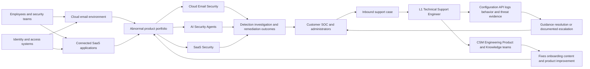
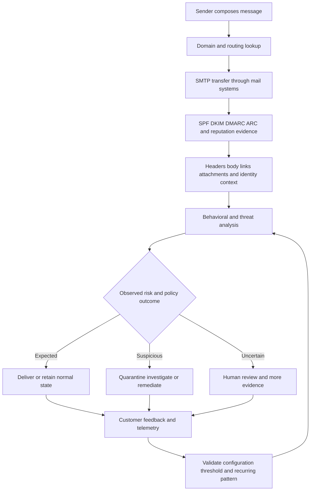
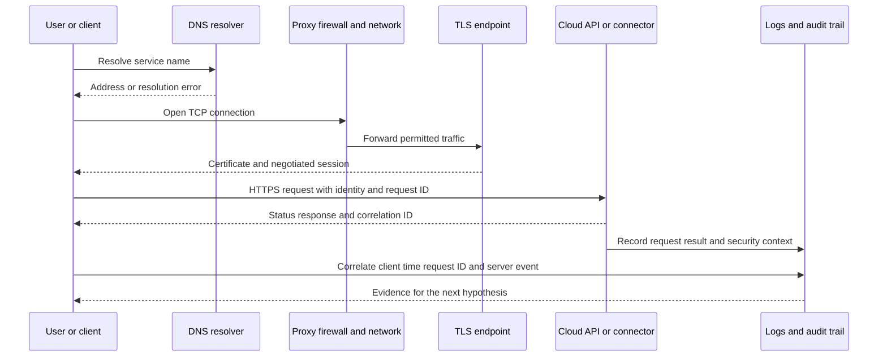
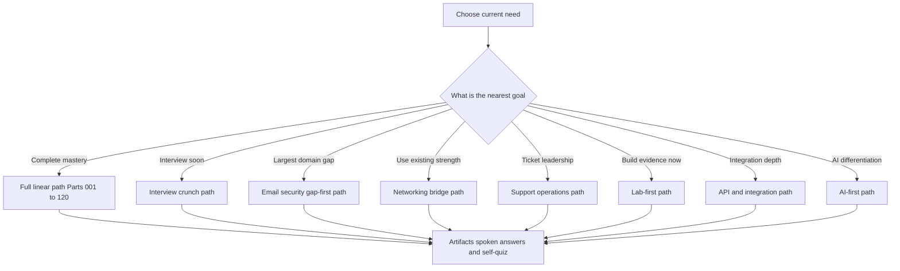

# Abnormal AI Technical Support Engineer - Complete Study Guide

> **Mode:** Interview preparation  
> **Teaching approach:** Beginner-first, no page or size limit, diagram-rich, and scenario/lab driven  
> **Currency date:** August 24, 2026  
> **Generation state:** Curriculum confirmed. Parts 001-120 are generated and marked Done. Appendices A-L are optional planned supplements and remain Not started.

This guide is designed for **your transition from enterprise support into an Abnormal AI enterprise L1 Technical Support Engineer role** supporting **Cloud Email Security, AI Security Agents, and SaaS Security**. Its goal is practical interview readiness: for any likely question, do not go blank; explain the fundamentals, connect them to evidence, troubleshoot methodically, communicate clearly, and remain honest about what was done in production versus learned or simulated.

> **How to use this guide:** It is written for **any** candidate preparing for this role. The background map below describes a *typical* starting profile, not one person's CV, and every model answer is a template. Replace the bracketed details, metrics, employers, products, and examples with evidence from your own CV before you use them, and never claim experience you cannot defend.

No future lesson may imply production use of Abnormal AI or any ecosystem that is only a learning target. All hands-on work will use free, safe, public, trial-appropriate, synthetic, or local simulations and will produce inspectable artifacts.

## How to Use This Confirmation Index

1. Review the learning paths, diagrams, JD coverage, and all 120 Part titles.
2. Confirm the curriculum or request changes before lesson generation.
3. After confirmation, request one Part at a time. Each Part will be created at its linked path under `prep/` and its tracker status will be updated.
4. Appendices will also be created only when explicitly requested.
5. Treat reading as the knowledge layer; complete labs, say answers aloud, and adapt STAR stories to establish interview readiness.

## Candidate Background and Honest-Gap Map

### Assumed Starting Background

| Evidence area | Candidate evidence from your CV | Natural advantage for this role | Boundary to preserve |
|---|---|---|---|
| Enterprise support | Several years in enterprise customer-facing support and escalation | Familiarity with ownership, ambiguity, service impact, escalation pressure, and enterprise expectations | Do not convert prior product scope into security-vendor production experience |
| Microsoft cloud | SharePoint Online, OneDrive, Sync Client, and Copilot support | Strong bridge to Microsoft 365 tenancy, identity, client/cloud boundaries, configuration, and service evidence | Do not claim Exchange Online security operations unless separately demonstrated in a lab |
| Critical investigations | critical situations, complex investigations, Engineering/Product escalation, and fix validation | Strong base for threat-case structure, hypothesis testing, escalation packets, and critical incident updates | Email-threat verdicts and Abnormal product behavior remain learning targets |
| Customer trust | Customer and partner communication across technical and nontechnical audiences | Direct match for timely updates, expectation management, trust, and de-escalation | Use concrete CV stories; do not invent security incidents |
| Knowledge and leadership | KB/training creation, mentoring, case-quality work | Strong base for KCS, case deflection, onboarding support, and internal enablement | Vendor-specific workflows must be described conceptually until practiced |
| Operational analytics | CSAT, backlog, and case-quality analysis | Strong base for support metrics, trend detection, dashboards, and process improvement | Avoid claiming ownership of metrics not stated in the CV |
| Networking upskilling | TCP/IP, OSI, HTTP/HTTPS, TLS/SSL, DNS/DHCP, proxies/firewalls, ports, and routing | Useful diagnostic bridge for API, connector, authentication, and endpoint-to-cloud failures | Frame as upskilling or working familiarity, not network engineering production ownership |
| Diagnostic tools | Working familiarity with Wireshark, Netsh, Microsoft Network Monitor, Procmon, browser DevTools, HAR, and Fiddler | Existing evidence-first habits transfer to SaaS support investigations | State the depth honestly and demonstrate it with repeatable labs |
| APIs and data | Working knowledge of REST APIs, Postman, cURL, JSON, SQL/PostgreSQL, Power BI, and Python | Useful for API tickets, log correlation, integration checks, and support analytics | Do not imply that these were all used at production scale |
| Identity and automation | Azure, AD/Entra fundamentals, SSO/SAML/OAuth, Power Automate/Apps | Strong conceptual bridge to SaaS provisioning, authorization, and workflow automation | Okta, SCIM, and vendor integrations remain learning/lab targets |
| AI | Copilot, Copilot Studio/agents, and GPT/LLM fundamentals | Useful bridge to behavioral AI, agent safeguards, prompting, evaluation, and human verification | Do not equate generative AI experience with Abnormal's behavioral detection internals |
| Adjacent platforms | GitHub, Confluence, Linux/Kubernetes working knowledge | Helps with collaboration, documentation, cloud concepts, and command-line labs | Production depth must be described only as supported by real examples |

### Claim-Safety Language

| Evidence tier | Meaning in this guide | Safe interview language | Examples in scope |
|---|---|---|---|
| **Production experience** | Work explicitly supported by your CV | “In my prior enterprise support role, I owned...” followed by a real situation and result | SharePoint Online, OneDrive, Sync Client, Copilot, critical situations, customer/partner updates, Engineering/Product escalation, fix validation, KB/training, mentoring, CSAT/backlog/case quality |
| **Lab experience** | A repeatable simulation completed while preparing, with saved evidence | “I have not operated that platform in production; in a safe lab I demonstrated...” | Email headers, SMTP transcripts, DNS/authentication checks, REST calls, webhook receivers, packet captures, synthetic logs, Postman collections, local AI-support evaluation |
| **Learned architecture** | Concepts understood from official documentation and structured study, without hands-on or production ownership | “My current understanding from official architecture documentation is...” and then explain the flow and validation plan | Abnormal product concepts, Google Workspace, Slack, Okta, Splunk, CrowdStrike, Cortex SOAR, Zendesk, Salesforce, Jira, Zoom |
| **No direct experience** | A named gap that must never be disguised | “I have not used this directly in production yet. The closest transferable experience is..., and my ramp plan is...” | Abnormal AI, direct email-security operations, Google Workspace, Slack, Okta, Splunk, CrowdStrike, Cortex SOAR, Zendesk, Salesforce, Jira, and Zoom |

**Honesty rule:** Architecture knowledge is not operations experience; a guided lab is not production ownership; transferable skill is not tool equivalence. Every answer should identify the evidence tier when the distinction matters.

## Mastery Outcomes

By completing the curriculum, labs, spoken practice, and portfolio artifacts, the candidate should be able to:

1. Explain Abnormal AI's mission, portfolio, customer value, and the L1 Technical Support Engineer's place in the customer journey.
2. Distinguish Cloud Email Security, AI Security Agents, and SaaS Security use cases without inventing undocumented product behavior.
3. Draw a vendor-neutral architecture showing identity, email, SaaS, API, telemetry, detection, remediation, and support boundaries.
4. Apply CIA, risk, control, zero-trust, least-privilege, shared-responsibility, privacy, and evidence-handling principles to support decisions.
5. Explain SOC, SIEM, SOAR, XDR, EDR, MITRE ATT&CK, and incident-response concepts in plain language.
6. Read an email's envelope, headers, MIME structure, message IDs, threading fields, timestamps, links, and attachments.
7. Trace SMTP/ESMTP delivery and reason about gateways, connectors, forwarding, journaling, quarantine, remediation, NDRs, and bounces.
8. Diagnose SPF, DKIM, DMARC, alignment, ARC, BIMI, reputation, blocklist, and DNS-record issues using public or synthetic evidence.
9. Compare Microsoft 365 Exchange Online and Google Workspace mail-flow concepts while labeling production versus learned knowledge honestly.
10. Investigate phishing, BEC, vendor fraud, account takeover, impersonation, malicious content, OAuth abuse, compromised internal accounts, and exfiltration scenarios.
11. Separate false positives from false negatives, preserve evidence, build a timeline, form competing hypotheses, and recommend proportionate next actions.
12. Explain behavioral baselines, anomaly signals, training versus inference, features, drift, precision, recall, thresholds, confidence, and explainability.
13. Discuss AI-agent safeguards, prompt injection, hallucination, privacy, bias, adversarial behavior, evaluation, and human verification.
14. Explain SaaS tenancy, RBAC, provisioning, SSO, SAML, OAuth/OIDC, SCIM, tokens, scopes, audit logs, and webhooks.
15. Describe learning/lab architectures and troubleshooting plans for Microsoft 365, Google Workspace, Slack, Okta, Splunk, CrowdStrike, Cortex SOAR, and Zoom.
16. Trace endpoint-to-cloud connectivity across OSI/TCP-IP, IP, routing, NAT, DNS, TCP, TLS, HTTP, proxy, firewall, VPN, and load-balancer boundaries.
17. Use safe workflows with Wireshark, tcpdump, Netsh, Microsoft Network Monitor, Procmon, DevTools, HAR, Fiddler, curl, Postman, PowerShell, Linux utilities, OpenSSL, and DNS/path tools.
18. Troubleshoot REST/JSON integrations, authentication, pagination, filtering, rate limits, retries, backoff, idempotency, webhooks, versioning, and SDK behavior.
19. Correlate timestamps, time zones, request/message IDs, structured logs, stack traces, audit events, browser evidence, packet evidence, and customer observations.
20. Own an L1 ticket from intake through reproduction, severity assessment, updates, escalation, resolution, closure, and knowledge capture.
21. Produce decision trees, escalation packets, bug reports, feature requests, RCA insights, 5 Whys, fishbones, postmortems, runbooks, and known-error records.
22. Navigate Zendesk, Salesforce, Jira, and Confluence concepts without claiming unearned production use.
23. Write precise customer updates, handle difficult conversations, translate for executives, troubleshoot remotely, and support onboarding with CSMs.
24. Use CSAT, CES, FCR, MTTA, MTTR, SLA attainment, reopen, escalation, deflection, backlog aging, and quality metrics to improve support.
25. Apply safe AI-assisted support prompting, retrieval, automation, privacy controls, evaluation, and human approval.
26. Present a portfolio of lab artifacts and answer recruiter, hiring-manager, technical-panel, troubleshooting, behavioral, and closing questions with honest evidence.

## Five Orientation Diagrams

### 1. End-to-End Abnormal Support and Product Ecosystem

### 2. Inbound Email and Security Decision Path

### 3. Connectivity and Request Evidence Path

### 4. Support Case Lifecycle

```mermaid
flowchart LR
    Intake["Intake and acknowledge"] --> Scope["Scope impact urgency environment and change"]
    Scope --> Preserve["Preserve and redact evidence"]
    Preserve --> Reproduce["Reproduce or establish expected behavior"]
    Reproduce --> Hypotheses["Rank testable hypotheses"]
    Hypotheses --> Test["Run lowest-risk discriminating tests"]
    Test --> Decision{"Resolved at L1"}
    Decision -->|Yes| Explain["Explain fix recommendation and prevention"]
    Decision -->|No| Escalate["Escalate with complete evidence and asks"]
    Escalate --> Collaborate["Engineering or Product collaboration"]
    Collaborate --> Validate["Validate fix workaround or product decision"]
    Explain --> Close["Confirm outcome close and capture knowledge"]
    Validate --> Close
    Close --> Improve["Trend review KB case deflection and feedback"]
```

### 5. Learning-Path Router

## Learning Paths

Part ranges are inclusive. Within any compressed route, Part 001's honesty framework, Part 005's data-handling rules, and Part 009's lab-safety rules remain mandatory.

| Path | Recommended sequence | Best for | Exit proof |
|---|---|---|---|
| **Full linear** | 001-120 in order, then Appendices A-L as needed | Complete beginner-first mastery | All completion checklists, labs, capstones, spoken answers, and portfolio review |
| **Interview crunch** | 001-002, 011-018, 019-020, 025-029, 034-047, 048-058, 066-070, 083-099, 100-116, 119-120 | A near-term interview requiring broad answer coverage | Role map, product architecture, email-auth worksheet, threat drill, case narrative, and timed mock |
| **Email-security gap-first** | 003-009, 019-047, 048-058, 066-067, 092-099, 117-120 | Closing the largest stated domain gap without overstating experience | Header investigation, authentication verdict, threat timeline, false-positive analysis, and remediation recommendation |
| **Networking bridge** | 001, 071-082, 083-099, 019-033, 117, 119-120 | Turning existing networking upskilling into a support advantage | Layered connectivity matrix, capture analysis, TLS/API evidence pack, and endpoint-to-cloud walkthrough |
| **Support operations** | 001-010, 100-116, 011-018, 092-099, 117, 119-120 | Emphasizing several years of enterprise support and leadership | Case plan, escalation packet, postmortem, KB article, metrics dashboard, onboarding plan, and STAR set |
| **Lab-first** | 009, 019-033, 071-099, 117, then concept gaps 003-008 and 034-070, then 100-120 | Learning by producing evidence before deeper theory | Reproducible local/public lab repository with redacted captures, commands, timelines, and conclusions |
| **API and integration** | 059-070, 071-082, 083-099, 014-018, 103-107, 113-119 | API, connector, identity, and ecosystem ticket confidence | Postman collection, webhook receiver, OAuth scope map, retry design, integration runbook, and escalation packet |
| **AI-first** | 003-008, 011-018, 034-058, 092-099, 116-120 | Differentiating on behavioral AI and safe AI-assisted support | Detection reasoning map, metric/threshold exercise, model-drift response, agent threat model, and AI-support evaluation card |

## Supplied JD Coverage Matrix

This matrix accounts for every role expectation, qualification, product, named ecosystem, tool/process signal, and culture signal supplied for this guide. “Proof artifact” means a tangible output to create later, not a claim that it exists today.

| JD signal | Parts | Tangible proof artifact |
|---|---:|---|
| Enterprise L1 Technical Support Engineer role | 001-002, 018, 099-105 | L1 ownership checklist and end-to-end case narrative |
| Abnormal AI mission and customer value | 011, 017 | Mission-to-customer-outcome one-pager |
| Cloud Email Security | 012, 014, 019-047 | Vendor-neutral cloud email security architecture and threat-case workbook |
| AI Security Agents | 012, 015, 058, 116, 118 | AI-agent safeguard and human-approval threat model |
| SaaS Security | 012, 016, 059-070 | SaaS risk, identity, and integration control map |
| Architecture and deployment models | 013-018, 059, 066-070 | Deployment/data-flow diagram with trust boundaries |
| Shared responsibility | 004, 013, 017-018 | Customer-vendor responsibility matrix |
| Customer personas and use cases | 010, 017-018, 108-112 | Persona, pain-point, and communication map |
| Four or more years of customer-facing enterprise support | 001-002, 108-115, 120 | CV-grounded competency matrix and STAR evidence inventory |
| Complex investigations | 046, 071-099, 101, 117 | Hypothesis ledger, correlated timeline, and capstone investigation packet |
| Customer trust | 002, 108-112, 120 | Trust-preserving update sequence and de-escalation script |
| Clear technical communication | 108, 110, 112-113 | Technical case summary and reproducible engineering escalation |
| Clear nontechnical communication | 108-109, 112, 120 | Executive summary with impact, risk, decision, and next step |
| Own inbound configuration tickets | 018, 059, 066-070, 099-103 | Configuration-drift troubleshooting tree |
| Own inbound API questions | 083-091, 099-103 | Postman/curl evidence pack and API triage runbook |
| Own behavioral false-positive cases | 045, 048-057, 099 | False-positive analysis with precision/recall and threshold reasoning |
| Own threat investigations | 034-047, 092-099, 117 | Preserved-evidence threat timeline and verdict rationale |
| Send timely updates | 100, 102, 108-109 | Time-boxed update templates for normal and critical cases |
| Provide RCA insights | 097, 105, 113 | 5 Whys, fishbone, causal/contributing-factor analysis |
| Provide recommendations | 047, 099, 105, 108, 117 | Prioritized immediate, corrective, and preventive recommendations |
| Collaborate with Engineering | 104-105, 113 | Minimal reproducible case, logs, expected/actual result, and explicit ask |
| Collaborate with Product | 107, 113, 115 | Feature/request brief backed by recurring case evidence |
| Write postmortems | 105, 113 | Blameless postmortem with timeline, causes, actions, and owners |
| Assist onboarding with CSMs | 018, 111-112 | Joint onboarding and success-handoff plan |
| Create internal KB content | 107, 112 | Internal troubleshooting article with decision tree and escalation criteria |
| Create external KB content | 107-108, 112 | Customer-safe how-to article with redaction and validation steps |
| Drive case deflection | 107, 114-115 | Deflection hypothesis, content intervention, and measurement plan |
| Detect recurring support patterns | 096-097, 107, 114-115 | Tagged-case trend analysis and Pareto chart specification |
| Influence product improvements | 107, 113-115 | Voice-of-Customer evidence brief with impact and proposed change |
| Email security ecosystem | 019-047 | Email-flow map, authentication worksheet, and threat-investigation pack |
| Enterprise SaaS ecosystem | 059-070 | Tenant, role, identity, API, webhook, and audit-log map |
| Microsoft 365 | 031, 066 | Exchange Online conceptual flow and Microsoft integration lab plan |
| Google Workspace | 032, 067 | Official-doc architecture brief and synthetic mail-flow lab |
| Slack | 068 | Slack integration architecture and permission-scope worksheet |
| Okta | 060, 069 | Okta identity-flow and troubleshooting worksheet |
| Splunk | 006, 070, 096 | Conceptual SIEM ingestion/search map and synthetic query exercise |
| CrowdStrike | 006, 070 | EDR/XDR integration and alert-enrichment architecture map |
| Cortex SOAR | 006, 070 | SOAR playbook sequence and failure-point checklist |
| REST APIs | 065, 083-091 | Versioned Postman collection, curl transcript, and resilient client design |
| Zoom | 068, 110-111 | Remote-support/onboarding workflow and integration learning brief |
| Zendesk | 106 | Conceptual case workflow, fields, macros, and hygiene checklist |
| Salesforce | 106, 111 | Conceptual customer/account context and support handoff workflow |
| Jira | 104, 106, 113 | High-quality bug and feature-request templates |
| Confluence | 106-107, 113 | Decision log, runbook, and KB information architecture |
| AI support tools | 116 | Safe AI-assisted case workflow with approval gates |
| Prompting | 058, 116 | Prompt/evaluation card with privacy rules and human verification |
| Continuous learning | 001, 009, 118-120 | Gap ledger, official-source log, deliberate-practice tracker, and ramp plan |
| Support-process improvement | 107, 114-116 | Baseline, experiment, guardrail metrics, and review cadence |
| Case quality and hygiene | 100-107, 114-115 | Case-quality rubric and sample audited case |
| Security mindset and privacy | 003-009, 057-058, 098, 116 | Data-minimization/redaction checklist and safe evidence package |
| Cross-functional culture | 002, 104, 111-116, 120 | Stakeholder map, decision log, and collaboration STAR story |
| Customer focus and empathy | 002, 108-112, 120 | Empathy-to-action communication examples grounded in real experience |

## Curriculum Tracker: 120 Parts

### Part A - Role Foundations and Security Thinking

| # | Part | What it covers and why it matters | Primary practice or proof | Status |
|---:|---|---|---|---|
| 001 | [Part 001 - Role Compass and Honest Candidate Story](prep/Part-001-role-compass-and-honest-candidate-story.md) | Maps the role, interview stages, candidate strengths, evidence tiers, gaps, and a truthful transition narrative so every later answer has a stable foundation. | Role-fit matrix, 90-second introduction, and claim-safety ledger | Done |
| 002 | [Part 002 - Enterprise Support Ownership and Customer Trust](prep/Part-002-enterprise-support-ownership-and-customer-trust.md) | Defines enterprise L1 ownership, customer trust, accountability, urgency, and technical/nontechnical communication through Microsoft-support transfer examples. | Ownership principles and CV-grounded trust story | Done |
| 003 | [Part 003 - Security Fundamentals CIA Risk and Controls](prep/Part-003-security-fundamentals-cia-risk-and-controls.md) | Builds confidentiality, integrity, availability, assets, threats, vulnerabilities, likelihood, impact, risk, and preventive/detective/corrective controls from zero. | Risk register and control-classification worksheet | Done |
| 004 | [Part 004 - Zero Trust Least Privilege and Shared Responsibility](prep/Part-004-zero-trust-least-privilege-and-shared-responsibility.md) | Explains verify-explicitly, least privilege, assume breach, trust boundaries, and customer/vendor/cloud responsibility for defensible support guidance. | Shared-responsibility and trust-boundary matrix | Done |
| 005 | [Part 005 - Privacy Data Handling and Evidence Ethics](prep/Part-005-privacy-data-handling-and-evidence-ethics.md) | Covers data minimization, classification, retention, access, consent, secure transfer, redaction, chain of custody, and ethical evidence use. | Redaction checklist and evidence-handling plan | Done |
| 006 | [Part 006 - SOC SIEM SOAR XDR and EDR Basics](prep/Part-006-soc-siem-soar-xdr-and-edr-basics.md) | Places support within a Security Operations Center and distinguishes event aggregation, orchestration, endpoint detection, and cross-domain detection concepts. | SOC toolchain map and plain-English comparison table | Done |
| 007 | [Part 007 - MITRE ATTACK and Threat Modeling](prep/Part-007-mitre-attack-and-threat-modeling.md) | Introduces tactics, techniques, procedures, attack paths, assets, actors, and mitigations for structured security reasoning without turning ATT&CK into a checklist. | Threat model and ATT&CK mapping exercise | Done |
| 008 | [Part 008 - Incident Response Lifecycle](prep/Part-008-incident-response-lifecycle.md) | Covers preparation, detection, analysis, containment, eradication, recovery, lessons learned, ownership, and evidence-preserving decisions. | Incident timeline and phase-specific action card | Done |
| 009 | [Part 009 - Safe Support Lab Environment](prep/Part-009-safe-support-lab-environment.md) | Defines local/public/synthetic lab boundaries, test data, secret handling, cleanup, reproducibility, and how to avoid implying production platform use. | Lab charter, safety checklist, and artifact folder design | Done |
| 010 | [Part 010 - Security Support Vocabulary Personas and System Maps](prep/Part-010-security-support-vocabulary-personas-and-system-maps.md) | Establishes core vocabulary and maps administrators, analysts, responders, CSMs, Engineering, Product, executives, end users, and their evidence needs. | Persona-to-question and system-context map | Done |

### Part B - Abnormal AI Company Product and Support Context

| # | Part | What it covers and why it matters | Primary practice or proof | Status |
|---:|---|---|---|---|
| 011 | [Part 011 - Abnormal AI Mission Market and Customer Outcomes](prep/Part-011-abnormal-ai-mission-market-and-customer-outcomes.md) | Studies the mission, problem space, enterprise customer outcomes, public positioning, and market context using current official sources without speculative claims. | Mission-to-outcome one-pager with dated source notes | Done |
| 012 | [Part 012 - Portfolio Map Cloud Email Security AI Security Agents and SaaS Security](prep/Part-012-portfolio-map-cloud-email-security-ai-security-agents-and-saas-security.md) | Differentiates the three named portfolio areas, their high-level jobs, intersections, and likely support surfaces based on official information. | Portfolio comparison and use-case routing table | Done |
| 013 | [Part 013 - Platform Architecture Deployment Models and Data Flows](prep/Part-013-platform-architecture-deployment-models-and-data-flows.md) | Builds a vendor-neutral model of cloud deployment, control/data planes, integrations, permissions, telemetry, policy, and trust boundaries, then labels verified vendor facts. | Architecture diagram and verified-versus-assumed ledger | Done |
| 014 | [Part 014 - Cloud Email Security Architecture and Detection Flow](prep/Part-014-cloud-email-security-architecture-and-detection-flow.md) | Connects mail flow, identity, behavioral context, analysis, verdicts, remediation, and customer feedback to configuration and threat tickets. | Email-security decision map and support touchpoint list | Done |
| 015 | [Part 015 - AI Security Agents Workflows and Safeguards](prep/Part-015-ai-security-agents-workflows-and-safeguards.md) | Explains agent goals, tools, permissions, planning, execution, approval, observability, failure containment, and support evidence at a vendor-neutral level. | Agent workflow threat model and approval-gate design | Done |
| 016 | [Part 016 - SaaS Security Architecture and Risk Surfaces](prep/Part-016-saas-security-architecture-and-risk-surfaces.md) | Maps SaaS identities, applications, privileges, configurations, data access, audit events, risky behavior, and remediation boundaries. | SaaS risk-surface and control map | Done |
| 017 | [Part 017 - Customer Personas Use Cases and Shared Responsibility](prep/Part-017-customer-personas-use-cases-and-shared-responsibility.md) | Translates product value and responsibility across SOC analysts, email admins, identity teams, SaaS owners, executives, and end users. | Persona use-case and responsibility matrix | Done |
| 018 | [Part 018 - Product Support Scenarios Onboarding and Boundaries](prep/Part-018-product-support-scenarios-onboarding-and-boundaries.md) | Frames configuration, API, behavioral verdict, threat, onboarding, adoption, entitlement, and product-defect scenarios and where L1 should act or escalate. | Scenario classifier and L1 boundary decision tree | Done |

### Part C - Email and Mail-Flow Fundamentals

| # | Part | What it covers and why it matters | Primary practice or proof | Status |
|---:|---|---|---|---|
| 019 | [Part 019 - Email Ecosystem Anatomy and Actors](prep/Part-019-email-ecosystem-anatomy-and-actors.md) | Defines senders, recipients, clients, submission agents, transfer agents, delivery agents, mailboxes, gateways, filters, directories, and DNS dependencies. | End-to-end email actor map | Done |
| 020 | [Part 020 - RFC Style Message Structure Envelope and Headers](prep/Part-020-rfc-style-message-structure-envelope-and-headers.md) | Separates SMTP envelope from visible message headers/body and explains RFC-style syntax, folding, fields, and why apparent sender details can differ. | Annotated synthetic raw message | Done |
| 021 | [Part 021 - SMTP and ESMTP Conversation](prep/Part-021-smtp-and-esmtp-conversation.md) | Walks connection, greeting, EHLO capabilities, MAIL FROM, RCPT TO, DATA, response classes, relay, STARTTLS, and delivery responsibility. | Safe SMTP transcript annotation and state diagram | Done |
| 022 | [Part 022 - MIME Bodies Attachments and Encodings](prep/Part-022-mime-bodies-attachments-and-encodings.md) | Explains multipart boundaries, content types, transfer encodings, character sets, inline content, attachments, and deceptive file/content combinations. | MIME tree and attachment-risk worksheet | Done |
| 023 | [Part 023 - Headers Message IDs Threading and Timestamps](prep/Part-023-headers-message-ids-threading-and-timestamps.md) | Reads Received chains, Message-ID, In-Reply-To, References, Date, Return-Path, authentication results, and time-zone ordering. | Header timeline and thread-correlation exercise | Done |
| 024 | [Part 024 - Email DNS MX TXT CNAME and PTR](prep/Part-024-email-dns-mx-txt-cname-and-ptr.md) | Connects authoritative DNS, MX preference, TXT policies, aliases, reverse DNS, caching, TTL, delegation, and lookup failures to delivery and reputation. | Public-domain DNS evidence worksheet | Done |
| 025 | [Part 025 - SPF Sender Authorization](prep/Part-025-spf-sender-authorization.md) | Explains SPF identity, mechanisms, qualifiers, includes, redirects, lookup limits, forwarding breaks, temperror/permerror, and practical validation. | SPF evaluation trace using synthetic records | Done |
| 026 | [Part 026 - DKIM Message Signing](prep/Part-026-dkim-message-signing.md) | Explains selectors, public keys, canonicalization, signed headers, body hashes, verification results, rotation, and what a valid signature does not prove. | DKIM field annotation and verification plan | Done |
| 027 | [Part 027 - DMARC Alignment Policy and Reporting](prep/Part-027-dmarc-alignment-policy-and-reporting.md) | Connects SPF/DKIM identifiers to relaxed/strict alignment, policy, subdomain policy, percentages, aggregate/forensic reporting, and rollout safety. | DMARC decision worksheet and staged rollout plan | Done |
| 028 | [Part 028 - ARC Forwarding and Authentication Preservation](prep/Part-028-arc-forwarding-and-authentication-preservation.md) | Explains why intermediaries alter messages, how ARC records authentication history, trust limitations, mailing-list behavior, and forwarding diagnosis. | Forwarding failure and ARC-chain analysis | Done |
| 029 | [Part 029 - BIMI Reputation and Blocklists](prep/Part-029-bimi-reputation-and-blocklists.md) | Covers BIMI prerequisites at a high level, sender/IP/domain reputation, complaint and engagement signals, blocklists, delisting evidence, and causation limits. | Reputation evidence and safe-response checklist | Done |
| 030 | [Part 030 - Mail Routing Gateways Connectors and Journaling](prep/Part-030-mail-routing-gateways-connectors-and-journaling.md) | Maps inbound/outbound routes, smart hosts, connectors, secure gateways, transport rules, loops, dual delivery, journaling, and observability gaps. | Mail-flow topology and loop-diagnosis tree | Done |
| 031 | [Part 031 - Microsoft 365 Exchange Online Mail Flow](prep/Part-031-microsoft-365-exchange-online-mail-flow.md) | Builds on Microsoft cloud experience to study accepted domains, connectors, transport, protection, tracing, quarantine, remediation, and admin evidence. | Exchange Online conceptual flow and lab plan | Done |
| 032 | [Part 032 - Google Workspace Mail Flow Learning Lab](prep/Part-032-google-workspace-mail-flow-learning-lab.md) | Studies Gmail routing, admin controls, authentication, investigation evidence, quarantine concepts, and differences from Microsoft as learned architecture only. | Official-doc comparison and synthetic Google-style routing case | Done |
| 033 | [Part 033 - Delivery Quarantine Remediation NDRs and Bounces](prep/Part-033-delivery-quarantine-remediation-ndrs-and-bounces.md) | Distinguishes acceptance from inbox placement, temporary/permanent failures, enhanced status codes, NDRs, bounces, quarantine, post-delivery remediation, and recovery. | Delivery-state decision tree and NDR annotation | Done |

### Part D - Email Threats and Investigations

| # | Part | What it covers and why it matters | Primary practice or proof | Status |
|---:|---|---|---|---|
| 034 | [Part 034 - Email Threat Taxonomy and Investigation Mindset](prep/Part-034-email-threat-taxonomy-and-investigation-mindset.md) | Organizes social engineering, identity abuse, malicious content, fraud, compromise, unwanted mail, and data loss while separating observation from inference. | Threat taxonomy and evidence-versus-inference table | Done |
| 035 | [Part 035 - Phishing Spear Phishing and Executive Impersonation](prep/Part-035-phishing-spear-phishing-and-executive-impersonation.md) | Compares broad phishing, targeted spear phishing, whaling, display-name impersonation, pretexting, urgency, and contextual indicators. | Synthetic message triage and user guidance | Done |
| 036 | [Part 036 - BEC Vendor and Payment Fraud](prep/Part-036-bec-vendor-and-payment-fraud.md) | Examines business email compromise, invoice diversion, payroll and gift-card fraud, vendor thread hijacking, out-of-band verification, and loss prevention. | BEC case timeline and containment recommendation | Done |
| 037 | [Part 037 - Credential Phishing Malicious Links and QR Phishing](prep/Part-037-credential-phishing-malicious-links-and-qr-phishing.md) | Covers lure-to-site chains, URL obfuscation, redirects, credential capture, QR codes, safe URL analysis, and identity follow-up without visiting dangerous content. | Defanged URL chain and response playbook | Done |
| 038 | [Part 038 - Malicious Attachments Malware and Ransomware](prep/Part-038-malicious-attachments-malware-and-ransomware.md) | Introduces file types, macros, archives, scripts, payload stages, sandbox concepts, malware versus ransomware, indicators, and safe escalation boundaries. | Attachment triage rubric using harmless samples | Done |
| 039 | [Part 039 - Account Takeover and Compromised Internal Accounts](prep/Part-039-account-takeover-and-compromised-internal-accounts.md) | Connects credential theft, session/token abuse, MFA manipulation, mailbox rules, impossible behavior, internal trust, containment, and identity evidence. | Account-takeover evidence and action matrix | Done |
| 040 | [Part 040 - Domain Spoofing Lookalikes and Impersonation](prep/Part-040-domain-spoofing-lookalikes-and-impersonation.md) | Distinguishes direct spoofing, cousin/lookalike domains, Unicode confusables, display names, reply-to mismatch, domain age, and reputation signals. | Domain-comparison and impersonation worksheet | Done |
| 041 | [Part 041 - OAuth Consent Attacks and Token Abuse](prep/Part-041-oauth-consent-attacks-and-token-abuse.md) | Explains malicious app consent, scopes, refresh tokens, persistence, audit evidence, revocation, user impact, and why password reset alone may be insufficient. | Consent-attack sequence and containment checklist | Done |
| 042 | [Part 042 - Supply Chain Vendor and SaaS Risk](prep/Part-042-supply-chain-vendor-and-saas-risk.md) | Covers trusted-relationship abuse, compromised vendors, third-party applications, delegated access, blast radius, dependency evidence, and coordinated response. | Third-party risk and communication map | Done |
| 043 | [Part 043 - Grey Mail Spam and Bulk Email](prep/Part-043-grey-mail-spam-and-bulk-email.md) | Separates malicious email from spam, wanted subscriptions, unwanted bulk mail, policy disagreement, user preference, reputation, and deliverability tradeoffs. | Classification and customer-expectation matrix | Done |
| 044 | [Part 044 - Data Exfiltration and Sensitive Content](prep/Part-044-data-exfiltration-and-sensitive-content.md) | Introduces outbound risk, sensitive-data context, authorized versus suspicious transfer, insider indicators, privacy constraints, and evidence-minimizing escalation. | Synthetic exfiltration triage and control map | Done |
| 045 | [Part 045 - False Positives False Negatives and Tuning](prep/Part-045-false-positives-false-negatives-and-tuning.md) | Defines both error types, business cost, labels, expected behavior, policy/configuration effects, thresholds, feedback, exceptions, and safe tuning tradeoffs. | Behavioral-verdict investigation and tuning memo | Done |
| 046 | [Part 046 - Threat Investigation Evidence Preservation and Timelines](prep/Part-046-threat-investigation-evidence-preservation-and-timelines.md) | Builds a repeatable investigation across raw message, authentication, identity, URL/file, telemetry, user report, timestamps, scope, and chain of custody. | Redacted evidence package and correlated timeline | Done |
| 047 | [Part 047 - Threat Response Quarantine Remediation and Recovery](prep/Part-047-threat-response-quarantine-remediation-and-recovery.md) | Converts findings into containment, message removal, account/session actions, notification, recovery, monitoring, prevention, and proportionate recommendations. | Immediate-to-preventive response plan | Done |

### Part E - Behavioral AI Data and Safe Agents

| # | Part | What it covers and why it matters | Primary practice or proof | Status |
|---:|---|---|---|---|
| 048 | [Part 048 - AI and Machine Learning Foundations](prep/Part-048-ai-and-machine-learning-foundations.md) | Defines AI, machine learning, supervised/unsupervised learning, labels, training, validation, inference, generalization, and the limits of public product knowledge. | Concept map and training-versus-inference walkthrough | Done |
| 049 | [Part 049 - Identity and Entity Behavioral Baselines](prep/Part-049-identity-and-entity-behavioral-baselines.md) | Explains how normal behavior for a person, account, domain, vendor, or application can provide context for anomalous activity. | Synthetic identity-baseline profile | Done |
| 050 | [Part 050 - Relationship and Communication Baselines](prep/Part-050-relationship-and-communication-baselines.md) | Models who communicates with whom, frequency, direction, topic/style metadata, new relationships, and why context can outperform isolated indicators. | Relationship graph and anomaly narrative | Done |
| 051 | [Part 051 - Feature Engineering and Anomaly Signals](prep/Part-051-feature-engineering-and-anomaly-signals.md) | Defines raw data, features, categorical/numeric/temporal signals, leakage, aggregation, rarity, combinations, missing data, and support-visible symptoms. | Feature table for a synthetic BEC case | Done |
| 052 | [Part 052 - Precision Recall and the Confusion Matrix](prep/Part-052-precision-recall-and-the-confusion-matrix.md) | Derives true/false positives/negatives, precision, recall, specificity, prevalence, and why accuracy alone can mislead in rare-event security. | Hand-calculated confusion matrix and business interpretation | Done |
| 053 | [Part 053 - Thresholds Confidence and Calibration](prep/Part-053-thresholds-confidence-and-calibration.md) | Connects scores, decision thresholds, confidence, calibration, base rates, cost tradeoffs, and policy layers to customer-reported outcomes. | Threshold tradeoff worksheet and recommendation | Done |
| 054 | [Part 054 - Explainability and Human Review](prep/Part-054-explainability-and-human-review.md) | Distinguishes explanation from proof, uses contributing signals responsibly, avoids exposing unsupported internals, and designs effective analyst review. | Customer-safe verdict explanation and review checklist | Done |
| 055 | [Part 055 - Model Drift Monitoring and Feedback Loops](prep/Part-055-model-drift-monitoring-and-feedback-loops.md) | Covers data/concept drift, seasonality, cold starts, behavior changes, label quality, monitoring, retraining concepts, and support pattern escalation. | Drift hypothesis and monitoring response plan | Done |
| 056 | [Part 056 - Adversarial Behavior Evasion and Robustness](prep/Part-056-adversarial-behavior-evasion-and-robustness.md) | Introduces adaptive attackers, feature manipulation, poisoning/evasion concepts, layered controls, uncertainty, and safe disclosure/escalation. | Adversarial threat model and defense-in-depth map | Done |
| 057 | [Part 057 - AI Privacy Bias and Responsible Use](prep/Part-057-ai-privacy-bias-and-responsible-use.md) | Examines minimization, purpose, access, retention, representativeness, unfair impact, transparency, governance, and customer-safe discussion. | Responsible-AI risk and mitigation register | Done |
| 058 | [Part 058 - AI Agent Safeguards Prompt Injection and Hallucination](prep/Part-058-ai-agent-safeguards-prompt-injection-and-hallucination.md) | Covers tool permissions, untrusted content, prompt injection, hallucination, grounding, retrieval, validation, evaluation, approval, logging, and fail-safe behavior. | Agent threat model and validation test suite | Done |

### Part F - SaaS Cloud Identity and Ecosystem Integrations

| # | Part | What it covers and why it matters | Primary practice or proof | Status |
|---:|---|---|---|---|
| 059 | [Part 059 - SaaS Tenancy Configuration RBAC and Provisioning](prep/Part-059-saas-tenancy-configuration-rbac-and-provisioning.md) | Defines tenants, organizations, environments, configuration inheritance, role-based access, admin boundaries, provisioning, drift, and change evidence. | Tenant/RBAC map and configuration-drift case | Done |
| 060 | [Part 060 - Directories Entra and Okta Concepts](prep/Part-060-directories-entra-and-okta-concepts.md) | Builds from AD/Entra fundamentals to identities, groups, applications, service principals, directory boundaries, and Okta architecture as a learning target. | Entra-to-Okta concept comparison and identity-flow map | Done |
| 061 | [Part 061 - SSO and SAML](prep/Part-061-sso-and-saml.md) | Explains identity/service providers, assertions, metadata, certificates, identifiers, bindings, claims, clock skew, and common sign-in failures. | Annotated synthetic SAML flow and troubleshooting tree | Done |
| 062 | [Part 062 - OAuth and OpenID Connect](prep/Part-062-oauth-and-openid-connect.md) | Separates authorization from authentication and covers actors, flows, consent, codes, PKCE, access/ID/refresh tokens, redirect URIs, and failure modes. | OAuth/OIDC sequence and error matrix | Done |
| 063 | [Part 063 - SCIM Identity Lifecycle](prep/Part-063-scim-identity-lifecycle.md) | Explains user/group provisioning, schemas, create/update/deactivate, source of truth, reconciliation, eventual consistency, and deprovisioning risk. | SCIM lifecycle and failed-provisioning case | Done |
| 064 | [Part 064 - Tokens Scopes Secrets and Sessions](prep/Part-064-tokens-scopes-secrets-and-sessions.md) | Covers bearer risk, least-privilege scopes, storage, rotation, expiration, revocation, service identities, cookies, sessions, and safe evidence handling. | Credential-lifecycle and scope-review checklist | Done |
| 065 | [Part 065 - Audit Logs Webhooks and Integration Permissions](prep/Part-065-audit-logs-webhooks-and-integration-permissions.md) | Connects administrative and user events, delivery subscriptions, application grants, permissions, retention, integrity, and observable integration state. | Permission-to-event evidence map | Done |
| 066 | [Part 066 - Microsoft 365 Integration Architecture and Troubleshooting](prep/Part-066-microsoft-365-integration-architecture-and-troubleshooting.md) | Uses Microsoft cloud strengths to reason about tenant consent, identity, mail/security data, permissions, service health, audit evidence, and connector symptoms. | Microsoft integration troubleshooting matrix | Done |
| 067 | [Part 067 - Google Workspace Integration Learning Lab](prep/Part-067-google-workspace-integration-learning-lab.md) | Studies admin roles, OAuth applications, Gmail/audit concepts, permissions, logs, and integration troubleshooting through official docs and simulations only. | Google Workspace architecture brief and synthetic failure lab | Done |
| 068 | [Part 068 - Slack and Zoom Integration Learning Lab](prep/Part-068-slack-and-zoom-integration-learning-lab.md) | Studies workspace/account models, applications, scopes, events, audit/admin evidence, webhooks, rate limits, and support/onboarding touchpoints as learning areas. | Slack/Zoom comparison and simulated webhook/permission case | Done |
| 069 | [Part 069 - Okta Integration Learning Lab](prep/Part-069-okta-integration-learning-lab.md) | Applies SSO, OIDC, SCIM, roles, logs, application assignment, network/policy context, and troubleshooting to an Okta learning architecture. | Okta sign-in/provisioning evidence worksheet | Done |
| 070 | [Part 070 - Splunk CrowdStrike and Cortex SOAR Integration Lab](prep/Part-070-splunk-crowdstrike-and-cortex-soar-integration-lab.md) | Maps SIEM ingestion/search, EDR/XDR alert context, and SOAR playbooks, authentication, schemas, permissions, and failures without claiming platform production use. | Synthetic alert-enrichment and response-playbook package | Done |

### Part G - Networking and Endpoint-to-Cloud Connectivity

| # | Part | What it covers and why it matters | Primary practice or proof | Status |
|---:|---|---|---|---|
| 071 | [Part 071 - OSI and TCP IP Troubleshooting Bridge](prep/Part-071-osi-and-tcp-ip-troubleshooting-bridge.md) | Turns existing upskilling into a practical layered model spanning application, transport, internet, link, encapsulation, ownership, and evidence. | Layer-to-symptom-to-tool matrix | Done |
| 072 | [Part 072 - IPv4 IPv6 Subnetting Routing and NAT](prep/Part-072-ipv4-ipv6-subnetting-routing-and-nat.md) | Covers addresses, prefixes, subnets, gateways, route selection, private/public space, NAT, IPv6 differences, and path/asymmetry symptoms. | Addressing/routing worksheet and path diagram | Done |
| 073 | [Part 073 - DNS and DHCP Troubleshooting](prep/Part-073-dns-and-dhcp-troubleshooting.md) | Explains recursive/authoritative resolution, caching, TTL, record types, split DNS, DHCP leases/options, and how name/address configuration fails. | nslookup/dig/Resolve-DnsName evidence comparison | Done |
| 074 | [Part 074 - TCP UDP Sockets Ports and Connection State](prep/Part-074-tcp-udp-sockets-ports-and-connection-state.md) | Defines sockets, client/server ports, three-way handshake, sequence/acknowledgment, teardown, reset, timeout, UDP behavior, and state interpretation. | Packet-level connection narrative | Done |
| 075 | [Part 075 - TLS SSL Certificates SNI and Mutual TLS](prep/Part-075-tls-ssl-certificates-sni-and-mutual-tls.md) | Covers handshake goals, certificate chains, names, trust stores, validity, revocation, SNI, protocol/cipher negotiation, interception, and mTLS. | OpenSSL certificate-chain and failure worksheet | Done |
| 076 | [Part 076 - HTTP and HTTPS Methods Status Headers and State](prep/Part-076-http-and-https-methods-status-headers-and-state.md) | Explains requests/responses, methods, status classes, headers, content types, compression, cookies, caching, redirects, CORS, and authentication clues. | Annotated HTTP exchange and status triage table | Done |
| 077 | [Part 077 - Proxies Firewalls VPNs and Load Balancers](prep/Part-077-proxies-firewalls-vpns-and-load-balancers.md) | Maps forward/reverse proxies, allowlists, TLS inspection, egress controls, VPN routes, load balancing, health checks, affinity, and boundary ownership. | Middlebox hypothesis tree and configuration checklist | Done |
| 078 | [Part 078 - Latency Loss Retransmission and MTU](prep/Part-078-latency-loss-retransmission-and-mtu.md) | Distinguishes latency, jitter, packet loss, retransmission, congestion, timeout, fragmentation, MTU/path-MTU symptoms, and application impact. | Capture metrics and performance diagnosis | Done |
| 079 | [Part 079 - Endpoint-to-Cloud Layered Troubleshooting](prep/Part-079-endpoint-to-cloud-layered-troubleshooting.md) | Combines local process, identity, DNS, route, TCP, TLS, HTTP, proxy, API, and server evidence into an efficient outside-in/inside-out method. | End-to-end decision tree and evidence matrix | Done |
| 080 | [Part 080 - Wireshark tcpdump and Network Monitor](prep/Part-080-wireshark-tcpdump-and-network-monitor.md) | Practices capture scope, interfaces, filters, conversations, TCP analysis, TLS metadata, safe collection, and Microsoft Network Monitor familiarity. | Redacted local capture and packet walkthrough | Done |
| 081 | [Part 081 - Netsh Procmon Test NetConnection and PowerShell](prep/Part-081-netsh-procmon-test-netconnection-and-powershell.md) | Uses Windows-native network traces, process/file/registry observation, `Test-NetConnection` connectivity probes, and PowerShell evidence while controlling collection scope. | Windows diagnostic command/evidence pack | Done |
| 082 | [Part 082 - DevTools HAR Fiddler Linux OpenSSL and Path Tools](prep/Part-082-devtools-har-fiddler-linux-openssl-and-path-tools.md) | Combines browser DevTools, HAR, Fiddler, curl, Linux utilities, OpenSSL, traceroute/tracert, DNS tools, and redaction for request-path diagnosis. | Cross-tool request correlation lab | Done |

### Part H - REST APIs Webhooks and Integration Design

| # | Part | What it covers and why it matters | Primary practice or proof | Status |
|---:|---|---|---|---|
| 083 | [Part 083 - REST APIs JSON and CRUD](prep/Part-083-rest-apis-json-and-crud.md) | Defines resources, endpoints, representations, JSON objects/arrays/types, CRUD, methods, status codes, headers, statelessness, and contracts. | Hand-built request/response and JSON validation | Done |
| 084 | [Part 084 - API Authentication Keys OAuth and Tokens](prep/Part-084-api-authentication-keys-oauth-and-tokens.md) | Compares API keys, basic concepts, bearer tokens, OAuth grants, scopes, expiration, rotation, secret storage, and 401-versus-403 diagnosis. | Authentication decision table and failure lab | Done |
| 085 | [Part 085 - Postman curl and PowerShell API Practice](prep/Part-085-postman-curl-and-powershell-api-practice.md) | Builds reproducible requests, variables, environments, headers, bodies, tests, exports, curl verbosity, and PowerShell equivalents against safe public/local APIs. | Versioned Postman collection and command transcript | Done |
| 086 | [Part 086 - Pagination Filtering Sorting and Schemas](prep/Part-086-pagination-filtering-sorting-and-schemas.md) | Covers offset/cursor pagination, filters, sorting, field selection, validation, optional/null fields, schema evolution, and incomplete-result symptoms. | Paginated data retrieval script and edge-case table | Done |
| 087 | [Part 087 - Rate Limits Retries Backoff and Idempotency](prep/Part-087-rate-limits-retries-backoff-and-idempotency.md) | Explains quotas, 429 handling, Retry-After, exponential backoff with jitter, transient/permanent errors, duplicate risk, idempotency keys, and retry budgets. | Resilient request algorithm and simulated failure results | Done |
| 088 | [Part 088 - Webhooks Events Signatures and Replay Safety](prep/Part-088-webhooks-events-signatures-and-replay-safety.md) | Covers event producers/consumers, endpoints, signatures, secrets, timestamps, retries, ordering, duplicates, acknowledgments, dead letters, and replay protection. | Local webhook receiver and delivery-failure timeline | Done |
| 089 | [Part 089 - API Errors Versioning SDKs and Contracts](prep/Part-089-api-errors-versioning-sdks-and-contracts.md) | Interprets structured errors, validation details, correlation IDs, breaking/nonbreaking changes, deprecation, SDK abstraction, and raw-request fallback. | API error catalog and version-migration checklist | Done |
| 090 | [Part 090 - API Troubleshooting and Evidence Correlation](prep/Part-090-api-troubleshooting-and-evidence-correlation.md) | Correlates client time, DNS/TLS/HTTP, sanitized request, response, identity, tenant, request ID, server log, retries, and expected contract. | Complete redacted API escalation packet | Done |
| 091 | [Part 091 - Resilient Security Integration Design](prep/Part-091-resilient-security-integration-design.md) | Designs least-privilege, observable, retry-safe, version-aware integrations among email, identity, SaaS, SIEM, EDR, SOAR, and support workflows. | Integration architecture and failure-mode review | Done |

### Part I - Logs Evidence and Tool-Based Troubleshooting

| # | Part | What it covers and why it matters | Primary practice or proof | Status |
|---:|---|---|---|---|
| 092 | [Part 092 - Logging Fundamentals Structured Events and Stack Traces](prep/Part-092-logging-fundamentals-structured-events-and-stack-traces.md) | Defines events, levels, fields, structured/unstructured logs, stack traces, exceptions, sampling, retention, and observation-versus-cause. | Log anatomy and stack-trace reading exercise | Done |
| 093 | [Part 093 - Timestamps Time Zones IDs and Correlation](prep/Part-093-timestamps-time-zones-ids-and-correlation.md) | Normalizes UTC/local time, clock skew, precision, event/request/message/trace IDs, parent-child relationships, and cross-system ordering. | Multi-source normalized timeline | Done |
| 094 | [Part 094 - Windows Linux Process and Network Logs](prep/Part-094-windows-linux-process-and-network-logs.md) | Introduces Windows event/process evidence, Linux journal/text logs, service/process state, network events, permissions, rotation, and collection scope. | Synthetic cross-OS incident evidence pack | Done |
| 095 | [Part 095 - Browser Cloud Audit and Security Logs](prep/Part-095-browser-cloud-audit-and-security-logs.md) | Combines browser console/network evidence, HAR, cloud admin/audit events, sign-ins, email traces, detections, and remediation records. | Browser-to-cloud event correlation | Done |
| 096 | [Part 096 - Querying Filtering Timelines SQL and Splunk Concepts](prep/Part-096-querying-filtering-timelines-sql-and-splunk-concepts.md) | Applies search, field extraction, Boolean logic, aggregation, joins, windows, baselines, SQL, and Splunk-style concepts to synthetic support data. | Query workbook and recurring-pattern timeline | Done |
| 097 | [Part 097 - Hypothesis Testing and Evidence Correlation](prep/Part-097-hypothesis-testing-and-evidence-correlation.md) | Turns symptoms into falsifiable hypotheses, discriminating tests, expected observations, confidence updates, causal restraint, and next-best actions. | Competing-hypothesis ledger | Done |
| 098 | [Part 098 - Safe Evidence Collection Redaction and Packaging](prep/Part-098-safe-evidence-collection-redaction-and-packaging.md) | Defines minimum necessary collection, authorization, secrets/PII/content redaction, integrity, naming, manifests, secure transfer, retention, and deletion. | Redacted evidence bundle with manifest | Done |
| 099 | [Part 099 - End-to-End Support Troubleshooting Trees](prep/Part-099-end-to-end-support-troubleshooting-trees.md) | Integrates configuration, connectivity, identity, API, behavioral false positive, email delivery, and threat-investigation paths into L1 decision trees. | Multi-scenario troubleshooting runbook | Done |

### Part J - Support Operations Case Ownership and Knowledge

| # | Part | What it covers and why it matters | Primary practice or proof | Status |
|---:|---|---|---|---|
| 100 | [Part 100 - L1 Ticket Lifecycle and Case Ownership](prep/Part-100-l1-ticket-lifecycle-and-case-ownership.md) | Covers acknowledgment, ownership, action plans, cadence, notes, dependencies, follow-through, resolution confirmation, closure, and knowledge capture. | Case-lifecycle checklist and sample case journal | Done |
| 101 | [Part 101 - Intake Scoping Reproduction and Environment](prep/Part-101-intake-scoping-reproduction-and-environment.md) | Elicits symptom, expected/actual result, timeline, scope, impact, tenant/user/message/request IDs, changes, reproducibility, and minimum evidence. | High-signal intake questionnaire and repro plan | Done |
| 102 | [Part 102 - Severity Priority Impact SLAs and SLOs](prep/Part-102-severity-priority-impact-slas-and-slos.md) | Distinguishes customer impact, urgency, severity, priority, SLA, SLO, response/restoration/resolution targets, and ethical escalation. | Severity scenarios and update-cadence matrix | Done |
| 103 | [Part 103 - Incident Problem Request Known Error and Runbook](prep/Part-103-incident-problem-request-known-error-and-runbook.md) | Separates service restoration, underlying-cause management, standard requests, known errors, workarounds, and executable runbooks. | Work-item classifier and known-error/runbook entry | Done |
| 104 | [Part 104 - Escalation Handoffs Swarming and Critical Incidents](prep/Part-104-escalation-handoffs-swarming-and-critical-incidents.md) | Defines escalation criteria, attempted tests, evidence quality, ownership during handoff, swarming, role clarity, critical-situation transfer, and critical cadence. | Engineering escalation packet and swarm map | Done |
| 105 | [Part 105 - RCA Five Whys Fishbone and Postmortems](prep/Part-105-rca-five-whys-fishbone-and-postmortems.md) | Distinguishes root cause from trigger/contributor, applies 5 Whys and fishbone carefully, and writes blameless postmortems with owned actions. | RCA comparison and complete postmortem | Done |
| 106 | [Part 106 - Zendesk Salesforce Jira and Confluence Workflows](prep/Part-106-zendesk-salesforce-jira-and-confluence-workflows.md) | Maps conceptual ticketing, CRM context, engineering work tracking, documentation, fields, queues, links, permissions, hygiene, and decision logs as learning targets. | Cross-tool workflow and case-hygiene rubric | Done |
| 107 | [Part 107 - KCS KB Deflection Trends and Voice of Customer](prep/Part-107-kcs-kb-deflection-trends-and-voice-of-customer.md) | Covers knowledge-centered support, internal/external articles, findability, reuse, deflection, case tagging, recurring patterns, Pareto analysis, and product feedback. | KB article, trend brief, and deflection measurement plan | Done |

### Part K - Customer Communication Onboarding and Trust

| # | Part | What it covers and why it matters | Primary practice or proof | Status |
|---:|---|---|---|---|
| 108 | [Part 108 - Customer Updates Empathy and Expectation Management](prep/Part-108-customer-updates-empathy-and-expectation-management.md) | Creates concise updates with acknowledgment, impact, completed work, findings, next action, owner, time, uncertainty, recommendation, and empathy without filler. | First response, progress update, and resolution message set | Done |
| 109 | [Part 109 - Difficult Conversations De-Escalation and Executive Translation](prep/Part-109-difficult-conversations-de-escalation-and-executive-translation.md) | Handles frustration, missed expectations, no-fault-found, product limitations, security uncertainty, bad news, global communication, and executive summaries. | De-escalation role-play and executive incident brief | Done |
| 110 | [Part 110 - Remote Troubleshooting and Zoom Session Practice](prep/Part-110-remote-troubleshooting-and-zoom-session-practice.md) | Plans consent, agenda, roles, screen sharing, safe collection, narration, checkpoints, timeboxing, decision logs, follow-up, and Zoom as a learning tool. | Remote-session facilitation script and notes template | Done |
| 111 | [Part 111 - Onboarding with CSMs Success Handoffs and Training](prep/Part-111-onboarding-with-csms-success-handoffs-and-training.md) | Aligns technical readiness, goals, stakeholders, dependencies, integrations, validation, adoption, risk, training, CSM partnership, and post-launch ownership. | 30-day onboarding and success-handoff plan | Done |
| 112 | [Part 112 - Trust Building Communication Artifact Workshop](prep/Part-112-trust-building-communication-artifact-workshop.md) | Integrates customer, executive, CSM, Engineering, Product, and KB writing into audience-specific artifacts grounded in the same evidence. | Multi-audience communication portfolio | Done |

### Part L - Engineering Product Metrics and AI-Assisted Improvement

| # | Part | What it covers and why it matters | Primary practice or proof | Status |
|---:|---|---|---|---|
| 113 | [Part 113 - Engineering and Product Collaboration](prep/Part-113-engineering-and-product-collaboration.md) | Produces defect escalations, minimal repros, expected/actual behavior, fix validation, regression checks, feature requests, decision logs, and customer follow-through. | Bug report, validation plan, and product evidence brief | Done |
| 114 | [Part 114 - Support Metrics Dashboards SQL and Analytics](prep/Part-114-support-metrics-dashboards-sql-and-analytics.md) | Defines CSAT, CES, FCR, MTTA, MTTR, SLA attainment, reopen rate, escalation rate, deflection rate, backlog aging, quality, segmentation, and metric gaming risks. | Metric dictionary, SQL analysis, and dashboard wireframe | Done |
| 115 | [Part 115 - Process Improvement Experiments and Operational Quality](prep/Part-115-process-improvement-experiments-and-operational-quality.md) | Turns patterns into problem statements, baselines, hypotheses, interventions, guardrails, experiments, reviews, standard work, and continuous-learning loops. | Process-improvement experiment and quality audit | Done |
| 116 | [Part 116 - Safe AI-Assisted Support Prompting and Automation](prep/Part-116-safe-ai-assisted-support-prompting-and-automation.md) | Designs privacy-aware prompting, knowledge retrieval, citation checks, draft generation, summarization, classification, automation, evaluation, human verification, and ethical controls. | AI-support workflow, prompt set, and evaluation scorecard | Done |

### Part M - Hands-On Labs and Capstones

| # | Part | What it covers and why it matters | Primary practice or proof | Status |
|---:|---|---|---|---|
| 117 | [Part 117 - Safe Lab Portfolio and End-to-End Capstones](prep/Part-117-safe-lab-portfolio-and-end-to-end-capstones.md) | Runs free/safe/public/local simulations for email headers/authentication, DNS/TLS/HTTP, packet/HAR evidence, REST/webhooks, logs, false positives, threat timelines, L1 cases, onboarding, RCA, KB, metrics, and AI support; no production-platform claims. | Versioned portfolio with reproducible instructions, sanitized evidence, findings, recommendations, and honest-experience labels | Done |

### Part N - Miscellaneous Advanced and Current Topics

| # | Part | What it covers and why it matters | Primary practice or proof | Status |
|---:|---|---|---|---|
| 118 | [Part 118 - Advanced Topics Competitive Context Standards and Current Trends](prep/Part-118-advanced-topics-competitive-context-standards-and-current-trends.md) | Surveys evolving BEC, identity-centric attacks, secure email architecture, agentic security, API ecosystems, privacy/AI governance, standards changes, competitive categories, and current official sources as of study time. | Dated trends brief, standards map, and evidence-based comparison framework | Done |

### Part O - Final Interview Question Bank

| # | Part | What it covers and why it matters | Primary practice or proof | Status |
|---:|---|---|---|---|
| 119 | [Part 119 - Final 200 Plus Question Bank and Troubleshooting Drills](prep/Part-119-final-200-plus-question-bank-and-troubleshooting-drills.md) | Provides at least 200 questions, with the current target set at 240 core questions: approximately 20% basic, 20% intermediate, and 60% advanced/scenario. It includes a separately indexed troubleshooting-drill section plus behavioral/STAR, recruiter, hiring-manager, technical-panel, and closing sets. Every item gets a concise model answer or hint, a backlink to its full Part, difficulty/round tags, and a self-quiz tracker. | Scored question tracker, timed drills, gap heatmap, and answer recording plan | Done |

### Part P - Behavioral Closing and Interview Execution

| # | Part | What it covers and why it matters | Primary practice or proof | Status |
|---:|---|---|---|---|
| 120 | [Part 120 - Behavioral STAR Closing and Interview Readiness](prep/Part-120-behavioral-star-closing-and-interview-readiness.md) | Builds truthful STAR stories, background-to-competency mapping, why-this-move/company/role/you answers, recruiter/hiring-manager/panel strategy, smart questions, closing, mock practice, and night-before review. | STAR story bank, spoken mock scorecard, closing scripts, and readiness checklist | Done |

## Appendices A-L

These are exactly the twelve planned Appendices. None will be generated before confirmation or explicit advancement.

| Appendix | Linked future file | Coverage | Primary practice or proof | Status |
|---|---|---|---|---|
| A | [Appendix A - Glossary and Acronyms](prep/Appendix-A-glossary-and-acronyms.md) | Beginner-first glossary, expansions, plain meanings, why each term matters, and memory hooks | Searchable terminology and acronym recall sheet | Done |
| B | [Appendix B - Protocol Port and Error Code Cheat Sheets](prep/Appendix-B-protocol-port-and-error-code-cheat-sheets.md) | Common ports, protocol layers, SMTP/HTTP/TLS/DNS status and enhanced error families, with context cautions | Layer, port, status, and error lookup sheet | Done |
| C | [Appendix C - Email Header and Authentication Cheat Sheet](prep/Appendix-C-email-header-and-authentication-cheat-sheet.md) | Envelope/header fields, Received ordering, IDs, SPF, DKIM, DMARC, alignment, ARC, BIMI, and quick checks | Timed email-header and authentication worksheet | Done |
| D | [Appendix D - Command and Tool Cookbook](prep/Appendix-D-command-and-tool-cookbook.md) | Safe commands and workflows for network, DNS, TLS, HTTP, API, browser, packet, process, and log evidence | Tested command and expected-output cookbook | Done |
| E | [Appendix E - Escalation RCA and Postmortem Templates](prep/Appendix-E-escalation-rca-and-postmortem-templates.md) | Engineering escalation, critical handoff, 5 Whys, fishbone, causal analysis, action items, and postmortem templates | Reusable escalation and RCA document pack | Done |
| F | [Appendix F - Customer Communication Templates](prep/Appendix-F-customer-communication-templates.md) | Intake, first response, updates, evidence requests, critical cadence, limitation, workaround, resolution, closure, and executive summary | Audience-specific customer message library | Done |
| G | [Appendix G - API and JSON Examples](prep/Appendix-G-api-and-json-examples.md) | Requests, responses, authentication, pagination, filtering, error bodies, retries, idempotency, webhooks, and versioning examples | Annotated request, response, and failure examples | Done |
| H | [Appendix H - Security Framework Maps](prep/Appendix-H-security-framework-maps.md) | CIA, zero trust, NIST/CISA concepts, MITRE ATT&CK, incident response, SOC tools, controls, and shared responsibility | Cross-framework concept and control map | Done |
| I | [Appendix I - Lab Safety Evidence and Redaction](prep/Appendix-I-lab-safety-evidence-and-redaction.md) | Authorized scope, harmless data, secrets/PII/content redaction, safe public services, artifact manifests, storage, retention, and cleanup | Lab authorization and evidence-redaction checklist | Done |
| J | [Appendix J - Source Bibliography and Current Official Docs](prep/Appendix-J-source-bibliography-and-current-official-docs.md) | Dated official-source bibliography, standards/RFC anchors, vendor documentation map, currency review, and claim verification | Dated source and claim-verification ledger | Done |
| K | [Appendix K - 30 60 90 Day Ramp Plan](prep/Appendix-K-30-60-90-day-ramp-plan.md) | Learn, shadow, practice, own, measure, contribute, and improve milestones with honest assumptions and manager checkpoints | Role-specific ramp plan with measurable checkpoints | Done |
| L | [Appendix L - Night-Before One-Page Cheat Sheet](prep/Appendix-L-night-before-one-page-cheat-sheet.md) | Role story, product map, core email/security/API/support cues, top STAR prompts, questions to ask, and interview-day checklist | Printable one-page final review sheet | Done |

## Future-Part Quality Contract

Every future Part file must satisfy **all** of the following. A Part is not complete merely because prose exists.

| Requirement | Nonnegotiable implementation rule |
|---|---|
| Explain from zero knowledge | Assume zero knowledge and no prior experience; establish the problem and mental model before details |
| Define terms before use | Expand and explain every new term or acronym before relying on it |
| Analogies | Include concrete real-world analogies and state where each analogy stops being accurate |
| Mermaid diagrams | Include at least **4 Mermaid diagrams** that are useful, valid, and fenced, and add more when the concept benefits from them |
| Plain-English deep dives | Include at least **3 Plain-English deep-dives** headed `🔍 Plain-English deep-dive` for dense concepts |
| Tables | Include comparison and quick-reference tables that support decisions rather than repeat prose |
| Worked examples | Walk through inputs, reasoning, evidence, result, and caveats step by step |
| Troubleshooting decision tree | Include a symptom-to-hypothesis-to-test-to-observation-to-next-action tree |
| Failure modes | Cover common failures, misleading signals, edge cases, unsafe shortcuts, and escalation triggers |
| Safe lab | Use only free/safe/public/local/synthetic methods; define prerequisites, steps, expected evidence, cleanup, and a saved artifact |
| JD mapping | State which supplied role responsibilities, qualifications, products, tools, or culture signals the Part supports |
| Candidate honesty note | Label production transfer, lab evidence, learned architecture, and no-direct-experience boundaries relevant to the Part |
| Official source anchors | Prefer official sources, name the source family/document, record an access date, and separate sourced fact from inference; do not fabricate URLs |
| Interview Q&A | End with **exactly 8 Q&A entries**, each containing a likely interview question and a concise but credible model answer |
| Memory hooks | End with short recall cues suitable for a 30-second review |
| Completion checklist | Require knowledge, lab/artifact, spoken explanation, honesty check, and source check |
| Next link | Include one clear relative link to the next suggested Part or final return link |
| Encoding | Save as UTF-8; filenames remain ASCII and use the approved linked path |

## Safe Lab and Artifact Rules

- Use synthetic messages, test domains only when authorized, public DNS records, harmless files, loopback/local services, documented demo APIs, and generated logs.
- Never send phishing, scan third-party infrastructure, bypass controls, collect real customer data, expose secrets, or upload sensitive evidence to public AI/services.
- Prefer defanged indicators such as `hxxps` and reserved example domains in written exercises.
- Record prerequisites, commands, timestamps, expected results, actual results, interpretation, cleanup, and limitations.
- Redact tokens, cookies, authorization headers, personal data, message content, tenant identifiers, and internal hostnames unless harmless and synthetic.
- Every artifact must carry one evidence label: **production-transfer example**, **local/public lab**, **learned architecture**, or **template only**.
- A lab demonstrates method and learning; it does not establish production experience with Abnormal AI or another named platform.

## Artifact Portfolio Plan

| Portfolio artifact | Built primarily in | What it proves | Honest label |
|---|---:|---|---|
| Role-fit and claim-safety ledger | 001 | Self-awareness, truthful positioning, and focused ramp planning | Production-transfer plus gap map |
| Abnormal portfolio and support-surface map | 011-018 | Product research, architectural reasoning, and support boundaries | Learned architecture |
| Raw email and MIME annotation | 020-023 | Ability to inspect message evidence from first principles | Local/synthetic lab |
| DNS and email-authentication workbook | 024-029 | SPF/DKIM/DMARC/ARC/BIMI and DNS reasoning | Public/synthetic lab |
| Microsoft-versus-Google mail-flow comparison | 031-032 | Transferable Microsoft strength and explicit Google learning | Production-transfer plus learned architecture |
| Threat-investigation timeline | 034-047 | Evidence preservation, classification, scope, and recommendations | Synthetic case lab |
| False-positive and threshold memo | 045, 052-055 | Behavioral AI tradeoff reasoning and customer-safe explanation | Synthetic analysis |
| AI-agent threat model and evaluation suite | 058, 116 | Prompt-injection, hallucination, permission, privacy, and human-review safeguards | Local/synthetic lab |
| SaaS identity and provisioning failure map | 059-069 | SAML/OAuth/OIDC/SCIM/token troubleshooting | Learned architecture plus local lab |
| SIEM-EDR-SOAR enrichment workflow | 070, 091 | Integration reasoning across Splunk, CrowdStrike, and Cortex SOAR concepts | Synthetic integration lab |
| Endpoint-to-cloud evidence matrix | 071-082 | Layered networking diagnosis and tool selection | Local/public lab |
| Redacted packet/HAR/TLS evidence pack | 075, 080-082, 098 | Safe collection, correlation, interpretation, and redaction | Local lab |
| Versioned Postman/curl collection | 083-090 | REST, auth, errors, pagination, retries, and reproducibility | Public/local API lab |
| Signed webhook receiver and retry timeline | 088 | Event delivery, signatures, replay defense, duplicates, and failure analysis | Local lab |
| Multi-source normalized log timeline | 092-097 | Time normalization, IDs, queries, and hypothesis testing | Synthetic log lab |
| End-to-end L1 case and escalation packet | 099-104, 113 | Ownership, concise reproduction, evidence, handoff, and explicit asks | Synthetic case plus production-transfer method |
| Blameless postmortem and RCA comparison | 105 | Causal rigor, corrective action, and follow-through | Template plus synthetic case |
| Internal/external KB pair and deflection plan | 107, 112, 115 | KCS, audience adaptation, reuse, measurement, and improvement | Production-transfer plus new artifacts |
| Customer/CSM onboarding pack | 108-112 | Trust, executive translation, training, adoption, and handoff | Production-transfer plus template |
| Support metrics dashboard and experiment | 114-115 | CSAT/backlog strengths, SQL/analytics, quality, and process improvement | Production-transfer plus synthetic data |
| Safe AI-assisted case workflow | 116 | Prompting, retrieval, automation, privacy, evaluation, and verification | Local/synthetic lab |
| Integrated capstone portfolio | 117 | End-to-end technical, operational, communication, and honesty discipline | Mixed, labeled per artifact |
| Timed answer and mock-interview scorecard | 119-120 | Recall, structure, scenario judgment, and behavioral readiness | Practice artifact |

## Source Strategy and Currency Strategy

Future Parts will anchor claims in source families in this priority order:

1. **Official Abnormal AI sources:** current product pages, documentation available to the learner, company blog, security research/resources, trust/security material, and official role/company information.
2. **Official Microsoft sources:** Microsoft Learn and current Microsoft 365, Exchange Online, Entra, security, networking, PowerShell, browser, and support documentation.
3. **Official Google sources:** Google Workspace Admin Help, Gmail administrator/security documentation, identity/OAuth documentation, and current audit/investigation references.
4. **Standards and public authorities:** RFCs and standards bodies, NIST, CISA, MITRE ATT&CK, and other primary public security guidance.
5. **Official vendor docs and named-vendor documentation:** Slack, Okta, Splunk, CrowdStrike, Palo Alto Networks Cortex SOAR, Zoom, Zendesk, Salesforce, Jira/Atlassian, Postman, Wireshark, OpenSSL, and relevant platform documentation.
6. **Secondary sources only for explanation or comparison:** reputable technical references may clarify a concept but must not override primary documentation or establish an Abnormal-specific fact.

Each future Part must record source title/family and **access date**, distinguish stable standards from changing product behavior, and flag anything requiring revalidation after August 24, 2026. At this index stage, source families are intentionally listed without fabricated deep URLs.

## Completion and Readiness Standard

The guide is complete only when all requested Parts have content, quality-contract checks pass, required artifacts are created and reviewed, the question-bank tracker shows repeated recall, STAR stories are truthful and spoken aloud, and at least one realistic mock interview has been completed. Reading alone builds familiarity; it does not prove operational or interview fluency.

## Confirmation Checkpoint

**Current state:** The curriculum is confirmed, and Parts 001-120 are generated and marked Done. Appendices A-L remain optional planned supplements and should be generated only when explicitly advanced.
