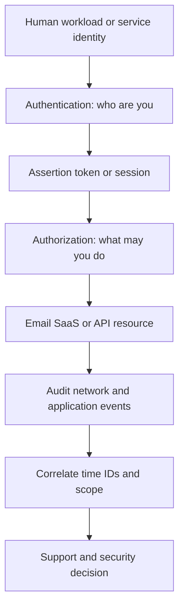
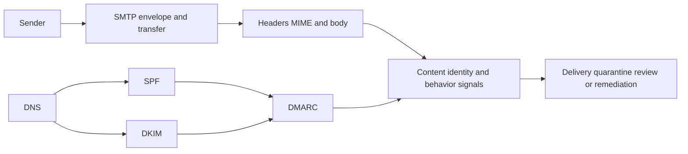

# Appendix A - Glossary and Acronyms

> **Audience:** Candidates preparing for an Abnormal AI Technical Support Engineer interview  
> **Reference date:** August 24, 2026  
> **Experience boundary:** Beginner-friendly reference based on standards, official public documentation, learned architecture, and synthetic examples. It is not evidence of production operation of Abnormal AI or adjacent learning-target platforms.

## Purpose and How to Use This Appendix

Use this appendix as a fast translation layer. Search for the exact acronym, error-domain word, or interview phrase; read the **beginner meaning** first; then follow the linked Part for the full lesson. The **common confusion** column is deliberately blunt because many interview mistakes come from treating nearby terms as synonyms.

1. During study, choose one table and explain ten terms aloud without reading the definition.
2. During a ticket exercise, use the terms only after tying them to an observation, owner, and next test.
3. During an interview, expand an acronym once, explain it in plain English, state why it matters, and avoid pretending the label proves a root cause.
4. Revalidate changing vendor, protocol, framework, and tool behavior against current official documentation.

> 🔍 **Plain-English deep-dive:** A glossary is a map legend, not the terrain. Knowing that `DKIM` means DomainKeys Identified Mail does not show that a specific message passed DKIM, which identity signed it, whether it aligned with `From`, or whether it was safe. Definitions help you ask the next precise question; evidence answers it.

## Candidate Honesty and Safety Boundary

You can truthfully connect these concepts to substantiated enterprise-support work, networking/API upskilling, and completed synthetic or local labs. You must **not** claim direct production experience with **Abnormal AI, email-security operations, Google Workspace, Slack, Okta, Splunk, CrowdStrike, Cortex SOAR, Zendesk, Salesforce, Jira, or Zoom**. Safe wording is:

> “I have not operated that platform in production. My understanding comes from official documentation and safe study or synthetic labs. My transferable production evidence is enterprise support: structured investigation, customer communication, escalation, fix validation, knowledge work, and operational improvement.”

Never paste customer data, secrets, tokens, raw unredacted headers, private product behavior, or restricted documentation into notes or interview artifacts. Do not turn a glossary definition into a product-specific claim, threat verdict, legal conclusion, or authorization to change a production control. See [Part 001 - Role Compass and Honest Candidate Story](Part-001-role-compass-and-honest-candidate-story.md), [Part 005 - Privacy Data Handling and Evidence Ethics](Part-005-privacy-data-handling-and-evidence-ethics.md), and [Part 009 - Safe Support Lab Environment](Part-009-safe-support-lab-environment.md).

## How the Concepts Fit Together

```mermaid
flowchart LR
    Asset["Asset and business outcome"] --> Risk["Threat exploits vulnerability"]
    Risk --> Control["Prevent detect correct"]
    Control --> Signal["Email identity network API and log signals"]
    Signal --> Hypothesis["Testable support hypothesis"]
    Hypothesis --> Evidence["Minimum authorized evidence"]
    Evidence --> Decision["Resolve escalate or monitor"]
    Decision --> Trust["Customer trust and learning"]
```

## Alphabetical Index

The links jump to domain tables; use editor search for the exact term. A term may belong to several domains, but it is defined once in the table where it is most useful.

| Letter | Terms in this appendix |
|---|---|
| A | AAA, acceptance criteria, access token, accuracy, ACK, ACL, actor, AD, AI, anomaly, API, API key, application log, ARC, ARP, assertion, asset, ATT&CK, audit log, authentication, Authentication-Results, authorization, ATO |
| B | backoff, backlog, baseline, bearer token, BEC, bias, BIMI, blocklist, bounce, breakpoint, broadcast, bug, bulk email |
| C | cache, calibration, canonicalization, CAPA, case, causal factor, CA, certificate, CES, change, CIDR, CIA triad, cipher suite, client, CNAME, cold start, connector, containment, content type, control, correlation ID, CORS, CRUD, CSAT, CSM, CVE, CVSS |
| D | data drift, data exfiltration, data minimization, DHCP, DKIM, DLP, DMARC, DNS, DNSSEC, domain, downtime, DSN |
| E | EDR, EHLO, encoding, endpoint, entity, envelope, ESMTP, event, evidence, false negative, false positive, FCR, feature, firewall, FN, FQDN, FP |
| F | forwarding, FQDN, fraud, full capture |
| G | gateway, generalization, grey mail, grounding |
| H | hallucination, HAR, hash, header, HELO, heuristic, HMAC, hop, HTTP, HTTPS, hypothesis |
| I | IAM, ICMP, idempotency, IdP, incident, indicator, inference, integrity, IOC, IP, IPS, IPv4, IPv6, IR, ISP |
| J | jitter, JSON, JWT |
| K | KB, KCS, key rotation, KPI |
| L | label, latency, least privilege, likelihood, LLM, log, lookalike domain, loss |
| M | MAC address, malware, MDA, MDM, MFA, MIME, ML, MSA, MTA, MTTA, MTTD, MTTR, MTU, MX |
| N | NACK, NAT, NDR, network log, neutral, NXDOMAIN |
| O | OAuth 2.0, observation, OIDC, ontology, OSI, owner |
| P | packet, pagination, pass, pcap, phishing, PII, PKCE, precision, pretexting, private IP, problem, proxy, PTR |
| Q | quarantine, QR phishing, queue |
| R | rate limit, RBAC, RBL, RCA, recall, redirect URI, refresh token, remediation, request, request ID, REST, retention, retry, risk, route, RPO, RTO, runbook |
| S | SaaS, SAML, schema, SCIM, scope, SDK, selector, severity, SIEM, signature, SLA, SLI, SLO, SMTP, SNAT, SOAR, SOC, socket, spam, spear phishing, SPF, SSO, stack trace, status code, subnet, SYN |
| T | taxonomy, TCP, tenant, threat, threshold, TLS, token, TP, traceroute, training, TTL, TTP, TXT |
| U | UDP, UEBA, URI, URL, UTC |
| V | validation, vendor fraud, verdict, vulnerability, VPN |
| W | webhook, whaling, workaround |
| X | XDR, X-headers |
| Y | YAML |
| Z | zero trust |

## 1. Security, Risk, and Incident Response

| Term | Expansion | Beginner meaning | Why it matters | Common confusion | Linked Part |
|---|---|---|---|---|---|
| AAA | Authentication, Authorization, Accounting | Confirm identity, decide permission, and record use. | Separates three failure and ownership surfaces. | Accounting here means audit records, not finance. | [Part 004](Part-004-zero-trust-least-privilege-and-shared-responsibility.md) |
| ACL | Access Control List | A list saying which identities may access an object and how. | Mis-scoped ACLs cause exposure or access failures. | An ACL is one authorization mechanism, not all RBAC. | [Part 059](Part-059-saas-tenancy-configuration-rbac-and-provisioning.md) |
| actor | Not an acronym | A person, group, service, or system that takes an action. | Keeps “who acted” separate from a username string. | Actor does not automatically mean attacker. | [Part 007](Part-007-mitre-attack-and-threat-modeling.md) |
| asset | Not an acronym | Something valuable: data, identity, service, money, or trust. | Risk starts with what can be harmed. | Asset is broader than a device. | [Part 003](Part-003-security-fundamentals-cia-risk-and-controls.md) |
| attack path | Not an acronym | A sequence an attacker could use to reach an objective. | Helps prioritize controls across steps. | It is a hypothesis until supported by evidence. | [Part 007](Part-007-mitre-attack-and-threat-modeling.md) |
| ATT&CK | Adversarial Tactics, Techniques, and Common Knowledge | MITRE’s knowledge base for describing adversary behavior. | Gives teams a shared behavior vocabulary. | It is not a product, severity scale, or complete checklist. | [Part 007](Part-007-mitre-attack-and-threat-modeling.md) |
| ATO | Account Takeover | Unauthorized control of a legitimate account. | Trusted accounts can bypass simple sender assumptions. | A suspicious message alone does not prove ATO. | [Part 039](Part-039-account-takeover-and-compromised-internal-accounts.md) |
| availability | CIA component | Systems and data are usable when needed. | Outages and destructive actions affect this goal. | Availability is not identical to performance. | [Part 003](Part-003-security-fundamentals-cia-risk-and-controls.md) |
| blast radius | Not an acronym | The potential scope of impact if something fails or is compromised. | Guides severity, containment, and testing. | Maximum possible scope is not confirmed impact. | [Part 042](Part-042-supply-chain-vendor-and-saas-risk.md) |
| CIA triad | Confidentiality, Integrity, Availability | Three basic security goals: private, correct, and usable. | A compact way to explain control purpose. | CIA here is not the government agency. | [Part 003](Part-003-security-fundamentals-cia-risk-and-controls.md) |
| confidentiality | CIA component | Only authorized parties can see information. | Drives access, encryption, and redaction. | Encryption supports confidentiality but does not guarantee authorization. | [Part 003](Part-003-security-fundamentals-cia-risk-and-controls.md) |
| containment | Incident-response phase | Limit harm and stop spread while preserving recovery options. | Security cases often need bounded immediate action. | Containment is not eradication or final root cause. | [Part 008](Part-008-incident-response-lifecycle.md) |
| control | Not an acronym | A safeguard that changes likelihood or impact. | Links risks to practical prevention, detection, or correction. | A policy statement is not proof a control operated. | [Part 003](Part-003-security-fundamentals-cia-risk-and-controls.md) |
| CVE | Common Vulnerabilities and Exposures | A public identifier for a disclosed vulnerability. | Lets teams refer to the same issue. | A CVE does not state local exposure or exploitability. | [Part 003](Part-003-security-fundamentals-cia-risk-and-controls.md) |
| CVSS | Common Vulnerability Scoring System | A framework for rating technical vulnerability severity. | Supports consistent prioritization input. | CVSS is not business impact or ticket priority. | [Part 003](Part-003-security-fundamentals-cia-risk-and-controls.md) |
| DLP | Data Loss Prevention | Controls that detect or restrict sensitive data movement. | Relevant to outbound email and SaaS data risk. | DLP is not guaranteed prevention and can produce false positives. | [Part 044](Part-044-data-exfiltration-and-sensitive-content.md) |
| EDR | Endpoint Detection and Response | Endpoint telemetry and response capabilities. | Adds device context to an investigation. | EDR is not SIEM, email security, or automatic proof. | [Part 006](Part-006-soc-siem-soar-xdr-and-edr-basics.md) |
| evidence | Not an acronym | Preserved observations used to support or disconfirm a claim. | High-quality escalation depends on reproducible evidence. | Evidence is not interpretation; keep both labeled. | [Part 098](Part-098-safe-evidence-collection-redaction-and-packaging.md) |
| exploit | Not an acronym | A method or code that uses a vulnerability. | Distinguishes weakness from actual use. | Vulnerability, exploit, and compromise are not synonyms. | [Part 003](Part-003-security-fundamentals-cia-risk-and-controls.md) |
| IOC | Indicator of Compromise | An observable that may be associated with malicious activity. | Helps search for related activity. | An IOC is a clue, not a standalone verdict. | [Part 046](Part-046-threat-investigation-evidence-preservation-and-timelines.md) |
| IPS | Intrusion Prevention System | A control that can detect and block matching network activity. | Explains one possible network enforcement point. | IPS is not the Internet Protocol Suite or guaranteed prevention. | [Part 077](Part-077-proxies-firewalls-vpns-and-load-balancers.md) |
| IR | Incident Response | Organized preparation, analysis, containment, recovery, and learning. | Connects technical facts to controlled action. | IR is broader than troubleshooting one error. | [Part 008](Part-008-incident-response-lifecycle.md) |
| integrity | CIA component | Information or systems remain accurate and unaltered without authorization. | Hashes, signatures, access controls, and audit trails support it. | Integrity does not mean secrecy. | [Part 003](Part-003-security-fundamentals-cia-risk-and-controls.md) |
| least privilege | Not an acronym | Give only the minimum access needed, for only as long as needed. | Reduces misuse and blast radius. | It does not mean “no access” or static access forever. | [Part 004](Part-004-zero-trust-least-privilege-and-shared-responsibility.md) |
| likelihood | Not an acronym | How plausible or frequent a harmful event is. | Risk combines likelihood with impact. | Likelihood is not confidence in an investigation conclusion. | [Part 003](Part-003-security-fundamentals-cia-risk-and-controls.md) |
| mitigation | Not an acronym | An action that reduces risk. | Supports proportionate recommendations. | Mitigation may reduce rather than eliminate risk. | [Part 003](Part-003-security-fundamentals-cia-risk-and-controls.md) |
| preventive control | Not an acronym | A safeguard intended to stop an event before it happens. | Clarifies control timing and purpose. | Prevention can fail; detection and correction still matter. | [Part 003](Part-003-security-fundamentals-cia-risk-and-controls.md) |
| risk | Not an acronym | Potential harm based on assets, threats, vulnerabilities, likelihood, and impact. | Keeps security decisions tied to outcomes. | Risk is not the same as a threat or vulnerability. | [Part 003](Part-003-security-fundamentals-cia-risk-and-controls.md) |
| SIEM | Security Information and Event Management | Central collection, search, and analysis of security events. | Helps correlate signals across systems. | SIEM does not itself guarantee response or truth. | [Part 006](Part-006-soc-siem-soar-xdr-and-edr-basics.md) |
| SOAR | Security Orchestration, Automation, and Response | Workflows that coordinate tools and response actions. | Explains automated enrichment and playbooks. | SOAR is not a SIEM and automation still needs safeguards. | [Part 006](Part-006-soc-siem-soar-xdr-and-edr-basics.md) |
| SOC | Security Operations Center | People and processes that monitor and respond to security risk. | A common customer persona and escalation partner. | SOC means an operating function, not only a room or tool. | [Part 006](Part-006-soc-siem-soar-xdr-and-edr-basics.md) |
| threat | Not an acronym | Something capable of causing harm. | Helps state what a control or investigation addresses. | Threat is not proof of exploitation. | [Part 003](Part-003-security-fundamentals-cia-risk-and-controls.md) |
| TTP | Tactics, Techniques, and Procedures | What adversaries want, how they act, and how they implement actions. | Supports behavior-based reasoning. | TTP is not a single IOC. | [Part 007](Part-007-mitre-attack-and-threat-modeling.md) |
| vulnerability | Not an acronym | A weakness that could be exploited. | Connects configuration or software weakness to risk. | A vulnerability does not prove compromise. | [Part 003](Part-003-security-fundamentals-cia-risk-and-controls.md) |
| XDR | Extended Detection and Response | Correlated detection/response across multiple security domains. | Provides cross-domain investigation context. | Product definitions vary; it is not automatically a replacement for SIEM. | [Part 006](Part-006-soc-siem-soar-xdr-and-edr-basics.md) |
| zero trust | Not an acronym | Verify explicitly, use least privilege, and assume breach. | Frames access decisions around current context. | It is not “trust nobody” or one product. | [Part 004](Part-004-zero-trust-least-privilege-and-shared-responsibility.md) |

## 2. Email, Delivery, and Authentication

| Term | Expansion | Beginner meaning | Why it matters | Common confusion | Linked Part |
|---|---|---|---|---|---|
| ARC | Authenticated Received Chain | Signed sets that preserve attributed authentication history through intermediaries. | Helps receivers reason about forwarding and list changes. | ARC pass is not sender safety or a universal bypass. | [Part 028](Part-028-arc-forwarding-and-authentication-preservation.md) |
| AAR | ARC-Authentication-Results | The authentication-results history recorded in one ARC set. | Shows what an intermediary claims it observed. | AAR is a signed historical claim, not the final receiver result. | [Part 028](Part-028-arc-forwarding-and-authentication-preservation.md) |
| AMS | ARC-Message-Signature | A DKIM-like signature over message content in an ARC set. | Helps detect later message changes. | AMS and ARC-Seal have different signed scope. | [Part 028](Part-028-arc-forwarding-and-authentication-preservation.md) |
| AS | ARC-Seal | Signature that links and seals an ARC chain state. | Protects chain ordering and prior ARC material. | “AS” can also mean autonomous system in networking. | [Part 028](Part-028-arc-forwarding-and-authentication-preservation.md) |
| Authentication-Results | Standard message field | A trusted receiver’s recorded authentication evaluations. | Central evidence for SPF, DKIM, DMARC, and ARC results. | It can be forged outside the trusted administrative boundary. | [Part 023](Part-023-headers-message-ids-threading-and-timestamps.md) |
| BEC | Business Email Compromise | Fraud using trusted business identities or relationships. | May use no malware and still cause major loss. | BEC is broader than spoofing and does not require mailbox compromise. | [Part 036](Part-036-bec-vendor-and-payment-fraud.md) |
| BIMI | Brand Indicators for Message Identification | A standard for eligible senders to publish a brand logo reference. | Connects authentication policy, reputation, and mailbox presentation. | BIMI is not authentication, guaranteed display, or proof of safety. | [Part 029](Part-029-bimi-reputation-and-blocklists.md) |
| blocklist | Not an acronym | A list of senders, domains, or IPs associated with unwanted behavior. | Can influence filtering and delivery. | Listing is not necessarily root cause or permanent. | [Part 029](Part-029-bimi-reputation-and-blocklists.md) |
| bounce | Not an acronym | A notice that delivery failed or could not continue. | Provides recipient, stage, and status evidence. | Bounce, NDR, and SMTP rejection overlap but are not always identical artifacts. | [Part 033](Part-033-delivery-quarantine-remediation-ndrs-and-bounces.md) |
| canonicalization | DKIM transformation rule | A defined way to normalize headers/body before hashing. | Determines which harmless formatting changes a signature tolerates. | “Relaxed” does not ignore changed words, footers, or MIME boundaries. | [Part 026](Part-026-dkim-message-signing.md) |
| content type | MIME Content-Type | A label describing media type and multipart structure. | Guides clients and investigation of attachments. | The declared type can disagree with actual bytes. | [Part 022](Part-022-mime-bodies-attachments-and-encodings.md) |
| DKIM | DomainKeys Identified Mail | A domain signs selected canonicalized message content; receivers verify via DNS key. | Provides signing-domain identity and integrity evidence. | Pass does not prove human authorship, safety, or From alignment. | [Part 026](Part-026-dkim-message-signing.md) |
| DMARC | Domain-based Message Authentication, Reporting, and Conformance | Uses aligned SPF or DKIM and a domain policy for the visible From domain. | Connects authentication identities to user-visible authorship. | DMARC pass needs one aligned pass, not both SPF and DKIM. | [Part 027](Part-027-dmarc-alignment-policy-and-reporting.md) |
| DNSBL | Domain Name System Block List | A DNS-queryable reputation or abuse list. | Often appears in mail rejection evidence. | A DNSBL result is provider-specific evidence, not a universal verdict. | [Part 029](Part-029-bimi-reputation-and-blocklists.md) |
| DSN | Delivery Status Notification | Structured delivery success, delay, or failure report. | Carries per-recipient status and diagnostics. | DSN also means data source name in databases. | [Part 033](Part-033-delivery-quarantine-remediation-ndrs-and-bounces.md) |
| EHLO | Extended Hello | ESMTP greeting that requests server capabilities. | Reveals STARTTLS, SIZE, AUTH, and other extensions. | EHLO identity is not automatically verified ownership. | [Part 021](Part-021-smtp-and-esmtp-conversation.md) |
| envelope | SMTP routing identities | MAIL FROM and RCPT TO used during transfer. | Delivery and SPF depend on envelope context. | Envelope addresses are distinct from visible From/To headers. | [Part 020](Part-020-rfc-style-message-structure-envelope-and-headers.md) |
| ESMTP | Extended Simple Mail Transfer Protocol | SMTP with advertised extensions negotiated after EHLO. | Explains modern capability negotiation. | It is an extension framework, not “encrypted SMTP.” | [Part 021](Part-021-smtp-and-esmtp-conversation.md) |
| forwarding | Not an acronym | An intermediary sends a message onward to another recipient/system. | Changes the SMTP peer and can break SPF. | Forwarding is not the same as sender-authored redirection or remailing. | [Part 028](Part-028-arc-forwarding-and-authentication-preservation.md) |
| grey mail | Not an acronym | Legitimate bulk mail a user once wanted but may no longer value. | Avoids labeling every unwanted message malicious. | Grey mail, spam, and phishing have different intent and handling. | [Part 043](Part-043-grey-mail-spam-and-bulk-email.md) |
| header | Internet message field | Name/value metadata above the message body. | Carries routing, identity, content, and authentication clues. | Visible headers can be authored or modified; trust depends on provenance. | [Part 020](Part-020-rfc-style-message-structure-envelope-and-headers.md) |
| HELO | Hello | Basic SMTP greeting and client identity string. | Used in SMTP and can be an SPF identity. | HELO name is not proof of DNS ownership. | [Part 021](Part-021-smtp-and-esmtp-conversation.md) |
| impersonation | Not an acronym | Trying to appear to be a trusted person or organization. | Central to display-name, domain, and relationship abuse. | It may use a real compromised account, spoofing, or lookalike domain. | [Part 040](Part-040-domain-spoofing-lookalikes-and-impersonation.md) |
| journaling | Not an acronym | Sending copies of messages to an archive/compliance destination. | Adds mail-flow paths and evidence sources. | Journaling is not backup, quarantine, or forwarding for user delivery. | [Part 030](Part-030-mail-routing-gateways-connectors-and-journaling.md) |
| lookalike domain | Not an acronym | A domain chosen to resemble a trusted one. | May bypass direct-spoofing checks while fooling people. | It is not the same as exact-domain spoofing. | [Part 040](Part-040-domain-spoofing-lookalikes-and-impersonation.md) |
| MDA | Mail Delivery Agent | Component that places accepted mail into a mailbox/store. | Distinguishes final delivery from network transfer. | MDA is not MTA or mail client. | [Part 019](Part-019-email-ecosystem-anatomy-and-actors.md) |
| Message-ID | Internet message identifier | Sender-generated identifier used for message/thread correlation. | Useful when combined with tenant and timestamp evidence. | It is not globally trustworthy or guaranteed unique. | [Part 023](Part-023-headers-message-ids-threading-and-timestamps.md) |
| MIME | Multipurpose Internet Mail Extensions | Rules for content types, multipart bodies, attachments, and encodings. | Explains how one message carries HTML, text, and files. | MIME type is a declaration, not proof of safe file content. | [Part 022](Part-022-mime-bodies-attachments-and-encodings.md) |
| MSA | Message Submission Agent | Server accepting outbound mail from an authorized user/client. | Separates submission from server-to-server relay. | MSA is not the same as an MTA. | [Part 019](Part-019-email-ecosystem-anatomy-and-actors.md) |
| MTA | Mail Transfer Agent | Server that relays email between systems using SMTP. | Received hops and SMTP failures often map to MTAs. | MTA does not mean mailbox client. | [Part 019](Part-019-email-ecosystem-anatomy-and-actors.md) |
| MX | Mail Exchanger | DNS record naming servers that receive mail for a domain. | Controls inbound routing preference. | Lower number means higher preference; MX does not authorize outbound senders. | [Part 024](Part-024-email-dns-mx-txt-cname-and-ptr.md) |
| NDR | Non-Delivery Report | A report explaining why a message was not delivered. | Provides status codes, failing host, recipient, and diagnostics. | It can be generated locally after a remote failure; read the whole context. | [Part 033](Part-033-delivery-quarantine-remediation-ndrs-and-bounces.md) |
| phishing | Not an acronym | Deceptive communication intended to make a victim act or disclose data. | Core email threat category. | Not every suspicious or unwanted message is phishing. | [Part 035](Part-035-phishing-spear-phishing-and-executive-impersonation.md) |
| quarantine | Not an acronym | Isolated holding area that restricts normal message access. | Affects user impact, release, and investigation. | Quarantine is a handling state, not a verdict or deletion. | [Part 033](Part-033-delivery-quarantine-remediation-ndrs-and-bounces.md) |
| Reply-To | Internet message field | Address clients normally use when the recipient replies. | A mismatch can be relevant to fraud or legitimate workflows. | Different Reply-To is not automatically malicious. | [Part 023](Part-023-headers-message-ids-threading-and-timestamps.md) |
| Return-Path | Trace header field | Records the final envelope reverse-path at delivery. | Helps reconstruct SPF identity and bounce destination. | It is not the visible From and should be added by the final delivery system. | [Part 023](Part-023-headers-message-ids-threading-and-timestamps.md) |
| RFC 5322 From | Author header field | The user-visible author identity in the message. | DMARC alignment starts from this domain. | It is separate from SMTP MAIL FROM. | [Part 020](Part-020-rfc-style-message-structure-envelope-and-headers.md) |
| SMTP | Simple Mail Transfer Protocol | Application protocol for submitting and relaying email. | Delivery stages and replies are expressed through SMTP. | SMTP acceptance does not guarantee inbox placement. | [Part 021](Part-021-smtp-and-esmtp-conversation.md) |
| spam | Not an acronym | Unsolicited or unwanted bulk messaging. | Affects deliverability and user experience. | Spam is not automatically phishing or malware. | [Part 043](Part-043-grey-mail-spam-and-bulk-email.md) |
| spear phishing | Not an acronym | Phishing tailored to a particular person or organization. | Context and relationship signals become important. | “Spear” describes targeting, not a specific payload. | [Part 035](Part-035-phishing-spear-phishing-and-executive-impersonation.md) |
| SPF | Sender Policy Framework | DNS policy authorizing SMTP client IPs for MAIL FROM or HELO identities. | Explains one route/identity authorization result. | SPF does not directly authenticate visible From or message content. | [Part 025](Part-025-spf-sender-authorization.md) |
| STARTTLS | SMTP extension command | Upgrades an existing plaintext SMTP connection to TLS when supported. | Protects a transport hop after negotiation. | It is not implicit TLS and can be policy-dependent/opportunistic. | [Part 021](Part-021-smtp-and-esmtp-conversation.md) |
| threading | Not an acronym | Grouping related messages using identifiers and client logic. | Helps correlate replies and possible thread hijacking. | Same subject alone does not prove the same thread. | [Part 023](Part-023-headers-message-ids-threading-and-timestamps.md) |
| whaling | Not an acronym | Targeted phishing aimed at senior or high-value people. | Highlights likely impact and social context. | It is a phishing subtype, not a protocol behavior. | [Part 035](Part-035-phishing-spear-phishing-and-executive-impersonation.md) |
| X-header | Historically nonstandard header name | A field often prefixed `X-` for local metadata. | May carry useful product or routing clues. | `X-` does not make a field trusted or private. | [Part 020](Part-020-rfc-style-message-structure-envelope-and-headers.md) |

## 3. AI, Machine Learning, and Behavioral Detection

| Term | Expansion | Beginner meaning | Why it matters | Common confusion | Linked Part |
|---|---|---|---|---|---|
| accuracy | ML metric | Fraction of all predictions that were correct. | Useful only with class balance and error costs in context. | High accuracy can hide failure on rare attacks. | [Part 052](Part-052-precision-recall-and-the-confusion-matrix.md) |
| AI | Artificial Intelligence | Broad field of systems performing tasks associated with intelligent behavior. | Frames product and agent conversations. | AI is broader than ML or generative AI. | [Part 048](Part-048-ai-and-machine-learning-foundations.md) |
| anomaly | Not an acronym | An observation that differs from an expected pattern. | Behavioral systems use anomalies as signals. | Unusual does not automatically mean malicious. | [Part 049](Part-049-identity-and-entity-behavioral-baselines.md) |
| baseline | Not an acronym | A reference model of normal or expected behavior. | Makes change and rarity measurable. | Baseline is not a permanent universal rule. | [Part 049](Part-049-identity-and-entity-behavioral-baselines.md) |
| bias | ML/responsible-AI term | Systematic skew in data, design, or outcomes. | Can create unfair or unreliable decisions. | Bias is not only deliberate prejudice. | [Part 057](Part-057-ai-privacy-bias-and-responsible-use.md) |
| calibration | ML term | How closely predicted confidence matches observed frequency. | A 0.8 score should mean something consistent in context. | Calibration is not the same as accuracy or ranking. | [Part 053](Part-053-thresholds-confidence-and-calibration.md) |
| cold start | ML/system term | Limited history for a new user, entity, or environment. | Behavioral baselines may initially be uncertain. | Cold start is not necessarily service startup. | [Part 055](Part-055-model-drift-monitoring-and-feedback-loops.md) |
| concept drift | ML term | The relationship between inputs and the target changes over time. | Old decision patterns may become less reliable. | Different from data drift, where input distribution changes. | [Part 055](Part-055-model-drift-monitoring-and-feedback-loops.md) |
| confusion matrix | ML evaluation table | Counts true/false positives and negatives. | Makes error tradeoffs explicit. | It depends on labels, threshold, population, and time window. | [Part 052](Part-052-precision-recall-and-the-confusion-matrix.md) |
| data drift | ML term | The distribution of observed inputs changes. | Can signal seasonal, customer, or environment change. | It does not prove model quality declined. | [Part 055](Part-055-model-drift-monitoring-and-feedback-loops.md) |
| entity | Behavioral-analysis term | A modeled person, account, domain, vendor, app, or device. | Behavior has meaning relative to the entity. | Entity is not always a human identity. | [Part 049](Part-049-identity-and-entity-behavioral-baselines.md) |
| explainability | ML term | Ability to describe factors contributing to an output. | Supports analyst review and customer-safe explanation. | An explanation is not causal proof or disclosure of private internals. | [Part 054](Part-054-explainability-and-human-review.md) |
| feature | ML term | A measurable input used by a model. | Support-visible symptoms may trace to missing or changed features. | Feature does not mean product feature in this context. | [Part 051](Part-051-feature-engineering-and-anomaly-signals.md) |
| feature engineering | ML term | Turning raw data into useful model inputs. | Determines what patterns can be learned. | It is not merely selecting UI settings. | [Part 051](Part-051-feature-engineering-and-anomaly-signals.md) |
| generalization | ML term | Performing well on relevant unseen data. | Better than memorizing training examples. | Good test performance can still miss changed real-world conditions. | [Part 048](Part-048-ai-and-machine-learning-foundations.md) |
| grounding | Generative-AI term | Constraining output with retrieved or authoritative context. | Reduces unsupported answers in AI-assisted support. | Grounding reduces but does not eliminate hallucination. | [Part 058](Part-058-ai-agent-safeguards-prompt-injection-and-hallucination.md) |
| hallucination | Generative-AI term | Fluent output not supported by the available facts. | Requires citation checks and human verification. | It is not a model seeing an image illusion. | [Part 058](Part-058-ai-agent-safeguards-prompt-injection-and-hallucination.md) |
| inference | ML lifecycle term | Using a trained model to produce an output for new input. | Separates runtime decisions from training. | Investigation inference also means a reasoned interpretation; label context. | [Part 048](Part-048-ai-and-machine-learning-foundations.md) |
| label | ML term | The reference answer assigned to an example. | Metrics are only as trustworthy as labels. | A customer report can be evidence for a label, not automatic ground truth. | [Part 048](Part-048-ai-and-machine-learning-foundations.md) |
| LLM | Large Language Model | A model trained to predict/generate language from large data. | Relevant to support copilots and agent interfaces. | LLM experience is not experience with behavioral email-detection internals. | [Part 058](Part-058-ai-agent-safeguards-prompt-injection-and-hallucination.md) |
| ML | Machine Learning | Systems that learn patterns from data rather than only explicit rules. | Provides vocabulary for behavioral detection. | ML is a subset of AI, not all AI. | [Part 048](Part-048-ai-and-machine-learning-foundations.md) |
| model drift | Operational umbrella term | Model performance or behavior changes as conditions evolve. | Repeated support patterns may need escalation and monitoring. | It is a hypothesis requiring labels and analysis. | [Part 055](Part-055-model-drift-monitoring-and-feedback-loops.md) |
| precision | ML metric | Of predicted positives, the fraction truly positive. | Reflects false-positive burden. | Precision is not recall and changes with prevalence/threshold. | [Part 052](Part-052-precision-recall-and-the-confusion-matrix.md) |
| prompt injection | AI-agent threat | Untrusted content tries to redirect model/tool behavior. | Agents need instruction hierarchy, isolation, and approval. | It is not the same as SQL injection. | [Part 058](Part-058-ai-agent-safeguards-prompt-injection-and-hallucination.md) |
| recall | ML metric | Of actual positives, the fraction detected. | Reflects missed-positive burden. | Recall is not precision or overall accuracy. | [Part 052](Part-052-precision-recall-and-the-confusion-matrix.md) |
| threshold | ML decision term | Cutoff that turns a score into an action/class. | Moves false-positive/false-negative tradeoffs. | Threshold is not the same as confidence or policy layer. | [Part 053](Part-053-thresholds-confidence-and-calibration.md) |
| training | ML lifecycle term | Learning model parameters from examples. | Clarifies what happens before runtime inference. | Support feedback does not necessarily retrain a model immediately. | [Part 048](Part-048-ai-and-machine-learning-foundations.md) |
| UEBA | User and Entity Behavior Analytics | Analysis of behavior patterns for users and other entities. | Relates identities and relationships to anomalies. | UEBA is a category, not proof of any vendor’s private implementation. | [Part 049](Part-049-identity-and-entity-behavioral-baselines.md) |
| validation | ML lifecycle term | Evaluating choices on data separate from training. | Helps tune without judging on the final test set. | Validation is also a general support word; name the context. | [Part 048](Part-048-ai-and-machine-learning-foundations.md) |
| verdict | Detection term | A system or analyst classification/decision. | Tickets may dispute expected versus actual verdicts. | Verdict is not immutable truth; retain evidence and uncertainty. | [Part 045](Part-045-false-positives-false-negatives-and-tuning.md) |

## 4. SaaS, Identity, and Access

| Term | Expansion | Beginner meaning | Why it matters | Common confusion | Linked Part |
|---|---|---|---|---|---|
| access token | OAuth token | Credential presented to a resource server to call an API. | Scope, audience, expiry, and secrecy affect failures. | It is not an ID token and should not be logged. | [Part 062](Part-062-oauth-and-openid-connect.md) |
| AD | Active Directory | Microsoft directory technology for identities and resources. | A transferable identity foundation. | On-premises AD and Microsoft Entra ID are related but not identical. | [Part 060](Part-060-directories-entra-and-okta-concepts.md) |
| assertion | SAML term | Signed statement from an identity provider about authentication/attributes. | Central artifact in federated SSO. | It is not an OAuth access token. | [Part 061](Part-061-sso-and-saml.md) |
| authentication | Often AuthN | Establishing which identity is acting. | A failure here differs from insufficient permission. | Authentication is not authorization. | [Part 060](Part-060-directories-entra-and-okta-concepts.md) |
| authorization | Often AuthZ | Deciding what an authenticated identity may do. | Explains 403, scope, role, and policy failures. | Logging in successfully does not imply permission. | [Part 064](Part-064-tokens-scopes-secrets-and-sessions.md) |
| bearer token | Token usage model | Whoever possesses the token can generally present it. | Leakage can enable impersonation until expiry/revocation. | “Bearer” does not mean the token proves device possession. | [Part 064](Part-064-tokens-scopes-secrets-and-sessions.md) |
| CA | Conditional Access | Policy decisions based on identity, device, location, risk, and context. | Can explain sign-in differences. | CA also means certificate authority. | [Part 060](Part-060-directories-entra-and-okta-concepts.md) |
| claim | Identity-token term | A named statement such as subject, issuer, audience, or role. | Troubleshooting compares required and received claims. | A claim is asserted data, not automatically trusted outside validation. | [Part 061](Part-061-sso-and-saml.md) |
| consent | OAuth/admin term | Approval for an application to receive permissions. | Missing, excessive, or malicious consent affects integrations. | Consent is not the same as assignment or runtime authorization. | [Part 041](Part-041-oauth-consent-attacks-and-token-abuse.md) |
| directory | Identity system | Store and service for users, groups, apps, and attributes. | Integrations depend on identifiers, roles, and lifecycle. | A directory is more than an address book. | [Part 060](Part-060-directories-entra-and-okta-concepts.md) |
| federation | Identity term | Trust arrangement letting one domain authenticate users for another service. | Enables SSO across administrative boundaries. | Federation does not merge directories or permissions. | [Part 061](Part-061-sso-and-saml.md) |
| IAM | Identity and Access Management | Processes and technology for identities and permissions. | Connects authentication, authorization, lifecycle, and audit. | IAM is broader than SSO. | [Part 060](Part-060-directories-entra-and-okta-concepts.md) |
| ID token | OIDC token | Token containing claims about an authentication event/user for the client. | Lets a client understand who signed in. | It should not be used as an API access token. | [Part 062](Part-062-oauth-and-openid-connect.md) |
| IdP | Identity Provider | System that authenticates and issues identity assertions/tokens. | One owner in SAML/OIDC troubleshooting. | IdP is not necessarily the application/resource. | [Part 061](Part-061-sso-and-saml.md) |
| JWT | JSON Web Token | Compact signed and/or encrypted claims format. | Common token representation. | JWT is a format, not automatically OAuth, encrypted, or trustworthy. | [Part 062](Part-062-oauth-and-openid-connect.md) |
| MFA | Multi-Factor Authentication | Uses factors from different categories to strengthen sign-in. | Reduces password-only risk. | Two passwords are not two factors; MFA is not phishing-proof by default. | [Part 039](Part-039-account-takeover-and-compromised-internal-accounts.md) |
| OAuth 2.0 | Authorization framework | Lets a client obtain scoped access without receiving the user’s password. | Central to SaaS/API integrations. | OAuth is authorization, not inherently user authentication. | [Part 062](Part-062-oauth-and-openid-connect.md) |
| OIDC | OpenID Connect | Identity layer on OAuth 2.0 for user authentication. | Adds ID tokens and standardized identity endpoints. | OIDC is not SAML and ID token is not access token. | [Part 062](Part-062-oauth-and-openid-connect.md) |
| PKCE | Proof Key for Code Exchange | Binds an authorization request to its token exchange using a generated secret/challenge. | Protects intercepted authorization codes. | PKCE does not replace redirect validation or TLS. | [Part 062](Part-062-oauth-and-openid-connect.md) |
| principal | Identity term | An identity that can be authenticated and granted access. | Clarifies whether user, app, or service acted. | Principal is not only a human user. | [Part 060](Part-060-directories-entra-and-okta-concepts.md) |
| RBAC | Role-Based Access Control | Permissions grouped into roles assigned to identities. | Supports manageable least privilege. | Role names do not prove effective permission; inheritance/scope matter. | [Part 059](Part-059-saas-tenancy-configuration-rbac-and-provisioning.md) |
| redirect URI | OAuth/OIDC term | Pre-registered client destination for authorization responses. | Exact mismatches and unsafe registration cause failures/risk. | It is not an arbitrary post-login URL. | [Part 062](Part-062-oauth-and-openid-connect.md) |
| refresh token | OAuth token | Long-lived credential used to request new access tokens. | Revocation and secure storage matter after compromise. | Password reset may not revoke every token/session. | [Part 064](Part-064-tokens-scopes-secrets-and-sessions.md) |
| SAML | Security Assertion Markup Language | XML-based federation standard for exchanging authentication assertions. | Common enterprise SSO method. | SAML is not OAuth and a signing certificate is not a TLS endpoint certificate. | [Part 061](Part-061-sso-and-saml.md) |
| SaaS | Software as a Service | Provider-hosted application delivered as an online service. | Defines tenancy, shared responsibility, integrations, and support boundaries. | SaaS does not mean the customer has no security/configuration duties. | [Part 016](Part-016-saas-security-architecture-and-risk-surfaces.md) |
| SCIM | System for Cross-domain Identity Management | Standard HTTP/JSON schemas and operations for user/group provisioning. | Supports create, update, and deactivate lifecycle. | SCIM is provisioning, not login/SSO. | [Part 063](Part-063-scim-identity-lifecycle.md) |
| scope | OAuth/access term | Named boundary describing requested or granted capability. | Overbroad or missing scopes affect security and API calls. | Scope is not always the same as an RBAC role. | [Part 064](Part-064-tokens-scopes-secrets-and-sessions.md) |
| service principal | Microsoft identity term | Tenant-local identity representing an application/service. | Permissions and consent attach to the correct object/context. | It is not the same object as the global application registration. | [Part 060](Part-060-directories-entra-and-okta-concepts.md) |
| session | Authentication state | Server/client state preserving signed-in context across requests. | Cookies, expiry, revocation, and device context shape symptoms. | Session is not necessarily the same lifetime as a token. | [Part 064](Part-064-tokens-scopes-secrets-and-sessions.md) |
| SP | Service Provider | SAML application that consumes an IdP assertion. | Defines entity ID, ACS, certificate, and claim expectations. | SP can also mean service principal; state the context. | [Part 061](Part-061-sso-and-saml.md) |
| SSO | Single Sign-On | One identity session allows access to multiple applications. | Improves user flow and centralizes identity control. | SSO does not mean one universal password or identical authorization. | [Part 061](Part-061-sso-and-saml.md) |
| tenant | SaaS identity boundary | A customer/organization’s logical environment in a shared service. | IDs, permissions, configuration, and data are tenant-scoped. | Tenant is not automatically a physical server or one domain. | [Part 059](Part-059-saas-tenancy-configuration-rbac-and-provisioning.md) |

## 5. Networking, DNS, and Transport

| Term | Expansion | Beginner meaning | Why it matters | Common confusion | Linked Part |
|---|---|---|---|---|---|
| ACK | Acknowledgment | TCP flag indicating received sequence progress. | Helps read connection establishment and data flow. | An ACK at TCP does not prove application success. | [Part 074](Part-074-tcp-udp-sockets-ports-and-connection-state.md) |
| ARP | Address Resolution Protocol | Maps an IPv4 address to a local-link MAC address. | Diagnoses local-neighbor reachability. | ARP does not cross routers and is not DNS. | [Part 072](Part-072-ipv4-ipv6-subnetting-routing-and-nat.md) |
| cache | Not an acronym | Stored result reused for a period. | DNS, browser, proxy, and app caches can explain stale differences. | Clearing every cache is not a first-principles diagnosis. | [Part 073](Part-073-dns-and-dhcp-troubleshooting.md) |
| CIDR | Classless Inter-Domain Routing | Address prefix notation such as `192.0.2.0/24`. | Defines subnet/routing ranges. | `/24` is a prefix length, not a port. | [Part 072](Part-072-ipv4-ipv6-subnetting-routing-and-nat.md) |
| CNAME | Canonical Name | DNS alias from one name to another. | Adds dependencies and affects lookup chains. | It does not redirect HTTP and generally cannot coexist with other data at the same owner. | [Part 073](Part-073-dns-and-dhcp-troubleshooting.md) |
| DHCP | Dynamic Host Configuration Protocol | Gives hosts IP configuration such as address, gateway, and DNS servers. | Bad leases/options can look like application failures. | DHCP does not resolve names. | [Part 073](Part-073-dns-and-dhcp-troubleshooting.md) |
| DNS | Domain Name System | Distributed system mapping names to records. | Endpoint, mail, API, and identity flows depend on it. | DNS success does not prove TCP/TLS/HTTP success. | [Part 073](Part-073-dns-and-dhcp-troubleshooting.md) |
| DNSSEC | Domain Name System Security Extensions | Signatures that let validators check DNS data authenticity/integrity. | Helps detect forged DNS data when correctly deployed. | DNSSEC does not encrypt DNS or make a destination safe. | [Part 073](Part-073-dns-and-dhcp-troubleshooting.md) |
| firewall | Not an acronym | Control that permits or blocks traffic by rules/context. | Common network ownership boundary. | A timeout does not prove a firewall blocked traffic. | [Part 077](Part-077-proxies-firewalls-vpns-and-load-balancers.md) |
| FQDN | Fully Qualified Domain Name | Complete DNS name identifying a node in the DNS tree. | Certificate names, DNS queries, and logs depend on exact names. | FQDN is not a URL and may be written with/without final dot. | [Part 073](Part-073-dns-and-dhcp-troubleshooting.md) |
| gateway | Not an acronym | System forwarding traffic between networks or application domains. | Can transform, filter, or route evidence. | Default IP gateway and email gateway are different layers. | [Part 077](Part-077-proxies-firewalls-vpns-and-load-balancers.md) |
| HTTP | Hypertext Transfer Protocol | Request/response application protocol for web and APIs. | Exposes methods, headers, status, and bodies. | HTTP error does not necessarily mean network failure. | [Part 076](Part-076-http-and-https-methods-status-headers-and-state.md) |
| HTTPS | HTTP over TLS | HTTP protected by TLS for transport confidentiality/integrity/authentication. | Default for SaaS/API traffic. | It does not prove content is trustworthy or endpoint authorization is correct. | [Part 075](Part-075-tls-ssl-certificates-sni-and-mutual-tls.md) |
| ICMP | Internet Control Message Protocol | Network-control/error messages used by ping and path tools. | Helps test reachability and path clues. | ICMP success/failure does not equal application success/failure. | [Part 078](Part-078-latency-loss-retransmission-and-mtu.md) |
| IP | Internet Protocol | Addressing and forwarding packets between networks. | Foundation for route and endpoint evidence. | IP address does not uniquely identify a person/service over time. | [Part 072](Part-072-ipv4-ipv6-subnetting-routing-and-nat.md) |
| IPv4 | Internet Protocol version 4 | 32-bit addressing such as `192.0.2.10`. | Common in NAT and enterprise diagnostics. | Private IPv4 is not Internet-routable by itself. | [Part 072](Part-072-ipv4-ipv6-subnetting-routing-and-nat.md) |
| IPv6 | Internet Protocol version 6 | 128-bit addressing with different neighbor/configuration behavior. | Dual-stack differences can explain selective failures. | IPv6 does not inherently require NAT. | [Part 072](Part-072-ipv4-ipv6-subnetting-routing-and-nat.md) |
| jitter | Not an acronym | Variation in delay between packets/events. | Affects real-time and timeout-sensitive traffic. | Jitter is not average latency. | [Part 078](Part-078-latency-loss-retransmission-and-mtu.md) |
| latency | Not an acronym | Time taken for a request or packet path. | Helps separate slow from failed behavior. | One ping time is not end-to-end application latency. | [Part 078](Part-078-latency-loss-retransmission-and-mtu.md) |
| MAC address | Media Access Control address | Link-layer identifier used on a local network segment. | Useful for neighbor/interface evidence. | It is not a globally reliable user/device identity. | [Part 072](Part-072-ipv4-ipv6-subnetting-routing-and-nat.md) |
| mTLS | Mutual Transport Layer Security | Both client and server present certificates during TLS authentication. | Common for high-trust service integration. | It is not just “stronger HTTPS” and does not replace app authorization. | [Part 075](Part-075-tls-ssl-certificates-sni-and-mutual-tls.md) |
| MTU | Maximum Transmission Unit | Largest packet/frame payload size for a link before fragmentation constraints. | Path-MTU problems can cause selective stalls. | MTU mismatch is not proven by every timeout. | [Part 078](Part-078-latency-loss-retransmission-and-mtu.md) |
| NAT | Network Address Translation | Rewrites IP addresses and often ports across a boundary. | Logs must correlate pre/post translation. | NAT is not a firewall, though devices often do both. | [Part 072](Part-072-ipv4-ipv6-subnetting-routing-and-nat.md) |
| NXDOMAIN | Non-Existent Domain | DNS response saying the queried name does not exist. | Points to name/zone/cache context rather than TCP. | It is different from no records of the requested type. | [Part 073](Part-073-dns-and-dhcp-troubleshooting.md) |
| OSI | Open Systems Interconnection | Seven-layer conceptual model for communication. | Helps route symptoms to likely layers/tools. | Real protocols do not always fit one layer perfectly. | [Part 071](Part-071-osi-and-tcp-ip-troubleshooting-bridge.md) |
| packet | Not an acronym | Unit of network-layer data with headers and payload. | Captures show timing, addresses, flags, and selected content. | A packet capture may expose secrets and is not automatically authorized. | [Part 080](Part-080-wireshark-tcpdump-and-network-monitor.md) |
| port | Transport-layer number | Number helping a host direct TCP/UDP traffic to a process/service. | Useful with protocol, IP, direction, and time. | A default port is not proof of the application or encryption. | [Part 074](Part-074-tcp-udp-sockets-ports-and-connection-state.md) |
| proxy | Not an acronym | Intermediary acting for a client or server. | Can alter DNS, TLS, HTTP, identity, and logs. | Forward and reverse proxies have different owners/purposes. | [Part 077](Part-077-proxies-firewalls-vpns-and-load-balancers.md) |
| PTR | Pointer DNS record | Maps an IP-address reverse name to a hostname. | Used as one mail/network identity and reputation clue. | PTR does not prove forward-confirmed identity or ownership. | [Part 024](Part-024-email-dns-mx-txt-cname-and-ptr.md) |
| route | Not an acronym | Rule selecting next hop/interface for a destination. | Explains VPN, subnet, and asymmetry symptoms. | DNS answer does not determine the complete route. | [Part 072](Part-072-ipv4-ipv6-subnetting-routing-and-nat.md) |
| SNI | Server Name Indication | TLS client extension naming the intended server. | Shared endpoints need the name to select certificate/configuration. | SNI is not HTTP Host and may be encrypted in newer designs. | [Part 075](Part-075-tls-ssl-certificates-sni-and-mutual-tls.md) |
| socket | Not an acronym | OS communication endpoint, commonly protocol + local/remote address and port. | Connects process state to network flow. | A listening socket is not proof that remote clients can connect. | [Part 074](Part-074-tcp-udp-sockets-ports-and-connection-state.md) |
| SYN | Synchronize | TCP flag used to start sequence-number negotiation. | SYN/SYN-ACK/ACK distinguishes connection setup stages. | Repeated SYNs suggest no observed reply, not a proven cause. | [Part 074](Part-074-tcp-udp-sockets-ports-and-connection-state.md) |
| TCP | Transmission Control Protocol | Reliable ordered byte-stream transport with connection state. | Most HTTPS and SMTP sessions use it. | TCP success does not prove TLS or application success. | [Part 074](Part-074-tcp-udp-sockets-ports-and-connection-state.md) |
| TLS | Transport Layer Security | Cryptographic protocol protecting data in transit and authenticating endpoints. | Certificate and negotiation failures block SaaS/email/API flows. | “SSL” is often colloquial; obsolete SSL protocols should not be enabled. | [Part 075](Part-075-tls-ssl-certificates-sni-and-mutual-tls.md) |
| traceroute | Path diagnostic family | Sends probes with increasing hop limits to elicit router responses. | Provides path clues and change points. | Stars or intermediate loss do not prove forwarding failure. | [Part 082](Part-082-devtools-har-fiddler-linux-openssl-and-path-tools.md) |
| TTL | Time to Live | DNS cache lifetime or IP hop-limit field, depending on context. | Explains cache duration or path expiration. | DNS TTL and IP TTL are different concepts. | [Part 073](Part-073-dns-and-dhcp-troubleshooting.md) |
| TXT | Text DNS record | DNS record carrying strings used by SPF, DMARC, verification, and other policies. | Preserving record/string boundaries matters. | TXT content is not automatically trustworthy or one logical policy. | [Part 024](Part-024-email-dns-mx-txt-cname-and-ptr.md) |
| UDP | User Datagram Protocol | Connectionless datagram transport without TCP reliability/ordering. | Used by DNS and other latency-sensitive protocols. | “Connectionless” does not mean stateless applications or no errors. | [Part 074](Part-074-tcp-udp-sockets-ports-and-connection-state.md) |
| VPN | Virtual Private Network | Encrypted or controlled tunnel extending network reach/policy. | Can change routes, DNS, source address, and proxy behavior. | VPN presence does not prove all traffic uses the tunnel. | [Part 077](Part-077-proxies-firewalls-vpns-and-load-balancers.md) |

## 6. APIs, Webhooks, and Data Contracts

| Term | Expansion | Beginner meaning | Why it matters | Common confusion | Linked Part |
|---|---|---|---|---|---|
| API | Application Programming Interface | Defined way for software to request data or actions. | Core integration support surface. | API is a contract, not necessarily a network endpoint or UI. | [Part 083](Part-083-rest-apis-json-and-crud.md) |
| API key | Not an acronym | Secret identifier/credential used by a client to call an API. | Rotation, storage, scope, and leakage matter. | It is not OAuth and should not be pasted into tickets. | [Part 084](Part-084-api-authentication-keys-oauth-and-tokens.md) |
| backoff | Retry strategy | Wait increasingly longer between retries. | Reduces overload during transient failure. | Backoff without jitter/idempotency/retry limits is incomplete. | [Part 087](Part-087-rate-limits-retries-backoff-and-idempotency.md) |
| correlation ID | Not an acronym | Identifier used to trace related processing across systems. | Connects client evidence to server logs. | It may differ from request, trace, operation, or message IDs. | [Part 090](Part-090-api-troubleshooting-and-evidence-correlation.md) |
| CORS | Cross-Origin Resource Sharing | Browser policy/headers controlling cross-origin script access. | Explains browser-only failures despite successful server response. | CORS is enforced by browsers, not a server-to-server firewall. | [Part 076](Part-076-http-and-https-methods-status-headers-and-state.md) |
| CRUD | Create, Read, Update, Delete | Four common resource operations. | Maps business actions to API methods. | CRUD does not dictate exact HTTP method or idempotency in every API. | [Part 083](Part-083-rest-apis-json-and-crud.md) |
| endpoint | API/network term | Specific address where a service accepts requests. | Exact scheme, host, path, method, and version matter. | Endpoint can also mean a device; state context. | [Part 083](Part-083-rest-apis-json-and-crud.md) |
| HMAC | Hash-based Message Authentication Code | Shared-secret calculation that authenticates data integrity/source possession. | Common webhook signature design. | HMAC is not encryption or a public-key signature. | [Part 088](Part-088-webhooks-events-signatures-and-replay-safety.md) |
| idempotency | API property | Repeating an operation has no additional intended effect. | Makes retry behavior safer. | Same HTTP method does not guarantee business-level idempotency. | [Part 087](Part-087-rate-limits-retries-backoff-and-idempotency.md) |
| JSON | JavaScript Object Notation | Text format with objects, arrays, strings, numbers, booleans, and null. | Common API request/response representation. | Valid JSON can still violate an API schema. | [Part 083](Part-083-rest-apis-json-and-crud.md) |
| pagination | API pattern | Retrieves large result sets in pages. | Missing pages causes silent incomplete evidence. | Offset and cursor pagination have different consistency behavior. | [Part 086](Part-086-pagination-filtering-sorting-and-schemas.md) |
| rate limit | API control | Restricts request volume over a window/budget. | Drives 429 handling and retry timing. | A rate limit is not necessarily a fixed requests-per-minute value. | [Part 087](Part-087-rate-limits-retries-backoff-and-idempotency.md) |
| request ID | Not an acronym | Identifier assigned to one request. | High-value escalation and log-correlation evidence. | It may be client-generated, server-generated, or rewritten. | [Part 090](Part-090-api-troubleshooting-and-evidence-correlation.md) |
| REST | Representational State Transfer | Architectural style centered on resources and standard interface semantics. | Common vocabulary for SaaS APIs. | An HTTP JSON API is not automatically fully RESTful. | [Part 083](Part-083-rest-apis-json-and-crud.md) |
| retry budget | Resilience term | Limit on how much extra retry traffic/work is acceptable. | Prevents retry storms and endless delays. | It is not only a retry count. | [Part 087](Part-087-rate-limits-retries-backoff-and-idempotency.md) |
| schema | Data-contract term | Rules describing fields, types, required values, and structure. | Explains validation and compatibility failures. | A sample payload is not the complete schema. | [Part 086](Part-086-pagination-filtering-sorting-and-schemas.md) |
| SDK | Software Development Kit | Library/tools wrapping an API for a programming language. | Useful, but raw request evidence may isolate wrapper issues. | SDK behavior/version is not the API contract itself. | [Part 089](Part-089-api-errors-versioning-sdks-and-contracts.md) |
| status code | HTTP/API term | Numeric outcome category such as 200, 401, 404, or 429. | Quickly routes the next evidence question. | Code alone is not cause; method, body, headers, IDs, and context outrank memorization. | [Part 089](Part-089-api-errors-versioning-sdks-and-contracts.md) |
| URI | Uniform Resource Identifier | String identifying a resource. | Parent concept for URLs and names. | Not every URI tells how to locate a resource. | [Part 083](Part-083-rest-apis-json-and-crud.md) |
| URL | Uniform Resource Locator | URI that locates a resource using a scheme and address. | Exact scheme, host, port, path, and query affect requests. | Displayed text may differ from the actual link target. | [Part 037](Part-037-credential-phishing-malicious-links-and-qr-phishing.md) |
| webhook | Event delivery pattern | Producer sends an HTTP request to a consumer when an event occurs. | Requires authentication, replay protection, retries, and observability. | It is not a persistent socket or guaranteed exactly-once delivery. | [Part 088](Part-088-webhooks-events-signatures-and-replay-safety.md) |
| YAML | YAML Ain’t Markup Language | Human-readable data-serialization format often used for configuration. | Indentation/type mistakes can change behavior. | It is not JSON, though data models overlap. | [Part 089](Part-089-api-errors-versioning-sdks-and-contracts.md) |

## 7. Logging, Evidence, and Troubleshooting

| Term | Expansion | Beginner meaning | Why it matters | Common confusion | Linked Part |
|---|---|---|---|---|---|
| application log | Not an acronym | Events emitted by application code about processing and state. | Often contains request IDs and structured errors. | A log message is an observation from one component, not guaranteed root cause. | [Part 092](Part-092-logging-fundamentals-structured-events-and-stack-traces.md) |
| audit log | Not an acronym | Record of who did what, where, and when. | Supports identity, configuration, and security timelines. | Audit retention/completeness differs from debug logging. | [Part 095](Part-095-browser-cloud-audit-and-security-logs.md) |
| breakpoint | Debugging term | Intentional pause at a code location/condition. | Helps inspect runtime state in authorized engineering work. | It is not generally an L1 production action. | [Part 092](Part-092-logging-fundamentals-structured-events-and-stack-traces.md) |
| chain of custody | Evidence term | Record of evidence collection, handling, transfer, and integrity. | Supports trustworthy investigations. | It does not authorize collecting excessive data. | [Part 098](Part-098-safe-evidence-collection-redaction-and-packaging.md) |
| clock skew | Time term | Difference between systems’ clocks. | Can reorder events and break tokens/signatures. | Skew is not network latency. | [Part 093](Part-093-timestamps-time-zones-ids-and-correlation.md) |
| event | Logging term | Recorded occurrence with time and context fields. | Basic unit for correlation. | Event does not automatically mean incident. | [Part 092](Part-092-logging-fundamentals-structured-events-and-stack-traces.md) |
| HAR | HTTP Archive | JSON format exporting browser network requests, responses, and timings. | High-value for web/API path evidence. | HAR can contain credential-grade secrets even “without content.” | [Part 082](Part-082-devtools-har-fiddler-linux-openssl-and-path-tools.md) |
| hypothesis | Scientific troubleshooting term | Testable explanation predicting observations. | Prevents random commands and premature conclusions. | A hypothesis is not a finding until tested. | [Part 097](Part-097-hypothesis-testing-and-evidence-correlation.md) |
| log level | Logging term | Severity/detail label such as debug, info, warning, or error. | Helps filter, but conventions vary. | “Error” does not prove customer impact or root cause. | [Part 092](Part-092-logging-fundamentals-structured-events-and-stack-traces.md) |
| network log | Not an acronym | Record from network devices/services about flows or decisions. | Can validate boundary ownership and timing. | It may summarize rather than contain packets. | [Part 094](Part-094-windows-linux-process-and-network-logs.md) |
| observation | Evidence term | What a source directly showed. | Keeps facts distinct from explanation. | “Timeout observed” is not “firewall caused timeout.” | [Part 097](Part-097-hypothesis-testing-and-evidence-correlation.md) |
| pcap | Packet capture | File containing captured network packets/metadata. | Enables protocol/timing reconstruction. | It can expose content and requires authorization, minimization, and secure handling. | [Part 080](Part-080-wireshark-tcpdump-and-network-monitor.md) |
| PII | Personally Identifiable Information | Data that identifies or relates to a person under relevant context/policy. | Must be minimized and protected in evidence. | Definitions vary by law/policy; support should not make legal conclusions. | [Part 005](Part-005-privacy-data-handling-and-evidence-ethics.md) |
| redaction | Evidence-handling term | Removing or replacing sensitive values while preserving diagnostic structure. | Enables safer sharing and retention. | Black rectangles or blind text replacement may leave underlying data. | [Part 098](Part-098-safe-evidence-collection-redaction-and-packaging.md) |
| stack trace | Debugging artifact | Ordered function-call frames at an error or sampled point. | Helps engineering locate failure context. | Top frame may be symptom/handler rather than cause. | [Part 092](Part-092-logging-fundamentals-structured-events-and-stack-traces.md) |
| structured log | Logging term | Event encoded into named fields, often JSON. | Supports reliable filtering and correlation. | Structure does not guarantee correct semantics or complete context. | [Part 092](Part-092-logging-fundamentals-structured-events-and-stack-traces.md) |
| UTC | Coordinated Universal Time | Common time reference for cross-system timelines. | Removes time-zone ambiguity. | Preserve original offset and precision; UTC conversion does not fix clock skew. | [Part 093](Part-093-timestamps-time-zones-ids-and-correlation.md) |

## 8. Support Operations and Customer Success

| Term | Expansion | Beginner meaning | Why it matters | Common confusion | Linked Part |
|---|---|---|---|---|---|
| acceptance criteria | Delivery term | Specific conditions proving a request/fix is complete. | Makes validation and closure objective. | It is not the same as a vague expected outcome. | [Part 113](Part-113-engineering-and-product-collaboration.md) |
| backlog | Support term | Open work waiting for action/resolution. | Aging and risk require active management. | Backlog size alone does not measure quality. | [Part 114](Part-114-support-metrics-dashboards-sql-and-analytics.md) |
| bug | Product term | Product behavior that violates an intended requirement/contract. | Requires reproducible expected-versus-actual evidence. | Customer dissatisfaction or configuration error is not automatically a bug. | [Part 113](Part-113-engineering-and-product-collaboration.md) |
| CAPA | Corrective and Preventive Action | Fix the discovered issue and reduce recurrence. | Converts learning into owned improvements. | Correction restores now; corrective/preventive actions address causes and risk. | [Part 105](Part-105-rca-five-whys-fishbone-and-postmortems.md) |
| case | Support term | Managed record of a customer question, issue, evidence, and actions. | Unit of ownership and communication. | A case is not always an incident or defect. | [Part 100](Part-100-l1-ticket-lifecycle-and-case-ownership.md) |
| causal factor | RCA term | Condition that directly contributed to an outcome. | Supports defensible root-cause analysis. | Timing correlation alone does not establish causation. | [Part 105](Part-105-rca-five-whys-fishbone-and-postmortems.md) |
| change | Operations term | Planned or unplanned alteration to system/configuration. | Change timing is a high-value hypothesis input. | “It changed recently” is not proof it caused the issue. | [Part 101](Part-101-intake-scoping-reproduction-and-environment.md) |
| CSM | Customer Success Manager | Partner focused on value, adoption, goals, and relationship. | Support/CSM handoffs align technical health with outcomes. | CSM is not automatically technical case owner. | [Part 111](Part-111-onboarding-with-csms-success-handoffs-and-training.md) |
| escalation | Support term | Deliberate transfer or addition of expertise/authority with evidence. | Resolves scope, defect, risk, or urgency boundaries. | Escalation is not abandonment; L1 retains communication ownership unless agreed. | [Part 104](Part-104-escalation-handoffs-swarming-and-critical-incidents.md) |
| fishbone | Ishikawa cause diagram | Groups possible contributors into categories for investigation. | Broadens hypotheses without declaring cause. | Items on the diagram are candidates, not findings. | [Part 105](Part-105-rca-five-whys-fishbone-and-postmortems.md) |
| incident | Service-management term | Unplanned interruption or reduction in service quality. | Prioritizes restoration and communication. | Security incident and IT service incident can have different governance. | [Part 103](Part-103-incident-problem-request-known-error-and-runbook.md) |
| KB | Knowledge Base | Searchable collection of reusable support knowledge. | Improves consistency and time to resolution. | A KB article must be validated and maintained, not merely written. | [Part 107](Part-107-kcs-kb-deflection-trends-and-voice-of-customer.md) |
| KCS | Knowledge-Centered Service | Practice of creating/improving knowledge while solving cases. | Turns case learning into reusable support value. | KCS is not simply a documentation quota. | [Part 107](Part-107-kcs-kb-deflection-trends-and-voice-of-customer.md) |
| known error | Service-management term | Documented problem with known cause and/or workaround. | Speeds restoration while permanent work continues. | Known error is not necessarily fixed. | [Part 103](Part-103-incident-problem-request-known-error-and-runbook.md) |
| onboarding | Customer-success term | Process of making a customer technically and operationally ready. | Aligns dependencies, validation, owners, and outcomes. | Go-live is not the end of adoption/success. | [Part 111](Part-111-onboarding-with-csms-success-handoffs-and-training.md) |
| owner | Operations term | Person/team accountable for the next action or decision. | Prevents stalled handoffs. | Ownership does not mean personally performing every task. | [Part 100](Part-100-l1-ticket-lifecycle-and-case-ownership.md) |
| postmortem | Learning document/process | Blameless review of timeline, impact, causes, response, and actions. | Captures improvements after significant events. | It should not be a blame report or unsupported single-cause story. | [Part 105](Part-105-rca-five-whys-fishbone-and-postmortems.md) |
| priority | Support term | Order in which work is handled based on impact, urgency, obligations, and context. | Directs resources. | Priority is not identical to technical severity. | [Part 102](Part-102-severity-priority-impact-slas-and-slos.md) |
| problem | Service-management term | Underlying cause or pattern behind one or more incidents. | Supports prevention beyond restoration. | A problem record is not the same as a customer case. | [Part 103](Part-103-incident-problem-request-known-error-and-runbook.md) |
| RCA | Root Cause Analysis | Evidence-led analysis of causes and contributing conditions. | Produces learning and corrective actions. | “Five Whys” alone does not guarantee root cause. | [Part 105](Part-105-rca-five-whys-fishbone-and-postmortems.md) |
| recommendation | Support term | Evidence-based proposed action with owner, risk, and validation. | Converts findings into customer value. | It is not authorization to make a production change. | [Part 108](Part-108-customer-updates-empathy-and-expectation-management.md) |
| remediation | Security/support term | Action to remove, reverse, or reduce harmful condition. | Moves from analysis toward recovery. | Remediation is not necessarily full prevention or root-cause fix. | [Part 047](Part-047-threat-response-quarantine-remediation-and-recovery.md) |
| request | Service-management term | User/customer asks for information, access, or a standard action. | Routes work differently from incidents/problems. | An API request is a different context. | [Part 103](Part-103-incident-problem-request-known-error-and-runbook.md) |
| resolution | Support term | Outcome that addresses the case and is confirmed against success criteria. | Supports correct closure and knowledge capture. | Workaround may restore service without permanent resolution. | [Part 100](Part-100-l1-ticket-lifecycle-and-case-ownership.md) |
| runbook | Operations term | Executable, validated steps with prerequisites, decisions, rollback, and escalation. | Makes recurring work consistent and safe. | A conceptual article is not automatically a runbook. | [Part 103](Part-103-incident-problem-request-known-error-and-runbook.md) |
| severity | Support term | Classification of impact/scope/risk under an organization’s model. | Drives response path and cadence. | Severity is not emotion, customer importance, or priority alone. | [Part 102](Part-102-severity-priority-impact-slas-and-slos.md) |
| SLA | Service Level Agreement | Commitment between parties for defined service measures. | Sets contractual/operational expectations. | SLA is not the same as internal SLO or every resolution promise. | [Part 102](Part-102-severity-priority-impact-slas-and-slos.md) |
| swarm | Support collaboration term | Multiple specialists collaborate quickly around one issue. | Reduces serial handoff delay. | Swarming still needs clear owner, roles, decisions, and updates. | [Part 104](Part-104-escalation-handoffs-swarming-and-critical-incidents.md) |
| workaround | Support term | Temporary alternate method that reduces impact. | Restores function while a durable fix is pursued. | A workaround is not proof of root cause or permanent correction. | [Part 103](Part-103-incident-problem-request-known-error-and-runbook.md) |

## 9. Metrics, Customer Experience, and Interview Language

| Term | Expansion | Beginner meaning | Why it matters | Common confusion | Linked Part |
|---|---|---|---|---|---|
| CES | Customer Effort Score | Survey of how easy it was for a customer to get an outcome. | Highlights friction beyond satisfaction. | CES can also mean cloud email security; state context. | [Part 114](Part-114-support-metrics-dashboards-sql-and-analytics.md) |
| CSAT | Customer Satisfaction | Survey measure of satisfaction with an interaction/outcome. | Important customer-experience signal. | It is influenced by many factors and is not engineer quality alone. | [Part 114](Part-114-support-metrics-dashboards-sql-and-analytics.md) |
| deflection | Support metric | Demand resolved through self-service or prevention without an assisted case. | Can show knowledge/process value. | Fewer cases can also mean access friction or hidden failure. | [Part 107](Part-107-kcs-kb-deflection-trends-and-voice-of-customer.md) |
| FCR | First Contact Resolution | Cases resolved during the first interaction/contact under a defined rule. | Can reflect efficiency and clear knowledge. | It must not reward premature closure or discourage escalation. | [Part 114](Part-114-support-metrics-dashboards-sql-and-analytics.md) |
| FN | False Negative | Actual positive condition predicted/treated as negative. | In security, a threat may be missed. | Requires trustworthy labels and scope; not every report is ground truth. | [Part 045](Part-045-false-positives-false-negatives-and-tuning.md) |
| FP | False Positive | Actual negative condition predicted/treated as positive. | Creates customer friction and analyst workload. | A disliked policy outcome is not always a model FP. | [Part 045](Part-045-false-positives-false-negatives-and-tuning.md) |
| impact | Support/risk term | Degree of harm to users, business, data, or trust. | Core input to severity and decisions. | Impact is not the same as urgency. | [Part 102](Part-102-severity-priority-impact-slas-and-slos.md) |
| KPI | Key Performance Indicator | Selected measure used to track an important objective. | Aligns operations with desired outcomes. | A metric is not “key” without an objective and decision. | [Part 114](Part-114-support-metrics-dashboards-sql-and-analytics.md) |
| MTTA | Mean Time to Acknowledge | Average elapsed time until ownership/acknowledgment. | Measures initial responsiveness. | Mean hides distribution/outliers and is not resolution time. | [Part 114](Part-114-support-metrics-dashboards-sql-and-analytics.md) |
| MTTD | Mean Time to Detect | Average time from event/start to detection. | Relevant to security and monitoring responsiveness. | Requires a defensible event-start timestamp. | [Part 114](Part-114-support-metrics-dashboards-sql-and-analytics.md) |
| MTTR | Mean Time to Restore or Resolve | Average time to a defined restoration/resolution endpoint. | Common operational performance measure. | Organizations use different R words; define the endpoint. | [Part 114](Part-114-support-metrics-dashboards-sql-and-analytics.md) |
| reopen rate | Support metric | Share of closed cases reopened under a defined window/rule. | Can expose incomplete resolution or expectation mismatch. | Reopening is not always poor quality; new evidence may emerge. | [Part 114](Part-114-support-metrics-dashboards-sql-and-analytics.md) |
| RPO | Recovery Point Objective | Maximum acceptable data-loss time window. | Guides backup/recovery design and expectations. | RPO is not how quickly service returns. | [Part 102](Part-102-severity-priority-impact-slas-and-slos.md) |
| RTO | Recovery Time Objective | Target time to restore a service after disruption. | Frames continuity expectations. | RTO is not guaranteed actual recovery or SLA by itself. | [Part 102](Part-102-severity-priority-impact-slas-and-slos.md) |
| SLI | Service Level Indicator | Measured value representing service behavior. | Raw measure behind SLOs. | It is not the target or agreement. | [Part 102](Part-102-severity-priority-impact-slas-and-slos.md) |
| SLO | Service Level Objective | Internal/operational target for an SLI. | Guides reliability decisions and error budgets. | It is not automatically a contractual SLA. | [Part 102](Part-102-severity-priority-impact-slas-and-slos.md) |
| STAR | Situation, Task, Action, Result | Structure for telling a behavioral example. | Keeps interview answers concrete and outcome-focused. | STAR must use real evidence; it is not permission to invent a story. | [Part 120](Part-120-behavioral-star-closing-and-interview-readiness.md) |
| TP | True Positive | Actual positive correctly identified as positive. | Counts correctly detected target events. | “True” depends on label quality and defined population. | [Part 052](Part-052-precision-recall-and-the-confusion-matrix.md) |
| TN | True Negative | Actual negative correctly identified as negative. | Completes the confusion matrix. | Large TN volume can inflate accuracy in rare-event security. | [Part 052](Part-052-precision-recall-and-the-confusion-matrix.md) |
| urgency | Support term | How quickly action is needed to avoid worsening impact/risk. | Combines with impact under local priority models. | A loud request is not automatically the most urgent. | [Part 102](Part-102-severity-priority-impact-slas-and-slos.md) |
| Voice of Customer | Often VoC | Structured customer evidence about needs, friction, and outcomes. | Supports product and process improvements. | One anecdote is input, not automatically a broad trend. | [Part 107](Part-107-kcs-kb-deflection-trends-and-voice-of-customer.md) |

## Worked Examples

### Example 1: Authentication Is Not Authorization

**Synthetic observation:** A user completes SSO successfully, but an API returns `403 Forbidden`.

| Step | Correct term use | What not to say |
|---|---|---|
| 1 | Authentication succeeded for the observed sign-in. | “Identity is fine.” |
| 2 | Authorization may have failed due to role, scope, resource policy, tenant, or claims. | “The password is wrong.” |
| 3 | Compare token audience/scopes, effective role, tenant/resource, request ID, and server error body. | “403 always means missing RBAC.” |
| 4 | Escalate with redacted identifiers and exact UTC time if server-side policy/log evidence is required. | Paste a bearer token into the case. |

### Example 2: SPF Pass Is Not DMARC Pass

**Synthetic observation:** `spf=pass smtp.mailfrom=mailer.example.net`, `dkim=none`, visible `From: billing@example.com`.

SPF passed for `mailer.example.net`, but DMARC asks whether an authenticated domain aligns with the organizational domain in visible From. Without aligned DKIM, the observed SPF identity does not align with `example.com`, so SPF pass alone is insufficient for DMARC pass. This says nothing by itself about malicious intent or mailbox placement. See [Part 025](Part-025-spf-sender-authorization.md) and [Part 027](Part-027-dmarc-alignment-policy-and-reporting.md).

### Example 3: Timeout Is a Symptom, Not an Owner

**Synthetic observation:** A client reports `ETIMEDOUT` while calling `https://api.example.com`.

| Layer question | Discriminating evidence | Possible owner only after evidence |
|---|---|---|
| Did name resolution finish? | Resolver, exact name/type, answer/TTL/error, UTC time | DNS/client/network owner |
| Did TCP establish? | Destination IP/port, SYN/SYN-ACK or bounded connectivity result | Path/firewall/endpoint owner |
| Did TLS complete? | SNI, certificate chain/name/time, alert | TLS proxy/certificate/service owner |
| Did HTTP respond? | Status, headers, request/correlation ID, elapsed timings | API/proxy/application owner |

The exact error text, timestamps, and layer evidence outrank the memorized word “timeout.” See [Part 079 - Endpoint-to-Cloud Layered Troubleshooting](Part-079-endpoint-to-cloud-layered-troubleshooting.md).

## Troubleshooting and Decision Cues

| If you hear or see | First clarification | High-value next evidence | Avoid |
|---|---|---|---|
| “Authentication failed” | Email authentication, user sign-in, API credential, or TLS certificate? | Exact mechanism, identity, boundary, time, raw result | Mixing SPF/DKIM with AuthN/AuthZ |
| “It is blocked” | Which control and which observable state? | Exact error, policy/log event, source/destination, request/message ID | Naming firewall/blocklist without evidence |
| “The model is wrong” | Expected outcome, label authority, scope, and policy/configuration? | Redacted examples, time window, verdict, contributing signals, comparison cohort | Claiming model drift from one case |
| “Delivery failed” | Rejected, delayed, quarantined, remediated, or not inboxed? | SMTP/NDR, trace, Message-ID, recipient, UTC time | Treating acceptance as inbox placement |
| “API is down” | One client/user/tenant/region or broad? | DNS/TCP/TLS/HTTP stages, status/body, IDs, service health | Retrying mutating requests blindly |
| “SSO works but app denies access” | Authenticated identity versus effective authorization? | Issuer/audience/claims, assignment, role/scope, tenant, request ID | Requesting tokens or private keys |
| “Packet loss at hop 4” | Do later hops and application traffic remain healthy? | Probe method, final-hop/app results, repeated bounded samples | Declaring hop 4 root cause from ICMP alone |
| “Critical ticket” | Confirm impact, scope, urgency, security risk, and contractual model. | Affected users/functions, start time, workaround, business deadline | Equating emotion with severity |

## Common Traps

1. **Acronym collision:** `CA` can mean Conditional Access or Certificate Authority; `SP` can mean Service Provider or service principal; `CES` can mean Customer Effort Score or cloud email security. State the domain.
2. **Category versus implementation:** SIEM, XDR, SOAR, and UEBA categories do not reveal any private vendor architecture.
3. **Result versus disposition:** SPF/DKIM/DMARC results are inputs; delivery, quarantine, and remediation are policy outcomes.
4. **Identity versus intent:** Authenticated messages/accounts can still be compromised or malicious.
5. **Default versus proof:** A port, tool label, header name, or status code does not prove the underlying service or cause.
6. **Observation versus inference:** “Three SYN retries with no observed reply” is evidence; “the firewall blocked it” needs boundary evidence.
7. **Metric gaming:** Lower MTTR or higher FCR can hide premature closure, weak escalation, or missed impact.
8. **Experience inflation:** Reading official documentation or completing a synthetic lab is not production operation.

## Cross-Link Router

| Need | Start here | Then use |
|---|---|---|
| Security/risk terms | [Parts 003-008](Part-003-security-fundamentals-cia-risk-and-controls.md) | [Part 098 evidence handling](Part-098-safe-evidence-collection-redaction-and-packaging.md) |
| Email/authentication terms | [Parts 019-033](Part-019-email-ecosystem-anatomy-and-actors.md) | [Parts 034-047 investigations](Part-034-email-threat-taxonomy-and-investigation-mindset.md) |
| AI/behavior terms | [Parts 048-058](Part-048-ai-and-machine-learning-foundations.md) | [Part 045 FP/FN](Part-045-false-positives-false-negatives-and-tuning.md) |
| SaaS/identity terms | [Parts 059-070](Part-059-saas-tenancy-configuration-rbac-and-provisioning.md) | [Parts 083-091 APIs](Part-083-rest-apis-json-and-crud.md) |
| Network terms | [Parts 071-082](Part-071-osi-and-tcp-ip-troubleshooting-bridge.md) | [Part 099 end-to-end trees](Part-099-end-to-end-support-troubleshooting-trees.md) |
| Logs/evidence terms | [Parts 092-099](Part-092-logging-fundamentals-structured-events-and-stack-traces.md) | [Part 104 escalation](Part-104-escalation-handoffs-swarming-and-critical-incidents.md) |
| Support/metrics terms | [Parts 100-116](Part-100-l1-ticket-lifecycle-and-case-ownership.md) | [Part 120 interview readiness](Part-120-behavioral-star-closing-and-interview-readiness.md) |

## Official Source Anchors - August 24, 2026

All sources below were accessed for the guide’s source ledger on **August 24, 2026**. Standards and living documentation can change; verify status and current text before decision-critical use. These public anchors define terms or frameworks, not private Abnormal AI behavior.

| Official or primary source | Terms anchored | Boundary |
|---|---|---|
| [NIST Cybersecurity Framework 2.0](https://www.nist.gov/cyberframework) | Risk, controls, governance, cybersecurity outcomes | Framework guidance, not product implementation |
| [NIST AI Risk Management Framework](https://www.nist.gov/itl/ai-risk-management-framework) | AI risk, trustworthy characteristics, governance | Does not disclose vendor model design |
| [MITRE ATT&CK](https://attack.mitre.org/) | Tactics, techniques, procedures, groups, mitigations | Knowledge base evolves; mappings need evidence |
| [CISA Zero Trust Maturity Model](https://www.cisa.gov/resources-tools/resources/zero-trust-maturity-model) | Zero-trust principles and maturity concepts | Reference model, not one product |
| [RFC 5321 - SMTP](https://www.rfc-editor.org/rfc/rfc5321) | SMTP, envelope, HELO/EHLO, replies | Protocol semantics; provider policy varies |
| [RFC 5322 - Internet Message Format](https://www.rfc-editor.org/rfc/rfc5322) | Header fields, message structure, Message-ID | Later updates and implementation behavior apply |
| [RFC 2045 - MIME Part One](https://www.rfc-editor.org/rfc/rfc2045) | MIME, content type, transfer encoding | One document in the MIME specification family |
| [RFC 7208 - SPF](https://www.rfc-editor.org/rfc/rfc7208) | SPF identities, mechanisms, results, DNS limits | Disposition remains receiver policy |
| [RFC 6376 - DKIM](https://www.rfc-editor.org/rfc/rfc6376) | DKIM signatures, selectors, canonicalization | Apply current crypto updates |
| [RFC 7489 - DMARC](https://www.rfc-editor.org/rfc/rfc7489) | DMARC identifiers, alignment, policy, reporting | Check current standards status and provider behavior |
| [RFC 8617 - ARC](https://www.rfc-editor.org/rfc/rfc8617) | ARC sets, validation, chain semantics | Local sealer trust remains policy |
| [RFC 8601 - Authentication-Results](https://www.rfc-editor.org/rfc/rfc8601) | Authentication result fields and trust boundary | Trust only the intended administrative boundary |
| [BIMI Group implementation guide](https://bimigroup.org/implementation-guide/) | BIMI concepts and prerequisites | Display and certificate requirements evolve by receiver |
| [IANA Service Name and Transport Protocol Port Number Registry](https://www.iana.org/assignments/service-names-port-numbers/service-names-port-numbers.xhtml) | Registered service names and ports | Registration/default is not observed protocol proof |
| [RFC 8200 - IPv6](https://www.rfc-editor.org/rfc/rfc8200) | IPv6 terminology | Operational behavior depends on environment |
| [RFC 8446 - TLS 1.3](https://www.rfc-editor.org/rfc/rfc8446) | Current TLS protocol concepts | Implemented versions/policy vary |
| [RFC 9110 - HTTP Semantics](https://www.rfc-editor.org/rfc/rfc9110) | Methods, fields, status semantics | API contracts add application meaning |
| [OAuth 2.0 - RFC 6749](https://www.rfc-editor.org/rfc/rfc6749) | OAuth roles, grants, tokens, scopes | Apply current security best practices and updates |
| [OpenID Connect Core 1.0](https://openid.net/specs/openid-connect-core-1_0.html) | OIDC, ID token, claims | Profiles/provider behavior vary |
| [SAML 2.0 Technical Overview](https://docs.oasis-open.org/security/saml/Post2.0/sstc-saml-tech-overview-2.0.html) | SAML entities, assertions, SSO | Overview; normative OASIS specifications govern |
| [RFC 7644 - SCIM Protocol](https://www.rfc-editor.org/rfc/rfc7644) | SCIM operations and protocol | Provider schemas/extensions vary |
| [NIST Computer Security Incident Handling Guide](https://csrc.nist.gov/pubs/sp/800/61/r2/final) | Incident-response vocabulary | Publication status should be rechecked |
| [ITIL overview from PeopleCert](https://www.peoplecert.org/browse-certifications/it-governance-and-service-management/ITIL-1) | Service-management vocabulary | Commercial framework; local processes vary |

## Completion and Use Checklist

- [ ] I can search and explain at least 30 terms without reciting acronyms only.
- [ ] I expand an acronym once, then explain it in plain English and connect it to evidence.
- [ ] I distinguish authentication from authorization, envelope from visible headers, and result from disposition.
- [ ] I distinguish threat, vulnerability, exploit, incident, risk, and control.
- [ ] I distinguish observation, inference, hypothesis, verdict, and root cause.
- [ ] I can explain SPF, DKIM, DMARC, ARC, and BIMI without overstating what they prove.
- [ ] I treat ports, status codes, logs, and tool output as clues with context, not automatic causes.
- [ ] I label prior production evidence, safe lab evidence, learned architecture, and no-direct-experience honestly.
- [ ] I never include customer data, secrets, tokens, private keys, unredacted raw evidence, or private product claims.
- [ ] I follow the linked Part when a term must be used in a real troubleshooting decision.
- [ ] I revalidate living standards and vendor documentation beyond the August 24, 2026 source date.

**Next reference:** [Appendix B - Protocol Port and Error Code Cheat Sheets](Appendix-B-protocol-port-and-error-code-cheat-sheets.md)