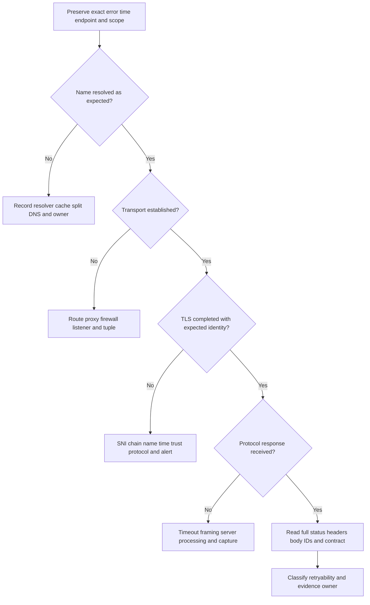
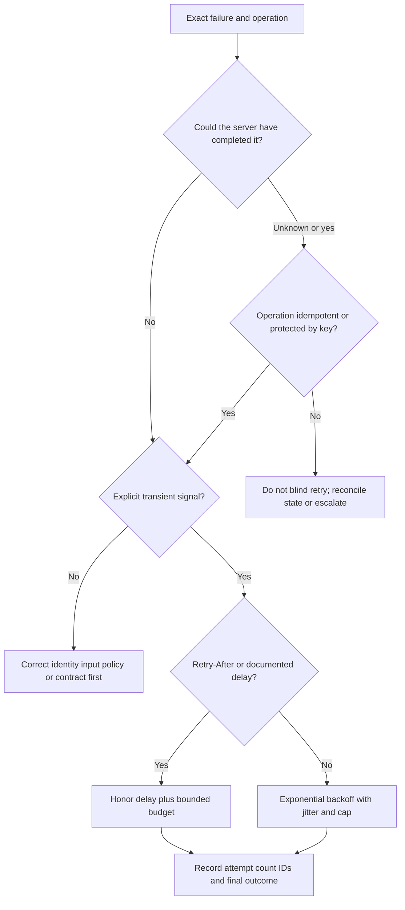
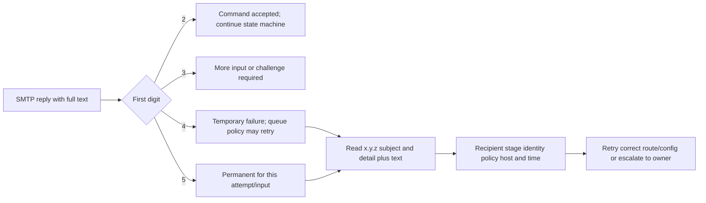

# Appendix B - Protocol Port and Error Code Cheat Sheets

> **Audience:** Arti Thakur, preparing for an Abnormal AI Technical Support Engineer interview  
> **Reference date:** August 24, 2026  
> **Core rule:** **Ports are defaults or registrations, not proof. Exact error text, protocol stage, direction, identity, timestamp, and surrounding evidence outrank a memorized code.**

## Purpose and How to Use This Appendix

This appendix is a routing aid for email, SaaS, identity, API, and endpoint-to-cloud support. It answers four questions in order:

1. **Where did progress stop?** DNS, route, TCP/UDP, TLS, application protocol, identity, authorization, policy, or business logic.
2. **What exactly did the responsible component report?** Preserve the full reply, enhanced code, HTTP body, TLS alert, OAuth error, or socket text.
3. **Is a retry safe and useful?** Consider transience, `Retry-After`, idempotency, duplicate effects, retry budget, and the owning system.
4. **What minimum evidence lets the next owner act?** Use timestamps, endpoints, IDs, sanitized protocol facts, scope, and one discriminating comparison.

> 🔍 **Plain-English deep-dive:** A port is like a numbered reception desk. Port 443 often receives HTTPS, but a program can listen there and speak something else; TLS can terminate at a proxy; and an application can use a nondefault port. Seeing “443 open” proves only that a TCP connection was accepted at an observed address and time. It does not prove the expected DNS answer, certificate identity, HTTP route, API authorization, or application health.

## Candidate Honesty and Safety Boundary

Arti may connect this layered method to substantiated Microsoft enterprise-support experience and safe networking/API labs. She must not claim direct production operation of Abnormal AI, email-security systems, Google Workspace, Slack, Okta, Splunk, CrowdStrike, Cortex SOAR, Zendesk, Salesforce, Jira, or Zoom. Product-specific codes and private handling must come from authorized current documentation and actual tenant evidence.

Do not probe, scan, stress, or capture third-party systems. Use only authorized customer diagnostics or learner-owned/local/reserved examples. Do not disable certificate validation, TLS controls, firewalls, authentication, or security policy to “test.” Do not paste tokens, cookies, credentials, private keys, full customer addresses, message bodies, or internal topology into a case. See [Part 005 - Privacy Data Handling and Evidence Ethics](Part-005-privacy-data-handling-and-evidence-ethics.md), [Part 009 - Safe Support Lab Environment](Part-009-safe-support-lab-environment.md), and [Part 098 - Safe Evidence Collection Redaction and Packaging](Part-098-safe-evidence-collection-redaction-and-packaging.md).

## Layered Protocol Maps

### Map 1: Endpoint-to-Service Progress

```mermaid
flowchart LR
    App["Client or integration"] --> Name["DNS name and record"]
    Name --> Route["Interface route proxy and policy"]
    Route --> Transport["TCP or UDP exchange"]
    Transport --> TLS["TLS negotiation and certificate"]
    TLS --> Protocol["HTTP SMTP identity or other protocol"]
    Protocol --> AuthN["Authentication"]
    AuthN --> AuthZ["Authorization and scope"]
    AuthZ --> Logic["Application contract and business state"]
    Logic --> Outcome["Response delivery or event outcome"]
```

### Map 2: Find the First Failed Stage

### Map 3: Safe Retry Decision

### Map 4: SMTP Reply Routing

## 1. Layer-to-Evidence Quick Map

| Layer or boundary | Typical protocol/artifact | What success proves | What it does not prove | Best next evidence when it fails | Common owner |
|---|---|---|---|---|---|
| Local application | Process log, UI, SDK exception | Code reached the observed point | Network or server cause | Version, operation, exact UTC, sanitized input, stack/error | Client/app owner |
| Name resolution | DNS A/AAAA/CNAME/MX/TXT/PTR | Resolver returned a result | Route or service health | Resolver, query name/type, RCODE, answer, TTL, cache | DNS/network/domain owner |
| Network path | Route, proxy, firewall, VPN | Selected next hop/policy is known | Return path or application reachability | Source/destination tuple, route lookup, proxy config, boundary log | Network/security owner |
| Transport | TCP handshake or UDP exchange | Observed transport endpoint responded | TLS/application success | SYN/SYN-ACK/RST/timeout, socket state, elapsed time | Endpoint/path owner |
| TLS | Handshake, certificate, alert | Negotiated protected channel to validated name under trust policy | API authorization or safe content | SNI, chain, SAN, validity, issuer, alert, protocol, proxy | Certificate/proxy/service owner |
| HTTP/API | Status, headers, body, request ID | Server/proxy produced an HTTP response | Business operation success unless contract says so | Method, URL shape, status/body, IDs, timing, redacted headers | API/app/identity owner |
| SMTP | Reply and enhanced status | Specific SMTP command was accepted/rejected | Inbox placement or final user access | Full transcript stage, peer, envelope identities, queue/NDR IDs | Sending/receiving mail owner |
| Identity | SAML/OIDC/OAuth result | Particular identity step reached an outcome | Resource permission or business entitlement | Issuer, audience, client, redirect, claims/scopes names, correlation ID | IdP/app/security owner |
| Webhook | Delivery attempt and receiver response | Endpoint returned an observed response | Event processed exactly once | Event ID/type, attempt, signature outcome, status, receipt log | Producer/consumer owner |
| Business policy | Product/audit event | Policy made an observed decision | Underlying private model logic or malicious intent | Policy/version, scope, expected result, examples, audit ID | Product/policy owner |

## 2. Common TCP and UDP Ports

**Interpretation rule:** These are common defaults/registrations. Always preserve **protocol (`TCP`/`UDP`), direction, source and destination, IP family, hostname/SNI, process, timestamp, and observed negotiation**. Encryption can be implicit, upgraded, optional, terminated by an intermediary, or absent despite the familiar port.

| Port | Transport | Common service/use | Encryption expectation | Caveats and decision cue |
|---:|---|---|---|---|
| 20 | TCP | FTP data, active mode | None by default | Legacy; separate control/data behavior; do not infer FTP from port alone |
| 21 | TCP | FTP control | None by default; explicit TLS variants exist | Credentials/data can be exposed without protection; prefer approved secure alternatives |
| 22 | TCP | SSH, SFTP, SCP | SSH-protected | SFTP is not FTPS; host-key validation still matters |
| 25 | TCP | SMTP server-to-server relay | Plain start, often STARTTLS by policy/opportunity | Not normal end-user submission; STARTTLS advertisement/use must be observed |
| 53 | UDP/TCP | DNS | Usually plaintext; DNSSEC authenticates data, not confidentiality | UDP common; TCP for truncation, large responses, zone transfer, and other cases |
| 67/68 | UDP | DHCPv4 server/client | No ordinary payload encryption | Link/broadcast scope and relay behavior matter |
| 80 | TCP | HTTP | None | Redirect to HTTPS is application behavior, not guaranteed by port 80 |
| 88 | TCP/UDP | Kerberos | Protocol protection depends on exchange | Time, DNS, SPNs, realm, and transport behavior matter |
| 110 | TCP | POP3 | Plain unless upgraded with STLS | Legacy mailbox retrieval; 995 commonly implicit TLS |
| 123 | UDP | NTP | Basic NTP may be unauthenticated | Clock evidence matters to tokens/TLS; do not alter time service casually |
| 143 | TCP | IMAP | Plain unless upgraded with STARTTLS | 993 commonly implicit TLS |
| 161/162 | UDP | SNMP queries/traps | Version-dependent; SNMPv3 adds security | Community strings are sensitive; no unauthorized polling |
| 389 | TCP/UDP | LDAP | Plain or STARTTLS depending design | Not proof of directory identity; 636 commonly LDAP over TLS |
| 443 | TCP, sometimes UDP | HTTPS over TCP; HTTP/3 over QUIC uses UDP | TLS expected for HTTPS | Proxy/TLS termination and protocol version matter; open port is not healthy API |
| 445 | TCP | SMB | Signing/encryption depend on version/policy | Sensitive enterprise service; never test unrelated hosts |
| 465 | TCP | Message submission with implicit TLS | TLS from connection start | Standards use is submissions; do not confuse with relay port 25 |
| 500/4500 | UDP | IKE/IPsec; NAT traversal on 4500 | Protocol-secured | VPN design/policy specific; not an app port test |
| 514 | UDP, sometimes TCP | Syslog legacy | Usually plaintext unless protected separately | Modern secure logging may use other transports/ports; content is sensitive |
| 587 | TCP | Email message submission | STARTTLS normally required by policy | Client submission, not server-to-server relay; observe AUTH/TLS policy |
| 636 | TCP | LDAP over implicit TLS | TLS expected | Certificate name/trust and directory bind are separate stages |
| 853 | TCP | DNS over TLS | TLS expected | Resolver policy and certificate/SNI still matter |
| 993 | TCP | IMAP over implicit TLS | TLS expected | Authentication and mailbox permission are later stages |
| 995 | TCP | POP3 over implicit TLS | TLS expected | Service availability does not prove account access |
| 1433 | TCP | Microsoft SQL Server default | Encryption policy/config varies | Instance/dynamic-port/proxy behavior varies; no third-party probing |
| 3306 | TCP | MySQL default | TLS capability/policy varies | Default only; authentication and database authorization are separate |
| 3389 | TCP/UDP | Remote Desktop Protocol | RDP security/TLS policy varies | High-risk admin surface; test only under explicit authorization |
| 5432 | TCP | PostgreSQL default | TLS optional/required by configuration | Port does not prove database type/version or successful TLS |
| 5353 | UDP | Multicast DNS | No ordinary encryption | Local-link multicast, not public DNS |
| 8080/8443 | TCP | Common alternate web/proxy ports | Convention only; 8443 often TLS | Not IANA proof of HTTP/HTTPS; inspect actual protocol |

### Port Evidence Checklist

| Preserve | Example safe notation | Why |
|---|---|---|
| Direction and tuple | `192.0.2.10:52144 -> 198.51.100.20:443/TCP` | Distinguishes client ephemeral port from service port |
| Name context | `api.example.com`, SNI `api.example.com` | Shared IPs can host many services |
| Time and duration | `2026-08-24T14:22:03Z`, 10.1 s | Correlates boundary logs and timeouts |
| Process/tool/version | `curl 8.x`, approved client build | Different stacks/proxies behave differently |
| Observed protocol | TLS ClientHello, HTTP status, SMTP banner | Proves more than the port number |
| Policy/intermediary | Explicit proxy, VPN, TLS inspection, load balancer | Identifies termination and ownership boundaries |

## 3. DNS Reply and Resolver Error Families

### DNS Header RCODEs

| RCODE | Standard name | Plain meaning | Retry/ownership cue | Trap |
|---:|---|---|---|---|
| 0 | NOERROR | Query processed without these header-level errors. | Inspect answer, authority, CNAME chain, and requested type. | NOERROR with no answer is not NXDOMAIN. |
| 1 | FORMERR | Server could not interpret the query format. | Check client/forwarder/EDNS compatibility; capture minimal query metadata. | Do not assume bad zone data. |
| 2 | SERVFAIL | Server failed while processing. | Often transient; check authoritative reachability, DNSSEC validation, recursion, and full EDE/text. | SERVFAIL does not name the failing dependency by itself. |
| 3 | NXDOMAIN | Queried domain name is reported not to exist. | Verify exact name, search suffix, resolver/view, negative TTL, delegation. | Different from NODATA for an existing name. |
| 4 | NOTIMP | Requested operation is not implemented. | Confirm query feature/type and server capability. | Not necessarily a missing record. |
| 5 | REFUSED | Server declined by policy. | Check recursion ACL, authoritative scope, source, and resolver policy. | Not proof of a network firewall. |
| Extended | BADVERS/BADSIG/BADKEY and others | EDNS/TSIG-related extended errors. | Preserve full tool output and relevant option context. | Low header bits alone may not show the full extended RCODE. |

### Common DNS/Resolver Text

| Text or family | Likely layer | First check | Retryability | Owner cue |
|---|---|---|---|---|
| “Non-existent domain” / `NXDOMAIN` | Authoritative/recursive DNS result | Exact FQDN/type, resolver, view, negative cache | Retry only after correcting name/record or cache expiry/change | Domain/DNS owner |
| “No answer” / NOERROR empty answer | Record/type/alias context | Authority section, CNAME, requested RR type | Depends on expected record and TTL | Zone/app owner |
| “Server failed” / `SERVFAIL` | Resolver or authoritative dependency | Compare approved resolver, DNSSEC state, EDE, authority reachability | Often bounded retry, not flood | DNS operator |
| Timeout / no servers reachable | Client-to-resolver path or resolver response | Configured resolver, route, UDP/TCP 53, VPN, firewall log | Bounded retry after path check | Endpoint/network/DNS owner |
| “Refused” | DNS policy | Is server authoritative? Is recursion allowed for source? | Correct policy/server first | DNS/security owner |
| `EAI_NONAME`, “Name or service not known” | OS resolver API | Exact host, suffix, hosts file, resolver result | Usually fix name/config first | Client/DNS owner |
| `WSAHOST_NOT_FOUND` / 11001 | Windows name resolution | Same as above plus Windows resolver context | Usually not blind retry | Client/DNS owner |
| Stale/different answer | Cache/split DNS/CDN/view | Resolver identity, TTL, ECS/view, time, CNAME chain | Wait only when cache behavior explains it | DNS/CDN/network owner |

> **Decision cue:** Query tools such as `dig`, `nslookup`, and `Resolve-DnsName` may bypass or expose different layers than the application resolver. A successful manual query does not automatically disprove application DNS failure; compare resolver, name, type, address family, suffix/search behavior, cache, proxy, and time.

## 4. SMTP and ESMTP Reply Codes

### SMTP Reply Classes

| Class | Meaning | Sender behavior | Support interpretation |
|---:|---|---|---|
| 2xx | Positive completion | Continue or finish accepted command | Acceptance is scoped to that SMTP command, not inbox placement |
| 3xx | Positive intermediate | Provide requested data/challenge | Confirm state machine; do not treat as final success |
| 4xx | Transient negative completion | Queue/retry according to policy | Read enhanced code/text; bounded retry may work without content/config change |
| 5xx | Permanent negative completion | Do not blindly retry same input | Correct recipient, route, auth, content, or policy; exact text controls ownership |

### Common SMTP Replies

| Code | Typical standard meaning | Stage/context | Retry/owner cue | Important caveat |
|---:|---|---|---|---|
| 211 | System status/help response | Command response | Informational | Text and server extension define detail |
| 214 | Help message | HELP | Informational | Not delivery state |
| 220 | Service ready | Connection/banner or STARTTLS ready | Continue expected state | Banner is asserted server text, not identity proof |
| 221 | Service closing channel | QUIT/shutdown | Normal after QUIT; otherwise inspect text | Could follow policy/service shutdown |
| 235 | Authentication successful | AUTH | Continue submission | Does not prove relay/recipient authorization |
| 250 | Requested mail action okay | EHLO, MAIL, RCPT, DATA completion | Continue; preserve which command | `250` after RCPT differs from `250` after final DATA |
| 251 | User not local; will forward | RCPT | Server accepted forwarding responsibility | Forwarding policy and final delivery remain separate |
| 252 | Cannot verify user, will accept | RCPT | Accepted with uncertainty | Not proof mailbox exists |
| 334 | Authentication challenge/input | AUTH | Supply only through approved client flow | Never paste credentials into transcripts |
| 354 | Start mail input | DATA | Send content, end as protocol defines | Not final message acceptance; await post-DATA reply |
| 421 | Service unavailable/closing | Any stage | Transient; respect queue policy and text | May be rate, maintenance, policy, or resource issue |
| 450 | Mailbox/action unavailable | Often RCPT | Transient; inspect enhanced code/text | Not always “mailbox full” |
| 451 | Local processing error | Any transaction stage | Transient; identify reporting host | Text may expose policy, DNS, scan, or storage dependency |
| 452 | Insufficient storage/resources | MAIL/RCPT/DATA | Transient; bounded retry | Could be recipient/system/queue resource |
| 454 | Temporary authentication/TLS failure | AUTH/STARTTLS | Retry after dependency check | Do not weaken TLS/authentication |
| 455 | Server cannot accommodate parameters | Command parameters | Temporary per server capability | Correct negotiation may be required |
| 500 | Syntax error, command unrecognized | Command parser | Correct protocol/input first | Can indicate wrong protocol on port |
| 501 | Syntax error in parameters | Command | Correct argument/envelope syntax | Full text identifies field/constraint |
| 502 | Command not implemented | Capability | Use advertised supported flow | Not a network failure |
| 503 | Bad sequence of commands | State machine | Correct order/session state | Retrying same invalid sequence will repeat |
| 504 | Command parameter not implemented | Capability/parameter | Negotiate supported option | Not generic server outage |
| 530 | Authentication required | Submission/relay policy | Authenticate through approved method | Do not confuse with invalid credential |
| 534/535 | Authentication mechanism/credentials rejected | AUTH | Validate mechanism, identity, policy, account state | Exact enhanced code/text matters; never collect passwords |
| 550 | Requested action not taken | Often RCPT or policy | Usually permanent for same attempt | Broad code: unknown recipient, policy, auth, reputation, and content vary |
| 551 | User not local; address supplied | RCPT | Validate reroute under policy | Do not automatically follow untrusted address |
| 552 | Exceeded storage/allocation | RCPT/DATA | Often permanent for current message; text controls | Can mean message too large or mailbox/storage condition |
| 553 | Mailbox/address syntax or policy issue | MAIL/RCPT | Correct address/policy | Full response controls meaning |
| 554 | Transaction failed/no service | Connection or DATA | Usually permanent for same input | Very broad; enhanced code and text outrank number |

## 5. Enhanced SMTP Status Codes

Enhanced status has the form `class.subject.detail`, such as `5.1.1`. The first digit aligns broadly with success/transient/permanent. The second digit groups the subject; the third adds detail. Preserve all three digits **and the diagnostic text**.

### Subject Families

| Subject (`x.y.z`) | Family | Plain meaning | Typical owner |
|---:|---|---|---|
| `x.0.z` | Other/undefined | Detail outside another subject | Read text/reporting host |
| `x.1.z` | Addressing | Destination/mailbox address issue | Sender data, directory, recipient admin |
| `x.2.z` | Mailbox | Mailbox state/capability | Recipient/mailbox owner |
| `x.3.z` | Mail system | System capacity/configuration | Mail service/admin |
| `x.4.z` | Network/routing | Name, route, connection, loop | DNS/network/mail routing owner |
| `x.5.z` | Delivery protocol | Command/protocol/version issue | Sending/receiving MTA owner |
| `x.6.z` | Content/media | Conversion, format, content capability | Sender/client/gateway/content-policy owner |
| `x.7.z` | Security/policy | Authentication, authorization, policy | Identity/security/mail-policy owner |

### High-Value Enhanced Codes

| Code | Common registered meaning/family | Retry cue | Ownership/evidence cue |
|---|---|---|---|
| `2.0.0` | Other success | No retry needed for accepted action | Preserve stage: command versus final DATA |
| `4.2.2` | Mailbox full | Queue policy may retry | Recipient mailbox quota/state and time |
| `4.3.1` | Mail system full | Transient | Reporting host capacity/queue evidence |
| `4.4.1` | No answer from host | Transient | Destination, DNS, route, TCP timing |
| `4.4.2` | Bad connection | Transient | Connection stage, resets/timeouts, peer |
| `4.4.7` | Delivery time expired | Final notification after retries exhausted | Full queue history and original cause |
| `4.7.0` | Other/undefined security status | Usually transient class; text controls | Policy/auth/rate text and provider docs |
| `4.7.1` | Delivery not authorized, message refused | Transient class but policy-specific | Identity, source, policy and exact response |
| `5.1.1` | Bad destination mailbox address | Do not retry unchanged | Recipient spelling/directory/domain evidence |
| `5.1.2` | Bad destination system address | Correct domain/routing | DNS/domain ownership |
| `5.1.6` | Destination mailbox moved/no forwarding address | Correct recipient | Directory/recipient owner |
| `5.2.2` | Mailbox full | Permanent class for this report; text/provider policy matters | Recipient quota/state |
| `5.3.4` | Message too big for system | Resize or change authorized limit | Message size at each hop and advertised SIZE |
| `5.4.4` | Unable to route | Correct DNS/connector/route | Routing topology and reporting host |
| `5.4.6` | Routing loop detected | Stop retries until loop corrected | Received/queue path, connectors, rules |
| `5.5.2` | Syntax error | Correct SMTP content/command syntax | Raw protocol stage and client implementation |
| `5.6.0` | Other/undefined media error | Correct content/format per text | MIME/content owner and gateway transformations |
| `5.7.1` | Delivery not authorized/message refused | Correct permission/policy; no blind retry | Exact policy text, source, identities, tenant |
| `5.7.8` | Authentication credentials invalid | Correct account/mechanism/policy | Account state and auth logs; never request password |
| `5.7.20` | No passing DKIM signature found | Correct signing/verification or policy context | Each signature/result and trusted receiver evidence |
| `5.7.21` | No acceptable DKIM signature found | Correct signature policy/algorithm/domain context | DKIM result properties and receiver policy text |
| `5.7.22` | No valid author-matched DKIM signature found | Correct aligned author signature | DKIM `d=`, visible From, verification result |
| `5.7.23` | SPF validation failed | Correct observed peer/identity/policy | Peer IP, HELO/MAIL FROM, transit-time SPF trace |
| `5.7.24` | SPF validation error | Resolve SPF evaluation/policy error | DNS outcomes, record syntax, lookup budget |
| `5.7.25` | Reverse DNS validation failed | Correct DNS/path identity if required | Peer IP, PTR, forward mapping, receiver text |
| `5.7.26` | Multiple authentication checks failed | Correct named checks/alignment | Full response and trusted Authentication-Results |

> **Trap:** Providers may append their own identifiers and wording, or use a broad registered family for local policy. Do not translate `550 5.7.1` into a single universal cause. The reporting host, command stage, enhanced code, full text, URL/reference ID, sender/recipient scope, and message trace decide the next owner.

## 6. HTTP Status Codes

### HTTP Classes

| Class | Meaning | First support question |
|---:|---|---|
| 1xx | Informational/interim | Did the client/proxy continue correctly? |
| 2xx | Request successfully received/accepted/processed per method semantics | Did the business operation complete, remain asynchronous, or return empty content by design? |
| 3xx | Redirection/cache selection | Did the client follow the correct `Location`, method semantics, and authentication boundary? |
| 4xx | Client-side request/context problem | What does the response body/header say about syntax, identity, permission, state, or rate? |
| 5xx | Server/intermediary failed to fulfill a valid-looking request | Which hop generated it, is it transient, and is retry safe? |

### Common HTTP Codes and Retry Cues

| Code | Standard shorthand | Plain interpretation | Default retry posture | High-value context |
|---:|---|---|---|---|
| 200 | OK | Request succeeded with a representation/result. | No retry | Body contract and business result |
| 201 | Created | New resource created. | No retry; preserve location/ID | `Location`, resource ID, idempotency |
| 202 | Accepted | Work accepted but may be asynchronous/incomplete. | Poll only as documented | Operation/status URL, request ID |
| 204 | No Content | Success with no response body. | No retry | Client must not require JSON body |
| 206 | Partial Content | Range response. | Follow range contract | `Content-Range`, cache/proxy behavior |
| 301/308 | Permanent redirect | Resource has a permanent target; 308 preserves method semantics. | Follow only trusted/documented target | `Location`, auth boundary, client behavior |
| 302/303/307 | Temporary/see-other redirect family | Client may need another location/method behavior. | Follow per standard/client contract | Method rewriting, cookies, origin, loop |
| 304 | Not Modified | Cached representation remains valid. | No ordinary retry | Conditional headers and cache state |
| 400 | Bad Request | Server cannot process request syntax/input. | Fix input first | Structured error, schema, encoding |
| 401 | Unauthorized | Authentication is missing/invalid or challenge required. | Refresh/re-auth only through documented flow | `WWW-Authenticate`, token issuer/audience/expiry |
| 403 | Forbidden | Server understood identity/request but refuses authorization/policy. | Do not repeat unchanged | Role, scope, tenant, resource policy, body |
| 404 | Not Found | Target resource/route is unavailable or intentionally hidden. | Verify path/version/tenant; no blind retry | Method, base URL, resource ID, authorization-hiding policy |
| 405 | Method Not Allowed | Resource exists but method unsupported. | Correct method | `Allow`, API contract |
| 408 | Request Timeout | Server timed out waiting for request. | Retry only if operation safety is known | Whether server applied any side effect |
| 409 | Conflict | Current resource state conflicts with operation. | Re-read/reconcile state | Version/ETag, duplicate, workflow state |
| 410 | Gone | Resource intentionally no longer available. | Do not retry unchanged | Deprecation/deletion contract |
| 412 | Precondition Failed | Conditional request predicate failed. | Refresh state then decide | ETag/version/precondition headers |
| 413 | Content Too Large | Request exceeds accepted size. | Reduce within contract; no unchanged retry | Limit location, compression, attachment size |
| 415 | Unsupported Media Type | Body `Content-Type`/format unsupported. | Correct body/media type | Header, encoding, schema |
| 422 | Unprocessable Content | Syntax understood, semantic validation failed. | Correct fields/state | Field-level error body |
| 425 | Too Early | Server avoids replay-risk processing of early data. | Retry after proper handshake per client/docs | TLS early data and operation safety |
| 428 | Precondition Required | Server requires conditional update. | Add valid condition after reading state | ETag/version contract |
| 429 | Too Many Requests | Rate limit exceeded. | Honor `Retry-After`/documented reset and budget | Limit scope, key/tenant/user bucket, headers |
| 431 | Request Header Fields Too Large | Headers exceed server/intermediary limit. | Reduce safe unnecessary headers | Cookie/header size and generating hop |
| 500 | Internal Server Error | Server encountered unexpected condition. | Bounded retry only if safe; capture ID | Error body, request ID, operation state |
| 501 | Not Implemented | Server lacks method/function capability. | Correct version/feature; no blind retry | Contract and generating hop |
| 502 | Bad Gateway | Proxy/gateway received invalid upstream response. | Often transient; bounded safe retry | Which gateway, upstream timing, request ID |
| 503 | Service Unavailable | Service temporarily unable to handle request. | Honor `Retry-After`; bounded backoff | Service health, capacity, dependency, region |
| 504 | Gateway Timeout | Gateway did not receive timely upstream response. | Retry only if idempotent/protected | Gateway versus upstream time, operation reconciliation |

### Authentication: 401 Versus 403

| Question | 401 direction | 403 direction |
|---|---|---|
| Is a valid credential presented? | Missing, expired, malformed, wrong issuer/audience, invalid signature | Often yes, but policy still denies |
| First header/body | `WWW-Authenticate`, token error, correlation ID | Structured permission/policy reason |
| Corrective path | Documented token acquisition/refresh/sign-in | Role, scope, assignment, tenant, resource/policy owner |
| Unsafe move | Logging token or disabling validation | Granting broad admin permission “to test” |

## 7. TLS and Certificate Error Families

TLS errors occur before or during a protected application session. Preserve **client and library version, destination IP, hostname/SNI, protocol version, certificate chain metadata, trust store context, proxy/interception state, UTC time, and exact alert/text**. Never solve a validation error by turning validation off.

| Error/alert family | Plain meaning | Likely hypotheses | Safe next evidence | Do not |
|---|---|---|---|---|
| Name mismatch | Certificate identity does not match requested host | Wrong URL/SNI, proxy, endpoint/certificate deployment | Requested FQDN, SAN names, SNI, endpoint IP | Ignore hostname checks |
| Expired/not yet valid | Certificate validity window does not include client time | Expired deployment, wrong clock, wrong chain | UTC clocks, `notBefore`/`notAfter`, chain | Change system clock casually |
| Unknown CA / untrusted issuer | Client cannot build to an accepted trust anchor | Missing intermediate, private CA, TLS inspection, trust-store mismatch | Full presented chain metadata, issuer, trust-store policy, proxy | Install arbitrary roots or bypass trust |
| Revoked / revocation check failure | Certificate revoked or revocation status unavailable/indeterminate | Compromise/retirement, CRL/OCSP path, policy | Exact client status, chain, revocation endpoint reachability, policy | Disable revocation checking |
| `handshake_failure` | Peers could not negotiate/complete handshake | Protocol/cipher, client cert, SNI, server policy | ClientHello/server alert, versions, ciphers, SNI, mTLS requirement | Enable obsolete SSL/ciphers |
| `protocol_version` | Offered/selected protocol unsupported | Old client, hardened server, proxy limitation | Client/server supported versions and policy | Re-enable obsolete protocol without approved design |
| `bad_certificate` / `certificate_unknown` | Peer rejected or could not process certificate | Chain, format, policy, mTLS identity | Direction of alert, presented cert metadata, server/client logs | Send private key in ticket |
| `certificate_required` | Server expected a client certificate | mTLS configuration/selection missing | Approved client cert subject/issuer/thumbprint metadata and selection logs | Export private key |
| `bad_record_mac` / decrypt error | Protected record could not be authenticated/decrypted | Corruption, middlebox, implementation/key state | Bounded capture metadata, endpoint/proxy logs, reproducibility | Assume malicious tampering from one alert |
| `decode_error` / `illegal_parameter` | Peer found malformed/inconsistent handshake data | Compatibility, proxy, implementation | Exact alert direction and handshake metadata | Randomly weaken settings |
| `unrecognized_name` | Server rejected or did not recognize SNI | Wrong name, virtual-host config, proxy | Requested URL/SNI and endpoint ownership | Connect by IP and ignore name identity |
| `no_application_protocol` | ALPN could not select a protocol | HTTP/2/HTTP/3/protocol mismatch | Offered/selected ALPN and client/server support | Treat as certificate error |
| Connection closes/no alert | Handshake path ended without useful TLS alert | Network reset, middlebox, service, incompatible stack | TCP flags/timing, both endpoint logs, proxy path | Attribute to TLS without transport evidence |

## 8. OAuth 2.0, OIDC, SAML, and SCIM Errors

### OAuth 2.0 and Bearer Token Errors

| Error | Where commonly returned | Beginner meaning | Retry/correction cue | Evidence/owner |
|---|---|---|---|---|
| `invalid_request` | Authorization/token/resource endpoint | Required parameter or request shape is missing/invalid. | Correct request; no unchanged retry | Sanitized parameter names, endpoint, client/request ID |
| `invalid_client` | Token endpoint | Client authentication failed. | Correct client identity/method/secret/certificate under owner process | Client ID, auth method, tenant, logs; never secret |
| `invalid_grant` | Token endpoint | Grant/code/refresh token is invalid, expired, revoked, reused, or mismatched. | Reauthorize through documented flow | Grant type, redirect URI, account/consent state, correlation ID |
| `unauthorized_client` | Authorization/token endpoint | Client is not permitted to use requested flow. | Correct registration/policy | Client registration and grant policy owner |
| `unsupported_grant_type` | Token endpoint | Server does not support supplied grant type. | Use documented grant | Contract/discovery metadata |
| `unsupported_response_type` | Authorization endpoint | Requested authorization response type unsupported. | Correct response type/flow | OIDC metadata/client registration |
| `invalid_scope` | Authorization/token endpoint | Requested scope is unknown, malformed, or not allowed. | Request documented least-privilege scope | Scope names, consent, client policy |
| `access_denied` | Authorization endpoint | Resource owner or policy denied request. | Resolve policy/consent; do not loop prompt | User/admin/policy event and correlation ID |
| `server_error` | Authorization endpoint | Authorization server hit an unexpected condition. | Bounded retry if flow safe; service evidence | Correlation ID, time, service health |
| `temporarily_unavailable` | Authorization endpoint | Server temporarily overloaded/unavailable. | Backoff per docs | Time, tenant/region, correlation ID |
| `invalid_token` | Protected resource challenge | Access token expired, revoked, malformed, or otherwise invalid. | Acquire valid token through normal flow | `WWW-Authenticate`, issuer/audience/expiry metadata |
| `insufficient_scope` | Protected resource challenge | Token is valid but lacks required scope. | Grant/request least required scope | Required versus granted scopes and resource |

### OIDC-Specific Authorization Errors

| Error | Meaning | Decision cue | Common trap |
|---|---|---|---|
| `interaction_required` | Authorization server needs user interaction. | Use documented interactive path when allowed. | Retrying silent flow indefinitely |
| `login_required` | User must authenticate. | Start approved login flow. | Treating it as API permission failure |
| `account_selection_required` | User must choose an account. | Allow account-selection UI. | Hard-coding the wrong account/tenant |
| `consent_required` | Required consent is absent. | Route to user/admin consent owner under least privilege. | Granting broad scopes to make it pass |
| `invalid_request_uri` / `invalid_request_object` | Referenced/signed request is invalid or rejected. | Validate registration, signature, URI/object, and provider support. | Logging full signed objects/tokens |

### SAML Status Families

| Status code | Plain meaning | First evidence | Owner cue |
|---|---|---|---|
| `Success` | SAML request completed successfully. | Assertion validation and app session outcome still matter. | IdP then SP/application |
| `Requester` | Request is invalid or cannot be performed as sent. | Entity ID, ACS, binding, request ID, signature, destination | SP/request configuration |
| `Responder` | Responder could not fulfill otherwise valid request. | Nested status, IdP event, policy/dependency | IdP/service owner |
| `VersionMismatch` | Unsupported SAML version. | Request/response version and metadata | Integration configuration |
| `AuthnFailed` | Authentication failed. | IdP sign-in event, method, user/account state | IdP/account owner |
| `NoAuthnContext` | Requested authentication context cannot be met. | Requested versus available method/policy | IdP/policy owner |
| `RequestDenied` | Responder denied request by policy. | Nested message, assignment/access policy | IdP/app security owner |
| `UnknownPrincipal` | Identity/principal is unknown. | Immutable ID/NameID mapping and directory | Directory/mapping owner |
| `UnsupportedBinding` | Requested SAML binding unsupported. | Metadata and endpoint binding | Integration owner |

### SCIM Errors and `scimType`

| HTTP/error | `scimType` example | Meaning | Correction/ownership cue |
|---|---|---|---|
| 400 | `invalidFilter` | Filter cannot be parsed/supported. | Correct filter grammar/attributes; provider schema |
| 400 | `tooMany` | Requested result operation exceeds limit. | Paginate/narrow per contract |
| 400/409 | `uniqueness` | Value conflicts with uniqueness requirement. | Reconcile source-of-truth and existing resource |
| 400 | `mutability` | Attempt changes read-only/immutable attribute. | Correct mapping/operation |
| 400 | `invalidSyntax` | Request body syntax is invalid. | Validate JSON/SCIM message |
| 400 | `invalidPath` | Attribute path is invalid. | Compare schema/extension URI/path |
| 400 | `noTarget` | PATCH path/filter found no target. | Re-read resource and operation semantics |
| 400 | `invalidValue` | Attribute value violates requirement. | Field-level type/format/reference correction |
| 400 | `invalidVers` | Unsupported SCIM protocol version. | Use provider-supported version |
| 400 | `sensitive` | Request tried to return/change sensitive resource in disallowed way. | Follow provider security contract |
| 401 | n/a | Authentication missing/invalid. | Fix bearer/client authentication; do not log token |
| 403 | n/a | Authenticated client lacks permission/policy allows no action. | Scope/role/tenant/application grant owner |
| 404 | n/a | Resource or endpoint not found. | Base URL/resource ID/version/tenant |
| 409 | often `uniqueness` | Resource state conflict. | Reconcile duplicate or source state |
| 429/5xx | provider response | Rate/service condition. | Honor headers; bounded idempotent retry and reconciliation |

## 9. Webhook and API Delivery Error Families

There is no single universal webhook contract. The producer defines accepted `2xx` behavior, timeout, signature scheme, retry schedule, maximum attempts, ordering, and dead-letter/replay process. Preserve the producer’s current official contract.

| Symptom/result | Likely layer | Retryability | Safe evidence | Ownership cue |
|---|---|---|---|---|
| DNS failure | Name resolution | Producer may retry; fix name/zone first | Endpoint hostname/type/RCODE/time | Consumer DNS/domain owner |
| Connection refused | TCP/listener | Often transient during deployment; bounded retry | Destination tuple, SYN/RST, listener state | Consumer hosting/network owner |
| Connect/read timeout | Path or slow receiver | Retry only under documented webhook semantics | Stage/timing, attempt, event ID | Path/consumer app owner |
| TLS validation failure | Certificate/TLS | Do not bypass; correct certificate/path | SNI, chain metadata, alert, time | Consumer cert/proxy owner |
| 2xx but event missing | Receiver processing/observability | Do not assume producer will retry | Event ID, receipt and processing logs | Consumer app owner |
| 3xx | Redirect handling | Many producers do not follow; contract-specific | Status/Location without secrets | Endpoint/config owner |
| 400/422 | Payload/contract | Correct request/receiver schema; unchanged retry usually wasteful | Event type/version, schema error, sanitized fields | Producer/consumer contract owner |
| 401 | Endpoint authentication | Correct credential/signature flow | Auth scheme name, key ID, time, error ID | Consumer auth owner |
| 403 | Permission/policy | Correct allowlist/scope/policy | Source identity, policy event, status body | Consumer security owner |
| 404/410 | Wrong/retired endpoint | Correct registration | Registered URL shape/version and change history | Integration config owner |
| 409 | Duplicate/state conflict | Reconcile by event/idempotency key | Event ID and current state | Consumer workflow owner |
| 429 | Rate limit | Honor `Retry-After`/producer retry contract | Attempt count, rate headers, tenant/key bucket | Consumer capacity/API owner |
| 5xx | Receiver/intermediary failure | Usually producer retries; ensure idempotent consumer | Event ID, attempt, response ID, receipt logs | Consumer/app/platform owner |
| Signature mismatch | Integrity/authentication | Do not retry until algorithm/input/time/key issue understood | Algorithm/key ID, timestamp, raw-body hash metadata; no secret | Producer/consumer signature owner |
| Timestamp outside tolerance | Replay defense/clock | Correct clock/queue delay under policy | UTC clocks, signed timestamp, receipt time | Time/consumer security owner |
| Duplicate/out-of-order event | Delivery semantics | Handle idempotently and order by documented fields | Event ID, sequence/version, attempts | Consumer workflow owner |

## 10. Socket and Network Error Families

### Cross-Platform Mapping

| Windows/Winsock | POSIX-style name | Plain meaning | First discriminating check | Retry/owner cue |
|---|---|---|---|---|
| 10013 `WSAEACCES` | `EACCES` | Permission/policy denied socket operation. | Local policy, reserved bind, security software, operation | Correct authorization/policy; do not disable firewall |
| 10048 `WSAEADDRINUSE` | `EADDRINUSE` | Local address/port already in use. | Owning process, socket state, reuse/time-wait design | App/host owner; avoid killing unrelated process |
| 10049 `WSAEADDRNOTAVAIL` | `EADDRNOTAVAIL` | Requested local address is unavailable. | Interface addresses, bind config, IP family | App/network config owner |
| 10051 `WSAENETUNREACH` | `ENETUNREACH` | No usable route to network. | Route table, interface/VPN, destination family | Endpoint/network owner |
| 10054 `WSAECONNRESET` | `ECONNRESET` | Established connection was reset by peer or intermediary. | Direction/timing, TCP RST, endpoint/proxy logs | Peer/path owner after evidence; retry only if operation safe |
| 10060 `WSAETIMEDOUT` | `ETIMEDOUT` | Operation exceeded timeout without expected completion. | DNS/connect/TLS/read stage and elapsed value | Layer-specific; bounded retry only if safe |
| 10061 `WSAECONNREFUSED` | `ECONNREFUSED` | Destination actively refused connection, often no listener/policy reject. | Correct IP/port, RST source, listener/service state | Endpoint/service owner; not generic firewall proof |
| 10065 `WSAEHOSTUNREACH` | `EHOSTUNREACH` | Host cannot be reached via current path. | Route, neighbor, ICMP, VPN, destination | Network/host owner |
| 10053 `WSAECONNABORTED` | `ECONNABORTED` | Local stack/software aborted connection. | Local security/app logs and preceding condition | Client/endpoint owner |
| 10055 `WSAENOBUFS` | `ENOBUFS` | Socket/network resources unavailable. | Host resource/socket counts, scope, recurrence | Host/app owner; not necessarily remote outage |
| 11001 `WSAHOST_NOT_FOUND` | `EAI_NONAME` family | Name could not be resolved/found. | Exact FQDN/type/resolver/suffix | DNS/client config owner |
| Broken pipe text | `EPIPE` | Writing after peer closed the stream. | Earlier close/reset and application state | Peer/app owner; reconcile operation before retry |

### TCP Observation Cues

| Observation | What it supports | What it does not prove | Next evidence |
|---|---|---|---|
| SYN repeated, no observed SYN-ACK | Client did not observe a handshake response in capture scope. | Firewall cause, server down, or remote packet receipt | Capture point, route, boundary logs, destination listener, return path |
| Immediate RST after SYN | A host/intermediary actively rejected/reset connection. | Which process/policy generated it without source evidence | RST source, TTL/path, endpoint/firewall logs |
| Handshake completes, TLS fails | IP/TCP path worked for that attempt. | Certificate versus protocol versus proxy cause | TLS alert, ClientHello, SNI, chain, endpoint logs |
| TLS completes, HTTP 403 | Protected application response reached client. | Network block or bad password | Identity, scope/role, resource/policy, response ID |
| Retransmissions | Sender did not observe acknowledgments in expected time. | Congestion, loss, or receiver cause by itself | Direction, capture point, SACK/RTT, path/app performance |
| Zero window | Receiver advertised no buffer space temporarily. | Permanent network failure | Duration, process consumption, host resource state |
| FIN exchange | Orderly transport close. | Successful business operation | Application response/logs and close timing |
| RST during established flow | Abrupt close by observed source/intermediary. | Root cause without endpoint/proxy evidence | Sequence/timing, idle timeout, application logs |

## 11. Retryability Matrix

| Failure family | Default posture | Conditions for retry | Stop/escalate when |
|---|---|---|---|
| DNS SERVFAIL/timeout | Bounded retry | Transient evidence; approved resolver; backoff | Persistent, scoped resolver/authority failure or DNSSEC/delegation issue |
| DNS NXDOMAIN/REFUSED | Correct first | Record/policy changed and cache/propagation understood | Exact name should exist but authoritative evidence disagrees |
| TCP timeout/reset | Bounded only for safe operation | Idempotent/protected request and transient path evidence | Repeated at same boundary, operation state unknown, broad impact |
| TLS validation/alert | Do not bypass | Retry after certificate/proxy/time/config correction | Trust/name/chain/private-key owner required |
| SMTP 4xx | Sending queue policy retries | Respect provider interval/expiry | Repeated policy/routing/resources require owner action |
| SMTP 5xx | Do not retry unchanged | Input/config/policy corrected | Persistent receiver dispute or undocumented provider behavior |
| HTTP 408/425/429/502/503/504 | Often bounded | Method/business operation safe; honor `Retry-After`; jitter/cap | Duplicate risk, retry budget exhausted, broad service issue |
| HTTP 400/401/403/404/405/409/412/413/415/422 | Correct/reconcile first | New valid input/token/state/permission | Contract or server-policy evidence required |
| OAuth `temporarily_unavailable`/`server_error` | Bounded | Flow can restart safely; correlation captured | Persistent tenant/client/region failure |
| OAuth `invalid_*`, `access_denied`, insufficient scope | Correct first | Registration, consent, token, scope, or policy corrected | Owner needed; never expose credential |
| Webhook 5xx/429/timeout | Follow producer contract | Idempotent consumer; event IDs; documented backoff | Attempt exhaustion, missing observability, repeated poison event |
| SCIM 429/5xx | Bounded and reconcile | Idempotent operation/provider semantics | Lifecycle inconsistency or duplicates require source-of-truth owner |

## 12. Ownership and Safe Escalation Evidence

| Owner candidate | Evidence package | Explicit question/ask | Sensitive items to exclude |
|---|---|---|---|
| DNS/domain | Exact name/type, resolver, RCODE/EDE, answer/authority, TTL, UTC, comparison resolver if authorized | “Should this view return this RR at this time?” | Internal zones not needed, unrelated cache data |
| Network/firewall/proxy | Source/destination tuple, route/proxy, stage/timing, bounded connectivity/capture summary, policy event ID | “Did this boundary permit, reject, reset, or time out this flow?” | Full unrelated pcap, credentials, broad topology |
| TLS/certificate | FQDN/SNI, endpoint, chain subjects/issuers/SAN/validity/thumbprints, alert, client version, proxy state | “Which certificate/trust/protocol policy should apply?” | Private key, client certificate secret, tokens |
| Mail sender/receiver | UTC, Message-ID/trace ID, envelope domains (redacted local-parts), peer/host, command stage, full SMTP/enhanced response | “Which route/policy generated this response and why?” | Message body, unrelated recipients, credentials |
| Identity/IdP | Tenant, client ID, issuer/audience names, redirect URI shape, error/suberror, UTC, correlation/request ID, policy event | “Which validation/policy condition failed?” | Tokens, secrets, assertions with PII unless approved/redacted |
| API/application | Method, URL shape, sanitized headers/body schema, status/error body, request ID, timing, expected/actual, retry count | “Did the service receive/process this request, and what contract applies?” | Authorization/Cookie, query secrets, customer payload |
| Webhook producer/consumer | Event ID/type/version, attempt/time, endpoint host/path shape, signature result, HTTP status/body ID, receipt/process logs | “Was the event delivered, authenticated, acknowledged, and processed?” | Signing secret, raw sensitive payload |
| Product/policy | Tenant-safe ID, policy/version, expected/actual, redacted examples and controls, timeline, scope, change history | “Is this expected policy behavior, known issue, or defect candidate?” | Private internals, unsupported model claims, excessive content |

## Worked Examples

### Example 1: Port 443 Is Reachable, but the API Still Fails

**Synthetic evidence:** DNS returns `198.51.100.20`; TCP 443 connects; TLS validates for `api.example.com`; HTTP returns `403` with request ID `req-syn-42` and body `insufficient_scope`.

**Conclusion:** DNS, route, TCP, and TLS succeeded for this attempt. The first explicit failure is authorization at the protected resource. Compare required versus granted scopes, token audience/resource, tenant, and policy using metadata only. Do not test by granting administrator access and do not attach the token. Route to the API/identity permission owner with the request ID and UTC time. See [Part 084 - API Authentication Keys OAuth and Tokens](Part-084-api-authentication-keys-oauth-and-tokens.md).

### Example 2: `550 5.1.1` for One Recipient

**Synthetic evidence:** The receiving MTA returns `550 5.1.1 mailbox does not exist` during `RCPT TO` for one address; other recipients at the same domain receive mail.

**Conclusion:** This supports a recipient-address/directory issue at the receiving boundary, not a sender-wide network outage. Verify the recipient through an authorized out-of-band channel and preserve the exact response, reporting host, UTC time, and message/queue ID. Do not repeatedly retry the unchanged bad address. See [Part 033 - Delivery Quarantine Remediation NDRs and Bounces](Part-033-delivery-quarantine-remediation-ndrs-and-bounces.md).

### Example 3: `504 Gateway Timeout` on a POST

**Synthetic evidence:** A client sends a POST without an idempotency key. The gateway returns `504`, but it is unknown whether the upstream completed the operation.

**Conclusion:** Do not blindly retry. The timeout says the gateway lacked a timely upstream response, not that the operation definitely failed. Reconcile using a documented operation ID/status lookup or server logs; then retry only if the API contract or idempotency protection makes duplication safe. See [Part 087 - Rate Limits Retries Backoff and Idempotency](Part-087-rate-limits-retries-backoff-and-idempotency.md).

### Example 4: TLS “Unknown CA” Only on a Corporate Network

**Synthetic evidence:** The same approved test endpoint validates on a learner-owned network but fails with an enterprise trust-chain error through a corporate proxy path. The presented issuer differs.

**Conclusion:** A TLS-inspection or trust-store path is a leading hypothesis, not proof. Preserve the approved endpoint, SNI, certificate subject/issuer/SAN/validity/thumbprint metadata, proxy route, client version, and timestamps. Ask the network/security owner whether authorized inspection should apply and which managed trust anchor is expected. Never use `--insecure`, disable validation, or install an unverified root. See [Part 075 - TLS SSL Certificates SNI and Mutual TLS](Part-075-tls-ssl-certificates-sni-and-mutual-tls.md).

## Troubleshooting Decision Cues

| Cue | Interpret as | Next move |
|---|---|---|
| Same code, different full text | Potentially different local causes | Preserve complete response and reporting component |
| Same host, different resolver answer | View/cache/split-DNS/CDN hypothesis | Compare resolver, type, TTL, time, client path |
| TCP succeeds, TLS fails | Transport reached an endpoint | Inspect SNI, chain, trust, protocol, proxy |
| TLS succeeds, HTTP fails | Protected HTTP exchange exists | Move to method, route, identity, authorization, contract |
| HTTP 2xx, workflow absent | Asynchronous or downstream processing gap | Follow operation/event ID through logs |
| SMTP 250 at RCPT only | Recipient accepted at that command | Await DATA completion and downstream trace |
| SMTP 4xx repeats until queue expiry | Temporary class became user-visible final non-delivery | Analyze original/repeated cause and queue policy |
| One user/tenant only | Identity/config/data scope likely | Compare effective config/claims with a safe control case |
| All clients/regions | Shared service/dependency hypothesis | Service health and broad telemetry; avoid noisy retries |

## Common Traps

1. **Port mythology:** `443` does not prove HTTPS health; `25` does not prove mail relay policy; `53` can be TCP or UDP.
2. **Code without stage:** SMTP `250` after `MAIL FROM`, `RCPT TO`, and final `DATA` are different achievements.
3. **Text discarded:** Provider diagnostics, OAuth error descriptions, HTTP bodies, and correlation IDs often contain the actionable clue.
4. **Retry as diagnosis:** Repetition can duplicate actions, worsen throttling, hide timing, and destroy evidence.
5. **401/403 flattening:** Authentication and authorization need different owners and evidence.
6. **TLS bypass:** Turning off validation proves only that an unsafe path can proceed; it neither fixes nor safely diagnoses trust.
7. **Timeout blame:** Timeout identifies an unmet time boundary, not the firewall, server, network, or client as cause.
8. **Provider overgeneralization:** Local policy can use standard families with provider-specific detail; verify current official documentation.

## Cross-References

| Topic | Full lesson |
|---|---|
| OSI/TCP-IP and layered method | [Part 071](Part-071-osi-and-tcp-ip-troubleshooting-bridge.md), [Part 079](Part-079-endpoint-to-cloud-layered-troubleshooting.md) |
| DNS and routing | [Part 073](Part-073-dns-and-dhcp-troubleshooting.md), [Part 077](Part-077-proxies-firewalls-vpns-and-load-balancers.md) |
| TCP/UDP/sockets | [Part 074](Part-074-tcp-udp-sockets-ports-and-connection-state.md), [Part 078](Part-078-latency-loss-retransmission-and-mtu.md) |
| TLS and HTTP | [Part 075](Part-075-tls-ssl-certificates-sni-and-mutual-tls.md), [Part 076](Part-076-http-and-https-methods-status-headers-and-state.md) |
| SMTP and delivery errors | [Part 021](Part-021-smtp-and-esmtp-conversation.md), [Part 033](Part-033-delivery-quarantine-remediation-ndrs-and-bounces.md) |
| Identity protocols | [Part 061](Part-061-sso-and-saml.md), [Part 062](Part-062-oauth-and-openid-connect.md), [Part 063](Part-063-scim-identity-lifecycle.md) |
| APIs, retries, webhooks | [Part 083](Part-083-rest-apis-json-and-crud.md), [Part 087](Part-087-rate-limits-retries-backoff-and-idempotency.md), [Part 088](Part-088-webhooks-events-signatures-and-replay-safety.md) |
| Evidence/escalation | [Part 090](Part-090-api-troubleshooting-and-evidence-correlation.md), [Part 098](Part-098-safe-evidence-collection-redaction-and-packaging.md), [Part 104](Part-104-escalation-handoffs-swarming-and-critical-incidents.md) |

## Official Source Anchors - August 24, 2026

The guide source ledger recorded these official or primary sources as accessed on **August 24, 2026**. Revalidate current standards status, registries, and living vendor/tool documentation before use. Standard meanings do not disclose Abnormal AI’s private behavior.

| Official or primary source | Coverage | Boundary |
|---|---|---|
| [IANA Service Name and Transport Protocol Port Number Registry](https://www.iana.org/assignments/service-names-port-numbers/service-names-port-numbers.xhtml) | Registered service names, TCP/UDP ports | Registration/default is not traffic proof |
| [RFC 1122 - Requirements for Internet Hosts](https://www.rfc-editor.org/rfc/rfc1122) | Internet host communication foundations | Updated by later RFCs |
| [RFC 1035 - DNS Implementation and Specification](https://www.rfc-editor.org/rfc/rfc1035) | DNS messages, RCODE foundation, TCP/UDP behavior | Later DNS updates apply |
| [IANA DNS Parameters](https://www.iana.org/assignments/dns-parameters/dns-parameters.xhtml) | Current DNS parameter registries | Registry meaning needs query context |
| [RFC 8914 - Extended DNS Errors](https://www.rfc-editor.org/rfc/rfc8914) | Additional DNS failure information | Resolver/server support varies |
| [RFC 5321 - SMTP](https://www.rfc-editor.org/rfc/rfc5321) | SMTP commands, reply classes/codes, retry model | Provider policy/text adds context |
| [RFC 3463 - Enhanced Mail System Status Codes](https://www.rfc-editor.org/rfc/rfc3463) | Enhanced status structure and core meanings | Updated registry entries apply |
| [IANA SMTP Enhanced Status Codes](https://www.iana.org/assignments/smtp-enhanced-status-codes/smtp-enhanced-status-codes.xhtml) | Current enhanced-code registry | Full SMTP text and stage still control diagnosis |
| [RFC 7372 - Email Authentication Status Codes](https://www.rfc-editor.org/rfc/rfc7372) | DKIM/SPF authentication-related enhanced codes | Local disposition remains policy |
| [RFC 8314 - TLS for Email Submission and Access](https://www.rfc-editor.org/rfc/rfc8314) | Submission/access TLS and port guidance | Server-to-server SMTP policy differs |
| [RFC 9110 - HTTP Semantics](https://www.rfc-editor.org/rfc/rfc9110) | HTTP methods, status semantics, fields | API contracts add business meaning |
| [IANA HTTP Status Code Registry](https://www.iana.org/assignments/http-status-codes/http-status-codes.xhtml) | Registered HTTP status codes | Code alone does not identify cause |
| [RFC 8446 - TLS 1.3](https://www.rfc-editor.org/rfc/rfc8446) | TLS 1.3 handshake and alerts | Other supported TLS versions/builds differ |
| [RFC 6749 - OAuth 2.0](https://www.rfc-editor.org/rfc/rfc6749) | OAuth endpoint error codes and roles | Apply current security guidance/profiles |
| [RFC 6750 - OAuth Bearer Token Usage](https://www.rfc-editor.org/rfc/rfc6750) | `invalid_token`, `insufficient_scope`, challenges | Bearer values are credential-grade secrets |
| [OpenID Connect Core 1.0](https://openid.net/specs/openid-connect-core-1_0.html) | OIDC errors, tokens, claims | Provider profiles vary |
| [OASIS SAML 2.0 Core](https://docs.oasis-open.org/security/saml/v2.0/saml-core-2.0-os.pdf) | SAML status hierarchy and assertions | App/IdP implementation varies |
| [RFC 7644 - SCIM Protocol](https://www.rfc-editor.org/rfc/rfc7644) | SCIM HTTP errors and `scimType` | Provider extensions/schema vary |
| [Microsoft Winsock error codes](https://learn.microsoft.com/en-us/windows/win32/winsock/windows-sockets-error-codes-2) | Windows socket numeric/name meanings | Calling operation and layer context required |
| [The Open Group `connect()` specification](https://pubs.opengroup.org/onlinepubs/9699919799/functions/connect.html) | POSIX connection errors | OS/library text and implementation vary |

## Completion and Use Checklist

- [ ] I begin with the first failed stage, not a favorite tool or assumed owner.
- [ ] I state that registered/default ports are clues, not proof of protocol or encryption.
- [ ] I preserve direction, tuple, hostname/SNI, timestamp, process/tool, and observed protocol.
- [ ] I distinguish DNS NXDOMAIN, NODATA/empty answer, SERVFAIL, REFUSED, and timeout.
- [ ] I read SMTP code, enhanced status, full text, reporting host, and command stage together.
- [ ] I distinguish SMTP acceptance from inbox placement and a 4xx retry from a 5xx correction.
- [ ] I explain HTTP 401 versus 403 and 202 versus completed business work.
- [ ] I never bypass TLS/certificate validation or enable obsolete security to make a test pass.
- [ ] I distinguish OAuth, OIDC, SAML, and SCIM errors and never attach tokens/secrets.
- [ ] I evaluate retry safety, idempotency, `Retry-After`, backoff/jitter, and retry budget.
- [ ] I reconcile uncertain operation state before retrying a mutation.
- [ ] I package only minimum redacted evidence with an explicit question for the owning team.
- [ ] I label learned architecture and lab practice honestly, without claiming production tool use.
- [ ] I revalidate official sources beyond the August 24, 2026 reference date.

**Next reference:** [Appendix C - Email Header and Authentication Cheat Sheet](Appendix-C-email-header-and-authentication-cheat-sheet.md)