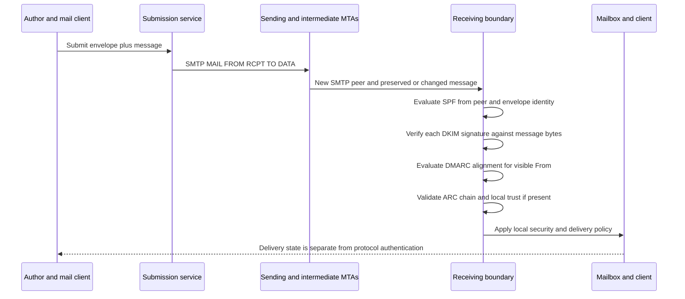
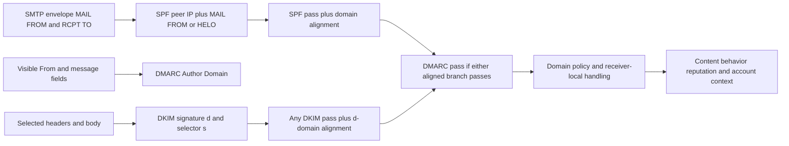
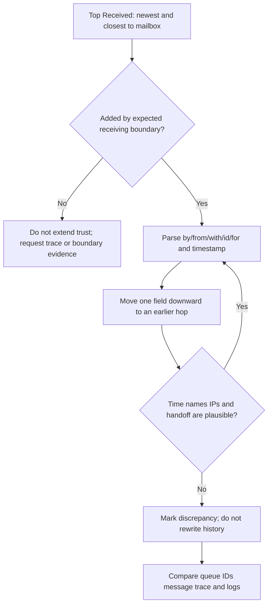
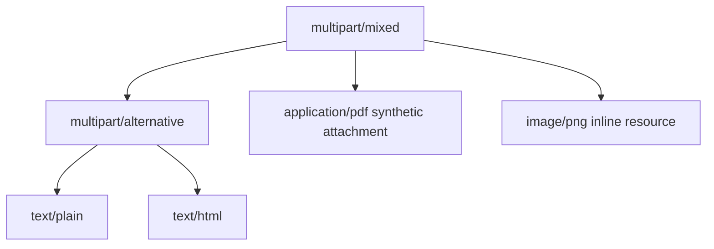
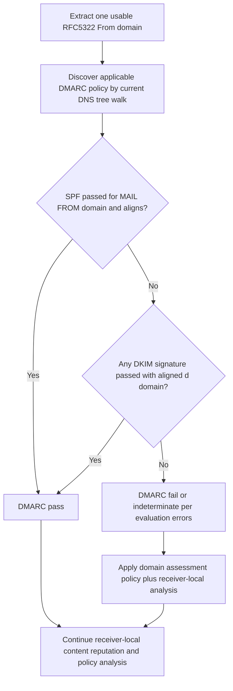
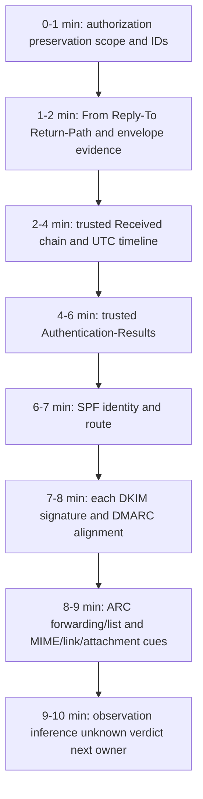

# Appendix C - Email Header and Authentication Cheat Sheet

> **Audience:** Arti Thakur, preparing for an Abnormal AI Technical Support Engineer interview  
> **Reference date:** August 24, 2026  
> **Evidence rule:** Authentication results answer narrow identity and integrity questions. They do not, alone, prove human authorship, benign content, account safety, inbox placement, or a product verdict.

## Purpose and How to Use This Appendix

Use this appendix to triage one email from preserved raw source without getting trapped by the visible display name or a single `pass`/`fail`. Start with the message and SMTP identities, reconstruct the trusted route, read the receiving boundary’s authentication results, evaluate SPF/DKIM/DMARC/ARC separately, inspect MIME and threat context safely, then state a bounded verdict.

1. **Anchor one message:** approved tenant/context, Message-ID or trace ID, recipient, and UTC delivery window.
2. **Preserve before parsing:** retain the authorized original; analyze a protected working copy; record hashes/manifests under policy where required.
3. **Trust by provenance:** identify which system added each trace/authentication field. User-authored or externally injected fields can imitate trusted names.
4. **Separate protocol facts from inference:** “DKIM passed for `d=sender.example`” is a fact from a trusted verifier; “the message is legitimate” is an unsupported leap.
5. **Use the timed workflow:** ten minutes for first-pass routing, then deepen only where evidence discriminates.

> 🔍 **Plain-English deep-dive:** Think of an email as a parcel with three layers. The **SMTP envelope** is the courier routing slip, the **message headers** are labels printed on or inside the parcel, and the **body/MIME parts** are the contents. SPF evaluates part of the courier route, DKIM verifies a domain’s seal over selected normalized content, and DMARC asks whether at least one successful route/seal identity aligns with the visible author domain. None of these opens the parcel and decides whether the request inside is honest.

## Candidate Honesty and Safety Boundary

Arti can truthfully describe Microsoft enterprise-support experience, transferable evidence-led troubleshooting, official-document study, and synthetic/local email-header labs. She must not claim direct production operation of Abnormal AI, email-security operations, Google Workspace, Slack, Okta, Splunk, CrowdStrike, Cortex SOAR, Zendesk, Salesforce, Jira, or Zoom.

Do not send tests through a customer domain without authorization, visit suspicious links, open active attachments, query private systems, or copy raw customer content into an interview artifact. Do not request passwords, tokens, private DKIM keys, or signing secrets. Defang any displayed URL; preserve the original only in an approved restricted evidence store. Product verdicts, remediation, allowlisting, and policy changes require the owning team and current authorized documentation. See [Part 001 - Role Compass and Honest Candidate Story](Part-001-role-compass-and-honest-candidate-story.md), [Part 005 - Privacy Data Handling and Evidence Ethics](Part-005-privacy-data-handling-and-evidence-ethics.md), and [Part 098 - Safe Evidence Collection Redaction and Packaging](Part-098-safe-evidence-collection-redaction-and-packaging.md).

## End-to-End Message and Authentication Map





## 1. SMTP Envelope Versus Visible Message

The envelope exists during SMTP transfer and is not simply the top of the raw message. Some envelope information is later represented in trace fields, but transformations can change it between hops.

| Identity or field | Where it exists | Main job | Authentication use | Common trap |
|---|---|---|---|---|
| SMTP `MAIL FROM` / reverse-path | SMTP envelope | Bounce routing and sender-side transaction identity | SPF normally evaluates its domain; DMARC can use aligned SPF pass | Not the visible From; can be null `<>` for bounces |
| SMTP `RCPT TO` | SMTP envelope | Actual delivery recipient for that hop | Not a DMARC identity | May differ from visible To due to Bcc, alias, list, or forwarding |
| `From` / RFC5322.From | Message header | Visible author identity | Domain is the DMARC Author Domain | Can be spoofed; display name and address are separate |
| `Sender` | Message header | Agent sending on behalf of author in defined cases | Not the DMARC alignment identity | Presence does not automatically mean malicious “on behalf of” |
| `To` / `Cc` | Message headers | Displayed recipient list | Not proof of SMTP recipients | Bcc recipients need not appear |
| Display name | Part of address field | Human-readable label | Not authenticated by SPF/DMARC as a name | `CEO <outside@example.net>` can show “CEO” without domain spoofing |
| `Return-Path` | Trace field added at final delivery | Records the envelope reverse-path used for final delivery | Often useful to identify the final-hop SPF MAIL FROM | Do not assume an arbitrary upstream Return-Path is trusted |
| `Reply-To` | Message header | Address a client should use for replies | Not evaluated by DMARC | Mismatch is a clue, not automatic maliciousness |
| `Message-ID` | Message header | Message/thread correlation identifier | No authentication by itself | Sender-generated, forgeable, missing, duplicate, or rewritten |

### Envelope-to-Header Example

```text
SMTP transaction (not itself a message header):
  MAIL FROM:<bounce-42@mailer.sender.example>
  RCPT TO:<arti@recipient.example>

Visible/raw message fields:
  From: Accounts Team <billing@sender.example>
  To: Arti <arti@recipient.example>
  Reply-To: case-42@sender.example
```

The envelope sender, visible author, and reply destination differ, but all are within related synthetic domains. That can be legitimate. Evaluate SPF for the actual SMTP identity, DKIM for each signature, DMARC alignment with `sender.example`, and business context separately.

## 2. Header Trust and Provenance

| Header family | Usually added by | Diagnostic use | Trust requirement |
|---|---|---|---|
| `Received` | Each handling MTA prepends one | Route, protocol, peer claims, time | Trust the portions added by known boundaries; earlier text can be spoofed |
| `Return-Path` | Final delivery system | Final envelope reverse-path | Confirm it is at the expected delivery boundary |
| `Authentication-Results` | Authenticating administrative domain | SPF/DKIM/DMARC/ARC results and properties | `authserv-id` and path must match receiver trust boundary |
| `Received-SPF` | SPF evaluator | SPF inputs/result explanation | Same boundary/provenance caution; not a DMARC result |
| `ARC-*` | ARC-participating intermediaries | Signed authentication history and chain | Cryptographic validation plus local sealer trust |
| `DKIM-Signature` | Signing system before/along path | Signed domain, selector, scope, signature data | Verify; mere presence proves nothing |
| `Message-ID`, `Date`, `From`, `Reply-To` | Originator/client or later transformer | Correlation and semantic clues | Treat as asserted message content unless signed/trusted |
| `X-*` / product-specific | Any component | Potential routing/policy clues | Name/prefix does not establish authority; require product documentation/provenance |

> **Trust rule:** Work inward from headers added by systems you control or explicitly trust. An attacker can place a fake `Authentication-Results: dkim=pass` line in the submitted message. A properly configured receiving boundary removes or distinguishes untrusted copies and adds its own result, but support must identify that boundary rather than trusting the field name.

## 3. Reading the Received Chain

Each MTA normally prepends a `Received` field, so the **top is newest** and the **bottom is earliest** among the fields present. For chronology, start at the lowest plausible trusted/origin-adjacent field and move upward. For trust, start at the top boundary you know and walk down only as far as provenance remains defensible.



### Received Components

| Component | Typical meaning | Useful question | Caveat |
|---|---|---|---|
| `from` | Sending peer’s asserted/resolved identity | Which peer did this receiver observe? | Name can be asserted; preserve observed IP when present |
| `by` | Receiving MTA | Which system added this field? | Establish whether it is a trusted boundary |
| `with` | Transfer protocol, sometimes TLS/ESMTP details | Was ESMTP/TLS/local transfer claimed? | Tokens and detail vary by implementation |
| `id` | Queue/transaction identifier | Can this hop be found in its logs? | Scope is local to the handling system |
| `for` | One recipient associated with this delivery | Which recipient path was recorded? | May be omitted for privacy/multiple recipients |
| Timestamp/offset | Local time when field was added | What is UTC ordering and delay? | Clocks can skew; formatting can be malformed |

### Synthetic Chain

```text
Received: from edge.receiver.example (edge.receiver.example [198.51.100.20])
        by mailbox.receiver.example with ESMTPS id SYN003
        for <arti@recipient.example>; Mon, 24 Aug 2026 14:02:10 +0000
Received: from outbound.sender.example (outbound.sender.example [192.0.2.44])
        by edge.receiver.example with ESMTPS id SYN002
        for <arti@recipient.example>; Mon, 24 Aug 2026 14:02:07 +0000
Received: from submit.sender.example (submit.sender.example [192.0.2.10])
        by outbound.sender.example with ESMTPSA id SYN001;
        Mon, 24 Aug 2026 14:02:01 +0000
```

**Read bottom-up for time:** submission at `14:02:01Z`, outbound handoff at `14:02:07Z`, final mailbox handoff at `14:02:10Z`. **Read top-down for trust:** first confirm `mailbox.receiver.example` and `edge.receiver.example` are expected receiver boundaries. The documentation does not prove the real existence or ownership of any system; all names/IPs are synthetic/reserved.

### Delay Cues

| Pattern | Possible explanation | Discriminating evidence |
|---|---|---|
| Long gap before a receiving hop | Queue delay, deferral, scan, outage, rate/policy | SMTP queue history/NDR, reporting host, enhanced response |
| Negative time gap | Clock skew, wrong timezone parse, forged/malformed field | Original offsets, server clock evidence, trusted logs |
| Missing expected hop | Internal transport omits public field, header stripped, alternate route | Message trace, connector/gateway logs, architecture owner |
| Duplicate/looping hosts | Routing loop or repeated processing | Queue IDs, connector/rule path, `5.4.6`, repeated pattern |
| Different peer than expected | Alternate route, forwarding, gateway, compromise, stale architecture | Observed IP, DNS, connector config, change timeline |

## 4. Message-ID, Threading, and Timestamps

| Field | Purpose | How to use | Limitation |
|---|---|---|---|
| `Message-ID` | Identifier for one message | Correlate trace/log/client copies with tenant/time | Not guaranteed globally unique/authentic |
| `In-Reply-To` | Identifies message being replied to | Check whether reply claims relation to known message | Can be absent/forged/rewritten |
| `References` | Ordered thread ancestry identifiers | Reconstruct longer thread relationships | Clients truncate or interpret differently |
| `Thread-Index` / vendor fields | Provider/client thread metadata | Correlate only with documented implementation | Nonstandard and not universal trust proof |
| `Date` | Originator’s claimed composition date/time | Compare with first trusted receipt | User clock/timezone can be wrong or manipulated |
| `Received` timestamps | Per-hop handling time | Build route chronology in UTC | Each system clock can skew |
| Authentication/signature time (`t=`) | DKIM signing time when present | Compare signing, receipt, expiry | Optional and signer-asserted; not absolute truth |

Normalize copies to UTC while retaining the original string, offset, precision, source, and confidence. A thread can be hijacked through a compromised account or fabricated identifiers; matching `References` is supporting context, not proof of trusted authorship.

## 5. MIME, Bodies, and Attachments

MIME lets one message contain nested text, HTML, inline images, and attachments. Parse structure with an approved MIME parser; do not split boundaries or decode content with improvised string rules.

| Field/concept | Meaning | Triage cue | Trap |
|---|---|---|---|
| `MIME-Version` | Indicates MIME formatting, normally `1.0` | Expect MIME content fields | Absence does not make content safe |
| `Content-Type` | Media type and parameters | Compare declared type, filename, and safe file-identification result | Declaration can lie or be malformed |
| `multipart/mixed` | Multiple independent parts, often body plus attachment | Walk each child in order | Nested multiparts are common |
| `multipart/alternative` | Alternative representations of same content | Compare text/plain and text/html intent/links | Clients choose one representation |
| `multipart/related` | Related resources, often HTML plus inline images | Map `cid:` references and parts | Inline does not mean harmless |
| `boundary` | Delimiter between child parts | Confirm opens/closes and nesting | Boundary-like text inside encoded content is not necessarily delimiter |
| `Content-Transfer-Encoding` | Safe transport representation such as base64 or quoted-printable | Decode only in controlled analysis; preserve original bytes | Encoding is not encryption or safety |
| `Content-Disposition` | `inline` or `attachment`, often filename | Treat as UI hint | Client may render differently; filename can mislead |
| `filename` / `name` | Suggested file name | Normalize/display safely; inspect extension mismatches | Multiple/encoded parameters and Unicode can confuse |
| Magic/file signature | Bytes identifying format | Compare with declared MIME/extension through approved tooling | Polyglots and malformed files need specialist analysis |

### MIME Tree Example



Do not open a suspicious attachment on a normal workstation, enable macros, extract/run scripts, or upload customer content to an unapproved public scanner. Record hashes and metadata only under authorized process; route active content to the security/malware-analysis owner. See [Part 022 - MIME Bodies Attachments and Encodings](Part-022-mime-bodies-attachments-and-encodings.md) and [Part 038 - Malicious Attachments Malware and Ransomware](Part-038-malicious-attachments-malware-and-ransomware.md).

## 6. Authentication-Results

`Authentication-Results` communicates evaluations performed by an authentication service. The first token identifies the service (`authserv-id`), followed by method results and properties.

```text
Authentication-Results: edge.receiver.example;
    spf=pass smtp.mailfrom=bounce.sender.example;
    dkim=pass header.d=sender.example header.s=aug2026;
    dmarc=pass header.from=sender.example policy.dmarc=reject;
    arc=none
```

| Element | Meaning | Question |
|---|---|---|
| `authserv-id` | Administrative service reporting results | Is it the expected trusted receiver boundary? |
| `spf=...` | SPF evaluation | Which `smtp.mailfrom` or `smtp.helo` property and peer IP were used? |
| `dkim=...` | One signature evaluation | Which `header.d`, selector, algorithm, and signature instance? |
| `dmarc=...` | DMARC validation | What `header.from`, aligned branch, and applicable policy were used? |
| `arc=...` | ARC chain validation | What chain length/result and trusted sealer context apply? |
| `reason=` / comments | Diagnostic detail | Is it standard/provider text, and does it expose sensitive data? |
| `policy.*` | Policy property | Do not confuse recorded policy with final disposition |

If multiple `Authentication-Results` fields exist, identify which were added by each known boundary. Never merge properties from different hops into one fictional result.

## 7. SPF Cheat Sheet

### SPF Inputs and Results

SPF evaluates whether the **receiver-observed SMTP client IP** is authorized by DNS policy for an SMTP identity. For ordinary mail, the principal identity is the `MAIL FROM` domain; HELO can also be checked. For null `MAIL FROM:<>`, SPF defines a HELO-based construction. SPF does not directly authenticate the visible From field.

| SPF result | Beginner meaning | Next cue | Not proven |
|---|---|---|---|
| `pass` | Policy authorized observed client IP for checked identity. | Record identity, IP, matching mechanism, DNS trace. | Human sender, visible From, content, safety, inbox |
| `fail` | Policy explicitly says the IP is not authorized. | Confirm correct peer/identity and transit-time policy. | Required receiver disposition or maliciousness |
| `softfail` | Policy weakly discourages authorization (`~`). | Treat as result input; publisher intent/receiver policy matter. | “Almost pass” |
| `neutral` | Policy makes no assertion (`?` or neutral outcome). | Use other evidence. | Failure or authorization |
| `none` | No applicable SPF policy was found. | Verify exact domain/DNS result. | Pass or fail |
| `temperror` | Temporary evaluation failure, often DNS. | Preserve DNS error/time; bounded retry may differ. | Publisher syntax defect |
| `permerror` | Policy cannot be correctly evaluated under protocol rules. | Record syntax, duplicates, recursion/lookup limit, missing include. | Temporary network outage |

### SPF Mechanisms and Modifiers

| Term | What it asks | DNS lookup-budget cue | Common trap |
|---|---|---|---|
| `all` | Always matches | No DNS-causing term | Usually last; qualifier controls result |
| `ip4`, `ip6` | Does client IP fall in prefix? | No DNS-causing term | Prefix omission/default and wrong observed peer |
| `a` | Does client IP match address records for target? | Counts as DNS-causing term | Target/default domain and address family matter |
| `mx` | Does client IP match address of target’s MX hosts? | Counts; fan-out limits apply | Not “use normal MX routing implicitly” |
| `include` | Does nested target SPF evaluation pass? | Counts; recursion shares global budget | Nested fail is include non-match; it does not become parent fail automatically |
| `exists` | Does macro-expanded target have any address result? | Counts | It tests DNS existence, not direct IP equality |
| `ptr` | Validated reverse-name mechanism | Counts and is discouraged for publication | Expensive/fragile; PTR presence alone is insufficient |
| `redirect=` | If no mechanism matched, use another domain’s policy result | Counts when evaluated | Modifier, not an inline include |
| `exp=` | Optional explanation domain after fail | Normally not part of authorization path | Explanation text does not change result |

Qualifiers are `+` pass/default, `-` fail, `~` softfail, and `?` neutral. SPF has a global limit of ten evaluated DNS-causing terms across recursion; additional void/fan-out/resource rules apply. Preserve a step trace rather than counting only visible `include` strings.

## 8. DKIM Cheat Sheet

DKIM lets a domain sign selected canonicalized message headers and a body scope. The verifier finds a public key at `<selector>._domainkey.<signing-domain>` and checks the body hash and header signature.

### DKIM-Signature Tags

| Tag | Meaning | Triage cue | Limit/trap |
|---|---|---|---|
| `v=1` | DKIM version | Validate syntax/version. | Usually required and first under parsing rules |
| `a=` | Signing algorithm | Apply current algorithm/key requirements. | RSA-SHA1 is obsolete/prohibited by current update |
| `c=` | Header/body canonicalization | Default is simple/simple if absent. | Relaxed tolerates defined whitespace changes only |
| `d=` | Signing Domain Identifier (SDID) | Domain accountable for signature. | Not automatically visible From or human sender |
| `s=` | Selector | Build DNS key name with `d=`. | Selector is not identity/alignment by itself |
| `h=` | Ordered list of signed header field names | Select bottommost remaining instances in order. | It does not sign every field with that name unless listed repeatedly |
| `bh=` | Hash of canonicalized body scope | Recompute first to isolate body changes. | Pass does not validate unsigned headers |
| `b=` | Signature over selected headers plus DKIM field with empty `b` value | Verify with public key. | Placeholder examples here are never verifiable |
| `i=` | Optional Agent/User Identifier (AUID) | Check domain relationship and signer semantics. | DMARC aligns `d=`, not `i=` |
| `l=` | Optional signed body length | Identify unsigned suffix exposure. | A valid signature can leave appended content unsigned |
| `t=` / `x=` | Signature time/expiration | Compare with receipt and clock evidence. | Optional signer assertions; not delivery proof |
| `q=` | Query method | Usually DNS/TXT method. | Current verifier support/policy applies |

### Canonicalization

| Area | `simple` | `relaxed` | Neither mode ignores |
|---|---|---|---|
| Headers | Preserves field bytes/folding except required line handling | Lowercases field name, unfolds, compresses WSP, trims defined WSP | Changed field values/words, selected instance changes |
| Body | Preserves lines with defined trailing-empty-line treatment | Compresses in-line WSP, strips line-end WSP, ignores trailing empty lines | Added footer, changed words, changed MIME boundary/content |

### What a DKIM Pass Does and Does Not Mean

| A pass supports | A pass does not establish |
|---|---|
| Public key under `s._domainkey.d` verified the declared signature | Human author identity or account safety |
| Selected canonicalized headers were unchanged within mode | Integrity of unsigned headers |
| Declared body scope matched `bh=` | Safety/truth of content or attachments |
| `d=` is the signing identity output | DMARC alignment unless `d=` aligns with visible From |
| One signature passed | Every other signature passed or is relevant |
| Content survived from signing point | What happened before signing or whether content is replayed |

**Operational limits:** Key compromise, replay, overly broad third-party signing, weak key lifecycle, unsigned fields, `l=` suffixes, and post-sign transformations all matter. Never request a private key. Evaluate each signature independently. See [Part 026 - DKIM Message Signing](Part-026-dkim-message-signing.md).

## 9. DMARC Cheat Sheet

The current standards-track model in this guide uses **RFC 9989** for core DMARC, **RFC 9990** for aggregate reporting, and **RFC 9991** for failure reporting. They obsolete the older RFC 7489 model. Current policy discovery uses a bounded DNS Tree Walk; tags including `np`, `psd`, and `t` are active, while former `pct`, `rf`, and `ri` tags are historic. Provider documentation can lag, so label legacy compatibility language separately.

### DMARC Decision



$$
\text{DMARC pass}=(\text{SPF pass}\land\text{SPF aligned})\lor(\exists\ \text{DKIM pass}\land\text{DKIM aligned})
$$

### Alignment

| Branch | Authenticated identifier | Compared with | Relaxed (`r`) | Strict (`s`) |
|---|---|---|---|---|
| SPF | SPF domain from validated RFC5321.MailFrom (including defined null-path handling) | RFC5322.From Author Domain | Same Organizational Domain under current DMARC algorithm | Exact domain match |
| DKIM | `d=` for each passing DKIM signature | RFC5322.From Author Domain | Same Organizational Domain | Exact domain match |

A normal HELO-only SPF pass for non-null mail is not a separate DMARC SPF branch. `Reply-To`, display name, DKIM `i=`, and `Sender` are not DMARC alignment identities.

### Core DMARC Record Cues

| Tag | Purpose | Support cue |
|---|---|---|
| `v=DMARC1` | Version marker | Must identify the current DMARC record under syntax rules |
| `p=` | Assessment policy for applicable domain | `none`, `quarantine`, or `reject`; receiver retains final discretion |
| `sp=` | Subdomain policy | Applies where current policy-discovery rules select it |
| `np=` | Policy for non-existent subdomains | Distinguish NXDOMAIN from no requested record data |
| `adkim=` | DKIM alignment mode | `r` relaxed default or `s` strict |
| `aspf=` | SPF alignment mode | `r` relaxed default or `s` strict |
| `rua=` | Aggregate report destination(s) | Authorization, privacy, size, and report-processing controls matter |
| `ruf=` / `fo=` | Failure-report destination/options | Sensitive content/privacy and receiver support vary; RFC 9991 applies |
| `psd=` | Public Suffix Domain signaling | Current tree-walk/organizational-domain semantics apply |
| `t=` | Testing-mode signal in current DMARC | Do not substitute historic `pct` semantics |

### DMARC Results, Policy, and Disposition

| Layer | Example | Correct wording |
|---|---|---|
| Validation | `dmarc=fail header.from=sender.example` | “Neither aligned authentication branch passed for the Author Domain.” |
| Domain assessment policy | `policy.dmarc=reject` | “The applicable domain published a reject assessment policy.” |
| Receiver override | Trusted forwarder/local policy | “The receiver applied a local override based on documented context.” |
| Final disposition | Delivered, junked, quarantined, rejected | “The receiver made this handling decision.” |
| Threat verdict | Benign, suspicious, malicious, uncertain | “The verdict used authentication plus content, behavior, reputation, identity, and context.” |

DMARC pass is authorized domain use through an aligned SPF or DKIM branch. It does not prove the message is benign, because a compromised legitimate account or authorized sending service can send harmful content. DMARC fail does not prove maliciousness, because forwarding and list transformations can break aligned paths.

### Reporting

| Report | Current anchor | What it summarizes | Safety/interpretation |
|---|---|---|---|
| Aggregate | RFC 9990 | Counts grouped by source/authentication/alignment/policy observations | Aggregates are delayed and receiver-dependent; raw pass is not aligned pass |
| Failure | RFC 9991 | Per-message failure detail where generated/supported | May contain message/header content and personal data; minimize and protect |
| Local provider dashboard | Provider documentation | Provider-specific telemetry and classifications | Not interchangeable with standards reports; retention/fields vary |

## 10. ARC Cheat Sheet

ARC carries attributed authentication history through intermediaries that may change route or content. It does **not** turn current SPF, DKIM, or DMARC failures into passes and does not prove safety.

| ARC field | Job | Key tags/cues | Common trap |
|---|---|---|---|
| `ARC-Authentication-Results` (AAR) | Records what a participant says it observed on arrival | `i=` plus authserv-id and results | Historical signed assertion, not final receiver result |
| `ARC-Message-Signature` (AMS) | DKIM-like signature over message state | `i=`, `d=`, `s=`, `h=`, `bh=`, `b=` | Latest and older signatures have defined validation roles |
| `ARC-Seal` (AS) | Seals the ARC set and earlier chain | `i=`, `cv=`, `d=`, `s=`, `b=` | `cv` reports prior chain state, not message safety |

### Chain Checklist

| Check | Expected |
|---|---|
| Instance sequence | Continuous `i=1..N`, no gaps/duplicates |
| Field count | Exactly one AAR, AMS, and AS for each instance |
| First `cv` | `none` at instance 1 because no prior chain exists |
| Later `cv` | `pass` or `fail` describing prior chain as assessed by sealer |
| Cryptography | Validate signatures/keys under RFC 8617 and current crypto requirements |
| Trust | Identify sealing domains, known path/purpose, and receiver’s documented local trust |
| Final interpretation | State current SPF/DKIM/DMARC, ARC validation/history, trust, and disposition separately |

An intact ARC chain from an unknown or untrusted sealer is cryptographically interesting but not automatically policy-relevant. A trusted sealer can also be compromised; combine ARC with independent threat evidence. See [Part 028 - ARC Forwarding and Authentication Preservation](Part-028-arc-forwarding-and-authentication-preservation.md).

## 11. BIMI Cheat Sheet

BIMI is a DNS-published brand-indicator assertion used by participating mailbox providers. It is a presentation/brand ecosystem built on authenticated, policy-eligible mail and provider discretion. It is not an authentication replacement or delivery control.

| Dependency | What to verify | Limitation |
|---|---|---|
| Actual message | DMARC passes for the visible From domain | DNS configuration alone is insufficient |
| DMARC policy eligibility | Current provider criteria and current RFC semantics | Provider docs may retain historic wording; revalidate |
| BIMI TXT | Correct selector, normally `default._bimi.<domain>`, one parseable `v=BIMI1` assertion | Selector/domain must match actual provider/message context |
| Logo location `l=` | HTTPS-hosted compliant SVG profile | Fetch/format pass does not guarantee display |
| Authority evidence `a=` | VMC/CMC or other provider-supported evidence where required | Certificate eligibility and issuance are not support/legal promises |
| Reputation and volume | Provider-specific wanted-mail/reputation criteria | Weighting is private and dynamic |
| Mailbox provider/client | Supports BIMI and chooses to display | Display can vary by client/account/message/cache |

**VMC** means Verified Mark Certificate, generally associated with a qualifying verified trademarked mark. **CMC** means Common Mark Certificate for qualifying non-trademark mark paths. Exact eligibility, issuers, jurisdictions, SVG profiles, and provider requirements must come from current official documentation. A displayed logo does not prove content safety; a missing logo does not prove bad reputation or authentication failure. See [Part 029 - BIMI Reputation and Blocklists](Part-029-bimi-reputation-and-blocklists.md).

## 12. Common Patterns and What They Mean

| Pattern | Authentication behavior | Plausible benign explanation | Security concern | Next discriminator |
|---|---|---|---|---|
| Exact-domain spoof, no authorized path | SPF/DKIM unaligned or fail; DMARC fail | Misconfigured legitimate sender | Direct spoofing | Known stream inventory, message content, source, reports |
| Display-name impersonation | SPF/DKIM/DMARC may pass for attacker-controlled domain | Legitimate person with same name | Human trusts name, not domain | Exact address/domain, relationship, intent, reply target |
| Lookalike domain | Authentication may fully pass for lookalike | New legitimate partner/domain | Cousin-domain impersonation | Domain spelling/registration, known relationship, content, out-of-band check |
| Compromised legitimate account | SPF/DKIM/DMARC may pass and align | Normal account activity | ATO/internal abuse | Sign-in/session/audit behavior, relationship anomaly, mailbox changes |
| Simple forwarding preserves MAIL FROM | SPF often fails at final receiver | Legitimate forwarding | Untrusted reroute | Route evidence, DKIM survival, ARC, forwarder trust |
| Forwarder rewrites MAIL FROM | SPF may pass for forwarder but be unaligned | SRS/bounce handling | Misleading route assumptions | SPF identity, From domain, DKIM/ARC |
| Mailing list changes Subject/body | Origin DKIM may fail; list DKIM may pass unaligned; DMARC may fail | Expected list footer/tag | Malicious/compromised list or altered content | ARC history, list identity/trust, known subscription, content |
| Gateway adds disclaimer after signing | Body hash may fail | Authorized post-sign transformation | Integrity gap or ordering defect | Signing/transformation timestamps and controlled test |
| Third-party sender signs its domain | DKIM passes but may be DMARC-unaligned | Provider not configured for aligned signing | Unauthorized sender/config drift | Stream owner, custom DKIM, SPF MAIL FROM alignment |
| Reply-To differs from From | Authentication unaffected | Ticketing, CRM, list, delegated replies | Reply redirection/fraud | Known workflow, domain relationship, business request |
| Message-ID/thread fields match | No automatic auth effect | Legitimate reply | Thread hijack or fabricated thread | Account state, prior raw message, References, content/style, route |

## 13. Ten-Minute Header Triage Workflow



| Time | Action | Output |
|---:|---|---|
| 0:00-1:00 | Confirm authorization, source, tenant/context, recipient, Message-ID/trace ID, report time; create redacted working copy. | Evidence scope and handling note |
| 1:00-2:00 | Record display name, RFC5322.From, Reply-To, Return-Path, To/Cc, and available envelope identities. | Identity comparison row |
| 2:00-4:00 | Identify trusted top boundary; walk Received hops; normalize UTC; note gaps, delays, peer IPs, queue IDs. | Route/timeline |
| 4:00-6:00 | Locate trusted Authentication-Results; inventory SPF, every DKIM, DMARC, ARC, and properties. | Mechanism matrix |
| 6:00-7:00 | Verify SPF input identity, observed peer, result, matching mechanism/record trace if needed. | SPF route statement |
| 7:00-8:00 | For each DKIM signature record `d/s/a/c/h/l/t/x`, result, and mutation clue; apply DMARC aligned-OR rule/current policy. | DKIM/DMARC statement |
| 8:00-9:00 | If indirect path, inventory ARC and sealer trust; map MIME tree, URLs as defanged metadata, attachment metadata, and reply target. | Transformation/content-risk cues |
| 9:00-10:00 | Write Observation, Inference, Unknown, Confidence, Verdict language, immediate safe action, next owner/test. | Triage summary |

### Authentication Worksheet

| Mechanism | Trusted result | Evaluated identity | Alignment/scope | Evidence and limitation |
|---|---|---|---|---|
| SPF |  | Peer IP:; MAIL FROM/HELO: | DMARC aligned? | Transit-time result versus current DNS |
| DKIM 1 |  | `d=`; `s=` | DMARC aligned? `h=`/`l=` scope | Body/header failure gate; algorithm/key |
| DKIM 2 |  | `d=`; `s=` | DMARC aligned? | Evaluate independently |
| DMARC |  | `header.from=` | SPF OR DKIM branch | Policy domain/tags; result versus disposition |
| ARC |  | Instances/sealers | Historical claims | Validation versus local sealer trust |
| BIMI |  | From domain/selector/provider | Presentation eligibility | Never a safety verdict |

## 14. Synthetic Annotated Raw Message

The following is harmless and deliberately non-verifiable. Domains use reserved `.example`; IPs use documentation ranges; URL uses reserved `.invalid`; signatures are placeholders.

```text
Return-Path: <bounce-42@mailer.sender.example>                     [1]
Received: from edge.receiver.example (edge.receiver.example [198.51.100.20])
        by mailbox.receiver.example with ESMTPS id SYN-R2
        for <arti@recipient.example>; Mon, 24 Aug 2026 14:02:10 +0000 [2]
Received: from outbound.sender.example (outbound.sender.example [192.0.2.44])
        by edge.receiver.example with ESMTPS id SYN-R1
        for <arti@recipient.example>; Mon, 24 Aug 2026 14:02:07 +0000 [3]
Authentication-Results: edge.receiver.example;
        spf=pass smtp.mailfrom=mailer.sender.example;
        dkim=pass header.d=sender.example header.s=aug2026;
        dmarc=pass header.from=sender.example policy.dmarc=reject;
        arc=none                                                     [4]
DKIM-Signature: v=1; a=rsa-sha256; c=relaxed/relaxed;
        d=sender.example; s=aug2026; h=from:to:subject:date:message-id;
        bh=[SYNTHETIC-BODY-HASH-NOT-VERIFIABLE];
        b=[SYNTHETIC-SIGNATURE-NOT-VERIFIABLE]                       [5]
From: Accounts Team <billing@sender.example>                         [6]
Reply-To: case-42@sender.example                                     [7]
To: Arti <arti@recipient.example>
Date: Mon, 24 Aug 2026 14:01:58 +0000
Message-ID: <synthetic-42@sender.example>                             [8]
Subject: Synthetic account notice
MIME-Version: 1.0
Content-Type: multipart/alternative; boundary="syn-boundary-42"       [9]

--syn-boundary-42
Content-Type: text/plain; charset=UTF-8

This is a harmless synthetic message. Reference: hxxps://portal.example[.]invalid/case/42 [10]
--syn-boundary-42
Content-Type: text/html; charset=UTF-8

<p>This is a harmless synthetic message.</p>
--syn-boundary-42--
```

### Annotation Key

| # | Interpretation |
|---:|---|
| 1 | Final delivery records a MAIL FROM under `mailer.sender.example`; verify boundary provenance. |
| 2 | Newest trusted delivery hop in this synthetic chain. |
| 3 | Receiving edge says it observed sender IP `192.0.2.44`; this is the likely SPF peer for that boundary. |
| 4 | Synthetic trusted receiver results: SPF passes for a relaxed-aligned subdomain; DKIM passes with aligned `d=`; DMARC passes. These are assertions for the exercise, not cryptographic proof. |
| 5 | DKIM selects five headers and full body by omission of `l=`; placeholders cannot verify. |
| 6 | Visible Author Domain is `sender.example`, the DMARC comparison identity. |
| 7 | Matching organizational domain lowers one mismatch concern but is not proof of benign intent. |
| 8 | Correlation clue only; sender-generated and not inherently trustworthy. |
| 9 | Parser should expect two alternative body representations. |
| 10 | Defanged reserved URL; do not activate it. URL/content risk remains independent of auth pass. |

### Correct Bounded Verdict

> **[Observation]** At the synthetic receiving boundary, SPF is reported pass for `mailer.sender.example`, DKIM pass for `d=sender.example`, and DMARC pass for visible From `sender.example`. The recorded route uses documentation IPs and shows a three-second edge-to-mailbox handoff. The message has a two-part alternative body and no attachment.
>
> **[Inference]** The supplied results are consistent with authorized use of the Author Domain through both relaxed-aligned SPF and aligned DKIM in this exercise. They do not establish the human sender, account state, business truth, link safety, or actual product disposition.
>
> **[Unknown]** No real DNS, cryptographic verification, tenant telemetry, account audit, reputation, content-detection, or user relationship evidence exists because this is a synthetic example.
>
> **Verdict language:** Authentication-consistent synthetic message; threat disposition intentionally undetermined.

## 15. Synthetic Forwarding/List Pattern

**Scenario:** `sender.example` sends to `team@list.example`. At list entry, aligned SPF/DKIM and DMARC pass. The list changes Subject and appends a footer, then signs as `list.example` and creates ARC set 1. The final receiver observes SPF pass for a list envelope domain (unaligned), origin DKIM fail after modification, list DKIM pass (unaligned), DMARC fail for `sender.example`, and ARC pass.

| Layer | Correct conclusion |
|---|---|
| Current SPF | Pass for list route identity; not DMARC-aligned with `sender.example` |
| Current origin DKIM | Fail, plausibly explained by list modification; exact first divergence still needs verification |
| Current list DKIM | Pass for `list.example`; not an aligned signature for original Author Domain |
| Current DMARC | Fail because neither current aligned branch passes |
| ARC | Chain can preserve list-attributed history that DMARC passed before modification |
| Trust | Receiver must validate chain and decide whether `list.example` is trusted for this purpose |
| Threat | Still requires content, relationship, account, reputation, and policy evidence |
| Disposition | Receiver-local; ARC pass does not rewrite DMARC to pass |

## 16. Evidence Preservation and Redaction

| Artifact/field | Diagnostic value | Sensitivity | Safe handling |
|---|---|---|---|
| Original `.eml`/raw source | Exact bytes, headers, MIME, signatures | Message content, PII, URLs, attachments, internal routing | Restrict, hash/manifest if policy requires, preserve read-only original, analyze copy |
| Header-only export | Route/auth/IDs | Addresses, IPs, tenant/product IDs, subject | Minimize fields; structurally redact working/share copy |
| Message body | Intent/content | Personal/business/confidential content | Collect only if needed and authorized; summarize where sufficient |
| Attachment | File/content evidence | Active content, malware, intellectual property | Do not open normally; approved isolated specialist workflow only |
| URL | Destination/redirect clue | Tokens, PII, live risk | Preserve original restricted; defang display; remove query secrets from shared copy |
| `Authentication-Results` | Mechanism outcomes/properties | Domains, internal authserv IDs | Keep method/properties; pseudonymize only where it preserves relationships |
| `Received` | Route/timing | Internal hosts/IPs/queue IDs | Preserve restricted; replace consistently in interview/public artifact |
| Message-ID/trace/request ID | Correlation | Tenant/user/business correlation | Use case-safe placeholder outside authorized system |
| DKIM public-key metadata | Verification | Usually public, but operational selectors matter | Never request/share private key; timestamp DNS observation |
| ARC chain | Indirect-flow history | Sealer path, auth identities, IPs | Preserve order/instances; redact consistently |

### Redaction Rules

1. Preserve the original only in an approved restricted location; redact a derived copy.
2. Replace values consistently, e.g. one real domain becomes `sender.example` everywhere.
3. Preserve syntax, field ordering, line folding where diagnostically relevant, timestamps’ relationships, and identifier joins.
4. Remove secrets from URLs, `Authorization`, cookies, tokens, credentials, private keys, and attachment content.
5. Validate that hidden layers, comments, filenames, screenshots, archives, and derived exports do not retain sensitive data.
6. Record who collected, when, source, purpose, transformations, storage, access, retention, and deletion under policy.

## 17. Verdict Language

| Evidence state | Safe language | Unsafe language |
|---|---|---|
| SPF pass only | “The observed IP was authorized for the checked MAIL FROM/HELO identity.” | “The sender is legitimate.” |
| DKIM pass | “The selected canonicalized scope verified for signing domain `d=`.” | “The entire email is authentic and unchanged.” |
| DMARC pass | “At least one passing authentication identity aligned with the visible From domain.” | “DMARC says the message is safe.” |
| DMARC fail after forwarding | “Current aligned paths fail; indirect-flow transformation is a supported hypothesis.” | “It is spoofed.” |
| ARC pass from trusted sealer | “The intact, locally trusted chain may inform receiver handling of historical results.” | “ARC fixes DMARC and guarantees delivery.” |
| Reply-To mismatch | “Reply routing differs and should be validated against the business workflow.” | “This proves phishing.” |
| Lookalike domain with auth pass | “The lookalike authenticated as itself; brand/relationship intent remains suspicious.” | “SPF/DKIM failed.” |
| Insufficient evidence | “Current evidence is inconclusive; the next discriminator is…” | “Probably fine.” |

### Five-Line Triage Summary

1. **Observed:** Exact identities, route, mechanism results, MIME/content metadata, and disposition evidence.
2. **Inference:** Most supported explanation and what would disconfirm it.
3. **Unknown:** Missing private/provider/account/content evidence.
4. **Risk/verdict:** Bounded language with confidence and no protocol overclaim.
5. **Action:** Minimum safe containment/test, owner, and evidence request.

## 18. Escalation Template

### Case Anchor

| Field | Value |
|---|---|
| Tenant/context-safe ID |  |
| Recipient scope and impact |  |
| UTC occurrence window |  |
| Message-ID / trace / queue IDs |  |
| Original evidence location and handling |  |
| Expected versus observed outcome |  |

### Identity and Route

| Item | Observation | Source/boundary | Confidence |
|---|---|---|---|
| RFC5322.From / display name |  |  |  |
| Reply-To / Return-Path |  |  |  |
| SMTP MAIL FROM / RCPT TO evidence |  |  |  |
| Received path and delays |  |  |  |
| Forwarder/list/gateway |  |  |  |

### Authentication and Content

| Item | Result | Identity/scope | Limitation |
|---|---|---|---|
| SPF |  | Peer/IP; MAIL FROM/HELO |  |
| DKIM signatures |  | `d=` / `s=` / signed scope |  |
| DMARC |  | Author/Policy Domain; aligned branch | Result versus policy/disposition |
| ARC |  | Instances/sealers/trust | History versus current result |
| BIMI |  | Provider/selector/prerequisites | Display discretion |
| MIME/URLs/attachments |  | Structure/defanged metadata | No unsafe execution |

### Analysis and Ask

- **[Observation]:**
- **[Inference and disconfirming check]:**
- **[Unknown/private behavior]:**
- **Scope and comparison case:**
- **Changes already tested and results:**
- **Immediate safety/customer action:**
- **Explicit owner question:**
- **Requested next evidence/decision:**
- **Customer update owner and next UTC checkpoint:**

## Troubleshooting Decision Cues

| Finding | Route next |
|---|---|
| SPF fail but aligned DKIM pass and DMARC pass | Explain route-specific SPF result; investigate only if delivery/policy symptom remains |
| DKIM fail after known footer insertion | Validate first body divergence and signing/transformation order |
| DMARC fail with direct path and no aligned signature | Sender/domain configuration and possible spoof investigation |
| DMARC fail only through known list/forwarder | ARC, transformation, sealer trust, and receiver override path |
| Authentication pass with fraud request | Treat auth as authorized-domain evidence; investigate account/relationship/business intent |
| Authentication fail with wanted new sender | Validate sender stream/config, route, alignment, and rollout; do not globally allowlist |
| Received chain contradicts product trace | Confirm message copy, boundary, IDs, header stripping, clocks, and alternate routes |
| Multiple DKIM signatures | Evaluate each independently; one aligned pass can satisfy DMARC |
| `l=` present | Identify unsigned suffix and whether added content matters |
| BIMI absent despite prerequisites | Scope provider/client/message/cache/reputation; do not infer authentication failure |

## Common Traps

1. Reading Received top-to-bottom as chronological origin-to-destination.
2. Trusting every `Authentication-Results` field without identifying `authserv-id` and boundary.
3. Calling SPF a check of visible From or DKIM a guarantee over all headers/body bytes.
4. Requiring both SPF and DKIM for DMARC pass instead of one passing aligned branch.
5. Using obsolete RFC 7489/`pct` assumptions instead of current RFCs 9989/9990/9991.
6. Treating `p=reject` as a remote delete command or guaranteed receiver disposition.
7. Treating ARC pass as DMARC pass, sender legitimacy, or universal delivery permission.
8. Treating BIMI display as authentication/safety or missing display as bad reputation proof.
9. Opening links/attachments or uploading customer artifacts to public tools during triage.
10. Claiming a product false positive/negative before expected policy, scope, ground truth, and telemetry are established.

## Cross-References

| Topic | Full lessons |
|---|---|
| Envelope/header/message structure | [Part 019](Part-019-email-ecosystem-anatomy-and-actors.md), [Part 020](Part-020-rfc-style-message-structure-envelope-and-headers.md), [Part 023](Part-023-headers-message-ids-threading-and-timestamps.md) |
| SMTP and MIME | [Part 021](Part-021-smtp-and-esmtp-conversation.md), [Part 022](Part-022-mime-bodies-attachments-and-encodings.md), [Part 033](Part-033-delivery-quarantine-remediation-ndrs-and-bounces.md) |
| SPF, DKIM, DMARC | [Part 025](Part-025-spf-sender-authorization.md), [Part 026](Part-026-dkim-message-signing.md), [Part 027](Part-027-dmarc-alignment-policy-and-reporting.md) |
| ARC and BIMI | [Part 028](Part-028-arc-forwarding-and-authentication-preservation.md), [Part 029](Part-029-bimi-reputation-and-blocklists.md) |
| Threat patterns | [Part 034](Part-034-email-threat-taxonomy-and-investigation-mindset.md), [Part 036](Part-036-bec-vendor-and-payment-fraud.md), [Part 040](Part-040-domain-spoofing-lookalikes-and-impersonation.md) |
| Evidence/timeline/response | [Part 046](Part-046-threat-investigation-evidence-preservation-and-timelines.md), [Part 047](Part-047-threat-response-quarantine-remediation-and-recovery.md), [Part 098](Part-098-safe-evidence-collection-redaction-and-packaging.md) |

## Official Source Anchors - August 24, 2026

The guide source ledger recorded these official or primary sources as accessed on **August 24, 2026**. Revalidate standards status and living provider requirements before decision-critical use. They do not reveal private Abnormal AI logic.

| Official or primary source | Coverage | Boundary |
|---|---|---|
| [RFC 5321 - SMTP](https://www.rfc-editor.org/rfc/rfc5321) | Envelope, transfer, trace fields, replies | Provider policy and later updates apply |
| [RFC 5322 - Internet Message Format](https://www.rfc-editor.org/rfc/rfc5322) | Message/header structure, address fields, Message-ID, threading | Updates and implementation behavior apply |
| [RFC 5598 - Internet Mail Architecture](https://www.rfc-editor.org/rfc/rfc5598) | Roles, identities, mediators, ADMD boundaries | Architecture model, not provider implementation |
| [RFC 2045 - MIME Part One](https://www.rfc-editor.org/rfc/rfc2045) | MIME headers and transfer encodings | Part of MIME specification family |
| [RFC 2046 - MIME Media Types](https://www.rfc-editor.org/rfc/rfc2046) | Multipart and media-type structure | Parser/security controls remain necessary |
| [RFC 8601 - Authentication-Results](https://www.rfc-editor.org/rfc/rfc8601) | Result syntax/properties and trust boundaries | Trust requires known administrative path |
| [RFC 7208 - SPF](https://www.rfc-editor.org/rfc/rfc7208) | SPF identities, mechanisms, results, limits | Receiver disposition is separate |
| [RFC 6376 - DKIM](https://www.rfc-editor.org/rfc/rfc6376) | Signatures, tags, canonicalization, keys, verification | Apply crypto updates |
| [RFC 8301 - DKIM Crypto Usage Update](https://www.rfc-editor.org/rfc/rfc8301) | RSA/SHA algorithm and key requirements | Provider support/policy can be stricter |
| [RFC 8463 - Ed25519-SHA256 for DKIM](https://www.rfc-editor.org/rfc/rfc8463) | Ed25519 DKIM algorithm | Deployment support varies |
| [RFC 9989 - DMARC Core](https://www.rfc-editor.org/rfc/rfc9989) | Current DMARC validation, tree walk, policy, tags, receiver discretion | Obsoletes RFC 7489; provider behavior still local |
| [RFC 9990 - DMARC Aggregate Reporting](https://www.rfc-editor.org/rfc/rfc9990) | Current aggregate reporting | Report generation/timing/coverage varies |
| [RFC 9991 - DMARC Failure Reporting](https://www.rfc-editor.org/rfc/rfc9991) | Current failure reporting | Privacy and receiver support constraints apply |
| [RFC 8617 - ARC](https://www.rfc-editor.org/rfc/rfc8617) | ARC set, sealing, validation, chain semantics | Experimental; local sealer trust remains required |
| [RFC 7960 - DMARC Interoperability](https://www.rfc-editor.org/rfc/rfc7960) | Forwarding/list transformations and authentication breakage | Informational analysis; use current DMARC semantics |
| [BIMI Group Implementation Guide](https://bimigroup.org/implementation-guide/) | Cross-provider BIMI setup, SVG/certificate concepts | Provider support and criteria vary |
| [BIMI Group Sender FAQ](https://bimigroup.org/faqs-for-senders-esps/) | Selectors, assets, certificates, display limitations | Not a display guarantee |
| [Google Workspace Admin Help - Set up BIMI](https://knowledge.workspace.google.com/admin/security/set-up-bimi) | Gmail-specific BIMI/VMC/CMC requirements | Learned documentation only; living provider policy |

## ⭐ Likely Interview Questions

### 1. What is the difference between MAIL FROM and From?

**Model answer:** MAIL FROM is the SMTP envelope reverse-path used for routing bounces and normally evaluated by SPF. RFC5322.From is the visible author field and supplies DMARC’s Author Domain. They can legitimately differ. I record both, state which mechanism uses each, and then test DMARC alignment rather than assuming a mismatch is malicious.

### 2. How do you read Received headers?

**Model answer:** Each handling MTA normally prepends one, so the top is newest. I establish the trusted receiving boundary at the top, parse `from/by/with/id/for/time`, then move downward while provenance remains plausible. For chronology I normalize bottom-to-top times into UTC, retain offsets, and correlate queue/message IDs because headers and clocks can be forged, omitted, or skewed.

### 3. What does DMARC pass require?

**Model answer:** One usable visible From domain, an applicable current DMARC policy context, and either SPF pass for the MAIL FROM domain aligned with From or at least one DKIM pass whose `d=` aligns with From. It is an OR, not an AND. Pass supports authorized use of the author domain; it does not prove benign content or inbox placement.

### 4. Why can forwarding break authentication?

**Model answer:** The final receiver sees the forwarder’s IP, so preserved MAIL FROM often fails SPF. If the forwarder rewrites MAIL FROM, SPF may pass for an unaligned domain. Lists/gateways can change signed Subject/body/MIME and break origin DKIM. If both aligned paths are lost, current DMARC fails. Valid ARC history from a trusted sealer may inform local handling but does not turn DMARC into pass.

### 5. What does a DKIM pass not cover?

**Model answer:** It covers only selected canonicalized headers and the declared body scope. Unsigned headers can change; `l=` can leave a suffix unsigned; replay/key compromise remain possible. It does not prove the human author, content truth/safety, account health, From alignment, or delivery. I evaluate every signature independently.

### 6. How would you triage a suspicious message safely?

**Model answer:** I confirm authorization and preserve the raw original, work from a redacted copy, anchor IDs/time, compare envelope and visible identities, validate the trusted Received/authentication boundary, evaluate SPF/DKIM/DMARC/ARC separately, map MIME without executing content, and correlate account/relationship/telemetry. I report observations, inference, unknowns, confidence, and the smallest safe next action; I do not visit links or open attachments.

## 🧠 30-Second Memory Hooks

- **Envelope routes; headers describe; MIME carries.**
- **Received is newest on top, but trust before chronology.**
- **SPF = peer IP plus MAIL FROM/HELO policy.**
- **DKIM = domain seal over selected normalized scope.**
- **DMARC = aligned SPF OR aligned DKIM for visible From.**
- **ARC preserves attributed history; it does not repair current results.**
- **BIMI may display a mark; it never certifies message safety.**
- **Authentication is evidence, not the whole verdict.**
- **Preserve original, redact a copy, never execute suspicious content.**

## Completion and Use Checklist

- [ ] I can explain envelope versus visible message fields in plain English.
- [ ] I identify trusted header provenance before trusting field names.
- [ ] I read Received fields newest-on-top and build chronology with UTC/clock-skew caveats.
- [ ] I use Message-ID/thread fields as correlation clues, not identity proof.
- [ ] I map nested MIME safely and never open active content on a normal workstation.
- [ ] I identify the trusted `Authentication-Results` `authserv-id` and preserve method properties.
- [ ] I can explain SPF inputs, results, mechanisms, qualifiers, forwarding breakage, and DNS limits.
- [ ] I can annotate DKIM tags, canonicalization, signed scope, multiple signatures, and proof limits.
- [ ] I use current RFCs 9989/9990/9991 for DMARC and distinguish result, policy, override, disposition, and threat verdict.
- [ ] I can inventory ARC sets and separate validation, sealer trust, history, and current DMARC.
- [ ] I can state BIMI prerequisites and provider/client discretion without promising display.
- [ ] I can complete the ten-minute triage workflow and five-line bounded summary.
- [ ] I preserve/redact evidence under authorization and never include secrets/private keys/live dangerous links.
- [ ] I use the escalation template with an explicit owner question and next UTC checkpoint.
- [ ] I label learned architecture and synthetic exercise results honestly.
- [ ] I revalidate official sources beyond August 24, 2026.

**Next reference:** [Appendix D - Command and Tool Cookbook](Appendix-D-command-and-tool-cookbook.md)