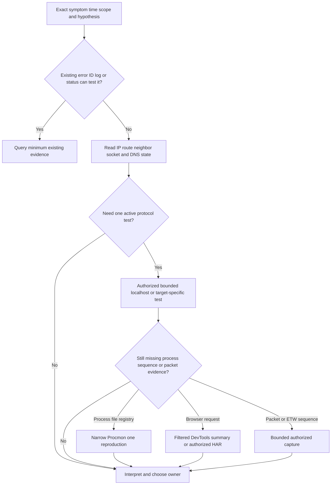
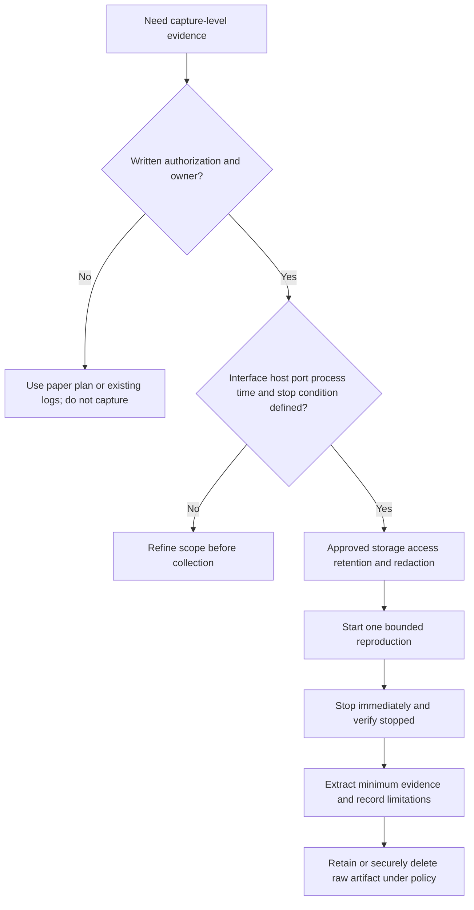
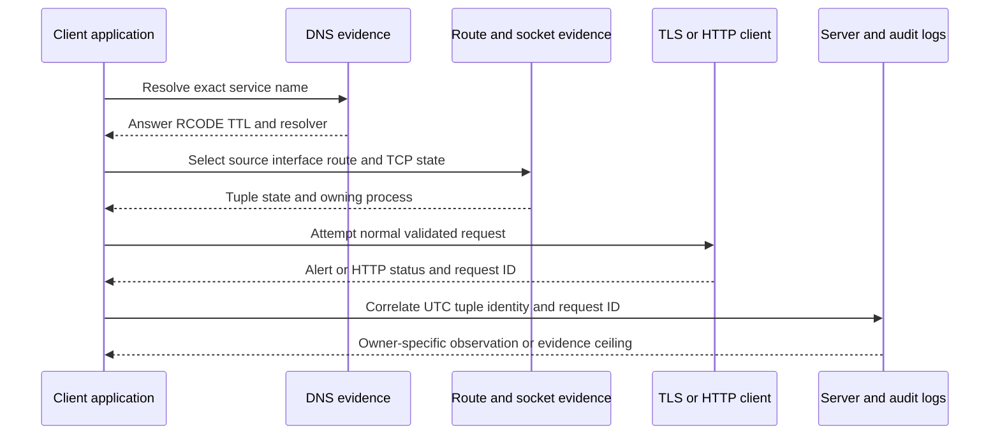

# Appendix D - Command and Tool Cookbook

> **Audience:** Candidates preparing for an Abnormal AI Technical Support Engineer interview  
> **Reference date:** August 24, 2026  
> **Lab boundary:** Commands use `localhost`, loopback, reserved documentation IPs (`192.0.2.0/24`, `198.51.100.0/24`, `203.0.113.0/24`), or `example.com`. A syntax example is not authorization to probe any system.

## Purpose and How to Use This Appendix

This cookbook maps one diagnostic question to the smallest safe command or tool that can answer it. Each family includes purpose, bounded syntax, expected output, interpretation, limitations, redaction, and an escalation threshold. Record the installed version and read local help because flags, output, privileges, backends, and defaults vary.

1. Start with the exact symptom, UTC time, scope, expected behavior, and one falsifiable hypothesis.
2. Use existing error IDs/logs and read-only state before active probes.
3. Use loopback for practice. For real work, obtain explicit authorization for target, source, protocol, duration, volume, capture fields, storage, and cleanup.
4. Stop when the question is answered; do not collect “everything just in case.”
5. Preserve a minimized redacted result plus command/tool version, not an uncontrolled raw dump.

> 🔍 **Plain-English deep-dive:** A diagnostic tool is a camera with a particular lens. `ping` sees ICMP responses, `Test-NetConnection` can test a TCP handshake, `curl` sees an HTTP client’s path, and a packet capture sees packets at one observation point. A clear picture from one lens does not prove what every other layer or observer saw. Correlate them with time, names, addresses, process IDs, and request IDs.

## Candidate Honesty and Safety Boundary

You can truthfully cite substantiated enterprise-support experience and working familiarity reinforced by safe labs with Windows diagnostics, Wireshark, Netsh, Microsoft Network Monitor concepts, Procmon, browser DevTools/HAR, Fiddler, REST clients, and cross-platform commands. You must not claim direct production operation of Abnormal AI, email-security operations, Google Workspace, Slack, Okta, Splunk, CrowdStrike, Cortex SOAR, Zendesk, Salesforce, Jira, or Zoom.

Safe interview wording:

> “My production strength is enterprise support and evidence-led escalation. I have working familiarity with these diagnostics and can demonstrate them in bounded local or synthetic labs. I would use the customer’s authorized tooling, data-handling policy, and current vendor documentation rather than assume my lab equals their production path.”

## Non-Negotiable Safety Rules

1. **Never disable certificate validation**, use curl `--insecure`/`-k`, PowerShell certificate-skip switches, permissive trust callbacks, or “accept all certificates.”
2. **Never weaken TLS/security controls**, enable obsolete SSL/protocols/ciphers, turn off endpoint protection, bypass authentication, or install an unverified root certificate for troubleshooting.
3. **Never disable a firewall or security policy** to make a test pass. Ask the owning team for a scoped policy event/check and preserve change control.
4. **Never capture packets, ETW, Procmon, HAR, proxy sessions, or logs without authorization.** These artifacts can contain credentials, content, personal data, and internal topology.
5. **Never scan or attack third parties.** Do not run port ranges, vulnerability scans, password tests, denial-of-service/load tests, unsolicited path probes, or packet interception.
6. Never place passwords, tokens, cookies, API keys, private keys, authorization headers, or customer payloads on a command line, transcript, screenshot, shell history, Postman export, HAR, pcap, or ticket.
7. Use read-only commands here. Do not add/delete routes, release/renew production leases, flush caches, kill processes, change trust, or modify policy merely to complete a lab.

## Tool-Selection and Evidence Maps







## Preflight Record

| Field | Record before testing | Why |
|---|---|---|
| Authorization | Owner, target, source, protocol, scope, expiry | Prevents accidental unauthorized activity |
| Hypothesis | One predicted observation and disconfirming result | Avoids random command dumping |
| Environment | OS/build, shell, tool/version, account context | Output/defaults vary |
| Time | Start UTC and clock/time-zone confidence | Enables cross-system correlation |
| Target | Exact FQDN, port/protocol, path shape, reserved/local lab label | Prevents wrong-host tests |
| Intermediaries | VPN, proxy, firewall, TLS inspection, container, load balancer | Defines observation boundaries |
| Data plan | Fields needed, output path, access, retention/deletion | Controls sensitive evidence |
| Stop condition | Count, duration, one repro, size cap, named operator | Prevents runaway capture/probes |

## 1. Interface and IP Configuration: `ipconfig`, `Get-NetIPConfiguration`, `ip`, `ifconfig`

**Purpose:** Identify active interfaces, addresses, prefixes, default gateways, DNS servers, DHCP context, and source-selection clues without changing state.

### Safe Syntax

```powershell
# Windows Command Prompt or PowerShell: read-only inventory
ipconfig /all

# PowerShell: concise structured view
Get-NetIPConfiguration -Detailed |
  Select-Object InterfaceAlias,InterfaceIndex,IPv4Address,IPv6Address,IPv4DefaultGateway,DNSServer
```

```bash
# Linux
ip -brief address show
ip address show dev lo

# macOS/BSD-style read-only views
ifconfig lo0
networksetup -listallnetworkservices
```

| Expected output | Interpretation | Limitations | Redact before sharing | Escalate when |
|---|---|---|---|---|
| Interface names/indexes, status, IPv4/IPv6, prefix, gateway, DNS, DHCP metadata | Confirms test context and candidate source interface/configuration | Does not prove route selection, DNS response, or reachability; containers/WSL/VPN have separate contexts | Hostname, MAC, internal IP/prefix/gateway/DNS suffix/server, adapter descriptions as policy requires | Expected interface/address/gateway/DNS is absent, duplicate, unauthorized, or differs from app namespace |

**Common trap:** `ipconfig /flushdns`, `/release`, and `/renew` change state. They are intentionally excluded. Do not “reset networking” before preserving the failing state.

## 2. Routing: `route`, `Get-NetRoute`, `ip route`, macOS route views

**Purpose:** Determine candidate route, interface, next hop, metric, and source address for an exact destination.

### Safe Syntax

```powershell
# Windows read-only route table
route print -4

Get-NetRoute -AddressFamily IPv4 |
  Sort-Object RouteMetric,DestinationPrefix |
  Select-Object DestinationPrefix,NextHop,InterfaceAlias,RouteMetric,Protocol

# Best route/source when available
Find-NetRoute -RemoteIPAddress 192.0.2.10
```

```bash
# Linux
ip route show
ip route get 192.0.2.10

# macOS
netstat -rn -f inet
route -n get 192.0.2.10
```

| Expected output | Interpretation | Limitations | Redact | Escalate when |
|---|---|---|---|---|
| Prefix, next hop, interface, metric; route lookup may show chosen source | Longest-prefix match plus policy/metric suggests local forwarding choice | Does not reveal every downstream hop, return path, SD-WAN/proxy decision, or application namespace; policy routing can add rules/tables | Internal prefixes, gateways, interfaces, VPN names, source IP | Wrong interface/source, missing route, VPN conflict, competing policy table, or route differs from documented architecture |

Do not use `route add/delete/change` or PowerShell route mutation cmdlets without approved change control.

## 3. Neighbor Cache: `arp`, `Get-NetNeighbor`, `ip neigh`, `ndp`

**Purpose:** Inspect local-link IPv4 ARP and IPv6 Neighbor Discovery mappings/states.

### Safe Syntax

```powershell
# Windows
arp -a
Get-NetNeighbor -AddressFamily IPv4 |
  Select-Object InterfaceAlias,IPAddress,LinkLayerAddress,State
Get-NetNeighbor -AddressFamily IPv6 |
  Select-Object InterfaceAlias,IPAddress,LinkLayerAddress,State
```

```bash
# Linux
ip neigh show
ip -6 neigh show

# macOS
arp -an
ndp -an
```

| Expected output | Interpretation | Limitations | Redact | Escalate when |
|---|---|---|---|---|
| Neighbor IP, link-layer address, interface, reachable/stale/incomplete states | Shows local cache knowledge for directly connected next hops | Stale is not automatically broken; remote Internet hosts map to local gateway, not remote MAC; caches change quickly | MAC addresses, internal IPs/interfaces | Persistent failed/incomplete neighbor for expected local next hop, duplicate-address evidence, or switch/VLAN ownership needed |

Do not delete neighbor entries or generate broad traffic to populate them as a diagnostic shortcut.

## 4. Socket State: `netstat`, `Get-NetTCPConnection`, `ss`, `lsof`

**Purpose:** Identify listeners, established/closing sockets, local/remote tuples, and owning process IDs where permitted.

### Safe Syntax

```powershell
# Windows
netstat -ano -p tcp

Get-NetTCPConnection |
  Where-Object { $_.LocalPort -eq 8080 -or $_.RemotePort -eq 8080 } |
  Select-Object State,LocalAddress,LocalPort,RemoteAddress,RemotePort,OwningProcess
```

```bash
# Linux; omit -p if process visibility is not authorized/available
ss -tan
ss -ltn 'sport = :8080'

# macOS
netstat -anv -p tcp
lsof -nP -iTCP:8080 -sTCP:LISTEN
```

| Expected output | Interpretation | Limitations | Redact | Escalate when |
|---|---|---|---|---|
| LISTEN/ESTABLISHED/TIME_WAIT and tuples; PID/process where visible | Confirms OS socket state at sample time and whether expected local listener exists | Snapshot can miss short flows; LISTEN does not prove remote reachability; ESTABLISHED does not prove TLS/HTTP/business success; namespaces/permissions hide sockets | PIDs/process names if sensitive, internal addresses/ports, unrelated sockets | Expected service has no listener, wrong bind address, repeated state anomaly, unknown owner, or process/service logs required |

Avoid broad process termination. Resolve a PID through authorized service ownership before any action.

## 5. TCP Reachability: `Test-NetConnection`

**Purpose:** On Windows, test one named host/port and expose resolution, selected source/interface, remote address, and TCP handshake result.

### Safe Syntax

```powershell
# Preferred lab: listener you own on loopback
Test-NetConnection -ComputerName 127.0.0.1 -Port 8080 -InformationLevel Detailed

# Documentation-only target syntax; run only under authorization
Test-NetConnection -ComputerName 192.0.2.10 -Port 443 -InformationLevel Detailed
```

| Expected output | Interpretation | Limitations | Redact | Escalate when |
|---|---|---|---|---|
| `RemoteAddress`, `RemotePort`, `InterfaceAlias`, `SourceAddress`, `TcpTestSucceeded` | `True` supports that this command established TCP in its context; `False` identifies a failed probe, not cause | Not TLS, HTTP, API, proxy, client-certificate, or workload-identity test; app may use another resolver/proxy/namespace | Internal names/IPs/interfaces | Command and app disagree after context comparison, or TCP fails consistently with route/listener/boundary evidence |

**Interpretation sentence:** “`TcpTestSucceeded=True` at `14:02Z` proves only a TCP handshake from this PowerShell context to this resolved address/port.”

## 6. ICMP Reachability: `ping`

**Purpose:** Test loopback/local IP operation or obtain bounded ICMP echo latency/loss clues where explicitly allowed.

### Safe Syntax

```powershell
# Windows loopback
ping -n 4 127.0.0.1
ping -n 4 ::1
```

```bash
# Linux/macOS loopback
ping -c 4 127.0.0.1
ping6 -c 4 ::1  # command name varies; some systems use ping -6
```

| Expected output | Interpretation | Limitations | Redact | Escalate when |
|---|---|---|---|---|
| Replies, round-trip times, sent/received/lost summary | Confirms observed ICMP echo behavior and basic local stack in loopback case | ICMP can be filtered/rate-limited; success does not prove TCP/TLS/app; failure does not prove host down | Internal host/IP and timing if sensitive | Loopback fails, broad authorized comparison shows change, or ICMP result conflicts with application evidence and network owner needs context |

Do not use continuous ping or high rate/size. Four bounded loopback probes are sufficient for this lab.

## 7. Path Clues: `tracert` and `traceroute`

**Purpose:** Use increasing hop limits to collect responses from some forwarding nodes and identify path/change clues.

### Safe Syntax

The following reserved-address examples are **syntax references only**. Path probes still traverse local infrastructure; run them only in an authorized lab/network.

```powershell
# Windows: numeric, four-hop cap, one-second wait
tracert -d -h 4 -w 1000 192.0.2.1
```

```bash
# Linux/macOS flags vary by implementation
traceroute -n -m 4 -w 1 192.0.2.1
```

| Expected output | Interpretation | Limitations | Redact | Escalate when |
|---|---|---|---|---|
| Hop numbers, responding addresses, round-trip samples, stars/timeouts | Shows which routers returned responses to this probe method | Routers can suppress/rate-limit; ECMP/asymmetry changes paths; final app may use TCP/proxy unlike probes; stars are not proof of forwarding loss | Internal hops, public egress/IP/provider topology | Repeatable change aligns with app failure and authorized boundary evidence; provider/network owner must inspect actual path |

Never declare the first star or high intermediate latency the root cause when later hops/application succeed.

## 8. Repeated Path Statistics: `pathping` and `mtr`

**Purpose:** Combine path discovery with repeated probes to estimate response/loss patterns over time.

### Safe Syntax

These commands send repeated probes. Use only in an explicitly authorized lab, with low cycles and a reserved/local target.

```powershell
# Windows, bounded parameters; installed syntax can vary
pathping -n -h 4 -q 5 -p 250 192.0.2.1
```

```bash
# Linux/macOS when mtr is already installed and approved
mtr --report --report-cycles 5 --no-dns 192.0.2.1
```

| Expected output | Interpretation | Limitations | Redact | Escalate when |
|---|---|---|---|---|
| Hop list plus per-hop response/loss/latency statistics | Useful for trends and comparing final-hop behavior | Control-plane response loss is not transit loss; ongoing probes add load; ECMP/return paths and protocol differ from app | Hop/IP/provider data and timing | Final destination/app degradation correlates with repeated bounded evidence, not merely one intermediate hop |

If authorization is absent, write a paper capture plan instead of running the command.

## 9. DNS: `nslookup`, `dig`, `Resolve-DnsName`

**Purpose:** Query exact DNS names/types and preserve resolver, status, answer, TTL, CNAME, and authority clues.

### Safe Syntax

```powershell
# Windows cross-version tool
nslookup -type=A example.com
nslookup -type=MX example.com

# PowerShell DNSClient module
Resolve-DnsName example.com -Type A -DnsOnly
Resolve-DnsName example.com -Type MX -DnsOnly
Resolve-DnsName _dmarc.example.com -Type TXT -DnsOnly
```

```bash
# Linux/macOS with dig installed
dig example.com A +noall +answer +comments
dig example.com MX +noall +answer +comments
dig _dmarc.example.com TXT +noall +answer +comments
```

| Expected output | Interpretation | Limitations | Redact | Escalate when |
|---|---|---|---|---|
| Server/resolver, RCODE/status, answer records, TTL, aliases, authority/comments | Confirms this tool/resolver’s current answer for exact name/type | App cache, search suffix, DoH/proxy, split DNS, ECS, DNSSEC validation, and historical answer can differ; current DNS is not transit-time proof | Internal names, resolver IP, TXT verification values, topology | Authoritative/recursive disagreement, SERVFAIL/REFUSED, stale/split result, DNSSEC/delegation issue, or app resolver remains different |

**Expected examples:** A valid query may show one or more A records and TTL. A nonexistent name can show `NXDOMAIN`; an existing name without that type can return NOERROR with no answer. Preserve the difference.

## 10. HTTP and API: `curl`

**Purpose:** Reproduce one bounded HTTP(S) request, separate DNS/connect/TLS/HTTP stages, capture status/headers/timing, and compare canonical request behavior.

### Safe Syntax

```powershell
# Windows: use curl.exe to avoid historical PowerShell alias ambiguity
curl.exe --head --show-error --max-time 10 https://example.com/

# Local learner-owned API
curl.exe --fail-with-body --show-error --silent --connect-timeout 3 --max-time 10 `
  --header "Accept: application/json" `
  http://127.0.0.1:8080/health
```

```bash
# Linux/macOS
curl --head --show-error --max-time 10 https://example.com/

curl --fail-with-body --show-error --silent --connect-timeout 3 --max-time 10 \
  --header 'Accept: application/json' \
  http://127.0.0.1:8080/health
```

Optional localhost-only timing summary:

```bash
curl --silent --show-error --output /dev/null --max-time 10 \
  --write-out 'code=%{http_code} remote=%{remote_ip} connect=%{time_connect} tls=%{time_appconnect} total=%{time_total}\n' \
  http://127.0.0.1:8080/health
```

| Expected output | Interpretation | Limitations | Redact | Escalate when |
|---|---|---|---|---|
| Response headers/body or timing fields; curl exit code separately from HTTP status | Exit identifies transfer/tool outcome; HTTP status is application response; timings localize delay | Build/TLS backend/proxy/DNS differ; HEAD may differ from GET; `--fail-with-body` is version-dependent; client may not match app | Authorization, Proxy-Authorization, Cookie/Set-Cookie, query/body secrets, internal URLs/IPs, client-cert paths, verbose output | Normal validated curl reproduces DNS/TLS/HTTP failure with request ID, or app/curl differ after a canonical dimension comparison |

**Never use `--insecure` or `-k`.** Do not automatically follow redirects with credentials. Inspect `Location` and origin/auth boundary first. `--verbose` can expose secrets; use it only against synthetic localhost traffic and retain a sanitized summary, not raw output.

## 11. PowerShell HTTP: `Invoke-WebRequest` and `Invoke-RestMethod`

**Purpose:** Use the Windows/PowerShell web stack to inspect raw response metadata (`Invoke-WebRequest`) or deserialize API data (`Invoke-RestMethod`).

### Safe Syntax

```powershell
$PSVersionTable

# Header/status-oriented request
$web = Invoke-WebRequest -Uri 'https://example.com/' -Method Head -TimeoutSec 10
$web | Select-Object StatusCode,StatusDescription,Headers

# Learner-owned local JSON endpoint
$data = Invoke-RestMethod -Uri 'http://127.0.0.1:8080/health' `
  -Method Get -TimeoutSec 10 -Headers @{ Accept = 'application/json' }
$data | ConvertTo-Json -Depth 5
```

| Expected output | Interpretation | Limitations | Redact | Escalate when |
|---|---|---|---|---|
| IWR response object with status/headers/content; IRM deserialized object | Compare raw HTTP facts versus parsed data and PowerShell version | Windows PowerShell 5.1 and PowerShell 7.x differ; proxy/TLS/.NET behavior and non-2xx exception handling vary; parsing can hide raw bytes | Headers/cookies/tokens, URI query, body, transcript/history, machine paths | Error includes sanitized response/status/request ID or parser/raw discrepancy needs API owner |

Never use certificate-skip parameters, custom “trust all” callbacks, or permissive TLS handlers.

## 12. TLS and Certificates: OpenSSL

**Purpose:** Inspect a TLS handshake and certificate chain with explicit SNI/hostname validation, or inspect a local public certificate file. OpenSSL is a diagnostic client, not proof that the application uses the same TLS stack/trust store.

### Safe Syntax

```bash
# Linux/macOS; example.com is a documentation domain. Use only in approved context.
printf '' | openssl s_client \
  -connect example.com:443 \
  -servername example.com \
  -verify_hostname example.com \
  -verify_return_error \
  -showcerts

# Inspect a local public certificate file; never a private key
openssl x509 -in synthetic-cert.pem -noout \
  -subject -issuer -dates -fingerprint -sha256 -ext subjectAltName
```

```powershell
# Windows Command Prompt-style stdin close; syntax depends on installed OpenSSL shell
cmd /c "echo.| openssl s_client -connect example.com:443 -servername example.com -verify_hostname example.com -verify_return_error -showcerts"
```

| Expected output | Interpretation | Limitations | Redact | Escalate when |
|---|---|---|---|---|
| Negotiated protocol/cipher, presented chain, certificate subject/issuer/SAN/validity, verification result/alert | Separates connect, SNI, chain/name/time/trust, protocol negotiation | OpenSSL version/build/trust store differs from browser/app; session may wait for input; server can vary by IP/SNI; revocation behavior differs | Internal names/IPs, certificate serial/thumbprint if policy treats sensitive, client-cert metadata; never private key | Name/chain/expiry/protocol/mTLS issue persists under normal validation or corporate proxy presents unexpected issuer |

Do not use verification-disabling options, lower security levels, obsolete protocols, or exported private keys.

## 13. Packet Evidence: Wireshark and `tcpdump`

**Purpose:** Capture or inspect packet-level timing, addresses, flags, DNS, TLS metadata, and visible application data at one observation point.

### Capture Versus Display Filters

| Filter type | Applied | Safe example | What it changes |
|---|---|---|---|
| Wireshark/tcpdump capture filter (BPF) | Before storage | `host 127.0.0.1 and tcp port 8080` | Reduces packets written; discarded packets cannot be recovered |
| Wireshark display filter | After capture | `ip.addr == 127.0.0.1 && tcp.port == 8080` | Changes view only; hidden packets remain in file |

### Safe Localhost Syntax and Filters

```bash
# Linux learner-owned loopback only; requires explicit authorization/privilege
sudo tcpdump -i lo -nn -s 128 -c 20 \
  -w localhost-8080.pcap 'host 127.0.0.1 and tcp port 8080'

# Read an existing authorized capture offline
tcpdump -nn -r localhost-8080.pcap 'tcp port 8080'
```

Wireshark capture filter:

```text
host 127.0.0.1 and tcp port 8080
```

Wireshark display filters:

```text
ip.addr == 127.0.0.1 && tcp.port == 8080
dns
tls.handshake
tcp.analysis.retransmission
http.request
```

| Expected output | Interpretation | Limitations | Redact | Escalate when |
|---|---|---|---|---|
| Frames/packets with timestamps, interfaces, tuples, decoded fields; tcpdump count summary | Can reconstruct observed DNS/TCP handshake/reset/retransmission/TLS metadata and visible HTTP | Capture point may miss traffic/offload; dissectors/analysis flags are heuristics; encrypted payload stays encrypted; snaplen truncates; packet number is file-local | Payload, DNS names, IP/MAC, SNI, cookies/tokens, message/API content, usernames, interface metadata | Both-side/boundary evidence is needed, reset/loss is repeatable, or protocol expert must validate malformed/retransmission interpretation |

**Capture safety:** Define authorization, interface, target tuple, count/duration, snap length, file cap, one reproduction, protected storage, stop confirmation, and deletion. Do not capture on shared/customer networks for practice. Do not decrypt TLS or collect session secrets without explicit specialized authorization.

## 14. Windows ETW Network Collection: `netsh trace`

**Purpose:** Collect a bounded Event Tracing for Windows (ETW) network scenario and optional packet evidence when simpler commands/logs cannot answer the sequence question.

### Safe Syntax

```powershell
# Inspect installed scenarios first
netsh trace show scenarios
netsh trace show scenario InternetClient

# Authorized localhost lab only; path must already be approved
netsh trace start scenario=InternetClient capture=yes report=no persistent=no `
  maxSize=64 fileMode=single traceFile="C:\Temp\local-trace.etl"

# Perform exactly one learner-owned localhost reproduction, then stop immediately
netsh trace stop
netsh trace show status
```

| Expected output | Interpretation | Limitations | Redact | Escalate when |
|---|---|---|---|---|
| Start configuration/status, `.etl`, stop confirmation; provider/network events depending scenario | Correlates Windows providers and packet sequence in a bounded window | Scenario/provider set and syntax vary by build; ETL can be broad; not every analyzer/conversion is compatible/lossless | User/host/process/path, DNS/IP/SNI, payload/packet fragments, provider metadata | Trace captures repeatable failure boundary that requires Windows networking/app owner, or ETL decoding expertise is needed |

Always set `persistent=no`, a size bound, named output, one repro, and immediate stop. Verify stopped status. Delete or retain the raw ETL strictly under policy.

## 15. Microsoft Network Monitor: Historical Context

**Purpose:** Recognize and inspect authorized historical `.cap` artifacts and transfer frame/parse/filter/conversation skills. Network Monitor 3.x is legacy and not presented as Microsoft’s current default capture solution.

### Safe Existing-Artifact Workflow

```text
1. Do not install unsupported software merely for this guide.
2. Open only an existing authorized historical .cap in an approved isolated workflow.
3. Inspect frame summary, protocol tree, and bytes.
4. If the installed parser supports it, an illustrative display filter is:
   IPv4.Address == 192.0.2.10 AND TCP.Port == 443
5. Verify filter grammar against the installed historical parser/profile.
6. Export only a minimized sanitized frame summary; close and protect/delete raw data.
```

| Expected output | Interpretation | Limitations | Redact | Escalate when |
|---|---|---|---|---|
| Parsed frames/conversations using legacy parser profiles | Protocol reasoning transfers to modern tools | Discontinued development, parser gaps, unsupported drivers, different filter syntax/file compatibility | Same as pcap plus parser/profile/machine paths | Historical artifact cannot be parsed safely/currently; request approved conversion or current-tool owner |

Do not recommend a new Network Monitor deployment or capture driver. Mention familiarity as legacy context only.

## 16. Process, File, Registry, and Network Metadata: Procmon

**Purpose:** Correlate one process/PID with file, registry, process/thread, and network operation metadata. Procmon is **not** a packet sniffer.

### Safe Filtered Workflow

```text
Target: learner-owned myapp.exe or python.exe using localhost:8080

Filters before one reproduction:
  Process Name is myapp.exe            Include
  Operation is TCP Connect             Include
  Operation is CreateFile              Include (only if config/file hypothesis)
  Operation is RegOpenKey               Include (only if registry hypothesis)

Workflow:
  Clear existing events -> start capture -> one local action -> stop immediately.
  Inspect Time, Process/PID, Operation, Path, Result, Detail, Duration.
  Save no PML when a sanitized event-row summary is sufficient.
```

| Expected output | Interpretation | Limitations | Redact | Escalate when |
|---|---|---|---|---|
| Filtered events such as `TCP Connect SUCCESS`, `NAME NOT FOUND`, `ACCESS DENIED`, file/registry sequence | Ties OS operation/result to a process and time | Missing candidates can be normal fallback; SUCCESS at TCP is not TLS/HTTP; no payload/sequence; stack/symbol/boot profiling adds volume | User paths, registry/data, process command lines, host/IP, file names/content, unrelated events | Intended config/key consistently denied/missing, wrong path is effective, or process owner must explain sequence |

Do not conclude from “red rows” alone. Compare the failing event with subsequent fallback/success and the application’s actual error.

## 17. Browser DevTools and HAR

**Purpose:** Inspect browser-generated requests, redirects, timing phases, headers, status, console errors, storage/service-worker context, and request initiators.

### Safe Workflow

```text
1. Use a synthetic profile/account and localhost or an authorized application.
2. Open DevTools -> Network before reproduction.
3. Filter to localhost or the exact authorized host; clear old entries.
4. Perform one action; stop interaction.
5. Record method, URL shape, status, type, initiator, timing, request/correlation ID.
6. Prefer a field summary. Export HAR only when authorized and necessary.
7. Structurally redact/validate HAR JSON; securely delete raw export under policy.
```

| Expected output | Interpretation | Limitations | Redact | Escalate when |
|---|---|---|---|---|
| Request rows, waterfall timing, request/response headers, previews/responses, console messages; optional HAR JSON | Localizes browser DNS/connect/TLS/wait/download and CORS/cache/service-worker clues | Browser version/cache/extensions/proxy differ; timing fields are browser observations; HAR may omit or transform data; console messages are interpretations | Authorization, cookies, query/form/body/response, tenant/user IDs, internal URLs/IPs, stack paths, browser storage, HAR comments/content | Browser-only failure persists with request ID, CORS/service worker/cache evidence, or server/proxy logs are needed |

A HAR “without content” can still contain credentials and personal/internal data. Display filtering and removing one token string are not sufficient sanitization.

## 18. Explicit Debugging Proxy: Fiddler

**Purpose:** Observe client HTTP sessions through an explicit local proxy and compare request/response behavior. HTTPS decryption creates two TLS legs and a local interception trust relationship, so it is excluded from the basic cookbook lab.

### Safe Local HTTP Workflow

```text
Target: http://127.0.0.1:8080/health only

1. Confirm Fiddler is already approved/installed; record version.
2. Keep HTTPS decryption OFF.
3. Filter to localhost/127.0.0.1 and the exact process/port where supported.
4. Start capture, send one harmless local request, stop immediately.
5. Inspect method, URL, status, headers, timing, and generated proxy behavior.
6. Restore prior proxy state, verify capture stopped, and delete sessions.
```

| Expected output | Interpretation | Limitations | Redact | Escalate when |
|---|---|---|---|---|
| Session list with client-to-proxy HTTP request and proxy-to-server response/timing | Shows what a proxy-aware client sent/received through Fiddler | Client may bypass proxy; HTTP/2/3/app pinning behavior varies; proxy changes path; no HTTPS content without authorized interception | Auth/cookies/body/query, client/server IPs, process/user, certificates, session archives | Proxy-specific difference is reproducible, or authorized HTTPS interception requires security owner and exact certificate lifecycle |

Do not enable HTTPS decryption for customer/unrelated traffic. If a specialized owner authorizes it, define target filters, synthetic data, generated-root thumbprint, pre/post proxy/trust inventory, exact removal, and session deletion. Never leave the interception root or proxy configured.

## 19. API Client: Postman

**Purpose:** Build a canonical API request, inspect generated method/URL/headers/body, test response assertions, and compare with curl/PowerShell.

### Safe Local Request

```text
Method: GET
URL: http://127.0.0.1:8080/health
Header: Accept: application/json
Authorization: No Auth
Body: none
Timeout: 10 seconds (where configured)
```

Optional synthetic post-response test:

```javascript
pm.test("status is 200", function () {
    pm.response.to.have.status(200);
});
```

| Expected output | Interpretation | Limitations | Redact | Escalate when |
|---|---|---|---|---|
| Status, headers, body, timing, test result, console-generated request details | Useful for request-contract comparison and reproducibility | Postman runtime/agent/proxy/cookie/variable scopes differ from application; “works in Postman” proves a context difference, not cause | Environment/current values, auth, cookies, URLs/query/body, console, examples, scripts, collection/environment exports | Canonical comparison isolates header/body/proxy/auth difference, or API request ID/server contract is needed |

Do not store real secrets in ordinary variables/exports. Use organization-approved Vault/secret policy only in authorized work. Inspect exported JSON structurally and re-import into a clean context before sharing.

## 20. JSON Inspection and Minimization: `jq`

**Purpose:** Parse, select, validate, and minimize JSON evidence without fragile text matching.

### Safe Syntax

Assume `response.json` contains only synthetic/local data.

```bash
# Validate and pretty-print
jq . response.json

# Allowlist only needed evidence fields
jq '{status, request_id, timestamp, error: {code: .error.code, type: .error.type}}' response.json

# Show array items without retaining full objects
jq -r '.items[] | [.id, .state] | @tsv' response.json
```

PowerShell/cmd quoting differs; place filters in an approved `.jq` file when necessary rather than weakening structure.

| Expected output | Interpretation | Limitations | Redact | Escalate when |
|---|---|---|---|---|
| Parsed/minimized JSON or nonzero parse error | Confirms JSON syntax and selected fields/types | A valid JSON document can violate API schema; `del(.token)` can miss nested/renamed secrets; number/order/rendering can change | Prefer allowlist projection; remove tokens, cookies, PII, payloads, internal IDs unless needed; validate output | Schema/encoding/duplicate-key/raw-byte behavior matters or nested sensitive structure cannot be safely minimized |

An allowlist is safer than trying to enumerate every secret field. Keep the original restricted if policy requires; share only the validated derivative.

## 21. System and Service Logs: `Get-WinEvent`, `journalctl`, macOS `log`

**Purpose:** Query a narrow time window, provider/unit/process, severity, and event fields from operating-system logging facilities.

### Safe Syntax

```powershell
# Windows: last ten minutes from System, maximum 50
$start = (Get-Date).ToUniversalTime().AddMinutes(-10)
Get-WinEvent -FilterHashtable @{ LogName='System'; StartTime=$start } -MaxEvents 50 |
  Select-Object TimeCreated,Id,LevelDisplayName,ProviderName,Message
```

```bash
# Linux/systemd: one synthetic service and bounded UTC window
journalctl --unit=myapp.service \
  --since='2026-08-24 14:00:00 UTC' \
  --until='2026-08-24 14:10:00 UTC' \
  --output=short-iso --no-pager

# macOS Unified Logging: one synthetic process, ten-minute bound
log show --last 10m --style compact --predicate 'process == "myapp"'
```

| Expected output | Interpretation | Limitations | Redact | Escalate when |
|---|---|---|---|---|
| Timestamp, provider/unit/process, event ID/priority, message and structured fields | Correlates host/service observations with the reproduction window | Retention, permissions, sampling, localization, rotation, clock, provider version, and logging level bound conclusions; absence is not proof nothing happened | User/host/IP, paths, command lines, environment, payload/PII, tokens, tenant/request IDs except minimum join keys | Relevant provider/unit reports repeatable failure, retention/access creates evidence ceiling, or engineering needs structured/raw export |

Do not use `sudo` or privileged log access merely for practice. Request an authorized minimum excerpt when permissions hide service events.

## Cross-Tool Quick Matrix

| Question | Cheapest useful tool | Success proves | Still not proven |
|---|---|---|---|
| What IP/gateway/DNS is configured? | `Get-NetIPConfiguration` / `ip address` | Current visible interface config | Chosen route or service reachability |
| Which route/source is selected? | `Find-NetRoute` / `ip route get` | Local route decision in tool namespace | Return/downstream path |
| Is a local next hop resolved? | `Get-NetNeighbor` / `ip neigh` | Neighbor cache state | Remote host identity/reachability |
| Is a listener/socket present? | `Get-NetTCPConnection` / `ss` | Sampled socket state | TLS/application correctness |
| Can this Windows context handshake TCP? | `Test-NetConnection` | TCP establishment result | TLS/HTTP/auth/API health |
| Does DNS return expected record now? | `Resolve-DnsName` / `dig` | Current query result from that context | Historical/app-resolver result |
| Does normal HTTPS validate/respond? | curl/OpenSSL/browser | That client stack’s observed result | Every client/provider path |
| What did browser generate? | DevTools field summary | Browser request/response observation | Server-internal cause |
| Which file/key/socket did process use? | Filtered Procmon | Process OS-operation sequence | Packet payload/server reason |
| What happened on wire/ETW? | Authorized bounded pcap/ETL | Observed sequence at capture point | Unobserved endpoints/root cause |
| What did service report? | Narrow system/app logs | Provider’s recorded event | Complete reality if logging omitted/dropped |

## Worked Example 1: Local API Refusal to HTTP Success

**Lab only:** A learner-owned server is expected at `127.0.0.1:8080`.

| Step | Command/tool | Possible observation | Interpretation |
|---:|---|---|---|
| 1 | `Get-NetTCPConnection` or `ss -ltn` | No listener on 8080 | Local service has not bound; do not investigate external firewall |
| 2 | Start the approved local fixture through its documented workflow | Listener appears | Service reached listen state |
| 3 | `Test-NetConnection 127.0.0.1 -Port 8080` | TCP succeeds | Windows test context completed handshake |
| 4 | curl/IRM GET `/health` | HTTP 200 and synthetic request ID | Application endpoint responded; preserve status/ID/time |
| 5 | Stop fixture and verify listener absent | No listener | Cleanup complete |

**Escalation statement:** “Before service start, loopback TCP was actively refused and no listener existed. After documented start, the listener appeared, TCP succeeded, and `/health` returned 200. This isolates the lab failure to local service state, not DNS, route, TLS, or external network.”

## Worked Example 2: TCP and TLS Work, API Authorization Fails

| Evidence | Observation | Layer conclusion |
|---|---|---|
| DNS | Expected approved address returned | Current DNS query succeeded |
| `Test-NetConnection` | TCP 443 succeeds | Basic TCP path works in test context |
| OpenSSL/curl normal validation | TLS chain/name validates | TLS works for this client path |
| HTTP | `403` with `insufficient_scope` and request ID | First explicit failure is authorization/policy |

Stop network capture. Compare token **metadata only** (issuer/audience/expiry/scopes names), effective role, tenant/resource, and server policy using the request ID. Never attach the token or grant broad admin access “to test.”

## Worked Example 3: Application and DNS Tool Disagree

**Observation:** `dig example.com A` returns an answer, but an application says “name not known.”

Test the differences: application namespace/container, configured resolver, search suffix, A versus AAAA, OS cache, hosts file, VPN/split DNS, proxy/DoH, account/service context, and timestamp. A successful `dig` query disproves only “no DNS server can answer this exact query from this shell.” It does not disprove the app’s resolver-path failure.

## Worked Example 4: Corporate TLS Trust Difference

**Observation:** Normal certificate validation succeeds on a learner-owned path and fails with unknown issuer on an authorized corporate path; presented issuer metadata differs.

Preserve FQDN/SNI, endpoint IP, subject/issuer/SAN/validity/thumbprint metadata, client/tool versions, proxy path, and UTC. Ask the security/network owner whether TLS inspection is intended and which managed trust anchor should be present. Do **not** use insecure mode, disable revocation, install an arbitrary root, or bypass the proxy.

## Troubleshooting and Escalation Cues

| Observation | Stop doing | Move to |
|---|---|---|
| `Test-NetConnection` succeeds; HTTP 403 | Repeating port tests/captures | Identity, scopes, roles, tenant/resource policy, request ID |
| DNS tool returns expected; app still fails | Declaring DNS healthy everywhere | Resolver namespace/cache/proxy/service context comparison |
| TCP handshake then TLS alert | Ping/traceroute loops | SNI, certificate, protocol, proxy, client/server TLS logs |
| TLS validates then HTTP 5xx | Certificate changes | Generating hop, request ID, service health, safe retry/reconciliation |
| Procmon shows config `NAME NOT FOUND` then successful fallback | Calling first red row root cause | App’s selected config and final error sequence |
| Intermediate traceroute loss but final/app healthy | Escalating hop as outage | Document control-plane limitation; continue app evidence |
| pcap shows RST from observed source | Naming cause immediately | Endpoint/intermediary logs, idle/policy/app sequence |
| HAR contains token/cookie | Sharing/copying artifact | Restrict/delete under policy, revoke if exposed, request sanitized repro |
| ETL/pcap question answered | Continuing capture | Stop, verify stopped, extract minimum, protect/delete raw |

## Common Traps

1. Running commands before writing the hypothesis and timestamp.
2. Treating a successful lower-layer test as proof that every higher layer works.
3. Treating `ping` or traceroute silence as a service outage.
4. Treating `LISTEN` as remote reachability or `ESTABLISHED` as application success.
5. Clearing caches/restarting/changing routes before preserving failure evidence.
6. Using broad `netstat`, Procmon, Event Log, HAR, ETL, or pcap exports when one filter/field would answer the question.
7. Confusing Wireshark capture filters with display filters; hidden packets remain sensitive.
8. Treating Wireshark expert flags or Procmon red rows as root cause without sequence/context.
9. Saying “works in Postman/curl” without comparing proxy, auth, headers, body, cookies, DNS, TLS, and runtime.
10. Leaving Fiddler proxy/root state, a trace session, capture, local listener, or raw artifact behind.

## Safe Evidence Package

| Item | Include | Exclude |
|---|---|---|
| Case anchor | Impact/scope, expected/actual, UTC window, safe tenant/case ID | Customer content not needed |
| Environment | OS/build, shell/tool version, account category, proxy/VPN category | Usernames/hostnames unless essential/approved |
| Command | Exact read-only command with secrets replaced before execution | Token/password/private paths and mutating commands |
| Result | Minimal fields, exit code, protocol status, request ID, timing | Whole host/socket/log/capture dump |
| Correlation | DNS name/address, tuple, PID, request/trace/message ID, UTC | Unrelated identifiers |
| Interpretation | Observation, inference, disconfirming result, limitations | Unsupported owner/root-cause declaration |
| Ask | Specific owner question and requested evidence/decision | “Please investigate” without context |
| Handling | Authorization, storage, redaction, retention/deletion, stop confirmation | Untracked raw artifacts |

## Cross-References

| Topic | Full lessons |
|---|---|
| Layered network method | [Part 071](Part-071-osi-and-tcp-ip-troubleshooting-bridge.md), [Part 079](Part-079-endpoint-to-cloud-layered-troubleshooting.md) |
| IP/routing/DNS/TCP/TLS/HTTP | [Part 072](Part-072-ipv4-ipv6-subnetting-routing-and-nat.md), [Part 073](Part-073-dns-and-dhcp-troubleshooting.md), [Part 074](Part-074-tcp-udp-sockets-ports-and-connection-state.md), [Part 075](Part-075-tls-ssl-certificates-sni-and-mutual-tls.md), [Part 076](Part-076-http-and-https-methods-status-headers-and-state.md) |
| Latency/path evidence | [Part 077](Part-077-proxies-firewalls-vpns-and-load-balancers.md), [Part 078](Part-078-latency-loss-retransmission-and-mtu.md) |
| Packet tools | [Part 080](Part-080-wireshark-tcpdump-and-network-monitor.md) |
| Windows tools | [Part 081](Part-081-netsh-procmon-test-netconnection-and-powershell.md) |
| DevTools/HAR/Fiddler/Linux/OpenSSL/path | [Part 082](Part-082-devtools-har-fiddler-linux-openssl-and-path-tools.md) |
| API clients and JSON | [Part 085](Part-085-postman-curl-and-powershell-api-practice.md), [Part 090](Part-090-api-troubleshooting-and-evidence-correlation.md) |
| Logs/evidence packaging | [Part 094](Part-094-windows-linux-process-and-network-logs.md), [Part 095](Part-095-browser-cloud-audit-and-security-logs.md), [Part 098](Part-098-safe-evidence-collection-redaction-and-packaging.md) |

## Official Source Anchors - August 24, 2026

The guide source ledger recorded these official or primary sources as accessed on **August 24, 2026**. Living documentation, command flags, UI, and products change; verify installed help and current official docs. No source implies authorization to test a third party or discloses private Abnormal AI behavior.

| Official or primary source | Coverage | Boundary |
|---|---|---|
| [RFC 2606 - Reserved DNS Names](https://www.rfc-editor.org/rfc/rfc2606) | `example.com` documentation use | Does not authorize arbitrary external testing |
| [RFC 5737 - IPv4 Documentation Blocks](https://www.rfc-editor.org/rfc/rfc5737) | Reserved example IPv4 ranges | Syntax examples can still emit local-network traffic |
| [Microsoft Learn - ipconfig](https://learn.microsoft.com/en-us/windows-server/administration/windows-commands/ipconfig) | Windows IP configuration commands | Release/renew/flush options change state |
| [Microsoft Learn - Get-NetIPConfiguration](https://learn.microsoft.com/en-us/powershell/module/nettcpip/get-netipconfiguration) | Structured interface/gateway/DNS view | Output is sensitive and namespace-scoped |
| [Microsoft Learn - Get-NetRoute](https://learn.microsoft.com/en-us/powershell/module/nettcpip/get-netroute) | Windows route table | Read-only usage here |
| [Microsoft Learn - Find-NetRoute](https://learn.microsoft.com/en-us/powershell/module/nettcpip/find-netroute) | Best route/source lookup | Module/OS availability varies |
| [Microsoft Learn - Get-NetNeighbor](https://learn.microsoft.com/en-us/powershell/module/nettcpip/get-netneighbor) | Neighbor cache | State changes rapidly |
| [Microsoft Learn - netstat](https://learn.microsoft.com/en-us/windows-server/administration/windows-commands/netstat) | Windows socket/network statistics | Broad output is sensitive |
| [Microsoft Learn - Get-NetTCPConnection](https://learn.microsoft.com/en-us/powershell/module/nettcpip/get-nettcpconnection) | TCP state/PID evidence | Snapshot and permission limits |
| [Microsoft Learn - Test-NetConnection](https://learn.microsoft.com/en-us/powershell/module/nettcpip/test-netconnection) | Windows connectivity test | TCP is not TLS/HTTP |
| [Microsoft Learn - ping](https://learn.microsoft.com/en-us/windows-server/administration/windows-commands/ping) | ICMP echo command | ICMP policy differs from application path |
| [Microsoft Learn - tracert](https://learn.microsoft.com/en-us/windows-server/administration/windows-commands/tracert) | Windows path probes | Intermediate response behavior is not forwarding proof |
| [Microsoft Learn - pathping](https://learn.microsoft.com/en-us/windows-server/administration/windows-commands/pathping) | Repeated Windows path statistics | Probe volume and interpretation require authorization |
| [Microsoft Learn - nslookup](https://learn.microsoft.com/en-us/windows-server/administration/windows-commands/nslookup) | DNS query syntax | App resolver context can differ |
| [Microsoft Learn - Resolve-DnsName](https://learn.microsoft.com/en-us/powershell/module/dnsclient/resolve-dnsname) | DNSClient query semantics | Current/historical and app context differ |
| [Linux `ip-route` manual](https://man7.org/linux/man-pages/man8/ip-route.8.html) | Linux route views/lookups | Policy tables/namespaces matter |
| [Linux `ip-neighbour` manual](https://man7.org/linux/man-pages/man8/ip-neighbour.8.html) | Neighbor state | Distribution/iproute2 version varies |
| [Linux `ss` manual](https://man7.org/linux/man-pages/man8/ss.8.html) | Socket state/filtering | Namespace/privilege varies |
| [Linux traceroute manual](https://man7.org/linux/man-pages/man8/traceroute.8.html) | Probe modes/flags | Distribution implementation varies |
| [mtr documentation](https://www.bitwizard.nl/mtr/) | Repeated path measurement | Continuous probes require authorization |
| [BIND 9 Administrator Reference Manual](https://bind9.readthedocs.io/) | `dig` and DNS operations context | Installed version differs |
| [curl man page](https://curl.se/docs/manpage.html) | Options, exit codes, TLS, timing, redirects | Record build/TLS backend; never use insecure mode |
| [Microsoft Learn - Invoke-WebRequest](https://learn.microsoft.com/en-us/powershell/module/microsoft.powershell.utility/invoke-webrequest) | PowerShell web response behavior | PowerShell versions/platforms differ |
| [Microsoft Learn - Invoke-RestMethod](https://learn.microsoft.com/en-us/powershell/module/microsoft.powershell.utility/invoke-restmethod) | PowerShell REST parsing | Parsing can hide raw representation |
| [OpenSSL `s_client`](https://docs.openssl.org/master/man1/openssl-s_client/) | TLS diagnostic options | OpenSSL trust/backend differs from app |
| [OpenSSL `x509`](https://docs.openssl.org/master/man1/openssl-x509/) | Certificate metadata inspection | Public certificate only; never private key |
| [Wireshark User’s Guide](https://www.wireshark.org/docs/wsug_html_chunked/) | Capture/UI/protocol/statistics concepts | Version/dissectors vary |
| [Wireshark Capture Filters](https://wiki.wireshark.org/CaptureFilters) | BPF capture filters | Validate syntax on installed build |
| [Wireshark Display Filter Reference](https://www.wireshark.org/docs/dfref/) | Field-based display filters | Display filter is not redaction |
| [tcpdump manual](https://www.tcpdump.org/manpages/tcpdump.1.html) | Bounded capture/read options | Privilege/build/link type vary |
| [pcap-filter manual](https://www.tcpdump.org/manpages/pcap-filter.7.html) | Capture-filter grammar | Context/link type matters |
| [Microsoft Learn - netsh trace](https://learn.microsoft.com/en-us/windows-server/networking/technologies/netsh/netsh-trace) | Scenarios/start/stop/status | Windows build/provider sets vary |
| [Sysinternals Process Monitor](https://learn.microsoft.com/en-us/sysinternals/downloads/procmon) | Procmon capabilities and official download | Version/EULA/policy; not packet capture |
| [Microsoft Network Monitor 3.4 archive](https://www.microsoft.com/en-us/download/details.aspx?id=4865) | Historical Network Monitor context | Legacy/discontinued; verify current support/security |
| [Microsoft Edge DevTools Network](https://learn.microsoft.com/en-us/microsoft-edge/devtools/network/) | Browser network panel/HAR workflow | Browser UI/version differs |
| [Chrome DevTools Network reference](https://developer.chrome.com/docs/devtools/network/reference/) | Chromium request/timing fields | Chrome/Edge features can differ |
| [Telerik Fiddler Everywhere documentation](https://docs.telerik.com/fiddler-everywhere/introduction) | Explicit debugging proxy concepts | Licensing/version/platform vary |
| [Telerik Fiddler HTTPS decryption](https://docs.telerik.com/fiddler/configure-fiddler/tasks/decrypthttps) | Interception trust/certificate context | Specialized explicit authorization and cleanup required |
| [Postman - Send API requests](https://learning.postman.com/docs/sending-requests/requests/) | Request builder/response inspection | Runtime/workspace/version policy varies |
| [Postman - Variables](https://learning.postman.com/docs/sending-requests/variables/variables-intro/) | Variable/environment context | Scope/precedence and secret governance evolve |
| [jq manual](https://jqlang.org/manual/) | JSON filter syntax/functions | Installed version/quoting differ |
| [Microsoft Learn - Get-WinEvent](https://learn.microsoft.com/en-us/powershell/module/microsoft.powershell.diagnostics/get-winevent) | Structured Windows Event Log query | Provider/version/access/retention bound evidence |
| [systemd `journalctl` manual](https://www.freedesktop.org/software/systemd/man/latest/journalctl.html) | Journal selectors/output/time | Installed systemd/distro differs |
| [Apple Logging documentation](https://developer.apple.com/documentation/os/logging) | Apple unified logging concepts | OS version/privacy behavior varies |

## ⭐ Likely Interview Questions

### 1. How do you choose the first tool?

**Model answer:** I start with a falsifiable hypothesis and the cheapest source that can disconfirm it: exact error/request ID, effective config, one filtered IP/route/socket/DNS command, then a normal protocol request. I use Procmon, HAR, ETL, or pcap only when simpler evidence cannot answer the process/request/packet sequence, and only with authorization, bounds, stop, and cleanup.

### 2. What does `Test-NetConnection -Port 443` prove?

**Model answer:** It reports whether that PowerShell context established TCP to the resolved address and port, plus source/interface details. It does not test certificate validation, HTTP, proxy behavior, identity, authorization, API health, or the application’s namespace. I move to a normal validated TLS/HTTP client and correlate request IDs.

### 3. Why is ping not a service-health test?

**Model answer:** Ping uses ICMP echo, which can be filtered or rate-limited independently of the application. A host can answer ping while HTTPS is broken, or ignore ping while HTTPS works. I use it as a bounded path clue and test the actual protocol next.

### 4. How do you capture packets safely?

**Model answer:** I require explicit owner authorization; define hypothesis, interface, tuple, direction, duration/count, snap length, size, storage, access, retention, and deletion; use a capture filter; run one reproduction; stop and verify immediately; extract the minimum redacted evidence; and state capture-point/offload/encryption limitations. No authorization means no capture.

### 5. How do curl exit code and HTTP status differ?

**Model answer:** Curl’s exit code reports the transfer/tool outcome under selected options; HTTP status is the application/intermediary response. A fully received 404 can be curl exit 0 by default, while DNS failure has no HTTP status. I record both plus timing and request ID, never use `--insecure`, and reconcile mutations before retry.

### 6. What is the role of Procmon versus Wireshark?

**Model answer:** Procmon ties a process to file, registry, process/thread, and network-operation metadata, such as which config path returned ACCESS DENIED or whether TCP Connect succeeded. Wireshark/pcap shows packet sequence and protocol fields at a capture point. Procmon is not packet payload capture; I choose based on the missing evidence and minimize both.

### 7. How do you describe your tool experience honestly?

**Model answer:** My production foundation is enterprise support, evidence correlation, customer communication, escalation, and fix validation. I have working familiarity with focused Windows/network/browser/API tools reinforced through safe local labs. I do not claim advanced packet forensics, unrestricted capture authority, production operation of the listed learning-target platforms, or private Abnormal behavior.

## 🧠 30-Second Memory Hooks

- **Question first, smallest tool second.**
- **Configured address is not chosen route; chosen route is not application success.**
- **LISTEN is local; TCP success is not TLS; TLS success is not API authorization.**
- **Ping sees ICMP, traceroute sees responders, curl sees one client path.**
- **Capture filter limits storage; display filter limits only the view.**
- **Procmon sees process operations, not packet payload.**
- **HAR, ETL, PML, pcap, proxy archives, and logs are sensitive evidence.**
- **Never bypass TLS, firewall, authentication, or security controls.**
- **Stop, verify stopped, minimize, redact, delete under policy.**

## Completion and Use Checklist

- [ ] I record authorization, hypothesis, environment/version, UTC, target, data plan, and stop condition.
- [ ] I can use read-only IP, route, neighbor, and socket commands on Windows and Linux/macOS.
- [ ] I explain what `Test-NetConnection`, ping, traceroute, pathping, and mtr do not prove.
- [ ] I can query DNS with `nslookup`, `dig`, and `Resolve-DnsName` and preserve RCODE/answer/TTL/resolver.
- [ ] I can use curl and PowerShell web cmdlets with bounded timeouts and no secrets/security bypass.
- [ ] I can inspect TLS with explicit SNI/hostname validation and never disable verification.
- [ ] I distinguish Wireshark/tcpdump capture filters from Wireshark display filters.
- [ ] I never capture packets/ETW/Procmon/HAR/proxy/logs without authorization.
- [ ] I can run/describe a bounded nonpersistent `netsh trace`, stop it, verify, and handle ETL safely.
- [ ] I describe Microsoft Network Monitor as legacy historical familiarity, not a current default.
- [ ] I use Procmon filters before one repro and do not treat red rows as automatic cause.
- [ ] I prefer a DevTools field summary over HAR and structurally redact any authorized export.
- [ ] I keep Fiddler HTTPS decryption off in the basic lab and restore proxy/certificate state after specialized authorized work.
- [ ] I can build a no-auth localhost Postman request and sanitize variables/console/exports.
- [ ] I use `jq` allowlists to minimize JSON and understand schema/raw limitations.
- [ ] I can query bounded Windows, systemd, and macOS logs while stating retention/access limits.
- [ ] I do not scan third parties, disable firewalls, weaken TLS, or run mutating diagnostic commands.
- [ ] I package minimum redacted evidence with an explicit owner question and limitations.
- [ ] I label production experience, working familiarity, learned architecture, and synthetic labs honestly.
- [ ] I revalidate official sources and installed help beyond August 24, 2026.

**Reference sequence complete:** Return to [Abnormal AI Technical Support Engineer - Complete Study Guide](../Abnormal%20AI%20Technical%20Support%20Engineer%20-%20Complete%20Study%20Guide.md) and use Appendices A-D as lookup companions to Parts 001-120.