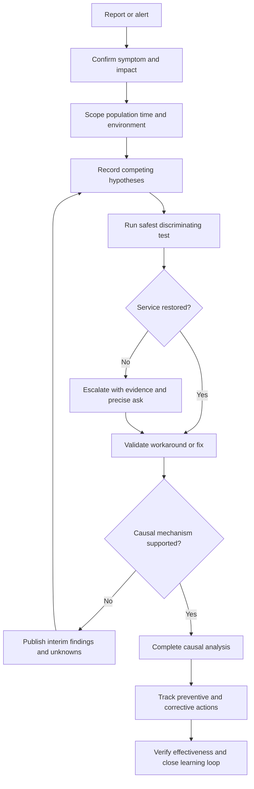
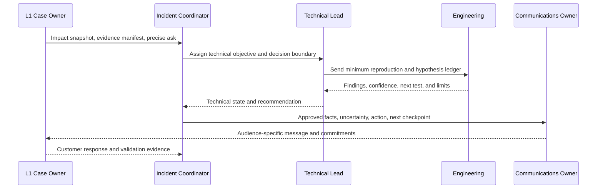
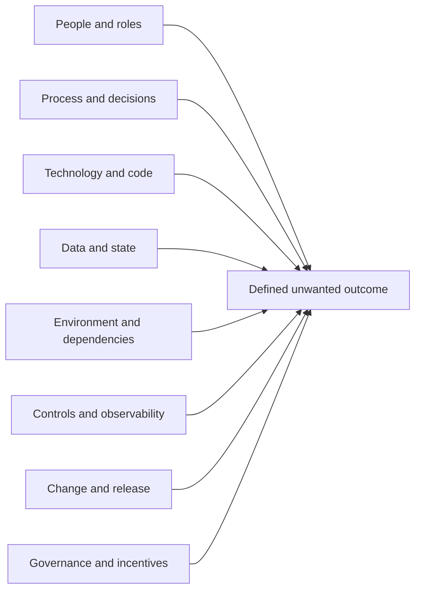
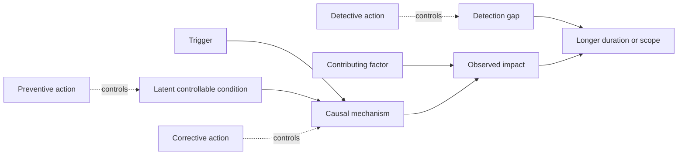

# Appendix E - Escalation RCA and Postmortem Templates

> **Artifact label:** Template only; all worked examples are synthetic.
>
> **Source date:** Official anchors were accessed on **August 24, 2026**. Revalidate current policy, contracts, tooling, and documentation before operational use.

## Purpose and How to Use This Appendix

This appendix is a copy-ready pack for moving a support case from first-line investigation to specialist ownership, then from restored service to disciplined learning. It separates two jobs that are often confused:

1. **Escalation:** give the next owner enough verified context to act without repeating avoidable work.
2. **Root-cause analysis (RCA):** explain why an outcome occurred only after evidence supports a causal claim.

Use the smallest template that fits the decision. Replace every `{PLACEHOLDER}`; delete irrelevant fields instead of writing filler; label observations, hypotheses, decisions, and unknowns; preserve minimum necessary evidence; and follow the real organization's severity, privacy, security, legal, and change processes.

> 🔍 **Plain-English deep-dive:** An escalation is like handing a mechanic a vehicle with the symptoms, dashboard readings, test history, and exact question already organized. An RCA is the later engineering investigation that explains which failure conditions produced the breakdown and what will prevent recurrence. A good handoff can happen before cause is known. A confident RCA cannot.

| Need | Use | Exit condition |
|---|---|---|
| Specialist help on a bounded case | L1-to-L2/Engineering escalation | Named owner accepts a precise ask and evidence location |
| Fast shared picture | Severity and impact snapshot | Impact, scope, time, continuity, and uncertainty are explicit |
| Reproducibility | Minimum reproduction | Another authorized person can attempt the same test safely |
| Evidence navigation | Evidence manifest | Every artifact has purpose, source, time, sensitivity, and location |
| Critical coordination | Critical-incident handoff and swarm RACI | Roles, cadence, decisions, and workstreams are unambiguous |
| Competing explanations | Hypothesis ledger | Evidence changes confidence and identifies the next discriminating test |
| Causal learning | 5 Whys, fishbone, causal analysis, postmortem | Claims are evidence-backed and actions address controllable conditions |
| Repeatable recovery | Known-error/runbook entry | Trigger, safe steps, stop conditions, owner, and validation are current |
| Leadership communication | Executive RCA summary | Impact, cause confidence, restoration, risk, and actions are concise |

## Candidate Honesty and Safety Boundary

Arti may truthfully connect these structures to substantiated Microsoft enterprise-support work: complex investigations, CRITSIT participation, Engineering/Product escalation, customer and partner updates, fix validation, knowledge work, and process improvement. She must **not** imply that these templates were used in production, reveal any customer or employer information, or claim direct production operation of Abnormal AI, email-security operations, Google Workspace, Slack, Okta, Splunk, CrowdStrike, Cortex SOAR, Zendesk, Salesforce, Jira, or Zoom.

Safe interview wording:

> “This is a reusable study template built from public guidance and my transferable Microsoft enterprise-support experience. I would adapt it to the employer's approved workflow, severity model, data-handling rules, and decision authority. I would not claim root cause before the evidence supports it.”

Safety rules:

- Use synthetic placeholders such as `{TENANT_ALIAS}`, `{REQUEST_ID}`, `203.0.113.10`, and `example.com`; never paste live tokens, cookies, passwords, private keys, message content, personal data, or private source code.
- Record a secure evidence location, not sensitive evidence inline.
- Do not ask Support or Engineering to perform an unauthorized production change.
- Do not turn a product alert, correlation, timestamp, or successful workaround into proof of cause.
- Route breach declaration, attribution, legal notification, forensics, disciplinary action, and risk acceptance to authorized specialists.
- Treat every customer-facing statement as disclosure-controlled and every action as change-controlled.

## Vocabulary That Prevents Premature RCA

| Term | Plain-English meaning | Evidence standard | Example | Common misuse |
|---|---|---|---|---|
| **Symptom** | What someone observed | Reproducible report or evidence | API calls return HTTP 429 | Calling the symptom the cause |
| **Trigger** | Event that started or exposed the failure at that time | Timeline-supported event near onset | A scheduled job increased request volume | Saying the trigger alone explains the vulnerable design |
| **Root cause** | Most fundamental controllable condition whose removal materially prevents recurrence in the defined scope | Causal mechanism, counterfactual, and validation | Retry logic ignored `Retry-After` and had no shared budget | Naming a person, last change, or first visible error |
| **Contributing factor** | Condition that increased likelihood, duration, or impact but was not sufficient alone | Mechanistic evidence and scoped influence | Monitoring aggregated away per-client saturation | Listing every surrounding fact as causal |
| **Detection gap** | Reason the condition was not noticed or acted on sooner | Expected signal compared with actual coverage and routing | No alert on repeated quota exhaustion | Treating detection as the initiating cause |
| **Action item** | Owned, dated, verifiable change intended to reduce recurrence or impact | Linked risk, owner acceptance, due date, proof plan | Add quota-budget test and alert by `{DATE}` | “Be more careful” or “monitor” without a test |
| **Workaround** | Temporary way to reduce impact without removing the cause | Safe test and rollback/expiry | Reduce bounded poll frequency | Calling restored service a permanent fix |
| **Fix** | Change intended to remove or control a causal condition | Targeted validation plus regression/monitoring | Implement contract-aware retry budget | Declaring success after one request |
| **Unknown** | Important fact not yet established | Explicit evidence gap and owner | Whether all clients share one quota | Hiding uncertainty behind passive language |



## Escalation Readiness Decision Cue

Escalate when the next owner can make a decision that L1 cannot safely or authoritatively make. Do not wait for certainty when impact is high, but do organize uncertainty.

| Cue | Continue at current tier when | Escalate when | Put in the ask |
|---|---|---|---|
| Scope | One bounded subject and documented checks remain | Multiple tenants/users/workflows or expansion is plausible | “Confirm blast radius using `{QUERY_OR_ID}`” |
| Severity | Impact is stable and continuity is acceptable | Material security, availability, data, revenue, or executive impact exists | “Validate severity and required response path” |
| Authority | Read-only diagnosis remains | Change, disclosure, containment, or risk decision exceeds authority | “Owner decision required for `{DECISION}`” |
| Product depth | Public behavior and supported diagnostics explain next step | Private telemetry, code, model, backend, or defect triage is required | “Determine whether `{OBSERVATION}` matches expected behavior” |
| Reproduction | Safe documented test is available | Reproduction is unsafe, unavailable, or environment-specific | “Advise approved reproduction or telemetry alternative” |
| Evidence | Evidence can disconfirm current hypotheses | Required evidence is inaccessible or retention is expiring | “Preserve/query `{EVIDENCE}` for `{UTC_WINDOW}`” |
| Time | Next test fits the committed checkpoint | Delay increases harm or breaches an approved target | “Accept ownership before `{UTC_TIME}`” |
| Pattern | Isolated, understood failure | Recurrence, trend, or known-error candidate | “Correlate with `{CASE_IDS_OR_SIGNATURE}`” |

## Template 1: Severity and Impact Snapshot

Copy this block into the top of an escalation or incident record.

```text
SEVERITY AND IMPACT SNAPSHOT
Case/incident ID: {CASE_ID}
Snapshot time: {YYYY-MM-DDThh:mm:ssZ}
Severity: {CURRENT_LEVEL} ({PROVISIONAL_OR_CONFIRMED})
Severity authority/source: {POLICY_OR_OWNER}

Business capability affected: {CAPABILITY}
Observed impact: {WHAT_USERS_OR_SYSTEMS_CANNOT_DO}
Security/data impact: {CONFIRMED_NONE_OR_FACTS_AND_UNKNOWNS}
Population: {AFFECTED}/{KNOWN_TOTAL}; scope confidence {LOW_MEDIUM_HIGH}
Geography/tenant/environment: {SYNTHETIC_OR_REDACTED_SCOPE}
Start/last-known-good: {UTC_TIMES_AND_SOURCE}
Current state: {ACTIVE_INTERMITTENT_MITIGATED_RECOVERED_MONITORING}
Business continuity: {AVAILABLE_DEGRADED_NONE_UNKNOWN}
Workaround: {NONE_OR_BOUNDED_WORKAROUND}; risk/expiry {DETAILS}
Customer priority/deadline: {FACT_NOT_ASSUMPTION}
Next checkpoint: {YYYY-MM-DDThh:mm:ssZ}; owner {ROLE}
Top unknowns: {UNKNOWN_1}; {UNKNOWN_2}
```

| Snapshot field | Strong entry | Weak entry |
|---|---|---|
| Impact | “12 of 40 synthetic test identities cannot complete token refresh” | “Everything is broken” |
| Time | “First failure 14:03Z in client log; last success 13:58Z” | “Started recently” |
| Security | “No confirmed exposure; token-use scope not yet queried” | “No security issue” without evidence |
| Workaround | “Manual retry after 60 seconds restores 8/8 tests; expires at 18:00Z” | “Retry works” |
| Severity | “Provisional S2 per `{POLICY}`; incident owner to confirm” | “P1 because customer is upset” |

## Template 2: L1-to-L2 or Engineering Escalation

```markdown
## Escalation: {CASE_ID} - {ONE_LINE_SYMPTOM}

**Requested owner:** {L2_ENGINEERING_PRODUCT_SECURITY_OTHER}
**Precise ask:** {ONE_DECISION_OR_ACTION_THE_RECEIVER_CAN_OWN}
**Needed by:** {UTC_CHECKPOINT_AND_REASON}; not a promised fix time

### Impact and scope
- Affected capability: {CAPABILITY}
- Observed impact: {FACTS}
- Population/environment: {SCOPE}
- Start and current state: {UTC_TIMES_AND_STATE}
- Continuity/workaround: {STATUS_RISK_EXPIRY}

### Expected versus actual
- Expected: {CONTRACT_DOCUMENTED_BEHAVIOR}
- Actual: {OBSERVED_BEHAVIOR}
- Evidence source: {ARTIFACT_AND_LOCATION}

### Minimum reproduction
1. Preconditions: {SYNTHETIC_OR_REDACTED_PRECONDITIONS}
2. Action: {MINIMUM_SAFE_STEPS}
3. Expected: {EXPECTED_RESULT}
4. Actual: {ACTUAL_RESULT}
5. Frequency/control: {RESULTS}

### Investigation completed
| Test | Result | Interpretation and limit |
|---|---|---|
| {TEST_1} | {RESULT_1} | {WHAT_IT_SUPPORTS_OR_DISCONFIRMS} |
| {TEST_2} | {RESULT_2} | {LIMIT} |

### Current hypotheses
| Hypothesis | Confidence | Supporting evidence | Contradicting/missing evidence | Next discriminating test |
|---|---|---|---|---|
| {H1} | {LOW_MEDIUM_HIGH} | {EVIDENCE} | {EVIDENCE_OR_GAP} | {SAFE_TEST_AND_OWNER} |

### Evidence
- Manifest: {SECURE_LOCATION}
- UTC window: {START} to {END}
- Join keys: {REQUEST_EVENT_TRACE_MESSAGE_IDS_WITHOUT_SECRETS}
- Redaction/consent: {STATUS}
- Retention risk: {NONE_OR_DEADLINE}

### Changes, dependencies, and constraints
- Relevant changes: {CONFIRMED_CHANGES_OR_NONE_FOUND_WITH_SCOPE}
- Dependencies/owners: {DEPENDENCY_AND_CONTACT_ROLE}
- Constraints: {ACCESS_RETENTION_REPRO_SECURITY_PRIVACY}

### Customer commitments
- Last update: {UTC_TIME_AND_SUMMARY}
- Next checkpoint: {UTC_TIME}
- Statements to avoid until verified: {CAUSE_ETA_SCOPE_OR_OTHER}
```

### Worked Synthetic Escalation

```text
Case: CASE-EXAMPLE-001 - duplicate webhook processing after receiver timeout
Precise ask: Engineering to confirm whether event evt_example_004 was retried by the
synthetic sender and whether the documented delivery contract guarantees a stable event ID.
Needed by: 2026-08-27T16:00:00Z for the next investigation checkpoint.

Expected: One business effect for one event, even if delivery is repeated.
Actual: Two local ledger rows share event ID evt_example_004 after the first response took 12s.
Frequency: 3/3 delayed localhost tests; 0/5 controls responding in under 1s.
Leading hypothesis: Receiver performs the side effect before recording the event ID and
before acknowledging delivery. Confidence: medium. This is not yet root cause.
Disconfirming test: Make the local receiver atomically reserve the event ID before the side
effect; replay the same synthetic payload and verify one effect.
Evidence: redacted manifest at {APPROVED_EVIDENCE_LOCATION}; no secret or customer content.
```

## Template 3: Minimum Reproduction

**Minimum reproduction** means the fewest safe, deterministic steps that still expose the behavior. It is not the smallest description; it includes enough state to repeat the test.

| Field | Fill-in cue |
|---|---|
| Test purpose | Which hypothesis or contract does this discriminate? |
| Authorization | Who owns the lab/environment and approved the test? |
| Environment | Version, tenant alias, region, client, feature state; no secret values |
| Preconditions | Identity role, object state, configuration/version, clock, dependency state |
| Input | Small synthetic object/payload and reserved example values |
| Steps | Numbered observable actions; one variable changed |
| Expected | Source of expectation and exact observable result |
| Actual | Exact observable result, status, ID, and UTC time |
| Frequency | Attempts/successes plus controls, not “always” after one run |
| Cleanup | Delete synthetic objects, revoke lab credentials, restore approved state |
| Stop conditions | Unexpected scope, sensitive data, unsafe side effect, or uncontrolled load |

```text
MINIMUM REPRODUCTION
Purpose/hypothesis: {PURPOSE}
Authorization and environment owner: {OWNER}
Environment/version: {DETAILS}
Preconditions: {STATE}
Synthetic input: {INPUT}

Steps:
1. {STEP}
2. {STEP}
3. {STEP}

Expected and source: {RESULT}; {DOCUMENT_OR_CONTRACT}
Actual: {RESULT}; request/event ID {ID}; time {UTC}
Frequency: {X}/{Y}; control {A}/{B}
Changed variable: {ONE_VARIABLE}
Cleanup completed: {YES_NO_AND_EVIDENCE}
Stop conditions: {CONDITIONS}
```

## Template 4: Evidence Manifest

An evidence manifest is a map, not a data dump. It tells the receiver why an artifact exists, how to join it, and what it cannot prove.

| Artifact ID | Purpose/hypothesis | Source and collector | UTC window/acquired | Join keys | Sensitivity/redaction | Integrity/location | Limitation/retention |
|---|---|---|---|---|---|---|---|
| `{EV-001}` | `{QUESTION}` | `{SYSTEM_ROLE}` | `{START_END_ACQUIRED}` | `{IDS}` | `{CLASS_REDACTION}` | `{HASH_OR_CONTROLLED_STORE}` | `{GAP_EXPIRY}` |
| `EV-EXAMPLE-01` | Confirm response/retry order | Local synthetic receiver; learner | 15:00:00Z–15:02:00Z | `evt_example_004`, `req_example_009` | Synthetic; auth removed | `{APPROVED_LOCATION}` | Receiver clock only; retain to `{DATE}` |

Evidence-package rules:

- Preserve the controlled original when required; analyze a redacted derivative.
- Record time zone and clock limitations.
- Keep correlation IDs when authorized; remove credentials and unrelated identities/content.
- State absent coverage, sampling, retention, access, parser, or clock gaps.
- Never upload evidence to an unapproved service or personal workspace.

## Template 5: Critical-Incident Handoff

```markdown
# Critical Handoff - {INCIDENT_ID} - {UTC_TIME}

## One-line state
{IMPACT} affecting {SCOPE}; state {ACTIVE_MITIGATED_RECOVERING}; severity {LEVEL_AND_AUTHORITY}.

## Since the previous handoff
- New confirmed facts: {FACTS_OR_NONE}
- Decisions/actions: {DECISIONS_WITH_OWNER_TIME_RESULT}
- Hypotheses changed: {CHANGE_AND_EVIDENCE}
- Customer/business communication: {LAST_NEXT_CHANNEL_OWNER}

## Active workstreams
| Workstream | Owner | Objective | Current evidence/state | Next action | Due/checkpoint | Blocker |
|---|---|---|---|---|---|---|
| {WORKSTREAM} | {ROLE} | {OUTCOME} | {FACTS} | {ACTION} | {UTC} | {NONE_OR_BLOCKER} |

## Decisions required
| Decision | Options/tradeoff | Recommender | Authorized decider | Needed by |
|---|---|---|---|---|
| {DECISION} | {OPTIONS_RISK_REVERSIBILITY} | {ROLE} | {ROLE} | {UTC} |

## Safety and continuity
- Workaround/containment: {STATE_RISK_EXPIRY_ROLLBACK}
- Evidence/privacy/security controls: {STATE}
- Stop/rollback conditions: {CONDITIONS}

## Open unknowns
1. {UNKNOWN}; owner {ROLE}; next test {TEST}.

## Handoff confirmation
Outgoing owner: {ROLE}; incoming owner: {ROLE}; verbal/read-back completed {UTC}.
Next all-hands checkpoint: {UTC}; source of truth: {LOCATION}.
```



## Template 6: Swarm Roles and RACI

**RACI** means **Responsible** (does the work), **Accountable** (owns the outcome/decision), **Consulted** (provides input), and **Informed** (receives status). One activity should normally have one accountable role.

| Activity | Case owner | Incident coordinator | Technical lead | Engineering/Product | Security/Privacy/Legal | Communications/CSM | Customer owner |
|---|---|---|---|---|---|---|---|
| Maintain case/source of truth | R/A | C | C | I | I | I | I |
| Confirm severity and cadence | C | A/R | C | I | C | C | C |
| Lead technical hypotheses/tests | C | C | A/R | R/C | C | I | C |
| Authorize vendor/product change | I | C | C | A/R per policy | C | I | C |
| Authorize customer-environment action | C | C | C | I | C | I | A/R |
| Control security/legal declarations | I | C | C | C | A/R | C | C |
| Approve external wording | C | A | C | C | C | R | C |
| Validate restored workflow | R | C | R | C | I | C | A/R |
| Own postmortem/actions | C | A | R | R | C | C | C |

### Swarm Role Cards

| Role | Owns | Does not automatically own | Handoff sentence |
|---|---|---|---|
| Case owner | Case record, customer thread, commitments, evidence map | Technical or legal authority | “I own the case and checkpoint; `{ROLE}` owns `{DECISION}`.” |
| Incident coordinator | Priorities, cadence, roles, decisions, blockers | Deepest technical analysis | “The current objective is `{OBJECTIVE}`; decision owner is `{ROLE}`.” |
| Technical lead | Technical plan, hypotheses, evidence quality | Customer promises or risk acceptance | “Evidence supports `{CLAIM}` at `{CONFIDENCE}`; next test is `{TEST}`.” |
| Scribe | Timeline, decisions, actions, provenance | Inferring missing facts | “Recorded as observation/hypothesis/decision at `{UTC}`.” |
| Communications owner | Audience-safe facts, cadence, corrections | Inventing cause or ETA | “Approved message states `{FACTS}` and returns at `{UTC}`.” |
| Subject-matter owner | Domain-specific analysis/decision | Whole-incident command | “Within `{DOMAIN}`, I own `{ACTION_OR_DECISION}`.” |

## Template 7: Hypothesis Ledger

| ID | Falsifiable hypothesis | Confidence | Supporting evidence | Contradicting evidence | Missing evidence | Safest discriminating test | Owner/status |
|---|---|---|---|---|---|---|---|
| `H1` | `{IF_CAUSE_THEN_OBSERVATION}` | `{LOW_MEDIUM_HIGH}` | `{EVIDENCE_IDS}` | `{EVIDENCE_IDS}` | `{GAP}` | `{TEST_EXPECTED_OUTCOMES}` | `{ROLE_STATE}` |
| `H-EX-1` | If receiver timeout causes sender retry, repeated deliveries will share stable event ID | Medium | `EV-EXAMPLE-01` shows same ID twice after 12s | Sender-side retry log unavailable | Delivery-attempt metadata | Query authorized sender telemetry for `evt_example_004` | Engineering / requested |
| `H-EX-2` | If client loop creates duplicates, sender will show one delivery while receiver logs two local dispatches | Low | Receiver has two rows | Same ID arrived on two HTTP requests | Raw request metadata | Compare request IDs and socket accept times | Lab owner / ready |

Confidence language:

| Level | Meaning | Customer-safe wording |
|---|---|---|
| Low | Plausible with little discriminating evidence | “One possibility we are testing is...” |
| Medium | Several facts fit, but a credible alternative remains | “Evidence currently points toward..., but we still need...” |
| High | Mechanism is supported and alternatives are materially weakened | “Evidence supports..., subject to `{LIMIT}`.” |
| Confirmed | Authorized review accepts cause in defined scope with validation | “The approved analysis concluded... for `{SCOPE}`.” |

## Template 8: Event Timeline

Normalize to UTC while preserving original timestamps and sources. Sequence alone is not causation.

| UTC time | Original time/zone | Event or observation | Source/artifact | Actor/system | Type | Confidence | Relevance/limit |
|---|---|---|---|---|---|---|---|
| `{TIME}` | `{ORIGINAL}` | `{FACT}` | `{EV_ID}` | `{SUBJECT}` | Observation/decision/action | `{LEVEL}` | `{WHY_AND_LIMIT}` |
| 2026-08-27T15:00:00Z | 15:00Z | Synthetic receiver accepted `evt_example_004` | `EV-EXAMPLE-01` | localhost receiver | Observation | High | Receiver clock not independently synchronized |
| 2026-08-27T15:00:12Z | 15:00:12Z | Second request with same event ID accepted | `EV-EXAMPLE-01` | localhost receiver | Observation | High | Does not establish sender retry cause without sender evidence |

Timeline tags:

- **O:** observation supported by an artifact.
- **H:** hypothesis or interpretation.
- **D:** authorized decision.
- **A:** action attempted.
- **R:** result/validation.
- **C:** communication sent or received.

## Template 9: Workaround and Fix Validation

| Validation dimension | Question | Evidence/pass criterion |
|---|---|---|
| Target symptom | Did the original workflow recover? | `{N}/{N}` bounded tests pass with IDs/times |
| Scope | Did affected and control populations behave correctly? | Representative scoped checks and known exclusions |
| Security/privacy | Did the change preserve access, logging, minimization, and trust? | Approved control evidence; no bypass |
| Side effects | Did latency, duplication, data integrity, or another path regress? | Negative tests and monitored metrics |
| Causality | Did manipulating the proposed cause change the outcome as predicted? | Counterfactual or controlled comparison |
| Durability | Does behavior persist across a meaningful window/load/state transition? | Defined monitoring window and thresholds |
| Rollback | Can the temporary change be removed safely? | Tested/approved rollback and owner |
| Customer validation | Does the customer confirm the business capability, not merely a status? | Named validator and UTC confirmation |
| Closure | Are unknowns, residual risk, and follow-up owned? | Recorded owner/due/verification |

```text
VALIDATION RECORD
Change/workaround ID: {ID}
Type: {TEMPORARY_WORKAROUND_OR_FIX}
Authorized owner: {ROLE}
Hypothesis addressed: {HYPOTHESIS_ID}
Pre-change baseline: {RESULTS_AND_WINDOW}
Post-change tests: {RESULTS_IDS_AND_WINDOW}
Controls/regression tests: {RESULTS}
Security/privacy checks: {RESULTS}
Monitoring window and threshold: {WINDOW_THRESHOLD}
Rollback/expiry: {PLAN_DATE_OWNER}
Customer/business validation: {WHO_WHAT_WHEN}
Conclusion: {SUPPORTED_NOT_SUPPORTED_INCONCLUSIVE}; limits {LIMITS}
```

## No-Premature-RCA Gate

Do not publish a final RCA merely because service is restored, a recent change exists, or one hypothesis sounds plausible.

| Gate | Pass question | If no |
|---|---|---|
| Defined outcome | Is the failure and analysis scope precise? | Narrow the statement |
| Proven observations | Can each central fact point to evidence? | Keep it as reported/unverified |
| Mechanism | Can we explain how conditions produced the outcome? | Continue hypothesis testing |
| Alternatives | Were credible competing explanations tested? | Record and discriminate them |
| Counterfactual | Would removing/changing the proposed cause likely prevent recurrence in scope? | Avoid “root cause” wording |
| Trigger separation | Is the initiating event separated from latent conditions? | Reframe causal chain |
| Contributor separation | Are amplifiers distinct from necessary/sufficient conditions? | Reclassify factors |
| Detection gap | Is late discovery treated separately? | Add detection analysis |
| Validation | Did the fix behave as predicted without unacceptable regression? | Keep conclusion provisional |
| Review | Did accountable owners approve the scoped conclusion? | Publish interim findings only |

## Template 10: 5 Whys With Misuse Guardrails

The **5 Whys** is a prompt to trace a causal chain, not a rule that every analysis has exactly five levels or one root cause.

### Guardrails

1. Start with a precise, evidence-backed outcome, not “the system failed.”
2. Ask “what conditions allowed this?” rather than “who made the mistake?”
3. Require evidence or mark the answer as a hypothesis.
4. Branch when more than one condition mattered.
5. Stop when the next why leaves the defined scope or requires unsupported speculation.
6. Do not end at “human error,” “bad communication,” “insufficient testing,” or “process failure”; ask which system conditions made the error likely or undetected.
7. Do not use the chain to determine discipline, liability, attribution, or legal cause.

| Level | Question | Answer/condition | Evidence | Classification | Confidence/gap |
|---|---|---|---|---|---|
| Outcome | What happened? | `{PRECISE_OUTCOME}` | `{EV_IDS}` | Symptom/impact | `{LEVEL}` |
| Why 1 | What immediately produced it? | `{CONDITION}` | `{EV_IDS}` | Proximate cause | `{LEVEL}` |
| Why 2 | What allowed that condition? | `{CONDITION}` | `{EV_IDS}` | Contributor/cause | `{LEVEL}` |
| Why 3+ | What control/design/decision context allowed recurrence? | `{CONDITION}` | `{EV_IDS_OR_GAP}` | Cause/contributor/gap | `{LEVEL}` |

### Worked Synthetic 5 Whys

| Step | Evidence-backed answer | Caution |
|---|---|---|
| Outcome | One synthetic event produced two local ledger effects | Defined scope is the localhost lab only |
| Why 1 | The same stable event ID was processed twice | Repeated delivery is normal in many webhook contracts; verify the actual contract |
| Why 2 | The receiver checked deduplication only after performing the side effect | Supported by synthetic code path and trace |
| Why 3 | Deduplication storage and the business write were not atomic | Mechanism supported in the lab |
| Why 4 | The design test suite covered one delivery but not replay after timeout | A test gap contributed; it did not itself execute the duplicate write |
| Why 5 | The receiver contract checklist lacked at-least-once/replay acceptance criteria | Candidate systemic condition; owner review still required |

## Template 11: Fishbone Categories

A **fishbone** or **Ishikawa** diagram groups possible causes so the team does not fixate on the first story. Items are candidates until tested.



| Category | Prompts | Evidence examples | Trap |
|---|---|---|---|
| People and roles | Were ownership, skills, load, handoff, or authority conditions relevant? | Staffing timeline, RACI, handoff record | Blaming an individual |
| Process and decisions | Did review, prioritization, approval, or escalation conditions matter? | Decision log, criteria, queue state | Assuming written process operated |
| Technology and code | Did logic, state, concurrency, resource, or failure handling matter? | Trace, test, diff, metric | “Bug” without mechanism |
| Data and state | Were schema, quality, volume, sequence, cache, or migration involved? | Sample metadata, schema/version, counts | Collecting excessive content |
| Environment/dependencies | Did network, identity, provider, quota, time, or regional state matter? | Status, contract, dependency telemetry | Outsourcing causality to “third party” |
| Controls/observability | Did prevention, detection, routing, or response fail? | Alert config and operating test | Treating a configured control as effective |
| Change/release | Did rollout, flag, compatibility, or rollback conditions matter? | Change ID, cohort, version, timestamps | “After” equals “because of” |
| Governance/incentives | Did objectives, risk acceptance, maintenance, or ownership shape conditions? | Review records, backlog, ownership | Speculating about motives |

## Template 12: Causal and Contributing-Factor Analysis



| Factor ID | Statement | Type | Mechanism/link | Evidence | Counterfactual | Confidence | Action link |
|---|---|---|---|---|---|---|---|
| `{F1}` | `{NEUTRAL_CONDITION}` | Trigger/root cause/contributor/detection gap | `{HOW_IT_AFFECTED_OUTCOME}` | `{EV_IDS}` | `{WHAT_CHANGES_IF_REMOVED}` | `{LEVEL}` | `{A_ID}` |

### Causal Claim Test

For each claimed cause, write:

```text
Within {DEFINED_SCOPE}, {CONDITION} caused or materially contributed to {OUTCOME}
through {MECHANISM}. Evidence {EV_IDS} supports this because {REASON}.
When {CONDITION_WAS_CHANGED_OR_ABSENT}, {PREDICTED_DIFFERENCE} occurred.
Alternatives {ALTERNATIVES} were {DISCONFIRMED_NOT_TESTED}. Confidence is {LEVEL}
and the remaining limits are {LIMITS}.
```

## Template 13: Blameless Postmortem

**Blameless** means explaining decisions in their available context and improving systems without using the document to shame people. It does not mean no accountability, no standards, no consequences, or no specialist review.

```markdown
# Postmortem - {INCIDENT_TITLE}

**Status:** {DRAFT_REVIEWED_APPROVED}
**Scope:** {SYSTEM_POPULATION_TIME}
**Artifact label:** {SYNTHETIC_TEMPLATE_OR_AUTHORIZED_CLASSIFICATION}
**Reviewers/approver:** {ROLES}

## Executive summary
{IMPACT_DURATION_RESTORATION_CAUSE_CONFIDENCE_TOP_ACTIONS_IN_PLAIN_LANGUAGE}

## Impact
- Business/user impact: {FACTS}
- Security/privacy/data impact: {FACTS_UNKNOWNS}
- Scope and duration: {FACTS_AND_CONFIDENCE}
- Continuity and residual risk: {DETAILS}

## Detection and response
- How detected: {SIGNAL_AND_OWNER}
- What worked: {CONTROLS_PRACTICES}
- Detection/response gaps: {GAPS_WITH_EVIDENCE}

## Timeline
{LINK_OR_MINIMUM_UTC_TABLE}

## Causal analysis
- Trigger: {EVENT}
- Root cause(s): {CONTROLLABLE_CONDITIONS_AND_MECHANISM}
- Contributing factors: {AMPLIFIERS}
- Detection gap(s): {WHY_LATER_OR_SLOWER}
- Alternatives considered: {TESTS_AND_RESULTS}
- Confidence and limits: {LEVEL_SCOPE_UNKNOWNS}

## Restoration and validation
- Workaround/containment: {ACTION_RISK_EXPIRY}
- Fix: {ACTION}
- Validation: {TARGET_REGRESSION_SECURITY_MONITORING_CUSTOMER}

## Corrective and preventive actions
{ACTION_TABLE}

## Lessons and follow-up
- Preserve: {WHAT_WORKED}
- Change: {SYSTEM_IMPROVEMENTS}
- Known error/runbook/KB updates: {LINKS_OWNERS}
- Effectiveness review date: {DATE_AND_OWNER}
```

## Template 14: Corrective and Preventive Actions

**Corrective** actions address an observed condition. **Preventive** actions reduce recurrence or similar risk. **Detective** actions shorten discovery; **recovery** actions reduce restoration time. Labels overlap, so focus on the risk and test.

| ID | Risk/factor addressed | Action and type | Scope/priority | Owner accepted | Due date | Verification method and threshold | Status/evidence | Residual risk/next review |
|---|---|---|---|---|---|---|---|---|
| `{A1}` | `{F_ID_AND_RISK}` | `{SPECIFIC_CHANGE}` / preventive | `{SCOPE_PRIORITY}` | `{ROLE_DATE}` | `{DATE}` | `{TEST_METRIC_THRESHOLD}` | `{STATE_LINK}` | `{RISK_DATE}` |
| `A-EX-1` | `F-EX-1`: replay can duplicate effect | Atomically reserve event ID with business write / corrective | Local receiver / high | Lab owner / 2026-08-27 | 2026-08-30 | 100 repeated deliveries produce one effect; failures remain retryable | Planned | Recheck expiration/storage failure modes |

Action-strength cues:

| Weaker action | Stronger system action | Why stronger |
|---|---|---|
| “Remind engineers” | Contract test blocks release when replay creates duplicate effect | Observable and repeatable |
| “Monitor closely” | Alert on duplicate event ID/business effect with owner and threshold | Defines signal and response |
| “Update documentation” | Update runbook plus exercise it and measure completion/result | Tests usability |
| “Add review” | Automated guard plus risk-based human approval | Reduces reliance on memory |
| “Fix code” | Named invariant, implementation, regression test, rollout, and metric | Verifiable scope and effect |

## Template 15: Known-Error and Runbook Entry

A **known error** is a documented recurring condition with understood symptoms and often a workaround; it is not proof that every matching symptom has the same cause. A **runbook** is an approved procedure with inputs, permissions, stop conditions, and validation.

```markdown
# Known Error / Runbook - {TITLE}

Owner/reviewer: {ROLE}; version/date: {VERSION_DATE}; review/expiry: {DATE}
Applies to: {SCOPE_VERSIONS_ENVIRONMENTS}
Does not apply to: {EXCLUSIONS}

## Recognition signature
- Symptoms: {OBSERVATIONS}
- Required match evidence: {IDS_FIELDS_TESTS}
- Similar conditions to exclude: {ALTERNATIVES}

## Cause and confidence
{APPROVED_SCOPED_CAUSAL_STATEMENT_OR_KNOWN_CONDITION}; confidence {LEVEL}; link {RCA}

## Safe workaround/procedure
Prerequisites/authorization: {DETAILS}
1. {READ_ONLY_CONFIRMATION}
2. {APPROVED_ACTION}
3. {VALIDATION}

Stop and escalate if: {CONDITIONS}
Risk/side effects: {DETAILS}
Rollback/expiry: {PLAN}
Evidence to record: {MINIMUM_FIELDS}
Permanent fix/status: {STATE_OWNER_LINK}
```

## Template 16: Executive RCA Summary

```text
EXECUTIVE RCA SUMMARY - {TITLE} - {DATE}

Impact: {WHO_OR_WHAT}, {CAPABILITY}, {DURATION}, {BUSINESS_SECURITY_DATA_EFFECT}.
Current state: {RESTORED_MONITORING_RESIDUAL_RISK}.
Root cause: Within {SCOPE}, evidence supports {CONTROLLABLE_CONDITION} causing
{OUTCOME} through {MECHANISM}. Confidence: {LEVEL}; limits: {LIMITS}.
Trigger and contributors: {TRIGGER}; impact/duration increased by {CONTRIBUTORS}.
Detection gap: {WHY_NOT_FOUND_OR_ACTED_ON_EARLIER}.
Restoration: {WORKAROUND_FIX_AND_VALIDATION}.
Prevention: {TOP_ACTION_OWNER_DUE_VERIFICATION}; {NEXT_ACTION}.
Decisions/support needed: {RISK_PRIORITY_RESOURCE_OR_NONE}.
Next effectiveness review: {DATE_OWNER_METRIC}.
```

| Executive need | Include | Avoid |
|---|---|---|
| Consequence | Capability, scope, duration, continuity, security/data facts | Raw logs and tool narration |
| Causality | One scoped mechanism and confidence | “A bug happened” or individual blame |
| Control | Restoration evidence and residual risk | Declaring zero risk |
| Accountability | Action, owner, due date, verification | Long action wish list |
| Decision | Explicit tradeoff/resource/risk request | Hidden asks or unsupported ETA |

## Quality Rubric

Score each dimension from 0 to 2. A final RCA should not pass if **causal discipline**, **safety**, or **action verification** scores 0, regardless of total.

| Dimension | 0 - Missing/unsafe | 1 - Partial | 2 - Decision-ready |
|---|---|---|---|
| Impact/scope | Vague or exaggerated | Some counts/times | Population, capability, duration, confidence, continuity |
| Expected/actual | No contract | Implicit expectation | Source-backed expectation and exact observation |
| Evidence/provenance | Dump or unsupported claims | Artifacts without limits | Manifest, join keys, time, sensitivity, provenance, limits |
| Reproduction | Unsafe or absent | Incomplete steps | Authorized minimum repro, controls, frequency, cleanup |
| Hypotheses | One favored story | Alternatives listed | Falsifiable ledger with discriminating tests |
| Causal discipline | Correlation/blame as cause | Mechanism incomplete | Trigger/root/contributors/gap separated and validated |
| Safety/privacy | Secrets or unauthorized action | Generic warning | Minimum data, consent, redaction, secure location, authority |
| Ownership/handoff | “Engineering please help” | Owner but vague ask | Precise ask, accepted owner, due/checkpoint, read-back |
| Communication | Unsupported certainty/ETA | Facts but no cadence | Audience facts, uncertainty, action, owner, return time |
| Validation | Symptom disappeared once | Target retest only | Baseline, target, scope, regression, security, duration |
| Actions | “Monitor/train/fix” | Owner or date missing | Risk-linked owner, due, threshold, evidence, residual review |
| Learning reuse | No durable output | Document only | Tested runbook/known error/KB and review date |

**Interpretation:** 21–24 is strong; 17–20 needs targeted revision; 12–16 is incomplete; below 12 is not decision-ready. The gate rules still apply.

## Common Traps and Troubleshooting Cues

| Trap/failure mode | Why it fails | Better cue |
|---|---|---|
| “Root cause is the last deployment” | Timing is correlation; mechanism may be elsewhere | Compare cohorts/versions and reverse or isolate the changed condition |
| “Human error” | Stops at the actor and hides system context | Ask what interface, guardrail, workload, review, or incentive allowed it |
| “Customer configuration” | May shift blame without contract evidence | State exact configuration, expected contract, provenance, and causal test |
| “Third-party issue” | Dependency ownership is not a mechanism | Record dependency request/response, contract, time, fallback, and validation |
| Escalation data dump | Receiver must rediscover the question | Lead with impact, expected/actual, completed tests, ledger, and precise ask |
| No-new-information handoff | Activity is mistaken for progress | State what was tested, what changed in confidence, blocker, and next test |
| Workaround equals fix | Temporary restoration may leave recurrence | Track expiry/rollback and validate the causal corrective action separately |
| Five Whys as interrogation | Encourages blame and one linear story | Use neutral conditions, evidence, branches, and explicit scope |
| Fishbone as findings | Brainstormed candidates look proven | Give each candidate a test/status or remove it from conclusions |
| Action without verification | Completion becomes checkbox theater | Define observable threshold, evidence, reviewer, and effectiveness date |
| “No impact found” | Search coverage may be incomplete | State scope queried, retention/access limits, and confidence |
| Overpromised ETA | Dependencies and unknowns make it unreliable | Commit to a checkpoint and next action you control |

## Decision Cue Card

| Situation | Say/do now | Do not say/do |
|---|---|---|
| Cause unknown, impact active | “We confirmed `{IMPACT}`; testing `{HYPOTHESES}`; next checkpoint `{UTC}`.” | “Engineering bug; fix soon.” |
| Evidence conflicts | Preserve both, verify clocks/scope/provenance, add competing hypothesis | Choose the preferred source silently |
| Repro unsafe | Stop; request approved telemetry or isolated lab path | Test destructive steps in production |
| Sensitive artifact offered | Request minimum redacted fields and approved transfer | Accept token/cookie/private key “temporarily” |
| Fix appears successful | Run scoped, regression, security, duration, and customer validation | Close after one green request |
| Reviewer wants one cause | Explain causal branches and defined scope | Force several contributors into one label |
| Action overdue | Reconfirm owner/risk/blocker and escalate governance | Mark done without verification |

## Cross-Links to the Main Guide

| Need | Main guide link |
|---|---|
| Evidence labels and honest candidate story | [Part 001 - Role Compass and Honest Candidate Story](Part-001-role-compass-and-honest-candidate-story.md) |
| Privacy, consent, and evidence ethics | [Part 005 - Privacy Data Handling and Evidence Ethics](Part-005-privacy-data-handling-and-evidence-ethics.md) |
| Incident lifecycle and authority | [Part 008 - Incident Response Lifecycle](Part-008-incident-response-lifecycle.md) |
| Hypothesis testing | [Part 097 - Hypothesis Testing and Evidence Correlation](Part-097-hypothesis-testing-and-evidence-correlation.md) |
| Safe evidence packaging | [Part 098 - Safe Evidence Collection Redaction and Packaging](Part-098-safe-evidence-collection-redaction-and-packaging.md) |
| Severity and impact | [Part 102 - Severity Priority Impact SLAs and SLOs](Part-102-severity-priority-impact-slas-and-slos.md) |
| Incident/problem/known-error/runbook | [Part 103 - Incident Problem Request Known Error and Runbook](Part-103-incident-problem-request-known-error-and-runbook.md) |
| Escalations, handoffs, swarming | [Part 104 - Escalation Handoffs Swarming and Critical Incidents](Part-104-escalation-handoffs-swarming-and-critical-incidents.md) |
| RCA and postmortems | [Part 105 - RCA Five Whys Fishbone and Postmortems](Part-105-rca-five-whys-fishbone-and-postmortems.md) |
| Customer updates | [Part 108 - Customer Updates Empathy and Expectation Management](Part-108-customer-updates-empathy-and-expectation-management.md) |
| Engineering/Product collaboration | [Part 113 - Engineering and Product Collaboration](Part-113-engineering-and-product-collaboration.md) |

## Official Source Anchors - August 24, 2026

All sources below were accessed on **August 24, 2026**. They organize reasoning; they do not define Abnormal AI's private workflow, authorize an action, prove a cause, or establish Arti's use of these templates in production.

| Official or primary source | Use in this appendix | Boundary |
|---|---|---|
| [NIST SP 800-61 Rev. 3](https://csrc.nist.gov/pubs/sp/800/61/r3/final) | Incident-response preparation, response, recovery, improvement, and risk integration | Does not declare an incident, prescribe a private support workflow, or grant L1 authority |
| [NIST Cybersecurity Framework 2.0](https://www.nist.gov/cyberframework) | Govern, Identify, Protect, Detect, Respond, Recover outcome context | Not a certification, causal method, or control-effectiveness result |
| [NIST SP 800-184](https://csrc.nist.gov/pubs/sp/800/184/final) | Recovery planning, validation, resilience, and improvement | Does not define a vendor's restoration or customer-communication policy |
| [CISA Incident and Vulnerability Response Playbooks](https://www.cisa.gov/news-events/news/cisa-releases-cybersecurity-incident-and-vulnerability-response-playbooks) | Public role, coordination, response, and playbook concepts | Federal guidance does not govern a private organization or authorize action |
| [Google SRE Workbook - Incident Response](https://sre.google/workbook/incident-response/) | Mitigation-first coordination, roles, communication, and preparedness | Example practice, not Abnormal policy or Arti's production claim |
| [Google SRE Book - Managing Incidents](https://sre.google/sre-book/managing-incidents/) | Incident roles, source of truth, handoffs, and communication | Must be adapted to local authority and terminology |
| [Google SRE Workbook - Postmortem Culture](https://sre.google/workbook/postmortem-culture/) | Blameless learning and actionable postmortems | Does not prove a cause or eliminate accountability |
| [Google SRE Book - Example Postmortem](https://sre.google/sre-book/example-postmortem/) | Public example of impact, timeline, cause, resolution, lessons, and actions | Example format is not a universal template or evidence |
| [ASQ - Fishbone Diagram](https://asq.org/quality-resources/fishbone) | Cause-and-effect brainstorming structure | Diagram candidates are not causal findings |
| [OSHA - Incident Investigation](https://www.osha.gov/incident-investigation) | Underlying-condition and prevention emphasis | Workplace-safety context differs from SaaS support and legal analysis |
| [Microsoft Azure Well-Architected Framework - Reliability](https://learn.microsoft.com/en-us/azure/well-architected/reliability/) | Reliability, failure analysis, recovery, validation, and improvement concepts | Public Azure guidance is not evidence of a specific case or Abnormal architecture |
| [RFC 2119](https://www.rfc-editor.org/rfc/rfc2119.html) | Precise requirement-language context | Capitalized words cannot create authority or a customer commitment |

## Completion and Use Checklist

- [ ] I selected the smallest template that supports the next decision.
- [ ] I replaced or removed every placeholder and marked the artifact **template only**, **synthetic**, or another truthful evidence tier.
- [ ] I stated impact, scope, UTC time, continuity, severity authority, and top unknowns without exaggeration.
- [ ] I separated observations, hypotheses, decisions, actions, and results.
- [ ] I distinguished trigger, root cause, contributing factors, detection gaps, workarounds, fixes, and action items.
- [ ] I did not publish final RCA before mechanism, alternatives, counterfactual, validation, and review were adequate.
- [ ] I included one precise escalation ask, accepted owner, due/checkpoint, and secure evidence location.
- [ ] I used minimum necessary evidence with consent, redaction, provenance, retention, and access controls.
- [ ] I included no token, cookie, password, private key, personal/customer content, employer secret, or unsupported private product behavior.
- [ ] I validated workaround/fix scope, regression, security/privacy, duration, rollback, and customer/business outcome.
- [ ] Each action has a linked risk/factor, owner, due date, verification threshold, evidence, and residual-risk review.
- [ ] Known-error/runbook content includes applicability, exclusions, safe steps, stop conditions, rollback, and review date.
- [ ] Customer and executive wording uses calibrated confidence and promises only checkpoints within the speaker's control.
- [ ] I verified every local cross-link and rechecked official sources after the August 24, 2026 access date when decision-critical.

## Likely Interview Questions

1. **When do you escalate?**  
   **Model answer:** When impact, authority, product depth, evidence access, time, or pattern requires another owner. I send expected versus actual, scope, minimum reproduction, completed tests, hypothesis ledger, evidence manifest, customer commitments, and one precise ask.

2. **How do you avoid premature RCA?**  
   **Model answer:** I separate symptom, trigger, causal condition, contributor, and detection gap; test alternatives; require a mechanism and scoped counterfactual; validate the fix; and publish interim findings with uncertainty until accountable review accepts the conclusion.

3. **What makes an action item strong?**  
   **Model answer:** It addresses a named risk or factor, changes a system condition, has an accepted owner and due date, defines an observable verification threshold and evidence, and schedules residual-risk/effectiveness review.

4. **What does blameless mean?**  
   **Model answer:** Explain choices in their information, tooling, workload, authority, and control context so the organization can improve systems. It does not remove accountability, standards, specialist review, or consequences under the proper process.

5. **How would you hand off a critical incident?**  
   **Model answer:** Give a one-line state, change since last handoff, impact/scope, workstreams, decisions, hypotheses, evidence location, safety controls, commitments, unknowns, and next checkpoint; name both owners and require read-back.

## 30-Second Memory Hooks

- **Escalation:** impact, expected/actual, tests, hypotheses, evidence, one ask.
- **Cause:** mechanism plus evidence plus counterfactual, not chronology alone.
- **Five Whys:** branch, prove, and stop before speculation.
- **Fishbone:** candidates first; findings only after tests.
- **Action:** risk, owner, due, threshold, evidence, review.
- **Closure:** restored is not learned; learned is not verified until actions operate.

**Suggested next appendix:** [Appendix F - Customer Communication Templates](Appendix-F-customer-communication-templates.md).