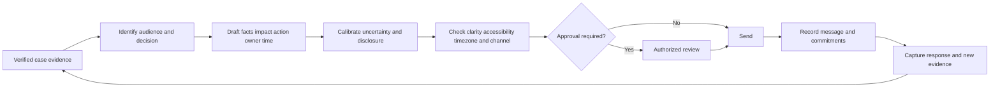
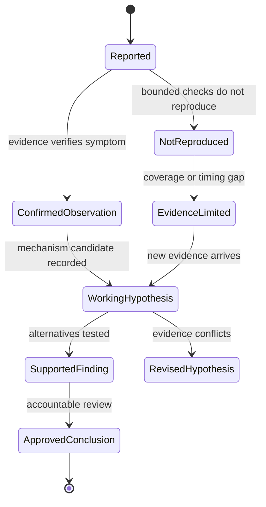
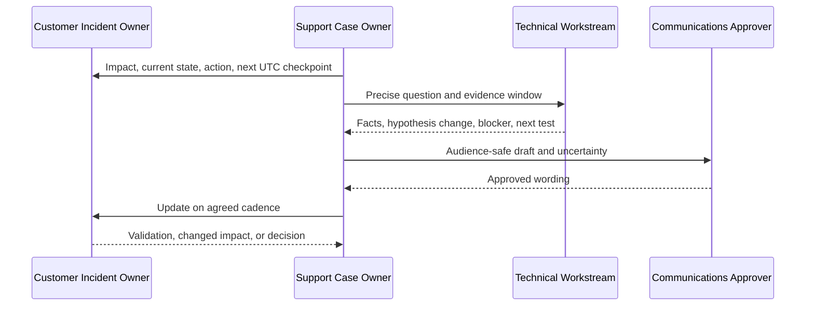
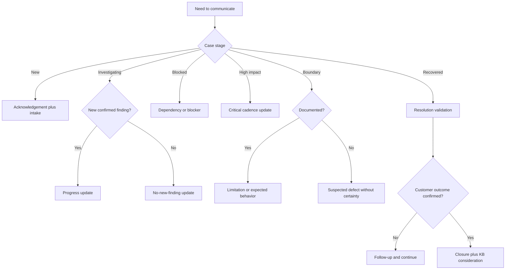

# Appendix F - Customer Communication Templates

> **Artifact label:** Template only; every name, organization, case, time, ID, and example is synthetic.
>
> **Source date:** Official anchors were accessed on **August 24, 2026**. Revalidate current policy, accessibility needs, contracts, and approved channels before use.

## Purpose and How to Use This Appendix

This appendix turns one evidence record into clear messages for customers, administrators, security teams, executives, Customer Success Managers (CSMs), onboarding partners, Engineering, and Product. Each template is a starting structure, not a production script or promise.

To use it:

1. Choose the audience and decision they need to make.
2. Copy only the relevant template.
3. Replace every `{PLACEHOLDER}` and remove unused text.
4. Separate confirmed facts, working hypotheses, unknowns, actions, and commitments.
5. Use absolute dates and times with a zone, preferably UTC plus the recipient's local time when useful.
6. Check consent, redaction, accessibility, localization, contractual, security, privacy, and approval requirements.
7. Read it once as the recipient: can they tell what happened, what to do, who owns the next action, and when they will hear again?

> 🔍 **Plain-English deep-dive:** Good support communication is like a clean airport departure board. It does not explain every engine detail. It shows the current state, the effect on the traveler, the next action, who owns it, and the next reliable update. When there is no new technical finding, the board should still say what was checked and when it will refresh.

| Message goal | Minimum content | Template |
|---|---|---|
| Establish ownership | Acknowledgement, impact heard, first action, return time | 1 |
| Improve diagnosis | Bounded questions, reason, safe response format | 2–4 |
| Maintain trust | Facts, work completed, state, next action, checkpoint | 5–8 |
| Explain boundaries | Expected behavior, limitation, uncertainty, alternatives | 9–11 |
| Repair trust | Missed commitment, ownership, correction, new checkpoint | 12 |
| Stabilize interaction | Concern summary, shared goal, options, next step | 13 |
| Collaborate live | Purpose, agenda, roles, consent, recording/data limits | 14 |
| Coordinate lifecycle | CSM/onboarding handoff and internal update | 15 and 23 |
| Finish well | Resolution, closure, follow-up, reusable knowledge | 16–20 |
| Brief leadership | Impact, state, risk, decision, checkpoint | 21 |

## Candidate Honesty and Safety Boundary

Arti can truthfully draw on substantiated Microsoft enterprise-support experience in customer/partner communication, CRITSIT updates, escalation, fix validation, knowledge work, training, and stakeholder coordination. These messages are newly created study templates. She must not claim they were used in production, disclose customer or employer information, invent Abnormal AI behavior or commitments, or claim direct production experience with Abnormal AI, email-security operations, Google Workspace, Slack, Okta, Splunk, CrowdStrike, Cortex SOAR, Zendesk, Salesforce, Jira, or Zoom.

Safe interview wording:

> “My production communication foundation is Microsoft enterprise support. This library is a synthetic practice artifact showing how I adapt facts, uncertainty, action, and cadence for different audiences. In a real role I would use the employer's approved voice, channels, severity model, commitments, and disclosure process.”

Safety boundaries:

- Do not include passwords, tokens, cookies, private keys, recovery codes, unnecessary personal data, message content, or private internal discussion.
- Do not diagnose a breach, attribute an actor, accept liability, promise compensation, or make legal/compliance claims without authorized review.
- Do not promise a fix time owned by Engineering or a dependency. Promise the next update or action you control.
- Do not request broad logs “just in case.” Explain the exact fields, time window, purpose, redaction, transfer, access, and retention.
- Obtain explicit authorization before remote access, screen sharing, recording, control, capture, download, or configuration change.
- Do not use a customer-facing thread to expose internal speculation, private defect details, personnel names, or unapproved roadmap information.

## The Communication Control Loop



## Audience and Tone Matrix

| Audience | Primary need | Detail level | Tone | Include | Avoid |
|---|---|---|---|---|---|
| End user | What is affected and what should I do? | Low | Calm, respectful, direct | Safe action, workaround, return time | Architecture dump or blame |
| Technical admin | Reproduce, scope, and restore | Medium/high | Precise and collaborative | IDs, UTC window, expected/actual, bounded steps | Unsupported backend claims |
| Security/SOC | Risk, evidence, scope, response boundary | High but minimized | Evidence-led and cautious | Provenance, confidence, security owner, known gaps | Breach/attribution certainty without authority |
| Executive | Consequence, continuity, decision, risk | Low | Concise and accountable | Scope, business effect, state, owner, decision, checkpoint | Raw logs and tool chronology |
| CSM/onboarding | Adoption, expectation, ownership, customer journey | Medium | Coordinated and outcome-focused | Goals, blockers, commitments, handoff boundaries | Turning a technical hypothesis into adoption blame |
| Engineering | Reproducible defect signal and precise ask | High | Neutral and falsifiable | Contract, repro, evidence, hypotheses, regression context | “Customer says broken” |
| Product | Pattern, customer outcome, expected behavior, prioritization evidence | Medium/high | Outcome and pattern focused | Frequency, segments, workaround cost, evidence quality | One case presented as market trend |
| Internal leadership | Operational risk and support needed | Low/medium | Candid and decision-ready | Impact, confidence, blocker, escalation, ask | Customer secrets or unapproved speculation |

## The Reliable Message Formula

Use **F-I-A-O-T**:

| Element | Question | Example |
|---|---|---|
| **Facts** | What is confirmed, and by what scope/time? | “We reproduced HTTP 429 on 3 of 3 synthetic requests after the documented quota was reached.” |
| **Impact** | What capability is affected? | “New records are delayed; existing records remain readable.” |
| **Action** | What was done and what happens next? | “We are comparing retry timing with the response headers.” |
| **Owner** | Who owns the next step or decision? | “I own the case update; Engineering owns contract confirmation.” |
| **Time** | When will the next checkpoint occur? | “Next update by August 27, 2026 at 16:00 UTC.” |

## Uncertainty Calibration

| Evidence state | Safe wording | Avoid |
|---|---|---|
| Report received, not verified | “You reported...” / “We are confirming...” | “The platform caused...” |
| Observation confirmed | “We confirmed `{OBSERVATION}` in `{SCOPE}`.” | “This proves the root cause...” |
| Low-confidence idea | “One possibility we are testing is...” | “It is probably...” without test |
| Medium-confidence hypothesis | “Evidence currently points toward..., but we still need `{EVIDENCE}`.” | “We identified the defect.” |
| High-confidence mechanism | “Evidence supports `{MECHANISM}` within `{SCOPE}`, subject to `{LIMIT}`.” | “This can never happen elsewhere.” |
| Authorized final finding | “The approved analysis concluded...” | “I personally guarantee...” |
| No evidence found | “Within `{SOURCES_WINDOW_SCOPE}`, we found no evidence of...” | “It did not happen.” |
| Dependency unknown | “We are waiting for `{OWNER}` to confirm `{QUESTION}`.” | “The third party is at fault.” |



## Time-Zone, Accessibility, and Global Communication Guidance

| Area | Do | Avoid |
|---|---|---|
| Dates | Write “August 27, 2026,” not `08/27/26` | Ambiguous numeric dates |
| Times | Include zone: “16:00 UTC (09:00 PDT)” and account for daylight saving | “EOD,” “tomorrow morning,” or unexplained local time |
| Cadence | Ask which hours/channel work for a global team; record the agreed schedule | Assuming one region's business day |
| Language | Use short sentences, concrete verbs, and defined acronyms | Idioms, sarcasm, slang, sports metaphors |
| Translation | Keep source text stable and simple; use approved translation process | Asking an unapproved AI/service to translate sensitive text |
| Screen readers | Use real headings, lists, descriptive links, and meaningful table headers | Meaning conveyed only by color or “click here” |
| Cognitive load | Put impact/action/time first; chunk details; one request per bullet | Dense wall of prose |
| Meetings | Provide agenda/material in advance; allow chat/captions or written follow-up | Requiring video or rapid verbal response without need |
| Captions/transcript | Use approved accessibility features with consent and retention clarity | Treating captions as authorization to record/store |
| Names/pronouns | Use the person's stated name and pronouns; verify pronunciation respectfully | Guessing identity or using labels such as “nontechnical user” dismissively |
| Color/status | Pair color with text such as “Blocked” or “Resolved” | Red/green status alone |
| Attachments | Use accessible formats and describe purpose/sensitivity | Unlabeled archives or screenshots of text only |

## Forbidden or High-Risk Phrases

| Phrase to avoid | Why | Safer alternative |
|---|---|---|
| “Calm down.” | Dismisses concern | “I understand the immediate concern is `{IMPACT}`. Let us agree on the next two actions.” |
| “Obviously” / “simply” / “just” | Can shame or minimize difficulty | State the exact action and reason |
| “User error.” | Blames without system context | “The observed input/state differed from `{EXPECTED}`; we are checking why the interface allowed it.” |
| “It works for me.” | Ignores environment difference | “Our control test passed in `{ENVIRONMENT}`; we are comparing `{DIFFERENCES}`.” |
| “No issue found.” | Hides search limits | “We did not reproduce within `{SCOPE_WINDOW}`; evidence limits are `{LIMITS}`.” |
| “This is definitely a bug.” | Premature certainty | “The behavior differs from `{DOCUMENTED_EXPECTATION}` and is under Engineering review.” |
| “The vendor/customer caused it.” | Unsupported blame | “The dependency returned `{OBSERVATION}`; ownership of the mechanism remains under review.” |
| “Fix ASAP.” | No owner, scope, or checkpoint | “Engineering is evaluating `{QUESTION}`; next status by `{UTC}`.” |
| “Guaranteed” / “never again.” | Unbounded promise | “Validation passed for `{SCOPE}`; monitoring continues through `{TIME}`.” |
| “No security impact.” | Often impossible to prove broadly | “No confirmed security impact in `{EVIDENCE_SCOPE}`; `{GAP}` remains open.” |
| “Per my last email.” | Reads as adversarial | “To keep the next step visible, we still need `{ITEM}`.” |
| “Sorry for the inconvenience.” | Generic and may minimize harm | “We missed the `{TIME}` update. I own that miss; here is the corrected state and next checkpoint.” |
| “As mentioned above.” | Inaccessible and vague | Repeat the exact action or link with descriptive text |
| “Whitelist.” | Noninclusive and imprecise | “Allowlist,” with exact object and scope |

## Weak Versus Strong Messages

| Scenario | Weak | Strong |
|---|---|---|
| Acknowledgement | “We are looking into it.” | “I own case `{CASE_ID}`. You reported `{IMPACT}` affecting `{SCOPE}` since `{UTC}`. I will first verify `{ITEM}` and update you by `{UTC}`.” |
| Evidence request | “Send logs and screenshots.” | “Please send the redacted client log from `{UTC_WINDOW}` containing request ID, status, and timestamp. Remove tokens/content; use `{APPROVED_CHANNEL}`. This tests `{HYPOTHESIS}`.” |
| No finding | “No update.” | “We completed `{TESTS}` and found `{RESULT}`. This weakens `{HYPOTHESIS}` but does not explain `{SYMPTOM}`. Next we will `{ACTION}`; update by `{UTC}`.” |
| Defect | “Engineering confirmed a bug.” | “The observed result differs from `{DOCUMENTED_EXPECTATION}`. Engineering is reviewing a suspected defect; cause, scope, and fix timing are not yet confirmed.” |
| Workaround | “Try restarting.” | “As a temporary, reversible workaround, `{STEP}` restored `{CAPABILITY}` in `{TEST_SCOPE}`. Risk/limit: `{LIMIT}`; stop if `{CONDITION}`; expires `{TIME}`.” |
| Resolution | “Fixed. Closing.” | “After `{CHANGE}`, `{N}/{N}` tests passed across `{SCOPE}` through `{TIME}`, with `{REGRESSION_CHECK}`. Please confirm `{BUSINESS_WORKFLOW}` by `{DATE}`.” |
| Missed update | “Sorry, still investigating.” | “I missed the promised `{UTC}` update. I own the communication miss. Current facts are `{FACTS}`; next action `{ACTION}`; new checkpoint `{UTC}`.” |
| Executive | “API errors due to rate limiting.” | “Record creation was delayed for `{SCOPE}` from `{START}` to `{END}`. A bounded workaround is active; no confirmed data loss in the reviewed scope. Decision needed: `{ASK}` by `{UTC}`.” |

## Template 1: Acknowledgement and Ownership

```text
Subject: {CASE_ID} - Acknowledgement and next checkpoint

Hello {NAME_OR_TEAM},

I am {OWNER_NAME_OR_ROLE}, and I own the next steps for this case.

I understand that {CONFIRMED_OR_REPORTED_CAPABILITY} is affecting {SCOPE_OR_BUSINESS_EFFECT}
since {ABSOLUTE_DATE_TIME_ZONE}. I am first checking {FIRST_BOUNDED_ACTION}.

To confirm that I have the right scope: {ONE_CRITICAL_CONFIRMATION_QUESTION}

I will update you by {ABSOLUTE_DATE_TIME_ZONE}, even if the investigation is still in progress.

Regards,
{ROLE}
```

## Template 2: Intake Questions

Send only questions that can change the next decision. Explain why.

| Question category | Copy-ready question | Why it matters |
|---|---|---|
| Outcome | “What exact task cannot be completed, and what should happen instead?” | Separates business impact from technical symptom |
| Scope | “How many subjects are affected out of the known population, and is there an unaffected control?” | Establishes blast radius |
| Time | “What are the first failure and last-known-good times, with time zones?” | Builds a reliable timeline |
| Frequency | “How many attempts failed out of how many, and is the behavior continuous or intermittent?” | Avoids “always” from one event |
| Environment | “Which tenant alias, region, client/version, role, and path are involved? Please omit secrets.” | Identifies state differences |
| Expected behavior | “Which document, prior result, or requirement defines the expected outcome?” | Grounds the contract |
| Change | “What changed before onset, who owns it, and is the change ID/time available?” | Supplies a hypothesis, not proof |
| Continuity | “Is a safe workaround available, and what business/security tradeoff does it create?” | Prioritizes restoration safely |
| Evidence | “Which request/event/message/trace ID joins the failing attempt to logs?” | Enables correlation |
| Consent | “May we use the minimum redacted artifacts for this stated purpose under `{PROCESS}`?” | Establishes handling boundary |

```text
To narrow the next test, could you please provide the following?

1. {QUESTION}
2. {QUESTION}
3. {QUESTION}

Please use synthetic aliases or approved redaction where possible. Do not send passwords,
tokens, cookies, private keys, recovery codes, or unrelated personal/message content.
These answers will help us decide {SPECIFIC_DECISION}.
```

## Template 3: Bounded Evidence Request

```text
Subject: {CASE_ID} - Request for minimum redacted evidence

Purpose: We need to test {HYPOTHESIS_OR_CONTRACT_QUESTION}.

Please provide only:
- Source/artifact: {EXACT_LOG_EXPORT_SCREEN_FIELD}
- UTC window: {START} to {END}
- Required fields: {TIMESTAMP_STATUS_REQUEST_ID_VERSION_NON_SECRET_METADATA}
- Reproduction count/control: {DETAILS}

Please remove or replace:
- Authorization headers, API keys, bearer tokens, cookies, passwords, private keys, and codes
- Unrelated identities, message/body content, personal data, tenant names, and internal hostnames

Transfer: {APPROVED_CHANNEL_OR_SECURE_LOCATION}
Access/retention: {APPROVED_ROLES_AND_DATE}
Please do not send the artifact until {CONSENT_OR_APPROVAL_CONDITION} is confirmed.

This evidence can show {CAPABILITY}; it cannot by itself prove {LIMITATION}.
```

## Template 4: Consent and Redaction Confirmation

```text
Before collection, please confirm:

[ ] You are authorized to share the described artifact for case {CASE_ID}.
[ ] The collection is limited to {PURPOSE}, {SYSTEM}, and {UTC_WINDOW}.
[ ] Secrets and unrelated personal/customer content will be removed.
[ ] Transfer will use {APPROVED_CHANNEL}; access is limited to {ROLES}.
[ ] Retention/deletion follows {POLICY_OR_DATE}.
[ ] Recording, screen control, downloads, or changes are NOT authorized unless separately listed.

Authorized activities: {LIST}
Prohibited activities: {LIST}
Consent/approval owner and time: {ROLE_AND_UTC}
```

Consent is specific and revocable; it is not blanket permission for future data or actions.

## Template 5: Progress Update

```text
Subject: {CASE_ID} - Progress update - {ABSOLUTE_TIME_ZONE}

Hello {NAME_OR_TEAM},

Current impact/state: {IMPACT_AND_ACTIVE_MITIGATED_RECOVERING_STATE}.

Since the last update, we:
- {ACTION_AND_RESULT}
- {ACTION_AND_RESULT}

What this means: {INTERPRETATION_WITH_CONFIDENCE_AND_LIMIT}.
Next action: {ACTION}; owner {ROLE}.
What we need from you: {NONE_OR_ONE_BOUNDED_REQUEST}.
Next update: {ABSOLUTE_DATE_TIME_ZONE}.

Regards,
{ROLE}
```

## Template 6: No-New-Finding Update

```text
Subject: {CASE_ID} - Investigation checkpoint - {ABSOLUTE_TIME_ZONE}

We do not yet have a new confirmed cause. Since the previous update, we completed
{TEST_OR_REVIEW}. The result was {RESULT}, which {WEAKENS_SUPPORTS_DOES_NOT_DISCRIMINATE}
{HYPOTHESIS}. The confirmed impact remains {IMPACT_AND_SCOPE}.

The current blocker/unknown is {BLOCKER_OR_UNKNOWN}. {OWNER} is now {NEXT_ACTION}.
No action is required from you at this time / We need {ONE_REQUEST} by {TIME}.

I will return with the next checkpoint by {ABSOLUTE_DATE_TIME_ZONE}, even if the cause
remains under investigation.
```

## Template 7: Critical-Incident Cadence



```text
CRITICAL UPDATE {NUMBER} - {INCIDENT_OR_CASE_ID} - {YYYY-MM-DDThh:mm:ssZ}

Impact: {CAPABILITY_SCOPE_BUSINESS_SECURITY_DATA_FACTS}
State: {ACTIVE_MITIGATED_RECOVERING_MONITORING}
Change since last update: {NEW_FACT_DECISION_ACTION_RESULT_OR_NO_CONFIRMED_CHANGE}
Current workstreams: {WORKSTREAM_OWNER_OBJECTIVE}
Workaround/containment: {STATUS_RISK_EXPIRY}
Top unknown/blocker: {UNKNOWN_OWNER}
Decision/action needed: {NONE_OR_EXPLICIT_ASK_DECIDER_TIME}
Next checkpoint: {UTC}; channel {CHANNEL}; owner {ROLE}
```

| Severity/cadence cue | Communication behavior |
|---|---|
| Material active impact | Agree cadence and channel; update even without a finding |
| Impact changes | Send an out-of-cycle update after validation/approval |
| Security/privacy possibility | Use minimum facts and route declaration/disclosure to authorized owners |
| Handoff across regions | Name outgoing/incoming owner and require read-back |
| Recovery starts | Distinguish mitigated, recovering, validated, and closed |
| Customer asks for fix ETA | Give engineering status if approved; commit to next checkpoint, not invented fix time |

## Template 8: Dependency or Blocker

```text
Current blocker: We need {DEPENDENCY_OWNER} to confirm {PRECISE_QUESTION_OR_ARTIFACT}.
Why it matters: This determines {DECISION_OR_HYPOTHESIS}.
Requested at: {UTC}; dependency reference {SAFE_ID}.
What can continue in parallel: {ACTION_OR_NONE}.
Risk while waiting: {IMPACT_AND_CONTINUITY}.
Escalation path/checkpoint: {ROLE_AND_UTC}.

This identifies a dependency; it does not assign fault.
```

## Template 9: Workaround

```text
We have a temporary workaround for {CAPABILITY}: {BOUNDED_STEPS}.

Validated scope: {ENVIRONMENT_POPULATION_N_OF_N_TIME_WINDOW}.
Expected benefit: {OUTCOME}.
Known limits/risks: {SECURITY_PRIVACY_DATA_PERFORMANCE_OPERATIONAL_LIMITS}.
Prerequisites/authorization: {DETAILS}.
Stop if: {CONDITIONS}.
Rollback/expiry: {PLAN_AND_DATE}.

This restores {CAPABILITY} temporarily; it is not yet evidence that the underlying cause
is removed. We are separately validating {FIX_OR_CAUSE_QUESTION}.
```

## Template 10: Limitation or Expected Behavior

```text
We confirmed that {OBSERVED_RESULT} matches the documented behavior for {SCOPE_VERSION},
as described in {CURRENT_OFFICIAL_SOURCE_OR_CONTRACT}.

The practical effect is {CUSTOMER_OUTCOME}. The product currently supports {SUPPORTED_PATH}
and does not support/guarantee {BOUNDARY}. This is a capability boundary, not a statement
that the business need is invalid.

Available options:
1. {SUPPORTED_ALTERNATIVE_AND_TRADEOFF}
2. {CONFIGURATION_OR_PROCESS_OPTION_AND_OWNER}
3. Record the use case for Product review: {PROCESS_WITHOUT_ROADMAP_PROMISE}

Please confirm which outcome matters most: {QUESTION}.
```

Do not call behavior “expected” merely because it reproduced. Tie the statement to an authorized, current contract or source.

## Template 11: Suspected Defect Without Certainty

```text
The observed result {ACTUAL} differs from {DOCUMENTED_EXPECTATION} in {SCOPE}.
We reproduced this {X}/{Y} times, with control result {A}/{B}.

Engineering is reviewing it as a suspected defect. At this stage, the cause, complete
scope, defect status, fix approach, and timing are not confirmed. The evidence package
contains {SAFE_SUMMARY}; reference {INTERNAL_OR_APPROVED_ID}.

While review continues, {WORKAROUND_OR_CONTINUITY}. Next update: {UTC}.
```

## Template 12: Missed Commitment and Apology

```text
I committed to update you by {PROMISED_UTC} and missed that checkpoint. I own the
communication miss. {BRIEF_FACTUAL_REASON_IF_USEFUL_AND_APPROVED}; it does not change the
commitment I made.

Current confirmed state: {FACTS_IMPACT}.
Work completed: {ACTIONS_RESULTS}.
Next action and owner: {ACTION_ROLE}.
New checkpoint: {ABSOLUTE_DATE_TIME_ZONE}.

To prevent another silent gap, {PROCESS_CHANGE_SUCH_AS_HANDOFF_OR_BACKUP_OWNER}.
```

An apology should acknowledge the specific miss, take appropriate ownership, correct the record, and state a reliable next action. Do not make unauthorized legal admissions.

## Template 13: De-escalation

```text
I hear that the immediate concern is {IMPACT_OR_MISSED_EXPECTATION}. Our shared goal is
{DESIRED_OUTCOME}.

What is confirmed: {FACTS}.
What remains unknown: {UNKNOWNS}.
What I can do now: {OPTION_1} or {OPTION_2}.
What requires another owner: {DECISION_AND_ROLE}.

My recommendation is {ACTION_AND_REASON}. I will record the decision and return by {UTC}.
If I have misunderstood the priority, please correct this sentence: {ONE_LINE_SUMMARY}.
```

| Heated moment | Useful move | Avoid |
|---|---|---|
| Repeated demand for certainty | Name facts, unknown, evidence needed, and checkpoint | Debating tone or inventing certainty |
| Personal criticism | Redirect to impact, action, and conduct boundary | Matching aggression |
| Conflicting priorities | Ask authorized decider to rank outcomes/tradeoffs | Trying to satisfy incompatible commitments silently |
| Threat or abusive conduct | Follow safety/conduct escalation policy | Continuing an unsafe interaction alone |
| Executive joins | Restate consequence, state, decision, owner, time | Replaying the full technical history |

## Template 14: Remote Session Invitation, Agenda, and Consent

```text
Subject: {CASE_ID} - Proposed remote troubleshooting session - {DATE_TIME_ZONE}

Purpose: Observe one bounded reproduction of {SYMPTOM} and collect {MINIMUM_FIELDS} to
test {HYPOTHESIS}. A session is optional; the written alternative is {ALTERNATIVE}.

Proposed time: {ABSOLUTE_DATE_TIME_ZONE}; duration {MINUTES}; approved platform {PLATFORM}.
Participants/roles: {NAMES_OR_ROLES}.

Agenda:
1. Confirm scope, authorization, sensitive-data boundaries, and stop conditions.
2. Review expected versus actual behavior.
3. Run one approved reproduction using {SYNTHETIC_OR_REDACTED_INPUT}.
4. Review minimum evidence and agree on next action.

Consent and controls:
- Screen sharing: {YES_NO}; specific window only {YES_NO}.
- Remote control: {NO_UNLESS_SEPARATELY_APPROVED}.
- Recording/transcription/captions: {STATE_PURPOSE_RETENTION_ACCESS}; consent {STATUS}.
- Downloads/uploads: {NONE_OR_EXACT_APPROVED_ARTIFACT}.
- Configuration changes: {NONE_OR_PREAPPROVED_CHANGE_ID}.
- Secrets/private content must be closed or redacted before sharing.
- Anyone may pause the session if unexpected sensitive data or unsafe impact appears.

Please confirm the time, authorized participant, and consent choices above.
Afterward I will send the observation, decisions, action owners, and next checkpoint.
```

## Template 15: CSM or Onboarding Handoff

```text
CSM/ONBOARDING HANDOFF - {CUSTOMER_ALIAS} - {DATE}

Customer outcome: {ADOPTION_OR_BUSINESS_GOAL}
Current stage/milestone: {STAGE_AND_TARGET_DATE}
Technical state: {SUPPORTED_CONFIGURATION_VALIDATED_PATH_OPEN_CASES}
Open blocker(s): {BLOCKER_OWNER_IMPACT_CHECKPOINT}
Customer sentiment/priority: {DIRECTLY_OBSERVED_OR_REPORTED_NOT_INFERRED}
Commitments already made: {OWNER_ACTION_DATE}
Decisions needed: {DECISION_OWNER_DUE}
Training/accessibility/time-zone needs: {APPROVED_MINIMUM_DETAILS}
Support boundary: {WHAT_SUPPORT_OWNS}
CSM/onboarding boundary: {WHAT_CSM_OR_ONBOARDING_OWNS}
Next joint touchpoint: {ABSOLUTE_DATE_TIME_ZONE_AND_AGENDA}
Evidence/case links: {AUTHORIZED_LINKS_ONLY}
```

## Template 16: Resolution Confirmation

```text
Subject: {CASE_ID} - Resolution validation

The change/action {CHANGE_ID_OR_DESCRIPTION} was completed by {AUTHORIZED_OWNER} at {UTC}.

Validation completed:
- Original workflow: {N}/{N} tests passed across {SCOPE}.
- Control/regression checks: {RESULTS}.
- Security/privacy checks: {RESULTS}.
- Monitoring window: {START_END_THRESHOLD}; result {RESULT}.
- Remaining limitation/residual risk: {DETAILS_OR_NONE_IDENTIFIED_IN_SCOPE}.

Please confirm whether {BUSINESS_CAPABILITY} now works for {CUSTOMER_VALIDATION_SCOPE}.
This confirms the tested scope; it does not guarantee unrelated paths or future behavior.
```

## Template 17: Closure Notice

```text
Subject: {CASE_ID} - Proposed closure - response by {ABSOLUTE_DATE}

Summary: {SYMPTOM_AND_IMPACT}.
Resolution/answer: {CHANGE_WORKAROUND_EXPECTED_BEHAVIOR_OR_GUIDANCE}.
Validation: {EVIDENCE_SCOPE_TIME_AND_CUSTOMER_CONFIRMATION}.
Known limits/follow-up: {DETAILS_AND_OWNER}.
Reusable guidance: {APPROVED_KB_OR_RUNBOOK_LINK_IF_ANY}.

Unless you identify a remaining issue by {ABSOLUTE_DATE_TIME_ZONE}, we plan to close this
case according to {APPROVED_PROCESS}. Closure does not prevent a new case or approved
follow-up if the behavior recurs; please retain {SAFE_IDS_NOT_SECRETS}.
```

## Template 18: Follow-Up After Resolution

```text
Subject: {CASE_ID} - Post-resolution follow-up

We are checking the agreed outcome after {MONITORING_PERIOD}. Has {BUSINESS_CAPABILITY}
remained stable for {SCOPE} since {UTC}?

Our monitoring/available evidence shows {RESULT_AND_LIMIT}. Open preventive action(s):
{ACTION_OWNER_DUE_VERIFICATION}. No additional data is needed / Please provide only
{MINIMUM_FIELD} if recurrence occurred.

Thank you for confirming {ONE_SPECIFIC_OUTCOME_OR_GAP}.
```

## Template 19: Knowledge-Base Suggestion

```text
This case may be reusable as a knowledge article because {RECURRING_OR_HIGH_VALUE_REASON}.

Proposed reader question: {SEARCHABLE_PLAIN_LANGUAGE_QUESTION}
Audience: {CUSTOMER_INTERNAL_SUPPORT_ADMIN}
Scope/prerequisites: {VERSIONS_ROLES_ENVIRONMENT}
Safe symptoms/signature: {NON_SENSITIVE_FIELDS}
Decision path: {CHECKS_AND_ESCALATION_CUES}
Resolution/workaround: {APPROVED_STEPS_RISKS_ROLLBACK}
Validation: {HOW_READER_CONFIRMS_SUCCESS}
Exclusions: {SIMILAR_CASES_NOT_COVERED}
Source owner/reviewer: {ROLE}; review date {DATE}
Sensitive/private details to omit: {LIST}
```

## Template 20: Customer Resolution Summary

```text
CASE SUMMARY - {CASE_ID}

You reported: {SYMPTOM_AND_IMPACT}.
We confirmed: {OBSERVATIONS_SCOPE_AND_TIME}.
Cause/answer: {APPROVED_CAUSE_WITH_CONFIDENCE_OR_EXPECTED_BEHAVIOR_OR_CAUSE_UNKNOWN}.
Actions taken: {SUPPORT_CUSTOMER_DEPENDENCY_ACTIONS_WITH_OWNERS}.
Outcome: {VALIDATED_BUSINESS_RESULT}.
Remaining items: {ACTION_OWNER_DATE_OR_NONE}.
Prevention/reuse: {KB_RUNBOOK_MONITORING_OR_FOLLOW_UP}.
```

## Template 21: Executive Summary

```text
EXECUTIVE UPDATE - {CASE_OR_INCIDENT_ID} - {UTC}

Impact: {BUSINESS_CAPABILITY_SCOPE_DURATION_SECURITY_OR_DATA_FACTS}.
State: {ACTIVE_MITIGATED_RECOVERING_RESOLVED_MONITORING}.
Continuity: {WORKAROUND_AND_LIMIT}.
Current finding: {FACT_OR_HYPOTHESIS_WITH_CONFIDENCE_AND_LIMIT}.
Risk/unknown: {TOP_RISK_OR_UNKNOWN}.
Decision/support needed: {EXPLICIT_ASK_OWNER_DUE_OR_NONE}.
Next milestone/checkpoint: {UTC_AND_OWNER}.
```

## Template 22: Escalation Notice to the Customer

```text
We are escalating this case to {SPECIALIST_ROLE} because {IMPACT_AUTHORITY_OR_TECHNICAL_REASON}.
The escalation asks them to {PRECISE_QUESTION_OR_ACTION}; it does not yet confirm a defect
or cause.

I remain your case owner for {CUSTOMER_THREAD_AND_COMMITMENTS}. The specialist owns
{TECHNICAL_DECISION_OR_INVESTIGATION}. They have received {SAFE_EVIDENCE_SUMMARY}; no new
evidence is required from you at this time / we need {BOUNDED_REQUEST}.

Next update: {ABSOLUTE_DATE_TIME_ZONE}.
```

## Template 23: Internal Engineering or Product Update

```markdown
## Internal update - {CASE_ID} - {ONE_LINE_OUTCOME}

**Audience/owner requested:** {ENGINEERING_OR_PRODUCT_ROLE}
**Precise ask:** {EXPECTED_BEHAVIOR_DEFECT_SCOPE_TELEMETRY_OR_PRIORITY_QUESTION}

### Customer outcome and pattern
- Impact/scope/time: {FACTS}
- Frequency/segments/case pattern: {EVIDENCE_NOT_ASSUMPTION}
- Workaround cost/limit: {DETAILS}

### Contract and observation
- Expected/source: {CURRENT_DOCUMENT_CONTRACT}
- Actual: {OBSERVATION}
- Minimum reproduction/control: {X_OF_Y_AND_A_OF_B}

### Evidence and hypotheses
- Manifest/window/join keys: {SAFE_LOCATION_DETAILS}
- Leading hypothesis/confidence: {DETAILS}
- Alternatives/gaps: {DETAILS}

### Customer-safe commitments
- Last/next update: {UTC}
- Statements not yet approved: {CAUSE_DEFECT_SCOPE_ETA_ROADMAP}

### Requested response shape
Please return: {FACTS_OR_DECISION}, confidence/limits, next test/owner, and customer-safe
wording by {UTC_CHECKPOINT}. Do not include secrets or private implementation detail in the
customer-facing field.
```

## Message Selection Decision Tree



## Common Traps and Troubleshooting Cues

| Trap/failure mode | Signal | Corrective cue |
|---|---|---|
| Activity dump | Message lists meetings/tools but no decision | Lead with impact, finding, next action, owner, time |
| False empathy | “I know exactly how you feel” without basis | Name the stated impact and practical priority |
| Hidden request | Recipient cannot tell what to send/do | Put one bounded request in a separate sentence |
| Silent uncertainty | Passive voice hides confidence | Label report, observation, hypothesis, or approved conclusion |
| Status inflation | “Resolved” before business validation | Use mitigated/recovering/monitoring until criteria pass |
| Technical flooding | Executive receives logs/status-code chronology | Translate to capability, scope, risk, decision, time |
| Oversimplification | Admin receives “we are investigating” only | Include expected/actual, IDs, test, and next discriminator |
| Time-zone ambiguity | “Tomorrow EOD” | Absolute date, clock time, and zone |
| Accessibility afterthought | Screenshot-only steps or unexplained color | Semantic text, headings, captions/alternatives, explicit status |
| Excess evidence | Full log or mailbox export requested | Minimum fields/window with purpose and redaction |
| Remote-session drift | Session becomes open-ended exploration | Agenda, roles, one repro, consent, stop conditions, recap |
| Internal leakage | Customer sees private hypothesis/roadmap/personnel | Maintain audience-safe record and approval boundary |
| Blame language | “Customer misconfigured” / “vendor failed” | State exact observed state, contract, owner, and open mechanism |
| Copy-paste residue | Wrong name/case/time/commitment | Search all braces; verify facts and recipients before send |

## Decision and Troubleshooting Cue Card

| Situation | First sentence | Required next element |
|---|---|---|
| New case | “I own the next steps for `{CASE_ID}`.” | Heard impact and first checkpoint |
| No technical change | “We do not yet have a new confirmed cause.” | Work completed, implication, next test, return time |
| Customer asks “is it a bug?” | “The behavior differs from `{SOURCE}` and is under review.” | What is/is not confirmed and continuity |
| Evidence unavailable | “The current evidence ceiling is `{LIMIT}`.” | Alternative test, retention risk, owner |
| Customer upset | “The immediate concern I hear is `{IMPACT}`.” | Shared goal and two bounded options |
| Missed checkpoint | “I missed the promised `{UTC}` update.” | Ownership, corrected state, new reliable time |
| Remote session requested | “The session's purpose is one bounded reproduction of `{SYMPTOM}`.” | Agenda, consent, data/control limits, written alternative |
| Resolution candidate | “The target workflow passed `{N}/{N}` tests in `{SCOPE}`.” | Regression/security/window/customer validation |

## Cross-Links to the Main Guide

| Need | Main guide link |
|---|---|
| Honest experience claims | [Part 001 - Role Compass and Honest Candidate Story](Part-001-role-compass-and-honest-candidate-story.md) |
| Privacy, consent, and evidence ethics | [Part 005 - Privacy Data Handling and Evidence Ethics](Part-005-privacy-data-handling-and-evidence-ethics.md) |
| Evidence packaging | [Part 098 - Safe Evidence Collection Redaction and Packaging](Part-098-safe-evidence-collection-redaction-and-packaging.md) |
| Intake and reproduction | [Part 101 - Intake Scoping Reproduction and Environment](Part-101-intake-scoping-reproduction-and-environment.md) |
| Severity and commitments | [Part 102 - Severity Priority Impact SLAs and SLOs](Part-102-severity-priority-impact-slas-and-slos.md) |
| Escalation and critical incidents | [Part 104 - Escalation Handoffs Swarming and Critical Incidents](Part-104-escalation-handoffs-swarming-and-critical-incidents.md) |
| Customer updates and expectations | [Part 108 - Customer Updates Empathy and Expectation Management](Part-108-customer-updates-empathy-and-expectation-management.md) |
| De-escalation and executive translation | [Part 109 - Difficult Conversations De-escalation and Executive Translation](Part-109-difficult-conversations-de-escalation-and-executive-translation.md) |
| Remote troubleshooting | [Part 110 - Remote Troubleshooting and Zoom Session Practice](Part-110-remote-troubleshooting-and-zoom-session-practice.md) |
| CSM/onboarding collaboration | [Part 111 - Onboarding With CSMs Success Handoffs and Training](Part-111-onboarding-with-csms-success-handoffs-and-training.md) |
| Multi-audience artifact practice | [Part 112 - Trust Building Communication Artifact Workshop](Part-112-trust-building-communication-artifact-workshop.md) |
| Engineering/Product updates | [Part 113 - Engineering and Product Collaboration](Part-113-engineering-and-product-collaboration.md) |
| KB suggestions | [Part 107 - KCS KB Deflection Trends and Voice of Customer](Part-107-kcs-kb-deflection-trends-and-voice-of-customer.md) |

## Official Source Anchors - August 24, 2026

All sources below were accessed on **August 24, 2026**. They inform clarity, accessibility, risk communication, incident coordination, and privacy discipline. They do not define Abnormal AI's private voice, workflow, severity, SLA, remote-session policy, or customer commitment, and they do not prove these templates were used in production.

| Official or primary source | Use in this appendix | Boundary |
|---|---|---|
| [Microsoft Writing Style Guide](https://learn.microsoft.com/en-us/style-guide/welcome/) | Warm, crisp, clear, helpful technical writing | Public style guidance is not a private support script or proof of Arti's exact prior wording |
| [Microsoft Writing Style Guide - Global communications](https://learn.microsoft.com/en-us/style-guide/global-communications/) | Clear language and localization-aware communication | Does not replace translation, legal, cultural, accessibility, or regional review |
| [Microsoft Writing Style Guide - Bias-free communication](https://learn.microsoft.com/en-us/style-guide/bias-free-communication) | Inclusive and respectful language | Not an employment, conduct, accommodation, or legal policy |
| [W3C Web Content Accessibility Guidelines 2.2](https://www.w3.org/TR/WCAG22/) | Perceivable, operable, understandable, and robust web-content principles | Does not alone define live-support accommodations or a private implementation |
| [W3C WAI - Writing for Web Accessibility](https://www.w3.org/WAI/tips/writing/) | Descriptive headings/links, plain language, instructions, and alternatives | Tips require adaptation to channel and audience |
| [CDC Crisis and Emergency Risk Communication Manual](https://www.cdc.gov/cerc/php/cerc-manual/index.html) | Audience needs, empathy, credible information, uncertainty, and action | Public-health context is not a SaaS support policy or legal script |
| [NIST SP 800-61 Rev. 3](https://csrc.nist.gov/pubs/sp/800/61/r3/final) | Coordinated incident response and communication within risk management | Does not supply customer wording, declare an incident, or define an SLA |
| [NIST Cybersecurity Framework 2.0](https://www.nist.gov/cyberframework) | Govern, Respond, Recover, and communication outcomes | Outcome framework, not a messaging template or certification |
| [NIST Privacy Framework](https://www.nist.gov/privacy-framework) | Privacy-risk communication, data processing, governance, and control context | Does not determine a specific legal obligation or consent form |
| [Google SRE Book - Managing Incidents](https://sre.google/sre-book/managing-incidents/) | Roles, communication function, periodic updates, handoffs, and source of truth | Google practice is not Abnormal policy or universal cadence |
| [Zoom Trust Center](https://www.zoom.com/en/trust/) | Official public security, privacy, compliance, and trust source family for the named learning target | Does not prove direct Zoom production use or authorize recording/control/data transfer |
| [RFC 3339](https://www.rfc-editor.org/rfc/rfc3339.html) | Internet date/time format and explicit offsets | Human messages may need spelled-out local equivalents for clarity |

## Completion and Use Checklist

- [ ] I selected the audience and the decision or action the message supports.
- [ ] I replaced every placeholder, verified recipients, and removed irrelevant template text.
- [ ] I labeled reported facts, confirmed observations, hypotheses, unknowns, and approved conclusions accurately.
- [ ] I included impact/current state, action, owner, and an absolute next checkpoint with time zone.
- [ ] I did not promise a fix time, roadmap, cause, scope, security outcome, or compensation outside my authority.
- [ ] I used minimum necessary evidence and stated purpose, window, fields, redaction, transfer, access, and retention.
- [ ] I included no password, token, cookie, private key, personal/customer content, employer secret, or private product behavior.
- [ ] I confirmed remote-session scope, platform, participants, consent, recording/transcript, control, download, change, and stop conditions.
- [ ] I used plain language, expanded acronyms, removed idioms, and checked global time-zone clarity.
- [ ] The message works without color, has meaningful headings/links, and offers a written or accessible alternative when appropriate.
- [ ] Customer-facing wording excludes internal speculation, personnel detail, unapproved defect data, and roadmap discussion.
- [ ] I recorded each commitment and arranged a handoff/backup for global or critical cadence.
- [ ] Resolution language includes tested scope, regression/security checks, monitoring window, residual limits, and customer validation.
- [ ] I labeled the artifact as template/synthetic and did not claim it was used in production.
- [ ] I revalidated official sources and local policy beyond the August 24, 2026 access date when decision-critical.

## Likely Interview Questions

1. **How do you communicate when there is no new finding?**  
   **Model answer:** I say there is no new confirmed cause, list the work completed and result, explain how it changed confidence, name the blocker/next test and owner, and commit to the next checkpoint.

2. **How do you tell a customer something may be a defect?**  
   **Model answer:** I compare actual behavior with a current documented expectation, give reproduction/control evidence, say Engineering is reviewing a suspected defect, and make clear that cause, scope, defect status, fix, and timing remain unconfirmed.

3. **What makes an evidence request safe?**  
   **Model answer:** A precise purpose, minimum artifact and fields, bounded UTC window, approved authorization/transfer/access/retention, explicit secret/content redaction, and an explanation of what the evidence can and cannot prove.

4. **How do you handle a missed update?**  
   **Model answer:** Name the exact missed commitment, take ownership for the communication gap, correct the state, provide the next action/owner and a reliable checkpoint, and change the handoff process to prevent silence.

5. **How do you adapt one case for an executive and Engineering?**  
   **Model answer:** The evidence remains the same. Executives receive impact, continuity, state, risk, decision, and time. Engineering receives the contract, minimum reproduction, IDs, hypotheses, gaps, and precise ask. Neither audience receives unsupported certainty or unnecessary sensitive data.

## 30-Second Memory Hooks

- **F-I-A-O-T:** facts, impact, action, owner, time.
- **No finding is still an update:** work, result, implication, next test, checkpoint.
- **Suspected defect:** difference plus evidence, never invented certainty or ETA.
- **Global clarity:** absolute date, clock time, zone, plain language.
- **Remote session:** purpose, agenda, consent, limits, stop, recap.
- **Resolution:** business validation plus scope and limits, not “green means done.”

**Suggested next appendix:** [Appendix G - API and JSON Examples](Appendix-G-api-and-json-examples.md).