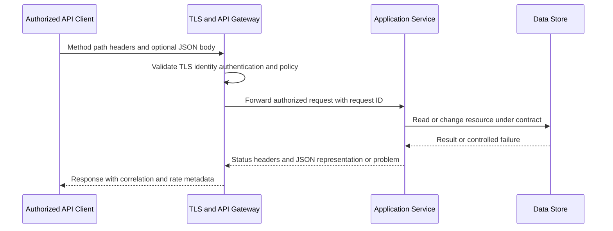
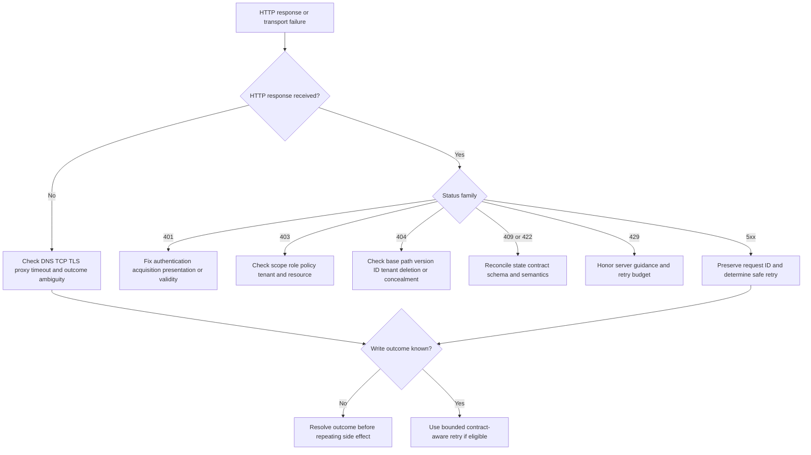
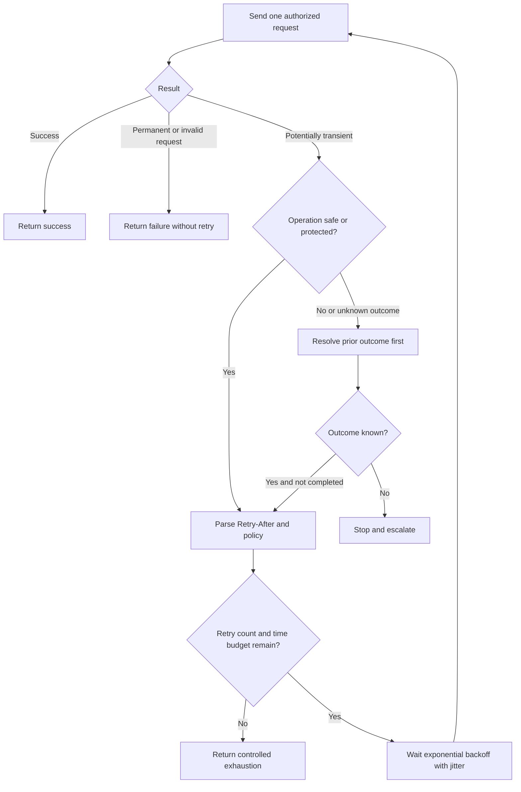
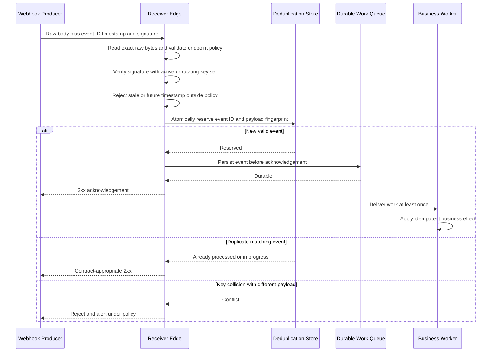

# Appendix G - API and JSON Examples

> **Artifact label:** Learning and template reference only; all endpoints, identities, IDs, payloads, times, and credentials are synthetic.
>
> **Source date:** Official anchors were accessed on **August 24, 2026**. API contracts and tools change; verify the current specification, environment, and authorization before use.

## Purpose and How to Use This Appendix

This appendix is a safe request-to-evidence cookbook for REST-style HTTP APIs, JSON payloads, authentication, pagination, errors, retries, idempotency, and webhooks. It is designed to answer four support questions quickly:

1. **What did the client actually send?**
2. **What did the server actually return?**
3. **What does the documented contract say should happen?**
4. **Which minimum evidence will distinguish the next hypothesis?**

All `json` fences contain strict JSON with no comments or trailing commas. Explanations appear before or after each sample because JSON itself has no comment syntax. HTTP examples use `https://api.example.com`, the IANA-reserved documentation domain, or loopback `http://localhost`; they are illustrative and do not assert that those endpoints exist.

> 🔍 **Plain-English deep-dive:** An API is like a staffed service counter. The URL identifies the counter and item, the HTTP method says what operation you want, headers carry handling instructions and credentials, the body carries structured paperwork, and the status/body explain the outcome. A request ID is the claim ticket that helps both sides find the same transaction.

| Use case | Go to |
|---|---|
| Read/create/update/delete examples | CRUD and HTTP exchanges |
| Diagnose authentication/authorization | Credential comparison and 401/403/404 table |
| Validate JSON shape/types | JSON semantics and JSON Schema |
| Retrieve all results | Offset/cursor pagination and filtering/sorting |
| Handle overload/transient failure | Rate limits, `Retry-After`, backoff, idempotency |
| Receive events safely | Webhook signature, timestamp, deduplication, replay defense |
| Reproduce with a tool | curl, Postman, and PowerShell examples |
| Escalate | Safe evidence package and troubleshooting matrix |

## Candidate Honesty and Safety Boundary

Arti may truthfully connect API reasoning, evidence correlation, PowerShell, browser/network diagnostics, and safe lab practice to her Microsoft enterprise-support background and upskilling. She must not claim that these samples came from production or that she directly operated Abnormal AI, Google Workspace, Slack, Okta, Splunk, CrowdStrike, Cortex SOAR, Zendesk, Salesforce, Jira, or Zoom in production.

Safe interview wording:

> “These are standards-grounded, synthetic API examples. My production foundation is Microsoft enterprise support and evidence-led troubleshooting; my API depth is reinforced through safe public/local labs. I would verify the actual contract and authorized tooling rather than infer private platform behavior.”

Security boundary:

- Never paste or store a live API key, bearer token, refresh token, cookie, password, client secret, private key, webhook secret, or signed URL in a case, screenshot, command transcript, Postman export, or source file.
- Never disable certificate or hostname verification. A TLS failure is evidence to diagnose, not a reason to remove trust validation.
- Do not send test traffic to a customer/vendor endpoint without authorization. Use `example.com` for documentation and `localhost` for a learner-owned lab.
- Treat GET/query URLs as potentially logged by clients, proxies, servers, and analytics; keep secrets and sensitive filters out of the URL.
- Minimize payloads and logs, redact structurally, use approved transfer/storage, and record retention/deletion.
- Do not infer private API fields, limits, retry policy, signature grammar, or version lifecycle from these vendor-neutral examples.

## Safe Reserved Values

| Value | Safe use | Note |
|---|---|---|
| `example.com`, `api.example.com` | Documentation URLs | Reserved for examples; no availability implied |
| `localhost`, `127.0.0.1`, `::1` | Learner-owned loopback lab | Confirm the listener belongs to you |
| `192.0.2.0/24` | Documentation network | TEST-NET-1 |
| `198.51.100.0/24` | Documentation network | TEST-NET-2 |
| `203.0.113.0/24` | Documentation network | TEST-NET-3 |
| `user@example.com` | Synthetic identity | Do not substitute a real person in shared artifacts |
| `req_example_01`, `evt_example_01` | Synthetic correlation IDs | Never imply provider format |
| `[REDACTED]` | Visible replacement | Show the field existed without preserving the secret |
| `{PLACEHOLDER}` | Template field | Replace or remove before use |

## API Request and Response Anatomy



### Annotated Request

```http
POST /v1/widgets HTTP/1.1
Host: api.example.com
Authorization: Bearer [REDACTED]
Content-Type: application/json
Accept: application/json
Idempotency-Key: idem_example_20260827_001
X-Correlation-ID: corr_example_001
User-Agent: ExampleSupportLab/1.0

{"name":"Synthetic Widget","enabled":true,"labels":["lab","safe"]}
```

| Component | Meaning | Troubleshooting cue | Redaction cue |
|---|---|---|---|
| Method | Requested operation semantics | Verify endpoint supports it and whether retry is safe | Usually safe |
| Path/query | Resource and selection | Check encoding, base URL, version, ID, pagination/filter grammar | Redact tenant/object/user/search terms as needed |
| `Host` | Intended authority | Compare DNS, TLS SNI/name, proxy route | Internal hostnames may be sensitive |
| `Authorization` | Authentication credential presentation | Record scheme and non-secret metadata only | Replace complete value with `[REDACTED]` |
| `Content-Type` | Format of request body | `415` may indicate mismatch | Usually safe; body is separate |
| `Accept` | Desired response representation | `406` may indicate unsupported representation | Usually safe |
| Idempotency key | Duplicate-suppression identity if contract supports it | Same operation must reuse the same key; different operation needs new key | Treat as correlation-sensitive; not an auth secret by default |
| Correlation ID | Client/server join key | Preserve exact value if policy permits | May expose internal topology; minimize |
| Body | Representation/instructions | Validate JSON syntax, schema, type, required/null semantics | Remove secrets, PII, content, and unrelated fields |

### Annotated Response

```http
HTTP/1.1 201 Created
Content-Type: application/json
Location: https://api.example.com/v1/widgets/wdg_example_001
X-Request-ID: req_example_001
RateLimit-Limit: 100
RateLimit-Remaining: 99

{"id":"wdg_example_001","name":"Synthetic Widget","enabled":true,"labels":["lab","safe"],"created_at":"2026-08-27T10:00:00Z"}
```

The status says a resource was created, `Location` points to its identifier, and `X-Request-ID` is a contract-specific correlation header. Rate-limit field names and semantics must be checked against the actual contract.

## CRUD Quick Reference

**CRUD** means **Create, Read, Update, Delete**. HTTP methods are protocol semantics; an API contract decides which method applies to which resource.

| CRUD intent | Common method | Typical success | Idempotency expectation | Key caution |
|---|---|---|---|---|
| Create | `POST /widgets` | `201 Created` | Not inherently idempotent | Retry may duplicate unless contract/idempotency key prevents it |
| Read collection | `GET /widgets` | `200 OK` | Safe and idempotent | Pagination/filtering and authorization affect completeness |
| Read one | `GET /widgets/{id}` | `200 OK` | Safe and idempotent | `404` may mean absent or intentionally concealed |
| Replace | `PUT /widgets/{id}` | `200`/`204` | Idempotent by method semantics | Omitted fields may reset depending on contract |
| Partial update | `PATCH /widgets/{id}` | `200`/`204` | Depends on patch format/operation | Concurrent changes and patch semantics matter |
| Delete | `DELETE /widgets/{id}` | `204 No Content` | Idempotent intent | Repeating can return `404`; deletion may be soft/asynchronous |

### Create

```json
{
  "name": "Synthetic Widget",
  "enabled": true,
  "labels": [
    "lab",
    "safe"
  ]
}
```

```http
POST /v1/widgets HTTP/1.1
Host: api.example.com
Authorization: Bearer [REDACTED]
Content-Type: application/json
Accept: application/json
Idempotency-Key: idem_example_20260827_001

{"name":"Synthetic Widget","enabled":true,"labels":["lab","safe"]}
```

### Read

```http
GET /v1/widgets/wdg_example_001 HTTP/1.1
Host: api.example.com
Authorization: Bearer [REDACTED]
Accept: application/json
```

```json
{
  "id": "wdg_example_001",
  "name": "Synthetic Widget",
  "enabled": true,
  "labels": [
    "lab",
    "safe"
  ],
  "created_at": "2026-08-27T10:00:00Z"
}
```

### Replace With PUT

```http
PUT /v1/widgets/wdg_example_001 HTTP/1.1
Host: api.example.com
Authorization: Bearer [REDACTED]
Content-Type: application/json
If-Match: "etag_example_002"

{"name":"Synthetic Widget v2","enabled":false,"labels":["lab"]}
```

`If-Match` is a conditional request example. The real API must document ETag support and replacement semantics.

### Partial Update With PATCH

This example uses JSON Merge Patch syntax only if the endpoint declares that media type.

```http
PATCH /v1/widgets/wdg_example_001 HTTP/1.1
Host: api.example.com
Authorization: Bearer [REDACTED]
Content-Type: application/merge-patch+json
If-Match: "etag_example_002"

{"enabled":false}
```

### Delete

```http
DELETE /v1/widgets/wdg_example_001 HTTP/1.1
Host: api.example.com
Authorization: Bearer [REDACTED]
If-Match: "etag_example_003"
```

```http
HTTP/1.1 204 No Content
X-Request-ID: req_example_005
```

## JSON Types, Missing Values, and Schema Meaning

JSON has six value kinds: object, array, string, number, Boolean, and null. Dates, UUIDs, integers, and enums are application/schema meanings layered on those basic kinds.

| JSON concept | Valid example | Meaning | Common failure |
|---|---|---|---|
| Object | `{"enabled":true}` | Unordered member collection | Assuming key order carries meaning |
| Array | `["a","b"]` | Ordered values | Sending object when array is required |
| String | `"42"` | Text | Confusing string with number `42` |
| Number | `42` | JSON number | Precision/range differences across runtimes |
| Boolean | `true` | Logical value | Sending string `"true"` |
| Null | `null` | Explicit null value | Treating null as missing or empty string automatically |
| Missing member | `{}` | Member absent | Assuming default/unchanged without contract |
| Empty string | `""` | Present string of length zero | Treating as null |
| Empty array | `[]` | Present collection with zero entries | Treating as missing |

### Null Versus Missing

These are both valid JSON but may have different API meanings.

**Member present with null:**

```json
{
  "display_name": null
}
```

**Member absent:**

```json
{}
```

For a PATCH-like operation, `null` might clear a value while omission might leave it unchanged, but only the endpoint contract can establish that behavior.

### Type Mismatch Example

The following is valid JSON but may be invalid for a schema requiring `enabled` to be Boolean and `retry_count` to be an integer.

```json
{
  "enabled": "true",
  "retry_count": 2.5
}
```

### Valid JSON Schema Example

```json
{
  "$schema": "https://json-schema.org/draft/2020-12/schema",
  "$id": "https://example.com/schemas/widget.json",
  "title": "Synthetic Widget",
  "type": "object",
  "required": [
    "name",
    "enabled"
  ],
  "properties": {
    "name": {
      "type": "string",
      "minLength": 1,
      "maxLength": 100
    },
    "enabled": {
      "type": "boolean"
    },
    "retry_count": {
      "type": "integer",
      "minimum": 0
    },
    "labels": {
      "type": "array",
      "items": {
        "type": "string"
      },
      "uniqueItems": true
    },
    "display_name": {
      "type": [
        "string",
        "null"
      ]
    }
  },
  "additionalProperties": false
}
```

| Schema check | Question | Evidence to preserve |
|---|---|---|
| Dialect | Which `$schema` version and validator are used? | Schema URI, validator/version/config |
| Required | Is member absence allowed? | Exact path and required array |
| Type | Is value kind correct before coercion? | Redacted raw JSON and JSON Pointer path |
| Nullability | Does schema explicitly allow `null`? | Type union/contract text |
| Additional properties | Are unknown members rejected, ignored, or retained? | Schema setting and response |
| Format | Is `format` asserted or annotation-only in this validator? | Validator configuration |
| Version drift | Did client/server schema versions diverge? | API version, SDK version, schema hash/date |

## Authentication: API Keys Versus OAuth Tokens

| Property | API key | OAuth access token |
|---|---|---|
| Represents | Often application/project/tenant credential; contract-specific | Delegated user or workload authorization under issuer/client/scope/audience context |
| Common presentation | Contract-specific header such as `X-API-Key` or query form | `Authorization: Bearer ...` commonly |
| Scope | May be broad or policy-bound | Usually has scopes/roles/audience, but exact meaning is issuer/resource-specific |
| Lifetime | Often long-lived until rotated/revoked | Commonly short-lived; refresh/renewal path may exist |
| Validation | Server maps key to principal/policy | Signature/introspection plus issuer/audience/time/policy as applicable |
| Risk | Possession may grant access; easy to copy | Bearer possession may grant access; claims do not prove current validity by themselves |
| Evidence | Key identifier suffix/fingerprint if approved, owner, creation/rotation metadata | Issuer, audience, client ID, scopes/roles, expiry, token type; never full token |
| Troubleshooting | Header name, source, active/rotated state, permission | Acquisition result, issuer/audience/scope/time, resource response, policy |

### Safe Redaction

```http
Authorization: Bearer [REDACTED]
X-API-Key: [REDACTED]
Cookie: [REDACTED]
Set-Cookie: [REDACTED]
```

Do not reveal a prefix/suffix unless policy explicitly permits it. A token-shaped string can still be sensitive after partial masking.

| Keep when authorized | Remove | Why |
|---|---|---|
| Auth scheme name | Complete credential value | Scheme helps diagnosis; value enables access |
| Issuer/audience/client ID | Access/refresh token | Non-secret metadata checks routing/context |
| Scope/role names | Client secret/private key | Shows requested/effective authorization |
| Expiry/not-before and clock source | Session cookie/recovery code | Supports time diagnosis without replay material |
| Key ID or approved fingerprint | Signed URL/query secret | Enables rotation lookup while limiting exposure |

## HTTP Error Families and Valid Problem Bodies

Status code is not the whole diagnosis. Read the current API contract, response headers/body, authentication challenge, request ID, and evidence scope.

| Status | Plain meaning | Leading questions | Retry cue |
|---|---|---|---|
| `401 Unauthorized` | Valid authentication credentials were not accepted/provided | Missing scheme? expired/invalid token? issuer/audience? clock? challenge? | Retry only after credential state changes; avoid blind loops |
| `403 Forbidden` | Server understood identity/request but refuses it | Scope/role/policy/resource/tenant? conditional policy? | Do not retry unchanged; fix authorization/policy if approved |
| `404 Not Found` | Resource not found or existence concealed | Wrong base/version/ID/tenant? deleted? permission concealment? | Retry only for documented eventual consistency/transient creation |
| `409 Conflict` | Request conflicts with current resource state | Duplicate? version/ETag? state transition? idempotency conflict? | Reconcile state; do not overwrite blindly |
| `422 Unprocessable Content` | Syntax/media understood but instructions fail semantic validation | Which field/path/rule? type vs business rule? | Correct input; unchanged retry will repeat |
| `429 Too Many Requests` | Rate policy rejected request | Which quota/key/window? response headers? shared clients? | Honor `Retry-After`/contract; backoff with jitter and budget |
| `500` | Server encountered an unexpected condition | Request ID, reproducibility, scope, dependency, safe method? | Retry only if operation is safe/idempotent or protected |
| `502` | Gateway received an invalid upstream response | Gateway/upstream boundary, proxy, request ID, transient pattern | Bounded retry if contract and operation safety allow |
| `503` | Service unavailable | Maintenance/overload/dependency? `Retry-After`? | Honor server guidance and retry budget |
| `504` | Gateway timed out waiting upstream | Did operation complete despite client timeout? | Resolve outcome before retrying a write |

### 401 Example

```json
{
  "type": "https://api.example.com/problems/invalid-token",
  "title": "Authentication failed",
  "status": 401,
  "detail": "The presented access token was not accepted.",
  "instance": "/problems/prb_example_401",
  "request_id": "req_example_401"
}
```

```http
HTTP/1.1 401 Unauthorized
WWW-Authenticate: Bearer realm="example", error="invalid_token"
Content-Type: application/problem+json
X-Request-ID: req_example_401
```

### 403 Example

```json
{
  "type": "https://api.example.com/problems/insufficient-scope",
  "title": "Access is forbidden",
  "status": 403,
  "detail": "The authenticated principal lacks the required permission.",
  "instance": "/problems/prb_example_403",
  "request_id": "req_example_403",
  "required_scope": "widgets.write"
}
```

### 404 Example

```json
{
  "type": "https://api.example.com/problems/not-found",
  "title": "Resource not found",
  "status": 404,
  "detail": "No accessible widget matched the supplied identifier.",
  "instance": "/problems/prb_example_404",
  "request_id": "req_example_404"
}
```

### 409 Example

```json
{
  "type": "https://api.example.com/problems/version-conflict",
  "title": "Resource version conflict",
  "status": 409,
  "detail": "The resource changed after the client retrieved it.",
  "instance": "/problems/prb_example_409",
  "request_id": "req_example_409",
  "current_version": 7
}
```

### 422 Example

```json
{
  "type": "https://api.example.com/problems/validation-error",
  "title": "Request validation failed",
  "status": 422,
  "detail": "One or more fields failed validation.",
  "instance": "/problems/prb_example_422",
  "request_id": "req_example_422",
  "errors": [
    {
      "pointer": "/retry_count",
      "code": "integer_required",
      "message": "retry_count must be an integer greater than or equal to zero."
    }
  ]
}
```

### 429 Example

```json
{
  "type": "https://api.example.com/problems/rate-limit",
  "title": "Rate limit exceeded",
  "status": 429,
  "detail": "The request exceeded the applicable request policy.",
  "instance": "/problems/prb_example_429",
  "request_id": "req_example_429",
  "retry_after_seconds": 30
}
```

```http
HTTP/1.1 429 Too Many Requests
Content-Type: application/problem+json
Retry-After: 30
RateLimit-Limit: 100
RateLimit-Remaining: 0
RateLimit-Reset: 30
X-Request-ID: req_example_429
```

### 5xx Example

```json
{
  "type": "https://api.example.com/problems/service-unavailable",
  "title": "Service temporarily unavailable",
  "status": 503,
  "detail": "The service cannot complete the request at this time.",
  "instance": "/problems/prb_example_503",
  "request_id": "req_example_503"
}
```



## Pagination, Filtering, and Sorting

### Offset Pagination

```http
GET /v1/widgets?limit=2&offset=0 HTTP/1.1
Host: api.example.com
Authorization: Bearer [REDACTED]
Accept: application/json
```

```json
{
  "items": [
    {
      "id": "wdg_example_001",
      "name": "Alpha"
    },
    {
      "id": "wdg_example_002",
      "name": "Beta"
    }
  ],
  "limit": 2,
  "offset": 0,
  "total": 5,
  "next_offset": 2
}
```

Offset pagination is easy to reason about but can duplicate or skip records when the underlying collection changes unless the contract defines a stable snapshot/order.

### Cursor Pagination

```http
GET /v1/widgets?limit=2&cursor=cur_example_001 HTTP/1.1
Host: api.example.com
Authorization: Bearer [REDACTED]
Accept: application/json
```

```json
{
  "items": [
    {
      "id": "wdg_example_003",
      "name": "Gamma"
    },
    {
      "id": "wdg_example_004",
      "name": "Delta"
    }
  ],
  "page": {
    "next_cursor": "cur_example_002",
    "has_more": true
  }
}
```

Treat cursors as opaque and potentially sensitive. Do not parse, modify, log broadly, or assume they are stable beyond the documented lifetime.

### Filtering and Sorting

```http
GET /v1/widgets?enabled=true&label=lab&sort=created_at%3Adesc&limit=50 HTTP/1.1
Host: api.example.com
Authorization: Bearer [REDACTED]
Accept: application/json
```

| Question | Evidence/cue |
|---|---|
| Is parameter name/grammar correct? | Current OpenAPI/docs plus raw encoded URL |
| Are values percent-encoded once? | Compare logical value and wire request target |
| Is the filter AND or OR? | Contract and control records |
| Is sort deterministic? | Add unique tie-breaker if contract supports it |
| Is all data retrieved? | Continue until documented terminal cursor/link/state |
| Did data change mid-run? | Snapshot semantics, timestamps, duplicate IDs, version |
| Did authorization filter results? | Principal/tenant/scope and response metadata |
| Is `total` exact/current? | Contract may make count optional, delayed, or absent |

## Rate Limits, Retry-After, and Backoff

`Retry-After` can be delta-seconds or an HTTP date according to HTTP semantics. Parse it as defined, account for clock behavior, and cap delays according to the approved client policy. Rate-limit fields can describe policy limits, remaining capacity, and reset timing, but use the exact current specification and API contract.

| Signal | Meaning to verify | Client action |
|---|---|---|
| `429` | Applicable request policy rejected this request | Stop immediate retries and read guidance |
| `Retry-After: 30` | Wait at least the stated delta under contract | Delay eligible retry; do not block an entire service thread unnecessarily |
| `Retry-After: Thu, 27 Aug 2026 10:01:00 GMT` | Earliest HTTP-date retry hint | Compare trusted clocks and cap under policy |
| `RateLimit-Limit` | Policy quota representation | Do not assume window/token bucket semantics |
| `RateLimit-Remaining` | Remaining quota under represented policy | Coordinate shared callers where appropriate |
| `RateLimit-Reset` | Time until/reset information under specification | Parse structured semantics, not ad hoc string slicing |
| Missing headers | Contract may omit them | Use documented fallback backoff and budget |

### Exponential Backoff With Jitter Pseudocode

```text
function call_with_retry(operation, request, policy):
    stable_idempotency_key = create_once_for_logical_operation()

    for attempt from 0 through policy.max_retries:
        response = send(request, stable_idempotency_key)

        if response is success:
            return response

        if response is not retryable under the API contract:
            return response

        if operation may have produced a side effect and outcome is unknown:
            resolve_outcome_by_idempotency_key_or_resource_state()
            if outcome cannot be resolved:
                stop and escalate

        server_delay = parse_valid_retry_after(response.headers)
        exponential_cap = min(policy.max_delay, policy.base_delay * 2^attempt)
        jitter_delay = random_between(0, exponential_cap)
        delay = max(server_delay if present else 0, jitter_delay)

        if policy.total_budget_would_be_exceeded(delay):
            stop and return controlled_failure

        sleep(delay)

    return retries_exhausted
```



Common retry requirements:

- Bound attempts, per-request timeout, total elapsed time, and concurrency.
- Add jitter so clients do not retry in lockstep.
- Prefer server guidance when valid, but apply policy caps and sanity checks.
- Preserve one logical operation's idempotency key across retries.
- Do not retry `401`, `403`, `404`, `409`, or `422` unchanged unless the documented scenario is transient and the relevant state changes.
- Use a circuit breaker/load-shedding strategy where appropriate; retries can worsen overload.

## Idempotency Keys and Ambiguous Outcomes

An **idempotency key** identifies one logical operation so repeated attempts can return/reconcile the same result instead of duplicating a side effect, if the API contract supports it.

```http
POST /v1/widgets HTTP/1.1
Host: api.example.com
Authorization: Bearer [REDACTED]
Content-Type: application/json
Idempotency-Key: idem_example_20260827_001

{"name":"Synthetic Widget","enabled":true}
```

| Rule | Reason |
|---|---|
| Create the key once per logical operation | A new key on each retry defeats duplicate protection |
| Reuse the same request semantics/payload with that key | Same key with different payload should be rejected or handled per contract |
| Use a new key for a new intended operation | Prevents accidental result reuse |
| Store key-to-outcome long enough for documented retry window | Deduplication needs durable memory |
| Authenticate/authorize every replay | Idempotency does not replace access control |
| Return or query stable resource/result ID | Resolves client timeout ambiguity |
| Do not put secrets/PII in the key | Keys are often logged and indexed |
| Verify retention/concurrency semantics | Contract determines atomicity, expiry, and race behavior |

## Webhooks: Payload, Signature, Timestamp, and Replay Defense

A webhook is an HTTP event delivery from a producer to a receiver. Delivery can be repeated, delayed, reordered, or concurrent. A signature can authenticate protected bytes under a specific contract; it does not encrypt content, guarantee business correctness, or replace authorization and replay defense.

### Valid Synthetic Payload

```json
{
  "id": "evt_example_001",
  "type": "widget.updated",
  "created_at": "2026-08-27T10:15:00Z",
  "data": {
    "widget": {
      "id": "wdg_example_001",
      "enabled": false,
      "version": 7
    }
  }
}
```

### Illustrative Delivery

```http
POST /webhooks/widgets HTTP/1.1
Host: localhost:8080
Content-Type: application/json
X-Example-Event-ID: evt_example_001
X-Example-Timestamp: 1787825700
X-Example-Signature: v1=[REDACTED]

{"id":"evt_example_001","type":"widget.updated","created_at":"2026-08-27T10:15:00Z","data":{"widget":{"id":"wdg_example_001","enabled":false,"version":7}}}
```

The header names, timestamp unit, covered bytes, canonicalization, algorithm, encoding, tolerance, and key-rotation procedure are fictional. Implement only the provider's current documented scheme.



### Verification and Processing Pseudocode

```text
receive(request):
    require HTTPS or trusted local test boundary as applicable
    raw_body = read_exact_raw_bytes_once()
    timestamp = parse_contract_timestamp(request.headers)
    signature = parse_contract_signature(request.headers)

    reject if timestamp is outside allowed past/future tolerance
    reject if signature does not verify over the contract-defined bytes

    event = parse_json_after_signature_verification(raw_body)
    validate event against the supported schema and event type

    reservation = atomically_reserve(event.id, hash(raw_body), expiry_policy)
    if reservation says duplicate with same hash:
        return contract_appropriate_success
    if reservation says same ID with different hash:
        reject and alert

    persist event to durable queue before acknowledging
    return contract_appropriate_success

worker(event):
    apply business effect idempotently using event.id and resource version
    record outcome, attempt, and correlation IDs
```

| Control | Failure prevented/detected | Evidence |
|---|---|---|
| TLS validation | Wrong endpoint/interception risk | Certificate/name/trust outcome; never private key/session secret |
| Exact raw bytes | Signature mismatch caused by reserialization | Body hash/length and framework path, not excess content |
| Signature verification | Forged or altered covered content | Scheme/version/key ID/result/time; no secret |
| Timestamp tolerance | Old/future replay | Parsed time, receiver time source, policy result |
| Event ID deduplication | Repeated delivery causing duplicate effect | Event ID, state, attempt/result |
| Payload fingerprint | Same ID with altered content | Approved hash and conflict alert |
| Durable queue before 2xx | Event loss after acknowledgement | Enqueue ID/time and acknowledgement time |
| Idempotent worker | Queue redelivery/concurrency duplication | Business operation key/result/version |
| Secret rotation overlap | Delivery failures during rotation | Key IDs/activation windows; no key material |
| Bounded body/type allowlist | Resource exhaustion/unexpected event processing | Size, type, validation result |

## Versioning and Deprecation

| Mechanism | Example | Caution |
|---|---|---|
| Path version | `/v1/widgets` | Easy to see; not proof every representation is unchanged |
| Header/media version | `Accept: application/vnd.example.widget+json;version=1` | Cache/client/tool support must preserve header |
| Query version | `?api-version=2026-08-01` | URLs/logs/caches include the parameter |
| Resource/schema version | `"version": 7` | Often optimistic concurrency/data version, not API version |
| SDK version | `ExampleSdk/4.2` | SDK version is not automatically API version |
| OpenAPI version | `3.2.0` | Description-language version is not API lifecycle version |

```http
HTTP/1.1 200 OK
Content-Type: application/json
Deprecation: @1788134400
Sunset: Wed, 30 Sep 2026 00:00:00 GMT
Link: <https://api.example.com/docs/migrations/v2>; rel="deprecation"
X-Request-ID: req_example_deprecation_01
```

Treat deprecation/sunset metadata as documented signals. Verify scope, successor, dates, link authenticity, client inventory, test plan, rollout, rollback, and monitoring. Do not infer that a deprecated endpoint is already unavailable or that a sunset is a cache expiry.

### Version Migration Checklist

| Check | Evidence |
|---|---|
| Inventory consumers/owners | Client IDs, versions, owners, criticality without secrets |
| Compare contract | Methods, paths, auth, schema, enum, defaults, errors, pagination, limits |
| Test compatibility | Recorded synthetic cases, null/missing/unknown fields, failure paths |
| Observe both versions | Request IDs, response metrics, parity checks |
| Roll out safely | Cohorts, change approval, rollback criteria |
| Retire | No authorized traffic through monitoring window and owner sign-off |

## Correlation IDs and Evidence Joining

| ID | Generated by | Use | Limitation |
|---|---|---|---|
| Client correlation ID | Client | Join retries and client logs | Server may not accept/echo it |
| Server request ID | Gateway/service | Find one server-side request | One logical operation can have several attempts/IDs |
| Trace ID/span ID | Distributed tracing system | Join service path and parent/child work | Sampling and trust boundaries can create gaps |
| Resource ID | Application | Check final state | Does not identify every request that changed it |
| Idempotency key | Client/contract | Join retries of one logical write | Retention and payload-binding are contract-specific |
| Event ID | Event producer | Deduplicate/correlate deliveries | Must still handle collision/rotation/retention contract |

```http
X-Correlation-ID: corr_example_001
X-Request-ID: req_example_001
traceparent: 00-4bf92f3577b34da6a3ce929d0e0e4736-00f067aa0ba902b7-01
```

Preserve only authorized IDs. Correlation does not prove causation, completeness, or authenticity; validate source and trust boundaries.

## curl Examples

These examples target documentation domains only. They may return a documentation-site response rather than the illustrative API behavior.

### Read With Headers and Bounded Time

```bash
curl --request GET \
  --url "https://api.example.com/v1/widgets?limit=10" \
  --header "Accept: application/json" \
  --header "Authorization: Bearer [REDACTED]" \
  --connect-timeout 5 \
  --max-time 20 \
  --include
```

### Create From a File to Reduce Quoting Risk

```bash
curl --request POST \
  --url "https://api.example.com/v1/widgets" \
  --header "Accept: application/json" \
  --header "Content-Type: application/json" \
  --header "Authorization: Bearer [REDACTED]" \
  --header "Idempotency-Key: idem_example_20260827_001" \
  --data-binary "@synthetic-widget.json" \
  --connect-timeout 5 \
  --max-time 20 \
  --include
```

For an authorized real test, use an approved secret store/process rather than leaving credentials in shell history, environment dumps, scripts, or transcripts. Verbose output can reveal sensitive headers and network details; sanitize before sharing.

## Postman Example

Recommended request fields:

| Postman field | Synthetic value | Safety cue |
|---|---|---|
| Method | `GET` | Verify operation semantics |
| URL | `https://api.example.com/v1/widgets?limit=10` | No secrets/sensitive content in query |
| `Accept` | `application/json` | Explicit representation |
| Authorization | Bearer token from approved local secret/vault variable | Never export/share resolved value |
| Test | Status/content type/request ID checks | A passing test does not prove server internals |

The following collection fragment is valid JSON and contains no credential value:

```json
{
  "info": {
    "name": "Synthetic API Examples",
    "schema": "https://schema.getpostman.com/json/collection/v2.1.0/collection.json"
  },
  "item": [
    {
      "name": "List widgets",
      "request": {
        "method": "GET",
        "header": [
          {
            "key": "Accept",
            "value": "application/json"
          }
        ],
        "url": {
          "raw": "https://api.example.com/v1/widgets?limit=10",
          "protocol": "https",
          "host": [
            "api",
            "example",
            "com"
          ],
          "path": [
            "v1",
            "widgets"
          ],
          "query": [
            {
              "key": "limit",
              "value": "10"
            }
          ]
        }
      },
      "response": []
    }
  ]
}
```

Example Postman post-response tests:

```javascript
pm.test("Status is successful", function () {
  pm.expect(pm.response.code).to.be.within(200, 299);
});

pm.test("Response is JSON", function () {
  pm.expect(pm.response.headers.get("Content-Type")).to.include("application/json");
});

pm.test("Request ID is present", function () {
  pm.expect(pm.response.headers.get("X-Request-ID")).to.be.a("string").and.not.empty;
});
```

Do not export environments with resolved secrets. Review collection, environment, example responses, console logs, scripts, tests, cookies, certificates, and history before sharing.

## PowerShell Examples

### Read Structured JSON

```powershell
$headers = @{
    Accept = 'application/json'
    Authorization = 'Bearer [REDACTED]'
    'X-Correlation-ID' = 'corr_example_001'
}

$response = Invoke-RestMethod `
    -Method Get `
    -Uri 'https://api.example.com/v1/widgets?limit=10' `
    -Headers $headers `
    -TimeoutSec 20

$response.items | Select-Object id, name, enabled
```

### Create From a Structured Object

```powershell
$headers = @{
    Accept = 'application/json'
    Authorization = 'Bearer [REDACTED]'
    'Idempotency-Key' = 'idem_example_20260827_001'
}

$body = @{
    name = 'Synthetic Widget'
    enabled = $true
    labels = @('lab', 'safe')
} | ConvertTo-Json -Depth 5

Invoke-RestMethod `
    -Method Post `
    -Uri 'https://api.example.com/v1/widgets' `
    -Headers $headers `
    -ContentType 'application/json' `
    -Body $body `
    -TimeoutSec 20
```

For authorized use, retrieve credentials through the approved secret mechanism and ensure errors/transcripts do not print them. PowerShell version affects cmdlet behavior; record `$PSVersionTable.PSVersion` and consult current help.

## Localhost Webhook Probe

Run only when you own the loopback listener and the payload is synthetic.

```bash
curl --request POST \
  --url "http://localhost:8080/webhooks/widgets" \
  --header "Content-Type: application/json" \
  --header "X-Example-Event-ID: evt_example_001" \
  --data-binary "@synthetic-event.json" \
  --connect-timeout 2 \
  --max-time 5 \
  --include
```

This does not test real TLS or signature verification. Use a dedicated learner-owned fixture for those tests and never expose an unauthenticated lab listener beyond loopback.

## Safe API Evidence Package

```text
api-evidence-{CASE_ID}/
  00-manifest.md
  01-context-and-contract.md
  02-redacted-request.http.txt
  03-redacted-response.http.txt
  04-redacted-request.json
  05-redacted-response.json
  06-timeline.csv
  07-reproduction-and-controls.md
  08-schema-and-version-notes.md
  09-hypothesis-ledger.md
  10-validation-and-cleanup.md
```

| Manifest field | Example | Why |
|---|---|---|
| Case/test label | `CASE-EXAMPLE-API-001` | Keeps synthetic scope explicit |
| Purpose | Distinguish auth scope from wrong tenant path | Prevents broad collection |
| UTC window | `2026-08-27T10:00:00Z`–`10:05:00Z` | Correlates bounded evidence |
| Environment | `api.example.com`, client `ExampleSupportLab/1.0` | Identifies context without private topology |
| Request metadata | Method, redacted URL, content types, non-secret headers | Reconstructs contract |
| Response metadata | Status, redacted headers/body, request ID | Anchors observed outcome |
| Auth metadata | Scheme, issuer/audience/client/scope/expiry if authorized | Tests context without credential |
| Contract | Documentation/OpenAPI/schema version and access date | Separates expectation from assumption |
| Redaction | Fields removed and method | Makes evidence limits explicit |
| Integrity/location | Approved hash/store/access | Preserves provenance |
| Retention/deletion | Owner and date | Closes data lifecycle |
| Limitations | Sampling, clock, retries, missing server logs | Prevents overclaiming |

### Redacted Request Record

```json
{
  "method": "POST",
  "url": "https://api.example.com/v1/widgets",
  "headers": {
    "accept": "application/json",
    "authorization": "[REDACTED]",
    "content-type": "application/json",
    "idempotency-key": "idem_example_20260827_001",
    "x-correlation-id": "corr_example_001"
  },
  "body": {
    "name": "Synthetic Widget",
    "enabled": true
  },
  "sent_at": "2026-08-27T10:00:00Z"
}
```

### Redacted Response Record

```json
{
  "status": 201,
  "headers": {
    "content-type": "application/json",
    "location": "https://api.example.com/v1/widgets/wdg_example_001",
    "x-request-id": "req_example_001"
  },
  "body": {
    "id": "wdg_example_001",
    "name": "Synthetic Widget",
    "enabled": true
  },
  "received_at": "2026-08-27T10:00:01Z"
}
```

## API Troubleshooting Matrix

| Symptom | Leading hypotheses | Cheapest safe check | Evidence/escalation cue |
|---|---|---|---|
| No HTTP response | DNS, route, TCP, TLS, proxy, timeout | Resolve name; bounded connection/TLS check; compare known-good client | Client time, endpoint, proxy, TLS result, no secrets |
| `400` | Syntax, query encoding, malformed JSON, contract | Validate raw request and content type | Redacted request, parser detail, contract version |
| `401` | Missing/expired/wrong issuer/audience/token type | Inspect non-secret token acquisition/metadata and challenge | Request ID, scheme, issuer/audience/client/scope/expiry |
| `403` | Scope/role/policy/tenant/resource denial | Compare required permission and effective principal context | Policy decision/audit ID; avoid asking for token |
| `404` | Base/version/ID/tenant/deletion/concealment | Compare exact encoded URL and authorized control resource | Resource lifecycle and permission context |
| `409` | Duplicate, stale version, state transition | GET current state/ETag if safe and supported | Prior/current versions, idempotency key, operation outcome |
| `422` | Correct JSON syntax but invalid type/rule | Validate against exact schema and error pointer | Schema/dialect/validator/version and redacted path/value type |
| `429` | Per-key/user/tenant/global quota; retry storm | Preserve rate headers; stop immediate retries; inventory shared callers | Quota identity/window, request count, retry pattern |
| Intermittent `5xx` | Service/dependency/load/cohort/version | Correlate request IDs, time, endpoint, method, cohort; bounded controls | Server owner needs IDs/window/repro and operation safety |
| Timeout after write | Slow response or completed unknown outcome | Query by idempotency key/resource state before retry | Never duplicate blind write; escalate if unresolved |
| Missing records | Pagination, filter, authorization, eventual consistency, time | Follow next cursor/link and test unfiltered scoped control | Page tokens, stable order, counts, auth context |
| Duplicate records | Retry without idempotency, webhook redelivery, race | Group by logical key/event ID/request attempts | Timeline and key retention/atomicity |
| Signature mismatch | Wrong raw bytes, secret/key, base, encoding, time | Capture body hash/length and documented verification inputs | Never collect secret; check framework body mutation |
| Webhook not delivered | DNS/TLS/endpoint auth/status/timeout/retry policy | Provider delivery metadata plus loopback receiver controls | Event/delivery ID, response, timestamp, no payload excess |
| SDK fails but raw call works | SDK version/config/serialization/retry/endpoint | Compare raw wire request/response safely | SDK/runtime versions and redacted diff |
| Works in one tenant/client | Config, role, region, version, proxy, feature state | One-variable comparison table | Do not generalize control success |

## Common Traps and Failure Modes

| Trap | Why it fails | Better cue |
|---|---|---|
| Parsing human `detail` text | Wording/localization changes | Branch on status and documented machine fields/types |
| Treating `200` as business success | Body may contain partial/job state; wrong object may be returned | Validate documented outcome and resource state |
| Retrying every failure | Repeats invalid requests and amplifies load | Classify retryability and operation safety first |
| New idempotency key per retry | Turns retries into new operations | Stable key per logical operation |
| Retrying timed-out write blindly | Original write may have completed | Resolve outcome first |
| Logging full headers/body | Leaks credentials and sensitive content | Allowlist minimum fields and structural redaction |
| Sending token for support | Token is replayable access | Send non-secret metadata only |
| Decoding JWT equals validation | Claims can be untrusted/expired/wrong audience/revoked | Verify through authorized issuer/resource process |
| Treating null/missing/empty as equal | Contract can assign different semantics | Test each state against schema/endpoint |
| Assuming `404` means absent | Server may conceal unauthorized resources | Check authorization/base/tenant without enumeration |
| Parsing/modifying cursor | Cursor is opaque and may expire | Echo exact documented cursor securely |
| Assuming total/count is complete | Authorization, snapshots, delays, and contract vary | Follow terminal pagination state and record limits |
| Verifying webhook after JSON parse | Reserialization changes signed bytes | Verify exact raw bytes first when contract requires |
| Signature without replay defense | Valid old delivery can be resent | Timestamp/nonce/event ID/dedup policy |
| Acknowledging before durable storage | Crash can lose accepted event | Persist/queue before success response |
| Disabling TLS checks | Hides trust/path defect and enables interception | Diagnose chain/name/time/proxy/trust correctly |
| Copying Postman environment | Export can contain secrets/history/examples | Structural review and secret removal before sharing |

## Decision Cues

| Observation | Do next | Do not infer |
|---|---|---|
| `401` with invalid-token challenge | Check acquisition, issuer, audience, time, token type | That more privilege is needed |
| `403` for one resource | Compare resource/tenant/role/policy | That authentication failed |
| `404` for authorized and unauthorized users | Verify concealment/base/version with owner | That resource never existed |
| `429` and no guidance | Apply documented fallback jitter/budget; inventory callers | That fixed sleep is universally correct |
| `503` after POST timeout | Resolve operation by stable key/state | That request failed safely |
| Duplicate webhook event ID | Return contract-appropriate duplicate response and suppress effect | That producer is defective |
| Valid signature, stale timestamp | Reject/alert per replay policy | That authentic delivery is timely/authorized for replay |
| Schema-valid payload rejected | Check business rules/state/version | That validator or server is wrong |

## Cross-Links to the Main Guide

| Need | Main guide link |
|---|---|
| Safe lab and synthetic evidence | [Part 009 - Safe Support Lab Environment](Part-009-safe-support-lab-environment.md) |
| OAuth/OIDC concepts | [Part 062 - OAuth and OpenID Connect](Part-062-oauth-and-openid-connect.md) |
| Tokens, scopes, and secrets | [Part 064 - Tokens Scopes Secrets and Sessions](Part-064-tokens-scopes-secrets-and-sessions.md) |
| HTTP semantics | [Part 076 - HTTP and HTTPS Methods Status Headers and State](Part-076-http-and-https-methods-status-headers-and-state.md) |
| REST, JSON, and CRUD | [Part 083 - REST APIs JSON and CRUD](Part-083-rest-apis-json-and-crud.md) |
| API authentication | [Part 084 - API Authentication Keys OAuth and Tokens](Part-084-api-authentication-keys-oauth-and-tokens.md) |
| curl/Postman/PowerShell practice | [Part 085 - Postman curl and PowerShell API Practice](Part-085-postman-curl-and-powershell-api-practice.md) |
| Pagination and schemas | [Part 086 - Pagination Filtering Sorting and Schemas](Part-086-pagination-filtering-sorting-and-schemas.md) |
| Rate limits and idempotency | [Part 087 - Rate Limits Retries Backoff and Idempotency](Part-087-rate-limits-retries-backoff-and-idempotency.md) |
| Webhook safety | [Part 088 - Webhooks Events Signatures and Replay Safety](Part-088-webhooks-events-signatures-and-replay-safety.md) |
| Errors and versioning | [Part 089 - API Errors Versioning SDKs and Contracts](Part-089-api-errors-versioning-sdks-and-contracts.md) |
| API evidence correlation | [Part 090 - API Troubleshooting and Evidence Correlation](Part-090-api-troubleshooting-and-evidence-correlation.md) |
| Resilient integrations | [Part 091 - Resilient Security Integration Design](Part-091-resilient-security-integration-design.md) |
| Safe evidence packaging | [Part 098 - Safe Evidence Collection Redaction and Packaging](Part-098-safe-evidence-collection-redaction-and-packaging.md) |

## Official Source Anchors - August 24, 2026

All sources below were accessed on **August 24, 2026**. They define protocol/specification/tool concepts, not a private platform contract, endpoint, schema, limit, retry policy, webhook grammar, or production experience.

| Official or primary source | Use in this appendix | Boundary |
|---|---|---|
| [RFC 9110 - HTTP Semantics](https://www.rfc-editor.org/rfc/rfc9110.html) | Methods, status, fields, authentication, idempotency, conditional requests, `Retry-After` | Application contracts add resource and retry semantics |
| [RFC 8259 - JSON](https://www.rfc-editor.org/rfc/rfc8259.html) | JSON grammar, value kinds, UTF-8, interoperability | Does not define business schema or canonical signing bytes |
| [RFC 3986 - URI Generic Syntax](https://www.rfc-editor.org/rfc/rfc3986.html) | URI components and percent encoding | Does not define API query grammar |
| [RFC 5789 - PATCH Method](https://www.rfc-editor.org/rfc/rfc5789.html) | PATCH semantics and `Accept-Patch` context | Patch document media type defines actual operations |
| [RFC 7396 - JSON Merge Patch](https://www.rfc-editor.org/rfc/rfc7396.html) | Merge-patch document behavior | Endpoint must explicitly support the media type/semantics |
| [RFC 6750 - Bearer Token Usage](https://www.rfc-editor.org/rfc/rfc6750.html) | Bearer presentation, challenges, invalid token, insufficient scope | Read with current OAuth security guidance and deployment profile |
| [RFC 9700 - OAuth 2.0 Security Best Current Practice](https://www.rfc-editor.org/rfc/rfc9700.html) | Current OAuth security recommendations | Does not define a specific issuer/resource policy |
| [RFC 9457 - Problem Details for HTTP APIs](https://www.rfc-editor.org/rfc/rfc9457.html) | Machine-readable problem structure | Problem types/extensions remain API-specific |
| [RFC 6585 - Additional HTTP Status Codes](https://www.rfc-editor.org/rfc/rfc6585.html) | `429 Too Many Requests` and related statuses | Does not define a quota algorithm |
| [RFC 9333 - RateLimit Fields for HTTP](https://www.rfc-editor.org/rfc/rfc9333.html) | Standard rate-limit field model at the access date | Legacy/vendor fields and current status must be revalidated |
| [RFC 8288 - Web Linking](https://www.rfc-editor.org/rfc/rfc8288.html) | Typed links such as pagination/deprecation references | Does not require one pagination envelope |
| [RFC 9745 - Deprecation HTTP Response Header Field](https://www.rfc-editor.org/rfc/rfc9745.html) | Deprecation metadata and link relation | Informational signal; scope and migration remain contract-specific |
| [RFC 8594 - Sunset HTTP Header Field](https://www.rfc-editor.org/rfc/rfc8594.html) | Expected future unresponsiveness metadata | Not cache expiry or automatic availability proof |
| [JSON Schema Draft 2020-12](https://json-schema.org/draft/2020-12) | Schema dialect, core, and validation vocabulary family | Validator support/configuration must be recorded |
| [OpenAPI Specification](https://spec.openapis.org/oas/latest.html) | HTTP API description, schemas, security, callbacks, webhooks | Description is not runtime proof and OpenAPI version is not API version |
| [RFC 2104 - HMAC](https://www.rfc-editor.org/rfc/rfc2104.html) | Keyed-hash construction | Webhook profile must define algorithm, base, encoding, keys, and rotation |
| [RFC 9421 - HTTP Message Signatures](https://www.rfc-editor.org/rfc/rfc9421.html) | Signing covered HTTP components | Not every webhook uses this standard and signatures do not encrypt |
| [CloudEvents Specification](https://github.com/cloudevents/spec/blob/main/cloudevents/spec.md) | Vendor-neutral event metadata model | Does not define every delivery, retry, or signature behavior |
| [Postman - Send API requests](https://learning.postman.com/docs/sending-requests/requests/) | Request building and response inspection | UI, workspace, secret, export, and version behavior vary |
| [curl man page](https://curl.se/docs/manpage.html) | Current curl options and behavior | Record installed curl/TLS backend; output can expose secrets |
| [Microsoft Learn - Invoke-RestMethod](https://learn.microsoft.com/en-us/powershell/module/microsoft.powershell.utility/invoke-restmethod) | Structured HTTP/JSON requests in PowerShell | PowerShell versions/platforms and API contracts vary |
| [Microsoft Learn - ConvertTo-Json](https://learn.microsoft.com/en-us/powershell/module/microsoft.powershell.utility/convertto-json) | PowerShell object serialization | Depth and type conversion must be checked |

## Completion and Use Checklist

- [ ] I used only an authorized endpoint; examples/labs use `example.com` or learner-owned localhost.
- [ ] I captured method, encoded URL, non-secret headers, body schema/type, status, response, UTC time, and correlation IDs.
- [ ] Every declared `json` sample parses as strict JSON with double quotes, no comments, and no trailing commas.
- [ ] I distinguished missing, null, empty, string/number/Boolean, required, and additional-property semantics.
- [ ] I compared actual behavior with the exact API/OpenAPI/schema/version contract.
- [ ] I removed full credentials, cookies, signed URLs, message/content/PII, private keys, and unrelated tenant/internal details.
- [ ] I did not disable TLS/certificate/hostname verification or recommend a security bypass.
- [ ] I distinguished `401`, `403`, `404`, `409`, `422`, `429`, and `5xx` using contract and evidence.
- [ ] I followed pagination to the documented terminal state and recorded sort/snapshot/auth limitations.
- [ ] Retry behavior is bounded by eligibility, operation safety, attempt/time/concurrency budgets, `Retry-After`, and jitter.
- [ ] A timed-out write's outcome is resolved before retry, or a documented idempotency mechanism protects it.
- [ ] Webhook verification uses exact documented bytes/scheme, timestamp/replay checks, atomic deduplication, durable acknowledgement, and idempotent effects.
- [ ] I reviewed Postman collection/environment/examples/scripts/history and command output for secrets before sharing.
- [ ] The evidence manifest includes purpose, provenance, UTC window, IDs, redaction, secure location, retention, and limitations.
- [ ] I labeled these examples synthetic/learned and did not claim private platform or production behavior.
- [ ] I revalidated official sources and tool help beyond August 24, 2026 when decision-critical.

## Likely Interview Questions

1. **What is the difference between 401 and 403?**  
   **Model answer:** `401` means acceptable authentication credentials were not provided/accepted and usually includes a challenge; `403` means the server understood the request but refuses it under authorization/policy. I check issuer, audience, time, and presentation for 401; scope, role, tenant, resource, and policy for 403.

2. **How do you retry safely?**  
   **Model answer:** Classify the error and operation first, honor valid server guidance, use exponential backoff with jitter and attempt/time/concurrency budgets, preserve one idempotency key per logical write, and resolve an ambiguous prior outcome before repeating a side effect.

3. **How do null and missing differ?**  
   **Model answer:** Null is an explicit JSON value; missing means the member is absent. An API may interpret null as clear and missing as unchanged, or reject either. Only the schema/operation contract establishes meaning.

4. **How do you secure a webhook receiver?**  
   **Model answer:** Validate TLS/endpoint policy, verify the documented signature over exact raw bytes, enforce timestamp/replay tolerance, validate schema/type, atomically deduplicate event ID and fingerprint, durably queue before acknowledging, and make business effects idempotent.

5. **What belongs in an API escalation?**  
   **Model answer:** Impact and expected/actual, exact contract/version, minimum repro/control, redacted request/response, UTC times, non-secret auth metadata, correlation/idempotency/event IDs, retry history, schema/tool versions, hypotheses/gaps, and one precise ask.

## 30-Second Memory Hooks

- **HTTP:** method, target, headers, body; then status, headers, body, request ID.
- **401 authenticates; 403 authorizes; 404 may conceal.**
- **JSON:** valid syntax is not valid schema or valid business state.
- **Retry:** classify, protect, budget, jitter, resolve outcome.
- **Idempotency:** one logical write, one stable key.
- **Webhook:** raw bytes, signature, time, dedup, durable queue, idempotent effect.
- **Evidence:** preserve join keys, remove replay material.

**Suggested next appendix:** [Appendix H - Security Framework Maps](Appendix-H-security-framework-maps.md).