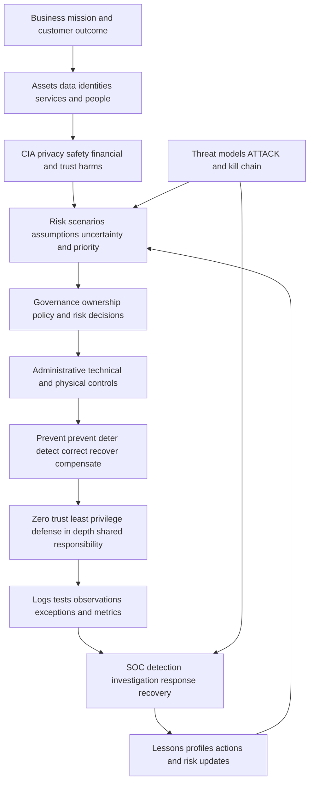
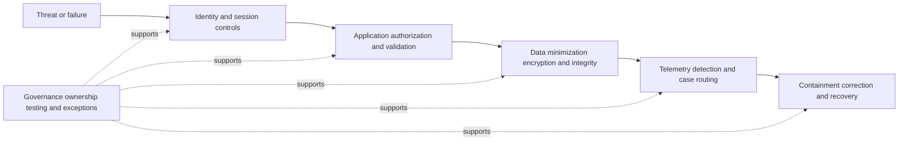
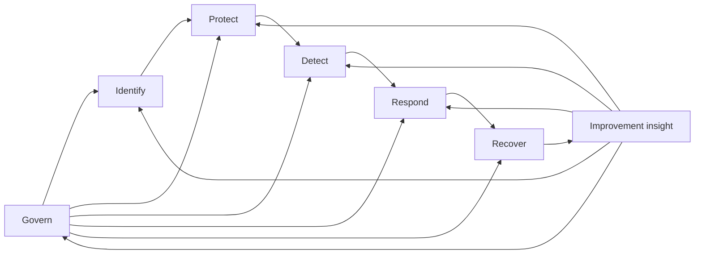
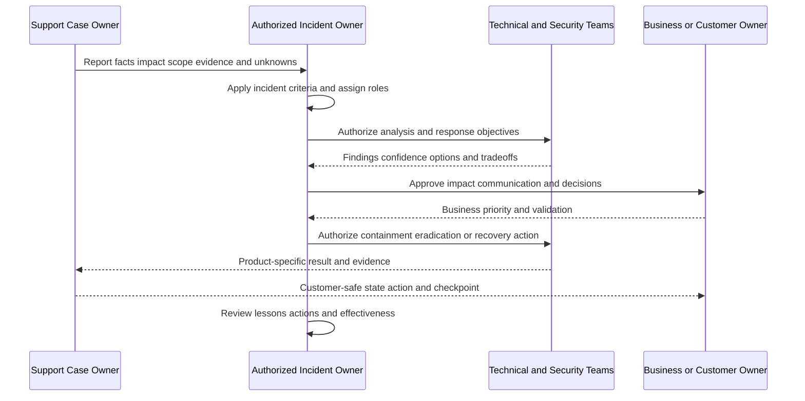
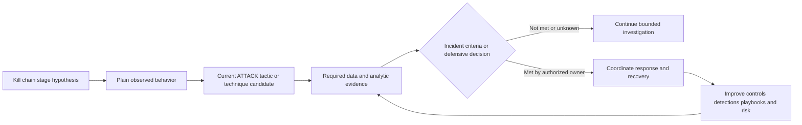
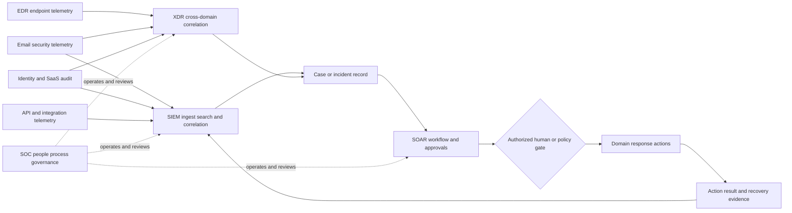
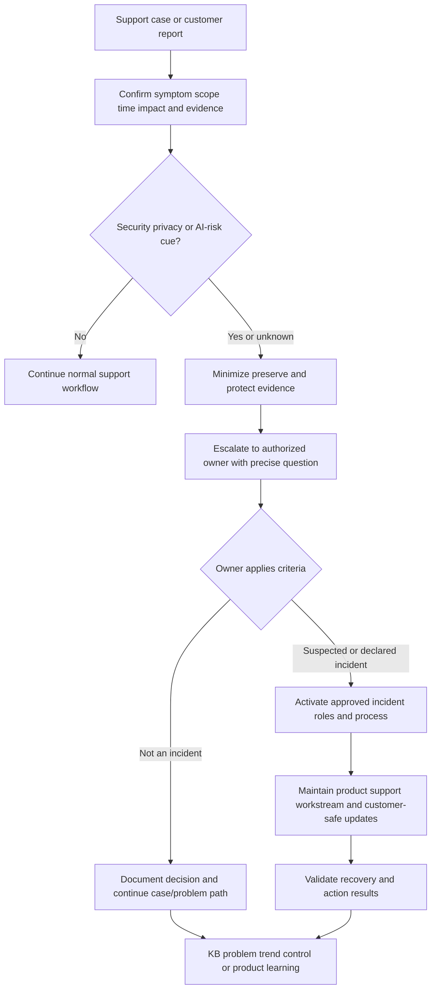

# Appendix H - Security Framework Maps

> **Artifact label:** Standards-grounded learning map with synthetic examples; not an assessment, audit, certification, or production architecture.
>
> **Source date:** Official anchors were accessed on **August 24, 2026**. Revalidate current versions, profiles, mappings, and organizational requirements before use.

## Purpose and How to Use This Appendix

This appendix connects security ideas that answer different questions:

- **CIA:** what security properties matter?
- **Risk:** what uncertain outcomes matter and how should they be prioritized?
- **Controls:** what safeguards and evidence address that risk?
- **Zero trust and defense in depth:** how should access and layered protection be designed?
- **NIST CSF 2.0:** how can outcomes be organized across governance and operations?
- **Incident response:** how should readiness, detection, response, recovery, and improvement connect?
- **MITRE ATT&CK and the cyber kill chain:** how can adversary behavior be described?
- **SOC technologies:** where can evidence, detection, orchestration, and response live?
- **Privacy and responsible AI:** what additional harms and governance duties must be considered?

Use a framework only when it clarifies a decision. Start with the business capability, asset, actor, data flow, observed evidence, and authorized owner; then choose the smallest useful framework view. Always write the plain-English observation before a framework label.

> **Central boundary:** Frameworks organize reasoning. A mapping does **not** prove that a control is designed well, implemented, operating effectively, compliant, certified, complete, or appropriate for the risk. Those conclusions require defined criteria, scope, accountable ownership, and evidence from examination, interview, and testing.

> 🔍 **Plain-English deep-dive:** Frameworks are maps, not security guards. A map can show where a gate should be and how roads connect. It cannot prove the gate exists, is locked, blocks the right people, logs entries, survives failure, or meets a legal requirement.

| Question | Best starting lens | Required reality check |
|---|---|---|
| What could be harmed? | CIA plus business/privacy/safety outcomes | Identify actual assets, users, obligations, and dependencies |
| What should we prioritize? | Risk scenario | State assumptions, uncertainty, likelihood/impact evidence, and risk owner |
| What safeguard is intended? | Control type/function | Verify design, implementation, operation, coverage, and exceptions |
| Who should access what? | Zero trust and least privilege | Inspect real identity, resource, action, context, decision, and telemetry |
| Who owns which layer? | Shared responsibility/RACI | Read current contract, architecture, and policy |
| How are security outcomes organized? | NIST CSF 2.0 | Build an organization-specific Profile; do not treat Functions as phases |
| What adversary behavior fits evidence? | MITRE ATT&CK | Map only supported behavior at current version/confidence |
| Where is evidence/action handled? | SOC/SIEM/SOAR/EDR/XDR map | Check actual data flow, permissions, health, retention, and ownership |
| Is this a security incident? | Authorized incident criteria/process | Product alert or support case alone does not declare an incident |

## Candidate Honesty and Safety Boundary

You can truthfully connect these concepts to substantiated enterprise-support experience, Azure/AD/Entra and identity fundamentals, Copilot/AI learning, evidence-led investigation, escalation, and safe labs. You must not claim that framework familiarity equals security operations, audit, compliance, threat hunting, incident command, or direct production use of Abnormal AI, email-security operations, Google Workspace, Slack, Okta, Splunk, CrowdStrike, Cortex SOAR, Zendesk, Salesforce, Jira, or Zoom.

Safe interview wording:

> “I use frameworks to structure questions and communicate clearly, not to manufacture evidence. My production foundation is enterprise support. Direct email-security operations, Abnormal AI, ATT&CK operational mapping, and the named adjacent platforms remain learning areas, so I would pair my transferable method with current documentation and the authorized security owner.”

Safety boundaries:

- Do not declare breach, compromise, attribution, compliance, control effectiveness, or risk acceptance from a framework mapping.
- Do not recommend containment, credential revocation, message removal, endpoint isolation, account disablement, or other production action without the authorized owner and process.
- Do not expose sensitive evidence to improve a framework diagram; use minimum metadata and approved handling.
- Do not present public Abnormal AI information as private architecture, controls, detection logic, ATT&CK coverage, compliance scope, or incident workflow.
- Route legal, regulatory, privacy, responsible-AI, forensics, audit, certification, and customer-notification judgments to qualified owners.

## One Integrated Framework View



## CIA: The Three Foundational Security Properties

| Property | Plain meaning | Email/identity/SaaS/API example | Evidence question | Common tradeoff |
|---|---|---|---|---|
| **Confidentiality** | Information and capabilities reach only authorized subjects | A message body, token, tenant data, or admin action is not exposed | Who accessed what, under which identity/authorization, and was data minimized? | Debug visibility versus sensitive-data exposure |
| **Integrity** | Data, code, configuration, decisions, and evidence remain accurate, complete, and changed only as authorized | Webhook payload is authenticated and an admin policy change is attributable | Can source, version, signature/hash, actor, authorization, and change history be verified? | Fast change versus review/validation |
| **Availability** | Authorized users can use the capability when required | Mail flow, sign-in, API, detection, or remediation remains usable | Which capability/population is unavailable, for how long, with what continuity? | Restrictive containment versus business continuity |

CIA properties overlap. A “quick availability fix” that bypasses authentication can damage confidentiality and integrity. A strict integrity check that cannot degrade safely can affect availability. State the tradeoff and route it to the risk/decision owner.

### CIA Worked Example

| Observation | CIA concern | What it does not prove | Next safe question |
|---|---|---|---|
| Synthetic webhook is accepted twice | Integrity: duplicate business effect | Malicious replay or producer defect | Does receiver atomically deduplicate stable event IDs? |
| API token appears in a shared transcript | Confidentiality and access-control exposure | That it was used | Can the authorized owner revoke/rotate and review minimum use evidence? |
| Login failures affect 8/40 test identities | Availability; possibly integrity of policy/config | Service-wide outage or attack | What differs in role, policy, client, time, and control cohort? |

## Risk Equation and Its Limitations

A common teaching shorthand is:

$$
Risk \approx Likelihood \times Impact
$$

It is a prompt, not a universal law. “Likelihood” and “impact” may be ranges, scenarios, ordinal ratings, or distributions; multiplying labels such as “medium × high” is not objective mathematics.

| Limitation | Why it matters | Better practice |
|---|---|---|
| Ambiguous scenario | Different events get blended into one score | Write actor/event, asset, vulnerability/exposure, consequence, and time horizon |
| Weak likelihood data | Rare/adaptive events resist frequency estimates | State evidence, assumptions, range, confidence, and leading indicators |
| Multi-dimensional impact | Security, safety, privacy, financial, legal, and trust effects differ | Keep dimensions visible before aggregation |
| Ordinal arithmetic | 1–5 labels do not guarantee equal intervals | Use ranges and documented criteria; avoid false precision |
| Dependence/correlation | Controls and failures share dependencies | Model common-cause and cascading scenarios |
| Tail risk | Low-frequency catastrophic outcomes can be hidden by averages | Include plausible worst case and resilience/contingency decisions |
| Dynamic/adversarial behavior | Attackers and environments adapt | Reassess after changes, incidents, intelligence, and control drift |
| Control uncertainty | “Configured” does not equal operating | Include design/implementation/operating evidence and exceptions |
| Risk appetite | Score alone cannot accept risk | Authorized owner decides under governance and obligations |

### Risk Scenario Template

```text
Because {THREAT_OR_EVENT} may exploit/use {VULNERABILITY_EXPOSURE_OR_CONDITION}
against {ASSET_AND_SCOPE}, {CONSEQUENCE} could affect {OBJECTIVE_AND_STAKEHOLDERS}
within {TIME_HORIZON}. Current controls are {CONTROLS}; operating evidence is {EVIDENCE}.
Likelihood basis: {DATA_ASSUMPTIONS_RANGE_CONFIDENCE}.
Impact dimensions: {CONFIDENTIALITY_INTEGRITY_AVAILABILITY_PRIVACY_SAFETY_FINANCIAL_TRUST}.
Residual uncertainty: {GAPS}. Risk owner/decision: {ROLE_AND_DATE}.
```

## Control Classifications

Do not confuse **implementation type** with **security function**. One control can have several functions, and several control types can support one objective.

### By Implementation Type

| Type | Plain meaning | Examples | Evidence of operation |
|---|---|---|---|
| Administrative | Governance, people, policy, procedure, training, approval | Access policy, incident plan, supplier review, separation of duties | Approved current artifact, owner, sampled decisions, exercises, exceptions |
| Technical | Hardware/software-enforced mechanism | MFA, RBAC, encryption, signature validation, logging, rate limit | Configuration plus allowed/denied tests, telemetry, coverage, failure behavior |
| Physical | Facility/device/media protection | Badge control, locked rack, secure disposal, environmental protection | Access records, inspection/test, maintenance, exception handling |

### By Function

| Function | Goal | Example | Verification cue |
|---|---|---|---|
| Preventive | Reduce chance of unwanted event | Least-privilege API scope | Required call works; unrelated call is denied |
| Detective | Discover event/control failure | Alert on abnormal admin grant | Seeded/approved test reaches correct owner within threshold |
| Deterrent | Discourage unwanted behavior | Authorized-use notice and sanctions policy | Governance/legal review plus awareness; not a technical barrier |
| Corrective | Fix detected condition | Remove invalid policy and restore approved state | State and workflow validate after controlled change |
| Recovery | Restore trusted capability | Tested backup/restore or failover | Recovery objective, integrity, dependency, and exercise evidence |
| Compensating | Alternate safeguard when primary is impractical | Manual approval plus monitoring during temporary exception | Equivalent objective, expiry, owner, and operating test |

### Control Evidence Ladder

| Level | Evidence | What it can support | What it cannot support alone |
|---|---|---|---|
| 0 | Marketing statement or feature name | Candidate capability | Design, implementation, operation, compliance |
| 1 | Policy/design document | Intended objective and responsibility | Actual configuration/behavior |
| 2 | Configuration/screenshot/export | Implemented state at a time | Effective enforcement across scope |
| 3 | Allowed/denied/negative test | Behavior for tested conditions | Continuous operation or untested populations |
| 4 | Telemetry, exceptions, coverage, trends | Operating evidence over defined scope/window | Future effectiveness or legal compliance by itself |
| 5 | Independent assessment against criteria | Scoped assessment conclusion | Unscoped systems/time or automatic certification transfer |

## Zero Trust, Least Privilege, and Defense in Depth

### Zero Trust Principles

NIST SP 800-207 describes zero trust architecture through resource-focused tenets and policy decision/enforcement concepts. The memorable Microsoft wording **verify explicitly, use least privilege, assume breach** is a useful operational summary, not the complete NIST standard.

| Principle | Plain meaning | Support evidence | Trap |
|---|---|---|---|
| Verify explicitly | Evaluate current subject, resource, action, context, policy, and posture | Identity, token metadata, device/workload state, policy decision ID | Treating one MFA event as permanent trust |
| Least privilege | Allow only needed action/resource/data/duration/delegation | Effective role/scope, denied negative test, expiry, owner | Giving broad admin “for troubleshooting” |
| Assume breach | Limit blast radius and make misuse detectable/recoverable | Segmentation, session controls, telemetry, revocation, recovery tests | Assuming breach means assuming every user is malicious |
| Per-session/dynamic decision | Reassess access under current conditions | Policy version, session/risk context, enforcement event | Trusting network location or prior allow forever |
| Protect resources, not just segments | Center policy on actual applications/data/services | Resource inventory, labels, action matrix | Calling a perimeter product “zero trust” by itself |

### Least-Privilege Sentence

```text
{SUBJECT} may perform {ACTION} on {RESOURCE_AND_DATA_SCOPE} from {APPROVED_CONTEXT}
for {PURPOSE_AND_DURATION}, using {AUTHENTICATION_AND_AUTHORIZATION}, with {LOGGING},
{APPROVAL_OR_REVIEW}, {REVOCATION}, and {EXCEPTION_OWNER}.
```

### Defense in Depth

Defense in depth layers safeguards so one control's failure does not determine the outcome. Layers should be meaningfully independent where practical; five controls that rely on one identity provider, one log pipeline, or one administrator may share a common failure.



| Layer | Prevent | Detect | Respond/recover | Independence question |
|---|---|---|---|---|
| Identity/session | Strong auth, conditional policy, scoped tokens | Risk/sign-in/token-use events | Revoke session/key, restore trusted identity | Does it fail with the same directory/control plane? |
| Application/API | Authorization, schema/input validation, idempotency | Request IDs, denied operations, anomaly signals | Disable route/integration safely, reconcile state | Can it reject misuse if network control fails? |
| Data | Minimization, access rules, encryption, integrity | Access/change/audit evidence | Restore/revoke/reclassify | Are keys and data governed separately? |
| Endpoint/workload | Hardening, execution controls | EDR/workload telemetry | Isolate/rebuild under authority | Does response preserve business continuity/evidence? |
| Network | Segmentation, egress policy, TLS | Flow/DNS/proxy/TLS signals | Block/reroute under change process | Can identity/application controls still stand alone? |
| Operations | Reviews, exercises, runbooks, backups | SIEM/cases/health monitoring | Incident coordination and recovery | Are monitoring and production failure domains shared? |

## Shared Responsibility

Shared responsibility means provider, customer, user, integrator, and third parties each own parts of design, configuration, identity, data, monitoring, response, and recovery. “Shared” must not become “unclear.” Exact responsibility comes from contract, service model, architecture, configuration, and law/policy.

| Responsibility area | Provider candidate | Customer candidate | Shared/integration questions | Evidence |
|---|---|---|---|---|
| Service infrastructure | Operate service platform per commitment | Choose/consume service and continuity plan | Availability target, region, dependency, escalation | Status/contract/architecture/test |
| Identity federation | Validate supported tokens/assertions | Configure IdP, assignments, lifecycle, MFA/policy | Metadata, clocks, claims, emergency access | Sign-in/audit/config/version |
| API integration | Publish/authenticate/enforce contract | Protect credential, choose scopes, resilient client | Limits, retries, versioning, monitoring, revocation | OpenAPI/docs, grants, request IDs, tests |
| Data | Service processing/protection per terms | Classification, lawful use, access, retention choices | Export/deletion/subprocessor/residency boundaries | Data flow, settings, contract, audit |
| Detection/response | Product telemetry/verdict/action capabilities as documented | Correlate broader environment and authorize response | Alert routing, severity, ownership, containment | Alert/case/action IDs and operating tests |
| Endpoint/mailbox/SaaS | Integrate within documented permissions | Secure tenant, endpoints, identities, configurations | Who can change/remove/quarantine/revoke? | Permission and action audit |

### Shared-Responsibility RACI Prompt

| Activity | Responsible | Accountable | Consulted | Informed | Unresolved boundary |
|---|---|---|---|---|---|
| `{ACTIVITY}` | `{ROLE}` | `{ONE_ROLE}` | `{ROLES}` | `{ROLES}` | `{QUESTION_CONTRACT_OR_POLICY_OWNER}` |

## NIST Cybersecurity Framework 2.0

NIST CSF 2.0 organizes cybersecurity outcomes into six concurrent **Functions**. They are not a mandatory sequence, maturity score, audit checklist, or certification.

| Function | Plain-English question | Example outcomes in support/security context | Evidence cue |
|---|---|---|---|
| **Govern** | Who sets direction, owns decisions, and manages cyber risk? | Roles, policy, risk strategy, oversight, supply chain | Approved owners, decisions, exceptions, reviews |
| **Identify** | What assets, data, dependencies, and risks exist? | Inventory, data flows, risk scenarios, improvement inputs | Current scope, ownership, dependency and risk records |
| **Protect** | What safeguards reduce likelihood/impact? | Identity/access, awareness, data security, platform resilience | Config plus allowed/denied and recovery tests |
| **Detect** | How are relevant events and control failures discovered? | Continuous monitoring, analysis, pipeline health | Coverage, last event, test alert, routing time |
| **Respond** | How are detected events analyzed, coordinated, contained, and communicated? | Case/incident decisions, communication, mitigation | Timeline, authority, action/result, evidence handling |
| **Recover** | How are capabilities restored and improvements communicated? | Recovery execution, validation, communication | Trusted-state criteria, tests, monitoring, lessons/actions |



### CSF Profile Prompt

| Outcome | Current state/evidence | Target state | Gap/risk | Owner/action/due | Verification |
|---|---|---|---|---|---|
| `{CSF_OUTCOME_OR_LOCAL_OUTCOME}` | `{EVIDENCE_AND_LIMIT}` | `{TARGET}` | `{RISK}` | `{ROLE_ACTION_DATE}` | `{TEST_METRIC_THRESHOLD}` |

A CSF Profile expresses selected organizational outcomes. A row in a study table is not an official Profile, maturity rating, or conformity result.

## NIST Incident Response Concepts

NIST SP 800-61 Revision 3 integrates incident response across CSF 2.0 risk management. A useful operational teaching sequence is preparation; detection and analysis; containment; eradication; recovery; and lessons/improvement, but do not misquote that as Rev. 3's verbatim phase structure.

| Concept | Plain meaning | Support role boundary |
|---|---|---|
| Event | Observable occurrence | Record facts and provenance; not automatically malicious |
| Alert/detection | Product/analytic object requesting attention | Validate semantics, evidence, scope, and pipeline health |
| Incident | Authorized classification of adverse occurrence requiring coordinated response | L1 supplies evidence; designated owner declares/processes it |
| Preparation | Roles, plans, access, telemetry, exercises, dependencies | Know escalation/evidence boundaries; do not invent authority during crisis |
| Analysis | Determine what happened, scope, confidence, impact | Keep facts/hypotheses separate and minimize evidence |
| Containment | Limit active harm | Explain product mechanics; authorized owner decides and validates tradeoff |
| Eradication | Remove causal/persistent condition | Requires scoped evidence, not one visible symptom |
| Recovery | Restore trusted capability and monitor | Validate security plus business workflow and residual risk |
| Improvement | Update controls, plans, knowledge, and risk understanding | Track owner, due date, verification, and reuse |



## CISA Guidance Families

CISA publishes multiple guidance families for different audiences and decisions. This is a navigation map, not an exhaustive catalog or mandate for every organization.

| CISA family | Primary use | Support/security connection | Do not infer |
|---|---|---|---|
| Cybersecurity Performance Goals (CPGs) | Prioritized cross-sector baseline practices | Ask about foundational controls and measurable outcomes | Compliance, complete risk treatment, or applicability without context |
| Zero Trust Maturity Model | Pillars and cross-cutting capabilities over maturity stages | Identity, device, network, application/workload, data, visibility, automation, governance | Certification or product score |
| Secure by Design | Shift security burden toward technology manufacturers through design/business practice | Product feedback, safe defaults, logging, identity, patchability, customer burden | That one feature or pledge proves secure operation |
| Known Exploited Vulnerabilities (KEV) Catalog | Prioritize vulnerabilities known to be exploited under stated CISA context | Check relevant owned assets/products and authorized remediation process | That catalog absence means no exploitation/risk |
| Incident and Vulnerability Response Playbooks | Prepared federal response/vulnerability workflows | Role clarity, evidence, coordination, actions, lessons | That federal playbooks govern private vendor/customer cases |
| StopRansomware and advisories | Defensive and response information for ransomware/threat activity | Route current official guidance to security owners | Attribution or applicability from one indicator |
| Cyber Essentials / small-organization guidance | Foundational risk-reduction practices | Plain-language baseline conversations | Formal assessment or one-size architecture |

## MITRE ATT&CK Map

MITRE ATT&CK is a public, versioned knowledge base of adversary behavior. It is not a product, a chronological attack lifecycle, a checklist, an alert verdict, an attribution engine, a coverage percentage, or proof of compliance.

| ATT&CK object | Plain meaning | Example phrasing | Evidence requirement |
|---|---|---|---|
| Tactic | Adversary objective or “why” | Credential Access | Behavior/context must support the objective; tactics can overlap and need not be sequential |
| Technique | General method or “how” | A method for obtaining credentials | Current official definition, platform/context, observed behavior |
| Sub-technique | Supported precision within a technique | A more specific method | Use only when evidence supports the specificity |
| Procedure | Concrete implementation by an actor/software/campaign | Exact sequence/tool/context from a cited report or case | Source, time, scope, confidence; do not generalize automatically |
| Mitigation | Defensive concept associated with behavior | Restrict/monitor a capability | Verify applicability, implementation, and operating evidence |
| Data source/component or detection strategy | Observable data useful to identify behavior | Sign-in, process, email, API, audit evidence | Coverage, collection health, fields, retention, analytic and routing |
| Group/software/campaign | ATT&CK knowledge objects with references/relationships | Named activity cluster/tool/campaign | One shared behavior/IOC does not prove attribution |

### Defensible ATT&CK Mapping Template

```text
Plain behavior: {SUBJECT} performed {ACTION} on {OBJECT} using {MECHANISM} at {UTC},
supported by {EVIDENCE_IDS_AND_PROVENANCE}.

Candidate ATT&CK mapping: {TACTIC_TECHNIQUE_SUBTECHNIQUE_NAME_AND_CURRENT_ID}
Version/access date: {VERSION_DATE}
Why it fits: {DEFINITION_PLATFORM_CONTEXT_MATCH}
Why it may not fit: {ALTERNATIVE_BENIGN_OR_OTHER_TECHNIQUE}
Confidence: {LOW_MEDIUM_HIGH}; missing evidence: {GAPS}
Mitigation/detection ideas: {CANDIDATES_REQUIRING_OWNER_VALIDATION}
Decision improved by mapping: {TRIAGE_HUNT_CONTROL_TEST_COMMUNICATION_OR_NONE}
```

| Mapping quality cue | Strong | Weak |
|---|---|---|
| Behavior first | Plain observed action with source/time | Start with a technique and search for facts |
| Current source | Live official entry and version/access date | Memorized ID/name only |
| Specificity | Least-specific supported mapping | Unsupported sub-technique precision |
| Alternatives | Benign/other explanations recorded | One behavior equals malicious intent |
| Outcome | Mapping improves a named defensive decision | Cell coloring for appearance |

## Kill Chain Compared With ATT&CK and Incident Response

The **Cyber Kill Chain** is a Lockheed Martin model that describes a staged intrusion progression. ATT&CK is a richer behavior knowledge base whose tactics are not guaranteed phases. Incident response is the defender's governed capability for readiness, analysis, response, recovery, and improvement.

| Dimension | Cyber Kill Chain | MITRE ATT&CK | Incident response |
|---|---|---|---|
| Primary viewpoint | Adversary campaign progression | Adversary objectives and behaviors | Defender organization and decisions |
| Structure | Staged/linear teaching model | Matrix/knowledge graph; behavior can repeat/overlap | Governed lifecycle/outcomes with loops |
| Strength | Simple narrative and opportunities to disrupt | Detailed shared vocabulary and referenced behavior | Roles, authority, evidence, communication, containment, recovery |
| Limitation | Can overfit linear external intrusion and underrepresent cloud/identity/insider paths | Mapping can become checkbox/coverage theater | Process labels do not guarantee capability/effectiveness |
| Use together | Place broad campaign progression | Describe supported behaviors/evidence | Decide authorized defensive actions and learning |



Do not force every case into all kill-chain stages, treat ATT&CK tactics as a timeline, or let either model authorize containment.

## SOC, SIEM, SOAR, EDR, and XDR Relationships

| Term | Plain meaning | Core job | Does not automatically mean |
|---|---|---|---|
| SOC | Security Operations Center/capability: people, process, data, technology, governance | Monitor, triage, investigate, coordinate response, learn | One room or team watching screens |
| SIEM | Security Information and Event Management | Collect/normalize/store/search/correlate events and support detections/cases | Complete telemetry, correct parsing, or automatic response |
| SOAR | Security Orchestration, Automation, and Response | Coordinate workflows, enrichment, approvals, cases, and actions | Fully autonomous or inherently safe automation |
| EDR | Endpoint Detection and Response | Endpoint telemetry, detection, investigation, and authorized endpoint response | Network/email/identity coverage by default |
| XDR | Extended Detection and Response | Correlate evidence/detections across several security domains and coordinate response | Replacement for every SIEM, SOAR, specialist tool, or process |
| Email security | Controls/evidence for message, sender, recipient, content/context, verdict, and response | Prevent/detect/investigate/respond to supported email risks | Customer incident command or full identity/endpoint evidence |
| Case management | Work container for evidence, hypotheses, decisions, owners, communication | Preserve accountable investigation state | Proof that an alert is an incident |



### Pipeline Health Before “No Evidence”

| Layer | Health question | Failure symptom |
|---|---|---|
| Source | Was the event generated and retained? | No source record |
| Collection | Is connector/auth/permission active? | Gaps after token/permission change |
| Transport | Are queue/API/webhook deliveries healthy? | Lag, retries, drops, duplicates |
| Parsing/normalization | Did schema/version map correctly? | Fields missing or misclassified |
| Storage/retention | Is event within accessible window/tier? | Search misses old/recent data |
| Detection | Did logic scope, threshold, suppression, and schedule apply? | Event exists but no alert |
| Routing/case | Did alert reach correct queue/owner? | Alert exists but no action |
| Response | Did approved action execute and validate? | Playbook/call succeeds partially or fails |

## Email Security, Identity, SaaS, and API Crosswalk

| Domain | Assets/risks | Prevent/protect | Detect/evidence | Respond/recover | Framework cues and limits |
|---|---|---|---|---|---|
| Email security | Identities, relationships, messages, links/files, money/data; phishing/BEC/spoofing/malware | Authentication, policy, behavioral/contextual controls, user/process verification | Headers, message IDs, authentication results, verdict/action, user report, mail/audit trace | Quarantine/removal, account/payment verification, recovery under authority | CIA, CSF, ATT&CK can organize; no product verdict proves incident/actor |
| Identity | Accounts, sessions, tokens, grants, roles; takeover/consent/privilege abuse | MFA/strong auth, conditional access, least privilege, lifecycle, token protection | Sign-in, risk, audit, app consent, token/session/revocation evidence | Revoke/reset/review grants and persistence under identity owner | Zero trust and ATT&CK help ask; exact control/evidence is platform-specific |
| SaaS | Tenant data, config, apps, roles; overprivilege, drift, risky sharing/integration | RBAC, secure defaults, config baselines, app governance, data controls | Admin/audit/access/config-change/integration logs | Correct config/access, reconcile data, monitor | Shared responsibility must be contract/architecture-specific |
| API/integration | Credentials, scopes, data flows, webhook events; leakage, replay, abuse, availability | TLS, scoped auth, schema validation, limits, idempotency, signature/replay controls | Request/event IDs, auth metadata, rate/error, audit, pipeline health | Rotate/revoke, replay/reconcile safely, restore version/contract | HTTP evidence is not business cause; framework mapping is not contract proof |

### Worked Synthetic Cross-Framework Scenario

**Scenario:** A learner-owned SaaS lab receives two webhook deliveries with event ID `evt_example_001`; the receiver creates two synthetic ledger entries. No real tenant, vendor, secret, or customer data is involved.

| Lens | Structured statement | Decision it supports | Limit |
|---|---|---|---|
| CIA | Integrity concern: one event produced two effects; availability/confidentiality impact not observed in lab | Prioritize duplicate prevention and reconciliation | Does not prove malicious replay |
| Risk | Repeated delivery plus non-atomic dedup could duplicate consequential action | Assess impact/likelihood by real contract and business action | Lab frequency is not production likelihood |
| Control | Preventive/idempotent write; detective duplicate alert; corrective reconciliation; recovery restore | Design/test layered controls | Feature existence is not operating evidence |
| Zero trust | Authenticate source, authorize event type/resource, verify every delivery, limit effect | Define request decision and telemetry | Signature alone is not authorization/replay defense |
| CSF 2.0 | Govern owner/contract; Identify flow/risk; Protect dedup; Detect duplicate; Respond reconcile; Recover validate | Organize outcomes/actions | Not a maturity or compliance score |
| ATT&CK | No mapping unless evidence supports adversary behavior; repeated delivery can be normal | Avoid false malicious classification | Technique mapping would add no decision value now |
| Incident response | Support reports evidence; authorized owner applies incident criteria | Preserve role/authority boundary | Support case does not declare incident |
| Privacy | Use synthetic IDs/hashes; minimize payload | Keep evidence safe | Minimized evidence can still be sensitive in real use |

## Privacy and Responsible AI Map

Security, privacy, and responsible AI overlap but are not identical. A system can be secure from unauthorized access yet still collect excessive data, use it beyond expected purpose, produce unfair impacts, or make an unreviewed consequential decision.

| Lens | Core question | Example control/evidence | Boundary |
|---|---|---|---|
| Privacy governance | Why is data processed, under whose authority, and with what accountability? | Purpose, owner, policy, data flow, consent/other basis as applicable | Support does not make legal determinations |
| Data minimization | Is each field/content item necessary for the decision? | Field allowlist, redaction, sampling, deletion proof | “Useful later” is not a defined purpose |
| Predictability/transparency | Do people/owners understand processing and outcomes? | Notice, documentation, explanation, escalation path | Explanation does not disclose private security internals or prove correctness |
| Access/retention | Who can access, for how long, and how is deletion controlled? | RBAC, audit, retention/hold/deletion evidence | Configuration alone is not operating proof |
| AI Govern | Who owns policy, risk, oversight, third parties, and incidents? | Roles, inventory, review, risk acceptance, monitoring | NIST AI RMF is voluntary framework guidance, not certification |
| AI Map | What context, users, data, limits, harms, and dependencies exist? | Use-case/system/data map and affected stakeholders | Model name alone does not define risk |
| AI Measure | How are validity, reliability, security, privacy, bias, explainability, and robustness evaluated? | Test design, datasets, slices, thresholds, human review, limits | One benchmark does not prove production performance |
| AI Manage | How are risks prioritized, treated, monitored, and changed? | Controls, approvals, incident process, rollback, monitoring | “Human in loop” is insufficient without authority/time/evidence |

### Responsible-AI Support Cue

```text
Observed outcome: {FACT_AND_SCOPE}
Expected source: {DOCUMENTED_BEHAVIOR_OR_POLICY}
Affected user/workflow: {MINIMUM_CONTEXT}
Potential harm dimensions: {SECURITY_PRIVACY_FAIRNESS_RELIABILITY_SAFETY_ACCESSIBILITY}
Evidence/limits: {TESTS_DATA_PROVENANCE_GAPS}
Immediate safe boundary: {NO_AUTOMATED_HIGH_IMPACT_ACTION_OR_OTHER_CONTROL}
Owner/escalation: {AI_PRODUCT_PRIVACY_SECURITY_LEGAL_ROLE}
Next validation: {TEST_REVIEW_AND_CHECKPOINT}
```

## Support Case to Security Process Mapping

| Support observation | Support owns | Security/process owner decides | Escalation cue |
|---|---|---|---|
| Customer reports suspicious message | Preserve minimum message/authentication/timeline evidence and product behavior | Threat verdict, incident declaration, broader containment | Credible active impact, multiple users, account/payment/data concern |
| False positive/negative report | Confirm expected/actual, examples, configuration, labels, scope, impact | Detection/tuning risk acceptance and model/product change | Repeatable pattern, high impact, unsafe workaround, private telemetry needed |
| API `401`/`403` | Diagnose non-secret auth metadata, scope/role/tenant contract | Credential rotation, policy change, incident review | Unexpected grant/use, exposed credential, widespread failure |
| Token/secret pasted in case | Stop propagation, restrict/route evidence, notify authorized owner | Revocation/rotation, use review, incident/privacy process | Any live credential or uncertain exposure |
| Webhook duplicate | Correlate event/delivery/request IDs and receiver behavior | Incident classification and production remediation | Consequential duplicate action, replay evidence, expanding scope |
| Account sign-in anomaly | Preserve time/ID/source and product observation | Compromise determination, session/account containment | Active suspicious access or high-impact account |
| Missing SIEM event | Test source-to-ingest pipeline and evidence ceiling | Security monitoring risk/incident implications | Retention loss, broad visibility gap, active incident dependency |
| Service outage | Scope capability/impact/continuity and escalate | Cyber incident versus reliability incident classification | Security indicators, material impact, unknown cause, legal/contract threshold |
| AI output concern | Record prompt/input category, output, context, model/version if authorized, impact, expected behavior | Responsible-AI/privacy/legal/product determination | Harmful/high-impact output, systemic pattern, sensitive data, unsafe autonomy |



## Interview-Safe Language

| Risky claim | Why risky | Interview-safe alternative |
|---|---|---|
| “We are NIST compliant.” | NIST frameworks are not one blanket compliance certificate | “I can organize outcomes against CSF 2.0; compliance requires defined criteria, scope, evidence, and authorized assessment.” |
| “This control is effective because it is enabled.” | Configuration is not operating evidence | “I would verify allowed/denied behavior, coverage, telemetry, exceptions, failure mode, and time window.” |
| “Zero trust means trust nobody.” | Misstates technical access strategy and human trust | “Remove broad implicit technical trust and evaluate each resource request explicitly under least privilege.” |
| “Defense in depth means more tools.” | Layers can duplicate/share failure | “Use complementary controls with clear objectives, evidence, owners, and understood common dependencies.” |
| “ATT&CK proves the attacker.” | Behavior mapping is not attribution | “ATT&CK provides shared behavior vocabulary; attribution needs broader, reviewed evidence.” |
| “We cover 90% of ATT&CK.” | Cell counts ignore assets/data/quality/response | “I would describe threat-prioritized behaviors, data coverage, analytic tests, gaps, and response ownership.” |
| “The kill chain is the incident process.” | Adversary model differs from defender governance | “Kill chain narrates campaign stages; incident response governs defender decisions and recovery.” |
| “XDR replaces SIEM and SOAR.” | Product scopes/needs vary | “XDR correlates supported domains; SIEM, SOAR, case, and specialist needs depend on architecture and outcomes.” |
| “A product alert is a security incident.” | Alert is an input, incident is authorized classification | “I would validate evidence/impact and route criteria to the designated incident owner.” |
| “Shared responsibility means the customer owns configuration.” | Oversimplifies contract/integration duties | “I would map each activity, decision, data flow, and control to a named owner using current contract and architecture.” |
| “AI is unbiased because the data is anonymized.” | Privacy technique does not prove fairness/validity | “I would evaluate purpose, provenance, representation, slices, performance, harms, privacy, and governance.” |
| “I used Abnormal/Splunk/CrowdStrike in production.” | Outside verified background | “I have learned the architecture through official material/synthetic labs; my production transfer is enterprise support and evidence-led escalation.” |

### Framework Answer Pattern

```text
1. Define the framework in one sentence.
2. State the decision it helps organize.
3. Apply it to one concrete, synthetic or verified-transfer example.
4. Name the evidence needed to verify reality.
5. State what the framework cannot prove and who owns the decision.
```

## Common Traps and Failure Modes

| Trap | Failure mode | Correction |
|---|---|---|
| Framework soup | Many names, no decision | Start with asset/outcome/evidence; choose one primary lens |
| Checklist compliance | Presence mistaken for conformity/effectiveness | Define criteria/scope and test operation |
| Heat-map precision | Ordinal scores treated as exact math | Show scenario, assumptions, ranges, confidence, dimensions |
| Control-name confidence | Feature label treated as safeguard | Trace objective, configuration, enforcement, telemetry, exception, recovery |
| Zero-trust product claim | One tool claims whole strategy | Map resource decisions, identity/context, enforcement, telemetry, governance |
| Least privilege breaks work | Permission removed without task analysis | Map required actions/resources and test both allow and deny paths |
| Layer count theater | Multiple controls share one failure | Identify common dependencies and failure modes |
| Shared means nobody | Boundary remains unowned | Assign RACI and resolve contract/policy gaps |
| CSF Functions as phases | Govern/Identify/Protect are seen as “before” Detect | Treat Functions as concurrent outcomes with feedback |
| Rev. 2/Rev. 3 mix | Historical phases misquoted as current structure | Name publication/version and label teaching sequence |
| ATT&CK overmapping | Benign/ambiguous activity forced into a technique | Write behavior first; map only if it improves a decision |
| Kill-chain linearity | Cloud/identity/insider/repeat behavior gets distorted | Use as optional narrative and preserve loops/alternate paths |
| SOC tool determinism | Alert absence treated as event absence | Verify pipeline health, scope, retention, parsing, suppression, routing |
| Security-only AI view | Privacy, fairness, reliability, accessibility ignored | Use responsible-AI context, measurement, governance, and harm lenses |

## Decision and Troubleshooting Cues

| If you observe | Ask | Framework cue | Evidence before conclusion |
|---|---|---|---|
| Sensitive content in logs | Is it necessary and authorized? | CIA confidentiality, privacy minimization | Purpose, fields, access, retention, deletion |
| Unauthorized-looking admin action | Who/what/when/resource/context? | Zero trust, least privilege, ATT&CK candidate | Identity, authorization, audit provenance, alternatives |
| Alert without source event | Is object synthetic/aggregated or pipeline broken? | Detect, SIEM pipeline | Source/ingest/parser/detection/case health |
| Feature enabled but attack succeeds | What was scope, path, policy, test, exception? | Control evidence ladder, defense in depth | Configuration plus operation/coverage/failure evidence |
| One failed dependency causes outage | Which layers share it and what continuity exists? | Availability, defense in depth, shared responsibility | Dependency map, failover/recovery tests, owners |
| Customer asks “Are we compliant?” | Which requirement, scope, period, assessor, evidence? | Governance/control assessment | Current authoritative criteria and approved assurance evidence |
| Suspicious behavior fits ATT&CK | Does plain evidence support adversary context/specificity? | ATT&CK | Current entry, version, behavior, alternatives, confidence |
| AI verdict appears wrong | What expected outcome, population, impact, data/model/version? | AI RMF Map/Measure/Manage | Authorized samples, metrics/slices, limits, human review |

## Cross-Links to the Main Guide

| Need | Main guide link |
|---|---|
| CIA, risk, and controls | [Part 003 - Security Fundamentals CIA Risk and Controls](Part-003-security-fundamentals-cia-risk-and-controls.md) |
| Zero trust and shared responsibility | [Part 004 - Zero Trust Least Privilege and Shared Responsibility](Part-004-zero-trust-least-privilege-and-shared-responsibility.md) |
| Privacy and evidence ethics | [Part 005 - Privacy Data Handling and Evidence Ethics](Part-005-privacy-data-handling-and-evidence-ethics.md) |
| SOC/SIEM/SOAR/XDR/EDR | [Part 006 - SOC SIEM SOAR XDR and EDR Basics](Part-006-soc-siem-soar-xdr-and-edr-basics.md) |
| MITRE ATT&CK and threat modeling | [Part 007 - MITRE ATTACK and Threat Modeling](Part-007-mitre-attack-and-threat-modeling.md) |
| Incident response lifecycle | [Part 008 - Incident Response Lifecycle](Part-008-incident-response-lifecycle.md) |
| Email security architecture | [Part 014 - Cloud Email Security Architecture and Detection Flow](Part-014-cloud-email-security-architecture-and-detection-flow.md) |
| OAuth/token abuse | [Part 041 - OAuth Consent Attacks and Token Abuse](Part-041-oauth-consent-attacks-and-token-abuse.md) |
| Responsible AI | [Part 057 - AI Privacy Bias and Responsible Use](Part-057-ai-privacy-bias-and-responsible-use.md) |
| Identity/SaaS/API integration evidence | [Part 065 - Audit Logs Webhooks and Integration Permissions](Part-065-audit-logs-webhooks-and-integration-permissions.md) |
| Resilient security integrations | [Part 091 - Resilient Security Integration Design](Part-091-resilient-security-integration-design.md) |
| Hypothesis and evidence discipline | [Part 097 - Hypothesis Testing and Evidence Correlation](Part-097-hypothesis-testing-and-evidence-correlation.md) |
| Support-to-security escalation | [Part 104 - Escalation Handoffs Swarming and Critical Incidents](Part-104-escalation-handoffs-swarming-and-critical-incidents.md) |
| Current trends and standards | [Part 118 - Advanced Topics Competitive Context Standards and Current Trends](Part-118-advanced-topics-competitive-context-standards-and-current-trends.md) |

## Official Source Anchors - August 24, 2026

All sources below were accessed on **August 24, 2026**. Frameworks and guidance change. These public sources organize concepts; they do not disclose private Abnormal AI behavior, prove implementation/control effectiveness/compliance, authorize security action, or establish your production experience.

| Official or primary source | Use in this appendix | Boundary |
|---|---|---|
| [NIST Cybersecurity Framework 2.0](https://www.nist.gov/cyberframework) | Govern, Identify, Protect, Detect, Respond, Recover outcomes and Profiles | Voluntary outcome framework; not a certification, audit result, or one-size implementation |
| [NIST SP 800-30 Rev. 1](https://csrc.nist.gov/pubs/sp/800/30/r1/final) | Threat, vulnerability, likelihood, impact, uncertainty, and risk assessment | This appendix is not a formal NIST risk assessment |
| [NIST SP 800-53 Rev. 5](https://csrc.nist.gov/pubs/sp/800/53/r5/upd1/final) | Security/privacy control families and safeguards | Control catalog requires tailoring; listing a control proves nothing about operation |
| [NIST SP 800-53A Rev. 5](https://csrc.nist.gov/pubs/sp/800/53/a/r5/final) | Examine, interview, and test assessment methods | Support troubleshooting is not an independent control assessment |
| [NIST SP 800-207 - Zero Trust Architecture](https://csrc.nist.gov/pubs/sp/800/207/final) | Resource-focused zero-trust tenets and logical components | Architecture guidance, not a product checklist or certification |
| [NIST SP 800-61 Rev. 3](https://csrc.nist.gov/pubs/sp/800/61/r3/final) | Incident response integrated with CSF 2.0 risk management | Does not declare an incident or grant L1 response authority |
| [NIST Privacy Framework](https://www.nist.gov/privacy-framework) | Privacy-risk outcomes and governance | Does not determine a specific legal requirement or compliance conclusion |
| [NIST AI Risk Management Framework](https://www.nist.gov/itl/ai-risk-management-framework) | Govern, Map, Measure, Manage trustworthy/responsible AI risk | Voluntary framework; not certification or proof an AI system is trustworthy |
| [CISA Cross-Sector Cybersecurity Performance Goals](https://www.cisa.gov/cybersecurity-performance-goals) | Prioritized baseline cybersecurity practices | Not a complete risk program, universal mandate, or compliance result |
| [CISA Zero Trust Maturity Model Version 2.0](https://www.cisa.gov/sites/default/files/2023-04/zero_trust_maturity_model_v2_508.pdf) | Zero-trust pillars, cross-cutting capabilities, and maturity framing | Not a product score or certification |
| [CISA Secure by Design](https://www.cisa.gov/securebydesign) | Security burden, design, default, and technology-manufacturer principles | Pledge/guidance does not prove a product is secure or compliant |
| [CISA Known Exploited Vulnerabilities Catalog](https://www.cisa.gov/known-exploited-vulnerabilities-catalog) | Current exploitation-based vulnerability prioritization input | Absence is not proof of safety; applicability and ownership require asset evidence |
| [CISA Incident and Vulnerability Response Playbooks](https://www.cisa.gov/news-events/news/cisa-releases-cybersecurity-incident-and-vulnerability-response-playbooks) | Prepared response, coordination, roles, and vulnerability handling | Federal playbooks do not govern a private support/customer process |
| [MITRE ATT&CK](https://attack.mitre.org/) | Current tactics, techniques, mitigations, data/evidence relationships, groups/software/campaigns | Versioned knowledge base; not attribution, compliance, coverage score, or incident declaration |
| [MITRE ATT&CK Enterprise Matrix](https://attack.mitre.org/matrices/enterprise/) | Enterprise tactic/technique navigation | Matrix cells require context, data, analytics, validation, and current version |
| [MITRE ATT&CK Data Sources](https://attack.mitre.org/datasources/) | Evidence/data-source relationships | Data availability does not prove collection, detection, or response effectiveness |
| [Lockheed Martin - Cyber Kill Chain](https://www.lockheedmartin.com/en-us/capabilities/cyber/cyber-kill-chain.html) | Public origin/context for staged intrusion model | One model; not universal chronology, ATT&CK equivalent, or incident process |
| [Microsoft Zero Trust overview](https://learn.microsoft.com/en-us/security/zero-trust/zero-trust-overview) | Verify explicitly, least privilege, assume breach memory model | Microsoft framing is not the complete NIST architecture or an Abnormal claim |
| [Microsoft shared responsibility in the cloud](https://learn.microsoft.com/en-us/azure/security/fundamentals/shared-responsibility) | Cloud service-model responsibility teaching | Exact duties depend on current service, architecture, contract, and policy |
| [Abnormal AI Trust Center](https://abnormal.ai/trust-center) | Official public trust/security source family to consult | Public material does not reveal unseen controls, assessment scope, architecture, or support workflow |

## Completion and Use Checklist

- [ ] I started with a concrete asset, outcome, data flow, observation, decision, and owner before selecting a framework.
- [ ] I labeled the framework/source/version/access date and used current official definitions.
- [ ] I stated plainly that a framework map does not prove control design, implementation, operating effectiveness, compliance, certification, or completeness.
- [ ] I considered confidentiality, integrity, availability, plus privacy, safety, financial, fairness, accessibility, and trust harms as relevant.
- [ ] My risk statement includes scenario, scope, assumptions, uncertainty, evidence, impact dimensions, and authorized risk owner.
- [ ] I separated control implementation type from function and required operating evidence, exceptions, coverage, and failure behavior.
- [ ] I treated zero trust as resource-focused strategy, least privilege as action/resource/data/time scope, and defense in depth as complementary layers with dependency analysis.
- [ ] Shared responsibilities are assigned to named roles/activities using current contract, architecture, and policy.
- [ ] I used all six CSF 2.0 Functions as concurrent outcome groups, not a linear phase list or maturity score.
- [ ] I named NIST SP 800-61 Rev. 3 accurately and labeled any operational phase sequence as a teaching model.
- [ ] I wrote plain behavior before ATT&CK, checked the current official entry, used supported specificity/confidence, and avoided attribution/coverage theater.
- [ ] I kept kill chain, ATT&CK, and incident response distinct and used each only when it improves a decision.
- [ ] I checked SOC data-pipeline health before interpreting an absent alert/event.
- [ ] I mapped email, identity, SaaS, and API evidence without inventing private product capabilities or authority.
- [ ] Privacy/responsible-AI concerns are routed to qualified owners with minimum evidence and explicit limits.
- [ ] I did not declare an incident, breach, compliance result, control effectiveness, risk acceptance, or authorized response outside my role.
- [ ] I labeled Abnormal/adjacent platforms as learned architecture and enterprise support as the verified production-transfer foundation.
- [ ] I revalidated official sources beyond August 24, 2026 when decision-critical.

## Likely Interview Questions

1. **Do frameworks prove security or compliance?**  
   **Model answer:** No. They organize outcomes, risks, controls, or behaviors. A conclusion needs criteria, scope, ownership, design/implementation evidence, operating tests, exceptions, time period, and often authorized independent assessment.

2. **How do NIST CSF and ATT&CK differ?**  
   **Model answer:** CSF 2.0 organizes organizational cybersecurity outcomes across Govern, Identify, Protect, Detect, Respond, and Recover. ATT&CK organizes referenced adversary behavior. I can use ATT&CK to inform threat/evidence priorities within a CSF outcome, but neither proves control coverage or compliance.

3. **Explain zero trust simply.**  
   **Model answer:** Protect resources by evaluating each access request using current identity, action, resource, context, policy, and telemetry rather than granting broad trust from location or one prior login. Apply least privilege and design for detection, containment, revocation, and recovery.

4. **How do SIEM, SOAR, EDR, and XDR fit together?**  
   **Model answer:** SIEM centers on multi-source event collection/search/correlation; SOAR coordinates workflows and approved actions; EDR centers on endpoints; XDR correlates supported domains. The SOC supplies people, process, governance, and decisions. Actual architecture, overlap, and ownership vary.

5. **What is an interview-safe way to discuss ATT&CK?**  
   **Model answer:** Describe the observed behavior first, check the current official definition/version, use the least-specific supported mapping, state confidence/alternatives/data gaps, and explain the defensive decision it improves. Never use it alone for attribution or a coverage percentage.

## 30-Second Memory Hooks

- **Frameworks are maps, not operating evidence.**
- **CIA:** secret, correct, available.
- **Risk:** scenario, uncertainty, impact, owner; the equation is only shorthand.
- **Control:** intent plus implementation plus operation plus evidence.
- **Zero trust:** explicit resource decision, least privilege, assume failure/breach.
- **CSF:** Govern, Identify, Protect, Detect, Respond, Recover.
- **ATT&CK:** behavior vocabulary, not timeline, verdict, attribution, or compliance.
- **SOC stack:** sources to evidence to case to authorized action to validation.
- **Support:** preserve facts and escalate; authorized owners declare and act.

**Suggested next appendix:** [Appendix I - Lab Safety Evidence and Redaction](Appendix-I-lab-safety-evidence-and-redaction.md).