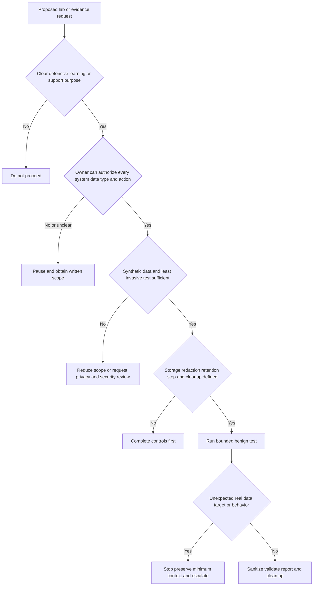
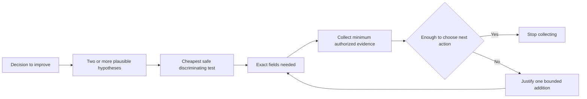
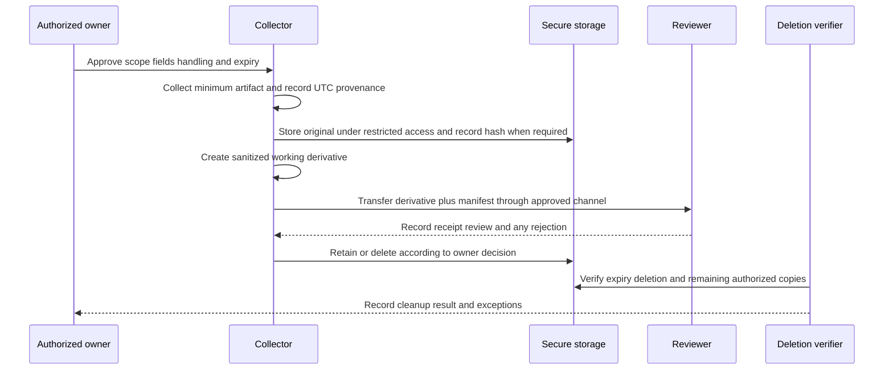
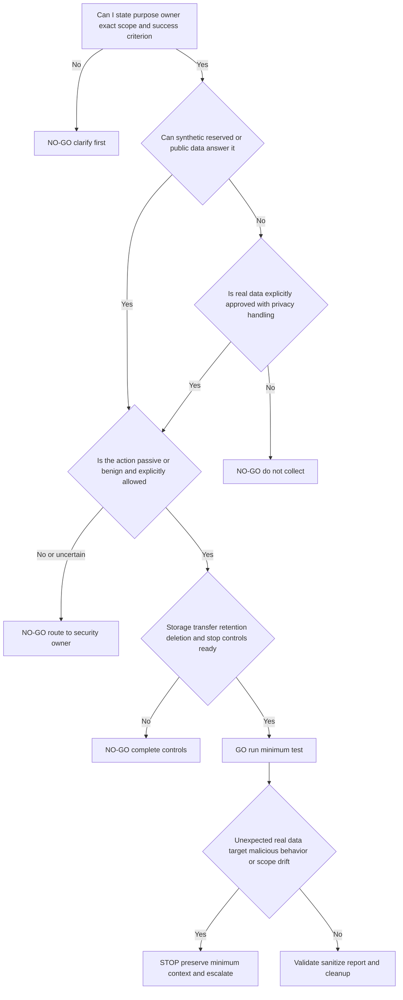

# Appendix I - Lab Safety Evidence and Redaction

> **Artifact label:** Defensive learning and evidence-handling reference using local, synthetic, reserved, or explicitly authorized data; not a penetration-testing guide, forensic certification, legal opinion, or record of production work.
>
> **Currency and official-source access date:** August 24, 2026. Product controls, privacy requirements, retention rules, approved tools, and documentation can change; revalidate them with the current owner and official source at use time.

## Purpose and Candidate Honesty Boundary

This appendix is a practical gate for deciding whether a lab or evidence task is authorized, necessary, harmless, reproducible, and safe to retain. It supports the safe-lab and evidence methods in [Part 009](Part-009-safe-support-lab-environment.md), [Part 046](Part-046-threat-investigation-evidence-preservation-and-timelines.md), [Part 098](Part-098-safe-evidence-collection-redaction-and-packaging.md), and [Part 117](Part-117-safe-lab-portfolio-and-end-to-end-capstones.md).

You may truthfully say that you completed a local or synthetic exercise only after you actually perform it and retains a sanitized artifact. You must not imply direct use of Abnormal AI, a customer tenant, a production security tool, live malicious material, confidential Microsoft data, or forensic authority. The guide itself is a **design**, not proof that a lab was run.

Safe interview wording:

> “My production foundation is enterprise support. For this security transition, I design labs around explicit scope, synthetic data, minimum collection, redaction, reproducibility, and cleanup. I label unperformed designs and local observations honestly; I do not present them as Abnormal or customer production experience.”

> 🔍 **Plain-English deep-dive:** Authorization is a permission envelope, like a ticket that states which train, date, and seat you may use. Permission to test one local service does not authorize another host, another account, another time window, or a more invasive action. The analogy stops because technical authorization may also depend on law, contract, policy, data ownership, and change control.

## Use and Completion Checklist

- [ ] Record a named owner, purpose, systems, accounts, data, actions, time window, and stop conditions.
- [ ] Confirm every target is local, synthetic, reserved for documentation, public by design, or explicitly authorized in writing.
- [ ] Choose the least sensitive data and least invasive test that can answer the question.
- [ ] Define collection fields, redaction rules, storage, transfer, retention, and deletion before collection.
- [ ] Defang suspicious links and names; never open, execute, detonate, forward, or upload unknown material.
- [ ] Keep observations, inferences, source claims, and unknowns separate.
- [ ] Hash final artifacts when integrity matters; do not claim a hash proves truth or custody.
- [ ] Verify cleanup from the system of record, not only from the local folder.
- [ ] Label the evidence tier and whether the exercise is designed, performed, reviewed, or not performed.
- [ ] Revalidate current product and policy details at use time.

## Authorization and Scope Charter

Use one charter per exercise. A vague “learning lab” is not enough.

| Charter field | Required entry | Safe example | Stop if missing |
|---|---|---|---|
| Purpose and question | One decision the lab must improve | Determine whether a synthetic API failure is DNS, TLS, or HTTP authorization | Yes |
| Authorizing owner | Person or role able to approve the assets and data | Candidate for an isolated local service; manager/system owner for workplace assets | Yes |
| Systems and boundaries | Exact host, service, account, interface, and excluded systems | `localhost` test server; no external targets | Yes |
| Allowed actions | Specific passive or benign actions | Read synthetic log, send documented request to owned local endpoint | Yes |
| Forbidden actions | Explicitly excluded behavior | No scanning, exploitation, credential testing, evasion, persistence, or malware execution | Yes |
| Data standard | Synthetic/reserved/public data only unless separately approved | `example.com`, fake tenant ID, generated message body | Yes |
| Time window | Start, end, and timezone | Candidate-chosen local practice window in UTC | For shared systems, yes |
| Collection plan | Exact artifact types and fields | Sanitized request metadata and response status | Yes |
| Storage/transfer | Approved location, access, encryption, recipient | Local encrypted profile; no external upload | Yes |
| Retention/deletion | Expiry and verification method | Delete raw capture after sanitized derivative is verified | Yes |
| Stop/escalate | Trigger, owner, and safe state | Stop on unexpected real identifier or third-party traffic | Yes |
| Success criterion | Observable end state | Hypothesis separated by a reproducible harmless test | Yes |



## Synthetic and Reserved Data Standard

**Synthetic data** is invented data that resembles a structure without describing a real person, customer, account, message, secret, or event. **Reserved data** uses names and address ranges set aside for examples, reducing accidental contact with real systems.

| Need | Preferred safe value | Avoid | Why |
|---|---|---|---|
| Domain | `example.com`, `example.net`, or `example.org` | A guessed customer or lookalike domain | Example domains are reserved for documentation |
| Email | `analyst@example.com` | A real mailbox or copied address | Preserves message shape without identifying a person |
| IPv4 | Documentation ranges such as `192.0.2.0/24`, `198.51.100.0/24`, `203.0.113.0/24` | Random public IPs | Random public addresses may belong to someone |
| IPv6 | Documentation prefix `2001:db8::/32` | Random globally routable addresses | Keeps diagrams non-operational |
| Hostname | `api-lab.example.com` without resolving it | Production-like internal names | Avoids revealing or contacting a real host |
| Tenant/user/message/request ID | Generated placeholder with `SYNTH-` prefix | Reused screenshot or ticket identifiers | Makes provenance and non-production status visible |
| Token/key | Literal placeholder such as `[REDACTED_TOKEN]` | Real, expired, partial, or reversible secret | Expired secrets can still reveal structure or scope |
| Message | Generated benign text with no active links or attachments | Forwarded suspicious or customer email | Avoids content, malware, privacy, and handling risk |
| File | Harmless text file with declared checksum | Unknown attachment or copied payload | A checksum verifies identity, not harmlessness |

> **Standard:** Never create a synthetic artifact by lightly editing a real one. Build it from a blank template so hidden metadata, identifiers, recipients, URLs, and content do not survive.

## Forbidden Activities and Immediate Stop Conditions

This appendix provides defensive handling only. It never authorizes offensive activity.

| Forbidden activity | Why it is outside scope | Safe alternative |
|---|---|---|
| Scanning, probing, exploiting, bypassing, or stress-testing systems not expressly owned and scoped | Can harm systems and violate law or policy | Use an isolated local service and documented benign checks |
| Credential guessing, token replay, MFA bypass, session capture, or privilege escalation | Risks account compromise and unauthorized access | Use generated placeholders and a mock authorization decision |
| Creating, downloading, executing, detonating, modifying, or distributing malware | Can cause infection, propagation, and legal/safety harm | Use inert text labels and publicly documented conceptual behavior |
| Visiting or resolving suspicious links from evidence | Can expose the user, system, network, or target | Defang and route to an approved security-analysis owner/tool |
| Sending test mail to real people or domains without consent | Creates spam, confusion, and reputational risk | Use a local parser or saved synthetic message |
| Collecting “everything” for convenience | Increases sensitive-data exposure and review burden | Start from a hypothesis-to-field collection plan |
| Uploading evidence to public scanners, consumer storage, paste sites, or unapproved AI tools | Transfers custody and may disclose protected data | Use approved organizational tooling or synthetic replacements |
| Altering original evidence or claiming an altered copy is original | Destroys provenance and may mislead | Preserve authorized original separately; work on a derivative |
| Claiming breach, attribution, root cause, compliance, or forensic conclusion from a lab | Exceeds the evidence and candidate role | State observation, limits, confidence, and authorized next owner |

Stop immediately if a task reveals a real secret, unknown personal/customer data, an out-of-scope host, unexpected third-party traffic, active malicious behavior, or a request to conceal activity. Preserve only enough context to report safely, do not continue “to learn more,” and contact the authorized security/privacy/manager owner.

## Data Classification and Minimum Necessary Collection

Classification answers **how sensitive is this?** Minimum necessary asks **what is the smallest amount needed for this decision?** The two work together.

| Class | Plain meaning | Examples | Default handling |
|---|---|---|---|
| Public | Approved for unrestricted release | Official public documentation, reserved sample data | Verify source and license; still avoid unsupported claims |
| Internal | Nonpublic operational information with limited harm if disclosed | Internal process notes or ordinary team-only guidance | Approved identity, location, recipients, and retention |
| Confidential | Customer, employee, business, security, or technical data that could cause material harm | Ticket content, tenant IDs, logs, messages, topology | Need-to-know access, approved encryption/transfer, minimization |
| Restricted/secret | Credentials, regulated data, highly sensitive security or incident evidence | Tokens, passwords, private keys, session cookies, malware, sensitive PII | Do not place in ordinary support artifacts; use specialized approved process |

The real classification labels and rules come from the data owner and organization. If two rules conflict, use the stricter handling until an authorized owner resolves it.

### Hypothesis-to-Field Rule

| Question | Minimum candidate evidence | Usually unnecessary initially |
|---|---|---|
| Is the request reaching the service? | UTC time, sanitized host, method, status, request/correlation ID | Full body, token, unrelated browser history |
| Is mail authentication aligned? | Relevant domain values and authentication-result fields from an authorized synthetic/redacted message | Full message body, recipients, attachments |
| Is DNS different between cohorts? | Queried name, record type, resolver context, UTC, sanitized answer/error | Full packet capture of unrelated traffic |
| Is an integration permission missing? | Operation, required documented scope, effective sanitized grant, error and ID | Credential, entire directory export |
| Is a false-positive report reproducible? | Message/object ID under approved process, expected/actual outcome, timing, policy context | Bulk mailbox export or unneeded message content |



## Redaction Matrix

**Redaction** removes or transforms sensitive data in a derivative copy. Redaction is not deletion from the source system, and masking visible text is not enough if metadata, layers, formulas, comments, or binary content retain the value.

| Data type | Examples | Replace with | Preserve for usefulness | Validation |
|---|---|---|---|---|
| Secrets | Password, API key, bearer token, cookie, private key, webhook secret | `[REDACTED_SECRET]` | Secret type and whether present, never value/length/prefix | Search source formats and rotate/revoke through owner if exposure occurred |
| Personal data/PII | Name, personal email, phone, address, employee ID | Stable pseudonym such as `USER-01` | Role/cohort only when relevant | Search text, metadata, OCR, filenames, comments |
| Message content | Subject, body, quoted thread, attachment text | `[REDACTED_CONTENT]` or synthetic reconstruction | Structural fields needed for the question | Inspect raw source, rendering, MIME parts, previews |
| Tenant/customer | Tenant ID, company, subscription, account number | `TENANT-01`, `CUSTOMER-01` | Stable mapping in restricted ledger only if approved | Search all artifacts and manifests |
| Host/network | Internal hostname, IP, topology, proxy name | `HOST-01`, documentation IP | Relationship and role such as client/proxy/service | Inspect packets, DNS, certificate details, screenshots |
| Identity/security IDs | User/object/app/device/session IDs | `USER-01`, `APP-01`, `SESSION-01` | Cross-artifact correlation through stable aliases | Confirm no original IDs in logs or URLs |
| Ticket/message/request IDs | Case, Message-ID, trace, correlation IDs | `CASE-01`, `MSG-01`, `REQ-01` | Stable alias and relative ordering | Search headers, bodies, links, filenames |
| URLs | Query strings, tenant paths, tokens, suspicious links | Defanged scheme/domain plus removed sensitive query | Host/path class only if needed | Confirm link is not clickable/resolvable and parameters are removed |
| Time | Exact timestamps can identify an event | UTC rounded or relative time if exactness is unnecessary | Ordering, timezone, precision statement | Check screenshots, filenames, EXIF, log rows |
| Product/internal detail | Private endpoints, feature flags, stack traces, build names | General component and sanitized error | Layer, expected/actual behavior, public version if relevant | Review against disclosure and support policy |

Stable aliases preserve correlation: every occurrence of one authorized original becomes the same alias. Never publish the alias-to-original mapping with the sanitized package.

## Threat, Malware, and Link Defanging

**Defanging** makes an indicator visibly non-clickable or non-resolving while retaining enough shape for discussion. It does not make malicious content safe.

| Item | Display-only form | Rule |
|---|---|---|
| URL | `hxxps://login[.]example[.]invalid/path` | Do not click, resolve, preview, shorten, or paste into an unapproved service |
| Domain | `account-check[.]example[.]invalid` | Use reserved/synthetic values in public learning artifacts |
| Email address | `sender[@]example[.]com` | Use only synthetic addresses unless approved case handling requires otherwise |
| IP address | `[REDACTED_IP]` or documentation address | Do not substitute an arbitrary public IP |
| File/hash label | `SYNTH-FILE-01` / approved hash only | A hash can still be sensitive threat intelligence; follow sharing policy |
| Malware or attachment | `[UNHANDLED_SUSPICIOUS_FILE - ESCALATED]` | Do not acquire or manipulate it for a candidate lab |

For safe conceptual link analysis, record only the displayed text, defanged synthetic target, claimed brand, and reason for escalation. See [Part 037](Part-037-credential-phishing-malicious-links-and-qr-phishing.md) and [Part 038](Part-038-malicious-attachments-malware-and-ransomware.md). Never provide offensive steps or instructions that improve delivery, evasion, credential theft, persistence, or execution.

## Evidence-Type Handling Matrix

| Evidence type | Minimum useful fields | High-risk fields to remove/protect | Safe handling and validation |
|---|---|---|---|
| Packet capture | Scoped interface/filter, UTC window, endpoint roles, protocol outcome | Payload, credentials, cookies, unrelated conversations, internal IPs | Prefer metadata or narrow synthetic capture; inspect conversations and packet bytes before sharing |
| HAR/browser export | URL class, method, status, timing, selected headers, request ID | Cookies, authorization, bodies, query strings, form data, browser/account details | Export only in approved environment; sanitize structurally; reopen sanitized copy and search all entries |
| Logs | UTC, source/component, level, event/error/request ID, relevant fields | User/customer IDs, paths, secrets, stack details, unrelated events | Filter at source where possible; preserve schema and omitted-field note |
| API evidence | Method, sanitized endpoint class, headers present/not values, body schema, status, response ID | Keys/tokens, cookies, personal data, tenant IDs, full payload | Rebuild with placeholders; never send live credentials; compare against current contract |
| Email/raw message | Relevant envelope/header/authentication fields, timing, synthetic MIME structure | Recipients, subject/body, Message-ID, internal hosts, links, attachments | Use synthetic message first; sanitize raw source and rendered view separately |
| Screenshot/recording | Relevant UI region, public label/version, expected/actual state | Notifications, tabs, names, IDs, clock, URL, account image, background audio | Capture the smallest region; blur is not preferred when secure removal/reconstruction is possible |
| Command transcript | Tool/version, safe command intent, sanitized output, UTC | Username, path, host, history, environment variables, secrets | Use [Appendix D](Appendix-D-command-and-tool-cookbook.md); inspect command and output independently |
| Configuration export | Relevant setting, scope, inherited/effective state, version/time | Full tenant config, secrets, private endpoints, unrelated policy | Prefer selected fields or synthetic reconstruction; document omissions |

> 🔍 **Plain-English deep-dive:** A HAR file is like a browser's shipping ledger: it may include destinations, package contents, signatures, and reusable keys. A screenshot of one row is often safer than the full ledger, but it may omit timing or redirects. Choose the smallest artifact that still answers the question; do not assume “diagnostic” means harmless.

## Chain of Custody, Integrity, and Hashes

**Chain of custody** records who possessed or transformed an artifact, when, why, and how. **Integrity** means the bytes and meaning have not changed without detection or documentation. A cryptographic **hash** is a fixed-length fingerprint calculated from bytes.

| Concept | Supports | Does not prove |
|---|---|---|
| Source record | Where/when/how collection occurred | Source was truthful or complete |
| Read-only original | A stable authorized reference | Legal admissibility or correct interpretation |
| Working derivative | Safe analysis/redaction without modifying original | That redaction was complete |
| SHA-256 or approved hash | Byte-for-byte identity at two points | Authorship, safety, accuracy, chronology, or lawful collection |
| Access/transfer log | Who handled the artifact under a process | That nobody had unlogged access unless controls establish it |
| Signed manifest | Accountability for listed metadata | Truth of every underlying observation |



For candidate labs, do not use legal/forensic phrases such as “forensically sound” or “court admissible.” Say exactly what was done: for example, “I calculated SHA-256 for the final local artifact and confirmed the value after transfer.”

## Artifact Naming and Manifest

Use names that are sortable and non-sensitive:

```text
YYYYMMDDThhmmssZ_<LAB-ID>_<ARTIFACT-TYPE>_<TIER>_<STATE>_vNN.ext
20260824T140000Z_LAB-API-01_request-metadata_SYNTH_SANITIZED_v01.json
```

| Manifest field | Example | Requirement |
|---|---|---|
| Lab/artifact ID | `LAB-API-01` / `ART-003` | Unique within package; contains no customer data |
| Description/purpose | Sanitized synthetic API response for TLS-vs-auth comparison | One decision, not a vague “logs” label |
| Evidence tier/state | `SYNTHETIC-PERFORMED-SANITIZED` | Never omit designed/performed distinction |
| Source and collector | Local test service / candidate | Role or pseudonym as policy permits |
| Collection UTC/window | ISO 8601 value | Include timezone and precision limits |
| Scope/authorization reference | Local candidate-owned lab charter | Do not embed confidential approval text |
| Original/derivative relationship | `ART-002` derived from restricted `ART-001` | Preserve transformation history |
| Transformations | Fields removed, aliases substituted, time rounded | Specific and reviewable |
| Tool/version | Browser/tool/runtime version | Revalidate changing behavior at use time |
| Hash/algorithm | SHA-256 when useful and approved | Hash the identified file, not an ambiguous folder |
| Storage/access | Approved location and role list | No secret path or credential |
| Retention/deletion | Expiry, owner, verification state | Include exception and revised date if retained |
| Limitations | No server telemetry; synthetic local traffic only | Prevent overinterpretation |

## Secure Storage, Transfer, Retention, and Deletion

| Lifecycle stage | Required control | Verification question |
|---|---|---|
| Create | Approved account/device, minimum collection, correct classification | Did collection stay inside the charter? |
| Store | Approved encrypted location, least privilege, no public sync/share | Who can actually access it, including inherited links? |
| Transfer | Approved authenticated channel, intended recipient, expiry where supported | Did recipient and checksum/manifest match? |
| Use | Work on derivative, preserve provenance, prevent local caches | Did editing create autosave, temp, thumbnail, or transcript copies? |
| Retain | Named purpose, owner, legal/policy rule, review date | Is continued retention still necessary and authorized? |
| Delete | Remove authorized copies, shares, trash, exports, recordings, AI/chat history per policy | Was deletion checked at every system of record? |
| Verify | Record what was checked, by whom, when, and exceptions | Can another reviewer distinguish deleted, retained, and unknown copies? |

Deletion is a controlled workflow, not merely pressing Delete. Backups, ticket attachments, chat uploads, browser downloads, exports, recordings, and recipient copies may follow separate retention systems. Never promise irreversible deletion unless the authorized system owner can support that statement.

## Screenshots and Recordings

Before capture, close unrelated applications and notifications, use a clean synthetic profile, remove personal browser/account UI, set a safe clock/display if exact time is unnecessary, and frame only the relevant area. After capture, inspect visible pixels, OCR text, filename, EXIF/metadata, audio, captions/transcript, thumbnails, and every frame around transitions.

| Risk | Better practice | Completion evidence |
|---|---|---|
| Notification reveals a name/message | Disable notifications and recapture | Frame-by-frame review complete |
| Browser bar exposes tenant/query/token | Crop at capture or reconstruct a synthetic view | OCR/search finds no original value |
| Blur can be reversed or leaves context | Replace/remake the artifact with synthetic data | Source and derivative clearly labeled |
| Recording captures background audio | Use no audio unless needed; review transcript/audio | Audio decision and review logged |
| Screenshot implies product access | Add evidence-tier label and source context | Caption states synthetic/public/unperformed accurately |

## Safe AI-Tool Use

Treat an AI tool as an external recipient unless the organization's approved architecture, data terms, configuration, and owner say otherwise. See [Part 116](Part-116-safe-ai-assisted-support-prompting-and-automation.md).

| Decision | Allowed candidate-lab pattern | Never assume |
|---|---|---|
| Input | Synthetic prompt, public official text, or fully sanitized derivative | “No training” means every privacy/security requirement is met |
| Purpose | Explain a public concept, draft a synthetic template, check structure | AI output is evidence, diagnosis, source, or approved customer answer |
| Verification | Compare with current primary source and performed observation | Fluency means accuracy or currency |
| Secrets/data | Use placeholders and omit unique details | Redaction by the model will be complete |
| Output | Label AI assistance where required; review technical and safety claims | Generated citations, links, commands, or product behavior are valid |
| Retention | Follow approved account/history/export/deletion rules | Deleting one chat removes all service copies |

If only real sensitive evidence can answer the question, do not paste it into a general AI tool. Use the authorized human/process or approved protected system.

## Evidence-Tier Label

| Tier | Meaning | Claim allowed |
|---|---|---|
| T0 - Design only | Plan/template exists; not run | “I designed...” |
| T1 - Public-source learning | Current official/public material was reviewed | “The official source stated as of [date]...” |
| T2 - Synthetic performed | Harmless local/synthetic exercise was actually run | “I performed a synthetic local exercise...” |
| T3 - Reviewed synthetic | T2 artifact was checked by an identified reviewer/rubric | “The synthetic artifact was reviewed against...” |
| T4 - Verified production transfer | Real experience supported by CV and candidate facts | “In enterprise support, I...” |
| T5 - Direct target-product production | Direct Abnormal/customer production work | **Not established; do not claim** |

Labels must also state `RAW/RESTRICTED` or `SANITIZED`, `PERFORMED/NOT PERFORMED`, source/access date, and review state.

## Lab Report Template

```text
# {LAB-ID} - {TITLE}
Evidence tier/state: {T0-T5} / {DESIGNED_OR_PERFORMED} / {RAW_OR_SANITIZED}
Authorization and scope: {OWNER SYSTEMS ACCOUNTS ACTIONS WINDOW EXCLUSIONS}
Question and success criterion: {ONE_DECISION_AND_OBSERVABLE_END_STATE}
Safety/data standard: {SYNTHETIC_RESERVED_PUBLIC_OR_EXPLICITLY_APPROVED}
Candidate honesty statement: {WHAT_THIS_DOES_AND_DOES_NOT_PROVE}

## Environment
{LOCAL_OR_AUTHORIZED_SYSTEM TOOL_VERSIONS TIMEZONE DEPENDENCIES}

## Hypotheses and predictions
1. {HYPOTHESIS}: if true, {PREDICTED_OBSERVATION}.
2. {ALTERNATIVE}: if true, {PREDICTED_OBSERVATION}.

## Procedure
{BENIGN REPRODUCIBLE STEPS ONLY; NO SECRETS OR OFFENSIVE ACTIONS}

## Observations
{TIMESTAMPED FACTS WITH ARTIFACT IDS}

## Interpretation and confidence
{SUPPORTED CONCLUSION ALTERNATIVES UNKNOWNS LIMITS}

## Safety and redaction review
{FIELDS REMOVED ALIASES VALIDATION REVIEWER}

## Result and next safe action
{SUCCESS_CRITERION STATUS OWNER CHECKPOINT}

## Manifest retention and cleanup
{ARTIFACTS HASHES STORAGE EXPIRY DELETION VERIFICATION EXCEPTIONS}
```

## Go/No-Go Decision Tree



## Pre/During/Post Checklist

| Phase | Check | Pass evidence |
|---|---|---|
| Pre | Charter names owner, scope, actions, exclusions, window, and stops | Approved charter reference |
| Pre | Synthetic/reserved data is sufficient or real-data approval is explicit | Data classification and field plan |
| Pre | Hypotheses identify the minimum fields and predicted outcomes | Hypothesis ledger |
| Pre | Storage, transfer, retention, deletion, and AI/tool decisions are defined | Handling plan |
| During | Test remains inside target/action/time/data scope | Timestamped case journal |
| During | Collection stops when decision evidence is sufficient | Collection stop note |
| During | Unexpected data or behavior triggers immediate pause | Escalation record if applicable |
| During | Raw evidence remains protected; analysis uses derivative | Manifest relationship |
| Post | Observations, inferences, unknowns, and current-source claims are separated | Report review |
| Post | Redaction checked across content, metadata, OCR, filenames, and hidden fields | Redaction sign-off |
| Post | Artifact IDs, transformations, hashes when useful, and limitations are recorded | Completed manifest |
| Post | Shares, caches, exports, recordings, trash, and retained copies are reviewed | Cleanup verification |
| Post | Evidence tier and performed status match reality | Final label |

## Quick Interview Use

| Prompt | Concise answer cue |
|---|---|
| How do you collect logs safely? | Start with authorization and a hypothesis; collect minimum fields; protect raw evidence; sanitize a derivative; validate hidden fields; record retention and cleanup. |
| What does a hash prove? | Byte identity for the hashed artifact at compared points, not truth, safety, authorship, or complete custody. |
| Would you open a suspicious link? | No. I would defang it, preserve minimum context, and route it through the approved security-analysis process. |
| How do you use AI on support evidence? | Only with approved tooling and data rules; prefer synthetic/sanitized input; treat output as an unverified draft and check primary evidence. |
| Have you done this at Abnormal? | No direct Abnormal production use is established; my artifacts are clearly labeled designs, public-source learning, or performed synthetic labs. |

## Completion Gate

- [ ] H1 and tracker title match exactly.
- [ ] Charter, synthetic/reserved data, forbidden actions, classification, minimization, and redaction are complete.
- [ ] Packet, HAR, log, API, email, screenshot, recording, threat-link, and AI handling are covered.
- [ ] Chain of custody, integrity, hash limits, naming, manifest, storage, transfer, retention, deletion, and cleanup are usable.
- [ ] Lab report, evidence tiers, go/no-go tree, and pre/during/post checks can be applied without additional invention.
- [ ] All examples are defensive and harmless; no offensive steps or live malicious material appear.
- [ ] Candidate claims remain within prior production transfer, current public learning, and actually performed synthetic evidence.
- [ ] Changing product details and policy requirements are marked for revalidation at use time.

**Next references:** Use [Appendix J](Appendix-J-source-bibliography-and-current-official-docs.md) to verify changing claims, [Appendix K](Appendix-K-30-60-90-day-ramp-plan.md) to govern authorized ramp evidence, and [Appendix L](Appendix-L-night-before-one-page-cheat-sheet.md) for rapid interview recall.