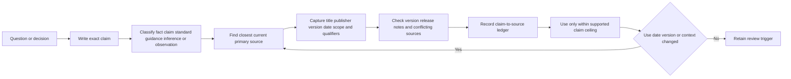
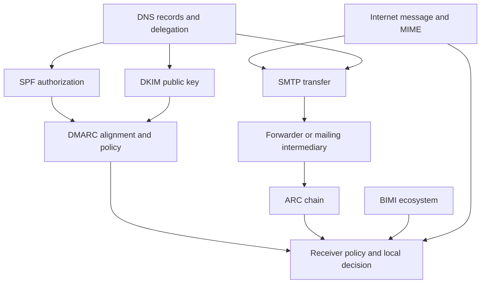
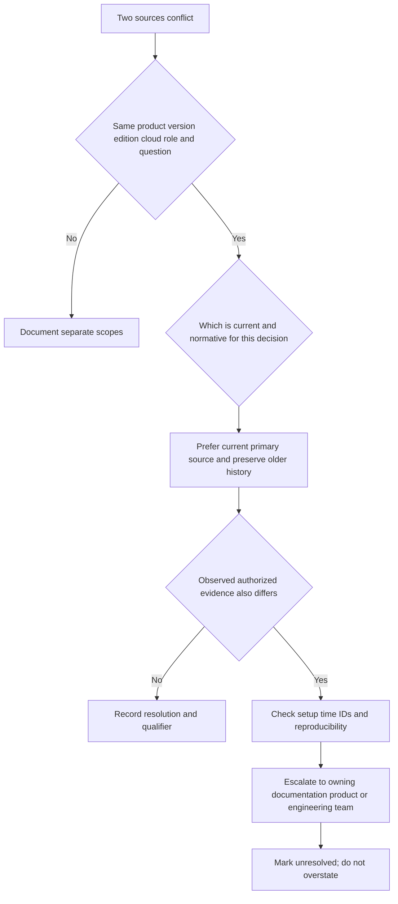
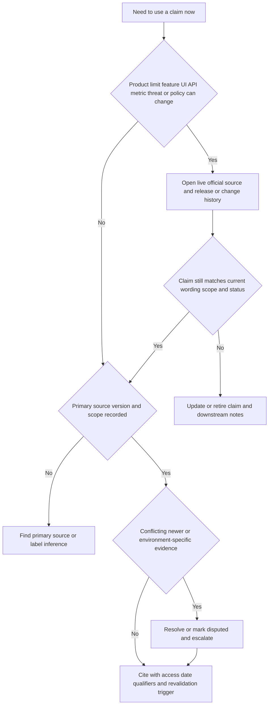

# Appendix J - Source Bibliography and Current Official Docs

> **Artifact label:** Maintained public-source navigation and claim-verification strategy; not a substitute for authorized product documentation, contracts, release notes, tenant evidence, or professional legal/security advice.
>
> **Official-source access and curriculum currency date:** **August 24, 2026.** This is a dated research snapshot, not a promise that a page, product name, feature, limit, standard, command, or policy remains current. Revalidate changing details against the live official source at use time.

## Purpose and Candidate Honesty Boundary

This appendix tells you where to look, how to judge a source, how to connect a claim to evidence, and how to detect stale information. It supports the company research in [Part 011](Part-011-abnormal-ai-mission-market-and-customer-outcomes.md), standards work in Parts [020](Part-020-rfc-style-message-structure-envelope-and-headers.md)-[029](Part-029-bimi-reputation-and-blocklists.md), integration learning in Parts [066](Part-066-microsoft-365-integration-architecture-and-troubleshooting.md)-[070](Part-070-splunk-crowdstrike-and-cortex-soar-integration-lab.md), and current-trends review in [Part 118](Part-118-advanced-topics-competitive-context-standards-and-current-trends.md).

You may say that you researched current public sources and built synthetic learning artifacts. You must not say you used private Abnormal documentation, operated the product, administered the named non-Microsoft platforms in production, validated a customer's configuration, or confirmed undocumented product behavior. A vendor page establishes what the vendor publicly states; it does not independently prove every outcome or expose private implementation.

Safe interview wording:

> “I separate supplied job-description facts, official product claims, normative standards, government or industry guidance, my reasoned inference, and performed lab observations. I record an access date and recheck changing product details at use time rather than relying on memory.”

> 🔍 **Plain-English deep-dive:** A source ledger is like a receipt file for ideas. It shows where a statement came from, when it was checked, and how far the evidence lets you go. A receipt proves a purchase record, not that the product works forever; likewise, a dated page supports a dated claim, not permanent truth.

## Use and Completion Checklist

- [ ] Write the exact claim before searching.
- [ ] Label it as official product claim, standard, guidance, supplied JD fact, inference, or lab observation.
- [ ] Prefer the closest current primary source and record title, publisher, version/date, URL/domain, and access date.
- [ ] Capture only a short faithful paraphrase or necessary quotation; preserve context and qualifiers.
- [ ] Record applicability, limitations, confidence, and the decision the claim supports.
- [ ] Check release/version history when behavior is product- or tool-specific.
- [ ] Resolve conflicts explicitly; do not silently choose the answer you prefer.
- [ ] Revalidate changing details at interview, lab, case, or publication time.
- [ ] Keep private/internal documentation and customer evidence in the authorized system, not this public-study bibliography.
- [ ] Never convert reading into a direct-experience claim.

## Claim Classes: Keep Unlike Evidence Separate

| Label | Plain meaning | Example | Safe wording | Cannot establish alone |
|---|---|---|---|---|
| Supplied JD fact | Text provided for the target role | Role names Cloud Email Security, AI Security Agents, and SaaS Security | “The supplied JD names...” | Current public taxonomy or internal workflow |
| Official product claim | What a vendor says on its own current public site | Public mission, product category, integration availability | “The official page states as of...” | Independent effectiveness, tenant behavior, private mechanism |
| Normative standard | Requirements/recommendations defined by a standards body | SMTP, DMARC, OAuth, SAML, SCIM specifications | “RFC/OASIS/OpenID specification defines...” | A vendor's exact implementation or configuration |
| Government/industry guidance | Recommended security/risk practice | NIST, CISA, MITRE ATT&CK guidance/knowledge | “The guidance recommends/describes...” | Legal mandate, compliance, incident verdict |
| Secondary explanation | Tutorial, article, course, or commentary | Vendor blog explaining a protocol | “This explanation helps interpret...” | Authority over the primary specification |
| Reasoned inference | Conclusion built from evidence and assumptions | Likely support boundary or possible failure path | “My current hypothesis is...” | Company fact or root cause |
| Lab observation | What an actually performed bounded exercise showed | Local TLS test produced a named result | “In my synthetic local lab...” | Production behavior or general product guarantee |
| Customer/tenant observation | Authorized evidence from a specific environment | Actual request ID or policy state | Only within authorized case handling | Universal behavior, causation, permission to disclose |



## Source-Quality Hierarchy

| Rank | Source | Best use | Caution |
|---|---|---|---|
| 1 | Binding contract, authorized internal runbook, tenant evidence, or current service communication | Actual responsibilities, entitlements, case behavior, approved action | Access-controlled; scope-specific; not for public interview disclosure |
| 2 | Current normative standard or official product/admin/API documentation | Protocol semantics, supported configuration, API contract | Confirm edition, cloud, version, date, preview/GA status, and exceptions |
| 3 | Official release notes, change notices, status, trust center, security advisory | Current changes, incidents, deprecation, assurance statement | Time-sensitive; status and marketing pages answer different questions |
| 4 | Government/standards-body guidance and maintained knowledge bases | Risk, security, incident, and adversary-behavior structure | Guidance is not automatically a mandate or local policy |
| 5 | Official vendor learning, engineering blog, support article, customer story | Explanation, examples, selected outcomes | Can simplify, market, age, or describe one edition/customer |
| 6 | Reputable independent analysis or textbook | Comparison, critique, context | Check author, methodology, date, funding, and primary citations |
| 7 | Community answer, forum, social post, generated summary | Search lead or symptom vocabulary | Never the final authority for changing/security-sensitive claims |

Use the highest available source that actually answers the question. A current admin page can outrank an old standard for a product setting; the standard still defines the protocol, while the product page defines the implementation contract.

## Abnormal AI Public Official Resources

Use the official [Abnormal AI domain](https://abnormal.ai/) and navigate from its current menus/search. Page names and portfolio labels can change.

| Source family | Questions it can answer | Record | Claim boundary |
|---|---|---|---|
| Homepage and About/company pages | Current public mission, positioning, company description | Exact page title, statement, access date | Attribute mission/scale/positioning; do not treat as independent proof |
| Platform and product pages | Public portfolio, named capabilities, use cases, deployment positioning | Product name, page title, availability wording, qualifiers | No private architecture, algorithm, field, permission, or guarantee |
| Integrations pages/directories | Publicly listed ecosystem categories and integrations | Integration name/category, support wording, access date | Listing does not prove configuration, entitlement, version, or healthy operation |
| Resources, blog, threat research, webinars | Vendor explanations, research, examples, trends | Author/publisher, title, date, methodology/source note | Separate research data, opinion, marketing, and product behavior |
| Customer stories and reports | Selected customer context and claimed outcomes | Named customer/report, methodology, qualifiers | Not a guaranteed outcome or representative baseline |
| Trust, privacy, security, legal pages | Public assurance pathways, policies, terms, privacy/security statements | Document title/version/date and audience | Do not infer certification scope or contractual terms from a badge |
| Careers and supplied JD | Public values, role responsibilities, qualifications | Exact current page/JD text and date | Do not claim lived culture or undocumented interview/internal process |

**Current-fact rule:** Mission, product names, portfolio composition, integrations, customer counts, percentages, AI claims, deployment language, and careers/value wording must be checked again immediately before use.

## Microsoft Learn, Microsoft 365, Exchange, Entra, and PowerShell

Use [Microsoft Learn](https://learn.microsoft.com/) as the primary public portal. Filter by current product, cloud, edition, role, and update date.

| Official source family | Core topics | Useful document families/search terms | Currency checks |
|---|---|---|---|
| Microsoft 365 documentation | Tenant/admin concepts, service configuration, audit and security surfaces | Microsoft 365 admin, service health, audit, licensing | Tenant type, role, license, preview/GA, retirement notice |
| Exchange Online documentation | Mail flow, connectors, accepted domains, message trace, protection, quarantine | Exchange Online mail flow, message trace, connectors, NDRs | New/old admin experience, permissions, retention window, limits |
| Microsoft Entra documentation | Identity, enterprise apps, service principals, roles, OAuth consent, sign-in logs | Entra ID, app consent, conditional access, service principal | Renames, license, tenant policy, API version, role needed |
| Microsoft Graph documentation | REST resources, permissions, errors, throttling, change notifications | Graph overview, permissions reference, API resource, throttling guidance | `v1.0` versus beta, delegated/application, national cloud, deprecation |
| Defender and security documentation | Security concepts and Microsoft-native evidence surfaces | Defender portal, incidents/alerts, email/authentication guidance | Product entitlement, portal change, retention, RBAC |
| PowerShell documentation | Language, cmdlets, modules, remoting, security | PowerShell docs, module reference, about topics | PowerShell/module version, OS, authentication, deprecation |
| Windows/networking documentation | DNS, TLS, HTTP, packet/network tools, event evidence | Windows commands, networking, ETW, event logs | OS/build, elevation, provider/tool version |

Your prior production background is real only within the workloads and responsibilities recorded in the master guide. Microsoft documentation about Exchange, Defender, Graph, or Entra is learning evidence unless a specific real experience is separately verified.

## Google Workspace Admin Help

Use [Google Workspace Help](https://knowledge.workspace.google.com/) and current Google developer documentation reached from official Google domains.

| Source family | Core topics | Verify before use | Candidate boundary |
|---|---|---|---|
| Gmail admin/mail routing help | Routing, compliance, spam/quarantine, authentication, delivery troubleshooting | Edition, admin privilege, propagation, routing order, UI change | Learned architecture/synthetic comparison only |
| Email sender guidance | SPF, DKIM, DMARC, bulk sender requirements, delivery practices | Requirement date, recipient population, thresholds, exceptions | Guidance changes; do not memorize one threshold indefinitely |
| Admin audit/investigation help | Audit events, search/investigation concepts, retention/export | License, role, data availability, lag, field definitions | No tenant evidence or direct administration claim |
| Google identity/OAuth documentation | Admin roles, OAuth apps, scopes, consent, service accounts | Workspace versus Cloud identity, app type, scope, policy | Reading does not establish integration operation |
| Google APIs | Gmail/Admin SDK resources, auth, quotas, errors | API/version, scope, quota project, deprecation | Use only safe public/local exercises without customer data |

## Email, Message, MIME, DNS, and Authentication Standards

Use the [RFC Editor](https://www.rfc-editor.org/) to retrieve the current RFC text, status, updates, and errata. Use the [IETF Datatracker](https://datatracker.ietf.org/) to check active drafts and working-group status. An Internet-Draft is not yet an RFC and may change.

| Family | Stable primary anchors to look up | What it governs | Revalidation cue |
|---|---|---|---|
| SMTP/ESMTP | RFC 5321 plus its listed updates; SMTP extensions registry | Transfer conversation, envelopes, replies, extensions | Check “Updated by,” errata, registered extensions, internationalization |
| Internet Message Format | RFC 5322 plus listed updates | Headers, body syntax, addresses, message structure | Product parsers may be stricter/looser; check updates |
| MIME | RFC 2045-2049 family and listed updates | Media types, multipart bodies, encodings, parameters | Check media-type registry and security considerations |
| Delivery status | RFC 3463 enhanced status codes and related DSN RFCs | Structured delivery failure status | Product text can wrap or extend context |
| Internationalized email | SMTPUTF8/EAI RFC family including RFC 6530 series | Non-ASCII addresses and headers | Support varies; verify sender/receiver/product |
| DNS | RFC 1034/1035 and current DNS updates/registries | Names, delegation, records, caching | Original RFCs have many updates; consult current registries/operational docs |
| DNS security | RFC 4033-4035 family and updates | DNSSEC concepts and validation | Verify algorithm/deployment guidance and local resolver behavior |
| SPF | RFC 7208 | Sender-policy evaluation for defined identity | Check DNS lookup limits, identity, forwarding behavior |
| DKIM | RFC 6376 plus listed updates | Domain signature creation/verification | Check algorithms, canonicalization, key and implementation guidance |
| DMARC | RFC 7489 and current IETF DMARC work/status | Identifier alignment, policy, reporting | Recheck whether a successor standard has been published by use time |
| ARC | RFC 8617 | Authenticated chain for intermediary handling | ARC validation/trust does not restore universal truth |
| BIMI | Current specification and implementation guidance from the [BIMI Group](https://bimigroup.org/) | Brand indicator discovery/validation ecosystem | Requirements, certificate types, mailbox-provider support can change |



The diagram shows standards relationships, not a guaranteed order or vendor decision algorithm. See [Appendix C](Appendix-C-email-header-and-authentication-cheat-sheet.md).

## HTTP, TLS, OAuth, OIDC, SAML, and SCIM Standards

| Family | Stable primary anchors | What it governs | Important distinction |
|---|---|---|---|
| HTTP semantics/caching | RFC 9110 and RFC 9111 | Methods, fields, status semantics, caching | HTTP semantics do not define an application's business meaning |
| HTTP/2 and HTTP/3 | RFC 9113 and RFC 9114 | Protocol mappings and transport behavior | Version negotiation differs from application status |
| TLS 1.3 | RFC 8446 plus current updates/guidance | Transport confidentiality/integrity and authentication | TLS success does not authorize an API action |
| OAuth 2.0 | RFC 6749 and current updates/Best Current Practice, including RFC 9700 | Delegated authorization framework | OAuth is authorization, not a user identity protocol by itself |
| Bearer tokens/JWT/PKCE | RFC 6750, RFC 7519, RFC 7636 and current updates | Token use/format and authorization-code protection | JWT is a format; signature/claims/audience/lifetime still require validation |
| OpenID Connect | Current OpenID Connect Core documents from the [OpenID Foundation](https://openid.net/) | Identity layer built on OAuth 2.0 | ID token and access token have different audiences/purposes |
| SAML 2.0 | SAML 2.0 Core, Bindings, Profiles, and Metadata from [OASIS Open](https://www.oasis-open.org/) | Federated authentication assertions and exchange profiles | XML signature, audience, recipient, time, and trust all matter |
| SCIM 2.0 | RFC 7643 and RFC 7644 | Identity schemas and provisioning protocol | Successful SSO does not prove provisioning lifecycle works |

Do not quote a protocol from memory in a high-stakes case. Verify the current standard, the product's supported subset, and the actual trace/configuration.

## NIST, CISA, and MITRE ATT&CK

| Official family | Portal | Use | Boundary |
|---|---|---|---|
| NIST Cybersecurity Framework | [NIST CSRC](https://csrc.nist.gov/) | CSF 2.0 outcomes, Profiles, Tiers, implementation examples | Not a certification or mandatory checklist by itself |
| NIST incident response | NIST CSRC publications | Current incident-response recommendations, terminology, preparation and improvement | Recheck revision; organizational policy controls action |
| NIST zero trust | NIST SP 800-207 family | Resource-focused zero-trust architecture concepts | Does not certify a product or prescribe one implementation |
| NIST AI Risk Management Framework | NIST AI RMF family | Govern/map/measure/manage AI risk | Not proof that a model is safe, fair, or compliant |
| NIST privacy and controls | NIST Privacy Framework and SP 800-53 families | Privacy-risk and control catalogs | Tailor to authority/context; controls require evidence |
| CISA guidance | [DHS Cybersecurity and CISA resource gateway](https://www.dhs.gov/topics/cybersecurity) | Secure by Design, CPGs, zero trust, incident/vulnerability advisories, KEV | Follow the current official CISA resource links; guidance/advisory scope and date matter; KEV absence is not safety |
| MITRE ATT&CK | [MITRE ATT&CK](https://attack.mitre.org/) | Versioned adversary tactics, techniques, relationships, references | Mapping is not attribution, chronology, coverage proof, or incident declaration |

Use [Appendix H](Appendix-H-security-framework-maps.md) for the framework-to-decision map.

## Official Ecosystem Product Documentation

These are learning targets named or adjacent to the supplied JD. Use each current official portal; exact product names, URLs, editions, APIs, scopes, and limits must be checked at use time.

| Product family | Stable official portal | Document families to seek | Support-learning focus and caution |
|---|---|---|---|
| Slack | [Slack developer documentation](https://docs.slack.dev/) | Apps, OAuth/scopes, Events API, webhooks, audit/admin APIs, rate limits | Workspace/org model and plan/permission differences; no production-use claim |
| Okta | [Okta developer documentation](https://developer.okta.com/docs/) | OIDC/OAuth, SAML, SCIM, System Log, apps, policies, API limits | Engine/edition/API changes and admin permissions |
| Splunk | [Splunk Help](https://help.splunk.com/) | Search Processing Language, data onboarding, CIM, REST, alerts, dashboards | Product/cloud/version differences; queries do not prove data completeness |
| CrowdStrike | [CrowdStrike](https://www.crowdstrike.com/) official documentation/support/developer resources | Falcon platform concepts, APIs, detections, identity/endpoint integrations | Some docs require entitlement/login; never infer private API or console behavior |
| Cortex SOAR/Palo Alto Networks | [Palo Alto Networks documentation](https://docs.paloaltonetworks.com/) | Cortex XSOAR concepts, integrations, playbooks, incidents, APIs | Product rename/version, marketplace pack, permissions, and human approval |
| Zoom | [Zoom Developer Platform](https://developers.zoom.us/) | OAuth/server-to-server apps, webhooks, APIs, rate limits, admin concepts | Account type, scopes, verification and API version change |
| Zendesk | [Zendesk Developer Docs](https://developer.zendesk.com/) | Support API, tickets, users/orgs, webhooks, auth, rate limits | Conceptual learning unless real usage is separately verified |
| Salesforce | [Salesforce Developers](https://developer.salesforce.com/) | REST APIs, objects, permissions, events, limits, release notes | Edition, org config, seasonal release, API version |
| Jira and Confluence | [Atlassian Developer](https://developer.atlassian.com/) and [Atlassian Support](https://support.atlassian.com/) | Cloud REST APIs, issue/content models, apps, auth, permissions, admin help | Cloud/Data Center and product differences; no workflow claim without evidence |

## Official Tool, Runtime, and Operating-System Documentation

| Tool/runtime | Stable official source | What to verify | Safe-use boundary |
|---|---|---|---|
| Postman | [Postman Learning Center](https://learning.postman.com/docs/) | Current app/CLI behavior, variables, auth, scripting, collection format | Never store/export live secrets in candidate artifacts |
| Wireshark | [Wireshark documentation](https://www.wireshark.org/docs/) | User guide, display/capture filters, protocol fields, release behavior | Capture only authorized traffic; protect payloads |
| OpenSSL | [OpenSSL documentation](https://docs.openssl.org/) | Command syntax, supported version, verification behavior, security notes | Diagnostic output can expose hosts/certificates; no unapproved probing |
| Python | [Python documentation](https://docs.python.org/3/) | Language/library behavior for selected interpreter version | Pin/version-check examples; generated code requires review |
| PowerShell | Microsoft Learn PowerShell documentation | PowerShell/module version, cmdlet syntax, auth and platform support | Use placeholders and authorized targets; transcripts can contain secrets |
| Linux kernel | [Linux kernel documentation](https://docs.kernel.org/) | Kernel/networking/system behavior relevant to the task | Pair with current distribution and command manual |
| Linux distribution/userland | Official vendor docs and installed `man` pages | Distro/release, package/tool version, paths, service manager | “Linux” is not one fixed implementation |

## Claim-to-Source Ledger

| Field | Entry guidance |
|---|---|
| Claim ID and exact wording | One falsifiable statement; avoid combining several claims |
| Claim class | JD fact, official claim, standard, guidance, inference, lab/customer observation |
| Decision/use | Why the claim is needed and audience |
| Primary source | Publisher, exact title, stable domain/URL |
| Version/publication/update | Version, RFC/revision, release, publication/update date when available |
| Access date | `2026-08-24` for this snapshot; replace with actual recheck date at use time |
| Supporting passage | Short faithful paraphrase or minimum quotation with heading/context |
| Scope/applicability | Product, edition, cloud, role, protocol, audience, jurisdiction, environment |
| Qualifiers/limitations | Preview, marketing, selected customer, assumption, unsupported area |
| Conflict check | Other source/version and resolution state |
| Confidence/state | Verified-current, verified-dated, needs revalidation, disputed, retired |
| Next review trigger | Interview date, release, deprecation, standard revision, case use |

### Citation Template

```text
[{CLAIM_CLASS}] {PUBLISHER}. “{DOCUMENT_OR_PAGE_TITLE}.”
Version/revision/publication: {VALUE_OR_NOT_STATED}.
Official domain/URL: {STABLE_OFFICIAL_LOCATION}.
Accessed: {YYYY-MM-DD}.
Supports: {EXACT_CLAIM_ID_AND_FAITHFUL_PARAPHRASE}.
Scope/qualifiers: {PRODUCT_EDITION_AUDIENCE_STATUS_LIMITS}.
Revalidation trigger: {WHEN_AND_WHY}.
```

For RFCs use publisher, RFC number/title, publication date, status, “Updates/Obsoletes” relationships, errata check, and access date. For a lab, cite the lab ID, environment/version, performed time, artifact IDs, and limitations instead of presenting it as an external authority.

## Version and Change Tracking

| Change-sensitive item | Baseline to record | Trigger | Action |
|---|---|---|---|
| Product/portfolio name | Exact public wording and page title | Site/navigation/release change | Re-map old and new term; do not assume equivalence |
| API | Version, endpoint family, schema, auth, scopes, limits | Deprecation/changelog/error mismatch | Check current reference and migration guidance |
| Admin UI/workflow | Product/edition, role, capture date | Portal redesign or tenant difference | Use current docs; describe concept rather than memorized clicks |
| Standard/RFC | Number, status, updates/obsoletes, errata | New RFC/draft milestone/erratum | Re-evaluate normative claim and product support |
| Security guidance | Publisher, revision, publication date | New threat/advisory/revision | Reassess applicability with authorized owner |
| CLI/tool | Tool/runtime/OS version and command help | Upgrade or platform change | Retest benign command and expected output |
| Company metric/claim | Exact source, date, methodology/qualifier | New reporting period or page change | Requote current source or omit stale number |
| Job description | Supplied version/date/location | Recruiter supplies revised scope | Re-map role plan and interview cues |

## Conflict Resolution

Conflicts often reflect different versions, scopes, authors, or purposes rather than one obviously “wrong” source.

| Conflict | Resolution priority |
|---|---|
| Standard versus vendor behavior | Standard defines protocol; current vendor docs define supported implementation; trace shows this environment |
| Current docs versus old blog | Current reference/release note wins for current behavior; old blog may explain history |
| Marketing page versus admin/API reference | Marketing supports positioning; admin/API reference supports operational contract |
| Public docs versus authorized internal runbook | Current authorized runbook governs internal action; keep it private and verify conflicts with owner |
| Two official pages disagree | Check dates, editions, clouds, versions, qualifiers; raise documentation issue if unresolved |
| Lab differs from docs | Verify setup/version and reproduction; report observation as bounded, not as automatic documentation error |



## Stale-Source Decision Tree



## Current-Facts Revalidation Checklist

| Check | Pass condition |
|---|---|
| Source identity | Official publisher/domain and exact title confirmed |
| Current state | Live page/spec available; archived/retired/preview status understood |
| Version | Product, API, RFC/revision, tool, OS, cloud, and edition identified where relevant |
| Date | Publication/update and actual access/recheck date recorded |
| Scope | Audience, role, license, geography, tenant/environment, and prerequisites understood |
| Claim fidelity | Wording preserves qualifiers and does not broaden the source |
| Evidence type | Product claim, standard, guidance, inference, and observation are visibly separate |
| Conflict | Newer/conflicting sources and actual observations assessed |
| Link | Official destination resolves from the stable portal; brittle deep link avoided or checked |
| Downstream notes | Interview sheet, lab, answer, and ledger updated together |
| Experience boundary | Reading/research is not described as production use |
| Next trigger | Named event/date for the next review |

## Completion Gate

- [ ] Bibliography covers Abnormal AI; Microsoft/M365/Exchange/Entra/PowerShell; Google Workspace; requested standards; NIST; CISA; MITRE ATT&CK; named ecosystem products; and requested tools/runtimes.
- [ ] Official product claims, standards, guidance, inference, and lab observation remain distinct.
- [ ] Source hierarchy, claim ledger, citation form, version/change tracking, conflict handling, stale-source tree, and revalidation checklist are usable.
- [ ] The access/currency date is August 24, 2026, with explicit at-use revalidation.
- [ ] Stable official domains/source families are used; no uncertain deep URL is invented.
- [ ] No source-reading statement implies direct Abnormal or named-platform production experience.
- [ ] Internal cross-links resolve to existing guide files.

**Next references:** Apply [Appendix I](Appendix-I-lab-safety-evidence-and-redaction.md) before collecting evidence, use [Appendix K](Appendix-K-30-60-90-day-ramp-plan.md) to schedule current-source learning, and refresh [Appendix L](Appendix-L-night-before-one-page-cheat-sheet.md) from this ledger immediately before an interview.