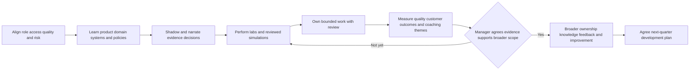
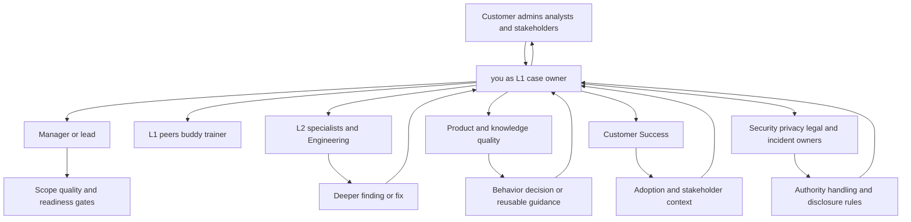
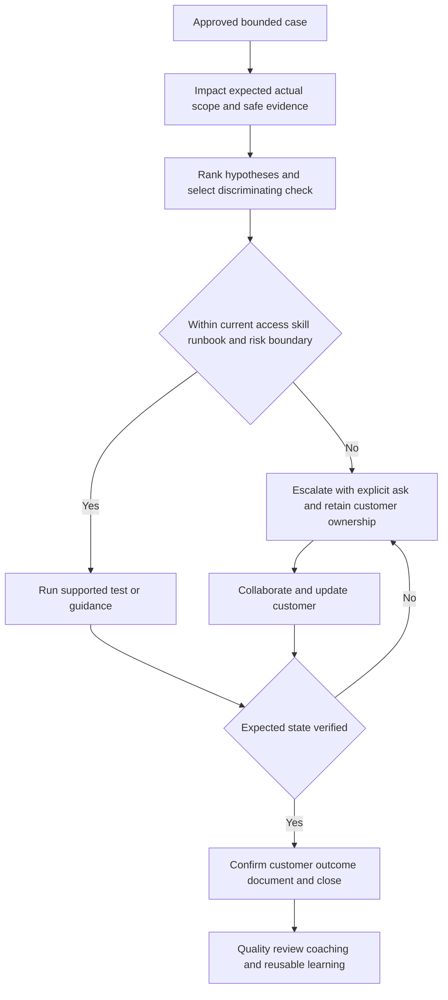
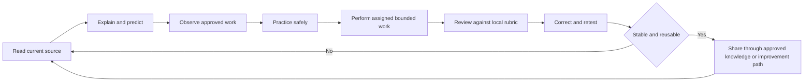
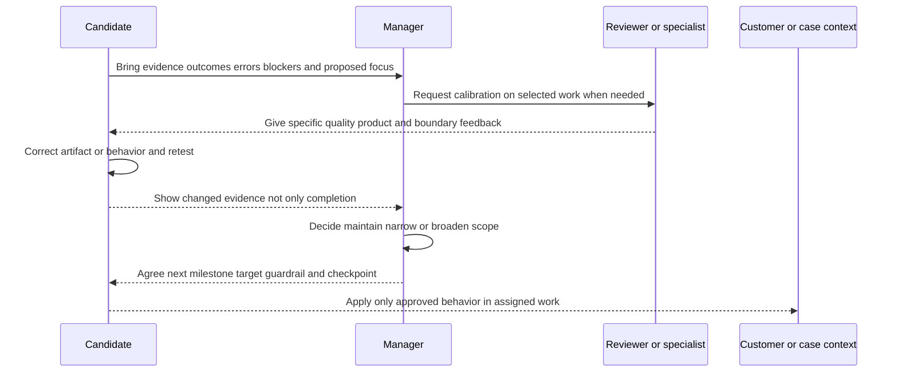

# Appendix K - 30 60 90 Day Ramp Plan

> **Artifact label:** Candidate-proposed ramp framework based on the supplied job description, public product areas, and transferable enterprise-support practice; not knowledge of Abnormal AI's internal onboarding, tools, access, service levels, case queues, metrics, or promotion criteria.
>
> **Currency and official-source access date:** August 24, 2026. Revalidate product names, responsibilities, documentation, team structure, and expectations with the recruiter/manager and current official sources at use time.

## Purpose and Candidate Honesty Boundary

This plan turns “I learn quickly” into a reviewable sequence of questions, practice, evidence, feedback, and progressively broader contribution. It is a proposal to negotiate with a manager, not a promise to reach arbitrary ticket counts or unsupported independence by a fixed date.

Your verified base is several years of enterprise customer-facing support, including the named cloud workloads, complex/critical investigations, customer and partner communication, Engineering/Product escalation, fix validation, knowledge/training, mentoring, and support analytics recorded in [Part 001](Part-001-role-compass-and-honest-candidate-story.md). Direct Abnormal operation, email-security production case ownership, and production use of Google Workspace, Slack, Okta, Splunk, CrowdStrike, Cortex SOAR, Zoom, Zendesk, Salesforce, Jira, or Confluence are not established.

Safe interview wording:

> “This is a proposed ramp, not a claim about Abnormal's internal process. I would align it with my manager's quality bar, access model, case mix, and customer commitments. My goal is evidence-based progression: learn safely, shadow actively, own bounded work with review, then broaden only when quality and judgment support it.”

> 🔍 **Plain-English deep-dive:** A ramp plan is like learning to fly with an instructor. Reading the manual matters, simulation matters, and supervised practice matters, but none automatically grants permission to fly every route alone. The analogy stops because support autonomy is assigned by the employer based on role, access, risk, quality, and customer needs, not a universal license.

## Use and Completion Checklist

- [ ] Replace assumptions with manager answers during pre-start/first-week alignment.
- [ ] Record the current product taxonomy, support scope, case lifecycle, security/privacy rules, and escalation paths.
- [ ] Negotiate baseline and target definitions before using any metric.
- [ ] Pair each learning goal with observable evidence and a reviewer.
- [ ] Progress case ownership by risk and demonstrated quality, not elapsed time alone.
- [ ] Keep customer communication, evidence safety, and ownership active at every phase.
- [ ] Track coaching themes and corrected repetitions, not only completed training.
- [ ] Stop or escalate when authority, severity, privacy, security, product behavior, or customer commitment is unclear.
- [ ] Label portfolio artifacts as production transfer, current public learning, or performed synthetic/reviewed practice.
- [ ] Revalidate changing product details at use time.

## Ramp Principles

| Principle | Plain meaning | Observable behavior | Failure to avoid |
|---|---|---|---|
| Safety before speed | Protect customers, data, and service while learning | Uses approved access, evidence, change, and escalation paths | “Learning” through unauthorized exploration |
| Customer outcome before activity | Work is useful when it reduces impact/uncertainty or advances a decision | Connects next action to customer/security outcome | Counting notes, meetings, or cases without quality |
| Fundamentals before memorized clicks | Understand flow, dependencies, evidence, and ownership | Explains why a check discriminates between hypotheses | Repeating an old UI path after product change |
| Feedback before autonomy | Review exposes blind spots and local standards | Requests targeted review and applies correction | Treating time served as independence |
| Evidence before conclusion | Separate observation, inference, root cause, and unknown | Uses IDs, timelines, comparison cohorts, and validation | Naming a cause from correlation |
| Scope before action | Authority and blast radius control risk | Confirms owner, tenant/object, allowed action, rollback/validation | Broad production change for a narrow symptom |
| Reuse after validation | Turn repeated learning into reliable knowledge | Drafts KB/runbook after source and reviewer checks | Publishing one-off or stale guidance |

## Pre-Start Assumptions and Questions

Do not request customer/product access before employment or outside the approved onboarding path. Pre-start work should stay with public official sources, the supplied JD, spoken practice, and safe local/synthetic labs.

| Area | Working assumption for planning only | Question to confirm | Why it matters |
|---|---|---|---|
| Role scope | Enterprise L1 support spans configuration, API, behavioral false-positive, and threat-related cases named by the JD | Which case families and customer segments does this role actually own? | Sets learning order and escalation boundary |
| Product portfolio | JD names Cloud Email Security, AI Security Agents, and SaaS Security | What are the current public/internal product names and support surfaces? | Public taxonomy can change |
| Access | Least-privilege access is granted through onboarding | Which systems, environments, and evidence fields are available at each stage? | Prevents invented access and unsafe expectations |
| Training | Formal and informal learning may both exist | Which training, labs, shadowing, and knowledge checks are required? | Avoids inventing certification or curriculum |
| Case system | A support platform and internal knowledge system exist | Which fields, queues, tags, templates, and hygiene standards apply? | Makes case work locally correct |
| Quality | Case notes, communication, diagnosis, safety, and resolution are reviewed | What rubric and calibration process define acceptable quality? | “Good” must be operationally defined |
| Metrics | The team uses some operational/customer measures | Which metrics are decision-useful, and how are baselines/targets segmented? | Avoids gaming or invented KPIs |
| Escalation | L1 collaborates with deeper support/Engineering/Product/security/CSM functions | What are severity, security, defect, and product-feedback paths? | Clarifies ownership during handoff |
| Work pattern | Team/customer coverage may span regions and schedules | What hours, handoffs, on-call expectations, and update conventions apply? | Do not infer logistics from a posting |
| Manager success | Early success balances learning, quality, communication, and contribution | What would make days 30, 60, and 90 successful for this hire? | Converts plan into manager agreement |

## Stakeholder Map

This is a functional map, not an Abnormal organization chart.

| Stakeholder/function | What you need to learn from them | What you can contribute during ramp | Boundary/question |
|---|---|---|---|
| Manager/lead | Priorities, quality bar, scope, risk, feedback, readiness gates | Transparent progress, blockers, coaching application | Manager approves targets and broader ownership |
| Onboarding/trainer/buddy | Product mental model, workflow, local language, common cases | Prepared questions, teach-back, lab artifacts | Confirm who is authorized to approve actions |
| L1 peers | Intake patterns, case hygiene, customer cadence, practical pitfalls | enterprise support transfer and collaborative notes | Local practice overrides generic guide |
| L2/specialists | Escalation thresholds, deeper evidence, uncommon cases | Complete reproductions, timelines, explicit asks | Do not bypass L1-supported scope |
| Engineering | Defect evidence, telemetry limits, fix validation | Expected/actual, minimal repro, IDs, impact, validation | Engineering owns code/service conclusions |
| Product | Expected behavior, recurring needs, prioritization evidence | Pattern, impact, workaround, customer job | Never promise roadmap or dates |
| Customer Success Manager | Onboarding/adoption goals, stakeholder context, success risk | Technical readiness/status and clear handoffs | CSM and Support ownership must be explicit |
| Security/privacy/legal/compliance | Evidence, incident, disclosure, data, and action boundaries | Prompt escalation and minimal evidence | Do not make specialized judgments independently |
| Knowledge/quality/operations | Content standards, calibration, taxonomy, metrics | Reusable drafts and pattern observations | Publish only after review |
| Customer admins/analysts | Environment, expected outcome, impact, constraints | Ownership, diagnosis, updates, validation | Customer owns authorized environment decisions unless agreed otherwise |

## Days 1-30: Learn, Gain Safe Access, and Demonstrate the Method

**Proposed objective:** Build the correct local mental model, security/privacy habits, support workflow, communication standard, and supervised evidence before seeking independent breadth.

| Workstream | Proposed actions | Evidence of learning | Questions/checkpoint |
|---|---|---|---|
| Access and security | Complete required access/security/privacy steps; map each system's purpose and prohibited data/actions | Approved-access inventory with no credentials; teach-back of handling/incident path | What access is appropriate now, and what must never enter a case/artifact? |
| Product and customer outcomes | Learn current portfolio, personas, deployment/integration concepts, expected outcomes, and public-vs-private boundary | Product-to-customer-job map reviewed by buddy/manager | Which concepts are essential for L1 and which require specialist depth? |
| Email/security domain | Refresh mail flow, headers/MIME, SPF/DKIM/DMARC/ARC, top threat categories, verdict limitations | Timed explanation and synthetic header exercise | Which customer scenarios occur most often and carry highest risk? |
| SaaS/identity/API | Learn tenant/RBAC, SSO/OAuth/SCIM, permissions, REST/JSON, webhooks, rate/error patterns | Layered troubleshooting worksheet and safe mock request | Which integrations are in initial scope and what evidence is available? |
| Support systems/process | Learn intake, severity, lifecycle, notes, knowledge, escalation, defect/product feedback, handoff | One synthetic case journal and one reviewed shadow-case summary | What must every case contain before escalation/closure? |
| Shadowing | Observe varied cases; predict next question/test before the owner acts; debrief difference | Shadow log: symptom, hypothesis, evidence, action, update, lesson; no customer data outside system | Which judgment was product-specific versus transferable? |
| Communication | Practice first response, evidence request, progress update, limitation, escalation, resolution | Reviewed synthetic message set using [Appendix F](Appendix-F-customer-communication-templates.md) | What tone, cadence, and commitment language does the team expect? |
| Labs | Perform only approved/synthetic exercises for email, DNS/TLS/HTTP, API, logs, and redaction | Sanitized artifacts labeled per [Appendix I](Appendix-I-lab-safety-evidence-and-redaction.md) | Which lab best predicts real case readiness? |
| Feedback | Hold frequent check-ins; track correction, owner, and retest | Coaching ledger with applied examples | Which two behaviors should change before broader ownership? |

### Day-30 Proposed Review

| Review area | Evidence to bring | Honest outcome language |
|---|---|---|
| Product/domain | Teach-back, knowledge checks if assigned, question log | “I can explain these approved foundations; these areas remain under review.” |
| Workflow/quality | Synthetic/reviewed notes, escalation, communication | “My artifacts meet/need work against the team rubric.” |
| Safety | Access/data/incident-path understanding and clean artifact review | “I know when to stop and who owns the decision.” |
| Readiness | Manager-reviewed case-family matrix | “The manager approved these bounded activities; other work remains supervised.” |

## Days 31-60: Supervised Case Ownership and Reliable Escalation

**Proposed objective:** Own bounded cases selected by the manager, maintain customer continuity, diagnose within L1 scope, and improve from review. “Own” means coordinate progress and communication; it does not mean act beyond authorization or avoid escalation.

| Workstream | Proposed actions | Reviewable evidence | Guardrail |
|---|---|---|---|
| Bounded case ownership | Handle approved case types from intake through validation/closure with defined review | Case-quality samples and coaching themes in authorized system | Case count/complexity set by manager, not this plan |
| Configuration | Compare expected/effective state, scope, inheritance, change timeline, working cohort | Sanitized configuration-difference narrative | Do not change customer settings without owner/process |
| API/integration | Trace client, DNS, TCP/TLS, HTTP, auth, contract, service evidence and IDs | Layered API escalation packet | Never request secrets or infer backend cause |
| False-positive/disputed verdict | Clarify expected/actual result, business/security cost, policy/context, minimum message/object evidence | Evidence-vs-inference ledger and supported review-path record | Do not disclose or invent model logic |
| Threat-related workflow | Scope report, preserve minimum evidence, follow product path, communicate uncertainty | Timeline and handoff using [Part 046](Part-046-threat-investigation-evidence-preservation-and-timelines.md) | Customer/security owner declares incident and authorizes response |
| Escalation | State impact, repro, timeline, attempted tests, evidence, alternatives, explicit ask | Reviewed packet using [Appendix E](Appendix-E-escalation-rca-and-postmortem-templates.md) | Escalate early for severity, safety, access, or unsupported behavior |
| Knowledge | Draft/update one useful item when a validated repeatable gap exists | Reviewed draft, source ledger, reuse plan | No publication target invented; owner approves |
| Onboarding/CSM collaboration | Support assigned technical readiness/validation tasks and clear handoffs | Shared dependency/owner/status map | Do not assume ownership of adoption plan |
| Metrics | Learn definitions, segmentation, quality tradeoffs, and personal coaching view | Manager-agreed baseline and dashboard interpretation | No arbitrary target or optimization against one metric |

### Day-60 Proposed Review

| Question | Evidence | Decision, owned by manager |
|---|---|---|
| Which case families meet the quality bar? | Segmented reviewed samples, not raw volume | Maintain, narrow, or broaden scope |
| Which errors repeat? | Coaching ledger and corrected retests | Targeted practice or added review |
| Is escalation useful and timely? | Specialist feedback, packet completeness, customer continuity | Adjust threshold/template |
| Is communication reliable? | Updates against team standard and customer context | Cadence/coaching change |
| Which knowledge is reusable? | Validated recurrence, source currency, reviewer decision | Publish, revise, or discard |

## Days 61-90: Broader Ownership and Bounded Improvement

**Proposed objective:** Broaden ownership only where manager-approved evidence supports it, identify recurring patterns, contribute product/process feedback, and agree the next-quarter plan.

| Workstream | Proposed actions | Evidence/outcome | Boundary |
|---|---|---|---|
| Broader case ownership | Handle a wider approved mix or complexity while maintaining safety, quality, updates, and escalation judgment | Segmented quality trend and manager calibration | No guaranteed autonomy at day 90 |
| Recurring-pattern analysis | Group similar symptoms by cause/evidence, impact, frequency, and case-quality confidence | Small pattern brief with caveats and source IDs | Similar symptoms do not prove one cause |
| Product feedback | Translate repeated customer job/friction into evidence, impact, workaround, and explicit question | Product evidence brief and recorded disposition | Do not promise roadmap priority/date |
| Process experiment | Select one bounded problem, baseline, hypothesis, intervention, guardrail, review date | Experiment record using [Part 115](Part-115-process-improvement-experiments-and-operational-quality.md) | Manager agrees metric and scope before change |
| Knowledge/enablement | Improve a validated article/runbook or share a reviewed learning | Reuse/quality evidence | Contribution depends on team need and review |
| Mentoring contribution | Only if manager considers it appropriate, share a narrow verified method with a peer/new learner | Session outline, feedback, corrected material | Not a claim of formal mentoring responsibility or expertise |
| Cross-functional collaboration | Improve Engineering/Product/CSM handoffs on assigned work | Partner feedback and reduced restart/ambiguity evidence | Functional map is not authority expansion |
| Next-quarter plan | Agree strengths, gaps, case scope, domain depth, artifacts, and review cadence | Written manager-aligned development plan | No invented promotion/certification promise |

## Weekly Milestones

Weeks are flexible sequencing markers. Holidays, access, team needs, case mix, and formal training can change the order.

| Week | Proposed focus | Tangible checkpoint | Dependency |
|---|---|---|---|
| Pre-start | Public-source refresh, truthful story, safe local practice only | Updated source ledger and gap list | No private access or work requested |
| 1 | Role, access, security, privacy, systems, team language | Access/policy map and unresolved questions | Required onboarding and owners |
| 2 | Product/customer mental model and core email/security foundations | Reviewed teach-back and product-question ledger | Current docs/trainer |
| 3 | Support lifecycle, severity, communication, evidence, escalation | Synthetic case and message set review | Local rubric/templates |
| 4 | Shadowing synthesis and day-30 readiness review | Case-family readiness proposal | Sufficient varied shadowing |
| 5 | First manager-selected bounded ownership with close review | One or more quality-reviewed examples as assigned | Access and approval |
| 6 | Configuration and identity/integration patterns | Comparison worksheet and corrected case notes | Relevant case/lab availability |
| 7 | API/log/correlation and escalation quality | Reviewed escalation packet | Specialist feedback |
| 8 | False-positive/threat workflow boundaries and customer updates | Evidence ledger and day-60 review | Security/product process |
| 9 | Broader approved case mix and quality consistency | Segmented quality calibration | Manager readiness decision |
| 10 | Recurring-pattern analysis | Draft pattern brief with alternatives | Sufficient comparable data |
| 11 | Knowledge/product feedback contribution | Reviewed draft/disposition | Valid recurrence and owner |
| 12 | Bounded process experiment design or execution | Baseline, hypothesis, guardrail, review | Manager approval and usable baseline |
| 13 | Day-90 synthesis and next-quarter agreement | Portfolio index, gaps, negotiated plan | Stakeholder feedback |

## Competency Matrix

| Competency | Starting evidence | 30-day evidence | 60-day evidence | 90-day evidence | Reviewer |
|---|---|---|---|---|---|
| Enterprise ownership | Verified enterprise support/critical-situation transfer | Local lifecycle teach-back | Reviewed bounded case continuity | Consistency across approved mix | Manager/quality |
| Customer communication | Verified technical/nontechnical customer work | Local templates and shadow review | Real assigned updates reviewed in system | Reliable audience/cadence judgment | Manager/peer |
| Product/customer outcomes | Public learning only | Reviewed product/job map | Correct use in assigned cases | Pattern/product brief if appropriate | Trainer/Product |
| Email threat fundamentals | Curriculum/synthetic learning | Header/auth/threat exercises | Correct use in supervised workflow | Broader cases only if approved | Specialist |
| SaaS/identity/API/network/logs | Mixed experience transfer and learning | Layered labs/teach-back | Reviewed assigned integration diagnosis | Consistent cross-layer reasoning | Specialist/Engineering |
| Evidence/privacy/security | Microsoft method plus guide | Local policy/access/handling pass | Safe minimum collection and escalation | Consistent judgment and cleanup | Security/quality |
| Escalation/collaboration | Verified Engineering/Product transfer | Local packet standard learned | Useful, timely packets with feedback | Reduced restart and clear ownership | L2/Engineering |
| Knowledge/improvement | Verified KB/training/analytics transfer | Local standards learned | Reviewed draft if justified | Validated contribution/experiment if approved | Knowledge/ops |

Do not mark a cell complete because a document exists. Evidence requires performance, review, correction, and the appropriate owner.

## Learning and Evidence Plan

| Learning loop | Activity | Artifact | Review question |
|---|---|---|---|
| Read | Current authorized docs and public standards | Source/claim ledger using [Appendix J](Appendix-J-source-bibliography-and-current-official-docs.md) | Is the claim current, scoped, and faithful? |
| Explain | Teach concept in plain English and technical depth | Short diagram and spoken answer | Can you define, apply, limit, and answer follow-up? |
| Observe | Shadow a case and predict decisions | Sanitized in-system shadow template | Which evidence changed the next action? |
| Practice | Run approved synthetic/sandbox task | Lab report and manifest | Was it authorized, reproducible, and correctly labeled? |
| Perform | Handle assigned bounded work | Case notes, customer update, validation | Did outcome, safety, and quality meet local standard? |
| Review | Receive specific feedback | Coaching ledger | What changed in the next attempt? |
| Reuse | Convert validated repetition into knowledge/improvement | Reviewed KB, pattern brief, or experiment | Is it generalizable, current, findable, and measured? |

## Measurable Outcomes: Baseline and Target Must Be Negotiated

No numeric KPI is invented here. Use the team's definitions, segmentation, data quality, and guardrails. A target should be negotiated after a baseline and risk review.

| Outcome area | Baseline method | Target negotiation prompt | Guardrail |
|---|---|---|---|
| Case quality | Sample against current rubric by case family/complexity | What score/error pattern indicates readiness for this scope? | Never trade safety/evidence/customer clarity for volume |
| Customer responsiveness | Learn current SLA/SLO/cadence and baseline by priority | What timely behavior is controllable and expected? | Response speed is not resolution quality |
| Diagnostic efficiency | Observe time/steps/rework for comparable cases | Which avoidable delay or duplicate collection should decrease? | Do not skip hypotheses or validation |
| Escalation quality | Specialist review of completeness, timeliness, explicit ask, restarts | What improvement is meaningful for this case type? | Low escalation rate is not automatically good |
| Resolution validation | Sample closure evidence and reopen/recontact context | What verified end state must appear before closure? | Workaround is not root cause; action is not outcome |
| Knowledge contribution | Baseline findability/reuse/gap for a validated topic | Is an article/update needed, and how will usefulness be checked? | Do not reward unreviewed article volume |
| Learning correction | Count/describe repeated coaching themes and successful retests | Which theme should no longer repeat by the next review? | Hiding errors destroys learning signal |
| Pattern/experiment | Establish segmented frequency/impact and data limits | What bounded change and review date are worth testing? | Correlation does not prove cause; protect unintended outcomes |

## Risks and Dependencies

| Risk/dependency | Early signal | Mitigation/owner question | Plan impact |
|---|---|---|---|
| Access or environment delay | Required system/training unavailable | What public/synthetic work is approved while owner resolves access? | Reorder, do not bypass |
| Product taxonomy/document change | Names/steps conflict across sources | Verify current official/internal source and record version | Update artifacts and interview language |
| Insufficient case mix | No examples for planned competency | Use approved simulation/shadowing; extend evidence window | Do not claim readiness without evidence |
| Too much breadth | Shallow recall or repeated context switching | Prioritize manager-selected case families and fundamentals | Narrow scope and sequence |
| Privacy/security uncertainty | Unclear data/tool/transfer request | Stop and ask authorized owner using [Appendix I](Appendix-I-lab-safety-evidence-and-redaction.md) | Safety overrides milestone |
| Metric distortion | Speed rises while quality/reopen/escalation worsens | Use balanced measures and segmentation | Revise target/intervention |
| Feedback bottleneck | Reviews delayed or inconsistent | Agree reviewer/cadence and use calibration samples | Milestone depends on review, not time |
| Over-transfer from Microsoft | Assumes same UI, role, or behavior | State analogy and where it breaks; verify local standard | Treat target product as new |
| Customer-impacting/high-risk case | Severity, active threat, broad scope, executive/regulatory concern | Follow immediate severity/security/incident path | Suspend learning objective; protect customer |
| Personal sustainability | Persistent overload, weak retention, avoidable errors | Reprioritize with manager and use spaced practice | Quality and judgment before breadth |

## Check-In Cadence and Agenda

| Cadence | Proposed purpose | Agenda | Output |
|---|---|---|---|
| Brief buddy/peer check, frequent early | Resolve workflow/product questions quickly | One question, evidence, attempted interpretation, next action | Corrected note and owner |
| Weekly manager 1:1 | Align outcomes, risk, scope, feedback, dependencies | Wins with evidence, errors, customer risk, blockers, next scope | Updated priorities/readiness gate |
| Weekly/biweekly quality calibration as available | Learn team standard consistently | Sample cases, score differences, why, corrected behavior | Calibration themes |
| Day 30/60/90 review | Decide scope and next phase | Competency matrix, artifacts, metrics, risks, stakeholder feedback | Explicit maintain/narrow/broaden decision |
| Post-escalation debrief | Improve evidence and timing | What was useful/missing/noisy/late? | One applied change |
| Post-incident/high-risk review as directed | Learn safely under owner process | Facts, decisions, authority, evidence, communication, improvements | Authorized actions/knowledge only |

## Stop or Escalate Conditions

| Trigger | Immediate behavior | Route/owner question |
|---|---|---|
| Active or suspected security incident/high-impact threat | Preserve minimum context, follow severity/security path, maintain communication | Who is authorized incident owner and what action is approved? |
| Secret, PII, customer content, or restricted data exposed/mishandled | Stop transfer/use; follow security/privacy reporting process | What containment/rotation/deletion is authorized? |
| Requested action exceeds role/access/runbook/change authority | Do not improvise | Which authorized owner can approve or perform it? |
| Product behavior conflicts with current docs/runbook | Capture expected/actual, version, IDs, repro and limits | Documentation issue, specialist, or Engineering? |
| Root cause requires private telemetry/code | State L1 limit and explicit question | Which internal team owns the missing evidence? |
| Customer asks for promise, roadmap, legal/compliance/incident judgment | Separate known facts and route | Who owns commitment or specialized judgment? |
| Repeated coaching/safety defect | Narrow work, seek review, retest | What evidence is required before scope resumes? |
| Workload threatens update commitments or quality | Reprioritize transparently | Which cases/outcomes take priority and who handles handoff? |

## Artifact Portfolio

| Artifact | Evidence tier | Proposed timing | Completion rule |
|---|---|---|---|
| Role/product/customer-job map | Current official/authorized learning | Days 1-15 | Reviewed; private facts kept in approved system |
| Access/security/privacy map | Authorized internal learning | Days 1-15 | No credentials; owner and stop path confirmed |
| Synthetic email/header analysis | Performed synthetic | Days 1-30 | Reproducible, sanitized, correctly limited |
| Layered API/integration case | Performed synthetic or reviewed assigned work | Days 1-60 | IDs, hypotheses, safe test, outcome/limit |
| Customer communication set | Synthetic then assigned in-system work | Days 1-60 | Reviewed against local standard |
| Escalation packet | Synthetic then authorized case artifact | Days 31-60 | Specialist says it is actionable; no public data leakage |
| Coaching ledger | Private development artifact | Ongoing | Shows applied correction and retest |
| KB/runbook update | Authorized contribution only if justified | Days 31-90 | Current sources, reviewer, publication decision |
| Pattern brief | Authorized aggregated evidence | Days 61-90 | Segmented, caveated, minimum data, decision owner |
| Process experiment | Proposed/authorized | Days 61-90 or later | Baseline, target, guardrail, owner, review date |
| Next-quarter plan | Manager-aligned proposal | Day 90 | Strengths, gaps, scope, outcomes, dependencies |

Never place customer or private company artifacts in a personal portfolio. The portfolio may be an internal index or a public-safe synthetic reconstruction only when policy permits.

## Interview Explanation

### 30-second structure

> “My first 30 days would focus on the current product and customer mental model, approved access and security/privacy rules, support systems, shadowing, and reviewed labs and communication. In days 31-60, I would own manager-selected bounded cases with review across configuration, API, verdict, and threat workflows, emphasizing escalation and customer continuity. In days 61-90, I would broaden only where quality evidence supports it, contribute a validated pattern, knowledge item, product brief, or small process experiment, and agree the next-quarter plan. Exact scope and targets would be negotiated with my manager.”

### Follow-up proof points

| Interviewer concern | Answer cue |
|---|---|
| “What will you deliver?” | Reviewed artifacts and changed behavior: safe case notes, updates, escalations, labs, coaching corrections, and manager-agreed outcomes |
| “How fast will you be independent?” | No fixed promise; scope broadens by risk, case type, quality evidence, and manager approval |
| “What metric will you hit?” | First learn definitions and baseline; negotiate balanced target with quality/customer guardrails |
| “How will your background help?” | enterprise ownership, ambiguity, communication, escalation, validation, KB/training, mentoring, and analytics transfer |
| “What is the gap?” | Direct Abnormal and email-security operations; close through current docs, authorized training, shadowing, labs, reviewed cases, and feedback |
| “Will you mentor?” | Share narrow verified learning only when appropriate and manager-requested; learning remains the priority |

## Completion Gate

- [ ] Pre-start assumptions/questions, days 1-30, 31-60, and 61-90 are specific and role-relevant.
- [ ] Weekly milestones, stakeholder map, competency matrix, evidence plan, negotiated outcomes, risks, dependencies, check-ins, stop conditions, and artifact portfolio are present.
- [ ] Product/support systems, security/privacy, shadowing, labs, communication, cases, configuration, APIs, false positives, threats, escalation, knowledge, onboarding, metrics, patterns, product feedback, improvement, and next-quarter planning are covered.
- [ ] Mentoring is conditional and appropriate, never guaranteed responsibility.
- [ ] No invented KPI, access, certification, internal process, or guaranteed autonomy appears.
- [ ] Every target requires a baseline, definition, manager agreement, and guardrail.
- [ ] Experience claims stay within verified prior production transfer, current learning, and actually performed/reviewed evidence.
- [ ] Changing product and role details are marked for revalidation at use time.

**Next references:** Use [Appendix L](Appendix-L-night-before-one-page-cheat-sheet.md) for the compact interview summary, [Part 100](Part-100-l1-ticket-lifecycle-and-case-ownership.md) for case ownership, [Part 104](Part-104-escalation-handoffs-swarming-and-critical-incidents.md) for escalation, and [Part 114](Part-114-support-metrics-dashboards-sql-and-analytics.md) for metric definitions and guardrails.