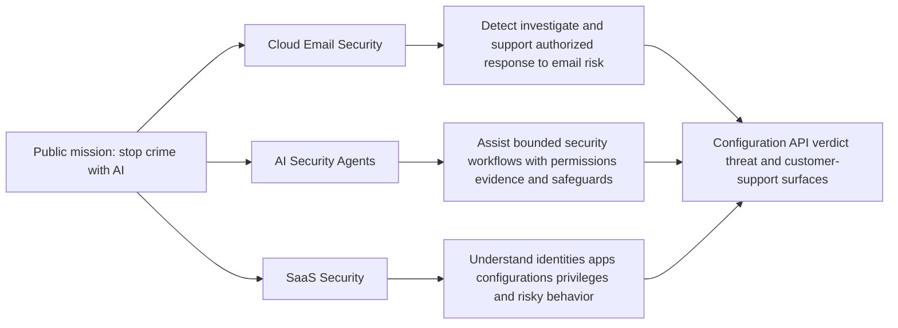
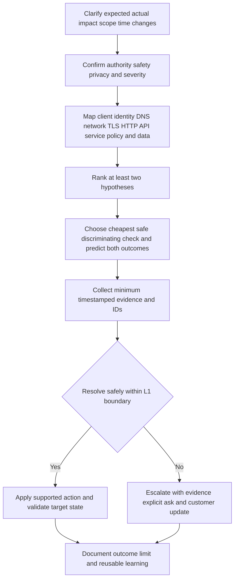

# Appendix L - Night-Before One-Page Cheat Sheet

> **Use:** Rapid night-before and interview-day recall. Read prompts, answer aloud, and stop; use linked Parts for depth.
>
> **Truth label:** enterprise-support production transfer + current public/JD learning + synthetic practice only where actually performed. **No direct Abnormal AI or email-security production operation is established.**
>
> **Currency date:** Official public sources were accessed August 24, 2026. Revalidate changing mission wording, portfolio names, features, metrics, integrations, role scope, and interview details at use time through [Appendix J](Appendix-J-source-bibliography-and-current-official-docs.md).

## Use and Completion Checklist

- [ ] Recheck the current JD, company mission/product pages, recruiter instructions, interviewers, time, timezone, and meeting link.
- [ ] Say the introduction, gap, why answers, two technical ladders, three real STARs, 30/60/90 summary, questions, and close aloud.
- [ ] Replace every `[PLACEHOLDER]` with a verified fact or say that no strong example is available.
- [ ] Keep only minimum sanitized notes; never expose customer/employer confidential data.
- [ ] Prepare to define jargon in plain English, reason aloud, and revalidate product-specific details.
- [ ] Do not memorize invented metrics, stories, platform behavior, internal processes, or access.

> 🔍 **Plain-English rule:** Treat this sheet like a cockpit checklist: it prevents skipped essentials, but it does not fly the scenario for you. Listen to the question, adapt, state assumptions, and stop when the answer is complete.

## 60-90 Second Introduction

| Beat | Cue | Time |
|---|---|---|
| Present foundation | “I have several years in enterprise customer-facing support across the verified workloads and responsibilities in my CV.” | 10-15s |
| Proof pattern | Complex/critical investigations; customer/partner communication; Engineering/Product escalation; fix validation | 15-20s |
| Compounding value | KB/training, mentoring, case quality, CSAT/backlog analysis | 10-15s |
| Technical direction | Microsoft cloud transfer plus deliberate email security, identity, APIs, networking, logs, and AI learning | 10-15s |
| Why this move | Security SaaS support combines customer ownership, technical ambiguity, risk, and product feedback | 10-15s |
| Honest boundary | “I have not operated Abnormal in production; I bring the support method and a concrete, feedback-led ramp.” | 10s |

**Do not:** recite the full CV, imply Exchange/security operations, or say a study guide equals hands-on production depth.

## Why Abnormal, Why the Role, Why you

| Question | Answer cues only | Boundary |
|---|---|---|
| Why Abnormal? | Official public mission: **stop crime with AI**; supplied JD joins Cloud Email Security, AI Security Agents, and SaaS Security; meaningful enterprise customer/security outcomes; public emphasis on behavioral context; connect to evidence-led support | Attribute public claims; do not claim culture, outcomes, architecture, or internals from experience |
| Why this role? | Best verified evidence is enterprise technical support: incomplete report -> scope -> hypotheses -> evidence -> collaboration -> update -> validation -> knowledge; role adds security SaaS depth | Do not imply the exact Abnormal workflow is known |
| Why you? | Several years of enterprise ownership; critical-case calm; technical/nontechnical trust; Engineering/Product handoff; fix validation; reusable knowledge; mentoring and support analytics; deliberate learning | Use only CV-verifiable examples and numbers |
| Why move now? | Moving **toward** security/AI/SaaS customer problems, not away from support; foundations and safe labs make the transition intentional | Avoid generic “cybersecurity is exciting” |

**Direct gap language:**

> “My largest relevant gap is direct Abnormal product and email-security operations experience. Microsoft cloud support is transferable, but it is not equivalent. I would close the remaining gap through current authorized documentation, training, shadowing, safe labs, reviewed cases, and explicit manager feedback rather than broad familiarity claims.”

## Evidence Tiers

| Tier | Say | Never upgrade it to |
|---|---|---|
| Verified production transfer | “In enterprise support, I...” | Security-vendor, Abnormal, or unlisted workload experience |
| Current official/JD learning | “The supplied JD/official page states as of [date]...” | Independent proof or private product knowledge |
| Performed synthetic lab | “In a local synthetic exercise I performed...” | Customer/production operation |
| Designed/not performed | “I designed a lab/plan...” | “I tested,” “I implemented,” or measured result |
| Inference/hypothesis | “A possibility I would test is...” | Fact or root cause |
| Unknown/private | “I would verify this in current authorized docs/telemetry.” | Confident guess |

## Product Portfolio: High-Level Only

This is the supplied-JD/public-learning map, not private architecture. Verify current portfolio wording before the interview. See [Parts 011-018](Part-011-abnormal-ai-mission-market-and-customer-outcomes.md).

## Email Flow and Authentication

| Cue | Recall |
|---|---|
| Flow | Sender/client -> submission/transfer -> DNS MX/routing/gateways -> receiving system -> mailbox/quarantine/remediation |
| Envelope vs header | SMTP `MAIL FROM`/`RCPT TO` route delivery; visible `From`/`To` are message fields and may differ |
| Received chain | Usually read bottom-up; verify trust boundary, UTC/timezone, and inserted-hop semantics |
| SPF | Is the sending IP authorized for the evaluated envelope/HELO domain? Forwarding can break it. |
| DKIM | Does the selected domain's public key validate the signed headers/body hash? Valid signature does not prove sender goodness. |
| DMARC | Does aligned SPF or aligned DKIM pass, then what published policy/local receiver decision applies? |
| ARC | Preserves authenticated handling claims through intermediaries; value depends on chain validation and trust. |
| BIMI | Brand-indicator ecosystem with changing prerequisites/provider support; not an authentication replacement. |
| Delivery | SMTP acceptance is not inbox placement; distinguish NDR, quarantine, filtering, remediation, and user visibility. |

Fast path: **identify message -> normalize time -> trace hops -> inspect auth results/identifiers/alignment -> map routing/policy -> separate observation from verdict -> scope and validate.** Use [Appendix C](Appendix-C-email-header-and-authentication-cheat-sheet.md).

## Top Threats and Safe First Questions

| Threat | Core cue | First safe questions |
|---|---|---|
| Phishing/spear phishing | Broad or targeted social engineering | What did the user see/do, what identity/link/file is involved, who else received it? |
| Business email compromise/vendor fraud | Trust, payment, payroll, gift-card or vendor-thread manipulation | Was the request verified out of band, is an account compromised, what transaction window exists? |
| Credential/QR phishing | Lure -> site/QR -> credential/session risk | Do not visit; defang; identify exposed identity and route authorized identity response. |
| Account takeover | Valid account/session used abnormally | Sign-ins, tokens/consent, mailbox rules, sent items, admin changes, affected scope; authorized owner contains. |
| Malicious attachment/malware | File/content triggers harmful execution | Do not open/execute/upload; preserve minimum metadata and escalate through approved process. |
| Spoof/lookalike/impersonation | Visible identity differs from authenticated/actual identity | Compare display, header/envelope, reply-to, domain, authentication, relationship context. |
| OAuth/token abuse | Consent or token gives persistent API access | App, publisher, scopes, grant actor/time, token/session, affected resources; password reset alone may not suffice. |
| False positive/negative | Expected and actual verdict differ | Message/object ID, timing, expected outcome, policy/context, business/security cost, supported review path. |

Never click suspicious links, execute unknown files, declare attribution/breach, expose model internals, or take customer actions without authority. Use [Appendix I](Appendix-I-lab-safety-evidence-and-redaction.md).

## Behavioral AI: Metric and Safeguard Cues

| Topic | 15-second cue | Caution |
|---|---|---|
| Behavioral baseline | Learn normal relationships/actions for identities/entities, then evaluate deviations with context | “Abnormal” does not automatically mean malicious |
| Features/signals | Structured clues such as identity, relationship, content, timing, domain, action, and history | Public concepts do not reveal private model inputs |
| Precision | Of predicted positives, fraction truly positive | Higher precision can miss more threats depending on threshold |
| Recall | Of actual positives, fraction detected | Higher recall can increase false positives |
| Base rate | Rare threats make accuracy misleading | Ask for confusion matrix and population |
| Threshold/calibration | Threshold turns score into action; calibration asks whether scores match observed rates | A score is not certainty; policy and cost matter |
| Drift/feedback | Behavior and attack patterns change; labels and pipelines can degrade | Feedback quality, segmentation, seasonality, and monitoring matter |
| Explainability | Give supported contributing evidence and limitations | Explanation is not proof or private detection logic |
| Agent safeguards | Least privilege, trusted grounding, validation, approval gates, logs, bounded tools, fail-safe behavior | Untrusted content can prompt-inject; automation needs human/accountable control |
| Responsible use | Minimize data, control access/retention, assess uneven harm, monitor, allow review | “AI-powered” does not prove safety, fairness, or effectiveness |

Use [Parts 048-058](Part-048-ai-and-machine-learning-foundations.md) for depth.

## Universal Troubleshooting Ladder

| Surface | Fast ladder |
|---|---|
| Identity/SSO | User/app -> assignment -> IdP -> authentication/MFA/policy -> token/assertion claims/audience/time/signature -> service authorization -> session/audit |
| SaaS/config | Tenant/environment -> role/RBAC -> effective/inherited config -> change/version -> entitlement -> service health -> audit -> compare working cohort |
| API/webhook | Client/time -> DNS -> TCP -> TLS -> HTTP method/path/headers -> auth/scope -> body/schema -> status/error/request ID -> limits/retry/idempotency -> server evidence |
| Network | Local process/interface -> address/route -> DNS -> TCP/UDP -> TLS -> proxy/firewall/VPN/LB -> application -> compare path/cohort |
| Logs | Question -> source health -> UTC/clock -> IDs -> fields/schema/version -> filter -> timeline -> alternatives -> missing evidence/retention -> conclusion limit |
| Email/verdict | Message identity/time -> routing/hops -> SPF/DKIM/DMARC/ARC -> content/link/file metadata safely -> identity/relationship/policy -> verdict/action -> scope/validation |

**Say while solving:** “If hypothesis A is true, I expect X; if B is true, I expect Y. The cheapest safe discriminator is Z.”

## L1 Case Lifecycle, Update, and Escalation

| L1 stage | Minimum output |
|---|---|
| Acknowledge/own | Impact understood, owner named, next checkpoint |
| Scope | Expected vs actual, population, timeline, severity, changes, environment |
| Investigate | Safety boundary, hypotheses, predictions, minimum evidence, IDs |
| Act/escalate | Supported action or actionable handoff; customer ownership continues |
| Update | Impact + completed work + finding/unknown + next action/owner + UTC checkpoint |
| Validate | Original workflow and security/business target state confirmed |
| Close/learn | Resolution/workaround/root-cause language accurate; notes, KB/tag/feedback as justified |

**Customer update formula:**

> “I understand **[IMPACT]**. We completed **[ACTIONS]** and observed **[FACTS]**; **[UNKNOWN]** remains. Next, **[OWNER]** will **[ACTION]** to test **[HYPOTHESIS]**. I will update you by **[UTC]**. Please provide only **[MINIMUM SAFE EVIDENCE]**.”

**Escalation packet:** impact/severity; expected vs actual; scope/environment/change; UTC timeline; repro/working comparison; tests and predicted/actual results; sanitized IDs/logs/config; hypotheses/alternatives; customer updates/workaround; explicit question; requested owner/urgency; next checkpoint.

**RCA caution:** A symptom, trigger, workaround, correlation, and root cause are different. Say “current evidence supports...” and name contributors/unknowns. Do not force Five Whys, blame a person, or claim root cause without sufficient owning-team evidence and validation. Use [Appendix E](Appendix-E-escalation-rca-and-postmortem-templates.md).

## Support Metrics Without Gaming

| Metric | Plain meaning | Guardrail |
|---|---|---|
| MTTA/first response | Time to acknowledge/engage | Fast empty response is not ownership |
| MTTR | Ambiguous: time to restore/respond/resolve; define it | Segment by severity/type; do not hide quality |
| SLA attainment | Commitments met under agreed clock/rules | Understand pauses, priorities, exclusions |
| FCR | Resolved at first contact under a definition | Do not avoid needed escalation |
| CSAT/CES | Customer satisfaction/effort feedback | Biased sample and context; not technical truth |
| Reopen/recontact | Work returned after closure | Can reveal weak validation or new issue; inspect cause |
| Escalation rate | Cases moved for deeper help | Neither high nor low is automatically good |
| Backlog aging | Open work by age/state | Separate blocked, waiting, active, priority, risk |
| Deflection/reuse | Demand avoided or knowledge reused | Measure successful outcome, not page views alone |
| Quality | Rubric-based case/technical/communication/safety standard | Calibrate reviewers and pair with outcomes |

Baseline, definition, segmentation, target, owner, and guardrail come before optimization. Use [Part 114](Part-114-support-metrics-dashboards-sql-and-analytics.md).

## STAR Cue Bank: Fill With Real Facts Only

| Story cue | S/T/A/R/Reflection placeholders | Likely competencies |
|---|---|---|
| Complex investigation | `[REAL WORKLOAD/SYMPTOM]` / `[YOUR OWNERSHIP]` / `[HYPOTHESES-EVIDENCE-ACTIONS]` / `[VERIFIED RESULT]` / `[LESSON]` | Troubleshooting, ownership |
| Critical situation/high impact | `[SANITIZED IMPACT]` / `[ROLE]` / `[STRUCTURE-UPDATES-ESCALATION]` / `[OUTCOME]` / `[WHAT CHANGED]` | Calm, prioritization, trust |
| Difficult customer | `[REAL CONCERN]` / `[EXPECTATION]` / `[LISTEN-CLARIFY-PLAN]` / `[RESULT]` / `[EMPATHY LESSON]` | De-escalation, communication |
| Engineering/Product | `[BOUNDARY]` / `[EXPLICIT ASK]` / `[REPRO-IDS-COLLABORATION]` / `[FIX/DECISION-VALIDATION]` / `[HANDOFF LESSON]` | Cross-functional influence |
| KB/training | `[REPEATED NEED]` / `[AUDIENCE]` / `[CONTENT-REVIEW-DELIVERY]` / `[VERIFIED USE/FEEDBACK]` / `[IMPROVEMENT]` | Knowledge, enablement |
| Mentoring | `[REAL LEARNER NEED]` / `[GOAL]` / `[EXPLAIN-DEMO-PRACTICE-FEEDBACK]` / `[OBSERVED RESULT]` / `[ADAPTATION]` | Coaching, collaboration |
| Analytics/improvement | `[REAL DATA/PROBLEM]` / `[DECISION]` / `[BASELINE-ANALYSIS-ACTION]` / `[VERIFIED CHANGE OR LIMIT]` / `[CAUSAL CAUTION]` | Metrics, process improvement |
| Mistake/feedback | `[REAL MISS]` / `[ACCOUNTABILITY]` / `[CORRECT-COMMUNICATE-PREVENT]` / `[VERIFIED OUTCOME]` / `[SYSTEM CHANGE]` | Honesty, learning |
| New domain | `[REAL GAP]` / `[TARGET]` / `[PLAN-PRACTICE-FEEDBACK]` / `[ACTUAL PROOF]` / `[REMAINING LIMIT]` | Learning agility |

Never invent customer, event, action, metric, title, duration, feedback, or result. If no story is strong: “I do not have a direct example I can defend; the closest truthful example is...” Use [Part 120](Part-120-behavioral-star-closing-and-interview-readiness.md).

## Round Strategy

| Round | Show | Avoid |
|---|---|---|
| Recruiter | Coherent transition, 60-90s intro, why/gap, baseline fit, factual logistics | Technical monologue, invented process/compensation/logistics |
| Hiring manager | Distinct STARs, judgment, customer ownership, feedback, proposed ramp | Generic “fast learner,” guaranteed autonomy/KPIs |
| Technical | Define -> clarify -> map -> hypotheses -> safe discriminator -> evidence -> action/escalation -> validate/update | Tool dump, silence, product guesses, unsafe test |
| Behavioral/cross-functional | Personal action, real result, reflection, boundaries, audience adaptation | “We” hiding contribution, same story for every prompt |
| Closing | Concise value + gap + one learned point + interest + decision-quality questions | New claim, pressure, repeating entire history |

## Top Questions to Prepare

| Interviewer prompt | 3-part cue |
|---|---|
| Tell me about yourself. | Verified foundation -> strongest patterns -> intentional direction/boundary |
| Why Abnormal/this role/you? | Public mission/JD -> role work -> verified transfer + direct gap |
| Troubleshoot an API 401/403. | 401 authentication vs 403 authorization generally; inspect scheme/token/audience/expiry/scopes/role/policy/request ID; current contract decides |
| Explain SPF, DKIM, DMARC. | IP authorization; cryptographic message-domain signature; alignment/policy using pass path; none alone proves harmlessness |
| Customer says a threat was missed. | Impact/scope -> preserve minimum evidence -> auth/message/identity/context/policy -> alternatives -> supported threat/escalation path -> updates |
| Handle a false positive. | Expected/actual and cost -> message/object/context -> policy and supported evidence -> do not expose internals -> validate review outcome |
| How do you escalate? | Evidence, alternatives, attempts, impact, explicit ask, urgency, continued ownership |
| Root cause is unknown. | State facts/confidence/unknowns; restore or mitigate safely; obtain owning evidence; avoid premature RCA |
| Biggest gap? | Direct gap -> closest transfer -> concrete authorized ramp -> feedback checkpoint |
| First 90 days? | Learn safely -> supervised bounded ownership -> evidence-based broader contribution; manager negotiates scope/targets |
| Tell me about conflict/mistake/failure. | Real STAR -> personal accountability -> correction -> verified result -> prevention/learning |
| Why should we hire you? | Enterprise support proof + customer trust + investigation/collaboration/learning + candid domain gap |

## Smart Questions to Ask

1. What distinguishes excellent L1 performance at 30, 60, and 90 days, and how is it calibrated?
2. Which configuration, API, behavioral-verdict, and threat case families are most important for this role?
3. Where do new engineers most often misdiagnose the boundary between customer environment, integration, and product behavior?
4. What evidence makes an escalation immediately useful to specialists or Engineering?
5. How do Support, Customer Success, Product, Engineering, and security/incident owners divide responsibility?
6. How does the team learn from false positives, false negatives, recurring cases, and documentation gaps without exposing sensitive detection details?
7. Which support metrics are most decision-useful, and what quality/customer guardrails prevent gaming?
8. What has changed recently in the portfolio or customer needs that this hire should learn early?
9. How are security/privacy boundaries taught and reinforced for customer evidence and AI-assisted work?
10. Based on our discussion, where would you want stronger evidence from me?

## 30/60/90 Summary

| Period | Proposed focus | Proof and boundary |
|---|---|---|
| 1-30 | Current product/domain; access; security/privacy; systems; shadowing; labs; communication | Teach-back and reviewed artifacts; no autonomy claim |
| 31-60 | Manager-selected bounded ownership; configuration/API/verdict/threat workflows; escalation; KB/onboarding/metrics | Reviewed case quality and coaching; manager sets scope/targets |
| 61-90 | Broader ownership only if approved; pattern/product feedback; bounded experiment; knowledge; mentoring only if appropriate; next-quarter plan | Evidence-based contribution; no guaranteed KPI, certification, or independence |

Use [Appendix K](Appendix-K-30-60-90-day-ramp-plan.md) for the complete proposed plan.

## Pause, Reason, Verify Phrases

| Moment | Phrase |
|---|---|
| Need thinking time | “Let me take a moment to structure that.” |
| Ambiguous prompt | “Before I troubleshoot, may I confirm the expected behavior, scope, impact, timeline, and what changed?” |
| Product-specific unknown | “I do not want to guess at Abnormal-specific behavior; I would verify the current authorized documentation and telemetry.” |
| Reason aloud | “My leading hypotheses are A and B. If A is true I expect X; if B, Y; the safest discriminator is Z.” |
| Correct yourself | “I want to correct that: the evidence supports correlation/possibility, not root cause.” |
| No direct experience | “I have not done that directly. The closest verified transfer is [X], and my ramp would be [Y].” |
| Safety boundary | “That action requires an authorized owner; I would preserve minimum evidence and follow the escalation path.” |
| Metric uncertainty | “I would first confirm the definition, baseline, segmentation, target, and quality guardrail.” |
| Close an answer | “That is the conclusion supported now, the remaining unknown is [X], and my next checkpoint is [Y].” |

## Forbidden Overclaims

- “I used/administered Abnormal AI in production.”
- “I worked email-security operations/Exchange security cases” unless a specific verified fact supports it.
- “I used Slack/Okta/Splunk/CrowdStrike/Cortex/Zoom/Zendesk/Salesforce/Jira/Confluence in production” from study alone.
- “The model uses these exact signals/weights,” “the product always blocks/remediates,” or any private mechanism/guarantee.
- “This alert proves compromise,” “this actor did it,” “this is the root cause,” or “the customer is compliant” without authorized sufficient evidence.
- Invented STAR facts, metrics, customer details, access, certifications, compensation/logistics, targets, service levels, roadmap dates, or culture experience.
- Unsafe link/file handling, secret requests, unapproved tenant changes, broad evidence collection, or public/unapproved AI uploads.

## Final Interview-Day Checklist

### Setup

- [ ] Join details, timezone, names/pronunciation, camera/audio, power/network/backup, water, quiet setting, notifications closed.
- [ ] Clean desktop/browser; no customer, employer, secret, private notes, or unrelated tabs visible.
- [ ] CV, JD, five cue cards, questions, paper/pen; no scripts that force reading.
- [ ] Rechecked current official mission/portfolio/JD claims and recorded the date.

### Answer Quality

- [ ] Answer the question first; define jargon; give one analogy only if useful.
- [ ] Behavioral: real Situation/Task, detailed personal Action, verified Result, Reflection.
- [ ] Technical: clarify, safety, layers, alternatives, prediction, evidence, action/escalation, validation, update.
- [ ] Separate observation, source claim, inference, unknown, and direct experience.
- [ ] Use customer impact, owner, next action, and UTC checkpoint.
- [ ] Stop after a complete answer and invite follow-up.

### Final Close

> “My strongest evidence is enterprise support ownership: complex Microsoft investigations, customer trust, cross-team escalation, fix validation, knowledge, mentoring, and improvement. I am intentionally moving into security SaaS and I am candid that direct Abnormal operation is a gap. Today I learned **[REAL POINT]**, which strengthens/challenges my fit because **[REASON]**. I would bring the proven support method while earning product depth through the team's standards and feedback.”

- [ ] Ask 2-4 questions that were not already answered.
- [ ] Confirm next steps only if appropriate.
- [ ] Afterward, record factual notes, questions, and gaps; do not retain confidential interview content in unapproved AI/tools.

## Completion Gate

- [ ] Introduction, why answers, gap, evidence tiers, portfolio, email/auth, threats, behavioral AI, safeguards, troubleshooting, L1, updates, escalation, RCA, metrics, STAR, round strategy, questions, ramp, setup, phrases, overclaims, and final close were reviewed.
- [ ] At least three real STARs are filled and spoken; placeholders are never presented as facts.
- [ ] All changing product/JD details were revalidated at use time.
- [ ] Claims remain within verified production transfer, public/JD learning, and actually performed synthetic work.
- [ ] The sheet is a rapid prompt, not proof of readiness; mock practice and honest reflection still matter.

**Deep references:** [Part 119](Part-119-final-200-plus-question-bank-and-troubleshooting-drills.md) for drills, [Part 120](Part-120-behavioral-star-closing-and-interview-readiness.md) for full interview preparation, [Appendix I](Appendix-I-lab-safety-evidence-and-redaction.md) for safety, and [Appendix K](Appendix-K-30-60-90-day-ramp-plan.md) for ramp detail.