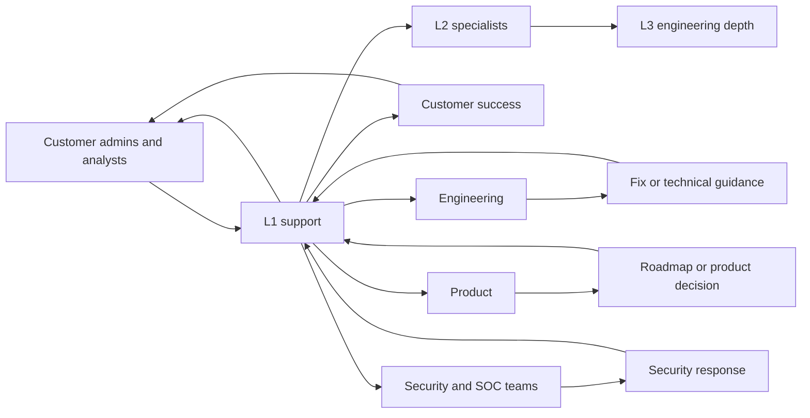
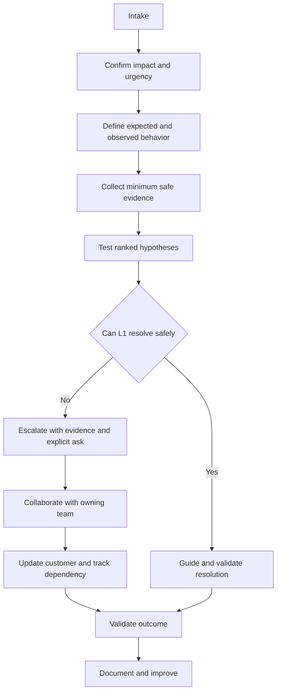
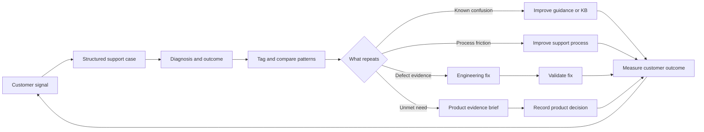
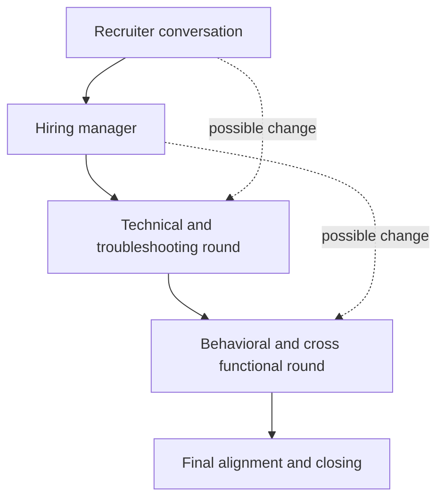
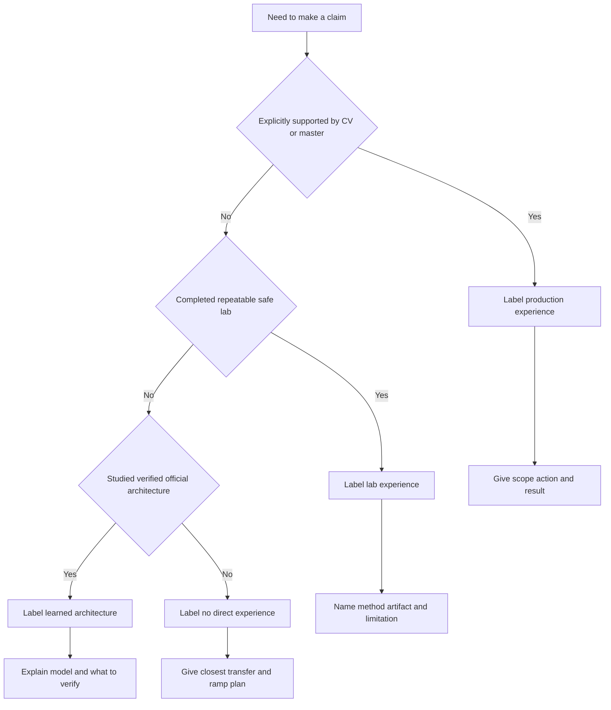
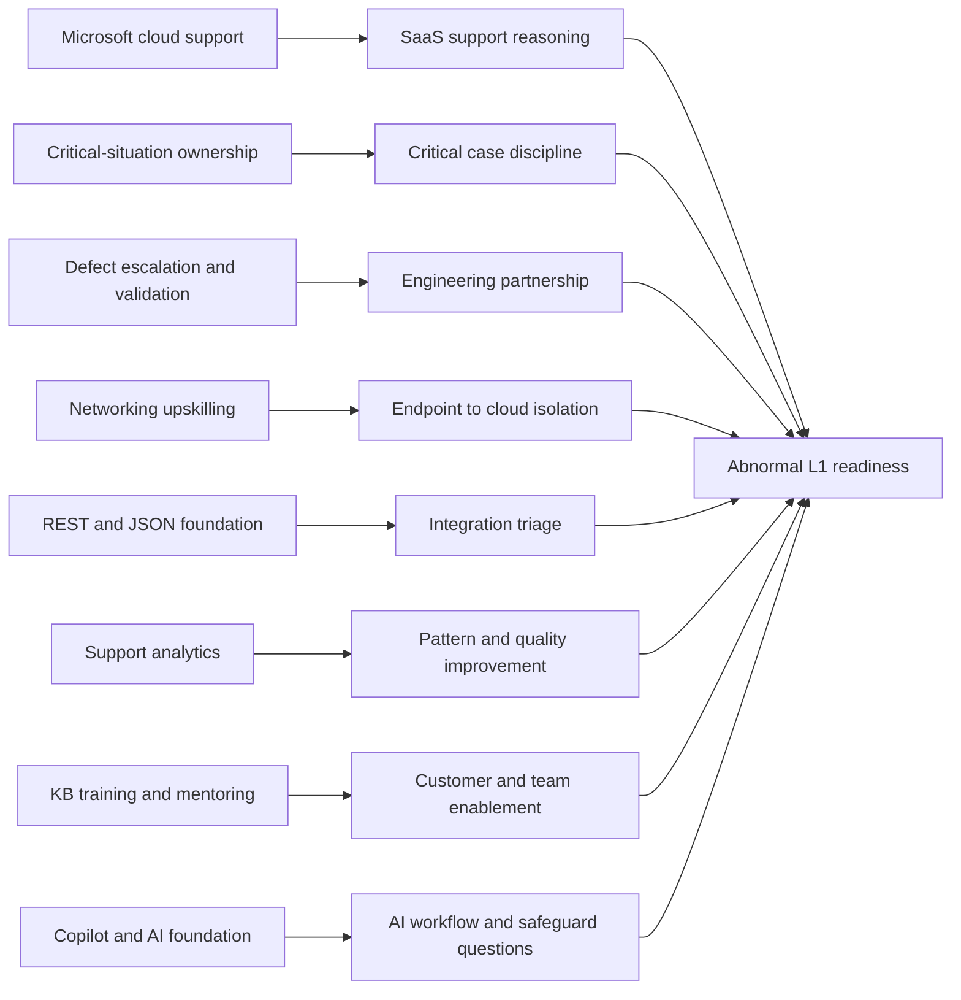
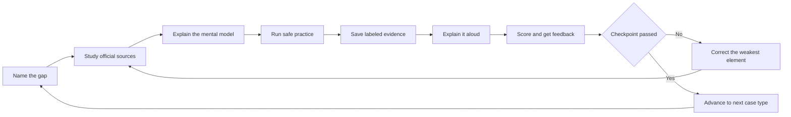

# Part 001 - Role Compass and Honest Candidate Story

> **Purpose:** Build a truthful, repeatable explanation of why you fit an Abnormal AI Level 1 (L1) Technical Support Engineer role, where the gaps are, and how those gaps will be closed.
>
> **Evidence rule:** Every experience claim in this Part is labeled as production experience, lab experience, learned architecture, or no direct experience.
>
> **Currency and source access date:** August 24, 2026.

## Section Goal

By the end of this Part, you should be able to explain the role in plain English, describe how L1 support creates customer and product impact, introduce yourself at three different lengths, answer the major motivation questions, and handle questions about unfamiliar products without exaggeration. You should also leave with a role-fit matrix, a claim-safety ledger, an evidence inventory, a gap-and-ramp plan, and a scored spoken-practice routine.

This is a foundation Part. It does not attempt to teach email security, the Abnormal platform, or every support tool in depth. It establishes the compass used in later Parts: customer impact, evidence, ownership, clear boundaries, and intellectual honesty.

### Beginner term primer

| Term | Plain meaning | Why it matters here |
|---|---|---|
| **Job description or JD** | The employer-supplied statement of responsibilities and qualifications | It defines the role signals this lesson must cover |
| **Level 1 or L1** | The first technical ownership level for an inbound support case | L1 shapes intake, diagnosis, communication, resolution, and escalation quality |
| **Artificial intelligence or AI** | Software designed to perform tasks associated with human reasoning, prediction, language, or decision support | Abnormal publicly positions AI and behavioral context at the center of its security approach |
| **Software as a Service or SaaS** | Software delivered as an online service rather than installed and managed entirely by each customer | The role supports cloud products, tenants, identities, configurations, and integrations |
| **Application Programming Interface or API** | A defined contract through which software systems exchange requests and responses | API questions are a named support surface |
| **Representational State Transfer or REST** | A common style for web APIs that operates on resources through standard HTTP methods | REST concepts help structure integration troubleshooting |
| **JavaScript Object Notation or JSON** | A structured text format commonly used in API requests, responses, and events | Reading JSON helps an engineer compare expected and actual data |
| **Customer Success Manager or CSM** | A partner focused on customer adoption, goals, value, and relationship health | Support and CSMs collaborate but do not own the same work |
| **Security Operations Center or SOC** | The people and processes that monitor and respond to security events | Customer SOC analysts may be important support stakeholders |
| **Knowledge base or KB** | A maintained collection of reusable support guidance | Good case learning can become faster, more consistent future help |
| **Critical situation** | A common enterprise-support term for a high-impact situation requiring structured coordination | It is a real transfer example, not a claim of prior security-incident command |
| **Customer satisfaction or CSAT** | Feedback indicating how customers perceived a support experience | It is one outcome signal, but it must be interpreted with quality and context |

## JD Mapping

This Part supports the following signals from the supplied job description and master curriculum. These are **supplied JD facts**, not assumptions about undocumented internal workflows.

| Supplied JD signal | What this Part develops | Proof you can show |
|---|---|---|
| Enterprise L1 Technical Support Engineer | Role model, ownership flow, escalation boundaries, and first-90-day expectations | Role-fit matrix and ownership explanation |
| Four or more years of customer-facing enterprise support | A CV-grounded account of several years in enterprise support and escalation | 30-, 90-, and 180-second introductions |
| Complex investigations | Transfer from critical-situation work, hypothesis-based diagnosis, escalation, and fix validation | Competency/evidence matrix and practice examples |
| Customer trust and timely communication | Impact-focused updates, expectation management, and truthful uncertainty | Trust language and follow-up handling |
| Configuration, API, behavioral false-positive, and threat cases | Beginner-level case categories and honest gap boundaries | Gap/ramp plan; no claim of prior Abnormal case ownership |
| Engineering and Product collaboration | Defect escalation, evidence packages, fix validation, and recurring-pattern feedback | Ticket-to-improvement explanation |
| CSM onboarding collaboration | Boundary between support diagnosis and customer-success outcomes | Role ecosystem and handoff examples |
| KB, training, case deflection, and support improvement | Transfer from KB/training creation, mentoring, and case-quality work | Knowledge and improvement evidence inventory |
| REST, JSON, analytics, networking, and AI | Transfer bridges that support future technical depth | Transfer map and deliberate-practice plan |
| Customer focus, ownership, learning, and cross-functional culture | Honest self-assessment and outcome-oriented execution | Claim-safety ledger and first-90-day plan |

## Fact, Research, and Inference Boundaries

Three kinds of information appear in this lesson:

| Label | Meaning | Example in this Part |
|---|---|---|
| **Supplied JD fact** | A responsibility, product area, qualification, or named ecosystem recorded in the confirmed master curriculum | The role covers enterprise L1 support and names Cloud Email Security, AI Security Agents, and SaaS Security |
| **Official public research** | High-level company, platform, trust, resource, or culture information on an official Abnormal AI page | Abnormal publicly describes a behavioral security platform and publishes VOICE values on its careers site |
| **Reasoned inference** | A likely interview stage, support boundary, or ramp expectation based on common enterprise support practice | A technical panel may test structured troubleshooting; the exact sequence is not guaranteed |

This distinction matters because a polished answer can still be wrong if it presents an inference as a company fact. The interview-safe pattern is: **name the source, state the confidence, and identify what you would verify.**

## The Role From Zero Knowledge

### What is technical support?

Technical support helps a customer move from an unwanted technical condition to a verified useful outcome. The unwanted condition might be an error, unexpected behavior, a configuration question, an integration failure, a disputed security verdict, or uncertainty about what happened. Support is not merely answering messages. It is an evidence-based service that reduces risk and restores the customer's ability to operate.

An **enterprise** customer is an organization with many users, systems, administrators, dependencies, controls, and business consequences. A change that looks small can affect thousands of people or an important security workflow. Enterprise support therefore requires careful scoping, safe evidence handling, clear ownership, and communication that works for both technical and nontechnical audiences.

**L1**, or Level 1, is the first technical ownership layer for an inbound case. L1 does not mean "unskilled" or "read a script." In a strong support organization, L1 converts an incomplete customer report into a well-defined problem, performs supported diagnostics, resolves known or tractable issues, and creates a high-quality escalation when deeper access or code expertise is needed.

**Analogy:** L1 is like the lead clinician at an intake desk. The clinician does not perform every specialist procedure, but must identify urgency, collect reliable observations, avoid harmful actions, begin appropriate treatment, and route the patient with a useful record. The analogy stops at the fact that software cases do not involve medical diagnosis, and support decisions must follow product policy rather than clinical judgment.

### The role ecosystem

This diagram shows collaboration, not a guaranteed Abnormal reporting structure. Exact teams, tools, and escalation paths must be learned after joining.

### What an L1 Technical Support Engineer is likely to do

Based on the supplied JD, the role should be understood as ownership of inbound enterprise support questions across configuration, APIs, behavioral false positives, and threat investigations. A practical L1 case lifecycle is:

1. Acknowledge the customer and take ownership.
2. Establish the expected behavior and the observed behavior.
3. Scope who or what is affected, when it started, and the business or security impact.
4. Identify changes, reproduction conditions, tenant or object context, and the minimum safe evidence needed.
5. Build more than one possible explanation where uncertainty remains.
6. Run low-risk tests that separate those explanations.
7. Resolve within the supported L1 boundary or escalate with a complete evidence package and an explicit question.
8. Keep the customer informed while collaboration continues.
9. Validate the fix, workaround, or recommendation.
10. Close the loop through case notes, knowledge, trend tagging, or product feedback.

The exact Abnormal console fields, internal runbooks, permissions, service-level targets, and escalation queues are private or unverified here. They must not be invented in an interview.

## Plain-English deep-dive: Ownership Is Not Doing Everything Yourself

**Ownership** means remaining accountable for forward movement and communication. It does not mean refusing help or attempting actions outside one's access, skill, or authorization.

Imagine a package delayed across several carriers. The customer needs one coordinator who knows the current location, the next dependency, the owner of that dependency, and the next update time. The coordinator does not drive every truck. The value is continuity. This analogy stops where security evidence, access controls, and technical validation require specialized rules.

| Ownership behavior | What it sounds like | What ownership is not |
|---|---|---|
| Establishing impact | "I understand that the security team cannot complete its review for these affected users." | Repeating only the error string |
| Naming the next action | "I will compare the affected and working configurations, then update you by 15:00 UTC." | "We are investigating" with no plan |
| Coordinating a dependency | "Engineering is reviewing the reproducible case; I remain your support owner." | Throwing the case over a wall |
| Stating uncertainty | "The logs show correlation, but they do not yet prove causation." | Guessing to sound confident |
| Escalating early enough | "This requires internal telemetry not available at L1, so I am escalating with the timeline and IDs." | Treating escalation as failure |
| Closing with validation | "The customer repeated the failing workflow successfully and confirmed the expected result." | Closing because a change was deployed |

### Support ownership flow

## Adjacent Functions and Ownership Boundaries

Job titles vary by company, so the table below is a decision model, not an Abnormal internal organization chart.

| Function | Primary question it owns | Typical contribution | L1 boundary and partnership |
|---|---|---|---|
| **L1 support** | What is happening, what is the impact, and can supported diagnostics resolve it? | Intake, scoping, evidence, known fixes, communication, validation, escalation quality | Own continuity; do not guess at internals or make unauthorized changes |
| **L2 support** | Does the issue require deeper product, integration, or domain specialization? | Advanced diagnostics, uncommon configurations, deeper log interpretation, complex reproductions | L1 supplies a clean case and stays engaged rather than restarting the investigation |
| **L3 or Engineering** | Is there a defect, service problem, or code-level behavior requiring internal access or change? | Internal telemetry, code investigation, defect fix, service remediation | L1 supplies expected versus actual behavior, reproducibility, evidence, impact, and an explicit ask |
| **Customer Success Manager or CSM** | Is the customer obtaining intended value and progressing toward adoption or success outcomes? | Relationship context, onboarding coordination, adoption, goals, risk, stakeholder alignment | L1 owns technical case execution; CSM aligns broader success and stakeholder context |
| **Product** | Is this expected product behavior, a gap, or a recurring need worth prioritizing? | Requirement interpretation, roadmap decisions, experience tradeoffs, feature evaluation | L1 provides pattern, frequency, impact, evidence, and customer outcome without promising roadmap dates |
| **Security or customer SOC** | What is the threat, exposure, and response decision? | Incident triage, containment, risk acceptance, investigation, recovery | Support explains product evidence and function; the customer's authorized responders own their environment and incident decisions unless a contract says otherwise |
| **Internal security** | Does evidence indicate a risk to the vendor or protected data? | Internal incident process, secure handling, disclosure decisions | L1 follows the security escalation path and avoids independent investigation beyond authorization |

**SOC** means Security Operations Center: the people and processes that monitor and respond to security events. It can be an internal team, a managed service, or a distributed function. An L1 support engineer may collaborate with a customer SOC, but that does not automatically make the support engineer the customer's incident commander.

### Boundary examples

| Scenario | L1 should do | L1 should not do |
|---|---|---|
| Customer disputes a security verdict | Preserve the supplied identifiers, clarify expected outcome, compare relevant safe evidence, follow the supported review path, and communicate uncertainty | Declare the model wrong or expose invented detection logic |
| API request returns an error | Reproduce safely, inspect sanitized request/response details, validate authentication and contract basics, correlate IDs, and isolate the failing layer | Request live secrets or claim backend causation without evidence |
| Customer reports a suspected threat | Establish scope and timeline, preserve minimum evidence, use supported product guidance, and escalate based on severity and boundary | Perform unauthorized actions in the customer's tenant |
| Customer asks for a product change | Clarify the job to be done, impact, frequency, workaround, and evidence; route through the proper Product path | Promise delivery, priority, or date |
| Customer needs onboarding help | Coordinate technical prerequisites and validation with the CSM and customer owners | Replace the CSM's adoption plan or silently assume customer permissions |

## Customer and Product Surfaces

A **surface** is an area where a customer interacts with a product or where a failure can become visible. The supplied JD and master curriculum name Cloud Email Security, AI Security Agents, and SaaS Security. Official public Abnormal material also describes a broader behavioral security platform. This Part uses only high-level public positioning; later Parts will verify current details.

| Surface | Beginner-first meaning | Possible support question category | Claim boundary for you |
|---|---|---|---|
| Cloud Email Security | Cloud-delivered protection and investigation around email threats and related behavior | Configuration, message outcome, suspected miss, false positive, remediation, integration | Learned architecture and future lab only; no direct email-security operations claim |
| AI Security Agents | AI-enabled security workflows or agents that assist or perform bounded security tasks | Permissions, expected action, evidence, safeguards, failure, human approval | Learned architecture only; Copilot/agent experience is transferable but not equivalent |
| SaaS Security | Security visibility and controls around cloud software, identities, permissions, activity, and integrations | Tenant setup, identity, API, webhook, audit event, authorization, unexpected behavior | Microsoft cloud experience transfers; named non-Microsoft ecosystems remain learning targets |
| Customer administration | Settings, roles, permissions, policies, integrations, and user context | Access, configuration drift, onboarding, expected versus actual behavior | Production transfer from Microsoft cloud support, not Abnormal administration |
| API and integration | Software-to-software requests and event exchange | Authentication, JSON payload, status code, rate limit, schema, webhook, correlation | Working knowledge only unless tied to a specific CV example; do not claim production scale |
| Security investigation | A structured attempt to determine what happened and what action is justified | Threat report, false positive, false negative, scope, timeline, recommendation | critical-situation method transfers; security verdict operations are a gap |

An **API**, or Application Programming Interface, is a defined way for software systems to exchange requests and responses. **JSON**, or JavaScript Object Notation, is a common structured text format used in those exchanges. A webhook is an event notification sent from one system to another. These definitions matter because interviewers often test whether a candidate can explain a technical term before troubleshooting it.

## Impact Over Activity

Activity is what the engineer did. Impact is what changed for the customer, team, or product because of that work.

| Activity-only statement | Impact-oriented statement |
|---|---|
| "I collected logs and escalated." | "I narrowed the failure to a reproducible boundary, supplied the IDs and comparison evidence Engineering needed, maintained the customer cadence, and validated the fix against the original scenario." |
| "I wrote a KB article." | "I converted a repeat investigation into a reusable diagnostic path so engineers and customers could reach the correct next action faster." |
| "I attended a critical call." | "I kept the critical investigation structured by separating impact, observations, owners, and next checkpoints, which reduced confusion while the technical work continued." |
| "I analyzed backlog data." | "I used backlog and case-quality patterns to identify where work was aging or repeatedly returning, then supported a targeted process improvement." |

Useful impact categories include restored operation, reduced uncertainty, reduced risk, faster diagnosis, fewer handoff losses, better customer decisions, reusable knowledge, safer evidence handling, and product improvement. Use only the category that a real example supports. Do not invent a percentage or financial result.

## Plain-English deep-dive: Customer Trust Is Operational

Trust is not a friendly tone alone. In support, trust is the customer's justified belief that the engineer is competent, candid, careful with evidence, and dependable about next steps.

Think of trust as a bank balance. Clear commitments, useful updates, accurate statements, and early correction make deposits. Silence, vague promises, hidden uncertainty, and repeated requests for the same evidence make withdrawals. The analogy has limits: trust is not a numeric score, and one serious security or privacy mistake may not be offset by many small positive interactions.

### The trust equation

| Trust input | Observable behavior | Failure mode |
|---|---|---|
| Competence | Asks discriminating questions and explains why evidence matters | Collects everything without a hypothesis |
| Candor | Separates observation, inference, and unknowns | Presents a guess as root cause |
| Reliability | Gives a specific next update time and meets it | Waits for progress before communicating |
| Care | Minimizes and redacts sensitive data | Requests secrets or unnecessary customer content |
| Empathy | Connects the plan to business or security impact | Uses scripted sympathy without changing action |

A good update can be short:

> I understand that the affected workflow is delaying the security team's review for 24 users. So far, the client-side request succeeds through TLS but receives an authorization response at the API boundary. I am comparing the affected role assignment with a working user and will update you by 15:00 UTC. Please do not send tokens; the request ID and redacted response body are sufficient for this step.

This update names impact, current evidence, the next discriminating test, time, and a privacy boundary.

## Ticket-to-Product-Improvement Loop

A support case can create value beyond one resolution when it becomes structured evidence for knowledge, quality, or product decisions.

The loop requires disciplined case data. One complaint may reveal a real defect, but it does not prove a widespread pattern. Ten similar cases may still have different causes. A useful improvement brief distinguishes:

- **Frequency:** How often does the pattern occur in the available data?
- **Impact:** What customer outcome or risk is affected?
- **Evidence:** Which observations are common, and which are inferred?
- **Current path:** Is there a workaround, known article, or avoidable handoff?
- **Proposed change:** What decision, experiment, fix, or content update is requested?
- **Measure:** How will the team know the intervention helped?

Your KB/training work, case-quality work, mentoring, and CSAT/backlog analysis are relevant transfers here. The safe claim is that these experiences built habits useful for knowledge and process improvement, not that you have already operated Abnormal's feedback systems.

## What Good First-90-Day Performance Looks Like

This is a **reasoned ramp model**, not a published Abnormal plan. The manager's actual expectations, access rules, quality bar, and metrics take priority.

| Period | Primary objective | Observable good performance | Questions to ask the manager |
|---|---|---|---|
| Days 1-30 | Learn the environment and demonstrate safe habits | Completes product and security training; maps case types and ownership; shadows cases; uses approved evidence handling; writes accurate notes; asks focused questions; practices known workflows | Which cases may I own now? What evidence is sensitive? What defines a high-quality case? Which mistakes create the greatest risk? |
| Days 31-60 | Own bounded cases with review | Handles selected intake and known paths; communicates on time; forms hypotheses; uses runbooks without blindly following them; escalates with complete context; incorporates coaching | Where is my diagnosis slow or noisy? Which escalations are avoidable? Which case types should I add next? |
| Days 61-90 | Build consistency and contribute learning | Owns a broader approved case mix; validates outcomes; identifies a knowledge or process improvement; demonstrates reliable hygiene; explains current gaps and next ramp goals | Which quality and customer outcomes show readiness? What recurring issue can I help reduce? What deeper specialty should I build? |

### Outcome signals versus vanity signals

| Strong signal | Why it matters | Caution |
|---|---|---|
| Accurate scoping and safe evidence | Prevents wasted effort and protects customers | Speed without accuracy can increase risk |
| Useful first response and dependable cadence | Establishes trust and reduces uncertainty | Message count alone is not value |
| Appropriate L1 resolution | Shows growing product and diagnostic fluency | Do not avoid escalation to improve a statistic |
| High-quality escalation | Shortens specialist time to a decision | Escalation rate alone can be misleading |
| Verified customer outcome | Confirms the original problem changed | A deployed fix is not proof of success |
| Reusable learning | Improves future support and onboarding | Content must be accurate, findable, and maintained |

## Likely Interview Stages and Evaluation Criteria

The supplied material does not guarantee the interview sequence. The following funnel is a preparation model based on common enterprise technical-support hiring. You should confirm the actual process with the recruiter.

### Interview-stage map

| Possible stage | What may be evaluated | Your preparation focus | Evidence to use |
|---|---|---|---|
| Recruiter conversation | Motivation, communication, basic fit, location/logistics, honest career story | 30- and 90-second introductions; why move, why Abnormal, why now | Several years of enterprise support; targeted learning plan |
| Hiring manager | Ownership, judgment, customer trust, learning speed, role expectations | critical-situation ownership, ambiguity, escalation, fix validation, coaching response | Real support examples from the CV boundary |
| Technical fundamentals | Reasoning across SaaS, APIs, networking, identity, email/security basics | Define terms, state assumptions, form hypotheses, choose evidence, admit gaps | Microsoft cloud transfer plus labs and learned architecture |
| Troubleshooting scenario | Structured intake, prioritization, safety, communication, escalation | Expected/actual, scope, impact, timeline, change, evidence, next test | Evidence-first method and diagnostic-tool familiarity |
| Behavioral or cross-functional | Collaboration, conflict, mentoring, customer empathy, intellectual honesty | STAR stories with clear personal actions and outcomes | Engineering/Product escalation, KB/training, mentoring, analytics |
| Final or closing | Consistency, values, questions, growth plan, mutual fit | Concise value proposition, gap plan, thoughtful questions | Claim-safety ledger and first-90-day model |

### Evaluation criteria translated into observable behavior

| Criterion | Weak signal | Strong signal |
|---|---|---|
| Technical reasoning | Names many tools | Selects a tool because it can disprove a specific hypothesis |
| Customer ownership | Says "I care about customers" | Explains impact, cadence, owners, dependencies, and validation |
| Communication | Gives a long technical monologue | Adapts detail to audience while preserving accuracy |
| Security judgment | Tries to appear decisive | Minimizes data, respects authorization, states uncertainty, escalates risk |
| Learning agility | Says "I am a fast learner" | Names the gap, closest foundation, practice method, artifact, feedback, and checkpoint |
| Collaboration | Describes sending an escalation | Shows how the evidence and explicit ask enabled the next team to act |
| Intellectual honesty | Hides unfamiliar tools | Labels evidence tier and demonstrates a credible ramp plan |
| Impact | Lists tasks | Connects actions to a verified customer, team, or product outcome |

## Candidate Honesty Note

You have **production experience** supported by the master/CV in enterprise customer-facing support and escalation, including SharePoint Online, OneDrive, Sync Client, Copilot, critical situations, customer and partner communication, Engineering/Product escalation, fix validation, KB/training, mentoring, and CSAT/backlog/case-quality analysis.

You have **working knowledge or upskilling**, not blanket production ownership, in networking concepts and diagnostic tools; REST APIs, Postman, cURL, JSON, SQL/PostgreSQL, Power BI, and Python; Azure and AD/Entra fundamentals; SSO, SAML, OAuth; Power Automate/Apps; GPT/LLM fundamentals; GitHub, Confluence, Linux, and Kubernetes.

You must **never claim direct production experience** with Abnormal AI, email-security operations, Google Workspace, Slack, Okta, Splunk, CrowdStrike, Cortex SOAR, Zendesk, Salesforce, Jira, or Zoom. Labs completed during preparation are lab experience. Official-document study is learned architecture. Neither becomes production experience through confident wording.

## Plain-English deep-dive: The Four Evidence Tiers

An evidence tier answers, "What kind of proof supports this claim?" It prevents a candidate from blending a real transferable skill with an unfamiliar product until the difference disappears.

| Tier | Definition | Safe opening | candidate-specific example |
|---|---|---|---|
| **Production experience** | Work explicitly supported by your CV in a live customer-facing role | "In my prior enterprise support role, I..." | Owned complex Microsoft cloud cases, communicated with customers and partners, escalated defects, and validated fixes |
| **Lab experience** | A repeatable safe simulation completed during preparation with an inspectable artifact | "I have not used that in production. In a local lab, I..." | A future sanitized REST request, packet capture, synthetic log timeline, or email-header exercise |
| **Learned architecture** | Understanding gained from official documentation and structured study without operational ownership | "My current understanding from official documentation is..." | High-level Abnormal product concepts or a Google Workspace integration flow |
| **No direct experience** | A gap not yet supported by production, lab, or sufficiently verified study | "I have not used that directly yet. The closest transferable experience is..., and my ramp plan is..." | Named platforms such as Splunk or Cortex SOAR before the relevant study/lab is complete |

**Analogy:** Evidence tiers are like labels on food: they tell the interviewer what is actually inside the claim. A polished package cannot turn "learned" into "production." The analogy stops because professional evidence requires context and judgment, not just a fixed ingredient list.

### Evidence-tier decision

## Candidate-specific Transferable-Strength Matrix

| Existing evidence | Evidence tier | What transfers to this role | Safe bridge sentence | Limit that must remain visible |
|---|---|---|---|---|
| Several years in enterprise customer-facing support and escalation | Production experience | Enterprise expectations, ambiguity, ownership, prioritization, customer communication | "I already understand the discipline of owning complex enterprise cases; I am applying that discipline to a new security product domain." | enterprise support is not Abnormal or email-security operations |
| SharePoint Online, OneDrive, Sync Client, and Copilot support | Production experience | SaaS tenancy, client/cloud boundaries, permissions/configuration reasoning, service evidence | "My prior cloud background gives me a useful foundation for tenant, identity, configuration, and integration questions." | Do not imply Exchange Online security operations or Abnormal administration |
| Critical situation and complex investigation work | Production experience | Impact scoping, structured cadence, evidence, multi-team coordination, pressure management | "critical-situation work taught me to keep impact, facts, owners, and next checkpoints clear while the diagnosis evolves." | A critical support incident is not automatically a security incident |
| Engineering/Product escalation and fix validation | Production experience | High-quality handoffs, expected/actual behavior, reproduction, explicit asks, regression thinking | "I know escalation is successful only when the receiving team can act and the customer outcome is later validated." | Do not claim Abnormal's internal escalation workflow |
| Customer and partner communication | Production experience | Technical/nontechnical translation, expectation management, de-escalation, trust | "I adapt depth to the audience without hiding uncertainty or losing the next action." | Use real examples; do not invent security events |
| KB/training creation, mentoring, and case-quality work | Production experience | KCS-style knowledge reuse, onboarding, coaching, quality, deflection thinking | "I enjoy turning one investigation into reusable guidance and helping others apply it." | Do not claim vendor-specific KCS tooling or metrics |
| CSAT, backlog, and case-quality analysis | Production experience | Support analytics, patterns, prioritization, process-improvement hypotheses | "I have used support data to understand quality and workload patterns, and I would bring that outcome-oriented mindset here." | Avoid unsupported ownership, scale, or numeric results |
| Networking topics and tools such as Wireshark, Netsh, Network Monitor, Procmon, DevTools, HAR, and Fiddler | Working familiarity and upskilling | Layered endpoint-to-cloud diagnosis and evidence collection | "I am strengthening networking deliberately and can explain how I would isolate DNS, TCP, TLS, HTTP, proxy, client, and service boundaries." | Not network-engineering production ownership; state actual tool depth |
| REST, Postman, cURL, JSON, SQL/PostgreSQL, Power BI, and Python | Working knowledge | API reproduction, payload reading, log/data analysis, support automation | "I have a working foundation and am converting it into repeatable support labs and artifacts." | Do not claim all tools were used at production scale |
| Azure, AD/Entra fundamentals, SSO/SAML/OAuth, Power Automate/Apps | Fundamentals or working knowledge | Identity, authorization, provisioning, integration, automation reasoning | "The identity fundamentals give me a model for asking where authentication, authorization, consent, or configuration failed." | Okta and vendor-specific integrations remain learned/lab targets |
| Copilot, Copilot Studio/agents, and GPT/LLM fundamentals | Production experience where CV-supported plus learned AI concepts | AI interaction, safeguards, prompting, evaluation, and human verification | "My AI experience helps me ask good questions about grounding, permissions, evaluation, and human review." | Generative AI experience is not Abnormal behavioral-detection expertise |

### Transfer map

## Competency and Evidence Matrix

The purpose of this matrix is not to memorize one answer. It is to route each likely competency to the strongest truthful evidence.

| Competency | Strongest available evidence | Evidence tier | Interview proof structure | Missing proof to build |
|---|---|---|---|---|
| Enterprise case ownership | Several years of enterprise customer-facing support and escalation | Production | Situation, impact, personal ownership, diagnosis, cadence, outcome | Select one precise case story and remove confidential details |
| Critical incident discipline | critical-situation work | Production | Trigger, impact, roles, facts versus unknowns, checkpoints, resolution validation | Practice a two-minute STAR answer |
| Customer trust | Technical and nontechnical customer/partner communication | Production | Concern heard, expectation set, update rhythm, difficult message, confirmed outcome | Add a real de-escalation example |
| Complex troubleshooting | Microsoft cloud investigation plus diagnostic familiarity | Production plus working familiarity | Expected/actual, scope, hypotheses, discriminating evidence, escalation | Build current security/API labs |
| Engineering collaboration | Defect escalation and fix validation | Production | Minimal repro, evidence, explicit ask, collaboration, validation | Prepare a sanitized escalation example |
| Product collaboration | Engineering/Product escalation and support pattern work | Production within stated scope | Customer job, evidence, impact, pattern, decision or feedback | Avoid implying roadmap authority |
| Knowledge and enablement | KB/training creation, mentoring | Production | Repeated problem, audience, content or coaching, adoption signal | Select one content and one mentoring story |
| Operational improvement | CSAT, backlog, case-quality analysis | Production within stated scope | Data observed, hypothesis, intervention, outcome or lesson | Do not add unsupported metrics |
| Email-security domain | Structured curriculum and future synthetic labs | Learned architecture or no direct experience today | Admit gap, explain current model, name safe practice and checkpoint | Complete Parts 019-047 and portfolio evidence |
| Abnormal product knowledge | Official public research and future product Parts | Learned architecture | Attribute high-level statement, avoid internals, ask what to verify | Complete Parts 011-018 using current official sources |
| API troubleshooting | Working REST/JSON/Postman/cURL knowledge | Working knowledge, then lab | Explain request path, sanitized evidence, expected status, correlation | Build versioned public/local API lab |
| Networking | Upskilling and working diagnostic-tool familiarity | Working familiarity, then lab | Layer, hypothesis, tool, expected observation, next action | Build DNS/TCP/TLS/HTTP evidence pack |
| AI reasoning | Copilot, agent, GPT/LLM foundation | Production where supported plus learned concepts | Use case, safeguard, verification, limitation | Learn behavioral AI without inferring internals |

## Honest Gap Matrix and Ramp Priorities

| Gap | Current honest tier | Why it matters | First proof step | Readiness checkpoint |
|---|---|---|---|---|
| Abnormal AI product operation | No direct experience; public learned architecture only | Core product context | Study official platform, resources, trust, and role material; make a sourced product map | Explain verified public capabilities and list unknown internal behavior |
| Direct email-security operations | No direct experience | Major case domain | Complete synthetic message, mail-flow, authentication, and threat-case exercises | Analyze a harmless synthetic case and state evidence limits |
| Google Workspace | No direct experience; future learned architecture | Named ecosystem | Compare official Google architecture with the Microsoft conceptual model | Explain flow and failure boundaries without claiming use |
| Slack and Zoom | No direct experience | Named SaaS/support ecosystem | Study official app, permission, event, and admin concepts; simulate locally where possible | Explain a generic integration triage path |
| Okta | No direct experience | Identity integration target | Map directory, SSO, OAuth/OIDC, SCIM, roles, and logs from official docs | Diagnose a synthetic identity/provisioning scenario |
| Splunk, CrowdStrike, and Cortex SOAR | No direct experience | Security ecosystem targets | Build a vendor-neutral SIEM/EDR/SOAR map and synthetic event flow | Explain each category and its integration evidence |
| Zendesk, Salesforce, and Jira | No direct experience | Support workflow targets | Learn ticket, CRM, and engineering-work concepts; map from familiar support processes | Explain purposes and handoffs without claiming tool operation |
| Security threat verdicts and false-positive analysis | No direct experience | Likely ticket category | Learn email evidence, threat taxonomy, false-positive tradeoffs, and synthetic investigation | Give an evidence-based verdict with uncertainty and escalation criteria |
| Deeper networking and API fluency | Upskilling or working knowledge | Frequent cross-system failure boundaries | Repeat local/public labs and explain captures aloud | Choose a discriminating test rather than listing tools |

Prioritize gaps by **role frequency x customer impact x current distance from competence**. Do not try to sound equally advanced in every area. A credible candidate can be strong in enterprise support, developing in security architecture, and explicit about named-tool gaps.

## Claim-Safety Decision Tree and Troubleshooting Guide

Use this whenever an interviewer asks, "Have you used X?"

1. **Is X explicitly supported by the CV/master as production work?**
   - Yes: state the specific scope, personal action, and result.
   - No: continue.
2. **Have you completed a repeatable safe lab involving X or a vendor-neutral equivalent?**
   - Yes: say "not in production," describe the lab and artifact, and state its limit.
   - No: continue.
3. **Have you studied X through current official documentation?**
   - Yes: label it learned architecture, explain only verified concepts, and name what you would validate.
   - No: say you have no direct experience.
4. **What is the nearest honest transfer?**
   - Name the shared problem or method, not a false tool equivalence.
5. **What is the ramp plan?**
   - Give a concrete source, exercise, artifact, feedback method, and checkpoint.

### Symptom-to-action claim troubleshooting

| Symptom in your answer | Likely cause | Quick test | Correction |
|---|---|---|---|
| You keep saying "we" | Personal contribution is unclear | Can the interviewer identify your decision or action? | Use "I" for your action and "we" for team outcome |
| You name a tool but cannot describe evidence | Keyword memorization | Can you name input, output, and decision enabled by the tool? | Return to the underlying protocol or support problem |
| A lab sounds like customer work | Tier label was omitted | Did you say local, public, synthetic, and non-production? | Label the artifact before describing it |
| Transfer sounds like equivalence | Shared method and product-specific gap were blended | Would the sentence imply prior operation of the target product? | State "the method transfers; the product workflow is new" |
| You sound uncertain after admitting a gap | The answer stopped at "no" | Is there a closest foundation and measured ramp step? | Add transfer, plan, artifact, and checkpoint |
| You sound overconfident | Observation and inference are mixed | What source proves the statement? | Attribute the source and state what remains unverified |
| Answer becomes too long | No structure or priority | Can the first 30 seconds stand alone? | Lead with answer, evidence, relevance, then stop |

## Plain-English deep-dive: Building an Answer That Is Both Strong and True

A strong interview answer is not the longest answer. It gives the interviewer enough evidence to predict future performance.

Use **CLEAR**:

| Step | Meaning | Prompt |
|---|---|---|
| **C - Claim** | Answer the question directly | What is the one-sentence answer? |
| **L - Label** | Name the evidence tier | Production, lab, learned architecture, or no direct experience? |
| **E - Evidence** | Give a concrete example or method | What did you observe, decide, do, or produce? |
| **A - Application** | Connect it to the target role | Why does this predict useful performance here? |
| **R - Restraint and ramp** | State the boundary and next learning step | What must not be overstated, and how will the gap close? |

### Answer-construction flow

```mermaid
flowchart LR
    Question[Listen for the real question] --> Claim[Give direct claim]
    Claim --> Label[Label evidence tier]
    Label --> Evidence[Provide concrete evidence]
    Evidence --> Relevance[Connect to role outcome]
    Relevance --> Boundary[State boundary if needed]
    Boundary --> Ramp[Give ramp or next validation]
    Ramp --> Stop[Stop and invite follow up]
```

### Worked example: unfamiliar platform

**Question:** "Have you supported Splunk?"

**Weak answer:**

> Yes, I am familiar with Splunk and security monitoring tools.

Why it fails: "familiar" hides the evidence tier and can be heard as operational experience.

**Strong truthful answer:**

> I have not used Splunk directly in production. My closest transferable experience is evidence-driven enterprise support, along with working knowledge of logs, SQL-style filtering, and support analytics. I am treating Splunk as a learned and lab target: I would start by understanding the event fields, time range, source, correlation identifiers, and the exact search needed to test a case hypothesis. I would not represent that as Splunk operating experience until I had completed the relevant lab and could show the artifact.

Why it works: it gives a direct "no," preserves relevant value, demonstrates method, and avoids tool equivalence.

### Worked example: security-domain gap

**Question:** "You have not worked in email security. Why should we consider you?"

**Weak answer:**

> Email security is similar to Microsoft 365, so I can learn it quickly.

Why it fails: it minimizes a real domain gap and treats broad Microsoft cloud work as equivalent.

**Strong truthful answer:**

> Direct email-security operations are a gap, and I would not describe my SharePoint, OneDrive, Sync Client, or Copilot support as equivalent. What I do bring is several years of enterprise case ownership: complex investigation, critical-situation discipline, customer communication, Engineering and Product escalation, fix validation, and knowledge creation. Those methods are immediately useful in L1 support. I am closing the domain gap through a structured email-security curriculum and safe synthetic evidence labs, with checkpoints that require me to explain the protocol, investigate a case, preserve evidence, and state when to escalate.

### Worked example: impact

**Weak answer:**

> I have handled complex cases and worked with Engineering.

**Strong truthful answer template:**

> In a enterprise support case involving [sanitized real situation], the customer impact was [real impact]. I owned [your actions], narrowed the issue by [real evidence or comparison], and escalated with [reproduction, identifiers, expected/actual behavior, or other real evidence]. I then [maintained communication and validated the fix]. The outcome was [verified result without invented numbers]. That experience transfers because this role also needs an L1 engineer who can make complex cases actionable for both customers and Engineering.

You must fill bracketed fields only with a real, nonconfidential example before using the answer.

## Ready-to-Practice Introductions

These scripts are starting points, not claims to recite without checking. Replace generic phrases with real examples while preserving the evidence boundaries.

### 30-second introduction

> I am you, and I bring several years of customer-facing enterprise support and escalation experience across SharePoint Online, OneDrive, Sync Client, and Copilot. My strengths are owning complex investigations, communicating clearly during critical situations, building actionable Engineering and Product escalations, validating fixes, and turning learning into KBs, training, and mentoring. I am now moving deliberately into AI-driven security support. I do not claim direct Abnormal or email-security operations experience; I bring a proven support foundation and a concrete technical ramp plan.

### 90-second introduction

> I am you. For several years, I have worked in customer-facing enterprise support and escalation, with experience across SharePoint Online, OneDrive, Sync Client, and Copilot. The common thread in my work is taking an ambiguous, high-impact customer problem and creating structure: clarifying the expected and actual behavior, gathering useful evidence, coordinating during critical situations, escalating defects to Engineering or Product with actionable context, keeping technical and nontechnical stakeholders informed, and validating the eventual fix.
>
> I have also contributed through KB and training creation, mentoring, case-quality work, and analysis of CSAT and backlog patterns. Alongside that production foundation, I have been strengthening networking, REST and JSON, diagnostic tools, analytics, identity concepts, and AI fundamentals.
>
> I am interested in this L1 Technical Support Engineer role because it combines customer ownership, technical investigation, AI, SaaS, and security. I want to be precise about my gaps: I have not operated Abnormal AI, direct email-security workflows, or the named non-Microsoft security platforms in production. I am closing those gaps through official-source study and safe, reproducible labs. What I can contribute immediately is disciplined enterprise support; what I am prepared to earn is product and security depth.

### 3-minute introduction

> I am you, and my core professional background is several years in customer-facing enterprise support and escalation. My supported areas include SharePoint Online, OneDrive, Sync Client, and Copilot. That experience taught me that a strong support engineer does more than identify a technical fix. The engineer has to understand customer impact, separate observations from assumptions, build a testable investigation, communicate clearly as evidence changes, and keep ownership across team boundaries.
>
> Some of my strongest transferable experiences come from complex cases and critical-situation work. In those situations, I learned to keep the problem statement, scope, timeline, owners, and next checkpoints visible while technical teams worked under pressure. I have collaborated with Engineering and Product through defect escalation and fix validation, so I understand that a useful escalation needs expected versus actual behavior, reproduction details, relevant evidence, and a clear ask. I also understand that the case is not complete when a fix is proposed; the original customer scenario needs to be validated.
>
> I have built customer trust across technical and nontechnical audiences, and I have tried to make support knowledge compound through KB and training creation, mentoring, and case-quality work. My experience with CSAT, backlog, and case-quality analysis also gives me an operational view: activity matters only when it improves customer outcomes, support quality, or future efficiency.
>
> Technically, I am building on Microsoft cloud experience with focused upskilling in TCP/IP, DNS, HTTP and HTTPS, TLS, proxies and firewalls, Wireshark and Windows diagnostic tools, browser evidence, REST APIs, Postman, cURL, JSON, SQL, Power BI, Python, identity concepts, and AI fundamentals. I describe that depth carefully: some areas are working knowledge or labs, not production ownership.
>
> I am making this move because Abnormal sits at an intersection that fits both my strengths and my learning direction: enterprise customer support, behavioral AI, cloud integrations, and high-consequence security outcomes. Official Abnormal material emphasizes stopping cybercrime with AI, behavioral context, customer impact, ownership, intellectual honesty, and an AI-native way of working. Those themes are meaningful to me, but I would not pretend that public research equals product operation.
>
> I have no direct Abnormal AI or email-security operations experience today, and I have not used Google Workspace, Slack, Okta, Splunk, CrowdStrike, Cortex SOAR, Zendesk, Salesforce, Jira, or Zoom in production. My value proposition is honest: I can bring mature enterprise-support ownership, evidence-based escalation, communication, learning, and improvement habits on day one, while following a measurable plan to build the product, security, API, and ecosystem depth the role requires.

## Motivation Answers

### Why this move?

> I am not moving away from support; I am moving toward a support domain where the technical and customer stakes are especially meaningful. My prior experience has shown me that I do my best work when a complex cloud problem requires structured investigation, cross-team collaboration, and clear customer communication. AI-driven security support adds email, identity, SaaS, API, and threat context to that foundation. The domain is new, but the support discipline is proven.

### Why Abnormal AI?

> I am interested in Abnormal because its official public material places behavioral AI at the center of protecting email, identity, and AI-related surfaces, and states its mission as stopping crime with AI. The careers material also emphasizes velocity, ownership, intellectual honesty, customer obsession, and excellence. Those are relevant to how I want to work: move with purpose, own outcomes, be factual about uncertainty, and make the work useful to customers. I know public pages do not reveal private product behavior, so I see this as a reason to learn, not a claim that I already know the platform.

### Why support?

> Support combines the things I have repeatedly enjoyed and developed: technical investigation, customer trust, communication under ambiguity, collaboration with Engineering and Product, and turning one case into reusable knowledge. L1 is especially attractive because the first owner shapes the quality of everything that follows. Good intake, evidence, communication, and escalation can materially change both customer experience and engineering efficiency.

### Why now?

> I have a mature enterprise-support base and a clear view of the next depth I want to build. My work with Microsoft cloud and Copilot, together with focused learning in networking, APIs, identity, analytics, and AI, makes this a deliberate transition rather than an impulsive one. Now is the right point to apply those strengths in a security-focused SaaS environment and be measured against a concrete ramp plan.

### Why you?

> I offer a combination of proven enterprise-support ownership and honest learning agility. I have handled complex Microsoft customer situations, critical-situation communication, Engineering and Product escalation, fix validation, knowledge creation, mentoring, and support analytics. I will not overstate my security-product experience. Instead, I can show how I investigate, communicate, learn, and improve, along with the artifacts and checkpoints I am using to close the domain gaps.

## Common Failure Modes and Red-Flag Language

| Red-flag wording | Why it is risky | Better wording |
|---|---|---|
| "I know Abnormal AI." | Can imply product operation or internal knowledge | "I have studied Abnormal's current public material; I have not operated the platform." |
| "I have M365 email-security experience." | The master supports SharePoint, OneDrive, Sync Client, and Copilot, not direct email-security operations | "My prior cloud support experience transfers to tenant and integration reasoning; email-security operations are a gap." |
| "I have worked with Splunk and CrowdStrike concepts." | "Worked with" can imply hands-on production use | "I am learning their SIEM and EDR roles through official architecture and future synthetic labs." |
| "All SaaS tools are similar." | Ignores product contracts, security models, and workflows | "The troubleshooting method transfers, but each product's permissions, data, APIs, and evidence must be learned." |
| "I can learn anything quickly." | Unsupported and unmeasurable | "For this gap, my plan is source, exercise, artifact, feedback, and checkpoint." |
| "Engineering fixed it." | Hides personal contribution and validation | "I supplied the reproducible evidence, maintained ownership, and validated the fix against the original scenario." |
| "The root cause was..." without proof | Confuses correlation or workaround with causation | "The evidence supports this hypothesis; root cause requires this additional validation." |
| "I used AI to solve cases." | May imply unsafe data use or unverified output | "Where authorized, AI assisted a bounded task; I protected data and verified the output before use." |
| "I would collect all logs." | Violates minimization and creates noise | "I would collect the minimum authorized evidence needed to separate the leading hypotheses." |

### Interviewer follow-up handling

| Follow-up | Response pattern | Example opening |
|---|---|---|
| "What exactly did you do?" | Separate personal action from team action | "My responsibility was to define the repro, correlate the evidence, and maintain the customer cadence..." |
| "How do you know it worked?" | Name validation against the original symptom | "We repeated the customer's failing workflow under the same relevant conditions..." |
| "What was the root cause?" | State evidence strength and avoid false certainty | "The confirmed cause was documented by the owning team as..." or "We confirmed the corrective path, but I would not claim code-level cause from the evidence I had." |
| "Have you used this tool?" | Give direct tier, transfer, and ramp | "Not in production. My closest foundation is..., and the artifact I am building is..." |
| "Why should we take the risk?" | Connect proven methods to measurable ramp | "The domain ramp is real; the lower-risk part is that enterprise ownership, escalation quality, and customer communication are already proven." |
| "What would you do first?" | Start with impact, safety, expected/actual, and discriminating evidence | "First I would confirm impact and whether any immediate containment or escalation rule applies..." |
| "What if your first hypothesis is wrong?" | Show falsifiability and adaptation | "I would record the observation that disproved it, update the hypothesis ranking, and choose the next test with the highest information value." |

## Gap and Ramp Plan

The ramp should be a closed loop, not a reading list. Each topic must move through understanding, practice, evidence, feedback, and correction.

### First ramp sequence

| Sequence | Focus | Deliverable | Pass condition |
|---:|---|---|---|
| 1 | Role, honesty, and customer ownership | This Part's portfolio lab | Can answer role-fit and gap questions without claim drift |
| 2 | Security and evidence safety | Risk, controls, incident, and privacy models | Can name immediate safety and escalation boundaries |
| 3 | Abnormal public product context | Dated source map | Can distinguish verified public fact from inference |
| 4 | Email and threat fundamentals | Synthetic message and investigation artifacts | Can trace evidence and avoid unsupported verdicts |
| 5 | SaaS identity and integrations | Permission and event-flow maps | Can isolate identity, authorization, configuration, and API boundaries |
| 6 | Networking, APIs, and logs | Local/public evidence pack | Can choose tests from hypotheses and correlate identifiers |
| 7 | L1 operations and communication | End-to-end synthetic case | Can own intake through validation and knowledge capture |
| 8 | Mock interviews | Timed scorecards and correction log | Can answer clearly under follow-up pressure |

## Daily and Weekly Practice Plan

### Daily 35-minute routine

| Time | Practice | Output |
|---:|---|---|
| 5 minutes | Review memory hooks and one evidence-tier decision | One corrected claim if needed |
| 10 minutes | Speak one 30- or 90-second answer without notes | Audio recording |
| 10 minutes | Answer one follow-up using CLEAR | Short scorecard |
| 5 minutes | Study one official-source claim and its limit | Dated source-ledger entry |
| 5 minutes | Rewrite one activity statement as impact | One improved evidence sentence |

### Weekly rhythm

| Day | Focus | Standard |
|---|---|---|
| Monday | Role and motivation | Deliver all introduction lengths and one "why" answer |
| Tuesday | Production evidence | Build or refine one real STAR story without confidential data |
| Wednesday | Technical transfer | Explain one support-to-security bridge and its limit |
| Thursday | Gap response | Practice three unfamiliar-tool questions without defensiveness |
| Friday | Troubleshooting | Work one scenario from impact to escalation and validation |
| Saturday | Mock round | Record 20-30 minutes with follow-ups and score it |
| Sunday | Review | Identify the weakest criterion and set next week's correction target |

The goal is not word-for-word memorization. It is stable structure under pressure. If a script sounds memorized, reduce it to three anchors: **evidence, relevance, boundary**.

## Role Compass and Claim-Safety Portfolio Lab

### Lab purpose

Build a local, non-production portfolio package that makes role fit, claims, gaps, and spoken practice inspectable. This lab uses no Abnormal account, customer data, production logs, private documentation, live security testing, or third-party scanning.

### Safety classification

| Item | Rule |
|---|---|
| Environment | Local text files, spreadsheet, and optional local audio only |
| Data | Synthetic prompts and sanitized CV facts from the confirmed master |
| Prohibited data | Customer names, tenant IDs, case numbers, emails, secrets, internal URLs, private logs, or confidential screenshots |
| Network activity | Only ordinary browsing of official public pages; no scanning, probing, or automated collection |
| Product access | No Abnormal platform access is required or implied |
| Honest label | Every artifact must use one approved evidence label |

### Prerequisites

1. A local folder controlled by you.
2. A Markdown editor or spreadsheet application.
3. The confirmed master curriculum and this Part.
4. A timer.
5. An optional local voice recorder. Use a device or application that does not upload recordings unless its privacy behavior has been reviewed and accepted.
6. Thirty to sixty minutes for the first pass, followed by repeated short practice sessions.

### Artifact set

| Artifact | Minimum contents | Honest artifact label |
|---|---|---|
| Role-fit matrix | JD signal, real evidence, transfer, gap, next proof | **Production-transfer plus gap map** |
| Claim-safety ledger | Claim, evidence tier, proof, prohibited implication, safe wording | **Production-transfer plus learned/lab boundaries** |
| Gap/ramp plan | Gap, source, exercise, artifact, feedback, checkpoint, target date | **Learning plan only** |
| 30/90/180-second pitch scripts | Timed scripts with evidence labels and one explicit gap boundary | **Practice script based on CV facts** |
| Evidence inventory | Story or artifact, competency, tier, confidentiality check, follow-ups | **Mixed; label every row** |
| Recorded-practice scorecard | Timing, clarity, evidence, relevance, honesty, impact, follow-up score | **Local practice artifact** |

### Step 1: Build the role-fit matrix

Create one row for each major role signal: enterprise support, complex investigation, customer trust, configuration/API reasoning, threat/false-positive learning, Engineering/Product collaboration, CSM partnership, KB/training, analytics, and continuous learning.

For each row, answer:

1. What does the role need?
2. What exact fact from your own CV is relevant?
3. Which evidence tier applies?
4. What method transfers?
5. What product or domain gap remains?
6. What artifact or spoken answer will prove readiness?

**Expected evidence:** no blank tier cells; no broad "M365" claim standing in for a named unsupported workload; at least one explicit gap per unfamiliar domain.

### Step 2: Build the claim-safety ledger

Use this template:

| Draft claim | Tier | Supporting fact or artifact | Risky implication | Safe final wording |
|---|---|---|---|---|
| "I have enterprise SaaS support experience" | Production | enterprise support across named workloads | Could imply every SaaS or security platform | "I have enterprise cloud support experience across SharePoint Online, OneDrive, Sync Client, and Copilot; the Abnormal workflow is new to me." |
| "I know email security" | No direct experience today | Structured study has begun | Implies operations or verdict ownership | "Direct email-security operations are a gap; I am building learned architecture and synthetic lab evidence." |

Add every named technology likely to appear in the interview. The ledger must include Abnormal AI, direct email-security operations, Google Workspace, Slack, Okta, Splunk, CrowdStrike, Cortex SOAR, Zendesk, Salesforce, Jira, and Zoom, each with no unsupported production claim.

**Expected evidence:** the safe wording begins with a direct answer and does not hide the tier behind "exposure," "familiar," or "worked with."

### Step 3: Build the gap/ramp plan

For the five highest-priority gaps, record:

- one official source family;
- one mental model to explain;
- one safe exercise;
- one artifact to save;
- one person or rubric that can provide feedback;
- one objective pass condition;
- one review date.

**Worked example:**

| Gap | Source | Exercise | Artifact | Pass condition |
|---|---|---|---|---|
| Direct email-security operations | Official standards and vendor-neutral mail/security sources in later Parts | Annotate a harmless synthetic message and build an evidence timeline | Redacted synthetic investigation worksheet | Explain observations, hypotheses, verdict limits, and escalation criteria in five minutes |

### Step 4: Write the timed pitch scripts

Write scripts for 30, 90, and 180 seconds. Record each one twice:

1. First take: use the written script.
2. Second take: use only three anchors per paragraph.
3. Stop when the timer expires rather than rushing the final sentence.
4. Transcribe any phrase that sounds like an unsupported production claim.
5. Correct the claim-safety ledger before recording again.

**Expected evidence:** each pitch includes a real production foundation, role relevance, and an honest gap boundary. The 90- and 180-second versions should include a measurable ramp concept.

### Step 5: Build the evidence inventory

List real, sanitized examples for:

- a complex investigation;
- a critical situation or high-pressure case;
- a difficult customer communication;
- an Engineering or Product escalation;
- fix validation;
- a KB or training contribution;
- mentoring;
- use of CSAT, backlog, or case-quality analysis;
- a learning example in networking, API, analytics, or AI.

For each, capture the competency, exact personal action, verified result, likely follow-up questions, and confidentiality risks. If the master/CV does not provide story-level details, mark the row **needs candidate detail** rather than filling it with invented facts.

### Step 6: Score recorded practice

Score each category from 0 to 4.

| Category | 0 | 2 | 4 |
|---|---|---|---|
| Directness | Does not answer | Answer appears late | Direct answer in first sentence |
| Evidence | Generic assertion | Some context, weak proof | Concrete tier, action, and verified result or artifact |
| Relevance | No role connection | Implied connection | Explicit customer or role outcome |
| Honesty | Unsupported implication | Gap stated but blurred | Tier and boundary are unmistakable |
| Impact | Task list | Partial outcome | Verified customer, team, or product value |
| Clarity | Rambling or jargon-heavy | Understandable with repetition | Plain language and logical sequence |
| Follow-up resilience | Contradiction under challenge | Needs prompting | Preserves facts and adapts concisely |
| Timing | More than 20 percent off target | Slightly off | Within 10 percent without rushing |

Maximum score: 32. A practical baseline pass is **24 or higher with no score below 2 in honesty or evidence**. Raise the threshold as practice improves.

### Validation rubric

| Validation question | Pass condition |
|---|---|
| Are all production claims traceable to the master/CV? | Yes; unsupported details are removed or marked for candidate confirmation |
| Are all labs labeled local/public/synthetic and non-production? | Yes |
| Are learned architecture claims attributed to current official sources? | Yes, with access date |
| Are no-direct-experience tools named honestly? | All required named tools appear in the ledger |
| Does each gap have a concrete ramp checkpoint? | Yes; "learn more" alone fails |
| Do scripts fit their target times? | Within 10 percent after two practice rounds |
| Can your answer follow-ups without changing the evidence tier? | Yes across at least five random prompts |
| Is private information absent? | Yes after a manual privacy review |

### Cleanup and privacy

1. Delete test recordings that contain accidental customer, employer-confidential, personal, or secret information.
2. Keep only sanitized scripts and scorecards needed for practice.
3. Remove document metadata if an artifact will be shared.
4. Do not place recordings or evidence in a public repository by default.
5. Do not upload private support examples to public AI tools.
6. Replace names and identifiers with neutral labels, but preserve the true sequence of actions.
7. Record a cleanup date and owner in the local lab notes.

### Honest artifact labels

Use one of these exact labels at the top of every artifact:

- **Production-transfer example:** based on real CV-supported work, sanitized and limited to the stated scope.
- **Local/public lab:** produced in a safe non-production environment using synthetic or public data.
- **Learned architecture:** based on cited official documentation; no operational ownership implied.
- **Template only:** a reusable structure that is not evidence a real event occurred.

## Official Source Anchors

All sources below were accessed on **August 24, 2026**. URLs are official top-level or stable high-level pages known at the time of access. Product names, claims, page structure, and culture language can change and should be revalidated before an interview.

| Source title or family | URL | Used for | Evidence category and caution |
|---|---|---|---|
| Supplied Abnormal AI Technical Support Engineer JD, represented in the confirmed master curriculum | No public URL supplied | Role responsibilities, qualification signals, named products, tools, and collaboration expectations | **Supplied JD fact**; do not extend beyond supplied wording |
| Abnormal AI homepage | <https://abnormal.ai/> | Official mission and high-level public positioning | **Official public research**; marketing claims do not reveal private support behavior |
| The Abnormal Behavioral Security Platform | <https://abnormal.ai/platform/overview> | Current high-level platform and integration positioning | **Official public research**; do not infer console workflows, algorithms, permissions, or case procedures |
| Abnormal AI Resource Center | <https://abnormal.ai/resources> | Official public learning and product-resource family | **Official public research**; individual resources need their own date and claim review |
| Abnormal AI Trust Center | <https://abnormal.ai/trust-center> | Public security, privacy, compliance, and trust material | **Official public research**; restricted reports or contractual details are outside this lesson |
| Careers at Abnormal | <https://abnormal.ai/careers> | Public VOICE values and AI-native culture statements | **Official public research**; the exact interview sequence is not published here |

### Source discipline

- The names Cloud Email Security, AI Security Agents, and SaaS Security in this lesson come from the supplied JD/master context.
- High-level statements about Abnormal's mission, behavioral security positioning, platform, trust, resources, and VOICE values come from official public pages.
- The interview funnel, L1/L2/L3 boundary model, and first-90-day plan are reasoned preparation models. They are not represented as Abnormal's private process.
- No private platform behavior, internal metric, service-level commitment, escalation policy, support-console workflow, or detection mechanism is invented here.
- Before the interview, confirm the live job posting, recruiter guidance, and current official pages because the access date is not a guarantee of future currency.

## Interview Q&A

### Q1.

**Question:** Tell me about yourself and why you are relevant to this role.

**Model answer:** I bring several years of customer-facing enterprise support and escalation experience across SharePoint Online, OneDrive, Sync Client, and Copilot. My strongest evidence is in complex investigation, critical-situation communication, Engineering and Product escalation, fix validation, customer trust, KB and training work, mentoring, and support-quality analysis. Those are production strengths that transfer directly to enterprise L1 ownership. I am moving deliberately into AI-driven security support. I do not claim direct Abnormal AI or email-security operations experience; I am closing those gaps through official-source study, safe labs, and scored spoken practice.

### Q2.

**Question:** What do you think an L1 Technical Support Engineer owns?

**Model answer:** L1 owns continuity and the quality of the first technical response. That means clarifying expected and actual behavior, impact, scope, timeline, changes, and the minimum safe evidence; testing supported hypotheses; resolving within the L1 boundary; or escalating with a reproducible case and explicit ask. Ownership continues through customer updates and outcome validation. It does not mean doing every specialist's work or guessing at product internals.

### Q3.

**Question:** You do not have direct email-security operations experience. How would you address that gap?

**Model answer:** I would state the gap directly rather than treating Microsoft cloud support as equivalent. My transferable base is several years of complex enterprise case ownership, including evidence-driven diagnosis, critical-situation discipline, customer communication, escalation, and fix validation. My ramp plan adds the missing domain through mail-flow and authentication fundamentals, synthetic threat and false-positive cases, safe evidence handling, official sources, saved artifacts, and timed explanations. I would measure readiness by whether I can investigate a harmless case, explain uncertainty, and know when to escalate.

### Q4.

**Question:** Why Abnormal AI?

**Model answer:** Abnormal's official public material connects behavioral AI with protecting email, identity, and AI-related surfaces, and states its mission as stopping crime with AI. Its careers material emphasizes velocity, ownership, intellectual honesty, customer obsession, and excellence. That combination fits how I want to work: own meaningful customer outcomes, use evidence over ego, keep learning, and contribute where AI and security meet enterprise SaaS. I also recognize that public research is learned architecture, not platform experience.

### Q5.

**Question:** How does your Microsoft 365 background transfer without overstating it?

**Model answer:** The transferable part is enterprise cloud support discipline: tenant and identity context, client-to-cloud boundaries, configuration reasoning, service evidence, customer communication, and cross-team escalation. My named production areas are SharePoint Online, OneDrive, Sync Client, and Copilot. I would not turn that into a claim of Exchange Online security operations or Abnormal administration. The method transfers; the product, email-security, and threat workflows must be learned and demonstrated separately.

### Q6.

**Question:** How do you build customer trust during a complex case?

**Model answer:** I make trust operational. I acknowledge the real impact, separate facts from hypotheses, explain the next discriminating action, name the owner and update time, minimize sensitive evidence, and meet the commitment even if the update is that the investigation continues. In critical-situation work, that structure helps technical and nontechnical stakeholders understand what is known, what is changing, and what decision comes next. I also validate the original customer scenario before treating the case as resolved.

### Q7.

**Question:** Have you used tools such as Splunk, CrowdStrike, Cortex SOAR, Zendesk, Salesforce, or Jira?

**Model answer:** I have not used those tools directly in production, and I would not imply otherwise. My closest transferable evidence is enterprise support, log and analytics reasoning, Engineering and Product escalation, case-quality work, and working knowledge of REST, JSON, SQL-style analysis, and diagnostic methods. I am learning each named platform by first understanding its role and evidence model, then using official documentation and safe synthetic exercises. Until an artifact exists, I label it learned architecture or no direct experience.

### Q8.

**Question:** What would good performance look like in your first 90 days?

**Model answer:** I would first align with my manager's actual plan. My working model is to spend the first 30 days learning product, security, evidence-handling, case, and escalation standards; the next 30 owning bounded cases with review and improving communication and escalation quality; and days 61 to 90 building consistent ownership across an approved case mix and contributing one useful knowledge or process improvement. I would measure progress through case quality, safe evidence, customer outcomes, appropriate escalation, coaching uptake, and verified readiness for additional case types, not through activity volume alone.

## 30-Second Memory Hooks

- **L1 owns continuity, not every specialist action.**
- **Start with impact, expected versus actual, scope, time, and change.**
- **Evidence before confidence; validation before closure.**
- **Production, lab, learned, or no direct experience: label the tier.**
- **The method can transfer while the product remains new.**
- **CLEAR: Claim, Label, Evidence, Application, Restraint and ramp.**
- **Trust is competence, candor, reliability, care, and empathy in action.**
- **An escalation needs evidence, context, impact, and an explicit ask.**
- **Activity says what you did; impact says what became better.**
- **A gap answer needs transfer, plan, artifact, feedback, and checkpoint.**
- **Public research is not private product knowledge.**
- **Say less, prove more, and stop before claim drift.**

## Completion Checklist

- [ ] I can explain enterprise L1 support from zero knowledge in under 90 seconds.
- [ ] I can distinguish L1, L2, L3, CSM, Engineering, Product, and Security/SOC ownership.
- [ ] I can explain customer trust and impact over activity with a real CV-grounded example.
- [ ] I can describe the ticket-to-product-improvement loop without promising unsupported product outcomes.
- [ ] I can deliver the 30-, 90-, and 180-second introductions within 10 percent of target time.
- [ ] I can answer why this move, why Abnormal, why support, why now, and why you without overstating.
- [ ] My role-fit matrix, claim-safety ledger, gap/ramp plan, evidence inventory, scripts, and scorecard exist locally.
- [ ] Every artifact has one approved honest evidence label.
- [ ] Every production claim is traceable to the master/CV and contains no invented detail.
- [ ] I explicitly avoid production claims for Abnormal AI, direct email-security operations, Google Workspace, Slack, Okta, Splunk, CrowdStrike, Cortex SOAR, Zendesk, Salesforce, Jira, and Zoom.
- [ ] I have completed at least two recorded practice rounds and scored 24 or higher, with honesty and evidence both at 2 or higher.
- [ ] I can handle five random follow-ups without changing an evidence tier.
- [ ] I have checked official-source currency and kept fact, research, and inference separate.
- [ ] I have removed confidential data, secrets, identifiers, and unsafe uploads from every artifact.
- [ ] I can name one concrete learning priority for the next Part.

[Next: Part 002 - Enterprise Support Ownership and Customer Trust](Part-002-enterprise-support-ownership-and-customer-trust.md)