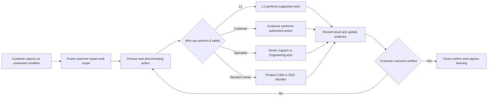
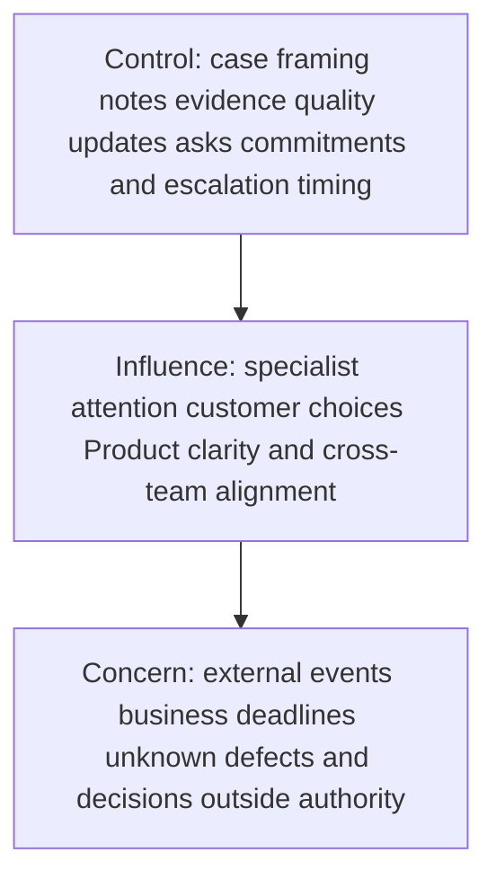
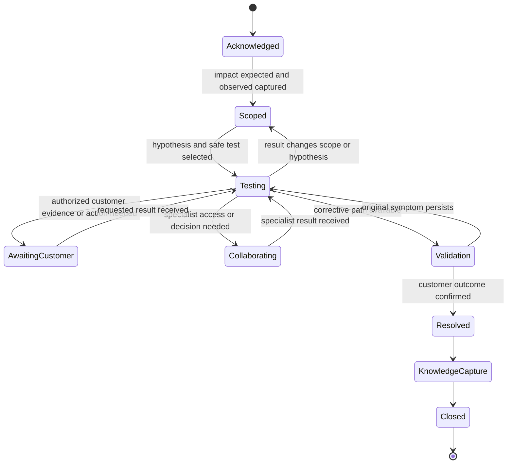
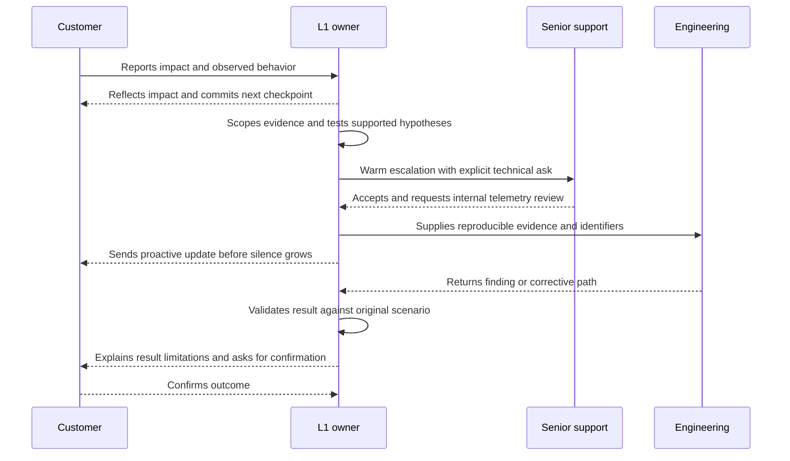
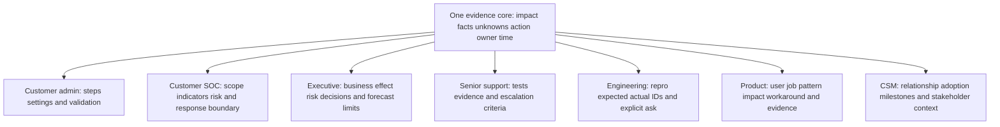
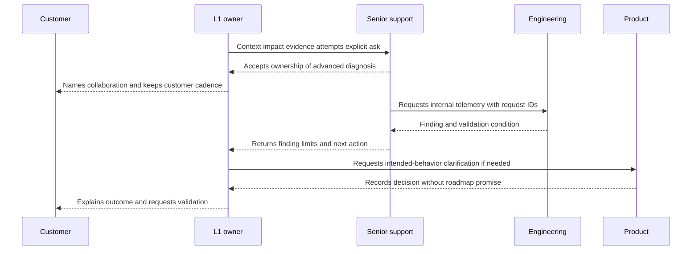
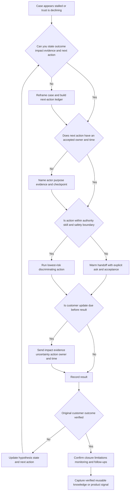

# Part 002 - Enterprise Support Ownership and Customer Trust

> **Purpose:** Learn how an enterprise Level 1 support engineer creates forward motion, reduces customer effort, preserves trust, and coordinates specialists without pretending to do every job.
>
> **Evidence rule:** Microsoft examples use only facts stated in Arti's CV/master: enterprise support and escalation, CRITSIT work, customer and partner updates, Engineering/Product collaboration, fix validation, CSAT/backlog/case-quality analysis, KB/training creation, and mentoring. Missing case details remain prompts for Arti to complete; they are never invented here.
>
> **Currency and official-source access date:** August 24, 2026.

## Section Goal

By the end of this Part, Arti should be able to own an enterprise support case without confusing ownership with solitary work. She should be able to explain what she controls, what she can influence, and what she must transparently track as a dependency. She should be able to keep a case in a meaningful state, name the next action and owner, set a useful update cadence, communicate differently to technical and nontechnical audiences, and preserve urgency without sacrificing evidence quality or safety.

Arti should also be able to explain trust as an operational result rather than a personality trait. That includes empathy without automatic agreement, psychological safety, honest uncertainty, reliable commitments, expectation and boundary management, proactive updates, low-effort evidence requests, warm handoffs, follow-through, closure confirmation, and knowledge capture. The practical outcome is an **Enterprise Ownership and Trust Case Lab** containing an ownership map, next-action ledger, update cadence, audience-specific updates, warm handoff, closure note, and trust scorecard for a synthetic Software as a Service security case.

This Part introduces severity and priority only enough to protect ownership decisions. It does not replace the dedicated later lessons on ticket lifecycle, severity, critical incidents, communication, Engineering/Product collaboration, metrics, or knowledge-centered support.

## JD Mapping

The mappings below come from the supplied job description represented in the confirmed master curriculum. They do not claim knowledge of Abnormal AI's private case tools, internal queues, service-level targets, or escalation policy.

| Supplied JD signal | Capability developed here | Proof produced or practiced |
|---|---|---|
| Enterprise L1 Technical Support Engineer | Continuous ownership from acknowledgment through validated closure | Ownership map and next-action ledger |
| Four or more years of customer-facing enterprise support | Converts Arti's five years of Microsoft support into role-relevant ownership language | CV-grounded transfer statements |
| Build customer trust | Makes candor, reliability, empathy, care, and competence observable | Trust scorecard and update sequence |
| Send timely, clear customer updates | Uses impact, evidence, next action, owner, and time for proactive communication | Update cadence and worked message set |
| Communicate with technical and nontechnical audiences | Preserves the same facts while changing detail, vocabulary, and decision framing | Customer-admin, executive, Engineering, CSM, and SOC updates |
| Own configuration, API, behavioral false-positive, and threat cases | Applies a vendor-neutral ownership method without claiming direct operations in those areas | Synthetic SaaS security case lab |
| Collaborate with senior support and Engineering | Creates actionable, warm escalations while L1 remains the continuity owner | Warm-handoff artifact and acceptance check |
| Collaborate with Product | Converts repeated customer friction into evidence without promising roadmap outcomes | Pattern-to-Product routing model |
| Assist onboarding with CSMs | Distinguishes technical case ownership from adoption and relationship ownership | Multi-party responsibility map |
| Work with customer security/SOC stakeholders | Separates support evidence from the customer's authorized incident decisions | Audience and boundary map |
| Create KB/training and drive case quality | Captures reusable knowledge after verified resolution | Closure and knowledge-capture checklist |
| Customer focus, ownership, intellectual honesty, and urgency | Balances action speed with evidence, privacy, and quality | Decision tree, failure-mode review, and spoken Q&A |

## Candidate Honesty Note

This lesson uses four evidence labels consistently.

| Evidence label | What Arti may say | What Arti must not imply |
|---|---|---|
| **Production-transfer example** | Arti has CV-supported Microsoft enterprise support and escalation experience, including CRITSITs, customer/partner updates, Engineering/Product collaboration, fix validation, CSAT/backlog/case-quality analysis, KB/training, and mentoring | That those cases involved Abnormal AI, direct email-security operations, or a named adjacent security platform |
| **Local/public lab** | Arti completed the synthetic case exercise in this Part and can show its sanitized artifacts | That a simulation is a customer case or production platform operation |
| **Learned architecture** | Arti understands the roles and support methods explained from official sources and this curriculum | That a generic role map is Abnormal's exact organization or escalation path |
| **Template only** | Arti has a reusable structure for updates, handoffs, closure, and knowledge capture | That the unfilled template describes an event that actually happened |

Arti can truthfully say that Microsoft enterprise support taught her to coordinate complex investigations, communicate during CRITSITs, work with Engineering and Product, validate fixes, and improve knowledge and case quality. She cannot add an incident type, customer impact, technical root cause, timeline, metric, or business result unless she personally verifies it from a real, nonconfidential example. The synthetic SaaS security case later in this Part is **local/public lab evidence**, not Microsoft or Abnormal production experience.

## Beginner Term Primer

| Term | Plain meaning | Why it matters | Memory hook |
|---|---|---|---|
| **Enterprise support** | Technical help for organizations whose systems involve many users, dependencies, teams, controls, and business consequences | A small symptom can have a large or complex impact | Enterprise means dependencies, not just company size |
| **Level 1 or L1** | The first technical owner of an inbound case | The first owner shapes problem definition, evidence quality, communication, and routing | L1 makes the first useful map |
| **Accountability** | Being answerable for whether an agreed outcome, action, or communication occurs | Work can be delegated; accountability must remain visible | Delegate work, never delegate awareness |
| **Ownership** | Maintaining continuity and forward motion from intake to confirmed outcome | Customers should not have to coordinate the support organization | One case, one visible conductor |
| **Case state** | The meaningful current condition of a support case | A state tells people what is happening and what can happen next | State explains why the case is here |
| **Next action** | The specific smallest useful step that advances or tests the case | Vague investigation produces drift | Verb, owner, evidence, time |
| **Dependency** | Work or information needed from another person, team, system, or event | Dependencies are normal; invisible dependencies become delays | Waiting still needs an owner |
| **Customer effort** | The work the customer must perform to obtain support and reach an outcome | Repeated requests and internal routing transfer cost to the customer | Never make the customer be your router |
| **Psychological safety** | A climate in which people can report errors, uncertainty, and disagreement without humiliation or retaliation | Hidden uncertainty and silent mistakes damage diagnosis | Safe to say “I may be wrong” |
| **Transparency** | Sharing relevant facts, uncertainty, decisions, and constraints honestly | It lets stakeholders make informed decisions | Clear does not mean revealing everything |
| **Commitment** | A promise about an action, owner, or communication time | Reliability depends on keeping or renegotiating commitments | Promise the checkpoint, not the miracle |
| **Severity** | A classification of how serious the current impact is | It helps determine response and coordination needs | Severity describes impact |
| **Priority** | The order in which work should be handled after impact, urgency, obligations, risk, and dependencies are considered | Two severe issues may still compete for resources | Priority decides what moves first |
| **Escalation** | Moving a question or action to a person with the needed authority, access, or depth | Escalation is a tool for progress, not a confession of failure | Escalate the need, not the confusion |
| **Warm handoff** | A transfer in which context, ownership, evidence, and acceptance are explicit | It prevents restart, repetition, and ticket ping-pong | Introduce, transfer, confirm |
| **Security Operations Center or SOC** | The people and processes that monitor and respond to security events | A customer SOC may use support evidence to make response decisions | Support explains product evidence; SOC owns response |
| **Customer Success Manager or CSM** | A partner focused on adoption, value, goals, and relationship health | CSM context can improve coordination without replacing technical ownership | Support fixes the case; CSM protects the journey |
| **Knowledge base or KB** | A maintained set of reusable support guidance | A verified case can reduce future customer effort | Solve once, teach responsibly |
| **Customer satisfaction or CSAT** | Feedback about how a customer perceived an interaction or service | It can reveal trust and quality signals, but it is not the whole outcome | A score is a signal, not the story |
| **CRITSIT or critical situation** | A Microsoft support term used in Arti's CV context for high-impact, tightly coordinated support work | It provides a real transfer example for structured communication under pressure | Facts, owners, cadence, validation |

## The Core Mental Model: Own the Journey, Route the Work

Technical ownership answers five questions at every meaningful point in a case:

1. **What outcome is the customer trying to restore, protect, or understand?**
2. **What is known, what is inferred, and what remains unknown?**
3. **What is the next action most likely to reduce risk or uncertainty?**
4. **Who owns that action, and when is its result or checkpoint expected?**
5. **What does each stakeholder need to know before then?**

An L1 engineer may not control the code fix, the customer's configuration change, a Product decision, or a specialist's queue. L1 still controls whether impact is documented, evidence is usable, dependencies are explicit, updates are sent, commitments are tracked, and the original outcome is validated.



**Analogy:** Ownership is like conducting an orchestra. The conductor does not play every instrument, but keeps the score, timing, entrances, and shared outcome aligned. The analogy stops because an enterprise support engineer also performs hands-on diagnostics, follows authorization and privacy rules, and may have no authority over other teams' scheduling.

### Ownership principles at a glance

| Principle | Strong behavior | Weak substitute |
|---|---|---|
| Own the outcome | Restate the customer goal and validate it before closure | Count internal actions as success |
| Make state visible | Record current evidence, dependency, owner, and checkpoint | Leave the case as “investigating” |
| Reduce effort | Reuse existing evidence and coordinate internal teams | Ask the customer to repeat the story |
| Escalate purposefully | Provide context, evidence, attempted tests, and an explicit ask | Forward the thread with “please advise” |
| Communicate before silence becomes uncertainty | Update at the promised time, even without a breakthrough | Wait until there is a fix |
| Preserve safety | Minimize data and avoid unsupported or unauthorized actions | Treat urgency as permission to skip controls |
| Validate the original scenario | Confirm expected behavior with the customer | Close when an internal task is marked complete |
| Convert learning | Capture a verified reusable path or product signal | Write an article before the conclusion is stable |

## 🔍 Plain-English deep-dive: Ownership Versus Doing Everything

The phrase “I own the case” can become harmful if it means “I must personally solve every technical layer.” Enterprise systems cross product, identity, network, policy, customer, and security boundaries. No single engineer has every permission or every form of expertise. A person who avoids escalation to appear capable can delay the case, take unsafe actions, or give a confident but incorrect answer.

Good ownership is a promise of **continuity**, not omnipotence. Continuity means the customer does not lose the problem definition every time another team joins. The L1 owner knows why the specialist is involved, what question they are answering, what evidence they received, what they returned, and what happens next.

| Situation | Doing-everything response | Ownership response |
|---|---|---|
| Internal telemetry is unavailable to L1 | Guess from the visible symptom or keep collecting unrelated logs | Escalate with identifiers, time window, expected/actual behavior, tests, and the exact telemetry question |
| Customer action is required | Say “waiting on customer” and stop thinking | Explain the purpose, minimum steps, safety boundary, expected result, and next checkpoint |
| Engineering accepts a defect | Tell the customer Engineering owns it now | Remain the customer-facing owner, track the dependency, communicate cadence, and validate the eventual change |
| Product behavior is unclear | Promise that Product will change it | Ask Product to clarify intended behavior or assess evidence; communicate the decision without inventing a roadmap |
| SOC asks whether an event is malicious | Make the customer's incident decision | Explain supported product evidence and limitations; the authorized customer responders decide containment and response |

**Analogy:** A restaurant server owns the guest's dining experience without cooking every dish, repairing the oven, or setting food-safety policy. The server gathers the order accurately, coordinates with the kitchen, notices delay, communicates, corrects mistakes, and confirms the guest received the intended meal. The analogy stops because technical support often requires direct diagnosis and because security decisions have authorization, evidence, and legal boundaries far beyond a meal.

### Accountability without heroics

Accountability is strongest when it is explicit and shared appropriately:

- **L1 is accountable** for case continuity, accurate notes, appropriate first-line diagnostics, clear updates, dependency tracking, and confirmed closure.
- **The action owner is accountable** for the action they accepted, such as checking internal telemetry or changing an authorized customer setting.
- **The decision owner is accountable** for decisions within their authority, such as Product interpreting intended behavior or a customer SOC choosing containment.
- **A manager or incident lead may be accountable** for resource and priority decisions during major impact.

This avoids two extremes. In one extreme, everyone says, “That is not my team,” and the customer becomes the coordinator. In the other, one engineer becomes a heroic bottleneck, conceals overload, and makes decisions outside their authority. Mature support creates visible ownership without making a single person the only path to progress.

## Sphere of Control, Influence, and Concern

A **sphere** is a boundary around what a person can directly change, what they can affect through collaboration, and what they can only monitor or plan around.



The diagram is conceptual rather than geometric. The important practice is to avoid making promises from the outer sphere while neglecting actions in the inner sphere.

| Sphere | Enterprise support examples | Useful language | Dangerous language |
|---|---|---|---|
| **Control** | What L1 writes, asks, tests within authorization, documents, schedules, escalates, and communicates | “I will send the comparison evidence and update you by 16:00 UTC.” | “There is nothing I can do.” |
| **Influence** | Engineering review, customer participation, Product clarification, CSM stakeholder alignment | “I have asked Engineering to inspect the request IDs and will track acceptance.” | “Engineering will definitely fix this today.” |
| **Concern** | Unknown defect complexity, third-party outage, customer business deadline, attacker behavior, future roadmap | “I understand the deadline. I cannot guarantee resolution by then, so I will provide risk and workaround status at each checkpoint.” | “It will be resolved before your deadline.” |

### A practical control check

When a dependency appears, ask:

1. What can I do now without waiting?
2. What exact result do I need from the dependency owner?
3. Did they accept the ask?
4. What is the checkpoint if the result is not ready?
5. What can the customer safely do or decide in parallel?
6. What uncertainty or risk must be communicated now?

### Worked example: Engineering dependency

**Synthetic input:** An integration request produces an unexplained server response. L1 can reproduce it and has sanitized request IDs, but cannot inspect server-side execution.

**Weak response:** “This is with Engineering. We will let you know when they respond.”

**Why it fails:** It hides the question, owner acceptance, interim plan, and update time. It also makes Engineering's completion time sound like an L1 promise.

**Strong ownership response:**

> I reproduced the response with the same sanitized request shape and attached the request IDs and UTC time window. L1-visible evidence does not show whether the server rejected the request during authorization or later processing, so I asked Engineering to distinguish those two paths in internal telemetry. They have accepted the review. I remain the support owner and will update you by 16:00 UTC tomorrow, even if the telemetry review is still in progress. In parallel, I am confirming whether the documented workaround applies to this request type.

**Result:** The response makes the controlled actions clear, describes the influenced dependency without promising its result, and gives the customer a reliable checkpoint.

**Caveat:** This is a generic synthetic example. It is not an Abnormal workflow and is not a CV claim.

## Case State and Next-Action Discipline

A case state should explain the operational truth, not merely where a ticket sits in a tool. Labels such as “open,” “pending,” or “escalated” are too weak by themselves. A useful state record includes:

- the customer outcome being pursued;
- current impact and scope;
- strongest confirmed observations;
- leading uncertainty or hypothesis;
- next action and expected evidence;
- action owner;
- due time or checkpoint;
- customer update time;
- blockers, risks, and boundary conditions.



The diagram intentionally avoids a generic “pending” state. Waiting is meaningful only when the case records **what is awaited, from whom, why, until when, and what happens next**.

### The next-action ledger

| Field | Required content | Bad example | Strong example |
|---|---|---|---|
| Outcome | Customer-visible condition to achieve | Fix issue | Admin can complete the synthetic event export successfully |
| Current evidence | Confirmed observation, not interpretation | API is broken | Two authorized test users receive HTTP 403; one control user succeeds |
| Next action | Specific verb and object | Investigate | Compare role assignments for affected and control users |
| Purpose | Hypothesis the action tests | Need more data | Tests whether authorization scope explains the difference |
| Owner | Named role or person | Support | L1 owner; customer admin supplies redacted role export |
| Expected evidence | Result that changes the decision | Logs | Role difference present or absent |
| Due/checkpoint | Time for result or progress communication | ASAP | Evidence requested by 14:00 UTC; update at 15:00 UTC regardless |
| Contingency | Next path if the result is missing or unexpected | Escalate | If roles match, escalate request IDs for server-side policy evaluation |

### Next-action quality test: VANET

Use **VANET** as a recall tool:

- **V - Verb:** Is the action observable, such as compare, reproduce, query, validate, or confirm?
- **A - Actor:** Who owns it?
- **N - Need:** Which uncertainty or risk does it address?
- **E - Evidence:** What output will it produce?
- **T - Time:** When is the result or checkpoint expected?

“Engineering investigating” fails VANET. “Engineering will compare request IDs `R-104` and `R-105` in server authorization telemetry to determine whether tenant policy rejected them, with an acceptance checkpoint at 17:00 UTC” passes.

### Case-note example

**Weak note:**

> Customer still has issue. Sent logs to Engineering. Waiting.

**Strong note:**

> Outcome: restore synthetic alert export for authorized analyst users. Impact: three of ten lab users blocked; read-only dashboard remains available. Confirmed: failure began after synthetic role-policy change at 09:10 UTC; affected requests return 403; control user succeeds; no token values collected. Current hypothesis: affected users lack the required export permission. Next: customer admin compares redacted role assignments by 13:00 UTC. L1 updates customer at 14:00 UTC. If permissions match, L1 sends request IDs and UTC window to senior support for server-policy correlation. No destructive change approved.

The strong note helps a new participant act without requiring the customer to retell the case.

## 🔍 Plain-English deep-dive: Customer Trust Is a Prediction

Customers trust support when past behavior gives them a reasonable basis to predict future behavior. They expect that the engineer will not disappear, invent certainty, mishandle data, or make them restart the investigation. A polite tone can help, but reliability is more persuasive than warmth alone.

**Analogy:** Trust resembles a bank account. Accurate explanations, met commitments, early corrections, low-effort requests, and verified follow-through make deposits. Silence, repeated questions, confident guesses, hidden misses, and broken promises make withdrawals. The analogy stops because trust is not truly numeric, different actions carry different weight, and a serious privacy or security error can have consequences that many small positive actions cannot simply cancel.

### Trust deposits and withdrawals

| Moment | Deposit | Withdrawal | Repair when a withdrawal occurs |
|---|---|---|---|
| First response | Reflect impact and give a plan | Send a generic receipt with no ownership | Follow quickly with a scoped plan and acknowledge the delay |
| Evidence request | Explain why, minimize scope, and offer redaction guidance | Ask for all logs, secrets, or duplicate information | Cancel unsafe request, explain correction, and narrow collection |
| Uncertainty | State what is known, inferred, and unknown | Present a hypothesis as confirmed cause | Correct the record promptly and show the new evidence |
| Commitment | Promise a controlled checkpoint and meet it | Promise an uncontrolled resolution date | Renegotiate before the deadline and explain the dependency |
| Escalation | Introduce the specialist with context and remain engaged | Tell the customer to contact another queue | Reclaim coordination, summarize context, and confirm acceptance |
| Resolution | Validate the original workflow and limitations | Close after an internal fix notice | Reopen or continue until customer validation is addressed |
| Learning | Capture verified reusable guidance | Publish premature or customer-specific conclusions | Correct or retire the content and record the limitation |

### Trust has five operational ingredients

| Ingredient | Customer's practical question | Observable support behavior |
|---|---|---|
| **Competence** | “Can you make sense of this?” | Defines expected/actual behavior, asks discriminating questions, and selects useful tests |
| **Candor** | “Will you tell me what you really know?” | Separates observations, hypotheses, unknowns, and decisions |
| **Reliability** | “Will you do what you said?” | Keeps or proactively renegotiates action and update commitments |
| **Care** | “Will you protect us while helping us?” | Minimizes evidence, respects authorization, and avoids reckless shortcuts |
| **Empathy** | “Do you understand why this matters?” | Connects communication and plan to the customer's impact and constraints |



The trust sequence contains no guaranteed fix time. Trust comes from visible method and dependable checkpoints while the technical answer is still uncertain.

## Psychological Safety, Transparency, and Uncertainty

**Psychological safety** does not mean avoiding accountability or making every idea correct. It means people can report a mistake, question a conclusion, or name uncertainty without being punished for speaking honestly. In a technical case, that behavior improves evidence quality.

A psychologically unsafe case may look efficient at first: no one challenges the senior voice, an engineer hides that a step failed, or the customer hesitates to admit a recent configuration change. The investigation then follows a false story. A safe case encourages sentences such as:

- “I may be wrong; this observation would disprove my current hypothesis.”
- “I missed the update commitment. Here is the impact and the corrected plan.”
- “We made a configuration change before the symptom. We can share the sanitized change record.”
- “The workaround restored function, but we have not established root cause.”
- “I disagree with the current conclusion because the control user shows different behavior.”

**Transparency** is not unrestricted disclosure. Support may need to protect customer data, vendor security details, internal communications, employee privacy, legal privilege, or exploit-sensitive information. Transparent communication shares what the audience needs for a sound decision: current evidence, impact, uncertainty, action, owner, time, and relevant constraint. It does not expose secrets or speculate about internal details.

### Observation, inference, decision, and unknown

| Category | Meaning | Example |
|---|---|---|
| **Observation** | Something directly measured, reproduced, or supplied as evidence | The synthetic request returned 403 at 10:02 UTC |
| **Inference** | A reasoned explanation that may still be wrong | A role-policy mismatch may explain the 403 |
| **Decision** | An authorized choice based on current evidence and risk | Compare role assignments before changing policy |
| **Unknown** | A question that remains unresolved | Whether server-side policy evaluated the new role correctly |

### Useful uncertainty language

| Confidence condition | Customer-safe wording |
|---|---|
| Evidence supports one path but does not prove it | “The current evidence makes authorization mismatch the leading hypothesis; the role comparison is designed to confirm or disprove it.” |
| Workaround succeeds but cause is unknown | “The workaround restored the workflow. It does not by itself establish why the original path failed.” |
| Specialist review is pending | “The case is accepted for server-side review. I do not yet have a confirmed finding; the next checkpoint is 16:00 UTC.” |
| Earlier statement was wrong | “I need to correct my earlier statement. The new comparison shows the control user also fails, so role assignment is no longer the leading explanation.” |
| Information cannot be disclosed | “I cannot share restricted internal detail, but I can explain the customer-visible behavior, supported mitigation, validation result, and remaining limitation.” |

### Commitments under uncertainty

The safest commitment is usually to an action or communication within the speaker's control:

- Good: “I will send the redacted evidence summary by 13:00 UTC.”
- Good: “I will update you by 17:00 UTC even if Engineering's review is incomplete.”
- Good: “We will reassess cadence immediately if impact expands.”
- Risky: “Engineering will have a root cause today.”
- Risky: “This workaround will prevent all recurrence.”
- Risky: “The product team will prioritize this feature.”

When a commitment is at risk, communicate **before** it expires. State what was expected, what changed, current impact, what is being done, and the new checkpoint. A missed commitment hidden until the customer asks creates a larger withdrawal than an early, candid renegotiation.

## 🔍 Plain-English deep-dive: Empathy Is Not Agreement

**Empathy** means understanding and acknowledging another person's experience, impact, or concern. **Agreement** means accepting their explanation, demand, or conclusion as correct. Support needs empathy immediately; agreement requires evidence and authority.

If a customer says, “Your product blocked our entire response team,” an empathetic response may be:

> I understand why this is urgent: the team cannot complete the response workflow, and that creates operational risk. I am treating the impact seriously. I have not yet confirmed which layer caused the block, so I will first compare an affected request with a working control and update you by 12:00 UTC.

The engineer acknowledges impact without confirming an unsupported cause.

| Customer statement | Empathy without premature agreement | Unsafe response |
|---|---|---|
| “This is definitely a platform defect.” | “I understand why the repeated failure points you there. I will test the product boundary and preserve evidence for escalation; the cause is not confirmed yet.” | “Yes, the platform is broken.” |
| “Disable the control now.” | “I understand the control is blocking urgent work. Before changing it, we need the authorized owner to weigh the security risk and use the approved workaround if available.” | “I will disable it.” |
| “Your team has done nothing.” | “The lack of visible progress has been frustrating, and our updates have not made the work clear. Here is what is complete, what remains unknown, and the next checkpoint.” | “That is not true; we sent three updates.” |
| “I need a guarantee this will never happen again.” | “I understand why recurrence is unacceptable. I can explain the verified corrective actions and monitoring; I cannot responsibly guarantee that no related failure can ever occur.” | “It will never happen again.” |

**Analogy:** Empathy is like accurately reading the temperature in a room; agreement is deciding who set the thermostat incorrectly. Feeling the heat is real even before cause is known. The analogy stops because human concerns involve context, dignity, and consequences that a temperature reading cannot represent.

### Psychological safety in customer conversations

An engineer can invite better evidence without blame:

- Replace “Who changed this?” with “Were any configuration, identity, policy, or integration changes made near the start time? A sanitized change record can help us test causation.”
- Replace “You configured it wrong” with “The current role assignment differs from the documented prerequisite. Let us confirm whether that difference explains the observed behavior.”
- Replace “Why did you wait so long?” with “When was the behavior first observed, and was there an earlier signal that can help build the timeline?”
- Replace “Engineering made a mistake” with “The change did not produce the expected result in the customer's original scenario; we are returning the validation evidence for review.”

This language remains accountable. It names differences and failed outcomes while avoiding humiliation and unsupported blame.

## Urgency With Quality

Urgency means reducing avoidable delay in proportion to impact and risk. It does not mean acting randomly, skipping privacy controls, overpromising, or declaring every case critical. Quality means the action is safe, relevant, reproducible where possible, and connected to evidence.

### Severity and priority awareness

This Part uses only a lightweight distinction:

| Concept | Question | Ownership implication | Deferred depth |
|---|---|---|---|
| **Impact** | What business, user, service, or security outcome is affected, and how broadly? | Record concrete scope and consequence | Quantitative and scenario practice comes later |
| **Urgency** | How quickly could harm increase or an important opportunity close? | Timebox safe next actions and communication | Formal criteria come later |
| **Severity** | How serious is the current effect under the organization's definitions? | Trigger the appropriate process and cadence | Exact classification belongs in Part 102 |
| **Priority** | What should be worked first given severity, obligations, resources, and dependencies? | Escalate conflicts rather than silently choosing | Queue and target mechanics belong in Part 102 |
| **Critical coordination** | Does the case require tightly managed, multi-party response? | Make roles, facts, decisions, and checkpoints visible | Swarming and critical incidents belong in Part 104 |

Never invent a company's severity definitions or response targets. Ask for the documented policy and follow it. A customer's label is valuable impact input, but the support organization may need to map it to contractual and operational criteria. That mapping should be transparent and respectful.

### Fast and careful are not opposites

| Fast, low-quality action | Urgent, high-quality action |
|---|---|
| Request every available log | Request the minimum evidence that separates the top hypotheses |
| Apply several changes at once | Choose a reversible, authorized, discriminating test |
| Escalate with a forwarded thread | Escalate a concise timeline, evidence, impact, attempts, and explicit ask |
| Promise a resolution deadline | Promise controlled checkpoints and communicate risk |
| Skip notes during a call | Keep a live decision and action ledger |
| Close when a fix ships | Validate the original workflow and watch for recurrence conditions |

### CRITSIT transfer, stated honestly

Arti's CV supports CRITSIT experience and clear customer/partner updates. The transferable method is to keep impact, known facts, unknowns, owners, actions, and checkpoints visible under pressure. Arti may also connect Engineering/Product collaboration and fix validation to critical-case follow-through.

Arti must supply the actual story details herself. A safe interview scaffold is:

> In a Microsoft enterprise CRITSIT involving **[sanitized real workload and impact]**, I was responsible for **[verified personal ownership]**. I kept technical and nontechnical stakeholders aligned by **[real cadence or artifact]**, worked with **[verified team boundary]** using **[real evidence]**, and validated **[real customer outcome]**. The experience taught me **[real lesson]**. I would transfer that coordination discipline to a security SaaS support case, while learning and following the new product's severity and escalation rules.

This scaffold is **template only** until every bracket is replaced with a real, nonconfidential fact.

## Technical and Nontechnical Communication

Audience adaptation changes the depth and decision framing, not the underlying facts. Every audience should receive a consistent core: impact, confirmed evidence, uncertainty, action, owner, and time.



### Stakeholder role map

| Stakeholder | Primary responsibility in the case | What they need from L1 | What L1 needs from them | Boundary |
|---|---|---|---|---|
| **Customer requester/admin** | Describe outcome, provide authorized context, perform approved customer-side actions, validate result | Plain plan, safe evidence request, progress, decision points | Expected/actual behavior, impact, timeline, approved evidence, confirmation | Customer controls its environment and approvals |
| **L1 support** | Own continuity, first-line diagnosis, case record, communication, routing, and closure confirmation | Access to supported tools, runbooks, coaching, and clear escalation paths | Cooperation and accepted dependencies from all parties | Does not invent internals or act beyond permission |
| **Senior support** | Add product/domain depth and advanced diagnostics | Clean case summary, attempted tests, evidence, and precise question | Acceptance, findings, requested next test, and limitations | Should not force a full restart when usable context exists |
| **Engineering** | Investigate code, service, or internal telemetry when needed | Reproduction, expected/actual result, versions/context, IDs, time window, impact, explicit ask | Technical finding, fix/workaround status, validation criteria, known limits | L1 does not promise Engineering dates or code outcomes |
| **Product** | Clarify intended behavior and evaluate recurring needs or tradeoffs | Customer job, evidence, frequency, impact, workaround, decision needed | Behavior decision, accepted feedback, or documented direction | L1 does not promise roadmap priority or delivery |
| **CSM** | Align adoption, value, relationship health, stakeholders, and onboarding | Technical status, risks, dependencies, customer-safe summary | Goal context, stakeholder map, adoption or relationship risk | CSM does not replace technical diagnosis; L1 does not replace success planning |
| **Customer security/SOC** | Assess threat and exposure and make authorized response decisions | Product evidence, scope, limitations, supported actions, update cadence | Incident priorities, authorized requests, containment decisions, relevant evidence | Support is not automatically the customer's incident commander |
| **Internal security** | Handle possible risk to the vendor, protected data, or internal environment | Prompt escalation through the approved secure path | Handling instructions and customer-safe communication boundaries | L1 does not independently investigate restricted internal security matters |

### Same facts, different audience

**Evidence core for a synthetic case:** Three of ten analyst users cannot export a synthetic alert list. Their requests return 403 after a role-policy change. Dashboard viewing still works. Role comparison is pending. No evidence yet proves a platform defect or security incident.

| Audience | Useful update |
|---|---|
| Customer administrator | “Three analyst accounts receive 403 on export while dashboard access remains available. Please compare the redacted export permission for one affected account and the working control. Do not send tokens. I will review the role output and update you by 14:00 UTC.” |
| Customer SOC lead | “Export is unavailable for three analysts, which may delay evidence packaging; alert viewing remains available. There is no current evidence of alert loss or malicious activity. The leading hypothesis is authorization drift, and the admin is validating role differences. Please use the approved manual export path if an urgent response package is required.” |
| Executive sponsor | “A subset of analysts cannot export alert data, but they can still view alerts. The immediate risk is response-process delay rather than confirmed data loss. Technical teams are testing an access-policy change, and the next status is 14:00 UTC. We will escalate cadence if scope expands.” |
| Senior support | “Three of ten users return 403 on `POST /exports`; one control succeeds. Start time follows a synthetic role-policy change. Tokens were not collected. Customer is comparing redacted roles. If roles match, please review whether tenant policy evaluation differs for request IDs in the attached UTC window.” |
| Engineering | “Expected: authorized analyst export succeeds. Actual: three affected users return 403; control succeeds. Reproducible 3/3 after synthetic policy change. Attached: sanitized request shape, UTC timestamps, request IDs, role comparison, no credentials. Ask: identify the server authorization decision and whether behavior matches intended policy.” |
| Product | “Customer job: analysts export alerts for a response package. Three users are blocked after a role-policy change; a workaround exists. Please clarify intended permission behavior. If expected, the UI/documentation may need clearer prerequisite guidance; if unexpected, Engineering has the reproducible evidence.” |
| CSM | “Technical impact is limited to export for three analysts; viewing remains available and a manual path exists. Next technical checkpoint is 14:00 UTC. Please help confirm whether an upcoming review milestone changes stakeholder cadence; Support remains technical owner.” |

The messages do not contradict one another. Each removes detail the audience does not need and emphasizes the decision the audience may need to make.

## Proactive Updates and Expectation Management

A proactive update arrives before the customer must ask, “What is happening?” It is useful even when there is no final answer because it reduces uncertainty and confirms ownership.

```mermaid
sequenceDiagram
    participant C as Customer
    participant L as L1 owner
    participant D as Dependency owner
    L-->>C: Acknowledge impact plan and first checkpoint
    L->>D: Send accepted action with evidence and due checkpoint
    Note over L,D: Technical work continues
    L-->>C: Update at promised time with completed work and unknowns
    D-->>L: Partial result; more analysis needed
    L-->>C: Explain result next test owner and next update
    Note over L,D: Commitment risk appears
    L-->>C: Renegotiate before deadline and state reason
    D-->>L: Corrective path available
    L-->>C: Request validation and explain limitations
```

### The CLEAR-UP update structure

Use **CLEAR-UP** for progress messages:

- **C - Customer impact:** What outcome remains affected?
- **L - Latest confirmed evidence:** What changed since the last update?
- **E - Explanation and uncertainty:** What does the evidence mean, and what does it not prove?
- **A - Action:** What happens next?
- **R - Responsible owner:** Who accepted that action?
- **U - Update time:** When will the next communication occur?
- **P - Protection or parallel path:** What safety boundary, workaround, or customer decision matters now?

Do not force every message into seven long paragraphs. The structure is a completeness check, not a script.

### Worked weak-versus-strong updates

#### First acknowledgment

**Weak:**

> Thank you for contacting support. We are looking into this and will get back to you soon.

**Why weak:** It proves receipt but not understanding, impact, plan, ownership, or time.

**Strong:**

> I understand that three analysts cannot export the synthetic alert list needed for today's review, while viewing remains available. I am the support owner. I will first confirm affected scope, recent role changes, and the exact 403 evidence using request IDs rather than credentials. I will send the initial findings or the next diagnostic step by 12:00 UTC.

#### Progress without a fix

**Weak:**

> Engineering is still investigating. No ETA.

**Why weak:** It may be true but gives no evidence, purpose, ownership, or next checkpoint.

**Strong:**

> We confirmed that affected and control users have the same visible role, so simple role assignment is no longer sufficient to explain the 403. Senior support accepted the case and asked Engineering to compare server-side policy decisions for the supplied request IDs. I remain your support owner. There is no confirmed resolution time yet; I will update you by 16:00 UTC tomorrow or sooner if the telemetry result changes the plan. The manual export path remains the approved workaround.

#### Missed commitment risk

**Weak:**

> Sorry for the delay. We need more time.

**Why weak:** It does not say what slipped, why, current impact, or what happens now.

**Strong:**

> I committed to provide the telemetry result by 16:00 UTC. That review is not complete, and I should not imply that it is. The case remains accepted by Engineering; current impact and workaround are unchanged. I have asked for a review checkpoint rather than an unverified conclusion and will update you by 19:00 UTC with either the finding or the remaining blocker. I recognize that this extends your planning uncertainty.

#### Correcting an earlier hypothesis

**Weak:**

> It is not a permissions issue after all.

**Why weak:** It hides the correction process and may overstate what is disproved.

**Strong:**

> I need to correct the leading explanation from my earlier update. The redacted role comparison shows no difference between affected and control users, so visible role assignment does not explain the behavior. That result does not rule out server-side policy evaluation. The next test is an internal comparison of the request IDs, owned by Engineering, with my customer update at 16:00 UTC.

#### Resolution update

**Weak:**

> The fix is deployed. We are closing the ticket.

**Why weak:** Deployment is activity; the customer's outcome and limitations are unverified.

**Strong:**

> Engineering reports that the synthetic policy evaluation was corrected. Our controlled test now succeeds for one affected account. Please repeat the original export workflow for the remaining affected users and confirm whether the expected file is produced. The manual workaround can remain available until validation is complete. I will keep the case open through tomorrow's 15:00 UTC checkpoint unless you confirm sooner.

### Expectation and boundary management

Expectations should cover more than time. Clarify:

- what Support is investigating;
- what is outside the current case or authorization;
- what evidence is necessary and why;
- which actions belong to the customer;
- what escalation can and cannot guarantee;
- how often communication will occur;
- what conditions change cadence or path;
- what counts as resolution and closure.

| Boundary situation | Clear response |
|---|---|
| Customer requests an unsupported action | “I understand the intended outcome. I cannot recommend that action because it is outside the supported and authorized path. I can offer these approved diagnostic or workaround options.” |
| Customer demands an exact fix time | “I cannot responsibly promise a resolution time before the internal review identifies the path. I can commit to the next evidence checkpoint at 16:00 UTC and will escalate coordination if impact changes.” |
| New unrelated issue appears | “I will record the relationship, but this symptom requires a separate scope so neither investigation loses state. I will coordinate the handoff and make the dependency visible.” |
| Product feature is requested | “I can document the job, impact, frequency, and workaround and route it for Product evaluation. I cannot promise priority, design, or delivery date.” |
| Sensitive data is offered | “Please do not send credentials, tokens, or unnecessary message content. The request ID, time window, and redacted response are sufficient for this test.” |

## 🔍 Plain-English deep-dive: Customer Effort Is Diagnostic Waste When Support Can Remove It

Customer effort is not automatically bad. Customers may need to approve changes, reproduce a private-environment symptom, or provide evidence only they can access. The problem is **avoidable** effort: repeating context, finding internal owners, gathering broad data without a reason, retrying failed steps because notes were lost, or chasing Support for updates.

**Analogy:** A well-run hospital does not ask a patient to carry their chart from specialist to specialist and re-explain every test. The patient may still need to answer new questions or consent to procedures, but the institution coordinates its own record. The analogy stops because enterprise customers own their environments and may need to authorize evidence and changes that a support organization cannot perform.

### Customer-effort audit

| Friction | Diagnostic question | Better practice |
|---|---|---|
| Repeated story | Did the prior owner capture expected/actual behavior, impact, timeline, and evidence? | Give the next participant a concise case brief |
| Duplicate logs | Is the evidence already attached, and is it still valid for the hypothesis? | Reuse it or explain why a new time window is necessary |
| Broad collection | Which hypothesis requires each requested field or file? | Request minimum necessary evidence with redaction guidance |
| Customer as router | Are internal team boundaries being pushed onto the customer? | L1 coordinates the internal warm handoff |
| Unclear wait | Does the customer know who acts and when? | Record action owner, purpose, due point, and update time |
| Repeated reproduction | Will another reproduction produce new evidence or merely repeat pain? | State the evidence gap and stop when the test no longer adds information |
| Closure chase | Has Support asked whether the original outcome is restored? | Send a validation request with a reasonable response window |

### Evidence-request template

> To test whether **[hypothesis]** explains **[observed behavior]**, please provide **[minimum redacted evidence]** for **[specific time/object]**. Do not include **[credentials, tokens, personal content, or other unnecessary data]**. I expect the result to show **[observation A or B]**, which will determine whether we **[next path]**. If collection is not possible, tell me what constraint applies and I will adapt the test.

The template reduces effort because the customer knows why the request matters, what not to send, and what decision it enables.

## Multi-Party Ownership and Warm Handoffs

Complex cases can have several action owners but should not have ambiguous continuity. A simple responsibility model is:

- **Customer-facing owner:** maintains the unified case narrative and updates.
- **Technical action owner:** performs the current diagnostic or corrective action.
- **Decision owner:** has authority to accept risk, define intended behavior, approve change, or prioritize work.
- **Dependency coordinator:** ensures cross-team acceptance and follow-up; often the customer-facing owner at L1.
- **Incident or escalation lead:** coordinates broader response when the organization's process requires it.



### Warm-handoff minimum packet

| Element | Question it answers |
|---|---|
| Customer outcome and impact | Why does this matter now? |
| Expected versus actual behavior | What precisely differs? |
| Scope and timeline | Who/what is affected, and when did it begin? |
| Environment and relevant change | Where does it occur, and what changed? |
| Confirmed evidence | What is observed rather than assumed? |
| Tests and results | What has already been tried, and what did it rule in or out? |
| Safety and data handling | What was authorized, minimized, and redacted? |
| Explicit ask | What decision, access, or technical result is needed from the recipient? |
| Continued owner and cadence | Who updates the customer while the dependency runs? |
| Acceptance | Has the recipient acknowledged the ask and its next checkpoint? |

### Avoiding ticket ping-pong

**Ticket ping-pong** occurs when teams transfer a case repeatedly without an agreed problem statement or accepted action. Each team identifies a reason the issue could belong elsewhere, but no one integrates the evidence.

Prevent it by requiring a handoff to answer:

1. What exact question is outside the current owner's capability or authority?
2. Why is the receiving team the right owner for that question?
3. What evidence lets them act without restarting?
4. What does acceptance look like?
5. Who maintains customer communication?
6. If the receiving team rejects ownership, who resolves the boundary dispute?

| Ping-pong message | Warm alternative |
|---|---|
| “This looks like an API issue; sending to API team.” | “The request reaches the service and returns 403; DNS/TLS and payload syntax are confirmed. Please determine whether server authorization evaluated the role as intended for these request IDs.” |
| “Not Support; ask your CSM.” | “The technical behavior remains with Support. I am including the CSM to align the onboarding milestone and stakeholders; no customer restart is required.” |
| “Engineering says expected; contact Product.” | “Engineering confirmed the behavior matches current implementation. I am asking Product to clarify intended customer behavior using the documented job, impact, and workaround. I remain the case owner.” |
| “Security issue; customer must investigate.” | “Support can explain the product evidence and preserve identifiers. The customer's authorized SOC owns containment and broader incident decisions; here is the evidence summary and support boundary.” |

## Follow-Through, Closure Confirmation, and Knowledge Capture

Follow-through starts when another person accepts an action. It includes tracking, communicating, integrating the result, and checking whether the result actually advances the customer outcome.

### The difference between technical completion and customer resolution

| Milestone | What it proves | What it does not prove |
|---|---|---|
| A test passed in Support's environment | The corrective path can work under those conditions | The customer's original environment is restored |
| Engineering deployed a change | An internal action completed | The reported symptom is gone or no regression exists |
| Customer applied guidance | A recommended action was attempted | It produced the expected result |
| Customer says “looks good” | Initial confidence improved | All affected scope and limitations were checked |
| Monitoring period ends without recurrence | No recurrence was observed in that window | The issue can never recur |

### Closure confirmation questions

1. Can the customer repeat the original workflow successfully?
2. Has the result been checked for the affected scope, not only one convenient control?
3. Is the workaround still required, and if so, who owns its removal?
4. Are security, privacy, or operational limitations understood?
5. Is monitoring or recurrence guidance documented?
6. Does the customer agree the stated outcome is met?
7. Are follow-up items separate, owned, and visible?
8. Is there verified learning worth capturing?

### Closure note template

> **Original outcome sought:** [customer-visible outcome]  
> **Impact and scope:** [verified impact]  
> **Confirmed finding:** [observation/cause at the evidence strength actually established]  
> **Action taken:** [who performed what authorized action]  
> **Validation:** [how the original scenario was repeated and by whom]  
> **Limitations/monitoring:** [what remains conditional or should be watched]  
> **Customer confirmation:** [date/time and exact scope confirmed]  
> **Follow-up owners:** [separate actions, owners, and checkpoints]  
> **Knowledge/product signal:** [article, case tag, bug, or Product evidence; no invented claim]

### Knowledge capture

Capture knowledge when the conclusion is stable enough to guide another case. Good knowledge contains symptoms, environment, prerequisites, decision points, safe evidence, resolution or workaround, validation, limitations, and escalation criteria. Remove customer identifiers and avoid turning one case into a universal rule.

Arti's CV-supported KB/training creation, mentoring, and case-quality work are strong production transfers. A safe statement is:

> My Microsoft support experience taught me to turn verified case learning into reusable KB or training and to improve quality through mentoring. I would bring that habit to a new support organization while learning its review, publication, privacy, and measurement standards.

Do not claim a particular deflection percentage, publication count, audience size, or named methodology unless Arti can verify it.

## Impact Over Activity

An ownership story should end with the changed condition, not the number of messages or meetings.

| Activity statement | Impact-oriented rewrite |
|---|---|
| “I escalated to Engineering.” | “I converted the case into a reproducible technical question, enabled Engineering to inspect the missing layer, maintained customer continuity, and validated the returned path.” |
| “I sent daily updates.” | “I reduced stakeholder uncertainty by maintaining an agreed cadence that separated current impact, evidence, dependencies, and decisions.” |
| “I joined a CRITSIT call.” | “I helped keep a high-pressure Microsoft support situation structured around impact, facts, owners, and checkpoints.” |
| “I worked with Product.” | “I supplied customer impact and recurring evidence so Product could clarify intended behavior or evaluate the need without an unsupported roadmap promise.” |
| “I wrote a KB.” | “I captured a verified path so future engineers or customers could reach the right action with less repeated effort.” |
| “I mentored engineers.” | “I helped others apply consistent case-quality and communication habits, using only results Arti can substantiate.” |
| “I reviewed CSAT and backlog.” | “I used support signals to identify experience, aging, or quality patterns and inform a targeted improvement, without inventing metrics.” |

Useful impact categories are restored function, protected safety, reduced uncertainty, reduced customer effort, faster access to the right expertise, higher-quality decision, verified fix, reusable knowledge, improved case quality, and better product evidence. Pick only the category supported by the example.

## Ownership Troubleshooting Decision Tree

Use this tree when a case is stalled, trust is falling, or ownership is unclear.



### Symptom-to-hypothesis-to-test table

| Symptom | Ownership hypothesis | Discriminating check | Observation | Next action |
|---|---|---|---|---|
| Customer asks repeatedly for status | Cadence or commitment is unclear | Inspect last update for a promised time and useful state | No next update time exists | Send a corrective update and set controlled cadence |
| Case waits on “Engineering” | Escalation ask or acceptance is incomplete | Can recipient state the exact question and checkpoint? | Forwarded thread has no explicit ask | Rebuild warm handoff and confirm acceptance |
| Customer repeats evidence | Case state was not preserved or evidence purpose changed silently | Compare current request with existing attachments and hypothesis | Same evidence already exists | Reuse it; apologize and explain only genuinely new need |
| Many actions, little progress | Tests are not discriminating | For each action, name the hypothesis and possible decisions | Outputs do not change hypothesis ranking | Stop collection; choose the cheapest separating test |
| Trust fell after a wrong statement | Correction was delayed or defensive | Is the record explicit about what changed and why? | Update quietly replaced earlier claim | Correct openly, state new evidence, and reset plan |
| Fix is “done” but ticket reopens | Closure validated internal activity, not customer outcome | Was the original workflow repeated across affected scope? | Only deployment status was checked | Resume validation and document conditions |
| Stakeholders disagree on urgency | Impact and decision rights are unclear | Separate observed impact, future risk, severity policy, and priority authority | Labels differ but facts are missing | Re-scope impact and invoke documented decision owner |
| L1 feels responsible for every task | Ownership is confused with execution | Map control, influence, concern, action owners, and continuity owner | Specialist action cannot be performed by L1 | Delegate safely while retaining tracking and communication |

## Common Failure Modes and Recovery

| Failure mode | Why it happens | Customer or team cost | Recovery |
|---|---|---|---|
| Hero ownership | Engineer equates escalation with weakness | Delay, unsafe action, burnout, hidden bottleneck | Escalate the specific access or expertise need; retain continuity |
| Passive ownership | Case owner waits for others without tracking | Silence, missed deadlines, customer chasing | Add accepted owner, purpose, checkpoint, and contingency |
| Vague state | Notes say “investigating” | Every participant reconstructs the case | Rewrite outcome, evidence, unknown, action, owner, and time |
| False urgency | Many changes are made at once | New risk and unclear causation | Pause, preserve state, choose reversible discriminating action |
| Slow perfection | Engineer waits for complete certainty before communicating | Customer cannot plan | Communicate verified partial state and uncertainty at cadence |
| Premature certainty | Hypothesis is presented as root cause | Wrong actions and trust withdrawal | Correct promptly; label observation, inference, and unknown |
| Overpromising | Resolution date depends on others | Broken commitment and escalation pressure | Commit to controlled action/update; explain dependency |
| Empathy theater | Apology is not paired with action | Customer feels managed rather than helped | Link acknowledgment to concrete plan and boundary |
| Agreement under pressure | Engineer accepts customer's cause or unsafe demand | Incorrect blame or harmful action | Validate impact; require evidence and authorization for conclusion/action |
| Evidence dumping | Broad logs replace reasoning | Privacy risk and specialist delay | Minimize collection and tie each artifact to a question |
| Cold handoff | Ticket is transferred without context or acceptance | Repetition and ping-pong | Send minimum packet, introduce roles, confirm receipt, stay engaged |
| Audience mismatch | Same detail is sent to everyone | Confusion or missing decision | Preserve evidence core; adapt depth and decision framing |
| Hidden missed commitment | Engineer waits for customer to notice | Trust falls more than the delay alone | Renegotiate before deadline; name impact and new checkpoint |
| Closure by inactivity | No reply is treated as proof of success | Reopen and unresolved impact | Make reasonable attempts, state assumptions, and distinguish administrative closure from validated outcome |
| Premature KB | One case becomes a universal rule | Future misdiagnosis | Add scope, evidence, limits, review, and escalation criteria |
| Metric gaming | Speed or closure count dominates judgment | Avoided escalations, shallow notes, premature closure | Balance CSAT, backlog, quality, safety, and verified outcome |
| Customer as project manager | Internal coordination is exposed as customer work | High customer effort and poor trust | L1 coordinates internal dependencies and provides one narrative |
| Security boundary blur | Support makes incident decisions outside authority | Risk, confusion, and liability | Explain product evidence; route authorized SOC/security decisions |

### Escalation triggers within this Part's scope

Escalate or seek guidance when required access, product depth, authority, safety, impact, or cross-team priority exceeds the L1 boundary. Examples include suspected vendor-side defect requiring internal telemetry, possible risk to protected data, expanding critical impact, uncertain authorization for a change, disagreement over intended behavior, repeated recurrence without a known path, or a dependency that cannot be resolved at the working level.

The trigger is not “the case is difficult.” The trigger is a named need: **access, expertise, authority, security handling, priority decision, or product decision**.

## CV-Grounded Microsoft Support Transfer Examples

The CV/master supports categories of experience, not complete stories. The examples below show how to translate those categories without inventing details.

### Example 1: CRITSIT ownership

**Supported facts:** Arti worked in Microsoft enterprise support/escalation and handled CRITSITs and clear customer/partner updates.

**Safe transfer statement:**

> In Microsoft enterprise support, I worked in CRITSIT situations where disciplined ownership and clear updates mattered under pressure. My transferable method is to keep impact, confirmed facts, unknowns, action owners, and next checkpoints visible for technical and nontechnical stakeholders. I would apply that method to a security SaaS case while following the new organization's documented severity and escalation process.

**Needs candidate detail before STAR use:** A real sanitized situation, Arti's personal actions, update method, decisions, verified outcome, and lesson.

**Do not claim:** That the CRITSIT was an email-security incident, that Arti was the incident commander, or that a particular metric improved.

### Example 2: Engineering/Product collaboration and fix validation

**Supported facts:** Arti collaborated with Engineering/Product on escalations and validated fixes.

**Safe transfer statement:**

> My Microsoft escalation experience taught me that a handoff must make the next team able to act: expected and actual behavior, useful evidence, scope, and a clear question. I also learned that the customer case is not complete when a fix is proposed; the original scenario must be validated. That discipline transfers directly even though Abnormal's product and internal workflow are new to me.

**Needs candidate detail:** The real workload, observed behavior, evidence, explicit ask, Arti's role, validation step, and outcome.

**Do not claim:** Code-level diagnosis, Product roadmap influence, or defect ownership unless a real story supports it.

### Example 3: CSAT, backlog, and case quality

**Supported facts:** Arti analyzed or worked with CSAT, backlog, and case-quality signals.

**Safe transfer statement:**

> I have experience using CSAT, backlog, and case-quality signals to understand support performance. I treat them as complementary evidence: CSAT reflects perception, backlog shows flow and aging, and quality review checks whether the work itself meets the standard. I would use those signals to find customer-effort and ownership problems without optimizing one number at the expense of safety or real resolution.

**Needs candidate detail:** Actual scope, analysis performed, recommendation, and verified effect.

**Do not claim:** Ownership of an entire metric program or unsupported percentage improvement.

### Example 4: KB, training, and mentoring

**Supported facts:** Arti created KB/training and mentored others.

**Safe transfer statement:**

> I have turned support learning into KB and training and supported others through mentoring. The ownership connection is that a case should leave the system better when its lesson is verified: clearer diagnostic guidance, fewer repeated questions, or stronger case quality. I would first learn the new organization's review and privacy standards before publishing product-specific guidance.

**Needs candidate detail:** Audience, problem, Arti's content or coaching action, review method, and observed result.

**Do not claim:** Named KCS certification, deflection outcome, or publication scale unless verified.

## Enterprise Ownership and Trust Case Lab

### Lab purpose

Create a complete ownership and communication package for a synthetic SaaS security case. The lab evaluates operational judgment, not product-specific expertise. It produces exactly the artifacts needed to show how L1 coordinates customer, senior support, Engineering, Product, CSM, and security/SOC stakeholders while preserving evidence and trust.

### Honest evidence label

Place this label at the top of every lab artifact:

> **Local/public lab:** Produced from a synthetic SaaS security case. No Abnormal AI, customer, Microsoft production, email-security operations, or named adjacent platform experience is implied.

### Prerequisites

1. A local folder controlled by Arti.
2. A Markdown editor or spreadsheet application.
3. A clock or timer for update-cadence simulation.
4. This Part's ownership, VANET, CLEAR-UP, warm-handoff, and closure templates.
5. Synthetic identifiers only: tenant `TENANT-LAB`, users `analyst-a`, `analyst-b`, `analyst-c`, control user `analyst-control`, and request IDs `REQ-1001` through `REQ-1004`.
6. No Abnormal account, Microsoft tenant, customer system, production logs, real email, API credentials, tokens, or security tooling.

### Synthetic case brief

At 09:15 UTC on a Tuesday, the fictional company **Northwind Shield Lab** reports that three of ten analysts cannot export a list of synthetic security alerts from a fictional SaaS console. Viewing alerts still works. The export action returns HTTP status `403`, which generally means the service understood the request but refused authorization; later API Parts will teach this in depth. A control analyst can export successfully.

The customer says a role-policy cleanup occurred at 09:00 UTC. An executive review is scheduled for 16:00 UTC. The SOC lead worries that evidence packaging will be delayed, but there is no observation of lost alerts, malicious activity, or broad service outage. A manual, approved export by an administrator is available as a temporary path.

At 10:00 UTC, the visible role comparison appears identical. L1 cannot inspect server-side policy evaluation. Senior support can verify the supported diagnostic path; Engineering can inspect synthetic internal telemetry; Product can clarify intended permission behavior; the CSM can align the review milestone and stakeholders; the customer admin controls role changes; the SOC owns response-process decisions.

At 13:30 UTC, synthetic Engineering reports that a policy-cache defect is the leading explanation and applies a fictional correction in the lab narrative. One affected user succeeds afterward. The other two have not yet been tested. This is not closure.

### Safety, cleanup, and privacy rules

| Area | Rule |
|---|---|
| Data | Use only the fictional names and identifiers above |
| Credentials | Never create or record usable secrets, tokens, cookies, or authorization headers |
| Customer content | Do not copy a real case, email, tenant, screenshot, or transcript |
| Network | No network activity is required; do not probe any service |
| Product claim | Treat every product behavior as fictional and vendor-neutral |
| Storage | Keep artifacts local by default; remove document metadata before sharing |
| Cleanup | Delete accidental real identifiers immediately and restart the affected artifact |
| Retention | Keep only sanitized learning artifacts and record a review date |

### Required artifact 1: Ownership map

Create a table with these columns:

| Stakeholder | Outcome or decision owned | Current action | Evidence needed | Boundary | L1 coordination action |
|---|---|---|---|---|---|
| Customer admin | Authorized configuration and validation | Compare roles; later test affected users | Redacted role output and test result | Support cannot change customer roles | Explain test, minimize data, track checkpoint |
| L1 | Continuity, first-line diagnosis, updates, closure | Build case state and coordinate | Scope, request IDs, results | Cannot inspect internal policy engine | Maintain one narrative and warm escalation |
| Senior support | Advanced support path | Confirm escalation quality | Repro, tests, evidence, explicit ask | Does not own customer authorization | Accept or refine diagnostic ask |
| Engineering | Internal telemetry and fictional correction | Compare policy decisions | Request IDs and UTC window | Does not own customer communication | Return finding, limitations, validation conditions |
| Product | Intended permission behavior | Clarify expected design if needed | User job, impact, evidence, workaround | Does not promise case resolution time | Record product decision separately |
| CSM | Milestone and relationship alignment | Confirm 16:00 review sensitivity | Stakeholder and adoption context | Does not diagnose the defect | Align cadence without taking technical ownership |
| Customer SOC | Response-process and risk decisions | Decide whether workaround meets review need | Scope, alert availability, limitations | Support does not command customer response | Provide product evidence and safe options |

**Expected evidence:** Every action has one primary owner; L1 remains the continuity owner; no row promises another team's outcome.

### Required artifact 2: Next-action ledger

Create at least eight chronological rows using these columns:

| Time | Case state | Confirmed evidence | Hypothesis/unknown | Next action | Owner | Expected evidence | Checkpoint | Contingency |
|---|---|---|---|---|---|---|---|---|
| 09:20 | Scoped | Three users fail; control succeeds; viewing works | Role change may affect export permission | Compare affected/control visible roles | Customer admin | Difference present or absent | 10:00 | If equal, escalate server-policy question |
| 10:05 | Collaborating | Visible roles are equal | Server policy may evaluate users differently | Inspect synthetic policy decision for request IDs | Engineering via senior support | Authorization reason per request | 12:00 acceptance; 14:00 customer update | Use admin export and renegotiate checkpoint if incomplete |
| 13:30 | Validation | Fictional correction applied; one user succeeds | Remaining scope unverified | Test two remaining affected users | Customer admin | Both succeed or a residual pattern appears | 14:30 | Return residual IDs to Engineering |

Add five rows covering acknowledgment, safe evidence request, CSM alignment, SOC workaround decision, closure confirmation, or knowledge capture. Each row must pass VANET.

**Expected evidence:** No “waiting” row lacks a reason, owner, checkpoint, and contingency.

### Required artifact 3: Update cadence

Design a cadence based on impact and milestones rather than inventing a service-level agreement:

| Trigger or period | Audience | Update purpose | Owner | Change condition |
|---|---|---|---|---|
| Initial acknowledgment | Customer admin and requester | Confirm impact, owner, safety, first action, first checkpoint | L1 | Immediate re-scope if alert viewing also fails |
| 10:00 role result | Customer admin and SOC lead | Explain result and warm escalation | L1 | Escalate cadence if affected count grows |
| Noon checkpoint | Customer plus CSM as appropriate | State acceptance, evidence status, workaround, next time | L1 | Executive summary if 16:00 milestone is at risk |
| Pre-review checkpoint | Executive sponsor, SOC, admin, CSM | Business impact, workaround, risk, decision | L1 with audience adaptation | Incident path only if documented criteria are met |
| Post-correction | Customer admin and SOC | Request original-scenario validation | L1 | Keep open for residual failures |
| Closure | Relevant participants | Confirm outcome, limits, monitoring, follow-ups | L1 | Separate unrelated work with warm handoff |

**Expected evidence:** The cadence promises communication, not an uncontrolled fix time.

### Required artifact 4: Audience-specific updates

Write five updates from the same evidence core:

1. Customer administrator: technical steps, privacy boundary, and checkpoint.
2. SOC lead: operational risk, alert availability, workaround, and decision boundary.
3. Executive sponsor: impact, risk, mitigation, uncertainty, and next decision time.
4. Engineering: expected/actual, reproduction, IDs, tests, and explicit ask.
5. CSM: milestone, relationship context, technical owner, and stakeholder need.

Each message must contain or intentionally address CLEAR-UP. No message may claim a confirmed defect before 13:30 UTC in the synthetic timeline. No message may call the situation an Abnormal, Microsoft, or email-security incident.

**Expected evidence:** Facts remain consistent while vocabulary and detail change by audience.

### Required artifact 5: Warm handoff

Write a handoff from L1 to senior support and Engineering at 10:05 UTC. It must include:

- customer outcome and impact;
- expected versus actual behavior;
- affected/control scope;
- relevant synthetic change and timeline;
- sanitized identifiers;
- tests already completed and their results;
- privacy statement;
- explicit technical ask;
- L1 customer cadence;
- acceptance request.

**Model handoff:**

> **Outcome/impact:** Restore export for three analysts before the 16:00 review; alert viewing remains available and an approved admin export is a workaround.  
> **Expected/actual:** Authorized analysts should export synthetic alerts; three receive 403 while one control succeeds.  
> **Timeline/change:** Symptom observed 09:15 UTC after synthetic role cleanup at 09:00 UTC.  
> **Evidence/tests:** `REQ-1001` through `REQ-1004`; visible roles compare equal; no credentials or content collected.  
> **Ask:** Please identify the server-side authorization decision for affected versus control requests and state whether behavior matches intended policy.  
> **Ownership/cadence:** I remain customer-facing owner and will update at 12:00 UTC and 14:00 UTC. Please acknowledge acceptance or identify the missing evidence by 11:00 UTC.

**Expected evidence:** The recipient can state the question without reading the whole case history.

### Required artifact 6: Closure note

Write closure only after all three affected synthetic users repeat the original export successfully. Include the finding at its actual evidence strength, fictional correction, validation scope, workaround status, limitations, customer confirmation, follow-up owner, and knowledge candidate.

Do not write “permanently resolved,” “will never recur,” or “root cause” unless the synthetic evidence explicitly establishes that level. A safer conclusion is:

> Synthetic Engineering identified a policy-cache defect in the lab narrative and applied a fictional correction. All three originally affected users then completed the original export workflow successfully, while alert viewing remained available throughout. The admin workaround is no longer required. The customer confirmed the defined outcome at 14:45 UTC. A separate template-only follow-up will capture permission-validation guidance; this lab does not establish production product behavior.

### Required artifact 7: Trust scorecard

Score each category from 0 to 4 and cite one artifact row or message as evidence.

| Category | 0 | 2 | 4 |
|---|---|---|---|
| Outcome ownership | Activities only | Outcome named but weakly tracked | Outcome drives state, validation, and closure |
| State clarity | “Investigating” | Partial evidence/action | Impact, evidence, unknown, action, owner, and time are current |
| Reliability | No commitments | Commitments exist but are missed silently | Controlled commitments are met or renegotiated early |
| Candor | Guesses presented as facts | Some uncertainty stated | Observation, inference, decision, and unknown remain distinct |
| Customer effort | Repetition and broad asks | Some effort explained | Evidence is minimized, reused, and tied to decisions |
| Empathy | No impact acknowledgment | Polite acknowledgment | Impact changes plan, cadence, or options without premature agreement |
| Handoff quality | Cold transfer | Context sent without acceptance | Explicit ask, complete packet, acceptance, and retained continuity |
| Audience adaptation | One message for all | Detail varies but decisions are unclear | Same facts support each audience's decision |
| Safety and privacy | Sensitive data requested | Basic warning | Minimum data, redaction, authorization, and cleanup are explicit |
| Closure and learning | Closed on internal action | Some validation | Original scope confirmed; limits, follow-ups, and knowledge captured |

Maximum score: 40. A first-pass target is **30 or higher**, with no score below 2 in candor, safety/privacy, or closure. The score is a practice rubric, not a claim that trust can be reduced to a number.

### Lab validation rubric

| Validation question | Pass condition |
|---|---|
| Is the lab clearly synthetic? | Every artifact has the local/public lab label and only fictional identifiers |
| Is the ownership map complete? | Customer, L1, senior support, Engineering, Product, CSM, and SOC appear with boundaries |
| Does the ledger show forward motion? | At least eight chronological rows pass VANET |
| Is customer effort minimized? | No repeated or broad evidence request; privacy guidance is explicit |
| Are updates proactive? | Each commitment has a controlled update time and change condition |
| Are audiences handled correctly? | Five messages share facts but adapt detail and decisions |
| Is the handoff warm? | Context, evidence, explicit ask, continued ownership, and acceptance are present |
| Is urgency balanced with quality? | Workaround and milestones are addressed without unsafe changes or invented severity targets |
| Is closure customer-centered? | All originally affected synthetic users validate the workflow before closure |
| Is trust observable? | Score is 30/40 or higher with mandatory minimums |
| Is the artifact private and clean? | No real identifiers, secrets, customer content, or metadata intended for removal remains |

### Lab cleanup

1. Search every artifact for real names, email addresses, domains, tenant IDs, case numbers, request IDs, internal URLs, tokens, cookies, and authorization headers.
2. Replace anything accidental with the approved fictional values or delete the artifact and recreate it.
3. Remove hidden spreadsheet fields, revision history, comments, and document metadata before sharing.
4. Delete temporary drafts that contain unsafe material.
5. Add a final line to the lab manifest: `Privacy review completed: [date] by [owner].`
6. Store the artifacts locally or in an approved private location; do not upload real support examples to public AI or file-sharing services.
7. Record the limitation: the exercise proves support reasoning and communication practice only.

## Official Source Anchors

All sources were accessed on **August 24, 2026**. Official guidance can change, especially product support workflows, severity definitions, service commitments, and organizational practices. Revalidate current pages before an interview. The supplied CV/master remains the only source for Arti's production-experience claims.

| Official source title or family | URL | Access date | Use in this Part and caution |
|---|---|---|---|
| Supplied Abnormal AI Technical Support Engineer JD represented in the confirmed master | No public URL supplied | August 24, 2026 | Role scope, stakeholders, customer trust, communication, collaboration, and knowledge expectations; do not infer private process |
| Arti Thakur tailored CV/master evidence summary | Local supplied source; no public URL | August 24, 2026 | Microsoft enterprise support/escalation, CRITSIT, updates, Engineering/Product collaboration, fix validation, CSAT/backlog/case quality, KB/training, and mentoring; do not invent story details |
| Microsoft Support for business | <https://support.microsoft.com/supportforbusiness> | August 24, 2026 | Official Microsoft business-support entry family; current entitlement and workflow details must be checked live |
| Microsoft 365 admin center: Get support | <https://learn.microsoft.com/en-us/microsoft-365/admin/get-help-support> | August 24, 2026 | Official example of business support-request guidance and organizational/admin context; not evidence of Arti's exact workflow |
| NIST SP 800-61 Revision 3, Incident Response Recommendations and Considerations for Cybersecurity Risk Management | <https://csrc.nist.gov/pubs/sp/800/61/r3/final> | August 24, 2026 | Official incident-response authority for preparation and coordinated response concepts; this Part does not reproduce a full incident-response process |

### Source discipline

- **Sourced fact:** The supplied JD/master names enterprise L1 ownership, customer trust, communication, collaboration, and knowledge responsibilities.
- **CV-supported production transfer:** Arti's Microsoft enterprise support/escalation, CRITSIT, customer/partner updates, Engineering/Product collaboration, fix validation, support analytics, KB/training, and mentoring.
- **Reasoned support model:** The ownership loops, stakeholder maps, VANET, CLEAR-UP, trust scorecard, and lab are teaching frameworks created for preparation. They are not presented as Abnormal or Microsoft internal methods.
- **Synthetic evidence:** The Northwind Shield Lab case, users, IDs, API behavior, defect, correction, messages, and times are fictional.
- **Unverified and prohibited inference:** No private Abnormal tooling, severity target, queue, response commitment, product behavior, detection logic, or organization chart is claimed.

## Interview Q&A

### Q1.

**Question:** What does end-to-end ownership mean for an L1 support engineer?

**Model answer:** It means owning continuity and forward motion from acknowledgment through customer-confirmed outcome. I clarify impact and expected versus actual behavior, maintain the evidence and next-action ledger, resolve within my boundary or create a warm escalation, communicate at controlled checkpoints, and validate the original scenario before closure. It does not mean performing every specialist action myself; it means the customer never has to coordinate our internal organization or restart the case.

### Q2.

**Question:** How do you balance urgency with technical quality?

**Model answer:** I make the fastest safe action the priority. I establish impact and any immediate risk, preserve necessary evidence, choose a reversible test that separates the leading hypotheses, and escalate early when access or authority is missing. I do not treat urgency as permission to request excessive data, make multiple uncontrolled changes, or promise a fix time I do not control. During CRITSIT work in Microsoft support, the transferable discipline was keeping facts, owners, actions, and checkpoints clear under pressure.

### Q3.

**Question:** How do you build trust when you do not yet have the answer?

**Model answer:** I separate confirmed observations from hypotheses and unknowns, explain the next test and why it matters, name the action owner, and commit to a communication time I control. I meet that time even if the answer is still pending, and I correct earlier statements promptly when evidence changes. Trust comes from competence, candor, reliability, care with data, and empathy in action, not from pretending to be certain.

### Q4.

**Question:** What is the difference between empathy and agreeing with the customer?

**Model answer:** Empathy acknowledges the customer's impact and concern; agreement accepts a cause, demand, or conclusion. I can say, “I understand this delay is affecting your response workflow and I am treating it urgently,” without agreeing that a platform defect is confirmed. I then show what evidence will test the cause and what authorized options exist. That preserves respect without sacrificing technical or security judgment.

### Q5.

**Question:** How do you prevent ticket ping-pong during an escalation?

**Model answer:** I make the handoff specific and accepted. I provide the customer outcome, impact, expected and actual behavior, scope, timeline, evidence, tests already completed, privacy handling, and an explicit question that requires the receiving team's access or expertise. I confirm who accepted the action and the next checkpoint, while I remain the customer-facing owner. If team ownership is disputed, I escalate the boundary decision internally instead of sending the customer between queues.

### Q6.

**Question:** How would you communicate the same case to Engineering and an executive?

**Model answer:** I keep one evidence core but adapt it to the decision. Engineering receives reproduction conditions, expected and actual results, identifiers, time window, attempted tests, and the exact internal question. An executive receives business or security impact, affected scope, current risk, mitigation, uncertainty, decision needed, and next checkpoint. I do not change facts or confidence between audiences; I change vocabulary, detail, and emphasis.

### Q7.

**Question:** Tell me how your Microsoft support experience transfers to this role without overstating it.

**Model answer:** My CV supports five years of Microsoft enterprise support and escalation, including CRITSITs, customer and partner updates, Engineering and Product collaboration, fix validation, KB and training creation, mentoring, and CSAT, backlog, and case-quality work. Those experiences transfer to ownership, communication, escalation quality, validation, and continuous improvement. I do not claim direct Abnormal AI, email-security operations, or named adjacent platform production experience. The support method transfers; the product and security workflows are learning and lab targets.

### Q8.

**Question:** When is a support case ready to close?

**Model answer:** It is ready when the defined customer outcome has been validated against the original scenario and affected scope, the customer understands any remaining limitation or monitoring, workarounds and follow-ups have explicit owners, and the case record accurately states the evidence strength. An internal deployment or completed task is not enough. I also check whether the verified learning should become a KB, training input, case-quality improvement, Engineering defect record, or Product signal.

## 30-Second Memory Hooks

- **Own the journey; route the work.**
- **Continuity is accountability, not solitary heroics.**
- **Control your notes, asks, updates, and commitments; influence dependencies; do not promise concerns.**
- **A real next action has a verb, actor, need, evidence, and time.**
- **Waiting is a state only when the dependency and checkpoint are visible.**
- **Trust is a customer's evidence-based prediction of your behavior.**
- **Promise the checkpoint, not the miracle.**
- **Empathy validates impact; evidence validates cause.**
- **One evidence core, many audience views.**
- **Never make the customer route your organization.**
- **A warm handoff has context, an explicit ask, acceptance, and retained continuity.**
- **Urgency chooses the fastest safe discriminating action.**
- **A deployed fix is activity; a validated customer outcome is impact.**
- **Close the loop, then capture only verified learning.**
- **Microsoft support discipline transfers; Abnormal and email-security operations do not become claimed experience.**

## Completion Checklist

- [ ] I can define enterprise support, L1, ownership, accountability, customer effort, trust, psychological safety, escalation, and warm handoff from zero knowledge.
- [ ] I can explain ownership versus doing everything with an analogy and state where the analogy fails.
- [ ] I can map a case across customer, L1, senior support, Engineering, Product, CSM, and security/SOC stakeholders without blurring authority.
- [ ] I can separate my sphere of control, influence, and concern and make commitments only from the appropriate sphere.
- [ ] I can state any active case as outcome, impact, evidence, unknown, next action, owner, evidence expected, checkpoint, and contingency.
- [ ] I can apply VANET to every next action and CLEAR-UP to every progress update.
- [ ] I can distinguish impact, urgency, severity, and priority without inventing Abnormal definitions or preempting the dedicated later Parts.
- [ ] I can show empathy without agreeing to an unsupported cause or unsafe action.
- [ ] I can explain observation, inference, decision, and unknown in customer-safe language.
- [ ] I can give proactive updates when there is no fix and renegotiate a commitment before it expires.
- [ ] I can reduce customer effort by reusing evidence, minimizing collection, preserving state, and coordinating internal teams.
- [ ] I can produce a warm handoff with an accepted explicit ask and continued customer ownership.
- [ ] I can explain why deployment, workaround success, or customer silence alone does not prove resolution.
- [ ] I can connect closure to KB/training, mentoring, case quality, Engineering, or Product only when evidence supports the reuse.
- [ ] I completed the Enterprise Ownership and Trust Case Lab using only synthetic identifiers.
- [ ] My lab contains an ownership map, at least eight-row next-action ledger, update cadence, five audience-specific updates, warm handoff, closure note, and trust scorecard.
- [ ] My lab score is at least 30/40, with candor, safety/privacy, and closure each at 2 or higher.
- [ ] Every lab artifact carries the exact local/public lab label and contains no real customer, Microsoft production, Abnormal, email-security, or named-platform evidence.
- [ ] I can tell one real Microsoft ownership story only after filling missing details from memory and checking confidentiality; I have invented no impact, root cause, metric, or outcome.
- [ ] I can answer all eight interview questions aloud while preserving the production-transfer, lab, learned-architecture, and no-direct-experience boundaries.
- [ ] I rechecked official-source currency against the August 24, 2026 access date and separated sourced fact from teaching framework and synthetic evidence.

[Next: Part 003 - Security Fundamentals CIA Risk and Controls](Part-003-security-fundamentals-cia-risk-and-controls.md)