# Part 003 - Security Fundamentals CIA Risk and Controls

> **Purpose:** Build a beginner-first security mental model that connects information value, possible harm, risk decisions, and layered controls to enterprise email and Software as a Service support.
>
> **Evidence rule:** enterprise support, networking, and analytics are used only as transferable experience. The examples and lab are synthetic. Nothing in this Part implies production operation of Abnormal AI, direct email-security work, or formal authority to accept a customer's risk.
>
> **Currency and official-source access date:** August 24, 2026.

## Section Goal

By the end of this Part, you should be able to explain security without beginning with tools or attack names. You should first identify what the organization values, how confidentiality, integrity, or availability could be harmed, what conditions make that harm possible, how likely and consequential the outcome may be, and which safeguards reduce risk. You should be able to apply that chain to an enterprise email or Software as a Service (SaaS) support case while collecting only the minimum authorized evidence.

You should also be able to distinguish an asset from data, a threat from a vulnerability, an exposure from an exploit, and an attack surface from an active attack. You should be able to separate inherent risk from residual risk, risk appetite from risk tolerance, control design from operating effectiveness, and a temporary exception from a silent control bypass. You should recognize preventive, detective, corrective, deterrent, compensating, and recovery functions; administrative, technical, and physical implementation types; and the value and limits of defense in depth, least privilege, zero trust, shared responsibility, and evidence.

The practical outcome is a synthetic **CIA Risk Register and Control Classification Lab**. It produces an asset and data inventory, well-formed risk statements, transparent ordinal scoring, inherent and residual ratings, control classifications, evidence requirements, exception boundaries, and an escalation-ready owner map. It teaches L1 support judgment, not organizational risk authority.

## JD Mapping

The mappings below come from the supplied job description represented in the confirmed master curriculum. They do not claim knowledge of Abnormal AI's private product behavior, internal controls, customer contracts, risk process, or support tooling.

| Supplied JD signal | Capability developed in this Part | Practical proof |
|---|---|---|
| Enterprise L1 Technical Support Engineer | Frames a case as asset, CIA impact, evidence, control, owner, and next safe action | Risk register and support decision tree |
| Configuration tickets | Distinguishes intended control configuration from drift, missing prerequisites, and unsupported bypasses | Control-design and operating-evidence worksheet |
| API and integration questions | Identifies secrets, permissions, tokens, audit events, dependencies, and availability as protected assets and surfaces | Synthetic SaaS integration risk statements |
| Behavioral false-positive cases | Balances confidentiality and availability consequences without assuming a detection verdict is automatically correct | CIA tradeoff worked example |
| Threat investigations | Separates observations, threat possibilities, vulnerabilities, exploitation, impact, and authorized response ownership | Evidence-to-risk reasoning chain |
| Customer trust and timely updates | Explains what is known, what remains uncertain, why evidence is needed, and who owns the decision | Customer-safe update patterns |
| Recommendations and root-cause insights | Connects a finding to preventive, detective, corrective, compensating, or recovery action without overstating cause | Control classification and treatment table |
| Engineering and Product collaboration | Supplies reproducible control evidence, expected/actual behavior, impact, and an explicit technical question | Escalation boundary and evidence package |
| Security mindset and privacy | Uses classification, minimization, authorization, redaction, retention, and secure handling | Lab privacy and cleanup plan |
| Microsoft 365 and enterprise SaaS context | Transfers tenant, identity, configuration, service, and customer-communication reasoning | Honest support-to-security bridge examples |
| Networking, APIs, logs, and analytics | Uses layered dependencies, correlation identifiers, and transparent scoring as diagnostic aids | Attack-surface map, evidence matrix, and register analysis |
| Customer focus, ownership, and intellectual honesty | Refuses unsupported certainty and unauthorized risk acceptance while keeping the case moving | Owner/escalation map and spoken Q&A |

## Candidate Honesty Note

Security language can make ordinary support experience sound broader than it is. This Part keeps the evidence boundary visible.

| Evidence label | Honest use in this Part | Boundary that must remain explicit |
|---|---|---|
| **Production-transfer example** | Your CV-supported enterprise support, escalation, critical-situation communication, Engineering/Product collaboration, fix validation, KB/training, mentoring, and support analytics provide useful methods | These experiences do not become direct Abnormal AI, email-security, security-operations, or formal risk-governance experience |
| **Local/public lab** | The risk register, scoring, control mapping, decision tree, and evidence list created from the fictional scenario demonstrate structured practice | A synthetic worksheet is not a production assessment, audit, penetration test, or customer risk decision |
| **Learned architecture** | CIA, risk, control, zero-trust, least-privilege, and shared-responsibility concepts are grounded in official public sources | Framework knowledge does not prove operation of a vendor's internal control environment |
| **No direct experience** | You have no claimed production operation of Abnormal AI or direct email-security tooling and no stated authority to accept enterprise security risk | You should say so directly and explain the closest transfer and escalation plan |
| **Template only** | Risk statements, evidence requests, exceptions, and customer updates can be adapted after authorization and product-specific review | A template does not prove that an event happened or that a control is suitable for a real customer |

You can truthfully say that enterprise support taught you to identify customer impact, compare expected and actual behavior, gather evidence, coordinate dependencies, validate a fix, and communicate uncertainty. Your networking learning helps your reason about DNS, Transport Layer Security (TLS), Hypertext Transfer Protocol (HTTP), proxies, and service boundaries. Your analytics experience helps your organize trends and measurements. You must not turn those transfers into claims that you have classified a real Abnormal threat, administered an email-security platform, performed a formal control audit, or accepted risk for a customer.

## Beginner Term Primer

| Term | Plain meaning | Why it matters in email/SaaS support | Memory hook |
|---|---|---|---|
| **Information security** | Protecting information and the systems that use it from unacceptable harm | A support action can expose content, change a verdict, or interrupt a security workflow | Protect value, not merely devices |
| **Asset** | Anything valuable enough to protect | Mailboxes, identities, messages, tokens, audit logs, integrations, reputation, and service operation can all be assets | If loss would matter, inventory it |
| **Data classification** | A label describing sensitivity and handling needs | It tells support whether message content, headers, logs, or identifiers may be collected and shared | The label drives the handling |
| **Confidentiality** | Preventing unauthorized disclosure or access | Email bodies, attachments, tokens, tenant data, and investigation details must reach only approved people and systems | Right data, right people |
| **Integrity** | Preserving authorized, accurate, complete, and trustworthy information or behavior | Altered headers, policy drift, incomplete logs, or modified evidence can produce the wrong support conclusion | Trust what has not been wrongly changed |
| **Availability** | Ensuring authorized users can access needed information and services when required | A security console, API, connector, mailbox, or recovery method must work at the needed time | Useful and reachable when needed |
| **Threat** | A circumstance or event with potential to cause harm | Credential theft, accidental deletion, service failure, or a malicious integration can threaten assets | A threat is a possible source of harm |
| **Threat actor** | A person, group, organization, or automated agent capable of causing or contributing to harm | External criminals, insiders, contractors, careless users, or automated abuse may create different patterns | Actor means who or what acts |
| **Vulnerability** | A weakness that can be used or triggered to cause harm | Excessive API scope, a missing patch, weak recovery, or unsafe evidence handling creates opportunity | Weakness creates possibility |
| **Exposure** | A condition that places an asset within reach of potential harm | A public endpoint, shared link, broadly readable log, or internet-facing login may be exposed without being exploited | Reachable does not mean breached |
| **Exploit** | A method or action that uses a vulnerability to produce an unintended result | A stolen token used against an overprivileged API turns weakness into action | Exploit is use of the weakness |
| **Attack surface** | The collection of reachable people, processes, technologies, interfaces, and trust relationships through which harm could be attempted | Email routes, admin portals, APIs, OAuth grants, webhooks, endpoints, and support channels all add surface | More doors require more understanding |
| **Likelihood** | A reasoned estimate of how plausible a risk event is within a stated time and context | It depends on exposure, actor capability, control strength, and evidence, not intuition alone | How plausible, under stated conditions? |
| **Impact** | The consequence if the event occurs | Consider data disclosure, wrong security decision, response delay, financial loss, legal duty, and customer trust | If it happens, what changes? |
| **Risk** | The effect of uncertainty on objectives, commonly reasoned about through likelihood and impact | It converts technical findings into business and security significance | Uncertainty plus consequence |
| **Inherent risk** | Risk considered before the selected controls are applied | It shows why controls are needed and prevents a strong control from hiding the underlying danger | Risk before safeguards |
| **Residual risk** | Risk remaining after controls are considered | No control removes all uncertainty; an authorized owner decides whether the remainder is acceptable | Risk after safeguards |
| **Risk appetite** | The broad amount and type of risk an organization is willing to pursue or retain for its objectives | A formal governance input, not an L1 judgment | Strategic willingness |
| **Risk tolerance** | The allowed variation or boundary around a specific objective or risk area | It turns appetite into more operational limits, thresholds, or escalation conditions | Operational boundary |
| **Control or safeguard** | A measure that changes risk | Authentication, logging, approval, training, locks, backup, and recovery procedures are controls | A measure that changes risk |
| **Control objective** | The security result a control is intended to achieve | “Only approved admins can change mail policy” is clearer than naming a product feature | State the outcome before the mechanism |
| **Evidence** | Information that supports or challenges a claim about an event, risk, or control | Audit events, configuration exports, request IDs, test results, approvals, and timestamps support decisions | Evidence connects claim to observation |
| **Exception** | A documented, authorized, time-bounded departure from a control requirement | A temporary integration workaround needs owner, scope, safeguards, expiry, and review | Exception is governed, not invisible |
| **Risk owner** | The authorized role accountable for deciding how a risk is treated | Usually a business, system, service, security, or customer authority, not an L1 support engineer | Support informs; the owner decides |

## The Core Security Model: Value, Harm, Uncertainty, Safeguards

Security starts with objectives, not fear. An organization wants employees to exchange messages, analysts to investigate suspicious activity, integrations to process events, and authorized administrators to manage policies. Those useful objectives create assets and dependencies. Security asks what could interfere with them and what level of uncertainty remains after safeguards.

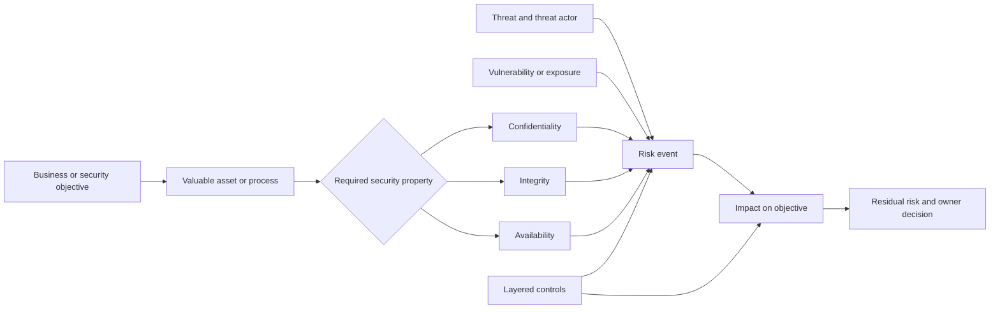

For enterprise email support, the objective might be “authorized employees receive legitimate business mail while suspicious messages are investigated safely.” Relevant assets include messages, mailboxes, identities, policy configuration, detection records, audit logs, and response time. The CIA requirements may conflict: broad access could improve investigation speed but harm confidentiality; aggressive blocking could protect confidentiality and integrity but reduce availability of legitimate mail; an unlogged manual override could restore availability but weaken integrity and accountability.

For SaaS support, the objective might be “the authorized security integration receives complete events and permits only approved actions.” Relevant assets include tokens, permissions, API responses, webhook payloads, service accounts, tenant configuration, event history, and the customer's workflow. A useful L1 response keeps the whole model in view rather than treating one error code as the entire problem.

**Analogy:** This model is like protecting a busy airport. The airport values passengers, aircraft, schedules, identity records, and safe operations. Threats and failures can affect privacy, correctness, or operation; controls such as identity checks, monitoring, maintenance, barriers, and recovery plans reduce different risks. The analogy stops because digital information can be copied without visibly disappearing, cloud responsibilities cross contractual boundaries, and a control may be implemented in software rather than at a physical checkpoint.

## Confidentiality, Integrity, and Availability

The **CIA triad** is a compact way to ask three different questions about any asset:

1. **Confidentiality:** Who is allowed to see or use it?
2. **Integrity:** How do we know it is accurate, complete, authentic enough for its purpose, and changed only in authorized ways?
3. **Availability:** Can authorized people and systems use it when the objective requires it?

The triad is not a product checklist. It is a reasoning lens. Privacy, safety, authenticity, accountability, resilience, and business requirements add detail, but CIA prevents a support engineer from protecting one property while accidentally damaging another.

| Property | Primary question | Email example | SaaS support example | Typical evidence | Common support mistake |
|---|---|---|---|---|---|
| **Confidentiality** | Who may access this data or capability? | Message body and attachment are visible only to authorized recipients and investigators | API token and tenant event payload are not disclosed in a ticket | Access records, role assignment, sharing scope, redacted capture | Asking for complete content or a live token when an ID is enough |
| **Integrity** | Is this information or behavior trustworthy for the decision? | Headers and evidence remain complete and unaltered; policy changes are authorized | Webhook events are authentic, ordered or deduplicated as required, and configuration matches intent | Hash/signature result, audit trail, configuration export, controlled comparison | Treating a screenshot, copied text, or workaround as proof of cause |
| **Availability** | Can authorized users perform the required action on time? | Legitimate mail reaches recipients and analysts can access investigation data | API, console, connector, and recovery path work during response | Health status, timestamps, error rates, test result, recovery validation | Disabling a control broadly to restore one workflow without risk review |

### Confidentiality from zero

Confidentiality does not mean “keep everything secret.” It means access matches authorization and purpose. A public knowledge article may require broad access. A customer's live bearer token, mailbox content, or incident details require narrow access. The key questions are: what data is involved, how sensitive is it, who needs it, for what purpose, through which approved channel, and for how long?

In email/SaaS support, confidentiality applies to more than visible content. Tenant identifiers, message identifiers, recipient lists, authentication headers, URLs, attachment names, audit events, user behavior, internal hostnames, cookies, access tokens, and screenshots can reveal sensitive context. Data minimization is therefore a security control: request the smallest authorized evidence that can separate the current hypotheses.

**Analogy:** Confidentiality is like a sealed envelope addressed to a particular recipient. The seal and address express intended access. The analogy stops because digital data may be copied many times, access can be delegated dynamically, and metadata can remain sensitive even when the “letter” is redacted.

### Integrity from zero

Integrity includes protection from unauthorized alteration, but it also includes completeness, provenance, and suitability for the decision. A log can be unchanged yet incomplete because retention expired. A copied email header can contain accurate text but lose the original context. An audit event can be genuine but interpreted against the wrong time zone. A configuration can match the documented default but differ from the customer's approved intent.

In support, preserve raw evidence where policy permits, record collection time and source, avoid editing the original, use sanitized working copies, and distinguish observation from inference. When comparing a failed user with a working control, verify that relevant conditions are actually comparable. Integrity also applies to case notes: unsupported certainty can corrupt the decision record even when the underlying logs are correct.

**Analogy:** Integrity is like a calibrated measuring scale with an unbroken record of calibration. A number is useful only if the instrument and handling make it trustworthy. The analogy stops because information integrity can involve authenticity, ordering, completeness, and authorization across many systems, not just measurement accuracy.

### Availability from zero

Availability means usable access for authorized purposes at the required time and quality. A service that technically responds but takes twenty minutes for every request may be unavailable for an urgent response workflow. A console that works for administrators but not the assigned analyst role may be unavailable to the intended user. A backup that exists but cannot be restored within the required period is not sufficient recovery evidence.

Availability depends on people, processes, facilities, networks, identity providers, Domain Name System (DNS), certificates, APIs, databases, queues, capacity, dependencies, monitoring, and recovery. L1 support should ask about scope, start time, failure mode, affected operation, viable workaround, and expanding impact. Availability pressure does not authorize disabling a security control; it raises a risk decision for the appropriate owner.

**Analogy:** Availability is like a fire exit: it must exist, remain reachable, open under the required conditions, and lead somewhere safe. The analogy stops because cloud availability can degrade rather than fail completely, and resilience may involve automated failover across many dependencies.

### An email/SaaS CIA sequence

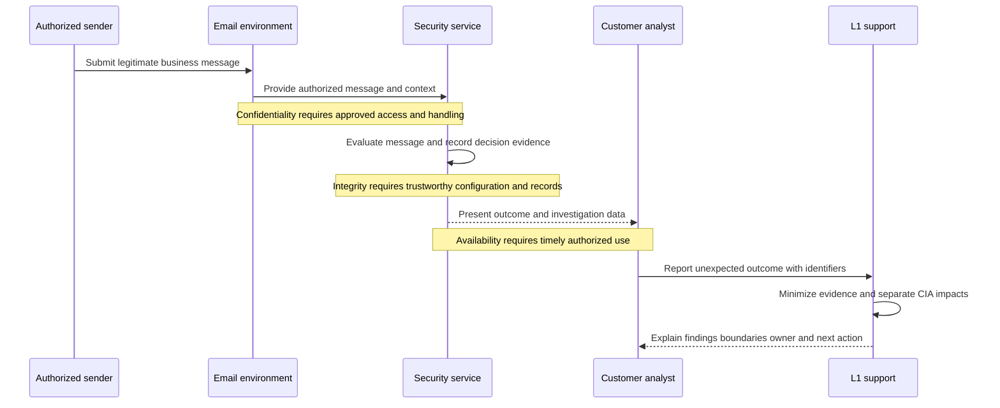

## 🔍 Plain-English deep-dive: CIA Is a Tradeoff Lens, Not Three Independent Switches

Security conversations often treat confidentiality, integrity, and availability as if each can be maximized independently. In real support work, an action can improve one property while weakening another.

Suppose a legitimate invoice email is quarantined during a time-sensitive payment process. Releasing it immediately may improve availability. If the requester's authorization and the message's integrity have not been checked, release may expose confidential information or enable fraud. Keeping it blocked indefinitely may avoid one risk while creating operational and financial harm. The correct path is not “always block” or “always release.” It is to gather minimum evidence, verify decision authority, apply the supported review process, and document residual uncertainty.

| Proposed action | Possible CIA benefit | Possible CIA cost | Safer L1 contribution | Decision owner boundary |
|---|---|---|---|---|
| Collect full message and attachment | More context may improve integrity of analysis | Unnecessary content disclosure harms confidentiality | Start with identifiers, timestamps, sanitized headers, verdict context, and approved collection path | Customer/data owner and vendor policy govern content sharing |
| Disable a policy | May restore availability quickly | Can weaken confidentiality or integrity for a broad scope | Define affected scope, compare control user, identify approved workaround, and escalate risk | Authorized customer admin/security owner decides change |
| Release a disputed message | Restores recipient access | Could deliver malicious or fraudulent content | Preserve evidence, follow supported review, explain uncertainty, and require authorized action | Customer's authorized security/mail owner decides release where applicable |
| Increase logging | Improves detection and investigation integrity | May collect sensitive data or affect cost/retention | Specify needed fields, time window, authorization, redaction, and retention | System/data owner approves collection configuration |
| Cache data for performance | Improves availability | Stale data can harm integrity; broad cache access can harm confidentiality | Validate freshness, scope, invalidation, and access behavior | Product/Engineering and customer owners control design/configuration |

The interviewer-ready lesson is: **identify which CIA property is being protected, which may be harmed, what evidence reduces uncertainty, and who is authorized to choose the tradeoff.** L1 support informs and executes approved diagnostics. It does not silently make the organization's risk decision.

## Assets and Data Classification

An **asset** is anything valuable enough that loss, disclosure, alteration, or interruption would matter. Assets are not only files. People, identities, services, configurations, integrations, reputation, contractual commitments, institutional knowledge, and decision processes can all be assets.

An asset inventory prevents tunnel vision. If a customer says “email is blocked,” the message is only one asset. The employee's time, the business transaction, the security policy, the investigation record, the customer tenant, and the organization's trust may also matter. Different assets can have different owners and CIA requirements.

| Asset category | Enterprise email/SaaS examples | Primary value | CIA questions for support | Likely owner or steward |
|---|---|---|---|---|
| Information | Message body, attachment, headers, audit event, investigation note | Communication and evidence | Who may see it? Is it complete? Is it available in time? | Data/business owner, security, legal, privacy |
| Identity | User account, service principal, administrator role, session | Authorized access and accountability | Is access least privilege? Is identity genuine? Can recovery occur? | Identity team and customer admin |
| Credential or secret | Password, token, cookie, certificate private key, webhook secret | Proof used to access a capability | Is it exposed? Has it been changed? Can it be rotated? | Credential/system owner |
| Configuration | Mail route, role, policy, connector, API scope, retention setting | Controls intended behavior | Is it approved, accurate, versioned, and recoverable? | Customer admin, product/service owner |
| Service and integration | Mail system, SaaS console, API, webhook, identity provider | Business and security workflow | Is it reachable, trustworthy, and resilient? | Vendor/customer service owners |
| Endpoint and network | Analyst device, DNS, proxy, firewall path, browser | Access path and evidence source | Is data protected in transit? Is path altered? Is access timely? | Customer IT/network/security |
| People and process | Analyst expertise, escalation path, approval workflow | Correct and timely decisions | Are roles clear? Can people act? Is process auditable? | Management and process owner |
| Reputation and obligation | Sender reputation, customer trust, legal/contractual duty | Continued operation and confidence | Could an action create disclosure, incorrect action, or delay? | Business, legal, security, leadership |

### Data classification

Data classification groups data by sensitivity and handling need. Organizations use different labels. A simple teaching model might use **Public**, **Internal**, **Confidential**, and **Restricted**, but L1 must use the customer's and employer's actual policy rather than impose these names.

| Illustrative class | Plain meaning | Email/SaaS examples | Support handling implications | Important limitation |
|---|---|---|---|---|
| **Public** | Approved for unrestricted disclosure | Published documentation or public status page | May be shared through approved public channels | “Available online” does not prove reuse is unrestricted or current |
| **Internal** | Intended for the organization or approved partners | Internal runbook, nonpublic architecture overview | Use approved internal systems; do not post publicly | Internal data can still create meaningful harm |
| **Confidential** | Disclosure should be limited to a defined business need | Customer configuration, user list, support logs, message metadata | Minimize, authorize, encrypt in transit, limit access and retention | Metadata can reveal sensitive relationships and behavior |
| **Restricted** | Highest-impact information requiring strict controls | Live tokens, private keys, regulated content, highly sensitive incident evidence | Usually do not collect in ordinary tickets; use a specialized approved path if truly required | Labels and exact handling come from policy and law, not this guide |

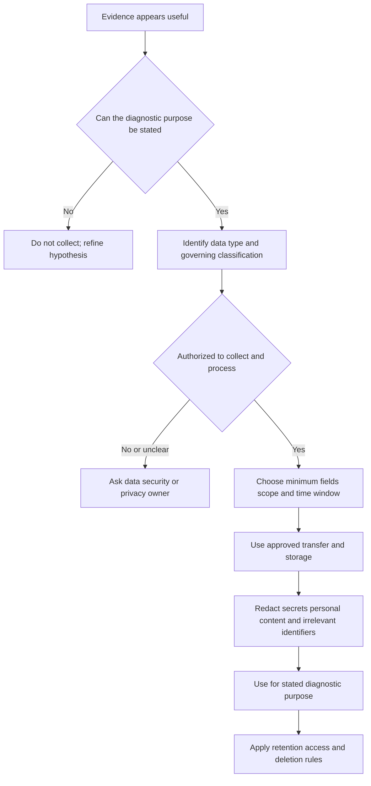

**Classification is not a substitute for judgment.** A collection of individually low-sensitivity fields can become sensitive when combined. A message identifier may look harmless but connect to a private investigation. A synthetic lab artifact may be shareable while a screenshot accidentally contains a real tenant name. Always inspect context.

## Threats, Threat Actors, Vulnerabilities, Exposures, Exploits, and Attack Surface

These terms describe different links in a causal chain. Mixing them produces poor troubleshooting and exaggerated conclusions.

| Concept | What it is | What it is not | Email/SaaS example | Support-safe question |
|---|---|---|---|---|
| **Threat** | Potential source or event of harm | Proof that harm occurred | Credential phishing, accidental policy deletion, provider outage | What harmful event are we considering? |
| **Threat actor** | Person, group, organization, or automation capable of acting | Automatically an external criminal | Fraud group, malicious insider, careless admin, automated bot | What capability, intent, and access are evidenced? |
| **Vulnerability** | Weakness that can be exploited or triggered | The harmful action itself | Overprivileged token, missing validation, weak recovery process | Which weakness enables the event? |
| **Exposure** | Reachability or placement in potential harm's path | Confirmation of compromise | Public API endpoint or broadly shared support artifact | What is reachable, by whom, and under what control? |
| **Exploit** | Technique or action using a vulnerability | Every failed request or suspicious message | Reusing a stolen token to call an over-scoped API | What observation shows the weakness was actually used? |
| **Attack surface** | Total reachable set of interfaces and trust relationships | A list only of software ports | Email, users, domains, APIs, admin UI, OAuth, webhooks, support process | Which surface is necessary, and how is it constrained? |
| **Event or incident evidence** | Observations about what happened | A complete explanation by itself | Audit login, message trace, policy change, request ID | Does evidence support occurrence, scope, and sequence? |

### Threat actors and motives

| Actor category | Possible motive or cause | Relevant support evidence | Caution |
|---|---|---|---|
| External criminal | Fraud, credential theft, extortion, resale | Authentication results, account events, message indicators, access logs | A suspicious indicator does not identify a person or group |
| Malicious insider | Fraud, revenge, espionage, unauthorized convenience | Authorized-account activity, policy changes, unusual access pattern | Support must avoid accusation and follow HR/legal/security procedures |
| Careless or mistaken insider | Error, misunderstanding, rushed change | Change record, training context, configuration difference | Error can cause major harm without malicious intent |
| Third party or supplier | Compromise, weak control, integration error | Vendor account activity, app grant, webhook behavior, dependency status | Shared responsibility and contracts determine available action |
| Automated abuse | Credential stuffing, scraping, spam, denial of service | Request volume, rate-limit events, source patterns | Automation can be benign or malicious; context matters |
| Environmental or operational event | Hardware, software, network, capacity, or process failure | Health signals, dependency errors, timing, recovery test | Not every security risk has a hostile actor |

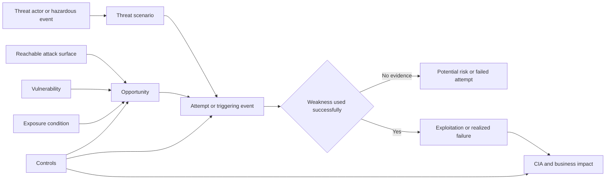

### Attack surface in enterprise email and SaaS support

An attack surface includes technology, people, and process. For a cloud email/SaaS environment it may include:

- sender and recipient identities;
- public domains and DNS records;
- mail transport and routing connectors;
- administrative portals and role assignments;
- Application Programming Interfaces (APIs), tokens, scopes, and service accounts;
- OAuth grants and third-party applications;
- webhooks and event receivers;
- browser sessions, endpoints, proxies, and network paths;
- support intake, remote sessions, evidence-transfer channels, and social-engineering opportunities;
- recovery, backup, break-glass access, and escalation processes.

Reducing attack surface does not mean deleting every interface. The organization needs useful functions. The goal is to remove unnecessary paths, constrain necessary ones, monitor them, keep them current, and recover when a layer fails.

## 🔍 Plain-English deep-dive: Exposure Is Not Exploitation

Imagine a building with a window facing a public street. The window is part of the exposed surface. If it is unlocked, that is a vulnerability. A person with motive and capability is a potential threat actor. Opening the window to enter is exploitation. Stealing documents is impact. The analogy stops because a network service may be intentionally public, authentication can mediate access, and digital exploitation can be remote, automated, and difficult to observe.

This distinction is critical in customer communication. An internet-facing SaaS login is exposed by design; that does not mean it is compromised. A token appearing in a screenshot creates a potential exposure; whether anyone used it requires evidence. A suspicious email may represent an attempted threat; whether a recipient opened a link, entered credentials, and produced account impact are separate questions.

Customer-safe phrasing:

- **Observation:** “The screenshot includes a visible token fragment and was attached to the case.”
- **Risk interpretation:** “That creates a credential-exposure concern because access to the case may be broader than the token's intended audience.”
- **Immediate support action:** “Restrict the artifact, follow the approved secret-handling escalation, and ask the authorized owner to rotate or revoke as policy requires.”
- **Boundary:** “I cannot conclude that the token was used without access evidence, and I do not independently accept the residual risk.”

Weak phrasing would be “the account was breached” when the only observation is a visible token. Strong security support is urgent without outrunning the evidence.

## Risk: Likelihood, Impact, Inherent Risk, and Residual Risk

Risk is not simply a vulnerability count. A weakness matters in relation to an asset, a threat scenario, existing conditions, possible consequences, and the controls that change likelihood or impact.

A useful risk statement follows this pattern:

> Because **[threat or hazardous event]** could use or trigger **[vulnerability/exposure]**, **[asset or objective]** may experience **[CIA and business impact]**.

Example:

> Because an unauthorized party could obtain a broadly shared integration token, the token's excessive read scope could expose synthetic message metadata and reduce customer trust.

This is stronger than “token risk: high” because it names the scenario, weakness, asset, and consequence.

### Likelihood

Likelihood is a reasoned estimate within a defined context and time. Inputs may include exposure, frequency, actor capability, intent, known activity, exploitability, dependency reliability, change history, and control performance. A support engineer usually has partial evidence. The correct response is to state assumptions and confidence rather than manufacture precision.

### Impact

Impact can include:

- confidentiality loss, including content, credentials, metadata, or investigation disclosure;
- integrity loss, including altered policy, missing events, forged evidence, or incorrect verdict decisions;
- availability loss, including delayed mail, unavailable console, failed integration, or inability to recover;
- financial, legal, regulatory, safety, contractual, operational, and reputational consequences;
- harm to customers, employees, partners, or response capability.

### Inherent and residual risk

**Inherent risk** describes risk before the selected controls are considered. **Residual risk** describes what remains after those controls are considered. The comparison is useful only when control assumptions are explicit.

| Risk view | Question | Synthetic token example | Evidence needed | Common error |
|---|---|---|---|---|
| Inherent | What could happen without the selected safeguards? | A long-lived, over-scoped token could expose message metadata if obtained | Asset/scope, exposure path, threat scenario, consequence | Pretending every existing condition is “no controls” |
| Control effect | How should safeguards change likelihood or impact? | Vault storage, least scope, short lifetime, monitoring, and revocation reduce opportunity and duration | Configuration, approval, audit events, tests | Listing controls without checking operation |
| Residual | What uncertainty and consequence remain? | Authorized misuse, zero-day failure, delayed detection, or dependency failure remains possible | Operating evidence, exceptions, incidents, limitations | Calling residual risk zero because controls exist |

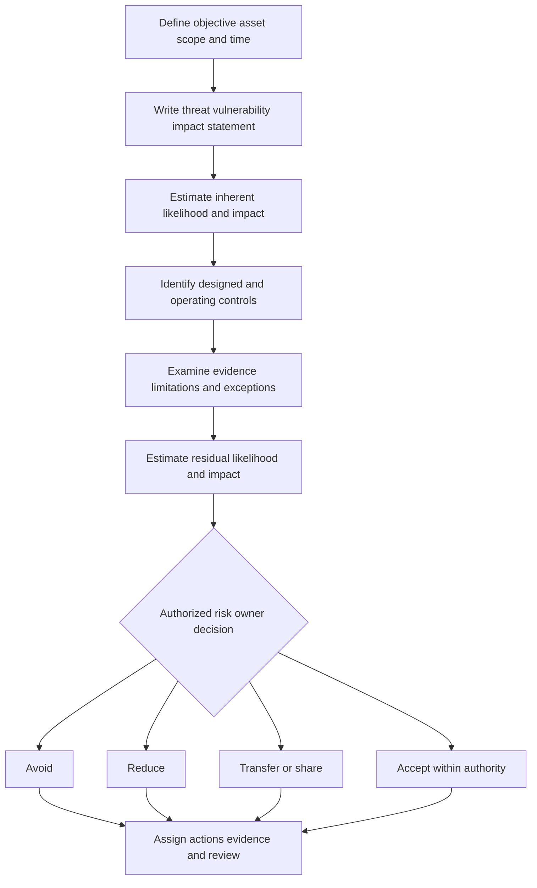

### Ordinal scoring and its limits

Many teams use labels or numbers such as likelihood 1-5 and impact 1-5. These are often **ordinal** scales: 4 means more than 3, but it does not prove exactly twice as much risk. Multiplying them creates a prioritization aid, not a scientific probability or expected-loss calculation.

| Score | Illustrative likelihood meaning | Illustrative impact meaning |
|---:|---|---|
| 1 | Rare under stated conditions; strong evidence of limited opportunity | Negligible interruption or sensitivity within synthetic scope |
| 2 | Unlikely but plausible | Limited users/data; easily reversible |
| 3 | Possible with credible path or uncertain control performance | Material workflow delay or bounded sensitive-data effect |
| 4 | Likely given exposure, history, or weak controls | Major operational, confidentiality, integrity, or trust effect |
| 5 | Expected or repeatedly observed in the defined period | Severe or widespread consequence requiring senior response |

Limitations must be recorded:

1. Scores depend on the defined scenario, time horizon, asset, and assumptions.
2. Different reviewers may interpret labels differently.
3. Multiplication hides uncertainty and can make unlike risks appear equivalent.
4. A low-frequency catastrophic event may need escalation despite a middling product score.
5. Dependencies and correlated failures violate simple independent assumptions.
6. Evidence quality and control effectiveness should influence confidence.
7. The customer's approved methodology, not this teaching scale, governs a real assessment.
8. An L1 engineer may contribute facts but does not invent thresholds or approve acceptance.

## 🔍 Plain-English deep-dive: Risk Scores Are Discussion Labels, Not Measured Truth

An ordinal risk score is like assigning small, medium, or large labels to boxes before loading a van. The labels help the team decide what needs attention and where it may fit, but “large” does not reveal exact weight, fragility, or value. Multiplying two labels does not turn them into a laboratory measurement. The analogy stops because security risk includes uncertainty, adaptive people, dependencies, legal duties, and consequences that cannot be reduced to box size.

Consider two synthetic risks that both score 12. One has likelihood 3 and impact 4: an uncertain but credible path to disclosure of sensitive message metadata. The other has likelihood 4 and impact 3: a recurring integration delay affecting a bounded response workflow. The same product does not make the risks interchangeable. They affect different assets, CIA properties, owners, time horizons, and control options. One may trigger a mandatory escalation regardless of score; the other may have an approved workaround.

The useful support behavior is to preserve the reasoning behind the number:

- define the exact scenario and time period;
- state what evidence supports likelihood;
- name the affected assets and consequences supporting impact;
- record assumptions, missing evidence, and confidence;
- identify which controls are assumed to operate;
- call out any policy threshold that overrides simple ranking;
- let the authorized risk owner use the organization's approved method.

In a customer update, avoid saying, “This is a 16, so it is high risk,” as if the arithmetic proves the conclusion. A safer explanation is, “Using the synthetic lab scale, this ranks High because exposure is already observed and the credential could access sensitive content. The score is a prioritization aid; token-use evidence, control operation, customer policy, and the authorized owner's decision still govern treatment.”

## Risk Appetite, Risk Tolerance, and the L1 Boundary

**Risk appetite** is broad, strategic willingness to take or retain certain risk in pursuit of objectives. **Risk tolerance** defines more specific boundaries or allowed variation. Some organizations also use limits, thresholds, or capacity. Exact governance language varies.

| Concept | Level | Email/SaaS illustration | Who normally defines or approves it | L1 role |
|---|---|---|---|---|
| Risk appetite | Strategic | Organization may have very low appetite for credential disclosure but some appetite for bounded service experimentation | Board/executive and enterprise risk leadership under governance | Understand relevant policy; do not infer appetite from urgency |
| Risk tolerance | Operational boundary | No live secrets in ordinary tickets; security console outage beyond a defined condition triggers escalation | Authorized business, security, service, and risk owners | Recognize threshold, document evidence, trigger process |
| Risk acceptance | Specific decision to retain residual risk | Authorized owner accepts a time-bounded integration limitation with monitoring | Named risk owner with required approvals | Supply facts, controls, limitations, and evidence; never self-approve |
| Technical workaround | Temporary method to restore or continue function | Approved manual export while integration is repaired | Customer/system owner and support process as applicable | Explain steps, scope, safeguards, validation, and expiry need |

Customer pressure does not transfer authority. “We accept the risk; disable it” may still require a verified requester, documented approval path, product-supported action, legal or security review, and change control. L1 should avoid sounding obstructive: acknowledge impact, offer approved alternatives, identify the required owner, and keep coordination moving.

## Controls and Safeguards

A **control** or **safeguard** is a measure that changes risk. Controls may reduce likelihood, reduce impact, improve detection, support recovery, or make decisions more accountable. One control can have multiple classifications, and classification depends on its objective and use.

### Control functions

| Function | Primary purpose | Email/SaaS example | Evidence of operation | Limit |
|---|---|---|---|---|
| **Preventive** | Stop or reduce the chance of an unwanted event | Least-privilege role, multi-factor authentication, blocked dangerous attachment type | Role export, policy configuration, controlled access test | Prevention can fail or be bypassed |
| **Detective** | Discover an event, condition, or control failure | Audit alert for unusual admin change; failed webhook monitoring | Alert record, log query, test event, acknowledged notification | Detection without response does not reduce duration enough |
| **Corrective** | Fix the condition that caused or permits harm | Remove excessive permission; correct routing policy | Change record, before/after comparison, validation | A fix may address symptom but not all causes |
| **Deterrent** | Discourage action by increasing perceived consequence or effort | Authorized-use notice, monitored administrator activity, sanctions policy | Published notice, acknowledgment, audit trail | Determined actors may not be deterred |
| **Compensating** | Provide alternative protection when the primary control is unavailable or impractical | Manual approval and restricted export while automated policy is repaired | Approved exception, review record, access list, expiry | Must address comparable risk and remain time-bounded |
| **Recovery** | Restore capability or trusted state after disruption | Restore configuration, revoke sessions, replay events safely, fail over service | Recovery test, restore log, reconciliation, customer validation | Recovery objectives may not meet all business needs |

### Administrative, technical, and physical controls

| Implementation type | Plain meaning | Email/SaaS examples | Typical evidence | Common misunderstanding |
|---|---|---|---|---|
| **Administrative** | Policies, procedures, governance, roles, training, and human decisions | Access-review procedure, incident escalation, secure support handling, change approval | Approved policy, training record, review minutes, ticket approval | “Administrative” does not mean weak or optional |
| **Technical** | Hardware or software mechanisms that enforce, detect, or recover | Authentication, encryption, role-based access, audit logging, backup, rate limiting | Configuration, logs, test result, code/version evidence | A configured feature may not operate effectively |
| **Physical** | Protection of facilities, devices, media, and physical access | Locked office, secured laptop, badge-controlled data center, media destruction | Badge review, inventory, inspection, disposal record | Cloud services still rely on physical infrastructure |

### One control, several classifications

Multi-factor authentication is usually a **technical preventive** control. Its enrollment procedure is an **administrative preventive** control. An alert for repeated bypass attempts is a **technical detective** control. A recovery process for a lost factor is an **administrative and technical recovery** control. This is why control classification should follow the control objective and actual implementation rather than a memorized one-to-one label.

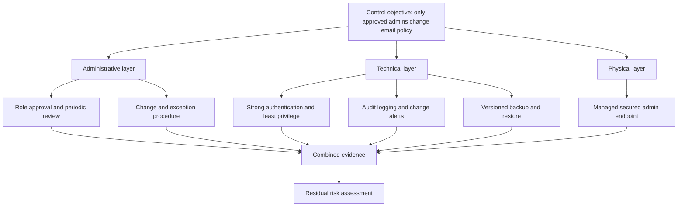

## 🔍 Plain-English deep-dive: A Control Existing Is Not the Same as a Control Working

A seat belt can be well designed, installed in a car, and still fail to protect a passenger if it is damaged, never worn, or used incorrectly. That separates **design effectiveness** from **operating effectiveness**. The analogy stops because security controls may be automated, distributed, probabilistic, dependent on data quality, and subject to shared responsibility.

**Design effectiveness** asks whether the control, if implemented as intended, is capable of addressing the stated risk. **Operating effectiveness** asks whether it was implemented, used, monitored, and maintained as intended over the relevant period.

| Question | Design effectiveness | Operating effectiveness |
|---|---|---|
| Core test | Could this control reasonably meet the objective? | Did it actually operate as intended in scope and time? |
| Token example | Short lifetime, narrow scope, secure storage, and revocation address exposure | Token has the approved scope, rotates on schedule, storage access is restricted, and revocation tests succeed |
| Email policy example | Change approval plus role restriction and audit alerts can protect policy integrity | Only approved roles changed policy; alerts fired; review occurred; exceptions were tracked |
| Evidence | Architecture, requirement, policy, configuration standard, threat model | Logs, samples across time, access reviews, tests, incidents, tickets, exception records |
| Failure | Control cannot address the scenario or has a coverage gap | Control is disabled, misconfigured, bypassed, stale, ignored, or not monitored |

### Evidence quality

Evidence should be sufficient for the claim but minimized for privacy. Useful properties include relevance, authenticity, completeness for the question, accurate time, known source, protected integrity, and traceable handling.

| Evidence item | Claim it may support | What it cannot prove alone | Customer-safe handling |
|---|---|---|---|
| Configuration export | Intended setting exists at collection time | That it existed historically or was enforced for every request | Redact tenant/user details and secrets; preserve timestamp |
| Audit event | A recorded action occurred under a given identity/context | Human intent or complete causation | Normalize time, preserve event ID, restrict access |
| Successful control test | Control works for tested conditions | Continuous effectiveness or all populations | Record scope, input, expected/actual, date, tester |
| Screenshot | Visible state at one moment | Full context, authenticity, hidden fields, or root cause | Crop only after preserving authorized original; remove sensitive content |
| Customer statement | Observed experience and impact | Technical cause | Record accurately and corroborate where needed |
| Absence of alert | No alert was found in searched data | Event did not occur | Document search scope, retention, filters, and coverage |

For an L1 engineer, evidence usually supports troubleshooting and escalation, not a formal audit opinion. Say “the test supports that the configured control operated for this synthetic case” rather than “the environment is compliant.”

## Defense in Depth, Least Privilege, and Zero Trust Introduction

### Defense in depth

**Defense in depth** uses multiple controls so that one failure does not automatically produce unacceptable harm. The layers should be meaningfully different and cover prevention, detection, response, and recovery. Five copies of the same fragile rule are not five independent defenses.

For a SaaS integration token, layers could include:

1. narrow permissions;
2. short lifetime and rotation;
3. secure secret storage;
4. network or workload identity constraints where supported;
5. audit logging and anomaly detection;
6. rapid revocation and incident procedure;
7. data minimization so successful misuse has less value.

For enterprise email, layers may include sender authentication, identity protection, behavioral or content analysis, user reporting, administrative controls, investigation, containment, and recovery. This is a vendor-neutral illustration, not a statement about Abnormal's internal design.

### Least privilege

**Least privilege** means granting only the access necessary for the approved task, to the right identity, for the needed scope and duration. It applies to users, administrators, service accounts, APIs, integrations, support engineers, and evidence repositories.

Least privilege is not “minimum access at any cost.” Access must still be sufficient for the objective and recoverable when legitimate needs change. A role that cannot perform the approved task creates availability pressure and encourages unsafe workarounds. Good support asks what action is required, which object scope is needed, how long access is needed, how it is approved, how use is logged, and how access is removed.

### Zero trust introduction

NIST describes zero trust as an approach that removes implicit trust based only on network location or asset ownership and focuses protection on resources. Common teaching principles are: verify explicitly, use least privilege, and assume compromise may occur. Part 004 teaches this fully.

Zero trust does **not** mean trust nobody emotionally, authenticate every packet manually, or buy one product. It means access decisions should use relevant identity, device, resource, policy, and context; trust should not be permanent or inherited merely because a request is “inside.”

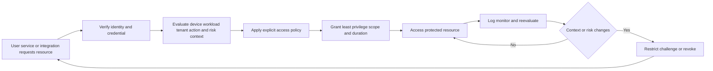

In customer-safe troubleshooting, zero-trust reasoning prevents “but the request came from our network” from ending the investigation. L1 may compare identity, role, token scope, device/workload, tenant, resource, policy, time, and audit decision. L1 should not ask customers to bypass conditional access or broad controls without the supported, authorized process.

## Shared Responsibility

Cloud and SaaS security is shared across provider, customer, users, and sometimes integration vendors. “Shared” does not mean every party owns every task equally. Responsibility depends on the service model, contract, configuration, data, integration, and event.

| Area | SaaS provider may own | Customer may own | User/integration owner may own | L1 support contribution |
|---|---|---|---|---|
| Cloud infrastructure | Physical facilities, platform operation, service resilience within commitments | Vendor selection and continuity planning | Use approved service paths | Explain service evidence and escalation boundary |
| Product security | Secure development, platform controls, vulnerability response | Configure available controls and manage tenant use | Follow approved client/integration practices | Distinguish product behavior from customer configuration |
| Identity and access | Product authentication and authorization capabilities | Identity provider, admin roles, user lifecycle, access policy | Protect credentials and use assigned access | Collect minimum role/auth evidence and route owner |
| Data | Platform processing and protection commitments | Classification, lawful use, sharing, retention choices, authorized users | Avoid improper disclosure | Minimize ticket evidence and follow approved channels |
| Configuration | Documented options and enforcement | Choose and approve tenant configuration | Avoid unauthorized changes | Compare expected/actual and preserve change evidence |
| Endpoint/network | Service endpoints and documented requirements | Device, DNS, proxy, firewall, TLS inspection, connectivity | Maintain approved endpoint | Isolate layer without blaming a party prematurely |
| Incident/risk decision | Vendor incident process for its environment | Customer incident response and risk decisions for its environment | Prompt reporting and cooperation | Supply product evidence; do not command customer response |

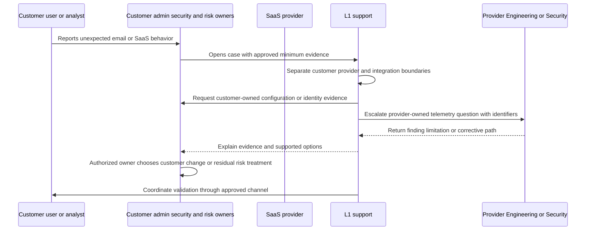

Shared responsibility should prevent blame, not create it. A proxy misconfiguration may be customer-owned, but the provider still owns clear requirements and useful error behavior. A service defect may be provider-owned, but the customer still owns its continuity decisions. L1 creates one evidence-based map and routes each action to the correct owner.

## Exceptions and Compensating Controls

An **exception** is a documented, authorized departure from a control requirement. A real exception includes a business reason, scope, risk, owner, approval, compensating controls, start and expiry dates, review conditions, and removal plan. An undocumented bypass is not an exception; it is an unmanaged condition.

| Exception field | Required question | Synthetic example |
|---|---|---|
| Requirement | Which control or rule is not being met? | Automated export role enforcement is temporarily unavailable |
| Business need | Why is temporary deviation necessary? | Analysts need a bounded report for a scheduled review |
| Scope | Which users, data, action, and environment are included? | Two named synthetic analysts; metadata-only export; lab tenant |
| Risk | What CIA harm could occur? | Manual handling may disclose data or produce incomplete records |
| Compensating controls | What alternative safeguards reduce comparable risk? | Admin performs export; second-person review; encrypted local storage; deletion after validation |
| Owner and approval | Who is authorized to approve? | Fictional service/risk owner, not L1 |
| Time limit | When does it expire or require review? | End of lab day or earlier after control restoration |
| Evidence | How will use and review be recorded? | Approval record, export log, reviewer checklist, cleanup manifest |
| Exit plan | How is normal control restored and verified? | Repair, retest all users, revoke temporary access, close exception |

L1 can identify that an exception is being requested, explain technical scope and safeguards, and route it. L1 should not label a workaround “risk accepted” unless the authorized owner and process have done so.

## Risk Treatment: Avoid, Reduce, Transfer, or Accept

Risk treatment is the authorized choice about what to do with a risk. The four common responses are not magic outcomes.

| Treatment | Meaning | Email/SaaS example | What remains necessary | L1 boundary |
|---|---|---|---|---|
| **Avoid** | Stop the activity creating the risk | Remove an unnecessary integration that requires dangerous scope | Validate dependencies, data cleanup, and business impact | Explain technical effect; owner decides to stop activity |
| **Reduce** | Add or improve controls to lower likelihood or impact | Narrow token scope, rotate secret, add monitoring and recovery | Test control, track residual risk and exceptions | Recommend supported options and evidence, not acceptance |
| **Transfer/share** | Shift or share financial or operational consequences through contract, insurance, or provider arrangement | Use a managed service or cyber insurance for defined loss | Accountability and residual risk usually remain | Do not claim liability disappeared; route contract questions |
| **Accept** | Authorized owner knowingly retains residual risk | Time-bounded operation with documented monitoring and approval | Rationale, authority, expiry/review, evidence, contingency | L1 never accepts on behalf of customer or employer |

“Transfer” does not transfer responsibility for due care, and insurance does not prevent harm. “Accept” does not mean ignore. “Reduce” does not guarantee elimination. “Avoid” can create new availability or business risk. Treatment decisions should record assumptions and owners.

## Control Lifecycle: Design, Implement, Operate, Evidence, Improve

Controls live through time. Requirements change, people leave, integrations gain scope, attackers adapt, certificates expire, and monitoring becomes noisy. A control lifecycle keeps safeguards connected to the risk.

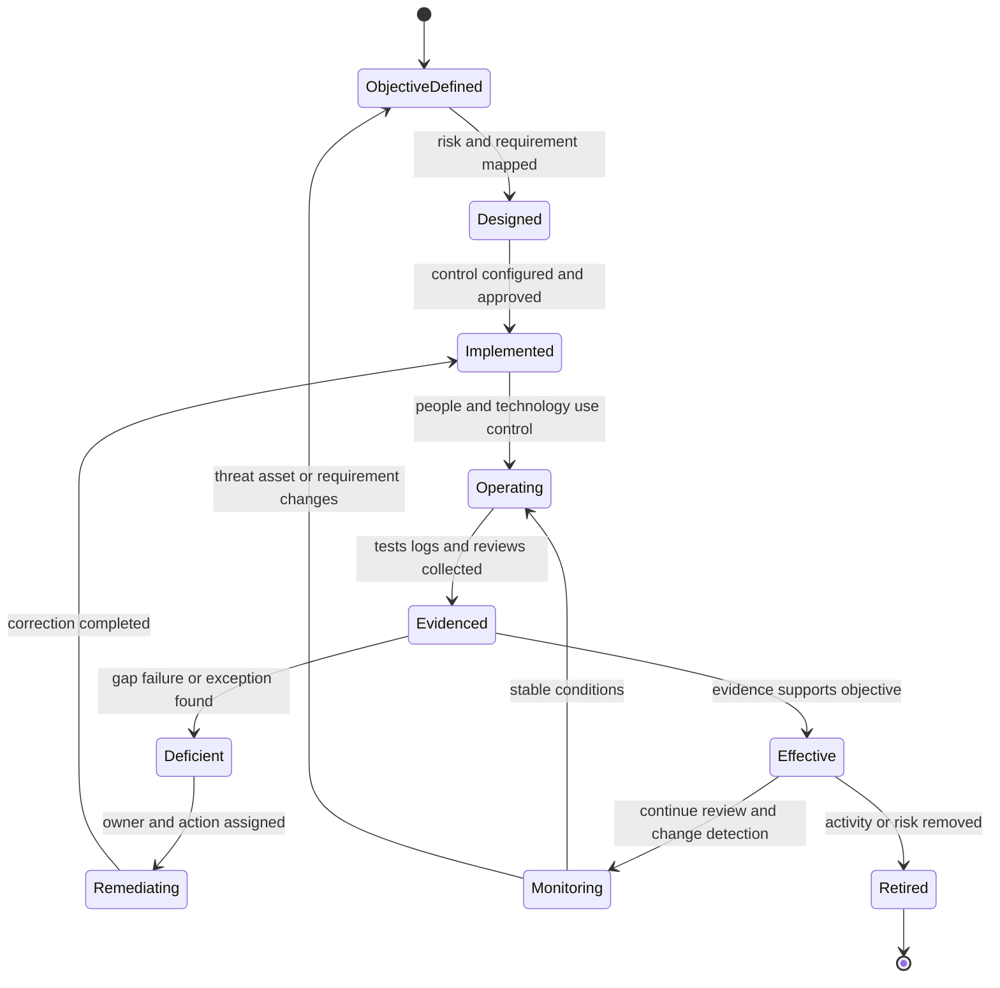

For support, the lifecycle changes the question from “Is logging enabled?” to:

- Which risk and control objective does logging support?
- Are required event sources and fields included?
- Are times synchronized and retention sufficient?
- Can authorized people access the evidence?
- Are alerts tested and acted upon?
- Are failures and exceptions visible?
- Does the collected data remain proportionate and protected?

That is operating-effectiveness thinking without pretending to perform a formal audit.

## Worked Examples

### Worked example 1: A disputed legitimate email

**Synthetic input:** An accounts-payable employee says a supplier invoice email was quarantined and asks Support to release it immediately. The message is time-sensitive. Only a message identifier, recipient, timestamp, and generic verdict category are initially available.

**Step 1 - Assets and objective:** The legitimate business communication, recipient mailbox, payment process, investigation evidence, and customer trust are assets. The objective is safe and timely handling, not simply delivery.

**Step 2 - CIA:** Availability is affected because the recipient cannot use the message. Integrity is at issue because invoice authenticity and verdict correctness are uncertain. Confidentiality matters because collecting the body and attachment could expose financial data.

**Step 3 - Threat/vulnerability:** Possible threats include supplier impersonation, compromised account use, or a false positive. A vulnerability could be weak out-of-band payment verification or overbroad release authority. None is proven.

**Step 4 - Evidence:** Start with minimum identifiers, relevant header/authentication results through an approved path, prior relationship context available in supported tooling, policy/verdict context, and authorized requester identity. Do not request live credentials or forward the attachment to a public service.

**Step 5 - Controls:** Preventive/detective controls may include message analysis, authentication, relationship context, quarantine, and approval. A compensating control may be out-of-band supplier verification while review continues. Release and payment decisions belong to authorized customer roles.

**Step 6 - Result:** L1 explains the current evidence and follows the product-supported review or escalation path. L1 does not declare the message safe, expose invented model logic, or accept the financial risk.

**Caveat:** This is a synthetic teaching scenario and not Abnormal product behavior.

### Worked example 2: A SaaS integration token appears in a ticket

**Synthetic input:** A customer attaches a screenshot showing part of a bearer token while troubleshooting an HTTP 401 response. A bearer token is a credential that generally grants the holder the token's allowed access.

**Reasoning:** The token is a restricted credential asset. Confidentiality is immediately relevant. The visible token creates exposure, but use by an unauthorized party is not proven. A long lifetime or excessive scope would be vulnerabilities that increase possible impact. The attack surface includes the ticket system, viewers, integrations, browser, and API endpoint.

**Immediate action:** Follow the approved secret-exposure procedure: restrict or remove the artifact if authorized, notify the customer not to post further secrets, route rotation/revocation to the token owner, and preserve minimum metadata needed to investigate the 401. Do not copy the token into notes or test it.

**Control classification:** Secret storage and narrow scopes are preventive technical controls; access-review procedure is administrative preventive; token-use logging is technical detective; revocation is corrective; a temporary restricted service account may be compensating only with formal approval; credential recovery and integration restoration are recovery controls.

**Evidence boundary:** A screenshot supports exposure concern. Token-use logs would be needed to investigate misuse. L1 supplies facts and coordinates; the customer's authorized security/risk owner handles risk decisions.

### Worked example 3: Event-export outage after a role change

**Synthetic input:** Three analysts can view alerts but cannot export events after an administrative role cleanup. The API returns 403, while a control user succeeds.

**CIA:** Availability is reduced for export, not the whole service. Integrity may be affected if manual work creates incomplete evidence. Confidentiality could be harmed by granting a broad administrator role as a quick workaround.

**Hypotheses:** The affected role lacks required permission; policy propagation is delayed; server-side authorization is incorrect; or the control user differs in another relevant condition.

**Discriminating test:** Compare redacted role and scope data for affected and control users, preserving request IDs and UTC timestamps. If visible roles match, escalate the internal authorization-decision question. Do not grant administrator access merely to prove that broader access works unless the authorized process explicitly permits a controlled test.

**Treatment and controls:** Reducing risk may involve correcting narrow permissions and adding role-change validation. A compensating manual export may protect availability if approved, access-restricted, reviewed for completeness, and time-bounded. The risk owner decides whether that temporary path is acceptable.

### Worked example 4: Logging exists but does not support investigation

**Synthetic input:** An audit feature is enabled, but an investigation cannot find the relevant policy change.

**Design questions:** Was the control designed to capture this event type, actor, target, result, timestamp, and correlation identifier? Is retention long enough? Is access available to authorized investigators?

**Operating questions:** Was the source connected? Did event collection remain healthy? Were filters or sampling applied? Was the customer's time range normalized? Did an exception disable logging? Did anyone test retrieval?

**Evidence:** Configuration proves only current setup. Health records, synthetic test events, retention settings, query details, and historical alerts support operation. Absence of a search result does not prove absence of the event.

**Outcome:** L1 documents the exact coverage gap and escalates the product or configuration question. A formal risk owner decides whether residual investigation limitations are tolerated or require remediation.

## Customer-Safe Troubleshooting Decision Tree

Use this tree when a customer reports a security-relevant email or SaaS condition. It moves from immediate safety to evidence and ownership without assuming every support case is a security incident.

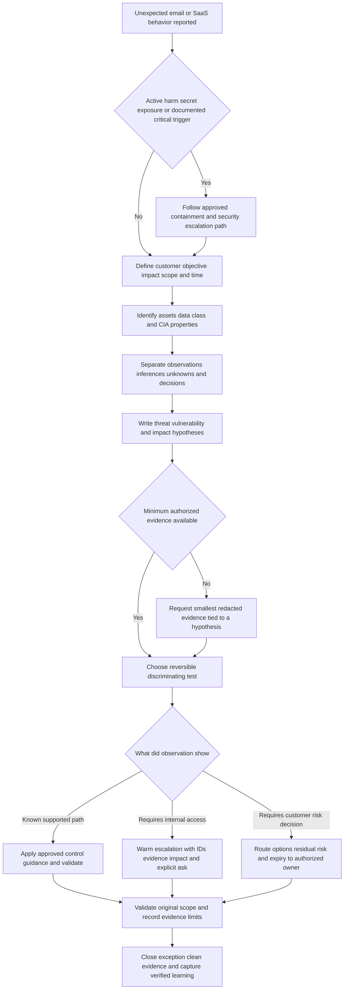

### Symptom-to-hypothesis-to-test-to-action table

| Symptom | Competing hypotheses | Lowest-risk discriminating test | Possible observation | Next action and boundary |
|---|---|---|---|---|
| Legitimate message unavailable | False positive, routing failure, policy action, permission issue | Trace identifier and supported verdict/routing evidence without unnecessary content | Message held by policy with review path | Follow authorized review; customer owner decides release where applicable |
| API returns 401 | Missing/expired token, wrong audience, malformed authorization, clock issue | Inspect sanitized status/body, token metadata without token value, and request time | Token expired before request | Owner rotates through approved path; never request live token |
| API returns 403 for some users | Role/scope difference, tenant policy, server defect | Compare affected/control role, request, resource, and IDs | Roles match but internal decisions differ | Escalate server authorization question; do not grant broad role casually |
| Audit event missing | Event not generated, source disconnected, retention/filter gap, wrong time range | Generate authorized synthetic test and inspect pipeline/retention/query scope | New test absent at source | Escalate collection health; record investigation limitation |
| Token visible in attachment | Accidental disclosure; unknown misuse | Restrict artifact and check approved access/use evidence | Exposure confirmed, no use evidence yet | Route rotation/revocation and security process; do not claim breach |
| Connector stopped delivering events | DNS/TLS/network issue, authentication, rate limit, queue, provider fault | Correlate timestamp and request ID across client/network/service evidence | Requests reach service and receive 429 | Apply documented retry/backoff; evaluate availability impact |
| Workaround restores function | Workaround bypasses root condition or masks intermittent issue | Repeat original scenario after controlled restoration and compare evidence | Only broad admin role works | Do not treat as resolution; investigate least-privilege design and owner decision |

## Common Failure Modes and Unsafe Shortcuts

| Failure mode | Why it is dangerous | Customer-safe correction | Escalation trigger |
|---|---|---|---|
| Treating every suspicious condition as a breach | Overstates evidence and can cause harmful response | State observation, possible scenario, evidence gap, and authorized next step | Confirmed or credible active compromise indicators under policy |
| Calling exposure exploitation | Confuses reachability with successful use | Ask what evidence shows access, execution, or impact | Secret exposure, active attempts, or missing telemetry needs security owner |
| Requesting all logs or full messages | Increases privacy risk and noise | Tie each field and time window to a hypothesis | Required evidence is highly sensitive or collection authority is unclear |
| Copying secrets into a case | Expands attack surface and retention | Stop collection, restrict artifact, and follow secret-response process | Any usable credential or key appears |
| Disabling controls to restore availability | Can widen confidentiality/integrity risk | Offer supported bounded workaround and route decision to owner | Customer requests broad bypass or impact is expanding |
| Assuming a configured control works | Ignores operating failure and exceptions | Ask for test, event, review, and time-based evidence | Product/internal telemetry or formal assurance is required |
| Treating no alert as proof of no event | Coverage, filtering, retention, or failure may hide evidence | Record search scope and test telemetry path | Investigation depends on unavailable or untrusted logs |
| Multiplying 1-5 scores as exact mathematics | Creates false precision | Label ordinal assumptions and use scores only for transparent prioritization | Formal assessment requires approved methodology |
| Letting L1 “accept the risk” | Exceeds authority and hides accountability | Identify risk owner, options, residual uncertainty, and needed approval | Any request for acceptance, exception, or policy waiver |
| Calling a workaround root cause | Restoration does not establish causation | State what the workaround changed and what remains unproven | Recurrence, broad impact, or internal behavior requires deeper review |
| Stacking identical controls | Correlated failure defeats “depth” | Use independent preventive, detective, corrective, and recovery layers | Common dependency or single point of failure is found |
| Blaming the customer under shared responsibility | Prevents collaboration and may be technically incomplete | Map each action to owner, evidence, and contract/documented boundary | Ownership dispute blocks progress |
| Permanent temporary exception | Control debt becomes invisible | Record owner, compensating controls, expiry, review, and exit plan | Exception expires, scope grows, or control is ineffective |
| Confusing compliance with security | Passing a requirement does not remove all risk | Treat compliance evidence as one input; validate actual objectives and operation | Legal/regulatory interpretation is required |

## CIA Risk Register and Control Classification Lab

### Lab purpose

Build a transparent, synthetic risk register for an enterprise email/SaaS support scenario. The lab demonstrates that you can inventory assets, classify data, write risk statements, use an ordinal scale honestly, distinguish inherent and residual risk, classify controls, request evidence, and route decisions to authorized owners. It does not simulate operating Abnormal AI and does not produce a formal enterprise risk acceptance.

### Honest artifact label

Place this exact label at the top of every lab artifact:

> **Local/public lab:** Produced from a synthetic CIA risk and control exercise. No Abnormal AI, customer, prior production, direct email-security, formal audit, or risk-acceptance authority is implied.

### Prerequisites

1. A local folder controlled by you.
2. A Markdown editor or spreadsheet application.
3. This Part's term primer, risk-statement pattern, control tables, and troubleshooting tree.
4. Synthetic identifiers only.
5. No tenant, email-security product, production service, credential, customer message, or live API is required.
6. Sixty to ninety minutes for a first pass and thirty minutes for review aloud.

### Authorized scope

| Scope item | Authorized in this lab | Out of scope |
|---|---|---|
| Environment | Local documents using the fictional `Contoso Signal Lab` scenario | Any real customer, employer, Abnormal, prior production, or third-party tenant |
| Data | Synthetic messages, identifiers, roles, events, scores, and screenshots created locally | Real email, personal data, credentials, logs, domains, case IDs, or confidential architecture |
| Network activity | None required | Scanning, sending test mail to others, visiting suspicious links, testing leaked credentials, or probing services |
| Security action | Paper analysis, classification, evidence planning, and owner routing | Exploitation, bypass, malware handling, phishing simulation, or unauthorized control change |
| Decision authority | Recommend questions, supported options, evidence, and escalation | Formal risk acceptance, customer containment command, legal/compliance conclusion, or control certification |

### Synthetic scenario

The fictional company **Contoso Signal Lab** uses a fictional cloud email security service and a separate fictional SaaS case-management integration. The integration exports message-alert metadata to an internal response queue. It does not export message bodies in the approved design.

At 09:00 UTC, a synthetic administrator broadens the integration token from metadata-read scope to message-content-read scope to troubleshoot missing fields. The change has no recorded approval. At 09:20 UTC, the token appears in a screenshot attached to a fictional support case. At 09:35 UTC, analysts report that the event queue is delayed by twenty minutes. Audit logging is configured, but no one has tested whether token-use and scope-change events are searchable. A documented manual metadata export can maintain the priority workflow for two hours. No evidence shows unauthorized token use, message-content access, or malicious activity.

The case has three immediate concerns:

1. **Confidentiality:** the token is exposed and now has excessive content scope.
2. **Integrity:** the unapproved scope change and untested audit coverage reduce confidence in configuration and evidence.
3. **Availability:** delayed events may slow the response workflow.

The fictional L1 engineer can restrict the support attachment through an approved case procedure, tell the customer not to send secrets, collect sanitized IDs and timestamps, and coordinate supported troubleshooting. The L1 cannot use the token, change customer configuration, declare a breach, accept residual risk, or approve an exception.

### Step 1: Create the asset and data inventory

Use at least the following rows and add any justified asset discovered during analysis.

| Asset ID | Asset | Business/security purpose | Data/classification assumption | CIA priority | Owner/steward assumption | Support handling |
|---|---|---|---|---|---|---|
| A-01 | Integration token | Authorizes event export | Restricted credential | C: very high; I: high; A: medium | Customer integration/identity owner | Never record value; use token ID and metadata only |
| A-02 | Message-alert metadata | Supports analyst triage | Confidential | C: high; I: high; A: high | Customer security/data owner | Minimize fields and use synthetic records |
| A-03 | Message content | Supports deeper authorized investigation | Restricted or policy-defined | C: very high; I: high; A: context-dependent | Customer data/business owner | Not needed for this lab or initial support test |
| A-04 | Integration configuration | Defines scope, endpoint, and behavior | Confidential | C: medium; I: very high; A: high | Customer SaaS/integration admin | Redacted export and change record only |
| A-05 | Audit trail | Supports accountability and investigation | Confidential | C: high; I: very high; A: high | Customer security/platform owner | Event IDs, UTC time, actor, action, result; redact identities |
| A-06 | Event queue | Delivers alerts to response process | Confidential service/process | C: high; I: high; A: very high | Customer response/service owner | Use counts, delay, IDs, and synthetic payloads |
| A-07 | Support case artifact | Coordinates diagnosis | Confidential; token makes screenshot restricted | C: very high; I: high; A: medium | Vendor/customer support owners under policy | Restrict artifact, preserve approved metadata, clean copy |
| A-08 | Analyst response workflow | Enables timely review | Internal process | C: medium; I: high; A: very high | Customer SOC/process owner | Record impact and workaround; no invented incident status |

**Validation:** Every asset must have a purpose, classification assumption, CIA priority, owner assumption, and handling rule. Mark the classification as an assumption because a real organization supplies its own labels.

### Step 2: Draw the scenario and attack surface

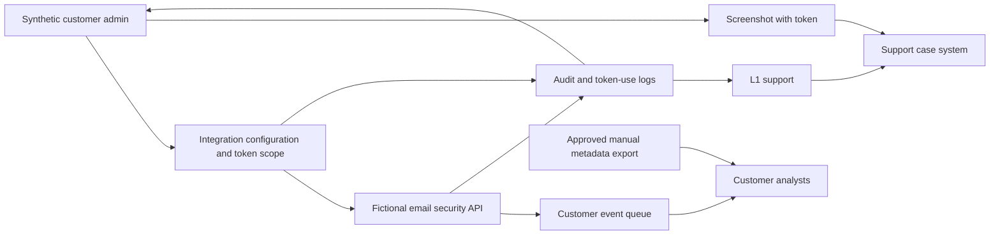

Mark these trust and attack-surface points in the artifact: admin identity, token storage, token scope, API endpoint, event queue, audit pipeline, support attachment, case viewers, manual-export path, and analyst access. State that a surface is not proof of attack.

### Step 3: Write threat-vulnerability-risk statements

Create at least five statements. Use the complete pattern rather than a one-word label.

| Risk ID | Threat or hazardous event | Vulnerability/exposure | Asset and CIA effect | Complete risk statement |
|---|---|---|---|---|
| R-01 | Unauthorized party obtains screenshot | Token appears in support attachment and may be usable | A-01/A-03 confidentiality | Because an unauthorized party could access the attached screenshot, the exposed over-scoped token could permit disclosure of synthetic message content beyond the approved metadata purpose |
| R-02 | Authorized or unauthorized token use exceeds purpose | Token has content-read scope without recorded approval | A-03 confidentiality and A-04 integrity | Because the integration token has excessive unapproved scope, use of the token could access content beyond business need and undermine configuration integrity |
| R-03 | Investigation cannot establish token activity | Audit coverage is configured but untested | A-05 integrity and availability | Because token-use and scope-change logging has not been validated, responders may be unable to determine use and scope promptly, increasing uncertainty and response delay |
| R-04 | Queue delivery degrades or fails | Twenty-minute delay and uncertain dependency state | A-06/A-08 availability and integrity | Because the integration queue is delayed and its failure boundary is unknown, analysts may receive incomplete or late alert metadata and make delayed decisions |
| R-05 | Temporary manual process introduces error or disclosure | Manual export depends on human handling | A-02 confidentiality/integrity and A-08 availability | Because the availability workaround requires manual metadata export, incorrect scope, recipient, or file handling could disclose data or create incomplete response records |
| R-06 | Unapproved configuration persists | No approval, expiry, or review exists | A-04 integrity; A-01/A-03 confidentiality | Because the scope change lacks governance and expiry, excessive access may persist after troubleshooting and become normalized |

Do not write “token was stolen” or “messages were breached.” The scenario establishes exposure and excessive scope, not use or impact realization.

### Step 4: Define the ordinal scoring method

Use likelihood and impact scores from 1 to 5. Record a product only to group priorities:

$$
\text{Teaching priority score} = \text{Likelihood rank} \times \text{Impact rank}
$$

Use these bands only for this lab: 1-4 Low, 5-9 Moderate, 10-16 High, and 17-25 Very High. Then put this warning above the register:

> **Ordinal limitation:** A score of 4 is ranked above 2 but is not proven to be twice as likely or harmful. Multiplication does not create a probability, financial estimate, or formal acceptance threshold. Scores depend on synthetic assumptions, evidence quality, time horizon, and reviewer judgment. Real work must use the organization's approved method and authorized owners.

For each likelihood score, cite exposure, actor opportunity, frequency, and controls. For each impact score, cite asset, CIA property, scope, reversibility, response consequence, and uncertainty. Add a confidence value of Low, Medium, or High; confidence is not multiplied.

### Step 5: Score inherent risk

Assume the selected controls listed in the next step are absent when estimating inherent risk. Do not pretend the environment has literally no safeguards; state the counterfactual controls excluded.

| Risk ID | Inherent likelihood | Rationale | Inherent impact | Rationale | Priority score/band | Confidence |
|---|---:|---|---:|---|---|---|
| R-01 | 4 | Token is present in a case artifact accessible to an uncertain support audience | 5 | Over-scoped credential could expose high-sensitivity content | 20 / Very High | Medium |
| R-02 | 4 | Scope is active and broader than approved purpose | 5 | Content confidentiality and configuration governance could be materially harmed | 20 / Very High | High |
| R-03 | 3 | Logging exists but coverage and searchability are unknown | 4 | Missing evidence could delay scope and response decisions | 12 / High | Low |
| R-04 | 4 | Delay is already observed | 4 | Response workflow can be materially delayed or incomplete | 16 / High | High |
| R-05 | 3 | Manual handling is plausible during the two-hour workaround | 3 | Bounded metadata disclosure or completeness error is possible | 9 / Moderate | Medium |
| R-06 | 4 | No approval, expiry, or review is recorded | 4 | Excessive access can persist and compound confidentiality risk | 16 / High | High |

These values are arguable, not facts. A high-quality lab can choose different scores if rationales and assumptions are consistent.

### Step 6: Identify and classify controls

| Control ID | Control objective | Synthetic control | Function | Implementation type | Risk addressed | Evidence |
|---|---|---|---|---|---|---|
| C-01 | Prevent use of exposed credential | Authorized owner revokes token and issues narrow-scope replacement | Corrective and preventive | Technical plus administrative approval | R-01, R-02, R-06 | Revocation event, new token metadata, scope test; never token value |
| C-02 | Limit content access to approved purpose | Metadata-only least-privilege scope with periodic review | Preventive | Technical and administrative | R-02, R-06 | Scope export, owner approval, review record |
| C-03 | Reduce exposure through support handling | Restrict/remove unsafe attachment and use redacted evidence procedure | Corrective and preventive | Administrative and technical | R-01 | Case audit event, sanitized replacement, handling record |
| C-04 | Detect credential and scope misuse | Searchable scope-change and token-use audit events with alerting | Detective | Technical | R-01, R-02, R-03, R-06 | Synthetic test events, query results, alert acknowledgment |
| C-05 | Restore timely analyst access | Diagnose queue delay and restore normal delivery | Corrective and recovery | Technical and administrative coordination | R-04 | Queue metrics, request IDs, before/after delay, analyst validation |
| C-06 | Maintain bounded operation during delay | Approved two-hour manual metadata export with second-person review | Compensating and recovery | Administrative and technical | R-04, R-05 | Approval, export log, reviewer checklist, expiry |
| C-07 | Discourage unauthorized changes | Administrator-use notice, policy, and accountable change logging | Deterrent and detective | Administrative and technical | R-02, R-06 | Policy acknowledgment and immutable-enough audit event |
| C-08 | Return configuration to trusted state | Versioned configuration backup and tested rollback | Recovery and corrective | Technical | R-04, R-06 | Restore test, configuration comparison, validation |

For each control, write whether it is **key** to reducing the risk or **supporting**. Record dependencies. For example, C-04 depends on reliable time, event generation, retention, access, and response. C-06 depends on approved users, a defined dataset, secure storage, review, and deletion.

### Step 7: Assess design and operating effectiveness

| Control ID | Design question | Operating evidence expected | Synthetic conclusion | Gap/action |
|---|---|---|---|---|
| C-01 | Does revocation stop use and does replacement scope meet purpose? | Revocation test and metadata-only API test | Design appears suitable; operation not yet evidenced | Owner revokes and performs controlled test |
| C-02 | Can the integration work with metadata-only scope? | Documented requirement and successful least-scope test | Original approved design says yes | Restore narrow scope and review grants |
| C-03 | Can case access and artifact retention be restricted promptly? | Case access audit and sanitized artifact | Procedure assumed available | L1 follows approved process and records completion |
| C-04 | Are required events generated, searchable, retained, and acted on? | Synthetic scope-change and token-use events end to end | Operating effectiveness unknown | Run authorized test; escalate missing coverage |
| C-05 | Does correction restore normal queue timeliness and completeness? | Delay metric, event reconciliation, analyst validation | Not yet operating | Troubleshoot dependency and validate original scope |
| C-06 | Does manual path preserve confidentiality, completeness, and timeliness? | Approval, restricted export, second review, deletion | Suitable only for bounded two-hour use | Document exception and expiry; stop after recovery |
| C-08 | Can trusted configuration be restored within need? | Recent restore test and comparison | Unknown | Test in safe synthetic environment before reliance |

Do not conclude “effective” merely because a control is listed. Use **designed**, **implemented**, **operating evidence available**, **deficient**, or **not assessed** precisely.

### Step 8: Calculate residual risk with explicit assumptions

Assume C-01 through C-06 operate as described for the bounded lab. Re-score and record remaining uncertainty.

| Risk ID | Controls considered | Residual likelihood | Residual impact | Score/band | Remaining uncertainty | Decision owner/escalation |
|---|---|---:|---:|---|---|---|
| R-01 | C-01, C-03, C-04 | 2 | 4 | 8 / Moderate | Past access to screenshot and token use may be incompletely known | Customer security/integration owner; escalate secret exposure |
| R-02 | C-01, C-02, C-04 | 2 | 4 | 8 / Moderate | Authorized misuse and review gaps remain possible | Customer data/integration risk owner |
| R-03 | C-04 | 2 | 3 | 6 / Moderate | Logging coverage may miss a dependency or historical period | Customer/provider service owners; Engineering if product telemetry gap |
| R-04 | C-05, C-06 | 2 | 3 | 6 / Moderate | Queue could degrade again; manual path has limited duration | Customer service/SOC owner with provider support |
| R-05 | C-06 | 2 | 3 | 6 / Moderate | Human error and local handling remain | Customer process/data owner approves bounded exception |
| R-06 | C-01, C-02, C-04 | 1 | 4 | 4 / Low | Future unauthorized changes remain possible | Customer admin/security governance owner |

Residual impact may remain high even when likelihood falls. Revocation reduces future use but cannot undo any disclosure that occurred before revocation. “Low” on the teaching band does not mean acceptable or zero; the authorized owner applies real tolerance and policy.

### Step 9: Record the owner and escalation boundary

| Decision/action | Primary owner | L1 contribution | L1 must not do |
|---|---|---|---|
| Restrict unsafe case artifact | Approved support/case owner under procedure | Identify exposure, stop further sharing, preserve minimal audit metadata | Download, reuse, or redistribute token |
| Revoke/replace token | Customer integration/identity administrator | Explain urgency and evidence; coordinate validation | Use or rotate customer credential independently |
| Decide whether incident process starts | Customer security/SOC and applicable provider security | Supply observations, scope, timestamps, and uncertainty | Declare breach or command customer containment |
| Approve temporary manual export | Customer service/data/risk owner | Describe technical scope, compensating controls, evidence, and expiry | Accept residual risk or invent approval |
| Investigate provider-side queue behavior | Provider support/Engineering according to process | Supply IDs, time, expected/actual behavior, tests, and impact | Claim internal cause without evidence |
| Approve long-term residual risk | Named organizational risk owner | Provide register, control evidence, limitations, and options | Sign, imply, or communicate acceptance as own decision |
| Interpret contractual or regulatory duty | Legal, privacy, compliance, and authorized leadership | Preserve facts and route promptly | Give legal conclusion |

Create a customer update that states: exposure is confirmed; unauthorized use is not confirmed; the token owner should follow the approved revoke/replace process; queue delay and audit coverage are under separate tests; the manual path requires owner approval and expires; and L1 will update at a controlled time.

### Step 10: Record evidence and artifacts

Create these files or worksheet tabs locally. They are artifact requirements, not additional guide Parts.

| Artifact | Required content | Evidence label |
|---|---|---|
| `01-scope-and-assumptions` | Authorized scope, exclusions, scoring warning, roles, date | Local/public lab |
| `02-asset-data-inventory` | Assets, purpose, classification assumptions, CIA, owner, handling | Local/public lab |
| `03-attack-surface-map` | Diagram and trust/surface notes | Local/public lab |
| `04-risk-register` | Complete statements, inherent/residual scoring, rationale, confidence | Local/public lab |
| `05-control-classification` | Objective, function, implementation type, dependencies, evidence | Local/public lab |
| `06-effectiveness-and-evidence` | Design/operation questions, expected evidence, gaps | Local/public lab |
| `07-owner-exception-escalation` | Responsibility, approval boundary, exception fields, expiry | Template only plus local lab |
| `08-customer-update` | Observation, CIA impact, actions, owners, boundaries, next time | Template only |
| `09-validation-and-cleanup` | Rubric scores, privacy search, deletion, limitations, reviewer | Local/public lab |

Evidence entries should include source, UTC time, collector/creator, purpose, handling, and limitation. Example:

> `EV-04`: Synthetic token-scope metadata, created locally at 10:00 UTC, shows `message.content.read` in the fictional scenario. Supports excessive-scope analysis only. Contains no token value, tenant, user, or real endpoint.

### Cleanup and privacy

1. Search all artifacts for `@`, `http`, `Bearer`, `token=`, `Authorization`, tenant names, case IDs, GUID-like strings, user paths, comments, and document metadata.
2. Confirm every name and identifier is synthetic and listed in the scenario.
3. Do not create a realistic usable secret. Use labels such as `[SYNTHETIC-TOKEN-REDACTED]`.
4. Remove hidden spreadsheet sheets, revision history, comments, author metadata, and thumbnails before sharing.
5. Store locally or in an approved private learning location.
6. Delete temporary screenshots and drafts after the final sanitized artifacts are produced.
7. Record: `Privacy review completed: [date] by [owner].`
8. Record: `Lab limitation: structured support and risk reasoning only; no production platform, formal audit, or risk acceptance.`

### Validation rubric

Score each category from 0 to 4. The maximum is 48.

| Category | 0 | 2 | 4 |
|---|---|---|---|
| Scope and authorization | Real/unclear environment | Synthetic but exclusions incomplete | Fully synthetic, bounded, and prohibited actions explicit |
| Asset inventory | Generic asset list | Assets named with partial ownership | Purpose, class, CIA, owner, and handling complete |
| Term precision | Threat/vulnerability/exploit mixed | Mostly correct | Every causal term used distinctly and evidenced |
| Risk statements | Labels only | Some scenario detail | Threat, weakness, asset, CIA, and consequence complete |
| Scoring honesty | Numbers presented as fact | Warning present | Rationale, assumptions, confidence, ordinal limits, and approved-method boundary explicit |
| Inherent/residual distinction | No distinction | Scores differ without control logic | Selected controls and remaining uncertainty explain change |
| Control classification | One label per control without purpose | Functions/types mostly correct | Objective, function, type, dependency, evidence, and limitation complete |
| Effectiveness | Existence treated as success | Design and operation mentioned | Design and operating evidence assessed separately |
| CIA tradeoffs | One property only | Multiple properties listed | Benefits, costs, workaround, and decision owner connected |
| Owner boundary | L1 appears to decide risk | Some owners listed | Every approval, treatment, exception, and escalation has authorized owner |
| Evidence/privacy | Broad or unsafe collection | Basic redaction | Minimum purpose-bound evidence, metadata, retention, and cleanup complete |
| Communication | Overconfident or vague | Facts mostly clear | Observation, risk, action, owner, uncertainty, and checkpoint are customer-safe |

**Pass standard:** 38/48 or higher, with no score below 3 for scope/authorization, scoring honesty, owner boundary, or evidence/privacy. A peer should be able to identify why each risk score changed and who owns every decision. Rework any unsupported “breach,” “effective,” “compliant,” “root cause,” or “accepted” claim.

## Official Source Anchors

All sources below were accessed on **August 24, 2026**. Standards and guidance can be revised, withdrawn, or superseded. Product, contractual, legal, and organizational requirements must be revalidated before use. Your own CV remains the only source for your production-experience claims.

| Official source title or family | URL | Access date | Use in this Part and caution |
|---|---|---|---|
| Supplied Abnormal AI Technical Support Engineer JD represented in the confirmed master | No public URL supplied | August 24, 2026 | Role responsibilities, case types, customer trust, and collaboration signals; no private workflow inferred |
| Your CV and master evidence summary | Local supplied source; no public URL | August 24, 2026 | enterprise support, networking learning, analytics, escalation, and communication transfers; no security-production details invented |
| NIST Cybersecurity Framework 2.0 | <https://www.nist.gov/cyberframework> | August 24, 2026 | Govern, Identify, Protect, Detect, Respond, and Recover outcome framework; not a certification or one-size control list |
| NIST SP 800-30 Revision 1, Guide for Conducting Risk Assessments | <https://csrc.nist.gov/pubs/sp/800/30/r1/final> | August 24, 2026 | Threat, vulnerability, likelihood, impact, and risk-assessment discipline; this lab is not a formal NIST assessment |
| NIST SP 800-37 Revision 2, Risk Management Framework for Information Systems and Organizations | <https://csrc.nist.gov/pubs/sp/800/37/r2/final> | August 24, 2026 | Risk management lifecycle, authorization, monitoring, and organizational responsibility concepts |
| NIST SP 800-53 Revision 5, Security and Privacy Controls for Information Systems and Organizations | <https://csrc.nist.gov/pubs/sp/800/53/r5/upd1/final> | August 24, 2026 | Control families, control objectives, assessment thinking, and safeguards; controls must be tailored and governed |
| NIST SP 800-53A Revision 5, Assessing Security and Privacy Controls | <https://csrc.nist.gov/pubs/sp/800/53/a/r5/final> | August 24, 2026 | Examine, interview, and test assessment methods and evidence concepts; L1 troubleshooting is not a formal assessment |
| NIST SP 800-207, Zero Trust Architecture | <https://csrc.nist.gov/pubs/sp/800/207/final> | August 24, 2026 | Resource-focused access and removal of implicit trust based on network location; expanded in Part 004 |
| NIST Glossary | <https://csrc.nist.gov/glossary> | August 24, 2026 | Official security-term reference family; definitions can vary by source and context |
| CISA Zero Trust Maturity Model Version 2.0 | <https://www.cisa.gov/sites/default/files/2023-04/zero_trust_maturity_model_v2_508.pdf> | August 24, 2026 | Practical zero-trust pillars and maturity framing; not an Abnormal architecture claim |
| Microsoft shared responsibility in the cloud | <https://learn.microsoft.com/en-us/azure/security/fundamentals/shared-responsibility> | August 24, 2026 | Official cloud shared-responsibility teaching model; exact responsibilities vary by service and contract |

### Source discipline

- **Official framework fact:** NIST and CISA sources provide public risk, control, assessment, and zero-trust guidance.
- **Official vendor guidance:** Microsoft's cloud responsibility page illustrates how provider/customer responsibilities change by service model; it does not define Abnormal's contract.
- **Teaching framework:** The tables, lab scale, score bands, memory hooks, and scenario are created for study. They are not official NIST scoring rules or Abnormal methods.
- **Synthetic evidence:** Contoso Signal Lab, its token, queue, events, scores, owners, times, and controls are fictional.
- **Candidate evidence:** Only your own CV and the master curriculum support your production-transfer claims.
- **Prohibited inference:** No Abnormal control implementation, detection logic, email verdict, risk appetite, customer responsibility, severity, or internal process is asserted.

## Interview Q&A

### Q1.

**Question:** What are confidentiality, integrity, and availability, and why do they matter in support?

**Model answer:** Confidentiality means information and capabilities reach only authorized people and systems; integrity means data, configuration, and evidence remain accurate, complete, and changed only as authorized; availability means approved users can use them when required. In an email or SaaS case I check all three because a fast workaround can restore availability while exposing content or weakening policy integrity. I identify the affected asset, minimize evidence, explain the tradeoff, and route the decision to the authorized owner.

### Q2.

**Question:** Explain threat, vulnerability, exposure, exploit, and risk without mixing them.

**Model answer:** A threat is a potential harmful event or source. A threat actor is who or what may act. A vulnerability is a weakness; an exposure places an asset within reach; an exploit is the method or action that uses a weakness. Risk is the effect of uncertainty on an objective, informed by the scenario's likelihood and impact. A visible token is an exposure; excessive scope is a vulnerability; unauthorized use would be exploitation; disclosure or misuse would be impact. I would not call exposure a breach without use evidence.

### Q3.

**Question:** What is the difference between inherent and residual risk?

**Model answer:** Inherent risk is considered before the selected controls are applied; residual risk remains after control design and operating evidence are considered. For an over-scoped token, inherent risk may be high because acquisition could expose sensitive data. Narrow scope, secure storage, rotation, logging, and revocation reduce likelihood or impact, but misuse, detection gaps, and dependency failures can remain. Residual risk is never automatically zero, and its acceptance belongs to an authorized risk owner, not L1 support.

### Q4.

**Question:** How do preventive, detective, corrective, deterrent, compensating, and recovery controls differ?

**Model answer:** Preventive controls reduce the chance of an event; detective controls discover events or failures; corrective controls fix a condition; deterrent controls discourage action; compensating controls provide alternative protection when the primary control is unavailable; and recovery controls restore capability or trusted state. One safeguard can serve several functions. I classify it by objective and actual use, then ask for operating evidence rather than assuming a configured feature works.

### Q5.

**Question:** What is the difference between administrative, technical, and physical controls?

**Model answer:** Administrative controls are governance, policies, roles, training, approvals, and procedures. Technical controls are hardware or software mechanisms such as authentication, encryption, access rules, logging, and backup. Physical controls protect facilities, devices, and media. Effective defense usually combines them: an approved least-privilege policy, technical role enforcement and logging, and a secured administrator endpoint. The categories describe implementation, not strength.

### Q6.

**Question:** How would you verify whether a control is effective?

**Model answer:** I separate design from operation. First I ask whether the control can address the stated risk and coverage. Then I ask whether it was implemented, used, monitored, maintained, and tested in the relevant scope and period. Configuration, logs, controlled tests, reviews, exceptions, incidents, and recovery results provide different evidence. As L1 I can support troubleshooting evidence, but I would not call the environment compliant or formally effective unless the authorized assessment process established that.

### Q7.

**Question:** How do defense in depth, least privilege, zero trust, and shared responsibility affect SaaS troubleshooting?

**Model answer:** Defense in depth means independent layers prevent one failure from becoming unacceptable harm. Least privilege limits identity, action, resource, and duration to business need. Zero trust removes implicit trust based only on location and evaluates identity, device or workload, resource, policy, and context continuously. Shared responsibility maps provider, customer, user, and integration duties precisely. In troubleshooting I preserve those controls, isolate the failing layer, and route each action to its owner rather than bypassing security or blaming one party.

### Q8.

**Question:** A customer says, “We accept the risk; disable the control.” What should an L1 engineer do?

**Model answer:** I would acknowledge the impact and clarify the requested outcome, but I would not treat the statement as sufficient authority. I would identify the requester, control purpose, affected scope, CIA tradeoffs, supported alternatives, compensating controls, evidence, expiry, and the organization's documented exception or change path. I would route residual-risk acceptance to the authorized customer or organizational owner and keep the case moving through safe diagnostics and communication. L1 informs and coordinates; it does not silently accept risk.

## 30-Second Memory Hooks

- **Start with value: asset, objective, and CIA need.**
- **Confidentiality is right access; integrity is trustworthy state; availability is timely authorized use.**
- **Threat can cause harm; vulnerability enables it; exposure makes it reachable; exploit uses it.**
- **Attack surface includes people, process, technology, and trust relationships.**
- **Risk statement: threat plus weakness plus asset plus consequence.**
- **Likelihood asks plausibility; impact asks what changes if it happens.**
- **Inherent is before selected controls; residual is after controls and evidence.**
- **Ordinal scores rank; they do not become probabilities by multiplication.**
- **Appetite is strategic willingness; tolerance is an operational boundary.**
- **Prevent, detect, correct, deter, compensate, recover.**
- **Administrative, technical, and physical describe how a control is implemented.**
- **A control can exist, be well designed, and still fail in operation.**
- **Defense in depth needs meaningfully different layers.**
- **Least privilege: right identity, action, resource, scope, and time.**
- **Zero trust removes implicit trust; it does not remove all trust.**
- **Shared responsibility assigns precise actions; it is not shared blame.**
- **An exception needs owner, safeguards, evidence, expiry, and exit.**
- **Avoid, reduce, transfer/share, or accept; every treatment leaves work.**
- **L1 supplies evidence and options; the authorized risk owner decides.**

## Completion Checklist

- [ ] I can define confidentiality, integrity, and availability from zero knowledge and give an email and SaaS example for each.
- [ ] I can identify data, identity, credential, configuration, service, endpoint, people/process, and reputation assets in a support case.
- [ ] I can explain why classification labels vary and how classification changes evidence handling.
- [ ] I can distinguish threat, threat actor, vulnerability, exposure, exploit, attack surface, event, and impact without calling possibility a confirmed incident.
- [ ] I can write a complete threat-vulnerability-asset-impact risk statement.
- [ ] I can explain likelihood and impact with assumptions, context, time horizon, evidence quality, and uncertainty.
- [ ] I can distinguish inherent and residual risk and explain why residual risk is not zero.
- [ ] I can explain appetite, tolerance, acceptance, and the L1 authority boundary.
- [ ] I can classify preventive, detective, corrective, deterrent, compensating, and recovery control functions.
- [ ] I can classify administrative, technical, and physical implementations without assuming one label per control.
- [ ] I can explain defense in depth and identify a correlated-control or common-dependency failure.
- [ ] I can introduce least privilege, zero trust, and shared responsibility without claiming vendor-specific architecture.
- [ ] I can distinguish control design effectiveness from operating effectiveness and name suitable evidence for each.
- [ ] I can explain why absence of an alert does not prove absence of an event.
- [ ] I can identify a governed exception by its owner, scope, safeguards, evidence, expiry, review, and exit plan.
- [ ] I can compare avoid, reduce, transfer/share, and accept treatments while preserving the risk-owner boundary.
- [ ] I completed the CIA Risk Register and Control Classification Lab using only synthetic data.
- [ ] My lab includes prerequisites, authorized scope, scenario, asset/data inventory, attack surface, six risk statements, transparent ordinal scoring, inherent/residual risk, control classifications, effectiveness evidence, owner boundaries, privacy cleanup, artifacts, and rubric.
- [ ] My lab score is at least 38/48, with scope/authorization, scoring honesty, owner boundary, and evidence/privacy each at 3 or higher.
- [ ] Every artifact carries the exact local/public lab label and contains no real customer, employer, prior production, Abnormal, direct email-security, credential, or named-tool production evidence.
- [ ] I can give one enterprise support example only as transferable evidence and have invented no security event, metric, technical cause, or authority.
- [ ] I can answer all eight interview questions aloud while keeping observations, inferences, decisions, and unknowns separate.
- [ ] I checked all official-source anchors against the August 24, 2026 access date and separated official guidance, teaching framework, synthetic evidence, and candidate evidence.

[Next: Part 004 - Zero Trust Least Privilege and Shared Responsibility](Part-004-zero-trust-least-privilege-and-shared-responsibility.md)