# Part 004 - Zero Trust Least Privilege and Shared Responsibility

> **Purpose:** Build a beginner-first method for deciding who or what may access a resource, under which conditions, for how long, with what evidence, and under whose responsibility across a cloud service chain.
>
> **Evidence rule:** Arti's Microsoft enterprise support, networking learning, and identity fundamentals are transferable foundations only. All architectures, events, accounts, tokens, decisions, and artifacts in this Part are synthetic. Nothing here implies production operation of Abnormal AI, direct email-security work, a customer security assessment, or authority to approve access or accept risk.
>
> **Currency and official-source access date:** August 24, 2026.

## Section Goal

By the end of this Part, Arti should be able to explain **zero trust** as a security strategy rather than a product. She should be able to explain why traditional location-based confidence became insufficient, then use the three teaching principles **verify explicitly**, **use least privilege**, and **assume breach** without turning them into slogans. She should be able to identify the identity, device or workload, requested resource, action, environmental context, policy, and telemetry needed for a defensible access decision.

Arti should also be able to distinguish human trust from technical confidence, authentication from authorization, and a one-time login from a continuously governed session. She should be able to draw trust boundaries and data flows; separate control, data, and management planes; identify implicit-trust hazards; explain segmentation and microsegmentation; and reason through token issuance, use, refresh, expiration, revocation, and re-evaluation.

The least-privilege outcome is practical. Arti should be able to review users, administrators, support personnel, service accounts, Application Programming Interface (API) integrations, and emergency-access paths for excessive identity, action, resource, scope, duration, and delegation. She should understand privilege creep, **just-in-time (JIT)** access, the broader **just-enough administration** idea, Microsoft's specific **Just Enough Administration (JEA)** technology, and why break-glass access must be exceptional, tested, monitored, and reviewed.

Finally, Arti should be able to map shared responsibility across a customer, Software as a Service (SaaS) vendor, cloud provider, identity provider, mail provider, integration vendors, the customer Security Operations Center (SOC), and support. She should know why a Responsible-Accountable-Consulted-Informed (RACI) chart is useful but cannot rewrite technical, legal, contractual, or risk responsibility. She should ask for evidence at the correct boundary, preserve case ownership while escalating, and avoid blame or invented product behavior.

The practical outcome is a **Zero Trust Boundary and Shared-Responsibility Lab**. It produces a synthetic architecture, trust-boundary and plane map, access-decision record, privilege review, token-lifecycle trace, responsibility and RACI matrices, evidence manifest, failure tests, escalation packet, and scored rubric.

## JD Mapping

The mappings below come from the supplied job description represented in the confirmed master curriculum. They are preparation targets, not claims about Abnormal AI's private architecture, contracts, permissions, telemetry, control plane, or support workflow.

| Supplied JD signal | Capability developed in this Part | Practical proof |
|---|---|---|
| Enterprise L1 Technical Support Engineer | Keeps ownership while separating access, product, identity, customer, and provider boundaries | Boundary map and escalation packet |
| Configuration tickets | Tests role, policy, tenant, resource, context, change history, and effective authorization | Configuration decision record |
| API and integration questions | Reviews non-human identity, scopes, token lifecycle, secret handling, owner, telemetry, and revocation | Service-account and token worksheet |
| Behavioral false-positive and threat cases | Uses context and evidence without treating one signal as proof or bypassing controls | Continuous-evaluation worked examples |
| Timely customer updates | States observation, impact, owner, evidence gap, next action, and checkpoint | Customer-safe update artifact |
| Root-cause insights and recommendations | Separates trigger, failed control, hidden dependency, ownership gap, and preventive action | Failure-mode and corrective-action tables |
| Engineering and Product collaboration | Sends reproducible policy inputs, decision outcomes, identifiers, timeline, and explicit questions | Provider-side escalation artifact |
| Cloud Email Security | Applies zero-trust and responsibility questions to messages, administrators, identities, integrations, and investigation evidence at a vendor-neutral level | Email-security boundary example |
| AI Security Agents | Applies bounded tool access, approval, telemetry, session, and emergency-stop concepts without asserting vendor implementation | Agent authorization example |
| SaaS Security | Applies tenant, identity, posture, configuration, privilege, and drift reasoning using only verified public positioning and generic architecture | SaaS posture example |
| Microsoft 365 and enterprise SaaS | Transfers Microsoft cloud support habits to tenant, identity, role, configuration, and service-boundary reasoning | Honest transfer statements |
| REST APIs and identity concepts | Connects bearer tokens, scopes, audiences, service identities, expiry, and authorization evidence | Synthetic API trace |
| Networking and diagnostic tools | Uses path and segmentation evidence while refusing to equate network reachability with authorization | Plane and flow map |
| Customer trust and intellectual honesty | Names unknowns, authority limits, source type, and evidence tier | Claim and escalation boundary check |

## Candidate Honesty Note

Zero-trust vocabulary can make ordinary troubleshooting sound like security architecture ownership. This Part keeps Arti's evidence limits explicit.

| Evidence label | Honest use in this Part | Boundary that must remain explicit |
|---|---|---|
| **Production-transfer example** | CV-supported Microsoft customer-facing support, complex investigation, CRITSIT coordination, Engineering/Product escalation, fix validation, and customer communication support disciplined boundary diagnosis | These methods are not production zero-trust design, identity governance, email-security operations, or Abnormal administration |
| **Working knowledge or upskilling** | Networking concepts and tools help Arti separate Domain Name System (DNS), Transport Layer Security (TLS), proxy, route, and application boundaries; AD/Entra, SSO, SAML, and OAuth fundamentals help frame identity questions | This is not network engineering ownership, privileged-access administration, formal identity architecture, or named-vendor integration operation |
| **Local/public lab** | The synthetic architecture, token trace, policy tests, responsibility map, and escalation packet demonstrate a repeatable reasoning method | The lab is not a customer assessment, audit, penetration test, production deployment, or proof of operating Abnormal AI |
| **Learned architecture** | NIST, CISA, Microsoft, and official Abnormal public source families support the conceptual model and limited public product context | Official-document study does not reveal private controls, contracts, internal telemetry, exact permissions, or support procedures |
| **No direct experience** | The master records no direct Abnormal AI or email-security production operation and no stated authority to grant customer access or accept risk | Say this directly; then give the closest transferable method, the lab artifact, and the next learning checkpoint |
| **Template only** | Decision records, evidence requests, RACI entries, and updates can be adapted after authorization and current documentation review | A template is not proof that a real event, control, responsibility, or contract exists |

A safe interview bridge is:

> In Microsoft enterprise support, I learned to separate identity, client, network, configuration, service, and ownership boundaries, keep the customer informed, and escalate with evidence. My AD/Entra and authentication fundamentals help me ask structured access questions, and my networking study helps me distinguish reachability from application authorization. I have not designed or operated Abnormal's zero-trust controls or direct email-security workflows. My current proof is learned architecture plus a synthetic lab, not production ownership.

## Beginner Definitions and Analogies

| Term | Plain meaning | Analogy and where it stops | Why it matters | Memory hook |
|---|---|---|---|---|
| **Zero trust (ZT)** | A security strategy that avoids automatic access confidence based only on location, network, ownership, or a previous decision | An airport checks a passenger and boarding permission for a specific flight instead of letting everyone in the terminal board any aircraft. The analogy stops because digital decisions can be automated, continuous, and based on many signals | It keeps protection attached to resources and decisions rather than one perimeter | No location gets a blank check |
| **Zero trust architecture (ZTA)** | An enterprise design that applies zero-trust principles to resources, policies, decision components, enforcement, and evidence | A building plan places checkpoints and sensors around rooms according to purpose. It stops because software resources can be distributed and copied | Strategy becomes concrete decision and enforcement paths | Architecture implements the strategy |
| **Verify explicitly** | Authenticate and authorize using relevant, current signals instead of inherited assumptions | A bank checks account, action, amount, device, and risk before a transfer. It stops because not every digital action needs the same friction | One successful login or internal address is not enough for every later action | Check this request now |
| **Least privilege** | Grant only the access needed for an approved task, scope, and duration | A hotel key opens one room for one stay, not every room forever. It stops because digital permissions can delegate or combine | It reduces misuse, mistakes, and blast radius | Enough, scoped, temporary |
| **Assume breach** | Design as if a credential, endpoint, session, or control may already be compromised | A ship has watertight compartments because one breach must not sink it. It stops because cyber compromise may be silent and cross many systems | It drives segmentation, telemetry, rapid revocation, and recovery | One failure must not become total failure |
| **Identity** | A representation of a human, service, workload, device, or application | A named badge says who or what is making a request. It stops because identities can be stolen, shared, or falsely asserted | Every access decision needs a subject | Who or what is asking? |
| **Authentication** | Establishing confidence that the requester controls the claimed identity or credential | Checking a badge and a second factor at a door. It stops because authentication is probabilistic and can be phished or replayed | It answers who, not what that identity may do | Prove the claimant |
| **Authorization** | Deciding whether a subject may perform an action on a resource under current policy | A boarding pass authorizes one passenger for one flight and seat. It stops because policy may evaluate changing context | A valid identity may still be denied | May this subject do this here and now? |
| **Resource** | The data, service, application, mailbox, message, model tool, configuration, or capability being protected | A specific room or safe, not the whole building | Zero trust protects resources and actions, not merely networks | Name the thing being protected |
| **Context** | Current facts that influence a decision, such as device state, location, time, risk, session, tenant, and action | Road conditions change whether a route is safe. It stops because digital context is collected by fallible systems | The same identity can receive different decisions under different conditions | Conditions shape the decision |
| **Policy** | An approved rule that converts inputs into allow, deny, challenge, limit, or revoke outcomes | A venue's entry rules define who may enter which area and when. It stops because automated policy needs precise data and exceptions | It makes decisions consistent and reviewable | Inputs plus rules produce a decision |
| **Telemetry** | Recorded observations about identities, requests, decisions, actions, and system state | Security cameras and entry logs show what happened. It stops because logs may be incomplete, delayed, altered, or misunderstood | Continuous evaluation and investigation depend on evidence | Observe decisions and actions |
| **Trust boundary** | A point where data, identity, control, or responsibility crosses between different levels of authority or control | A customs checkpoint marks a jurisdiction change. It stops because cloud boundaries may be logical rather than physical | Every crossing needs assumptions, controls, owner, and evidence | Crossing changes what can be assumed |
| **Data flow** | The path data takes from source through processing, storage, and destination | A parcel route shows each handler. It stops because data can be copied and processed in parallel | It reveals exposure, permissions, retention, and responsibility | Follow data, not just boxes |
| **Control plane** | The decision path that evaluates policy and tells enforcement points what to permit | Air-traffic control decides which runway and route are permitted. It stops because system decisions can be distributed | A decision can fail even when the application endpoint is reachable | Decide and direct |
| **Data plane** | The path where permitted business data or actions actually move | The aircraft carries passengers after clearance. It stops because digital data may be read, written, or transformed | It shows what access actually exposes or changes | Carry the action and data |
| **Management plane** | The administrative path used to configure policy, roles, integrations, and system settings | The operations office changes schedules and permissions. It stops because management can itself be API-driven | Compromise here can alter many future decisions | Configure the deciders |
| **Segmentation** | Dividing an environment into controlled zones or resource groups | Fire doors limit movement between building areas. It stops because network segments alone do not understand identity or data | It reduces unnecessary paths and blast radius | Divide and control crossings |
| **Microsegmentation** | Applying fine-grained controls around workloads, applications, identities, or resources rather than only broad network zones | Each laboratory room has its own access rule, not one key for the floor. It stops because implementation may use identity, host, application, or network controls | It contains compromise closer to the resource | Smaller cells, narrower movement |
| **Session** | A bounded period in which related authenticated activity is treated as one interaction context | A hotel stay lasts from check-in until checkout or cancellation. It stops because digital sessions may span tokens and devices | Risk can change after login, so sessions need governance | Access has a lifetime |
| **Token** | A protected value carrying or referencing authority for a client to call a resource | A temporary ticket is presented for a ride. It stops because bearer tokens can often be replayed by whoever steals them | Scope, audience, expiry, storage, and revocation determine risk | Authority in a portable form |
| **Privilege creep** | Permissions accumulating beyond current job or system need | Old building keys remain on a keyring after every role change. It stops because digital access may come through nested groups and delegated apps | Dormant privilege expands attack and error potential | Access grows unless reviewed |
| **JIT access** | Privilege activated only when needed, often after approval, and removed automatically after a short period | Borrow a master key for a timed repair, then return it | It reduces standing administrative privilege | Privilege arrives just in time |
| **Just enough administration** | The broader principle of exposing only the administrative actions required for a task | A technician can restart one service but cannot read payroll | It narrows capability even during approved privilege | Only the required admin actions |
| **JEA** | Microsoft's PowerShell technology for constrained administration through defined endpoints, roles, commands, and parameters | A specialist tool cabinet exposes only approved tools. It stops because JEA is one implementation, not the whole least-privilege strategy | It is a concrete Microsoft example of just-enough administration | Constrain PowerShell administration |
| **Service account or workload identity** | A non-human identity used by software, automation, or a service | A machine badge identifies an automated conveyor. It stops because software credentials may be copied and run elsewhere | It needs owner, purpose, scope, lifecycle, and evidence like a human account | Software also needs identity governance |
| **Break-glass access** | A controlled emergency path used when normal administration is unavailable or unsafe | Break emergency glass only during a real emergency. It stops because digital emergency access must be tested without normalizing use | Recovery needs a path that does not become a permanent bypass | Emergency, monitored, restored |
| **Shared responsibility** | Different parties own different security actions within one service outcome | A landlord secures common structure while a tenant manages occupants and valuables. It stops because cloud responsibilities depend on service, contract, integration, and event | One outcome can cross many owners without making ownership vague | Shared outcome, precise duties |
| **RACI** | A task chart naming who is Responsible, Accountable, Consulted, and Informed | A project call sheet clarifies who acts and who decides. It stops because a chart cannot override law, contract, technical control, or risk authority | It coordinates work after the actual responsibility is understood | R does, A owns, C advises, I knows |

## Zero Trust Origins: A Strategy, Not a Product

Zero trust did not begin as a replacement firewall or a single login feature. It grew from a practical problem: enterprise resources no longer sit behind one stable boundary. People work remotely; applications run in several clouds; partners and services connect through APIs; mobile devices move between networks; identity systems make decisions for many applications; and attackers may use valid credentials or sessions. A request can come from an internal network and still be harmful, while a legitimate employee can work safely from an external network.

Long before the current label, security already used least privilege, separation of duties, strong authentication, reference monitors, segmentation, encryption, logging, and resource-level authorization. Zero trust organizes these ideas around a central shift: do not let network location or ownership create broad, durable, implicit access. NIST Special Publication 800-207 describes an evolving set of cybersecurity paradigms that moves defense from static network perimeters toward users, assets, and resources. It treats zero trust as principles for planning enterprise infrastructure and workflows, not as a certification or product SKU.

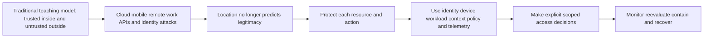

The traditional picture is deliberately simplified. Mature perimeter-based environments never trusted every internal action, and networks remain valuable controls. Zero trust does not discard firewalls, Virtual Private Networks (VPNs), or secure internal networks. It changes what those controls prove. A VPN can establish an encrypted path and add identity evidence; it does not automatically authorize every resource. A managed device can add confidence; it does not make every user action safe. A corporate Internet Protocol (IP) address can be one signal; it cannot replace identity, resource, action, and policy.

### Strategy versus product

| Zero trust is | Zero trust is not |
|---|---|
| An enterprise security strategy and architecture direction | One appliance, agent, gateway, identity provider, or vendor bundle |
| A way to make explicit, resource-focused access decisions | A promise that no person or system is ever trusted in any sense |
| A combination of identity, endpoint, workload, network, application, data, policy, telemetry, governance, and response | Merely multifactor authentication (MFA) or a VPN replacement |
| A maturity journey tied to business risks and existing systems | A one-time migration with a universal finish line |
| A design that limits blast radius and expects controls to fail | A guarantee that breaches cannot happen |
| A requirement for observable, reviewable decisions | Continuous surveillance without purpose, minimization, or governance |

Buying a capability may help implement part of the strategy. For example, an identity provider can authenticate users, an endpoint tool can report device health, a gateway can enforce network policy, a SaaS application can enforce roles, and a log platform can correlate decisions. None alone knows every resource, business purpose, data sensitivity, exception, or responsibility. Architecture connects the capabilities to the objective.

## 🔍 Plain-English deep-dive: Zero Trust Is a Decision Discipline

The phrase “never trust, always verify” is memorable but incomplete if taken literally. Systems must rely on evidence and components: a policy engine relies on identity assertions, a resource relies on an enforcement point, and an investigator relies on logs. The goal is not to eliminate all dependence. The goal is to remove **unearned, broad, permanent, and hidden** confidence.

Think of a decision as a sentence:

> Subject S may perform action A on resource R, in tenant T, from device or workload D, under context C, because policy P evaluated evidence E at time X, for duration L, with decision and activity telemetry recorded.

If the sentence only says “the user is internal,” it is weak. If it says “the person logged in this morning,” it still lacks action, resource, current context, and duration. A defensible decision names all of them.

| Decision question | Weak implicit answer | Stronger explicit evidence | Example outcome |
|---|---|---|---|
| Who or what is asking? | “It came from our network” | Human or workload identity, authentication method, issuer, tenant, session | Identity accepted, challenged, or denied |
| What is being requested? | “Access to the platform” | Read one case, export messages, change policy, invoke one agent tool | Action matched to permission |
| Which resource? | “Email data” | One mailbox, message, tenant report, policy object, API collection | Resource scope constrained |
| Under what conditions? | “It worked before” | Device state, time, location, network, risk, change, sensitivity | Conditional outcome selected |
| Why is it needed? | “The user is an admin” | Approved task, ticket, role assignment, owner, separation of duties | Purpose and authority confirmed |
| For how long? | “Until removed” | One request, one session, two-hour elevation, expiry | Standing access avoided |
| What is observed? | “No error means success” | Decision ID, audit event, resource action, result, revoke event | Investigation and review possible |

Zero trust therefore changes support questions. Instead of “Is the user trusted?” ask “Which identity requested which action on which resource, what policy evaluated which signals, what decision was enforced, and what evidence records it?”

## The Three Principles in Operational Detail

Microsoft's official zero-trust overview uses three principles: verify explicitly, use least privilege access, and assume breach. These are useful teaching language, while NIST SP 800-207 provides a fuller architecture and tenets. They complement rather than replace each other.

### 1. Verify explicitly

To **verify explicitly** is to authenticate and authorize using available relevant signals. “Available” does not mean collect everything imaginable. Evidence must be lawful, authorized, proportionate, accurate enough, current enough, and useful for the decision. More signals can create privacy risk, false confidence, latency, and operational fragility.

An explicit decision can include:

- human or workload identity and credential strength;
- tenant and identity-provider issuer;
- device or workload identity, management, integrity, and patch posture;
- requested action and resource sensitivity;
- role, group, entitlement, delegated scope, and approval;
- network path, location, time, unusual behavior, and session history;
- policy version, exception, and previous decision;
- threat or risk signals, with their age and confidence;
- telemetry health and the ability to investigate or revoke.

Verification is explicit when the inputs and rule can be named, the outcome is enforced, and evidence can be reviewed. It is not explicit merely because a user typed a password.

### 2. Use least privilege

Least privilege asks six dimensions at once:

| Dimension | Core question | Excessive example | Better pattern |
|---|---|---|---|
| Identity | Which person or workload needs access? | Shared “support-admin” account | Named human or owned workload identity |
| Action | Which operations are required? | Full administrator for read-only diagnosis | Read case and view sanitized audit events |
| Resource | Which objects or tenants are required? | All mailboxes across all tenants | One approved tenant and message set |
| Data | Which fields or content are necessary? | Full message bodies and tokens in a ticket | Metadata, redacted headers, and decision IDs first |
| Time | How long is access necessary? | Permanent privilege after one incident | JIT elevation for a bounded window |
| Delegation | May the identity grant or pass authority? | API token can create new administrators | No delegation unless the task requires it |

Least privilege must remain usable. If a role cannot complete the approved task, people may share accounts, request permanent elevation, or disable controls. The answer is not unlimited access; it is a tested role with an escalation path, JIT elevation where appropriate, break-glass recovery, and evidence that the approved task succeeds.

### 3. Assume breach

Assume breach is a design posture, not a statement that every requester is malicious. It asks: “If this identity, device, token, workload, administrator, integration, or control is compromised, what prevents unrestricted movement and how will we know?”

Practical consequences include:

1. segment resources and restrict east-west movement;
2. avoid reusable standing privilege;
3. protect management paths more strongly than ordinary user paths;
4. monitor decisions and resource actions, not only sign-ins;
5. use independent signals where possible;
6. minimize data available to each identity and process;
7. detect privilege changes, token anomalies, and policy drift;
8. support rapid session and credential revocation;
9. maintain tested recovery and emergency administration;
10. investigate one control failure for downstream exposure rather than declaring the rest safe.

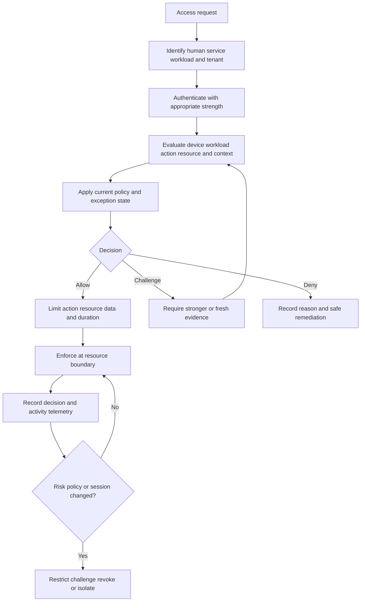

## Decision Inputs: Identity Device Resource Context Policy and Telemetry

A zero-trust decision is only as sound as its inputs, policy, enforcement, and feedback. Each input can be missing, stale, forged, mis-scoped, or misunderstood.

| Input | What it should answer | Useful evidence | Common weakness | L1-safe question |
|---|---|---|---|---|
| Human identity | Which person is requesting, through which tenant and identity provider? | Subject identifier, issuer, authentication event, role assignment | Shared account, stale user, wrong tenant, weak recovery | Which exact identity and issuer appear in the failed decision? |
| Workload identity | Which application, service, or automation is calling? | Client identifier, service principal, certificate or federation metadata, owner | Ownerless identity, copied secret, interactive use | Who owns this identity and what approved workflow uses it? |
| Device or workload posture | Is the execution environment known and within required state? | Device ID, management state, integrity signal, platform, compliance time | Stale posture, cloned identifier, unsupported client | At decision time, what posture did policy receive? |
| Resource | What exact object, data set, API, mailbox, tool, or setting is protected? | Resource ID, tenant, classification, endpoint, operation | Broad “app access” description hides sensitive subresources | Which resource and action failed, not just which app? |
| Context | What current conditions affect risk and purpose? | Time, network, location, behavior, session, change, case ID | Impossible precision, privacy overcollection, old risk signal | Which context changed between success and failure? |
| Policy | Which approved rule converted inputs to an outcome? | Policy ID/version, conditions, priority, exception, evaluation result | Conflicting rules, shadow policy, drift, undocumented exception | Which policy version produced the decision and why? |
| Telemetry | Can the decision and resulting action be reconstructed? | Correlation ID, audit event, timestamps, allow/deny reason, resource action | Logging only at login, clock skew, retention gap | Which IDs join identity, policy, and resource events? |

### The policy decision chain

NIST SP 800-207 describes logical components including a **policy engine**, **policy administrator**, and **policy enforcement point**. The policy engine makes the access decision using policy and inputs. The policy administrator establishes or shuts down the communication path based on that decision. The policy enforcement point enables, monitors, and terminates the connection between a subject and enterprise resource. Products may combine or distribute these functions; the logical separation is useful even when the boxes are not visible.

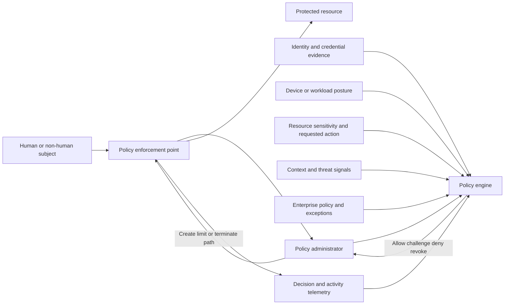

The diagram is a conceptual NIST-aligned teaching model, not a statement that Abnormal or any named provider exposes these exact components.

## 🔍 Plain-English deep-dive: Trust Versus Authentication and Authorization

People use “trust” for several different ideas:

- interpersonal trust: belief that a colleague is honest and dependable;
- organizational trust: an approved relationship with an employee or vendor;
- technical confidence: evidence that an assertion is likely accurate;
- authorization: an enforceable decision permitting an action;
- implicit trust: access inherited without a fresh, relevant decision.

Zero trust does not say employees are dishonest or vendors have no relationship. It says those relationships do not by themselves authorize every technical action. A trusted employee can make a mistake. A legitimate vendor account can be compromised. A correctly authenticated service can request an excessive scope. A managed device can host a stolen session.

| Question | Authentication answer | Authorization answer | Trust-related caution |
|---|---|---|---|
| Who is presenting a credential? | The identity provider authenticated `analyst-17` | Not answered | Credential control is evidence, not moral trust |
| Can the identity read a case? | Not answered | Role permits `case.read` on tenant `T-100` | A prior role may be stale |
| Can the identity export message content? | Not answered | Policy denies because task requires metadata only | “Support person” is not blanket authority |
| Can the session continue after device risk rises? | Initial login succeeded | Continuous policy challenges or revokes | Past success is not permanent confidence |
| Did a legitimate identity perform the intended action? | Identity and session are associated | Action was permitted | Compromise or misuse remains possible; inspect resource telemetry |

Authentication should precede authorization, but successful authentication does not guarantee the right identity is benign or the requested action is allowed. Authorization also does not prove the action was wise. Policy may be overbroad or stale. Evidence must cover the identity, policy decision, enforcement, and resource action.

## Trust Boundaries and Data Flows

A **trust boundary** exists where authority, control, identity, data handling, or assurance changes. A boundary can separate organizations, tenants, identity domains, privilege levels, networks, applications, workloads, or data classifications. It does not have to be a physical firewall.

A **data-flow diagram** shows where data originates, which process receives it, where it is transformed or stored, and where it leaves. For zero-trust analysis, add the subject, action, identity source, enforcement point, policy decision, telemetry, and owner at every important crossing.

### Synthetic enterprise SaaS flow

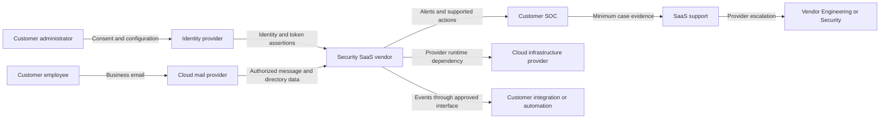

Every arrow raises questions:

1. What data or authority crosses?
2. Which identity initiates and which system receives?
3. Which policy permits it?
4. Is it push, pull, interactive, or scheduled?
5. Is data read, copied, changed, deleted, or used to trigger action?
6. How is the path authenticated, authorized, encrypted, logged, and revoked?
7. Which party owns configuration, availability, investigation, and incident response at each side?
8. What evidence exists if the crossing fails or is abused?

### Trust-boundary register

| Boundary | Data or authority crossing | Primary risk question | Control examples | Evidence examples | Likely owner pair |
|---|---|---|---|---|---|
| Customer to identity provider | Credentials, authentication factors, user and group state | Is the correct identity lifecycle and policy applied? | MFA, lifecycle, conditional policy, recovery | Sign-in ID, policy result, role/group change | Customer identity team and IdP |
| Identity provider to SaaS | Assertion or token representing identity and claims | Are issuer, audience, claims, time, and consent valid? | Federation metadata, token validation, narrow claims | Sanitized token metadata, request ID, SaaS auth event | IdP and SaaS vendor |
| Mail provider to security SaaS | Authorized message, directory, and event data | Are permissions and data paths necessary and current? | Scoped app grant, encrypted API, audit, revocation | Consent record, API result, event/message ID | Customer/mail provider and SaaS vendor |
| SaaS control to protected resource | Access decision or remediation instruction | Was the intended policy decision enforced on the correct resource? | Policy engine, enforcement point, approval | Policy version, decision ID, resource audit event | SaaS vendor plus customer policy owner |
| SaaS to customer integration | Alert, event, webhook, or API data | Can a compromised receiver replay, alter, or expose data? | Signature, narrow token, replay protection, schema validation | Delivery ID, timestamp, status, signature result | SaaS and integration owner |
| Customer to support | Diagnostic evidence and temporary authorization | Is evidence minimal and access approved? | Secure channel, redaction, case role, retention | Case ID, authorization, access audit, deletion record | Customer and vendor support |
| SaaS to cloud provider | Runtime, storage, network, key, and monitoring dependencies | Which layer failed and which provider has evidence? | Platform controls, isolation, resilience, provider logging | Service health, dependency ID, vendor telemetry | SaaS vendor and cloud provider |

The owner pair is a starting point, not a contract. The SaaS vendor remains accountable for operating its service even when an upstream cloud dependency contributes. The customer remains responsible for customer-controlled identity and configuration even when the vendor offers helpful controls. Support should not tell a customer to contact another provider until it has identified evidence that the next owner can use.

## Control Plane Data Plane and Management Plane

Plane language helps separate three paths that can fail differently.

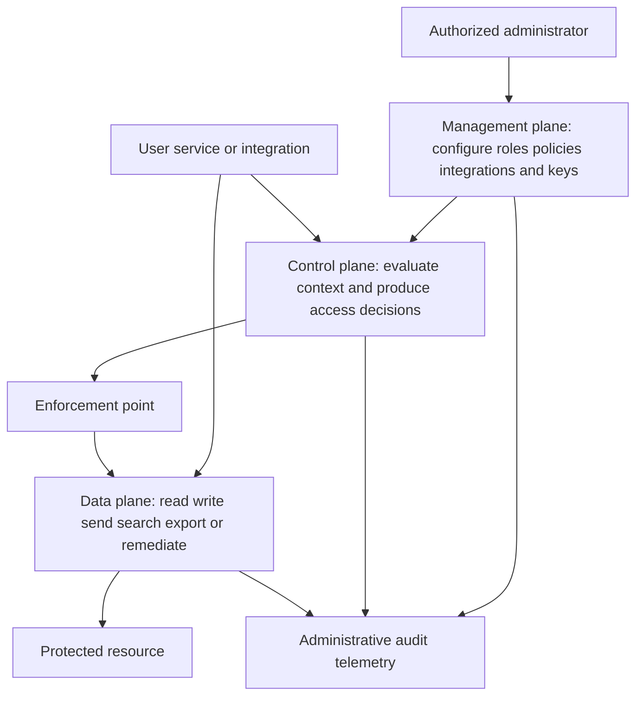

| Plane | Main job | Example actions | High-impact failure | Evidence to request | Caution |
|---|---|---|---|---|---|
| Management plane | Change the system's configuration and authority | Create role, approve integration, rotate key, edit policy, configure retention | Unauthorized admin change weakens many future decisions | Actor, change ID, before/after, approval, policy version, time | Stronger protection is needed because blast radius is high |
| Control plane | Decide and establish permitted access | Evaluate identity/context, issue decision, establish path, revoke session | Wrong policy evaluation permits or denies access | Decision ID, input summary, matched rule, reason, enforcement response | Reachability does not prove the control plane allowed access |
| Data plane | Carry actual business data and actions | Read message metadata, export report, invoke API, remediate item | Authorized path exposes too much data or performs wrong action | Resource ID, action, fields, result, actor/session, correlation ID | Login logs alone do not prove what happened to the resource |

### Why the distinction changes troubleshooting

- If an administrator cannot save a policy, investigate management-plane role, validation, change conflict, and service health.
- If a policy saves but access decisions ignore it, investigate policy propagation, version, evaluation, and enforcement in the control plane.
- If access is allowed but an export is incomplete, investigate data-plane resource scope, pagination, filtering, permissions, rate limits, and processing.
- If an API endpoint responds to TLS but returns `403 Forbidden`, network and TLS reachability succeeded while authorization denied the operation.
- If the policy engine allows an action but no resource audit event exists, enforcement, data-plane execution, logging, or correlation may have failed.

## 🔍 Plain-English deep-dive: Plane Health Is Not End-to-End Health

Imagine a railway. The management office publishes schedules and permissions. Signaling decides whether a train may enter a track. The train carries passengers. A working train does not prove the signal is correct. A green signal does not prove the train reached the destination. A correct timetable does not prove the signal received the update.

The analogy stops because cloud systems may combine these functions, process requests in parallel, and expose only part of the evidence. Still, it prevents a common support mistake: checking one plane and declaring the whole workflow healthy.

An end-to-end validation needs at least:

1. approved management state and version;
2. control-plane decision and reason;
3. enforcement outcome;
4. data-plane action and resource result;
5. joined timestamps and correlation identifiers;
6. customer-visible result;
7. cleanup or rollback where applicable.

## Implicit Trust Hazards

**Implicit trust** is authority granted because of an assumption that is not sufficiently re-evaluated for the current resource and action. Some assumptions are useful signals; the hazard is letting one become a broad substitute for authorization.

| Implicit assumption | Why it fails | Safer replacement | Support evidence |
|---|---|---|---|
| “It is on the corporate network” | A compromised endpoint or insider is also internal | Identity and resource authorization plus device/workload and context evaluation | Source path, identity, policy result, device state |
| “The user passed MFA” | Session theft, consent abuse, coercion, or overbroad role can follow | Bind decision to action/resource, monitor session, require fresh proof for sensitive actions | Authentication method/time, session ID, action log |
| “It is a service account” | Non-human identities can be ownerless, over-scoped, and long-lived | Owned workload identity, narrow scope, non-interactive use, rotation/federation, telemetry | Owner, client ID, grant, last use, secret/cert metadata |
| “Support needs admin” | Most diagnosis does not require unrestricted customer data or changes | Read-only evidence first, JIT/JEA, approval, customer-observed action | Case authorization, role, elevation, audited actions |
| “The vendor is trusted” | Vendor compromise or misconfiguration can cross the integration | Contract, scoped integration, segmentation, monitoring, revocation | Grant, data-flow map, events, assurance evidence |
| “The token worked yesterday” | Tokens expire, are revoked, change audience, or outlive changed privilege | Validate current issuer/audience/scope/time and effective policy | Metadata and response only, never live secret in case |
| “No alert fired” | Telemetry may be disabled, delayed, filtered, or retained elsewhere | Validate coverage and run an authorized benign test | Source health, test event, ingest time, query result |
| “Same tenant means same authority” | Tenant roles, resource scopes, and delegated grants differ | Resource-level authorization and separation of duties | Tenant ID, effective role, resource ID, action |

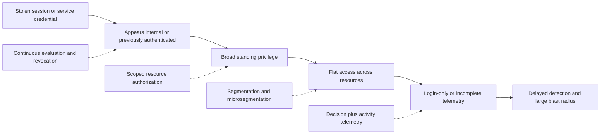

## Segmentation and Microsegmentation

Segmentation limits paths between zones, systems, workloads, or resources. Traditional network segmentation may use subnets, firewalls, Virtual Local Area Networks (VLANs), or security groups. **Microsegmentation** moves closer to workloads and applications, often using identity, workload labels, application context, host controls, or fine-grained network policy.

Microsegmentation is not automatically better. Fine-grained rules can be difficult to inventory, test, and troubleshoot. A mislabeled workload or stale dependency map can interrupt legitimate service. A policy that exists only on paper provides no containment. The design should start from data flows and required communications, then deny unnecessary paths, log meaningful decisions, and preserve a tested recovery route.

| Design question | Network segmentation answer | Microsegmentation answer | Evidence of effectiveness |
|---|---|---|---|
| What is divided? | Broad networks or zones | Workloads, applications, services, identities, or resource groups | Current inventory and dependency map |
| What authorizes crossing? | Source/destination, protocol, port, network policy | Workload identity, application, resource, process, context, fine rule | Policy version and matched decision |
| What blast radius is reduced? | Movement between zones | Movement between individual workloads or resource cells | Authorized negative test and denied-event log |
| What can break? | Routing, DNS, firewall, asymmetric path | Label, identity, policy propagation, service discovery, hidden dependency | Before/after flow and rollback evidence |
| What does it not replace? | Identity, application authorization, data controls | Identity governance, secure code, token controls, monitoring | Defense-in-depth map |

For email and SaaS support, segmentation may appear as tenant isolation, separate administrative paths, scoped APIs, distinct ingestion and response services, or restricted integration destinations. These are generic possibilities, not claims about a vendor. L1 should diagnose the observed interface and documented requirement rather than invent the underlying segmentation design.

## Continuous Evaluation and the Session Lifecycle

Authentication is an event; access is a lifecycle. A user may sign in from a compliant device, receive a session, change network, become high risk, gain or lose a role, request a more sensitive action, or have the account disabled. A workload token may be valid when issued but later become inappropriate because the integration was decommissioned or its scope changed.

**Continuous evaluation** means access can be reconsidered when relevant signals, policy, resource, or risk change. It does not promise that every system checks every signal on every packet with zero delay. Actual capabilities, refresh intervals, event propagation, caching, and revocation behavior vary. Support must verify documented behavior for the specific identity provider, client, protocol, resource, and service.

### Session and token sequence

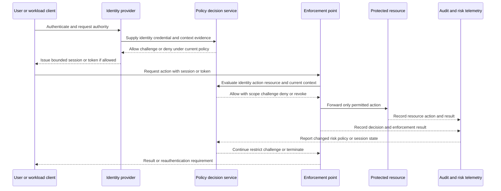

### Token terms from zero

An **access token** is presented to a resource so a client can call it. A **refresh token**, where used, helps a client obtain a new access token without repeating the complete interactive sign-in. A **bearer token** generally gives authority to whoever can present it, so disclosure is dangerous. Some systems use proof-of-possession or sender-constrained designs that bind use more closely to a client or key, but support must not assume this without documentation.

Common token metadata includes:

| Field or concept | Plain meaning | Diagnostic use | Safety rule |
|---|---|---|---|
| Issuer | Authority that created the token | Detect wrong identity provider or tenant | Record identifier, not secret material |
| Subject | Identity represented by the token | Compare user/workload to expected caller | Treat identifiers as potentially sensitive |
| Audience | Resource intended to accept the token | Diagnose token minted for another API | Never broaden acceptance to “fix” mismatch |
| Scope or role | Allowed operation categories | Compare requested action to granted authority | Seek minimum required scope |
| Issued-at time | When authority was created | Correlate policy and sign-in state | Normalize time zone and clock skew |
| Not-before time | Earliest accepted use | Explain premature use or clock problem | Do not disable time validation casually |
| Expiration time | Latest normal acceptance time | Explain expired access and lifetime | Shorter is not enough without refresh/revoke design |
| Token identifier | Identifier for one token or assertion | Correlate and detect replay where supported | Do not confuse ID with secret token value |

## 🔍 Plain-English deep-dive: A Token Is Not the User

A token is an artifact that represents authority under certain conditions. It is not the person, workload, business purpose, or final decision. A stolen bearer token can be replayed by a different actor. A correctly signed token can still be intended for the wrong audience. A token with a role can outlive a job change until policy or revocation takes effect. A valid token can request an action outside its scope.

Use a concert ticket analogy. The ticket names an event, date, section, and perhaps seat. The gate validates it, marks or records use, and may reject a duplicate. The ticket does not prove the holder is behaving safely inside, and a copied barcode may be abused. The analogy stops because digital tokens can carry claims, be refreshed, be bound to cryptographic keys, and be evaluated by several services.

### Token and session lifecycle controls

| Lifecycle phase | Control objective | Failure examples | Evidence | Corrective direction |
|---|---|---|---|---|
| Registration | Only approved client/workload exists with owner and purpose | Unknown app, abandoned callback, duplicate service account | App record, owner, approval, creation event | Inventory, assign owner, remove unused registration |
| Consent or grant | Only required resource permissions are approved | Tenant-wide grant for a read-only task | Grant record, scope, approver, tenant | Reduce scope; use delegated/app model appropriate to task |
| Credential setup | Credential is protected and suitable | Secret in script or ticket, shared certificate | Credential type, creation/expiry metadata, storage evidence | Managed/federated identity where available, approved secret store |
| Issuance | Current identity and policy produce bounded authority | Wrong tenant, weak auth, stale role | Authentication and token issuance event | Correct identity/policy; require stronger proof where supported |
| Presentation | Intended resource validates token and action | Wrong audience accepted, replay, missing scope | Sanitized request, resource response, decision ID | Enforce issuer/audience/time/scope and sender constraints if supported |
| Refresh | Continued access remains justified | Long-lived refresh survives role removal | Refresh/reissue events, session state | Re-evaluate; revoke; shorten or protect refresh path |
| Revocation | Authority can be stopped promptly | Disabled account still has active session | Disable/revoke time and last accepted request | Validate propagation and resource behavior |
| Expiration | Authority ends predictably | Permanent token or outage at expiry | Expiry metadata and renewal result | Rotate safely; avoid indefinite credentials |
| Decommission | Identity, grants, secrets, data, and telemetry are retired | Integration removed but grant remains | Removal event, last use, inventory closure | Revoke grant, delete credential, preserve required audit, update owner map |

Support should never ask a customer to paste a live access token, refresh token, session cookie, client secret, or private key into a case. Ask for non-secret metadata, redacted claims when authorized, timestamps, correlation IDs, status codes, and provider-generated diagnostic results.

## Least Privilege Across Human and Non-Human Access

Least privilege is a lifecycle, not a one-time role assignment.

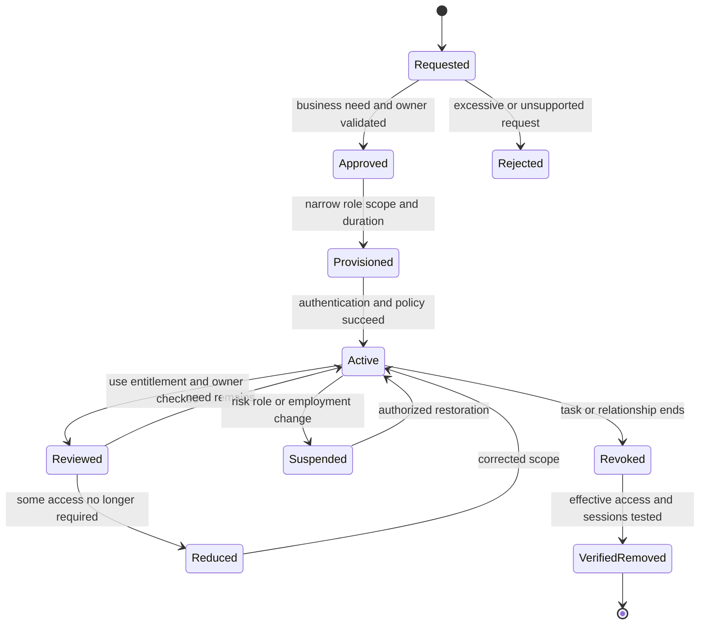

### Privilege creep

Privilege creep occurs when roles accumulate through job changes, temporary projects, nested groups, duplicate identities, emergency grants, old integrations, and incomplete offboarding. The permission visible on the account may not equal **effective access**, which is the combined result of direct roles, group membership, inherited rights, delegated authority, tokens, sessions, and resource-specific policy.

| Creep source | Example | Detection method | Remediation caution |
|---|---|---|---|
| Role change | Analyst becomes manager but keeps old export role | Compare current job need to effective permissions | Preserve required work and approvals during removal |
| Temporary incident grant | Admin elevation never expires | Find time-bound request without closure or expiry | Validate no active recovery task depends on it |
| Nested groups | User inherits privilege through several group layers | Expand effective group and role path | Remove at correct source, not random downstream symptom |
| Duplicate identity | Old account remains active after migration | Reconcile human identity to all accounts and last use | Preserve audit identity and avoid lockout |
| Integration expansion | New API scope added “for future use” | Compare actual API calls and documented purpose to grant | Some low-frequency actions may be business-critical |
| Shared support account | Multiple engineers use one admin identity | Detect interactive use and weak attribution | Replace with named access and safe transition |
| Break-glass normalization | Emergency account used for routine work | Review use against declared emergency criteria | Restore normal path before restricting emergency access |

### JIT and just-enough administration

**JIT access** reduces standing privilege by activating a role only after a request, relevant checks, and approval or policy, then expiring it automatically. A mature workflow records requester, reason, ticket, scope, approver, start, expiry, actions, and outcome.

**Just-enough administration** reduces what the elevated identity can do. JIT limits **when**; just enough limits **what**. They work together but solve different problems.

Microsoft **JEA** is a specific PowerShell implementation. It can expose constrained endpoints with permitted commands, parameters, identities, and transcripts. It should be described as a Microsoft technology, not a generic synonym for all least-privilege administration and not an Abnormal capability.

| Pattern | Standing access | Action scope | Duration | Best use | Main risk |
|---|---|---|---|---|---|
| Permanent broad admin | Always available | Many unrelated actions | Indefinite | Avoid except where formally justified | High misuse and compromise blast radius |
| Permanent narrow role | Always available | Bounded actions/resources | Indefinite | Routine low-risk responsibilities | Creep and dormant access still possible |
| JIT broad admin | Activated on demand | Broad | Short | Rare complex emergency with strong approval | Short duration still permits large impact |
| JIT plus just enough | Activated on demand | Task-specific | Short | Planned or incident administration | Poor role design can block recovery or hide needed dependency |
| JEA endpoint | According to configured access | Defined PowerShell commands/parameters | Session or configuration-dependent | Constrained Windows/PowerShell administration | Misconfiguration, escape path, incomplete transcript, unsupported task |

### Service accounts API integrations and workloads

Non-human identities deserve the same or stronger governance as people because they often run continuously and at scale.

| Review area | Required question | Good evidence | Red flag |
|---|---|---|---|
| Purpose | What approved business/security task requires this identity? | Owner-approved purpose and data-flow link | “Legacy integration; nobody knows” |
| Owner | Which human role owns lifecycle and review? | Current owner and backup owner | Former employee or generic team mailbox only |
| Authentication | How does workload prove identity? | Managed/federated identity, certificate, or protected secret metadata | Secret in source, ticket, chat, or local plaintext |
| Permission | Which APIs, actions, tenants, and objects are needed? | Scope-to-call mapping and successful negative tests | Administrator scope for one read operation |
| Runtime boundary | Where is the credential allowed to run? | Workload identity, key binding, approved environment | Same secret used from developer laptop and production |
| Rotation and expiry | How is credential renewal tested without outage? | Rotation runbook, overlap window, expiry alert, validation | Non-expiring credential or surprise expiry |
| Telemetry | Can each call and change be attributed? | Client ID, request ID, action, resource, result, time | Only aggregate success count |
| Revocation | How quickly can access stop? | Tested revoke procedure and owner | Removing code without revoking grant/token |
| Decommission | What closes when integration ends? | Grant revoked, credential removed, events retained per policy, inventory closed | Disabled job but live app consent remains |

### Human admin and support access

Human access needs named identity, strong authentication, separation between routine and privileged work, approved devices where required, scoped roles, JIT elevation, action logging, and periodic review. Support access adds customer authorization, minimum necessary evidence, case purpose, secure channels, retention limits, and a clear end condition.

Support should prefer a progression:

1. customer-provided redacted evidence;
2. documented self-service diagnostic output;
3. customer-observed screen-share or guided test with consent;
4. provider-side telemetry available under normal support authority;
5. temporary, approved, audited access only where the product, contract, and process support it;
6. Engineering/Security escalation when deeper provider authority is needed.

The progression is not universal. Current vendor policy and the customer's agreement control. It demonstrates minimization: start with the least intrusive evidence capable of distinguishing hypotheses.

## Break-Glass and Emergency Access

Normal identity, policy, or administration can fail during an outage or compromise. **Break-glass access** is an emergency path designed to restore control without turning recovery into a permanent backdoor.

| Design property | Why it matters | Evidence of readiness | Failure to avoid |
|---|---|---|---|
| Defined emergency criteria | Prevents convenience use | Approved runbook with examples | “Use whenever normal login is slow” |
| Independence from likely failure | Preserves recovery when primary IdP/policy fails | Documented dependency map and test | Emergency account depends on the failed federation path |
| Strong protection | Emergency privilege has extreme impact | Secure credential custody, access control, multiple-person process where appropriate | Password in a shared document |
| Minimal number and scope | Reduces hidden paths | Inventory, owners, role and resource mapping | Many untracked emergency accounts |
| Monitoring and alerting | Every use requires immediate visibility | Test event reaches designated responders | Alerts suppressed because tests are noisy |
| Periodic safe testing | Untested recovery may not work | Dated test, expected/actual, remediation | First test occurs during incident |
| Post-use review and restoration | Emergency state should end | Timeline, actions, rotation, session revoke, root-cause follow-up | Account remains active for routine cleanup |

Do not test break-glass procedures in a production environment without authorization, change planning, and rollback. The lab later uses only fictional records.

## Shared Responsibility Across the Service Chain

Shared responsibility means one secure outcome depends on several parties with distinct duties. It must not become “everyone owns it,” because that often means nobody can name the next action.

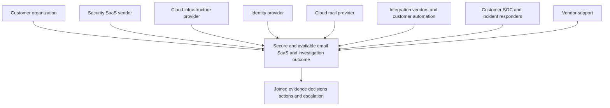

### Eight-party responsibility map

The following matrix is a vendor-neutral teaching model. Real responsibility comes from architecture, service documentation, customer configuration, contract, law, and the event. “Typical” does not mean universal.

| Party | Typical primary responsibilities | Evidence it may control | What it should not be assumed to own |
|---|---|---|---|
| Customer organization | Data classification and lawful use; user and admin lifecycle; customer-controlled configuration; endpoint and local network; approving integrations; business continuity; risk decisions | Tenant settings, identity groups, endpoint state, proxy/firewall logs, approvals, business impact | Provider source code, provider infrastructure, or vendor incident declaration |
| Security SaaS vendor | Securely operate its service; implement documented controls; protect provider environment; make supported functionality observable; manage provider incidents and defects; provide accurate requirements | Service-side request/decision IDs, application telemetry, provider configuration behavior, defect and service-health evidence | Customer IdP policy, customer endpoint, customer risk acceptance, third-party contract interpretation |
| Cloud infrastructure provider | Secure and operate contracted underlying infrastructure/service layers according to service model | Platform service health, infrastructure audit/diagnostic evidence available to SaaS vendor | SaaS application logic, customer tenant policy, direct customer case diagnosis unless contractual path exists |
| Identity provider | Authenticate identities and issue identity/session assertions according to configured policy; expose supported logs and lifecycle capabilities | Sign-in, token issuance, policy evaluation, risk and session events | SaaS resource authorization beyond claims; customer's correct role design; mail delivery |
| Mail provider | Operate mailboxes, transport, directory/mail APIs, and provider controls according to service and customer configuration | Message trace, mailbox/admin audit, consent and API events, service health | Security SaaS private decision logic; customer SOC verdict; unrelated endpoint behavior |
| Integration vendor or customer automation | Protect its credentials and receiver; request only needed permissions; validate schemas/signatures; handle retries/replay; monitor and decommission | Client and delivery logs, configuration, credential metadata, webhook receipt, processing result | Upstream SaaS defect, customer-wide incident command, identity-provider correctness |
| Customer SOC | Triage security signals; determine incident scope and response; correlate other evidence; make or route containment and risk decisions under customer authority | SIEM/SOAR records, investigation timeline, endpoint/identity evidence, response decisions | Provider code fix, contract promise, support access outside authorization |
| Vendor support | Own case intake, scope, safe evidence request, supported diagnosis, communication, handoff quality, validation, and knowledge capture | Case journal, approved provider telemetry, correlation IDs, troubleshooting results, escalation status | Customer incident command, legal advice, customer risk acceptance, undocumented provider internals |

### Responsibility is layered by activity

| Activity | Customer | SaaS vendor | IdP/mail/cloud/integration providers | SOC | Support |
|---|---|---|---|---|---|
| Define business need and data classification | Primary | Consulted for service capability | Consulted where relevant | Consulted on risk | Informed or clarifies support need |
| Configure customer tenant identity and integrations | Primary for customer-controlled settings | Provide documented capability and enforce provider side | Operate their configuration surfaces | Review security implications | Diagnose expected versus actual behavior |
| Secure provider application and runtime | Review assurance and configure available controls | Primary for SaaS application/service | Cloud provider owns contracted infrastructure layer | Consume relevant alerts | Escalate provider evidence and communicate |
| Detect customer-environment compromise | Operate controls and reporting | Detect within documented product capability | Each detects within its service boundary | Primary investigation/response coordinator | Supply product evidence; do not declare beyond evidence |
| Respond to provider service incident | Execute continuity and customer-side safeguards | Primary incident owner for provider environment | Upstream provider owns its incident and informs SaaS through contract | Assess customer impact | Maintain case continuity and updates |
| Revoke compromised integration | Approve and perform customer-side revocation | Revoke or block provider-side grant/session where supported | IdP/mail/integration may revoke their artifacts | Coordinate containment decision | Give supported steps and verify evidence |
| Accept residual business risk | Authorized customer/employer risk owner | Authorized vendor risk owner for vendor environment | Each party's authorized owner | Advises within mandate | Never accepts on another party's behalf |

## 🔍 Plain-English deep-dive: Shared Responsibility Is Not Shared Blame

Suppose an integration stops receiving events after a customer role change. The customer may own the role change. The identity provider may have correctly issued a token with reduced claims. The SaaS vendor may own a confusing error or stale permission cache. The integration may fail to surface the rejection. Support owns turning these possibilities into an evidence path and maintaining communication.

Saying “customer configuration” too early is blame, not diagnosis. Saying “the vendor owns everything because it is SaaS” is also inaccurate. A better statement is:

> At 14:03 UTC, client `svc-lab-export` requested `events.read` for tenant `T-100`. The identity provider issued a token whose metadata shows the expected issuer and audience but no `events.read` scope. The SaaS endpoint returned `403` with request ID `R-403-77`; no event entered the integration. The customer's identity owner should verify the grant change, while SaaS support should confirm the documented required scope and whether the response accurately reflects effective authorization. Case ownership stays with support until the end-to-end result is validated.

This statement names evidence, two action owners, and continuing case ownership without assigning fault prematurely.

## RACI Versus Security Responsibility

RACI is a coordination tool:

- **Responsible (R):** performs the task;
- **Accountable (A):** owns the result and final decision for the task, ideally one clearly named role;
- **Consulted (C):** gives input before or during the task;
- **Informed (I):** receives status or outcome.

RACI does not determine who legally owns data, who contractually operates a control, who has technical access, or who may accept risk. Those must be known first. A RACI chart can then coordinate a specific activity such as rotating an integration credential.

| Layer | Question | Source of truth | Why RACI alone is insufficient |
|---|---|---|---|
| Technical responsibility | Which component enforces, stores, transmits, or logs? | Architecture, configuration, code, documented service behavior | A chart cannot make a party control a component it cannot access |
| Contractual responsibility | What has each provider committed to perform? | Current contract, service terms, support policy, service description | A project chart cannot rewrite an agreement |
| Legal/regulatory responsibility | Which duties apply to data and processing? | Authorized legal/privacy/compliance interpretation | Support and RACI authors should not give legal conclusions |
| Risk accountability | Who may accept or treat residual risk? | Governance and delegated authority | “Accountable” in a task chart may not be the formal risk owner |
| Operational coordination | Who performs, decides, advises, and receives updates for this action? | Case-specific RACI or incident plan | This is where RACI is strongest |

### Example RACI: rotate a compromised synthetic integration credential

| Task | Customer identity admin | Integration owner | SaaS support | SaaS engineering/security | Customer SOC | Cloud/mail/IdP provider |
|---|---|---|---|---|---|---|
| Confirm compromise indicators and scope | C | C | C | C | A/R | C as evidence owner |
| Revoke customer-side grant or credential | A/R | R | C | I | C | C or R if its control surface performs revoke |
| Block provider-side session where supported | I | I | R for coordination | A/R for restricted provider action | C | I |
| Issue minimum replacement authority | A | R | C | I | C | R for token issuance service |
| Validate one benign end-to-end call | C | A/R | R | C | I | C |
| Review events and close incident actions | C | C | I | C | A/R | I |
| Close support case after customer confirmation | I | C | A/R | I | C | I |

The example is synthetic. Actual RACI depends on service capability, customer organization, incident process, and contract.

## Evidence and Escalation Boundaries

Evidence should follow the boundary. Customer-controlled evidence usually stays with the customer unless minimum necessary data is authorized for sharing. Provider-internal telemetry is interpreted through provider processes. Upstream cloud or identity evidence may be available only to the contracting party. L1 should identify the needed observation and owner instead of asking for indiscriminate logs.

| Boundary question | Minimum useful evidence | Avoid collecting | Escalate when |
|---|---|---|---|
| Did identity authentication succeed? | UTC time, non-secret identity identifier, tenant, sign-in result, policy reason, correlation ID | Password, MFA secret, full session cookie | Identity event conflicts with SaaS result or requires provider-only interpretation |
| Was the token suitable? | Issuer, audience, scope/role, issued/expiry times, client ID, sanitized error | Raw access/refresh token, client secret, private key | Resource rejects metadata that appears correct or token issuance is unexplained |
| Did SaaS authorization permit the action? | Request ID, endpoint/action, resource/tenant, policy or role result, HTTP status, provider event | Unredacted customer content unless essential and approved | Decision reason is missing, inconsistent, or provider-side defect is plausible |
| Did the data-plane action occur? | Resource audit event, action/result, object ID, actor/session, time | Full mailbox or data export for one event | Decision says allowed but action or audit is absent/inconsistent |
| Did an integration receive/process the event? | Delivery ID, signed timestamp, status, receiver log, retry count, schema error | Live signing secret or unrelated payloads | Provider reports delivery success but receiver lacks event after clock/ID checks |
| Did a customer policy change cause drift? | Before/after, actor, approval, policy version, effective time | Broad tenant dump without need | Change propagation or rollback differs from documented behavior |
| Is there a security incident? | Observations, scope, timeline, confidence, containment owner | Unsupported declaration or unnecessary sensitive content | Credible active compromise, expanding impact, legal/privacy trigger, or required incident path |

### Good escalation packet

A strong escalation contains:

1. customer-visible impact and urgency;
2. expected versus actual result;
3. authorized scope and sanitized environment identifiers;
4. normalized timeline with time zone;
5. data flow, trust boundary, and plane involved;
6. identity, resource, action, context, policy, and telemetry summary;
7. tests performed, expected observations, actual observations, and rollback;
8. competing hypotheses and what evidence changed confidence;
9. shared-responsibility actions already assigned;
10. explicit question and required owner;
11. customer update status and next checkpoint;
12. privacy, secret, and retention handling note.

Escalation transfers specialized work, not customer continuity. L1 remains responsible for a coherent case unless the documented process explicitly changes ownership and the handoff is accepted.

## Applying the Model to the Three Named Product Areas

This section is intentionally limited. The supplied JD/master names Cloud Email Security, AI Security Agents, and SaaS Security. Official Abnormal public pages available on August 24, 2026 describe a behavioral security platform, email-security capabilities, API integrations, AI-related security/governance positioning, and Microsoft 365 security posture management. Public marketing content does not establish exact internal architecture, permissions, tenant boundaries, token behavior, data retention, decision components, support access, customer contract, or incident process.

| Product area | Officially supported public context used here | Vendor-neutral zero-trust application | Questions that must remain open until current official product documentation or authorized evidence answers them |
|---|---|---|---|
| Cloud Email Security | Official Abnormal email-security and platform pages publicly describe behavioral email security, Microsoft 365/Google context, API-based integrations, investigation/remediation capabilities, and visibility/control positioning | Protect message, mailbox, identity, tenant configuration, investigation, export, and remediation resources; scope administrator and integration actions; correlate mail, identity, decision, and action evidence | Exact permission model, enforcement path, data flow, retention, role names, telemetry fields, remediation semantics, support-access model |
| AI Security Agents | The supplied JD names AI Security Agents; official public platform material discusses AI-related security capabilities and AI-enabled workflows, but the fetched route does not justify a private agent architecture claim | Treat an agent as a non-human subject with goals, tools, data, memory, authority, approvals, policy, telemetry, budget, session, and emergency stop; give each tool call separate authorization | Exact agents, tools, autonomy, approval gates, model behavior, prompt/data handling, action limits, logs, rollback, customer/provider responsibility |
| SaaS Security | The supplied JD names SaaS Security; an official Abnormal public posture-management page describes Microsoft 365 configuration assessment, prioritization, drift detection, and guidance | Protect tenant settings, identities, roles, app grants, data, and audit history; verify who changed what, which policy/baseline applies, and who approves remediation | Product scope beyond public pages, exact benchmarks, connectors, supported tenants, collection interval, remediation execution, exception workflow, data handling |

### Vendor-neutral AI-agent authorization model

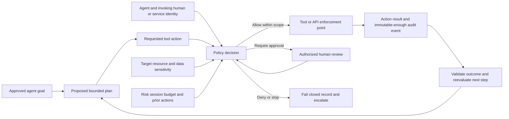

The model does not claim that a named Abnormal agent works this way. It is a generic least-privilege review pattern for any agentic system.

## Worked Examples

### Worked example 1: Internal network but unauthorized export

**Scenario:** A synthetic SOC analyst can view alerts but receives `403 Forbidden` when exporting full message content from the corporate network.

**Inputs:** Identity `analyst-17`; managed device; corporate network; action `message.content.export`; resource tenant `T-100`; role `case-reader`; no approved export task.

**Reasoning:** DNS, TCP, TLS, and authentication succeeded because the application returned an authorization response. Corporate location and managed device are positive context but do not grant the export action. The role permits case reading, not content export. Zero trust requires action/resource authorization; least privilege favors metadata and read access for the current task.

**Evidence:** UTC timestamp, request ID, non-secret identity ID, tenant, endpoint/action, role, policy reason, and `403`; no live session cookie or message body.

**Result:** Expected denial. Support explains the distinction, confirms documented role behavior, and asks whether the approved business task actually requires content. If yes, the customer role owner follows the authorized elevation path; support does not recommend a broad permanent role.

**Caveat:** A `403` alone does not prove correct policy. If the documented role should permit export, compare policy version, resource scope, inheritance, and provider decision telemetry.

### Worked example 2: Service token works but has excessive scope

**Scenario:** A synthetic integration successfully reads alert metadata. During review, its grant also permits tenant-wide configuration write.

**Inputs:** Workload identity `svc-alert-export`; approved purpose is read-only export; observed API calls are metadata reads; standing client secret expires in two years; owner changed teams.

**Reasoning:** Functional success does not prove secure design. The write permission is unrelated to purpose and expands blast radius. Long-lived credentials and stale ownership worsen risk. Least privilege asks to narrow action, resource, time, and delegation while preserving service availability.

**Evidence:** Grant metadata, scope-to-call mapping, owner record, secret expiry metadata, 30-day synthetic call summary, rotation and rollback plan. Never collect the secret.

**Result:** Assign a current owner; create or approve a read-only grant; test successful reads and denied writes; rotate credential through the supported path; revoke the old grant/session; monitor; update inventory.

**Caveat:** Absence of observed write calls may reflect a short or incomplete telemetry window. Confirm low-frequency required operations with the owner before removal.

### Worked example 3: Role removed but active session still works

**Scenario:** At 10:00 UTC, a synthetic admin role is removed. At 10:06, an existing session still reads a privileged report; a new session at 10:08 is denied.

**Inputs:** Role change ID, session IDs, token issued and expiry times, resource action IDs, policy version, documented revocation/refresh behavior.

**Reasoning:** The new session proves current authorization reflects the role removal. The old session suggests cached authorization, token lifetime, delayed revocation, or documented session behavior. Do not call it a defect until the specific product's revocation contract is known.

**Evidence:** Before/after role state; UTC issue, role-removal, request, and deny times; sanitized token metadata; resource audit; explicit revoke event if performed.

**Result:** If supported and authorized, revoke sessions and verify denial. Compare observed six-minute continuation with documented behavior. Escalate to the identity or SaaS owner if it exceeds expectation or high-risk access cannot be terminated.

**Caveat:** Clock skew can invert the apparent sequence. Normalize source clocks and preserve original timestamps.

### Worked example 4: Break-glass account fails during test

**Scenario:** A scheduled synthetic tabletop test discovers that the emergency administrator depends on the same federated identity path the plan is meant to recover from.

**Inputs:** Dependency map, emergency criteria, authentication route, role, credential custody record, test approval, expected/actual outcome.

**Reasoning:** The account exists but the recovery control is not operationally independent. This is a control-design and operating-readiness gap, not permission to weaken normal access.

**Evidence:** Approved test record, failed authentication reason, dependency path, alert behavior, no real credential values.

**Result:** Route to authorized identity/security owners. Redesign the emergency path according to official platform guidance and organizational policy, protect it strongly, test safely, and record remediation. Support does not improvise a hidden bypass.

**Caveat:** Independence must not remove monitoring, governance, or periodic review.

### Worked example 5: Agent requests a broader tool than the task needs

**Scenario:** A fictional AI agent is asked to summarize suspicious-email metadata. Its proposed plan requests `mailbox.full-read` and `message.delete`.

**Inputs:** Goal is summary only; resource is three synthetic message records; tool request includes full-mailbox read and delete; no deletion approval.

**Reasoning:** Agent identity and user instruction do not authorize every tool. Each step needs action/resource policy. Summary can use three metadata records; deletion is outside purpose and has integrity/availability impact.

**Evidence:** Goal, plan, requested tool/action, policy decision, approval status, allowed fields, action result, audit ID.

**Result:** Deny broad tool request. Permit a metadata-only read for named synthetic records. Require separate human-approved workflow for any remediation. Record denial and allowed outcome.

**Caveat:** This is a vendor-neutral agent model and says nothing about Abnormal's implementation.

### Worked example 6: Responsibility gap in event delivery

**Scenario:** The SaaS vendor's delivery log says webhook event `EV-88` received HTTP `202`; the customer integration has no processed record.

**Inputs:** Delivery ID/time, destination identifier, HTTP result, receiver access log, queue log, schema validation, retry policy, time synchronization.

**Reasoning:** `202 Accepted` means the receiver accepted the request for processing, not that downstream processing completed. SaaS owns accurate delivery evidence; integration owner owns receiver and queue processing; support owns correlation and communication.

**Evidence:** Sanitized event ID, delivery timestamp, status, receiver request ID, queue result, schema error, no signing secret or sensitive payload.

**Result:** Correlate the receiver request. If it entered but failed schema validation, integration owner corrects handling and replays through an authorized path. If no receiver event exists, SaaS support checks destination, timestamp, egress telemetry, and delivery semantics before provider escalation.

**Caveat:** A missing customer log can be retention or query error; a provider `202` can be tied to a proxy rather than final processor.

## Troubleshooting Decision Tree

Use this tree for an access, permission, session, or integration symptom. Preserve the failing state where safe before changing policy.

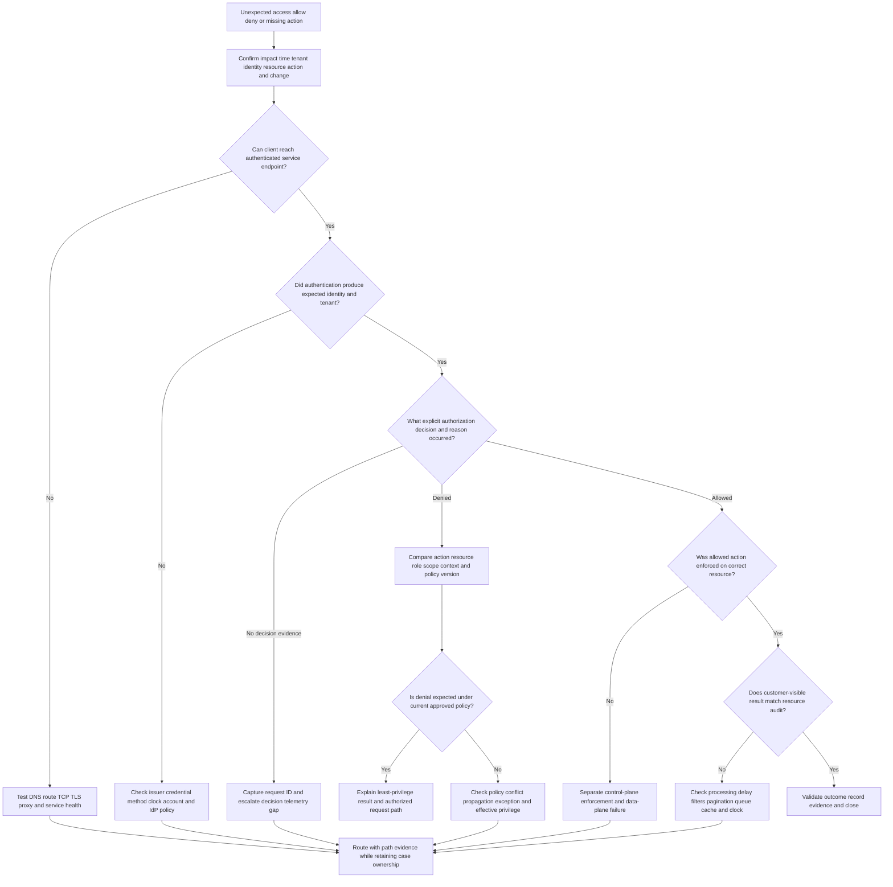

### Symptom-to-hypothesis-to-test-to-action table

| Symptom | Competing hypotheses | Lowest-risk discriminating test | Possible observation | Next action and boundary |
|---|---|---|---|---|
| `401 Unauthorized` from API | Missing/expired/malformed token, wrong issuer/audience, clock issue | Inspect status/body and authorized non-secret token metadata | Audience names another resource | Integration owner obtains correct token; do not weaken audience validation |
| `403 Forbidden` after valid sign-in | Missing scope/role, wrong resource, conditional policy, explicit deny | Join request ID to policy decision and effective entitlement | Required read scope absent | Customer owner adjusts only if approved; support confirms requirement |
| User has role but action denied | Propagation delay, resource-specific deny, nested group issue, stale UI | Test documented permission query and one authorized action with new session | Direct role exists but policy excludes sensitive resource | Route to policy/resource owner; preserve policy IDs |
| Role removed but session continues | Token/session lifetime, revocation delay, cache, clock skew | Compare issue/removal/request/revoke times and new versus old session | New session denied, old accepted | Follow supported revocation; escalate if beyond documented behavior |
| Integration suddenly fails | Secret expiry, grant removal, policy drift, endpoint/schema change, service issue | Compare last success, first failure, change/audit events, exact response | Scope removed at same UTC time | Customer identity/integration owner repairs approved grant; support validates end to end |
| Network test succeeds but app fails | Application auth/policy/data plane, not path | Capture HTTP status, request ID, action, resource | TLS succeeds, `403` returned | Stop network-only testing; move to authorization evidence |
| Allowed request produces no event | Enforcement failure, async queue, filter, pagination, retention, logging gap | Trace one synthetic correlation ID across decision and resource/receiver logs | Provider accepted; receiver queue rejected schema | Integration owner fixes processor; support verifies replay semantics |
| Admin change appears ignored | Wrong environment, save failure, propagation, policy priority, cache | Capture change ID/version and evaluate one known request before/after | Old policy version still evaluated | Escalate control-plane propagation with IDs and impact |
| Break-glass alert fires | Authorized test, accidental use, misuse, alert error | Verify approved test record and identity/action timeline | No approved activity exists | Activate incident path immediately; do not investigate through routine account |
| Support needs sensitive content | Content may be unnecessary, role may be too broad, secure channel unclear | Ask what hypothesis only content can test and try metadata first | Message/request IDs distinguish the issue | Keep content out; collect minimum evidence only if later justified and authorized |

## Common Failure Modes and Unsafe Shortcuts

| Failure mode | Why it is dangerous or misleading | Safer practice | Escalation trigger |
|---|---|---|---|
| Treat zero trust as a purchased product | Creates control gaps between tools and responsibilities | Start with resources, flows, policy decisions, evidence, and owners | Architecture cannot identify decision/enforcement ownership |
| Interpret “never trust” as hostility toward users | Encourages friction and weak business alignment | Explain explicit technical authorization and proportional verification | Controls cause recurring unsafe workarounds or inequitable impact |
| Treat MFA as complete zero trust | Ignores authorization, session theft, resources, devices, telemetry, and privilege | Bind authorization to action/resource and evaluate session/context | Credible stolen-session or consent-abuse evidence |
| Equate internal network with authorization | Enables lateral movement after one compromise | Use network as one signal; enforce identity/resource policy | Broad internal access or unmanaged device reaches sensitive resource |
| Grant broad admin to make troubleshooting faster | Exposes data and allows destructive changes | Read-only evidence, named account, JIT/just enough, approval, audit | Required diagnosis truly exceeds L1 authority |
| Keep permanent service secrets | Increases theft and owner/rotation risk | Managed/federated identity where supported, secure storage, rotation, expiry | Secret exposure, unknown owner, failed rotation, or non-expiring grant |
| Paste tokens into tickets | Turns the support system into a credential exposure path | Collect non-secret metadata, IDs, and errors | Any live token/secret appears; follow incident and deletion process |
| Remove privilege without dependency review | Can cause outage and emergency bypass pressure | Map actual approved calls, test narrow replacement, preserve rollback | Business-critical low-frequency dependency is unknown |
| Assume revocation is instantaneous everywhere | Protocol, cache, client, and resource behavior vary | Verify documented semantics and test old/new sessions | High-risk access remains usable beyond expectation |
| Make microsegmentation rules without flow inventory | Breaks hidden dependencies and creates opaque failures | Discover required flows, stage, observe, deny, test, document rollback | Unexplained cross-service outage or bypass request |
| Use break-glass for convenience | Converts recovery control into standing bypass | Define emergency criteria, monitor, test, review every use | Unapproved or unexplained use |
| Say “customer issue” or “vendor issue” before correlation | Damages trust and can route work incorrectly | State observed boundary, evidence, action owner, and remaining provider duty | Ownership dispute blocks restoration or risk response |
| Use RACI as a contract | Assigns tasks to parties lacking authority or control | Establish technical/contract/risk responsibility first | Contract, legal, or risk-authority ambiguity |
| Collect all logs “just in case” | Violates minimization and makes analysis harder | Start from hypothesis, time, identity, resource, action, and correlation ID | Required evidence contains regulated or highly sensitive data |
| Infer Abnormal internals from public marketing | Produces false technical claims | Label official public fact, vendor-neutral teaching model, and unknowns | Customer decision depends on exact undocumented behavior |

## Zero Trust Boundary and Shared-Responsibility Lab

### Lab purpose

Build and troubleshoot a completely synthetic cloud email-security support scenario. The lab demonstrates zero-trust reasoning, least-privilege review, token/session lifecycle analysis, responsibility mapping, evidence minimization, and escalation quality. It does not connect to Abnormal AI, Microsoft 365, Google Workspace, a real identity provider, a real mail system, or any customer environment.

### Honest artifact label

Place this exact label at the top of every saved artifact:

> **LOCAL/SYNTHETIC LAB - Not production evidence. No Abnormal AI operation, customer data, real credential, real tenant, or direct email-security experience is represented.**

### Prerequisites

1. A local text or Markdown editor.
2. A local spreadsheet tool or Markdown tables.
3. A drawing tool that can render Mermaid, or the diagrams in this file.
4. A private local folder approved for harmless study artifacts.
5. No cloud account, paid service, API key, token, mailbox, or network capture.
6. Read Part 003's CIA, risk, control, and evidence boundaries.
7. Use only the reserved fictional names and identifiers below.

### Privacy safety and authorization

- Do not replace fictional identities with colleagues, customers, employers, real domains, or real tenant IDs.
- Do not paste an actual token, cookie, email header, message, log, screenshot, or support case.
- Do not send email, call an endpoint, scan a host, or test a third-party service.
- Treat even synthetic tokens as obviously fake strings such as `TOKEN-NOT-REAL`.
- Store artifacts locally; do not upload them to public AI, paste, or file-sharing services.
- Delete temporary duplicate files after review and retain only the final sanitized portfolio set according to personal study needs.

### Synthetic architecture

**Organization:** Northstar Paperworks, a fictional customer.

**Systems:**

- `Northstar-ID`: fictional identity provider;
- `Northstar-Mail`: fictional cloud mail provider;
- `SignalShield-SaaS`: fictional security SaaS vendor;
- `CloudBase`: fictional infrastructure provider used by SignalShield;
- `CaseRelay`: fictional customer webhook integration;
- `Northstar-SOC`: fictional customer security team;
- `SignalShield-Support`: fictional vendor support team.

**Identities and resources:**

- `arti.lab.analyst`: human SOC analyst with `case.read`;
- `nora.lab.admin`: customer identity administrator;
- `svc-caserelay`: workload identity intended for `alerts.read` only;
- `emergency-admin-01`: fictional break-glass identity;
- tenant `NST-100`;
- case `CASE-004-17`;
- synthetic messages `MSG-1001` through `MSG-1003` containing no content;
- webhook event `EV-004-88`;
- policy versions `POL-7` and `POL-8`;
- request IDs `REQ-004-A` through `REQ-004-F`.

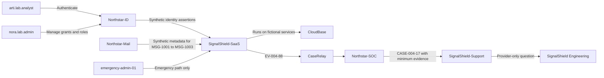

### Synthetic event set

| UTC time | Event | Expected interpretation before testing |
|---|---|---|
| 09:00 | `arti.lab.analyst` signs in on managed device; session `SES-A` issued under `POL-7` | Authentication succeeded; exact resource authorization still required |
| 09:02 | `REQ-004-A` reads case metadata and is allowed | `case.read` matches resource/action |
| 09:04 | `REQ-004-B` requests full message export and is denied `403` | Likely expected least-privilege denial |
| 09:10 | `svc-caserelay` receives token `TOK-META-1` with `alerts.read` and unexpected `tenant.config.write` | Functional but overprivileged grant |
| 09:12 | `REQ-004-C` sends `EV-004-88`; receiver returns `202` | Acceptance is not proof of downstream processing |
| 09:13 | CaseRelay rejects event because schema version is unsupported | Integration data-plane processing failure |
| 09:20 | Analyst role is removed under change `CHG-004-9`, producing `POL-8` | New authorization should deny case access |
| 09:23 | Existing `SES-A` performs `REQ-004-D` and is allowed | Possible cached/session behavior requiring documented expectation |
| 09:25 | New session attempt `REQ-004-E` is denied | New policy is active for new authorization |
| 09:30 | Approved tabletop test finds break-glass path depends on Northstar-ID federation | Emergency design gap; no real compromise |
| 09:40 | Synthetic session revoke is recorded; `REQ-004-F` from `SES-A` is denied | Revocation outcome validated in scenario |

### Step 1: Define objectives resources and actions

Create `01-resource-action-register.md` with at least these rows:

| Resource | Security objective | Allowed subject/action | Explicitly disallowed action | Decision owner |
|---|---|---|---|---|
| Case metadata for `CASE-004-17` | Analysts can investigate minimum evidence | `arti.lab.analyst` may `case.read` while role and policy are valid | Full message export without separate approval | Customer SOC/role owner under synthetic policy |
| Tenant configuration | Only approved admins change policy | `nora.lab.admin` may perform named changes through approved management path | `svc-caserelay` may not write configuration | Customer identity/service owner |
| Alert event stream | CaseRelay receives alert metadata | `svc-caserelay` may `alerts.read` for tenant `NST-100` | Cross-tenant read or configuration write | Customer integration owner |
| Provider decision telemetry | Support can investigate documented case evidence | Support may retrieve approved request decisions for case purpose | Unbounded mailbox or customer-data browsing | SaaS vendor under fictional support policy |
| Emergency administration | Restore control when normal path fails | `emergency-admin-01` only under declared emergency process | Routine administration | Authorized customer security owner |

**Expected evidence:** Every resource has a named action, subject, scope, duration or condition, owner, and denied example. “Access to system” is insufficient.

### Step 2: Mark trust boundaries and planes

Create `02-boundary-plane-map.md`. Copy the architecture diagram and label each arrow with:

1. data or authority crossing;
2. identity initiating;
3. authentication source;
4. authorization owner;
5. management, control, or data plane;
6. evidence identifier;
7. responsible parties on both sides;
8. revoke or recovery path.

Add at least eight boundary rows. Identify one high-impact management-plane crossing, one control-plane decision, and three data-plane actions.

**Expected evidence:** `CHG-004-9` is management-plane evidence; the decision for `REQ-004-D` is control-plane evidence; event `EV-004-88` and case reads are data-plane evidence. The same event may touch more than one plane, but explain each role rather than forcing one label.

### Step 3: Build explicit access-decision records

Create `03-access-decisions.csv` or a Markdown equivalent with this schema:

| Request ID | Time UTC | Subject | Auth evidence | Device/workload | Tenant | Action | Resource | Context | Policy version | Decision | Reason | Session/token | Activity result |
|---|---|---|---|---|---|---|---|---|---|---|---|---|---|

Populate `REQ-004-A` through `REQ-004-F`. For each, write “unknown” when the synthetic record does not supply a fact. Do not silently invent one.

**Expected observations:**

- `REQ-004-A` has aligned role, action, resource, and `POL-7` allow.
- `REQ-004-B` is denied despite internal/managed context because export is not granted.
- `REQ-004-D` exposes a session/revocation question after role removal.
- `REQ-004-E` shows current policy denial for a new session.
- `REQ-004-F` validates the synthetic revoke outcome.

### Step 4: Perform a least-privilege review

Create `04-privilege-review.md` and review all four identities.

| Identity | Needed access | Effective or observed access | Excess or gap | Proposed control | Validation |
|---|---|---|---|---|---|
| `arti.lab.analyst` | `case.read` for assigned synthetic cases | `case.read` under `POL-7`; no export | Role removal does not immediately stop `SES-A` in scenario | Session revoke and documented behavior review | New and old session denial after revoke |
| `nora.lab.admin` | Named identity-management changes | State only approved task; do not invent global access | Determine whether standing privilege is necessary | JIT plus task-scoped administration concept | Approved change succeeds; unrelated action denied |
| `svc-caserelay` | `alerts.read` for `NST-100` | Also has `tenant.config.write` | Excess write scope and possibly stale owner | Replace with read-only grant; assign owner; rotate/revoke | Read succeeds; write fails; old credential fails |
| `emergency-admin-01` | Emergency restore only | Dependency on failed normal identity path | Recovery path not independent | Redesign under official guidance; protect and test | Approved test succeeds and alerts fire |

For every proposed removal, identify possible availability impact, owner approval, rollback, and a negative test. Least privilege without validation is only intent.

### Step 5: Trace the token and session lifecycle

Create `05-token-session-trace.md` with two timelines:

1. `TOK-META-1`: registration, grant, synthetic issuance, API use, scope correction, replacement, old grant revocation, and decommission review.
2. `SES-A`: authentication, issuance under `POL-7`, allowed action, role removal, continued action, explicit revoke, denied action.

For each phase record the controlling party, expected evidence, failure, and escalation boundary. Use `TOKEN-NOT-REAL` if a token value placeholder is required.

**Expected evidence:** The trace distinguishes token metadata from secret value; role removal from session revocation; policy change from enforcement; and new-session behavior from old-session behavior.

### Step 6: Map shared responsibility

Create `06-shared-responsibility.md` with one row for each of the eight parties. Then map these activities:

- define `alerts.read` business need;
- approve and issue workload authority;
- validate token issuer/audience/scope;
- deliver `EV-004-88`;
- process the accepted event;
- investigate missing processing;
- revoke excess privilege;
- assess whether a real incident exists;
- communicate case progress;
- correct a provider-side defect if found;
- restore emergency administration;
- accept any residual risk.

Each activity needs a technical control owner, task performer, accountable decision role, evidence owner, and escalation path. “Shared” is not a valid owner entry.

### Step 7: Add a RACI without rewriting responsibility

Create `07-raci.md` for the response to the overprivileged `svc-caserelay` grant. Include Northstar identity admin, integration owner, SOC, SignalShield support, SignalShield Engineering/Security, and relevant provider. Mark one accountable role per task where practical. Add a note under every task whose contractual or risk authority would require verification in real work.

**Expected evidence:** The RACI coordinates grant replacement and validation, but a separate note states that it does not modify provider contract, data ownership, or risk authority.

### Step 8: Run six paper tests

No real system is used. For each test, write precondition, input, expected result, synthetic observation, interpretation, owner, rollback, and artifact reference.

| Test | Input | Expected result | Synthetic observation | Learning target |
|---|---|---|---|---|
| T1 allowed case read | `REQ-004-A` | Allow `case.read` | Allowed and activity logged | Positive authorization path |
| T2 denied export | `REQ-004-B` | Deny content export | `403`, decision reason recorded | Internal network does not grant action |
| T3 denied service write | Corrected `svc-caserelay` grant calls config write | Deny | Synthetic `403` and event | Negative least-privilege test |
| T4 successful service read | Corrected grant calls alert read | Allow | Event delivered | Preserve approved availability |
| T5 revoke old session | `REQ-004-F` after revoke | Deny | Denied and correlated | Session termination evidence |
| T6 break-glass readiness | Approved tabletop path | Expose dependency failure in initial design | Failure and alert recorded | Recovery control must be independent and tested |

### Step 9: Troubleshoot the missing webhook processing

Use the decision tree. Record these competing hypotheses before reading the event set:

1. SaaS never sent the event.
2. DNS/TLS/network path failed.
3. receiver rejected authentication.
4. receiver accepted but queue or schema processing failed.
5. event processed but query/retention hid it.

Then use `EV-004-88`, the `202` response, and the 09:13 schema rejection to update confidence. Explain why `202` narrows but does not prove end-to-end success. Assign SaaS support the delivery-correlation action and the integration owner the receiver-processing action. Keep the case owner and next update time explicit.

### Step 10: Write an escalation packet

Create `08-escalation-packet.md` for the old session continuing after role removal. Include:

- impact: former synthetic analyst privilege remained usable for three minutes in the supplied timeline;
- expected result: state the assumed expectation and label it as requiring current documentation;
- exact timeline with `CHG-004-9`, `POL-7`, `POL-8`, `SES-A`, and request IDs;
- identity/resource/action/context/policy/telemetry record;
- comparison of old versus new session;
- explicit revoke result;
- hypotheses: documented session lifetime, cache, propagation, revoke semantics, clock error, or defect;
- evidence missing: official session/revocation contract and provider decision details;
- explicit ask: confirm expected behavior and whether provider-side defect or additional revocation step exists;
- customer update and next checkpoint;
- privacy note confirming no real token or customer data.

### Step 11: Write a customer-safe update

Create `09-customer-update.md` using this structure:

> **Impact:** State the affected synthetic action and time window.  
> **What we verified:** State role change, old/new session comparison, explicit revoke, and final denial.  
> **What remains open:** State the documented-behavior question without calling it a defect.  
> **Actions and owners:** Name customer-side validation and provider-side investigation separately.  
> **Security handling:** Confirm no live credential or message content was collected.  
> **Next update:** Give an exact fictional checkpoint.

### Step 12: Create the artifact manifest

Create `10-artifact-manifest.md`:

| Artifact | Required content | Evidence label | Sensitive content check | Status |
|---|---|---|---|---|
| `01-resource-action-register.md` | Resources, actions, subjects, owners, denied cases | Local/synthetic lab | No real names/data | Complete or revise |
| `02-boundary-plane-map.md` | Boundaries, flows, planes, controls, evidence, owners | Local/synthetic lab | Fictional identifiers only | Complete or revise |
| `03-access-decisions` | Six explicit decision records | Local/synthetic lab | No token value | Complete or revise |
| `04-privilege-review.md` | Human, service, and emergency review | Local/synthetic lab | No production grant | Complete or revise |
| `05-token-session-trace.md` | Workload token and human session lifecycle | Local/synthetic lab | `TOKEN-NOT-REAL` only | Complete or revise |
| `06-shared-responsibility.md` | Eight-party activity map | Template plus synthetic lab | No contract claim | Complete or revise |
| `07-raci.md` | Task coordination plus authority caveats | Template plus synthetic lab | No real organization | Complete or revise |
| `08-escalation-packet.md` | Timeline, hypotheses, evidence, ask, privacy | Template plus synthetic lab | No real case/customer | Complete or revise |
| `09-customer-update.md` | Impact, findings, owners, unknown, checkpoint | Template only | Fictional content | Complete or revise |
| `10-artifact-manifest.md` | Labels, checks, status, cleanup | Local/synthetic lab | Self-check complete | Complete or revise |

### Expected evidence summary

A complete lab should make these claims supportable:

1. Access decisions name identity, action, resource, context, policy, duration/session, and telemetry.
2. Network location and successful authentication do not substitute for authorization.
3. Management, control, and data planes are distinguished with joined evidence.
4. Excess API scope is found even though the integration functions.
5. Positive and negative least-privilege tests preserve required function while denying excess action.
6. Role removal, session revocation, and token expiry are not treated as the same event.
7. All eight parties have precise activity and evidence boundaries.
8. RACI coordinates tasks without pretending to rewrite contract or risk authority.
9. The escalation packet asks a provider-answerable question without inventing a defect.
10. No real credentials, customer data, vendor operation, or production claim appears.

### Cleanup and privacy

1. Search every artifact for `Bearer`, `Authorization`, `cookie`, `secret`, `password`, real email domains, employer names, customer names, and long random-looking strings.
2. Replace accidental examples with the exact fictional identifiers in this lab.
3. Confirm screenshots, document metadata, and file properties contain no unintended identity or path information before portfolio use.
4. Delete scratch copies, editor backups, and exports not required for the final set.
5. Retain only the final synthetic artifacts in the private study folder.
6. Record cleanup date and reviewer initials in the manifest.
7. Do not claim the lab demonstrates Abnormal access, email-security operations, customer assessment, or production zero-trust implementation.

### Validation rubric

Score each dimension from 0 to 4. Maximum score: 48.

| Dimension | 0 | 1 | 2 | 3 | 4 |
|---|---|---|---|---|---|
| Beginner clarity | Missing | Terms used without explanation | Basic definitions | Definitions plus useful examples | Definitions, analogies, limits, and accurate application |
| Explicit decisions | Missing | Identity only | Some decision inputs | All inputs for most requests | Complete identity/action/resource/context/policy/session/telemetry records |
| Boundary and flow map | Missing | Boxes only | Some arrows or owners | Eight useful boundaries | Every crossing has data, authority, control, evidence, owner, revoke path |
| Plane separation | Missing | Labels confused | Planes named | Correct examples | Joined management/control/data evidence and failure reasoning |
| Least privilege | Missing | “Reduce access” only | Roles reviewed | Scope/time/owner/test included | Positive and negative tests plus availability/rollback reasoning |
| Token/session lifecycle | Missing | Login only | Issue/use/expiry | Refresh/revoke/decommission included | Old/new session comparison and non-secret evidence discipline |
| Shared responsibility | Missing | “Shared” entries | Several parties mapped | All eight parties mapped | Activity, evidence, escalation, and risk authority are precise |
| RACI discipline | Missing | Many ambiguous owners | RACI completed | Clear R/A/C/I | RACI explicitly separated from contract, legal, technical, and risk duty |
| Troubleshooting | Missing | One guessed cause | Several hypotheses | Discriminating tests and observations | Evidence updates confidence and drives boundary-specific next action |
| Escalation quality | Missing | Generic “please investigate” | Timeline or IDs | Repro, evidence, hypotheses, ask | Provider-answerable ask, customer update, privacy and ownership continuity |
| Safety and honesty | Real or risky data | Labels missing | Mostly synthetic | Fully synthetic and labeled | Every artifact labeled; claims and gaps audited; no secrets or vendor internals |
| Artifact and cleanup quality | Missing | Partial files | Most artifacts | All artifacts and manifest | Reproducible, sanitized, reviewed, cleaned, and portfolio-ready |

**Passing target:** At least 40/48, with scores of 4 in safety and honesty, explicit decisions, shared responsibility, and escalation quality. Any real secret, customer data, unsupported vendor claim, or unapproved system interaction is an automatic lab failure regardless of score.

## Official Source Anchors

All sources below were accessed on **August 24, 2026**. Standards, public product pages, documentation, and service responsibilities can change. Revalidate them before operational use. The supplied master/CV remains the only source for Arti's production-experience claims.

| Official source title or family | URL | Access date | Use in this Part and caution |
|---|---|---|---|
| Supplied Abnormal AI Technical Support Engineer JD represented in the confirmed master | No public URL supplied | August 24, 2026 | Role, named product areas, case types, ecosystem, and culture signals; no private workflow inferred |
| Arti Thakur tailored CV/master evidence summary | Local supplied source; no public URL | August 24, 2026 | Microsoft enterprise support, escalation, networking learning, identity fundamentals, and communication transfer only |
| NIST SP 800-207, Zero Trust Architecture | <https://csrc.nist.gov/pubs/sp/800/207/final> | August 24, 2026 | Primary architecture anchor: resource focus, removal of location-based implicit trust, tenets, policy engine/administrator/enforcement concepts; not a product checklist |
| CISA Zero Trust Maturity Model Version 2.0 | <https://www.cisa.gov/sites/default/files/2023-04/zero_trust_maturity_model_v2_508.pdf> | August 24, 2026 | Identity, Devices, Networks, Applications and Workloads, and Data pillars; Visibility and Analytics, Automation and Orchestration, and Governance cross-cutting capabilities; maturity is a journey, not an Abnormal design claim |
| Microsoft Zero Trust as a security foundation | <https://learn.microsoft.com/en-us/security/zero-trust/zero-trust-overview> | August 24, 2026 | Official teaching language for verify explicitly, least privilege, assume breach, conditional/temporary access, continuous evaluation, and shared security responsibility |
| Microsoft shared responsibility in the cloud | <https://learn.microsoft.com/en-us/azure/security/fundamentals/shared-responsibility> | August 24, 2026 | SaaS/PaaS/IaaS responsibility illustration and retained customer responsibility; not a universal contract or Abnormal responsibility matrix |
| Microsoft Learn, Just Enough Administration overview | <https://learn.microsoft.com/en-us/powershell/scripting/security/remoting/jea/overview> | August 24, 2026 | JEA as a Microsoft PowerShell constrained-administration technology; not a generic product claim |
| Microsoft Learn, Manage emergency access accounts | <https://learn.microsoft.com/en-us/entra/identity/role-based-access-control/security-emergency-access> | August 24, 2026 | Emergency-access design, protection, monitoring, and validation concepts for Microsoft Entra; adapt only through current platform and organizational guidance |
| Abnormal official Behavioral Security Platform overview | <https://abnormal.ai/platform/overview> | August 24, 2026 | High-level official public positioning across email, identity, AI, behavior, and API integrations; no internal architecture, responsibility, or support behavior inferred |
| Abnormal official Email Security page | <https://abnormal.ai/platform/email-security> | August 24, 2026 | High-level public email-security, behavioral, visibility, integration, investigation, and response context; feature details require current official documentation |
| Abnormal official Security Posture Management page | <https://abnormal.ai/platform/security-posture-management> | August 24, 2026 | High-level public Microsoft 365 configuration, prioritization, and drift context; not generalized to undocumented SaaS products or control behavior |
| Abnormal Trust Center | <https://abnormal.ai/trust-center> | August 24, 2026 | Official assurance and trust source family to consult for current authorized public material; this Part asserts no unseen control or certification detail |

### NIST and CISA framework map

| Framework view | Components | How this Part uses it | What not to infer |
|---|---|---|---|
| NIST SP 800-207 tenets and logical architecture | Resources, secured communication, per-session access, dynamic policy, asset posture, strict authentication/authorization, telemetry; policy decision and enforcement concepts | Builds explicit request sentences, plane maps, session evaluation, and evidence | That every product exposes identical components or evaluates in real time without delay |
| CISA ZTMM pillars | Identity; Devices; Networks; Applications and Workloads; Data | Ensures the strategy covers more than identity or network | That pillar maturity is a product score or certification |
| CISA cross-cutting capabilities | Visibility and Analytics; Automation and Orchestration; Governance | Connects telemetry, response, ownership, and maturity | That more automation is always safer or that telemetry collection has no privacy limit |
| CISA maturity stages | Traditional, Initial, Advanced, Optimal | Encourages an incremental, outcome-based journey | That every capability must reach one stage simultaneously |

### Source discipline

- **Official standard/guidance fact:** NIST and CISA define public zero-trust architecture and maturity concepts.
- **Official Microsoft guidance:** Microsoft provides teaching models for three principles, cloud responsibility, JEA, and Entra emergency access. These are Microsoft contexts, not universal implementations.
- **Official Abnormal public positioning:** Only the high-level statements available on the named official pages are used. No private permissions, token lifecycle, data flow, control plane, support access, contract, or product behavior is invented.
- **Teaching framework:** The decision sentence, plane examples, tables, responsibility matrices, worked examples, lab, RACI, and rubric are original study aids, not official NIST, CISA, Microsoft, or Abnormal methods.
- **Synthetic evidence:** Northstar Paperworks, SignalShield-SaaS, CloudBase, all identities, messages, tokens, requests, policies, events, and times are fictional.
- **Candidate evidence:** Only the supplied CV/master supports Arti's production-transfer claims.
- **Required revalidation:** Exact product capability, permission, log field, revocation behavior, responsibility, and escalation path must be checked against current official documentation and authorization.

## Interview Q&A

### Q1.

**Question:** What is zero trust, and why is it a strategy rather than a product?

**Model answer:** Zero trust is a security strategy that removes broad implicit access based only on location, ownership, or a previous decision and protects each resource through explicit, scoped, observable authorization. It combines identity, device or workload, resource, context, policy, enforcement, telemetry, segmentation, governance, and response. A product can implement part of that system, but no product knows every business purpose, resource, responsibility, exception, or risk decision. I would start with data flows and access decisions, then map capabilities to them.

### Q2.

**Question:** Explain verify explicitly, least privilege, and assume breach with one support example.

**Model answer:** Verify explicitly means evaluate the current identity, device or workload, action, resource, context, and policy. Least privilege means grant only the necessary action, resource, data, duration, and delegation. Assume breach means design so one stolen session cannot reach everything and can be detected and revoked. If an analyst requests a message export, I would not rely on a corporate network or successful login; I would check the named role, export action, tenant/resource, policy decision, session state, and audit event, then use an approved time-bound elevation only if the task justifies it.

### Q3.

**Question:** What is the difference between trust, authentication, and authorization?

**Model answer:** Trust can mean a human relationship or technical confidence. Authentication establishes confidence that a requester controls a claimed identity or credential. Authorization decides whether that subject may perform a specific action on a specific resource under current policy. A trusted employee with a valid MFA sign-in may still be denied an export, and a valid service token can still have the wrong audience or scope. Zero trust does not call the person dishonest; it refuses to turn identity or location into blanket technical authority.

### Q4.

**Question:** How do control, data, and management planes help you troubleshoot?

**Model answer:** The management plane changes roles, policies, integrations, and keys. The control plane evaluates context and produces or enforces access decisions. The data plane carries the actual read, write, export, delivery, or remediation action. I join evidence across them: change ID and policy version, decision ID and reason, then resource action and result. A saved policy does not prove propagation, an allow decision does not prove the action occurred, and a reachable endpoint does not prove authorization.

### Q5.

**Question:** How would you apply least privilege to service accounts and API integrations?

**Model answer:** I would require a named human owner and approved purpose, choose a workload identity rather than a shared human account, map every permission to an actual resource and operation, restrict tenant and runtime scope, avoid interactive use, protect or replace long-lived secrets, and define rotation, telemetry, revocation, and decommissioning. I would test both allowed required calls and denied unrelated calls. In support I would collect client and request IDs plus non-secret token metadata, never a live token or secret.

### Q6.

**Question:** What are JIT, just-enough administration, JEA, privilege creep, and break-glass access?

**Model answer:** JIT activates privilege only when needed and removes it after a short period; just-enough administration restricts the allowed administrative actions. JEA is Microsoft's specific PowerShell technology for constrained administrative endpoints, commands, and parameters. Privilege creep is access accumulating beyond current need through role changes, temporary grants, nested groups, or old integrations. Break-glass is a protected emergency path for failure of normal administration. It must be independent enough to recover, strongly secured, monitored, safely tested, and reviewed after every use, not used for convenience.

### Q7.

**Question:** How does shared responsibility differ from RACI?

**Model answer:** Shared responsibility identifies which party actually owns technical, contractual, data, operational, and risk duties across the customer, SaaS, cloud, identity, mail, integration, SOC, and support chain. RACI coordinates a specific task by naming who performs it, owns its result, advises, and receives updates. A RACI cannot give a party technical control it lacks, rewrite a contract, decide legal duty, or make a support engineer the risk owner. I establish the real boundary first, then use RACI to coordinate the action.

### Q8.

**Question:** A customer's integration stopped after a permission change. How would you own the case without blaming either party?

**Model answer:** I would confirm impact, last success, first failure, tenant, workload identity, action, resource, change, and exact response. I would separate DNS/TLS reachability, identity issuance, token audience/scope, SaaS authorization, event delivery, and receiver processing, joining them with UTC times and IDs. I would assign customer-controlled grant evidence to the identity/integration owner and provider-side decision evidence to SaaS support or Engineering, while I retain case continuity. My update would state observations, hypotheses, actions, owners, and next checkpoint, not “customer issue” or “vendor issue” before evidence supports cause.

## 30-Second Memory Hooks

- **Zero trust is a strategy and architecture direction, not a product.**
- **No network location gets a blank check.**
- **Verify explicitly = evaluate this identity, action, resource, context, and policy now.**
- **Least privilege = right identity, action, resource, data, duration, and delegation.**
- **Assume breach = contain one failure, observe it, revoke it, recover.**
- **Authentication proves a claimant; authorization permits an action.**
- **Trust is confidence; authorization is an enforceable decision.**
- **A VPN proves a path, not permission to every resource.**
- **Control plane decides; data plane carries; management plane configures.**
- **Plane health is not end-to-end health.**
- **Trust boundaries need data, authority, control, evidence, and owner labels.**
- **Segmentation limits zones; microsegmentation limits smaller workload/resource cells.**
- **A token represents authority; it is not the user or business purpose.**
- **Role removal, token expiry, and session revocation are different events.**
- **Privilege creep grows through time, groups, projects, and forgotten integrations.**
- **JIT limits when; just enough limits what; JEA is a Microsoft PowerShell implementation.**
- **Service identities need purpose, owner, narrow scope, telemetry, revoke, and retirement.**
- **Break glass is emergency recovery, never routine convenience.**
- **Shared outcome, precise responsibilities.**
- **R does, A owns the task result, C advises, I knows.**
- **RACI cannot rewrite architecture, contract, law, or risk authority.**
- **A `202` can prove acceptance, not downstream completion.**
- **A `403` after TLS often moves the investigation from path to authorization.**
- **Support keeps case ownership while specialist work crosses boundaries.**
- **Public product positioning is not private architecture evidence.**

## Completion Checklist

- [ ] I can explain the origins of zero trust as a response to distributed resources, cloud/mobile work, APIs, and identity/session attacks without claiming the perimeter was never useful.
- [ ] I can explain why zero trust is a strategy and architecture direction rather than a single product or certification.
- [ ] I can state verify explicitly, use least privilege, and assume breach, then translate each into concrete controls and evidence.
- [ ] I can write a complete access-decision sentence naming subject, action, resource, tenant, device/workload, context, policy, evidence, time, duration, and telemetry.
- [ ] I can distinguish interpersonal trust, technical confidence, authentication, authorization, and implicit trust.
- [ ] I can explain NIST's policy engine, policy administrator, and policy enforcement point as logical concepts without assigning them to an undocumented vendor design.
- [ ] I can explain the CISA identity, devices, networks, applications/workloads, and data pillars plus the three cross-cutting capabilities.
- [ ] I can draw a trust-boundary and data-flow map and label data, authority, control, evidence, owner, and revocation at every crossing.
- [ ] I can distinguish management, control, and data planes and join evidence across all three.
- [ ] I can identify at least eight implicit-trust hazards and replace each with a stronger explicit decision or control.
- [ ] I can distinguish segmentation from microsegmentation and explain their containment value and operational failure risks.
- [ ] I can explain continuous evaluation without promising instant universal re-evaluation or undocumented revocation behavior.
- [ ] I can trace registration, consent, credential setup, issuance, presentation, refresh, revocation, expiration, and decommissioning.
- [ ] I will never request or place a live token, session cookie, client secret, password, or private key in a support case or lab.
- [ ] I can review least privilege across identity, action, resource, data, time, and delegation while preserving required availability.
- [ ] I can explain privilege creep, JIT, just-enough administration, Microsoft JEA, and their differences.
- [ ] I can review service accounts/workload identities for purpose, owner, authentication, scope, runtime, rotation, telemetry, revocation, and decommissioning.
- [ ] I can explain safe human administrator and support-access progression from redacted evidence to authorized temporary access.
- [ ] I can explain break-glass criteria, independence, protection, monitoring, testing, post-use review, and restoration.
- [ ] I can map responsibilities across customer, SaaS vendor, cloud provider, identity provider, mail provider, integration, SOC, and support.
- [ ] I can explain why RACI coordinates tasks but cannot override technical control, contract, legal duty, or risk authority.
- [ ] I can request minimum evidence at identity, token, policy, resource, integration, and incident boundaries.
- [ ] I can retain case ownership while escalating a provider-answerable question with impact, timeline, IDs, hypotheses, evidence, privacy note, and next checkpoint.
- [ ] I can apply the model to Cloud Email Security, AI Security Agents, and SaaS Security only as official public context plus vendor-neutral reasoning, with exact product behavior left open.
- [ ] I completed all twelve steps of the Zero Trust Boundary and Shared-Responsibility Lab using only the supplied fictional architecture and events.
- [ ] My lab contains all ten named artifacts, exact evidence labels, eight-party map, RACI caveat, six paper tests, privacy/cleanup record, and scored rubric.
- [ ] My lab score is at least 40/48, with 4s in safety/honesty, explicit decisions, shared responsibility, and escalation quality.
- [ ] I can walk through all six worked examples using inputs, reasoning, evidence, result, caveat, owner, and escalation boundary.
- [ ] I can answer all eight interview questions aloud without overstating production zero-trust, identity governance, Abnormal, or email-security experience.
- [ ] My Arti tie-ins use only stated Microsoft support, networking learning, and identity fundamentals, and every gap remains explicit.
- [ ] I checked all official-source anchors against the August 24, 2026 access date and separated official guidance, public vendor positioning, teaching framework, synthetic evidence, and candidate evidence.

[Next: Part 005 - Privacy Data Handling and Evidence Ethics](Part-005-privacy-data-handling-and-evidence-ethics.md)