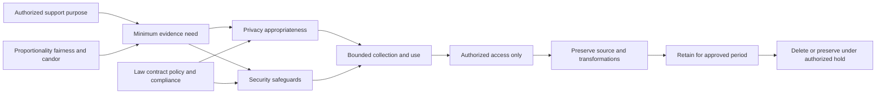
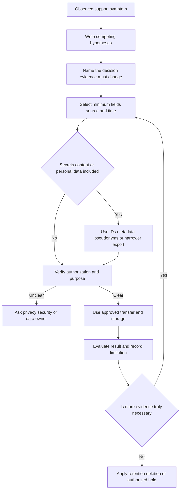
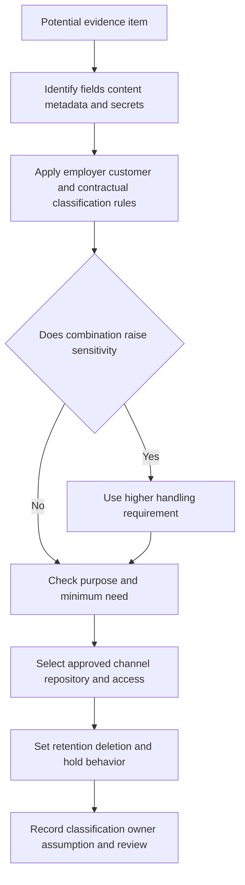
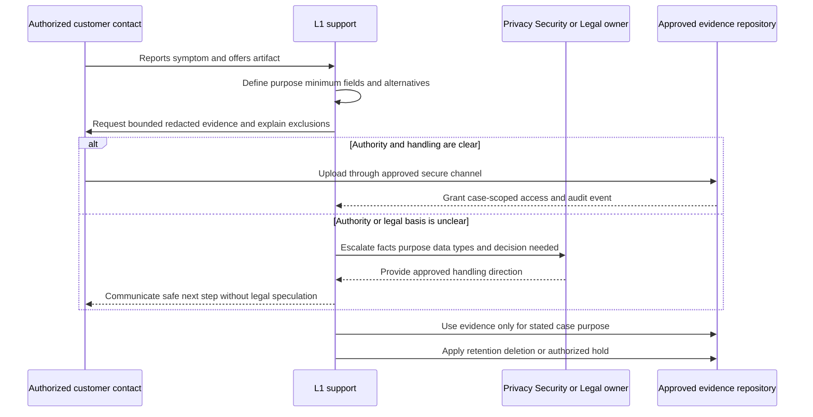
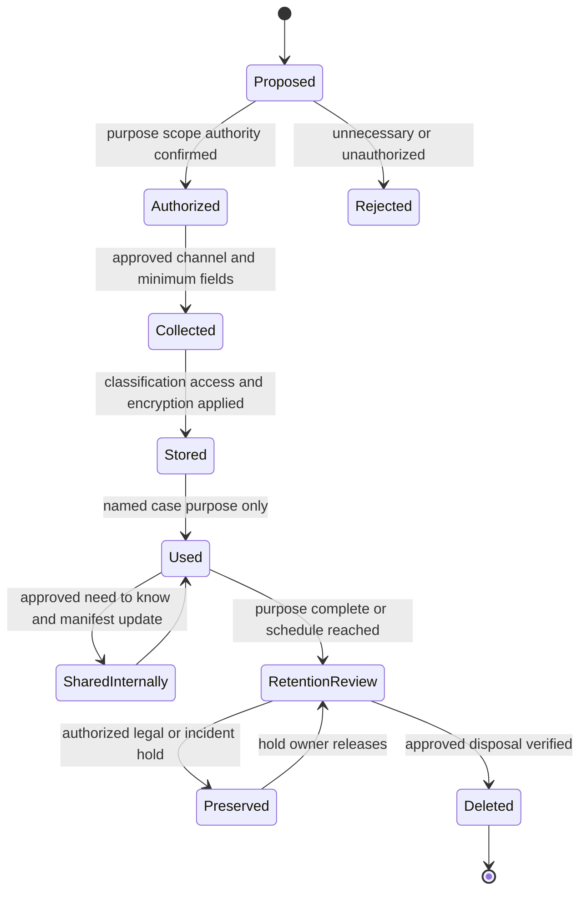
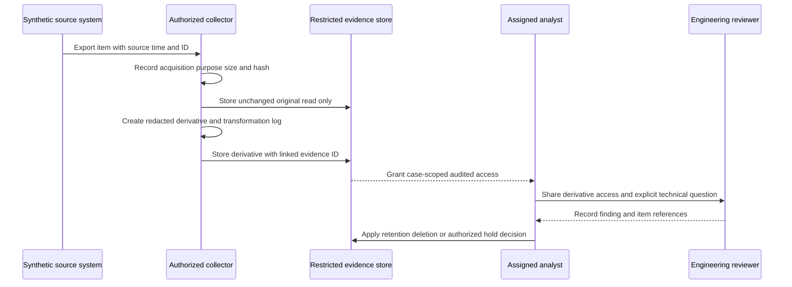
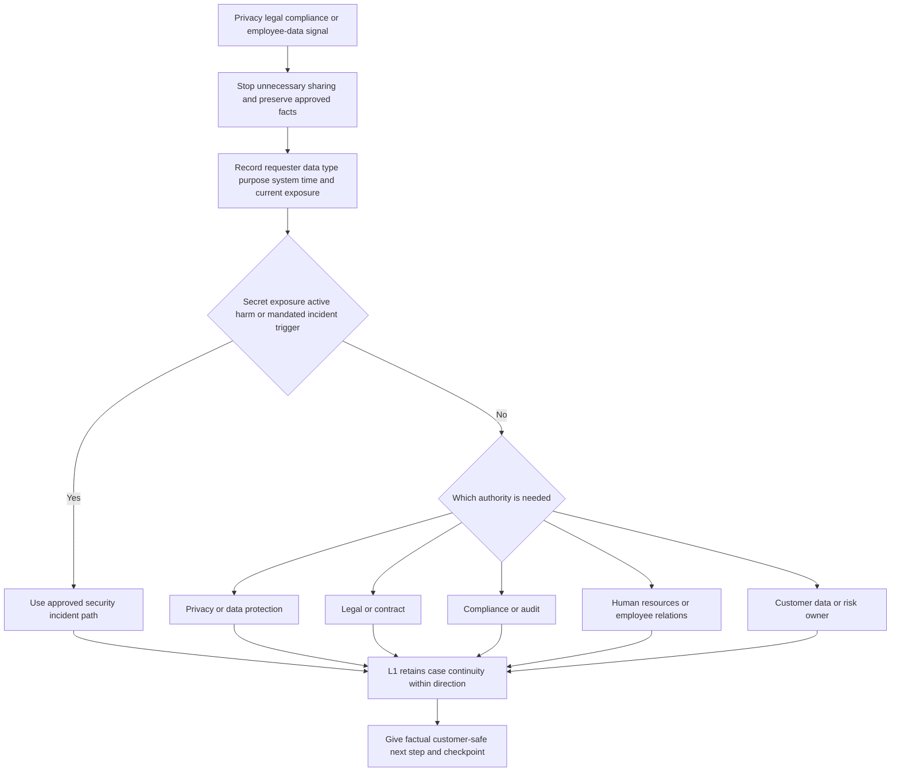
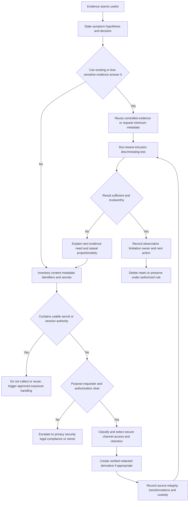

# Part 005 - Privacy Data Handling and Evidence Ethics

> **Purpose:** Learn to obtain useful support evidence without collecting, exposing, retaining, or interpreting more customer data than the authorized diagnostic purpose requires.
>
> **Evidence rule:** Every example and lab record in this Part is synthetic. Your prior enterprise support experience transfers as evidence-handling discipline, customer communication, escalation, and fix validation; it does not establish privacy-office authority, legal expertise, direct email-security operations, or Abnormal AI product experience.
>
> **Currency and official-source access date:** August 24, 2026.

## Section Goal

By the end of this Part, you should be able to explain privacy as disciplined control over information about people, organizations, communications, and behavior. You should be able to distinguish privacy from confidentiality, security, secrecy, and legal compliance; recognize message content, personal data, credentials, identifiers, telemetry, and metadata; and ask what information is actually necessary before requesting a file, screenshot, header, log, or recording.

You should be able to apply **data minimization**, classification, purpose limitation, authorization, access control, secure transfer and storage, redaction, retention, deletion, integrity, provenance, and chain-of-custody practices to an enterprise support case. You should understand that consent may not be the only or correct authority for processing workplace or security data, that a support engineer must follow approved policy rather than invent a legal basis, and that legal, privacy, compliance, human-resources, or security questions require the appropriate owner.

The practical outcome is a named **Glassbox Evidence Ethics Lab**. It produces a synthetic evidence-needs matrix, data inventory, authorization record, classification and minimization decisions, redaction log, integrity manifest, custody history, secure-transfer plan, retention schedule, customer-safe evidence request, escalation card, and validation rubric. The lab proves a support method only; it does not establish production privacy operations or legal competence.

## JD Mapping

The mappings below come from the supplied job description represented in the confirmed master. They do not describe private Abnormal AI access, retention, telemetry, support channels, contracts, or legal obligations.

| Supplied JD signal | Capability developed here | Practical proof |
|---|---|---|
| Enterprise L1 Technical Support Engineer | Requests and handles the minimum evidence needed to move a case | Evidence-needs and decision matrix |
| Configuration and API questions | Protects tenant identifiers, authorization headers, cookies, tokens, request bodies, and configuration exports | Redaction and transfer plan |
| Behavioral false-positive cases | Balances diagnostic context against the privacy of message content and user behavior | Privacy-versus-diagnostic-need worksheet |
| Threat investigations | Preserves source, time, integrity, handling history, and uncertainty without turning support into an unauthorized investigation | Manifest and custody log |
| Timely customer communication | Explains what evidence is needed, why, how to redact it, and when it will be deleted | Customer-safe request template |
| Recommendations and RCA insight | Distinguishes observations from inferences and protects the evidentiary record | Provenance and integrity checklist |
| Engineering and Product collaboration | Packages sanitized evidence with stable identifiers and an explicit technical ask | Escalation-ready evidence bundle design |
| Cloud Email Security | Recognizes sensitivity in bodies, attachments, headers, recipients, message IDs, and investigation outcomes | Synthetic message evidence plan |
| AI Security Agents and AI-assisted support | Prevents customer data, secrets, or unapproved content from entering external AI tools | AI-use boundary table |
| SaaS Security and integrations | Handles OAuth grants, audit logs, tokens, webhooks, identities, roles, and tenant metadata proportionately | Integration evidence classification |
| Customer trust and security mindset | Makes privacy care observable through minimization, candor, access control, retention, and deletion | Ethics review and validation rubric |
| Cross-functional culture | Knows when Support must involve Security, Privacy, Legal, Compliance, HR, Engineering, or the customer owner | Escalation-boundary map |

## Candidate Honesty Note

Privacy language carries authority implications. You should preserve these evidence tiers in every interview answer.

| Evidence label | Honest use | Boundary that must remain explicit |
|---|---|---|
| **Production-transfer example** | Your CV-supported enterprise support, critical-situation communication, customer/partner coordination, Engineering/Product escalation, fix validation, KB/training, mentoring, and case-quality work support careful evidence and communication habits | These facts do not prove privacy-program ownership, legal interpretation, forensic custody, Abnormal operation, or email-security investigation authority |
| **Working knowledge or upskilling** | Familiarity with HAR, Fiddler, DevTools, Procmon, Wireshark, Netsh, APIs, JSON, and identity concepts helps identify sensitive fields in diagnostic artifacts | Tool familiarity does not establish that every tool was used in production or that you may collect customer data with it |
| **Local/public lab** | The Glassbox exercise demonstrates minimization, redaction, provenance, manifesting, retention, and decision reasoning with invented records | It is not a customer evidence package, formal forensic process, privacy impact assessment, audit, or legal opinion |
| **Learned architecture** | NIST, CISA, RFC, and Microsoft official guidance provide public concepts for privacy, logs, incident evidence, and secret handling | General guidance does not define a customer's law, contract, classification policy, or Abnormal's private process |
| **No direct experience** | The master records no direct Abnormal AI or email-security production experience and no stated role as privacy counsel, compliance officer, or incident commander | You should say so directly and route decisions to authorized specialists |
| **Template only** | Requests, manifests, redaction logs, and custody forms can be adapted after current policy review | A completed template does not prove an event occurred or that a legal requirement was met |

A safe bridge is: “In enterprise support I learned that useful diagnostics and customer trust depend on careful evidence requests, clear purpose, secure handling, and accurate escalation. I have not operated Abnormal or direct email-security investigations, and I am not a privacy or legal decision maker. My current proof is a synthetic evidence-handling lab plus official-source study.”

## Beginner Terms: Meaning, Importance, and Memory Hooks

| Term | Plain meaning | Why it matters | Memory hook |
|---|---|---|---|
| **Privacy** | Appropriate control over information about people and their activities, including how it is collected, used, shared, retained, and deleted | Support artifacts can reveal communications, behavior, identity, location, or relationships | People retain interests in their data |
| **Security** | Safeguards that reduce unauthorized access, change, loss, or disruption | Security helps protect privacy, but a perfectly secured collection can still be unnecessary or improperly used | Security protects; privacy governs purpose |
| **Confidentiality** | Limiting disclosure and access to authorized parties | A case attachment may be confidential even when its collection was authorized | Right data, right people |
| **Personal data or personally identifiable information (PII)** | Information that identifies, relates to, describes, or can reasonably be linked to a person; exact legal definitions vary | Names, addresses, IDs, device data, and combinations of fields can identify people | Identifiable alone or in combination |
| **Sensitive data** | Information needing stronger handling because misuse could cause significant harm | Credentials, message content, financial, health, employment, security, or regulated data may qualify | Higher harm means tighter handling |
| **Metadata** | Data about another item or activity rather than its primary content | Sender, recipient, timestamp, subject, message ID, IP, file name, and audit action can be highly revealing | “About” data can still expose a story |
| **Message content** | The actual body, attachment, or substantive communication | It can contain business secrets, personal matters, regulated data, or attacker-controlled text | Content is rarely the first evidence request |
| **Secret** | A value that grants or protects authority, such as a password, token, private key, webhook secret, or session cookie | Anyone possessing a bearer secret may gain access | Never troubleshoot by collecting the key |
| **Data minimization** | Collecting, using, and retaining only what is adequate, relevant, and necessary for the purpose | Smaller evidence reduces exposure and analysis noise | Minimum useful, not maximum available |
| **Purpose limitation** | Using data only for a defined, authorized reason | Evidence collected for one ticket should not silently become training data or a public example | State purpose before collection |
| **Classification** | Applying an approved sensitivity label and handling rule | Classification guides channel, access, encryption, retention, and deletion | The label drives handling |
| **Authorization** | Verified permission from the proper person, policy, contract, or role to perform an action | A willing sender may still lack authority to disclose another person's data | Willing is not always authorized |
| **Consent** | A person's informed and sufficiently free agreement to a described use; requirements vary by context and law | Consent can matter, but employment, security, contract, or legal contexts may rely on another approved basis | Consent is specific, not magic |
| **Access control** | Rules and mechanisms limiting who or what may use data | Only people with a case purpose should access evidence | Need plus permission, not curiosity |
| **Secure transfer** | Moving evidence through an approved, protected channel with intended recipients verified | Email, chat, public links, and consumer file shares may be inappropriate | Protect every crossing |
| **Secure storage** | Keeping evidence in an approved location with access, encryption, audit, and lifecycle controls | A sanitized working copy and restricted original may need different access | Storage continues the custody story |
| **Redaction** | Removing or irreversibly obscuring information not needed for the purpose | It reduces exposure while preserving useful structure | Remove data, preserve diagnostic meaning |
| **Pseudonymization** | Replacing identifiers with consistent substitutes while retaining a separate re-identification possibility | It supports correlation without exposing ordinary names, but it is not necessarily anonymous | Replace, but linkage may remain |
| **Anonymization** | Transforming data so people are no longer reasonably identifiable under the relevant standard | True anonymization is difficult when records can be combined | Anonymous must resist re-identification |
| **Retention** | How long data is kept and why | “Keep forever in case” increases risk and may violate policy | Keep only through the approved need |
| **Deletion or disposal** | Approved removal or destruction at lifecycle end | Closure does not automatically remove every copy or backup | Finish the lifecycle, not just the case |
| **Integrity** | Confidence that evidence is authentic enough, complete for its purpose, and not improperly altered | A cropped screenshot or copied log may lose context | Trustworthy state and handling |
| **Provenance** | The origin and history of data: where it came from, who produced it, and how it changed | Provenance separates an original export from a manually retyped claim | Know the source and transformation |
| **Chain of custody** | A documented history of who possessed or accessed an evidence item, when, why, and what they did | It protects accountability and helps assess integrity; formality depends on purpose | Every handoff leaves a record |
| **Legal hold** | An authorized instruction to preserve specified information because of legal or investigation needs | Normal deletion may need to pause, but Support must not invent or release a hold | Preserve only under authorized direction |
| **Data subject request** | A request concerning a person's data rights under an applicable privacy regime | Support should route it to the established privacy process | Rights requests need the privacy owner |

## Privacy, Security, Confidentiality, and Compliance

These concepts overlap but answer different questions.

| Concept | Central question | Example | What it does not prove |
|---|---|---|---|
| Privacy | Should this information about people be collected and used this way? | Is full message content necessary to diagnose a message-ID mismatch? | That the storage system is secure |
| Security | How is information protected from unauthorized access, alteration, loss, or outage? | Is the evidence portal encrypted and access-controlled? | That collection or use is appropriate |
| Confidentiality | Who is allowed to see it? | Can only the assigned case team access the restricted attachment? | That the data should have been collected |
| Compliance | Are applicable obligations and approved controls being met? | Does retention follow the organization's policy? | That every residual risk is acceptable or every practice is ethical |
| Ethics | Is the action responsible, proportionate, honest, and respectful even where rules leave discretion? | Could the same diagnosis be made without exposing employee conversations? | A substitute for law, contract, or policy |

An encrypted archive may be secure yet privacy-invasive if it contains unnecessary years of message content. A public status page may be nonconfidential but still need integrity protection. A practice can satisfy one control and still be ethically poor because it surprises people, over-collects, or repurposes evidence. L1 support should not perform a legal analysis; it should recognize these dimensions and route uncertainty.



**Analogy:** Privacy is deciding whether a room should contain a camera and what it may record; security is protecting the camera and footage; confidentiality is deciding who may view the footage; compliance checks the applicable rules. The analogy stops because digital systems can copy, infer, correlate, and process data across jurisdictions and organizations in ways one camera does not represent.

## Plain-English deep-dive: Data Minimization Is a Diagnostic Skill

Minimization is sometimes misread as “collect almost nothing.” The correct goal is the **minimum sufficient evidence** that can answer the current question safely. Too little evidence produces guesswork and repeated requests. Too much creates privacy risk, custody burden, slower analysis, and wider accidental disclosure.

Start with a hypothesis and a decision. If the question is whether an API request reached the service, a UTC timestamp, endpoint, method, status, and request ID may be enough. A bearer token and full request body usually are not. If the question is whether two messages share an authentication result, selected headers may suffice before the body or attachment is considered.

**Analogy:** A doctor orders a test because it can distinguish possible conditions, not because every possible specimen should be collected. The analogy stops because support engineers are not clinicians, diagnostic data rules differ, and security evidence may need preservation before its future importance is known.

### The evidence-need sentence

Before requesting evidence, complete this sentence:

> To test whether **[hypothesis]** explains **[observed symptom]**, I need **[specific fields and time range]** from **[source]** because the result will determine whether we **[next action A or B]**. Do not include **[unnecessary or dangerous fields]**. Use **[approved channel]**, and the evidence will be retained according to **[policy/process]**.

| Diagnostic question | Minimum-first evidence | Common excess | Decision enabled |
|---|---|---|---|
| Did the API authenticate the caller? | UTC time, request ID, client identifier, non-secret issuer/audience/scope metadata, status and sanitized error | Raw token, client secret, cookie, private key | Authentication path versus authorization or service path |
| Did a message follow the expected route? | Message ID, sender/recipient pseudonyms, UTC window, selected Received and trace records | Full body, attachment, unrelated mailbox export | Routing boundary and next owner |
| Did a policy change precede the symptom? | Change ID, actor pseudonym, before/after relevant field, UTC time, approval reference | Complete tenant configuration and all admin activity | Causal hypothesis and rollback decision |
| Did a webhook reach the receiver? | Delivery ID, destination label, UTC time, HTTP result, receiver request ID | Signing secret, full payload, unrelated receiver logs | Sender delivery versus downstream processing |
| Is a false-positive claim scoped? | Stable message/case IDs, verdict category, relevant policy/configuration, impact, comparable control sample | Employee conversation history or unrestricted message corpus | Expected behavior, review path, and escalation scope |
| Did a user reproduce a UI error? | Browser version, UTC time, operation, status, correlation ID, sanitized console/network entries | Entire HAR with cookies, authorization headers, query PII, and unrelated tabs | Client, network, authorization, or application boundary |



### Progressive evidence collection

Use stages rather than one broad request:

1. Begin with symptom, expected result, impact, identifiers, source, and time.
2. Request selected metadata that separates the leading hypotheses.
3. Compare an affected item with a safe control.
4. Request a sanitized subset of logs or headers if metadata is insufficient.
5. Seek sensitive content only when a named question cannot be answered otherwise, authority is verified, and the approved path is clear.
6. Stop collection when the next decision no longer needs more data.

Progressive collection reduces repeated exposure. It also helps Engineering because the final package explains why each item exists.

## Classification and Handling Decisions

Organizations use different labels. The illustrative model below does not replace employer, customer, contract, or legal policy.

| Illustrative class | Examples in support | Transfer/storage expectation | Access and retention expectation | Caution |
|---|---|---|---|---|
| Public | Published documentation, public status information, reserved-domain lab data | Approved ordinary channels | Broad access may be acceptable; retain for maintained purpose | Public does not mean accurate forever or free of licensing terms |
| Internal | Runbooks, nonpublic workflow notes, synthetic team exercises | Approved internal systems | Workforce need-to-know and normal lifecycle | Internal data can reveal security posture |
| Confidential | Customer configuration, tenant IDs, user lists, audit records, message metadata | Encrypted approved evidence channel and repository | Case/team need-to-know, audited access, bounded retention | Combinations can identify people or business relationships |
| Restricted | Live credentials, private keys, session cookies, highly sensitive message content, regulated or legal material | Usually do not collect in ordinary case; use specialized approved process if required | Very narrow access, explicit authority, strict lifecycle | Support convenience never justifies secret collection |

Classification decisions should consider content, context, combinations, and consequence. A single synthetic message ID is harmless; a production message ID joined with recipients, verdict, and executive mailbox can reveal a sensitive investigation. A screenshot may appear sanitized while hidden layers, metadata, browser tabs, notifications, file paths, or image thumbnails expose more.



### Secrets, tokens, cookies, and authorization data

Secrets are evidence of authority, not ordinary diagnostic text. A token can often be replaced by safe metadata: issuer, audience, scope, token identifier, issue/expiry time, and the service's validation result. A cookie can often be replaced by session ID, authentication time, browser result, and resource audit event. A private key should never be requested merely to reproduce a handshake; certificate public details and server-side errors are normally safer starting points.

| Sensitive item | Why dangerous | Minimum-first substitute | If exposed |
|---|---|---|---|
| Password or one-time code | Grants direct identity access | Authentication result, event ID, policy reason | Stop sharing; follow credential reset/security process |
| Access or refresh token | May authorize API calls or continued sessions | Non-secret claims/metadata from approved diagnostic, request ID, status | Restrict artifact; route revoke/rotate and security review |
| Session cookie | May allow session replay | Session identifier, sign-in and resource audit events | Treat as credential exposure; invalidate through approved process |
| Client secret or webhook secret | Authenticates software or validates events | Client ID, secret version/expiry metadata, signature-validation result | Rotate/revoke; inspect authorized use evidence |
| Private key | Can impersonate a service or decrypt/sign depending on use | Public certificate, fingerprint, chain, validity, key-store status | Activate high-severity secret-handling process |
| Authorization header | Commonly contains bearer authority | Header name plus `[REDACTED]`, request ID, server result | Remove/restrict artifact and rotate as policy directs |

## Authorization, Consent, and Purpose

Authorization asks whether the person, policy, role, contract, or process permits collection and handling. Consent is one possible concept, but not a universal answer. In an enterprise environment, an employee may not be free to consent in the same way as a consumer; security monitoring may rely on documented organizational authority; a customer administrator may authorize tenant evidence but not disclose another company's confidential data; and applicable law may impose separate duties.

Support should verify the operational authority and route legal-basis questions. It should never say, “The user sent it, so we can use it for anything.”

| Question | Support-safe check | Escalate when |
|---|---|---|
| Who is supplying the data? | Verify requester identity, customer role, case relationship, and approved channel | Identity or authority is uncertain |
| Whose data is it? | Identify employees, external senders, recipients, customers, or third parties affected | The supplier may not control all represented data |
| What is the purpose? | State exact diagnostic or support decision | Purpose is broad, secondary, or likely to change |
| Is consent relevant? | Follow approved privacy guidance; do not invent a consent form | Consent validity, withdrawal, employment context, or legal basis is unclear |
| May Support share internally? | Limit to named teams with a case purpose and approved repository | Engineering, Product, vendor, or cross-border sharing changes the purpose or audience |
| May evidence be used for training or AI? | Use only explicitly approved, minimized, and governed data | Any real customer or personal data is proposed for a public/external AI tool |
| How long may it remain? | Apply current retention schedule and case/incident requirements | Legal hold, dispute, investigation, regulatory, or contract questions arise |



## Plain-English deep-dive: Consent Is Not a Universal Permission Slip

People often treat consent as a checkbox that makes any later use acceptable. Meaningful consent is normally specific to a purpose, informed, sufficiently voluntary, and capable of being managed under the applicable rules. Even valid consent to share an artifact for support does not automatically permit publication, product training, indefinite retention, unrelated research, or upload to an external AI assistant.

**Analogy:** Permission to borrow a house key for a repair does not authorize copying it, entering other rooms, lending it to another company, or keeping it forever. The analogy stops because data can be copied invisibly, many people may be represented in one artifact, and lawful processing can sometimes rely on authority other than consent.

Support-safe language is:

> “Please use the approved evidence channel and share only the named fields for this case. I cannot determine broader legal authority from the ticket. If the artifact includes third-party or regulated information, I will pause collection and involve the appropriate privacy, legal, or security owner.”

### Purpose change

When an artifact collected for troubleshooting becomes interesting for another reason, treat the new use as a new decision. Product improvement, model evaluation, training, demonstration, and publication can involve different audiences and risks. Create a sanitized synthetic reconstruction when possible rather than reusing customer content.

## Secure Transfer, Storage, Access, Retention, and Deletion

Evidence has a lifecycle. A secure collection can become unsafe through uncontrolled copies, broad repository access, stale links, forgotten downloads, backups, screenshots, or indefinite retention.



### Secure transfer checklist

| Control question | Good practice | Failure signal |
|---|---|---|
| Is the channel approved for this class? | Use the employer's/customer's designated evidence portal or secure process | Personal email, public paste, open link, consumer share |
| Are recipients verified? | Confirm organization, role, case, and least access | Autocomplete adds an unrelated recipient |
| Is transfer protected? | Use approved encryption/authentication and verify destination | Password and archive sent through same uncontrolled thread |
| Can access expire or be revoked? | Set bounded access where supported | Permanent public or organization-wide link |
| Is the artifact minimized first? | Redact before transfer where policy permits; retain restricted original only if needed | Full raw artifact sent “just in case” |
| Is receipt auditable? | Record item ID, uploader, time, repository, and authorized recipients | Files copied through untracked chat |
| Is integrity check needed? | Record size/hash or signed export where appropriate | Repeated manual edits with no source record |

### Storage and access

Keep originals and working copies distinct. An original may need strict access and integrity preservation. A working copy may be redacted and annotated. Never overwrite the original to create the redacted copy. Record repository, owner, classification, access group, encryption expectation, retention trigger, and deletion responsibility.

### Retention and deletion

Retention should follow approved policy, contract, incident needs, and legal direction. “Until the ticket closes” may be too short if a validated escalation remains open, or too long if a secret was accidentally uploaded and must be removed immediately. “Forever” is not a safe default.

| Lifecycle event | Question | Support action |
|---|---|---|
| Collection | What starts the retention clock? | Record acquisition time and policy reference |
| Case escalation | Does the receiving team need the same artifact? | Share access to controlled item rather than create duplicate copies |
| Case resolution | Does any active defect, incident, dispute, or hold remain? | Ask the approved owner; do not assume |
| Schedule expiry | Which copies, exports, caches, and local downloads exist? | Follow verified disposal procedure and record result |
| Secret exposure | Must the artifact be removed before ordinary retention? | Follow credential/security response immediately |
| Legal hold | Who issued it and what scope is preserved? | Suspend ordinary deletion only as directed; restrict access |
| Knowledge capture | Can a synthetic reconstruction replace customer evidence? | Prefer synthetic, de-identified teaching material |

## Redaction, Pseudonymization, and Re-Identification Risk

Redaction should preserve diagnostic meaning while removing unnecessary information. Black rectangles in a screenshot may be reversible if the underlying layer or text remains. Cropping can leave metadata. Replacing names with `User1` without a mapping plan can break correlation or accidentally reveal identity through job title and context.

### Redaction strategy

1. Preserve the authorized original unchanged in the approved repository if required.
2. Duplicate it into a controlled working copy.
3. List the diagnostic fields that must remain.
4. Remove secrets first and trigger exposure handling if any are real.
5. Replace personal and customer identifiers consistently when correlation matters.
6. Remove irrelevant content, headers, query strings, tabs, notifications, paths, comments, and metadata.
7. Flatten or export through an approved method so redacted layers cannot be recovered.
8. Re-open the final file as a recipient would and search/extract text to test redaction.
9. Record every transformation in the manifest.
10. Have a second reviewer inspect high-sensitivity artifacts where policy requires.

```mermaid
flowchart LR
    Original[Authorized original read only] --> Inventory[Inventory fields layers and metadata]
    Inventory --> Needed[Mark fields needed for diagnostic decision]
    Needed --> Secrets[Remove secrets and trigger exposure handling]
    Secrets --> Replace[Pseudonymize identifiers consistently]
    Replace --> Remove[Remove irrelevant content and metadata]
    Remove --> Flatten[Create irreversible approved output]
    Flatten --> Test[Search extract inspect and compare usefulness]
    Test --> Review[Second-person review where required]
    Review --> Manifest[Record transformations hash and limitations]
```



### Redaction decision table

| Field | Keep, transform, or remove | Reason |
|---|---|---|
| UTC timestamp | Keep or coarsen only if precise time is unnecessary | Correlation often needs time |
| Request/message ID | Keep synthetic; pseudonymize production value consistently if policy requires | Joins systems without exposing content |
| User email | Replace with `user-a@example.invalid` unless domain/identity is the question | Identifies a person and organization |
| IP address | Keep only if path/source hypothesis needs it; otherwise mask or replace | Can identify infrastructure, location, or person |
| Subject/body/attachment | Remove unless a named approved content question requires it | High privacy and business sensitivity |
| Authorization/cookie/token | Always remove from ordinary artifact; treat real exposure separately | Usable authority, not diagnostic context |
| URL query string | Keep host/path only if sufficient; remove tokens, IDs, search terms | Query parameters commonly contain sensitive data |
| Browser/HAR headers | Keep method/status/request ID and necessary protocol fields | Authorization, cookies, referer, and payload may expose data |
| File path/user profile | Replace user and organization names | Reveals identity and device context |
| Tool and version | Keep when compatibility is relevant | Usually low sensitivity and diagnostically useful |

## Plain-English deep-dive: Redacted Does Not Mean Anonymous

Removing a name may not remove identity. A record describing “the only chief financial officer in the Singapore office at 09:12” can identify a person. Timestamps, role, sender domain, case context, and message subject can combine into a unique profile. Pseudonyms also remain linkable by design.

**Analogy:** Removing a street number from a photo does not anonymize the house if the landmark, color, and map context reveal the address. The analogy stops because digital datasets can be joined at scale and re-identification depends on available outside information.

Ask three questions after redaction:

1. Can the intended technical decision still be made?
2. Could the recipient identify a person, customer, or secret from remaining fields or combinations?
3. Did the export preserve hidden data, layers, metadata, revision history, or thumbnails?

If correlation is needed, use stable synthetic aliases and protect any mapping separately. Do not claim anonymization merely because visible names disappeared.

## Integrity, Provenance, and Chain of Custody

Evidence handling has two goals that can pull in different directions: preserve enough integrity to support a decision, and minimize exposure. The answer is usually a protected original plus documented sanitized derivative, not casual editing of the only copy.

| Concept | Required record | Example |
|---|---|---|
| Source | System/person and export mechanism | “Generated by synthetic mail simulator `SIM-1`” |
| Acquisition | Who collected, when, under what authority | “Lab author at 10:00 UTC under exercise scope” |
| Identity | Stable evidence item ID | `EV-005-003` |
| Integrity | Size, approved hash where useful, signed export status, read-only storage | SHA-256 recorded for synthetic file; hash is not proof the source was truthful |
| Transformation | What was removed/replaced and with which method | Replaced four identities and removed body |
| Access/custody | Who accessed or transferred it, when, why, destination | Reviewer accessed sanitized copy for rubric check |
| Interpretation | What claim it supports and what it cannot prove | Supports route timing; cannot establish message intent |
| Disposition | Retention rule, deletion or hold action, owner | Delete scratch copy after validation; retain sanitized lab artifact |



### What a hash proves and does not prove

A cryptographic hash is a compact value calculated from bytes. If the bytes change, a strong hash will almost certainly change. Matching hashes support that two byte sequences are identical. They do not prove that the original source was accurate, that collection was authorized, that the clock was correct, that the file is complete, or that the interpretation is sound.

### Chain of custody proportionality

A routine product screenshot may need a simple manifest and access history. Evidence potentially used for disciplinary, legal, regulatory, or law-enforcement purposes may require a formal process owned by specialized teams. L1 must not claim forensic-grade custody merely because a spreadsheet exists. Preserve facts and escalate purpose changes promptly.

## Ethical Evidence Use

Ethical use asks whether the evidence is used proportionately, honestly, without unnecessary harm, and within authority. It includes resisting curiosity, confirmation bias, sensationalism, and convenient repurposing.

| Ethical principle | Support behavior | Failure example |
|---|---|---|
| Necessity | Each item changes a named diagnostic decision | Reading message bodies because they are available |
| Proportionality | Intrusiveness matches impact and evidence gap | Exporting an entire mailbox for one message ID |
| Respect | Communicate what is requested and protect represented people | Sharing embarrassing content in a broad incident chat |
| Fairness | Avoid unsupported accusation from partial behavior data | Labeling an employee malicious from one unusual login |
| Candor | State evidence limits, transformations, and uncertainty | Presenting a cropped screenshot as a complete record |
| Purpose fidelity | Use evidence only for the authorized case purpose | Reusing customer messages in training without approval |
| Accountability | Record access, decisions, handoffs, and disposal | Downloading evidence locally with no lifecycle owner |
| Harm reduction | Prefer synthetic reconstruction and metadata where useful | Uploading live artifacts to a public analysis service |

### AI-assisted support boundary

Do not paste customer logs, messages, credentials, tenant data, case details, or proprietary content into a public or unapproved AI system. Even if an AI tool is enterprise-approved, apply its data classification, permitted-use, retention, and human-review rules. Generate synthetic examples when learning. Verify every AI-produced redaction or summary against the source and policy; automated omission can hide important context, and automated summaries can invent facts.

## Privacy Versus Diagnostic Need

The tension is not solved by always refusing evidence or always collecting it. Use a structured balancing process within policy and authority.

| Factor | Lower-intrusion direction | Higher-need direction |
|---|---|---|
| Diagnostic value | Item repeats known information | Item uniquely separates high-impact hypotheses |
| Sensitivity | Synthetic or public metadata | Message content, secret, regulated or employee data |
| Scope | One event and bounded time | Broad population or long period |
| Alternatives | IDs, sanitized output, control sample available | No less intrusive method can answer the approved question |
| Urgency | Stable low-impact case | Active harm or evidence-loss risk under documented process |
| Authority | Clear requester, role, purpose, and channel | Authority, jurisdiction, or third-party rights unclear |
| Handling | Approved restricted repository and deletion path | Public tool, uncontrolled transfer, or unclear retention |

### Worked example 1: HAR file for an API error

**Input:** A customer offers a complete browser HTTP Archive (HAR) after a `403` response.

**Reasoning:** A HAR can contain URLs, query strings, cookies, authorization headers, response bodies, names, tenant IDs, and unrelated navigation. The first question is authorization, not the whole browsing session.

**Minimum evidence:** UTC time, method, hostname/path, status, correlation ID, sanitized error, user/role pseudonym, and comparison with a working user. Ask the customer to use the approved HAR sanitizer or evidence process only if the narrower set is insufficient.

**Result:** The role comparison can decide whether to investigate customer configuration or provider policy without collecting session credentials.

**Caveat:** If timing or redirect behavior requires a HAR, define a short reproduction, close unrelated tabs, use a test identity if authorized, sanitize, and verify the final file. Do not assume automatic sanitization removed every secret.

### Worked example 2: Disputed email verdict

**Input:** A customer says a legitimate payroll message was quarantined and offers the body and attachment.

**Reasoning:** Payroll content may contain sensitive employee and financial data. Begin with message ID, pseudonymized sender/recipient, UTC time, relevant selected headers/authentication results, verdict category, policy context, and business impact. Determine whether the supported review path can answer the question without content.

**Result:** If content is essential, use the approved restricted channel after verifying authority and purpose; limit access and retention. The customer security/mail owner decides release or response under its process.

**Caveat:** Support must not promise safety, infer employee misconduct, or reuse content for training.

### Worked example 3: Token pasted into a ticket

**Input:** A customer pastes a live bearer token beside a `401` error.

**Reasoning:** The token is now exposed to the case system and viewers. Do not copy, decode through an external site, or test it. Restrict/remove the artifact through approved procedure, tell the customer to stop sharing, and route revoke/rotate to the authorized owner. Preserve only safe metadata and access history needed for the exposure response.

**Result:** Investigate the original `401` with new safe evidence after credential handling is complete.

**Caveat:** Exposure does not prove unauthorized use. Access logs and authorized security analysis are needed for that conclusion.

### Worked example 4: Engineering needs reproducible data

**Input:** Engineering asks L1 for “all customer logs” to investigate an intermittent webhook delay.

**Reasoning:** Convert the broad request into an evidence question. Ask which fields, sources, correlation IDs, and time range distinguish queue delay, retries, receiver rejection, or provider processing. Reuse controlled access to existing artifacts instead of downloading copies.

**Result:** Provide a synthetic reproduction plus sanitized delivery ID, receiver request ID, UTC sequence, statuses, retry count, and schema result. Escalate if real payload content is claimed necessary.

**Caveat:** Minimization is collaborative; L1 should not remove fields that Engineering explains are essential. Record the reason and authorization.

## Plain-English deep-dive: Legal and Compliance Boundaries Are Routing Signals

Support engineers often hear words such as “GDPR,” “HIPAA,” “regulated,” “eDiscovery,” “breach notification,” “employee monitoring,” or “legal hold.” Recognizing the words is useful; interpreting the law or contract for a customer is not an L1 responsibility unless the role explicitly grants that authority.

**Analogy:** A smoke detector recognizes a condition and triggers the fire process; it does not decide insurance coverage or building liability. The analogy stops because support engineers use judgment, collect facts, and communicate with people rather than merely triggering an alarm.

Route questions when they involve:

- legal basis, consent validity, data-subject rights, cross-border transfer, or regulator duties;
- contract, data-processing terms, retention commitments, or disclosure obligations;
- suspected exposure of personal or regulated information;
- employee investigation, disciplinary use, insider allegations, or human-resources data;
- litigation, subpoena, law-enforcement request, eDiscovery, or legal hold;
- breach-notification timing or content;
- use of customer data for model training, product analytics, publication, or another purpose;
- uncertainty about deleting evidence under an incident, audit, or dispute.

Provide the specialist a factual packet: who asked, exact wording, data types, systems, scope, locations if known, dates, current handling, actions already taken, and the decision needed. Do not send extra data merely because the escalation is sensitive.



## Troubleshooting Decision Tree for Evidence Requests

Use this tree whenever a case appears to need logs, messages, captures, recordings, screenshots, configuration exports, or user information.



### Symptom-to-hypothesis-to-test-to-action matrix

| Symptom | Privacy/evidence hypothesis | Discriminating check | Observation | Next action |
|---|---|---|---|---|
| Customer repeatedly sends broad logs | The request did not state minimum fields or exclusions | Review evidence request against hypothesis and decision | Most fields are unrelated | Stop duplicate collection; issue a bounded request and deletion guidance |
| Engineering cannot reproduce from sanitized file | Redaction removed a required correlation field | Compare manifest and explicit Engineering question | Request ID was replaced inconsistently | Recreate derivative with stable pseudonym; do not restore unnecessary content |
| Screenshot appears redacted but text is selectable | Visual overlay did not remove underlying data | Extract/search text in a controlled review | Hidden token remains | Restrict artifact, trigger exposure handling, use irreversible approved export |
| Two copies have different hashes | A transformation or corruption occurred | Compare source, size, timestamps, and transformation log | One is expected redacted derivative | Link both IDs and document change; investigate if an “original” changed |
| Customer asks for immediate deletion | Ordinary retention may conflict with rights, incident, or hold process | Verify request type and ask privacy/legal owner | Data-subject or contract question is plausible | Restrict access and route; do not promise deletion timing independently |
| Analyst wants full message body | Content may be unnecessary for header/routing question | Test using IDs and selected headers first | Routing issue isolated without body | Keep content out and document minimization success |
| Token appears in HAR | Evidence collection created credential exposure | Inspect approved sanitizer result without using token | Authorization header remains | Restrict/delete unsafe copy, rotate/revoke via owner, rebuild safe capture |
| Case closes but local downloads remain | Repository retention did not cover endpoint copies | Review manifest and storage locations | Analyst download exists | Delete through approved method and record disposition |

## Common Failure Modes and Unsafe Shortcuts

| Failure mode | Why it fails | Safer correction | Escalation trigger |
|---|---|---|---|
| “Send everything” | Maximizes privacy risk and analytical noise | Tie each field to one hypothesis and decision | Sensitive evidence scope cannot be narrowed safely |
| Treating metadata as harmless | Relationships, behavior, and infrastructure can be inferred | Classify combinations and minimize fields/time | High-risk employee, executive, or incident context |
| Accepting tokens for convenience | Turns support systems into credential stores | Use non-secret metadata and rotate exposed authority | Any real token, cookie, key, or password appears |
| Visual-only redaction | Hidden text, layers, or metadata remain | Use approved irreversible method and verify as recipient | Exposure survived transfer or public sharing |
| Overwriting the original | Destroys provenance and makes transformation unclear | Preserve controlled original and create linked derivative | Evidence may support formal investigation or dispute |
| Calling pseudonyms anonymous | Linkage and surrounding context can re-identify | State pseudonymization and protect mapping | Sharing audience or purpose expands |
| Consent as blanket authority | Purpose, voluntariness, third parties, and policy may differ | Verify approved basis and route uncertainty | Employee monitoring, regulated data, third-party content |
| Indefinite retention | Expands breach and misuse consequences | Apply schedule, owner, trigger, deletion verification | Legal hold, dispute, incident, or contract ambiguity |
| Local downloads outside manifest | Access and deletion become invisible | Use repository access and record necessary local copies | Lost device, unauthorized sync, or unclear location |
| Public AI or analyzer upload | Data may be retained, trained on, or exposed outside agreement | Use approved enterprise tool with policy or synthetic data | Any customer, secret, personal, or proprietary data was uploaded |
| Hash equals authenticity | Hash only shows byte equality after calculation | Record source, acquisition, authority, and limitations | Source integrity or clock is disputed |
| Chain-of-custody theater | A form is presented as forensic proof without process | Describe actual custody level and involve specialists | Legal, disciplinary, law-enforcement, or formal forensic purpose |
| Sharing with Engineering by default | Internal teams may not need unrestricted content | Share controlled derivative and explicit purpose | Internal audience or location changes legal/privacy conditions |
| Premature deletion | Destroys needed evidence or violates hold/process | Follow authorized disposition decision | Legal, incident, compliance, or defect preservation question |
| Quiet purpose expansion | Customer evidence becomes training or demo material | Create synthetic reconstruction or obtain approved new basis | Product/AI/training/publication use proposed |
| Inferring intent from content | Partial communications can be misleading and harmful | Separate observation, context, and authorized investigation | Insider allegation, HR matter, or legal concern |

## Glassbox Evidence Ethics Lab

### Lab purpose

Build a complete, inspectable evidence-handling and redaction plan for a fictional SaaS support case. “Glassbox” means every collection, transformation, access, decision, and disposal action is visible in the lab record. The exercise is benign and local: no messages are sent, no endpoints are contacted, no real captures are opened, and no customer or vendor product is used.

### Honest artifact label

Place this exact label at the top of every artifact:

> **LOCAL/SYNTHETIC LAB - Evidence-handling practice only. No customer data, production system, Abnormal AI operation, direct email-security experience, legal conclusion, or forensic claim is represented.**

### Prerequisites

1. A private local study folder and Markdown or spreadsheet editor.
2. This Part's minimization sentence, classification table, redaction workflow, manifest fields, and decision tree.
3. A Mermaid-capable preview or paper drawing tool.
4. Only the fictional records supplied below.
5. No cloud tenant, mailbox, API credential, packet capture, HAR, customer log, public AI tool, suspicious link, or third-party service.
6. About ninety minutes for the first pass and thirty minutes for privacy review.

### Authorized scope and prohibitions

| Area | Authorized | Prohibited |
|---|---|---|
| Environment | Local text documents with supplied synthetic case | Any production, employer, customer, Abnormal, Microsoft, or third-party system |
| Data | Fictional identities, reserved domains, fake message/request IDs, invented logs | Real email, personal data, case records, internal URLs, customer names, screenshots, tokens, cookies, or credentials |
| Activity | Paper classification, minimization, redaction, hashing concept, manifests, timelines, and communication | Sending mail, scanning, phishing, bypassing controls, decoding/testing credentials, uploading evidence publicly |
| Decision | Recommend safe evidence and route authority | Legal advice, privacy determination, incident command, risk acceptance, forensic certification |
| Retention | Keep final sanitized learning artifacts privately | Retain accidental real information or untracked scratch copies |

### Synthetic case: Lantern Post Lab

Fictional company `Lantern Post Lab` reports that one harmless synthetic message, `MSG-005-77`, appears in an analyst console but not in a webhook export. The message uses reserved addresses `sender@example.invalid` and `analyst@example.invalid`; its body is the sentence `Synthetic scheduling notice only`; it has no attachment or link.

The console event at `2026-08-24T10:00:02Z` carries case ID `CASE-005-9`, tenant alias `TENANT-LAB`, and webhook delivery ID `DEL-005-2`. The fictional sender log shows HTTP `202` at `10:00:03Z`. The receiver log shows request ID `RX-005-8` at `10:00:03Z`, followed by `schema_validation_failed` because field `eventVersion` is `2` while the receiver accepts `1`.

A deliberately unsafe synthetic HAR text includes these fields:

- `Authorization: Bearer TOKEN-NOT-REAL-005`
- `Cookie: session=COOKIE-NOT-REAL-005`
- `X-Request-ID: RX-005-8`
- path `/webhook/events?tenant=TENANT-LAB&user=analyst@example.invalid`
- response `202 Accepted`

All credentials are obvious non-working labels. They must still be redacted to practice the method. The body is not needed to diagnose schema validation. No real person is represented.

### Step 1: Write scope, purpose, and authority

Create the first artifact section with:

- support purpose: determine why the synthetic event was accepted but not processed;
- decision: sender delivery failure versus receiver processing failure;
- approved data: supplied IDs, times, statuses, schema versions, reserved addresses;
- excluded data: real messages, live tokens/cookies, unrelated logs, production systems;
- authority: exercise author under this synthetic lab only;
- stop condition: once the receiver schema error and correlation are established;
- disposition: delete scratch copies after validation; retain sanitized learning artifact privately.

**Expected evidence:** A reader can state why each field is present and which action would stop the lab.

### Step 2: Build an evidence-needs matrix

| Hypothesis | Minimum field/source | Expected observation if true | Privacy concern | Next decision |
|---|---|---|---|---|
| Sender did not deliver | Delivery ID, UTC, destination label, HTTP result | No send or network failure | Destination may identify customer | Check sender path |
| Receiver rejected authentication | Receiver request ID and auth-validation result | `401` or signature failure | Do not collect secret | Repair approved authentication |
| Receiver accepted but rejected schema | Sender/receiver IDs, `202`, schema event and versions | `schema_validation_failed` | Payload content unnecessary | Update compatible schema path |
| Processing succeeded but search hid record | Processing ID, index time, query range | Processed event outside query | User/search terms may be personal | Correct query/retention |

**Expected evidence:** The full message body and fake credentials are marked unnecessary.

### Step 3: Classify every field

Create a data inventory with at least fifteen rows: case ID, tenant alias, delivery ID, receiver request ID, timestamps, sender and recipient, subject/body, authorization header, cookie, URL path, query values, HTTP result, schema versions, and error. Assign illustrative class, purpose, transform, access, retention, and owner assumption.

**Expected evidence:** Authorization and cookie values are classified Restricted even though fake; body is marked Confidential-like but unnecessary; reserved identities are transformed consistently for portfolio practice.

### Step 4: Produce original and sanitized representations

Treat the supplied unsafe HAR text as `EV-005-001` and create a sanitized derivative concept `EV-005-001-R1`:

```text
POST /webhook/events?tenant=TENANT-A&user=USER-A
Authorization: [REDACTED-CREDENTIAL]
Cookie: [REDACTED-SESSION]
X-Request-ID: RX-A
Response: 202 Accepted
```

Record that `TENANT-LAB` became `TENANT-A`, `analyst@example.invalid` became `USER-A`, and `RX-005-8` became `RX-A`. Preserve a separate synthetic mapping only in the exercise notes if cross-artifact correlation needs it.

**Expected evidence:** Secrets are absent, replacement is consistent, and the `202` plus request correlation remains useful.

### Step 5: Build the provenance and integrity manifest

| Evidence ID | Source | Acquired UTC | Purpose | Original/derivative | Transformations | Integrity record | Limitation |
|---|---|---|---|---|---|---|---|
| EV-005-001 | Supplied synthetic HAR text | Exercise time | Correlate receiver request | Original concept | None | Record size and optional local SHA-256 | Source is invented, not actual browser output |
| EV-005-001-R1 | EV-005-001 | Exercise time | Share safe request result | Derivative | Credentials removed; identifiers aliased | Hash derivative separately | Cannot test real authentication |
| EV-005-002 | Supplied synthetic receiver log | Exercise time | Identify processing failure | Original concept | None | Record source label | Log completeness is assumed by scenario |
| EV-005-002-R1 | EV-005-002 | Exercise time | Engineering handoff | Derivative | Alias IDs; retain error/version | Separate hash and link | Supports schema result, not root cause of design mismatch |

Explain what a hash can and cannot prove.

### Step 6: Record custody and access

Create at least six custody events: synthetic creation, original registration, derivative creation, reviewer access, Engineering-template access, and scratch-copy deletion. Each row must contain item ID, from/to role or repository, UTC time, purpose, authorization basis, action, and result.

**Expected evidence:** No event says merely “shared.” The item, destination, reason, and custody result are visible.

### Step 7: Design secure transfer and storage

Write a plan using generic approved channels rather than naming a private vendor workflow:

1. restricted original in an approved evidence repository;
2. redacted derivative shared by repository access, not attachment duplication;
3. assigned L1 and Engineering reviewer only;
4. access audit enabled;
5. link expiration or case closure review according to policy;
6. no local mobile sync, public link, personal email, chat paste, or public AI upload;
7. deletion owner and hold escalation named.

**Expected evidence:** The plan describes controls and owners without claiming Abnormal's actual portal.

### Step 8: Write a customer-safe evidence request

The request must state the diagnostic purpose, exact fields, time window, exclusions, secure channel, and next decision. A suitable answer is:

> To determine whether delivery `DEL-005-2` failed before or after receiver acceptance, please provide the delivery timestamp/status and the receiver's request ID plus schema-validation result for 09:59-10:02 UTC. Do not include authorization headers, cookies, signing secrets, full payload content, or unrelated events. Please use the approved case evidence channel. These fields will let us distinguish sender delivery from receiver processing and choose the correct owner.

**Expected evidence:** A customer could comply without guessing what to remove.

### Step 9: Make the diagnostic decision

Correlate `DEL-005-2`, `RX-005-8`, `202`, and `schema_validation_failed`. Conclude only:

- the fictional sender received an acceptance response;
- the fictional receiver logged the correlated request;
- downstream schema validation rejected version `2` because the receiver accepts `1`;
- no message content or credential is needed for this conclusion;
- `202` does not prove downstream processing success;
- root cause of the compatibility mismatch would require configuration/version ownership evidence.

Assign receiver compatibility investigation to the fictional integration owner and keep L1 continuity in the support template.

### Step 10: Create the legal/compliance escalation card

Write a paper-only card for the hypothetical discovery that a real payroll attachment was included. Record:

- stop further access and sharing;
- restrict the artifact through approved procedure;
- do not inspect content for curiosity;
- record source, time, current recipients, and actions;
- notify the designated privacy/security owner;
- ask whether legal, HR, regulatory, customer, or hold processes apply;
- do not promise deletion, notification, or legal outcome independently;
- give the customer a factual checkpoint.

**Expected evidence:** The card routes authority without pretending to interpret law.

### Step 11: Define retention and cleanup

| Item | Retention in this lab | Disposal/verification |
|---|---|---|
| Synthetic original concepts | Keep only while completing review | Delete scratch duplicates; retain final described record if useful |
| Sanitized derivatives | Retain privately as study artifact | Review quarterly or when guide is retired |
| Mapping table | Keep only if cross-artifact correlation is needed | Delete after rubric if no longer needed |
| Practice hashes | Retain with manifest | Delete when linked artifact is deleted |
| Accidental real data | No authorized retention | Stop, isolate, delete/report through approved process; restart lab |

Search for `Bearer`, `Cookie`, `Authorization`, `token`, `secret`, `@`, URLs, long random strings, real names, file paths, comments, revision history, and metadata. Verify only synthetic/reserved values remain.

### Step 12: Artifact manifest

| Artifact | Required content | Honest label | Pass condition |
|---|---|---|---|
| `scope-purpose-authority` | Purpose, decision, inclusions, exclusions, authority, stop rule | Local/synthetic lab | Every collection has a reason |
| `evidence-needs-matrix` | Hypotheses, minimum fields, expected observations, decisions | Local/synthetic lab | Content and secrets excluded |
| `data-classification-inventory` | At least fifteen fields and handling decisions | Local/synthetic lab | Combination sensitivity considered |
| `redacted-derivatives` | Original/derivative link and irreversible-redaction checks | Local/synthetic lab | Diagnostic meaning retained |
| `provenance-integrity-manifest` | Source, acquisition, transformations, hash limits | Local/synthetic lab | No authenticity overclaim |
| `custody-access-log` | At least six possession/access events | Local/synthetic lab | Every handoff is explicit |
| `transfer-storage-plan` | Channel, repository, access, audit, retention, owner | Template only plus local lab | No private vendor claim |
| `customer-evidence-request` | Purpose, minimum fields, exclusions, channel, decision | Template only | Safe and actionable |
| `escalation-card` | Facts, immediate protection, specialist decision | Template only | No legal conclusion |
| `validation-cleanup-record` | Rubric, searches, deletion, limitation, reviewer | Local/synthetic lab | Reproducible and clean |

### Cleanup and privacy

1. Use only the supplied fictional company and reserved `.invalid` addresses.
2. Do not generate realistic credentials; keep `TOKEN-NOT-REAL-005` and `COOKIE-NOT-REAL-005` only in the described unsafe source, then redact them.
3. Do not open real HAR, email, log, screenshot, or customer evidence while completing the exercise.
4. Keep artifacts local and private; do not upload them to an external AI or analyzer.
5. Delete temporary exports and copies after rubric review.
6. Record the cleanup date, reviewer, items retained, and next review date.
7. Add the limitation: “This exercise proves a minimization and evidence-handling method only.”

### Validation rubric

Score each dimension from 0 to 4. Maximum score: 48.

| Dimension | 0 | 2 | 4 |
|---|---|---|---|
| Purpose and scope | Broad/absent | Purpose present but collection not linked | Every item links to a hypothesis and decision |
| Authorization | Assumed | Roles named | Authority, limits, and escalation are explicit |
| Classification | Missing | Labels assigned | Content, combinations, handling, and owner assumptions explained |
| Minimization | Full artifact by default | Some fields removed | Progressive minimum evidence resolves the case |
| Secret handling | Secret used or retained | Warning present | Secret excluded, exposure path and substitutes clear |
| Redaction quality | Visual hiding only | Obvious fields removed | Irreversible check, metadata review, and consistent aliases complete |
| Integrity/provenance | No source record | Original and derivative named | Acquisition, transformation, hash limits, and interpretation complete |
| Custody/access | “Shared” only | Basic access list | Six or more reasoned, timed, authorized events |
| Transfer/storage/retention | Uncontrolled | Generic secure storage | Approved-channel concept, access, audit, schedule, deletion/hold owner |
| Ethical reasoning | Rules only | Some harm considered | Necessity, proportionality, fairness, candor, and purpose fidelity applied |
| Escalation boundary | L1 gives legal conclusion | Specialist named | Facts, immediate protection, exact decision, and customer checkpoint |
| Cleanup/honesty | Real data or production implication | Mostly synthetic | Fully synthetic, searched, cleaned, labeled, and limitation recorded |

**Passing target:** 40/48 or higher, with scores of 4 for secret handling, authorization, escalation boundary, and cleanup/honesty. Any real credential, customer data, third-party probing, public upload, unsupported legal conclusion, or Abnormal/email-security production claim is an automatic failure.

## Official Source Anchors

All sources below were accessed on **August 24, 2026**. Laws, standards, product documentation, and organizational requirements change. Revalidate current obligations and approved internal procedures before operational use.

| Official source title or family | URL | Use in this Part | Caution |
|---|---|---|---|
| Supplied Abnormal AI Technical Support Engineer JD represented in the confirmed master | No public URL supplied | Role, case types, customer trust, security mindset, and collaboration signals | Does not reveal private product or evidence workflow |
| Your CV and master evidence summary | Local supplied source; no public URL | enterprise support and escalation transfer only | No privacy-office, forensic, Abnormal, or email-security production claim |
| NIST Privacy Framework | <https://www.nist.gov/privacy-framework> | Privacy-risk management, data processing, governance, and communication context | A voluntary framework, not legal advice or a universal control set |
| NIST SP 800-53 Revision 5, Security and Privacy Controls | <https://csrc.nist.gov/pubs/sp/800/53/r5/upd1/final> | Access, audit, media, PII processing/transparency, retention, and control concepts | Controls require organizational tailoring and authorization |
| NIST SP 800-61 Revision 3 | <https://csrc.nist.gov/pubs/sp/800/61/r3/final> | Evidence-aware incident response and risk-management integration | Does not make routine Support the incident commander |
| Microsoft Privacy | <https://www.microsoft.com/privacy> | Official Microsoft privacy source family and transparency context | Does not define another vendor's or customer's legal obligations |
| Microsoft Learn: Protect secrets in Azure | <https://learn.microsoft.com/en-us/azure/security/fundamentals/secrets-best-practices> | Secret-management principles and avoidance of exposed credentials | Azure-specific implementation details are not universal product behavior |
| RFC 2606, Reserved Top Level DNS Names | <https://www.rfc-editor.org/rfc/rfc2606> | Reserved example domains for harmless synthetic artifacts | Reserved names support safety but do not provide a test service |
| RFC 5737, IPv4 Address Blocks Reserved for Documentation | <https://www.rfc-editor.org/rfc/rfc5737> | Documentation-only address ranges for later safe lab examples | Reserved addresses must not be treated as reachable lab targets |

### Source discipline

- **Official-source fact:** NIST, CISA, RFC, and Microsoft sources provide public guidance and reserved test conventions.
- **Supplied JD fact:** The role requires customer-facing support across sensitive security and SaaS case types.
- **Candidate fact:** Only your own CV and the master curriculum support your prior enterprise-support transfer.
- **Teaching framework:** The minimization sentence, matrices, redaction workflow, lab, and rubric are study aids, not official legal or forensic procedures.
- **Synthetic evidence:** Lantern Post Lab, all IDs, addresses, messages, logs, credentials, times, and outcomes are fictional.
- **Prohibited inference:** No Abnormal retention period, support access, legal basis, data flow, evidence portal, product behavior, or contractual duty is asserted.

## Interview Q&A

### Q1.

**Question:** What does data minimization mean in technical support?

**Model answer:** Data minimization means collecting, using, sharing, and retaining only the evidence adequate, relevant, and necessary for a defined support decision. I start with the symptom, competing hypotheses, and the observation that would separate them. For an API authorization error, request ID, UTC time, client metadata, status, and sanitized error may be sufficient; a live token or full body is not. I expand collection only when a named question cannot be answered less intrusively, and I document authorization, handling, retention, and deletion.

### Q2.

**Question:** How do privacy, security, confidentiality, and compliance differ?

**Model answer:** Privacy asks whether information about people should be collected and used for a particular purpose. Security protects information and systems from unauthorized access, change, loss, or outage. Confidentiality limits who may see the data. Compliance checks applicable obligations and approved controls. They overlap but are not interchangeable: an encrypted archive can be secure and confidential yet still be privacy-invasive if it contains unnecessary data retained indefinitely.

### Q3.

**Question:** A customer pasted a bearer token into a ticket. What would you do?

**Model answer:** I would not copy, decode, or test it. I would stop further sharing, use the approved process to restrict or remove the artifact, tell the customer not to send additional secrets, and route revocation or rotation to the authorized credential owner. I would preserve only the minimum access and timing facts needed for the exposure response. Then I would troubleshoot the original issue using non-secret metadata, request IDs, status, and server validation results. Exposure is confirmed; unauthorized use is not proven without access evidence.

### Q4.

**Question:** What makes redaction trustworthy?

**Model answer:** I preserve the authorized original separately, inventory what the diagnostic decision needs, remove secrets and irrelevant identifiers, use consistent pseudonyms where correlation matters, and create an irreversible derivative through an approved method. I then inspect the file as the recipient would, search or extract text, check layers, metadata, comments, thumbnails, and revision history, and record every transformation. Redacted is not automatically anonymous, so I also assess whether remaining fields can identify a person or customer in combination.

### Q5.

**Question:** Explain provenance, integrity, and chain of custody.

**Model answer:** Provenance records where evidence came from and how it changed. Integrity is confidence that it is authentic enough, complete for the purpose, and not improperly altered. Chain of custody records who possessed or accessed it, when, why, and what happened at each handoff. A hash can support byte equality, but it does not prove the source was accurate, collection was authorized, or interpretation is correct. I match the formality to the purpose and involve specialists for legal or forensic use.

### Q6.

**Question:** How do you balance privacy with the need to diagnose a security case?

**Model answer:** I do not treat them as opposites. I compare diagnostic value, sensitivity, scope, alternatives, urgency, authority, and handling. I use progressive collection: identifiers and metadata first, then a sanitized subset, and sensitive content only if it uniquely answers an approved question. I explain the purpose and exclusions to the customer, restrict access and retention, and stop when the decision is possible. If authority, legal basis, third-party rights, or regulated data is unclear, I pause and route the question.

### Q7.

**Question:** When should L1 escalate to Privacy, Legal, Compliance, Security, or HR?

**Model answer:** I escalate when the case involves legal basis or consent validity, data-subject rights, cross-border or contractual questions, suspected exposure of personal or regulated data, employee monitoring or misconduct, legal hold or law-enforcement requests, breach notification, or a new use such as model training. I protect the data first and send the specialist a minimal factual packet with the exact decision needed. I do not offer legal advice, promise notification or deletion, or investigate an employee beyond authorization.

### Q8.

**Question:** How does your background support this work without overstating privacy experience?

**Model answer:** My CV supports several years of enterprise support and escalation, including critical-situation communication, Engineering and Product collaboration, fix validation, knowledge work, mentoring, and case-quality analysis. Those experiences transfer to purposeful evidence requests, accurate records, customer trust, and disciplined handoffs. I do not claim privacy-program, legal, forensic, Abnormal AI, or direct email-security operations experience. My current domain proof is official-source study and a local synthetic evidence-handling lab.

## 30-Second Memory Hooks

- **Purpose before collection; decision before data.**
- **Minimum sufficient evidence, not minimum thought.**
- **Security protects data; privacy governs appropriate use.**
- **Metadata can reveal people, relationships, and behavior.**
- **A willing sender may not have authority for every represented person.**
- **Consent is specific; it is not a universal permission slip.**
- **Never collect a live token, cookie, password, secret, or private key for convenience.**
- **Preserve the original; transform a linked derivative.**
- **Redacted is not necessarily anonymous.**
- **A hash shows byte consistency, not truth or authorization.**
- **Provenance says where it came from; custody says who handled it.**
- **Use one controlled copy and grant access instead of multiplying attachments.**
- **Retention needs purpose, owner, trigger, and verified disposal.**
- **A purpose change requires a new authorization decision.**
- **Facts go to specialists; legal conclusions do not come from L1.**
- **Synthetic reconstruction is safer than customer evidence for teaching.**

## Completion Checklist

- [ ] I can distinguish privacy, security, confidentiality, compliance, and ethics from zero knowledge.
- [ ] I can define personal data, sensitive data, metadata, message content, secrets, minimization, purpose limitation, consent, authorization, redaction, pseudonymization, anonymization, retention, integrity, provenance, and chain of custody.
- [ ] I can explain each major analogy and where it stops being accurate.
- [ ] I can complete an evidence-need sentence before requesting logs or captures.
- [ ] I can use progressive collection and identify the stop condition.
- [ ] I can classify messages, headers, logs, tokens, cookies, PII, configuration, and audit records under an illustrative model while deferring to actual policy.
- [ ] I can identify combination and re-identification risk after visible names are removed.
- [ ] I will never ask for or use a live password, token, cookie, client secret, webhook secret, or private key in a routine case or lab.
- [ ] I can design secure transfer, storage, access, retention, deletion, and authorized-hold handling without inventing a vendor process.
- [ ] I can preserve an original, make a sanitized derivative, verify redaction, and record transformations.
- [ ] I can explain what a hash proves and does not prove.
- [ ] I can document source, acquisition, evidence ID, integrity, access, interpretation, and disposition.
- [ ] I can distinguish routine support manifesting from formal forensic chain of custody.
- [ ] I can balance diagnostic value, sensitivity, scope, alternatives, urgency, authority, and handling.
- [ ] I can explain why a `202` response does not prove downstream processing.
- [ ] I can route privacy, legal, compliance, security, HR, employee-data, hold, and notification questions with a factual packet.
- [ ] I completed all twelve Glassbox Evidence Ethics Lab steps with only synthetic data.
- [ ] My lab contains all ten artifact categories and every artifact carries the exact honest label.
- [ ] My validation score is at least 40/48, with mandatory 4s for secret handling, authorization, escalation boundary, and cleanup/honesty.
- [ ] I searched for credentials, personal data, hidden metadata, real domains, URLs, file paths, and accidental customer identifiers.
- [ ] I deleted scratch copies and recorded disposition, reviewer, and next review date.
- [ ] I can explain the lab in five minutes as local/synthetic evidence without implying production operation.
- [ ] My background tie-ins use only supplied enterprise support, escalation, communication, tooling familiarity, and case-quality facts.
- [ ] I explicitly preserve no-direct-experience boundaries for Abnormal AI, direct email security, privacy/legal authority, and named adjacent tools.
- [ ] I can answer all eight interview questions aloud using observation, purpose, authority, handling, limitation, and owner language.
- [ ] I rechecked all official source anchors against the August 24, 2026 access date.

[Next: Part 006 - SOC SIEM SOAR XDR and EDR Basics](Part-006-soc-siem-soar-xdr-and-edr-basics.md)