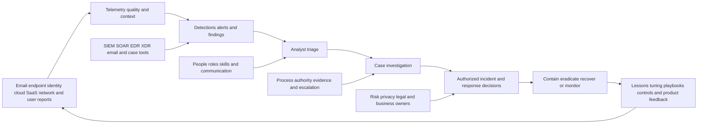
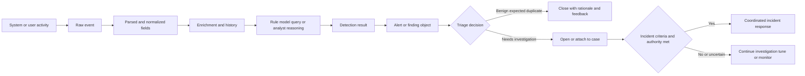
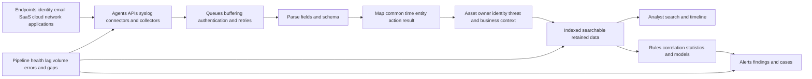
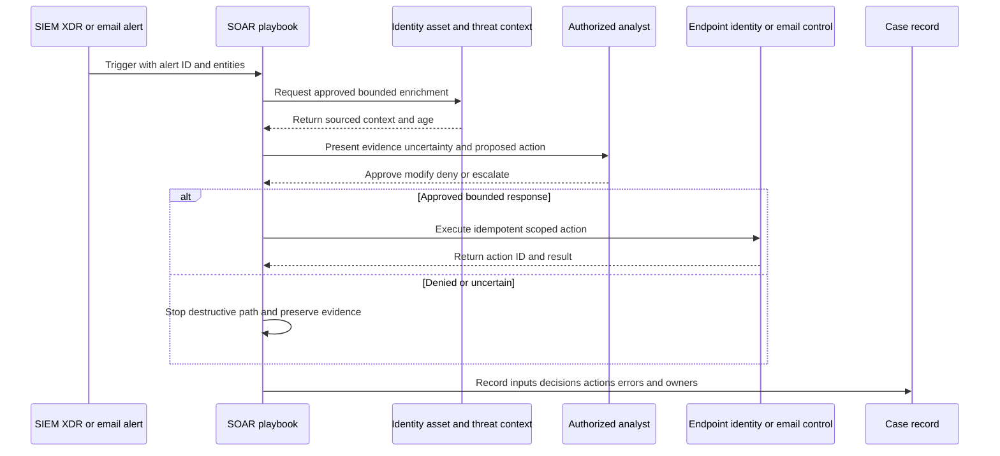
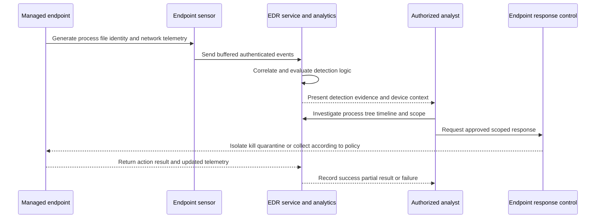
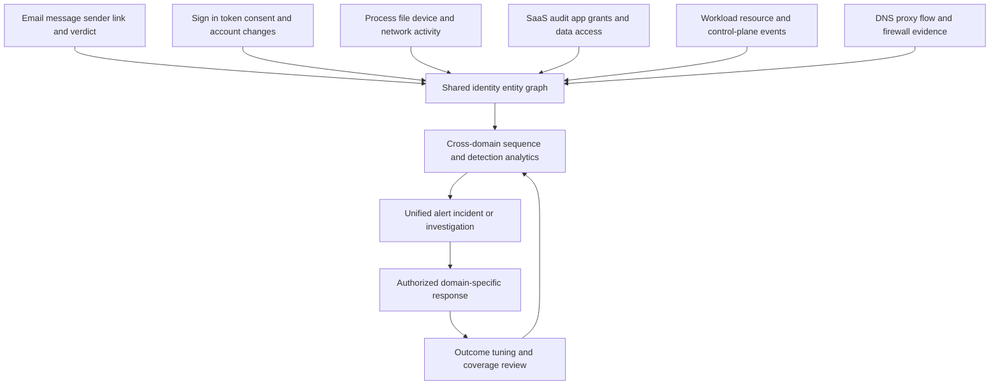
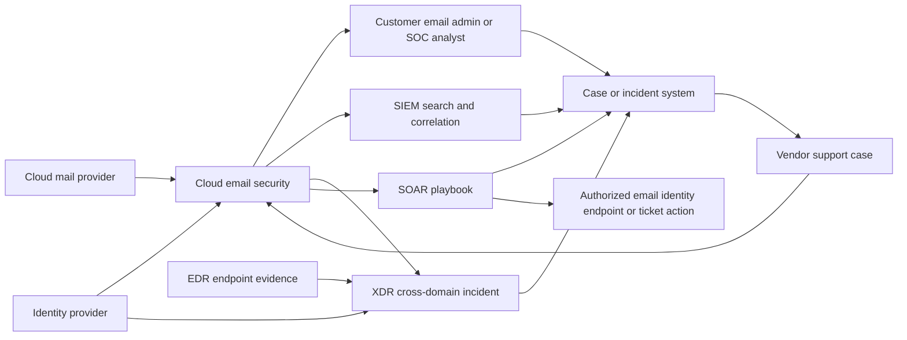
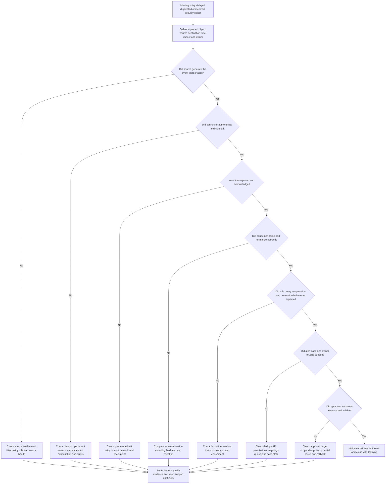
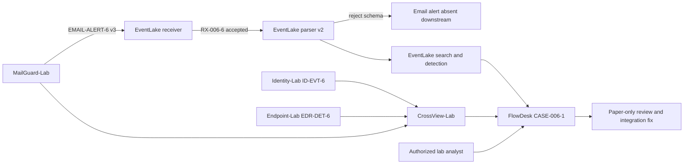

# Part 006 - SOC SIEM SOAR XDR and EDR Basics

> **Purpose:** Build a beginner-first map of the people, process, evidence, and technologies used to monitor and respond to security activity, then place technical support and email security accurately within that map.
>
> **Evidence rule:** Every architecture, log, alert, identity, endpoint, message, case, and response action in this Part is synthetic. Arti's Microsoft enterprise support and escalation experience transfers to evidence-based troubleshooting and communication; it does not establish direct SOC, SIEM, SOAR, XDR, EDR, Abnormal AI, email-security, Splunk, CrowdStrike, or Cortex SOAR production operation.
>
> **Currency and official-source access date:** August 24, 2026.

## Section Goal

By the end of this Part, Arti should be able to describe a **Security Operations Center (SOC)** as a capability made from people, repeatable processes, decision authority, data, and technology. She should understand why common Tier 1, Tier 2, and Tier 3 labels are useful teaching shorthand but are not universal organization designs or measures of individual skill.

She should be able to distinguish a raw **event** from an **alert**, **detection**, **finding**, **incident**, and **case**; explain why the same object may receive different names across products; and ask about the object's source, schema, identifier, timestamp, confidence, status, owner, and decision rather than relying on its label.

She should be able to explain a **Security Information and Event Management (SIEM)** system as a platform for collecting, normalizing, searching, correlating, detecting, and retaining security-relevant events; a **Security Orchestration, Automation, and Response (SOAR)** platform as a system for coordinating tools, people, playbooks, approvals, and response actions; **Endpoint Detection and Response (EDR)** as endpoint-focused telemetry, detection, investigation, and response; and **Extended Detection and Response (XDR)** as coordinated detection and investigation across more than one security domain. She should place cloud email security as a signal, control, investigation, and response participant rather than incorrectly calling it a SIEM, endpoint agent, or universal incident authority.

The practical outcome is a **Beacon Bridge SOC Toolchain Lab**. It produces a synthetic toolchain map, event dictionary, data-flow trace, correlation worksheet, integration health matrix, support-boundary RACI, harmless playbook, case timeline, failure-injection cards, privacy manifest, and validation rubric. The lab is local and paper based; it performs no real detection, containment, scanning, phishing, or endpoint action.

## JD Mapping

The mapping uses supplied job-description signals from the confirmed master. It does not assert an Abnormal internal SOC, customer workflow, product data schema, integration, or escalation path.

| Supplied JD signal | Capability developed in this Part | Practical proof |
|---|---|---|
| Enterprise L1 Technical Support Engineer | Locates a symptom at the producer, transport, platform, rule, case, response, or ownership boundary | Toolchain troubleshooting matrix |
| Behavioral false-positive cases | Separates raw evidence, detection logic, confidence, analyst decision, and customer outcome | Event-to-alert-to-case trace |
| Threat investigations | Correlates email, identity, endpoint, SaaS, and network evidence without declaring an incident prematurely | Synthetic multi-domain timeline |
| Configuration tickets | Checks connectors, source enablement, parsing, normalization, routing, rule state, permissions, and retention | Integration health worksheet |
| API questions | Uses event schemas, authentication, rate limits, retries, acknowledgments, IDs, and errors to locate failures | Data-flow and handoff map |
| Cloud Email Security | Places email signals and remediation in the broader SOC ecosystem | Email-security placement diagram |
| SaaS Security | Includes identity, audit, configuration, and application events as SOC evidence domains | Cross-domain source matrix |
| AI Security Agents | Frames automation and agents as bounded actors with tools, approvals, evidence, and stop conditions | SOAR/agent safety comparison |
| Splunk | Explains the SIEM category and synthetic searches without claiming direct use | Learned-architecture SIEM map |
| CrowdStrike | Explains EDR/XDR category roles without claiming direct operation | Learned-architecture endpoint flow |
| Cortex SOAR | Explains orchestration and playbooks without claiming direct operation | Harmless paper playbook |
| Engineering/Product collaboration | Creates provider-answerable escalation packets with source IDs, time, schema, expected/actual, and impact | Integration escalation card |
| Customer trust and recommendations | Communicates what is missing, what remains protected, who owns the action, and the next checkpoint | Audience-specific case update |

## Candidate Honesty Note

| Evidence label | Honest statement | Boundary to preserve |
|---|---|---|
| **Production-transfer example** | Arti has CV-supported Microsoft enterprise support, CRITSIT coordination, complex investigation, customer/partner updates, Engineering/Product escalation, fix validation, KB/training, mentoring, and support analytics | These methods do not become SOC analyst, incident responder, SIEM engineer, EDR operator, or email-security production experience |
| **Working knowledge or upskilling** | Networking, diagnostic tools, REST/JSON, SQL, Power BI, Python, identity, and cloud concepts help Arti understand event paths and correlation | Do not imply production-scale security telemetry engineering or named-tool administration |
| **Local/public lab** | Beacon Bridge demonstrates an event model, paper correlation, integration diagnosis, and safe playbook design using invented records | It is not a live SOC, production detection, malware investigation, endpoint isolation, phishing simulation, or tool certification |
| **Learned architecture** | Official NIST, CISA, Microsoft, Splunk, CrowdStrike, and Palo Alto Networks source families inform category definitions | Public architecture knowledge is not direct operation of Splunk, CrowdStrike, or Cortex SOAR |
| **No direct experience** | The master explicitly records no direct Abnormal AI, direct email-security operations, Splunk, CrowdStrike, or Cortex SOAR production experience | State the gap before describing the transferable method or lab |
| **Template only** | Source maps, playbooks, case schemas, and escalation cards are reusable structures | A template is not evidence that a real alert or incident existed |

An interview-safe sentence is: “I have not worked directly in a SOC or operated Splunk, CrowdStrike, Cortex SOAR, Abnormal AI, or email-security tooling in production. My closest production evidence is complex Microsoft enterprise support and escalation. I can show a synthetic event-to-case lab that demonstrates how I would reason across those categories without claiming tool experience.”

## Beginner Term Primer

| Term | Plain meaning | Why it matters | Memory hook |
|---|---|---|---|
| **Security Operations Center (SOC)** | A centralized or distributed capability that monitors security-relevant activity, investigates signals, coordinates response, and improves defenses | Support often works with SOC analysts but does not automatically own their incident decisions | People and process operating from evidence |
| **Telemetry** | Measurements or records generated by systems about activity and state | Every detection depends on what was observed, transported, and retained | No observation, no confident reconstruction |
| **Log** | A sequence or collection of recorded events | Logs are common telemetry, but not every log is security-relevant or complete | A recorded view, not the whole truth |
| **Event** | A record that something happened at a time in a source | A sign-in, process start, message delivery, policy change, or API response can be an event | Something happened |
| **Signal** | An observation or derived value that may carry security meaning | Several weak signals can combine into a stronger hypothesis | Evidence with possible meaning |
| **Detection** | Logic or analysis that identifies activity matching a condition or model | It converts telemetry into a candidate security concern | Logic notices a pattern |
| **Alert** | A notification or object asking for attention because detection or policy criteria were met | Alerts need triage; they are not proof of an incident | Attention requested, not guilt proven |
| **Finding** | A documented condition or result identified by a tool or analyst | It may describe posture, behavior, vulnerability, or investigation outcome | A stated condition with evidence |
| **Incident** | An occurrence that actually or potentially jeopardizes security objectives and requires coordinated handling under the organization's process | Declaring one has authority, communication, and process consequences | Confirmed or credible harm needing response |
| **Case** | A work container that joins evidence, hypotheses, actions, owners, decisions, and communication | A case can contain several alerts or no product alert at all | The investigation's working record |
| **Triage** | Rapidly assessing validity, impact, urgency, scope, and next action | It decides what deserves deeper work without pretending certainty | Sort, scope, and route |
| **Correlation** | Connecting events through shared identifiers, entities, time, or relationships | It turns isolated observations into a sequence or context | Join evidence, do not merely stack it |
| **Enrichment** | Adding context such as asset owner, identity role, reputation, or prior activity | Context can improve decisions but can also be stale or wrong | Add meaning with source and age |
| **SIEM** | Security Information and Event Management: a platform for ingesting, normalizing, searching, correlating, detecting, and retaining security data | It provides a broad evidence and analytics layer | Collect, normalize, search, correlate |
| **SOAR** | Security Orchestration, Automation, and Response: coordinated workflows connecting tools, data, people, approvals, and actions | It reduces repetitive work but can amplify errors | Orchestrate safely; automate with gates |
| **Playbook** | A defined sequence of investigation or response steps, conditions, owners, inputs, outputs, and exceptions | Repetition becomes consistent and auditable | Steps plus decisions plus owners |
| **Endpoint** | A user or server device where code runs, such as a laptop, desktop, or workload host | Compromise often leaves process, file, network, identity, and response evidence there | Where workloads execute |
| **EDR** | Endpoint Detection and Response: endpoint telemetry, detection, investigation, hunting, and authorized response capabilities | It can show what a process did and support containment on managed endpoints | Deep endpoint visibility and response |
| **XDR** | Extended Detection and Response: coordinated detection and investigation across domains such as endpoint, identity, email, cloud, network, and SaaS | It aims to connect evidence that siloed tools see separately | Cross-domain detection and investigation |
| **Indicator of compromise (IOC)** | An observable artifact associated with possible malicious activity, such as a hash, domain, IP, or file path | Indicators are clues with context and lifetime, not standalone proof | A clue, not a verdict |
| **Tactic, technique, and procedure (TTP)** | The attacker's goal, method, and specific implementation | Behavior can remain useful when one indicator changes | Why, how, and exact execution |
| **Mean time to detect/respond** | Time-based operational measures from a defined starting point to detection or response | Useful only when definitions and incentives are clear | Define the clock before reading the number |
| **False positive** | Benign or expected activity incorrectly treated as concerning | It creates analyst and customer cost | Alarm without the harmful condition |
| **False negative** | Harmful activity not detected or not treated as concerning | It creates exposure and delayed response | Harm without the alarm |
| **Runbook** | Executable operational guidance for a known task or condition | A runbook can support a playbook step or support workflow | Repeatable instructions with limits |

## The SOC as People, Process, Data, and Technology

A SOC may be one physical room, a distributed internal team, a managed service, a follow-the-sun operation, or a capability shared across security groups. The defining feature is not the wall of screens. It is the ability to turn security-relevant observations into authorized decisions and learning.

| Dimension | Core questions | Examples | Failure when missing |
|---|---|---|---|
| People | Who monitors, investigates, decides, communicates, engineers, and improves? | Analysts, incident responders, detection engineers, threat hunters, platform engineers, managers, privacy/legal partners | Alerts have no owner or authority |
| Process | How are signals triaged, escalated, investigated, contained, recovered, and reviewed? | Severity rules, case workflow, evidence handling, communication, post-incident review | Tool activity is inconsistent and unauditable |
| Data | What sources, schemas, identifiers, clocks, quality, coverage, retention, and privacy constraints exist? | Endpoint, email, identity, SaaS, cloud, network, vulnerability, threat intelligence | Correlation produces blind spots or false conclusions |
| Technology | Which systems collect, analyze, orchestrate, enforce, visualize, and store? | SIEM, SOAR, EDR, XDR, email security, identity, case management | Analysts cannot see or act at needed boundaries |
| Governance | Who owns risk, incident declaration, containment, legal/privacy decisions, and service commitments? | Incident commander, system owner, SOC manager, privacy/legal, customer owner | Support or automation acts beyond authority |
| Improvement | How do cases change detections, playbooks, architecture, training, and product? | Tuning, content updates, retrospectives, gap tracking, metrics | The same failure repeats without learning |

**Analogy:** A SOC resembles an air-traffic operation: many sensors provide partial observations; specialists interpret them; procedures and authority control actions; records support reconstruction and improvement. The analogy stops because cybersecurity includes adaptive adversaries, privacy-sensitive content, business systems, and actions that may be distributed across organizations.

## Plain-English deep-dive: SOC Tiers Are a Routing Pattern, Not a Universal Ladder

Many introductory descriptions use Tier 1 for alert triage, Tier 2 for investigation, and Tier 3 for advanced hunting or expertise. Some organizations add Tier 4 for engineering or management. Others use no tiers, organize by threat domain, swarm cases, rely on managed detection and response providers, or let one analyst own a case end to end.

| Common teaching label | Typical focus | Useful interpretation | Dangerous assumption |
|---|---|---|---|
| Tier 1 | Initial monitoring, validation, enrichment, prioritization, known playbooks | Fast, consistent first security assessment | Entry-level means unskilled or only closes alerts |
| Tier 2 | Deeper scoping, timeline, cross-source investigation, response recommendation | Handles ambiguity and wider evidence | Every escalation must pass through a rigid queue |
| Tier 3 | Advanced investigation, hunting, malware or detection expertise | Provides specialized depth and improves detection | One person is expert in every domain |
| Detection/platform engineering | Data pipelines, schemas, rules, content, performance, health | Makes the SOC observable and reliable | Analysts alone own ingestion defects |
| Incident commander/lead | Coordinates objectives, roles, decisions, cadence, and risk | Owns incident process and shared picture | The deepest technical analyst automatically commands |
| Support engineer | Explains product behavior, diagnoses integration/configuration, preserves customer continuity | Helps the customer use and troubleshoot the product | Support owns customer containment or incident declaration |

**Analogy:** Tiers are like lanes at an airport checkpoint: they route work by need and authority, but the airport can redesign lanes, combine roles, or call specialists directly. The analogy stops because SOC work is investigative and may require ongoing ownership rather than one-direction processing.

In an interview, say “A common model is...” and then ask how the employer actually organizes triage, investigations, detection engineering, incident command, and customer support. Avoid claiming that L1 support equals SOC Tier 1. Both may perform first assessment, but they have different customers, authority, systems, and goals.

## Events, Signals, Detections, Alerts, Findings, Incidents, and Cases

Names vary by vendor. A SIEM may call a correlation result a notable event; an EDR may call it a detection; a cloud posture system may call a configuration weakness a finding; a case platform may call the whole investigation an incident. Focus on lifecycle and semantics.

| Object | Produced by | Core content | Decision state | Example |
|---|---|---|---|---|
| Event | Source system or collector | Actor, action, target, time, result, source metadata | No security conclusion required | User `A` signed in from device `D` |
| Signal | Source or analytics | Observation with potential relevance | Meaning may be weak or contextual | New sender-to-recipient relationship |
| Detection | Rule, model, query, or analyst | Condition matched with evidence and logic | Candidate concern | Impossible or unusual sequence matched |
| Alert | Product/workflow notification | Detection plus priority, entities, status, context | Requests triage | “Suspicious inbox rule created” |
| Finding | Tool or analyst conclusion | Condition, evidence, scope, recommendation | May be posture or investigation result | Overprivileged OAuth application |
| Incident | Authorized process or system | Credible/confirmed security event requiring coordinated handling | Response lifecycle begins or is underway | Compromised account with unauthorized access |
| Case | Case system or team | Alerts, events, hypotheses, actions, owners, communication, decisions | Work container, not necessarily confirmed incident | Investigation of two alerts and a user report |

An event is not “lower quality” than an alert; it serves a different purpose. An alert does not become true because a high severity label exists. A case can begin from a customer report even when no alert fired. An incident can contain many alerts, duplicate alerts, and unrelated noise.

### Object identity and lifecycle fields

| Field | Question it answers | Common failure |
|---|---|---|
| Source/object ID | Which exact record are we discussing? | IDs change or are dropped between systems |
| Event time and ingest time | When did activity occur, and when was it seen? | Delay mistaken for activity order |
| Entity | Which identity, device, mailbox, domain, app, or resource is involved? | Normalization merges different namespaces |
| Rule/model version | Which logic produced the result? | Behavior changes after update with no version record |
| Severity/priority | How should work be routed under current policy? | Vendor score treated as business impact |
| Status and owner | Who acts and what state is current? | “Open” with no next action |
| Evidence and rationale | Why does the object exist? | Opaque alert with no testable claim |
| Disposition | What did triage conclude and why? | Closure reason too vague to improve detection |
| Parent/child links | Which case or incident contains it? | Duplicate investigation and conflicting response |

## SIEM: Aggregation, Search, Correlation, and Detection

SIEM combines **Security Information Management**, historically focused on collecting and retaining logs, with **Security Event Management**, focused on timely analysis and alerting. Modern products vary widely, but a useful vendor-neutral pipeline includes collection, transport, parsing, normalization, storage, enrichment, search, correlation, detection, alerting, case integration, and health monitoring.

### SIEM functions and limits

| Function | Value | Evidence of health | Limit |
|---|---|---|---|
| Collection | Brings distributed events into an accessible platform | Last event time, source count, authentication, connector status | Enabled connector may still omit sources |
| Parsing | Turns raw text/JSON into fields | Parse success, unknown-field count, sample comparison | Incorrect parser can silently mislabel values |
| Normalization | Gives different sources common field meanings | Schema mapping, entity namespace, unit/time conversion | Normalization can erase source-specific detail |
| Storage/indexing | Makes data retrievable within retention and performance needs | Ingest time, index/partition, retention, query result | Searchability is not completeness |
| Search | Lets analysts test hypotheses and build timelines | Query, time range, filters, result count | A bad query can “prove” absence falsely |
| Correlation | Connects related activity across IDs, entities, and time | Join keys, window, source coverage, duplicates | Same name may refer to different entity |
| Detection | Raises candidate concerns | Rule version, inputs, threshold, alert ID, test event | Alert does not prove incident |
| Reporting | Communicates trends and operations | Defined metrics, source coverage, caveats | Dashboards can hide missing data |
| Retention | Supports historical investigation and obligation | Policy, oldest event, archive retrieval test | Retention may differ by source/tier |

### Correlation example

Suppose three records appear:

1. Email system: message `M-44` delivered a link to `user-a` at 10:00 UTC.
2. Identity system: `user-a` signed in from a new device at 10:07 UTC.
3. Endpoint system: device `D-9` launched a browser process to the same domain at 10:08 UTC.

Correlation is not simply placing them in one table. Verify identity namespace, clocks, message recipient mapping, device assignment at that time, domain canonicalization, and whether the browser event represents user navigation. The sequence supports an investigation hypothesis; it does not prove credential theft or malware.

## Plain-English deep-dive: A SIEM Is a Library With Translators and Alarms

Think of source logs as books arriving in many languages and layouts. Collectors bring them to a library, parsers read their structure, normalization creates a catalog, indexing makes them searchable, correlation links related passages, and detection logic rings an alarm when a pattern appears.

The analogy stops because events arrive continuously, may be delayed or duplicated, rules can act automatically, and security data can be privacy-sensitive. The library cannot catalog a book that never arrived, and a catalog error can make a present book look absent.

When a SIEM alert appears wrong, do not begin by changing the rule. Trace:

1. Did the source produce the event?
2. Did collection authenticate and receive it?
3. Did transport drop, delay, or duplicate it?
4. Did parsing extract the right fields?
5. Did normalization preserve identity, time, action, and result correctly?
6. Was enrichment current and correctly joined?
7. Which rule version, time window, threshold, and suppression applied?
8. Did alert routing or case creation succeed?

## SOAR: Orchestration, Automation, Playbooks, and Approval

**Orchestration** coordinates systems and people. **Automation** performs steps without manual execution. **Response** includes authorized actions that reduce risk or restore state. A SOAR platform may receive an alert, retrieve context, ask an analyst for approval, update a case, call an endpoint or identity API, send communication, and record results.

### Playbook design fields

| Field | Required question | Example |
|---|---|---|
| Trigger | Which object/version starts the playbook? | High-confidence synthetic token-exposure finding |
| Preconditions | What must be true before action? | Identity and asset mapping verified; case not duplicate |
| Inputs | Which minimum data is needed? | Alert ID, entity IDs, UTC time, action scope |
| Enrichment | Which sources add context, and how fresh are they? | Asset owner and last sign-in with source timestamps |
| Decision | Which branch and threshold apply? | Human approval required for containment |
| Action | What exact resource and operation are permitted? | Add a case tag or create a ticket, not isolate a live endpoint in this lab |
| Idempotency | What happens if the same step runs twice? | Existing case is updated, not duplicated |
| Error path | How are timeout, rate limit, permission, and partial success handled? | Stop, record, retry safely, or assign manual owner |
| Audit | Which input, decision, approver, action ID, and result are recorded? | Full playbook run linked to case |
| Exit | What marks success, safe stop, rollback, or escalation? | Case created and analyst owns next decision |

Automation should begin with low-risk, reversible, observable actions: enrichment, deduplication, case creation, formatting, or notification. Destructive actions such as deleting messages, isolating endpoints, revoking accounts, or blocking domains need clear authority, scope, confidence, failure handling, rollback where possible, and human approval according to policy.

## Plain-English deep-dive: Automation Multiplies Both Quality and Error

A playbook is like an assembly line. When inputs and steps are correct, it produces consistent results quickly. If a label is wrong or a machine is misaligned, the same error can affect every item at speed. The analogy stops because security workflows include uncertainty, adaptive attackers, human judgment, and actions across independently owned systems.

Automation failure categories include wrong trigger, stale enrichment, excessive permissions, duplicate execution, partial response, hidden timeout, unsafe retry, missing approval, target mismatch, and unrecorded manual override. Measure not only speed but correctness, safety, rollback, customer impact, and analyst trust.

### SOAR versus an AI security agent

| Dimension | Traditional SOAR playbook | AI-enabled agent concept | Shared safety requirement |
|---|---|---|---|
| Control flow | Explicit branches and steps | May plan or select actions dynamically within bounds | Named goal, allowed tools, policy, stop conditions |
| Inputs | Structured alert and fields | Structured plus possibly natural language/untrusted content | Treat external content as untrusted data |
| Predictability | Higher for fixed inputs | May vary with model/output | Test, evaluate, constrain, and monitor |
| Approval | Defined at steps | Needed for high-impact tools/decisions | Authorized human decision for consequential action |
| Failure | Script error, API error, branch gap | Hallucination, prompt injection, tool misuse plus ordinary errors | Fail closed, preserve evidence, and expose audit trail |
| Claim boundary | Product-specific implementation varies | Product-specific implementation varies even more | Do not infer Abnormal architecture from category concepts |

## EDR: Endpoint Telemetry, Detection, Investigation, and Response

EDR runs through an endpoint sensor or operating-system integration, a cloud or management service, analytics, an analyst console, and response controls. Typical endpoint telemetry can include process creation, parent/child relationship, file activity, registry or configuration changes, network connections, logged-on identity, module loading, command lines, and security product state. Exact fields and retention vary.

### Endpoint concepts

| Concept | Plain meaning | Useful evidence | Limit |
|---|---|---|---|
| Sensor/agent health | Whether endpoint telemetry and control component is operating | Version, last check-in, policy, service state, queue | “Healthy” may not mean every event source works |
| Process tree | Parent and child relationships among running programs | Process IDs, paths, hashes, signer, user, command line, UTC | Parentage alone does not prove intent |
| File evidence | Creation, modification, hash, reputation, signature, location | Hash, path, signer, first/last seen, action | Same hash can be benign in context; file name is weak |
| Network evidence | Endpoint connections and DNS relationships | Process, destination, port, time, result | Connection does not prove content or success |
| Detection | Endpoint analytics identifies candidate behavior | Rule/model, evidence, confidence, scope | False positives and missing telemetry remain possible |
| Isolation | Restricts endpoint network communication under policy | Requester, device, action ID, result, exceptions | Can disrupt business and remote recovery |
| Quarantine | Restricts or moves a file according to product behavior | File ID/hash, action, result, restore path | Product semantics vary; not guaranteed eradication |
| Live response | Authorized remote investigation/action capability | Session, operator, commands/actions, audit | High privilege requires strict authorization |

EDR is not antivirus with a new name, although products can include preventive malware controls. Antivirus historically emphasizes identifying and blocking known or suspicious malicious files. EDR emphasizes continuous endpoint telemetry, behavioral detection, investigation, hunting, and response. Product boundaries overlap, so use official documentation for a named platform.

## XDR: Cross-Domain Detection and Investigation

XDR attempts to connect domains such as endpoint, identity, email, cloud workloads, SaaS applications, and network. The “X” means extended, but vendors differ in what they include, which data is native, how third-party data participates, and what response actions are available.

## Plain-English deep-dive: Correlation Builds a Case, Not a Conviction

Cross-domain correlation is valuable because an email event, identity event, and endpoint event can describe different parts of one sequence. The danger is assuming that shared time, user name, domain, or Internet Protocol address proves one cause. A corporate proxy can make many users share an address. A browser can prefetch a link without a deliberate click. A display name may not identify the same account across two tenants. A sign-in after a message may be normal work rather than credential theft.

**Analogy:** Correlation is like placing several witness statements on one timeline. Agreement on time and place strengthens a lead, but it does not automatically establish who acted, why, or whether every statement describes the same event. The analogy stops because machine telemetry has schemas, clocks, identifiers, collection gaps, and automated transformations that human testimony does not.

Before merging evidence, verify the join:

| Join candidate | Stronger evidence | Weak shortcut |
|---|---|---|
| User identity | Stable tenant-aware subject/account identifier | Display name or local alias only |
| Endpoint | Device identifier and assignment at event time | Hostname copied into a note |
| Session | Session/token identifier and resource audit relationship | Same user within a broad time window |
| Domain/URL | Canonical host/path and process/message relationship | Shared registered domain only |
| Time | Source clock quality, UTC normalization, event and ingest time | Screen-displayed local time |
| Case relationship | Parent/child IDs and documented analytic rationale | Alerts happen to be open together |

The analyst should preserve alternative explanations and state what the correlation does and does not establish. High-confidence response requires evidence appropriate to the action and the authorized owner. XDR can make the evidence easier to assemble; it does not remove the need for human judgment, privacy controls, or validation.

### SIEM, SOAR, EDR, and XDR comparison

| Category | Primary center of gravity | Main inputs | Main output/actions | Typical strength | Typical limitation |
|---|---|---|---|---|---|
| SIEM | Broad log/event aggregation and analytics | Many security and business sources | Search, correlation, detections, alerts, reporting | Flexible cross-source investigation and retention | Data engineering, cost, schema, and coverage complexity |
| SOAR | Workflow coordination and automation | Alerts, cases, APIs, context | Playbooks, approvals, actions, case updates | Consistency and reduced repetitive effort | Automation can amplify bad logic or permissions |
| EDR | Managed endpoint behavior | Endpoint process, file, registry/config, identity, network | Endpoint detections, investigation, hunting, response | Deep device execution context | No visibility on unmanaged devices or non-endpoint-only activity |
| XDR | Cross-domain detection and incident context | Endpoint plus identity/email/cloud/network/SaaS according to product | Unified incidents, correlated evidence, domain responses | Reduces domain silos and joins entity behavior | Product scope and “openness” vary; not a replacement for every SIEM use |
| Email security | Email, sender, recipient, identity, relationship, message, link/attachment, policy | Mail and related identity/context | Message verdict, investigation, quarantine/remediation according to capability | Deep email and communication context | Does not by itself see every endpoint, identity, network, or business event |

These categories can coexist. An email security product may send alerts to a SIEM, create cases through SOAR, enrich an XDR incident, and request endpoint context from an EDR integration. Do not assume one replaces another based on marketing category.

## Email Security Placement in the SOC Toolchain

Email security can observe message delivery and behavior, produce detections, expose search and investigation evidence, and perform supported message actions. The customer's mail provider, identity provider, endpoint tool, SIEM, SOAR, XDR, ticketing system, and SOC retain separate responsibilities.

### Email support versus SOC response

| Question/action | Email/security product support | Customer SOC/admin | Engineering/Product |
|---|---|---|---|
| Why did a product object show this status? | Explain supported fields, configuration, evidence, and known behavior | Supply context and decide operational significance | Inspect internals or intended behavior when escalated |
| Is the message malicious? | Provide product evidence and review path without inventing internals | Correlate customer evidence and make authorized verdict/response | Improve detection/product behavior where appropriate |
| Should an account be disabled? | Explain relevant evidence and supported integrations | Authorized identity/SOC owner decides containment | Product may support action mechanics, not customer risk acceptance |
| Did an alert reach the SIEM? | Verify producer event and documented integration output | Operate customer connector/SIEM and query | Investigate provider-side emission defect if evidence supports |
| Should endpoint be isolated? | Not normally email-support authority | Authorized incident responder decides through EDR process | EDR vendor/customer endpoint owner handles product action |
| Is an integration defect present? | Reproduce, isolate boundary, preserve IDs, communicate | Provide customer-side logs/configuration | Engineering diagnoses provider internals; Product clarifies expected behavior |

## Data Flow, Schemas, and Integration Health

A security integration is a chain of contracts. The producer must generate an object; the connector must authenticate; transport must deliver; the consumer must parse the schema; normalization must preserve meaning; rules must reference the right fields; routing must create the right alert or case; and response actions need separate authority.

| Stage | Expected evidence | Common failure | Customer-visible symptom |
|---|---|---|---|
| Source generation | Source event ID, event time, type, version | Event disabled, filtered, sampled, or never generated | Missing downstream alert |
| Authentication/authorization | Client ID, scope, status, audit decision | Expired secret, revoked grant, missing role, wrong tenant | `401`, `403`, or silent connector failure |
| Collection | Poll/checkpoint or subscription state, last success | Bad cursor, expired subscription, source limit | Gap begins at a specific time |
| Transport | Delivery ID, queue, retry, acknowledgment | Timeout, rate limit, network, duplicate, out-of-order | Delay, burst, or duplicates |
| Parsing | Parse status and raw/sanitized sample | Format change, encoding, malformed event | Unparsed records or dropped fields |
| Normalization | Source-to-common field map | Wrong units, time zone, entity namespace, result mapping | Bad correlation or rule behavior |
| Enrichment | Source, age, join key, confidence | Stale owner, wrong asset, missing identity | Wrong priority or analyst context |
| Detection | Rule/version, inputs, window, threshold, suppression | Field rename, disabled rule, noisy condition | Missing or excessive alerts |
| Alert/case routing | Destination, object ID, status, owner | API permission, mapping, deduplication, queue | Alert exists but no case/owner |
| Response | Action ID, approver, target, result | Excess scope, partial success, timeout, unsafe retry | Containment absent or applied incorrectly |

### Worked example 1: Email alert missing from SIEM

**Input:** Email product shows synthetic alert `EA-6`; SIEM search shows no corresponding record.

**Reasoning:** Do not immediately blame the SIEM or producer. Check whether the alert type is configured for export, capture producer event ID and export time, verify connector authentication and checkpoint, inspect delivery result, query the correct index/time using ingest time as well as event time, and validate parser/schema mapping.

**Observation:** Producer records delivery `DEL-6` with `202`; receiver sees request `RX-6` but parser rejects `alert_version=3`.

**Result:** The failure is at consumer parsing, not source generation or transport. Integration owner updates supported schema handling; L1 keeps the customer informed and validates a benign replay path if authorized.

**Caveat:** `202` alone would not prove receiver logging or downstream parse.

### Worked example 2: Duplicate endpoint alerts

**Input:** Two endpoint alerts appear for one process.

**Reasoning:** Possible causes include two distinct detections, duplicate ingestion, retry without idempotency, parent/child activity, or one alert copied into XDR and SIEM. Compare source alert IDs, rule IDs, process identifiers, device, event time, ingest time, and parent case links.

**Observation:** The EDR source has one detection ID; the connector retried after a timeout and the case API created two objects because no idempotency key was used.

**Result:** Preserve one canonical alert, link/close duplicate according to process, fix deduplication, and verify retries do not duplicate future cases.

**Caveat:** Do not suppress all similar alerts until logic confirms they are duplicates.

### Worked example 3: SOAR containment partially succeeds

**Input:** A synthetic playbook adds a case tag, attempts account disable, and sends notification. The tag succeeds, account API times out, and notification says containment completed.

**Reasoning:** The playbook has a transaction-state and communication defect. It must record each action separately and must not represent partial success as full containment. Retrying disable requires status verification and idempotency knowledge.

**Result:** Mark containment unknown, assign an authorized human owner, query account state, retry only under safe policy, correct notification, and improve the playbook branch.

**Caveat:** The lab never disables a real identity.

### Worked example 4: EDR endpoint appears silent

**Input:** A managed device has no telemetry for twenty minutes.

**Reasoning:** Hypotheses include device offline, sensor stopped, network/proxy block, local queue, policy change, service ingestion delay, clock issue, or search filter. Check device reachability only within authorized support boundaries; compare sensor last check-in, version, policy, queue/health, service status, and a control endpoint.

**Result:** If sensor events exist locally but not in service, move to transport/ingest. If service received them but query misses, inspect time and filters. If endpoint is compromised or high-risk, invoke the customer's EDR/security process rather than improvising commands.

### Worked example 5: Cross-domain correlation overstates certainty

**Input:** Email link delivery, new sign-in, and browser connection occur within ten minutes.

**Reasoning:** Verify user-device mapping, clocks, destination canonicalization, and whether the sign-in and browser action share a session or merely a name. Consider legitimate travel, test device, corporate proxy, or unrelated browsing. Seek resource action and identity outcome evidence.

**Result:** Open a case with a ranked hypothesis, not a confirmed compromise. The customer SOC owns incident declaration and containment.

## Support Boundaries and Escalation

Support diagnoses product and integration behavior, preserves continuity, and supplies evidence. It does not automatically tune the customer's SIEM, execute endpoint response, declare incidents, accept risk, or command the customer's SOC.

| Boundary | L1 can own | L1 should route/escalate |
|---|---|---|
| Product configuration | Documented settings, expected/actual, safe comparisons, known guidance | Undocumented behavior, internal telemetry, defect, policy ambiguity |
| Producer output | Verify source object/export ID and supported contract | Missing provider-side emission or schema defect |
| Customer SIEM | Explain exported fields and integration requirements | Customer query, parser, retention, index, or content engineering beyond support scope |
| SOAR | Explain supported API/action result and safe error evidence | Customer playbook design, containment authority, credentials, risky automation |
| EDR/XDR | Correlate supplied IDs and explain integration behavior | Endpoint live response, isolation, hunting, or vendor-specific operations |
| Incident decision | Explain product evidence, scope, and limitations | Customer SOC/incident commander declares and manages incident |
| Privacy/legal | Minimize and protect evidence | Privacy, Legal, Compliance, HR, or Security determines obligations |

### Escalation packet minimum

1. Customer-visible impact and security concern.
2. Source object ID, type, schema/rule version, event and ingest times.
3. Expected destination/object and actual result.
4. Connector/client identifier and non-secret authorization result.
5. Delivery, request, response, parse, normalized, alert, case, and action IDs where available.
6. Tests performed and how they changed hypotheses.
7. Affected and working control comparison.
8. Privacy/redaction statement and omitted sensitive fields.
9. Exact owner-answerable question.
10. Customer update time and workaround or risk boundary.

## Troubleshooting Decision Tree

### Symptom-to-hypothesis-to-test table

| Symptom | Competing hypotheses | Cheapest safe test | Observation | Next action |
|---|---|---|---|---|
| No SIEM event | Source absent, auth failure, cursor gap, parse drop, wrong query | Trace one synthetic source ID through each checkpoint | Receiver parse rejects version | Consumer/parser owner updates mapping; verify replay |
| Alert delayed | Source delay, batching, queue, rate limit, ingest lag, event-time query | Compare event, export, receive, ingest, alert times | Ingest delayed 20 minutes | Investigate transport/ingest; communicate coverage window |
| Duplicate cases | Duplicate source, retry, two rules, cross-platform copy | Compare source/detection IDs and case creation calls | Same source request repeated | Add idempotency/deduplication and reconcile cases |
| Alert severity wrong | Source mapping, enrichment, threshold, business context | Inspect rule/version and normalized severity fields | String mapping reverses medium/high | Correct mapping; retest synthetic sample |
| Endpoint silent | Offline device, sensor, proxy, queue, service ingest, query | Compare sensor check-in and one control endpoint | Sensor queues locally | Route network/service path; do not issue unsafe commands |
| SOAR action unknown | Timeout, partial success, stale state, unsafe retry | Query target state and action ID before retry | Account already disabled | Record success; prevent duplicate side effects |
| Email alert no case | Export, parser, routing, dedupe, case API permission | Trace source alert ID and destination API result | `403` at case API | Fix authorized case integration scope; no broad admin grant |
| XDR incident merges unrelated alerts | Entity collision, broad time window, shared proxy/domain | Validate entity namespace and relationship evidence | Two users share NAT IP only | Split/unlink under process; improve correlation logic |

## Common Failure Modes

| Failure mode | Why it is misleading or unsafe | Safer correction | Escalation trigger |
|---|---|---|---|
| Calling every alert an incident | Inflates certainty and triggers inappropriate response | Triage evidence, impact, scope, and criteria | Credible active harm or policy threshold |
| Rigid Tier mythology | Misrepresents real team design and undervalues L1 | Describe common model and verify organization | Ownership confusion blocks work |
| SIEM as “all logs” | Coverage, parsing, retention, and cost are selective | Maintain source/field/health inventory | Investigation depends on absent source |
| Search result equals truth | Query/time/filter/schema errors can hide events | Record query, time basis, source coverage, and control test | Evidence gap affects incident decision |
| Correlation by username alone | Names collide or change across tenants/domains | Use stable namespace-aware identity mapping | Wrong person's data or response is possible |
| Enrichment treated as current fact | Asset owner or reputation may be stale | Record source, age, and confidence | High-impact action depends on stale context |
| SOAR automates destructive action first | Bad inputs become fast broad harm | Start with enrichment/case actions and gated response | Containment requested without authority |
| Blind retry | Duplicate case or action side effects occur | Check status and idempotency before retry | Partial response state is unknown |
| EDR isolation as routine troubleshooting | Can disrupt operations and recovery | Authorized incident owner decides; validate target | Active threat or policy trigger |
| XDR replaces SIEM universally | Product scope, retention, sources, and use cases vary | Map actual requirements and coexistence | Coverage or responsibility gap emerges |
| Email security equals endpoint visibility | Message context does not show every device action | Correlate with endpoint/identity evidence | Endpoint compromise suspected |
| Vendor severity equals business severity | Product score lacks customer impact and context | Map to customer policy and affected assets | Severity disagreement requires owner |
| No alert equals no attack | Source, detection, or retention may be absent | Validate telemetry and detection coverage | Credible user report or other-domain evidence |
| Closing false positive without feedback | Repeated noise remains | Record rationale, rule/version, context, and tuning owner | Pattern affects many cases |
| Support becomes incident commander | Exceeds product-support authority | Maintain product case and feed the authorized response process | Customer asks Support to direct containment |
| Claiming named-tool experience from concepts | Violates candidate honesty | Label learned architecture and lab evidence | Interview follow-up asks exact operations |

## Beacon Bridge SOC Toolchain Lab

### Lab purpose

Build a vendor-neutral SOC data-flow and support-boundary map from synthetic records. The lab demonstrates category understanding, event correlation, integration diagnosis, safe automation design, and honest escalation. It does not require accounts or software installations and performs no action against a device, mailbox, identity, service, or third party.

### Honest artifact label

> **LOCAL/SYNTHETIC LAB - SOC toolchain reasoning only. No live SOC, Abnormal AI, email-security, Splunk, CrowdStrike, Cortex SOAR, SIEM, SOAR, EDR, XDR, incident-response, or production-tool operation is represented.**

### Prerequisites

1. A private local study folder.
2. Markdown/spreadsheet editor and Mermaid preview or paper drawing tool.
3. This Part's object definitions, pipeline stages, troubleshooting tree, and evidence rules.
4. Only the fictional records supplied below.
5. No product account, API key, endpoint agent, mailbox, SIEM, SOAR, EDR, XDR, email service, network scan, suspicious link, or external AI upload.
6. Two hours for build and a thirty-minute spoken walkthrough.

### Authorized scope and prohibited activity

| Area | Authorized | Prohibited |
|---|---|---|
| Data | Invented JSON-like events and reserved identities | Real logs, customer data, message content, credentials, endpoints, domains, or indicators |
| Analysis | Paper timeline, joins, field maps, status reasoning, playbook design | Malware analysis, phishing, scanning, exploitation, account/endpoint action |
| Automation | Describe harmless case creation and notification | Execute isolation, deletion, blocking, revocation, or live API calls |
| Vendor claims | Category-level learned architecture | Claims of direct Splunk, CrowdStrike, Cortex SOAR, Abnormal, or private product behavior |
| Sharing | Private sanitized learning artifact | Public upload of production-like evidence or secrets |

### Synthetic environment

Fictional organization `Beacon Bridge Lab` has:

- `MailGuard-Lab`, a fictional email signal producer;
- `Identity-Lab`, a fictional identity event source;
- `Endpoint-Lab`, a fictional endpoint event source;
- `EventLake-Lab`, a fictional SIEM-like collector/search/detection service;
- `FlowDesk-Lab`, a fictional SOAR/case orchestrator;
- `CrossView-Lab`, a fictional XDR-like correlation service;
- analyst `analyst-a@example.invalid`;
- endpoint `HOST-A`;
- message `MSG-006-1`;
- source email alert `EMAIL-ALERT-6`;
- endpoint detection `EDR-DET-6`;
- identity event `ID-EVT-6`;
- delivery `DEL-006-6` and receiver request `RX-006-6`;
- unified case `CASE-006-1`.

### Synthetic events

| Time UTC | Source | ID | Event |
|---|---|---|---|
| 10:00:00 | MailGuard-Lab | MSG-006-1 | Harmless synthetic message delivered to analyst-a with reserved link `https://example.invalid/notice` |
| 10:00:05 | MailGuard-Lab | EMAIL-ALERT-6 | Rule `MAIL-RULE-2` flags new-sender link; severity medium |
| 10:00:06 | MailGuard-Lab | DEL-006-6 | Export receives HTTP 202 from EventLake receiver |
| 10:00:06 | EventLake-Lab | RX-006-6 | Receiver accepts payload schema version 3 |
| 10:00:07 | EventLake-Lab | PARSE-006-6 | Parser supports version 2 and rejects version 3 |
| 10:07:00 | Identity-Lab | ID-EVT-6 | Synthetic sign-in from managed HOST-A succeeds; no risk signal supplied |
| 10:08:00 | Endpoint-Lab | EDR-DET-6 | Browser on HOST-A connects to `example.invalid`; benign lab browser activity |
| 10:09:00 | CrossView-Lab | XDR-CORR-6 | Correlation proposal joins user, host, and domain; confidence intentionally “needs analyst review” |
| 10:10:00 | FlowDesk-Lab | CASE-006-1 | Case creation receives only XDR object because email alert failed SIEM parsing |

The scenario is intentionally benign. The correct outcome is not “compromise.” It is an integration parsing defect plus an analyst-reviewed correlation whose security meaning is unconfirmed.

### Step 1: Create the toolchain context map

For every box, record category, owner, data received, data produced, trust boundary, identity, purpose, retention assumption, health evidence, and response authority. Mark every vendor name as fictional.

**Expected evidence:** The map separates source generation, SIEM-like ingestion, XDR-like correlation, SOAR/case coordination, and analyst decision.

### Step 2: Build the event dictionary

Create at least twenty fields across the synthetic objects. Include source ID, event ID, event time, ingest time, entity namespace, user, host, domain, message ID, rule ID/version, schema version, severity, confidence, status, delivery ID, request ID, parse status, parent case, and owner.

For each field record type, source of truth, sensitivity, normalization rule, null meaning, and join risk.

**Expected evidence:** `event_time` and `ingest_time` remain distinct; `severity` and `confidence` are not treated as the same value.

### Step 3: Trace `EMAIL-ALERT-6` end to end

Use rows for generated, exported, acknowledged, received, parsed, normalized, stored, searched, alerted, and attached to case. Mark exact success/failure and evidence ID at each stage.

**Expected observation:** The producer and transport work; parsing fails because version 3 reaches a version-2 parser. The email alert therefore does not appear in EventLake search or the case through that path.

### Step 4: Correlate without overclaiming

Create a timeline for message, sign-in, browser connection, and XDR proposal. List evidence for and against a harmful interpretation.

Evidence against immediate compromise includes: reserved harmless domain, managed host, successful normal sign-in, no supplied credential failure, no malicious content, and an explicit benign lab scenario. Evidence that justifies review includes the temporal/entity relationship only.

**Expected conclusion:** Correlation is technically plausible but security significance is unconfirmed and benign by supplied ground truth.

### Step 5: Compare object meanings

Classify every record as event, signal, detection, alert, finding, case, or proposed incident. Explain why `CASE-006-1` is not proof of an incident and why `EDR-DET-6` can be a product detection while the lab ground truth remains benign.

### Step 6: Design a harmless SOAR playbook

The playbook may only:

1. receive `XDR-CORR-6`;
2. retrieve the supplied synthetic context;
3. check for an existing case using an idempotency key;
4. create or update `CASE-006-1`;
5. add a label `needs-human-review`;
6. notify the fictional analyst;
7. stop and record the decision.

It must not isolate `HOST-A`, delete `MSG-006-1`, disable the user, block the domain, visit the link, or call any live service.

**Expected evidence:** Trigger, inputs, branch, idempotency, audit, error path, owner, and safe exit are explicit.

### Step 7: Inject six integration failures

Create paper cards for:

1. connector `401` due to expired fake credential metadata;
2. connector `403` due to missing `alerts.read` scope;
3. HTTP `429` rate limit with retry guidance required;
4. parser schema mismatch;
5. event-time clock offset of ten minutes;
6. duplicate case creation after timeout retry.

For each card record symptom, hypotheses, minimum safe evidence, expected observations, owner, customer update, rollback or correction, and validation.

### Step 8: Build the support-boundary RACI

Include customer SOC analyst, customer SIEM/platform engineer, customer identity owner, customer endpoint owner, fictional email vendor Support, fictional vendor Engineering, and integration owner. Cover source verification, connector repair, parser change, detection decision, incident declaration, endpoint containment, account action, customer update, and final validation.

**Expected evidence:** Support is responsible/accountable for product-case continuity, not customer incident command or endpoint action.

### Step 9: Write the escalation packet

Escalate the schema mismatch with expected/actual, `EMAIL-ALERT-6`, `DEL-006-6`, `RX-006-6`, `PARSE-006-6`, times, schema versions, customer impact, privacy statement, exact ask, and next update. Ask: “Confirm the supported schema contract and whether the producer, connector, or parser requires correction; provide validation criteria.”

### Step 10: Write two audience updates

**Technical update:** Explain that source alert generation and HTTP acceptance succeeded, receiver parsing rejected schema v3, and Engineering/integration owners are confirming the contract.

**SOC lead update:** Explain that one synthetic email alert is absent from the SIEM path, the XDR-like case still exists from other sources, no real threat or data loss is present, and a controlled correction/validation is underway.

Do not call the issue a breach, incident, Abnormal defect, Splunk failure, or production outage.

### Step 11: Create the privacy and retention manifest

Record every synthetic object, purpose, source, sensitivity, access, retained derivative, deletion of scratch copy, and the prohibition on real message content or credentials.

### Step 12: Validation rubric

| Dimension | 0 | 2 | 4 |
|---|---|---|---|
| Category accuracy | Tools confused | Main categories correct | SIEM/SOAR/EDR/XDR/email roles and overlaps precise |
| SOC model | Tools only | People/process mentioned | People, process, data, technology, governance, improvement integrated |
| Object semantics | Alert equals incident | Some distinctions | Event through case/incident distinctions remain consistent |
| Data-flow trace | Boxes only | Several checkpoints | Every source-to-case stage has evidence and owner |
| Correlation restraint | Compromise declared | Uncertainty stated | Join conditions, alternatives, ground truth, and limits explicit |
| Integration troubleshooting | One guessed cause | Multiple hypotheses | Six failures have discriminating tests and validation |
| SOAR safety | Destructive action | Harmless steps but weak audit | Bounded, idempotent, human-reviewed, audited, safe stop |
| Endpoint boundary | Isolation recommended | EDR role understood | No live action; authority and business impact explicit |
| Ownership/RACI | Everyone shared | Roles listed | Technical, incident, support, and decision rights separated |
| Escalation | “Please investigate” | IDs and times present | Repro, schema, impact, question, privacy, checkpoint complete |
| Honesty | Named-tool operation implied | Lab label present | Every named platform remains learned/no-direct experience |
| Privacy/cleanup | Real data allowed | Synthetic data | Fully synthetic manifest, exclusions, cleanup, private storage |

**Passing target:** 40/48 or higher, with 4s in category accuracy, SOAR safety, endpoint boundary, honesty, and privacy/cleanup. Any real system action, scanning, suspicious link visit, credential use, message deletion, endpoint isolation, account disablement, or named-tool production claim is an automatic failure.

### Required artifacts

| Artifact | Contents | Evidence label |
|---|---|---|
| `soc-toolchain-context-map` | People, systems, boundaries, data, evidence, authority | Local/synthetic lab |
| `event-dictionary` | Twenty or more fields, meanings, sources, sensitivity, joins | Local/synthetic lab |
| `email-alert-trace` | Ten pipeline stages and failure point | Local/synthetic lab |
| `correlation-timeline` | Evidence for/against, confidence, ground truth | Local/synthetic lab |
| `object-classification` | Event/signal/detection/alert/finding/case/incident analysis | Local/synthetic lab |
| `harmless-playbook` | Inputs, branches, idempotency, audit, stop | Template plus local lab |
| `failure-injection-cards` | Six safe integration failures | Local/synthetic lab |
| `support-boundary-raci` | Roles, actions, decisions, escalation | Template plus local lab |
| `escalation-and-updates` | Engineering packet and two audience updates | Template only |
| `privacy-validation-cleanup` | Manifest, rubric, deletions, limitations | Local/synthetic lab |

### Cleanup and privacy

1. Search for real domains, email addresses, endpoint names, customer names, tokens, cookies, authorization headers, IPs, and vendor tenant identifiers.
2. Confirm all names match the fictional environment or reserved `.invalid` domain.
3. Delete temporary copies and keep only the final sanitized learning set in a private folder.
4. Record review date, reviewer, score, corrections, and next review.
5. Record the limitation: “This lab demonstrates conceptual SOC toolchain and support reasoning only.”

## Official Source Anchors

All sources below were accessed on **August 24, 2026**. Product categories, names, integrations, and documentation change. Revalidate current official material before an interview or operational use.

| Official source title or family | URL | Use | Caution |
|---|---|---|---|
| Supplied Abnormal AI Technical Support Engineer JD represented in the master | No public URL supplied | Role and named ecosystem signals | No private workflow or product behavior inferred |
| Arti Thakur tailored CV/master evidence summary | Local supplied source; no public URL | Microsoft support transfer and named-tool gaps | No direct SOC/email-security/tool operation claim |
| NIST Cybersecurity Framework 2.0 | <https://www.nist.gov/cyberframework> | Govern, Identify, Protect, Detect, Respond, Recover context | Not a SOC organization chart or certification |
| NIST SP 800-61 Revision 3 | <https://csrc.nist.gov/pubs/sp/800/61/r3/final> | Incident-response integration and continuous improvement | Incident terminology and authority remain organization-specific |
| Microsoft Sentinel overview | <https://learn.microsoft.com/en-us/azure/sentinel/overview> | Official Microsoft SIEM/security operations platform context | Product capabilities and naming must be checked live |
| Microsoft Defender XDR overview | <https://learn.microsoft.com/en-us/defender-xdr/microsoft-365-defender> | Official Microsoft XDR cross-domain context | Does not define all XDR products or Abnormal integration behavior |
| Splunk documentation portal | <https://docs.splunk.com/> | Official Splunk source family for search, data, security, and platform concepts | Arti has no claimed direct Splunk production use |
| CrowdStrike technical resources | <https://www.crowdstrike.com/en-us/resources/> | Official CrowdStrike source family for endpoint and XDR material | Public resources do not establish hands-on CrowdStrike experience |
| Palo Alto Networks Cortex documentation portal | <https://cortex-docs.paloaltonetworks.com/> | Official Cortex source family for XSOAR orchestration/playbook concepts | Exact capabilities require current product-page verification; no direct use claimed |
| Abnormal Behavioral Security Platform overview | <https://abnormal.ai/platform/overview> | High-level official public product/ecosystem context | No private schema, architecture, or support process inferred |

### Source discipline

- SIEM, SOAR, EDR, XDR, SOC, and incident terms are category concepts whose exact implementation varies.
- Microsoft, Splunk, CrowdStrike, Palo Alto Networks, and Abnormal sources provide official public context only.
- Beacon Bridge and all products, IDs, data, schemas, alerts, detections, and outcomes are synthetic.
- The toolchain diagrams and lab are teaching models, not representations of Abnormal or named vendors.
- Arti's production evidence remains limited to supplied Microsoft support facts; named adjacent platforms remain no-direct-experience or learned architecture.

## Interview Q&A

### Q1.

**Question:** What is a SOC, and is it just a team watching alerts?

**Model answer:** A SOC is a security-operations capability made from people, process, data, technology, governance, and continuous improvement. It collects and interprets security-relevant evidence, triages signals, investigates cases, coordinates authorized response, communicates, and improves detections and controls. It may be centralized, distributed, internal, or managed. Watching alerts is one activity; without data quality, decision authority, case discipline, response ownership, and learning, screens alone do not create a SOC.

### Q2.

**Question:** Distinguish an event, detection, alert, incident, finding, and case.

**Model answer:** An event records that something happened. Detection logic identifies a condition or pattern in events or context. An alert asks for attention because criteria were met. A finding documents a condition or conclusion, which may be posture or investigation related. An incident is a credible or confirmed occurrence requiring coordinated response under the organization's process. A case is the work container joining evidence, hypotheses, owners, decisions, and communication. Vendor labels vary, so I inspect semantics and lifecycle rather than trusting the noun.

### Q3.

**Question:** What does a SIEM do?

**Model answer:** A SIEM collects security-relevant events from many sources, transports and parses them, normalizes fields, enriches context, stores and indexes data, supports search and timelines, correlates activity, runs detections, and routes alerts or cases. I also treat pipeline health as part of the product: source coverage, last event, ingest lag, parser failures, schema changes, retention, and query scope. A missing search result does not prove no event occurred until those conditions are checked.

### Q4.

**Question:** How is SOAR different from SIEM?

**Model answer:** SIEM centers on event collection, search, correlation, and detection. SOAR centers on coordinating workflows across alerts, context sources, people, approvals, cases, and response tools. A SOAR playbook can enrich an alert, deduplicate a case, request approval, call an authorized control, and record results. Automation needs bounded permissions, idempotency, error and partial-success handling, audit, rollback where possible, and human approval for consequential actions because it can amplify both quality and mistakes.

### Q5.

**Question:** Compare EDR and XDR.

**Model answer:** EDR centers on endpoint telemetry, behavioral detection, investigation, hunting, and authorized response such as isolation or quarantine according to the product and policy. XDR connects evidence and detections across several domains such as endpoint, identity, email, cloud, network, and SaaS to build a broader incident view and coordinate domain actions. Product scope varies, and XDR does not automatically replace every SIEM retention, search, compliance, or third-party use case.

### Q6.

**Question:** Where does cloud email security fit in a SOC toolchain?

**Model answer:** It can provide message, sender, recipient, identity, relationship, link, attachment, policy, verdict, investigation, and supported remediation evidence. It may export alerts to a SIEM, enrich XDR, trigger a SOAR playbook, and feed a case. It is not automatically the customer's incident commander, endpoint sensor, or universal evidence platform. Support explains product behavior and integration evidence; the customer SOC correlates broader context and owns authorized response decisions.

### Q7.

**Question:** An email alert exists in the source but not the SIEM. How do you troubleshoot it?

**Model answer:** I trace one stable source alert ID end to end: source generation and export eligibility, connector authentication and checkpoint, delivery and acknowledgment, receiver request, parser and schema version, normalization, storage/index, query time and filters, detection/routing, and case creation. I record event time separately from ingest time and use a working control if possible. I route the specific failed boundary to its owner while retaining customer case continuity and protecting secrets.

### Q8.

**Question:** What direct experience do you have with Splunk, CrowdStrike, Cortex SOAR, or SOC work?

**Model answer:** I do not claim direct production experience with those platforms or a SOC role. My production foundation is five years of Microsoft enterprise support and escalation, including complex investigations, CRITSIT communication, Engineering/Product collaboration, fix validation, knowledge work, and support analytics. Those methods transfer to evidence correlation and ownership. My current proof for these security categories is official-source study and a safe synthetic toolchain lab, which I label as learned architecture and lab experience.

## 30-Second Memory Hooks

- **A SOC is people, process, data, tools, governance, and learning.**
- **Tiers are a common routing model, not a universal hierarchy.**
- **Event happened; detection noticed; alert asks attention; case organizes work; incident triggers response.**
- **Labels vary; inspect source, semantics, state, owner, and evidence.**
- **SIEM collects, normalizes, searches, correlates, detects, and retains.**
- **A missing search result is not proof of a missing event.**
- **SOAR orchestrates people and tools; automation needs gates and audit.**
- **Automation multiplies both good logic and bad logic.**
- **EDR goes deep on endpoints; XDR connects domains.**
- **Email security is a SOC signal and control, not every other tool.**
- **Event time is when it happened; ingest time is when the platform saw it.**
- **`202 Accepted` is not downstream completion.**
- **Trace producer, auth, collection, transport, parse, normalize, rule, route, action.**
- **Support owns product-case continuity; the customer owns incident decisions.**
- **Named-tool concepts remain learned architecture until honestly operated.**

## Completion Checklist

- [ ] I can define SOC, telemetry, log, event, signal, detection, alert, finding, incident, case, correlation, enrichment, SIEM, SOAR, EDR, and XDR from zero knowledge.
- [ ] I can explain why common SOC tiers are useful but not universal or a measure of personal value.
- [ ] I can map a SOC across people, process, data, technology, governance, and improvement.
- [ ] I can distinguish source object identity, event time, ingest time, entity, rule version, severity, confidence, status, owner, and disposition.
- [ ] I can trace a SIEM pipeline from source generation to case routing and pipeline health.
- [ ] I can explain why parser, normalization, enrichment, query, and retention errors can mimic missing security activity.
- [ ] I can design a SOAR playbook with trigger, preconditions, inputs, decisions, idempotency, approvals, errors, audit, and safe exit.
- [ ] I can explain why automation begins with low-risk reversible actions before consequential response.
- [ ] I can describe endpoint telemetry, process trees, sensor health, detection, isolation, quarantine, and live-response authority without claiming direct EDR use.
- [ ] I can distinguish EDR from antivirus and XDR from both EDR and SIEM without claiming universal product boundaries.
- [ ] I can place email security in SIEM, SOAR, XDR, EDR, identity, mail, case, and SOC relationships.
- [ ] I can troubleshoot source, authentication, collection, transport, parsing, normalization, detection, routing, and response stages.
- [ ] I can explain `401`, `403`, `202`, `429`, duplicates, clock offsets, and partial success at a conceptual level.
- [ ] I can preserve privacy by using IDs, metadata, synthetic content, redaction, and approved channels.
- [ ] I can keep product support separate from customer incident command, endpoint containment, and risk acceptance.
- [ ] I completed all twelve Beacon Bridge SOC Toolchain Lab steps using only synthetic data.
- [ ] My lab contains the ten required artifact categories, six failure cards, harmless playbook, RACI, escalation, updates, manifest, and cleanup.
- [ ] My lab score is at least 40/48, with mandatory 4s for category accuracy, SOAR safety, endpoint boundary, honesty, and privacy/cleanup.
- [ ] I performed no scanning, phishing, suspicious-link access, malware activity, endpoint isolation, account action, or live API call.
- [ ] I explicitly label Splunk, CrowdStrike, Cortex SOAR, Abnormal AI, direct email security, and SOC operation as no direct production experience.
- [ ] I can connect Microsoft support only to ownership, evidence, escalation, communication, validation, knowledge, and analytics.
- [ ] I can answer all eight interview questions aloud in under two minutes each.
- [ ] I checked the official source anchors against the August 24, 2026 access date and separated official facts, teaching models, synthetic evidence, and candidate evidence.

[Next: Part 007 - MITRE ATTACK and Threat Modeling](Part-007-mitre-attack-and-threat-modeling.md)