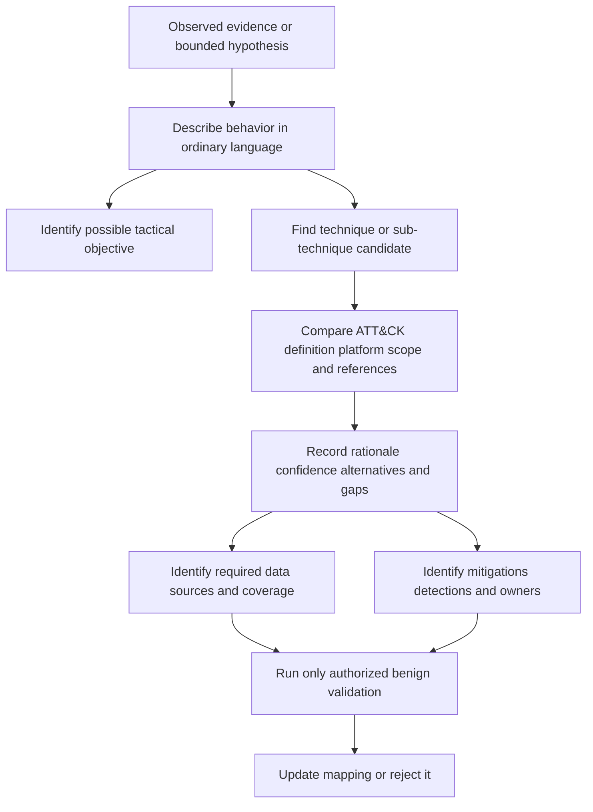
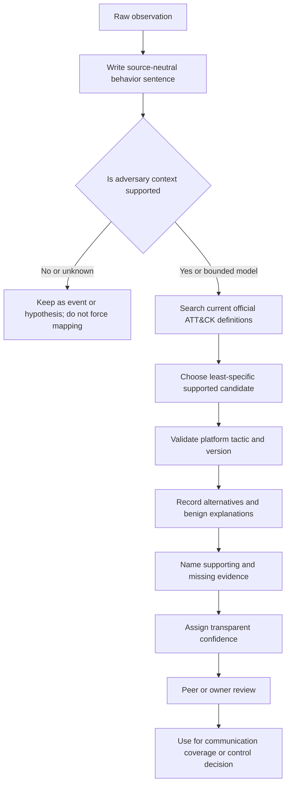
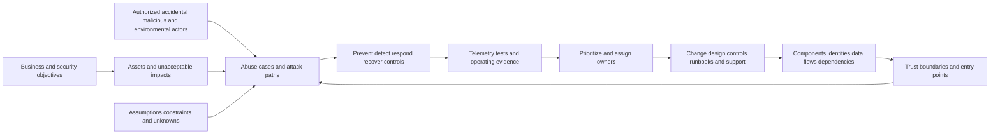
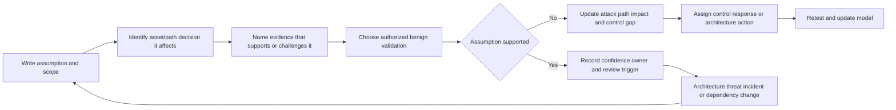
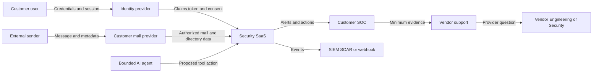
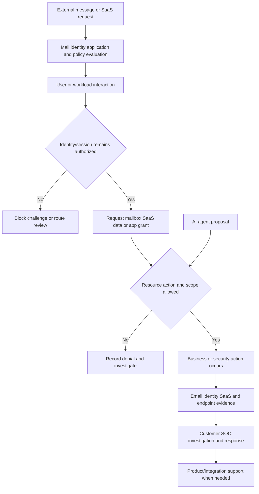
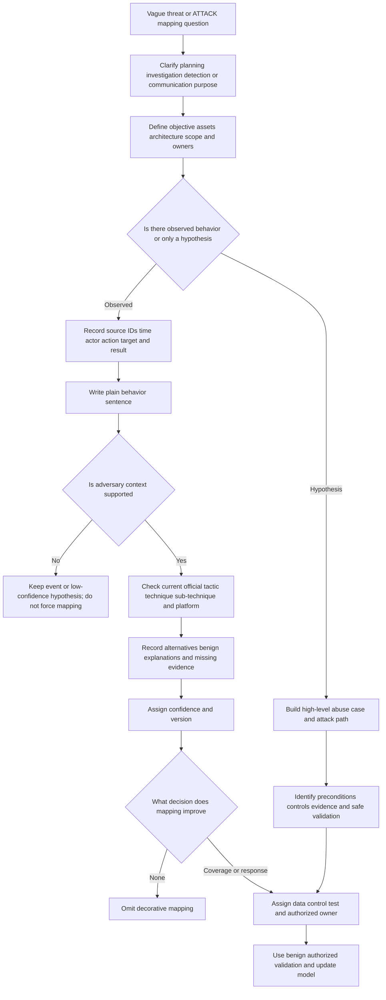
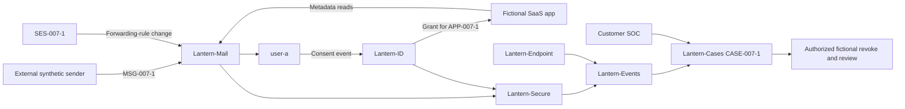

# Part 007 - MITRE ATTACK and Threat Modeling

> **Purpose:** Learn to describe adversary behavior and reason about possible attack paths without turning a knowledge base into a scorecard, inventing evidence, or providing harmful operational instructions.
>
> **Evidence rule:** Every threat model, actor, message, identity, application, event, and ATT&CK mapping in this Part is synthetic. Arti's Microsoft enterprise support experience transfers to structured investigation, scoping, evidence, communication, escalation, and validation; it does not establish threat-intelligence, red-team, direct email-security, Abnormal AI, or named security-tool production experience.
>
> **Currency and official-source access date:** August 24, 2026.

## Section Goal

By the end of this Part, Arti should be able to explain **MITRE ATT&CK** as a public, evidence-informed knowledge base of adversary tactics and techniques, not a product, compliance framework, attack instruction manual, universal detection catalog, or numerical measure of security maturity. She should be able to distinguish tactics, techniques, sub-techniques, and procedures; understand the supporting roles of groups, software, campaigns, data sources, mitigations, and detections; and create a defensible behavior mapping that names evidence, version, platform, scope, confidence, alternatives, and limitations.

She should also be able to build a beginner-first **threat model** by identifying objectives, assets, actors, entry points, trust boundaries, data flows, dependencies, assumptions, abuse cases, attack paths, controls, evidence, and owners. She should understand STRIDE as one optional brainstorming aid rather than a mandatory or complete methodology. She should apply this reasoning to a vendor-neutral enterprise email and Software as a Service (SaaS) environment while protecting privacy and avoiding active testing.

The practical outcome is a **Paper Lantern Attack-Path Lab**. It produces a synthetic system-context diagram, asset and actor registers, entry-point and trust-boundary map, assumptions ledger, abuse cases, attack-path graph, control/evidence matrix, ATT&CK mapping cards, support decision tree, privacy manifest, and scored validation. The lab is purely local and analytical; it does not send email, create accounts, register applications, visit links, scan systems, bypass controls, or reproduce attacker actions.

## JD Mapping

| Supplied JD signal | Capability developed here | Practical proof |
|---|---|---|
| Enterprise L1 Technical Support Engineer | Turns vague “possible attack” reports into assets, observations, paths, evidence gaps, and owners | Threat-model intake and decision tree |
| Threat investigations | Uses behavior vocabulary and timelines without claiming attribution or compromise prematurely | Defensible ATT&CK mapping cards |
| Behavioral false positives | Compares benign and harmful explanations for the same signal | Assumptions and alternative-path ledger |
| Configuration tickets | Identifies trust-boundary, permission, policy, and dependency conditions that enable or block a path | Control and boundary matrix |
| API questions | Models identities, tokens, scopes, applications, endpoints, callbacks, audit events, and revocation | SaaS integration abuse cases |
| Cloud Email Security | Models sender, message, link, attachment, recipient, mailbox, identity, and response pathways | Email/SaaS attack-path diagram |
| AI Security Agents | Treats agents as non-human actors with goals, tools, permissions, untrusted inputs, and approval gates | Agent abuse-case example |
| SaaS Security | Models app grants, role changes, data access, audit, third-party integrations, and session behavior | SaaS trust-boundary register |
| SOC/SIEM/SOAR/XDR/EDR context | Maps needed data sources and detection opportunities across domains | Evidence and coverage matrix |
| Engineering/Product collaboration | Sends evidence-backed mapping and exact product or telemetry questions | Escalation-ready mapping packet |
| Customer trust | Communicates possibility, evidence, confidence, and limits without alarmism | Customer-safe threat narrative |
| Security mindset and intellectual honesty | Refuses decorative ATT&CK IDs, unsupported attribution, and offensive lab activity | Mapping rubric and honesty audit |

## Candidate Honesty Note

| Evidence label | Honest use | Boundary that remains visible |
|---|---|---|
| **Production-transfer example** | Arti's CV-supported Microsoft enterprise support, CRITSIT coordination, Engineering/Product escalation, fix validation, customer communication, KB/training, mentoring, and support analytics support structured reasoning and evidence discipline | These facts do not establish threat hunting, malware analysis, adversary attribution, incident command, email-security operations, or ATT&CK content expertise |
| **Working knowledge or upskilling** | Networking, identity, API, logging, cloud, and AI concepts help Arti understand system paths and evidence sources | This is not production threat modeling, penetration testing, or security architecture ownership |
| **Local/public lab** | Paper Lantern demonstrates a harmless paper threat model and evidence-based ATT&CK mapping | It is not red-team activity, production detection engineering, security assessment, or direct use of Abnormal/SIEM/EDR/SOAR tooling |
| **Learned architecture** | MITRE, NIST, CISA, and Microsoft official sources support the vocabulary and method | Official-source study does not prove operational threat-intelligence or vendor-product experience |
| **No direct experience** | The master records no direct Abnormal AI, direct email-security operations, Splunk, CrowdStrike, Cortex SOAR, or threat-intelligence production experience | State this directly; present the lab as lab evidence only |
| **Template only** | Threat-model and mapping forms can structure an authorized real review | A completed template does not prove an actual actor, attack, vulnerability, or incident |

Safe interview language: “I have not performed production ATT&CK-based detection engineering or operated email-security investigations. I use ATT&CK as a public vocabulary after evidence identifies behavior. My synthetic threat-model lab shows how I separate asset, path, observation, assumption, mapping, and owner without claiming attribution or offensive experience.”

## Beginner Term Primer

| Term | Plain meaning | Why it matters | Memory hook |
|---|---|---|---|
| **MITRE ATT&CK** | A public knowledge base describing adversary tactics and techniques based on observations and research | It gives defenders a shared behavior vocabulary | A map of known behaviors, not a grade |
| **Tactic** | The adversary's tactical objective or “why” at a stage | It organizes techniques by purpose | Why the behavior is performed |
| **Technique** | A general method an adversary may use to achieve an objective | It lets analysts describe behavior at a useful level | How the objective may be achieved |
| **Sub-technique** | A more specific form of a technique | It improves precision when evidence supports the detail | A narrower “how” |
| **Procedure** | A specific real-world implementation used in a particular operation or by particular software/group | It contains concrete context but changes rapidly | The exact observed implementation |
| **Group** | A tracked set of intrusion activity associated through evidence and analytic judgment | It organizes observations, but aliases and attribution remain uncertain | A research cluster, not courtroom identity |
| **Software** | Malicious or legitimate software associated with observed techniques | Tools can support mappings, but tool presence alone may be ambiguous | What code or tool was observed |
| **Campaign** | A grouping of related adversary activity over a period or objective | It adds operational context without making every event identical | A related activity set |
| **Data source/data component** | A kind of information and specific observable that can support detection or investigation | It connects behavior to evidence availability | What evidence could reveal the behavior |
| **Mitigation** | A defensive measure that can reduce opportunity or impact for a technique | It supports control planning but is not guaranteed prevention | A safeguard against the method |
| **Detection strategy/analytics** | Logic and data relationships used to identify behavior | A technique can have many possible detections with different coverage | Evidence plus logic notices behavior |
| **Mapping** | Linking observed or hypothesized behavior to an ATT&CK object with rationale | Good mapping improves communication and coverage analysis | Evidence first, ID second |
| **Coverage** | The extent to which data and controls can observe or address a defined behavior and scope | A “covered” technique may still have blind spots | Covered where, how, and under what conditions? |
| **Threat** | A potential source or event of harm | Threat modeling considers harmful possibilities before or during incidents | Potential harm, not proof |
| **Threat actor** | A person, group, organization, or automation capable of causing harm | Motive, capability, access, and constraints shape paths | Who or what could act |
| **Asset** | Something valuable that needs protection | Threats matter because assets and objectives can be harmed | If loss matters, model it |
| **Entry point** | A place where an actor or input can first interact with the system | Email addresses, login pages, APIs, webhooks, and support channels are examples | Where untrusted input enters |
| **Trust boundary** | A point where authority, data handling, identity, or control changes | Every crossing needs explicit assumptions, controls, and evidence | Crossing changes what can be assumed |
| **Attack surface** | All reachable people, processes, technologies, interfaces, and relationships through which harm may be attempted | It is broader than open network ports | Every reachable door and relationship |
| **Attack path** | A sequence of conditions and actions that could move from entry to asset impact | It reveals dependencies and control opportunities | A chain from opportunity to consequence |
| **Assumption** | A statement treated as true for the model but not yet verified | Hidden assumptions create hidden risk | Write it down or it will control you silently |
| **Abuse case** | A description of how a feature or workflow could be misused to cause harm | It explores misuse without executing it | How useful behavior could be abused |
| **STRIDE** | A Microsoft-origin threat-category mnemonic: Spoofing, Tampering, Repudiation, Information Disclosure, Denial of Service, Elevation of Privilege | It helps brainstorm but does not replace system understanding | Six prompts, not six guaranteed findings |
| **Threat model** | A maintained representation of what is valuable, how the system works, what could go wrong, what controls exist, and what remains uncertain | It supports design, troubleshooting, and prioritization | Model value, paths, evidence, and decisions |

## MITRE ATT&CK: What It Is and Is Not

ATT&CK is maintained by MITRE as a knowledge base of adversary tactics and techniques. It includes technology domains and platforms that evolve over time. Entries have identifiers, descriptions, relationships, references, version history, and associated defensive information. The official site and data should be treated as versioned sources.

| ATT&CK is | ATT&CK is not |
|---|---|
| A shared public vocabulary for observed adversary behavior | A list of every possible attack or every procedure |
| A knowledge base with tactic, technique, software, group, campaign, mitigation, and data relationships | A product that automatically detects or blocks behavior |
| A source for threat-informed defense and coverage conversations | A compliance framework or certification |
| A versioned body of knowledge requiring citations and context | A timeless list whose IDs and relationships never change |
| A way to describe evidence-backed behavior | Proof that a named group performed the behavior |
| A planning input for data, analytics, testing, and control review | A numerical security score where more mapped boxes always means safer |
| A defender resource that can be used at different levels of precision | Permission to reproduce techniques against systems |

**Analogy:** ATT&CK is like a field guide for animal tracks. It helps a trained observer describe patterns and possible sources, but one footprint does not prove a specific animal, intent, or complete journey. The analogy stops because adversaries deliberately imitate or change behavior, and ATT&CK entries describe human-controlled technical activity rather than natural species.

## Plain-English deep-dive: Tactics, Techniques, Sub-techniques, and Procedures

The hierarchy answers different questions.

| Layer | Question | Synthetic safe example | Evidence caution |
|---|---|---|---|
| Tactic | What objective might the actor be pursuing? | Obtain initial access or collect information | Objective is inferred from behavior and context |
| Technique | What general method is used? | Send a targeted message or abuse a valid account | Several techniques can explain the same event |
| Sub-technique | Which narrower method fits? | A specific type of external remote service or message attachment behavior | Use only when evidence supports specificity |
| Procedure | What exact implementation occurred? | Particular lure wording, application, sequence, infrastructure, and timing in a documented case | Procedures change and may contain sensitive details |

A tactic is not a chronological phase that every attack completes. ATT&CK matrices organize objectives, but adversaries can skip, repeat, combine, or perform techniques in another order. A technique can support more than one tactic. A defensive observation can fit several techniques depending on purpose and context.

**Analogy:** A tactic is the travel goal, such as reaching another city; a technique is the transport method, such as rail; a sub-technique is high-speed rail; a procedure is the exact train, stations, ticket, and timing used on one trip. The analogy stops because adversary intent may be hidden and one action can support several objectives.

### Example of disciplined precision

Observation: a synthetic user account successfully accessed a SaaS report after normal authentication.

Weak mapping: “Valid Accounts, therefore compromised account.”

Better reasoning: Valid-account use is normal. A mapping requires evidence that valid credentials were used as part of adversary behavior. Look for unauthorized context, impossible ownership, token/session evidence, unusual resources, preceding phishing or consent, and customer validation. Until then, the event is a sign-in, not an ATT&CK claim.

## Groups, Software, Campaigns, Data, Mitigations, and Detections

ATT&CK's value is relational. A technique entry may link to observed group/software procedures, mitigations, and defensive data. Those links support research and planning, but they do not imply that every group always uses the technique or that every listed mitigation blocks every implementation.

| ATT&CK object | Practical use | Support-safe question | Misuse to avoid |
|---|---|---|---|
| Group | Understand historically associated behavior and aliases | Which official references support the association and confidence? | Attributing a customer event from one indicator |
| Software | Connect tools to observed capabilities/procedures | Was software identity verified, and could legitimate use explain it? | Treating a tool name as proof of malicious intent |
| Campaign | Study related activity and time/objective context | Does the evidence match the campaign's documented scope and period? | Forcing current events into a famous campaign |
| Data source/component | Plan what telemetry could reveal behavior | Do we collect the relevant component with correct fields and retention? | Marking technique “detected” because a log source exists |
| Mitigation | Identify controls that may reduce technique opportunity or impact | Is the mitigation implemented, operating, and applicable to this path? | Treating a mitigation list as guaranteed prevention |
| Detection/analytics | Design evidence relationships and logic | Which benign conditions and blind spots exist? | Copying analytics without validating schema, environment, or privacy |

### Coverage language

Avoid “We cover technique X” without conditions. Use:

> “For platform P and population S, data components D1 and D2 are collected with retention R. Analytic A detects behavior pattern B under assumptions C. It was validated with authorized benign test T on date X. Known gaps are G, and response owner O reviews resulting alerts.”

This sentence makes coverage testable. It distinguishes data availability, analytic design, validation, and operational response.

## Plain-English deep-dive: ATT&CK Is Not a Score or Compliance Checklist

Coloring more ATT&CK cells can look like progress, but the count says little about asset importance, data quality, analytic performance, control operation, investigation capacity, or business risk. A shallow alert for one behavior is not equivalent to high-fidelity, well-operated coverage for a critical path.

**Analogy:** A city map with every road highlighted does not prove every road is monitored, safe, passable, or important. The analogy stops because detection coverage is dynamic and depends on data, logic, adversary behavior, and analysts.

| Misleading metric | Why weak | Better question |
|---|---|---|
| Percentage of techniques “covered” | Denominator and definition of coverage are arbitrary | Which high-priority paths and assets have validated evidence and response? |
| Number of mapped alerts | One noisy rule can inflate count | What precision, timeliness, source health, and analyst outcome are observed? |
| Number of mitigations implemented | Existence does not prove operating effectiveness | Which path condition changed, and what test supports it? |
| Number of groups tracked | Attribution volume may not improve local decisions | Which relevant behaviors and exposures affect our environment? |
| Technique ID in every case | Decorative mapping creates false certainty | Does the ID communicate an evidenced behavior better than plain language? |

ATT&CK is also not a compliance list. Regulatory and contractual requirements come from other authorities. ATT&CK can inform threat scenarios and control validation within a broader risk and compliance program, but an ATT&CK mapping does not certify conformity.

## A Defensible ATT&CK Mapping Method

Create a mapping only after describing the behavior in ordinary language. The mapping card should include:

| Field | Required content |
|---|---|
| Observation | Source facts, IDs, UTC time, actor/entity, action, target, and result |
| Behavior sentence | What happened without ATT&CK terminology |
| Candidate mapping | Technique/sub-technique ID and official name, plus tactic context if relevant |
| Platform/domain | Applicable ATT&CK platform and knowledge-base version/date |
| Rationale | Exact element of the official definition matched by evidence |
| Confidence | High, Medium, or Low with meaning defined locally |
| Alternatives | Other techniques, benign explanations, or non-ATT&CK categories |
| Missing evidence | What would confirm, narrow, or reject the mapping |
| Data sources | Evidence already available and needed |
| Defensive action | Detection, mitigation, investigation, or escalation owner |
| Limit | What the mapping does not prove, especially actor attribution and intent |

### Confidence scale

| Confidence | Meaning for this guide | Required behavior |
|---|---|---|
| High | Multiple reliable observations directly match the definition; alternatives are weak | Cite sources, version, and residual limits |
| Medium | Evidence supports the behavior, but one important element or alternative remains | State missing evidence and avoid specific attribution |
| Low | Mapping is a hypothesis useful for collection or modeling, not a conclusion | Label prominently and do not drive destructive action alone |
| Rejected | Evidence conflicts with definition or a better explanation exists | Preserve why it was rejected to prevent repeated miscoding |

Specificity should follow evidence. A broad technique can be more honest than an attractive sub-technique. A mapping can be omitted when it adds no decision value.

## Threat Modeling From Zero Knowledge

A threat model is a structured representation of a system and its harmful possibilities. It is useful before a system launches, when an integration changes, during support troubleshooting, and after an incident reveals an assumption. It is not a prediction that every path will occur.

### Threat-model components

| Component | Core question | Email/SaaS example |
|---|---|---|
| Objective | What useful outcome must the system enable? | Deliver legitimate mail and investigate suspicious activity |
| Asset | What value can be disclosed, altered, denied, or misused? | Mailbox, identity, message, token, audit log, business process |
| Actor | Who or what can interact, intentionally or accidentally? | Employee, admin, external sender, integration, support, attacker, outage |
| Entry point | Where can input or authority enter? | SMTP route, login, OAuth consent, API, webhook, support upload |
| Trust boundary | Where do control and assumptions change? | Customer-to-provider, IdP-to-SaaS, mail-to-security, support evidence portal |
| Data flow | What moves, why, and under whose authority? | Message metadata and directory context enter detection service |
| Dependency | What must remain trustworthy/available? | DNS, identity, mail API, webhook receiver, clock, logging |
| Assumption | What is treated as true but may fail? | “Only approved admins can grant app consent” |
| Abuse case | How could a useful function be misused? | Approved export role used to collect unrelated content |
| Attack path | Which conditions/actions connect entry to impact? | Lure to session misuse to mailbox access to persistence |
| Control/evidence | What blocks, detects, limits, proves, or recovers? | MFA, app governance, message analysis, audit, revoke, recovery |
| Owner | Who decides and acts at each boundary? | Customer identity owner, SOC, SaaS support, provider Engineering |

## Plain-English deep-dive: Assumptions Are Hidden Dependencies Until Written Down

Every threat model contains assumptions: administrators use named accounts, clocks are synchronized, app consent follows approval, an event source covers all tenants, or revocation reaches every resource. An assumption is not automatically bad. The danger is allowing it to control the model without an owner, evidence, failure consequence, or review trigger.

**Analogy:** An assumption is like the stated load limit on a bridge design. Engineers can design with it, but they must know where it came from and what happens if real traffic exceeds it. The analogy stops because security assumptions can involve people, adversaries, third-party services, and changing policy rather than only physical measurements.

An assumptions ledger should record the statement, source, confidence, affected path, failure consequence, evidence, owner, validation method, and review trigger. “The identity provider always revokes immediately” is too absolute. A better entry is: “For this documented client/resource combination, the current design expects a revoked session to be rejected within the stated propagation behavior; validate old and new sessions and recheck after identity or client changes.”

This discipline also improves support. When observed behavior conflicts with an assumption, the next question becomes clear: was the documentation misunderstood, the configuration different, propagation delayed, telemetry incomplete, or product behavior defective? The model changes with evidence rather than protecting its original story.

## Actors, Assets, Entry Points, and Trust Boundaries

Threat actors are not only external criminals. A model should include malicious, accidental, authorized-but-mistaken, compromised, automated, third-party, and environmental actors. Avoid accusing real people; use role-based descriptions.

| Actor type | Goal or failure mode | Access assumption | Modeling question |
|---|---|---|---|
| External sender | Communicate legitimately or deliver harmful social engineering | Can send to public mail address | Which message and relationship controls evaluate input? |
| Employee/end user | Perform work; may make mistakes or be compromised | Has mailbox, session, SaaS roles | What can one mistaken click or stolen session reach? |
| Administrator | Configure mail, identity, SaaS, and integrations | High privilege under change process | How is privilege approved, observed, limited, and recovered? |
| Workload/integration | Exchange data continuously | Token, certificate, app grant, webhook secret | Is identity owned, scoped, rotated, monitored, and revocable? |
| Support engineer | Diagnose product and integration behavior | Case-scoped evidence and provider tools | How is customer data minimized and access audited? |
| Security analyst/SOC | Investigate and respond | Investigation and response tools | Which decisions need incident authority and two-person review? |
| Third-party vendor | Provide service or integration | Contracted trust relationship and technical grant | What happens if vendor identity or API is compromised? |
| Environmental event | Outage, clock drift, corruption, queue failure | No malicious intent | Could it mimic attack evidence or disable controls? |

### Trust-boundary diagram

Every arrow is a boundary question: what crosses, who initiates, what identity represents authority, which policy permits it, what data is exposed, how is it logged, how can it be revoked, and which party owns failure?

## STRIDE as an Optional Brainstorming Aid

STRIDE is commonly expanded as:

| STRIDE category | Plain question | Email/SaaS example | Control/evidence ideas |
|---|---|---|---|
| Spoofing | Can an actor pretend to be another identity or service? | Lookalike sender or stolen application credential | Strong identity, sender/auth evidence, token validation, sign-in logs |
| Tampering | Can data or configuration be changed without authorization? | Modified webhook payload or mail-routing policy | Integrity/signature, change control, audit, versioning |
| Repudiation | Can an actor plausibly deny an action because records are weak? | Shared admin account with incomplete audit | Named identity, timestamps, immutable-enough audit, approvals |
| Information Disclosure | Can data reach an unauthorized party? | Over-scoped API exposes message content | Least scope, encryption, access review, minimization |
| Denial of Service | Can authorized use be prevented or degraded? | Event queue overwhelmed or connector disabled | Capacity, rate control, resilience, monitoring, recovery |
| Elevation of Privilege | Can an identity gain more authority than intended? | Read-only integration obtains admin scope | Least privilege, consent governance, JIT, alerts, revoke |

STRIDE is a prompt set. It does not identify business fraud, privacy unfairness, safety, supply-chain dynamics, all social engineering, or every availability condition automatically. It can be applied to each process, flow, store, boundary, and actor, but indiscriminate checkbox use creates noise. Use the categories that improve the model and add domain-specific abuse cases.

## Plain-English deep-dive: An Attack Path Is a Chain of Conditions, Not a Movie Script

An attack-path diagram should show how conditions combine. It should not provide step-by-step instructions for harming systems. A safe model says “a user is persuaded to authorize an excessive application grant,” not how to create or deliver a malicious application.

**Analogy:** A flood-risk map shows low ground, drainage, barriers, and possible water routes without teaching someone how to break a dam. The analogy stops because attackers make adaptive choices and can intentionally create new paths.

Each path node should be one of:

- existing condition or exposure;
- actor capability or access;
- attempted behavior at a high level;
- control decision;
- evidence opportunity;
- resulting state or impact;
- recovery or response decision.

### Attack-path card

| Field | Content |
|---|---|
| Path objective | Asset and impact considered |
| Starting condition | Entry point and actor access |
| Preconditions | Permissions, user action, vulnerability, trust assumption |
| Steps | High-level behavior only, no exploit instructions |
| Controls | Preventive, detective, response, recovery at each step |
| Evidence | Source IDs, data components, expected observations |
| Alternatives | Benign explanations and different paths |
| Owner | Who can decide or act at each point |
| Residual uncertainty | What remains even if controls operate |

## Email and SaaS Threat Model

### Assets

| Asset | Value | Possible harm | Typical owner |
|---|---|---|---|
| Mailbox and messages | Business communication and records | Disclosure, fraudulent change, unavailable mail | Customer mail/data owner |
| User and admin identity | Access and accountability | Session misuse, impersonation, broad configuration change | Customer identity owner |
| Sender/relationship context | Supports trust and behavior decisions | Manipulated or misinterpreted relationships | Customer/business and security owners |
| SaaS app grants and tokens | Enable integrations | Excess access, persistence, data extraction | Customer app/identity owner |
| Detection and verdict records | Support security decisions | Tampering, missing alerts, false confidence | Vendor and customer security owners by boundary |
| Audit and timeline evidence | Supports investigation and accountability | Retention gap, alteration, privacy exposure | System/security owners |
| Response capability | Enables quarantine, revoke, contain, recover | Unauthorized action or unavailable response | Customer SOC/admin and provider owners |
| Support case evidence | Enables product diagnosis | Customer data exposure or misleading conclusion | Customer and vendor support under policy |

### High-level safe abuse cases

1. An external sender uses social context to induce a user to disclose credentials.
2. A compromised valid session accesses email or SaaS data without needing a new password.
3. A user authorizes an application with permissions beyond the stated purpose.
4. An administrator accidentally changes mail routing or detection policy.
5. A webhook receiver trusts an unauthenticated or replayed event.
6. A support artifact exposes a token or message content to unintended viewers.
7. An AI agent treats untrusted message text as instruction and proposes an excessive tool action.
8. A logging or time-synchronization gap hides or misorders the path.

### AI-agent abuse case

An agent asked to summarize three message metadata records proposes reading all mailboxes and deleting suspicious messages. Threat-model interpretation:

- asset: message confidentiality and mailbox integrity/availability;
- untrusted input: message text or user prompt;
- trust boundary: agent-to-tool API;
- abuse case: broad tool selection beyond the approved goal;
- controls: tool allowlist, resource scope, read-only default, prompt/data separation, policy enforcement, human approval, action budget, complete audit, safe stop;
- evidence: goal, plan, requested tool/action/resource, policy decision, approver, result;
- ATT&CK mapping: do not map merely because an agent requested excess scope; there is no supported adversary context.

## Worked Examples

### Worked example 1: Suspicious inbox rule

**Input:** A synthetic audit event shows user `USER-A` created a forwarding rule after a sign-in from a new device.

**Model:** Assets are mailbox content and business relationships. Entry may be valid session or legitimate user action. Path could involve unauthorized sign-in, rule creation, and collection/forwarding. Alternative is approved user configuration.

**Evidence:** Authentication event, session/device, rule details without message content, admin/user validation, audit ID, forwarding destination classification, subsequent access/activity.

**ATT&CK approach:** Describe behavior first. Candidate techniques related to valid accounts, email collection, or account manipulation may be considered only after current official definitions are checked and adversary context is supported. Use the least-specific justified mapping and record alternatives.

**Outcome:** Customer SOC owns containment and incident declaration; Support explains product evidence and integration behavior.

### Worked example 2: OAuth application grant

**Input:** A synthetic app receives mail-read permission after user consent.

**Threat model:** Entry point is consent workflow; asset is mailbox data; actor may be legitimate vendor, mistaken user, or malicious app operator; boundary is IdP-to-app/API; assumption is that consent accurately represents purpose.

**Evidence:** App/client ID, publisher/verification context where available, requested/granted scopes, consenting identity, time, redirect/callback metadata, API access events, owner validation, revocation result. Never collect client secret or raw tokens.

**ATT&CK approach:** Consent and cloud-account behaviors may have relevant Enterprise ATT&CK entries, but use the current official site and map only observed behavior. “Mail-read permission exists” alone does not prove malicious use.

### Worked example 3: Missing email alert

**Input:** A user reports a suspicious message, but no product alert exists.

**Threat model:** Possible causes include benign message, detection gap, missing data, unsupported path, configuration, delayed ingestion, or user-report error. The absence is a coverage question, not proof of a false negative.

**Evidence:** Message ID, route, UTC time, relevant headers/metadata, configuration, supported data path, user report, source health, retention, and product review result.

**ATT&CK approach:** Do not attach a phishing technique ID until the behavior and adversary context are established. The initial task is evidence preservation and product-path diagnosis.

### Worked example 4: Shared IP correlation

**Input:** Email, sign-in, and SaaS event share one public IP.

**Threat model:** NAT, proxy, VPN, mobile carrier, or shared service can make unrelated activity share an IP. Identity namespaces, session IDs, device mapping, and resource actions are stronger joins.

**Outcome:** Keep mapping confidence low until more evidence exists. Never attribute a group or individual from the IP alone.

### Worked example 5: Logging gap as a path enabler

**Input:** A service-account grant changed, but audit retention expired.

**Threat model:** The gap does not cause the permission change, but it weakens detection, reconstruction, and accountability. Model logging as a control/dependency and identify the residual uncertainty.

**ATT&CK approach:** Missing logs are not themselves proof that an evasion technique occurred. Record the control gap separately.

## Troubleshooting Decision Tree

Use this tree when a customer or interviewer asks, “Which ATT&CK technique is this?” or “How could this system be attacked?”

### Symptom-to-hypothesis-to-test table

| Symptom | Mapping/model hypothesis | Safe discriminating check | Observation | Next action |
|---|---|---|---|---|
| Valid account used at odd time | Compromise, travel, automation, clock/time-zone issue | Verify identity, device/session, resource, local/UTC time, owner context | Approved automation used account | Do not map adversary valid-account behavior; fix identity design if needed |
| New mail forwarding rule | User choice, admin action, compromise, migration | Audit actor/session, destination, approval, user/admin validation | User denies action and session is anomalous | Customer SOC evaluates incident path; Support supplies product evidence |
| App has broad mail scope | Legitimate requirement, privilege creep, malicious consent | Compare approved purpose, grant, owner, actual access, audit | Scope exceeds purpose with no access observed | Reduce/revoke through owner; do not claim exfiltration |
| Alert maps to many techniques | Detection is generic or mapping too broad | Compare exact behavior sentence with definitions | Only one technique element is evidenced | Use least-specific mapping or omit |
| No alert for suspicious message | Data/detection/configuration/retention gap or benign item | Trace product data path and review evidence | Message path unsupported by source | Fix/communicate coverage; do not claim evasion |
| Same domain in email and endpoint | User navigation, embedded content, proxy, unrelated service | Join message, user, process, DNS/HTTP time and action | Browser prefetch generated connection | Record benign alternative; tune correlation |
| Technique marked covered | Data exists but analytic or response unvalidated | Run approved benign test and trace source-to-case | Event ingested but rule disabled | Coverage is not operational; assign correction |
| Famous group suggested | One IOC or technique resembles reporting | Check official references, time, infrastructure, procedures, confidence | Evidence is generic and shared | Do not attribute; describe behavior only |

## Common Failure Modes and Unsafe Shortcuts

| Failure mode | Why it fails | Safer correction | Escalation trigger |
|---|---|---|---|
| Mapping before behavior | IDs shape the story and invite confirmation bias | Write a plain behavior sentence first | Case decision depends on mapping precision |
| Technique equals malicious | Legitimate admins and tools use similar methods | Require adversary context and alternatives | Unauthorized impact evidence appears |
| Tactic treated as chronology | Real activity skips/repeats objectives | Use tactic as objective vocabulary | Timeline/response confusion results |
| Most-specific sub-technique chosen | Precision exceeds evidence | Choose the least-specific supported mapping | Missing evidence requires specialist review |
| Group attribution from one IOC | Infrastructure and tools are reused | State behavior and confidence; use threat-intelligence process | Customer requests attribution or disclosure |
| ATT&CK coverage percentage as score | Counts ignore assets, quality, gaps, and response | Prioritize validated high-risk paths | Executive decision relies on misleading metric |
| Mitigation existence equals protection | Control may be misconfigured or bypassed | Check design and operating evidence | Critical path control fails test |
| Data source exists equals detection | Collection, parser, analytic, and ownership can fail | Trace data-to-alert-to-response | Blind spot affects active investigation |
| STRIDE checkbox storm | Produces generic threats without architecture | Apply prompts to actual flows, stores, boundaries, and assets | Model cannot identify owner/action |
| Threat model frozen at launch | Changes make assumptions stale | Review after architecture, identity, integration, incident, or threat change | Major change or new dependency |
| Offensive reproduction in support lab | Risks harm and exceeds authorization | Use paper paths, synthetic records, and benign validation | Any request to scan, phish, bypass, or exploit |
| Message content overcollection | Threat modeling becomes privacy exposure | Begin with metadata and approved purpose | Sensitive/regulated content becomes necessary |
| AI agent treated as trusted administrator | Untrusted input and dynamic plans can exceed purpose | Enforce tool/action/resource policy and human gates | Consequential action proposed |
| Support declares incident | Exceeds customer decision rights | Provide evidence, product behavior, limits, and escalation | Credible active harm under customer process |
| Lab presented as production | Violates candidate honesty | Label local/synthetic and name direct-experience gap | Interview asks for real tool usage |

## Paper Lantern Attack-Path Lab

### Lab purpose

Create a complete, harmless threat model and defensible ATT&CK mapping set for a fictional email/SaaS environment. The objective is to demonstrate structured reasoning and evidence discipline, not to simulate an attack or prove production security skills.

### Honest artifact label

> **LOCAL/SYNTHETIC LAB - Threat-model and ATT&CK mapping practice only. No attack execution, customer system, Abnormal AI, direct email-security operation, threat attribution, incident command, or named security-tool production experience is represented.**

### Prerequisites

1. Private local folder, Markdown/spreadsheet editor, and Mermaid preview or paper drawing tool.
2. Current official MITRE ATT&CK Enterprise site available only for ordinary reading; record version/access date.
3. This Part's mapping card, threat-model components, STRIDE table, and decision tree.
4. Only the fictional entities and events supplied here.
5. No mailbox, SaaS tenant, application registration, API key, token, endpoint agent, scanner, phishing tool, or public AI service.
6. Two to three hours for the model and a thirty-minute verbal review.

### Authorized scope and prohibitions

| Activity | Authorized | Prohibited |
|---|---|---|
| Architecture | Draw supplied fictional systems and flows | Probe, enumerate, or inspect a real environment |
| Attack paths | High-level conditions and control/evidence points | Exploit steps, payloads, credential capture, bypass instructions |
| ATT&CK | Read official descriptions and create evidence-backed mapping cards | Operationalize techniques against any system |
| Data | Supplied synthetic IDs, reserved domains, fake events | Real emails, logs, credentials, customer identifiers, threat samples |
| Validation | Paper walkthrough and benign logic review | Send messages, create malicious apps, visit suspicious URLs, isolate endpoints |

### Synthetic system: Paper Lantern Services

Paper Lantern Services is a fictional company with:

- public mail address at reserved domain `paper-lantern.example.invalid`;
- fictional cloud mail provider `Lantern-Mail`;
- fictional identity provider `Lantern-ID`;
- fictional SaaS security service `Lantern-Secure`;
- fictional HR SaaS `Lantern-HR`;
- fictional SIEM `Lantern-Events`;
- fictional SOAR/case tool `Lantern-Cases`;
- fictional endpoint source `Lantern-Endpoint`;
- user `user-a@example.invalid`, administrator `admin-a@example.invalid`, and workload `svc-alerts`;
- messages `MSG-007-1` and `MSG-007-2`, application `APP-007-1`, session `SES-007-1`, case `CASE-007-1`.

### Supplied benign/suspicious mixed scenario

1. `MSG-007-1` is a harmless synthetic HR notice from a new external sender with a reserved link.
2. User `user-a` opens the notice in a lab narrative; no credentials are entered and no live site exists.
3. At 10:10 UTC, a fictional app-consent event grants `APP-007-1` mail-read scope. The scenario does not state whether it is authorized.
4. At 10:15 UTC, `APP-007-1` reads metadata for three synthetic messages; it does not read bodies.
5. At 10:20 UTC, a forwarding rule is created under session `SES-007-1`; the user says they did not create it.
6. `Lantern-Endpoint` records only ordinary browser activity; no malware evidence exists.
7. At 10:30 UTC, customer SOC opens `CASE-007-1` and revokes the synthetic app/session in the narrative.

The scenario supports a suspicious path hypothesis but does not name an attacker, malware, real campaign, or final root cause.

### Step 1: Define objectives and scope

Record useful objectives: deliver legitimate communication, permit approved SaaS integration, protect mailbox content and identity, provide timely investigation, and recover from unauthorized grants or sessions. Exclude all active testing and real systems.

**Expected evidence:** The model protects business use, not merely blocks every interaction.

### Step 2: Build the asset register

Create at least twelve assets: user identity, admin identity, workload identity, mailbox, message metadata, message content, session, app grant, mail configuration, detection record, audit trail, response capability, support evidence, and business trust. Record CIA needs, owner assumption, impact, and classification.

### Step 3: Build the actor register

Include user, admin, app/workload, external sender, customer SOC, vendor support, provider Engineering, possible external actor, mistaken insider, and environmental failure. Record goal/failure, starting access, constraints, evidence, and owner.

**Expected evidence:** “Possible actor” is not attribution.

### Step 4: Map entry points, flows, and trust boundaries

List mail submission, message interaction, identity sign-in, consent, app API, session, forwarding configuration, SIEM export, case evidence, and support escalation. For each, record data/authority crossing, authentication, authorization, telemetry, revoke path, and party boundary.

### Step 5: Create the assumptions ledger

At least ten assumptions must include:

- new sender alone does not mean malicious;
- user statement is important but needs correlation;
- app identity and publisher context are unknown;
- grant approval status is unknown;
- timestamps are assumed synchronized until verified;
- metadata reads do not prove body access;
- session actor is not established;
- endpoint has no supplied malware evidence;
- revocation effectiveness requires validation;
- ATT&CK version and platform must be recorded.

For each assumption, state failure impact, evidence needed, owner, and review trigger.

### Step 6: Write eight abuse cases

Use high-level language only. Include sender impersonation, user social engineering, unauthorized app consent, excessive app scope, session misuse, forwarding-rule abuse, missing audit coverage, and support-evidence overcollection. Add STRIDE prompts where useful but do not force all six categories onto each case.

### Step 7: Draw two attack paths and one benign path

Path A: message context -> user interaction -> questionable app consent -> metadata access.

Path B: valid session -> forwarding-rule change -> possible message exposure.

Benign path: legitimate HR notice -> approved app consent -> expected metadata read -> normal audit.

At every node include precondition, control, evidence, owner, and alternative explanation. Do not add steps explaining how to create a malicious message, app, or session.

### Step 8: Build control and evidence matrix

| Path point | Preventive control | Detective evidence | Response/recovery | Owner | Gap |
|---|---|---|---|---|---|
| External message | Mail and relationship controls | Message ID, sender/auth/context | Review/quarantine under policy | Mail/security owners | Exact product behavior unknown |
| App consent | Consent policy and least privilege | App/grant/audit event | Revoke grant/session and review access | Identity/app owner | Approval status unknown |
| Metadata read | Resource authorization and scope | API audit, app/client, objects, time | Restrict scope and validate | Mail/SaaS owner | Body-access evidence absent |
| Rule creation | Named admin/user authorization | Session, actor, rule audit | Remove rule, revoke session, recover | Mail/identity/SOC | Session actor unresolved |
| Case handling | Minimization and case access | Evidence manifest and access audit | Remove exposed artifacts | Support/privacy/security | Formal handling policy not modeled |

### Step 9: Create ATT&CK mapping cards

Create at least four candidate cards and one rejected card. Candidate topics may include phishing-related behavior, valid-account/session use, account manipulation through forwarding rules, or cloud application consent, but the learner must look up and cite the current official technique/sub-technique names and IDs rather than rely on this guide. This avoids freezing identifiers that may change.

Each card must include observation, behavior sentence, current official ID/name, platform/version, rationale, confidence, alternatives, missing evidence, data sources, controls, owner, and limit.

The rejected card should show why ordinary browser activity is not malware execution evidence.

### Step 10: Write the customer-safe narrative

Use this structure:

> We observed a new-sender message, a later application-consent event, three metadata reads, and a forwarding-rule change under a session the user does not recognize. These observations support investigation of unauthorized app or session use, but they do not identify an actor or prove message-body access or endpoint malware. The customer SOC owns containment and incident decisions. Product Support will preserve relevant product IDs, explain supported evidence, and escalate any provider-side behavior question. The next checkpoint is after app/session revocation validation and audit correlation.

### Step 11: Create the support decision tree and escalation packet

Apply the troubleshooting tree. The packet must include asset/impact, timeline, observations, hypotheses, mappings with confidence, alternatives, data gaps, actions/owners, privacy note, and explicit provider question. It must not include raw tokens, message bodies, or attribution.

### Step 12: Validation rubric and cleanup

| Dimension | 0 | 2 | 4 |
|---|---|---|---|
| System context | No scope | Components listed | Objectives, flows, boundaries, owners, dependencies complete |
| Asset/actor quality | Generic lists | Main assets/actors | CIA, goals, access, impact, and ownership reasoned |
| Assumptions | Hidden | Several written | Ten or more testable assumptions with triggers and owners |
| Abuse cases | Harmful or vague | Safe scenarios | Eight bounded cases tied to assets, controls, and evidence |
| Attack paths | Step-by-step attack instructions | High-level paths | Conditions, alternatives, controls, evidence, owners at every node |
| ATT&CK precision | Decorative IDs | Candidate mappings | Current official definitions, rationale, version, confidence, rejection card |
| ATT&CK restraint | Mapping equals proof | Limits noted | No score/compliance/attribution claim; mapping omitted where unhelpful |
| Evidence/privacy | Real or broad data | Synthetic data | Minimum fields, no secrets/content, manifest and retention complete |
| Ownership | Support commands response | Some roles | Customer SOC, identity, mail, vendor support/Engineering boundaries clear |
| Communication | Alarmist certainty | Uncertainty present | Facts, hypotheses, impact, limits, owners, next checkpoint clear |
| Safety/honesty | Active testing or production claim | Lab label | Fully paper-only; direct-experience boundaries explicit |
| Cleanup/reproducibility | No artifacts | Partial set | Manifest, review, source date/version, corrections, deletion recorded |

**Passing target:** 40/48 or higher, with 4s for attack-path safety, ATT&CK precision, ATT&CK restraint, evidence/privacy, and safety/honesty. Any active phishing, app registration, credential use, link visit, scanning, bypass, real customer data, unsupported attribution, or production-tool claim is an automatic failure.

### Required artifacts

| Artifact | Required contents | Evidence label |
|---|---|---|
| `scope-system-context` | Objectives, components, dependencies, exclusions | Local/synthetic lab |
| `asset-actor-registers` | Twelve assets, ten actors, impact/access/owner | Local/synthetic lab |
| `entry-boundary-flow-map` | Entry points, data/authority, control, evidence, revoke | Local/synthetic lab |
| `assumptions-ledger` | Ten assumptions, impact, evidence, owner, trigger | Local/synthetic lab |
| `abuse-cases` | Eight safe misuse narratives | Local/synthetic lab |
| `attack-paths` | Two suspicious and one benign path | Local/synthetic lab |
| `control-evidence-matrix` | Prevent, detect, respond, recover, gap, owner | Local/synthetic lab |
| `attack-mapping-cards` | Four candidates and one rejected mapping | Learned architecture plus local lab |
| `customer-narrative-escalation` | Safe narrative, decision tree, packet | Template only |
| `validation-source-privacy-manifest` | Rubric, ATT&CK version/date, cleanup, limitations | Local/synthetic lab |

### Cleanup and privacy

1. Search for real names, domains, email addresses, tokens, cookies, IPs, customer or employer identifiers, and actionable attack details.
2. Confirm every domain ends in `.invalid` and every object belongs to the fictional scenario.
3. Remove scratch mapping drafts that lack confidence or source version.
4. Keep final artifacts private and local; do not upload to public AI or threat-analysis services.
5. Record ATT&CK access date/version, reviewer, score, corrections, deletion date, and limitation.
6. State: “This lab is a threat-model and vocabulary exercise, not security testing or production experience.”

## Official Source Anchors

All sources below were accessed on **August 24, 2026**. ATT&CK content, versions, platforms, objects, IDs, relationships, and data-source presentation evolve. Recheck the live official entry before using a mapping.

| Official source title or family | URL | Use | Caution |
|---|---|---|---|
| Supplied Abnormal AI Technical Support Engineer JD represented in the master | No public URL supplied | Role, product, case, ecosystem, and culture signals | No private detection or threat workflow inferred |
| Arti Thakur tailored CV/master evidence summary | Local supplied source; no public URL | Microsoft support transfer and gap boundaries | No threat-intelligence, email-security, or named-tool production claim |
| MITRE ATT&CK official site | <https://attack.mitre.org/> | Primary knowledge-base and current object definitions | Versioned knowledge, not compliance or attribution proof |
| MITRE ATT&CK Enterprise matrix | <https://attack.mitre.org/matrices/enterprise/> | Enterprise tactics and techniques | Platforms and entries must be checked live |
| MITRE ATT&CK Data Sources | <https://attack.mitre.org/datasources/> | Official data-source and component relationships | Data availability does not prove analytic coverage |
| MITRE ATT&CK Groups | <https://attack.mitre.org/groups/> | Official group/activity-cluster references and aliases | Do not attribute from one shared behavior or IOC |
| MITRE ATT&CK Software | <https://attack.mitre.org/software/> | Official software and procedure relationships | Tool presence can have legitimate or ambiguous context |
| MITRE ATT&CK Campaigns | <https://attack.mitre.org/campaigns/> | Official campaign relationships and references | Campaign scope and time do not automatically match a customer event |
| MITRE ATT&CK Design and Philosophy | <https://attack.mitre.org/docs/ATTACK_Design_and_Philosophy_March_2020.pdf> | Background on ATT&CK organization and knowledge approach | Revalidate current ATT&CK documentation and version changes |
| NIST SP 800-30 Revision 1 | <https://csrc.nist.gov/pubs/sp/800/30/r1/final> | Threat, vulnerability, likelihood, impact, and uncertainty discipline | The lab is not a formal risk assessment |
| NIST Cybersecurity Framework 2.0 | <https://www.nist.gov/cyberframework> | Govern/Identify/Protect/Detect/Respond/Recover context | Not an ATT&CK mapping score |
| Microsoft Threat Modeling Tool overview | <https://learn.microsoft.com/en-us/azure/security/develop/threat-modeling-tool> | Official Microsoft threat-modeling and STRIDE-oriented context | A tool and mnemonic do not replace architecture knowledge |
| Abnormal Behavioral Security Platform overview | <https://abnormal.ai/platform/overview> | High-level public email/identity/behavior context only | No private detection logic, ATT&CK mapping, or architecture inferred |

### Source discipline

- ATT&CK mappings must reference the current official entry and access/version context.
- The guide deliberately avoids freezing technique IDs for the lab candidates; the learner must verify current official names and IDs.
- STRIDE is an optional Microsoft-origin prompt set, not a complete security standard.
- Paper Lantern and every event, product, path, actor, app, session, and outcome are fictional.
- Arti's production evidence remains only the supplied Microsoft support facts; direct email security, Abnormal, ATT&CK operations, and adjacent security tools remain explicit gaps.

## Interview Q&A

### Q1.

**Question:** What is MITRE ATT&CK?

**Model answer:** MITRE ATT&CK is a public, versioned knowledge base of adversary tactics and techniques grounded in observed and researched behavior. Tactics describe objectives, techniques describe general methods, sub-techniques add supported precision, and procedures describe specific implementations. ATT&CK also relates groups, software, campaigns, data sources, mitigations, and detections. I use it as shared vocabulary after describing evidence in plain language; it is not a product, compliance checklist, maturity score, or proof of attribution.

### Q2.

**Question:** What is the difference between a tactic, technique, sub-technique, and procedure?

**Model answer:** A tactic is the adversary's objective or why. A technique is a general method for achieving that objective. A sub-technique is a more specific form, used only when evidence supports it. A procedure is the exact implementation observed in a particular operation, including tools, sequence, and context. Tactics are not guaranteed chronological phases, and the same behavior can support several objectives. I prefer a broader accurate mapping over unsupported precision.

### Q3.

**Question:** Why should ATT&CK not be used as a percentage coverage score?

**Model answer:** A colored cell does not say whether a critical asset is involved, required data is complete, an analytic is accurate, the control operates, alerts are triaged, or response succeeds. Technique counts also treat unlike risks as equal. I define coverage by platform, population, data components, retention, analytic behavior, validation test, known gaps, and response owner. ATT&CK supports threat-informed prioritization, but it does not certify security or compliance.

### Q4.

**Question:** How do you make an ATT&CK mapping defensible?

**Model answer:** I first record source facts and write a plain behavior sentence. I confirm adversary context rather than mapping normal use, then compare the current official definition, platform, tactic context, and version. I choose the least-specific supported technique, document rationale, confidence, alternatives, missing evidence, data sources, defensive action, and limits, and seek review. I omit the mapping if it does not improve a decision. I never use a mapping alone to attribute an actor or justify destructive response.

### Q5.

**Question:** What are the main parts of a threat model?

**Model answer:** I start with business and security objectives, then inventory assets and unacceptable impacts. I draw components, identities, data flows, entry points, trust boundaries, and dependencies; identify actors, assumptions, constraints, and abuse cases; build high-level attack paths; and map preventive, detective, response, and recovery controls plus evidence and owners. The model is maintained when architecture, integrations, threats, incidents, or assumptions change. It is a decision aid, not a prediction that every path will occur.

### Q6.

**Question:** What is STRIDE, and what are its limitations?

**Model answer:** STRIDE is a threat-brainstorming mnemonic for Spoofing, Tampering, Repudiation, Information Disclosure, Denial of Service, and Elevation of Privilege. I can apply relevant prompts to processes, stores, flows, boundaries, and identities. It is optional and incomplete: it does not automatically capture business fraud, privacy fairness, supply-chain risk, social context, or every domain-specific abuse case. Architecture and assets come first; STRIDE helps ask questions rather than replace judgment.

### Q7.

**Question:** How would you threat-model an email and SaaS integration safely?

**Model answer:** I map public message entry, mail and identity providers, app consent, API tokens/scopes, SaaS resources, webhooks, audit, SOC, and support boundaries. I identify mailbox, identity, app grant, configuration, evidence, and response assets; model external, user, admin, workload, support, third-party, and environmental actors; then write high-level abuse cases such as impersonation, excessive consent, session misuse, replay, and evidence exposure. I use paper paths and synthetic data only, never send phishing or probe systems.

### Q8.

**Question:** What is your direct ATT&CK or threat-modeling experience?

**Model answer:** I do not claim production ATT&CK detection engineering, threat-intelligence, red-team, Abnormal AI, or direct email-security experience. My production foundation is Microsoft enterprise support and escalation, where structured scoping, evidence, customer communication, Engineering/Product collaboration, fix validation, and knowledge work are transferable. My current threat-model proof is learned architecture from official sources and a local synthetic paper lab with evidence-backed mapping cards and explicit safety limits.

## 30-Second Memory Hooks

- **ATT&CK is a behavior knowledge base, not a product or grade.**
- **Tactic is why; technique is how; sub-technique is narrower how; procedure is exact use.**
- **Write behavior in plain language before choosing an ID.**
- **Specificity must never exceed evidence.**
- **Valid-account use is normal until adversary context says otherwise.**
- **Group and campaign relationships do not prove attribution.**
- **Data exists is not the same as detection works.**
- **Coverage needs scope, data, analytic, test, gaps, and owner.**
- **More colored cells do not equal more security.**
- **Threat model: objectives, assets, actors, flows, boundaries, paths, controls, evidence, owners.**
- **Assumptions written down can be tested; hidden assumptions become risk.**
- **STRIDE is six prompts, not a complete methodology.**
- **An attack path is a condition chain, not an exploit tutorial.**
- **Model a benign path beside suspicious paths.**
- **Support describes product evidence; customer SOC owns incident decisions.**
- **No active phishing, scanning, bypass, or credential use belongs in the lab.**

## Completion Checklist

- [ ] I can explain MITRE ATT&CK from zero knowledge and distinguish it from a product, compliance framework, score, attribution method, or attack manual.
- [ ] I can define tactic, technique, sub-technique, procedure, group, software, campaign, data source, mitigation, detection, mapping, and coverage.
- [ ] I can explain why tactics are objectives rather than mandatory chronological phases.
- [ ] I can write a source-neutral behavior sentence before looking for a technique.
- [ ] I can choose the least-specific supported mapping and record version, platform, rationale, confidence, alternatives, data, controls, and limits.
- [ ] I can reject a mapping when benign context or missing evidence makes it decorative.
- [ ] I can explain why a group, software tool, campaign resemblance, IOC, or technique does not prove attribution.
- [ ] I can define a threat model through objectives, assets, actors, entry points, boundaries, data flows, dependencies, assumptions, abuse cases, attack paths, controls, evidence, and owners.
- [ ] I can distinguish threat, vulnerability, exposure, attack surface, and attack path.
- [ ] I can use STRIDE as an optional prompt set and state its limits.
- [ ] I can model email, identity, app consent, tokens/scopes, SaaS data, webhooks, audit, SOC, agent, and support boundaries.
- [ ] I can model AI-agent goals, tools, untrusted input, policy, human approval, audit, and safe stop without claiming Abnormal architecture.
- [ ] I can build suspicious and benign alternatives without accusing real people or organizations.
- [ ] I can use the troubleshooting decision tree to separate observed behavior from hypotheses and mappings.
- [ ] I can communicate a threat hypothesis without declaring an incident, actor, malware, or data access beyond evidence.
- [ ] I completed all twelve Paper Lantern Attack-Path Lab steps using only synthetic data and paper reasoning.
- [ ] My lab includes the ten required artifacts, twelve assets, ten actors, ten assumptions, eight abuse cases, two suspicious paths, one benign path, four candidate mappings, and one rejected mapping.
- [ ] Every mapping references a current official ATT&CK entry and records the August 24, 2026 access/version context.
- [ ] My lab score is at least 40/48, with 4s for attack-path safety, mapping precision/restraint, evidence/privacy, and honesty.
- [ ] I performed no phishing, scanning, account creation, app registration, link visit, credential use, bypass, malware activity, or live security action.
- [ ] I preserve explicit no-direct-experience boundaries for Abnormal AI, email security, Splunk, CrowdStrike, Cortex SOAR, ATT&CK operations, threat intelligence, and red-team work.
- [ ] I tie Arti's background only to supplied Microsoft support, escalation, communication, validation, knowledge, analytics, networking, identity, API, and AI fundamentals.
- [ ] I can answer all eight interview questions aloud with evidence, confidence, safety, and ownership language.
- [ ] I revalidated official source currency and kept official facts, candidate facts, teaching models, and synthetic evidence separate.

[Next: Part 008 - Incident Response Lifecycle](Part-008-incident-response-lifecycle.md)