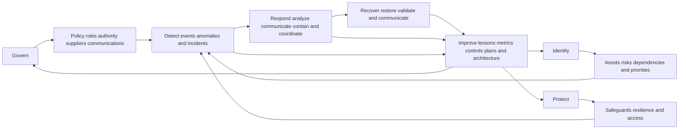
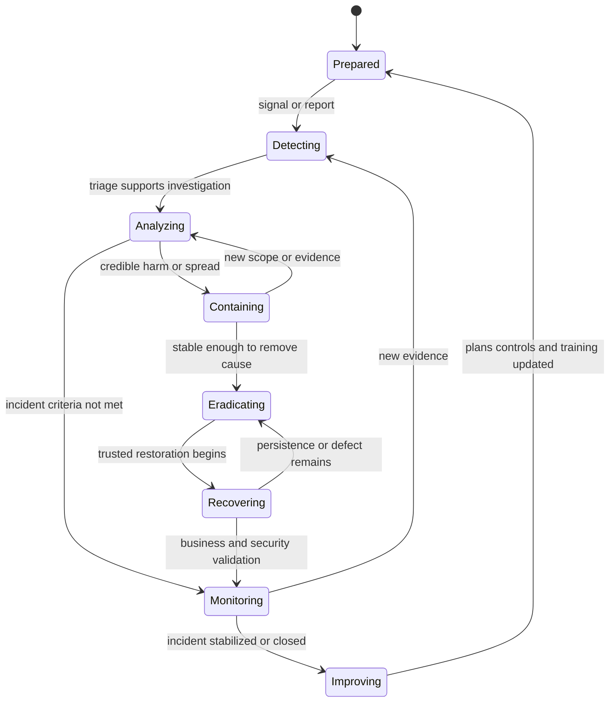
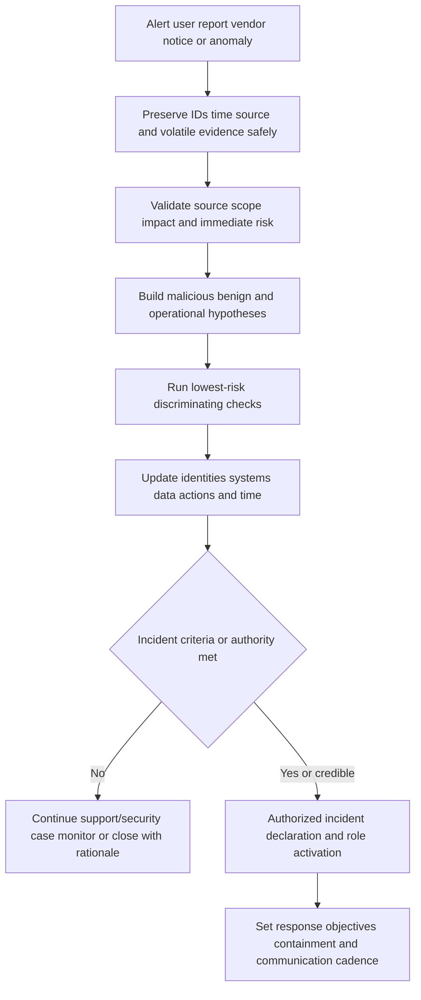
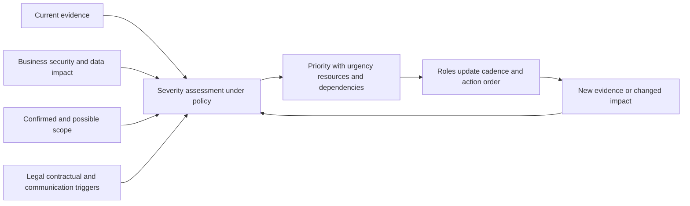
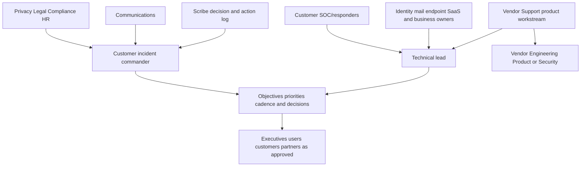
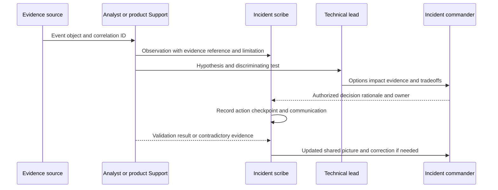
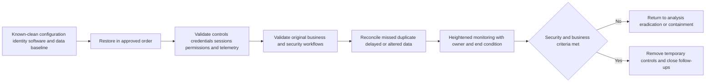
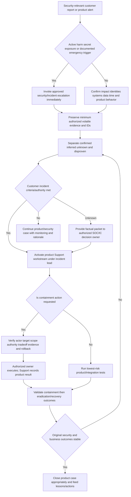
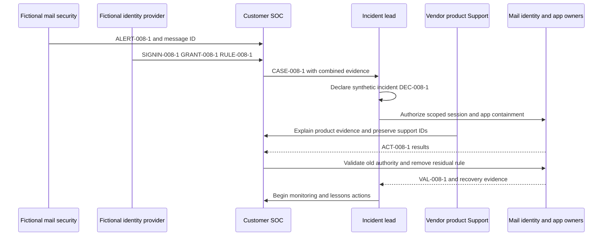

# Part 008 - Incident Response Lifecycle

> **Purpose:** Learn how organizations prepare for, detect, analyze, contain, eradicate, recover from, and learn from cybersecurity incidents while preserving evidence, authority, business context, and customer trust.
>
> **Evidence rule:** Every incident, message, identity, endpoint, event, action, timeline, and artifact in this Part is synthetic. Arti's Microsoft CRITSIT and enterprise-support experience transfers to coordination, communication, escalation, evidence, and validation; it does not establish incident-command, SOC-response, direct email-security, Abnormal AI, legal, or forensic production authority.
>
> **Currency and official-source access date:** August 24, 2026.

## Section Goal

By the end of this Part, Arti should be able to explain incident response as a risk-management capability that exists before, during, and after a cybersecurity incident. She should be able to walk through preparation; detection and analysis; containment; eradication; recovery; and lessons learned/continuous improvement while understanding that real work is iterative rather than a one-way checklist.

She should be able to reference **NIST Special Publication (SP) 800-61 Revision 3**, the current NIST incident-response publication as of the source date, accurately. Revision 3 integrates incident response across the NIST Cybersecurity Framework (CSF) 2.0 functions. **Govern, Identify, and Protect** support preparation and readiness; **Detect, Respond, and Recover** organize core incident activity; **Improve** outcomes feed lessons across all functions. The familiar sequence used in this lesson preserves operational clarity and continuity with older teaching, but it must not be presented as a verbatim list of Rev. 3 phases. NIST SP 800-61 Revision 2, now superseded, used the widely memorized four-phase lifecycle: Preparation; Detection and Analysis; Containment, Eradication, and Recovery; and Post-Incident Activity.

Arti should also be able to distinguish an event, alert, case, suspected incident, and declared incident; describe severity and priority without inventing an employer's matrix; map incident commander, technical lead, SOC analyst, system owner, communications, privacy/legal, business owner, vendor support, Engineering, and scribe roles; preserve evidence and decision logs; compare short-term and long-term containment; explain business tradeoffs; and keep product support separate from customer incident-command authority.

The practical outcome is a **Northstar Incident Timeline and Action-Card Lab**. It produces a synthetic declaration record, severity rationale, normalized timeline, role/RACI map, evidence manifest, phase action cards, decision log, short/long containment comparison, communications set, recovery validation, lessons-learned register, and rubric. It is a tabletop exercise only and performs no live containment or investigation.

## JD Mapping

| Supplied JD signal | Capability developed here | Practical proof |
|---|---|---|
| Enterprise L1 Technical Support Engineer | Recognizes incident signals, protects evidence, escalates, and preserves customer case continuity | Support/incident boundary map |
| Threat investigations | Separates alert triage from incident declaration and builds an evidence-backed timeline | Synthetic incident chronology |
| Behavioral false positives | Avoids declaring incidents or containment from one product verdict | Competing-hypothesis cards |
| Timely customer updates | Uses impact, evidence, actions, owners, uncertainty, and next checkpoint | Incident communication set |
| Root-cause insights and recommendations | Distinguishes trigger, cause, contributing factors, control gaps, and corrective actions | Lessons-learned register |
| Engineering/Product collaboration | Escalates product behavior, telemetry, defect, and validation questions without surrendering continuity | Engineering action card |
| Cloud Email Security | Models suspicious message, mailbox, identity, and remediation evidence | Email-centered incident example |
| SaaS Security | Includes application grants, audit events, tokens, roles, and data access | SaaS containment/recovery example |
| AI Security Agents | Applies approval, action scope, audit, stop, and rollback expectations to automated response | Automation authority card |
| Customer trust | Communicates urgency without speculation and corrects the record as evidence changes | Decision and update logs |
| Security mindset/privacy | Minimizes evidence, protects secrets/content, tracks custody, and routes legal/privacy decisions | Evidence manifest and privacy review |
| Cross-functional culture | Coordinates customer SOC, admins, CSM, Engineering, Product, Security, Legal/Privacy, and executives | RACI and stakeholder map |

## Candidate Honesty Note

| Evidence label | Honest use | Boundary to preserve |
|---|---|---|
| **Production-transfer example** | Arti's CV supports Microsoft enterprise support/escalation, CRITSITs, customer/partner updates, Engineering/Product collaboration, fix validation, KB/training, mentoring, and support analytics | A CRITSIT is not automatically a cybersecurity incident, and coordination experience is not proof of incident-command authority |
| **Working knowledge/upskilling** | Networking, logs, APIs, identity, diagnostic tools, and security fundamentals support incident evidence reasoning | Do not imply production SOC, forensic, EDR, SIEM, SOAR, XDR, or email-threat operations |
| **Local/public lab** | Northstar demonstrates a tabletop timeline, decision log, role map, and action cards | It is not a real incident, live containment, forensic investigation, breach notification, or production response exercise |
| **Learned architecture** | NIST, CISA, and Microsoft official guidance support lifecycle and role concepts | Official-source study does not establish an employer's private severity, playbooks, contracts, or legal duties |
| **No direct experience** | The master records no direct Abnormal AI or email-security operations and no stated incident-commander, privacy, or legal authority | State the gap, then identify the transferable support method and lab |
| **Template only** | Action cards, updates, RACI, and post-incident forms can be adapted under authorization | A template does not prove a real incident or action occurred |

Safe language: “I have worked in Microsoft CRITSIT situations and can transfer structured impact scoping, communication, evidence, cross-team coordination, escalation, and fix validation. I would not call that direct security incident command. In a customer incident, I would follow the authorized response lead, own the product-support workstream, and keep the product case evidence and customer communication accurate.”

## Beginner Term Primer

| Term | Plain meaning | Why it matters | Memory hook |
|---|---|---|---|
| **Cybersecurity event** | An observable occurrence in a system or network | Most events are not incidents | Something happened |
| **Alert** | A notification that detection or policy criteria were met | It asks for attention but is not proof | Attention requested |
| **Incident** | An occurrence that actually or potentially jeopardizes confidentiality, integrity, availability, or policy and requires coordinated handling under the organization's definition | Declaration activates roles, priorities, communications, and records | Credible harm needing coordinated response |
| **Incident response (IR)** | The organized capability for preparing, detecting, analyzing, responding, recovering, and improving | It reduces harm and uncertainty while restoring trusted operation | Prepare, act, recover, improve |
| **Preparation** | Governance, plans, people, access, tools, logging, training, exercises, backups, and relationships established before an incident | Response speed and safety depend on readiness | Build the capability before the alarm |
| **Detection** | Discovering a possible incident through people, tools, or external information | No single source sees everything | Notice a possible problem |
| **Analysis** | Determining what happened, scope, impact, confidence, and next decision | Analysis turns signals into justified action | Evidence into a working picture |
| **Containment** | Limiting ongoing or potential harm and spread | It can disrupt business and evidence, so authority matters | Stop growth, preserve options |
| **Eradication** | Removing the cause, persistence, malicious artifacts, unsafe access, or vulnerable condition from affected scope | Containment is temporary if the underlying condition remains | Remove what enables recurrence |
| **Recovery** | Restoring trusted operation and validating security and business outcomes | “Service is up” does not prove trust or completeness | Restore, validate, monitor |
| **Lessons learned** | Structured review of what happened, why response worked or failed, and what to change | It converts one incident into better future readiness | Learn without blame |
| **Continuous improvement** | Repeatedly updating governance, controls, detection, response, training, and architecture | Improvement is not confined to one final meeting | Feed learning into every function |
| **Incident commander (IC)** | The role coordinating objectives, priorities, roles, decisions, cadence, and shared situational awareness | The IC needs authority and does not have to be the deepest technical expert | Coordinates the whole response |
| **Technical lead** | The role directing technical investigation and response within scope | Technical depth and incident authority are related but different | Leads the technical workstream |
| **Scribe/recorder** | The role maintaining timeline, decisions, actions, owners, and evidence references | Memory and chat history are not reliable incident records | Write what happened and why |
| **Severity** | A classification of current impact and risk under documented criteria | It influences coordination and cadence | How serious is the current condition? |
| **Priority** | The order of work given severity, urgency, obligations, resources, and dependencies | Several severe incidents may compete | What moves first? |
| **Scope** | The identities, devices, messages, data, systems, regions, and time affected or potentially affected | Scope drives containment and communication | How far does it reach? |
| **Indicator** | An observable artifact associated with possible malicious activity | It is a clue, not proof | A clue with context and lifetime |
| **Artifact/evidence item** | Data preserved to support a claim or decision | Integrity, privacy, provenance, and access matter | A referenced piece of the record |
| **Short-term containment** | Immediate temporary action that reduces current harm | It buys time but can affect operation | Stop the bleeding safely |
| **Long-term containment** | A safer interim state maintained while eradication/recovery are prepared | It balances control and business continuity | Stable protection before full repair |
| **Playbook** | A defined set of decision/action steps for a known incident pattern | It supports consistency but cannot replace judgment | Repeatable response with branches |
| **Post-incident review** | A structured review after stabilization/recovery | It should identify systemic improvement, not individual blame | Facts, factors, actions, owners |

## NIST SP 800-61r3 and Terminology Evolution

NIST SP 800-61r3 is titled **Incident Response Recommendations and Considerations for Cybersecurity Risk Management: A CSF 2.0 Community Profile**. It connects incident response to cybersecurity risk management rather than presenting response as an isolated technical cycle.

| Teaching view | Revision 2 familiar lifecycle | Revision 3/CSF 2.0-aligned view | How this Part uses it |
|---|---|---|---|
| Before incident | Preparation | Govern, Identify, and Protect support preparation; improvement informs readiness | Preparation section includes governance, inventory, controls, plans, training, telemetry, and exercises |
| Discover/understand | Detection and Analysis | Detect outcomes and incident analysis within Detect/Respond relationships | Detection and Analysis remains useful operational language |
| Limit/remove/restore | Containment, Eradication, and Recovery | Respond and Recover outcomes, integrated with wider risk management | Separate sections clarify different decisions and evidence |
| After incident | Post-Incident Activity | Improvement is continuous and feeds all CSF functions | Lessons learned and continuous improvement are not postponed indefinitely |

The key interview point is not to argue that one model is “right.” Say:

> “The familiar operational sequence is preparation, detection/analysis, containment, eradication, recovery, and lessons learned. NIST SP 800-61r3 now frames incident response as a CSF 2.0 Community Profile across Govern, Identify, Protect, Detect, Respond, Recover, with improvement feeding the whole system. I use the sequence to explain work while recognizing the current integrated risk-management model.”

**Analogy:** Incident response is like emergency management for a city: planning, mapping assets, building safeguards, detecting trouble, coordinating response, restoring services, and updating codes all belong to one system. The analogy stops because cyber evidence, identities, data copying, cloud responsibility, and attacker adaptation have distinct technical and legal properties.

## Plain-English deep-dive: The Lifecycle Is a Loop, Not a Conveyor Belt

Real incidents move backward and forward. Recovery testing can reveal persistence and return the team to eradication. A containment action can destroy evidence and force new analysis. Lessons learned can begin during the event when a communication or telemetry gap becomes obvious. Preparation continues because responders obtain access, add logging, or bring in vendors while the incident is active.

**Analogy:** The lifecycle is more like navigating with a map than moving along a factory belt. New weather or road evidence can change the route. The analogy stops because incident leaders also make authority, privacy, legal, and business decisions that navigation software does not own.

## Preparation

Preparation establishes the conditions for safe, timely response. It is broader than writing a playbook.

| Preparation area | Questions | Evidence of readiness | Common gap |
|---|---|---|---|
| Governance/authority | Who can declare, contain, communicate, spend, preserve, and accept risk? | Approved plan, delegation, contact/approval matrix | Technical responders lack decision authority |
| Asset/risk context | Which systems, identities, data, dependencies, and business processes are critical? | Current inventory, owners, classifications, architecture | Unknown service or owner expands scope |
| Roles/staffing | Who is IC, technical lead, SOC, support, legal/privacy, communications, business owner, scribe? | On-call roster, alternates, RACI, exercises | One person becomes bottleneck |
| Access/tools | Can responders access logs, systems, backups, cases, communications, and recovery paths safely? | JIT roles, tested accounts, tool health, break-glass tests | Access first tested during incident |
| Telemetry | Are relevant events generated, correlated, retained, and time-synchronized? | Source/field inventory, health, synthetic test, retention | “Logging enabled” but no useful records |
| Evidence handling | Are collection, classification, custody, privacy, storage, and deletion defined? | Templates, repositories, access audits, training | Secrets/content copied into chat |
| Playbooks | Are likely scenarios and decisions documented? | Versioned playbooks with owners, gates, rollback | Checklist has no exceptions or authority |
| Communications | Are internal/customer/executive/regulatory channels and approvals known? | Templates, contact trees, out-of-band channel | Compromised channel remains primary |
| Resilience/recovery | Are backups, clean builds, restore order, and validation tested? | Recovery exercises, integrity checks, business tests | Backup exists but cannot restore |
| External parties | Are cloud, SaaS, legal, insurer, forensics, law enforcement, and vendors pre-coordinated? | Current contacts, contracts, evidence requirements | Procurement begins during crisis |
| Exercises/improvement | Are tabletop and technical exercises scored and corrected? | Findings, owners, target dates, retest | Lessons recorded but not closed |

### Preparation deliverables

- incident-response policy and plan;
- role and escalation matrix;
- system/data/dependency inventory;
- severity and declaration criteria;
- telemetry and retention map;
- secure evidence procedure;
- scenario playbooks and communication templates;
- tested backups and restoration criteria;
- vendor/customer/shared-responsibility contacts;
- exercise and improvement backlog.

## Detection and Analysis

Detection can come from SIEM, EDR, XDR, email security, identity, cloud/SaaS audit, users, partners, vendors, researchers, or law enforcement. Analysis determines whether the signal is valid, its scope and likely impact, what evidence is missing, and which decisions are justified.

### Analysis questions

1. What exactly was observed, by which source, at what event and ingest time?
2. What asset, identity, data, service, or business process is involved?
3. Is the evidence authentic, complete enough, and within retention?
4. What benign, accidental, operational, and malicious explanations exist?
5. What is confirmed, inferred, unknown, and disproven?
6. What is the earliest known and latest known activity?
7. What scope is affected and what scope is merely possible?
8. Is harm active, expanding, contained, or historical?
9. What evidence is at risk of loss?
10. Which authority decides declaration, severity, containment, and communication?

### Incident declaration

Declaration is not a technical synonym for “alert looks serious.” It is an authorized process decision under documented criteria. Criteria can include credible compromise, sensitive-data exposure, critical service impact, active adversary behavior, control failure, contractual/regulatory triggers, or a defined risk threshold. L1 can provide evidence and invoke the escalation path but should not invent criteria.

## Severity, Priority, and Dynamic Reassessment

Severity should combine current or credible impact with scope, data sensitivity, operational consequence, adversary activity, recoverability, and obligations. Priority adds urgency, deadlines, dependencies, and resource conflicts. Product severity is an input, not the customer's incident severity.

| Dimension | Questions | Evidence | Caution |
|---|---|---|---|
| Confidentiality | What data may be accessed or disclosed? | Access events, object scope, classification | Potential access and confirmed access differ |
| Integrity | What data, policy, identity, or evidence may be altered? | Before/after, audit, signature, validation | A workaround may hide altered state |
| Availability | Which business/security functions are unavailable or degraded? | Scope, duration, workaround, dependency | “Service up” can still be unusable |
| Scope | How many identities, systems, messages, tenants, regions? | Entity inventory and timeline | Unknown is not zero |
| Activity | Is harmful activity ongoing, automated, privileged, or spreading? | Recent events, sessions, actions | Silence may be telemetry failure |
| Sensitivity/obligation | Are regulated, contractual, employee, legal, or customer duties implicated? | Classification and specialist guidance | L1 does not interpret law |
| Recoverability | Can trusted service be restored safely and how long? | Backup/restore test, clean state, dependencies | Fast restore can reintroduce cause |
| Business deadline | Which decisions or operations are time-sensitive? | Owner statement and continuity plan | Urgency does not authorize unsafe action |

Never invent a numeric matrix in an interview. Explain the dimensions, say the organization’s documented criteria govern, and show how evidence changes the classification.

## Roles, Decision Rights, and the Support Boundary

| Role | Primary responsibility | Typical decisions | What Support needs from/owes the role |
|---|---|---|---|
| Incident commander | Overall objectives, priorities, roles, cadence, decision integration | Declaration/escalation, workstream priorities, meeting rhythm | Concise product status, impact, dependencies, exact asks |
| Technical lead | Technical investigation and response plan | Hypotheses, evidence priorities, technical sequencing | Product evidence/limits and Engineering path |
| SOC analyst/incident responder | Triage, scope, timeline, containment execution under authority | Security disposition, investigation actions | Product IDs and supported interpretation |
| System/identity/mail owner | Operates customer-controlled systems and access | Configuration, revoke, restore, validation | Exact customer-side action and expected evidence |
| Business owner | Defines operational priorities and acceptable disruption | Continuity choices and business tradeoffs | Technical options, risks, limitations, timing |
| Privacy/Legal/Compliance/HR | Interprets obligations and sensitive decisions | Notification, hold, employee/legal/privacy actions | Minimal factual packet; no speculation |
| Communications | Coordinates approved internal/external messages | Audience, wording, timing, spokesperson | Verified facts, uncertainty, next checkpoint |
| Scribe | Maintains timeline, decisions, owners, evidence references | Record quality and action follow-up | Accurate product-case facts and corrections |
| Vendor Support | Owns product case, supported diagnosis, evidence, updates, escalation | Product guidance and support escalation | Remains within product authority; preserves customer continuity |
| Vendor Engineering/Product/Security | Investigates provider internals, defects, intended behavior, vendor incidents | Provider remediation and customer-safe findings | Receives clean packet; returns limits/validation criteria |

### Support versus incident commander authority

Support can:

- acknowledge and scope the product case;
- preserve and interpret supported product evidence;
- explain documented behavior and limitations;
- troubleshoot configuration and integration boundaries;
- escalate provider-side questions;
- provide supported remediation mechanics;
- maintain customer case updates and validate product outcomes.

Support should not independently:

- declare or close the customer's incident;
- choose enterprise containment priorities;
- disable identities, isolate endpoints, or delete messages without authorized process;
- accept customer risk;
- determine legal notification or employee action;
- attribute an actor;
- promise provider root cause, fix time, or nonrecurrence without evidence.

## Plain-English deep-dive: Incident Command Is Coordination Authority, Not Technical Omniscience

The incident commander does not need to write every query or understand every packet. The role keeps objectives, priorities, decision rights, risks, owners, dependencies, and communications coherent. A technical expert may lead one workstream while the IC resolves business tradeoffs and conflicting actions.

**Analogy:** A film director coordinates the complete production while camera, sound, lighting, acting, and editing specialists own deep craft. The analogy stops because incident command involves security risk, time-critical containment, evidence, legal obligations, and live operational harm.

Support should make the IC's job easier: provide a concise product workstream card, not a flood of case notes. The card should state current impact, confirmed evidence, unknowns, actions complete, next action/owner/time, decision needed, and privacy constraint.

## Evidence and Decision Logging

An incident record must distinguish evidence from interpretation and decisions from actions.

| Record type | Required fields | Example |
|---|---|---|
| Evidence item | ID, source, event/acquisition time, collector, purpose, integrity/provenance, classification, location, limitation | `EV-008-4`: synthetic app grant audit event |
| Observation | Evidence references and exact fact | `APP-8` received mail metadata scope at 10:02 UTC |
| Hypothesis | Proposed explanation and tests | Unauthorized consent may explain metadata access |
| Decision | Time, decision, authority, rationale, evidence, alternatives, risk | Customer IC authorizes session revoke after scope review |
| Action | Owner, exact target/action, start/end, result, errors, rollback | Identity owner revokes `SES-8`; validation event follows |
| Communication | Audience, approver, facts, unknowns, commitments | Executive update at 11:00 UTC |
| Correction | Earlier statement, new evidence, corrected statement | “Body access” corrected to “metadata access only” |

## Plain-English deep-dive: Evidence, Analysis, Decisions, and Actions Are Different Records

Incident pressure encourages people to collapse four statements into one: “The account was compromised, so we disabled it.” A defensible record separates what was observed, what it may mean, who decided, and what actually happened.

**Analogy:** In a courtroom, an exhibit, an expert interpretation, a judge's ruling, and an officer's execution of that ruling are related but not interchangeable. The analogy stops because incident response is an operational risk process rather than a trial, and urgent authorized containment may occur while evidence is incomplete.

| Record | Example | What it must not silently become |
|---|---|---|
| Evidence | Audit event records a new forwarding rule under session `SES-A` | Proof of who physically controlled the session |
| Analysis | Unauthorized session use is a leading hypothesis | Confirmed attribution or root cause |
| Decision | Customer incident lead authorizes revocation because expected harm exceeds disruption | Claim that revocation proves the hypothesis |
| Action | Identity owner submits revoke request `ACT-A`; old session is later denied | Proof that all grants, sessions, and persistence are gone |

The separation permits urgent action without dishonest certainty. A decision can be justified by credible risk even when root cause remains unknown. Conversely, strong evidence does not grant the analyst authority to execute a consequential action. Each record needs its own time, owner, source, rationale, result, and correction path.

This distinction is especially useful for Support. Support may supply product evidence and recommend a supported action, while the customer incident lead authorizes it and the customer system owner executes it. Recording those roles protects both customer autonomy and case continuity.

### Evidence priorities

Evidence can disappear through volatile memory, short retention, log rollover, account deletion, session revocation, system rebuild, or message removal. Preserve what policy and authority allow before changing state. This does not mean collect everything. Work with incident/security/legal owners when evidence may have formal significance.

Part 005's privacy rules remain mandatory: do not place tokens, cookies, private keys, full message content, employee communications, or broad logs into ordinary channels merely because the situation is urgent.

## Containment

Containment reduces current or potential harm while preserving options for analysis, business continuity, eradication, and recovery.

| Containment type | Goal | Examples at a high level | Tradeoff |
|---|---|---|---|
| Immediate/short-term | Stop active spread or access quickly | Revoke a confirmed unsafe session, restrict an app grant, isolate a managed endpoint, block a malicious route under authority | Disruption, evidence loss, attacker awareness, false-positive harm |
| Long-term/interim | Maintain a safer operating state while permanent correction is prepared | Replace broad grant with narrow temporary integration, segmented service path, enhanced monitoring, manual approval | Operational cost, residual risk, exception debt |
| Environmental | Protect unaffected systems/populations | Increase authentication, segment access, preserve logs, communicate indicators under policy | Friction, capacity, privacy, alert volume |
| Evidence-preserving | Limit access while maintaining relevant state | Restrict artifact/repository, snapshot approved state, preserve logs before rebuild | Storage, sensitivity, specialist handling |

### Containment decision factors

1. Confirmed and possible scope.
2. Active versus historical behavior.
3. Asset and data sensitivity.
4. Business impact of the action.
5. Evidence that could be destroyed or altered.
6. Ability to reverse or safely recover.
7. Attacker awareness and possible adaptation.
8. Dependencies and secondary effects.
9. Legal/privacy/contract requirements.
10. Decision authority and communication plan.

## Plain-English deep-dive: Short-Term and Long-Term Containment Solve Different Problems

Short-term containment is like closing a bridge immediately after structural damage is reported. Long-term containment is the controlled detour, weight restriction, monitoring, and temporary repair used while engineers design the permanent fix. The analogy stops because cyber containment may involve identity/session revocation, hidden persistence, copied data, and adversary adaptation.

A fast account disable may stop activity but interrupt critical business work and destroy a useful live session context. A temporary block may push an adversary to another channel. A broad message purge can remove evidence or legitimate mail. The correct choice belongs to authorized incident/customer owners using evidence and business context.

### Containment options card

| Option | Security benefit | Business/evidence cost | Preconditions | Validation | Owner |
|---|---|---|---|---|---|
| Revoke one session | Stops that session's future use | User interruption; may alter evidence | Correct session/identity mapping | Old session denied; legitimate recovery works | Customer identity/SOC owner |
| Disable account | Broadly stops account use | High operational impact; service dependencies | Confirmed account and approved criteria | Access denied; dependent services assessed | Customer identity/IC |
| Restrict app grant | Limits API data/actions | Integration may fail | Scope-to-purpose mapping and rollback | Required calls work; excess calls fail | Customer app/identity owner |
| Isolate endpoint | Limits network communication | User/service outage; recovery complexity | Correct endpoint and EDR authority | Isolation state and approved exceptions verified | Customer endpoint/SOC owner |
| Remove/quarantine messages | Reduces user exposure | Legitimate mail loss and evidence changes | Message IDs, scope, product semantics, approval | Targeted action and residual scope confirmed | Customer mail/SOC owner |
| Increase monitoring | Improves evidence and detection | Privacy, cost, noise, delayed containment | Purpose, data, retention, analyst capacity | Test event and review path work | Security/data owner |

## Eradication

Eradication removes the condition that allows the incident to persist or recur in the affected scope. It can include removing malicious artifacts, revoking credentials/tokens/sessions, deleting unauthorized applications or rules, patching vulnerabilities, correcting configuration, rebuilding systems, resetting trust, and closing persistence paths. Exact action belongs to authorized owners and product procedures.

Eradication needs scope. Removing one inbox rule is insufficient if several accounts or sessions are affected. Resetting a password may not revoke refresh tokens or app grants. Deleting an application does not prove copied data was recovered. Rebuilding an endpoint does not fix a compromised identity.

### Eradication validation table

| Eradication claim | Evidence needed | Common incomplete action |
|---|---|---|
| Unsafe credential removed | Revoke/rotate event, old credential denial, new credential scope and function | Password reset only while sessions remain |
| Persistence removed | Inventory/search of relevant rules/apps/tasks and negative validation | One visible rule deleted |
| Vulnerability corrected | Patch/config version, test, affected population, exceptions | Patch deployed but not applied everywhere |
| Malicious artifact removed | Defined scope, action result, rescan/review, false-positive control | One file quarantined without process/persistence review |
| Unauthorized access closed | Policy/grant state, old/new access tests, logs | Account disabled but service principal remains |
| Provider defect corrected | Fix/build/config evidence, regression test, customer scenario | Engineering says fixed without end-to-end validation |

## Recovery

Recovery restores trusted service and business operation. It includes technical restoration, security validation, data reconciliation, user/business validation, heightened monitoring, communication, and removal of temporary controls.

### Recovery criteria

| Category | Validation question |
|---|---|
| Identity | Are compromised/affected credentials, sessions, grants, roles, and recovery methods trusted? |
| Endpoint/system | Is build/configuration known, patched, scanned/reviewed, and monitored? |
| Data | Is data complete, accurate, reconciled, and accessible only as intended? |
| Service/integration | Do APIs, webhooks, mail flow, queues, and dependencies work without unsafe scope? |
| Detection | Are required sources, parsers, rules, alerts, cases, and ownership operating? |
| Business | Can users perform the original workflow, and are continuity workarounds retired? |
| Monitoring | What conditions, duration, owners, and exit criteria apply? |
| Communication | Who confirms restoration, remaining risk, and follow-up? |

Recovery can be staged. Restore critical clean capabilities first, then lower-priority services. A business owner and IC may accept temporary constraints through authorized governance; Support does not independently accept residual risk.

## Communications and Cadence

Incident communication must be accurate, audience-specific, approved where required, and timed to support decisions. Silence increases uncertainty; premature details can cause harm.

| Audience | Needs | Avoid |
|---|---|---|
| Technical responders | Timeline, evidence, hypotheses, actions, failures, dependencies, next tests | Executive-only summaries without IDs |
| Incident commander | Impact, scope, confidence, options, tradeoffs, owners, decision requests | Raw log dumps |
| Executive/business owner | Business/security impact, trend, continuity, decisions, uncertainty, next checkpoint | Unexplained tool jargon or false ETA |
| Affected users | Approved action, expected behavior, safe steps, support path | Attribution/speculation or sensitive investigation detail |
| Customer admin/SOC | Product evidence, supported actions, limitations, owner, timing | Vendor-internal speculation |
| Privacy/Legal/Compliance | Factual data types, locations, people/systems, access, timing, actions, exact question | Conclusions about duties from Support |
| Vendor Engineering/Product | Repro, expected/actual, IDs, versions, timeline, impact, explicit ask | Unfiltered customer content |
| External/public | Approved verified statement through designated owner | Independent engineer commentary |

### Update structure: FACTOR

- **F - Facts:** What is confirmed and sourced?
- **A - Affected scope and impact:** What is affected, possibly affected, and not affected?
- **C - Controls/actions:** What containment, investigation, or recovery action occurred?
- **T - Tradeoffs and uncertainty:** What remains unknown or risky?
- **O - Owners:** Who owns each next action and decision?
- **R - Return time:** When is the next update or decision checkpoint?

Promise controlled checkpoints, not an uncontrolled resolution time.

## Business Tradeoffs

Incident response is not “security at any cost.” The goal is to reduce total harm while respecting authority and obligations.

| Decision tension | Security side | Business/evidence side | Decision approach |
|---|---|---|---|
| Disable account now | Stops possible access | Interrupts employee/service and may alter evidence | Scope identity, activity, dependencies, alternative containment, authority |
| Isolate endpoint | Limits communication/spread | Stops work and remote administration | Validate target and criticality; preserve recovery path |
| Remove all messages | Reduces exposure | May delete legitimate content/evidence | Use exact IDs/scope, product semantics, approval, validation |
| Take service offline | Stops broad harm | Major availability and customer impact | Compare active harm, segmentation, failover, and continuity |
| Preserve system state | Supports analysis | Harm may continue | Time-box evidence collection under containment authority |
| Increase logging | Improves visibility | Privacy, cost, performance, noise | Define fields, scope, retention, access, and analyst capacity |
| Communicate early | Supports trust/action | Incomplete facts may confuse or trigger obligations | Use approved facts, uncertainty, audience, and update cadence |

## Lessons Learned and Continuous Improvement

A post-incident review should be blameless but accountable. “Blameless” means examining system conditions and decisions without humiliating people; it does not mean ignoring negligence, policy violations, or ownership.

| Review area | Questions | Improvement output |
|---|---|---|
| Detection | Which signal worked, failed, or arrived late? | Data/rule/coverage action |
| Analysis | Which hypothesis/test accelerated or delayed scope? | Triage guide and training |
| Roles | Were authority, handoffs, and on-call coverage clear? | RACI/contact/process change |
| Evidence | Were logs, timestamps, custody, privacy, and retention adequate? | Telemetry and evidence-control action |
| Containment | What reduced harm and what side effects occurred? | Playbook/approval/rollback change |
| Eradication | Was affected scope complete and persistence removed? | Inventory and validation improvement |
| Recovery | Were restore order, trust, data, and business outcomes validated? | Recovery test and monitoring action |
| Communication | Did each audience receive useful, accurate, timely information? | Template/cadence/approval change |
| Suppliers/products | Did shared responsibility or product behavior create delay? | Contract, integration, defect, or product evidence brief |
| Governance | Which policy, risk, legal, privacy, or resource decision was unclear? | Authority and governance update |

Improvement actions need owner, target date, measure, dependency, priority, and retest. “Train users” is incomplete. Specify which behavior, audience, method, owner, and evidence will change. “Add logging” is incomplete. Specify fields, source, retention, alert, access, privacy, and validation.

## Worked Examples

### Worked example 1: Suspicious email plus account activity

**Input:** A synthetic user reports a suspicious message. Identity audit later shows an unrecognized session and a new forwarding rule.

**Detection/analysis:** Preserve message/session/rule IDs and times. Compare user statement, sign-in, session, rule, app grants, endpoint, and mail evidence. Consider legitimate configuration and automation.

**Containment:** Customer SOC/identity/mail owners decide whether to revoke session, restrict account, remove rule, or hold messages. Support explains product evidence and supported action mechanics.

**Eradication:** Remove unauthorized rule/grant, revoke affected authority, correct recovery path, and inspect defined scope.

**Recovery:** Validate user access, legitimate mail flow, rule state, audit, and heightened monitoring.

**Lesson:** Password reset alone may not address session/app persistence. This is a synthetic principle, not an Abnormal workflow.

### Worked example 2: False-positive containment risk

**Input:** One high-severity endpoint alert names a legitimate administration tool on a critical server.

**Reasoning:** High vendor severity does not establish incident severity. Immediate isolation may stop a critical service. Verify process signer/hash/path, command context, operator/change record, device role, surrounding activity, and detection rationale.

**Decision:** If active harm remains credible, the authorized IC/owner balances containment and continuity. A safer short-term option may restrict a specific account/path while preserving service, but exact action depends on policy.

**Lesson:** Delay is also a decision, so record evidence, tradeoff, authority, and checkpoint.

### Worked example 3: Provider integration blind spot

**Input:** Email security produced an alert, but customer SIEM parsing rejected it for forty minutes.

**Analysis:** The incident team must distinguish security activity time from visibility delay. Support traces source, delivery, schema, parse, and case IDs.

**Containment/recovery:** Customer may use product console as temporary visibility while parser is corrected and missed events reconciled. Incident severity depends on actual threat/impact, not merely parser failure.

**Lesson:** Recovery includes backfill/deduplication and detection validation, not only connector green status.

### Worked example 4: Secret in evidence package

**Input:** A live token appears in an incident chat attachment.

**Immediate action:** Stop further sharing, restrict/remove artifact under approved process, route revoke/rotate, preserve minimum access/custody facts, and involve security/privacy as required. Do not use the token.

**Decision log:** Record exposure, actions, authority, uncertainty about use, and investigation owner. Do not call it a breach without evidence/authorized determination.

### Worked example 5: Recovery reveals persistence

**Input:** A restored user signs in successfully, but a previously unknown app grant generates a new audit event.

**Outcome:** Return from recovery to eradication/analysis. Revoke through owner, re-scope grants/sessions, validate monitoring, and correct the recovery checklist. Recovery is iterative.

## Incident-Support Troubleshooting Decision Tree

### Symptom-to-hypothesis-to-test table

| Symptom | Competing hypotheses | Safe discriminating test | Observation | Next action |
|---|---|---|---|---|
| High-severity alert | True attack, legitimate admin, rule issue, stale context | Compare evidence, asset role, change record, surrounding events | Approved admin matches activity | Triage false positive; tune through owner, no containment |
| User reports phish, no alert | Benign, detection/data gap, unsupported path, delay | Trace message ID, route, product evidence, source health | Product never received event | Address integration/coverage and SOC review |
| Session revoked but activity continues | Wrong session, refresh/app authority, delay, clock issue | Join issue/revoke/request/resource times and identities | App token remains active | Customer identity/app owner revokes; re-scope |
| Endpoint isolation “succeeded” | Action applied, queued, wrong target, partial network exception | Check action ID, target, status, endpoint telemetry, approved connectivity test | Action queued but device offline | Mark containment not validated; owner plans alternative |
| Restored service misses events | Backlog, cursor reset, parser, retention, dedupe | Reconcile known source IDs and counts across recovery window | Backlog not replayed | Controlled backfill and duplicate validation |
| Customer asks Support to declare incident | Authority boundary unclear | Ask documented customer process and decision owner | SOC lead available | Supply facts and remain product workstream owner |
| Executive asks for root cause during response | Cause not established; pressure for certainty | Separate trigger, confirmed path, contributing factors, unknowns | Corrective path known, cause pending | Give approved interim explanation and next checkpoint |
| Legal hold mentioned | Ordinary deletion may be unsafe | Route exact request and evidence inventory to Legal/Privacy | Hold scope confirmed by owner | Preserve only directed scope and record access |

## Common Failure Modes

| Failure mode | Why it fails | Safer correction | Escalation trigger |
|---|---|---|---|
| Alert equals incident | Creates false certainty and response harm | Apply criteria and authorized declaration | Credible active harm or policy trigger |
| Incident equals breach | Legal/contract meaning may differ | Use factual incident language and specialist guidance | Notification/regulated-data question |
| Memorizing Rev. 2 as current Rev. 3 wording | Misstates current NIST guidance | Explain terminology evolution and CSF integration | Interview asks current standard |
| Lifecycle as one-way checklist | New evidence invalidates earlier state | Allow loops between analysis, containment, eradication, recovery | Persistence or scope expansion |
| No named IC/decision owner | Technical teams conflict and overstep | Activate authority and role map | High-impact cross-team response |
| Deepest engineer becomes IC automatically | Technical expertise is not coordination authority | Separate IC and technical lead roles | Priorities/communications conflict |
| Severity copied from product | Customer impact and obligations differ | Apply documented customer dimensions | Business/security disagreement |
| Contain first, ask later | Can cause outage, destroy evidence, or target wrong asset | Verify urgent criteria, target, authority, tradeoff | Active threat may still require immediate authorized action |
| Preserve everything | Privacy/cost/noise increase | Preserve purpose-bound volatile and high-value evidence | Formal/legal/forensic need requires specialist |
| Eradication equals password reset | Sessions, grants, rules, devices, and apps may persist | Validate complete affected authority and scope | Continued activity after reset |
| Recovery equals service available | Trust, data, telemetry, and workflow may remain broken | Validate security and business criteria | Persistence, missing data, or control failure |
| Root cause announced early | Workaround or trigger is mistaken for cause | State confirmed facts and causal confidence | Executive/legal communication requires review |
| Update waits for a breakthrough | Stakeholders cannot decide or trust process | Communicate FACTOR at promised cadence | Impact or uncertainty expanding |
| Support acts as customer IC | Exceeds authority and creates liability | Own product workstream and feed authorized response | Customer requests cross-environment command |
| Lessons without owners | Same failures repeat | Assign owner, target, measure, dependency, retest | Critical action overdue |
| Blame-free means accountability-free | Harmful decisions remain unexamined | Analyze conditions and decisions; assign corrective ownership | Policy or misconduct process needed |
| Automation reports partial success as complete | Containment state is false | Track each action/result and require state validation | Consequential action uncertain |

## Northstar Incident Timeline and Action-Card Lab

### Lab purpose

Run a paper-only incident tabletop centered on a fictional email/SaaS identity event. The lab practices current NIST-aware framing, role clarity, severity reasoning, evidence, decisions, containment tradeoffs, recovery, communications, and improvement. It does not execute any technical action.

### Honest artifact label

> **LOCAL/SYNTHETIC TABLETOP - Incident-response reasoning only. No real incident, customer data, live containment, Abnormal AI, direct email-security operation, SOC command, forensic process, legal conclusion, or named security-tool production experience is represented.**

### Prerequisites

1. Private local folder, Markdown/spreadsheet editor, and Mermaid preview or paper drawing tool.
2. This Part's terms, NIST evolution table, role map, FACTOR updates, evidence/decision records, and decision tree.
3. Only the fictional scenario below.
4. No mailbox, identity tenant, endpoint, SaaS account, API, token, link, message, scanner, or response tool.
5. Two to three hours plus a thirty-minute spoken debrief.

### Authorized scope and prohibitions

| Authorized | Prohibited |
|---|---|
| Read and reason about supplied synthetic records | Log into, disable, isolate, delete, quarantine, scan, or alter a real system |
| Create paper action cards and communications | Send test phishing, visit links, use credentials, or call APIs |
| Map support/customer/vendor ownership | Declare a real incident, provide legal advice, or claim forensic custody |
| Use reserved `.invalid` identities only | Use customer, employer, or colleague information |

### Synthetic scenario: Northstar Ledger Lab

Fictional `Northstar Ledger Lab` uses fictional mail, identity, SaaS security, endpoint, SIEM, and case systems. User `finance-a@example.invalid` receives harmless synthetic message `MSG-008-1`. The lab narrative supplies these events:

| Time UTC | ID | Observation |
|---|---|---|
| 09:00 | MSG-008-1 | New-sender invoice-themed synthetic message delivered; no live link or attachment |
| 09:05 | ALERT-008-1 | Email system raises medium-confidence alert |
| 09:12 | SIGNIN-008-1 | User session `SES-008-1` created from new managed device `HOST-008-A` |
| 09:15 | GRANT-008-1 | App `APP-008-1` receives mail-metadata read scope |
| 09:20 | READ-008-1 | App reads metadata for five synthetic messages; no body access supplied |
| 09:24 | RULE-008-1 | Forwarding rule created under `SES-008-1`; user denies creating it |
| 09:27 | CASE-008-1 | Customer SOC opens investigation and assigns incident lead |
| 09:30 | DEC-008-1 | Incident lead declares a synthetic incident based on combined identity/mail evidence |
| 09:35 | ACT-008-1 | Narrative says session and app grant are revoked by authorized owners |
| 09:42 | VAL-008-1 | Old session denied; app call denied; rule remains and is then removed at 09:45 |
| 10:10 | REC-008-1 | Clean user access restored; audit and mail flow validated |

No actor, malware, message-body disclosure, financial loss, or legal notification is established.

### Step 1: Create the NIST framing card

Write one card showing preparation through lessons as the teaching sequence and map each activity to CSF 2.0 Govern, Identify, Protect, Detect, Respond, Recover, and Improve. State that Rev. 2's four-phase model is superseded but still useful historical vocabulary.

### Step 2: Build the declaration record

Record triggering observations, criteria assumption, declaring role, time, scope, confidence, alternatives, initial objectives, severity rationale, and what declaration does not prove. Do not invent a legal breach or actor.

### Step 3: Create a normalized timeline

Include all supplied events plus event time, record time, source, evidence ID, observation, interpretation, confidence, action/owner, and correction field. Add three explicit unknowns: consent authorization, session actor, and body access.

### Step 4: Create the role and RACI map

Include IC, technical lead, SOC analyst, scribe, identity owner, mail owner, app owner, business owner, Privacy/Legal/Compliance, communications, vendor Support, vendor Engineering/Product/Security, and CSM. Map declaration, evidence preservation, session/app containment, rule removal, user communication, product escalation, legal assessment, recovery validation, and lessons.

**Expected evidence:** Vendor Support is not accountable for customer declaration or containment.

### Step 5: Build the evidence manifest

Create records for message alert, sign-in, grant, metadata read, forwarding rule, case, declaration, containment, validation, and recovery. Include source/provenance, time, classification, purpose, access, integrity limitation, and disposition. Exclude message body and credentials.

### Step 6: Write phase action cards

Create six cards: Preparation; Detection/Analysis; Containment; Eradication; Recovery; Lessons/Improve. Each needs objective, entry condition, actions, evidence, decision owner, communication, failure modes, exit/loop condition, and artifacts.

### Step 7: Compare short- and long-term containment

Short-term options: revoke `SES-008-1`, restrict `APP-008-1`, preserve rule evidence. Long-term/interim options: narrow app policy, enhanced grant/rule monitoring, bounded clean access, review similar grants/sessions. For each record benefit, business cost, evidence cost, prerequisites, owner, rollback, and validation.

### Step 8: Maintain the decision log

At least eight decisions must include declaration, severity, evidence preservation, session revoke, app revoke, rule handling, clean access restoration, monitoring period, and closure/improvement transition. Each decision records authority, evidence, alternatives, tradeoff, time, owner, and result.

### Step 9: Write communications

Create:

1. technical responder update;
2. incident commander card;
3. executive update;
4. user-safe instruction;
5. vendor Engineering escalation;
6. CSM/customer-success context note;
7. correction stating metadata access is observed but body access is not.

Every update must preserve the same facts and use a next checkpoint.

### Step 10: Validate eradication and recovery

Require old session denial, app access denial, rule removal, legitimate user sign-in, expected mail flow, audit source health, and monitoring. If any persistence appears, return to analysis/eradication rather than declaring recovery.

### Step 11: Create lessons and actions

At least ten action rows across governance, identity/app policy, mail rule alerts, evidence, logging, playbooks, communications, support escalation, recovery, training, and exercise cadence. Every row needs owner, target, measure, dependency, and retest.

### Step 12: Validation rubric and cleanup

| Dimension | 0 | 2 | 4 |
|---|---|---|---|
| NIST accuracy | Rev. 2 called current | Both mentioned | Rev. 3 CSF integration and terminology evolution precise |
| Declaration/severity | Alert equals incident | Some rationale | Authority, criteria, evidence, uncertainty, dynamic reassessment complete |
| Roles/authority | Support commands response | Roles listed | IC, technical, business, specialist, vendor boundaries precise |
| Timeline/evidence | Narrative only | Main events | Normalized times, IDs, provenance, confidence, corrections complete |
| Decision log | Actions only | Several decisions | Eight or more decisions with authority, tradeoff, evidence, result |
| Containment | One broad action | Short/long listed | Security, business, evidence, rollback, validation compared |
| Eradication/recovery | Service restored | Some validation | Authority, persistence, data, function, telemetry, monitoring complete |
| Communications | One message | Audiences differ | Seven consistent artifacts with facts, uncertainty, owner, checkpoint |
| Lessons | Generic recommendations | Owners present | Ten measurable actions with dependencies and retest |
| Privacy/safety | Real data/live action | Synthetic | Minimum data, no secrets/content, tabletop only, cleanup complete |
| Candidate honesty | CRITSIT called incident command | Gap noted | Production transfer and no-direct-experience boundaries explicit |
| Reproducibility | Missing artifacts | Partial set | Full manifest, sources, score, corrections, and cleanup record |

**Passing target:** 40/48 or higher, with 4s for NIST accuracy, roles/authority, privacy/safety, and candidate honesty. Any live account, endpoint, message, token, link, scanner, containment action, customer data, legal conclusion, or incident-command claim is an automatic failure.

### Required artifacts

| Artifact | Required content | Evidence label |
|---|---|---|
| `nist-framing-card` | Rev. 2/Rev. 3/CSF relationship | Learned architecture |
| `declaration-severity-record` | Evidence, criteria, authority, scope, confidence | Local/synthetic lab |
| `incident-timeline` | All events, interpretations, unknowns, corrections | Local/synthetic lab |
| `roles-raci` | Customer, vendor, business, specialist roles | Template plus local lab |
| `evidence-manifest` | Ten evidence items, privacy, provenance, disposition | Local/synthetic lab |
| `phase-action-cards` | Six cards with loop/exit conditions | Template plus local lab |
| `containment-decision-log` | Short/long comparison and eight decisions | Local/synthetic lab |
| `communications-set` | Seven audience artifacts | Template only |
| `recovery-lessons-register` | Validation and ten improvements | Local/synthetic lab |
| `validation-cleanup` | Rubric, source dates, limitations, deletion | Local/synthetic lab |

### Cleanup and privacy

1. Use only the supplied `.invalid` identity and fictional system/object names.
2. Do not add message body, link target, credentials, IP addresses, malware, or exploit detail.
3. Search files for real names, domains, customer identifiers, tokens, cookies, authorization headers, and employer data.
4. Keep final tabletop artifacts private and local; delete scratch copies.
5. Record reviewer, date, score, corrections, retained items, deletion, and next review.
6. State: “This is a local synthetic tabletop and does not prove incident-response production experience.”

## Official Source Anchors

All sources below were accessed on **August 24, 2026**. Incident guidance, laws, product capabilities, and organizational playbooks change. Current employer/customer policy and authorized specialists govern operational response.

| Official source title or family | URL | Use | Caution |
|---|---|---|---|
| Supplied Abnormal AI Technical Support Engineer JD represented in the master | No public URL supplied | Role, support case, communication, investigation, collaboration signals | No private incident process inferred |
| Arti Thakur tailored CV/master evidence summary | Local supplied source; no public URL | Microsoft CRITSIT/support transfer only | CRITSIT does not equal cybersecurity incident command |
| NIST SP 800-61 Revision 3 | <https://csrc.nist.gov/pubs/sp/800/61/r3/final> | Current incident-response recommendations and CSF 2.0 Community Profile | Use current Rev. 3 framing; do not quote Rev. 2 phases as Rev. 3 structure |
| NIST Cybersecurity Framework 2.0 | <https://www.nist.gov/cyberframework> | Govern, Identify, Protect, Detect, Respond, Recover, and Improve outcomes | A flexible framework, not one employer's incident plan |
| NIST SP 800-61 Revision 2 archive | <https://csrc.nist.gov/pubs/sp/800/61/r2/final> | Historical four-phase lifecycle and terminology evolution | Superseded by Revision 3 |
| Microsoft Incident Response overview | <https://learn.microsoft.com/en-us/security/operations/incident-response-overview> | Official Microsoft incident-response preparation and operational context | Microsoft guidance does not define Abnormal/customer process |
| Microsoft shared responsibility in the cloud | <https://learn.microsoft.com/en-us/azure/security/fundamentals/shared-responsibility> | Provider/customer responsibility context | Exact responsibility depends on service and contract |
| Abnormal Trust Center | <https://abnormal.ai/trust-center> | Official public trust/security source family | No unseen incident commitments or controls are asserted |

### Source discipline

- The current source anchor is NIST SP 800-61r3; Revision 2 is cited only to explain terminology evolution.
- Preparation/detection-analysis/containment/eradication/recovery/lessons is a useful operational teaching sequence, not claimed as Rev. 3's verbatim phase list.
- Northstar Ledger Lab and all systems, events, messages, identities, actions, and outcomes are fictional.
- No Abnormal incident process, SLA, role, containment capability, legal duty, or root-cause practice is invented.
- Arti's production claim remains Microsoft enterprise support/CRITSIT transfer; direct security incident command and email-security operations remain explicit gaps.

## Interview Q&A

### Q1.

**Question:** Walk me through the incident-response lifecycle and explain current NIST terminology.

**Model answer:** Operationally, I explain preparation; detection and analysis; containment; eradication; recovery; and lessons learned/continuous improvement, while expecting loops as evidence changes. NIST SP 800-61 Revision 3 is the current publication and integrates incident response across CSF 2.0: Govern, Identify, and Protect support readiness; Detect, Respond, and Recover organize core outcomes; Improve feeds the whole system. Revision 2's older four-phase lifecycle is historically useful but superseded, so I do not present its wording as the Rev. 3 structure.

### Q2.

**Question:** What is the difference between an alert, a suspected incident, and a declared incident?

**Model answer:** An alert is a product or analytic object requesting attention. A suspected incident is a working hypothesis supported by enough concern to investigate. A declared incident is an authorized process decision that documented criteria are met or credibly at risk, activating roles, priorities, records, communication, and response. Product severity informs triage but does not by itself determine customer incident severity. I preserve evidence, scope impact, and route declaration to the authorized owner.

### Q3.

**Question:** How do short-term and long-term containment differ?

**Model answer:** Short-term containment rapidly limits active harm, such as revoking one unsafe session under authority. Long-term containment establishes a safer interim state while eradication and recovery are prepared, such as a narrow temporary integration, segmentation, monitoring, and approval. I compare security benefit with business disruption, evidence loss, reversibility, attacker adaptation, dependencies, privacy, and recovery. The authorized incident/business owner decides; Support explains product mechanics and validates the result.

### Q4.

**Question:** What is the incident commander's role?

**Model answer:** The incident commander coordinates objectives, priorities, decision rights, workstreams, cadence, tradeoffs, and shared situational awareness. The IC does not need to be the deepest technical expert; a technical lead can direct investigation while the IC resolves priorities and business decisions. As vendor Support, I would provide a concise product workstream card, preserve the product case, and follow the IC's authorized coordination without claiming command over the customer's environment.

### Q5.

**Question:** How do you preserve evidence without collecting too much sensitive data?

**Model answer:** I start from the decisions evidence must support and prioritize volatile, high-value, authorized items. I record source, IDs, event/acquisition time, provenance, classification, access, integrity limitations, and disposition. I use metadata and controlled originals/derivatives before message content, and never collect live tokens, cookies, or private keys for convenience. Formal legal or forensic purpose triggers specialist procedures. Urgency does not remove minimization or privacy obligations.

### Q6.

**Question:** How do you know eradication and recovery are complete?

**Model answer:** Eradication requires evidence that affected credentials, sessions, grants, persistence, artifacts, vulnerabilities, or defects are removed across the scoped population, not only one visible symptom. Recovery then restores a known-trusted state, validates security controls and telemetry, reconciles missed or duplicate data, confirms the original business workflow, monitors for a defined period, and removes temporary controls. New persistence or failed validation returns the team to analysis or eradication.

### Q7.

**Question:** How would you communicate during an incident when root cause is unknown?

**Model answer:** I use facts, affected scope/impact, controls and actions, tradeoffs/uncertainty, owners, and a return time. I distinguish confirmed observations, hypotheses, decisions, and unknowns, and I correct earlier statements promptly. I commit to checkpoints I control rather than a fix time owned by others. Technical responders receive IDs and evidence; executives receive impact, risk, continuity, decisions, and limits; external communication follows the authorized communications/legal process.

### Q8.

**Question:** How does your CRITSIT experience transfer, and where are the boundaries?

**Model answer:** My CV supports Microsoft CRITSIT and enterprise escalation experience, so I can transfer disciplined impact scoping, customer and partner communication, action/owner tracking, Engineering/Product collaboration, fix validation, and knowledge capture. I do not claim that those situations were cybersecurity incidents or that I served as incident commander. I have no direct Abnormal or email-security operations experience. In this role I would own the product-support workstream and learn the customer's and employer's incident process and authority model.

## 30-Second Memory Hooks

- **Current NIST anchor: SP 800-61r3, integrated with CSF 2.0.**
- **Rev. 2's four phases are historical, not current Rev. 3 wording.**
- **Operational sequence: prepare, detect/analyze, contain, eradicate, recover, improve.**
- **The lifecycle loops whenever evidence changes.**
- **Alert requests attention; authorized criteria declare an incident.**
- **Severity describes impact; priority orders work.**
- **Product severity is input, not customer incident severity.**
- **IC coordinates the whole response; technical lead directs technical depth.**
- **Scribe records evidence, decisions, owners, corrections, and time.**
- **Short-term containment stops growth; long-term containment creates a stable interim state.**
- **Containment limits harm; eradication removes the enabling condition.**
- **Recovery restores trust, data, function, telemetry, and monitoring.**
- **A password reset may not revoke sessions, grants, or persistence.**
- **FACTOR: Facts, Affected scope, Controls, Tradeoffs, Owners, Return time.**
- **Support owns product continuity, not customer incident command.**
- **Lessons need owners, measures, dates, dependencies, and retest.**

## Completion Checklist

- [ ] I can define event, alert, incident, incident response, preparation, detection, analysis, containment, eradication, recovery, lessons learned, and continuous improvement.
- [ ] I can explain NIST SP 800-61r3's CSF 2.0-aligned framing accurately.
- [ ] I can describe Revision 2's historical four-phase model without calling it current Revision 3 structure.
- [ ] I can explain why the lifecycle is iterative and give examples of returning from recovery to eradication or containment to analysis.
- [ ] I can distinguish an alert, suspected incident, declared incident, case, severity, and priority.
- [ ] I can assess severity through CIA impact, scope, activity, sensitivity/obligation, recoverability, and business context without inventing a matrix.
- [ ] I can map IC, technical lead, SOC, system owner, business owner, Privacy/Legal/Compliance/HR, communications, scribe, Support, Engineering, Product, and Security roles.
- [ ] I can explain why incident command and technical expertise are different responsibilities.
- [ ] I can preserve evidence through source, IDs, times, provenance, classification, access, integrity limits, custody, and disposition.
- [ ] I can maintain separate observation, hypothesis, decision, action, communication, and correction records.
- [ ] I can compare short-term and long-term containment with security, business, evidence, reversibility, and authority tradeoffs.
- [ ] I can explain why password reset, message removal, endpoint rebuild, or service restoration alone may be incomplete.
- [ ] I can validate eradication across scoped persistence/authority and recovery across identity, system, data, service, detection, business, monitoring, and communication.
- [ ] I can communicate with FACTOR and promise checkpoints rather than unsupported resolution dates.
- [ ] I can create measurable lessons with owners, dates, dependencies, evidence, and retest.
- [ ] I completed all twelve Northstar Incident Timeline and Action-Card Lab steps using only synthetic tabletop data.
- [ ] My lab contains the ten required artifact categories, at least eight decisions, seven communications, ten improvement actions, and complete cleanup.
- [ ] My lab score is at least 40/48, with 4s in NIST accuracy, roles/authority, privacy/safety, and candidate honesty.
- [ ] I performed no live containment, account action, endpoint isolation, message action, API call, scanning, credential use, or suspicious-link access.
- [ ] I tie Arti's experience only to supplied Microsoft support/CRITSIT, communication, escalation, validation, knowledge, analytics, and technical foundations.
- [ ] I explicitly preserve no-direct-experience boundaries for incident command, SOC operations, Abnormal AI, direct email security, and named adjacent tools.
- [ ] I can answer all eight interview questions aloud while naming authority, evidence, tradeoffs, and uncertainty.
- [ ] I revalidated all official sources against the August 24, 2026 access date and kept current guidance, historical terminology, teaching models, and synthetic evidence distinct.

[Next: Part 009 - Safe Support Lab Environment](Part-009-safe-support-lab-environment.md)