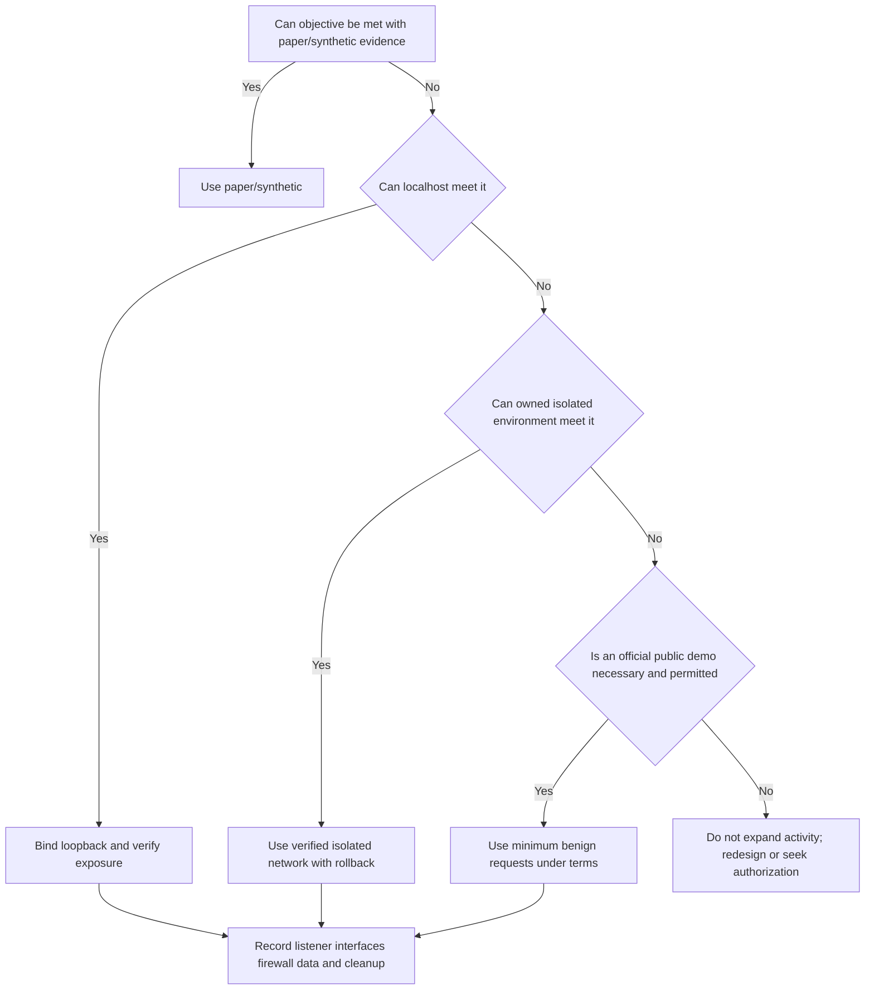
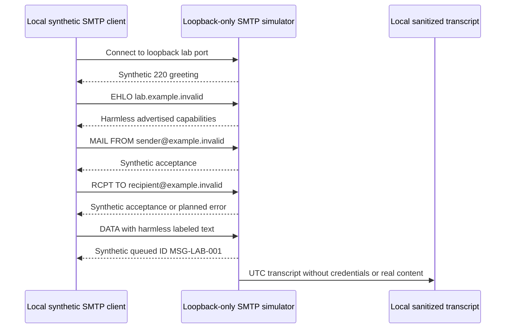
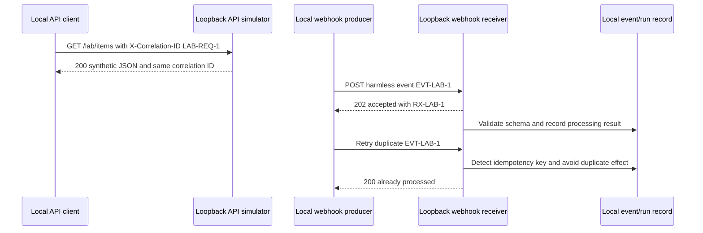
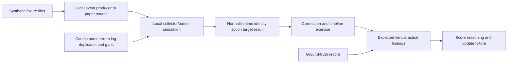
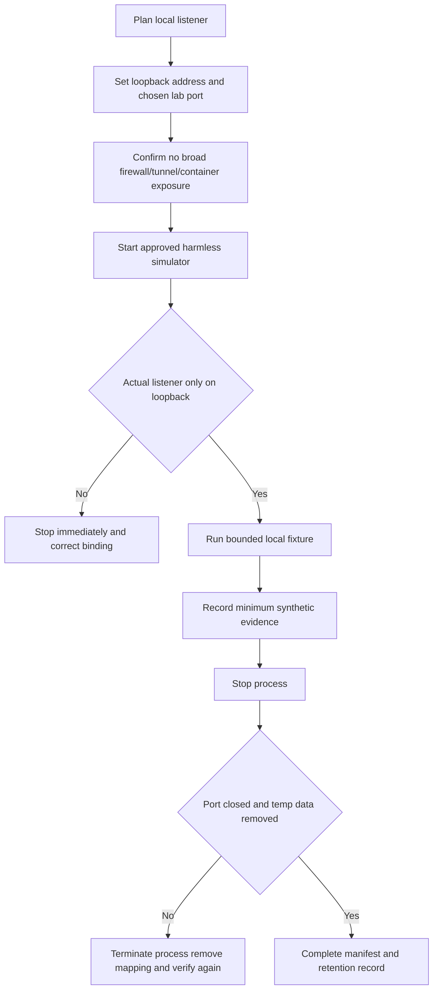
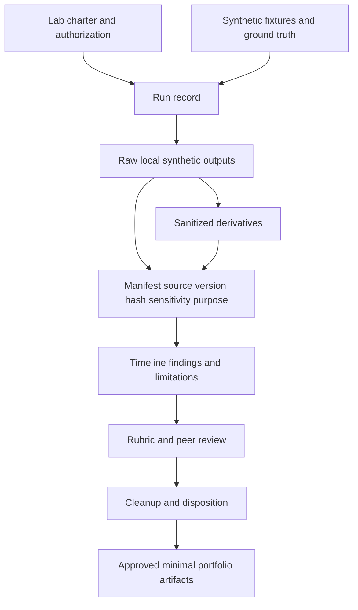
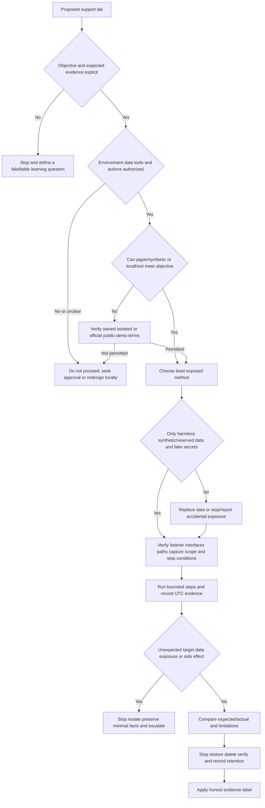
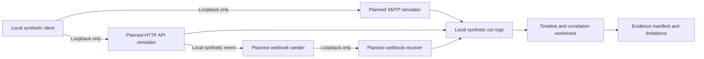

# Part 009 - Safe Support Lab Environment

> **Purpose:** Build repeatable support skills in a deliberately harmless environment where authorization, scope, data, network exposure, tool behavior, evidence, cleanup, retention, and interview claims are controlled before testing begins.
>
> **Evidence rule:** A lab proves only the method and artifact actually completed. Arti's Microsoft enterprise support background is production evidence within its stated CV scope; every environment designed here is local/public/synthetic practice and does not establish Abnormal AI, direct email-security, named security-tool, penetration-testing, or production administration experience.
>
> **Currency and official-source access date:** August 24, 2026.

## Section Goal

By the end of this Part, Arti should be able to design a support lab before selecting commands or tools. She should be able to state the learning objective, authority, in-scope systems, prohibited activity, data classification, network boundaries, safety controls, evidence plan, success criteria, stop conditions, retention, cleanup, and honest-experience label.

She should be able to choose among **isolated**, **local**, **public**, and **synthetic** methods; use harmless reserved example domains and documentation Internet Protocol (IP) addresses correctly; and understand that reserved addresses are writing aids, not targets to probe. She should be able to plan local Simple Mail Transfer Protocol (SMTP), Hypertext Transfer Protocol (HTTP) Application Programming Interface (API), webhook, Domain Name System (DNS), and log simulations without sending phishing, visiting malicious content, scanning third parties, bypassing controls, or exposing a listener to an untrusted network.

She should be able to handle secrets, personal information, message content, logs, packet/HTTP captures, screenshots, timestamps, time zones, identifiers, manifests, hashes, versions, and transformations safely. She should make a lab reproducible by recording prerequisites, exact inputs, expected and actual results, environment/version details, limitations, and cleanup. She should clearly label whether an artifact is a **production-transfer example**, **local/public lab**, **learned architecture**, or **template only**.

The practical outcome is a **Harbor Glass Safe-Lab Charter and Artifact Design Lab**. It creates a tabletop charter, exposure decision, synthetic data dictionary, local simulation topology, evidence manifest design, timestamp/correlation convention, artifact directory plan, run record, stop/cleanup checklist, retention review, risk register, and validation rubric. The exercise designs the environment; it creates no additional workspace files, starts no service, and contacts no network target.

## JD Mapping

| Supplied JD signal | Capability developed here | Practical proof |
|---|---|---|
| Enterprise L1 Technical Support Engineer | Builds reproducible, bounded investigations that another engineer can review | Lab charter and run record |
| Configuration tickets | Creates safe affected/control comparisons and records exact environment state | Environment and input matrix |
| API questions | Plans localhost APIs and webhooks using fake keys, harmless payloads, IDs, retries, and errors | Local API/webhook topology |
| Behavioral false-positive cases | Uses synthetic records with known ground truth rather than customer data | Synthetic evidence set |
| Threat investigations | Practices timelines, provenance, manifests, and privacy without live threats | Evidence and timestamp plan |
| Cloud Email Security | Uses local/paper SMTP and synthetic raw messages only | Local SMTP simulation design |
| SaaS Security | Models tenant, identity, roles, webhooks, audit, and permissions without a production tenant | Fictional SaaS environment map |
| Networking and diagnostics | Uses loopback, reserved documentation ranges, local captures, and explicit listener boundaries | Exposure decision tree |
| REST, Postman, cURL, JSON | Defines safe localhost/public-demo use with fake secrets and sanitization | Request/response artifact design |
| Wireshark, HAR, Fiddler, Procmon, Netsh | Controls capture scope, sensitive fields, process impact, storage, and cleanup | Tool-safety matrix |
| Continuous learning | Turns each gap into an objective, exercise, artifact, spoken proof, feedback, and correction | Reproducibility rubric |
| Intellectual honesty | Prevents lab artifacts from becoming production claims | Evidence-tier labels and claim audit |

## Candidate Honesty Note

| Evidence tier | Honest statement | Boundary to preserve |
|---|---|---|
| **Production-transfer example** | Arti's CV-supported Microsoft enterprise support, CRITSITs, customer/partner communication, Engineering/Product escalation, fix validation, KB/training, mentoring, and support analytics can inform lab goals and interview examples | Do not place invented case details or production data in a lab; do not broaden workload/tool claims beyond the master |
| **Local/public lab** | Arti designed or completed a bounded exercise using localhost, reserved/public-safe data, and inspectable artifacts | It is not customer operation, Abnormal use, email-security operations, or production scale |
| **Learned architecture** | Arti can explain an official documented product/protocol flow she has not operated | A diagram or reading note is not hands-on experience |
| **No direct experience** | Abnormal AI, direct email-security operations, Google Workspace, Slack, Okta, Splunk, CrowdStrike, Cortex SOAR, Zendesk, Salesforce, Jira, and Zoom remain no-direct-production-experience boundaries unless separately supported later | A vendor-neutral simulation cannot silently become named-product experience |
| **Template only** | A lab charter, runbook, data dictionary, or directory design exists for future authorized use | A template is not evidence that the lab ran or produced the expected output |

Safe interview language: “I have not used that platform in production. I built a local synthetic lab for the underlying behavior, documented the inputs, evidence, limitations, and cleanup, and can show the artifact. That demonstrates my troubleshooting method, not product operation.”

## Beginner Term Primer

| Term | Plain meaning | Why it matters | Memory hook |
|---|---|---|---|
| **Lab** | A controlled environment for learning, testing, and observing defined behavior | A lab separates practice from customer impact | Controlled place, explicit purpose |
| **Authorization** | Verified permission to use systems, data, tools, and actions | Ownership of a laptop does not authorize probing other systems | Permission before activity |
| **Scope** | Exact systems, interfaces, data, time, actions, and objectives allowed | Vague scope expands risk | Name what is in and out |
| **Isolation** | Separation that prevents lab activity from affecting external or production systems | Mistakes remain contained | Keep consequences inside the box |
| **Localhost/loopback** | A network destination that refers back to the same host, commonly `127.0.0.1` or `::1` | It supports local client/server practice without external traffic when bound correctly | Talk to the same machine |
| **Local network** | Devices reachable within a private network segment | A local listener may still be visible to other devices | Local is not automatically isolated |
| **Public service** | A third-party Internet service deliberately offered for public/demo use under terms | Useful for benign learning only when purpose and policy permit | Publicly reachable does not mean permissionless |
| **Synthetic data** | Invented data designed to resemble needed structure without representing real people or systems | It provides known ground truth and protects privacy | Realistic structure, fictional meaning |
| **Reserved domain** | A domain reserved for documentation/examples, such as `example.com`, `example.net`, `example.org`, and `.invalid` names | It avoids accidental use of another party's real domain | Examples that should not become targets |
| **Documentation IP address** | An address range reserved for examples, such as IPv4 TEST-NET blocks or IPv6 `2001:db8::/32` | It is safe in diagrams but not a reachable service to scan | Write it; do not probe it |
| **Listener** | A local process waiting for connections on an address and port | Binding choice determines who can reach the lab service | Who can connect to this port? |
| **Port** | A numbered endpoint used by transport protocols to direct traffic to an application | Local API/SMTP simulators need controlled ports | Address finds host; port finds process |
| **SMTP** | Simple Mail Transfer Protocol, used to transfer email between systems | Local transcript practice teaches envelope and response concepts | Mail transfer conversation |
| **API** | Application Programming Interface, a contract for software requests and responses | Local APIs support safe HTTP/JSON troubleshooting | A software-to-software agreement |
| **Webhook** | An HTTP request sent when an event occurs | Local receivers teach delivery, retries, signatures, and idempotency | Event calls you |
| **Fixture** | A fixed input prepared for a repeatable test | Fixtures make runs comparable | Same input, comparable result |
| **Ground truth** | The known intended facts of a synthetic scenario | It lets the learner measure false conclusions | The answer built into the test |
| **Artifact** | A saved output that supports what happened and what was learned | Screenshots alone are weaker than a structured package | Inspectable proof of the method |
| **Manifest** | An inventory of artifacts, sources, purpose, versions, integrity, sensitivity, and disposition | It prevents orphan files and hidden copies | The index of evidence |
| **Correlation ID** | A stable identifier joining one request/event across components | It enables timelines without message content | One thread through many systems |
| **UTC** | Coordinated Universal Time, a common reference for timestamps | It prevents time-zone confusion | Normalize first, localize later |
| **Reproducibility** | Another person can repeat the lab under stated conditions and compare results | It converts “I saw it” into verifiable learning | Same setup, same expected observation |
| **Idempotency** | Repeating an operation has the intended single effect rather than harmful duplicates | Webhook/API retries should not create duplicate cases/actions | Safe repeat, one intended outcome |
| **Cleanup** | Stopping services, removing temporary data, revoking permissions, and restoring the starting state | A lab is not safe if it leaves listeners or secrets behind | End where you intended |
| **Retention** | How long artifacts remain and why | Learning value must be balanced against exposure | Keep with purpose and review |
| **Stop condition** | A predefined signal that testing must pause or end | It prevents curiosity from widening scope | Know when to stop before starting |

## The Safe-Lab Lifecycle

```mermaid
flowchart LR
    Goal[Define learning or diagnostic objective] --> Authority[Confirm authorization and ownership]
    Authority --> Scope[Set in-scope and prohibited actions]
    Scope --> Design[Choose isolated local public or synthetic design]
    Design --> Data[Create harmless data and secret policy]
    Data --> Risk[Review exposure privacy tool and cleanup risks]
    Risk --> Plan[Define steps expected evidence stop and rollback]
    Plan --> Run[Execute only authorized bounded actions]
    Run --> Record[Capture UTC results manifests and limitations]
    Record --> Validate[Compare expected and actual; peer/rubric review]
    Validate --> Cleanup[Stop listeners delete scratch data restore state]
    Cleanup --> Retain[Retain approved sanitized artifacts and review date]
    Retain --> Claim[Apply honest experience label]
```



The first tool action comes after the objective, authority, scope, data, and risk plan. This order is a safety control and a diagnostic quality control.

**Analogy:** A safe lab is like a cooking test kitchen: ingredients, equipment, allergies, recipe, expected result, cleanup, and tasters are known before service. The analogy stops because networking tools can affect systems beyond one room, and digital data can be copied or exposed invisibly.

## Plain-English deep-dive: Ownership Does Not Equal Authorization

Owning a laptop or home router gives some control, but it does not authorize activity against every device reachable from it, an employer-managed endpoint, a neighbor's network, a public cloud account, or a vendor service. Terms of service, employment policy, account ownership, consent, data rights, and law still apply.

| Situation | Likely safe starting point | Required caution |
|---|---|---|
| Personal machine with local text files | Paper/synthetic exercises | Check backup/sync/privacy and avoid real employer/customer data |
| Personal machine with localhost listener | Bind to loopback; verify no external interface | Host firewall and tool defaults can expose services |
| Home private network | Prefer loopback or isolated virtual network | Other household/IoT devices are not automatic test targets |
| Employer-managed machine | Follow employer policy and approved tools | Administrative control belongs to employer; do not install/listen/capture without approval |
| Trial SaaS tenant | Use only if terms and owner authorize exact test | No abuse, load, phishing, scanning, or production data |
| Public demo API | Follow published documentation and rate limits | “Public” does not permit stress, security testing, or secret submission |
| Another person's system | Do not test without explicit authorization and scope | Verbal ambiguity is not enough for risky activity |

**Analogy:** Owning a flashlight lets you test it in your room; it does not authorize shining it through every neighbor's window. The analogy stops because network effects and contractual boundaries are more complex than physical property lines.

### Authorization record

Every lab charter should state:

- owner of the environment;
- person authorizing the activity;
- permitted systems/addresses/ports/accounts;
- permitted data;
- permitted tools/actions;
- start/end window;
- prohibited actions;
- stop/contact/escalation path;
- evidence storage and retention;
- cleanup and verification owner.

For personal, local, paper-only practice, the record can be brief. For any employer, customer, shared, or public environment, use the actual approval process; this guide cannot grant permission.

## Isolated, Local, Public, and Synthetic Designs

| Design | Meaning | Best use | Main risk | Default recommendation |
|---|---|---|---|---|
| Paper/synthetic | No service runs; reason from invented records | Threat models, timelines, logs, cases, evidence, decision trees | Overstating realism or operation | Safest starting point |
| Isolated virtual/container network | Components run without route to external/untrusted networks | Multi-service API/queue simulations | Misconfigured bridge, shared folders, image provenance | Use only with tool competence and verified isolation |
| Localhost | Client and server bind to same machine loopback | HTTP/API/webhook/SMTP transcript and capture | Listener binds all interfaces or logs secrets | Strong default for simple protocol practice |
| Private lab network | Dedicated owned devices/segment | Path, DNS, packet, multi-host learning | Accidental reach to household/corporate devices | Use explicit segmentation and authorization |
| Public safe service | Documented public test/demo endpoint | DNS/HTTP/TLS observation under terms | Rate limits, terms, data disclosure, availability | Use only when local cannot teach objective |
| Production/customer | Real business environment | Operational support under formal process only | Customer/security/privacy impact | Never use for unsanctioned learning |



The hierarchy is not absolute, but it encourages the least exposed method capable of producing the needed observation.

## Harmless Domains, Addresses, Identities, and Data

### Reserved names and addresses

| Resource | Safe documentation use | Important limitation |
|---|---|---|
| `example.com`, `example.net`, `example.org` | Illustrative domains in prose and configurations | Do not treat them as owned test infrastructure or send unsolicited traffic |
| Names ending `.invalid` | Clearly non-resolving fictional identities such as `user@example.invalid` | Some validators may reject them; that is useful to document |
| IPv4 `192.0.2.0/24` | TEST-NET-1 diagrams and sample logs | Documentation only; not a listener target |
| IPv4 `198.51.100.0/24` | TEST-NET-2 diagrams and sample logs | Documentation only; not a target to scan |
| IPv4 `203.0.113.0/24` | TEST-NET-3 diagrams and sample logs | Documentation only; not evidence of a real route |
| IPv6 `2001:db8::/32` | Documentation addresses | Not a real lab network unless locally simulated under control |
| IPv4 loopback `127.0.0.0/8` | Same-host local communication, commonly `127.0.0.1` | Binding/listener configuration still needs verification |
| IPv6 loopback `::1` | Same-host IPv6 local communication | Dual-stack tools may bind more broadly than expected |

Never invent a random domain or public IP and assume it is unused. Use official reserved values in artifacts. Do not scan reserved/documentation blocks; their purpose is clear examples, not interactive test services.

### Synthetic data design

Useful synthetic data preserves structure and edge cases without copying real people or incidents.

| Data type | Synthetic pattern | Ground truth to record | Avoid |
|---|---|---|---|
| User identities | `analyst-a@example.invalid` | Role, expected access, no real person | Real names or employer patterns |
| Tenant/customer | `TENANT-LAB-A` | Fictional owner and purpose | Production-like tenant GUID copied from screenshots |
| Messages | `MSG-LAB-001`, harmless scheduling text | Expected route/auth/verdict in simulator | Real lure language, payloads, credentials, customer content |
| API keys | `KEY-NOT-REAL-001` | Must always be rejected or treated as placeholder | Random realistic high-entropy strings |
| Tokens/cookies | `[REDACTED-LAB-TOKEN]` | No usable authority | Signed JWT-like values that might be mistaken for real |
| IPs/domains | Reserved ranges and `.invalid` | Documentation-only semantics | Random public targets |
| Logs | Invented events with known IDs and UTC times | Exact sequence and expected correlation | Modified customer logs with residual identifiers |
| Files | Plain harmless text with clear label | Expected hash/size if needed | Executables, macros, malware, real attachments |

## Plain-English deep-dive: Synthetic Data Needs Ground Truth, Not Just Fake Names

Replacing a real name with `User A` does not automatically make a good lab. The scenario should state what actually happened so the learner can score interpretation. If the test is a false positive, record that the activity is benign. If the test is a schema mismatch, record the producer and consumer versions. Without ground truth, the learner may practice confident guessing.

**Analogy:** A flight simulator needs known weather, aircraft state, and expected instrument behavior. Painting a real aircraft's name over does not create a controlled scenario. The analogy stops because software labs can validate protocols exactly while human behavior and security verdicts remain probabilistic.

### Ground-truth record

| Field | Example |
|---|---|
| Scenario objective | Correlate one webhook delivery across producer and receiver |
| True cause | Consumer accepts HTTP then rejects schema version |
| Benign/malicious status | Entire scenario benign |
| Expected evidence | Delivery ID, request ID, `202`, parse error, schema versions |
| Deliberate distractor | New user role unrelated to failure |
| Information intentionally absent | No message body or credential |
| Correct conclusion | Transport succeeded; downstream processing failed |
| Prohibited conclusion | “Vendor breach” or “message attack” |

## Local SMTP Simulation Design

SMTP practice should remain local and harmless. The goal is to learn roles, envelope commands, responses, timestamps, and logs, not to send mail to a real recipient or test deliverability/reputation.



### SMTP lab safety controls

| Control | Purpose |
|---|---|
| Bind to loopback only | Prevent external systems from using the listener |
| Use a non-privileged lab port | Avoid collision and administrative exposure |
| Verify listening addresses before test | Catch accidental `0.0.0.0` or `::` binding |
| Disable relay/external delivery | Guarantee messages remain local |
| Use `.invalid` addresses | Prevent accidental real recipients |
| Use harmless plain text | Avoid phishing/malware content |
| No authentication secrets | Credentials are irrelevant to basic transcript learning |
| Record start/stop and process ID | Support cleanup and provenance |
| Capture only loopback lab traffic | Avoid unrelated user/application data |
| Stop and verify port closure | Ensure no persistent listener remains |

The design can be executed later only with an approved local simulator and current official documentation. This Part does not require installing or running one.

## Local API and Webhook Simulation Design

A local API can return planned status codes and correlation IDs. A local webhook sender/receiver can demonstrate delivery, acceptance versus processing, duplicate handling, retries, ordering, and signatures using obviously fake shared values. Do not expose the receiver through a public tunnel unless a future lab explicitly authorizes and secures it; localhost is sufficient for foundational learning.



### Planned API/webhook cases

| Case | Safe input | Expected response | Learning |
|---|---|---|---|
| Success | Synthetic GET and ID | `200` with stable JSON | Basic request/response and correlation |
| Validation error | Missing harmless required field | `400` with structured details | Client input versus service failure |
| Unauthenticated placeholder | No fake auth header | `401` | Authentication category without credentials |
| Unauthorized lab role | `role=reader` attempts fictional write | `403` | Authentication versus authorization |
| Missing object | `ITEM-LAB-404` | `404` | Resource identity and contract |
| Rate limit | Predetermined request count in local simulator | `429` plus synthetic retry guidance | Backoff planning without load testing |
| Server error | Explicit simulator flag | `500` with correlation ID | Evidence and retry decision |
| Webhook accepted/failed processing | `202`, then local schema error | Separate transport and processing | Acceptance is not completion |
| Duplicate delivery | Same `EVT-LAB-1` | Single intended processing result | Idempotency |
| Out-of-order events | Sequence 2 then 1 | Buffered/reconciled or explicit failure | Ordering assumptions |

Never generate a denial-of-service condition to observe `429`; configure the simulator to return it deterministically. Never use a real API key as a “fake” placeholder.

## Synthetic Log Simulation

Logs should have known schemas and ground truth. Create event fixtures with source event time, ingest time, system, event ID, correlation ID, actor alias, action, target, result, severity, and scenario label. Include deliberate clock skew, duplicates, missing fields, parse errors, and delayed ingestion as data-quality exercises.



### Minimal structured event

```json
{
  "scenario": "SAFE-LAB-009",
  "event_id": "EVT-LAB-001",
  "correlation_id": "CORR-LAB-001",
  "event_time_utc": "2026-08-24T10:00:00.000Z",
  "ingest_time_utc": "2026-08-24T10:00:02.000Z",
  "actor": "analyst-a@example.invalid",
  "action": "synthetic_export_request",
  "target": "ITEM-LAB-001",
  "result": "denied_by_lab_role",
  "ground_truth": "benign_authorization_test"
}
```

This JSON is a harmless fixture, not proof that a file should be created in this task.

## Secret, Privacy, and Evidence Safety

| Data/artifact | Safe lab rule | Validation |
|---|---|---|
| API key/token/cookie/password | Use obvious placeholders only; never valid values | Search for authorization headers and high-entropy strings |
| Email/message | Use `.invalid` identities and harmless labeled content | No real names, links, attachments, or realistic lure |
| HAR/HTTP capture | Generate only from local simulator; sanitize headers/body | Inspect as recipient; search hidden fields |
| Packet capture | Capture loopback or isolated owned interface only | Confirm interface/filter and absence of unrelated traffic |
| Process/file trace | Limit to local lab process and short window | Review for username, paths, unrelated applications |
| Screenshot | Show only synthetic window; close notifications/tabs | Check metadata, title bars, taskbar, background |
| Logs | Use fixtures with ground truth | Validate schema, timestamps, IDs, and no copied production lines |
| Voice/video | Prefer local and optional; no private case stories | Check upload behavior and delete unsafe takes |
| AI assistance | Use synthetic prompts in approved tool only | No customer/employer data; human verification recorded |

Part 005's evidence rules apply fully. If real data appears, stop the lab, isolate the artifact, follow applicable reporting/deletion policy, and recreate the exercise from clean synthetic inputs.

## Plain-English deep-dive: A Local Listener Can Still Be Publicly Reachable

“Running on my computer” does not mean “reachable only by me.” A server may bind to all IPv4 interfaces (`0.0.0.0`) or all IPv6 interfaces (`::`), a host firewall rule may permit inbound traffic, a container may publish a port, a cloud development environment may expose a preview URL, or a tunnel may create a public endpoint.

**Analogy:** Opening a shop inside your house is not private if the front door and sign invite anyone in. The analogy stops because network bindings, NAT, firewalls, virtual switches, and tunnels can create paths that are not physically visible.

Before a listener starts, define the expected address and port. After start, inspect the actual listening address using an approved local system tool. Test only from the intended local client. After stop, verify the port is closed. Do not configure public tunnels for convenience in foundational labs.



## Tool Safety Matrix

| Tool/category | Safe use | Sensitive output | Stop condition |
|---|---|---|---|
| Browser DevTools/HAR | Localhost synthetic page/API only | Cookies, authorization, query data, body, local paths | Unrelated production tab/request appears |
| Fiddler/proxy | Explicit local synthetic process and short window | Decrypted content, credentials, all-app traffic | Capture includes unrelated apps or trust-store change is unclear |
| Wireshark/tcpdump | Loopback or owned isolated interface with narrow filter | Other users/apps, addresses, TLS metadata | Wrong interface or broad traffic appears |
| Netsh trace | Approved personal/local lab and bounded scenario | System-wide network metadata | Employer-managed machine or unrelated traffic included |
| Procmon | Filter to local lab process, short capture | User paths, registry, other processes | Filters fail or capture grows uncontrolled |
| Postman/cURL/PowerShell | Localhost or documented safe public API, fake values | Environment variables, history, exported secrets | Real secret or unintended host appears |
| OpenSSL/TLS client | Localhost or authorized public observation | Hostnames, certificates, command history | Any attempt to bypass or stress a service |
| DNS tools | Reserved/public records through normal lookups | Resolver/internal names in output | Query targets internal/employer data without approval |
| SMTP simulator | Loopback only, no relay/delivery | Message content and addresses | Listener exposed beyond loopback or external delivery attempted |
| Log/query tools | Synthetic fixtures only | Identifiers, hidden source data | Production export or customer record introduced |
| AI assistant | Synthetic, non-sensitive prompts under approved policy | Prompt retention and generated false claims | Real customer/employer data or secret appears |

Tool capability is not permission. Capture and proxy tools can observe more than intended. Installations can modify certificate stores, network settings, drivers, firewall rules, startup items, or trust. Use current official documentation, understand changes, and prefer paper/local methods when setup risk exceeds learning value.

## Reproducibility and Run Records

A reproducible lab tells another learner what should happen and why.

| Run-record field | Required content |
|---|---|
| Lab ID/title | Stable name and revision |
| Objective | One or more decisions/skills to demonstrate |
| Authorization/scope | Owner, environment, interfaces, data, time, prohibited actions |
| Prerequisites | OS/tool versions, permissions, files/fixtures, ports |
| Initial state | Services stopped, port free, fixture version, cleanup baseline |
| Inputs | Exact synthetic values and ground truth |
| Steps | Ordered actions with expected observation and stop condition |
| Actual results | UTC time, outputs, IDs, differences, screenshots/logs if needed |
| Interpretation | What evidence supports, alternatives, limitations |
| Cleanup | Processes stopped, ports closed, temp files removed, settings restored |
| Retention | Artifacts kept, class, location, owner, review/delete date |
| Claim label | Production-transfer, local/public lab, learned architecture, or template only |

```mermaid
flowchart LR
    Version[Record environment and fixture versions] --> Baseline[Verify initial state]
    Baseline --> Input[Apply exact synthetic input]
    Input --> Observe[Record expected and actual UTC observations]
    Observe --> IDs[Capture correlation IDs and artifact references]
    IDs --> Compare[Compare run with prior/control]
    Compare --> Limit[Document differences assumptions and limits]
    Limit --> Cleanup[Restore baseline and verify]
    Cleanup --> Peer[Peer/rubric reproduction]
    Peer --> Revise[Correct instructions or model]
```



### Expected versus actual

Do not edit the expected result after seeing the output without recording the change. If expectation was wrong, that is learning. Record:

- original expectation and source;
- actual result;
- whether environment, version, assumption, or implementation explains difference;
- correction made;
- rerun result;
- remaining limitation.

## Timestamps, Time Zones, and Correlation IDs

Use ISO 8601 UTC timestamps such as `2026-08-24T10:00:00.000Z` in lab artifacts. Preserve source-native time too if conversion is part of the exercise. Record clock source and deliberate skew. Do not sort events using displayed local strings alone.

| Time concept | Meaning | Lab rule |
|---|---|---|
| Event time | When source says activity occurred | Preserve original and UTC-normalized value |
| Ingest time | When collector received/indexed it | Keep separate to analyze delay |
| Processing time | When parser/rule/playbook acted | Record for pipeline latency |
| Observation time | When learner saw or recorded it | Do not substitute for event time |
| Clock skew | Difference between source clocks | Inject deliberately only in synthetic fixtures and label it |
| Precision | Seconds/milliseconds available | Do not invent precision missing from source |
| Time zone | Offset/context for local display | Normalize to UTC and retain offset/source |

Correlation IDs should be stable, obviously synthetic, and distinct by object type: `REQ-LAB-001`, `MSG-LAB-001`, `EVT-LAB-001`, `CASE-LAB-001`. Reuse an ID only when it represents the same object; use parent/child links for related objects.

## Evidence Manifests and Artifact Design



### Manifest fields

| Field | Purpose |
|---|---|
| Artifact ID/name | Stable reference |
| Lab/run ID | Connects artifact to execution |
| Source/creator | Establishes provenance |
| Created/acquired UTC | Supports timeline |
| Tool/version | Supports reproducibility |
| Input/fixture version | Identifies ground truth |
| Original/derivative | Distinguishes transformed output |
| Transformations | Records redaction, normalization, filtering |
| Size/hash where useful | Supports byte consistency, not truth |
| Classification/sensitivity | Drives handling |
| Purpose/claim supported | Prevents orphan evidence |
| Access/location | Supports custody and cleanup |
| Limitation | Prevents overclaiming |
| Retention/disposition | Completes lifecycle |
| Honest evidence label | Prevents production-claim drift |

### Conceptual artifact directory design

The following is a design to include in the lesson artifact, not a request to create these files now:

```text
SAFE-LAB-009/
  00-charter/
  01-sources-and-ground-truth/
  02-config-and-environment/
  03-raw-synthetic-evidence/
  04-sanitized-evidence/
  05-analysis-and-timeline/
  06-communications-and-escalation/
  07-validation-and-review/
  08-cleanup-and-retention/
  manifest.md
  README.md
```

Do not put secrets in filenames. Use sequence numbers, stable IDs, and ASCII names. Keep raw and sanitized evidence separate. A public portfolio should normally contain only approved synthetic/sanitized derivatives, analysis, and limitations, not raw captures.

## Plain-English deep-dive: Reproducible Does Not Mean Production-Equivalent

A local API can accurately demonstrate HTTP status handling, JSON parsing, correlation IDs, retries, and idempotency. It cannot prove how a production vendor authenticates, scales, stores data, enforces tenant boundaries, or responds internally. A local SMTP transcript can teach protocol states but not global deliverability or a named cloud provider's filtering.

**Analogy:** A wind-tunnel model teaches airflow principles without becoming a commercial aircraft. The analogy stops because some software protocols can be reproduced exactly while service-scale, security, and organizational behavior remain absent.

State both value and limit:

> “The lab reproduced the HTTP client/receiver contract and showed that `202` acceptance can precede a schema-processing failure. It did not use Abnormal, Splunk, a production webhook, or customer data, and it does not establish those products' behavior.”

## Cleanup, Retention, and Exit Criteria

| Cleanup area | Action | Verification |
|---|---|---|
| Processes/listeners | Stop local service and child processes | Port/listener absent and process exited |
| Containers/VMs | Stop/remove lab resources according to design | No published ports, running instance, or unexpected network |
| Firewall/proxy/trust | Restore temporary settings and certificate trust | Before/after comparison and normal traffic check |
| Credentials/placeholders | Confirm no real values; remove temporary fake configs if unnecessary | Secret scan and environment review |
| Captures/logs | Delete scratch/raw copies not retained | Manifest disposition and filesystem review |
| Browser/tool state | Clear lab cookies/history/environment variables as designed | New clean run begins without prior state |
| Temp files/cache | Remove generated output and backups | Search expected locations |
| Public/trial resources | Delete/revoke only if a future authorized lab created them | Provider confirmation and owner record |
| Documentation | Record deviations, failures, cleanup time, and residuals | Reviewer can identify final state |

Retention needs a review date. Keep sanitized artifacts only while they support learning or a private portfolio. Delete raw synthetic captures when they add no value. Never retain accidental real data as “useful evidence.” Follow applicable policy and report it.

## Troubleshooting Decision Tree for Lab Safety



### Symptom-to-hypothesis-to-test table

| Symptom | Safety hypothesis | Cheap local check | Observation | Next action |
|---|---|---|---|---|
| Listener reachable from another device | Bound all interfaces, firewall/tunnel exposure | Inspect local binding and configuration | `0.0.0.0` instead of loopback | Stop immediately; correct binding; review access logs |
| Capture contains unrelated traffic | Wrong interface/filter or system-wide proxy | Inspect first packets/requests before continuing | Production browser request appears | Stop, isolate/delete/report per policy, narrow scope |
| Secret-like value in artifact | Real environment variable/history copied | Compare source and placeholder convention without using value | Unknown high-entropy token exists | Restrict artifact; follow secret process; recreate clean lab |
| Re-run produces different result | Version, state, cache, clock, random input, port conflict | Compare manifest and initial-state checklist | Old event remained in store | Improve reset/cleanup and rerun |
| `202` but no processed event | Receiver accepted transport then schema/queue failed | Correlate delivery/request/processing IDs | Local schema rejection | Fix fixture/consumer contract; keep acceptance distinction |
| `429` test creates high CPU/network | Load used instead of deterministic simulator response | Stop and inspect planned method | Repeated request loop running | Terminate; redesign to configured response, not stress |
| Reserved IP fails connection | Documentation address treated as service | Review RFC purpose | No route/service | Use loopback simulator; never scan reserved range |
| Screenshot leaks username/path | Window/background/metadata not sanitized | View as recipient and inspect properties | Real profile name visible | Delete unsafe export; create synthetic/clean screenshot |
| Cleanup says stopped but port remains | Child process/container still listening | Inspect listener/process mapping locally | Child process active | Terminate safely; remove mapping; verify again |
| Lab sounds like production in notes | Evidence label/limitations absent | Read only first paragraph | Vendor operation implied | Add label, actual environment, exact limit, and no-direct-experience statement |

## Common Failure Modes and Unsafe Shortcuts

| Failure mode | Why it is unsafe or misleading | Safer correction | Automatic stop/escalation |
|---|---|---|---|
| Tool before objective | Activity generates noise without a decision | Write goal, hypothesis, expected evidence first | Scope cannot be stated |
| “My device, my permission” | Other systems/data/policies remain outside authority | Use local synthetic scope and written owner record | Employer/customer/third-party asset involved |
| Binding to all interfaces | Exposes lab service to network | Bind loopback and verify actual listener | Unexpected inbound access |
| Public tunnel for convenience | Creates Internet exposure and terms/security burden | Keep foundational receiver local | Public endpoint accidentally created |
| Random public IP/domain as target | Could affect or implicate another party | Use reserved documentation values only | Any scan/probe proposed |
| Sending a test phish | Creates harm, policy, and consent risk | Use paper/local harmless message fixture | Real recipient or deliverability test proposed |
| Realistic fake credential | Can be mistaken for real or trigger scanners | Use `TOKEN-NOT-REAL` placeholders | Unknown secret-like value appears |
| Production data with names replaced | Residual context and identifiers remain | Generate data from scratch with ground truth | Customer/employer source used |
| Broad packet/HAR capture | Collects unrelated secrets/content | Loopback, narrow process/interface, short window | Unrelated traffic appears |
| Stress to create errors | Becomes load testing/denial of service | Configure deterministic local status/error | Resource spike or external traffic |
| Disabling firewall/security | Weakens the host beyond the lab | Design around controls or use approved isolation | Bypass requested |
| Unverified package/image | Supply-chain and privilege risk | Prefer existing approved tools and official sources | Unknown privileged installer required |
| No cleanup verification | Leaves listener, trust, data, or config behind | Baseline comparison and port/process check | Final state cannot be confirmed |
| Screenshot-only proof | Omits inputs, versions, IDs, and limitations | Use run record, raw/sanitized evidence, manifest | Reproduction impossible |
| Expected result rewritten silently | Hides incorrect assumptions | Preserve original expectation and correction | Claim depends on altered record |
| Lab equals named-product experience | Misrepresents capability | State protocol/category lab and product gap | Interview artifact overclaims |
| Artifact uploaded publicly | May expose identity, paths, or future risky reuse | Keep private by default; share minimal sanitized outputs | Accidental public disclosure |
| No retention review | Artifacts accumulate indefinitely | Set owner, purpose, review, and deletion | Accidental real data retained |

## Harbor Glass Safe-Lab Charter and Artifact Design Lab

### Lab purpose

Design, but do not start, a reusable safe environment for future local SMTP, API, webhook, and log exercises. The name “Harbor Glass” emphasizes a sheltered environment whose flows and evidence are visible. This task remains paper-only so it creates exactly this Part file and no additional workspace artifacts.

### Honest artifact label

> **TEMPLATE PLUS LOCAL/SYNTHETIC DESIGN - No service was started and no network activity occurred. This charter does not prove Abnormal AI, direct email-security, named-tool, production, penetration-testing, or incident-response experience.**

### Prerequisites

1. This Part and Parts 005-008.
2. A Markdown/spreadsheet editor and Mermaid preview or paper drawing tool.
3. Knowledge of the personal device's ownership and policy; if uncertain, keep the design paper-only.
4. Reserved names and addresses from official RFC/IANA sources.
5. No tools, packages, listeners, virtual machines, containers, cloud trials, or credentials are required.
6. Sixty to ninety minutes for design and thirty minutes for review.

### Authorized scope

| Area | In scope | Out of scope |
|---|---|---|
| Activity | Charter, diagrams, schemas, fixture examples, artifact layout, risk/cleanup plan | Starting a service, sending packets, installing software, changing firewall/trust |
| Data | Invented `.invalid` identities, documentation IPs in diagrams, obvious fake secrets | Customer/employer data, real domains/IPs, messages, logs, credentials |
| Future design | Loopback-only SMTP/API/webhook and local fixtures | Public listeners, tunnels, mail delivery, scans, phishing, bypass, malware |
| Claims | Template and learned architecture | Completed lab, product operation, production equivalence |

### Step 1: Write the charter

Include lab ID `SAFE-LAB-009`, owner, objective, authority, start/end condition, environment, in/out scope, data rules, prohibited actions, expected evidence, stop conditions, cleanup, retention, reviewer, and honest label.

**Pass condition:** Another person can identify what is forbidden without asking.

### Step 2: Define four learning objectives

1. SMTP: distinguish envelope commands, response classes, and local queued ID.
2. API: correlate a harmless request/response and distinguish `401`, `403`, `404`, `429`, and `500` through deterministic fixtures.
3. Webhook: separate HTTP acceptance from downstream processing and handle duplicate event ID idempotently.
4. Logs: normalize event/ingest time and correlate one ID across producer, receiver, parser, and case.

Each objective needs an expected artifact and limitation.

### Step 3: Draw the proposed local topology



Label every planned listener “not started,” loopback-only, no relay, no public tunnel, and no production connectivity claim.

### Step 4: Create the synthetic data dictionary

Include at least twenty fields: lab/run ID, message ID, sender, recipient, request ID, correlation ID, event ID, case ID, event/ingest/processing time, actor, role, action, target, result, status, schema version, retry count, idempotency key, ground truth, and classification. Define types, allowed values, null behavior, sensitivity, and example.

### Step 5: Define fixture catalog

Create conceptual fixtures for SMTP success/temporary error/permanent error; API success and five error classes; webhook accepted/process-fail/duplicate/out-of-order; logs with clock skew/duplicate/missing field/parse failure. Every fixture must state harmless input, exact ground truth, expected evidence, and prohibited conclusion.

### Step 6: Design evidence manifest and run record

Use the manifest/run fields in this Part. Include planned original and sanitized derivatives, tool/version placeholders, hashes only where useful, and explicit statement that hash does not prove source truth.

### Step 7: Design the artifact directory

Use the conceptual directory above. For each directory, state allowed content, prohibited content, access, retention, and publication rule. The raw directory remains private; portfolio output is synthetic/sanitized only.

### Step 8: Build risk register

At least ten risks: listener exposure, public tunnel, secret leakage, real-data contamination, broad capture, tool installation side effects, package supply chain, stale process, firewall/trust change, public upload, overclaiming, and missing cleanup. Record likelihood/impact qualitatively, controls, owner, stop trigger, and verification.

### Step 9: Write future run steps

For each simulation, define preflight, start, listener verification, input, expected observation, artifact, stop, cleanup, and postflight. Do not include commands in this Part; future tool-specific Parts can supply current approved commands.

### Step 10: Create stop and incident card

Immediate stop conditions:

- listener is not loopback-only;
- any external traffic appears;
- any real credential or customer/employer data appears;
- tool changes trust/firewall/system state unexpectedly;
- CPU/network load grows outside design;
- a public link/tunnel is created;
- a step requires scanning, bypass, phishing, or suspicious content;
- cleanup cannot restore baseline.

Record isolate, preserve minimum facts, notify appropriate owner, delete/report under policy, and redesign. Do not investigate accidental real exposure beyond authorization.

### Step 11: Define cleanup and retention

Create before/after checks for processes, listeners, ports, firewall/proxy/trust, files, captures, tool state, browser state, temporary data, and repository copies. Set a ninety-day learning review for sanitized artifacts as a lab-design choice, not a universal policy; delete sooner when purpose ends. Any real data follows applicable policy, not this illustrative period.

### Step 12: Validation rubric

| Dimension | 0 | 2 | 4 |
|---|---|---|---|
| Authorization/scope | Missing | Personal/local implied | Owner, systems, actions, data, time, prohibitions, stop path explicit |
| Least exposure | Public design | Local but unverified | Paper first, loopback next, isolation/public only with justification |
| Synthetic data | Fake names only | Mostly invented | Ground truth, reserved values, no residual production structure |
| Secret/privacy safety | Realistic secrets/data allowed | Warnings present | Obvious placeholders, minimization, scans/review, incident card |
| SMTP design | External delivery possible | Local concept | Loopback, no relay, harmless data, transcript, cleanup complete |
| API/webhook design | Live target | Local basic | Deterministic errors, IDs, idempotency, acceptance/processing separation |
| Log/time design | Unstructured | IDs and UTC | Event/ingest/processing times, skew, schema, ground truth, health |
| Evidence/reproducibility | Screenshots only | Steps and outputs | Charter, versions, fixtures, run record, manifest, expected/actual, limits |
| Tool safety | Capability equals permission | Some tool cautions | Interface/process scope, side effects, stop conditions, approval complete |
| Cleanup/retention | None | Delete files | Baseline restore, listener verification, disposition, owner/review complete |
| Honesty labels | Lab sounds production | Label present | Four evidence tiers and named-tool gaps audited throughout |
| Admin compliance | Additional files/services created | Paper design | Exactly one lesson file created; no service/network activity |

**Passing target:** 42/48 or higher, with 4s in authorization/scope, least exposure, secret/privacy safety, cleanup/retention, honesty labels, and admin compliance. Any live listener, external traffic, additional workspace file, real data, real credential, scan, phishing activity, bypass, public tunnel, or production claim is an automatic failure for this design exercise.

### Required artifacts inside the lesson exercise

These are sections of the conceptual design, not files to create now.

| Artifact design | Required content | Honest label |
|---|---|---|
| Lab charter | Objective, authority, scope, prohibitions, stop, cleanup | Template only |
| Objective matrix | Four protocols/flows, evidence, limitation | Learned architecture |
| Local topology | Loopback-only planned components and boundaries | Template only |
| Data dictionary | Twenty fields, types, examples, sensitivity, ground truth | Local/synthetic design |
| Fixture catalog | SMTP/API/webhook/log cases | Local/synthetic design |
| Run/manifest schema | Provenance, versions, expected/actual, disposition | Template only |
| Directory design | Allowed/prohibited content, access, retention | Template only |
| Risk register | Twelve or more safety/claim risks and controls | Local/synthetic design |
| Stop/cleanup cards | Halt, isolation, baseline restore, verification | Template only |
| Validation record | Score, reviewer, corrections, no-activity assertion | Local/synthetic design |

### Cleanup and privacy

1. Confirm no tool/service was started and no network action occurred.
2. Search the lesson artifacts for real names, domains, IPs, email addresses, tokens, customer/employer identifiers, and local user paths.
3. Confirm all examples use official reserved values or obvious fictional labels.
4. Delete scratch notes outside the intended guide workflow if they contain accidental real context.
5. Record that no additional workspace files were created for the lab.
6. Retain only this lesson as the approved design artifact.

## Official Source Anchors

All sources below were accessed on **August 24, 2026**. Protocol standards and vendor tools evolve; use current official documentation before any later execution.

| Official source title or family | URL | Use | Caution |
|---|---|---|---|
| Supplied Abnormal AI Technical Support Engineer JD represented in the master | No public URL supplied | Role and lab/learning relevance | No private product or lab process inferred |
| Arti Thakur tailored CV/master evidence summary | Local supplied source; no public URL | Production-transfer boundaries and tool-familiarity context | No unsupported production use inferred |
| RFC 2606, Reserved Top Level DNS Names | <https://www.rfc-editor.org/rfc/rfc2606> | Reserved example domains | Reserved names are not owned test services |
| IANA Example Domains | <https://www.iana.org/help/example-domains> | Official explanation of example domains | Ordinary browsing does not authorize testing unrelated services |
| RFC 5737, IPv4 Address Blocks Reserved for Documentation | <https://www.rfc-editor.org/rfc/rfc5737> | TEST-NET IPv4 ranges | Documentation ranges are not scan targets |
| RFC 3849, IPv6 Address Prefix Reserved for Documentation | <https://www.rfc-editor.org/rfc/rfc3849> | IPv6 documentation prefix | Not evidence of a reachable service |
| RFC 5321, Simple Mail Transfer Protocol | <https://www.rfc-editor.org/rfc/rfc5321> | SMTP roles, commands, and response semantics | A local simulator does not reproduce cloud deliverability/security behavior |
| RFC 9110, HTTP Semantics | <https://www.rfc-editor.org/rfc/rfc9110> | HTTP methods/status semantics for local API design | Application-specific contracts still govern behavior |
| NIST SP 800-115, Technical Guide to Information Security Testing and Assessment | <https://csrc.nist.gov/pubs/sp/800/115/final> | Planning, authorization, rules, execution, and reporting discipline | It does not authorize testing; scope and current methods must be governed |
| NIST SP 800-53 Revision 5 | <https://csrc.nist.gov/pubs/sp/800/53/r5/upd1/final> | Access, audit, configuration, media, privacy, and lifecycle control context | Controls require organizational tailoring |
| Microsoft Learn, Azure security best practices for secrets | <https://learn.microsoft.com/en-us/azure/security/fundamentals/secrets-best-practices> | Secret-handling principles | Azure specifics do not define every local tool |
| Wireshark User's Guide | <https://www.wireshark.org/docs/wsug_html_chunked/> | Official capture/filter/tool documentation family | Capture only authorized interfaces/data and revalidate current version |

### Source discipline

- Reserved domains and IPs are documentation resources, not interactive targets.
- RFCs define protocols and reserved values; local simulations do not prove a named SaaS implementation.
- NIST planning guidance does not grant authorization for testing.
- Harbor Glass is design-only, and no files beyond this requested Part should be inferred.
- Arti's named-tool familiarity remains bounded by the supplied CV/master; Abnormal and adjacent named platforms remain explicit no-direct-experience areas.

## Interview Q&A

### Q1.

**Question:** What makes a support lab safe?

**Model answer:** Safety starts before tools: a defined learning objective, verified authority, explicit in/out scope, least-exposed environment, harmless synthetic data, prohibited actions, risk and privacy controls, expected evidence, stop conditions, cleanup, retention, and an honest claim label. I prefer paper or synthetic work first, then loopback, then isolated owned systems only if necessary. I verify listeners and captures, never use real secrets or customer data, and finish by restoring the baseline and recording limitations.

### Q2.

**Question:** What is the difference between isolated, local, public, and synthetic practice?

**Model answer:** Synthetic practice uses invented records and may run no service. Localhost runs client and service on the same host through loopback. An isolated environment runs components within a deliberately separated owned network or virtual boundary. Public practice uses an official public/demo service under its terms and only when needed. Each step increases exposure and authorization burden. “Local” is not automatically isolated, and “public” is not permission to scan, stress, or send sensitive data.

### Q3.

**Question:** Which domains and IP addresses should you use in examples?

**Model answer:** I use official reserved example names such as `example.com`, `example.net`, `example.org`, or `.invalid` identities, and documentation ranges such as `192.0.2.0/24`, `198.51.100.0/24`, `203.0.113.0/24`, and IPv6 `2001:db8::/32`. They are for documentation, not targets to connect to or scan. For an actual local service I use loopback such as `127.0.0.1` or `::1` and verify the listener is not bound externally.

### Q4.

**Question:** How would you safely simulate SMTP, an API, and a webhook?

**Model answer:** I would use approved local simulators bound to loopback only, no external mail relay or public tunnel, reserved identities, harmless text/JSON, obvious fake secrets, and deterministic status/error fixtures. SMTP would capture a local transcript only. The API would return planned statuses and correlation IDs. The webhook would separate transport acceptance from processing and test duplicate handling with an idempotency key. I would inspect the binding, capture only local traffic, stop the processes, verify ports close, and retain sanitized artifacts.

### Q5.

**Question:** How do you make a lab reproducible?

**Model answer:** I record lab and run IDs, objective, scope, prerequisites, OS/tool and fixture versions, initial state, exact inputs, ground truth, ordered steps, expected observations, actual UTC results, correlation IDs, artifacts, interpretation, limitations, cleanup, retention, and evidence label. I preserve the original expectation when results differ and document the correction. Another person should be able to repeat the run and understand why a difference occurred.

### Q6.

**Question:** What safety risks do HAR, packet, proxy, and process captures create?

**Model answer:** They can collect authorization headers, cookies, message bodies, query data, unrelated applications, user paths, internal hostnames, and other people's traffic. I scope the interface or process, use a short local synthetic window, verify filters early, avoid system-wide decryption or trust changes unless explicitly approved, store evidence privately, and stop immediately if unrelated or real data appears. Tool capability never substitutes for authorization.

### Q7.

**Question:** Why are cleanup and retention part of the lab rather than administrative afterthoughts?

**Model answer:** A listener, firewall rule, proxy, certificate, container port, temporary file, cookie, or capture can create risk after the learning step ends. Cleanup restores the baseline and verifies processes and ports are closed, settings restored, and scratch data removed. Retention keeps only sanitized artifacts that still have a purpose, with owner and review/delete date. A lab is not complete while its side effects or uncontrolled copies remain.

### Q8.

**Question:** How would you describe your lab experience without overstating it?

**Model answer:** I name the environment and limit first: “This was a localhost synthetic lab, not production and not the named vendor.” Then I describe the protocol or method, exact fixture, artifact, observation, and what it does not prove. My Microsoft enterprise support experience is separate production-transfer evidence. I do not claim Abnormal, email-security operations, Splunk, CrowdStrike, Cortex SOAR, or other named platforms from a vendor-neutral simulation.

## 30-Second Memory Hooks

- **Objective and authority before tools.**
- **Scope names systems, data, actions, time, and prohibitions.**
- **Paper first, loopback next, isolation/public only with need and permission.**
- **Local is not automatically isolated.**
- **`0.0.0.0` or `::` may expose a listener beyond the host.**
- **Reserved addresses are for writing, not scanning.**
- **Synthetic data needs known ground truth.**
- **Use obvious fake secrets, never realistic placeholders.**
- **No phishing, scanning, bypass, stress, or suspicious content.**
- **Deterministic `429` is safer than generating load.**
- **Event time, ingest time, processing time, and observation time differ.**
- **A manifest prevents orphan evidence and hidden copies.**
- **Preserve expected, record actual, explain the difference.**
- **Cleanup restores baseline and verifies it.**
- **Retention needs purpose, owner, review, and deletion.**
- **A local simulation proves method, not vendor or production behavior.**

## Completion Checklist

- [ ] I can define authorization, scope, isolation, localhost, public service, synthetic data, reserved domain/IP, listener, fixture, ground truth, manifest, correlation ID, reproducibility, cleanup, retention, and stop condition.
- [ ] I can explain why device ownership does not authorize third-party, employer, customer, or shared-system testing.
- [ ] I can choose the least-exposed design that satisfies a stated learning objective.
- [ ] I can use `.invalid`, official example domains, TEST-NET IPv4 ranges, and `2001:db8::/32` correctly as documentation values.
- [ ] I will never scan or probe documentation ranges or random public domains/IPs.
- [ ] I can design loopback-only SMTP, API, webhook, and log simulations without running them in this Part.
- [ ] I can explain why SMTP relay/delivery, public tunnels, phishing, scanning, bypass, and stress testing are prohibited here.
- [ ] I can create synthetic identities, messages, events, logs, and fake secrets with explicit ground truth.
- [ ] I can prevent a local listener from binding externally and verify closure after use.
- [ ] I can scope DevTools/HAR, Fiddler/proxy, packet, Netsh, Procmon, API, DNS, SMTP, and AI-tool usage safely.
- [ ] I can distinguish event, ingest, processing, and observation timestamps and use UTC consistently.
- [ ] I can design stable message, request, event, correlation, and case IDs.
- [ ] I can produce a run record with versions, initial state, inputs, expected/actual, artifacts, interpretation, limitations, cleanup, and retention.
- [ ] I can explain why a hash supports byte consistency but not truth, authorization, or completeness.
- [ ] I can separate raw synthetic evidence, sanitized derivatives, analysis, communications, validation, and cleanup records.
- [ ] I can execute the lab-safety decision tree and stop immediately for unexpected exposure, real data, secrets, side effects, or out-of-scope action.
- [ ] I completed all twelve Harbor Glass design steps inside this lesson without creating another file or starting a service.
- [ ] My design includes four objectives, twenty data fields, SMTP/API/webhook/log fixtures, at least ten risks, directory plan, stop card, cleanup, and retention.
- [ ] My score is at least 42/48, with 4s in authorization/scope, least exposure, secret/privacy safety, cleanup/retention, honesty, and admin compliance.
- [ ] I can apply the exact evidence label production-transfer, local/public lab, learned architecture, or template only.
- [ ] I preserve explicit no-direct-experience boundaries for Abnormal AI, direct email security, and all named adjacent tools.
- [ ] I can explain a planned lab in five minutes and state exactly what it would and would not prove.
- [ ] I revalidated official sources against the August 24, 2026 access date and kept protocol standards, vendor guidance, teaching design, and candidate evidence separate.

[Next: Part 010 - Security Support Vocabulary Personas and System Maps](Part-010-security-support-vocabulary-personas-and-system-maps.md)