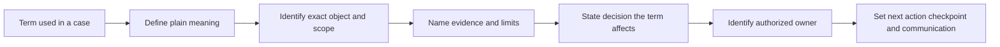
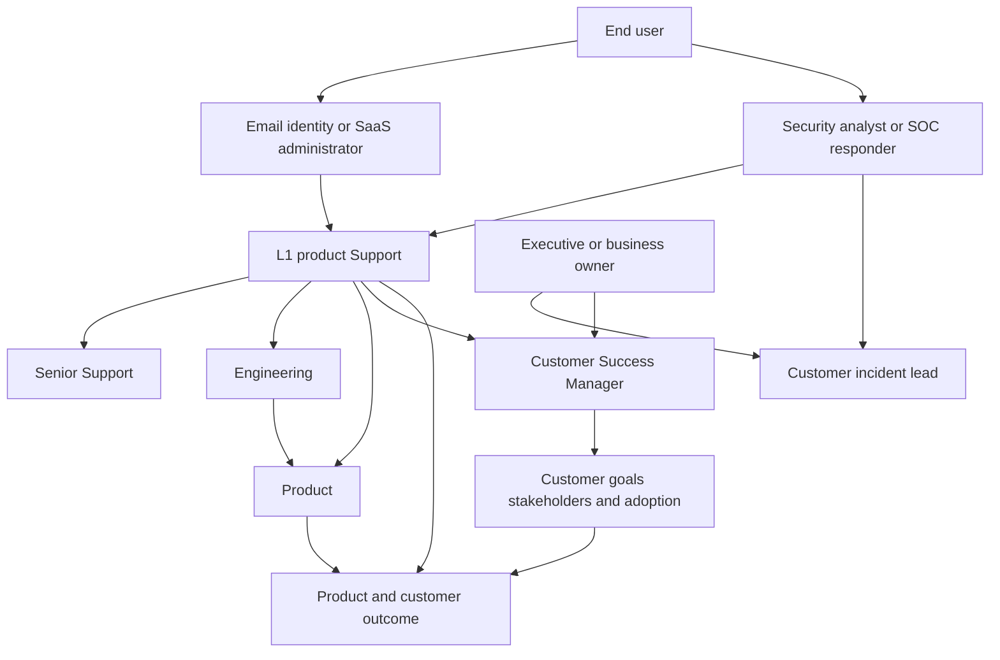
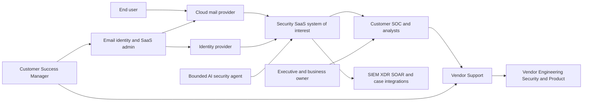
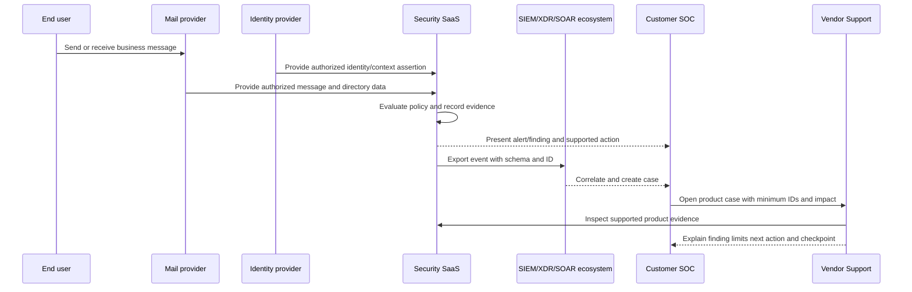
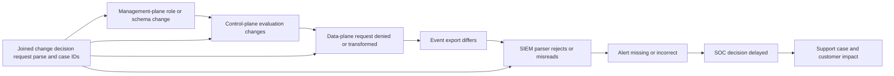
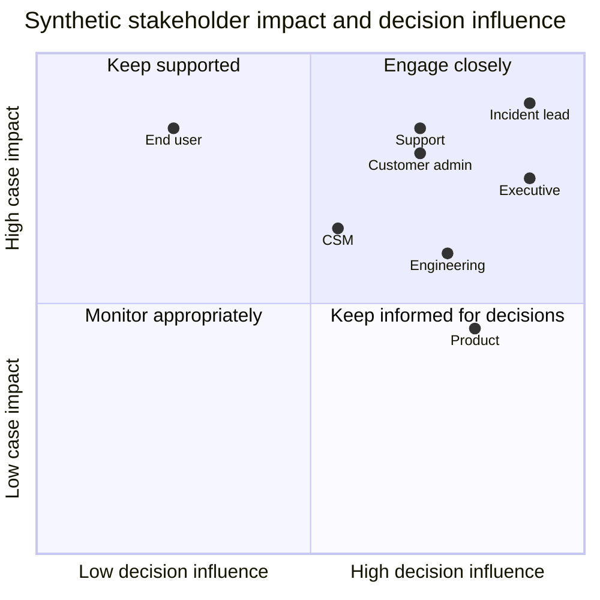
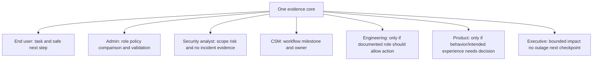
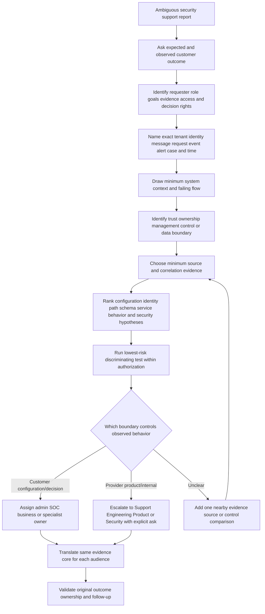
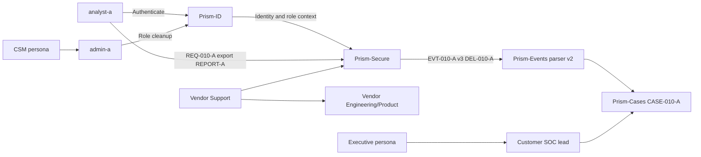

# Part 010 - Security Support Vocabulary Personas and System Maps

> **Purpose:** Consolidate the foundational vocabulary from Parts 001-009 and use it to build accurate persona, stakeholder, decision-right, system-context, dependency, boundary, and data-flow maps for enterprise security support.
>
> **Evidence rule:** Every persona, organization, architecture, ticket, event, message, identity, integration, and communication in this Part is synthetic. Your prior enterprise support facts are used only as explicit transferable evidence; no direct Abnormal AI, email-security, named adjacent-tool, customer-success-platform, SOC, or incident-command experience is implied.
>
> **Currency and official-source access date:** August 24, 2026.

## Section Goal

By the end of this Part, you should be able to use foundational security and support terms consistently enough that each term changes a question, evidence request, owner, or decision. You should be able to distinguish asset, identity, credential, event, alert, incident, case, risk, control, evidence, telemetry, log, correlation, configuration, integration, dependency, trust boundary, data flow, authentication, authorization, privacy, severity, priority, containment, escalation, root cause, workaround, defect, and feature request without turning the conversation into jargon.

You should be able to understand the goals, evidence needs, vocabulary, concerns, and decision rights of an administrator, security analyst, Security Operations Center (SOC) responder, Customer Success Manager (CSM), Support engineer, Engineering, Product, executive/business owner, and end user. Personas are working models, not stereotypes: one person can fill several roles, titles vary, and authority must be verified for the actual case.

You should be able to build a **system-context map** that identifies the system of interest and its external people/systems; an environment inventory; trust and ownership boundaries; identity and data flows; dependencies; management/control/data planes; evidence sources; and failure propagation. You should also build stakeholder and Responsible-Accountable-Consulted-Informed (RACI) maps while recognizing that RACI coordinates work but cannot rewrite architecture, contracts, legal duties, risk authority, or incident command.

The practical outcome is a **Prism Bridge Persona-to-Question and System-Context Lab**. It produces a vocabulary decision dictionary, persona register, discovery-question matrix, synthetic environment inventory, context/boundary/data-flow diagrams, dependency and evidence maps, stakeholder influence/impact map, RACI, one-fact/many-audiences communication set, support decision tree, privacy manifest, and rubric. It is a design exercise only and creates no additional workspace files.

## JD Mapping

| Supplied JD signal | Capability developed here | Practical proof |
|---|---|---|
| Enterprise L1 Technical Support Engineer | Converts ambiguous reports into shared vocabulary, system scope, evidence, and next actions | Intake and system-context worksheet |
| Customer trust and timely updates | Gives one consistent evidence core in audience-appropriate language | One-fact/many-audiences set |
| Configuration tickets | Maps tenant, environment, role, policy, change, inheritance, and owner | Environment and management-plane inventory |
| API questions | Maps client, identity, endpoint, method, resource, schema, response, IDs, retries, and owner | API data-flow map |
| Behavioral false positives | Separates verdict, expected behavior, evidence, impact, decision, and tuning authority | Analyst/admin discovery questions |
| Threat investigations | Maps message, identity, endpoint, SaaS, SOC, incident, and evidence responsibilities | Security stakeholder map |
| Engineering/Product collaboration | Distinguishes defect evidence, intended behavior, recurring need, and roadmap authority | RACI and escalation templates |
| Onboarding with CSMs | Separates technical readiness from adoption, stakeholder, and value outcomes | Support-CSM handoff map |
| Cloud Email Security | Places mail provider, user, admin, security product, SOC, and support in context | Vendor-neutral email context diagram |
| AI Security Agents | Maps agent identity, goal, tool, permission, approval, telemetry, and owner | Non-human persona/actor card |
| SaaS Security | Maps tenant, identities, applications, grants, data, audit, configuration, and response | SaaS inventory and boundary register |
| Named tools/ecosystem | Uses category-level questions for Microsoft 365, Google Workspace, Slack, Okta, Splunk, CrowdStrike, Cortex SOAR, Zendesk, Salesforce, Jira, and Zoom without claiming operation | Honest tool-to-question matrix |

## Candidate Honesty Note

| Evidence label | Honest use in this Part | Boundary that remains explicit |
|---|---|---|
| **Production-transfer example** | Your CV-supported several years of enterprise customer-facing support/escalation, SharePoint Online, OneDrive, Sync Client, Copilot, critical situations, customer/partner communication, Engineering/Product escalation, fix validation, KB/training, mentoring, and CSAT/backlog/case-quality analysis | These facts do not become Abnormal AI, Exchange/email-security, SOC, CSM, Product Manager, incident-command, or named-tool production experience |
| **Working knowledge/upskilling** | Networking, APIs/JSON, diagnostic tools, SQL/Power BI/Python, Azure/AD/Entra, SSO/SAML/OAuth, automation, AI, GitHub/Confluence/Linux/Kubernetes concepts support discovery and mapping | Depth and production scale must not be invented |
| **Local/public lab** | Prism Bridge demonstrates persona-aware questions, a system map, evidence reasoning, and communication with invented data | It is not operation of a customer tenant or any named vendor platform |
| **Learned architecture** | Official NIST, CISA, Microsoft, and public Abnormal sources support general system/security and role context | Public material does not reveal private organization, architecture, permissions, or decision rights |
| **No direct experience** | Abnormal AI, direct email-security operations, Google Workspace, Slack, Okta, Splunk, CrowdStrike, Cortex SOAR, Zendesk, Salesforce, Jira, and Zoom remain explicit gaps | Category knowledge and diagrams do not convert the gap into production experience |
| **Template only** | Persona cards, RACI, discovery questions, and diagrams can be adapted under actual policy | Templates do not prove an organization uses these roles or boundaries |

Safe interview language: “My prior support experience gives me production evidence in enterprise case ownership and cross-audience communication. I have not used Abnormal or the named adjacent tools in production. In a synthetic lab I mapped how an admin, SOC analyst, CSM, Engineering, Product, executive, and user would interact around one evidence core; that is a support-method artifact, not platform experience.”

## Vocabulary Consolidation: From Words to Decisions

A term matters when it changes what the engineer asks, collects, decides, or escalates.

| Term | Beginner meaning | Decision it changes | Example question |
|---|---|---|---|
| Asset | Something valuable enough to protect | Scope and impact | Which mailbox, identity, data, service, workflow, or reputation is affected? |
| Identity | Representation of a human, device, workload, or application | Authentication, ownership, and access | Which exact subject/tenant/issuer made the request? |
| Credential/secret | Value or mechanism used to prove or carry authority | Handling and incident urgency | Was a token exposed, and who owns revoke/rotation? |
| Authentication | Establishing confidence in claimed identity | Whether the caller was recognized | Did sign-in succeed, through which issuer and method? |
| Authorization | Deciding whether an identity may perform an action on a resource | Role/scope/policy diagnosis | Which action/resource was denied and which policy decided? |
| Session | Bounded continuing access context after authentication | Revocation and time analysis | Did an old session continue after role removal? |
| Event | Record that something happened | Source/timeline evidence | What source ID and event time record the action? |
| Alert/detection | Logic result and attention object | Triage and confidence | Which evidence/rule/version created the alert? |
| Incident | Authorized coordinated response condition | Roles, severity, containment, communications | Who declared it under which criteria? |
| Case/ticket | Work container for evidence, actions, owners, and communication | Continuity and closure | What outcome, next action, owner, and checkpoint are current? |
| Risk | Effect of uncertainty on objectives, often reasoned through likelihood and impact | Treatment and owner | Which threat/weakness could harm which objective? |
| Control | Measure that changes risk | Guidance and validation | Is the control designed and operating for this scope? |
| Evidence | Information supporting or challenging a claim | Confidence and escalation quality | What does this item prove, and what can it not prove? |
| Telemetry/log | Recorded measurements/events from a source | Coverage and correlation | Is the source healthy, parsed, retained, and time-aligned? |
| Correlation ID | Stable identifier linking stages | End-to-end trace | Which ID joins client, service, integration, and case? |
| Configuration | Settings that influence behavior | Expected/actual and change analysis | What value/version/inheritance changed near the start? |
| Integration | Connection where systems exchange data or actions | Boundary ownership | Which producer, identity, contract, transport, parser, and receiver are involved? |
| Dependency | Component or condition another outcome needs | Failure propagation and priority | What upstream service or owner blocks recovery? |
| Trust boundary | Crossing where authority/control/handling changes | Security and responsibility | What data/authority crosses and how is it verified? |
| Data flow | Path data takes from source through processing/storage/destination | Privacy, integrity, and observability | What fields move, why, where, and under whose authority? |
| Severity | Seriousness of current impact under policy | Cadence and coordination | What scope and consequence support the classification? |
| Priority | Order of work given severity, urgency, obligations, and resources | Queue/resource decision | Which action must happen first and why? |
| Containment | Action limiting ongoing/potential harm | Authority and business tradeoff | Who can revoke/isolate/remove, and what will it disrupt? |
| Workaround | Alternative path that restores or preserves function without necessarily removing cause | Temporary operation and limits | What risk, expiry, and validation apply? |
| Root cause | Underlying causal condition whose correction prevents recurrence in defined scope | RCA claim strength | What evidence distinguishes trigger, contributor, and cause? |
| Defect | Product behavior that differs from intended/design expectation | Engineering escalation | What are expected/actual, repro, version, evidence, and impact? |
| Feature request | Desired capability or changed behavior rather than a current defect | Product routing | What job, impact, frequency, workaround, and decision are needed? |
| Escalation | Moving a need to authority/access/expertise while preserving ownership | Handoff quality | What exact question can only the recipient answer? |

## Plain-English deep-dive: Vocabulary Is Decision Compression

Good vocabulary lets a team compress a complex idea without losing meaning. Saying “authorization failed” should imply that authentication may have succeeded, the requested action/resource must be named, a policy/role/scope decision exists, and a `403` may be relevant. If people use “authentication” and “authorization” interchangeably, they test the wrong layer.

**Analogy:** Technical terms are like labels on electrical breakers. A precise label lets someone isolate the right circuit quickly; a vague label such as “things” creates risk. The analogy stops because security terms can be interpreted differently by vendors and require context rather than fixed wiring.

The safeguard is **definition plus object plus evidence**:

- not “the API is down,” but “the endpoint is reachable and returns `403` for action `export` on resource `report-A` under role `analyst`”;
- not “email was hacked,” but “message `MSG-A` was delivered, an unrecognized session created a forwarding rule, and the customer SOC is evaluating unauthorized account activity”;
- not “SIEM lost data,” but “source produced `EVT-A`, receiver accepted request `RX-A`, parser rejected schema version 3, and no normalized event was stored.”

## Persona Fundamentals

A **persona** is a working model of a participant's goals, tasks, evidence, language, constraints, and authority. It helps Support ask useful questions and tailor communication. It is not a stereotype or substitute for asking the actual person.

### Persona overview

| Persona | Primary goal | Evidence needed | Preferred language | Typical decisions | Key boundary |
|---|---|---|---|---|---|
| End user | Complete work safely with low friction | What happened, safe steps, expected result | Plain, task-focused, minimal jargon | Report, follow approved step, confirm outcome | Does not decide enterprise risk or product design |
| Administrator | Configure and operate tenant/system correctly | Roles, policy, change, IDs, health, expected/actual | Precise settings and validation | Approved configuration, access, maintenance | May not own incident or business risk |
| Security analyst | Determine validity, scope, risk, and response recommendation | Alerts, raw events, identity, message, endpoint, timeline, context | Evidence/confidence/hypotheses | Disposition and escalation under process | Product internals remain vendor-owned |
| SOC responder/incident lead | Coordinate security investigation and authorized containment | Impact, scope, timeline, options, action results | Incident objectives, decisions, owners | Declaration, containment priority, response coordination | Support does not command customer response |
| CSM | Help customer achieve adoption/value and manage relationship risk | Milestones, goals, blockers, stakeholders, status | Outcome/adoption/relationship language | Success plan and stakeholder alignment | Does not replace technical diagnosis |
| Support engineer | Restore/clarify product outcome and preserve continuity | Expected/actual, scope, environment, evidence, IDs, changes | Testable case language | Supported diagnostics, guidance, escalation | Does not invent product internals or accept customer risk |
| Engineering | Determine service/code/internal behavior and correct defects | Minimal repro, version, logs/IDs, expected/actual, impact | Precise technical contract | Technical finding, fix, validation criteria | Does not own customer communication by default |
| Product | Decide intended behavior, priorities, tradeoffs, and roadmap | User job, pattern, impact, evidence, workaround | Problem/outcome/tradeoff language | Product decision and prioritization | Support cannot promise delivery |
| Executive/business owner | Protect business/security outcomes and allocate priorities | Impact, trend, risk, options, decisions, confidence | Concise outcome and tradeoff language | Business continuity, resources, risk authority as delegated | Does not need raw diagnostic detail |
| Privacy/Legal/Compliance/HR | Interpret specialized obligations and sensitive decisions | Minimal facts, data types, actors, jurisdictions, actions, exact question | Factual and controlled | Legal/privacy/compliance/employee process | Support does not provide their conclusions |

## Plain-English deep-dive: Personas Are Lenses, Not Stereotypes

An “administrator” may also be the SOC lead in a small organization. An executive may understand packet captures. An end user may be a security engineer. A CSM may identify a technical dependency but still not own the fix. Treat persona cards as likely information and decision needs, then verify title, authority, technical depth, and preferred communication.

**Analogy:** A persona is like a camera lens: it frames which details matter for one view, but the subject remains the same. The analogy stops because people choose, learn, and hold overlapping authority; they are not fixed optical devices.

Questions that prevent stereotypes:

1. What outcome are you accountable for in this case?
2. Which actions can you authorize or perform?
3. Which evidence can you access and share?
4. Who makes incident, risk, product, privacy, or business decisions?
5. How technical should updates be, and who else receives them?
6. What deadline or workflow makes this important?

## Persona-Specific Discovery Questions

### Administrator

| Area | Discovery questions | Why it matters |
|---|---|---|
| Environment | Which tenant/environment, region, domain, account, role, and object are involved? | Prevents testing the wrong scope |
| Expected behavior | Which documented workflow and setting should apply? | Defines the contract |
| Change | What changed, by whom, when, under which approval/version? | Tests configuration drift |
| Comparison | Which user/object/environment works, and what differs? | Creates a control sample |
| Effective access | Direct, group, inherited, delegated, app, and session authority? | Visible role may not equal effective permission |
| Evidence | Which admin/audit/config export can be shared safely? | Establishes state without secrets |
| Decision | Can this persona approve a change/rollback, and who validates business/security impact? | Preserves authority |

### Security analyst/SOC responder

| Area | Discovery questions | Why it matters |
|---|---|---|
| Signal | Which alert/event/user report started the case, and what source/version produced it? | Establishes evidence origin |
| Scope | Which identities, messages, devices, applications, data, and time are confirmed or possible? | Drives response and severity |
| Hypotheses | What benign, accidental, operational, and malicious explanations remain? | Prevents confirmation bias |
| Correlation | Which IDs join mail, identity, endpoint, SaaS, SIEM, and case? | Builds timeline |
| Incident | Has an incident been declared, by whom, and what is Support's workstream? | Protects command boundary |
| Action | Which containment/response actions occurred, under whose authority, with what result? | Separates decision from product mechanics |
| Gap | Which product evidence or internal behavior must Support/Engineering explain? | Creates precise escalation |

### CSM

| Area | Discovery questions | Why it matters |
|---|---|---|
| Goal | Which business/security outcome or onboarding milestone is affected? | Connects ticket to customer value |
| Stakeholders | Who sponsors, administers, operates, and consumes the capability? | Prevents missing owner |
| Adoption | Is the issue technical failure, misunderstanding, missing prerequisite, or workflow friction? | Routes technical versus enablement work |
| Relationship | Is confidence, deadline, renewal, launch, or executive visibility affected? | Adjusts cadence without inflating severity |
| Boundary | What does CSM need from Support, and what technical work remains with Support? | Avoids ownership blur |
| Follow-through | Which success validation and training/handoff occur after technical resolution? | Closes the journey |

### Engineering

| Area | Discovery questions | Why it matters |
|---|---|---|
| Contract | What is expected versus actual for this version/configuration? | Defines defect hypothesis |
| Reproduction | Is it deterministic; what is the minimal input and environment? | Saves investigation time |
| Evidence | Which request/event/message IDs and UTC window expose internal path? | Makes telemetry searchable |
| Scope | Affected versus working populations and changes? | Helps isolate condition |
| Tests | What has been tried, what observation resulted, and what did it rule out? | Prevents repeated work |
| Ask | Which internal decision, telemetry, or code behavior must Engineering determine? | Avoids “please investigate” |
| Validation | What result and regression checks prove correction? | Keeps customer outcome central |

### Product

| Area | Discovery questions | Why it matters |
|---|---|---|
| User job | What is the user trying to accomplish? | Frames value rather than requested implementation |
| Behavior | Is current behavior intended, defective, confusing, or missing? | Routes defect versus feature |
| Pattern | How often, for whom, in which workflow? | Supports prioritization |
| Impact | Security, business, effort, trust, and workaround cost? | Makes tradeoff visible |
| Evidence | Which cases and observations support the pattern? | Avoids one anecdote as universal truth |
| Promise | What can Support communicate now without roadmap commitment? | Protects trust |

### Executive/business owner

| Area | Discovery questions | Why it matters |
|---|---|---|
| Outcome | Which business/security objective is affected? | Removes tool noise |
| Magnitude | Current/possible scope, duration, data, customers, workflow? | Supports prioritization |
| Risk | What is confirmed, plausible, controlled, and unknown? | Enables informed decisions |
| Options | What actions, tradeoffs, costs, and deadlines exist? | Makes decision explicit |
| Owner/time | Who owns the next action and when is the next checkpoint? | Supports accountability |

### End user

| Area | Discovery questions | Why it matters |
|---|---|---|
| Task | What were you trying to do? | Defines expected result in plain language |
| Observation | What did you see, and when? | Captures source without leading |
| Scope | Does it affect one item/task/device or more? | Helps prioritize |
| Change | Did anything change in account, device, network, or workflow? | Adds context without blame |
| Safety | Did you enter credentials, approve an app, open an attachment, or receive a security instruction? | Invokes authorized response if needed |
| Evidence | Can you provide the minimum safe ID/error/screenshot under guidance? | Avoids secrets and broad content |
| Validation | What successful outcome will confirm restoration? | Centers user outcome |

## System Context, Inventory, and Boundaries

A **system-context map** places one system of interest in the center and shows external people and systems that interact with it. It intentionally avoids internal component detail at first. Its job is to establish scope, interfaces, responsibilities, and questions.

The diagram is vendor-neutral. It does not represent Abnormal's internal architecture, exact integrations, or support paths.

### Environment inventory

| Inventory field | Question | Example value |
|---|---|---|
| Organization/tenant | Which logical customer boundary? | `TENANT-LAB-A` |
| Environment | Production, test, staging, local lab? | Synthetic tabletop |
| Region/location | Which service/data location matters? | Unknown/not applicable in lab |
| Users/groups | Which identities/populations? | `analyst-a`, `admin-a`, `user-a` |
| Workload identities/apps | Which non-human callers? | `svc-alert-export` |
| Systems/providers | Mail, IdP, SaaS, endpoint, SIEM, SOAR, support? | Fictional named components |
| Versions/config | Which client, API, schema, policy, rule? | Schema v3 versus parser v2 |
| Data/assets | Which messages, logs, roles, events, reports? | Synthetic metadata only |
| Interfaces | UI, API, webhook, SMTP, event export? | Local/paper flow |
| Network/dependencies | DNS, TLS, proxy, firewall, queue, upstream service? | Conceptual only |
| Time/change | Last success, first failure, recent changes? | UTC timeline |
| Ownership | Technical, business, security, support, vendor? | Persona roles |
| Evidence | IDs, logs, traces, configuration, user report? | Synthetic object set |
| Privacy | Classification, minimization, transfer, retention? | Local/synthetic label |

## Plain-English deep-dive: A System Map Is a Hypothesis Tool, Not Decoration

A box-and-arrow picture is useful only if it helps answer where behavior is controlled and what observation can separate possible failures. Every arrow should represent data, authority, or action, and should have a protocol/interface, identity, policy, owner, evidence, and failure mode.

**Analogy:** A transit map is useful because it shows routes, interchanges, and stops. Decorative pictures of trains do not help a traveler choose where to change lines. The analogy stops because data can be copied, authorization can change mid-session, and one digital request can cross several logical boundaries invisibly.

For each arrow ask:

1. What moves: data, identity assertion, configuration, event, command, or decision?
2. Who or what initiates it?
3. How is the caller authenticated and authorized?
4. What resource/action is allowed?
5. Which party controls each side?
6. What evidence is recorded at producer, transport, receiver, and action?
7. How are failure, retry, duplication, and revocation handled?
8. What privacy and retention rules apply?

## Data Flows, Planes, and Dependencies

### Management, control, and data planes

| Plane | Purpose | Persona most concerned | Evidence |
|---|---|---|---|
| Management plane | Configure roles, policies, integrations, keys, retention | Admin, Engineering, Support | Change ID, actor, before/after, approval, version |
| Control plane | Decide whether an identity/action/resource is allowed and how processing should occur | Security analyst, admin, Engineering | Decision ID, policy/rule, inputs, reason |
| Data plane | Carry actual message, event, API, export, or response action | End user, SOC, business owner | Object/action ID, result, timestamps, audit |

### Dependency types

| Dependency | Example | Failure symptom | Owner question |
|---|---|---|---|
| Identity | IdP issues token/claims | `401`, wrong tenant, stale role | Which issuer/policy/identity owner controls it? |
| Network/name | DNS, route, proxy, TLS | Timeout, name/certificate/path failure | Which boundary has the first failed observation? |
| API/schema | Producer and consumer contract | `400`, parse error, missing field | Which version is supported and who changes it? |
| Queue/async | Event waits for processing | `202` but no completed result | Which ID and status expose downstream state? |
| Data/retention | Evidence source and history | Missing event or incomplete scope | Was it generated, retained, and searchable? |
| Configuration | Role/policy/integration setting | Some users/items differ | Which effective setting/version applies? |
| Human/process | Approval, on-call, customer action | Case stalls with no technical error | Who owns the decision and checkpoint? |
| Vendor/service | Upstream cloud/mail/identity/SaaS | Broad or regional failure | What does each provider observe and own? |

### Failure propagation

The nearest visible symptom may be far from the controlling change. Maps prevent teams from treating the last failing box as the root cause.

## Stakeholder Maps and Decision Rights

A stakeholder map considers interest, impact, influence, evidence, and communication. A RACI assigns roles for a specific task.

| Stakeholder | Impact/interest | Influence/authority | Evidence needed | Communication need |
|---|---|---|---|---|
| Affected user | High task impact | Can report/validate, limited system authority | Safe steps, expected result | Plain action and timing |
| Customer admin | High operational ownership | Can change customer configuration under policy | Settings, roles, change, validation | Technical plan and rollback |
| SOC/incident lead | High security responsibility | Can coordinate response under authority | Scope, timeline, confidence, action results | Incident workstream card |
| Business owner/executive | High consequence | Prioritizes continuity/resources/risk as delegated | Impact, options, uncertainty | Concise decision brief |
| CSM | High customer-journey interest | Aligns stakeholders/adoption | Milestones, blockers, status | Success/risk context |
| Support | High case responsibility | Controls supported diagnosis/escalation | Product evidence and customer context | One narrative and cadence |
| Engineering | High technical influence | Controls internal product diagnosis/fix | Repro, IDs, version, explicit ask | Precise escalation and validation |
| Product | High intended-behavior/priority influence | Controls product decision/roadmap | User job, pattern, impact, tradeoff | Evidence brief, no promise |

The coordinates are synthetic teaching choices, not universal ratings.

## Plain-English deep-dive: RACI Coordinates Work but Does Not Create Authority

RACI means:

- **Responsible:** performs the task;
- **Accountable:** owns the task result/decision, usually one clear role;
- **Consulted:** provides input;
- **Informed:** receives status or outcome.

A RACI can say Support is Responsible for sending an Engineering escalation and Accountable for customer case continuity. It cannot make Support Accountable for customer incident declaration, grant Support access to a customer tenant, or overwrite a contract.

**Analogy:** A theater call sheet says who performs each production task, but it cannot grant a person a professional license, building access, or copyright ownership. The analogy stops because security responsibility includes technical enforcement, data rights, law, contract, and risk governance.

### Example case RACI

| Task | End user | Admin | SOC lead | CSM | Support | Engineering | Product | Executive |
|---|---|---|---|---|---|---|---|---|
| Report symptom/impact | R | C | C | I | A | I | I | I |
| Preserve minimum product IDs | C | C | C | I | A/R | I | I | I |
| Validate customer configuration | I | A/R | C | I | C | I | I | I |
| Declare/manage customer incident | I | C | A/R | I | C | I | I | I |
| Investigate provider internal behavior | I | I | C | I | R | A/R | C | I |
| Maintain customer support cadence | I | C | C | C | A/R | I | I | I |
| Clarify intended product behavior | I | C | C | C | R | C | A/R | I |
| Decide business continuity | I | C | C | C | I | I | I | A/R |
| Validate technical fix | C | R | C | I | A/R | R | I | I |
| Validate customer value/adoption | C | C | I | A/R | C | I | I | I |

This is a synthetic coordination example. Actual roles and accountability require verification.

## Translating One Fact for Multiple Audiences

Evidence core:

> At `10:02 UTC`, request `REQ-010-A` from synthetic user `analyst-a` to export report `REPORT-A` returned HTTP `403`. Authentication succeeded. A control user with role `exporter` succeeded. The affected user has role `reader`. No service outage, data loss, malicious activity, or provider defect is confirmed. The customer admin is verifying intended role assignment. Next update is `12:00 UTC`.

| Audience | Translation |
|---|---|
| End user | “Your report export is blocked by the current access decision. Viewing remains available. The administrator is checking whether your role should include export; please do not share credentials. We will update by 12:00 UTC.” |
| Administrator | “`analyst-a` authenticates successfully but receives `403` on `REPORT-A` export; `exporter` control succeeds. Please verify effective role/group inheritance and intended permission. Share a redacted comparison, not tokens.” |
| Security analyst/SOC | “This is currently an authorization/configuration case affecting one synthetic user. There is no evidence of malicious activity, data loss, or broad service failure. Preserve the request ID if related signals emerge.” |
| CSM | “One analyst cannot export a report because the current role appears not to include export; viewing and other users remain available. Support owns technical diagnosis, the admin owns intended access, and the next checkpoint is noon. Please flag any milestone impact.” |
| Engineering | “Escalation is not yet required. If documentation confirms `reader` should export, packet will include expected/actual, both roles, request IDs, UTC time, effective policy, and explicit authorization-decision ask.” |
| Product | “No Product decision yet. If `reader` denial is intended but repeatedly surprises customers, Support/CSM can provide user job, frequency, impact, and guidance gap without calling it a defect.” |
| Executive | “One analyst's export is unavailable; report viewing and broader service remain functional. Current evidence points to a bounded access-role issue, with no security incident or data loss observed. Admin and Support are validating by 12:00 UTC.” |

The facts and confidence never change. Vocabulary, detail, and decision framing do.

## Named Tool and Ecosystem Question Map

| Named area | Honest current tier | Category questions you can ask | Prohibited implication |
|---|---|---|---|
| Abnormal AI | No direct experience/public learned context later | Which product surface, tenant, object, evidence, role, expected/actual, and supported escalation? | Console operation or private architecture |
| Microsoft 365 | Production transfer in named CV workloads; identity/cloud fundamentals | Tenant, identity, configuration, client/cloud boundary, service evidence | Direct Exchange/email-security operations unless separately supported |
| Google Workspace | No direct experience | Tenant/admin role, Gmail route, OAuth/app, audit, object IDs, expected flow | Production administration |
| Slack | No direct experience | Workspace/app, scopes, event subscription, user/channel, audit, retry | Direct integration operation |
| Okta | No direct experience | Org, user/group/app, policy, sign-in event, SAML/OIDC/SCIM flow | Production identity administration |
| Splunk | No direct experience | Source/index/time, parser/schema, query, event ID, alert/notable/case, ingestion health | SIEM operation |
| CrowdStrike | No direct experience | Endpoint/sensor health, detection ID, process/device context, response authority | EDR/XDR operation or isolation experience |
| Cortex SOAR | No direct experience | Trigger, playbook inputs, integration auth, action, approval, result, idempotency | Production playbook operation |
| Zendesk | No direct experience | Ticket fields, status, owner, SLA/cadence, macros, attachments, privacy | Case-system operation |
| Salesforce | No direct experience | Account/contact context, entitlement, opportunity/success handoff, permissions | CRM operation |
| Jira | No direct experience | Work item type, repro, expected/actual, evidence, priority, owner, validation | Engineering tracker operation |
| Zoom | No direct experience | Consent, agenda, screen sharing, recording, privacy, follow-up | Production onboarding/support operation |

## Worked Examples

### Worked example 1: “The integration is broken”

**Intake phrase:** “The integration is broken.”

**Vocabulary refinement:** Integration means producer, identity/auth, API/transport, schema/parser, receiver, processing, and evidence. “Broken” needs expected/actual, last success, first failure, scope, and impact.

**System map:** Email product -> event export -> HTTP receiver -> parser -> SIEM index -> alert/case.

**Persona questions:** Admin confirms configuration/change; SIEM engineer confirms receiver/parser/index; Support confirms product event/export; Engineering handles provider-internal emission if needed; SOC explains operational impact.

**Result:** One delivery ID receives `202`, receiver logs parse failure for schema v3. The phrase becomes “transport succeeded; consumer processing rejected an unsupported schema.”

### Worked example 2: “This false positive is blocking the business”

**Terms:** False positive is a benign item incorrectly treated as concerning. Blocking is an availability/business impact. Neither proves detection defect.

**Personas:** End user explains task; admin/security analyst supplies message/case IDs and expected verdict; SOC evaluates security risk; Support follows product review and configuration path; Product may receive recurring user-job evidence; executive receives scope/tradeoff.

**Evidence:** Minimum message ID, timestamp, verdict category, policy/context, affected population, comparable control, and business impact. Content only if essential and authorized.

**Outcome:** Support preserves both security and availability concerns without promising release or tuning.

### Worked example 3: “Engineering owns it now”

**Problem:** Escalation is confused with case ownership.

**Map:** Support remains customer-facing continuity owner; Engineering owns the internal technical question; Product may own intended behavior; customer admin owns validation action.

**Strong state:** “Engineering accepted the request-ID comparison to determine why documented policy and observed decision differ. Support will update the customer at 15:00 UTC and validate the original workflow after the result.”

### Worked example 4: “We need an RCA”

**Discovery:** Does the requester need restoration explanation, a confirmed technical cause, contributing factors, a post-incident review, a compliance artifact, or prevention actions? What evidence and authority exist?

**Vocabulary:** Trigger starts visible failure; root cause is an underlying causal condition within defined scope; contributing factor changes likelihood/impact; workaround restores function without proving cause; corrective action changes condition; preventive action reduces recurrence.

**Boundary:** Support can provide evidence and product finding; Engineering may establish code cause; incident owner coordinates postmortem; Legal/Compliance controls specialized requirements.

### Worked example 5: One person holds many personas

A small customer has one administrator who configures mail, triages alerts, approves changes, and reports to leadership. Do not assume that person holds legal risk acceptance or provider support authority. Ask which hat they are wearing for each decision and whether another owner must approve containment, privacy, or business interruption.

## Troubleshooting Decision Tree

### Symptom-to-question-to-owner matrix

| Symptom | Clarifying question | Likely evidence | Likely owner path |
|---|---|---|---|
| “Login issue” | Authentication, authorization, session, or UI? Which identity/tenant/action? | Sign-in/result, policy ID, request ID | Admin/IdP/Support by failed boundary |
| “API down” | DNS/TLS timeout, status, method/resource, one user or all? | UTC, endpoint, status, correlation ID | Network/integration/Support/Engineering |
| “Alert missing” | Source generated, exported, parsed, stored, queried, or routed? | Source/delivery/parse/index/case IDs | Product Support and customer SIEM owner |
| “False positive” | Which item/verdict, benign ground truth, impact, policy/context? | Stable IDs, review evidence, control comparison | Analyst/admin/Support; Product if pattern |
| “Threat missed” | What harmful behavior is evidenced and which data path existed? | Message/identity/endpoint/timeline/source health | Customer SOC plus Support review |
| “Need containment” | Who declared/authorized, target/scope, tradeoff, rollback? | Incident/action decision and IDs | Customer IC/SOC/system owner |
| “Product defect” | What documented/intended behavior differs, under which version/config? | Minimal repro, expected/actual, IDs | Support -> Engineering/Product |
| “Need a feature” | What user job, impact, frequency, workaround, and desired outcome? | Patterned cases and customer context | Support/CSM -> Product |
| “Customer is upset” | Which expectation, impact, silence, or trust failure exists? | Commitments, updates, case state | Support owner/manager/CSM |
| “RCA required” | Root cause, postmortem, restoration summary, compliance artifact, or prevention plan? | Timeline, findings, decisions, actions | Incident/Engineering/Support/specialists |

## Common Failure Modes

| Failure mode | Why it fails | Safer correction | Escalation trigger |
|---|---|---|---|
| Jargon before definition | Customer and team infer different meanings | Define term and exact object | Decision disagreement persists |
| Same word across products assumed identical | “Incident,” “case,” and “finding” semantics differ | Inspect schema/lifecycle/source | Integration mapping loses meaning |
| Persona as stereotype | Technical depth/authority is guessed | Ask role, goal, evidence, and decision rights | Sensitive/high-impact decision |
| Title equals authority | Admin/executive/support titles may not confer exact decision | Verify policy/delegation | Containment, risk, legal, privacy action |
| One update copied to all | Some audiences miss decision; others get excess data | Keep evidence core, adapt detail/decision | Executive or external communication |
| Audience adaptation changes facts | Trust and incident record diverge | Use one fact/confidence core | Contradictory messages exist |
| Decorative system diagram | Arrows lack data, identity, owner, evidence | Label every crossing | Teams blame wrong component |
| Inventory too broad | Collection replaces reasoning | Scope to affected/control and decision | Privacy or time cost increases |
| Last failing system blamed | Upstream change/control may be root | Trace management/control/data flow | Cross-provider ownership conflict |
| RACI used as contract | Assigns work/authority unrealistically | Establish technical/legal/risk responsibility first | Contract/legal ambiguity |
| Everyone Accountable | No one owns final task decision | Prefer one accountable role per task | Coordination stalls |
| CSM becomes technical owner | Customer journey and diagnosis blur | CSM aligns goals; Support owns technical case | Onboarding/relationship risk needs joint plan |
| Support becomes incident commander | Product case exceeds authority | Support owns product workstream | Customer requests containment command |
| Engineering escalation ends updates | Customer loses continuity | Support tracks acceptance and cadence | Dependency misses checkpoint |
| Product request promised | Roadmap trust is damaged | Route evidence without date/priority promise | Executive demands commitment |
| Named-tool category becomes experience claim | Misrepresents candidate capability | Label learned/no-direct experience | Interview asks exact hands-on detail |
| System map presented as Abnormal architecture | Invents private behavior | Label vendor-neutral and verify public facts later | Product-specific decision needed |

## Prism Bridge Persona-to-Question and System-Context Lab

### Lab purpose

Build a complete persona and system-context package around a harmless synthetic authorization/integration case. “Prism” represents one evidence core viewed through different audience lenses; “Bridge” represents system and ownership boundaries. The exercise is paper-only and creates no files beyond this requested lesson.

### Honest artifact label

> **LOCAL/SYNTHETIC DESIGN - Persona, vocabulary, and system-mapping practice only. No customer environment, Abnormal AI operation, direct email-security work, named adjacent-tool operation, CSM role, Product ownership, SOC response, or incident command is represented.**

### Prerequisites

1. Parts 001-009 and this Part's vocabulary/persona/system-map tables.
2. Private local reading/editing environment.
3. Mermaid preview or paper drawing tool.
4. Only the synthetic facts below.
5. No account, tenant, message, API, webhook, SIEM, endpoint, ticketing, CRM, or network activity.
6. Two hours for design and thirty minutes for spoken review.

### Authorized scope and prohibitions

| Authorized | Prohibited |
|---|---|
| Use supplied synthetic identities, IDs, times, roles, statuses | Add customer, employer, colleague, or production data |
| Create conceptual maps, questions, RACI, and updates inside lesson exercise | Start services, call APIs, send messages, scan, bypass, or change systems |
| Discuss named tools as no-direct-experience categories | Claim hands-on operation or private vendor architecture |
| Produce support-method conclusions | Declare incident, accept risk, promise roadmap, give legal advice |

### Synthetic scenario: Prism Bridge Labs

Fictional `Prism Bridge Labs` has:

- end user `analyst-a@example.invalid`;
- admin `admin-a@example.invalid`;
- customer SOC lead `soc-lead@example.invalid`;
- CSM persona `csm-a`;
- vendor Support persona `support-a`;
- fictional mail provider `Prism-Mail`;
- fictional identity provider `Prism-ID`;
- fictional security SaaS `Prism-Secure`;
- fictional SIEM `Prism-Events`;
- fictional case system `Prism-Cases`;
- request `REQ-010-A`, report `REPORT-A`, event `EVT-010-A`, delivery `DEL-010-A`, case `CASE-010-A`.

At `10:02 UTC`, `analyst-a` authenticates successfully to `Prism-Secure` but receives `403` when exporting `REPORT-A`. Viewing works. Control user `analyst-control` with role `exporter` succeeds. `analyst-a` has role `reader`. A role cleanup occurred at `09:45 UTC`. The event export to `Prism-Events` receives `202`, but the SIEM parser rejects schema version 3 because it supports version 2. No malicious activity, data loss, broad outage, or provider defect is confirmed.

### Step 1: Create the vocabulary decision dictionary

Select at least thirty terms from this Part. For each, write plain meaning, exact scenario object, evidence, decision changed, owner, and a sentence that avoids jargon. Include authentication, authorization, role, event, alert, incident, case, integration, schema, `202`, `403`, dependency, defect, workaround, and root cause.

### Step 2: Build the persona register

Create cards for end user, admin, security analyst, SOC/incident lead, CSM, Support, Engineering, Product, executive, Privacy/Legal/Compliance, and AI-agent/workload actor. Each card includes goals, fears, evidence access, vocabulary, decisions, constraints, update need, and boundary.

**Expected evidence:** No title is assumed to have incident, legal, risk, or roadmap authority without verification.

### Step 3: Build persona-to-question matrix

For each persona, create at least five questions for this case. Questions must not request credentials or unnecessary content. Mark which answer changes the hypothesis, action, or communication.

### Step 4: Create environment inventory

Fill all fields from the inventory table. Mark unknowns explicitly: actual role intent, current documentation, producer/consumer schema contract, Engineering internal result, incident status, and business milestone.

### Step 5: Draw context, boundary, and plane maps

Create three conceptual views:

1. system context with people/external systems;
2. trust/ownership boundaries with identities, data, evidence, revoke path;
3. management/control/data planes showing role cleanup, authorization decision, export action, event emission, parser rejection, and case impact.

### Step 6: Build dependency/evidence matrix

Trace identity/role, product authorization, event export, HTTP acceptance, parser schema, SIEM storage, case routing, and customer validation. Each row needs source ID, owner, expected/actual, evidence, privacy, next test, and failure propagation.

**Expected conclusion:** The user export denial and SIEM parser failure are two related-in-time but technically distinct problems unless evidence connects them.

### Step 7: Build stakeholder map

Record impact, interest, influence, authority, evidence, update format, cadence, and risk for all personas. Explain why the end user has high impact but limited decision authority, while Engineering has high technical influence but does not automatically own customer communication.

### Step 8: Create RACI

Tasks: confirm user impact, verify role intent, preserve IDs, troubleshoot authorization, repair customer parser, investigate provider defect if documentation conflicts, maintain updates, assess incident status, communicate executive impact, validate outcomes, capture knowledge, route recurring UX issue to Product.

**Expected evidence:** One accountable role per task where practical; RACI caveat states that contract, legal, technical access, and risk authority remain separate.

### Step 9: Write one-fact/many-audiences messages

Create messages for end user, admin, SOC lead, CSM, Support manager, Engineering, Product, executive, and Privacy/Security if a token were accidentally offered. Every message uses the same facts/confidence but changes detail and decision framing.

### Step 10: Run troubleshooting decision tree

Analyze two tracks:

- Track A: `403` export authorization after role cleanup.
- Track B: `202` event acceptance followed by parser v3/v2 rejection.

For each, record competing hypotheses, cheapest safe test, likely owner, escalation condition, customer update, and validation. Do not merge the root causes without evidence.

### Step 11: Create claim-safety review

For every mention of Abnormal AI, Microsoft 365, Google Workspace, Slack, Okta, Splunk, CrowdStrike, Cortex SOAR, Zendesk, Salesforce, Jira, and Zoom, assign evidence tier and safe wording. Confirm the synthetic systems do not impersonate those products.

### Step 12: Validation rubric and cleanup

| Dimension | 0 | 2 | 4 |
|---|---|---|---|
| Vocabulary precision | Terms mixed | Definitions correct | Thirty terms change evidence, decision, owner, or action |
| Persona quality | Stereotypes | Goals listed | Goals, evidence, language, authority, constraints, boundary verified |
| Discovery questions | Generic | Persona-specific | Five or more per persona tied to decisions and privacy |
| Environment inventory | Missing | Main systems | Tenant, identities, versions, changes, assets, owners, evidence, unknowns complete |
| Context/boundary maps | Decorative boxes | Flows shown | Identity/data/authority, planes, evidence, owner, revoke/failure explicit |
| Dependency reasoning | Last system blamed | Stages listed | Two distinct tracks, propagation, IDs, controls, owners, validation |
| Stakeholder/RACI | Everyone owns | Roles assigned | Impact/influence and one accountable role; authority caveat complete |
| Audience translation | Facts change | Detail changes | Nine messages share exact evidence/confidence and decision needs |
| Troubleshooting | One guessed cause | Multiple hypotheses | Lowest-risk tests and explicit escalation/validation for both tracks |
| Privacy/safety | Credentials/content requested | Warnings present | Minimum synthetic data, no activity, manifest and cleanup complete |
| Candidate honesty | Tool/vendor experience implied | Gaps listed | Every named tool has tier and safe wording; no private architecture |
| Reproducibility/admin | Extra files/activity | Partial design | Exactly one lesson, full artifacts/rubric/limitations, no service/network use |

**Passing target:** 42/48 or higher, with 4s for persona authority, context/boundary maps, privacy/safety, candidate honesty, and reproducibility/admin. Any extra workspace file, live service, API call, customer data, credential, private vendor claim, incident declaration, legal conclusion, or production-tool claim is an automatic failure.

### Required artifact designs

| Artifact | Required contents | Honest label |
|---|---|---|
| Vocabulary decision dictionary | Thirty terms, objects, evidence, decisions, owners | Local/synthetic design |
| Persona register | Eleven persona/actor cards | Template plus local lab |
| Discovery matrix | Five or more questions per persona | Template plus local lab |
| Environment inventory | Systems, identities, versions, changes, evidence, unknowns | Local/synthetic design |
| Context/boundary/plane maps | Three labeled views | Learned architecture plus local lab |
| Dependency/evidence matrix | Two tracks and propagation | Local/synthetic design |
| Stakeholder/RACI | Impact/influence, tasks, authority caveat | Template plus local lab |
| Audience messages | Nine consistent translations | Template only |
| Troubleshooting/claim review | Hypotheses, tests, owners, named-tool tiers | Local/synthetic design |
| Validation/privacy/admin record | Rubric, source date, limitations, no-activity assertion | Local/synthetic design |

### Cleanup and privacy

1. Use only the supplied `.invalid` identities and fictional systems.
2. Do not add message bodies, tokens, cookies, IPs, real domains, customer names, or local paths.
3. Confirm no service, API, mail, network, account, or tool action occurred.
4. Search for accidental employer/customer/vendor-private information.
5. Retain only this lesson as the design artifact; do not create the conceptual files.
6. Record limitation: “Persona and system-mapping practice only; no production or named-tool operation.”

## Official Source Anchors

All sources below were accessed on **August 24, 2026**. Frameworks, vendor products, organizations, and job responsibilities evolve. Revalidate the live job description and product documentation before an interview.

| Official source title or family | URL | Use | Caution |
|---|---|---|---|
| Supplied Abnormal AI Technical Support Engineer JD represented in the master | No public URL supplied | Role responsibilities, products, case types, stakeholders, named ecosystem | No private organization, persona, tool, or workflow inferred |
| Your CV and master evidence summary | Local supplied source; no public URL | Production-transfer facts and no-direct-experience boundaries | No unsupported workload, result, or tool depth added |
| NIST Cybersecurity Framework 2.0 | <https://www.nist.gov/cyberframework> | Governance, risk, roles, communications, and security outcome vocabulary | Not an organization chart or certification |
| NIST SP 800-61 Revision 3 | <https://csrc.nist.gov/pubs/sp/800/61/r3/final> | Incident roles, communications, coordination, and risk-management integration | Does not make Support the incident commander |
| NIST SP 800-207, Zero Trust Architecture | <https://csrc.nist.gov/pubs/sp/800/207/final> | Identity, resource, policy, trust-boundary, decision, and telemetry concepts | Logical model is not a vendor architecture claim |
| NIST SP 800-160 Volume 1 Revision 1 | <https://csrc.nist.gov/pubs/sp/800/160/v1/r1/final> | Systems security engineering, lifecycle, stakeholder, and system context | Requires tailoring; this lab is not formal engineering assurance |
| Microsoft Azure Architecture Center | <https://learn.microsoft.com/en-us/azure/architecture/> | Official architecture, workload, dependency, reliability, and security source family | Azure examples do not define Abnormal architecture |
| Microsoft shared responsibility in the cloud | <https://learn.microsoft.com/en-us/azure/security/fundamentals/shared-responsibility> | Provider/customer responsibility language | Exact duties depend on service and contract |
| Abnormal Behavioral Security Platform overview | <https://abnormal.ai/platform/overview> | High-level official public email, identity, behavior, AI, and integration context | No private data flow, persona, permission, or product behavior inferred |
| Abnormal Careers | <https://abnormal.ai/careers> | High-level public culture/value context used in role preparation | Does not publish exact team authority or interview workflow |

### Source discipline

- Personas, RACI, maps, questions, and the synthetic scenario are teaching models.
- NIST and CISA sources support general risk, system, incident, and responsibility concepts, not Abnormal internals.
- Official Abnormal pages support only high-level public context; detailed product study begins in Part 011 and later Parts.
- Prism Bridge and all systems, identities, IDs, roles, requests, events, and failures are fictional.
- Your production evidence is limited to the supplied CV/master; every named adjacent tool remains explicitly labeled.

## Interview Q&A

### Q1.

**Question:** Why does vocabulary precision matter in L1 security support?

**Model answer:** Precise vocabulary changes the diagnostic path. Authentication asks who the caller is; authorization asks whether that identity may perform a specific action on a resource. An event records activity; an alert asks for attention; an incident activates an authorized response process. I define the term, name the exact object, cite evidence and limits, identify the decision it affects, and route it to the owner. That prevents teams from testing the wrong layer or acting on inflated certainty.

### Q2.

**Question:** How do an administrator, SOC analyst, CSM, and Support engineer differ?

**Model answer:** An administrator operates customer-controlled configuration, identities, and integrations. A SOC analyst evaluates security evidence, scope, and response under customer authority. A CSM aligns adoption, value, stakeholders, and relationship goals. Support owns the technical case, supported diagnosis, communication, escalation, and validation. They collaborate around one customer outcome, but CSM does not replace diagnosis, Support does not command the incident, and an admin may not own business or legal risk.

### Q3.

**Question:** What should a system-context map contain?

**Model answer:** It puts the system of interest in the center and shows external people and systems, then labels each interaction with data or authority, initiating identity, interface/protocol, authentication/authorization, owner, evidence, privacy, failure behavior, and revoke or recovery path. I add an environment inventory, trust boundaries, dependencies, and management/control/data-plane views. The map is useful only if it helps locate the controlling boundary and choose a discriminating observation.

### Q4.

**Question:** How do you translate one technical fact for several audiences without changing the story?

**Model answer:** I create one evidence core containing impact, confirmed observations, unknowns, action, owners, and next checkpoint. The end user receives task and safe steps; the admin receives role/configuration detail; the SOC receives security scope and confidence; Engineering receives repro and IDs; Product receives user job and pattern; the CSM receives milestone and stakeholder context; the executive receives impact, risk, options, and timing. Facts and confidence stay fixed; vocabulary, detail, and decision emphasis change.

### Q5.

**Question:** What is the difference between a stakeholder map and RACI?

**Model answer:** A stakeholder map shows who is affected, interested, influential, or authoritative, plus their evidence and communication needs. RACI coordinates a specific task by naming who is Responsible, Accountable, Consulted, and Informed. RACI does not create technical access, rewrite a contract, determine legal duty, grant incident command, or make Support the risk owner. I establish actual responsibility and authority first, then use RACI to prevent gaps and duplicate ownership.

### Q6.

**Question:** A customer says “the API integration is broken.” How do you turn that into a useful case?

**Model answer:** I ask for the customer outcome, last success/first failure, scope, change, tenant/client identity, endpoint/method/resource, status/error, UTC time, and correlation IDs. I map producer, authentication/authorization, collection, transport, schema/parser, processing, and destination. Then I choose one safe affected-versus-working comparison. For example, `202` plus a receiver parse error means transport acceptance succeeded while downstream processing failed; it does not justify “API down.”

### Q7.

**Question:** How would you handle overlapping personas in a small customer?

**Model answer:** I ask which role the person is acting in for each decision and verify authority rather than relying on title. One person may administer mail, triage alerts, and communicate with leadership, but they may not be authorized to accept risk, make legal decisions, approve business interruption, or change a provider product. I keep task ownership, decision ownership, evidence access, and communication needs explicit, and involve another owner when policy requires separation.

### Q8.

**Question:** How does your background prepare you for these personas and maps without overstating tool experience?

**Model answer:** My CV supports several years of enterprise support and escalation across named workloads, critical-situation communication, Engineering/Product collaboration, fix validation, knowledge/training, mentoring, and support analytics. That is strong production evidence for case ownership, discovery, cross-audience translation, and handoffs. I do not claim Abnormal, direct email security, or the named adjacent tools in production. My persona and system-map proof is a local synthetic design artifact plus official-source study.

## 30-Second Memory Hooks

- **A useful term changes a question, evidence item, decision, or owner.**
- **Definition plus exact object plus evidence prevents jargon drift.**
- **Authentication identifies; authorization permits an action on a resource.**
- **Event records; alert requests attention; incident activates authorized response.**
- **Persona means goals, evidence, language, constraints, and decision rights.**
- **Personas are lenses, not stereotypes.**
- **One person can wear many hats; verify which hat owns the decision.**
- **Admin configures; SOC responds; CSM aligns value; Support owns the case path.**
- **Engineering owns internal technical depth; Product owns intended behavior and priority.**
- **One evidence core, many audience views, no fact drift.**
- **A context map shows external people/systems around the system of interest.**
- **Every arrow needs data, identity, policy, owner, evidence, and failure behavior.**
- **Management configures; control decides; data plane carries the action.**
- **The last failing box is not automatically root cause.**
- **Stakeholder maps show impact/influence; RACI coordinates tasks.**
- **RACI cannot rewrite architecture, contract, law, incident authority, or risk ownership.**
- **Named-tool questions can be strong while experience claims remain honest.**

## Completion Checklist

- [ ] I can define at least thirty foundational support/security terms and connect each to a decision, evidence item, owner, or action.
- [ ] I can distinguish authentication, authorization, session, identity, credential, event, alert, incident, case, risk, control, evidence, telemetry, configuration, integration, dependency, and trust boundary.
- [ ] I can distinguish severity/priority, containment/recovery, workaround/root cause, and defect/feature request.
- [ ] I can explain persona goals, evidence, vocabulary, concerns, and decision rights without stereotyping.
- [ ] I can differentiate end user, admin, security analyst, SOC/incident lead, CSM, Support, Engineering, Product, executive, and Privacy/Legal/Compliance/HR roles.
- [ ] I can ask at least five decision-changing questions for each major persona.
- [ ] I can verify a person's actual authority when one person holds several roles.
- [ ] I can build a system-context map and environment inventory before a detailed component diagram.
- [ ] I can label every flow with data/authority, identity, interface, policy, owner, evidence, privacy, and failure/revoke path.
- [ ] I can distinguish management, control, and data planes and trace failure propagation across them.
- [ ] I can identify identity, network, API/schema, queue, data/retention, configuration, human/process, and vendor dependencies.
- [ ] I can create a stakeholder map using impact, interest, influence, authority, evidence, and communication needs.
- [ ] I can use RACI for task coordination while preserving technical, contractual, legal, risk, and incident-command boundaries.
- [ ] I can translate one evidence core for at least seven audiences without changing facts or confidence.
- [ ] I can turn “login issue,” “API down,” “alert missing,” “false positive,” “threat missed,” “need containment,” “product defect,” “feature request,” and “RCA” into precise discovery paths.
- [ ] I can use category-level questions for every named adjacent tool without claiming direct operation.
- [ ] I completed all twelve Prism Bridge design steps inside this lesson using only synthetic data.
- [ ] My lab contains thirty vocabulary entries, eleven persona cards, persona questions, inventory, three maps, two troubleshooting tracks, stakeholder/RACI, nine messages, and claim-safety review.
- [ ] My score is at least 42/48, with 4s in persona authority, context/boundary maps, privacy/safety, candidate honesty, and reproducibility/admin.
- [ ] I created no additional workspace file and performed no service, API, mail, network, tenant, or tool activity.
- [ ] I tie your production evidence only to the supplied enterprise support facts and stated working knowledge.
- [ ] I explicitly preserve no-direct-experience boundaries for Abnormal AI, direct email security, Google Workspace, Slack, Okta, Splunk, CrowdStrike, Cortex SOAR, Zendesk, Salesforce, Jira, and Zoom.
- [ ] I can answer all eight interview questions aloud while adapting detail but preserving one evidence core.
- [ ] I revalidated official source anchors against August 24, 2026 and separated supplied facts, official public context, teaching frameworks, and synthetic evidence.

[Next: Part 011 - Abnormal AI Mission Market and Customer Outcomes](Part-011-abnormal-ai-mission-market-and-customer-outcomes.md)