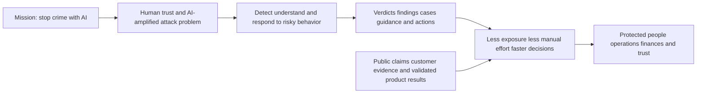
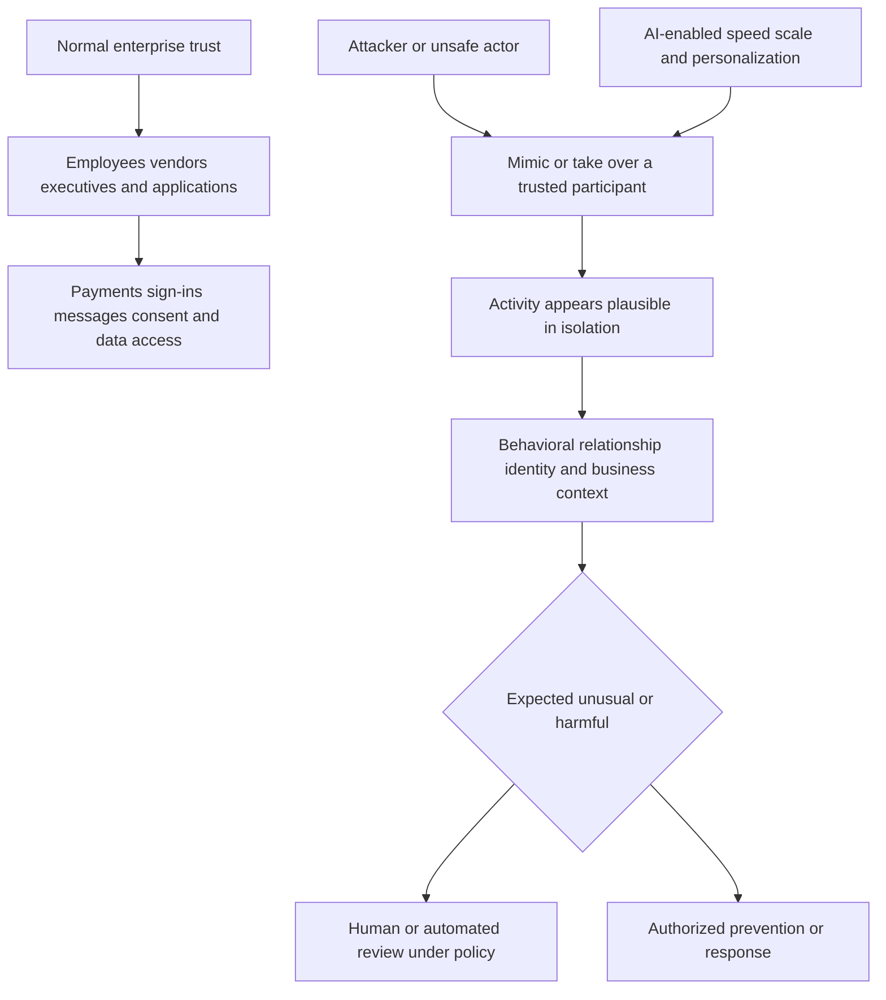
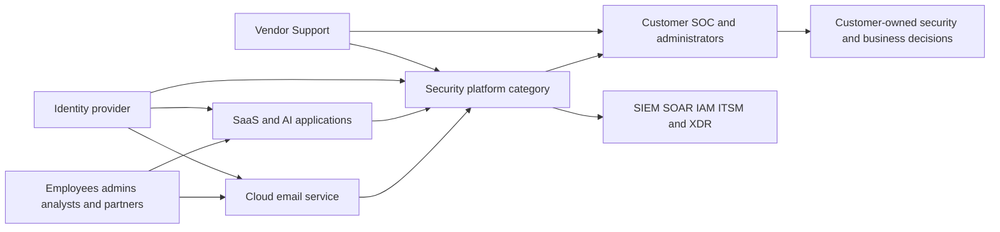
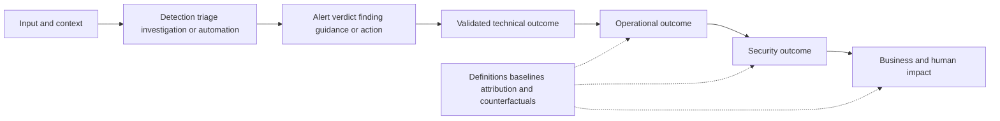
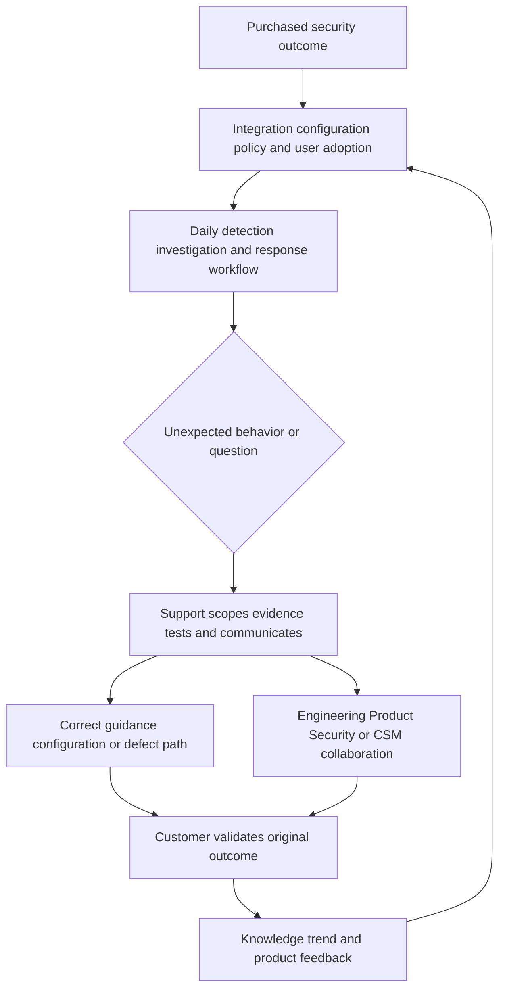
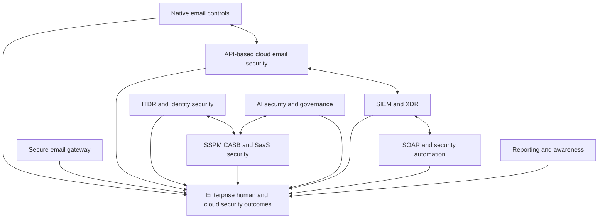
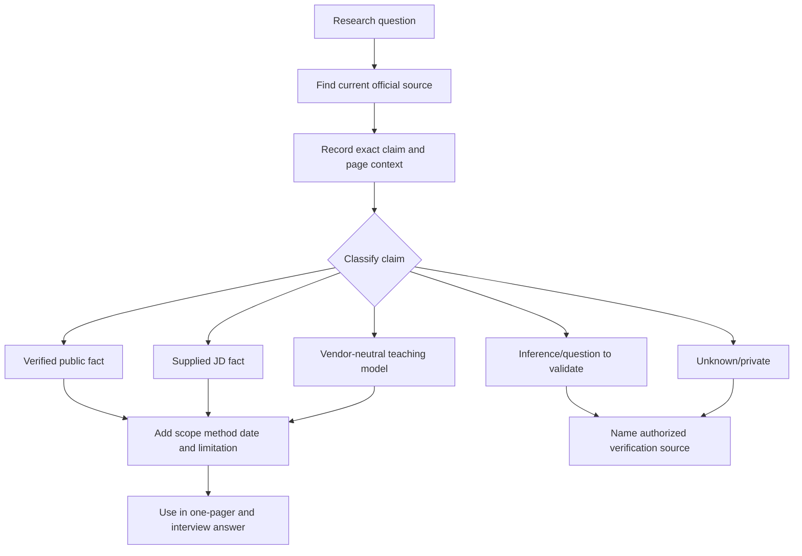
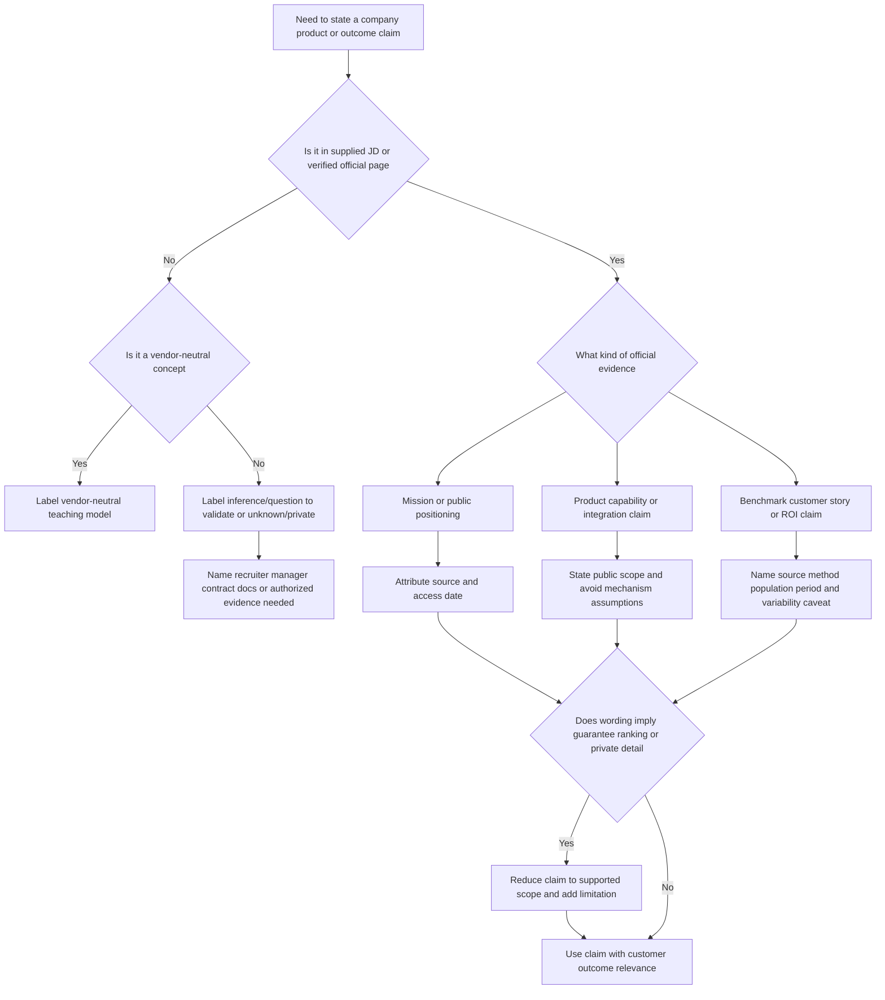
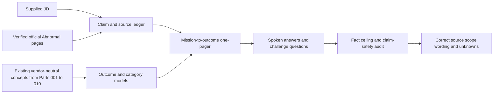

# Part 011 - Abnormal AI Mission Market and Customer Outcomes

> **Purpose:** Explain Abnormal AI's public mission, the human-behavior security problem it says it addresses, the enterprise context, and the customer outcomes that matter, while separating attributable company statements from neutral teaching models and unknown product details.
>
> **Evidence rule:** Abnormal-specific statements in this Part come only from the supplied job description (JD) or official public Abnormal pages verified for this guide. Market structure, outcome chains, and support methods are vendor-neutral teaching models. Marketing claims are attributed rather than converted into universal facts.
>
> **Currency and official-source access date:** August 24, 2026.

## Section Goal

By the end of this Part, you should be able to explain why a company might invest in behavior-centered security without beginning with product features. You should be able to move from a mission, to a human and business problem, to a security job, to a measurable customer outcome. You should distinguish an activity such as processing alerts from an outcome such as reducing exposure or returning analyst time to higher-value work.

You should also be able to research Abnormal with source discipline. You should know what the official pages publicly state, what the supplied JD names, what this guide teaches as a vendor-neutral model, what is only an inference or question to validate, and what remains unknown or private. You should be able to discuss adjacent competitive categories without declaring an unsupported winner, inventing a feature comparison, or treating a vendor's internal benchmark as independent proof.

The practical outcome is the **Northstar Mission-to-Outcome One-Pager and Source Ledger Lab**. It produces a one-page company brief, a claim ledger, an enterprise-pain map, an activity-to-outcome chain, a non-ranking category map, a customer-value hypothesis, interview-safe statements, and a scored validation record. The lab uses only public pages and synthetic examples. It requires no Abnormal account, customer data, product access, security testing, or competitor trial.

## JD Mapping

The mappings below come from the supplied Abnormal AI Technical Support Engineer JD as represented in the confirmed master. They are JD facts, not assumptions about current internal workflows.

| Supplied JD signal | Capability developed here | Practical proof |
|---|---|---|
| Abnormal AI mission and customer value | Connects public company purpose to customer problems and outcomes | Mission-to-outcome one-pager |
| Enterprise L1 Technical Support Engineer | Explains how accurate support protects product value after purchase | Support-value chain and ticket examples |
| Cloud Email Security | Places email protection in a human, identity, communication, and cloud context | Category and outcome map |
| AI Security Agents | Frames agentic security as a customer job involving bounded automation and human judgment | High-level portfolio question set |
| SaaS Security | Connects identities, applications, configuration, permissions, and behavior to enterprise risk | SaaS customer-pain map |
| Behavioral false-positive cases | Connects wrong verdicts to business interruption, analyst trust, and learning | Impact-versus-activity example |
| Threat investigations | Connects evidence quality and timely response to reduced uncertainty and exposure | Outcome ladder and scenario |
| Configuration and API questions | Shows that reliable integrations and configuration are prerequisites for value | Dependency-to-outcome map |
| Customer trust and clear communication | Uses sourced claims, candid uncertainty, and audience-centered outcomes | Claim-safe company explanation |
| CSM, Engineering, and Product collaboration | Distinguishes adoption, technical correction, and product learning outcomes | Stakeholder value table |
| KB, training, case deflection, and process improvement | Converts repeated friction into reusable customer and support value | Compounding-value model |
| Customer obsession, ownership, and intellectual honesty | Links public VOICE values to observable support behavior without claiming culture experience | Values-to-behavior translation |

## Candidate Honesty Note

Your production evidence remains your several years of enterprise support and escalation across the workloads and responsibilities stated in the master: SharePoint Online, OneDrive, Sync Client, Copilot, critical situations, customer and partner communication, Engineering and Product escalation, fix validation, KB and training creation, mentoring, and CSAT, backlog, and case-quality analysis. Those experiences support customer-outcome thinking, but they do not establish Abnormal AI or direct email-security experience.

| Evidence label | Honest use in this Part | Boundary to preserve |
|---|---|---|
| **Production-transfer example** | You can discuss enterprise support ownership, customer trust, high-impact communication, escalation, validation, knowledge, and support analytics from your real prior background | Do not turn prior work into Abnormal operation, threat-verdict ownership, or email-security production experience |
| **Local/public lab** | The Northstar lab proves public research, claim classification, outcome reasoning, and a synthetic one-pager | It does not prove product use, customer research, security operations, or competitor evaluation |
| **Learned architecture** | You can explain the public mission, public platform positioning, and vendor-neutral customer-value chain | Reading official pages does not reveal algorithms, internal data, workflows, permissions, or service commitments |
| **No direct experience** | You have no claimed direct Abnormal platform or direct email-security production experience | Say this plainly before discussing transferable strengths and study artifacts |
| **Template only** | The one-pager and source ledger can structure later company research | A template is not evidence that a customer achieved an outcome |

A safe interview bridge is:

> I have not operated Abnormal AI in production. My understanding of the company comes from its current official public material and the supplied JD. My prior enterprise-support experience gives me a proven foundation in customer outcomes, investigation, communication, escalation, fix validation, and knowledge creation. I am using a dated source ledger and synthetic labs to add the product and security domain without blurring those evidence tiers.

## Claim Labels and Product Fact Ceiling

Every product or company statement in this Part uses one of the following labels. The labels are not decoration; they determine how confidently the statement can be repeated.

| Label | Meaning | Example | Interview treatment |
|---|---|---|---|
| **Verified public fact** | A statement visible on a verified official Abnormal page as of the access date | Abnormal publicly states that its mission is to stop crime with AI | Attribute it: “Abnormal's official About page states...” |
| **Supplied JD fact** | A responsibility, product area, qualification, or collaboration signal in the supplied JD/master | The role names Cloud Email Security, AI Security Agents, and SaaS Security | Say “The supplied role description names...” |
| **Vendor-neutral teaching model** | A general framework used to explain security, SaaS, value, or support | A chain from telemetry to decision to action to outcome | Never present it as Abnormal's architecture or method |
| **Inference/question to validate** | A reasonable possibility that requires recruiter, manager, documentation, contract, or product confirmation | Which customer persona opens each ticket type most often? | Phrase as a question or conditional, not a fact |
| **Unknown/private** | Information not established by the allowed public evidence | Exact algorithms, features, internal APIs, support entitlements, SLAs, console fields, escalation paths, and customer-specific behavior | State that it is unknown and identify the authorized source needed |

The fact ceiling is deliberately low. Public pages can establish what a company says about its mission, problem, platform categories, integrations, trust, customer examples, and culture. They cannot establish how a particular tenant is configured, what a contract promises, which evidence an L1 engineer can access, how an internal model reaches a verdict, or which action is safe in a customer's environment.

## Beginner Term Primer

| Term | Plain meaning | Why it matters | Memory hook |
|---|---|---|---|
| **Mission** | The enduring purpose a company says it is trying to serve | It explains why the work should exist beyond revenue or features | Mission is the enduring “why” |
| **Market** | The group of customers, problems, providers, and alternatives around a need | It helps explain who has the problem and how they address it | Customers, needs, choices, constraints |
| **Category** | A useful grouping of products that solve a related job | It creates comparison vocabulary without proving equivalence | Same neighborhood, not same house |
| **Customer outcome** | A changed customer condition that has value | Security products matter only when they reduce harm, effort, or uncertainty | What became better? |
| **Activity** | Work performed by a person or system | It can contribute to value but is not value by itself | Work happened |
| **Output** | A direct product or process result | An alert, verdict, case, report, or completed action is an output | Something was produced |
| **Impact** | The consequence of an outcome for people or the business | It connects technical change to risk, time, cost, trust, or operation | Why the outcome matters |
| **Value proposition** | A concise explanation of the customer problem, offered benefit, and reason to choose an approach | It keeps an answer customer-centered | Problem, benefit, reason |
| **Business email compromise (BEC)** | Fraud or social engineering that abuses trusted business communication to influence a payment, data, or access decision | Official Abnormal pages name BEC as an email-security problem | Trust is the attack surface |
| **Phishing** | Deceptive communication intended to induce an unsafe action such as revealing credentials | It can be broad or highly targeted and may use legitimate-looking content | Deception seeks action |
| **Account takeover (ATO)** | Unauthorized control or use of a legitimate account | A real account can pass ordinary sender or sign-in checks | Valid identity, invalid controller |
| **Behavioral context** | Information about what is normal or unusual for identities, relationships, applications, or actions | Abnormal publicly centers behavior in its positioning | Meaning comes from context |
| **Behavioral AI** | Abnormal's public term for AI that models behavior and uses deviations/context in security decisions | It is central to the official company story | Learn normal to notice abnormal |
| **Cloud email** | Email delivered through a cloud service operated through online administration and APIs | It creates shared provider/customer/integration dependencies | Mail is a service chain |
| **Software as a Service (SaaS)** | Software delivered as an online service, commonly organized by tenant, identity, role, configuration, and integration | The JD names SaaS Security and the platform connects to cloud systems | Service online, responsibility shared |
| **Security Operations Center (SOC)** | The people and processes that monitor, investigate, and respond to security activity | SOC analysts are a major user/value persona in public product material | Evidence to decision to response |
| **Secure email gateway (SEG)** | A category of email security placed in or around mail flow to inspect messages | Official Abnormal pages compare their API-based approach with legacy gateways | Gateway inspects a mail path |
| **Native control** | Security capability included in an existing platform such as a mail provider | It may be one layer in a broader defense | Built in does not mean complete |
| **Return on investment (ROI)** | A comparison between value received and resources spent | Vendor studies may estimate ROI, but methods and applicability matter | Value relative to cost |
| **Time to value** | Time from adoption to a useful customer result | Fast setup is not enough; useful validated outcome matters | Useful result, not installation complete |
| **False positive** | Benign activity incorrectly treated as harmful or unwanted | It can interrupt work and reduce trust | Alarm without harmful condition |
| **False negative** | Harmful activity not detected or treated as harmful | It can increase exposure and response cost | Harm without alarm |
| **Differentiation** | A claimed reason one approach is meaningfully different | It must be tied to evidence and relevant customer jobs | Different must matter |
| **Competitive category** | A group of alternatives a buyer may compare | Categories can overlap and work together | Alternatives are not always substitutes |

## The Verified Public Company Story

The following is a concise, attributed account of what Abnormal publicly says. It is not an independent audit of efficacy.

| Public statement | Official anchor | Safe interpretation | What it does not establish |
|---|---|---|---|
| Abnormal says it was founded in 2018 “to stop crime with AI” | About page and homepage | **Verified public fact:** this is the company's stated mission | That every crime type or outcome is covered |
| The homepage frames AI-enabled attacks through machine speed, scale, and novel techniques | Homepage | **Verified public fact:** this is the problem framing used publicly | A measured trend for every customer or sector |
| The platform page describes behavioral AI protecting email, identity, and AI, and addressing insider threats | Platform overview | **Verified public fact:** this is current public platform positioning | The JD's three areas are identical to the current website taxonomy |
| The platform page names email, identity, AI, and insider-threat areas and public integrations | Platform overview and integrations page | **Verified public fact:** these categories and named integrations appear publicly | Exact licensing, availability, data fields, setup, or entitlement |
| Public pages describe API-based/cloud-native integration and state no MX changes for named email deployment messaging | Platform and integration pages | **Verified public fact:** this wording appears in public marketing | Exact deployment steps, permissions, duration for every tenant, or zero disruption |
| Public pages say more than 4,500 customers and more than 25% of the Fortune 500 use or trust Abnormal | Platform/about/why pages | **Verified public fact:** an attributable company claim current on the access date | Independent verification or a guarantee of suitability |
| The Trust Center presents security, privacy, compliance, certifications, and restricted evidence through a Security Hub | Trust Center | **Verified public fact:** public trust materials exist | Customer contract terms, all control evidence, or access to restricted reports |
| The careers page describes an AI-native company and VOICE values: Velocity, Ownership, Intellectual honesty, Customer obsession, Excellence | Careers page | **Verified public fact:** this is current public culture language | That every team or interview behaves identically |

### Mission-to-outcome chain

The diagram is a **vendor-neutral teaching model** wrapped around a **verified public mission**. The exact Abnormal mechanisms between jobs, outputs, and outcomes remain product-specific and cannot be inferred from the chain.

## 🔍 Plain-English deep-dive: A Mission Is Not a Feature List

A mission describes the enduring change a company wants to create. A feature is a capability offered by a product. “Stop crime with AI” is a mission statement. A verdict, search interface, policy control, or automated response is a product capability. Customers do not buy a mission by itself; they buy a credible path from capabilities to outcomes that serve their own objectives.

**Analogy:** A fire department's mission is protecting life and property. A ladder truck is one capability. Counting ladder movements does not prove that people were protected. The analogy stops because a cybersecurity company sells products in a market, and digital outcomes can be probabilistic, shared across providers, and difficult to attribute.

When you explain Abnormal, you should use three levels:

1. **Mission:** Abnormal publicly states that its mission is to stop crime with AI.
2. **Problem framing:** Its public material says attackers use AI for speed, scale, and sophistication, and that trusted communications and identities can look normal to rules or signature-oriented defenses.
3. **Customer outcome:** A customer wants fewer successful attacks, less exposure, less repetitive analyst work, more trustworthy decisions, and resilient cloud operations.

This structure avoids two mistakes. The first is reciting a list of product names with no customer meaning. The second is promising that a mission is already achieved in every environment. A mission sets direction; evidence, fit, operation, and customer validation establish outcomes.

### Mission statement quality check

| Question | Strong answer characteristic | Weak answer characteristic |
|---|---|---|
| What does the company say it exists to do? | Quotes or faithfully paraphrases the official mission | Invents a broader social promise |
| What problem makes that mission relevant? | Names human trust, cloud context, AI speed/scale/novelty, and operational limits | Says “cybersecurity is important” |
| Who benefits? | People, security teams, administrators, and organizations are connected to outcomes | Only the vendor benefits |
| How is progress evidenced? | Uses customer outcomes, controlled metrics, and source caveats | Treats activity counts as proof |
| What remains uncertain? | Names product fit, environment, configuration, shared responsibility, and private details | Speaks as if public marketing is a runbook |

## The Human-Behavior Security Problem

Many high-impact security events do not begin with obviously malicious code. They exploit human trust, ordinary workflows, valid accounts, vendor relationships, business timing, or permitted applications. A message can pass sender-authentication checks and still carry a fraudulent request. A legitimate vendor account can be controlled by an attacker. A valid session can be used by the wrong person. An approved-looking SaaS tool can have excessive access.

Official Abnormal pages emphasize this context. The public email-security pages name BEC, phishing, vendor fraud, account takeover, AI-generated lures, and compromised internal senders. The platform and AI-governance pages also discuss identity, SaaS, OAuth, AI tools/agents, configurations, and cross-source signals. These are public problem and capability claims; the private logic that evaluates any one event remains unknown.

The diagram is a **vendor-neutral teaching model**. It does not describe Abnormal's exact signals, feature engineering, thresholds, models, or action sequence.

### Human-centered problem patterns

| Pattern | Why traditional simple checks may struggle | Useful context category | Customer outcome sought |
|---|---|---|---|
| Executive impersonation | Display name and language may look plausible | Relationship, role, domain, request, history | Prevent fraudulent business action |
| Compromised vendor thread | Sender and thread can be genuine | Vendor behavior, changed request, timing, payment context | Protect supplier relationship and funds |
| Account takeover | Authentication can succeed with valid authority | Session, identity, device, behavior, mailbox changes | Stop unauthorized use and reduce blast radius |
| AI-generated lure | Writing quality and variation reduce simple pattern value | Sender-recipient relationship, intent, novelty, destination | Identify deception despite polished text |
| Excessive SaaS/OAuth grant | Consent can be technically valid but too broad | Purpose, permissions, owner, use, risk | Reduce unnecessary access and persistence |
| Risky configuration drift | Each setting may look ordinary alone | Baseline, change actor, timing, benchmark, business context | Restore defensible posture before exploitation |
| User-reported email queue | Most reports may be benign but all require attention | Message context, reporter, campaign relation, policy | Return analyst time while preserving feedback |

### Limits of “human behavior” language

Behavioral context is not mind reading. An unusual action can be legitimate; a harmful action can look normal. A public claim that AI models behavior does not tell an interviewer which personal fields are used, how privacy is protected in a specific deployment, how long data is retained, or why one verdict occurred. Those details require authorized product documentation and case evidence.

You should say:

> Abnormal publicly positions behavioral context as its central approach. At a vendor-neutral level, behavior can add relationship, identity, timing, sequence, and normal-versus-unusual context to isolated technical signals. I would not infer the private features, model design, customer data fields, or exact verdict path.

## Cloud and SaaS Enterprise Context

Enterprise communication and security now cross cloud providers, identity systems, applications, APIs, endpoints, and teams. A customer's desired outcome therefore depends on more than a single detector. Identity must be valid, integrations must have appropriate permissions, data must arrive with useful context, policy must express customer intent, actions must be authorized, and evidence must reach the people responsible for decisions.

This is a **vendor-neutral teaching model**, not an Abnormal architecture. Official public pages do verify that Abnormal describes cloud-native/API integration and lists integrations across categories such as SIEM, SOAR, identity and access management (IAM), information technology service management (ITSM), and extended detection and response (XDR). The exact data paths, permissions, fields, and responsibilities are **unknown/private** here.

### Enterprise pains

| Pain | What the customer experiences | Why it compounds | Outcome language |
|---|---|---|---|
| High-consequence social engineering | One believable request can create financial or access loss | Trust and urgency bypass ordinary review | Reduce successful fraudulent actions |
| Fragmented evidence | Mail, identity, SaaS, endpoint, and case data live in different systems | Analysts reconstruct context manually | Improve decision context and reduce uncertainty |
| Alert and report volume | Analysts repeatedly triage low-value or duplicate items | Time is diverted from complex investigations | Return analyst capacity to higher-risk work |
| Behavior that changes rapidly | New vendors, roles, tools, and attack techniques alter normal patterns | Static rules age and require maintenance | Adapt safely while controlling false decisions |
| Configuration drift | Settings and privileges change after initial deployment | Snapshots become stale and risk accumulates | Detect and correct meaningful drift |
| Integration fragility | Authentication, permissions, schema, rate, or queue failures interrupt workflows | A silent gap can look like “no threats” | Maintain observable, trustworthy data flow |
| False positives | Legitimate activity is blocked or treated as harmful | Business interruption and analyst distrust grow | Preserve productivity while maintaining protection |
| False negatives | Harmful activity is missed | Exposure, investigation, and recovery cost grow | Improve detection and response without false certainty |
| Unclear ownership | Customer, vendor, and provider boundaries are confused | Work stalls or unsafe actions occur | Route evidence and decisions to the correct owner |
| Difficult value proof | Activity is visible but risk reduction is hard to attribute | Renewal and prioritization become narrative contests | Measure outcomes with definitions and caveats |

## 🔍 Plain-English deep-dive: Security Activity Is Not Security Impact

An alert is an output. An investigated alert is an activity. A removed malicious message is a technical outcome. Avoided credential theft or prevented fraudulent payment is a potential business impact. These are connected, but they are not interchangeable.

**Analogy:** A smoke detector sounding is an output. A responder checking the room is activity. Extinguishing a real fire is an outcome. Preventing injury and property loss is impact. The analogy stops because a security alert can be probabilistic, the counterfactual “what would have happened” may be unknowable, and an automated action can itself create harm.

### Activity-to-impact ladder

| Level | Example | Evidence required | Claim caution |
|---|---|---|---|
| Input | Message, identity event, configuration, user report | Source, time, scope, integrity | Input presence does not prove complete coverage |
| Processing activity | Analysis, search, enrichment, triage | Run/event IDs, version, status | Processing does not prove correctness |
| Output | Verdict, alert, finding, response recommendation | Object ID, rationale, confidence, policy | Output is not customer impact |
| Technical outcome | Threat removed, access denied, posture corrected, report classified | Action/result and validation | Action can be partial or wrong |
| Operational outcome | Less analyst effort, faster investigation, fewer repeated cases | Baseline, method, period, comparison | Attribution and selection effects matter |
| Security outcome | Reduced exposure, fewer successful attacks, smaller blast radius | Defined population, incidents, control evidence | Absence of loss is difficult to attribute |
| Business impact | Protected people/funds/data, continuity, trust, cost avoided | Business owner evidence and assumptions | Avoided-loss claims require explicit methodology |

An interview answer should move up the ladder only as far as evidence permits. “The system classified 1,000 reports” is not “1,000 attacks stopped.” “Analysts saved time” needs a baseline and measurement method. “Loss prevented” needs an explicit counterfactual method. Vendor case studies and commissioned studies can be useful customer evidence, but their design and applicability must remain visible.

## Customer Value by Persona

Value is role-specific. One outcome can be valuable for different reasons.

| Persona | Job to be done | Valuable outcome | Evidence they need | Support contribution |
|---|---|---|---|---|
| SOC analyst | Triage and investigate meaningful signals | Less repetitive work and better context | IDs, timeline, verdict rationale, action state | Explain product-visible evidence and resolve workflow friction |
| Email administrator | Keep mail secure and usable | Reliable policy, routing, quarantine, and recovery | Configuration, message IDs, changes, expected/actual | Isolate configuration, service, and product boundaries |
| Identity team | Protect accounts, sessions, roles, and grants | Reduced unauthorized authority and clearer identity evidence | Sign-in, grant, role, session, policy, action results | Correlate supported product context without commanding identity response |
| SaaS owner | Maintain approved applications and configurations | Appropriate privileges, observable drift, usable integration | App owner, permission, change, audit, service state | Diagnose integration/configuration and route authorization decisions |
| Security leader | Reduce material risk and operate an effective program | Fewer harmful outcomes, trustworthy automation, clear tradeoffs | Trends, coverage, error cost, control evidence, limitations | Turn cases into accurate product and process signals |
| Executive/business owner | Protect operations, finances, people, and reputation | Risk reduced without unacceptable disruption | Impact, scope, options, confidence, decision time | Translate technical state into decision-ready language |
| End user | Work safely with understandable guidance | Less unwanted mail, fewer unsafe prompts, timely feedback | Plain result and action | Minimize effort and avoid unsupported security conclusions |
| CSM | Help the customer achieve intended value | Adoption, stakeholder alignment, confidence, realized outcome | Goals, milestones, blockers, health signals | Own technical case while supplying reliable value context |
| Engineering/Product | Improve intended behavior and customer fit | Reproducible defects, recurring needs, validated fixes | Expected/actual, evidence, frequency, impact, explicit ask | Convert customer friction into actionable learning |

### Support as a value-preservation function

When a detection product works technically but the integration is misconfigured, the value is not realized. When a false positive blocks an important message, customer trust can fall. When a threat case is escalated without IDs or timeline, specialists lose time. When a fix ships but the customer workflow is not validated, activity is mistaken for outcome.

This is a **vendor-neutral teaching model**. Exact Abnormal support responsibilities, access, queues, handoffs, entitlements, and targets are **unknown/private**.

## Customer Outcomes and Measurement

Good outcome statements have five components:

1. **Population:** Which users, messages, identities, systems, or cases?
2. **Condition:** What changed from which baseline?
3. **Time:** Over what period?
4. **Evidence:** Which source and method support the claim?
5. **Limit:** Which attribution, coverage, or counterfactual uncertainty remains?

| Outcome family | Possible metric | Definition question | Misleading shortcut |
|---|---|---|---|
| Threat prevention | Confirmed harmful messages prevented or remediated | Confirmed by whom, over which population and window? | All flagged messages called attacks |
| False-decision quality | False-positive and false-negative rates | What ground truth and sampling method apply? | Accuracy without prevalence/context |
| Analyst capacity | Median handling time or hours returned | Baseline workflow, included labor, and quality guardrails? | Vendor estimate applied to every team |
| Investigation speed | Time from signal to justified decision | Which start/end events and waiting periods? | Tool processing time called response time |
| Exposure duration | Time harmful authority/content remained usable | Which evidence confirms start, containment, and scope? | Alert time used as compromise time |
| Integration reliability | Expected events/actions successfully complete | Which stages, retries, duplicates, and delays count? | Connector “green” equals end-to-end health |
| User experience | Legitimate work delivered with useful feedback | Which population, complaints, releases, and surveys? | Fewer tickets assumed to mean satisfaction |
| Posture improvement | High-priority gaps corrected and sustained | Which benchmark, risk context, drift window, and exceptions? | Score increase called breach prevention |
| Business impact | Loss avoided, continuity preserved, or trust improved | What counterfactual and attribution method? | Marketing figure repeated as customer guarantee |

### Public numbers and source discipline

Official Abnormal pages display customer counts, Fortune 500 share, benchmark comparisons, case-study outcomes, commissioned-study ROI, attacks detected, and analyst time saved. These can show the company's public evidence strategy. They must be attributed with the named source and caveat. The homepage itself notes that individual security outcomes may vary for some claims, and individual pages identify internal data, customer examples, or commissioned studies.

## 🔍 Plain-English deep-dive: An Avoided Loss Is a Counterfactual

A **counterfactual** is an estimate of what would have happened if the product, control, or action had not been present. Security value often depends on counterfactuals because a prevented event leaves no directly observable loss. If a suspicious payment request is blocked, the organization can observe the message and the block; it cannot automatically know that an employee would have paid it or what amount would have been unrecoverable.

**Analogy:** A seat belt may prevent an injury, but one safe journey does not tell us exactly what injury would have occurred without it. Population studies, crash conditions, and careful assumptions help estimate benefit. The analogy stops because cyber attackers adapt, customer controls interact, and financial consequences depend on human decisions and recovery.

Use an evidence ladder. First record the observed threat and validated action. Next identify the exposed workflow and people. Then state the plausible consequence and the assumptions connecting it to loss. Use a range or scenario where precision is unavailable. Name other controls that may also have prevented harm. A commissioned ROI study can supply a structured counterfactual for its studied population, but applying its figure to a different customer requires new baseline and fit analysis.

The honest phrase is: “The evidence shows the harmful request was detected and handled before the defined action occurred; avoided financial impact is an estimate that depends on the customer's workflow and stated assumptions.” This is stronger than a dramatic number because the customer can audit every step.

Safe phrasing:

> Abnormal's official platform page states that it powers more than 4,500 customers and more than 25% of the Fortune 500. Its public email pages also present internal benchmarks, customer examples, and Forrester Total Economic Impact figures. I would use those as attributable vendor evidence, examine the methodology and customer fit, and avoid presenting them as guaranteed outcomes.

Unsafe phrasing:

> Abnormal always saves every customer thousands of hours and prevents all BEC.

## Market and Category Vocabulary

The market can be described without a ranking. Categories overlap, products evolve, and many enterprises use several layers.

| Category | Center of gravity | Customer job | Common evidence | Relationship to behavior-centered security |
|---|---|---|---|---|
| Native cloud email security | Controls included by Microsoft 365, Google Workspace, or another mail provider | Protect the provider's mail environment | Message trace, policy, quarantine, alerts | Foundational layer that may coexist with other products |
| Secure email gateway (SEG) | Inspect mail at a gateway or mail-flow boundary | Filter inbound/outbound messages and enforce policy | SMTP/mail-flow logs, verdicts, quarantine | Alternative or complementary architecture depending on design |
| API-based cloud email security | Integrate with cloud mail and related services through APIs | Add detection, investigation, and response without the same gateway position | API events, message IDs, action results | Public Abnormal positioning emphasizes this category |
| Integrated cloud email security (ICES) | Industry category for cloud-focused email security combining prevention, detection, investigation, and response | Protect cloud email against modern threats | Cross-message/identity context and response evidence | Category wording varies by analyst and vendor |
| Identity threat detection and response (ITDR) | Detect and respond to identity misuse and control weaknesses | Protect accounts, sessions, privileges, and identity systems | Sign-in, role, session, grant, behavior | Can intersect account takeover and SaaS behavior |
| SaaS security posture management (SSPM) | Assess and improve SaaS configuration posture and drift | Find risky settings and prioritize correction | Configuration, benchmark, change, owner | Intersects public Abnormal posture material and JD SaaS Security |
| Cloud access security broker (CASB) | Apply visibility/control to cloud application usage and data paths | Govern cloud access, applications, and data | App use, policy, data events, enforcement | May overlap SaaS and AI governance jobs |
| AI security/governance | Discover, assess, and govern AI tools, agents, prompts, permissions, and data use | Enable AI while controlling privacy, access, and policy risk | Tool inventory, grants, policy, activity, approval | Current Abnormal public AI Governance page occupies part of this area |
| SIEM/XDR | Aggregate/correlate security evidence across domains | Search, detect, investigate, and connect signals | Events, detections, incidents, timelines | Consumes or enriches email/identity/SaaS signals |
| SOAR/security automation | Orchestrate workflows, approvals, and actions | Reduce repetitive work and coordinate response | Playbook runs, action IDs, approvals | Agentic workflows may overlap but are not automatically equivalent |
| Security awareness and phishing reporting | Help users recognize/report risk and reinforce behavior | Improve reporting and reduce user risk | Reports, simulations, guidance, outcomes | Intersects AI Security Mailbox and AI Phishing Coach public pages |

The diagram is a **vendor-neutral non-ranking map**. Arrows show possible coexistence or integration, not mandatory architecture.

## 🔍 Plain-English deep-dive: Competitors Can Be Alternatives, Complements, or Both

Customers do not always compare one product against one direct substitute. They may compare a native control with an add-on, a gateway with an API-based platform, a specialized product with a broader suite, or automation with additional staffing and process. Two providers can compete for budget while their products also integrate.

**Analogy:** A commuter can compare a train, car, bicycle, remote work, or a combination. The “best” choice depends on route, time, cost, safety, weather, and goals. The analogy stops because security controls manage adversarial risk and can interact in ways transport choices do not.

A responsible competitor discussion uses criteria rather than rankings:

| Comparison criterion | Question | Evidence needed |
|---|---|---|
| Customer job | Which threat, workflow, or control problem must change? | Use cases and affected personas |
| Architecture fit | How does the option interact with mail flow, APIs, identity, endpoints, and existing controls? | Current official architecture and customer environment |
| Coverage | Which populations, channels, threats, configurations, and actions are supported? | Product documentation and controlled evaluation |
| Decision quality | How are false positives, false negatives, explanations, and uncertainty handled? | Ground truth, sampling, error analysis, customer workflow |
| Operations | What work remains for analysts/admins and what is automated? | Time study, playbooks, approvals, exception handling |
| Trust and governance | What security, privacy, compliance, access, and audit evidence exists? | Trust documentation, contract, customer assessment |
| Integration | Which existing systems and data/action contracts are supported? | Verified integrations, permissions, schemas, tests |
| Reliability/support | How are availability, change, cases, and escalations handled? | Contract, support plan, references, operational evidence |
| Economics | Which costs, avoided losses, staffing effects, and switching costs apply? | Customer-specific model and explicit assumptions |
| Strategic fit | Does the option support future channels, AI use, identity, and operating model? | Roadmap discussion separated from commitments |

Never say “Abnormal is better than Vendor X” from public positioning alone. A safe statement is: “Abnormal publicly differentiates around behavioral AI, API-based/cloud-native architecture, automation, and a platform spanning email, identity, AI, and insider-threat concerns. A buyer should validate those claims against its requirements, current controls, error costs, trust needs, and controlled evidence.”

## Evidence-Based Company Research

Company research should be reproducible. Each claim needs a title, URL, access date, claim type, exact support, caveat, and revalidation trigger.

### Source quality hierarchy

| Source | Best use | Caution |
|---|---|---|
| Supplied JD | Role scope and named expectations | May be a snapshot; confirm live role details |
| Official mission/about/careers pages | Company purpose, public history, values, culture claims | Employer-authored positioning |
| Official product/platform pages | Current public capabilities and taxonomy | Marketing detail may change and omit limitations |
| Official Trust Center/security documentation | Public trust, compliance, privacy, assurance paths | Restricted evidence and contracts may be required |
| Official customer stories | Named customer context and claimed outcomes | Selected examples; applicability varies |
| Official resource center/research | Threat and product education | Check methodology, author, date, and whether data is internal |
| Independent standards/authorities | Stable vocabulary and risk/control models | Not evidence of one vendor's implementation |
| Analyst/customer reviews | Market perspective and experience | Method, sponsorship, selection, date, and access matter |
| Competitor pages | Competitor's own current claims | Do not use one vendor to define another unfairly |

## Public VOICE Values and Support Behavior

The careers page publicly defines VOICE as Velocity, Ownership, Intellectual honesty, Customer obsession, and Excellence. You should not claim to have experienced Abnormal's culture. You can explain how your existing behavior aligns with the public language.

| Public value | Public theme | Transferable support behavior | Boundary |
|---|---|---|---|
| Velocity | Move quickly with purpose and learn from challenges/mistakes | Choose the fastest safe discriminating test and correct course visibly | Speed does not override privacy or evidence |
| Ownership | Step into problems and drive outcomes | Maintain case continuity across dependencies | Do not perform unauthorized specialist actions |
| Intellectual honesty | Put facts over ego and challenge respectfully | Separate observation, inference, unknown, and correction | Do not use candor as an excuse for poor preparation |
| Customer obsession | Work should serve customer value | Start with impact and reduce customer effort | Agreement with every request is not obsession |
| Excellence | Raise the bar in work, feedback, and outcomes | Produce reproducible evidence, useful escalations, and validated closure | Perfectionism must not delay urgent useful action |

Your production transfer is credible: critical-situation communication maps to purposeful velocity and ownership; Engineering/Product escalation and fix validation map to outcome quality; KB/training and mentoring map to compounding learning; CSAT/backlog/case-quality analysis maps to customer outcomes and operational improvement. Exact stories and results must come from you, not this guide.

## Worked Examples

### Worked example 1: Mission question

**Question:** “What does Abnormal AI do, and why does it matter?”

**Weak answer:** “It is the best AI email-security company and uses thousands of signals to stop every advanced attack.”

**Why weak:** “Best” is unsupported, “every” is false certainty, and the answer turns a public high-level signal claim into a private mechanism and guarantee.

**Stronger answer:**

> Abnormal's official public mission is to stop crime with AI. Its public pages frame the problem as attackers using AI for speed, scale, and increasingly convincing techniques that exploit human trust, valid identities, and cloud workflows. Abnormal publicly positions a behavioral security platform across email, identity, AI, and insider-threat concerns, with behavioral context and API-based integrations. The customer outcome is not simply more alerts; it is fewer successful attacks, less manual analyst work, faster justified decisions, and more trustworthy operation. I have learned that public model, but I have not operated the platform or seen its private detection logic.

### Worked example 2: Customer asks for ROI

**Input:** A customer leader asks whether the product will produce the ROI figure shown on a public page.

**Reasoning:** The displayed number is an attributable study or vendor claim, not a contractual forecast. Ask about customer baseline, current losses, analyst workflow, message volume, existing controls, labor assumptions, deployment scope, error costs, adoption, and measurement period.

**Customer-safe response:**

> The public figure is useful as an example of a study result, not a guaranteed return for this environment. We should define your current costs and outcomes, identify which product workflows are in scope, agree measurement definitions, and compare validated results over time. Contractual or commercial commitments belong to the authorized account and legal teams.

### Worked example 3: False positive as a value case

**Input:** A legitimate supplier message is treated as harmful, delaying an approved payment review.

**Activity-only view:** One message was submitted for review and the ticket was escalated.

**Outcome view:** Support protects value by preserving the message ID and business impact, following the supported verdict-review path, avoiding unsupported release advice, maintaining updates, and validating the original workflow. Product or detection specialists may need the case evidence. The customer mail/security owner controls release and business-risk decisions.

**Value tension:** Reducing false positives protects availability and trust; reducing false negatives protects confidentiality, integrity, funds, and accounts. Tuning one error cost without the other is not customer obsession.

### Worked example 4: Competitor question

**Question:** “Is Abnormal better than secure email gateways?”

**Strong response:**

> I would not make an absolute ranking without the customer's requirements and controlled evidence. A gateway and an API-based cloud email-security platform occupy different architectural positions and may be alternatives or layers. Abnormal publicly differentiates around behavior, cloud/API integration, automation, and threats that it says evade legacy approaches. I would compare the customer's use cases, mail architecture, coverage, false-decision costs, investigation workflow, integrations, trust requirements, operations, and economics. I would also distinguish current capability from roadmap language.

### Worked example 5: Support case becomes product value

**Input:** Several customers report confusion about the same outcome label, but the underlying behavior is expected.

**Reasoning:** Individual cases need accurate resolution. The repeated pattern may indicate findability, terminology, user-experience, or onboarding friction rather than a defect.

**Actions:** Support records the exact question and resolution, links related evidence, proposes a KB or training correction, shares pattern/frequency/impact with Product and CSM, and measures whether repeated contacts decline without hiding unresolved cases.

**Outcome:** One case becomes reusable clarity. You can tie this method to your real KB/training, mentoring, and case-quality experience, but you cannot claim Abnormal's tooling or metric.

## Troubleshooting Decision Tree for Company and Value Claims

Use this tree when an interview, customer discussion, or study note contains a product, market, outcome, or competitor claim.

### Symptom-to-hypothesis-to-check matrix

| Symptom | Likely claim problem | Cheap check | Observation | Next action |
|---|---|---|---|---|
| “Abnormal always...” | Marketing claim became universal | Find scope, footnote, variability, and population | Claim is customer/internal study | Attribute and add applicability caveat |
| “The product uses field X...” | Public outcome became private mechanism | Search verified official page for exact field | No official support | Mark unknown/private and ask what evidence would validate |
| “Best in the market” | Ranking has no defined criteria/source | Ask best for which job, population, date, and method | No comparison method | Replace with public differentiation and criteria |
| Customer count differs across notes | Pages changed over time | Compare page and access dates | Older source is stale | Use current attributable figure and preserve date |
| JD taxonomy differs from website | Role scope and public portfolio evolved differently | Compare exact JD wording with current page headings | Three JD areas are not one-to-one with current public taxonomy | Teach both and state the mismatch explicitly |
| Activity called outcome | Output ladder was skipped | Ask what changed for customer and how validated | Only alert/case count exists | Report activity only; define outcome measurement |
| Avoided loss sounds exact | Counterfactual is hidden | Ask method and assumptions | Figure comes from commissioned study | Attribute and do not promise customer result |
| Competitor dismissed broadly | Category and customer fit ignored | Apply comparison criteria | Products overlap/coexist | Use a non-ranking map and controlled evaluation question |

## Common Failure Modes and Safe Corrections

| Failure mode | Why it fails | Safe correction | Escalation/validation trigger |
|---|---|---|---|
| Mission becomes capability guarantee | Purpose does not prove performance | Attribute mission and separately describe evidence | Customer decision needs contractual capability |
| Public taxonomy treated as permanent | Product portfolios evolve | Record access date and compare current pages/JD | Naming affects purchase or support routing |
| “Behavioral AI” explained as private algorithm | Public concept does not reveal model design | Explain context at category level | Exact verdict or data question requires authorized docs |
| Customer logo treated as endorsement of every capability | Customer relationships vary in scope | Use only the linked story and stated outcome | Reference call or proof requires account owner |
| Vendor benchmark treated as independent science | Dataset, labels, prompt, period, and sponsorship matter | Name source and methodology caveat | Material decision needs technical evaluation |
| Activity metric sold as risk reduction | Processing count does not establish prevented harm | Use the activity-to-impact ladder | Executive asks for ROI or risk claim |
| False positives ignored in threat-first story | Protection can disrupt legitimate work | Discuss both error costs and customer controls | High-impact legitimate workflow affected |
| Competitor ranking without evaluation | Customer need and architecture are missing | Compare categories/criteria, not brand adjectives | Buyer requests shortlist or formal proof |
| Current feature mixed with future direction | Roadmap language is not commitment | Separate currently stated capability from disclaimer | Purchase/support promise is requested |
| Trust certification used as blanket security proof | Scope and report detail matter | Point to Trust Center and authorized evidence process | Contract, audit, or control question arises |
| Careers language claimed as personal experience | Public values are aspirational/declared | Say how your evidence aligns, not “I know the culture” | Interviewer asks observed internal examples |
| Customer outcome promised by Support | Outcome depends on customer, configuration, contract, and evidence | State supported path and validation plan | Commercial, legal, or risk commitment requested |
| Abnormal name attached to synthetic architecture | Creates invented product fact | Label every diagram vendor-neutral | Exact product data flow is required |
| “No direct experience” ends the answer | Honest gap lacks relevant value | Add transfer, sourced model, lab artifact, and ramp | Follow-up asks readiness |

## Northstar Mission-to-Outcome One-Pager and Source Ledger Lab

### Lab purpose

Create a concise, evidence-based company brief that you can use to answer mission, market, customer-value, and competitor-category questions without unsupported claims. The lab's “northstar” is the customer outcome; every feature or metric must point toward that outcome and carry a source label.

### Honest artifact label

> **LOCAL/PUBLIC RESEARCH LAB - Built from verified official public pages and synthetic analysis. No Abnormal AI product access, customer research, direct email-security operation, competitor evaluation, private documentation, or production experience is represented.**

### Prerequisites

1. This Part and Parts 001-010.
2. A private local Markdown or spreadsheet workspace for the learner's own exercise.
3. Ordinary browser access to the verified official sources listed below.
4. The supplied JD/master as the only role-scope source.
5. No Abnormal login, Support Portal access, demo, trial, API key, customer evidence, competitor account, scraping, automation, or security testing.
6. Ninety minutes for research and drafting, followed by a thirty-minute spoken review.

### Authorized scope and privacy

| Area | In scope | Out of scope |
|---|---|---|
| Sources | Public official pages and supplied JD/master | Restricted Security Hub, private support docs, leaked material, customer systems |
| Data | Page titles, URLs, access date, public claims, synthetic outcome examples | Personal information, customer evidence, credentials, screenshots with hidden data |
| Comparison | Category definitions and neutral criteria | Competitor trials, ranking, scanning, reverse engineering, performance claims without source |
| Product detail | Public mission, positioning, categories, named public integrations | Algorithms, exact fields, internal APIs, console steps, permissions, deployment mechanics, SLAs |
| Candidate claim | Public research and production-transfer method | Direct product/email-security experience |

### Lab topology

### Step 1: Write the research question

Use: “What mission and enterprise problem does Abnormal publicly claim to address, which customer outcomes follow logically, what evidence supports those claims, and what remains unknown?”

**Expected evidence:** The question includes public claim, customer outcome, evidence, and unknowns. “Learn everything about Abnormal” fails because it has no boundary.

### Step 2: Build the source ledger

Create at least twelve rows using:

| Claim ID | Claim text | Label | Source title/URL | Access date | Scope | Caveat | Revalidate when |
|---|---|---|---|---|---|---|---|
| C-011-01 | Abnormal states its mission is to stop crime with AI | Verified public fact | Official About page | August 24, 2026 | Company mission | Mission is not performance guarantee | Mission/about wording changes |
| C-011-02 | Role names Cloud Email Security, AI Security Agents, and SaaS Security | Supplied JD fact | Confirmed master/JD | August 24, 2026 | Role scope | Current website taxonomy differs | Live role changes |
| C-011-03 | Exact model features used for a specific verdict | Unknown/private | No authorized public support | August 24, 2026 | Product internals | Must not infer | Authorized case documentation provides evidence |

Include mission, attack framing, public platform taxonomy, customer count claim, API/integration positioning, Trust Center, careers values, one customer-story claim, one product metric, one vendor-neutral model, one inference, and two unknown/private entries.

### Step 3: Build the mission-to-problem paragraph

Write no more than 120 words. It must contain:

- the attributed mission;
- human trust and cloud context;
- public AI speed/scale/novelty framing;
- behavior-centered public positioning;
- no private mechanism claim.

**Expected evidence:** A reader can underline the source-backed phrases and circle the explicit limit.

### Step 4: Build the customer-pain map

Choose six pains from the enterprise-pain table. For each record persona, current activity burden, security/business risk, desired outcome, measure, and evidence owner. Include at least one false-positive pain, one false-negative pain, one integration pain, one posture/permission pain, and one analyst-effort pain.

### Step 5: Create the activity-to-outcome chain

For three synthetic use cases, fill all levels from input to business impact. Mark where evidence ends.

| Synthetic use case | Input/activity | Output | Technical outcome | Operational outcome | Business impact | Highest evidenced level |
|---|---|---|---|---|---|---|
| User-reported benign message | Report triaged | Safe verdict and feedback | No unnecessary remediation | Analyst/user receives closure | Trust/time may improve | Output only unless measured |
| Harmful campaign | Synthetic messages analyzed | Threat verdict and action record | Named messages removed under policy | Exposure window reduced | Potential loss avoided | Technical outcome in lab narrative |
| Posture drift | Synthetic setting changes | Finding and guidance | Authorized owner corrects setting | Risky condition no longer present | Breach likelihood may reduce | Technical outcome; business impact inferred |

### Step 6: Build a non-ranking category map

Include native email security, SEG, API-based cloud email security/ICES, ITDR, SSPM, CASB, AI governance, SIEM/XDR, SOAR, and awareness/reporting. For each, state primary job, possible overlap, required evidence, and “not enough information to rank.”

### Step 7: Write a customer-value hypothesis

Use this pattern:

> For **[persona/population]** who struggle with **[verified or synthetic problem]**, a behavior-centered cloud security approach may help **[technical/operational outcome]**, leading to **[business/security impact]**, if **[integration, configuration, policy, adoption, and evidence conditions]** hold. We would measure **[metric with definition]** and validate **[error/side-effect guardrail]**.

Create one hypothesis for SOC analyst capacity and one for reducing BEC exposure. Label both **vendor-neutral teaching model**, not Abnormal guarantees.

### Step 8: Analyze two official metrics

Choose one public scale/adoption claim and one outcome/benchmark claim. Record source, sponsor, population, time, method, definition, applicability, and uncertainty. If the page does not provide enough methodology, write “unknown from this page.” Never fill a blank with an assumption.

### Step 9: Draft the one-pager

The one-pager must contain exactly these blocks:

1. Mission and why now.
2. Human/cloud problem.
3. Current public platform positioning versus JD taxonomy.
4. Top customer pains.
5. Outcomes and evidence.
6. Market/category context without ranking.
7. Why L1 Support protects value.
8. Candidate honesty boundary.
9. Five questions to validate with recruiter/manager.
10. Source footer with August 24, 2026 access date.

### Step 10: Write validation questions

Use questions rather than assumptions:

1. How does the team currently map the JD's three named areas to the live product portfolio?
2. Which case categories and customer personas are most common for L1?
3. Which product documentation is authoritative for current capabilities and deployment?
4. Which outcomes and quality measures define successful L1 work?
5. Which product, support, and security details are confidential or entitlement-specific?

### Step 11: Practice three answers

Record 45-second answers for “What is Abnormal's mission?”, “What customer problem does it solve?”, and “How is it different?” Score source attribution, customer outcome, category clarity, candidate honesty, and avoidance of private detail.

### Cleanup and privacy

1. Delete screenshots and copied page content not needed for the ledger.
2. Keep links and short paraphrases rather than duplicating whole pages.
3. Search for unsupported words such as `always`, `guarantees`, `all`, `exactly`, `best`, `only`, `zero false positives`, and `never misses`.
4. Search for invented console fields, internal API names, permission scopes, SLAs, support tiers, and deployment steps.
5. Record page access date and a future revalidation date.
6. Keep the artifact private by default; it contains no customer or credential data.

### Expected evidence and artifacts

| Artifact | Required content | Honest label |
|---|---|---|
| Source ledger | Twelve or more classified claims with URLs, caveats, and triggers | Local/public research lab |
| Mission paragraph | Attributed mission, problem, context, boundary | Learned architecture |
| Customer-pain map | Six pains, personas, risks, outcomes, measures | Vendor-neutral teaching model |
| Activity-to-outcome chains | Three use cases with evidence ceiling | Local/synthetic analysis |
| Category map | Ten non-ranking categories and overlaps | Learned architecture |
| Value hypotheses | SOC capacity and BEC exposure hypotheses with conditions | Template only |
| Metric review | Scale and outcome claims with method caveats | Local/public research lab |
| One-pager | Ten required blocks | Learned architecture plus local research |
| Validation questions | Five recruiter/manager questions | Template only |
| Spoken scorecard | Three timed answers and correction notes | Local practice artifact |

### Validation rubric

| Dimension | 0 | 2 | 4 |
|---|---|---|---|
| Mission accuracy | Invented or vague | Correct mission | Attributed mission plus scope and outcome connection |
| Fact labels | Claims blended | Most labels present | Every Abnormal/JD/model/inference/unknown claim is correctly classified |
| Product fact ceiling | Private detail asserted | General cautions | No invented algorithms, fields, APIs, console steps, entitlements, SLAs, mechanics, or customer behavior |
| Customer problem | Generic “cyber is hard” | Several pains | Human trust, AI context, cloud/SaaS, operations, and error costs connected |
| Outcome discipline | Activities called impact | Ladder used | Evidence ceiling, measures, guardrails, and attribution limits explicit |
| Market context | Brand ranking | Categories listed | Ten categories compared by jobs/fit without unsupported ranking |
| Source quality | Secondary/undated | Official links | Current official URLs, access date, page context, caveat, revalidation trigger |
| Metric integrity | Numbers repeated | Source named | Sponsor, population, method, time, applicability, and unknowns recorded |
| Support relevance | Product summary only | Support mentioned | Case quality tied to adoption, trust, resolution, validation, knowledge, and product learning |
| Candidate honesty | Product experience implied | Gap stated | Production transfer, lab, learned architecture, and no-direct-experience boundaries precise |
| Privacy/safety | Customer/private content used | Public data only | Minimal public notes, no access/login/testing, cleanup complete |
| Spoken clarity | Jargon or memorized claims | Understandable | Three concise answers survive challenge without claim drift |

**Passing target:** 42/48 or higher, with 4s in fact labels, product fact ceiling, source quality, candidate honesty, and privacy/safety. Any private document access, product login, competitor testing, customer data, invented mechanism, unsupported ranking, or production-experience claim is an automatic failure.

## Official Source Anchors (accessed August 24, 2026)

| Official source | URL | Used for | Claim boundary |
|---|---|---|---|
| Supplied Abnormal AI Technical Support Engineer JD represented in the confirmed master | No public URL supplied | Role scope, named product areas, responsibilities, collaboration, and culture signals | **Supplied JD fact** only; confirm live wording with recruiter |
| Abnormal AI homepage | <https://abnormal.ai/> | Mission, AI attack problem framing, public platform positioning, public scale and benchmark claims | **Verified public fact** as employer-authored material; footnotes and variability matter |
| An AI-Native Company Dedicated to Cybersecurity | <https://abnormal.ai/about> | Founding story, 2018 mission statement, public impact and AI-native positioning | **Verified public fact**; not independent proof of outcomes or culture |
| The Abnormal Behavioral Security Platform | <https://abnormal.ai/platform/overview> | Current public platform taxonomy, behavioral positioning, integrations, customer-scale statements | **Verified public fact**; no private architecture, data, permissions, or support workflow inferred |
| The Future of Cybersecurity Is Abnormal | <https://abnormal.ai/why-abnormal> | Public differentiation around behavior, automation, API-first products, AI-era positioning | **Verified public fact**; differentiation is a vendor claim, not a neutral ranking |
| The Modern Email Security Platform for the Era of AI | <https://abnormal.ai/platform/email-security> | Public email problem/capability/outcome language and named studies/examples | **Verified public fact**; metrics require their stated source/method and are not guarantees |
| Inbound Email Security | <https://abnormal.ai/platform/inbound-email-security> | Public BEC/phishing/vendor/account-takeover framing and API/no-MX-change positioning | **Verified public fact**; do not convert marketing wording into deployment instructions |
| AI Security Mailbox | <https://abnormal.ai/platform/ai-security-mailbox> | Public manual-triage problem, automated triage/response/remediation positioning | **Verified public fact**; exact guardrails, confidence handling, entitlements, and workflows remain unknown |
| AI Governance | <https://abnormal.ai/platform/ai-governance> | Public AI tool/agent/chat visibility, risk, policy, and governance problem framing | **Verified public fact**; page includes a future-functionality disclaimer and does not define the JD taxonomy |
| Security Posture Management | <https://abnormal.ai/platform/security-posture-management> | Public Microsoft 365 configuration, benchmark, drift, prioritization, and guidance framing | **Verified public fact**; exact checks, frequency, fields, and remediation ownership are not inferred |
| Platform Integrations | <https://abnormal.ai/platform/technology-integrations> | Current public integration categories and named integrations | **Verified public fact**; listing does not establish setup, data direction, scope, entitlement, or support responsibility |
| Customer Stories | <https://abnormal.ai/customers/stories> | Selected public customer problems and outcome claims | **Verified public fact** about published stories; selection and applicability limits remain |
| Resource Center | <https://abnormal.ai/resources> | Official research, guides, webinars, and product-resource family | **Verified public fact**; each resource needs individual date, method, and claim review |
| Abnormal Trust Center | <https://abnormal.ai/trust-center> | Public security, privacy, compliance, certification, Security Hub, and subprocessor pathways | **Verified public fact**; restricted reports and contractual meaning require authorized review |
| Careers at Abnormal | <https://abnormal.ai/careers> | AI-native public culture language and VOICE values | **Verified public fact** about published values, not direct experience of the culture |

### Source discipline

- The official mission, public attack framing, platform categories, customer counts, integrations, values, and product outcome language are **verified public facts** only within the pages' wording and access date.
- Cloud Email Security, AI Security Agents, and SaaS Security are **supplied JD facts**. This Part does not force them into a one-to-one match with the current website's email, identity, AI, insider-threat, and platform taxonomy.
- Outcome ladders, persona-value maps, category maps, and support-value loops are **vendor-neutral teaching models**.
- Team structure, common ticket mix, product-to-JD mapping, success measures, and authoritative internal documentation are **inference/questions to validate**.
- Exact algorithms, training data details beyond explicit public statements, data fields, APIs, console procedures, permissions, support access, entitlements, SLAs, deployment steps, incident process, and customer-specific behavior are **unknown/private**.
- Public metric, benchmark, customer-story, and ROI claims must retain sponsor, population, period, method, and variability caveats where available.

## Interview Q&A

### Q1.

**Question:** What is Abnormal AI's mission, and why is it relevant now?

**Model answer:** Abnormal's official public mission is to stop crime with AI. Its public pages frame the current problem as attackers using AI to increase speed, scale, and sophistication while exploiting trusted human relationships, valid identities, and cloud workflows. Abnormal publicly positions behavioral AI as a way to understand normal identity and communication context and identify meaningful deviations. The customer goal is not AI for its own sake; it is fewer successful attacks, less repetitive analyst work, faster justified decisions, and safer enterprise operation. I attribute those statements to public sources and do not infer the private model or guarantee an outcome.

### Q2.

**Question:** What customer problem is Abnormal trying to solve?

**Model answer:** The public problem story centers on attacks that can look legitimate in isolation: BEC without a payload, a compromised vendor replying in a real thread, a valid internal account, an AI-generated lure, an over-permissioned application, or risky configuration drift. These situations can bypass simple signature, authentication, or static-rule checks and create analyst workload. A behavior-centered approach adds identity, relationship, sequence, and normal-versus-unusual context. The desired outcomes are reduced exposure and effort while controlling false positives. Exact Abnormal signals and verdict logic remain private.

### Q3.

**Question:** How do you distinguish activity, output, outcome, and impact?

**Model answer:** Activity is work performed, such as analyzing a report. Output is what that work produces, such as a verdict or case. A technical outcome is a changed state, such as a malicious message removed or an access grant corrected. Operational and security outcomes include reduced handling time or exposure. Business impact is protected funds, data, continuity, people, or trust. I move up that ladder only when evidence supports it. Alert counts do not equal attacks stopped, and avoided-loss claims need an explicit counterfactual method.

### Q4.

**Question:** How would you explain Abnormal's market category without oversimplifying competitors?

**Model answer:** I would describe overlapping jobs rather than one winner. Enterprises may use native cloud-email controls, secure email gateways, API-based cloud email security or ICES, identity threat protection, SaaS posture or access controls, AI governance, SIEM/XDR, SOAR, and awareness/reporting. These can compete, complement, or integrate. Abnormal publicly differentiates around behavioral AI, cloud/API integration, automation, and a platform spanning email, identity, AI, and insider-threat concerns. A fair evaluation tests customer use cases, architecture, coverage, error costs, operations, trust, integration, support, and economics.

### Q5.

**Question:** What outcomes matter to a SOC analyst versus an executive?

**Model answer:** A SOC analyst values high-signal context, less repetitive triage, reliable actions, and an evidence trail that speeds a justified decision. An executive values reduced material risk, protected operations and people, efficient use of resources, and trustworthy governance. They share one evidence core, but the analyst needs message, identity, verdict, timeline, and action detail while the executive needs impact, scope, confidence, options, owner, and next checkpoint. Neither should receive an unsupported promise of prevented loss.

### Q6.

**Question:** How does L1 Support contribute to customer value?

**Model answer:** Product value can fail at configuration, permissions, integration, expected behavior, evidence interpretation, or adoption. L1 protects value by defining expected and actual outcomes, scoping impact, collecting minimum evidence, testing supported hypotheses, resolving known paths, escalating a precise question, communicating reliably, and validating the original workflow. Repeated cases can become knowledge or Product evidence. My prior support experience proves those methods, but I have not yet applied them inside Abnormal's product or internal processes.

### Q7.

**Question:** Which Abnormal claims would you verify before repeating them?

**Model answer:** I would verify every changing number, product name, integration, benchmark, deployment statement, certification, customer outcome, and roadmap-related capability against the current official page and its footnotes. I would classify vendor studies, internal data, customer stories, and commissioned ROI separately. For an operational answer I would also verify current product documentation, contract, tenant configuration, entitlement, and support policy. I would never infer exact algorithms, fields, APIs, console steps, permissions, SLAs, or customer behavior from marketing language.

### Q8.

**Question:** Why are you interested in this company when you have no direct email-security experience?

**Model answer:** The mission and problem connect to work I already value: protecting customer outcomes through complex enterprise investigation, candid communication, ownership, Engineering/Product collaboration, fix validation, and reusable knowledge. My several years in enterprise support provide production evidence for that support discipline. Direct Abnormal and email-security operation remain real gaps. I am addressing them through dated official research, beginner-first security and mail study, synthetic labs, artifacts, and spoken practice. I would bring mature support habits now and earn product depth without representing study as experience.

## 30-Second Memory Hooks

- **Mission is the enduring why; a feature is one possible how.**
- **Abnormal publicly states: stop crime with AI.**
- **Public problem frame: AI increases attack speed, scale, and novelty.**
- **Human trust, identity, relationships, and cloud workflows are security surfaces.**
- **Behavioral context is public positioning; private model logic stays unknown.**
- **Input, activity, output, technical outcome, operational outcome, security outcome, impact.**
- **Alerts processed are activity; customer risk reduced requires evidence.**
- **Vendor metrics are attributable evidence, not universal guarantees.**
- **The JD's three areas and the current public website taxonomy are related, not identical.**
- **Competitors may be alternatives, complements, or both.**
- **Compare customer jobs, architecture, coverage, errors, operations, trust, integration, and economics.**
- **Support preserves value across configuration, evidence, communication, escalation, and validation.**
- **VOICE: Velocity, Ownership, Intellectual honesty, Customer obsession, Excellence.**
- **Align with public values through real evidence; do not claim internal culture experience.**
- **Attribute, scope, caveat, and revalidate.**
- **Public research is learned architecture, not product operation.**

## Completion Checklist

- [ ] I can state Abnormal's public mission and attribute it to an official source.
- [ ] I can explain the public AI speed, scale, and novelty problem framing without treating it as a universal measured fact.
- [ ] I can explain human trust, valid accounts, vendor relationships, SaaS permissions, and configuration as security context.
- [ ] I can distinguish mission, feature, activity, output, technical outcome, operational outcome, security outcome, and business impact.
- [ ] I can state why false positives and false negatives create different customer costs.
- [ ] I can explain cloud/SaaS dependencies and shared ownership without inventing Abnormal architecture.
- [ ] I can distinguish the supplied JD's three named areas from the current public website taxonomy.
- [ ] I can describe at least ten competitive categories without unsupported ranking.
- [ ] I can explain why alternatives may also be complements or integrations.
- [ ] I can evaluate a public benchmark or ROI claim by source, sponsor, population, time, method, applicability, and caveat.
- [ ] I can translate customer value for SOC, admin, identity, SaaS, leadership, executive, end-user, CSM, Engineering, and Product personas.
- [ ] I can connect L1 case quality to adoption, trust, resolution, validation, knowledge, and product learning.
- [ ] I can discuss VOICE values as public culture statements and connect them only to real transferable evidence.
- [ ] I completed the Northstar lab with at least twelve claim-ledger rows and no private or restricted source.
- [ ] My one-pager contains the ten required blocks and records August 24, 2026 as the access date.
- [ ] I classified every statement as verified public fact, supplied JD fact, vendor-neutral teaching model, inference/question to validate, or unknown/private.
- [ ] I created three activity-to-outcome chains and stopped each claim at its evidence ceiling.
- [ ] I created a non-ranking category map and two conditional customer-value hypotheses.
- [ ] I reviewed one scale/adoption and one outcome/benchmark claim without converting either into a guarantee.
- [ ] I scored at least 42/48, with mandatory 4s in fact labels, product fact ceiling, source quality, candidate honesty, and privacy/safety.
- [ ] I used no Abnormal account, customer data, private documentation, competitor trial, scraping, automation, or security testing.
- [ ] I made no claim about exact algorithms, data fields, internal APIs, console steps, permissions, support entitlements, SLAs, deployment mechanics, or customer-specific behavior.
- [ ] I can deliver the three practice answers in 45 seconds each without “best,” “always,” or “guarantee” language.
- [ ] I can explain your prior support experience as transferable method while preserving no-direct-Abnormal and no-direct-email-security boundaries.
- [ ] I revalidated every official URL and changing claim against the August 24, 2026 source ledger.

[Next: Part 012 - Portfolio Map Cloud Email Security AI Security Agents and SaaS Security](Part-012-portfolio-map-cloud-email-security-ai-security-agents-and-saas-security.md)