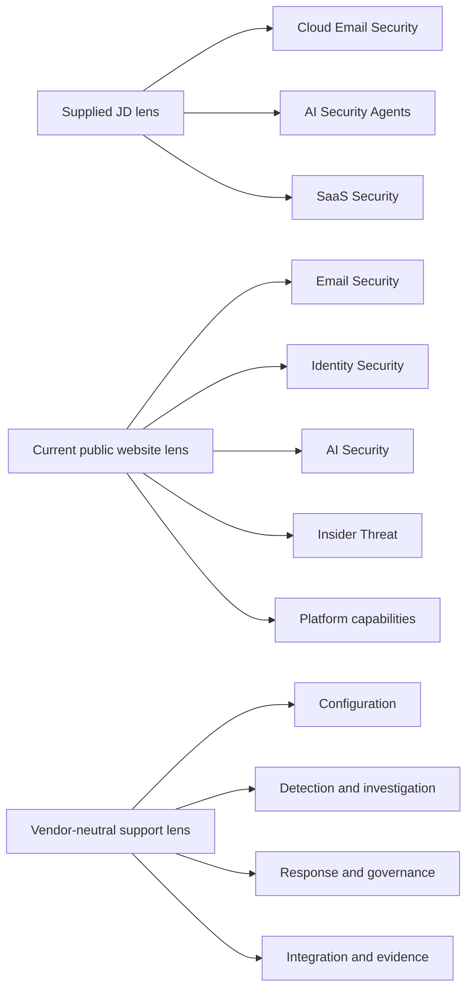
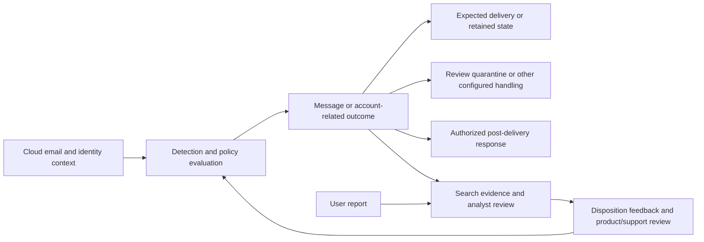
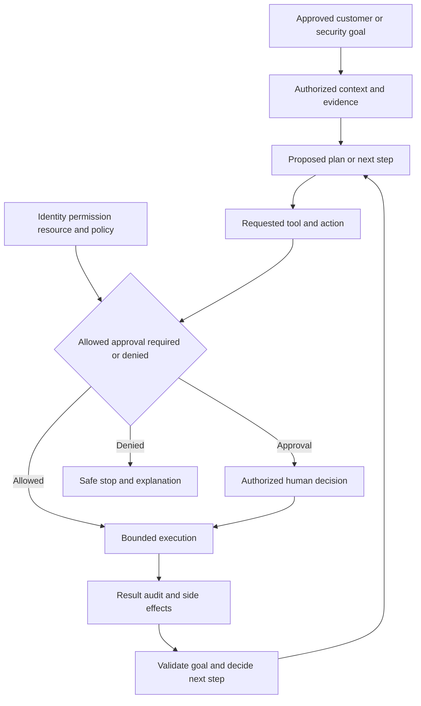
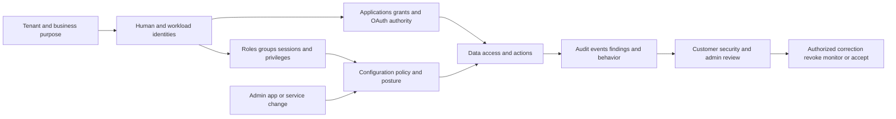
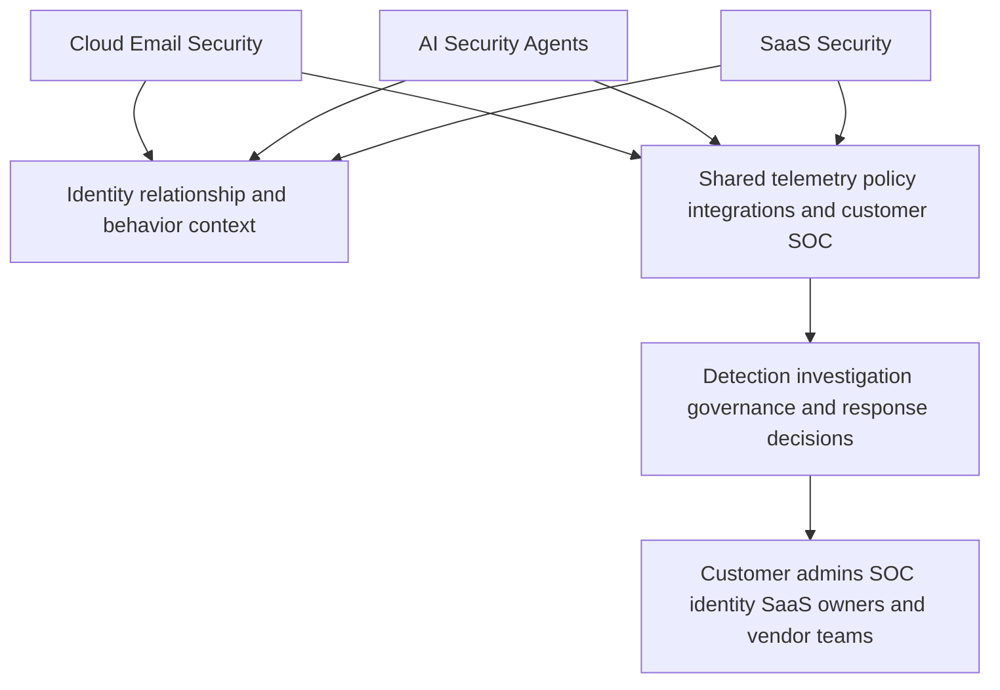
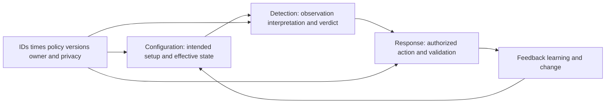
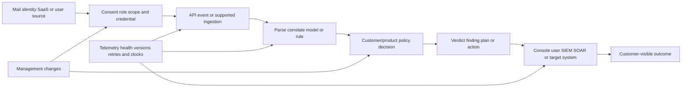
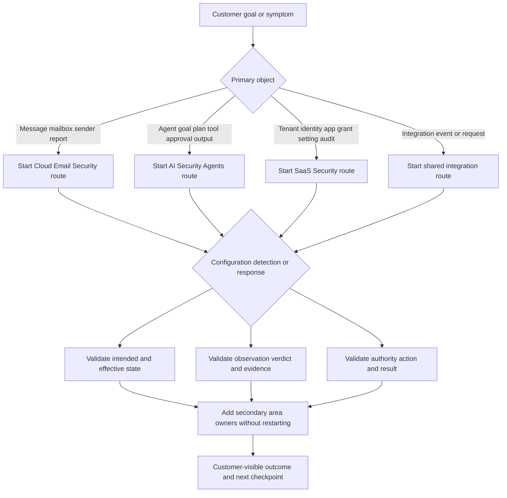
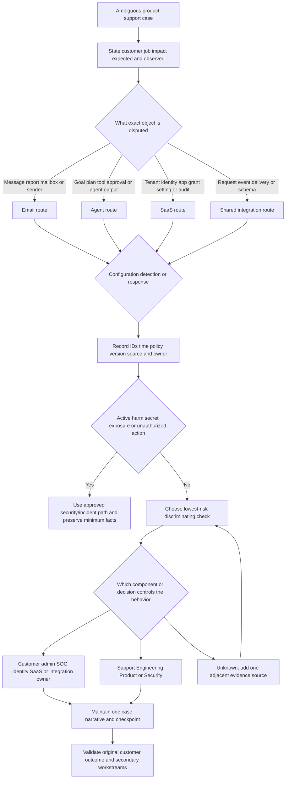
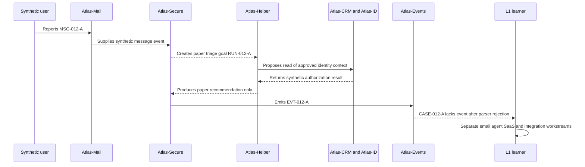

# Part 012 - Portfolio Map Cloud Email Security AI Security Agents and SaaS Security

> **Purpose:** Distinguish the three product areas named in the supplied JD, route high-level customer use cases and support questions among them, and preserve the boundary between current official public positioning and unknown product internals.
>
> **Evidence rule:** Cloud Email Security, AI Security Agents, and SaaS Security are supplied JD facts. Current Abnormal public pages use a broader and evolving taxonomy that includes Email Security, Identity Security, AI Security, Insider Threat, and platform capabilities. This Part does not assume those taxonomies are identical.
>
> **Currency and official-source access date:** August 24, 2026.

## Section Goal

By the end of this Part, you should be able to hear a customer goal or symptom and identify the most relevant starting area without pretending that product boundaries are simple. You should explain the primary job of Cloud Email Security, AI Security Agents, and SaaS Security; identify where they intersect through identities, behavior, integrations, permissions, policy, telemetry, and response; and route questions by the object and decision involved rather than by a familiar keyword.

You should also be able to distinguish configuration questions from detection questions and response questions. A configuration question asks whether the intended setup, permission, policy, or integration state is correct. A detection question asks what was observed, how an outcome should be interpreted, and whether a false positive or false negative may exist. A response question asks what action was proposed or performed, who authorized it, whether it succeeded, and how it can be validated or reversed. One ticket may contain all three, but mixing them hides owners and evidence.

The practical outcome is the **Atlas Three-Lane Portfolio Comparison and Routing Lab**. It produces a three-area comparison, a current-public-versus-JD taxonomy ledger, a use-case router, a dependency map, a configuration/detection/response classifier, boundary questions, eight synthetic case routes, an escalation worksheet, and a scored validation record. It uses no product account, customer data, live API, email, SaaS tenant, or agent.

## JD Mapping

| Supplied JD signal | Capability developed here | Practical proof |
|---|---|---|
| Cloud Email Security | Explains email-centered prevention, detection, investigation, and supported response jobs | Email use-case and support-surface map |
| AI Security Agents | Explains bounded goal/tool/approval/observability workflows at a high level | Agent workflow and question router |
| SaaS Security | Explains tenant, identity, application, configuration, permission, audit, posture, and behavior jobs | SaaS risk/control map |
| Enterprise L1 Technical Support Engineer | Classifies the first owning surface and keeps cross-area continuity | Case-routing worksheet |
| Configuration tickets | Separates prerequisites, effective state, permissions, change, and drift | Configuration evidence matrix |
| API questions | Locates producer, identity, authorization, transport, contract, and consumer | Integration dependency map |
| Behavioral false positives | Distinguishes a disputed verdict from setup and response mechanics | Detection-review route |
| Threat investigations | Preserves message, identity, SaaS, and timeline evidence while customer SOC owns response | Cross-area investigation map |
| Timely updates and customer trust | States current route, unknowns, owner, dependency, and checkpoint | Customer-safe routing update |
| Engineering/Product/CSM collaboration | Routes defect, intended behavior, adoption, and product need separately | Handoff table |
| Named ecosystem | Uses current public integration categories without inventing contracts or data flows | Ecosystem question matrix |
| Intellectual honesty | Makes public/JD/model/private boundaries visible | Fact-ceiling ledger |

## Candidate Honesty Note

You can bring production evidence from enterprise support: tenant and cloud context, complex investigation, customer communication, critical-situation coordination, Engineering/Product escalation, fix validation, KB/training, mentoring, and support analytics. Your Copilot and agent background is a useful bridge to goals, prompts, verification, and human oversight. Your AD/Entra, SSO/SAML/OAuth, REST/JSON, networking, and diagnostic learning helps frame integrations and access. None of this becomes direct Abnormal, email-security, AI-security-agent, or SaaS-security product operation.

| Evidence label | Honest statement | Boundary |
|---|---|---|
| **Production-transfer example** | “I have owned complex enterprise cloud cases and cross-team escalations.” | Do not imply Exchange security, Abnormal, or named non-Microsoft platform production ownership |
| **Working knowledge/upskilling** | “I understand identity, API, networking, AI, and SaaS concepts and can form a diagnostic plan.” | Do not imply deep architecture or production scale |
| **Local/public lab** | “I routed synthetic cases among three portfolio areas and produced an evidence map.” | It is not console, tenant, message, or agent operation |
| **Learned architecture** | “Current official pages publicly describe specific high-level capabilities and categories.” | Public material does not reveal exact implementation or support process |
| **No direct experience** | “I have not operated Abnormal or direct email-security workflows.” | State this before using transferable examples |
| **Template only** | “I have a routing and escalation worksheet.” | A template does not prove a real case occurred |

## Fact Labels and Taxonomy Guardrail

| Label | Use in this Part | Example |
|---|---|---|
| **Verified public fact** | Current official Abnormal wording visible on a verified page | The public platform overview currently presents Email Security, Identity Security, AI Security, and Insider Threat areas |
| **Supplied JD fact** | The role description/master's wording | The role names Cloud Email Security, AI Security Agents, and SaaS Security |
| **Vendor-neutral teaching model** | General jobs, layers, dependencies, and support routes | Configuration -> detection -> response is a diagnostic lens |
| **Inference/question to validate** | Plausible relationship requiring internal confirmation | Which current product team owns each JD area? |
| **Unknown/private** | Exact product behavior not shown by allowed evidence | Features by entitlement, internal API contracts, agent autonomy, fields, console steps, SLAs, and escalation queues |

The main rule is: **do not force labels from different sources into false equivalence**. “AI Security Agents” in the JD may refer to a defined internal/current product area, but the public site pages verified here present AI Security, AI Governance, AI Security Mailbox, and references to AI agents. The exact mapping is an **inference/question to validate**. Similarly, “SaaS Security” in the JD is broader than one public posture-management page; the internal scope remains unknown.

## Beginner Term Primer

| Term | Plain meaning | Why it matters | Memory hook |
|---|---|---|---|
| **Portfolio** | A related set of products or capabilities offered to customers | Support must know which customer job and owner a question belongs to | Many products, one value story |
| **Product area** | A high-level grouping of capabilities and users | It is a starting route, not always a hard boundary | Route by job and object |
| **Use case** | A specific way a person uses a capability to achieve an outcome | Names like “AI” are too broad without a use case | Who does what, for which result? |
| **Job to be done** | The progress a customer is trying to make | It keeps routing centered on outcomes rather than feature names | What progress is the customer hiring this for? |
| **Support surface** | A place where setup, behavior, evidence, or action can create a question | Surfaces reveal likely evidence and owner | Where a symptom becomes visible |
| **Configuration** | Settings, roles, policies, connections, and prerequisites intended to shape behavior | Wrong or stale state can mimic a defect | What should the system be set to do? |
| **Effective configuration** | The setting that actually applies after inheritance, precedence, propagation, and exceptions | A visible value may not be the enforced value | Displayed is not always effective |
| **Detection** | A rule, model, analytic, or human conclusion that identifies activity of interest | It can be disputed or incomplete | Evidence becomes a candidate concern |
| **Verdict** | A classification or judgment assigned to an object | A verdict is an output, not infallible truth | Decision label with evidence and limits |
| **Response** | An authorized action intended to reduce harm, restore state, or communicate an outcome | It can create side effects and needs validation | Act, observe, verify |
| **Remediation** | A corrective response that removes or changes an unwanted condition | It is not the same as prevention or root cause | Correct the condition |
| **Agent** | Software that pursues a goal through reasoning or planning and tool use within constraints | Agent support adds permissions, approvals, state, and non-determinism | Goal plus tools plus boundaries |
| **Assistant** | Software that helps a human create or interpret something, commonly leaving execution to the person | It may be less autonomous than an agent, but product labels vary | Helps; may not act |
| **Automation** | A predefined action or workflow executed by software | It can be fixed or dynamic and still needs controls | Repeat a task consistently |
| **Tenant** | A logical customer boundary in a SaaS service | Identity, data, configuration, and ownership must be tenant-aware | One service, separated customers |
| **Application grant** | Permission given to an application to access a resource or action | Excessive or stale grants create risk and failures | App authority must match purpose |
| **Posture** | Current security condition of configuration, controls, and exposure | Posture changes as settings and identities change | Security state right now |
| **Drift** | Movement away from an intended or approved state | A system can be correct at launch and risky later | Good state can slowly move |
| **Telemetry** | Recorded observations about events, decisions, and system state | Every area depends on trustworthy evidence | Observations make behavior supportable |
| **Policy** | An approved rule that converts inputs into a decision or action | Configuration, detection, and response may each use policy | Inputs plus rules produce treatment |
| **Control plane** | The logical path that makes and coordinates decisions | A decision can fail even when data is reachable | Decide and direct |
| **Data plane** | The path carrying actual messages, events, content, or actions | It reveals what moved or changed | Carry the work |
| **Management plane** | The path used to configure roles, policy, and integrations | A management change can alter many future outcomes | Configure the deciders |
| **Intersection** | A customer job or dependency shared by two or more areas | Cross-area cases need one narrative and several owners | Shared object, distinct decisions |
| **Routing** | Choosing the best initial owner/path for a case | Correct routing reduces restarts and customer effort | Start where the decision lives |

## Three Lenses, Not One Taxonomy

The portfolio should be read through three lenses.

| Lens | What it is good for | What it cannot prove |
|---|---|---|
| Supplied JD lens | Interview scope, role expectations, named support areas | Current product packaging, ownership, entitlement, or workflow |
| Current public website lens | Public company/product language on August 24, 2026 | Private organization, customer contract, complete feature matrix, support routing |
| Vendor-neutral support lens | Stable diagnostic questions across products | A vendor's actual architecture or approved procedure |

An interview-safe sentence is:

> The supplied JD names Cloud Email Security, AI Security Agents, and SaaS Security. The current public platform pages use a broader taxonomy across email, identity, AI, insider threat, and platform capabilities. I would learn the company's authoritative internal mapping after joining; for preparation, I route by customer job, protected object, evidence, and decision.

## Portfolio at a Glance

| JD-named area | Primary customer job | Typical protected objects | High-level outputs | High-level outcomes | Public context used | Private boundary |
|---|---|---|---|---|---|---|
| Cloud Email Security | Keep harmful messages and account-driven email threats from producing unsafe outcomes while preserving legitimate mail | Messages, senders, recipients, relationships, mailboxes, accounts, policies | Verdicts, investigations, findings, guidance, supported message actions | Reduced exposure, less manual triage, safer mail operation | Email Security, Inbound Email Security, AI Security Mailbox pages | Exact detection logic, fields, thresholds, mail-flow mechanics, permissions, quarantine semantics |
| AI Security Agents | Use bounded AI-driven workflows to investigate, communicate, recommend, or act safely | Goals, prompts, messages/events, tools, permissions, approvals, memory/state, actions | Plans, classifications, recommendations, messages, tool calls, action records | Less repetitive work, faster handling, consistent guidance with controlled risk | Supplied JD; public AI Security Mailbox and AI Governance context | Exact agents, autonomy, models, prompts, tool contracts, approval gates, rollback, entitlement |
| SaaS Security | Understand and reduce risky identity, application, configuration, permission, and activity conditions across cloud services | Tenants, users, service identities, apps, grants, roles, settings, audit events, data | Inventory, posture findings, risk context, drift records, guidance, supported actions | Reduced excessive access, improved posture, faster prioritization, accountable change | Supplied JD; public Security Posture Management, AI Governance, Identity Security context | Full SaaS scope, connectors, checks, cadence, scoring, remediation execution, ownership |

## Cloud Email Security

Cloud Email Security begins with a customer job: allow expected communication while reducing malicious, fraudulent, unwanted, or risky outcomes. It operates in a cloud ecosystem that can include a mail provider, directory/identity provider, users, administrators, security analysts, integrations, and response workflows.

Official public Abnormal pages describe protection against BEC, phishing, vendor fraud, account takeover, AI-generated lures, and other email threats; behavioral context; investigation/search; user-reported email triage; and remediation capabilities. These are **verified public facts as public positioning**. The exact supported workflow in a customer's tenant remains governed by current documentation, configuration, entitlement, and authorization.

### Email security job map

This is a **vendor-neutral teaching model**, not an exact Abnormal flow. Public pages support high-level detection, investigation, user-report, and remediation positioning, but not every arrow or state.

### Email support surfaces

| Surface | Customer question | Minimum-first evidence | First route |
|---|---|---|---|
| Message outcome | Why was message X delivered, held, classified, or actioned? | Message/object ID, UTC time, tenant, observed/expected state, policy context | Detection/policy path |
| False positive | Why was a legitimate message treated as harmful? | Stable ID, business impact, sender/recipient context, verdict, comparison | Verdict review plus customer mail owner |
| False negative | Why was a harmful message not identified or acted on? | Raw/safe message evidence, route, IDs, user report, harmful behavior, source health | Threat/detection review with SOC boundary |
| Delivery/routing | Did the message reach the mail/security path? | Message trace, timestamps, route, provider status | Mail-flow/integration path |
| Quarantine/release | Which system holds it and who may release? | Object state, owner, policy, requested action | Customer mail/security owner plus product guidance |
| Remediation | Was the intended message action authorized and completed? | Action ID, target IDs, scope, result, exception | Response/action path |
| User report | Was report received, classified, communicated, and related scope addressed? | Report ID, message ID, timestamps, outcome, feedback status | Reporting workflow path |
| Search/investigation | Why is an item missing or query incomplete? | Query, time, filters, object IDs, retention/source coverage | Evidence/search path |

## 🔍 Plain-English deep-dive: Email Security Is More Than Blocking at the Door

A simple picture of email security is a guard checking every letter before it enters a building. That model helps explain a gateway, but modern cloud email work can also include post-delivery evidence, identity context, user reports, investigation, and authorized response. The analogy stops because cloud messages can be copied, forwarded, changed by intermediaries, and accessed through accounts and APIs after delivery.

The customer outcome is not “block more mail.” Blocking everything would maximize one narrow notion of prevention while destroying communication. The real job balances harmful-message reduction, legitimate-mail availability, investigation quality, privacy, and operational effort.

Support therefore asks four separate questions:

1. **Path:** Did the message and related context reach the expected systems?
2. **Decision:** Which observable verdict or policy outcome occurred?
3. **Action:** What delivery, quarantine, or remediation state followed?
4. **Customer meaning:** Was the message harmful, expected, unwanted, or uncertain in the customer's context?

This separation matters for false positives and false negatives. A false-positive ticket is not merely “release mail”; it tests evidence, expected behavior, customer authorization, and error cost. A false-negative ticket is not proof of a defective model; it first requires message-path, data, configuration, behavior, and ground-truth review.

## AI Security Agents

The supplied JD names AI Security Agents. For this guide, an agent is a vendor-neutral software actor that pursues an approved goal using context and tools within constraints. An assistant may draft or summarize while leaving execution to a person. Automation may follow fixed steps. Product names can use these words differently, so the actual capability and authority matter more than the label.

Current official pages provide related public context. AI Security Mailbox is publicly described as an AI coworker/analyst for user-reported email triage, employee feedback, and related-message remediation. AI Governance publicly discusses AI tools, agents, chats, OAuth access, risk, policy, and automated governance. These pages do not prove that “AI Security Agents” in the JD equals either product or reveal the internal portfolio map.

### Agent workflow model

This is a **vendor-neutral teaching model**. Exact Abnormal agents, tools, plans, memory, approvals, and execution are **unknown/private** unless a current official page explicitly states a high-level capability.

### Agent support surfaces

| Surface | Core question | Evidence needed | Risk boundary |
|---|---|---|---|
| Goal | What approved outcome should the agent pursue? | Goal/version, requester, policy, target population | Ambiguous goals cause broad action |
| Context | Which data may the agent read and for what purpose? | Source, classification, scope, freshness | Privacy and prompt injection |
| Plan | Which steps did it propose and why? | Plan/trace available under product policy | Plans may vary and are not execution |
| Tool | Which API/capability was requested? | Tool name/category, action, resource, arguments sanitized | Tool authority creates blast radius |
| Permission | Which identity and scope authorized the step? | Non-secret identity/grant/policy decision | Never request live tokens or secrets |
| Approval | Was a human decision required and obtained? | Approver role, decision, time, rationale | Approval must be meaningful and authorized |
| Execution | Did the action reach the intended target once? | Action/request ID, target, status, idempotency | Partial or duplicate action |
| Observation | What result, error, or side effect was recorded? | Result, logs, before/after, correlation | Absence of error is not outcome proof |
| Rollback/stop | Can the workflow stop or reverse safely? | Stop state, compensation/restore evidence | Some actions are irreversible |
| Communication | What was told to users/analysts? | Message version, policy, source facts | Hallucination and confidentiality |

## 🔍 Plain-English deep-dive: An Agent Is a New Actor, Not Magic Automation

An agent should be modeled like a new colleague with a badge, a task, tools, a supervisor, a work log, and limits. Giving the colleague a goal does not authorize every action that might help. The analogy stops because software can operate at machine speed, repeat mistakes at scale, process untrusted text, and produce variable output without human common sense.

The support question “the agent failed” is too broad. The failure might be:

- goal ambiguity;
- missing or unsafe context;
- a plan that selected the wrong step;
- tool unavailability or contract mismatch;
- insufficient or excessive permission;
- approval not requested, not available, or not recorded;
- execution timeout, duplicate, or partial success;
- incorrect interpretation of the result;
- unsafe communication;
- rollback or stop failure.

The L1 path is not to expose prompts or private reasoning. It is to capture the supported evidence: goal, input category, object IDs, action requested, policy/approval state, tool result, timestamps, correlation IDs, expected/actual behavior, impact, and reproducibility. Exact model reasoning, hidden prompts, and internal orchestration are private unless documented for Support.

## SaaS Security

SaaS Security is the broadest and most ambiguous JD label in this Part. At a vendor-neutral level, it protects the customer's use of cloud applications: tenants, identities, service accounts, applications, roles, OAuth grants, configuration, data, audit, integrations, and behavior. It can include posture management, application governance, identity threat concerns, data protection, and risky activity.

Current official Abnormal context includes Security Posture Management for Microsoft 365, public AI Governance across AI tools/agents/chats, Identity Security positioning, and integrations with identity/security tools. This establishes public examples, not the complete meaning of the JD's SaaS Security area.

### SaaS risk model

### SaaS support surfaces

| Surface | Example question | Minimum evidence | Likely owner intersection |
|---|---|---|---|
| Tenant/organization | Is the issue in the correct customer/environment? | Tenant alias, region/environment where relevant, account context | Customer admin and vendor support |
| Human identity | Why can or cannot this user perform an action? | Subject/issuer, role, policy result, request ID | Identity team and product authorization |
| Workload identity | Why did an integration stop or exceed scope? | Client ID, owner, grant metadata, response, time | App owner, identity, API support |
| OAuth/app grant | Is permission appropriate and active? | App ID, scopes/roles, consent actor/time, effective state | Identity/app governance |
| Configuration/posture | Why is a setting flagged or missing? | Finding ID, setting/version, benchmark/policy context, change | SaaS owner and posture product |
| Drift | What changed from intended state? | Before/after, actor, time, source, approval | Admin/change owner |
| Audit/event | Why is an event absent, delayed, or inconsistent? | Event ID, source, event/ingest time, retention/query | SaaS provider and customer logging owner |
| Risky behavior | Is the behavior harmful, unusual, or expected? | Entity, action, context, baseline explanation available, alternatives | SOC and detection owner |
| Remediation guidance | Who should change what, and how is it validated? | Finding, documented guidance, authorized owner, before/after | Customer admin/risk owner |
| Integration | Did data/action cross the expected boundary? | Producer/receiver IDs, auth result, schema/status, retries | Vendor Support and customer integration owner |

## 🔍 Plain-English deep-dive: SaaS Security Protects Relationships, Not Just Settings

A posture screen can show settings, but SaaS risk often arises from relationships: a user inherits a role through a group, an app receives delegated permission, a service account outlives its owner, or one SaaS sends data to another. Think of a shared office building. Door locks matter, but so do badges, tenants, contractors, master keys, visitor logs, and who can change the access system. The analogy stops because digital authority can be copied, delegated, cached in sessions, and exercised through APIs.

This is why “the setting is correct” may not close a case. The effective state can depend on precedence, inheritance, exceptions, session lifetime, propagation, and another provider. A posture finding can be accurate while the recommended change is not authorized for Support to perform. A risky grant can exist without evidence of misuse. A suspicious event can be caused by expected automation. Each conclusion needs the right object, evidence, owner, and action boundary.

## Intersections Among the Three Areas

The areas share identities, behavior, cloud data, policy, and response. An intersection does not erase ownership.

| Intersection | Example | Starting route | Secondary route | Boundary |
|---|---|---|---|---|
| Email + identity | Message sent from a compromised internal account | Email/threat case with identity correlation | Identity/SaaS response | Customer SOC owns containment |
| Email + agent | User-reported email is triaged and feedback is generated | Email-reporting workflow | Agent execution/communication if behavior differs | Do not infer agent implementation |
| Email + SaaS | Mail-related OAuth grant or configuration affects visibility/action | SaaS identity/configuration | Email outcome validation | Grant existence is not message threat proof |
| Agent + SaaS | Agent requests a SaaS tool with broad scope | Agent tool/permission path | SaaS app/identity owner | Tool approval must match purpose |
| Agent + email + SaaS | Agent investigates message context, queries identity/SaaS, proposes response | Customer job and agent run | Email verdict and SaaS authorization workstreams | Separate each decision/action ID |
| Shared integration | Event exported to SIEM/SOAR and case is missing | Producer/integration trace | Customer SIEM/SOAR owner | `202` is not downstream completion |
| Shared policy | One policy influences alert, action, or governance across areas | Policy/configuration path | Product-specific owner | Public page does not establish policy inheritance |
| Shared customer | One SOC sees several findings in one incident | Customer case/incident context | Product-specific support cases | Support does not become incident commander |

## Configuration, Detection, and Response Questions

| Lens | Core question | Evidence | Common mistake |
|---|---|---|---|
| Configuration | Is the right tenant, integration, role, policy, permission, or setting effective? | Before/after, owner, approval, version, effective result | Assuming visible setting is enforced |
| Detection | What was observed, why is the outcome disputed, and what ground truth exists? | Object IDs, source, verdict/finding, context, control comparison, impact | Calling every disagreement a defect |
| Response | Which action was intended, authorized, targeted, executed, and validated? | Decision, approver, action ID, target/scope, status, before/after, rollback | Treating request acceptance as completion |

### Layered question set

| Layer | Email example | Agent example | SaaS example |
|---|---|---|---|
| Configuration | Is reporting/remediation policy enabled for intended population? | Which tools/actions and approvals are allowed? | Which app scopes and posture policy apply? |
| Detection | Why was message classified safe/malicious/spam? | Why did the agent recommend or classify this outcome? | Why is behavior/configuration flagged risky? |
| Response | Was the correct message/campaign action completed? | Did the approved tool call execute once and safely? | Was grant/configuration correction performed and validated? |
| Customer decision | Should message be released or incident escalated? | Should a consequential action be approved? | Should risk be remediated, excepted, monitored, or accepted? |

## Data, Control, and Management Dependencies

Every area depends on a chain. Public integration names do not tell us the exact chain, so the following is a diagnostic model.

| Dependency | Failure symptom across areas | First evidence | Do not assume |
|---|---|---|---|
| Source coverage | Missing message/event/context | Source object ID and source health | No object means no harmful activity |
| Permission/consent | `401`, `403`, partial visibility, action denied | Non-secret identity, grant/scope, policy result | Broad admin is the right fix |
| API/transport | Timeout, rate limit, delay, duplicate | Request/delivery ID, status, retry, UTC time | Endpoint response proves processing |
| Schema/version | Parse failure or missing field | Producer/consumer versions and rejection | Either side is defective before contract review |
| Identity/entity mapping | Wrong user/vendor/app correlation | Tenant-aware stable identifiers | Display name is sufficient |
| Policy/configuration | Unexpected verdict/action | Policy/rule/finding version and effective state | UI display is the source of truth |
| Model/detection | Disputed or missing verdict | Supported explanation, object IDs, comparison, ground truth | Public marketing reveals root cause |
| Approval/authority | Action blocked or unsafe | Requester, approver, decision, scope | Support can accept customer risk |
| Target/action | Partial, wrong, duplicate, or delayed response | Action ID, target IDs, state before/after | HTTP success equals business outcome |
| Audit/retention | Incomplete timeline | Source/event/ingest time, retention/query | Absence in search proves absence |
| Customer process | Technical output unused or misinterpreted | Owner, workflow, case/incident state | Product alone owns adoption/response |

## Use-Case Routing

Route by the customer's **primary object and decision**. Preserve secondary workstreams.

### Routing table

| Customer statement | Primary route | Lens | Secondary intersection | First clarifying question |
|---|---|---|---|---|
| “A legitimate invoice disappeared” | Cloud Email Security | Detection/response | Mail provider/admin | Which message ID, expected state, observed state, and authorized owner? |
| “The product missed a phish” | Cloud Email Security | Detection | Identity/SOC | What harmful behavior is evidenced and did the message follow the supported path? |
| “Reported messages get no reply” | Cloud Email Security | Configuration/response | Agent-like reporting workflow | Was report received, classified, and response action recorded? |
| “The AI analyst sent incorrect guidance” | AI Security Agents | Output/communication | Email reporting/policy | Which run/message, source facts, policy, and expected wording? |
| “The agent tried to delete too much” | AI Security Agents | Response/permission | Email/SaaS owner | Which goal, tool, scope, approval, target, and action IDs? |
| “An agent cannot access the approved app” | AI Security Agents | Configuration | SaaS identity/API | Which workload identity, grant, resource, action, and authorization result? |
| “A Microsoft 365 setting is flagged” | SaaS Security | Detection/posture | Customer admin | Which finding, setting, benchmark/policy, effective value, and change context? |
| “An OAuth app has broad access” | SaaS Security | Configuration/risk | Identity/SOC/agent | What purpose, owner, scopes, use evidence, and decision authority apply? |
| “The setting was fixed but finding remains” | SaaS Security | Configuration/detection | Product processing | Which before/after, refresh/assessment time, version, and supported expectation? |
| “The SIEM did not receive the alert” | Shared integration | Data path | Source area and SIEM owner | Which source ID, delivery/request ID, status, schema, and query window? |
| “Account takeover case includes email and sign-in events” | Cloud Email/identity intersection | Detection/investigation | SaaS/identity and customer SOC | Which events and identities are confirmed, and who owns containment? |
| “We want all actions automated” | AI Security Agents/governance | Design/response | All product areas | Which actions, impacts, approvals, rollback, evidence, and risk owner? |

## 🔍 Plain-English deep-dive: Route the Decision, Not the Vocabulary

A customer may use the word “agent” for a fixed workflow, call every cloud application “SaaS,” or describe an account-driven message as an “email issue.” If Support routes only by noun, the case can land with the team whose product label sounds closest while the real decision lives elsewhere.

**Analogy:** A hospital routes a patient by the condition and required decision, not by the first body-part word in the conversation. The analogy stops because software cases can be split into parallel technical workstreams and do not involve clinical judgment.

Use three anchors. First, name the **primary object**: message, agent run, application grant, setting, event, or action. Second, name the **decision**: establish effective configuration, interpret a verdict, approve a response, repair an integration, or validate an outcome. Third, identify the **authority** capable of that decision. An email message can start in the email route while session revocation remains with the customer's identity/SOC owner. An agent run can start in the agent route while a rejected OAuth request belongs to the SaaS authorization workstream.

Correct routing does not require one team to own the whole story. L1 can maintain a parent narrative, preserve linked object IDs, and give each workstream a precise question. The customer then receives one coherent update rather than several teams repeating intake. Routing quality is measured by faster access to the right evidence and decision, not by how quickly a ticket changes queue.

## Worked Examples

### Worked example 1: Missed phish plus missing source path

**Input:** A user reports a harmful synthetic message, but no product object can be found.

**Route:** Start Cloud Email Security because the primary object is a message and the question is a possible false negative. Before declaring a detection miss, verify message ID, recipients, route, time, tenant, supported source path, and source health.

**Observation:** The synthetic mail provider shows delivery, but the expected API source has no event for the affected route.

**Next action:** Treat source coverage/integration as a leading hypothesis while the customer SOC evaluates the message using available evidence. A missing product object is not proof of benign content or proprietary detection failure.

### Worked example 2: Agent recommendation with excessive tool scope

**Input:** An agent asked to summarize three findings requests a tenant-wide delete capability.

**Route:** AI Security Agents, response/permission lens, with SaaS/email owners as secondary depending on target.

**Evidence:** Goal, run ID, requested tool/action/resource, policy decision, approval state, no secret values.

**Outcome:** Deny or pause the broad action under the synthetic policy, allow only the minimum read context, and route design/implementation questions. Do not infer that an actual Abnormal agent has this workflow.

### Worked example 3: SaaS posture finding after correction

**Input:** A synthetic Microsoft 365 configuration finding remains after an authorized admin changes the setting.

**Route:** SaaS Security, configuration/detection intersection.

**Hypotheses:** Wrong tenant/object; ineffective inherited state; assessment delay; cache/refresh; failed change; unsupported value; product defect; time/query mismatch.

**Test:** Capture finding ID, setting identity, before/after effective state, change ID/time, documented reassessment expectation, and one control setting. Escalate only after the public/private documented behavior is checked through authorized sources.

### Worked example 4: User-report feedback is wrong

**Input:** A reported synthetic message is classified safe, but the generated employee response says it was malicious.

**Route:** Cloud Email Security reporting workflow plus AI Security Agents/communication intersection.

**Separate records:** Report object, verdict object, response content/version, policy/template selection, send result. Do not treat the contradictory user message as proof that the underlying verdict is wrong.

**Impact:** User trust and future reporting behavior may be affected even if no threat action occurred. Preserve facts, stop further incorrect communication if authorized, and escalate the exact mapping question.

### Worked example 5: SIEM export missing

**Input:** A source alert exists, the destination case does not.

**Route:** Shared integration, not automatically the original product area or customer SIEM.

**Trace:** Source generation -> export eligibility -> client identity/permission -> request/delivery -> receiver acceptance -> parse/schema -> storage/query -> case route.

**Observation:** `202` with a receiver parse error means transport acceptance occurred but processing failed. The consumer/integration owner handles schema compatibility while Support confirms the producer contract and maintains customer continuity.

### Worked example 6: One case, three areas

**Input:** A suspicious internal email is linked to an unusual sign-in and an agent proposes session revocation.

**Workstreams:** Email detection examines message evidence; SaaS/identity examines account/session behavior and authority; the agent workstream examines goal, tool, approval, and action state; customer SOC owns incident/containment decisions.

**Case ownership:** One L1 narrative can track all workstreams without claiming one product team owns every decision. Each object receives its own ID, confidence, owner, and next action.

## Troubleshooting Decision Tree

Use this tree when portfolio ownership is unclear or a case crosses areas.

### Symptom-to-route matrix

| Symptom | Leading route hypotheses | Discriminating check | Observation | Next action |
|---|---|---|---|---|
| Email verdict unexpected | Policy/effective config, detection, wrong object, customer ground truth | Compare ID, verdict, policy, related evidence, working control | Policy exception applied | Explain/configure through authorized owner; no model claim |
| Agent output incorrect | Bad input/context, policy, prompt injection, model variability, response mapping | Compare supported run evidence, source facts, expected policy | Response contradicts stored verdict | Stop/correct communication path and escalate mapping defect |
| Agent action absent | Approval, permission, tool/API, target, timeout, idempotency | Trace decision and action IDs | Approval pending | Route to authorized approver; do not retry blindly |
| Posture finding persists | Effective state, assessment timing, object mismatch, defect | Before/after plus documented reassessment | Change not effective through inheritance | Customer admin corrects effective state |
| OAuth grant looks risky | Purpose unclear, scope excessive, compromise, expected admin need | Compare purpose/owner/scope/use/audit | Excess scope, no misuse evidence | Owner narrows/revokes under policy; no breach claim |
| Alert missing downstream | Producer, auth, transport, schema, query, route | Trace one stable ID through checkpoints | Parser rejects schema | Consumer fixes mapping; producer confirms contract |
| Cross-area case bounces | Primary object/decision not stated | Ask who can answer exact next question | Several teams own different actions | Keep one continuity owner and separate workstreams |
| Customer asks Support to automate containment | Authority and safeguards unclear | Identify incident owner, action, scope, approval, rollback | No approval model exists | Do not execute; route design/risk decision |

## Common Failure Modes and Safe Corrections

| Failure mode | Why it fails | Safe correction | Escalation/validation trigger |
|---|---|---|---|
| Treating JD taxonomy as exact current packaging | Roles and products evolve | Record JD and current public taxonomy separately | Recruiter/manager confirms mapping |
| Treating AI Security Mailbox as the whole AI Agents area | One public product cannot define unknown JD scope | Use it as related public context only | Internal documentation defines area |
| Treating one posture page as all SaaS Security | SaaS risk includes identities, apps, data, activity, and more | Teach broad neutral model and public examples | Product scope decision required |
| Routing by keyword “AI” | Email detection, agents, and governance all use AI | Route by object, job, and decision | Owner remains unclear after intake |
| Routing by customer team title | One person may hold several roles | Ask which action/decision they own | Consequential authority is uncertain |
| Mixing configuration and detection | Wrong setup can mimic model error | Check intended/effective state before causal claim | State matches docs but behavior differs |
| Mixing verdict and response | Correct verdict can have failed action | Track verdict and action IDs separately | Action state is partial or unsafe |
| Repeating a timed-out action | Duplicate side effects may occur | Query target state and idempotency first | Consequential action state unknown |
| Broad admin grant as troubleshooting | Creates excess privilege and hides root condition | Compare required scope and approved narrow test | Needed permission is undocumented |
| Treating `202` as processing success | It usually means acceptance, not downstream completion | Trace receiver processing and final state | Producer/consumer evidence conflicts |
| Agent explanation treated as proof | Generated rationale may be incomplete or variable | Ground conclusion in source/action evidence | Customer decision depends on unsupported reasoning |
| Grant existence called compromise | Permission may be legitimate and unused | Check owner, purpose, approval, use, and behavior | Credible unauthorized access evidence |
| Product Support commands customer response | Exceeds authority | Supply product evidence to customer SOC/admin | Active harm or incident criteria apply |
| Public integration listing becomes data-flow claim | Listing does not reveal direction, fields, or permission | Ask current official integration documentation | Setup or security decision depends on detail |
| Cross-area case split into unrelated tickets without continuity | Customer repeats context and findings diverge | Maintain parent narrative, object links, owners, checkpoints | Internal ownership dispute stalls outcome |
| Named-tool experience implied | Category knowledge is not operation | Use learned architecture/no-direct-experience language | Interviewer asks hands-on detail |

## Atlas Three-Lane Portfolio Comparison and Routing Lab

### Lab purpose

Build a paper-only routing system for synthetic cases across Cloud Email Security, AI Security Agents, and SaaS Security. “Atlas” means a map that helps navigate; the map does not claim to be Abnormal's internal organization or product architecture.

### Honest artifact label

> **LOCAL/SYNTHETIC PORTFOLIO LAB - Routing and architecture-learning practice only. No Abnormal account, customer case, direct email-security operation, AI-agent execution, SaaS administration, named-tool operation, or private product knowledge is represented.**

### Prerequisites

1. Parts 001-011 and this Part's three-lens guardrail.
2. A private Markdown or spreadsheet workspace for the learner's own exercise.
3. The supplied JD/master and verified official pages listed below.
4. Only the fictional objects supplied in this lab.
5. No product account, mailbox, SaaS tenant, API, token, agent, SIEM, integration, network call, or competitor trial.
6. Two hours for the map and thirty minutes for spoken routing drills.

### Authorized scope and privacy

| In scope | Out of scope |
|---|---|
| Paper comparison, diagrams, synthetic case classification, questions | Product operation, email delivery, API calls, account/app creation, agent execution |
| Public page titles/claims and supplied JD | Private Support Portal/Security Hub, restricted docs, customer evidence |
| Fictional `.invalid` identities and stable lab IDs | Real people, tenants, messages, credentials, prompts, logs, screenshots |
| Routing hypotheses and owner questions | Incident command, risk acceptance, product promises, competitor ranking |

### Synthetic environment

Fictional `Atlas Lantern Labs` has cloud mail `Atlas-Mail`, identity provider `Atlas-ID`, security service `Atlas-Secure`, SaaS application `Atlas-CRM`, SIEM `Atlas-Events`, and a paper-only agent `Atlas-Helper`. Identities use `user-a@example.invalid`, `analyst-a@example.invalid`, and `admin-a@example.invalid`. Objects use `MSG-012-A`, `REPORT-012-A`, `RUN-012-A`, `APP-012-A`, `FIND-012-A`, `EVT-012-A`, `REQ-012-A`, and `CASE-012-A`.

### Lab scenario flow

### Step 1: Build the taxonomy ledger

Record every JD area and every current public platform heading used here. Columns: term, source, access date, public wording, relationship hypothesis, confidence, verification owner, and private boundary.

**Pass condition:** No row says the JD and website taxonomies are identical without evidence.

### Step 2: Build the three-area comparison

For each JD area record customer jobs, protected objects, users, inputs, outputs, configuration surfaces, detection surfaces, response surfaces, dependencies, likely customer owners, public anchors, and unknowns. Use at least fifteen rows/attributes.

### Step 3: Build the configuration/detection/response classifier

Create thirty cards: ten per lens. Each card must name area, object, question, evidence, decision owner, and secondary intersection. Include false positive, false negative, grant, posture drift, agent permission, agent output, user report, remediation, schema, and event-routing cards.

### Step 4: Map dependencies

Trace source, permission, collection, processing, policy, output, destination, action, validation, and audit for one example in each area. Mark every element **vendor-neutral teaching model** and list the exact documentation needed to replace the assumption.

### Step 5: Route eight synthetic cases

1. `MSG-012-A`: benign report classified malicious.
2. `MSG-012-B`: harmful report has no product object.
3. `RUN-012-A`: agent produces response inconsistent with verdict.
4. `RUN-012-B`: agent proposes tenant-wide delete for one-object goal.
5. `APP-012-A`: OAuth grant has write scope beyond purpose.
6. `FIND-012-A`: posture finding persists after change.
7. `EVT-012-A`: source event receives `202` but parser rejects schema.
8. `CASE-012-A`: one case combines internal email, unusual sign-in, and proposed session revoke.

For each use this schema:

| Field | Required entry |
|---|---|
| Customer outcome/impact | What is blocked, risky, or uncertain? |
| Primary object/area | Message, agent run, SaaS object, or integration |
| Lens | Configuration, detection, response, or combination |
| Confirmed evidence | Synthetic IDs and facts only |
| Competing hypotheses | At least three, including benign/operational where appropriate |
| Cheapest safe test | One paper comparison that separates paths |
| Primary/secondary owners | Customer and vendor roles, not invented team names |
| Update/checkpoint | Customer-safe current state and time |
| Validation | Original outcome and side-effect check |

### Step 6: Build the intersection register

Create at least eight rows for email/identity, email/agent, email/SaaS, agent/SaaS, shared integration, shared policy, shared customer incident, and shared evidence. State what is shared and which decision remains separate.

### Step 7: Write boundary questions

Create twenty questions that must be answered by current authorized documentation or internal training. Include portfolio ownership, entitlement, supported data sources, permission model, agent approval, response semantics, action rollback, telemetry fields, retention, deployment, customer responsibility, severity, and escalation.

### Step 8: Create escalation packets

Write three short packets:

- email disputed-verdict packet;
- agent tool/action packet;
- SaaS posture/effective-state packet.

Each includes expected/actual, IDs, UTC, configuration, evidence, tests, impact, privacy, explicit ask, and next customer checkpoint. Do not include message content, prompts, chain-of-thought, tokens, or private fields.

### Step 9: Write a cross-area customer update

Use one narrative for `CASE-012-A`:

> We are tracking three linked but distinct questions: the message verdict, the account/session evidence, and whether the proposed response was authorized and completed. The customer SOC owns containment. Support is preserving object IDs and validating product-visible behavior. The next update will state each workstream's evidence and owner rather than collapsing them into one cause.

### Step 10: Run the unknown/private audit

Search artifacts for exact algorithms, data fields, API routes, console clicks, permissions, SLAs, entitlement names, deployment timing, internal queues, or customer behavior. Remove or relabel anything not directly supported by a verified official source. Public marketing statements must remain attributed.

### Step 11: Practice routing aloud

Draw eight case cards at random. In sixty seconds, state outcome, primary object/area, lens, evidence, safety boundary, owner, cheapest test, and checkpoint. A route fails if it uses only a product keyword or implies direct experience.

### Cleanup and privacy

1. Confirm only synthetic `.invalid` identities and lab IDs appear.
2. Delete copied page bodies and screenshots; retain URLs and concise claim notes.
3. Keep no prompt, token, message body, or real configuration.
4. Record access date, review date, reviewer, score, corrections, and limitation.
5. Store privately and label it as local/synthetic portfolio practice.

### Required artifacts and expected evidence

| Artifact | Required content | Honest label |
|---|---|---|
| Taxonomy ledger | JD/public terms, source, relationship hypothesis, private limit | Public research plus learned architecture |
| Three-area comparison | Fifteen or more attributes per area | Learned architecture |
| Question classifier | Thirty configuration/detection/response cards | Local/synthetic lab |
| Dependency map | Three end-to-end neutral models | Vendor-neutral teaching model |
| Case routes | Eight complete routing records | Local/synthetic lab |
| Intersection register | Eight shared surfaces and separate decisions | Local/synthetic lab |
| Boundary questions | Twenty internal/current-document questions | Template only |
| Escalation set | Email, agent, and SaaS packets | Template only |
| Customer update | One cross-area narrative | Template only |
| Validation/cleanup | Rubric, claim audit, source date, deletion | Local/synthetic lab |

### Validation rubric

| Dimension | 0 | 2 | 4 |
|---|---|---|---|
| Taxonomy honesty | JD/public labels merged | Difference mentioned | JD, public, teaching, inference, and private layers explicit |
| Area distinction | All called AI/security | Basic purposes | Jobs, objects, users, outputs, outcomes, and boundaries distinct |
| Configuration/detection/response | Questions mixed | Labels mostly correct | Thirty cards identify evidence and decision owner precisely |
| Routing | Keyword routing | Primary areas chosen | Object/job/decision route plus secondary workstreams and continuity |
| Dependencies | Product internals invented | Generic chain | Three useful chains with failure evidence and assumption ledger |
| Agent safety | Agent treated as magic | Permissions mentioned | Goal, context, tool, approval, execution, audit, stop/rollback complete |
| SaaS depth | Settings only | Identity/apps included | Tenant, identities, grants, posture, data, audit, behavior, ownership complete |
| Email depth | Blocking only | Detection/investigation | Path, verdict, action, reporting, error costs, and mail/SOC boundaries complete |
| Cross-area ownership | Tickets split/restarted | Owners listed | Parent narrative, object IDs, distinct decisions, checkpoints preserved |
| Product fact ceiling | Private detail asserted | General caution | No invented algorithms, fields, APIs, clicks, permissions, entitlement, SLA, mechanics |
| Candidate honesty | Lab sounds production | Gap stated | experience transfer and no-direct-Abnormal/email/agent/SaaS experience precise |
| Privacy/admin | Real data/activity | Synthetic data | No accounts, calls, messages, prompts, secrets, screenshots; cleanup complete |

**Passing target:** 42/48 or higher, with 4s in taxonomy honesty, routing, agent safety, product fact ceiling, candidate honesty, and privacy/admin. Any product login, API call, sent message, SaaS change, agent execution, real data, private document, invented product mechanism, or named-tool operation claim is an automatic failure.

## Official Source Anchors (accessed August 24, 2026)

| Official source | URL | Used for | Boundary |
|---|---|---|---|
| Supplied Technical Support Engineer JD represented in the confirmed master | No public URL supplied | The three named areas and support responsibilities | **Supplied JD fact**; current internal mapping is a question to validate |
| Abnormal homepage | <https://abnormal.ai/> | Current high-level platform and mission context | **Verified public fact** only; no support routing inferred |
| Abnormal Behavioral Security Platform | <https://abnormal.ai/platform/overview> | Current public Email, Identity, AI, Insider Threat, platform, and integration positioning | Public taxonomy is not assumed to equal JD taxonomy |
| Email Security | <https://abnormal.ai/platform/email-security> | Public email jobs, threat categories, investigation, reporting, and response positioning | Exact workflow, fields, detection, policy, and entitlement remain unknown |
| Inbound Email Security | <https://abnormal.ai/platform/inbound-email-security> | Public inbound detection, remediation, investigation, and API/no-MX-change language | Marketing statement is not a deployment runbook |
| AI Security Mailbox | <https://abnormal.ai/platform/ai-security-mailbox> | Public AI-analyst/coworker triage, feedback, and campaign-remediation context | Not assumed to define the full JD AI Security Agents area |
| AI Governance | <https://abnormal.ai/platform/ai-governance> | Public AI tool, agent, chat, OAuth, risk, policy, and governance context | Page's roadmap disclaimer applies; exact agent design remains unknown |
| Security Posture Management | <https://abnormal.ai/platform/security-posture-management> | Public Microsoft 365 configuration, benchmark, drift, prioritization, and guidance context | Not assumed to define all SaaS Security scope |
| Technology Integrations | <https://abnormal.ai/platform/technology-integrations> | Public categories and named integrations across SIEM, SOAR, IAM, ITSM, SOC, and XDR | Listing does not establish data direction, fields, setup, permission, entitlement, or support duty |
| Trust Center | <https://abnormal.ai/trust-center> | Public security/privacy/compliance context | Restricted and contractual detail remains outside this Part |
| Resource Center | <https://abnormal.ai/resources> | Official product and research source family | Each resource requires individual review |

### Source discipline

- The three title areas are **supplied JD facts**.
- Current public portfolio headings and capability statements are **verified public facts** only as attributed.
- Routing, agent lifecycle, SaaS risk model, email decision flow, and dependency chain are **vendor-neutral teaching models**.
- The one-to-one mapping between JD areas and current products/teams is an **inference/question to validate**.
- Exact algorithms, fields, permissions, agent prompts/reasoning, internal APIs, console procedures, deployment mechanics, entitlements, support workflows, SLAs, and customer behavior are **unknown/private**.

## Interview Q&A

### Q1.

**Question:** How do the three areas in the JD differ?

**Model answer:** Cloud Email Security centers on messages, senders, mailboxes, relationships, verdicts, investigation, and supported message response. AI Security Agents centers on bounded goals, context, tools, permissions, approvals, execution, observability, and safe stop or rollback. SaaS Security centers on tenants, identities, applications, grants, configuration, posture, audit, data access, and risky behavior. They intersect through identity, policy, APIs, telemetry, and the customer SOC. I use these as role-routing concepts, not claims about exact internal packaging.

### Q2.

**Question:** Why do you distinguish the JD taxonomy from the public website taxonomy?

**Model answer:** The supplied JD names Cloud Email Security, AI Security Agents, and SaaS Security. The current official platform page publicly presents Email Security, Identity Security, AI Security, Insider Threat, and platform capabilities. Product naming and role scope can evolve or use different levels of abstraction. I record both sources and ask the recruiter or manager for the authoritative mapping. I do not assume AI Security Mailbox equals all AI Security Agents or that one posture product equals all SaaS Security.

### Q3.

**Question:** How do configuration, detection, and response questions differ?

**Model answer:** Configuration asks whether the intended tenant, integration, role, policy, permission, or setting is effective. Detection asks what was observed, why a verdict or finding occurred, what ground truth exists, and whether a false positive or false negative is plausible. Response asks which action was authorized, targeted, executed, and validated, including partial success and rollback. One case may need all three, but each has different evidence and decision owners.

### Q4.

**Question:** A customer says an AI agent failed. What do you ask first?

**Model answer:** I define the approved goal and the exact expected versus observed outcome. Then I locate the failing stage: context, plan, tool selection, permission, approval, execution, result interpretation, communication, or stop/rollback. I collect supported run and action identifiers, timestamps, policy/approval state, target, result, impact, and reproducibility without requesting secrets, private prompts, or chain-of-thought. I treat the agent as a bounded software actor, not magic, and escalate private model behavior through the authorized path.

### Q5.

**Question:** What belongs in a SaaS Security support model?

**Model answer:** Tenant and environment, human and workload identities, roles and sessions, applications and OAuth grants, configuration and drift, data permissions, audit events, integrations, behavior, posture findings, and authorized remediation. I separate a risky condition from proven misuse, displayed settings from effective state, and guidance from customer approval. Public Abnormal pages provide posture, identity, AI-governance, and integration examples, but the complete JD area and exact product mechanics require internal documentation.

### Q6.

**Question:** How would you route a case containing a suspicious internal email, unusual sign-in, and automated response proposal?

**Model answer:** I would keep one customer narrative but create distinct workstreams. The email route owns message evidence and verdict questions; the identity/SaaS route owns sign-in, session, grant, and effective authority; the agent route owns goal, tool, approval, and action state. The customer SOC or incident lead owns containment and incident decisions. Each workstream gets object IDs, confidence, owner, next action, and checkpoint so the customer does not restart the case.

### Q7.

**Question:** What does a public integration listing prove?

**Model answer:** It proves that the official page publicly lists an integration or category as of the access date. It does not establish setup steps, direction of data, exact schema, permission scopes, licensing, availability in a customer's plan, retry behavior, retention, support responsibility, or customer-specific compatibility. For a case, I verify current authorized documentation and trace producer, authentication, request/delivery, parser, destination, and outcome with stable IDs.

### Q8.

**Question:** What experience do you have across these three areas?

**Model answer:** I do not claim direct Abnormal, email-security, AI-security-agent, or broad SaaS-security production operation. My production foundation is several years of enterprise support and escalation, including cloud workloads, critical-situation communication, Engineering/Product collaboration, fix validation, knowledge, mentoring, and analytics. Identity, REST/JSON, networking, and Copilot/agent experience are useful transfers. My current product-area proof is official-source study and this synthetic routing lab, clearly labeled as learned architecture and lab experience.

## 30-Second Memory Hooks

- **Three JD areas are role scope; current public taxonomy is a separate source.**
- **Route by customer job, protected object, evidence, and decision.**
- **Email: path, verdict, action, customer meaning.**
- **Agent: goal, context, plan, tool, permission, approval, execution, audit, stop.**
- **SaaS: tenant, identity, app, grant, configuration, data, audit, behavior, posture.**
- **Configuration asks what should apply and what effectively applies.**
- **Detection asks what was observed and how strong the verdict is.**
- **Response asks who authorized which action and whether it worked.**
- **A correct verdict can have a failed response; a wrong setup can mimic a bad verdict.**
- **One case can have several workstreams and one continuity owner.**
- **`202 Accepted` is not downstream processing.**
- **A grant is authority, not proof of misuse.**
- **An agent is a new actor, not magic automation.**
- **Public integration listing is not a data-flow contract.**
- **Public context, neutral model, validation question, and private unknown stay separate.**
- **enterprise support method transfers; Abnormal product operation does not.**

## Completion Checklist

- [ ] I can distinguish Cloud Email Security, AI Security Agents, and SaaS Security by job, object, user, output, outcome, and boundary.
- [ ] I can explain why the supplied JD taxonomy and current public website taxonomy must not be forced into equivalence.
- [ ] I can state which public pages provide related context without claiming they define the complete JD areas.
- [ ] I can define portfolio, product area, use case, support surface, effective configuration, verdict, response, agent, tenant, grant, posture, drift, and intersection.
- [ ] I can map Cloud Email Security across path, detection, verdict, delivery/state, investigation, reporting, and response.
- [ ] I can map an agent across goal, context, plan, tool, permission, approval, execution, observation, communication, and stop/rollback.
- [ ] I can map SaaS Security across tenant, identities, apps, grants, settings, data, audit, behavior, posture, and remediation ownership.
- [ ] I can separate configuration, detection, response, and customer decision questions.
- [ ] I can identify at least eight intersections while preserving separate owners and decisions.
- [ ] I can trace source, permission, collection, processing, policy, output, destination, action, validation, and audit dependencies.
- [ ] I can route the twelve sample customer statements by object and decision rather than keyword.
- [ ] I can explain why `401`, `403`, `202`, schema errors, timeouts, and duplicate actions point to different boundaries.
- [ ] I can keep the customer SOC/admin's containment and risk authority separate from Support.
- [ ] I completed all twelve Atlas lab steps with the three-area comparison, thirty cards, eight cases, and twenty boundary questions.
- [ ] I created email, agent, and SaaS escalation packets with explicit asks and no sensitive content.
- [ ] My cross-area update preserves one narrative and separate workstream states.
- [ ] I scored at least 42/48, with 4s in taxonomy honesty, routing, agent safety, product fact ceiling, candidate honesty, and privacy/admin.
- [ ] I used no account, mailbox, SaaS tenant, API, token, prompt, agent, SIEM, network, competitor trial, or private documentation.
- [ ] I did not invent exact algorithms, fields, APIs, console steps, permissions, entitlements, SLAs, deployment mechanics, or support ownership.
- [ ] I label your prior support, cloud, networking, API/data, customer, KB/training, mentoring, and AI facts only as transferable background.
- [ ] I preserve no-direct-experience boundaries for Abnormal, email-security operations, AI Security Agents, SaaS Security, and named adjacent tools.
- [ ] I can answer all eight interview questions aloud while stating source type and unknowns.
- [ ] I revalidated the official URLs and taxonomy against August 24, 2026.

[Next: Part 013 - Platform Architecture Deployment Models and Data Flows](Part-013-platform-architecture-deployment-models-and-data-flows.md)