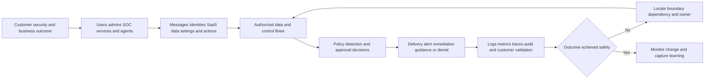
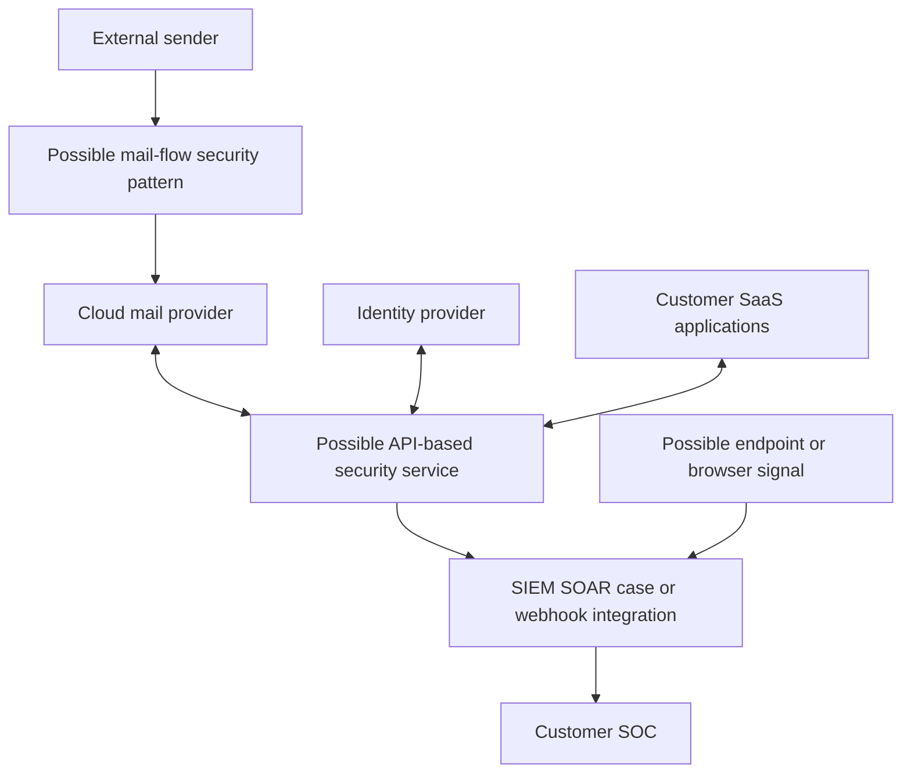
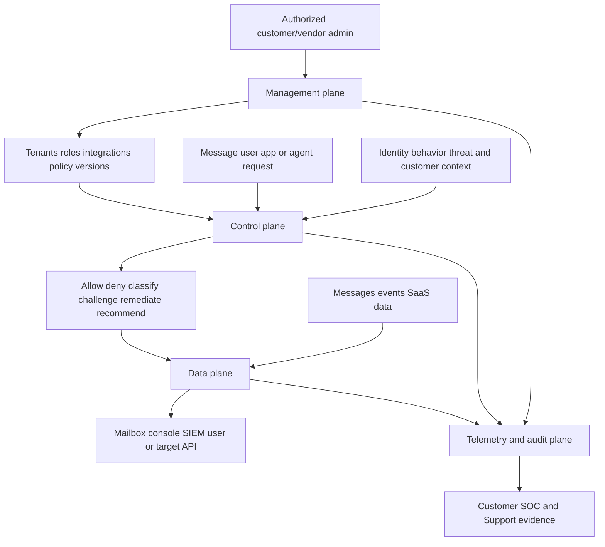
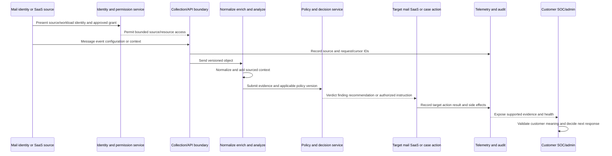
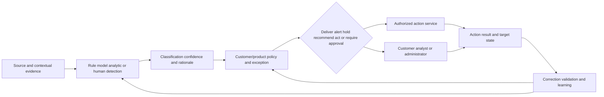
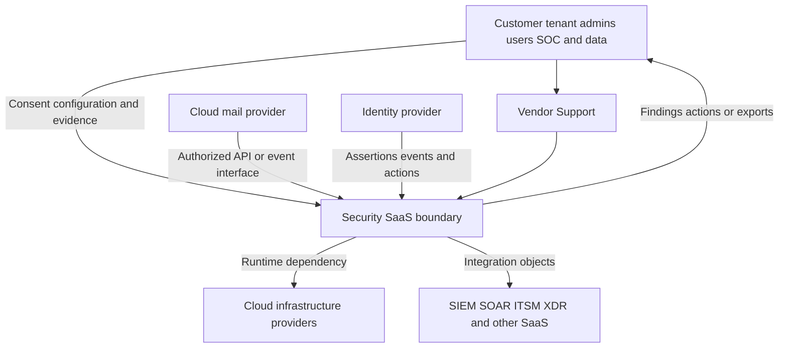
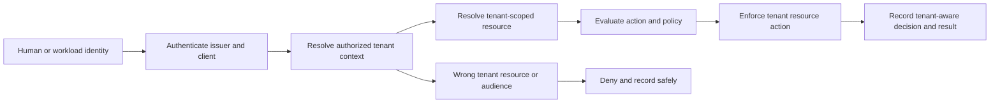
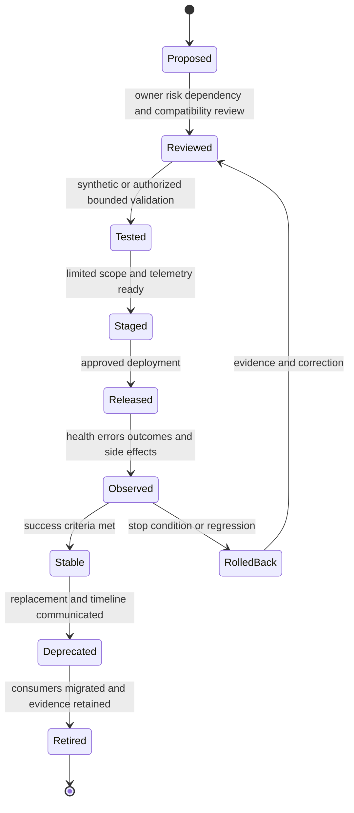
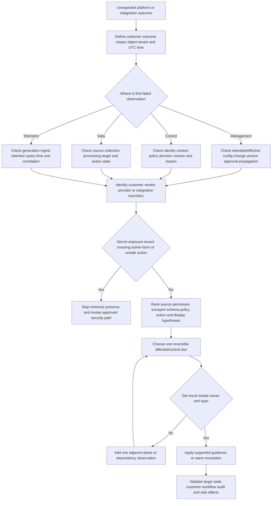
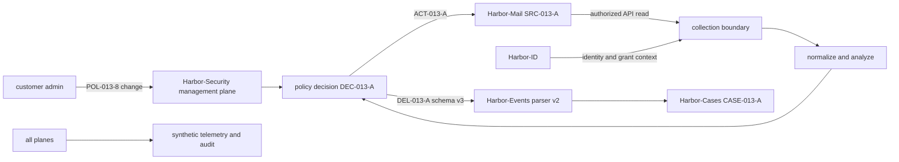

# Part 013 - Platform Architecture Deployment Models and Data Flows

> **Purpose:** Build a vendor-neutral model of a cloud security platform across deployment patterns, management/control/data planes, integrations, permissions, telemetry, policy, decisions, remediation, trust boundaries, tenancy, availability, and change, then isolate the small set of Abnormal statements verified on official public pages.
>
> **Evidence rule:** API-based security integration and mail-flow security deployment are taught as industry patterns. Official Abnormal pages publicly describe cloud-native/API architecture, API-based integrations, no agents/proxies for the integration wording, and no MX changes in current email marketing. Those statements do not reveal exact topology, APIs, fields, permissions, processing, availability, or customer deployment.
>
> **Currency and official-source access date:** August 24, 2026.

## Section Goal

By the end of this Part, you should be able to draw and explain a vendor-neutral cloud security platform without presenting the drawing as Abnormal's private architecture. You should distinguish a **deployment pattern** from a deployment procedure; a logical plane from a physical service; a trust boundary from a network firewall; and a data flow from a product feature list.

You should be able to compare API-based, mail-flow, endpoint/agent, event-stream, and hybrid integration patterns at a conceptual level. You should know that each pattern creates different observations, failure modes, permissions, latency, availability, and customer/vendor responsibilities. You should be able to trace a message or security event from source, through authorized collection, normalization, context, policy, decision, action, audit, and customer-visible outcome while labeling every arrow with identity, data, interface, owner, evidence, and failure behavior.

You should also be able to reason about tenant isolation, least-privilege scopes, control/data/management planes, asynchronous processing, retries, idempotency, partial failure, degraded operation, regional or dependency failure, change/versioning, rollback, and observability. The practical outcome is the **Glass Harbor Architecture and Verified-vs-Assumed Ledger Lab**, a local paper-only architecture package that contains no live product or customer data.

## JD Mapping

| Supplied JD signal | Capability developed here | Practical proof |
|---|---|---|
| Architecture and deployment models | Compares deployment categories without inventing Abnormal implementation | Pattern comparison and architecture diagram |
| Cloud Email Security | Models mail source, identity/context, decision, and message action boundaries | Neutral email data flow |
| AI Security Agents | Models agent/tool calls as control decisions and auditable actions | Agent-to-tool trust path |
| SaaS Security | Models tenant, identity, application, grant, configuration, audit, and remediation | SaaS integration architecture |
| Configuration tickets | Locates management-plane state, propagation, precedence, and drift | Change/version evidence map |
| API questions | Traces identity, permission, request, response, schema, pagination, rate, and version | Integration contract worksheet |
| Behavioral false positives | Separates source/context, decision, policy, and customer ground truth | Decision evidence flow |
| Threat investigations | Preserves source IDs, normalized timeline, action state, and responsibility | Cross-plane evidence ledger |
| Engineering collaboration | Creates architecture-specific escalation asks and reproduction context | Boundary escalation packet |
| Customer trust/security mindset | Names data, permission, tenancy, privacy, unknowns, and owner | Trust-boundary register |
| Microsoft 365 and ecosystem | Uses Microsoft cloud concepts only as transferable context and official public integration names as public facts | Candidate honesty mapping |

## Candidate Honesty Note

You may connect this Part to enterprise support experience in tenant-aware cloud troubleshooting, client/cloud boundaries, configuration, service evidence, Engineering/Product escalation, fix validation, and customer communication. AD/Entra, OAuth, SSO/SAML, REST/JSON, networking, and diagnostic tools are working foundations. They do not prove that you designed Microsoft 365 security architecture, operated Exchange email security, implemented Abnormal, or managed production integrations at scale.

| Evidence label | Honest use | Boundary |
|---|---|---|
| **Production-transfer example** | Enterprise cloud investigation, customer ownership, escalation, and validation in named Microsoft workloads | No Abnormal or direct email-security deployment claim |
| **Working knowledge/upskilling** | REST, JSON, OAuth, networking, identity, logs, and architecture concepts | No production architect or integration-owner claim |
| **Local/public lab** | Paper architecture, synthetic data flow, permissions review, failure analysis | No live platform, API, mail flow, tenant, or customer evidence |
| **Learned architecture** | Public Abnormal positioning plus vendor-neutral deployment patterns | No private topology or exact product behavior |
| **No direct experience** | No direct Abnormal or direct cloud email-security operation | State before discussing the model |
| **Template only** | Trust-boundary, flow, and escalation forms | A completed template is not a deployment |

## Fact and Architecture Labels

| Label | Meaning in this Part | Example |
|---|---|---|
| **Verified public fact** | Current statement on an official Abnormal page | The platform overview publicly says “Cloud-Native API Architecture” and lists native API integrations |
| **Supplied JD fact** | Role wording represented in the master | The role expects architecture/deployment knowledge across three named areas |
| **Vendor-neutral teaching model** | A logical architecture useful across products | Source -> collection -> processing -> decision -> action -> audit |
| **Inference/question to validate** | A plausible implementation detail that requires authorized evidence | Whether an integration is push, pull, polling, subscription, or event-stream based |
| **Unknown/private** | Detail not established by allowed sources | Exact endpoints, scopes, data fields, queues, regions, data stores, retention, tenant keys, SLAs, and runbooks |

## Beginner Term Primer

| Term | Plain meaning | Why it matters | Memory hook |
|---|---|---|---|
| **Architecture** | The important components, relationships, responsibilities, constraints, and decisions in a system | It helps locate where behavior is controlled and evidenced | Boxes, arrows, owners, constraints |
| **Deployment model** | A category describing where and how a capability connects or runs | Different models see and affect different paths | Where it sits and how it connects |
| **Deployment procedure** | The authorized product-specific steps used to enable a deployment | It is private/current operational detail, not inferable from a pattern | Pattern is not procedure |
| **Component** | A logical or physical part with a responsibility | Useful boundaries require named inputs and outputs | One part, one clear job |
| **Interface** | A defined boundary through which components exchange data or actions | Failures often occur at contracts between owners | The agreement at an arrow |
| **API-based integration** | Software exchanges authorized requests/responses through an application programming interface | It can observe or act without being directly in mail transport | Call the service contract |
| **Mail-flow integration** | A security component participates in the path used to transfer or route messages | It can inspect or affect delivery inline or through routing | On the road mail travels |
| **Endpoint agent** | Software running on a device or workload | It can observe local behavior but adds device health/deployment concerns | Sensor where code runs |
| **Event stream/webhook** | Events are pushed or delivered as activity occurs | Delivery and processing are separate states | Event calls the receiver |
| **Polling** | A client periodically asks a source for new or changed data | Cursor/checkpoint, rate, delay, and gaps matter | Ask again on a schedule |
| **Hybrid pattern** | Two or more integration/deployment patterns used together | Real platforms often need several surfaces | Several paths, joined evidence |
| **Management plane** | The path used to configure tenants, roles, policy, integrations, and keys | A management change can alter many future outcomes | Configure the system |
| **Control plane** | The path that evaluates context and decides what should happen | Decision evidence differs from data movement | Decide and direct |
| **Data plane** | The path where messages, events, data, and permitted actions actually move | It proves what was read, written, delivered, or changed | Carry the work |
| **Telemetry plane** | A teaching label for logs, metrics, traces, and audit that observe other planes | Without health and correlation, failures look mysterious | Observe every important path |
| **Policy** | Approved rules converting inputs into decisions or treatment | Policy version and effective state affect behavior | Inputs plus rules produce a decision |
| **Permission** | Authority to perform an action on a resource | Integration success and blast radius depend on it | May this identity do this? |
| **Scope** | A permission's bounded action/resource category or the bounded extent of an operation | Excess scope increases risk; missing scope causes failure | Exactly how much authority? |
| **Consent/grant** | The approved assignment of application authority | It connects customer intent to software access | Who approved which app authority? |
| **Tenant** | A logical customer boundary in a shared SaaS service | Identity, data, policy, and evidence must not cross incorrectly | Shared service, separated customers |
| **Isolation** | Controls preventing one tenant/workload/context from improperly affecting another | A core trust requirement | Keep boundaries real |
| **Trust boundary** | A crossing where authority, control, or data handling changes | Each crossing needs verification, protection, owner, and evidence | Assumptions change here |
| **Normalization** | Converting source-specific data into consistent fields and meanings | It helps correlation but can distort source semantics | Common shape, preserved meaning |
| **Enrichment** | Adding context such as role, owner, relationship, or history | Context can improve decisions but may be stale | Add meaning with source and age |
| **Asynchronous processing** | Work continues after the initial request or acceptance | `202`, queues, callbacks, and eventual results require tracking | Accepted now, completed later |
| **Idempotency** | Repetition produces one intended effect rather than duplicates | Critical for retries and remediation | Safe repeat, single effect |
| **Eventual consistency** | Different components can temporarily show different states before converging | A recent change may not appear everywhere immediately | Correct later, different now |
| **Availability** | Authorized users can use the required function at the needed time/quality | Partial and dependency failures matter | Usable when needed |
| **Resilience** | Ability to continue, degrade safely, and recover from failure | Security platforms must fail predictably | Absorb, adapt, recover |
| **Versioning** | Tracking changes to APIs, schemas, policy, models, and configuration | Expected behavior depends on what version ran | Name the contract that applied |
| **Backward compatibility** | Newer behavior remains usable by older clients/contracts within stated rules | Prevents avoidable integration breaks | Change without breaking supported users |
| **Rollback** | Returning to a known prior state after an unsafe change | It needs evidence, authority, and validation | Reverse safely, verify outcome |

## Architecture Starts With Outcomes and Boundaries

Architecture is not a diagram of vendor logos. Start with the customer outcome, then identify actors, resources, data, decisions, actions, evidence, and owners.

The diagram is a **vendor-neutral teaching model**. No box represents a confirmed Abnormal service.

### Architecture question set

| Question | Why it matters | Evidence |
|---|---|---|
| What customer outcome is required? | Prevents architecture from becoming feature inventory | Business/security objective and success criteria |
| Which actors and identities participate? | Establishes authentication, authorization, and accountability | Human/workload IDs, issuers, owners |
| Which resources/data are protected? | Defines sensitivity, scope, and action | Message, mailbox, tenant, object, configuration IDs |
| Which flows cross ownership boundaries? | Identifies shared responsibility and failure points | Interface, request/delivery IDs, contracts |
| Where are policy decisions made/enforced? | Separates configuration from runtime behavior | Policy/version, decision and action IDs |
| Which dependencies can degrade the path? | Enables availability and contingency reasoning | Health, latency, queue, upstream status |
| How is each step observed? | Enables troubleshooting and audit | Logs, metrics, traces, UTC time, correlation |
| How does change propagate and roll back? | Prevents version/configuration drift from masquerading as cause | Change IDs, versions, before/after, rollback result |

## Deployment Pattern Categories

These are possible industry patterns, not claims that Abnormal implements each one.

| Pattern | Logical position | Strength | Failure/operational concerns | Typical evidence |
|---|---|---|---|---|
| Mail-flow inline/gateway | Message route passes through or is directed through security service | Can act before downstream delivery and observe transport context | Routing loops, latency, availability dependency, connector/TLS issues | SMTP trace, connector/routing policy, queue, message ID |
| API-based out-of-band | Security service calls cloud provider APIs to read context and perform supported actions | Integrates with cloud data/control surfaces without the same inline mail hop | Consent/scopes, API rate/latency, polling gaps, eventual consistency, revocation | Client/grant, request IDs, status, source/action audit |
| Event/webhook integration | Source pushes security or activity events to receiver | Timely event flow and decoupled consumers | Signature/auth, delivery retries, duplicates, schema, downstream processing | Event/delivery/request IDs, response, processing result |
| Endpoint/agent | Local software observes or controls endpoint/workload | Deep local execution context and direct endpoint response | Agent health, version, policy, resource use, device coverage, tamper/security | Device/sensor ID, check-in, local/cloud event, action ID |
| Log/export/SIEM | Product exports objects to analytics/case systems | Cross-domain search, retention, correlation | Parser, normalization, time, index, retention, query, cost | Source/export/ingest/parse/case IDs |
| Identity federation/integration | Identity provider supplies assertions/events or accepts actions | User/workload context and identity response | Tenant/issuer/audience, role/scope, session/revoke propagation | Sign-in, token metadata, policy, resource action |
| Browser/network signal | Browser, proxy, DNS, or network provides context/control | Sees web activity or path context | Privacy, coverage, TLS interception, managed/unmanaged populations | Device/session, destination, policy, connection/result |
| Hybrid | Several patterns contribute to one security outcome | Wider context and defense in depth | Correlation, ownership, inconsistent state, common dependencies | Cross-system IDs and normalized timeline |

### Pattern topology

This is a comparison diagram, not an Abnormal topology. The official public Abnormal pages verified for this guide emphasize API-based/cloud-native integration and no MX changes; they do not establish the complete internal path.

## 🔍 Plain-English deep-dive: API-Based and Mail-Flow Are Positions, Not Quality Scores

An API-based pattern is like a security team receiving authorized access to records and controls in a cloud building. A mail-flow pattern is like a checkpoint on the road messages travel. One is not automatically modern, safe, fast, or complete; each has visibility, timing, permission, and dependency tradeoffs. The analogy stops because APIs may support real-time subscriptions or delayed polling, and a gateway can also use cloud analytics.

Questions for an API pattern include: Which provider/API? Which identity and consent? Which resources, fields, actions, and time window? Is collection push or pull? How are pagination, rate limits, retries, revocation, and eventual consistency handled? Which customer actions remain outside the integration?

Questions for a mail-flow pattern include: Which route and direction? Is the component inline, relay, gateway, or another mail boundary? What happens on timeout or service failure? How are accepted messages, queues, loops, connectors, certificates, and bypass paths handled? Which messages do not traverse that path?

Official public Abnormal pages state API-based deployment wording and no MX changes. The safe conclusion is that Abnormal publicly differentiates its deployment from an MX-changing gateway pattern. It is unsafe to infer exact API calls, data availability, latency, tenant consent, or how every product/action is deployed.

## Management, Control, Data, and Telemetry Planes

A **plane** groups responsibilities. It may span several services and does not guarantee a physically separate component.

| Plane | Main responsibilities | Example failure | Evidence | Owner question |
|---|---|---|---|---|
| Management | Tenant setup, roles, consent, policy, integration, configuration, version | Change saved to wrong tenant or not propagated | Change ID, actor, before/after, version, approval | Who may configure and roll back? |
| Control | Evaluate identity/context/policy and produce decision | Wrong policy version or missing context produces unexpected verdict | Decision ID, input summary, policy/model/rule version, reason | Who defines intended decision semantics? |
| Data | Move/read/write messages, events, findings, and actions | Correct decision but target action fails | Resource/action IDs, result, queue, destination audit | Who owns source/target and side effects? |
| Telemetry/audit | Observe health, decisions, actions, access, and changes | Missing event prevents diagnosis | Source health, event/ingest time, trace/correlation | Who guarantees generation, retention, and access? |

### Plane-aware example

An administrator changes a synthetic policy at 10:00 UTC. A message at 10:02 receives the old decision. That can be:

- a management-plane save failure;
- documented propagation/eventual consistency;
- a control-plane cache/version selection issue;
- a message processed under an earlier event time;
- a UI/telemetry display mismatch;
- a true product defect.

The cheapest check joins change ID/version, effective time, decision ID/policy version, message event time, and one later control message. It does not start by toggling several settings.

## 🔍 Plain-English deep-dive: A Green Plane Can Hide a Broken Outcome

Imagine a restaurant. The management plane sets the menu and staff permissions. The control plane decides whether an order is permitted and how it should be prepared. The data plane carries ingredients and the meal. Telemetry is the order ticket, kitchen status, and receipt. A menu update can be correct while the kitchen uses an old ticket; the kitchen can prepare correctly while delivery goes to the wrong table. The analogy stops because cloud systems may run asynchronously across many regions and providers.

“Configuration saved,” “decision allowed,” “API returned success,” and “customer outcome achieved” are four different claims. End-to-end validation needs evidence from each plane. This prevents a common escalation error: sending Engineering a screenshot of a green configuration while omitting the decision version and failed target action.

## Integration Contracts and Permissions

An integration contract includes more than an endpoint. It covers identity, authorization, resources, request/response schema, timing, errors, limits, version, and ownership.

| Contract dimension | Questions | Failure symptom | Safe evidence |
|---|---|---|---|
| Identity | Which human/workload client and tenant? Which issuer? | Wrong tenant, unknown client, `401` | Client ID, tenant alias, issuer, auth event; no secret |
| Authorization | Which roles/scopes/actions/resources? | `403`, partial data/action | Grant metadata, policy decision, effective permission |
| Endpoint/resource | Which base/service/resource/action? | `404`, wrong object, unsupported operation | Sanitized method/path/resource ID |
| Schema | Which required/optional fields, types, enums, nulls? | `400`, parse failure, silent field loss | Versioned sanitized sample/error |
| Pagination/cursor | How is a full result set obtained? | Missing older/newer objects, duplicates | Page/cursor metadata and item IDs |
| Time/order | Event time, ingest time, clock, ordering guarantee? | Misordered timeline or missed window | Original/UTC times, sequence and delay |
| Rate/concurrency | Which quotas and retry guidance? | `429`, backlog, timeout | Limit headers/metadata, attempt schedule |
| Retry/idempotency | Which failures are retryable and how are duplicates avoided? | Duplicate actions/cases | Idempotency key, action state, attempt IDs |
| Version/compatibility | Which API/schema/policy version applies? | Sudden break after change | Version, deprecation notice, client/server support |
| Privacy/retention | Which data is needed, stored, accessed, and deleted? | Overcollection or missing history | Data inventory and authorized policy reference |
| Ownership/support | Who operates each side and handles errors? | Ticket ping-pong | Responsibility map and exact failed boundary |

### Least-privilege permission review

| Dimension | Required question | Excess example | Better design question |
|---|---|---|---|
| Subject | Which app/workload needs authority? | Shared or ownerless integration identity | Can a named owned workload identity be used? |
| Action | Which operations are required? | Full write/admin for read-only evidence | Which exact read/write/delete actions are necessary? |
| Resource | Which tenant/mailbox/app/data? | All tenants/resources | Can access be tenant/object/population scoped? |
| Data | Which fields/content? | Full message body for ID correlation | Can metadata or selected fields answer the job? |
| Time | How long should authority last? | Non-expiring secret/grant | How are expiry, rotation, and reauthorization handled? |
| Delegation | Can it grant further authority? | Integration can create admins/apps | Can delegation be removed? |
| Runtime | Where may the identity execute? | Same credential on laptops and service | Can workload identity or key binding constrain use? |
| Audit/revoke | Can use be attributed and stopped? | No per-call record or owner | Which events and revoke test prove control? |

Never request a live token, password, private key, client secret, session cookie, or webhook secret in a ticket or lab. Non-secret identifiers, timestamps, policy results, and sanitized errors are usually the correct first evidence.

## End-to-End Data Flow

The following model shows a possible cloud security path. It is not Abnormal architecture.

### Data-flow register

| Flow | Data/authority | Purpose | Trust boundary | Controls | Evidence | Unknown to verify |
|---|---|---|---|---|---|---|
| Customer source -> collection | Message/event/configuration plus app authority | Obtain permitted context | Customer/provider or provider/provider | Consent, scoped identity, TLS, source policy | Grant, request/cursor/source IDs | Exact fields, mechanism, cadence |
| Collection -> processing | Versioned source object | Normalize and analyze | Intra-provider logical boundary | Schema validation, integrity, tenant context | Parse result, object/version, trace | Internal service topology |
| Context -> policy | Identity/relationship/risk context | Decide treatment | Logical decision boundary | Freshness, provenance, policy version | Decision ID and supported explanation | Exact features/model |
| Policy -> action | Verdict/instruction/approval | Affect customer-visible state | Provider/customer or provider/provider | Authorization, scope, approval, idempotency | Action/request ID and status | Exact action semantics |
| Platform -> SIEM/SOAR | Finding/event/action result | Customer correlation/automation | Vendor/customer integration | Auth, schema, retry, signing where relevant | Delivery/receiver/parse/case IDs | Direction and contract by integration |
| Customer -> Support | Minimum case evidence | Diagnose unexpected outcome | Customer/vendor support boundary | Authorization, minimization, secure channel | Case/evidence IDs and access | Support access/retention entitlement |

## Policy, Decisions, and Remediation

Policy and detection can both influence an outcome. A model or rule may identify risk; customer/product policy determines treatment; a response service performs or recommends action; a customer owner may approve or override according to product and organization rules.

This is a **vendor-neutral teaching model**. Do not assume which Abnormal actions are automatic, configurable, reversible, or entitled for a customer.

| Decision layer | Evidence question | Common confusion |
|---|---|---|
| Detection | What evidence produced which verdict/finding under which version? | Verdict treated as policy/action |
| Policy | Which customer/product rule or exception selected treatment? | Model blamed for configured action |
| Approval | Which role authorized a consequential action? | User request assumed sufficient authority |
| Execution | Which target/action ran and what response occurred? | Request acceptance called success |
| Validation | Did intended state and customer outcome change without harmful side effects? | Internal status called closure |
| Feedback | Was a correction captured with ground truth and scope? | One correction assumed to retrain or change all behavior |

## Trust Boundaries and Shared Responsibility

| Boundary | Customer/vendor questions | Vendor-neutral responsibility idea | Evidence |
|---|---|---|---|
| Customer tenant -> vendor | Who approves connection, data, scope, and action? | Customer owns customer-side authority; vendor owns documented service handling | Consent/grant, config, service record |
| Mail/IdP/SaaS provider -> vendor | Which contract/API and owner supply data/action? | Each provider owns its service; security vendor owns its integration behavior | Request, response, source audit, vendor trace |
| Vendor -> customer response target | Which action is permitted and how validated? | Customer owns business/risk decision; vendor owns supported action mechanics | Approval, action ID, target audit |
| Vendor -> ecosystem | Which event/schema/delivery and receiver processing? | Producer owns documented output; customer/receiver owns ingestion after accepted boundary, subject to contract | Source, delivery, parse, case IDs |
| Customer -> Support | What evidence may be shared and accessed? | Customer authorizes/minimizes; vendor protects and uses according to policy/contract | Case authorization, evidence access/disposition |
| Vendor -> cloud/subprocessor | Which dependency and assurance apply? | Vendor remains accountable for its service while managing suppliers | Service/dependency evidence and trust docs |

Shared responsibility is not shared blame. L1 should say where the first failed observation lies, which party can inspect it, and what the other party still owns.

## 🔍 Plain-English deep-dive: A Trust Boundary Is a Change in Authority

A trust boundary is like an international border: documents accepted on one side may need validation on the other, laws and authorities change, and a record of crossing matters. The analogy stops because cloud boundaries can be logical, occur within one provider, and process copied data rather than physical travelers.

At every boundary ask: who initiates, which identity speaks, what data/authority crosses, which policy permits it, how confidentiality/integrity are protected, how the receiver validates it, what evidence each side records, how access stops, and who handles failure. A TLS connection proves a protected channel to an authenticated endpoint under certain assumptions; it does not prove the caller is authorized for the resource or that downstream processing completed.

This framing prevents “the API is broken.” The connection may be healthy while authorization rejects the action. The receiver may accept the event while parsing fails. The source may emit correctly while a customer query uses the wrong time. Each boundary needs an observation before ownership is assigned.

## Tenancy and Isolation

A multi-tenant SaaS serves multiple customers through shared or partially shared infrastructure while preserving logical separation. Public Abnormal pages refer to enterprises and connected cloud environments, but exact tenant implementation is private.

| Tenancy concern | Required property | Support evidence/question | Unsafe assumption |
|---|---|---|---|
| Tenant identity | Every request/object is associated with correct tenant | Tenant-aware IDs, issuer, resource, context | User email alone identifies tenant |
| Data isolation | One tenant cannot access another's data | Authorization result, resource namespace, audit | Shared infrastructure means shared data |
| Configuration isolation | Policy/change applies only intended scope | Tenant/policy/version/change ID | Same name means same config across tenants |
| Workload isolation | Processing cannot leak or corrupt across customers | Provider evidence and security process | Public page reveals isolation design |
| Key/secret isolation | Credentials and encryption boundaries are appropriate | Metadata and trust documentation, never secret value | One universal credential is used |
| Telemetry isolation | Logs/cases expose only permitted tenant evidence | Case access, tenant filters, audit | Support can browse all customer data |
| Action isolation | Response targets only intended tenant/objects | Action/target IDs, authorization, before/after | Bulk action scope is self-evident |
| Noisy-neighbor resilience | One customer's load does not unacceptably harm others | Latency/error/queue/service evidence | Tenant performance is fully independent |
| Data lifecycle | Collection, retention, deletion, and export follow approved obligations | Data inventory, contract/trust docs, disposition | Public marketing defines retention |

### Tenant-aware request model

Do not put raw tenant identifiers or customer names in public lab artifacts. Use aliases and preserve actual IDs only in approved case systems when necessary.

## Availability, Resilience, and Failure Semantics

Availability is not binary. A platform can accept requests but delay processing, show findings while actions fail, operate for one integration but not another, or remain healthy while an upstream provider is unavailable.

| Failure mode | Customer symptom | Architecture question | Validation |
|---|---|---|---|
| Source unavailable | No new messages/events/context | Did source fail, revoke access, or stop generating? | Source health and control object |
| Authorization failure | `401`/`403`, partial data/action | Identity, token metadata, scopes, tenant, policy? | New authorized request or corrected grant |
| Rate/capacity | `429`, backlog, delayed decisions | Quota, batch, retry, queue, priority? | Backlog drains without loss/duplicates |
| Network/TLS | Timeout, DNS/certificate/proxy error | First failing layer and owner? | Successful bounded connection plus app response |
| Schema/version | Parse rejection or missing fields | Producer/consumer contract and deprecation? | Compatible test object processes |
| Queue/async worker | `202` but no final result | Queue ID, consumer health, dead-letter/retry? | Final state and reconciliation |
| Decision service | Missing/stale/unexpected verdict | Context, policy/model version, dependency health? | Control object under known conditions |
| Action service | Verdict exists but remediation absent/partial | Authorization, target, idempotency, target provider? | Target state and action audit |
| Telemetry | UI/search absent while action occurred | Logging, retention, indexing, query, time? | Source/action IDs join after repair |
| Region/dependency | Population-specific or broad failure | Region, provider, failover, data consistency? | Documented recovery and customer workflow |

### Degraded-mode questions

1. Which functions remain available?
2. Which data may be delayed or incomplete?
3. Does the system fail open, fail closed, queue, retry, or require manual handling for this function?
4. Which customer risks increase under the mode?
5. Which workarounds are approved and time-bounded?
6. How will missed, delayed, or duplicate items be reconciled?
7. Who communicates status and when?
8. What evidence proves full recovery?

Never infer Abnormal's fail-open/fail-closed behavior, disaster-recovery targets, regions, or service commitments. Those are **unknown/private** and may be contractual.

## 🔍 Plain-English deep-dive: Eventual Consistency Is Not Permission to Wait Blindly

In a distributed system, one component can accept a change before every reader or decision service shows it. That temporary difference is called **eventual consistency** when the documented design expects replicas or derived views to converge. It is not a universal explanation for any stale result.

**Analogy:** A store changes a price in its central catalog, but shelf labels and regional caches update on a schedule. A short mismatch may be expected; a mismatch beyond the stated window or on the authoritative checkout path may be a defect. The analogy stops because security decisions can have higher consequences and may use several independently versioned inputs.

Support should ask which state is authoritative, when the change was committed, which version each component selected, what propagation behavior is documented, and which correlation IDs join the change to the later decision. A control object before and after the expected window tests convergence. Repeatedly refreshing the UI proves little if the control plane still selects the old policy.

The customer update should not say “please wait for propagation” without evidence. It should state the change ID and time, current selected version, documented or unknown convergence expectation, customer impact, next observation time, and escalation condition. Waiting becomes a controlled test rather than an empty delay.

## Change, Versioning, and Compatibility

| Change type | Evidence needed | Compatibility concern | Support question |
|---|---|---|---|
| API version | Client/server version, request/response, deprecation | Breaking fields, methods, auth, pagination | Which documented version applies? |
| Event schema | Producer/consumer versions, field map, parse result | Required/renamed fields, enum/null behavior | Where was object rejected or altered? |
| Policy/configuration | Change actor, before/after, effective version/time | Precedence, inheritance, propagation, exception | Which effective policy decided? |
| Detection/model | Outcome version and supported explanation | Changed verdict distribution, threshold, feature availability | Did behavior change by version or input? |
| Integration permission | Grant/scope before/after and owner | New required scope or removed authority | Is scope documented and least privilege? |
| UI/console | UI/build and underlying API evidence | Display mismatch, cache, client compatibility | Is problem display or service state? |
| Remediation/action | Action contract, idempotency, rollback | Changed target semantics or partial state | Can action be retried or compensated safely? |

### Version-safe escalation

An Engineering packet should contain expected/actual behavior, client/source/product versions visible to Support, policy/schema version, exact UTC window, identifiers, change timeline, affected/control comparison, tests, privacy handling, customer impact, and an explicit compatibility question. “It broke after an update” is a hypothesis until version and time evidence align.

## Observability and Correlation

Observability lets an authorized engineer understand internal state from available outputs. Logs are one signal; metrics, traces, audits, health, and customer observations add different views.

| Signal | Best question | Limit |
|---|---|---|
| Log/event | What discrete action or result was recorded? | Missing log can mean coverage/query failure |
| Metric | How is volume, latency, error, or saturation changing? | Aggregate hides individual cause |
| Trace/correlation | Which components handled one request/object? | Sampling/propagation can break chain |
| Audit | Who changed or acted on which resource? | Does not prove human intent |
| Health/status | Which component/dependency is reporting availability? | Green can be shallow or delayed |
| Customer observation | What business/security outcome occurred? | Cause requires technical correlation |
| Synthetic control | Does a known harmless path work? | Test may not match affected conditions |

Use stable object-specific IDs: source message/event, collection request/cursor, processing/trace, decision, action, target audit, export/delivery, receiver/parse, and case. Record event time and ingest/processing/observation time separately.

## Worked Examples

### Worked example 1: API connection succeeds, action fails

**Input:** A synthetic integration reaches an HTTPS endpoint and receives `403` for `message.remediate`.

**Reasoning:** DNS, TCP, TLS, and application endpoint reachability succeeded. Authentication may also have succeeded, depending on error semantics. Authorization, tenant/resource, action scope, or policy is the leading layer.

**Evidence:** UTC, client ID, tenant alias, method/resource category, status/error, request ID, non-secret grant metadata, expected action. Do not collect token.

**Outcome:** Customer identity/integration owner verifies approved scope; Support confirms documented requirement. Do not grant global admin or blame network.

### Worked example 2: Mail-flow and API paths disagree

**Input:** A mail trace shows delivery, while an API-connected security view lacks the message.

**Hypotheses:** Unsupported route/population, source API delay, permission gap, pagination/cursor, retention, wrong tenant, message-ID normalization, or UI query.

**Test:** Join provider message ID, recipient, event/ingest time, route, source availability, API checkpoint, tenant, and a working control message.

**Boundary:** The discrepancy does not prove a detection miss; first establish whether the data plane supplied the message/context to the analysis path.

### Worked example 3: Policy saved but old behavior persists

**Input:** Management UI confirms policy `P-8`; decision object cites `P-7`.

**Reasoning:** Preserve change and decision evidence. Check effective scope, approval, activation, propagation contract, event time, cache, and whether policy `P-8` applies to the object.

**Outcome:** If documented propagation passed and later control still cites `P-7`, escalate control-plane version selection with IDs. Do not toggle unrelated settings.

### Worked example 4: `202` event export with no SIEM case

**Input:** Producer delivery receives `202`; destination case is missing.

**Reasoning:** `202` is transport/application acceptance, not final parse, indexing, detection, or case creation. Trace receiver request, parser/schema, normalized record, index/query, routing, and case API.

**Observation:** Consumer parser rejects schema v3.

**Owner:** Customer integration/SIEM owner corrects supported mapping; vendor Support confirms producer contract. Validate replay/backfill and duplicates.

### Worked example 5: Action reports success, target state unchanged

**Input:** Remediation request returns success, but synthetic target message remains.

**Hypotheses:** Asynchronous queue, wrong target/tenant, stale UI, partial provider action, target permission, duplicate/canceled action, or audit delay.

**Test:** Compare action ID/status, target object ID, provider target audit, queue/final status, and fresh direct state. Do not retry before determining idempotency and current state.

### Worked example 6: Cross-tenant-looking search result

**Input:** A support screenshot appears to show another customer's name.

**Immediate boundary:** Treat as a possible sensitive-data/tenant-isolation concern. Stop broad sharing, restrict evidence through approved process, preserve minimum IDs/access facts, and use the vendor security escalation path.

**Do not:** Explore other records, reproduce broadly, declare a breach, or share screenshot in ordinary channels. Exact investigation belongs to authorized Security/Engineering.

## Architecture Troubleshooting Decision Tree

### Symptom-to-hypothesis-to-test matrix

| Symptom | Competing hypotheses | Cheapest safe test | Observation | Next action |
|---|---|---|---|---|
| `401` | Missing/expired credential, wrong issuer/audience, clock | Inspect sanitized error and non-secret metadata | Audience mismatch | Obtain correct authority through owner; no token sharing |
| `403` | Scope/role/resource/tenant/policy denial | Join request ID to effective grant/policy | Scope absent | Owner corrects least privilege if approved |
| Timeout | DNS/TCP/TLS/proxy, service, queue, long operation | Layered connection and request correlation | TLS succeeds, app timeout | Move to application/dependency evidence |
| Partial source data | Scope, pagination, filter, cursor, retention | Compare expected object IDs/pages/checkpoint | Cursor skipped page | Correct/reconcile under contract |
| Duplicate actions | Retry without idempotency, two triggers, race | Compare source/action/idempotency IDs and target state | Same request retried | Reconcile and fix retry design |
| Stale decision | Policy propagation, cache, event time, wrong scope | Join change/effective/decision versions | Decision uses old policy beyond expectation | Escalate with version evidence |
| Missing audit | Event not generated, pipeline, retention, query, tenant | Run approved synthetic control and trace | Source event absent | Route telemetry/control gap |
| Wrong tenant indication | UI alias, identifier mapping, real isolation defect | Stop sharing; preserve minimal evidence; security path | Unresolved | Authorized Security/Engineering investigation |

## Common Failure Modes and Safe Corrections

| Failure mode | Why it fails | Safe correction | Escalation trigger |
|---|---|---|---|
| Public diagram treated as production topology | Marketing simplifies implementation | Label verified wording and neutral model separately | Operational decision needs exact docs |
| API-based means real-time | APIs can poll, batch, queue, or subscribe | Verify mechanism and timing contract | Delay/gap affects protection |
| No MX changes means no deployment dependencies | Consent, permissions, APIs, policy, and data still matter | Ask current documented prerequisites | Setup or impact decision |
| Mail-flow pattern called inferior | Architecture quality depends on job and controls | Compare fit, visibility, latency, availability, and operations | Buyer evaluation |
| Plane equals one microservice | Logical responsibility may be distributed | Use plane to organize evidence, not infer topology | Engineering needs component detail |
| Configuration screenshot as source of truth | Effective state may differ | Join change, version, decision, and target result | Documented state conflicts |
| HTTP success equals outcome | Async processing/action may fail later | Trace final state and audit | Consequential action unknown |
| Blind retries | Duplicate side effects | Query state/idempotency before retry | Partial action or timeout |
| Broad scopes for convenience | Increases blast radius and hides requirements | Map purpose to least action/resource/data/time | Required scope unclear |
| Live secret in case | Creates exposure | Use metadata and rotate/revoke if exposed | Any credential appears |
| Logs prove completeness | Coverage/retention/query can fail | Record source and health plus control test | Investigation depends on absence |
| Tenant ID omitted | Cross-tenant ambiguity and wrong evidence | Use safe tenant-aware aliases/IDs | Sensitive mismatch appears |
| Fail-open/closed invented | Behavior may be contractual/function-specific | Mark unknown and use current docs | Availability/security decision |
| SLA/region/DR guessed | Commercial and architectural details vary | Route to authoritative contract/trust source | Customer commitment requested |
| Version change called root cause | Temporal correlation is not causation | Compare versioned affected/control behavior | Repro aligns with change |
| Support edits customer config without authority | Blurs responsibility and risk | Guide authorized owner; document change/rollback | Consequential change requested |
| experience transfer becomes Abnormal claim | Methods transfer, implementation does not | State evidence tier and limit | Interview asks exact operation |

## Glass Harbor Architecture and Verified-vs-Assumed Ledger Lab

### Lab purpose

Create a paper-only architecture for a fictional cloud email/SaaS security workflow and a ledger that prevents assumptions from becoming Abnormal facts. “Glass Harbor” means every crossing and assumption is visible while the system remains safely contained.

### Honest artifact label

> **LOCAL/SYNTHETIC ARCHITECTURE LAB - Vendor-neutral design and public-source classification only. No Abnormal deployment, customer tenant, email flow, API call, credential, production architecture, or named-tool operation is represented.**

### Prerequisites

1. Parts 001-012 and this Part.
2. Private Markdown/spreadsheet workspace and Mermaid renderer or paper.
3. Verified official public sources listed below.
4. Only the fictional entities and IDs supplied here.
5. No account, trial, demo, Support Portal, Security Hub, mail system, SaaS tenant, API, webhook, token, packet capture, or network request.
6. Two to three hours plus a thirty-minute architecture defense.

### Authorized scope and prohibitions

| Authorized | Prohibited |
|---|---|
| Paper deployment comparisons and logical architecture | Product setup instructions or live changes |
| Synthetic data/IDs and known ground truth | Real customer, employer, mailbox, tenant, API, logs, secrets |
| Current public claim ledger | Private/restricted docs, reverse engineering, scraping |
| Failure reasoning and owner routing | Scanning, sending mail, calling endpoints, performance testing |
| Questions to validate | Inventing fields, APIs, scopes, regions, SLAs, queues, internals |

### Synthetic system

`Glass Harbor Labs` uses fictional `Harbor-Mail`, `Harbor-ID`, `Harbor-SaaS`, `Harbor-Security`, `Harbor-Events`, and `Harbor-Cases`. Objects: tenant `TENANT-013-A`, message `MSG-013-A`, source event `SRC-013-A`, collection request `REQ-013-A`, decision `DEC-013-A`, action `ACT-013-A`, export `DEL-013-A`, receiver request `RX-013-A`, case `CASE-013-A`, policies `POL-013-7` and `POL-013-8`.

Ground truth: the scenario uses a fictional API-based pattern. At 10:00 UTC an admin activates `POL-013-8`. At 10:01, source object `MSG-013-A` is available. Collection succeeds. The decision at 10:02 incorrectly references `POL-013-7` in the supplied narrative. A remediation request is accepted asynchronously but initially targets the wrong synthetic object because of a mapping defect; no real action occurs. Event export receives `202`, and the fictional consumer parser rejects schema v3 because it supports v2.

### Lab architecture

### Step 1: Define customer outcomes and scope

State the intended outcomes: correct versioned decision, correct target action, complete event export, and a visible case. State exclusions: no real product, threat, mail, API, or customer. Identify customer and vendor owner roles without inventing team names.

### Step 2: Build the deployment-pattern comparison

Compare mail-flow, API, webhook/event, endpoint, SIEM/export, identity, and hybrid patterns across position, visibility, action, permissions, latency, availability, privacy, evidence, failure, and owner. Mark only the synthetic API pattern as selected for the lab.

### Step 3: Draw four plane views

Create separate management, control, data, and telemetry diagrams. Each arrow must include object/authority, interface category, identity, owner, evidence ID, failure mode, and recovery/revoke path.

### Step 4: Build the verified-vs-assumed ledger

Create at least twenty rows:

| Statement | Label | Source/evidence | Why safe or unsafe | Required validation |
|---|---|---|---|---|
| Abnormal publicly describes cloud-native API architecture | Verified public fact | Platform overview, Aug 24 2026 | Attributed high-level wording | Recheck current page |
| Abnormal uses endpoint agents for this flow | Unknown/private | No allowed support | Would invent implementation | Authorized product docs |
| Synthetic Harbor collection uses polling | Vendor-neutral lab fact | Lab scenario | Applies only to fictional model | None outside lab |
| Exact Abnormal scopes | Unknown/private | No public contract used | Security-sensitive operational detail | Current authorized docs |

Include deployment, permissions, collection, fields, processing, policy, actions, tenancy, availability, regions, retention, versioning, support access, and SLAs.

### Step 5: Build the permission and trust-boundary register

Include source collection, identity context, action target, SIEM export, customer Support evidence, and cloud dependency. For each: subject, purpose, action, resource, data, duration, audit, revoke, owner, privacy, and unknowns.

### Step 6: Trace the data flow

Record every synthetic stage from source generation to case with event time, ingest/process time, object/version, input/output, owner, status, and next ID. The correct trace shows collection success, stale policy decision, wrong action target, export acceptance, and parser rejection as separate defects.

### Step 7: Write five competing hypotheses per symptom

Symptoms: stale policy, wrong action target, missing SIEM case, apparent partial data, and missing audit. Include configuration, permission, version, queue, mapping, query, and benign timing alternatives. Choose one cheapest paper check for each.

### Step 8: Design availability/degraded-mode cards

Create cards for source unavailable, API `403`, rate limit, queue backlog, decision unavailable, action partial, telemetry delayed, and downstream parser failure. Each card states remaining function, customer risk, approved alternative, owner, reconciliation, and recovery evidence. Do not define Abnormal behavior.

### Step 9: Create a change/version record

Document `POL-013-7` -> `POL-013-8` through proposal, approval, effective time, decision version, affected/control objects, rollback condition, and validation. Add schema v2/v3 compatibility and deprecation questions.

### Step 10: Write three escalation packets

1. Control-plane packet: decision cites stale policy.
2. Data/action packet: action target mapping differs from source object.
3. Integration packet: producer v3 accepted but consumer parser supports v2.

Each includes expected/actual, IDs, versions, UTC, impact, tests, privacy, explicit question, and customer checkpoint.

### Step 11: Conduct the architecture defense

Answer aloud:

- Which boxes are confirmed public Abnormal facts? None; only cited statements outside the synthetic diagram are public facts.
- Which pattern is modeled? Fictional API-based.
- Where does authority cross?
- What evidence distinguishes management/control/data/telemetry failures?
- Which details remain unknown/private?
- How would a mail-flow pattern change observations?
- How are target action and customer outcome validated?

### Cleanup and privacy

1. Remove copied page bodies and screenshots; keep titles, URLs, short claims, dates.
2. Search for real domains, tenants, endpoints, scopes, tokens, fields, SLAs, region names, and internal terms.
3. Ensure every diagram says synthetic/vendor-neutral.
4. Delete scratch exports; retain sanitized architecture and ledger privately.
5. Record reviewer, score, corrections, access date, and next revalidation.

### Expected evidence and required artifacts

The expected evidence is the complete, internally consistent artifact set below, with synthetic identifiers, dated source labels, explicit unknowns, and no live-system activity.

| Artifact | Required content | Honest label |
|---|---|---|
| Outcome/scope card | Goals, actors, resources, exclusions | Local/synthetic lab |
| Deployment comparison | Seven patterns and tradeoffs | Learned architecture |
| Plane diagrams | Management, control, data, telemetry | Vendor-neutral teaching model |
| Verified-vs-assumed ledger | Twenty or more claims and validation path | Public research plus local lab |
| Permission/boundary register | Six crossings with least-privilege dimensions | Local/synthetic lab |
| End-to-end trace | Source through case with IDs/times/versions | Local/synthetic lab |
| Hypothesis cards | Five symptoms with five hypotheses each | Local/synthetic lab |
| Availability cards | Eight degraded modes | Template only |
| Change/version record | Policy and schema lifecycle | Local/synthetic lab |
| Escalation/defense/cleanup | Three packets, spoken review, rubric | Template plus local lab |

### Validation rubric

| Dimension | 0 | 2 | 4 |
|---|---|---|---|
| Fact separation | Diagram called Abnormal | General disclaimer | Every statement marked public, JD, neutral, inference, or private |
| Deployment patterns | API/gateway confused | Basic comparison | Seven patterns with visibility, action, permission, availability, evidence, owners |
| Plane model | Planes mixed | Labels correct | Management/control/data/telemetry evidence and failures distinct |
| Data flow | Unlabeled arrows | Main stages | Identity, data, interface, owner, ID, status, failure, recovery on crossings |
| Permissions | Broad access assumed | Scopes mentioned | Subject/action/resource/data/time/runtime/audit/revoke complete |
| Trust/tenancy | One vendor box | Boundaries listed | Tenant-aware identity/data/config/action/evidence and security escalation complete |
| Availability | Up/down only | Failure list | Degraded function, risk, alternative, reconciliation, recovery evidence complete |
| Change/version | “After update” | Versions captured | Policy/schema lifecycle, compatibility, effective time, rollback, validation complete |
| Troubleshooting | Last box blamed | Several hypotheses | Plane/boundary-specific tests update confidence and owner |
| Escalation | Generic request | IDs and versions | Three actionable packets with explicit questions and customer continuity |
| Candidate honesty | Architecture ownership implied | Gap stated | experience transfer and no-direct-Abnormal/email/integration claims precise |
| Privacy/admin | Live data/system | Synthetic | No calls, accounts, secrets, private docs; cleanup and retention complete |

**Passing target:** 42/48 or higher, with 4s in fact separation, permissions, trust/tenancy, candidate honesty, and privacy/admin. Any live setup, mail/API/network action, real data/credential, restricted source, invented Abnormal field/scope/topology/SLA, or production architecture claim is an automatic failure.

## Official Source Anchors (accessed August 24, 2026)

| Official source | URL | Used for | Boundary |
|---|---|---|---|
| Supplied Technical Support Engineer JD represented in the master | No public URL supplied | Architecture/deployment and three-area role expectations | Supplied JD fact; no internal architecture disclosed |
| Abnormal homepage | <https://abnormal.ai/> | Current public behavioral platform and cloud-native/API positioning | Public marketing, not architecture specification |
| Abnormal Behavioral Security Platform | <https://abnormal.ai/platform/overview> | “Cloud-Native API Architecture,” public platform/integration statements, Microsoft 365/Google Workspace/Okta/CrowdStrike/SIEM/SOAR naming | Does not reveal exact APIs, fields, topology, permissions, data handling, tenancy, or availability |
| Technology Integrations | <https://abnormal.ai/platform/technology-integrations> | Public integration categories/names and “API-based, no MX changes” wording | Listing and tagline are not setup/data-flow/contract detail |
| Email Security | <https://abnormal.ai/platform/email-security> | Public email platform and API deployment language | No exact deployment procedure or failure semantics inferred |
| Inbound Email Security | <https://abnormal.ai/platform/inbound-email-security> | Public API/no-mail-flow-change positioning | Marketing statement does not establish every product path |
| AI Security Mailbox | <https://abnormal.ai/platform/ai-security-mailbox> | Public reporting, triage, response, SIEM/SOAR integration context | Exact agent architecture and actions unknown |
| AI Governance | <https://abnormal.ai/platform/ai-governance> | Public cross-source AI usage/governance context and roadmap disclaimer | Exact collection, scoring, enforcement, and agent mechanics unknown |
| Security Posture Management | <https://abnormal.ai/platform/security-posture-management> | Public Microsoft 365 posture, drift, benchmark, and guidance context | Exact configuration checks/cadence/actions unknown |
| Trust Center | <https://abnormal.ai/trust-center> | Public security, privacy, compliance, subprocessor and restricted Security Hub path | Does not publish tenant isolation design, DR targets, retention, or contract terms here |

### Source discipline

- Abnormal's public API/cloud-native/no-MX/integration wording is **verified public fact** only as quoted or faithfully attributed.
- Mail-flow, endpoint, webhook, polling, SIEM, identity, and hybrid patterns are **vendor-neutral teaching models** unless a public page explicitly names an integration category.
- The fictional architecture and all service boundaries are **local/synthetic lab facts**, not Abnormal facts.
- Push/pull mechanics, API contracts, fields, scopes, queues, regions, stores, tenant isolation, failure mode, retention, support access, and SLAs are **unknown/private**.
- Exact product behavior must come from current authorized product documentation, customer configuration, contract, and case evidence.

## Interview Q&A

### Q1.

**Question:** Compare API-based and mail-flow email security deployment patterns.

**Model answer:** A mail-flow pattern participates in the route messages traverse, so routing, queues, connectors, TLS, latency, and fail behavior are central. An API-based pattern uses authorized cloud-provider interfaces to obtain context or perform supported actions, so consent, identity, scopes, rate limits, polling/subscription timing, pagination, eventual consistency, and target action evidence are central. Either can be well or poorly designed and they may coexist. Abnormal publicly uses API-based/no-MX-change wording, but I would verify exact product deployment through current authorized documentation.

### Q2.

**Question:** What are management, control, data, and telemetry planes?

**Model answer:** The management plane configures tenants, roles, integrations, policy, and versions. The control plane evaluates identity, context, detection, and policy to make decisions. The data plane carries actual messages, events, reads, writes, and response actions. The telemetry plane is a teaching view of logs, metrics, traces, and audit that observes the others. A saved configuration, allowed decision, successful request, and validated customer outcome are separate claims, so I join evidence across planes.

### Q3.

**Question:** What should an integration architecture document include?

**Model answer:** Customer outcome; actors and workload identities; tenant/resource scope; interfaces; authentication and authorization; data fields/classification; direction and timing; schema/version; pagination or cursor; rate limits; retries/idempotency; policy and action semantics; telemetry/correlation; trust boundaries; availability/degraded behavior; ownership; revoke, rollback, retention, and validation. Anything product-specific must be sourced from current authorized documentation rather than inferred from a logo or public tagline.

### Q4.

**Question:** How do you troubleshoot `202 Accepted` with no downstream case?

**Model answer:** I treat `202` as acceptance, not completion. I trace the producer object and export ID, receiver request ID, asynchronous queue/processing status, parser and schema version, normalized event, storage/index, query time/filter, alert routing, and case API. I separate event time from ingest time and compare a working control. I route the first failed observation to its owner while Support keeps customer continuity and validates backfill or duplicate handling after correction.

### Q5.

**Question:** How do least privilege and tenancy change architecture support?

**Model answer:** Every request must be tenant-aware and limited by subject, action, resource, data, time, delegation, runtime, and audit/revoke requirements. A missing scope can cause `403`; an excessive scope creates blast radius. A tenant mismatch or possible cross-tenant exposure is a security-sensitive escalation, not an invitation to explore. I collect non-secret IDs and policy results, never live credentials, and route authority to the customer owner and product/security teams.

### Q6.

**Question:** How do you reason about availability in an asynchronous cloud platform?

**Model answer:** I identify which function remains available and which stage is delayed or failed: source, authorization, collection, queue, decision, action, export, telemetry, or customer query. I ask whether work is queued, retried, dropped, duplicated, or degraded; what customer risk changes; which approved alternative exists; and how missed items will be reconciled. Recovery requires final object state, data completeness, telemetry health, and customer workflow validation. I do not invent fail-open/closed behavior or SLAs.

### Q7.

**Question:** What evidence do you include when behavior changes after an update?

**Model answer:** I capture the exact change and version, actor/approval, effective time, affected and working populations, policy/schema/API/model version visible to Support, source and decision/action IDs, event and processing times, expected/actual behavior, one controlled reproduction, rollback condition/result, and customer impact. Temporal correlation is a hypothesis; I show whether the affected path actually selected the new version and whether rollback changes the result.

### Q8.

**Question:** What direct architecture or deployment experience do you claim here?

**Model answer:** I do not claim Abnormal deployment, direct email-security architecture, or production ownership of these integrations. My production transfer is enterprise cloud support: tenant-aware investigation, client/cloud and configuration boundaries, customer communication, Engineering/Product escalation, and fix validation. REST/JSON, OAuth, identity, networking, and diagnostic tools are working foundations. This Part adds learned architecture and a synthetic paper lab, not product operation.

## 30-Second Memory Hooks

- **Architecture is outcomes, components, arrows, owners, evidence, and constraints.**
- **A deployment pattern is not a deployment procedure.**
- **API pattern: consent, scope, contract, rate, cursor, retry, eventual consistency.**
- **Mail-flow pattern: route, connector, queue, TLS, latency, bypass, availability.**
- **Management configures; control decides; data carries; telemetry observes.**
- **Saved, decided, executed, and validated are four different states.**
- **Every arrow needs identity, data, purpose, policy, owner, evidence, and failure.**
- **`202` accepts; downstream state proves completion.**
- **Retry only after checking target state and idempotency.**
- **Least privilege: subject, action, resource, data, time, runtime, audit, revoke.**
- **Tenant context belongs in identity, resource, policy, action, and audit.**
- **A green component can hide a broken end-to-end outcome.**
- **Availability includes degraded, delayed, partial, and recovery states.**
- **Version, effective time, and selected decision version beat “after update.”**
- **Public API/no-MX wording is attributable, not a private topology.**
- **Microsoft cloud method transfers; Abnormal architecture ownership does not.**

## Completion Checklist

- [ ] I can define architecture, deployment model/procedure, component, interface, API/mail-flow/event/agent/hybrid patterns, planes, tenancy, trust boundary, idempotency, eventual consistency, resilience, versioning, and rollback.
- [ ] I can compare seven deployment patterns by visibility, action, permissions, latency, availability, privacy, evidence, and ownership.
- [ ] I can state Abnormal's verified public API/cloud-native/no-MX wording without turning it into setup instructions or complete architecture.
- [ ] I can draw management, control, data, and telemetry planes and name evidence for each.
- [ ] I can trace source, identity/permission, collection, processing, policy, decision, action, audit, export, and customer validation.
- [ ] I can document an integration contract across identity, authorization, resource, schema, pagination, time, rate, retry, version, privacy, and ownership.
- [ ] I can perform a least-privilege review across subject, action, resource, data, time, delegation, runtime, audit, and revoke.
- [ ] I can identify at least six trust boundaries and state shared responsibilities without blame.
- [ ] I can explain tenant-aware identity, data, configuration, telemetry, and action isolation without claiming Abnormal implementation.
- [ ] I can reason about source, authorization, network, rate, schema, queue, decision, action, telemetry, and dependency availability failures.
- [ ] I can define degraded-mode questions and reconciliation/recovery evidence without inventing fail-open/closed or SLA behavior.
- [ ] I can capture version/effective-time/compatibility/rollback evidence for API, schema, policy, model, permission, UI, and action changes.
- [ ] I can distinguish logs, metrics, traces, audit, health, customer observations, and synthetic controls.
- [ ] I can execute the architecture troubleshooting tree and choose an adjacent-plane check when evidence is ambiguous.
- [ ] I completed all twelve Glass Harbor lab steps with twenty or more verified-vs-assumed ledger rows.
- [ ] My lab includes seven-pattern comparison, four plane views, six trust boundaries, end-to-end trace, five-hypothesis cards, eight availability cards, and three escalation packets.
- [ ] I scored at least 42/48, with 4s in fact separation, permissions, trust/tenancy, candidate honesty, and privacy/admin.
- [ ] I used no account, trial, demo, mail, API, webhook, credential, packet capture, network request, customer data, or private documentation.
- [ ] I made no claim about exact Abnormal endpoints, fields, scopes, queues, regions, stores, tenant controls, retention, failure modes, entitlements, support access, or SLAs.
- [ ] I use your prior support, cloud, networking, API/data, identity, customer, KB/training, mentoring, and AI facts only as transferable background.
- [ ] I can answer all eight interview questions aloud and identify the evidence label of every architecture statement.
- [ ] I revalidated all official public statements against August 24, 2026.

[Next: Part 014 - Cloud Email Security Architecture and Detection Flow](Part-014-cloud-email-security-architecture-and-detection-flow.md)