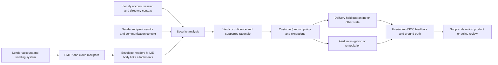
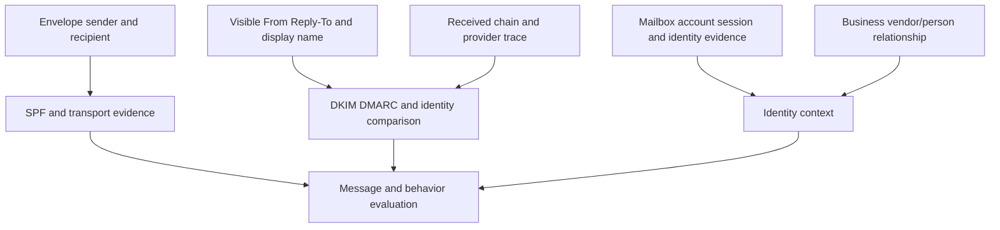
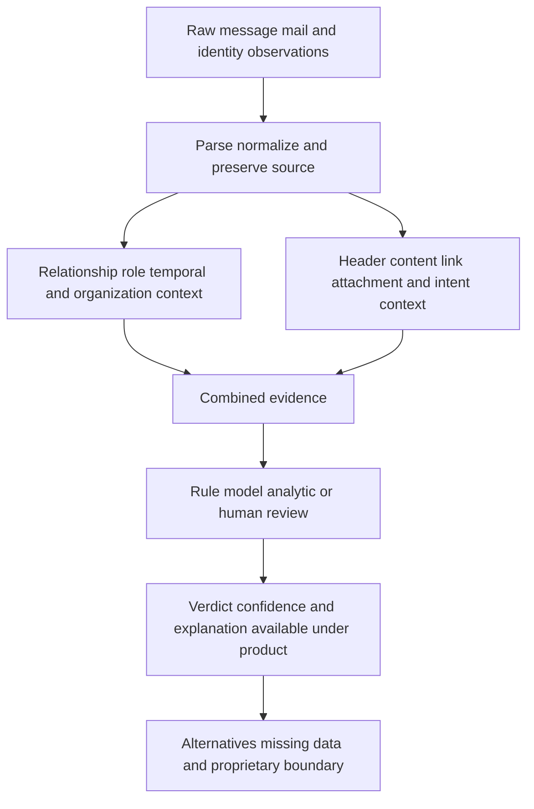
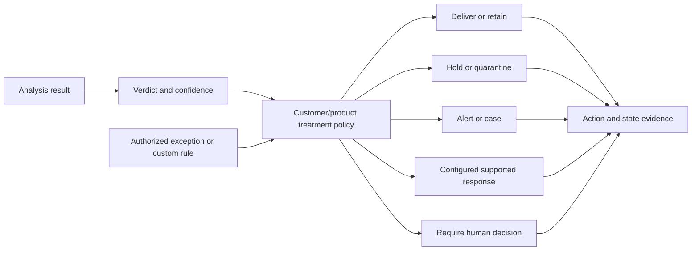
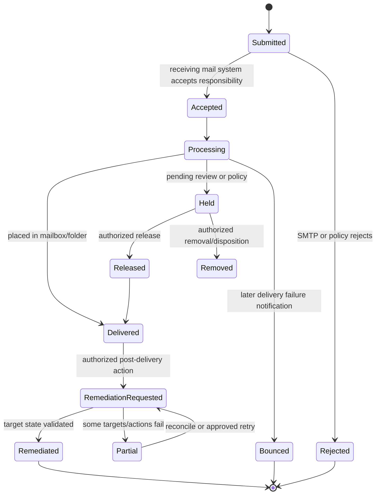
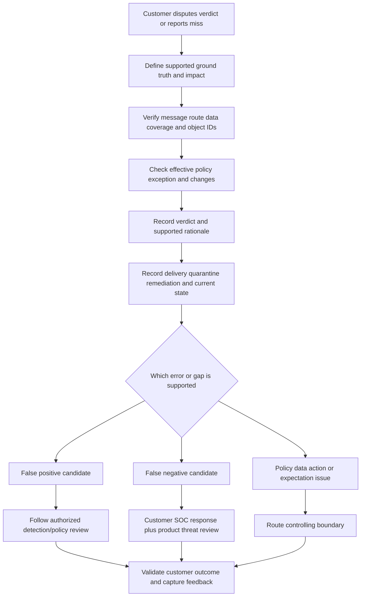
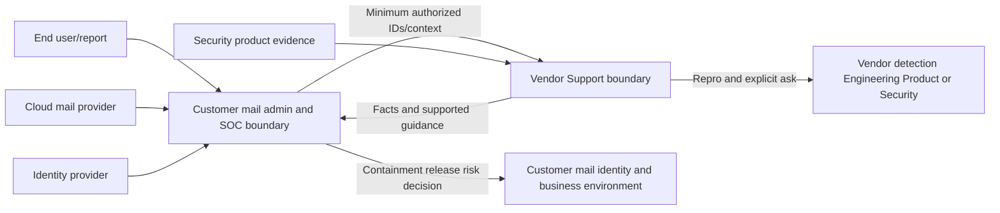
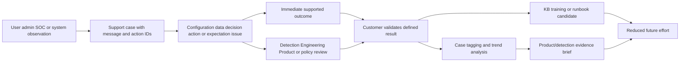
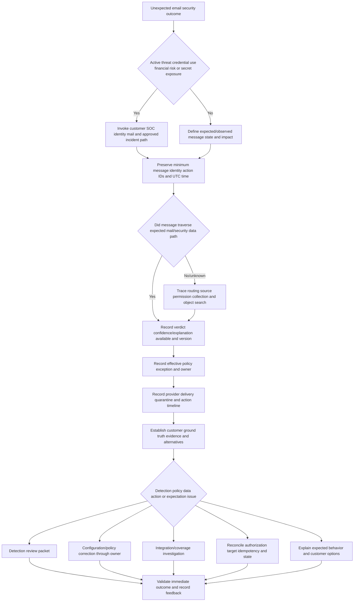
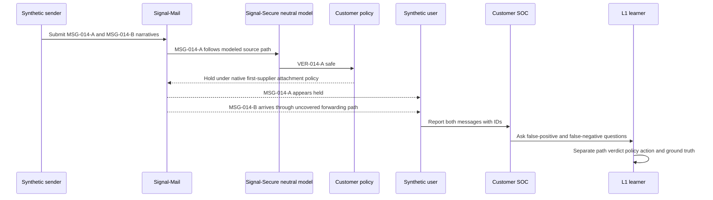

# Part 014 - Cloud Email Security Architecture and Detection Flow

> **Purpose:** Build a vendor-neutral email-security decision and support model across mail, identity, relationship, behavior, message analysis, verdict, policy, delivery, quarantine, remediation, customer feedback, and investigation, while keeping Abnormal's proprietary detection unknown.
>
> **Evidence rule:** Official Abnormal pages publicly describe behavioral email security, named threat/use-case categories, investigation, user-reported email handling, and remediation outcomes. This Part does not infer exact signals, data fields, model features, scores, thresholds, decision rules, training methods, actions, or tenant behavior.
>
> **Currency and official-source access date:** August 24, 2026.

## Section Goal

By the end of this Part, Arti should be able to explain a cloud email-security flow from first principles and diagnose where an unexpected outcome may have occurred. She should distinguish the **SMTP envelope** from visible message content; sender authentication from sender intent; message analysis from policy treatment; verdict from delivery state; quarantine from deletion; and a remediation request from validated target state.

Arti should be able to organize evidence into mail context, identity context, relationship/behavior context, message/content context, policy/configuration, action state, and customer ground truth. She should explain why a message can pass SPF, DKIM, or DMARC and still be fraudulent; why a behavioral anomaly is not proof of malice; why one false-positive report is not automatically a model defect; and why a missing alert is not automatically a false negative until data/path/ground-truth questions are checked.

She should also know the L1 touchpoints for configuration tickets, disputed verdicts, user-reported messages, delivery/quarantine questions, post-delivery remediation, threat investigations, and feedback. The practical outcome is the **Signal Post Synthetic Email-Security Decision and Support Map Lab**, which uses a harmless invented message, known ground truth, paper event records, and no live email system.

## JD Mapping

| Supplied JD signal | Capability developed here | Practical proof |
|---|---|---|
| Cloud Email Security | Explains an end-to-end mail/security decision path | Architecture and decision maps |
| Behavioral false positives | Separates customer ground truth, product verdict, policy, and action | False-positive investigation record |
| Threat investigations | Builds a timeline across message, identity, analysis, action, and customer evidence | Synthetic threat-case packet |
| Configuration tickets | Identifies routing, integration, policy, exception, population, and effective-state questions | Configuration touchpoint matrix |
| API questions | Traces source collection and message/action requests without inventing endpoints | Integration evidence map |
| Customer updates | Explains facts, uncertainty, impact, owners, and next test | Audience-safe case update |
| Engineering collaboration | Creates precise detection/action escalation asks with IDs and evidence limits | Two escalation packets |
| Root-cause insights/recommendations | Separates trigger, path gap, decision error, policy treatment, and action failure | Causal restraint worksheet |
| SOC and email administrators | Distinguishes product support evidence from customer incident/release decisions | Boundary/RACI map |
| Security mindset/privacy | Minimizes message content and protects credentials/employee communications | Lab privacy and evidence plan |

## Candidate Honesty Note

Arti has no claimed direct email-security production operations or Abnormal experience. Her Microsoft cloud support experience transfers to tenant/configuration reasoning, evidence, customer communication, Engineering/Product escalation, and fix validation. Networking and protocol learning helps her explain DNS, SMTP, TLS, HTTP/API, and provider boundaries. Identity and AI knowledge helps frame accounts, sessions, context, uncertainty, and human verification. It does not prove Exchange Online protection operations, mail-flow administration, threat verdict ownership, or proprietary model understanding.

| Evidence label | Honest use | Boundary |
|---|---|---|
| **Production-transfer example** | Enterprise support ownership, complex investigation, CRITSIT communication, escalation, validation, knowledge | Do not call Microsoft cloud support email-security operations |
| **Working knowledge/upskilling** | Mail, networking, identity, APIs, logs, AI fundamentals | Do not claim deep production mail administration |
| **Local/public lab** | Synthetic raw-message metadata, decision map, false-positive/negative reasoning | No sent mail, tenant, real headers, product console, or threat |
| **Learned architecture** | Official public product positioning and neutral email-security flow | No proprietary logic or workflow claim |
| **No direct experience** | Abnormal, direct email-security, threat-verdict operation | State directly in interviews |
| **Template only** | Evidence requests, decision trees, escalation packets | No real incident or product outcome implied |

## Fact Labels and Detection Ceiling

| Label | Meaning | Example |
|---|---|---|
| **Verified public fact** | Current official Abnormal public wording | Public pages name BEC, phishing, vendor fraud, account takeover, AI-generated lures, behavioral context, investigation, and remediation capabilities |
| **Supplied JD fact** | Role wording in the confirmed master | The role includes behavioral false positives and threat investigations |
| **Vendor-neutral teaching model** | General email and security reasoning | Context -> analysis -> verdict -> policy -> action -> feedback |
| **Inference/question to validate** | Likely but unconfirmed operational detail | Which evidence fields an L1 can see for a disputed verdict |
| **Unknown/private** | Proprietary or customer-specific detail | Signals, features, weights, thresholds, model internals, exact action semantics, permissions, case flow, SLA |

The detection ceiling is strict: Arti may explain **types of context** a behavior-centered system could use at a generic level, and she may repeat high-level categories explicitly published by Abnormal. She must not say, “Abnormal uses field X with weight Y,” “a score above Z causes quarantine,” or “the model retrains when a customer submits a case.”

## Beginner Term Primer

| Term | Plain meaning | Why it matters | Memory hook |
|---|---|---|---|
| **Email message** | Structured headers and body carried through mail systems | Visible content is only part of the evidence | Envelope, headers, body |
| **SMTP envelope** | Transport sender and recipients used during mail transfer | It can differ from visible From/To headers | The routing wrapper |
| **Header** | Named metadata field in the message, such as From, Date, Message-ID, or Received | Headers support route, identity, and thread reasoning | Message metadata lines |
| **MIME** | Multipurpose Internet Mail Extensions, the structure for message parts, types, encodings, and attachments | It explains bodies and attachments | Message parts and packaging |
| **Message-ID** | A message header identifier intended to identify a message | Useful for correlation but not guaranteed globally trustworthy | A message's stated identifier |
| **Message trace** | Provider evidence about message processing and delivery events | It shows provider path/state, not necessarily security intent | Follow the provider journey |
| **SPF** | Sender Policy Framework, a DNS-based check of whether an IP is authorized for an envelope sender domain | Passing does not prove the visible author or benign intent | Is this server allowed for that envelope domain? |
| **DKIM** | DomainKeys Identified Mail, a cryptographic signature over selected message content/headers | Valid signature proves bounded domain/key handling, not human intent | Signed by a domain, not morally safe |
| **DMARC** | Domain-based Message Authentication, Reporting, and Conformance, which checks alignment and publishes policy | Passing aligned auth can coexist with compromised/attacker-controlled accounts | Alignment and domain policy |
| **Identity context** | Information about account, session, role, device, and related changes | Compromised real accounts can send authenticated mail | Who controls valid authority? |
| **Relationship context** | History and pattern of communication among people, vendors, domains, or applications | A new or changed relationship can alter risk | Who normally talks to whom? |
| **Behavioral baseline** | A model or summary of expected behavior for an entity/context | Deviation can be informative but not conclusive | What usually happens? |
| **Anomaly** | Behavior that differs from an expected pattern | It can be malicious, benign, seasonal, or data-related | Unusual is a question, not a verdict |
| **Signal** | One observation used in analysis | Signals gain meaning in combination and context | A clue with provenance |
| **Feature** | A derived input used by an analytic/model | Proprietary feature design must remain unknown | Model-ready representation |
| **Verdict** | Classification such as safe, suspicious, malicious, spam, or another product-defined outcome | Labels and semantics vary | Product judgment, not absolute truth |
| **Confidence** | Strength or certainty assigned under a method | It is not the same as probability unless calibrated/documented | How strongly does evidence support the result? |
| **Policy treatment** | Configured action chosen for a verdict/context | Same verdict can lead to different treatment | What should happen after the judgment? |
| **Delivery state** | Where the message is in the mail system: accepted, delivered, held, bounced, etc. | Security verdict and delivery are separate | Where is the message now? |
| **Quarantine** | A controlled held state for review or policy | Quarantine ownership and release rules vary | Held for controlled decision |
| **Remediation** | Authorized corrective action, often after delivery | Requested, accepted, completed, and validated are different | Change an unwanted state |
| **False positive (FP)** | Benign/expected message treated as harmful or unwanted under the relevant label | Causes business and trust cost | Alarm without harmful condition |
| **False negative (FN)** | Harmful message not identified/treated as harmful | Creates exposure and response cost | Harm without the alarm |
| **Ground truth** | Best available supported determination of the message's actual class/context | Labels need evidence and authority | What really happened, as far as evidence supports |
| **Campaign** | Related messages/activity grouped by common operation or evidence | One report can reveal broader scope, but grouping needs evidence | Related activity set |
| **User-reported email** | Message a user sends or marks for security review | Reporting is a valuable source and a user-feedback opportunity | Humans add a signal |
| **Exception/allow rule** | Authorized configuration that changes treatment for a bounded condition | Can reduce false positives and create blind spots | Deliberate deviation with owner and scope |

## Email Security Mental Model

This is a **vendor-neutral teaching model**. Official Abnormal pages support high-level behavioral context, verdict/investigation, user-report, and remediation positioning, but not this exact flow or its internal data.

### Seven evidence families

| Evidence family | Questions it can support | What it cannot prove alone |
|---|---|---|
| Envelope/transport | Which sender/recipient path and systems handled mail? | Visible-author identity or intent |
| Headers/authentication | Domains, signatures, alignment, route, IDs, thread relationships | Message safety or account controller |
| Content/MIME | What text, links, attachments, and structure exist? | Business legitimacy without external context |
| Identity/account | Which account/session/role/change relates? | That account holder personally acted |
| Relationship/behavior | Is interaction expected, new, changed, or unusual? | Malice; unusual activity can be legitimate |
| Policy/configuration | Which treatment should apply and what exception exists? | Detection correctness by itself |
| Action/customer evidence | What state changed, what user/admin observed, what ground truth is supported? | Proprietary causal logic |

## Mail and Identity Context

Mail security spans several identities:

- SMTP envelope sender;
- visible From address/display name;
- Reply-To address;
- signing domain and selector;
- sending infrastructure;
- authenticated mailbox/account;
- recipient and mailbox;
- tenant and directory identity;
- vendor/business entity represented by the message;
- links/applications referenced by content.

### Identity distinctions

| Identity | Example question | Common trap |
|---|---|---|
| Envelope sender | Which domain receives bounce responsibility? | Treating it as visible author |
| Header From | Which identity is presented to recipient? | Trusting display name only |
| Reply-To | Where will a reply go? | Ignoring mismatch or legitimate service behavior |
| DKIM signing domain | Which domain/key signed selected content? | Calling valid signature proof of benign intent |
| DMARC organizational domain | Does SPF or DKIM identity align with From? | Calling pass proof account is uncompromised |
| Mailbox account | Which legitimate account sent/stored message? | Equating account with human controller |
| Tenant identity | Which customer/domain/organization context applies? | Mixing tenants or aliases |
| Business identity | Which real vendor/person/workflow is represented? | Treating technical domain as complete business proof |

## 🔍 Plain-English deep-dive: Authentication Proves a Narrow Claim

Email authentication is like checking that a parcel came through an authorized shipping account and that a seal matches a registered key. It does not prove the person who used the account was honest or that the invoice inside is legitimate. The analogy stops because SPF, DKIM, and DMARC make different technical claims and can be affected by forwarding or message modification.

A compromised vendor account can send mail that passes authentication. An attacker can register a lookalike domain and configure authentication correctly. A legitimate marketing provider can send with complex but valid delegation. Therefore, authentication is important evidence, not the final verdict.

Support should record the exact authentication identity, result, alignment, and source rather than say “the sender passed authentication.” If a customer asks why an authenticated message was flagged, explain that sender authorization and message intent are separate questions. Do not invent which Abnormal signal outweighed another.

## Message and Behavioral Analysis

A neutral analysis model can consider categories without claiming vendor features.

| Context category | Neutral examples | Diagnostic question | Limitation |
|---|---|---|---|
| Sender identity | Domain, account, infrastructure, authentication | Does presented/sending identity match expected business identity? | Technical identity is not human intent |
| Recipient/role | Recipient function, privilege, business process | Is target relevant to requested action? | Role data may be stale/sensitive |
| Relationship | Prior communication, vendor/user relationship, thread | Is relationship established and behavior consistent? | New relationship can be legitimate |
| Temporal | Time, cadence, sequence, recent change | Is timing expected for this workflow? | Seasonality and travel create anomalies |
| Request/intent | Payment, credential, data, approval, urgency | What action is the message trying to cause? | Natural-language interpretation can be ambiguous |
| Content | Text, links, domains, attachment types, MIME | Are content elements deceptive or risky? | No payload does not mean no risk |
| Identity/account | Sign-in, session, role, mailbox changes | Is a valid account behaving unexpectedly? | Support may not access all identity evidence |
| Thread/context | Reply/in-reply-to, prior messages, topic continuity | Is this a real conversation and has intent changed? | Thread hijacking can use genuine history |
| Organization policy | Executives, vendors, protected workflows, exceptions | Which customer-specific treatment applies? | Policy is not model ground truth |
| Community/threat intel | Known infrastructure/campaign/reputation | Is evidence current and relevant? | Unknown infrastructure can be harmful; reputation changes |

The boxes are conceptual. Exact Abnormal features, models, and explanation content are **unknown/private**.

## 🔍 Plain-English deep-dive: Anomaly Is a Question, Not an Accusation

If a colleague who normally works weekdays sends an early-Sunday payment request, the timing is unusual. It may reflect compromise, travel, a deadline, delegated work, a new process, or incorrect time/context data. Anomaly narrows attention; it does not establish motive.

**Analogy:** A smoke alarm detects unusual particles, but steam can trigger it. The alarm is valuable because it prompts a safe check; it is dangerous if every alarm automatically condemns the cook or if repeated false alarms are ignored. The analogy stops because behavioral analytics combine many signals and attackers adapt.

For a disputed verdict, ask which observed facts are available to Support, which customer context changes interpretation, whether a comparison exists, and which team can inspect private detection evidence. Do not ask the customer to prove a proprietary model wrong. Convert their business context into a reproducible, privacy-minimized review packet.

## Verdict, Policy, and Treatment

Verdict and treatment must remain separate.

| Record | Question | Evidence | Failure mode |
|---|---|---|---|
| Analysis/verdict | What classification was assigned under which version/context? | Message/object ID, verdict time/version, supported rationale | Wrong/missing context or decision defect |
| Policy | What treatment should that verdict receive for this scope? | Policy/exception ID/version/effective state | Wrong precedence, scope, or propagation |
| Action request | What was requested against which target? | Action ID, target IDs, requester/authority | Wrong target, duplicate, unauthorized request |
| Action result | What did target provider report? | Status, final/async state, target audit | Partial, delayed, rejected, stale UI |
| Customer outcome | Did the intended mailbox/workflow state change safely? | Trace/state and customer validation | Internal success without real outcome |

### Example

A message can have verdict “malicious” while remediation fails because the target mailbox permission is absent. It can have verdict “safe” while a customer policy routes the message to a review folder for another reason. It can be quarantined by the native mail provider rather than the security product. L1 must identify which object/system owns each state.

## Delivery, Quarantine, and Remediation States

This state model is neutral. Exact product/native-provider states and action semantics vary.

| State | What it proves | What it does not prove |
|---|---|---|
| SMTP accepted | A receiving system accepted responsibility at that hop | Inbox delivery, safety, final disposition |
| Delivered | Provider records mailbox/folder placement | User read it, no later move/remediation |
| Held/quarantined | A system placed it in a controlled state | Which product/policy did so unless evidenced |
| Release requested | Someone/system asked to release | Authority, completion, safety |
| Remediation requested | Corrective action was submitted | Target action completed |
| Action accepted | Target accepted request, possibly asynchronously | Final state across every target |
| Remediated | Defined target state is validated | Root cause, no copies/forwards elsewhere, no user action |
| Partial | Some scope succeeded and some failed | Safe retry or complete containment |

## 🔍 Plain-English deep-dive: Message State Is a Timeline, Not One Label

A parcel can be accepted by a carrier, sorted, delivered to a building, held by reception, moved to another room, or recalled. “Delivered” at noon and “removed” at 12:05 can both be true. The analogy stops because email can be copied, forwarded, synchronized to clients, and acted on before remediation.

When a customer says “the message was delivered,” ask at what time, to which recipient/folder, according to which provider evidence, and what happened later. When they say “it was quarantined,” ask which system owns the quarantine. When remediation says success, confirm the exact target population and provider state.

This timeline protects against false causation. A user may have reported a message after native quarantine but before a product view refreshed. A release can be authorized correctly while a client cache still shows an old state. Support needs source-native times and IDs, not one screenshot.

## False Positives and False Negatives

Ground truth in email is often a supported conclusion rather than perfect certainty. A customer statement is important evidence, but a request being “from our vendor” can still be harmful if the vendor is compromised. A product verdict is useful evidence, but a safe label is not proof.

| Case | Product/treatment | Supported ground truth | Customer cost | L1 objective |
|---|---|---|---|---|
| True positive | Harmful treated harmful | Harmful evidence supported | Protection plus possible investigation work | Validate scope/action and explain evidence limits |
| False positive | Benign treated harmful | Benign/expected evidence supported | Business delay, lost trust, manual review | Restore supported outcome and create review packet |
| True negative | Benign treated benign | Benign evidence supported | Normal operation | Avoid unnecessary work; retain only needed evidence |
| False negative | Harmful treated benign/missed | Harmful evidence supported | Exposure and response cost | Preserve evidence, scope path, invoke threat review |

### False-positive investigation

1. Define expected and observed message state and business impact.
2. Identify message/tenant/recipient and all relevant timestamps.
3. Determine verdict, policy treatment, quarantine/action owner, and current state.
4. Capture minimum mail/auth/context evidence and customer explanation.
5. Check configuration, exception, custom rule, and recent change.
6. Compare a truly relevant working/expected message, not a superficial example.
7. Follow the documented verdict-review/escalation path.
8. Avoid broad allowlisting or release advice outside authority.
9. Validate the immediate customer outcome and record recurring pattern separately.

### False-negative investigation

1. Preserve the harmless minimum evidence and invoke customer SOC process if risk is active.
2. Establish harmful behavior/ground truth and avoid merely saying “looks phishy.”
3. Confirm the message route and whether the security data path covered it.
4. Capture verdict/object availability, policy, action, user interaction, and identity context.
5. Search for related scope through authorized customer/product methods.
6. Separate detection gap, data gap, configuration gap, unsupported path, delayed processing, and response failure.
7. Escalate with raw/sanitized evidence, IDs, timeline, impact, and explicit review question.
8. Customer SOC/mail/identity owners control containment and broader response.

## 🔍 Plain-English deep-dive: Ground Truth Has a Source and Confidence

“The customer says it is safe” is valuable context, but it is not always final ground truth. A procurement user may recognize a supplier while being unaware that the supplier's account was compromised. Conversely, a product may flag unusual first-time behavior that the authorized business owner can verify as a new legitimate relationship.

**Analogy:** A referee's decision is stronger when supported by several camera angles and the applicable rule. One spectator's view matters but may be incomplete. The analogy stops because email cases involve technical evidence, business authority, privacy, and adaptive attackers rather than a fixed sports event.

Record who supplies the label, what authority and knowledge they have, which message and time it covers, what external verification occurred, which technical evidence agrees or conflicts, and how confident the conclusion is. A payment-change request may require out-of-band confirmation by an authorized business process. A training simulation can be confirmed by its owner. Spam preference may be subjective rather than a security truth.

The useful escalation phrase is: “The authorized customer owner confirms this exact message and business request are expected, and the supplied authentication, thread, and out-of-band evidence are consistent; no harmful behavior is currently identified.” That is more defensible than “customer says false positive,” and it remains open to correction if new account evidence appears.

## Configuration and Threat Ticket Touchpoints

| Ticket type | Primary question | Evidence | First owner intersection | Escalation trigger |
|---|---|---|---|---|
| Initial data coverage | Are intended messages/identities in supported scope? | Tenant, route, population, source health, control object | Customer admin + Support | Documented coverage differs from observed |
| Policy treatment | Which verdict receives which action? | Policy/version/scope/exception/effective time | Customer security/mail admin | Decision uses wrong policy after validation |
| Exception/allow | Is exception authorized, narrow, time-bounded, and effective? | Owner, condition, scope, expiry, result | Customer risk/mail owner | Broad bypass or conflict |
| Quarantine/release | Which system/state/owner controls the message? | Message and quarantine IDs, policy, authority | Mail admin/SOC + Support | Product/native state conflict |
| False positive | Is benign ground truth supported and where did treatment originate? | IDs, verdict, config, context, impact | Detection/product review | Reproducible unexplained verdict |
| False negative | Is harmful ground truth supported and was data path complete? | Raw safe evidence, route, verdict, user/identity events | Customer SOC + detection review | Active/expanding harm or product gap |
| User report | Was report received, triaged, responded, and related scope addressed? | Report/message/case IDs and times | SOC/reporting workflow | Missing/contradictory result |
| Remediation | Was correct target/action authorized and completed? | Action/target IDs, status, audit, before/after | Customer mail owner + action service | Partial/wrong/duplicate action |
| Search/investigation | Is query missing data due to source, retention, filter, or mapping? | Query/time/IDs/source coverage | Analyst + Support | Product evidence inconsistent |
| Account-driven threat | Is valid account behavior unauthorized, and what response is owned? | Mail, identity, session, rule/grant, timeline | Customer SOC/identity + Support | Credible compromise/incident |

## Evidence and Boundary Map

| Boundary | Support can contribute | Customer/other owner retains | Never infer |
|---|---|---|---|
| User -> customer | Reporting, observed task/impact, safe evidence | User safety guidance and organizational reporting process | User report is final verdict |
| Customer mail provider | Product-visible integrations and message IDs | Mail trace, routing, quarantine, mailbox configuration/actions | Support controls provider tenant |
| Identity provider | Product-visible account context where supported | Sign-in/session/grant containment and identity risk | Message verdict proves account compromise |
| Product -> Support | Supported evidence and case tools under entitlement | Product Security/Engineering internal telemetry and code | L1 sees all signals/logic |
| Customer -> Support | Minimum authorized evidence and expected outcome | Customer data/risk/release/incident decisions | Sending evidence grants unrestricted use |
| Support -> Engineering/Product | Clean packet, reproduction, impact, explicit ask | Proprietary investigation, intended behavior, fix/product decision | Escalation guarantees a fix/date |

## Customer Feedback and Learning

Feedback can be a user report, admin correction, verdict dispute, confirmed threat, release decision, outcome validation, or recurring case pattern. It should carry source, confidence, scope, and privacy.

Do not claim that a customer correction directly retrains a model, updates a global rule, or changes all future verdicts unless current authorized documentation proves it. A safe statement is: “The correction is captured through the supported review process; the owning team determines any detection, policy, or product change.”

### Feedback quality fields

| Field | Why needed |
|---|---|
| Stable message/case IDs and UTC timeline | Joins source, verdict, action, and customer observation |
| Ground-truth source and confidence | Separates preference from supported benign/harmful conclusion |
| Business/security impact | Prioritizes customer harm and tradeoff |
| Effective configuration/policy | Distinguishes treatment from detection |
| Relevant comparison | Tests the specific hypothesis |
| Requested outcome | Clarifies release, review, explanation, containment, or correction |
| Privacy/content handling | Prevents unnecessary exposure |
| Repeat pattern | Supports knowledge/product learning without overgeneralizing |

## Worked Examples

### Worked example 1: DMARC pass but vendor fraud suspected

**Input:** A synthetic vendor message passes aligned authentication and asks for new bank details.

**Reasoning:** Authentication supports that an authorized system/account for the domain sent aligned mail. It does not establish that the vendor account is uncompromised or that the request is authorized. Examine business relationship, thread continuity, request novelty, timing, reply path, account/identity context available to customer, and out-of-band verification.

**Boundary:** Customer security/business owners decide payment and containment. Support explains product evidence and review path; it does not declare the vendor compromised from the request alone.

### Worked example 2: Legitimate message quarantined

**Input:** Synthetic message `MSG-014-A` is expected by procurement but held.

**Trace:** Provider message ID and trace -> security object/verdict -> policy/exception -> quarantine owner/state -> authorized release decision -> final mailbox state.

**Finding:** The neutral lab shows verdict “safe” but customer policy routes external attachments to native quarantine. This is a policy-treatment case, not a detection false positive.

**Lesson:** Customer wording “your AI blocked it” can be sincere and still identify the wrong controlling layer.

### Worked example 3: Harmful message has no alert

**Input:** User entered credentials after a synthetic lure; no product alert is found.

**Immediate:** Customer SOC/identity process addresses user/session risk. Support preserves message/route/object IDs and checks whether the message traversed the supported data path.

**Possible outcomes:** unsupported route/data gap; delayed object; query mismatch; configuration; true detection miss; alert existed but response/routing failed.

**Do not:** Wait for model review before customer containment or claim false negative before path/ground truth is established.

### Worked example 4: Remediation partially succeeds

**Input:** An action targets ten synthetic message instances; eight show removed, one mailbox is unavailable, one target ID is wrong.

**Reasoning:** Record each target state. Do not call campaign remediated. Correct mapping requires Engineering/integration review; unavailable mailbox needs authorized retry/alternative after idempotency/state check.

**Update:** “Eight of ten target states are validated. Two remain unresolved for distinct reasons. The customer SOC owns exposure decisions; Support is reconciling action evidence.”

### Worked example 5: User report gets contradictory feedback

**Input:** Stored verdict is malicious; user response says safe.

**Hypotheses:** Wrong object association, stale template, response mapping defect, race/version, manual override, or UI display issue.

**Evidence:** Report/message/verdict/response IDs, versions, times, policy, final action. The contradiction is a communication/workflow defect candidate, not proof of verdict defect.

### Worked example 6: Bulk allow request

**Input:** Customer asks to allow all mail from a partner after several false-positive claims.

**Risk:** Broad allow can create a blind spot if partner account/domain is compromised. L1 should clarify ground truth, affected pattern, authentication/relationship, existing exception scope, business need, owner, expiry, and safer narrow alternatives under documented guidance.

**Boundary:** Authorized customer security/mail owner accepts treatment risk. Support does not promise the allow will override every product layer or recommend undocumented bypass.

## Troubleshooting Decision Tree

### Symptom-to-hypothesis-to-test matrix

| Symptom | Competing hypotheses | Cheapest safe test | Observation | Next action |
|---|---|---|---|---|
| Authenticated message flagged | Compromised/lookalike context, unusual request, policy, error | Compare auth identity, business identity, verdict and policy | Policy flag unrelated to auth | Explain separation and follow policy review |
| Legitimate mail held | Detection FP, native quarantine, transport rule, exception, attachment policy | Trace verdict and quarantine owner | Product safe; native policy held | Customer mail admin handles policy/release |
| Harmful mail no alert | Data path, query, delay, config, detection FN, alert route | Trace message ID through source/object | No source object | Coverage/integration review plus SOC response |
| Verdict changed | New evidence/review, version, policy display, wrong object | Compare verdict history/object/version | Different object linked | Correct association and case record |
| Remediation “success,” mail present | Async, stale client, wrong target, partial failure, provider denial | Check action/final target audit | Wrong target ID | Reconcile mapping; avoid blind retry |
| User report no response | Report ingestion, queue, verdict, template, send/action | Trace report ID to response | Response generation failed | Reporting workflow escalation |
| Many similar false positives | Real pattern, broad policy, seasonal change, data gap, bad comparison | Segment IDs/context/config over defined period | One exception drives all | Correct scoped config and measure |
| Search misses message | Wrong ID/time/tenant/filter, retention, source gap | Search provider ID and normalized aliases in UTC | Wrong time zone | Correct query; document evidence |

## Common Failure Modes and Safe Corrections

| Failure mode | Why it fails | Safe correction | Escalation trigger |
|---|---|---|---|
| SPF/DKIM/DMARC pass called safe | Auth proves narrow domain claims | Evaluate intent, account, relationship, content, policy | Credible fraud/compromise |
| Anomaly called malicious | Legitimate change can be unusual | Record alternatives and ground truth | Consequential response proposed |
| Verdict called delivery state | Classification and mailbox state differ | Trace verdict, policy, provider state, action | Systems conflict |
| Quarantine owner assumed | Native/product/admin systems may each hold mail | Identify object/system/policy | Release path unclear |
| False positive declared from preference | Unwanted, bulk, legitimate, and policy-disallowed differ | Define class and business context | Ground truth disputed |
| False negative declared before path check | Missing data/object can mimic miss | Verify route and source coverage | Data complete, harmful ground truth supported |
| Full message requested first | Privacy and business content exposed | Start IDs, trace, selected headers/context | Content uniquely necessary and authorized |
| Broad allowlisting | Creates security blind spot | Use narrow, approved, expiring exception if documented | High-risk workflow or broad domain |
| Message release advised by Support | Customer owns risk/action | Explain supported evidence and owner path | Customer requests risk acceptance |
| Action accepted called remediated | Async/partial target states remain | Validate every intended target and side effect | Partial/wrong action |
| Blind action retry | Duplicate/deletion side effects | Check state and idempotency | Timeout/unknown status |
| One correction assumed to retrain model | Feedback behavior is product-specific | Say owning team reviews through supported process | Customer asks future guarantee |
| Root cause inferred from public marketing | Proprietary detection remains unknown | Escalate exact evidence/question | Reproducible unexplained verdict |
| Support becomes incident commander | Customer owns environment response | Own product case and feed SOC | Active harm or declaration |
| Real suspicious link/attachment opened in lab | Unsafe and unnecessary | Use defanged/synthetic metadata only | Any real threat content appears |
| Microsoft cloud experience called email security | Overstates candidate evidence | State tenant/support transfer and direct gap | Interview asks hands-on details |

## Signal Post Synthetic Email-Security Decision and Support Map Lab

### Lab purpose

Build an inspectable, harmless email-security flow and two support investigations with known ground truth. The lab models decision boundaries; it does not attempt to imitate Abnormal's detection.

### Honest artifact label

> **LOCAL/SYNTHETIC EMAIL-SECURITY LAB - Paper evidence and decision mapping only. No sent email, mailbox, tenant, Abnormal product, live header, credential, suspicious content, threat operation, or production email-security experience is represented.**

### Prerequisites

1. Parts 001-013 and this Part.
2. Private Markdown/spreadsheet workspace and Mermaid preview or paper.
3. Only the supplied fictional records and reserved `.invalid` identities.
4. No mail client/server, Microsoft/Google tenant, Abnormal account, API, DNS change, attachment, URL visit, or network action.
5. Two to three hours plus a thirty-minute verbal case review.

### Authorized scope and privacy

| In scope | Out of scope |
|---|---|
| Invented headers/metadata and paper events | Real raw email, customer headers/content, live authentication checks |
| Defanged/reserved identities and no links | Phishing simulation, malicious attachment/link, mail sending |
| Neutral verdict/policy/action records | Reverse engineering or simulating Abnormal model internals |
| Customer/SOC/Support role mapping | Release, deletion, account, or containment action |

### Synthetic environment and ground truth

Fictional `Signal Post Labs` uses `Signal-Mail`, `Signal-ID`, `Signal-Secure`, and `Signal-Cases`. Identities: `sender@example.invalid`, `buyer@example.invalid`, `analyst@example.invalid`. Objects: `MSG-014-A`, `MSG-014-B`, reports `RPT-014-A/B`, verdicts `VER-014-A/B`, policies `POL-014-A/B`, action `ACT-014-A`, case `CASE-014-A`.

**Message A ground truth:** harmless supplier schedule notice. It passes synthetic authentication. Neutral lab analysis assigns safe. Customer policy `POL-014-A` holds all first-time supplier attachments in a fictional native quarantine. The attachment is harmless plain text. The customer calls it a false positive, but the supported lab conclusion is policy treatment, not detection FP.

**Message B ground truth:** synthetic harmful credential lure with no live link. It traverses a fictional forwarding route not included in the lab's security-source coverage. No product object/verdict exists. The user reports it after the narrative says they entered fake lab credentials. The supported conclusion is a data-coverage gap plus customer identity-response need, not a proven model false negative.

### Lab flow

### Step 1: Build the environment and boundary map

Record actors, systems, messages, source routes, identity context, policy owners, SOC authority, Support boundary, and all unknowns. Label `Signal-Secure` as a neutral fictional component, never an Abnormal replica.

### Step 2: Create safe message records

For each message record only synthetic envelope identities, visible identities, message ID, UTC times, route labels, auth outcomes, MIME type, content category, and ground truth. No realistic lure, URL, attachment binary, password, token, customer name, or financial detail.

### Step 3: Build the seven-family evidence matrix

For A and B, populate envelope/transport, headers/auth, content, identity, relationship/behavior, policy/configuration, and action/customer evidence. Write `unknown` where absent.

### Step 4: Trace Message A

Create rows for submission, acceptance, source collection, analysis, safe verdict, native policy hold, customer report, current state, authorized owner, and validation. Explain why “safe verdict + held state” is not contradictory.

### Step 5: Trace Message B

Create rows for forwarding route, delivery, absent source object, user report, fake credential interaction, customer identity response, coverage analysis, and product-case route. Explain why absent verdict is not a safe verdict and not yet a model FN.

### Step 6: Build FP/FN decision records

For each case include asserted label, supported ground truth, data-path completeness, verdict, policy, action, current state, business/security impact, alternatives, confidence, owner, and next test.

### Step 7: Create configuration ticket map

Cover source coverage, policy treatment, exception, quarantine ownership, report workflow, and search. For each: expected/actual, effective state, change, evidence, owner, rollback/validation, and product-specific unknown.

### Step 8: Create threat ticket map

For Message B record immediate customer SOC/identity actions as owner decisions only; product Support responsibilities; evidence preservation; possible related-message scope; explicit detection/data question; and customer update. Do not invent containment steps or execute anything.

### Step 9: Add two remediation simulations

Paper case 1: action request targets three synthetic IDs and one mapping is wrong. Paper case 2: action is accepted but final status is pending. Record idempotency, target validation, partial state, owner, and safe retry question.

### Step 10: Write escalation packets

1. Policy-state packet for Message A, only if product/native states conflict after mapping.
2. Coverage/detection-review packet for Message B with route, absent source object, harmful ground truth, impact, and explicit question.

Both include privacy note and no message content beyond synthetic category.

### Step 11: Write audience updates

Create end-user, mail-admin, SOC, executive, and Engineering versions from one evidence core. Facts and confidence cannot change. The executive update must say no real incident/loss exists in the lab.

### Step 12: Validate, clean, and retain

1. Search for real domains, names, addresses, URLs, credentials, tenant IDs, customer data, and product-internal terms.
2. Confirm `.invalid` identities and obvious synthetic IDs only.
3. Delete scratch message content and screenshots.
4. Record reviewer, score, corrections, source date, retained artifacts, and limitation.
5. Keep privately as lab evidence.

### Required artifacts

| Artifact | Required content | Honest label |
|---|---|---|
| Context/boundary map | Systems, actors, flows, owners, unknowns | Vendor-neutral local lab |
| Safe message records | Two synthetic messages with ground truth | Local/synthetic lab |
| Evidence matrices | Seven families for A/B | Local/synthetic lab |
| Message timelines | Path, verdict, policy, action, current state | Local/synthetic lab |
| FP/FN records | Asserted versus supported classification | Local/synthetic lab |
| Configuration map | Six ticket surfaces | Template plus local lab |
| Threat map | SOC/Support responsibilities and evidence | Template plus local lab |
| Remediation simulations | Wrong target and pending async cases | Local/synthetic lab |
| Escalations/updates | Two packets and five audiences | Template only |
| Validation/cleanup | Rubric, privacy review, limitations | Local/synthetic lab |

### Cleanup and privacy

- Delete temporary synthetic message fixtures, duplicate diagrams, screenshots, and scratch notes after reviewing the lab artifact.
- Retain only the minimum fictional architecture worksheet needed for study; include no customer, tenant, message, credential, private endpoint, or proprietary product detail.
- Confirm that no message was sent, no live mailbox or security product was accessed, and no production policy, connector, routing, or remediation state changed.

### Validation rubric

| Dimension | 0 | 2 | 4 |
|---|---|---|---|
| Message basics | Envelope/headers confused | Main objects correct | Envelope, visible identity, auth, MIME, IDs, route, state distinct |
| Detection ceiling | Proprietary logic invented | Disclaimer present | Every signal category neutral/public; exact features/weights/thresholds absent |
| Context reasoning | Auth pass equals safe | Several contexts | Mail, identity, relationship, temporal, intent, content, policy integrated |
| Verdict/policy/action | One status | Some separation | Distinct versioned records and owners through customer validation |
| FP/FN discipline | Customer assertion accepted | Evidence checked | Ground truth, path completeness, decision, policy, action, alternatives complete |
| Configuration | Random settings | Ticket categories | Effective state, change, owner, rollback/validation, privacy complete |
| Threat support | Support commands response | SOC named | Active-risk escalation, product workstream, evidence and authority precise |
| Remediation | Accepted equals success | Final state checked | Targets, partial state, idempotency, retry/rollback, side effects complete |
| Evidence/privacy | Real/full message | Synthetic fields | Minimum metadata, no secrets/links/content, manifest and cleanup complete |
| Escalation | “Model wrong” | IDs and impact | Path/verdict/policy/action evidence and explicit private-owner question |
| Candidate honesty | Email ops implied | Gap stated | Microsoft transfer and no-direct-email/Abnormal boundaries explicit |
| Reproducibility/admin | Live action or missing record | Partial lab | Full artifacts, known ground truth, no activity, score and retention complete |

**Passing target:** 42/48 or higher, with 4s in detection ceiling, FP/FN discipline, threat support, evidence/privacy, candidate honesty, and reproducibility/admin. Any sent email, live tenant/account/API/DNS action, real message/header/content, URL/attachment interaction, credential, private product claim, or production experience claim is an automatic failure.

## Official Source Anchors (accessed August 24, 2026)

| Official source | URL | Used for | Boundary |
|---|---|---|---|
| Supplied Technical Support Engineer JD represented in the master | No public URL supplied | Cloud Email Security, false-positive, threat-investigation, configuration/API responsibilities | No private support flow inferred |
| Abnormal homepage | <https://abnormal.ai/> | Public BEC/phishing/account-takeover and behavioral platform context | Marketing statement, not detection specification |
| Abnormal Behavioral Security Platform | <https://abnormal.ai/platform/overview> | Public Email Security area, behavior/identity/relationship positioning, integrations | No exact model, signals, fields, decisions, or actions inferred |
| Email Security | <https://abnormal.ai/platform/email-security> | Public modern email problem, named capabilities, behavioral context, investigation, user reporting, and remediation positioning | Page imagery/claims do not define exact customer workflow or proprietary internals |
| Inbound Email Security | <https://abnormal.ai/platform/inbound-email-security> | Public BEC/vendor fraud/social engineering/account takeover, detection, Threat Log, Detection 360, Search & Respond, quarantine/remediation positioning | Product names are public; fields, procedures, thresholds, and feedback mechanics unknown |
| AI Security Mailbox | <https://abnormal.ai/platform/ai-security-mailbox> | Public user-report triage, feedback, campaign-level remediation, report-button/SIEM/SOAR context | Exact confidence handling, policies, action semantics, entitlements unknown |
| Technology Integrations | <https://abnormal.ai/platform/technology-integrations> | Public ecosystem integrations | Listing does not define event schema or setup |
| Trust Center | <https://abnormal.ai/trust-center> | Public security/privacy/compliance context | Message data handling, support access, retention, and contract require authorized detail |
| RFC 5321, Simple Mail Transfer Protocol | <https://www.rfc-editor.org/rfc/rfc5321> | SMTP envelope, transfer, reply-code and responsibility concepts | Product/provider behavior adds separate policy |
| RFC 5322, Internet Message Format | <https://www.rfc-editor.org/rfc/rfc5322> | Message header/body structure and Message-ID context | It does not define security verdicts |
| RFC 7208, Sender Policy Framework | <https://www.rfc-editor.org/rfc/rfc7208> | SPF identity and result fundamentals | SPF pass does not prove benign message |
| RFC 6376, DomainKeys Identified Mail | <https://www.rfc-editor.org/rfc/rfc6376> | DKIM signature concepts | Signature validity does not prove human intent |
| RFC 7489, DMARC | <https://www.rfc-editor.org/rfc/rfc7489> | DMARC alignment/policy fundamentals | Current updates and provider handling require later validation |

### Source discipline

- Named public Abnormal threat categories, product/capability names, and high-level behavior/investigation/remediation statements are **verified public facts** as attributed.
- The end-to-end architecture, context categories, verdict/policy/action separation, state machine, and ticket paths are **vendor-neutral teaching models**.
- Which fields, tools, explanations, actions, and evidence an L1 can access is an **inference/question to validate**.
- Proprietary signals, features, weights, thresholds, scores, model architecture/training, customer baselines, exact policy/action semantics, permissions, entitlements, SLAs, and internal review processes are **unknown/private**.

## Interview Q&A

### Q1.

**Question:** Walk me through a vendor-neutral cloud email-security decision flow.

**Model answer:** I start with SMTP envelope/route, message headers and MIME, sender authentication, cloud-mail trace, recipient and tenant, identity/session context, relationship/history, request/content context, and effective policy. Analysis produces a verdict or finding; policy selects treatment; the mail/security system delivers, holds, alerts, or requests response; target audit and customer validation establish the final state. Feedback may trigger support, policy, detection, or Product review. I do not claim Abnormal uses this exact flow or reveal proprietary signals.

### Q2.

**Question:** Why can a message pass SPF, DKIM, and DMARC and still be malicious?

**Model answer:** SPF authorizes an IP for an envelope-sender domain, DKIM validates a domain signature over selected content, and DMARC checks alignment with the visible From domain and publishes policy. Those checks help establish domain-level authenticity, not the human controller or business intent. A compromised account, malicious authenticated domain, or lookalike domain can pass. I combine authentication with identity, relationship, request, thread, content, and customer context without inventing a proprietary weighting.

### Q3.

**Question:** What is the difference between a verdict, policy treatment, and message state?

**Model answer:** A verdict is the classification assigned by analysis. Policy treatment decides what should happen for that verdict, scope, and exception. Message state is the actual provider/product condition such as delivered, held, released, or removed. A safe verdict can still be held by another customer policy; a malicious verdict can exist while remediation fails. I collect separate verdict, policy, action, target, and customer-validation evidence.

### Q4.

**Question:** How do you investigate a false positive?

**Model answer:** I define the customer's expected and observed state and business impact, identify the exact message/tenant/recipients and UTC timeline, record verdict and effective treatment policy, identify quarantine/action owner, collect minimum mail/auth/context evidence, check exceptions and recent changes, and compare a relevant expected message. I follow the supported verdict-review path, avoid broad allowlisting or unauthorized release, and validate immediate outcome separately from any detection/Product change.

### Q5.

**Question:** How do you investigate a possible false negative?

**Model answer:** I first protect the customer: their SOC/identity/mail owners handle active risk. For the product case I establish harmful ground truth, preserve minimum safe message and timeline evidence, verify the message route and supported data coverage, locate any verdict/action object, inspect effective configuration, and separate data gap, unsupported path, delay, query issue, detection miss, and response failure. I escalate with IDs, evidence, impact, alternatives, and an explicit review question, not “the model failed.”

### Q6.

**Question:** What does remediation success mean?

**Model answer:** It means the authorized action targeted the intended tenant, message instances, and scope; the target system reports a final successful state; every intended target and exception is reconciled; no unsafe duplicate/side effect occurred; and the customer validates the defined outcome. A submitted or accepted request is not enough, especially for asynchronous processing. Before retrying I check action state and idempotency.

### Q7.

**Question:** How do Support, the customer SOC, and Engineering divide a threat case?

**Model answer:** Support owns the product case: expected/actual behavior, product-visible evidence, configuration/data/action diagnosis, updates, and a clean escalation. The customer SOC/mail/identity owners determine incident scope, release, containment, risk, and environment actions. Engineering or detection specialists inspect private telemetry/logic and defects; Product clarifies intended behavior. Support maintains continuity but does not command the customer's response or promise a model change.

### Q8.

**Question:** What direct email-security experience do you have?

**Model answer:** I do not claim direct email-security production operation or Abnormal experience. My production foundation is Microsoft enterprise support and escalation: complex diagnosis, tenant/configuration context, CRITSIT communication, Engineering/Product handoffs, fix validation, knowledge, mentoring, and support analytics. Networking, mail-protocol, identity, API, log, and AI study adds technical readiness. My current email-security proof is learned architecture and a harmless synthetic decision/support lab.

## 30-Second Memory Hooks

- **Envelope routes; headers represent; body/MIME carries content.**
- **Authentication proves narrow domain claims, not benign intent.**
- **Valid account does not prove valid controller.**
- **Behavioral anomaly is a question, not an accusation.**
- **Context categories are teachable; proprietary features and weights are not.**
- **Verdict judges; policy treats; action changes; state proves result.**
- **Delivered and later remediated can both be true.**
- **Quarantine belongs to a specific system and owner.**
- **FP: benign treated harmful; FN: harmful not treated harmful.**
- **Customer assertion matters; supported ground truth still needs evidence.**
- **Check data path before calling a missing alert a model miss.**
- **A correct verdict can have a failed action; a safe verdict can meet a restrictive policy.**
- **`202` or accepted action is not final target state.**
- **Never broad-allow or release outside authority.**
- **Support owns product continuity; customer SOC owns incident decisions.**
- **Public behavioral claims do not expose proprietary detection.**

## Completion Checklist

- [ ] I can define envelope, header, MIME, Message-ID, trace, SPF, DKIM, DMARC, identity/relationship context, baseline, anomaly, signal, feature, verdict, policy, delivery, quarantine, remediation, FP, FN, and ground truth.
- [ ] I can explain why authentication and benign intent are different claims.
- [ ] I can map seven evidence families and state what each cannot prove alone.
- [ ] I can discuss neutral context categories without naming proprietary Abnormal signals, fields, weights, or thresholds.
- [ ] I can distinguish analysis/verdict, policy/exception, action request, action result, and customer outcome.
- [ ] I can trace submitted, accepted, processed, delivered, held, released, removed, bounced, remediation-requested, partial, and remediated states.
- [ ] I can identify the system and owner of quarantine before recommending a path.
- [ ] I can investigate false positives through ground truth, effective policy, context, comparison, review, and validation.
- [ ] I can investigate false negatives through immediate customer safety, harmful ground truth, route/data coverage, configuration, decision/action evidence, and escalation.
- [ ] I can separate a detection gap from a data, configuration, query, policy, or response gap.
- [ ] I can route ten configuration/threat ticket types with minimum evidence and owner boundaries.
- [ ] I can explain why feedback does not automatically retrain or globally change a product.
- [ ] I can handle active account/payment/credential concerns by invoking customer SOC/identity/mail owners while continuing product evidence work.
- [ ] I can write a detection/action escalation without saying “the model is wrong” as the only ask.
- [ ] I completed all twelve Signal Post lab steps using only two synthetic messages and known ground truth.
- [ ] My lab includes context map, safe records, evidence matrices, two timelines, FP/FN records, configuration/threat maps, remediation simulations, two packets, and five audience updates.
- [ ] I scored at least 42/48, with 4s in detection ceiling, FP/FN discipline, threat support, evidence/privacy, candidate honesty, and reproducibility/admin.
- [ ] I sent no mail and used no account, tenant, API, DNS change, real header/content, credential, URL, attachment, product console, or network action.
- [ ] I made no claim about Abnormal's exact detection signals, features, weights, scores, thresholds, training, baselines, fields, permissions, workflows, actions, entitlements, SLAs, or customer behavior.
- [ ] I use Arti's Microsoft, M365, networking, API/data, customer, KB/training, mentoring, and AI facts only as transferable background.
- [ ] I can answer all eight interview questions aloud while preserving customer and vendor authority.
- [ ] I revalidated all official source anchors against August 24, 2026.

[Next: Part 015 - AI Security Agents Workflows and Safeguards](Part-015-ai-security-agents-workflows-and-safeguards.md)