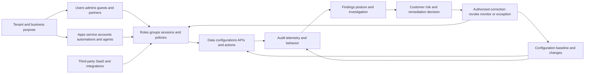
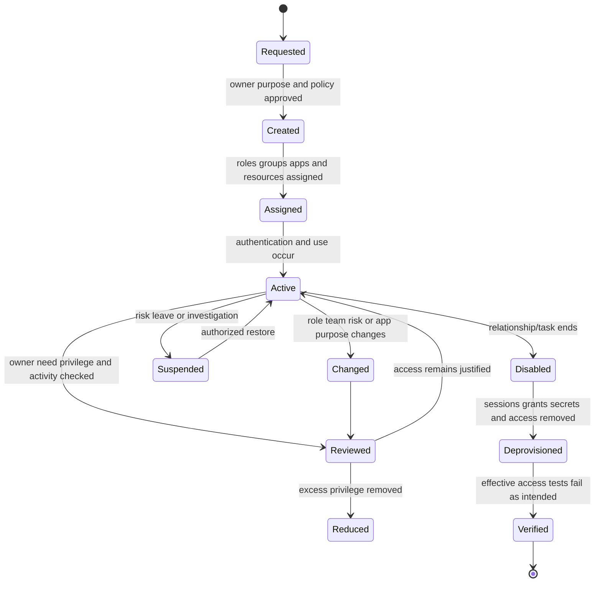
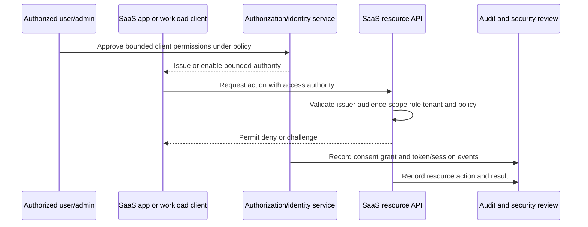
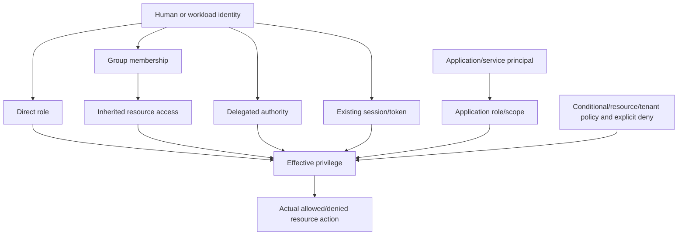
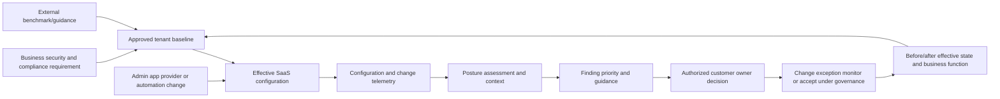
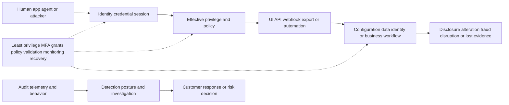
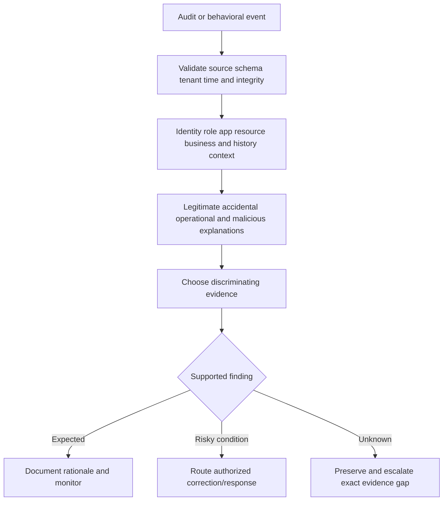
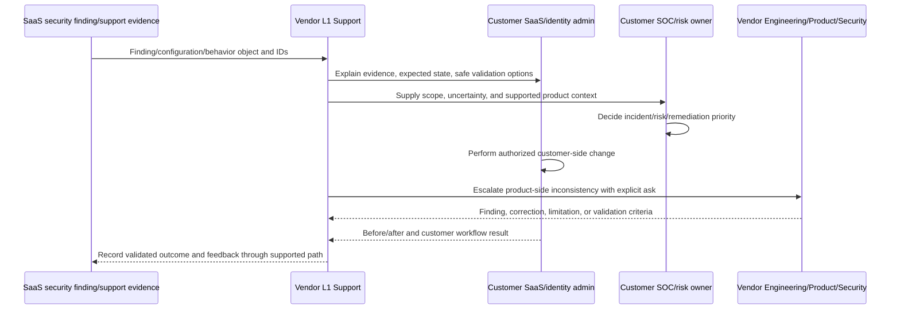
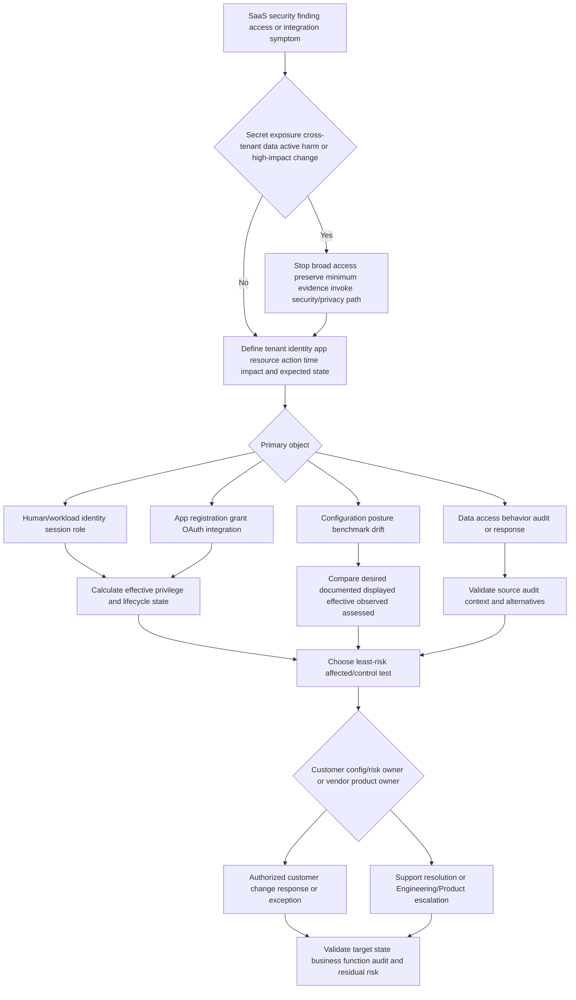
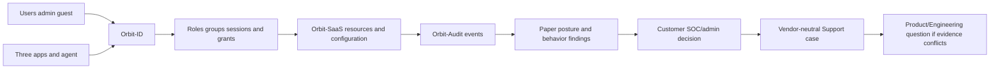

# Part 016 - SaaS Security Architecture and Risk Surfaces

> **Purpose:** Map Software as a Service security across tenants, human and workload identities, applications, integrations, roles, privileges, OAuth grants, configuration, data access, audit events, behavior, posture, and response ownership, then turn those surfaces into evidence-based support questions.
>
> **Evidence rule:** SaaS Security is a supplied JD area. Official Abnormal pages publicly describe Microsoft 365 Security Posture Management, Identity Security, AI Governance, integrations, configuration drift, app/agent permissions, and behavioral context at a high level. This Part does not infer the complete SaaS Security portfolio, exact checks, data fields, scores, connectors, collection cadence, remediation mechanics, permissions, or customer behavior.
>
> **Currency and official-source access date:** August 24, 2026.

## Section Goal

By the end of this Part, Arti should be able to explain why SaaS security is not merely “secure the web application.” The customer operates a changing estate of tenants, users, administrators, service accounts, applications, OAuth grants, sessions, configurations, data, integrations, and audit sources. Security depends on which identity can perform which action on which resource, under which policy and context, and whether that authority remains necessary and observable.

Arti should be able to distinguish authentication from authorization; direct roles from effective privilege; an application registration from a consented grant; configuration state from posture interpretation; exposure from exploitation; unusual behavior from confirmed misuse; guidance from an authorized change; and a remediation request from validated target state. She should identify customer, SaaS provider, identity provider, integration vendor, SOC, Support, Engineering, Product, privacy, and business-owner boundaries.

The practical outcome is the **Orbit Ledger SaaS Risk and Control Map Lab**. It uses a fictional tenant, identities, apps, grants, settings, and audit events. It produces no real tenant or account and performs no sign-in, OAuth consent, configuration change, API call, or security test.

## JD Mapping

| Supplied JD signal | Capability developed here | Practical proof |
|---|---|---|
| SaaS Security | Builds an end-to-end SaaS resource/authority/risk map | SaaS risk-surface architecture |
| Configuration tickets | Distinguishes intended, displayed, effective, benchmarked, and drifted state | Configuration evidence worksheet |
| API questions | Traces workload identity, OAuth grant, scope, resource, request, and audit | Integration permission map |
| Behavioral false positives | Separates unusual app/user activity from confirmed misuse | Behavior investigation record |
| Threat investigations | Correlates sign-in, grant, app, data, config, and response events | Synthetic timeline |
| AI Security Agents | Treats agents as workload identities and apps with tools/grants | Agent/SaaS boundary card |
| Cloud Email Security | Includes mail-related apps, identities, and configuration without claiming product implementation | Cross-domain use case |
| Engineering/Product collaboration | Creates exact posture, effective-state, and event-correlation asks | Escalation packets |
| Customer trust/privacy | Minimizes tenant/user/app data and preserves authority | Evidence and responsibility map |
| Microsoft 365 | Uses Arti's Microsoft cloud background only as transferable context and current public posture page as public product context | Honest candidate bridge |

## Candidate Honesty Note

Arti's production Microsoft enterprise-support experience gives her a useful foundation in tenant-aware cloud troubleshooting, permissions/configuration reasoning, customer communication, service evidence, Engineering/Product escalation, and fix validation. AD/Entra, SSO/SAML/OAuth, REST/JSON, networking, Power Automate/Apps, and analytics are working concepts. She must not claim Microsoft 365 security posture administration, Exchange security, formal identity governance, Abnormal SaaS Security, Okta, Slack, or other named-platform production operation unless supported elsewhere by real evidence.

| Evidence label | Honest use | Boundary |
|---|---|---|
| **Production-transfer example** | Microsoft enterprise cloud support, complex cases, communication, escalation, validation | No direct SaaS-security program or Abnormal product claim |
| **Working knowledge/upskilling** | AD/Entra, OAuth/SSO, APIs/JSON, networking, automation, analytics | Do not imply architecture or administrator depth |
| **Local/public lab** | Fictional tenant, risk graph, grant review, posture/behavior cases | No real SaaS account, consent, API, configuration, or audit data |
| **Learned architecture** | Neutral SaaS security model and official public Abnormal context | No exact product scope or mechanism |
| **No direct experience** | Abnormal SaaS Security and named non-Microsoft SaaS/security platforms | State explicitly |
| **Template only** | Grant inventory, risk register, shared-responsibility, escalation forms | A template is not an assessment |

## Fact Labels and Product Ceiling

| Label | Use | Example |
|---|---|---|
| **Verified public fact** | Current official Abnormal public statement | Security Posture Management publicly describes Microsoft 365 configuration assessment, CIS Benchmark comparison, prioritization, drift, and guidance |
| **Supplied JD fact** | Role/master wording | The role names SaaS Security |
| **Vendor-neutral teaching model** | General SaaS security architecture | Tenant -> identities/apps -> authority -> data/action -> audit -> review |
| **Inference/question to validate** | Reasonable product/support question | Which SaaS products, tenants, checks, and actions are in the role's current scope |
| **Unknown/private** | Exact implementation | Connectors, source fields, permissions, assessment cadence, risk formulas, remediation execution, evidence retention, entitlements, SLAs |

## Beginner Term Primer

| Term | Plain meaning | Why it matters | Memory hook |
|---|---|---|---|
| **Software as a Service (SaaS)** | Software delivered and operated as an online service | Customers configure tenants, identities, apps, data, and integrations while provider operates service | Shared service, shared responsibility |
| **Tenant** | Logical customer/organization boundary in a SaaS service | Every identity, object, policy, and event needs the correct tenant context | One service, separated customer space |
| **Organization/workspace** | Product-specific administrative boundary, sometimes equivalent to or nested within a tenant | Product words vary | Verify the actual boundary |
| **Human identity** | User or administrator account associated with a person | Lifecycle, roles, sessions, and accountability depend on it | Person represented digitally |
| **Workload identity** | Non-human identity for an app, service, automation, or agent | Continuous access can be powerful and ownerless | Software needs governed identity |
| **Service account** | Account used by software/process rather than ordinary interactive person | Shared secrets and broad privileges are common risks | Machine-run account |
| **Application registration** | Definition/identity of an application in an identity system | It describes the client but does not itself prove tenant access | App identity record |
| **Service principal/enterprise app** | Tenant-local representation of an application/workload identity in some platforms | It can hold tenant-specific grants and assignments | App instance in a tenant |
| **OAuth** | Framework for delegated authorization using access tokens | Apps can receive bounded authority without a user's password | Delegate access, not password |
| **Consent** | Approval of requested application permissions by an authorized party under policy | Consent can be excessive, stale, or socially engineered | Approval of app authority |
| **Grant** | Recorded authority given to an app/client | A registration without grant may have no resource access | Permission relationship |
| **Scope** | Named delegated permission describing access category | Scope must match approved purpose | What delegated access allows |
| **Application role/app permission** | Permission assigned to a workload/application, often without a signed-in user | Can create broad unattended access | App acts as itself |
| **Access token** | Credential presented to a resource API | Anyone possessing a bearer token may use its authority | Portable authority |
| **Refresh token** | Credential used to obtain new access tokens where supported | Can extend access after initial sign-in | Renew access authority |
| **Session** | Continuing authenticated interaction state | Role removal and session termination may not be simultaneous | Access has a lifetime |
| **Role-based access control (RBAC)** | Permissions grouped into roles assigned to identities | Visible role may combine with groups/inheritance | Roles package authority |
| **Effective privilege** | Total authority after direct, group, inherited, delegated, app, and session paths | It is the real security state | What can the identity actually do? |
| **Privilege creep** | Access accumulates beyond current need | Role changes and temporary grants become permanent | Old keys stay on the ring |
| **Configuration** | Settings controlling product behavior | Intended/displayed/effective state can differ | Settings shape outcomes |
| **Posture** | Current security condition of configurations, identities, controls, and exposures | It changes continuously | Security state now |
| **Benchmark** | Reference set of recommended configurations/practices | It supports review but does not replace business context | Reference, not automatic truth |
| **Finding** | Documented condition identified by a tool or analyst | It is evidence for review, not necessarily an incident | A condition needing interpretation |
| **Drift** | Change away from intended/baseline state | Daily changes make periodic snapshots stale | Secure yesterday, changed today |
| **Misconfiguration** | Setting that differs from required or intended secure behavior | It can create exposure without exploitation | Wrong state, possible risk |
| **Exposure** | Condition placing an asset within reach of potential harm | Exposure is not proof of use | Reachable risk, not breach |
| **Audit event** | Record of an administrative/user/application action | Supports attribution, sequence, and control validation | Who/what did what when |
| **Telemetry** | Logs, metrics, traces, and events about system activity/state | Coverage and integrity determine investigation quality | Recorded observation |
| **Risky behavior** | Activity whose context suggests elevated concern | It requires alternatives and customer ground truth | Concern, not conviction |
| **Data access** | Read, create, update, delete, share, export, or administer data | Different actions have different harm and scope | Name the data action |
| **Remediation guidance** | Recommended steps for an authorized owner to reduce a condition | Guidance is not proof of execution or universal fit | Suggested correction with owner |
| **Exception** | Authorized, documented, bounded deviation from requirement | Needs risk, controls, expiry, and owner | Governed temporary deviation |

## SaaS Security Core Model

This is a **vendor-neutral teaching model**, not Abnormal architecture.

### SaaS security objectives

| Objective | Core question | Example control/evidence |
|---|---|---|
| Correct tenant boundary | Is the identity/object/action in the intended tenant? | Tenant-aware IDs, authorization, negative isolation test |
| Governed identity lifecycle | Are people/apps created, changed, disabled, and reviewed appropriately? | Provisioning/deprovisioning events, owner, last use |
| Least privilege | Is effective access limited to approved purpose? | Role/grant inventory, access test, review |
| Secure configuration | Do effective settings meet policy/business requirements? | Baseline, finding, before/after, exception |
| Protected data | Are reads/writes/shares/exports authorized and minimized? | Resource audit, data class, policy, action result |
| Trusted integration | Do connected apps exchange only approved data/actions? | Grant, API request/delivery, schema, audit |
| Observable behavior | Can important actions and changes be reconstructed? | Source/event health, UTC, actor, target, result |
| Safe remediation | Are corrective actions authorized, scoped, reversible, and validated? | Decision, change/action ID, target state, rollback |
| Resilience | Can business/security functions continue and recover safely? | Health, backup/restore, workaround, reconciliation |

## 🔍 Plain-English deep-dive: A SaaS Tenant Is a Security Boundary, Not Just a Billing Container

A tenant is like a secured floor in a large shared office tower. The provider operates the building, while each organization controls many occupants, badges, rooms, applications, and records. The analogy stops because a digital tenant may span regions and services, authority can be delegated through tokens, and data can be copied instantly.

Tenant context must travel with identity, resource, policy, query, action, and audit. An email address alone may exist in several tenants or guest relationships. An application can be registered globally but consented differently in each tenant. A support engineer who omits tenant context can query the wrong object, misread a role, or create a serious privacy incident.

A possible cross-tenant result is not an ordinary troubleshooting opportunity. Stop broad access, restrict evidence, preserve minimum identifiers and access facts, and invoke the approved vendor security path. Do not explore whether more data is visible.

## Identities and Lifecycle

| Identity category | Typical need | Main risks | Evidence |
|---|---|---|---|
| Workforce user | Perform job tasks | Phishing, stale roles, session theft, privilege creep | Sign-in, role/group, resource action, lifecycle |
| Administrator | Configure tenant and identities | Broad blast radius, shared account, standing privilege | Named admin, JIT/approval, change/audit |
| Guest/partner | Collaborate across organization boundary | Stale invitation, wrong tenant, data overexposure | Sponsor, tenant, resource, expiry, last use |
| Service account | Run integration/process | Shared secret, ownerless account, interactive use | Owner, purpose, credential metadata, calls |
| Workload/federated identity | Authenticate service without ordinary user secret | Trust/configuration error, broad app role | Issuer/subject/audience, grant, runtime, audit |
| AI agent | Use tools for bounded goals | Injection, excessive tool access, cross-context memory | Run/goal, workload identity, policy/tool/audit |
| Break-glass admin | Emergency restoration | Convenience use, weak custody, failed recovery path | Emergency criteria, test, alerts, post-use review |

### Lifecycle support questions

1. Who or what owns the identity?
2. Which tenant and issuer establish it?
3. Which approved purpose exists now?
4. Which direct, group, inherited, delegated, app, and session paths create effective access?
5. Which credentials/sessions remain active?
6. What changed near the symptom?
7. Which audit events prove assignment, use, revoke, and final denial?
8. Which system is authoritative for lifecycle state?

## Applications, Integrations, and OAuth Grants

OAuth separates a **resource owner**, **client application**, **authorization server**, and **resource server**. Product implementations vary. An access token represents authority to a resource; it is not the user's password and should not be shared in support.

### App/grant inventory

| Field | Question | Risk signal |
|---|---|---|
| App/client ID and name | Which exact application? | Similar display name or unknown publisher |
| Tenant-local object | Which tenant representation holds access? | Wrong tenant or duplicate object |
| Owner/sponsor | Who is accountable now? | Former employee or no owner |
| Business purpose | Which approved job needs access? | “Future use” or unknown legacy purpose |
| Permission type | Delegated user context or application/workload authority? | Unattended broad authority misunderstood as user-only |
| Scopes/app roles | Which resources and actions? | Read/write/admin beyond purpose |
| Consent actor/time | Who approved and under which policy? | User consent where admin approval required |
| Credential type/expiry | How does app authenticate? | Long-lived secret, shared storage, surprise expiry |
| Runtime/source | Where should calls originate? | Same credential from unmanaged endpoint |
| Activity/last use | Which approved calls occur and how often? | Dormant but privileged or unexplained new activity |
| Data access | Which fields/objects are read/written/exported? | Sensitive content unnecessary for purpose |
| Revoke/decommission | How does authority end and get validated? | App disabled but grant/token remains |

## 🔍 Plain-English deep-dive: Registration, Consent, Token, and Access Are Different States

Registering an application is like creating a company identity card template. Consent is a tenant authority approving certain rooms. A token is a temporary badge issued from that authority. Resource access is the door actually accepting the badge for one action. The analogy stops because apps can use delegated or application permissions, tokens can be refreshed or sender-constrained, and policy varies.

An app appearing in an inventory does not prove it can read data. A grant does not prove the app used it. A token issuance does not prove the resource accepted it. A successful API request does not prove every returned field was appropriate. A disabled app UI status may not prove sessions/grants are revoked.

Support should maintain separate records for registration, tenant object, grant, credential/token metadata, request, resource result, and revoke/decommission. This prevents “the app was installed, so we were breached” and “we deleted the app, so access is gone.”

## Privilege and Effective Access

| Privilege path | Example | Diagnostic evidence | Common error |
|---|---|---|---|
| Direct role | User assigned report exporter | Assignment and effective policy | Removing group while direct role remains |
| Group inherited | Group grants admin/read access | Nested membership and resource role | Looking only at user's role page |
| Delegated | User/app acts on behalf of another context | Delegation grant and target scope | Confusing delegation with ownership |
| Application permission | Workload reads tenant data without user | App role grant, client/resource audit | Assuming no user sign-in means no access |
| Session/token | Authority minted before role change | Issue/expiry/revoke and resource request | Role removal assumed instantaneous |
| Resource policy | Object/tenant-specific allow/deny | Policy decision and precedence | Global role assumed sufficient |
| Emergency elevation | Time-bounded privileged role | Approval, start/expiry, action audit | Temporary access never removed |

### Effective-access equation

Use this as a conceptual checklist, not literal arithmetic:

$$
\text{Effective Access} = f(\text{identity, direct roles, groups, delegation, app grants, session, resource policy, context, explicit denies})
$$

The result can change over time. Support needs effective authorization evidence for the exact action/resource/time, not only a static role screenshot.

## Configuration, Baselines, Benchmarks, and Drift

Official Abnormal public Security Posture Management material describes Microsoft 365 assessment against CIS Benchmarks, configuration prioritization, drift detection, context, and guided remediation. Those are public capability claims. The exact postures, source fields, scoring, frequency, and action mechanics remain unknown.

### Configuration state distinctions

| State | Meaning | Evidence |
|---|---|---|
| Desired/required | What policy/business/security owner wants | Approved requirement/baseline |
| Documented | What product/standard says is supported/recommended | Current official documentation/benchmark |
| Configured/displayed | What UI/export currently shows | Configuration ID/export and time |
| Effective | What enforcement/decision actually applies | Controlled request/policy decision |
| Observed | What behavior/audit shows happened | Event/action/result |
| Assessed | How a posture tool interprets state | Finding ID, rule/version, rationale |
| Excepted | Approved deviation with controls and expiry | Exception/owner/review |
| Corrected | Authorized change completed and validated | Change plus effective/behavior result |

## 🔍 Plain-English deep-dive: A Benchmark Is a Reference, Not an Automatic Customer Decision

A building code offers a tested reference, but an engineer still evaluates the building's purpose, local rules, existing controls, and change consequences. The analogy stops because SaaS settings can update continuously, and a benchmark may not know the customer's integrations or threat context.

A benchmark finding can reveal a real gap. It can also be not applicable, compensated by another control, temporarily excepted, or risky to change without dependency review. “Compliant” does not mean no risk, and “noncompliant” does not automatically mean exploited.

Support should explain the observed setting and documented finding, collect the customer's intended state and dependencies, identify the authorized owner, and validate any supported correction. Legal/compliance interpretation and risk acceptance go to designated specialists. Never promise that changing one setting prevents a breach.

## Data Access and Risk Surfaces

| Data/action surface | Questions | Risk examples | Evidence |
|---|---|---|---|
| Read/view/search | Which data/fields/population can identity see? | Excess content access, broad search | Resource audit, query/object IDs |
| Create/upload | What can be introduced? | Malicious content, uncontrolled data, injection | Creator, source, object, validation |
| Update/configure | Which state/policy can change? | Tampering, unsafe drift | Change audit and before/after |
| Delete/remediate | Which objects can be removed? | Destructive error, evidence loss | Approval, action/target IDs, final state |
| Share/export | Where can data leave? | External disclosure, overbroad report | Destination, fields, recipient, audit |
| Consent/grant | Which app gets authority? | Persistence and excessive API access | App/grant/consent records |
| Admin/delegate | Who can create more authority? | Privilege escalation, unreviewed delegation | Role/delegation changes |
| Audit/log access | Who can view/alter evidence? | Privacy leakage or evasion | Access and integrity records |
| Automation/agent | Which tools act at scale? | Repeated harmful action or injection | Run/policy/tool/action audit |
| Recovery/break-glass | Who can bypass normal path in emergency? | Hidden standing backdoor | Emergency use/test/review |

### Risk graph

## Audit Events and Behavior

Audit evidence should answer who/what, action, target, result, tenant, time, source, policy/context, and correlation. It should not be mistaken for human intent.

| Event category | Example | Investigation use | Limitation |
|---|---|---|---|
| Authentication | Sign-in/token issuance/failure | Identity, method, device/context, time | Success does not prove rightful controller |
| Authorization | Allow/deny/challenge decision | Effective role/scope/policy | Product may not expose full rationale |
| Consent/grant | App permission added/changed/removed | Persistence/privilege timeline | Grant does not prove use |
| Administrative change | Role, policy, configuration modified | Drift, actor, before/after | Actor identity does not prove intent |
| Resource access | Data read/write/export/delete | Scope and possible impact | Logging coverage may be incomplete |
| Integration | Request/webhook/export status | Producer-to-consumer path | Acceptance is not processing completion |
| Security finding | Posture/behavior condition raised | Triage and prioritization | Finding is not incident/proof |
| Response action | Revoke, disable, correct, notify | Containment/remediation state | Requested is not final success |
| Audit-system health | Source/ingest/retention/query status | Confidence in evidence | “Healthy” may not cover every event |

### Risky behavior versus proven misuse

| Observation | Possible benign explanation | Possible harmful explanation | Next evidence |
|---|---|---|---|
| New admin role | Approved project/incident | Privilege escalation | Change approval, requester, session, actions |
| Large export | Authorized reporting/migration | Data exfiltration | Owner/purpose, objects, destination, timing |
| New OAuth app | Approved productivity tool | Malicious consent/persistence | App/publisher, grant, approval, API use |
| Impossible-looking location | VPN/proxy/mobile/clock | Stolen session | Stable device/session, network, resource actions |
| Dormant account activity | Return/automation | Compromise or missed offboarding | HR/owner lifecycle, session, actions |
| Repeated denies | Misconfiguration/user error | Enumeration/abuse | Source, target, rate, success/follow-on |
| Configuration regression | Authorized temporary change | Weakening control/persistence | Actor, approval, exception, duration, impact |

## 🔍 Plain-English deep-dive: Guidance Is Not Authorization, Execution, or Validation

A posture product can identify a risky setting and describe a corrective direction. That does not mean Support may change it, that the same change fits every customer, that an administrator has approved it, or that the corrected state is effective.

**Analogy:** A mechanic's inspection report can recommend replacing a component. The vehicle owner authorizes the work, a technician performs it, and a road test verifies the result. The analogy stops because SaaS changes can affect many identities, integrations, legal duties, and security workflows at once.

Preserve four records. **Guidance** states the observed condition, risk rationale, prerequisites, and supported direction. **Authorization** identifies the customer owner and approved scope/change window. **Execution** records the exact setting/object, before/after value, actor, and result. **Validation** proves effective enforcement, business function, audit, and absence of unacceptable side effects.

This distinction prevents a support engineer from accepting customer risk or applying broad changes. It also catches partial correction: a UI may show the recommended value while an inherited policy or active session preserves the old behavior. A ticket closes on validated customer outcome, not on the existence of instructions.

## Posture, Risk, and Prioritization

A finding should connect condition to asset, threat scenario, control objective, evidence, impact, and owner.

| Finding field | Required content |
|---|---|
| Exact tenant/resource/configuration | What state is assessed? |
| Rule/benchmark/version | Which reference produced the interpretation? |
| Observed/effective state | What is directly evidenced? |
| Risk scenario | How could a threat use the condition? |
| CIA/business impact | What could change? |
| Exposure/exploitation status | Is condition merely present or used? |
| Context/compensating controls | What alters likelihood/impact? |
| Recommended direction | What supported correction or review exists? |
| Authorized owner | Who decides/changes/accepts? |
| Validation/monitoring | What proves correction and sustained state? |

Prioritization should consider asset importance, privilege, reachability, threat relevance, exposure, exploit evidence, scope, control strength, change difficulty, business impact, and uncertainty. A score helps order review; it is not measured truth or risk acceptance.

## Response and Remediation Boundaries

| Action | Customer owner | Vendor Support role | Specialist boundary |
|---|---|---|---|
| Remove user role/group | Identity/SaaS admin under policy | Explain evidence and supported validation | Customer risk/business owner approves impact |
| Revoke app grant/session | Identity/app owner/SOC | Provide product-visible IDs/guidance | Incident/security handles compromise scope |
| Change configuration | SaaS/mail/identity admin | Validate expected/actual and documentation | Product/Engineering clarifies behavior/defect |
| Accept/except posture finding | Authorized risk/business owner | Explain finding/evidence/limitations | Legal/compliance/risk governs acceptance |
| Block/disable application | Customer app/security owner | Explain product context and supported action | Business continuity/procurement/privacy involved |
| Correct vendor product defect | Vendor Engineering | Reproduce, evidence, updates, validation | Product clarifies intended behavior/roadmap |
| Notify affected people | Authorized communications/privacy/legal/security | Supply facts, not independent notice | Notification duty/content owned by specialists |

## Worked Examples

### Worked example 1: Over-permissioned OAuth app

**Input:** Synthetic app needs calendar read but has mailbox read/write and directory admin.

**Reasoning:** Inventory owner, purpose, permission type, scopes/roles, consent actor/time, actual calls, credential/runtime, and dependencies. Excess privilege is supported even without misuse evidence.

**Action:** Authorized owner replaces/narrows grant, tests required read and denied excess actions, revokes old authority/session, monitors, updates inventory. L1 does not call it a breach.

### Worked example 2: Posture finding conflicts with customer intent

**Input:** Finding says external sharing is too broad; customer has an approved partner workspace.

**Reasoning:** Confirm exact setting/resource, benchmark/rule version, effective state, partner requirement, data class, compensating controls, exception, and scope. The finding may be valid while a bounded exception is appropriate.

**Boundary:** Authorized risk/data owner decides exception; Support explains product evidence, not compliance outcome.

### Worked example 3: Role removed but access continues

**Input:** Admin removes direct role; existing session still accesses report.

**Hypotheses:** Group/inherited role, app permission, cached/effective policy, session/token lifetime, propagation, wrong account/tenant, defect.

**Test:** Compare effective privilege paths, session issue/expiry/revoke, resource policy decision, new versus old session, UTC clocks. Do not repeatedly remove random groups.

### Worked example 4: Audit event absent

**Input:** Customer expects a configuration-change event but search returns none.

**Hypotheses:** Change never occurred, wrong source/tenant/time/filter, retention, event disabled, ingestion/parser delay, privilege preventing view, product gap.

**Test:** Use approved synthetic change in lab/policy context only; trace source generation to query with event/ingest times. Absence of search result is not absence of action.

### Worked example 5: Large export by executive assistant

**Input:** Behavioral finding flags unusual export.

**Alternatives:** Approved board-report preparation, migration, compromised account, mistaken automation, malicious insider.

**Evidence:** Owner/business purpose, approval, objects/fields/destination, device/session, prior pattern, subsequent actions. Customer SOC decides security disposition. Support explains product finding and evidence limits.

### Worked example 6: Agent uses SaaS app tool

**Input:** Agent goal is summarize three tickets; workload grant permits all CRM writes.

**Risk:** Prompt injection or model error could alter broad records. Narrow to read named tickets and draft output; independent tool policy; human approval for writes; per-run audit; no cross-run memory.

**Boundary:** This is a neutral design example, not Abnormal architecture.

## Troubleshooting Decision Tree

### Symptom-to-hypothesis-to-test matrix

| Symptom | Competing hypotheses | Cheapest safe test | Observation | Next action |
|---|---|---|---|---|
| User denied despite role | Wrong tenant/resource, group conflict, explicit deny, stale session, propagation | Effective-access query/decision plus control user | Explicit resource deny | Customer owner reviews policy |
| User allowed after removal | Inherited/app/session path, propagation, cache, defect | New/old session and complete privilege graph | Group still grants | Remove correct source and validate |
| App `401` | Expired/missing credential, issuer/audience/clock | Sanitized error and metadata | Expired credential | Owner rotates through approved path |
| App `403` | Missing scope/role, tenant/resource policy | Grant + request/policy ID | Required scope absent | Approve least scope if business need |
| Finding persists | Effective state not changed, assessment delay, wrong object, exception, defect | Before/after, effective test, finding rule/version/time | UI changed; enforcement old | Correct effective state or escalate |
| Risky export | Legitimate job, automation, compromise, insider | Owner/purpose, data/destination, session/context | Approved scheduled report | Document expected behavior; tune/review |
| Missing audit | Wrong query/source/time, retention, pipeline, permissions | Synthetic control event and source-to-query trace | Source event generated, ingest absent | Logging/integration owner |
| App revoked but calls continue | Wrong app, existing token/session, another grant, delay, clock | App/client/token metadata and resource audit | Another grant active | Revoke full intended authority and rescope |

## Common Failure Modes and Safe Corrections

| Failure mode | Why it fails | Safe correction | Escalation trigger |
|---|---|---|---|
| Tenant called just billing | Omits isolation and authority | Include tenant in identity/resource/policy/action/audit | Cross-tenant concern |
| App registration equals access | Grant/resource use are separate | Track registration, tenant object, grant, token, request | Permission dispute |
| Grant equals exploitation | Authority may be unused/legitimate | Inspect owner, purpose, approval, resource use | Unauthorized access evidence |
| User role equals effective access | Groups/apps/sessions/policy alter result | Build complete privilege path | High privilege persists |
| Role removal equals session revoke | Existing tokens/sessions may remain | Verify documented semantics and old/new requests | Access beyond expectation |
| Benchmark equals mandate | Customer context/exception matter | Map requirement, risk, controls, owner | Compliance/legal question |
| Finding equals incident | Exposure/condition is not realized harm | Triage evidence, exploitation, scope, impact | Credible active misuse |
| Score equals measured risk | Method/inputs/uncertainty matter | Preserve rationale and owner decision | Material prioritization dispute |
| Displayed setting equals effective | Precedence/propagation can differ | Test actual enforcement/decision | Documented behavior conflicts |
| Guidance executed by Support | Customer owns configuration/risk | Guide authorized owner and validate | High-impact change requested |
| Broad grant fixes `403` | Creates risk and hides requirement | Map purpose to least permission | Scope undocumented |
| Token pasted in ticket | Credential exposure | Stop, restrict, revoke/rotate; metadata only | Any live secret |
| No audit result equals no action | Coverage/query can fail | Validate source and pipeline | Incident decision depends on absence |
| Unusual behavior equals insider threat | Benign/operational alternatives exist | Correlate context and customer authority | Employee/HR concern |
| Remediation request equals corrected | Async/partial state remains | Validate effective/target state and audit | Consequential state unknown |
| Public Abnormal page defines all SaaS Security | Scope is incomplete/evolving | Attribute examples and keep JD mapping open | Product ownership question |
| Microsoft support becomes security admin claim | Overstates candidate depth | Use tenant/support method as transfer | Interview asks exact administration |

## Orbit Ledger SaaS Risk and Control Map Lab

### Lab purpose

Create a paper-only SaaS tenant, identity, application, configuration, data, audit, and response map with known ground truth. “Orbit Ledger” represents connected entities moving around one tenant while every authority and event remains recorded.

### Honest artifact label

> **LOCAL/SYNTHETIC SAAS-SECURITY LAB - Paper architecture and risk reasoning only. No Abnormal product, Microsoft/Google/Okta/Slack tenant, account, OAuth consent, token, API call, configuration change, audit export, customer data, or production operation is represented.**

### Prerequisites

1. Parts 001-015 and this Part.
2. Private Markdown/spreadsheet workspace and Mermaid renderer/paper.
3. Only supplied fictional records and `.invalid` identities.
4. No cloud/SaaS trial, identity tenant, app registration, developer console, API client, credential, browser sign-in, or network action.
5. Two to three hours and a thirty-minute architecture/risk defense.

### Authorized scope and prohibitions

| Authorized | Prohibited |
|---|---|
| Paper tenant, identities, roles, grants, settings, events | Creating accounts/apps/consents or changing any system |
| Synthetic IDs and known ground truth | Real names, customer/employer data, logs, screenshots, tokens |
| Neutral posture and behavior findings | Claiming formal audit/compliance or Abnormal mechanism |
| Owner/remediation recommendations on paper | Executing revoke, disable, role, configuration, data action |

### Synthetic tenant

`Orbit Ledger Labs`, tenant `TENANT-016-A`, contains:

- users `analyst-a@example.invalid`, `admin-a@example.invalid`, guest `partner-a@example.invalid`;
- workload `svc-report-016` and fictional agent `agent-summary-016`;
- apps `APP-016-REPORT`, `APP-016-LEGACY`, and `APP-016-AI`;
- resources `DATA-016-FIN`, `REPORT-016-A`, and `CONFIG-016-SHARE`;
- grants `GRANT-016-A/B/C`;
- sessions `SES-016-A/B`;
- findings `FIND-016-A/B`;
- events `EVT-016-001` through `EVT-016-012`.

Ground truth:

1. `APP-016-REPORT` legitimately needs report read but has excess configuration write.
2. `APP-016-LEGACY` is dormant, ownerless, and still has data read; no misuse evidence exists.
3. `APP-016-AI` is approved to read three ticket metadata objects but has broad CRM write.
4. `admin-a` removes a direct role, but `analyst-a` retains access through a nested group and old session.
5. `CONFIG-016-SHARE` differs from a synthetic benchmark but has an approved partner exception expiring in seven days.
6. A large export by `analyst-a` is an approved quarterly report, not malicious.
7. One audit event is delayed by a fictional parser mismatch.

### Lab system map

### Step 1: Build the tenant/resource inventory

Create at least twenty rows covering tenant, identities, apps, grants, roles/groups, sessions, credentials metadata, data, configurations, interfaces, audits, owners, classifications, dependencies, and lifecycle state.

### Step 2: Build identity lifecycle cards

For each human/workload/guest/agent identity, record owner, purpose, creation, roles/groups, credentials, sessions, last use, review, change, disable/decommission, audit, and negative access validation.

### Step 3: Build the app/grant inventory

Populate every field from the inventory table for all three apps. Map purpose to each permission and label required, excessive, unknown, or forbidden. Never create token-like strings.

### Step 4: Calculate effective privilege paths

Draw direct, nested group, delegated/app, session, and resource policy paths for `analyst-a` and each workload. Explain why removing one direct role does not remove effective access in the scenario.

### Step 5: Build configuration/posture records

For `CONFIG-016-SHARE`, record desired, documented/benchmark, displayed, effective, observed, assessed, excepted, and corrected states. Include exception owner, controls, expiry, review, and exit plan.

### Step 6: Build data/action matrix

For each identity/app, map read/create/update/delete/share/export/admin actions against specific resources. Add data class, purpose, allowed/denied, audit, approval, and revoke/rollback.

### Step 7: Create audit timeline

Use twelve events for sign-in, role removal, group evaluation, token/session use, app read, export, config change, finding, revoke attempt, and delayed parser event. Record event/ingest time, source, actor, target, result, confidence, limitation, and owner.

### Step 8: Triage posture and behavior findings

Create findings for excess app grants, dormant app, sharing exception, retained effective access, large export, and delayed audit. Separate exposure, exploitation evidence, business context, compensating controls, risk owner, and next action.

### Step 9: Design remediation paths

On paper: narrow app scopes, assign/decommission ownerless app, review/expire exception, remove correct group/session paths, document expected export, repair parser. For each include authority, dependency, rollback, business validation, audit, and residual uncertainty. Execute nothing.

### Step 10: Write three escalation packets

1. Effective access persists after direct role removal.
2. Finding remains after effective configuration correction.
3. Audit event delayed/rejected at parser.

Include IDs, UTC, expected/actual, versions, tests, privacy, impact, explicit ask, and customer checkpoint.

### Step 11: Write audience outputs

Create admin, SOC, executive, CSM, Engineering, and end-user messages. Keep one evidence core. Do not call the approved export an incident, the excess grant a breach, or the benchmark exception noncompliance.

### Step 12: Validate and clean

1. Confirm no account/tenant/app/consent/API/action was created or used.
2. Search for real names/domains/IDs/tokens/customer content/local paths.
3. Verify all values are fictional and no Abnormal mechanism is asserted.
4. Delete scratch exports; retain sanitized map privately.
5. Record score, reviewer, corrections, source date, retention/review date, and limitation.

### Expected evidence and required artifacts

The expected evidence is the complete synthetic artifact set below, with traceable IDs, effective-state reasoning, privacy checks, and confirmation that no tenant or integration was touched.

| Artifact | Required content | Honest label |
|---|---|---|
| Tenant/resource inventory | Twenty or more objects and ownership/classification | Local/synthetic lab |
| Identity lifecycle cards | Humans, guest, workloads, agent | Local/synthetic lab |
| App/grant inventory | Three apps with purpose-to-permission mapping | Local/synthetic lab |
| Effective privilege graph | Direct/group/app/session/resource paths | Local/synthetic lab |
| Configuration/posture record | Eight state types plus exception | Local/synthetic lab |
| Data/action matrix | Identities/apps x actions/resources | Local/synthetic lab |
| Audit timeline | Twelve events with event/ingest time | Local/synthetic lab |
| Finding register | Six findings with context and owner | Local/synthetic lab |
| Remediation/escalation set | Six paper remediations and three packets | Template plus local lab |
| Audience/validation/cleanup | Six messages, rubric, privacy/no-activity record | Template plus local lab |

### Cleanup and privacy

- Delete temporary synthetic tenancy diagrams, duplicate risk cards, screenshots, and scratch notes after review.
- Retain only fictional aliases and the minimum study artifact; include no customer, tenant, identity, credential, content, private endpoint, or proprietary architecture detail.
- Confirm that no account, role, integration, policy, or production state was accessed or changed.

### Validation rubric

| Dimension | 0 | 2 | 4 |
|---|---|---|---|
| Tenant/resource model | SaaS as one box | Main objects | Tenant-aware identities/apps/config/data/audit/actions/owners complete |
| Identity lifecycle | Users only | Humans/workloads | Creation through verified deprovision, sessions/grants/recovery included |
| OAuth/app reasoning | Registration=access | Grants/scopes named | Registration, tenant object, consent, grant, token, request, revoke distinct |
| Effective privilege | Visible role only | Groups included | Direct/inherited/delegated/app/session/resource/deny/time paths complete |
| Posture/configuration | Score only | Finding and state | Desired/documented/displayed/effective/observed/assessed/excepted/corrected complete |
| Risk restraint | Exposure=breach | Alternatives noted | Exposure, exploitation, business context, controls, confidence, owner precise |
| Audit/behavior | Event=malice | Context added | Source/time/tenant/actor/action/target/result/alternatives/coverage complete |
| Remediation ownership | Support changes tenant | Owner named | Authority, dependencies, rollback, effective state, business/audit validation complete |
| Evidence/privacy | Real tenant/data | Synthetic | Minimum fields, no secrets, tenant safety path, cleanup complete |
| Escalation | Generic “SaaS issue” | IDs/impact | Three boundary-specific packets with explicit asks and continuity |
| Candidate/product honesty | Admin/Product use implied | Gap stated | Microsoft transfer, public facts, neutral model, private unknown precise |
| Reproducibility/admin | Live operation | Partial artifacts | Full known-ground-truth set, score, no activity, retention complete |

**Passing target:** 42/48 or higher, with 4s in tenant/resource model, OAuth/app reasoning, effective privilege, risk restraint, evidence/privacy, candidate/product honesty, and reproducibility/admin. Any real tenant/account/app/consent/token/API/change/audit data, cross-tenant exploration, private product claim, or production experience claim is an automatic failure.

## Official Source Anchors (accessed August 24, 2026)

| Official source | URL | Used for | Boundary |
|---|---|---|---|
| Supplied Technical Support Engineer JD represented in the master | No public URL supplied | SaaS Security role area and support responsibilities | Does not define complete current product scope |
| Abnormal Behavioral Security Platform | <https://abnormal.ai/platform/overview> | Public Identity Security, AI Security, platform/integration, and behavior context | No exact SaaS architecture, signals, fields, or ownership inferred |
| Security Posture Management | <https://abnormal.ai/platform/security-posture-management> | Public Microsoft 365 posture, CIS Benchmark comparison, drift, context, prioritization, and guidance claims | Exact checks, formula, cadence, sources, actions, and customer fit unknown |
| AI Governance | <https://abnormal.ai/platform/ai-governance> | Public AI tools/agents/chats, OAuth access, permissions, risk, policy, usage/data context | No complete SaaS Security mapping or exact mechanism inferred |
| Technology Integrations | <https://abnormal.ai/platform/technology-integrations> | Public IAM/SIEM/SOAR/ITSM/XDR and named integration context | Listing is not setup, scope, schema, or responsibility detail |
| Abnormal Trust Center | <https://abnormal.ai/trust-center> | Public security/privacy/compliance, subprocessor and restricted evidence path | Does not publish exact tenant isolation, data lifecycle, or support access here |
| NIST SP 800-207, Zero Trust Architecture | <https://csrc.nist.gov/pubs/sp/800/207/final> | Resource/action-focused access, policy decision/enforcement, identity context | Neutral architecture, not vendor implementation |
| NIST Cybersecurity Framework 2.0 | <https://www.nist.gov/cyberframework> | Governance, identity, data, detection, response, recovery outcomes | Not a product score or control list |
| RFC 6749, OAuth 2.0 Authorization Framework | <https://www.rfc-editor.org/rfc/rfc6749> | OAuth roles, grants, access and refresh token concepts | Security best current practice and product specifics require current docs |
| RFC 9700, Best Current Practice for OAuth 2.0 Security | <https://www.rfc-editor.org/rfc/rfc9700> | Current OAuth security best-practice considerations | Requires protocol/product-specific application |
| CIS Benchmarks | <https://www.cisecurity.org/cis-benchmarks> | Official CIS benchmark source family referenced by public posture page | Benchmark version/licensing/applicability must be checked; not automatic compliance |
| Microsoft shared responsibility in the cloud | <https://learn.microsoft.com/en-us/azure/security/fundamentals/shared-responsibility> | Official cloud/SaaS shared-responsibility teaching context | Not Abnormal contract or universal SaaS allocation |

### Source discipline

- SaaS Security is a **supplied JD fact**.
- Public Abnormal posture, identity, AI governance, integration, and behavioral statements are **verified public facts** as attributed.
- Tenant/resource model, identity/app lifecycle, effective privilege, posture states, risk graph, audit investigation, and remediation boundary are **vendor-neutral teaching models**.
- The current internal mapping, product scope, evidence visible to L1, and customer ownership are **inference/questions to validate**.
- Exact connectors, fields, scopes, collection cadence, benchmark implementation, risk formula, model logic, remediation execution, audit retention, entitlement, SLA, and customer behavior are **unknown/private**.

## Interview Q&A

### Q1.

**Question:** What does SaaS Security include beyond application security?

**Model answer:** It includes tenant boundaries; human, guest, administrator, service, workload, and agent identities; roles, groups, sessions, and effective privilege; app registrations, OAuth consent and grants; configuration and drift; data read/write/share/export; APIs and integrations; audit and behavior; posture findings; remediation, exceptions, and shared responsibility. The provider secures/operates the service while customers govern many identities, settings, apps, and data decisions.

### Q2.

**Question:** Explain application registration, consent/grant, token, and resource access.

**Model answer:** Registration defines the client identity. A tenant-local object can represent it in a customer boundary. Consent or grant records approved permissions. A token carries or references bounded authority. The resource then validates issuer, audience, scope/role, tenant, time, and policy for a specific request. Each state has separate evidence. An app listed in inventory does not prove access, a grant does not prove use, and deletion does not prove every session or grant is gone.

### Q3.

**Question:** Why is a visible role not enough to determine access?

**Model answer:** Effective privilege can come from direct roles, nested groups, inherited resource access, delegation, app permissions, existing sessions/tokens, conditional/resource policy, exceptions, and explicit denies. I evaluate the exact identity, tenant, action, resource, and time and join the authorization decision. For example, removing a direct role may leave a group grant or old session active. I validate both intended access and intended denial.

### Q4.

**Question:** How do you investigate a SaaS posture finding?

**Model answer:** I identify the exact tenant/resource/setting, finding rule or benchmark version, observed and effective state, customer requirement, threat scenario, asset/impact, exposure versus exploitation evidence, compensating controls, exception, recent change, and authorized owner. I verify any correction through effective behavior and audit, not only UI. A benchmark guides review; it does not automatically determine customer risk or compliance.

### Q5.

**Question:** How do you handle an over-permissioned OAuth application?

**Model answer:** I capture app/client and tenant objects, owner, purpose, permission type, scopes/roles, consent actor/time, credential metadata, runtime, actual API use, data sensitivity, dependencies, and last use without collecting secrets. Excess scope is a risk even without misuse. The authorized owner can replace it with least privilege, test required actions and denied excess actions, revoke old authority/sessions, monitor, and update inventory. Customer SOC determines compromise or incident response.

### Q6.

**Question:** A behavior finding shows a large export. Is that an incident?

**Model answer:** Not from that observation alone. I validate source, tenant, identity/session, resource, fields/volume, destination, time, prior behavior, business owner/purpose, approval, and follow-on activity. It could be authorized reporting, migration, automation, compromise, or insider misuse. The finding prioritizes investigation; the customer SOC/incident owner determines disposition and containment. Support explains product evidence and limits.

### Q7.

**Question:** Who owns SaaS remediation?

**Model answer:** The customer SaaS/identity/app/security owner normally controls customer-side roles, grants, settings, sessions, data, and risk decisions. Support explains product findings, expected/actual behavior, documentation, evidence, safe validation, and escalates product inconsistencies. Vendor Engineering corrects provider defects; Product clarifies intended behavior; privacy/legal/compliance own specialized obligations. A recommendation or action request is not remediation until the effective target state and business outcome are validated.

### Q8.

**Question:** What direct SaaS Security experience do you claim?

**Model answer:** I do not claim Abnormal SaaS Security or named non-Microsoft SaaS/security administration in production. My production foundation is five years of Microsoft enterprise support across named cloud workloads, with complex investigation, customer communication, Engineering/Product escalation, fix validation, knowledge, mentoring, and analytics. AD/Entra, OAuth/SSO, API/JSON, networking, and automation are working foundations. This Part adds official-source learning and a synthetic tenant/risk lab.

## 30-Second Memory Hooks

- **SaaS security is tenant, identities, apps, authority, configuration, data, audit, behavior, and response.**
- **Tenant context belongs on every identity, resource, policy, action, and event.**
- **Registration identifies an app; grant authorizes; token carries authority; resource decides.**
- **Grant is not use; exposure is not exploitation; finding is not incident.**
- **Effective access includes direct, group, inherited, delegated, app, session, resource, and deny paths.**
- **Role removal and session revocation are different events.**
- **Posture is current state; drift is change from intended state.**
- **Benchmark informs; authorized customer context decides.**
- **Displayed, effective, observed, assessed, excepted, and corrected states differ.**
- **Name the data action: read, write, share, export, delete, or administer.**
- **Audit says an identity acted; it may not prove who controlled it or why.**
- **Unusual behavior starts investigation, not accusation.**
- **Least privilege needs purpose, owner, scope-to-call mapping, revoke, and negative test.**
- **Support informs and validates; customer owner changes and accepts risk.**
- **Cross-tenant concern means stop and security escalation, not exploration.**
- **Microsoft cloud support transfers as method, not Abnormal SaaS operation.**

## Completion Checklist

- [ ] I can define SaaS, tenant/workspace, human/workload/service identity, app registration, service principal, OAuth, consent, grant, scope, app role, token, session, RBAC, effective privilege, posture, benchmark, finding, drift, exposure, audit, risky behavior, and exception.
- [ ] I can map the SaaS security model from tenant/business purpose through identities/apps, authority, resources, audit, findings, decision, and correction.
- [ ] I can explain why tenant is an identity/data/action/evidence boundary and how to handle a possible cross-tenant concern.
- [ ] I can describe complete human/workload/guest/agent lifecycle through verified deprovisioning.
- [ ] I can distinguish registration, tenant object, consent/grant, token, request, resource result, and revoke.
- [ ] I can inventory app owner, purpose, permissions, consent, credential metadata, runtime, activity, data access, and decommission.
- [ ] I can calculate effective privilege across direct, group, inherited, delegated, application, session, resource policy, and explicit-deny paths.
- [ ] I can distinguish desired, documented, displayed, effective, observed, assessed, excepted, and corrected configuration states.
- [ ] I can explain a benchmark's value and limit without declaring compliance or guaranteed breach prevention.
- [ ] I can map read/create/update/delete/share/export/consent/admin/audit/automation/recovery risk surfaces.
- [ ] I can analyze audit events through source, tenant, time, actor, action, target, result, context, alternatives, and coverage.
- [ ] I can distinguish risky behavior from confirmed malicious intent and route employee/incident decisions appropriately.
- [ ] I can create a posture finding with risk scenario, evidence, exposure status, context, owner, and validation.
- [ ] I can preserve Support, customer admin/SOC, Engineering/Product, and privacy/legal boundaries.
- [ ] I completed all twelve Orbit Ledger lab steps with twenty inventory rows, identity cards, three app grants, effective-access graph, twelve-event timeline, six findings, six paper remediations, and three packets.
- [ ] My lab includes an approved exception and shows why a large export is benign ground truth.
- [ ] I scored at least 42/48, with 4s in tenant/resource model, OAuth/app reasoning, effective privilege, risk restraint, evidence/privacy, candidate/product honesty, and reproducibility/admin.
- [ ] I used no real tenant/account/app/consent/token/API/configuration/audit data, cross-tenant test, named-platform action, or private document.
- [ ] I made no claim about Abnormal's exact SaaS products, connectors, fields, scopes, cadence, scores, model logic, remediation, retention, entitlements, SLAs, or customer behavior.
- [ ] I use Arti's Microsoft, M365, networking, API/data, customer, KB/training, mentoring, and AI facts only as transferable background.
- [ ] I can answer all eight interview questions aloud while naming evidence and owner.
- [ ] I revalidated all official source anchors against August 24, 2026.

[Next: Part 017 - Customer Personas Use Cases and Shared Responsibility](Part-017-customer-personas-use-cases-and-shared-responsibility.md)