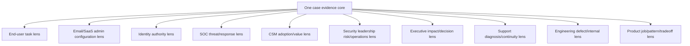
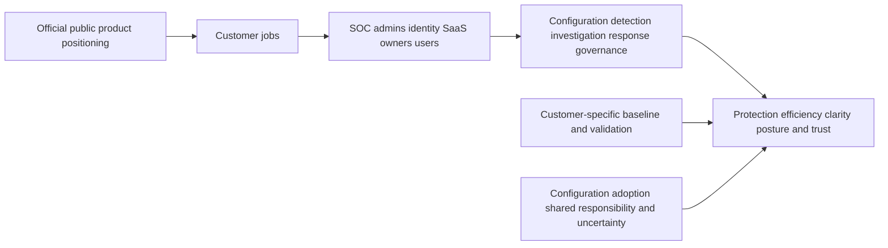
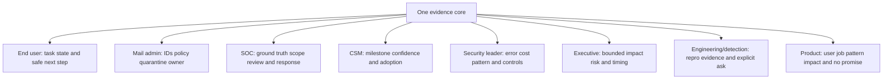
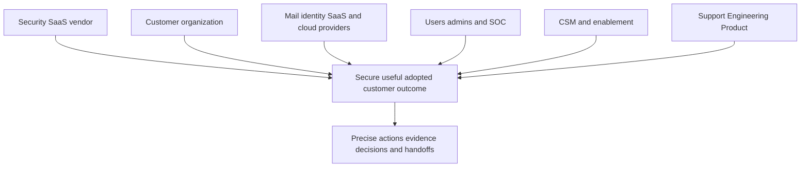
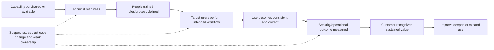
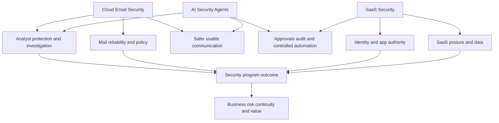
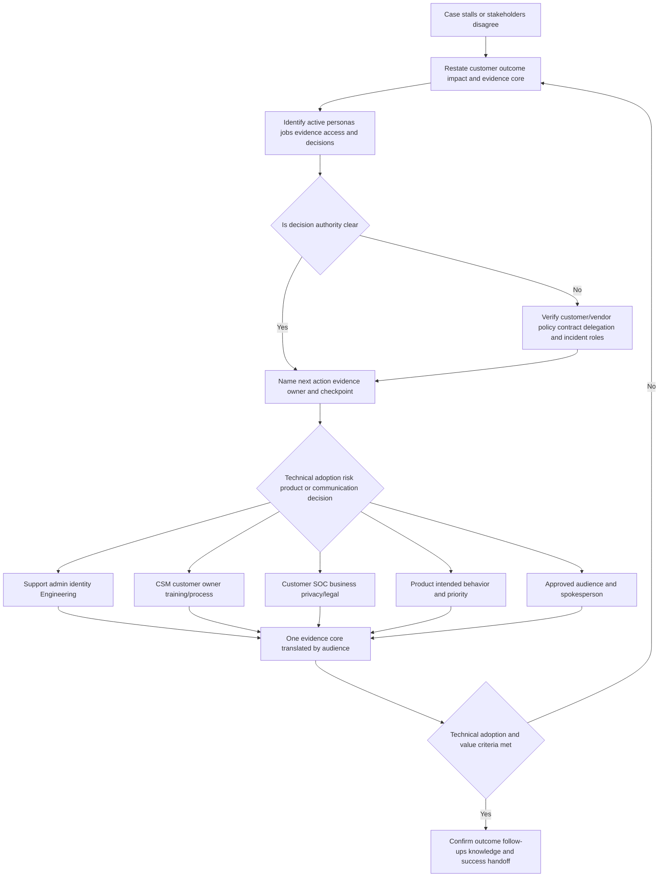
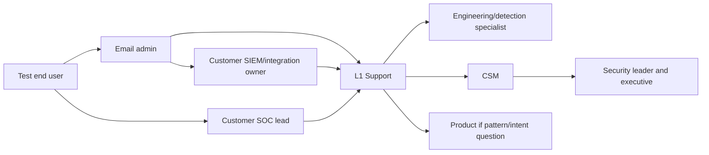

# Part 017 - Customer Personas Use Cases and Shared Responsibility

> **Purpose:** Translate Cloud Email Security, AI Security Agents, and SaaS Security value, evidence, decisions, adoption, and responsibilities for the people who use, operate, govern, support, build, and depend on the platform.
>
> **Evidence rule:** Personas and responsibility matrices are vendor-neutral teaching models. The supplied JD names collaboration with customers, Customer Success Managers (CSMs), Engineering, and Product. Official public Abnormal pages provide current high-level mission, customer, platform, trust, and culture context. They do not reveal the exact customer organization, internal teams, handoffs, success measures, contracts, or support processes.
>
> **Currency and official-source access date:** August 24, 2026.

## Section Goal

By the end of this Part, Arti should be able to explain the same security case accurately to a SOC analyst, email administrator, identity team, SaaS owner, CSM, security leader, executive/business owner, end user, Support engineer, Engineering, and Product. The facts and confidence must remain constant; vocabulary, detail, evidence, decision framing, and requested action should change by audience.

Arti should understand **jobs to be done**: the progress each persona is responsible for, not just a job title. She should distinguish technical ownership, customer-environment authority, incident command, risk acceptance, business prioritization, adoption/value ownership, product behavior, code/service correction, and communication. She should use shared responsibility to assign precise actions rather than blame or say “everyone owns it.”

She should also distinguish deployment from adoption, activity from use, use from value, technical resolution from customer success, and customer silence from validation. The practical outcome is the **Concord Bridge Persona, Use-Case, and Responsibility Matrix Lab**, using one harmless synthetic case with distinct technical, adoption, trust, and product-learning outcomes.

## JD Mapping

| Supplied JD signal | Capability developed here | Practical proof |
|---|---|---|
| Enterprise L1 Technical Support Engineer | Maintains one case narrative across many stakeholders | Case ownership and persona matrix |
| Customer trust/timely updates | Adapts evidence without changing facts or hiding uncertainty | Multi-audience updates |
| Cloud Email Security | Maps SOC, mail admin, end-user, and leadership jobs | Email use-case map |
| AI Security Agents | Maps operator, approver, user, governance, Engineering, and Product jobs | Agent responsibility map |
| SaaS Security | Maps identity, SaaS owner, SOC, privacy, and admin decisions | SaaS responsibility matrix |
| Threat investigations | Keeps customer SOC incident authority distinct from Support evidence | Investigation RACI |
| Behavioral false positives | Captures end-user/business impact, admin state, analyst ground truth, and product review | False-positive persona path |
| Onboarding with CSMs | Separates technical readiness from adoption, value, and stakeholder alignment | Success-handoff plan |
| Engineering/Product collaboration | Routes defects and recurring needs with actionable evidence | Escalation/Product brief |
| KB/training/case deflection | Converts repeated persona confusion into audience-specific guidance | Knowledge opportunity map |
| Customer obsession/intellectual honesty | Starts from customer value and preserves evidence boundaries | Outcome scorecard |

## Candidate Honesty Note

Arti's five years of customer-facing Microsoft enterprise support, CRITSIT communication, customer/partner interaction, Engineering/Product escalation, fix validation, KB/training, mentoring, and support analytics are direct transferable strengths for persona-aware support. Her Microsoft 365 workloads and Copilot experience help with cloud and AI conversations. She must not claim she has served as an Abnormal CSM, customer SOC analyst, email administrator, identity architect, SaaS owner, Product Manager, or Engineering owner.

| Evidence label | Honest use | Boundary |
|---|---|---|
| **Production-transfer example** | Real enterprise customer communication, escalation, validation, knowledge, mentoring, analytics | Do not invent Abnormal/email/security scenario details |
| **Working knowledge/upskilling** | M365, identity, networking, APIs, data, AI concepts | Do not turn conceptual skill into named role authority |
| **Local/public lab** | Synthetic persona matrix, RACI, adoption/outcome scorecard | No customer research, product use, or real stakeholder outcome |
| **Learned architecture** | Public Abnormal mission/product/customer/culture context and neutral responsibility model | No internal organization/contract claim |
| **No direct experience** | Abnormal product, direct email security, SOC, named adjacent platforms | State directly |
| **Template only** | Updates, handoffs, success criteria, Product briefs | Template is not a real customer plan |

## Fact Labels and Responsibility Ceiling

| Label | Use | Example |
|---|---|---|
| **Verified public fact** | Current official Abnormal public wording | Careers page publicly emphasizes customer obsession, ownership, and intellectual honesty |
| **Supplied JD fact** | Role/master wording | L1 collaborates with CSMs, Engineering, and Product and supports customers |
| **Vendor-neutral teaching model** | Personas, RACI, adoption ladder, success scorecard | Support owns product-case continuity while customer owners control their environment |
| **Inference/question to validate** | Likely operational responsibility | Exact L1/CSM handoff, customer personas, escalation path, success measures |
| **Unknown/private** | Contract/internal detail | Entitlements, SLAs, account roles, case tools, authority, customer-specific responsibilities |

## Beginner Term Primer

| Term | Plain meaning | Why it matters | Memory hook |
|---|---|---|---|
| **Persona** | Working model of a participant's goals, tasks, evidence, constraints, language, and authority | Helps Support ask useful questions without stereotyping | A lens, not a person |
| **Stakeholder** | Person/group affected by or able to influence an outcome | Not every stakeholder can decide | Interested, impacted, or influential |
| **Job to be done (JTBD)** | Progress a person is trying to make in a situation | Keeps product value tied to real work | What progress are they hiring this for? |
| **Use case** | Specific interaction that achieves a job/outcome | Makes a broad product area concrete | Actor, action, object, result |
| **Decision right** | Authority to make a particular decision | Technical expertise does not automatically confer authority | Who may decide this? |
| **Responsibility** | Duty to perform or ensure an action/outcome | Shared outcome still needs precise owners | Name the duty |
| **Accountability** | Being answerable for the result/decision | Usually one clear owner per task helps | Who owns the result? |
| **RACI** | Responsible, Accountable, Consulted, Informed task matrix | Coordinates work after authority is known | R does, A owns, C advises, I knows |
| **Shared responsibility** | Different parties own different controls/actions in one service outcome | Prevents vendor/customer blame and gaps | Shared outcome, precise duties |
| **Adoption** | People and teams consistently use a capability in the intended workflow | Deployment without use creates little value | Capability becomes routine work |
| **Enablement** | Training, guidance, access, and support helping people use a capability | Reduces friction and misuse | Make correct use possible |
| **Technical readiness** | Prerequisites, integrations, roles, configuration, data, and validation are ready | A prerequisite for adoption, not adoption itself | System can be used safely |
| **Operational readiness** | People, process, ownership, playbooks, evidence, and escalation are ready | Prevents tools from becoming shelfware | Team can operate it |
| **Success criterion** | Specific observable condition showing intended progress | Avoids “looks good” closure | Evidence that the outcome happened |
| **Leading indicator** | Earlier signal suggesting future outcome | Useful for adoption but not final value | Early directional evidence |
| **Lagging indicator** | Outcome visible after time, such as reduced handling effort | Better impact evidence but slower | Result after operation |
| **Customer health** | Combined view of adoption, value, risk, relationship, and support | Must not be reduced to one score | Is the customer journey on track? |
| **Time to value** | Time from commitment/enablement to useful validated outcome | Setup speed alone is insufficient | Useful outcome clock |
| **Customer Success Manager (CSM)** | Partner focused on goals, adoption, value, stakeholders, and relationship health | Collaborates with Support but does not replace diagnosis | Protect the customer journey |
| **Security Operations Center (SOC)** | People/process monitoring, investigating, and responding to security activity | Often consumes product evidence and owns customer response | Customer security decision center |
| **Email administrator** | Person/team operating mail configuration, routing, policy, and mailbox functions | Controls customer-side mail state and evidence | Own mail operation |
| **Identity team** | Person/team governing accounts, authentication, roles, sessions, and lifecycle | Owns customer identity actions and evidence | Who gets authority and when? |
| **SaaS owner** | Person/team accountable for a cloud application's operation, configuration, data, and business use | Connects technical and business decisions | Own one service's safe use |
| **Security leader** | Leader accountable for security program outcomes and priorities | Needs risk and operating evidence | Program outcome and tradeoff |
| **Executive/business owner** | Leader accountable for business objectives, resources, continuity, and delegated risk decisions | Needs concise impact and decisions | Business consequence and choice |
| **Engineering** | Team responsible for code/service/internal technical behavior | Needs reproducible evidence and explicit questions | Why did the system behave this way? |
| **Product** | Team responsible for intended product behavior, experience, tradeoffs, and prioritization | Needs user job, pattern, impact, and alternatives | What should the product do? |
| **Voice of Customer (VoC)** | Structured customer evidence used to improve product/service | Anecdotes need scope and pattern | Customer signal made actionable |

## Persona Is a Lens, Not a Stereotype

One person may hold several personas. In a small organization, the email admin may also be the SOC lead and SaaS owner. That does not automatically grant legal, privacy, executive-risk, or vendor Product authority. Ask which role the person is exercising for the current decision.

### Persona verification questions

| Question | Why ask it |
|---|---|
| What outcome are you accountable for in this case? | Reveals the active job/persona |
| Which actions can you perform or authorize? | Establishes decision rights |
| Which systems/evidence can you access? | Makes evidence requests realistic |
| Who owns incident, risk, privacy, business, and product decisions? | Prevents authority blur |
| Who must receive updates and at what depth? | Designs communication |
| Which deadline or workflow creates impact? | Connects urgency to customer context |
| What proves success for you? | Defines validation rather than activity |

## 🔍 Plain-English deep-dive: A Job Title Does Not Carry Every Decision Right

An “administrator” can configure a service but may not be authorized to accept business risk. A “security analyst” may recommend containment while an incident commander authorizes it. An executive can prioritize business continuity but may rely on a privacy officer for notification obligations. A Support engineer can know the product deeply without authority to alter a customer tenant.

**Analogy:** A hospital surgeon, nurse, administrator, patient, and insurer all influence care, but their decisions differ. Expertise in one area does not automatically grant every permission. The analogy stops because software/customer relationships and legal duties differ from healthcare.

Use verbs instead of titles: who can inspect, configure, approve, execute, communicate, accept, validate, and escalate? Record the source of authority. This lets one person wear several hats without silently combining them.

## Persona and Job-to-Be-Done Map

| Persona | Primary job to be done | Evidence needed | Decisions/actions | Value language | Boundary |
|---|---|---|---|---|---|
| SOC analyst | Turn signals into justified security decisions | Message/finding IDs, timeline, identity, context, action state | Triage, disposition, recommend response | Signal quality, scope, confidence, time returned | Product evidence is not full incident truth |
| Email administrator | Keep mail secure, deliverable, and manageable | Trace, routing, policy, quarantine, message state, changes | Configure, release/route under policy, validate mail | Reliable mail and manageable security controls | May not own incident/risk decision |
| Identity team | Ensure correct people/apps have correct authority | Sign-in, session, role, group, grant, lifecycle, action | Revoke, reset, assign, deprovision under policy | Reduced unauthorized access and clear accountability | Support does not command identity action |
| SaaS owner | Operate app safely for business purpose | Tenant, app, config, data, audit, integration, dependencies | Approve config/app changes and continuity | Safe useful service and governed integrations | Security/business authority may be shared |
| CSM | Align product use with customer goals and adoption | Goals, stakeholders, milestones, blockers, support health, outcomes | Coordinate success plan, training, stakeholder alignment | Realized value and confidence | Does not diagnose product root cause |
| Security leader | Prioritize security program risk and operations | Trends, coverage, errors, response, controls, customer context | Set program priorities and resource/risk decisions | Reduced material risk and operational efficiency | Needs evidence, not feature count |
| Executive/business owner | Protect business outcomes and allocate resources | Impact, scope, risk, options, confidence, timing | Continuity, funding, delegated risk decisions | Protected people/data/funds/reputation | Does not need unrestricted raw evidence |
| End user | Complete work safely and receive understandable help | Task, observed result, safe instruction, outcome | Report, follow approved steps, validate task | Low friction, trust, timely feedback | Not responsible for product diagnosis |
| L1 Support | Restore/clarify product outcome and preserve continuity | Expected/actual, impact, environment, IDs, changes, evidence | Diagnose supported paths, update, escalate, validate | Customer effort reduced and outcome restored | No private inference/customer risk acceptance |
| Engineering | Determine code/service/internal cause and correction | Minimal repro, versions, IDs, logs, expected/actual, impact | Technical finding/fix/validation criteria | Reproducible, actionable issue | Does not own customer relationship by default |
| Product | Decide intended behavior and product priorities | User job, pattern, impact, evidence, workaround, tradeoffs | Clarify design, prioritize, accept feedback | Better customer/product fit | Support cannot promise roadmap |

## Persona-Specific Use Cases

### SOC analyst

| Use case | Questions | Success criterion |
|---|---|---|
| Investigate disputed email | What evidence supports verdict, what is scope, what alternatives remain? | Justified disposition and owned next action |
| Validate remediation | Which targets/actions are complete or partial? | Defined harmful exposure reduced and exceptions known |
| Correlate identity/SaaS | Which stable IDs and times connect message, session, app, and action? | Timeline supports or rejects hypotheses |
| Tune/feedback | Which confirmed false decisions repeat under what conditions? | Quality improves without unsafe blind spots |

### Email administrator

| Use case | Questions | Success criterion |
|---|---|---|
| Message missing/held | Which system/policy/state owns it? | Correct state restored or explained safely |
| Routing/coverage | Did intended messages traverse supported path? | Expected population observable with no loop/gap |
| Quarantine/release | Who may release and what risk/process applies? | Authorized action and final mailbox state validated |
| Change management | Which connector/policy/version changed? | Effective state and business mail flow validated |

### Identity team

| Use case | Questions | Success criterion |
|---|---|---|
| Account takeover concern | Which account/session/grant/action is evidenced? | Unauthorized authority contained and trusted access restored |
| Integration permission | Which app purpose and least scope? | Required calls work; excess calls fail |
| Lifecycle/offboarding | Which accounts/sessions/apps remain? | Effective access removed and denial verified |
| Role dispute | Which direct/group/delegated/session path applies? | Intended effective privilege established |

### SaaS owner

| Use case | Questions | Success criterion |
|---|---|---|
| Posture finding | Which effective setting, benchmark, risk, dependency, exception? | Authorized state corrected or governed exception recorded |
| App integration | Which data/action/owner/contract? | Observable least-privilege flow and recovery path |
| Service health | Which function/dependency/population is degraded? | Business/security workflow restored and reconciled |
| Adoption | Are admins/analysts using intended workflow? | Repeatable use with clear ownership and evidence |

## Public Product Value and Persona Fit

Official Abnormal pages publicly describe email security, identity security, AI security, insider threat, AI Security Mailbox, Security Posture Management, integrations, and customer stories. Those pages often emphasize stopping advanced attacks, reducing manual analyst work, user feedback, visibility/control, configuration hardening, and trust. These are public value claims, not guaranteed outcomes or exact persona contracts.

| Public area/context | Likely persona value question | What remains unknown/private |
|---|---|---|
| Email Security | Does it improve harmful/legitimate message outcomes and investigation? | Exact customer workflow, permissions, error rates, entitlements |
| AI Security Mailbox | Does it reduce report triage and improve user feedback safely? | Confidence gates, response policy, action semantics, customer fit |
| Identity Security | Does it improve identity context and threat handling? | Exact signals/actions/integration and responsibility |
| Security Posture Management | Does it prioritize meaningful Microsoft 365 configuration risk and sustain corrections? | Checks, scoring, cadence, remediation execution |
| AI Governance | Does it help discover/govern AI tools, agents, chats, permissions, and data use? | Collection, scoring, enforcement, roadmap availability |
| Integrations | Does it fit existing SIEM/SOAR/IAM/ITSM/XDR workflows? | Direction, schema, scopes, setup, entitlement, support boundary |

## Evidence, Language, and Decisions by Audience

One evidence core:

> At 10:02 UTC, synthetic message `MSG-017-A` was classified harmful and held. Customer mail policy `POL-017-A` was effective. At 10:10, the customer SOC determined the message was an approved training simulation and requested review. The message remains held; no user impact beyond one delayed training message is observed. Support has opened verdict-review record `REV-017-A`. Next checkpoint is 12:00 UTC. No product defect or detection change is confirmed.

| Audience | Message emphasis | Avoid |
|---|---|---|
| End user | Training message delayed; no action required; owner/checkpoint | Detection internals or blame |
| Email admin | Message/verdict/policy/quarantine IDs, current state, release authority | Asking for broad policy change |
| SOC | Approved-simulation ground truth, scope, review record, no other threat evidence | Calling review a guaranteed model update |
| CSM | Training milestone impact, customer confidence, technical owner, next time | Taking technical ownership |
| Security leader | One bounded false-positive candidate, error cost, review and trend question | Extrapolating rate from one case |
| Executive | One message, no operational/security loss, review underway, noon checkpoint | Raw headers/model jargon |
| Engineering/detection | Expected/actual, IDs/times/config/ground truth, explicit verdict-review question | “AI is broken” |
| Product | If recurring, job/pattern/impact/workaround and clarity need | Roadmap promise |

## 🔍 Plain-English deep-dive: Audience Adaptation Changes Resolution, Not Truth

Good translation is like changing map scale. A street map and a national map show different detail while preserving the same geography. The analogy stops because security communication also filters sensitive data and states uncertainty.

An executive does not need a raw message trace; Engineering does. The end user needs a safe action; the SOC needs evidence and scope. However, the verdict, ground truth, impact, and confidence cannot change by audience. Saying “confirmed product defect” to an executive while telling Engineering “possible mismatch” destroys trust.

Create an evidence core before drafting any update: impact, confirmed facts, unknowns, decisions/actions, owners, and next checkpoint. Every audience message must be derivable from it. If new evidence changes the core, correct all affected audiences deliberately.

## Shared Responsibility

| Responsibility area | Customer typically owns | Vendor typically owns | L1 contribution | Verify in real work |
|---|---|---|---|---|
| Goals/use cases | Business/security objectives and priorities | Product capability/limitations | Clarify requested outcome | Contract/success plan |
| Identity/access | Customer identities, groups, admin roles, approvals | Product authorization controls and service identities | Diagnose supported evidence | Exact service/customer boundary |
| Configuration | Customer-controlled settings/policy | Documented options/enforcement/provider defaults | Compare expected/effective | Current product docs |
| Data/privacy | Classification, lawful use, authorized users/sharing | Protection/processing commitments | Minimize case evidence | DPA/contract/policy |
| Integrations | Customer consent, receiver, customer-side config | Product-side integration behavior | Trace IDs/contracts | Integration documentation |
| Detection/finding | Customer ground truth/context and response | Product detection/finding capability | Review visible evidence/escalate | Proprietary process |
| Response | Customer incident/risk/business decision and customer actions | Supported product actions/provider incidents | Explain mechanics/validate | Authority and entitlement |
| Adoption | Staff/process/training and use | Usable product/documentation | Resolve friction and create knowledge | CSM/customer plan |
| Product quality | Supply reproducible customer evidence | Intended behavior, code/service correction | Escalate/validate/communicate | Internal workflow |

Shared responsibility is not “customer problem” or “vendor problem.” A customer-owned misconfiguration still needs clear vendor guidance and useful evidence. A vendor defect still requires customer continuity and validation. Name the action owner and the other party's continuing duty.

## 🔍 Plain-English deep-dive: Shared Responsibility Is a Chain of Precise Duties

Think of a package traveling through a sender, carrier, building reception, and final recipient. Each party controls a different handoff, but all contribute to delivery. Saying “the carrier owns it” is too broad if reception accepted the package and misplaced it; saying “the customer owns it” is too broad if the carrier never arrived. The analogy stops because cloud data can be copied, security decisions can be asynchronous, and contracts define responsibilities.

For every shared outcome, write an action sentence: “The customer identity owner approves the least-privilege grant; the SaaS provider validates and enforces it; the integration owner uses it according to contract; Support correlates the failed request; the customer SOC decides containment.” Each verb has an owner and evidence.

Responsibility also continues after a boundary. If customer configuration caused a failure, the vendor still owes accurate documentation and actionable errors. If a vendor defect caused the failure, the customer still owns continuity decisions and validates its workflow. L1 keeps these duties in one case narrative so shared responsibility improves coordination rather than distributing blame.

## RACI and Handoffs

RACI coordinates a task after technical, contractual, legal, and risk authority is understood.

| Task | End user | Email/SaaS admin | Identity team | SOC lead | CSM | Support | Engineering | Product | Executive |
|---|---|---|---|---|---|---|---|---|---|
| Report symptom/impact | R | C | C | C | I | A/R | I | I | I |
| Preserve product IDs | C | C | C | C | I | A/R | I | I | I |
| Validate customer configuration | I | A/R | R where identity | C | I | C | I | I | I |
| Determine security disposition | I | C | C | A/R | I | C | I | I | I |
| Perform customer containment | I | R by system | R by identity | A | I | C | I | I | I |
| Diagnose provider internals | I | I | I | C | I | R | A/R | C | I |
| Maintain support cadence | I | C | C | C | C | A/R | I | I | I |
| Align adoption/training | C | C | C | C | A/R | R | I | C | I |
| Clarify intended behavior | I | C | C | C | C | R | C | A/R | I |
| Decide business continuity | I | C | C | C | C | I | I | I | A/R |
| Validate technical resolution | C | R | R | C | I | A/R | R | I | I |
| Validate realized value | C | C | C | C | A/R | C | I | I | C |

This table is a **synthetic teaching model**. Actual RACI depends on customer organization, product, incident process, contract, and delegation.

### Handoff quality

| Handoff | Sender owes | Receiver owes | Continuity owner |
|---|---|---|---|
| User -> Support/admin | Task, observation, time, safe evidence | Acknowledge impact, avoid repeated asks, give next step | Support or customer service owner |
| Support -> CSM | Technical status, impact, milestones, risks, owner/time | Customer goals/stakeholders/adoption context | Support for technical case; CSM for success plan |
| Support -> Engineering | Repro, IDs, versions, tests, impact, explicit ask, privacy | Acceptance, requested evidence, finding/limits, validation criteria | Support keeps customer cadence |
| Support -> Product | User job, recurring pattern, impact, workaround, evidence | Intended behavior/product decision or feedback status | Support avoids roadmap promise |
| Support -> customer SOC | Product evidence, scope, limits, supported options | Security disposition, containment decisions, relevant outcome | Customer incident owner; Support product workstream |

## Adoption and Success

### Success layers

| Layer | Success criterion example | Evidence | Failure signal |
|---|---|---|---|
| Technical readiness | Intended tenant/integration/data/roles/policy validated | Configuration and control tests | Missing coverage or excessive permission |
| Operational readiness | Owners, playbooks, evidence, escalation, training ready | RACI, runbook, exercise | Alerts have no owner or unsafe actions |
| Initial use | Target persona completes intended workflow | Case/action records | Product bypassed or parallel manual path |
| Consistent adoption | Use repeats correctly across defined population | Usage quality, exceptions, user feedback | One champion only or workarounds dominate |
| Operational outcome | Handling effort/time or process reliability improves | Baseline and measured comparison | Activity grows without customer benefit |
| Security outcome | Exposure/error/response condition improves | Ground truth, incidents, control evidence | Alert count used as outcome |
| Business value | People/data/funds/continuity/trust protected | Customer-defined measure and assumptions | Vendor ROI copied without customer baseline |
| Sustained health | Changes, training, ownership, support, and metrics remain healthy | Review cadence and trend | Drift, stale roles, unresolved cases |

## 🔍 Plain-English deep-dive: Deployment Is Not Adoption, and Adoption Is Not Value

Installing a gym in an office does not make employees healthier. People need access, training, routines, confidence, and outcomes measured over time. The analogy stops because security controls may deliver protection automatically even before visible user interaction, and their value includes avoided events.

A connected tenant may be technically ready but operationally unused. Analysts may ignore findings because ownership is unclear. Users may stop reporting messages because they receive no feedback. Administrators may preserve a broad legacy process because change risk feels high. Support cases reveal these adoption blockers.

Measure each step separately. Technical readiness asks whether the capability works safely. Adoption asks whether the intended people/process use it consistently. Outcome asks what changed. Value asks whether that change matters enough to the customer's objectives. A CSM coordinates this journey; Support resolves technical friction and supplies accurate evidence. Neither should claim value from login counts alone.

## Success Criteria by Persona

| Persona | Leading indicators | Lagging outcomes | Guardrail |
|---|---|---|---|
| SOC analyst | Training complete, cases routed, evidence accessible | Less repetitive handling, faster justified decisions | False negatives/unsafe automation do not rise |
| Email admin | Coverage/roles/policies validated | Reliable message states and fewer recurring config cases | Legitimate mail/business continuity protected |
| Identity team | App/role inventory and revoke tests | Reduced stale/excess authority, faster containment | Required workflows still function |
| SaaS owner | Findings owned, dependencies mapped | Sustained effective posture and integration reliability | Exceptions/governance remain visible |
| CSM | Stakeholders/goals/milestones agreed | Customer recognizes intended value and confidence | Technical debt/risk not hidden by relationship score |
| Security leader | Governance/metrics/owners defined | Material risk and operational burden improve | Metrics not gamed; uncertainty visible |
| Executive | Decision cadence and continuity options ready | Protected business outcomes and justified investment | No unsupported avoided-loss promise |
| End user | Knows reporting/safe workflow; timely feedback | Safe productive behavior and trust | Friction/privacy burden acceptable |
| Support | High-quality intake/escalation/validation | Reduced customer effort/reopen/repeat issue | Speed does not sacrifice quality/safety |
| Engineering/Product | Actionable defect/pattern evidence | Corrected behavior and better product fit | One anecdote not universalized |

## Customer Value Across Three Product Areas

| Product area | Persona job | Potential outcome | Required validation |
|---|---|---|---|
| Cloud Email Security | SOC triages meaningful messages | Reduced exposure/manual work | Ground truth, action state, error costs |
| Cloud Email Security | Admin maintains secure mail | Reliable delivery/quarantine/coverage | Provider trace, policy, user outcome |
| AI Security Agents | SOC delegates bounded repetitive work | Faster handling with human focus | Correctness, approvals, action/audit, exception rate |
| AI Security Agents | End user receives guidance | Timely, accurate, policy-aligned feedback | Message/source accuracy, privacy, user understanding |
| SaaS Security | Identity team governs apps/roles | Less excess/stale authority | Grant/effective access/revoke tests |
| SaaS Security | SaaS owner improves posture | Risky settings corrected and sustained | Effective state, exception, business function, drift |

## Worked Examples

### Worked example 1: False positive during training campaign

**Case:** One approved training message is held. SOC confirms simulation; email admin identifies policy/quarantine state; Support opens verdict review; CSM notes campaign milestone; Engineering receives evidence only if supported review requires; Product receives a pattern only if recurrence exists.

**Success:** Message state and training workflow are resolved; customer understands immediate path; no broad allow is added; review outcome is communicated; repeated pattern is measured separately.

### Worked example 2: Over-permissioned app

**Personas:** Identity team owns grant; SaaS owner confirms business purpose; SOC assesses misuse; Support explains finding/integration; CSM tracks adoption blocker; executive only needs material impact if significant.

**Outcome:** Least-scope replacement works and excess access fails. No breach is claimed without use evidence.

### Worked example 3: Agent drafts wrong user response

**Personas:** SOC supplies verdict/ground truth; Support traces run/output/policy; authorized reviewer stops response; Engineering examines reproducible mapping; Product evaluates experience/policy; CSM handles confidence/training implications.

**Boundary:** End user receives corrected factual communication, not internal speculation. Hidden model reasoning is not requested.

### Worked example 4: CSM asks Support to join onboarding

**CSM job:** Align goals, stakeholders, milestone, adoption, and risk. **Support job:** Validate technical prerequisites, roles, integration, expected evidence, known limitations, and support path. **Customer admins/SOC:** Authorize configuration and define response process.

**Success:** A technical validation checklist and success handoff exist. Support does not own renewal or adoption score; CSM does not own root cause.

### Worked example 5: Engineering fixes issue but customer does not adopt

**Input:** Integration defect is corrected, but analysts continue manual process.

**Technical success:** Original test passes. **Adoption gap:** workflow/training/role remains unclear. Support validates fix and provides accurate guidance; CSM/customer leaders address workflow adoption; Product may review usability friction.

### Worked example 6: Executive wants a guarantee

**Question:** “Will this prevent all payment fraud?”

**Response:** Explain defense-in-depth, current evidence, product role, customer verification/identity/process responsibilities, and measured outcomes. Do not promise zero risk. Offer customer-specific success criteria and decision cadence.

## Persona and Responsibility Troubleshooting Decision Tree

### Symptom-to-persona-to-action matrix

| Symptom | Likely ownership ambiguity | Discriminating question | Observation | Next action |
|---|---|---|---|---|
| “Nobody owns alert” | SOC process vs product routing | Who is accountable for triage and which queue/evidence? | No customer owner | CSM/customer security leader establishes operations; Support validates product route |
| Admin asks Support to change policy | Customer authority vs vendor guidance | Who is authorized and what risk/change process? | Admin can execute but needs approval | Supply evidence/guidance; owner approves/changes |
| CSM asks for root cause | Technical vs success ownership | Which customer milestone/decision needs which finding? | Root cause pending; workaround known | Support gives factual status; CSM manages expectations |
| Engineering fix marked done | Activity vs customer outcome | Was original workflow repeated across affected scope? | One internal test only | Customer validation before closure |
| Product request called defect | Intended behavior unclear | Does current documented behavior match implementation? | Works as designed but job unmet | Product evidence brief, no defect claim |
| Executive requests raw logs | Audience/privacy mismatch | Which decision needs which minimum facts? | Impact/options sufficient | Provide decision brief; restrict raw evidence |
| User stops reporting | Adoption/trust issue | Are feedback, effort, and expected action clear? | No closure messages | Improve authorized feedback workflow |
| One person has many roles | Authority assumed from title | Which hat and delegated decision applies? | Admin lacks risk acceptance | Involve authorized risk/business owner |

## Common Failure Modes and Safe Corrections

| Failure mode | Why it fails | Safe correction | Escalation trigger |
|---|---|---|---|
| Persona becomes stereotype | Skills/authority vary | Ask goal, evidence, decision, preference | Consequential decision |
| Title equals authority | Policy/delegation may differ | Verify exact decision right | Containment/risk/legal action |
| Everyone owns shared responsibility | No action owner exists | Name task owner, accountable role, evidence, checkpoint | Ownership dispute |
| “Customer issue” blame | Vendor still owes guidance/observability | State failed boundary and both duties | Cross-provider stall |
| CSM becomes technical owner | Adoption and diagnosis blur | CSM success; Support technical case | Milestone/relationship risk |
| Support becomes SOC/IC | Exceeds product authority | Own product workstream and evidence | Active incident/customer request |
| Engineering owns customer updates | Customer continuity lost | Support tracks and translates | Dependency delay |
| Product feedback becomes promise | Roadmap trust damaged | Record need/decision without date | Executive/customer asks commitment |
| One message copied to all | Some lack decision or receive excess data | One core, audience-specific view | Sensitive/external communication |
| Adaptation changes facts | Contradictions reduce trust | Correct the evidence core first | Material discrepancy |
| Deployment equals adoption | Capability may be unused | Measure operational workflow and users | Shelfware/manual bypass |
| Usage equals value | Activity may not improve outcome | Baseline, outcome, guardrail | ROI/security claim |
| Ticket closed equals success | Customer workflow/adoption may remain broken | Validate technical and success criteria | Reopen/CSM risk |
| Silence equals validation | Customer may be busy/disengaged | Explicit reasonable confirmation and administrative-closure language | High-impact unresolved state |
| Customer story number generalized | Selected context differs | Attribute and use customer baseline | Commercial/ROI decision |
| Raw evidence sent to executive/CSM | Privacy/noise increases | Minimum decision facts | Restricted data requested |
| Arti claims persona role | Transfer becomes false experience | State Microsoft support evidence and role gap | Interview follow-up |

## Concord Bridge Persona, Use-Case, and Responsibility Matrix Lab

### Lab purpose

Build a complete stakeholder, responsibility, adoption, and success package around a harmless synthetic cross-product case. “Concord” means agreement on facts and roles; “Bridge” means handoffs that preserve one customer outcome.

### Honest artifact label

> **LOCAL/SYNTHETIC PERSONA LAB - Customer-outcome, communication, and responsibility practice only. No Abnormal product, customer research, email-security/SOC operation, CSM role, Engineering/Product ownership, tenant, or production outcome is represented.**

### Prerequisites

1. Parts 001-016 and this Part.
2. Private Markdown/spreadsheet workspace and Mermaid preview/paper.
3. Only supplied fictional roles, IDs, facts, and outcomes.
4. No customer interview, product account, mailbox, tenant, API, CRM, ticketing system, or network activity.
5. Two to three hours and a thirty-minute stakeholder role-play.

### Authorized scope and privacy

| Authorized | Prohibited |
|---|---|
| Synthetic personas, messages, RACI, success measures | Real customer/employee stories, identities, metrics, contracts |
| Paper communication and handoffs | Contacting people, sending email, accessing systems |
| Public-source company/product context | Private workflows, entitlements, SLAs, account health |
| Candidate transfer statements | Claiming CSM/SOC/Product/Engineering/Abnormal operation |

### Synthetic case: Concord Bridge Labs

Customer `Concord Bridge Labs` uses fictional `Concord-Mail`, `Concord-ID`, `Concord-Secure`, and `Concord-Cases`. An approved training message `MSG-017-A` is classified harmful and held. SOC confirms training ground truth. At the same time, an event export `EVT-017-A` receives `202` but the customer parser rejects schema v3. These are distinct workstreams.

The training campaign is scheduled for 15:00 UTC. One message/one test user is affected. No real threat, data loss, financial impact, broad outage, or product defect is established. Support opens review `REV-017-A`; customer integration owner handles parser compatibility; CSM tracks campaign milestone; Product receives evidence only if a recurring experience pattern emerges.

### Case stakeholder map

### Step 1: Build eleven persona cards

Include end user, email admin, identity team, SaaS/integration owner, SOC analyst, SOC/incident lead, CSM, security leader, executive/business owner, Support, Engineering, and Product (twelve is acceptable). Each card: job, goals, fears, evidence, vocabulary, decisions, authority source, constraints, update preference, success.

### Step 2: Build persona-to-use-case matrix

For each persona create at least three use cases across message review, event integration, adoption/training, response, configuration, product feedback, and business decision. State actor, action, object, expected result, evidence, owner, and limitation.

### Step 3: Create the evidence core

Record exact facts, impact, unknowns, decisions/actions, owners, and checkpoints for both workstreams. Include object IDs and UTC. Do not merge parser rejection with message verdict cause.

### Step 4: Write ten audience messages

End user, email admin, identity team, SaaS/integration owner, SOC analyst, CSM, security leader, executive, Engineering, and Product. All messages derive from one core. Product message must state that recurrence is not yet established.

### Step 5: Build shared-responsibility matrix

Cover goals, identities, configuration, data/privacy, integration, verdict/finding, incident response, adoption/training, product quality, communication, and validation. Name customer/vendor/provider duties and evidence. “Shared” alone fails.

### Step 6: Create RACI

Tasks: ground-truth confirmation, quarantine/release decision, verdict review, parser correction, source contract confirmation, customer cadence, campaign milestone, executive communication, technical validation, adoption validation, KB candidate, Product pattern review. Add authority caveat.

### Step 7: Build adoption ladder

For the training/reporting workflow, define technical readiness, operational readiness, initial use, consistent adoption, operational outcome, security outcome, business value, and sustained health. Add leading/lagging metrics and guardrails.

### Step 8: Define success criteria

At least two criteria per persona. Separate technical case success, campaign/adoption success, trust/communication success, and product-learning success. Customer silence cannot be a pass condition.

### Step 9: Write handoffs

Create Support->Engineering, Support->CSM, Support->customer integration owner, Support->SOC, and Support->Product handoffs. Every handoff includes accepted action, evidence, boundary, next checkpoint, and retained continuity.

### Step 10: Run four role conflicts

1. CSM asks Support to promise resolution before campaign.
2. Admin asks Support to release message.
3. Executive asks Engineering directly for raw logs and guarantee.
4. Product asks whether one case proves a feature need.

Write safe resolution, authority, customer language, and escalation.

### Step 11: Create candidate transfer map

Map Arti's Microsoft enterprise support, CRITSIT, communication, Engineering/Product escalation, fix validation, KB/training, mentoring, CSAT/backlog/case-quality, M365, networking, API/data, and AI facts to persona skills. Add a boundary for every row.

### Step 12: Validate and clean

1. Confirm no real customer, employer story detail, metric, or system appears.
2. Search for product-internal role/entitlement/SLA claims.
3. Verify facts/confidence are identical across all messages.
4. Delete scratch outputs, record score/reviewer/corrections/retention/source date.
5. Keep privately as a synthetic communication portfolio.

### Required artifacts

| Artifact | Required content | Honest label |
|---|---|---|
| Persona cards | Eleven or more goals/evidence/authority/success records | Template plus local lab |
| Use-case matrix | Three or more per persona | Local/synthetic lab |
| Evidence core | Two distinct workstreams and UTC/IDs | Local/synthetic lab |
| Audience messages | Ten consistent translations | Template only |
| Shared-responsibility matrix | Eleven areas and precise duties | Vendor-neutral template |
| RACI | Twelve tasks plus authority caveat | Local/synthetic lab |
| Adoption ladder | Eight stages, indicators, guardrails | Template plus local lab |
| Success scorecard | Persona and technical/adoption/trust/value criteria | Local/synthetic lab |
| Handoffs/conflicts | Five handoffs and four conflicts | Template only |
| Candidate/validation record | Transfer map, rubric, privacy and cleanup | Local/synthetic lab |

### Cleanup and privacy

- Delete temporary persona drafts, duplicate worksheets, screenshots, and scratch notes after review.
- Retain only fictional personas and minimum study artifacts; include no real customer, employee, tenant, case, message, credential, or private business detail.
- Confirm that no real stakeholder was contacted and no customer commitment, access decision, or production action occurred.

### Validation rubric

| Dimension | 0 | 2 | 4 |
|---|---|---|---|
| Persona quality | Stereotypes | Goals listed | Jobs, evidence, language, decisions, authority, constraints, success complete |
| Evidence consistency | Facts vary by audience | Mostly consistent | One core, explicit uncertainty, corrections and privacy filters complete |
| Decision rights | Title assumed | Owners named | Inspect/configure/approve/execute/accept/communicate/validate rights precise |
| Shared responsibility | “Everyone” | Customer/vendor columns | Precise action/evidence/continuing duties without blame |
| RACI | Many accountable/none | Tasks assigned | Authority established first, one A where practical, acceptance/continuity clear |
| Adoption | Deployment=success | Use measured | Readiness/use/adoption/outcome/value/health and guardrails distinct |
| Success criteria | Ticket closure | Several outcomes | Technical, adoption, trust, security, business, product learning separately evidenced |
| Handoffs | Cold transfer | Context present | Accepted action, evidence, boundary, checkpoint, continuity complete |
| Communication | Same text/all or fact drift | Audience detail changes | Decision-specific language with unchanged facts/confidence and minimum data |
| Candidate honesty | CSM/SOC/Product role implied | Gap stated | Microsoft transfer and no-direct-role/product boundaries per row |
| Product fact ceiling | Internal process invented | Disclaimer | No entitlement/SLA/team/tool/customer behavior claims; public facts attributed |
| Privacy/admin | Real data/contact | Synthetic | No systems/contact/data; private artifacts, cleanup and retention complete |

**Passing target:** 42/48 or higher, with 4s in persona quality, evidence consistency, decision rights, adoption, candidate honesty, product fact ceiling, and privacy/admin. Any real customer contact/data, product operation, private process/metric, invented role authority, or production persona claim is an automatic failure.

## Official Source Anchors (accessed August 24, 2026)

| Official source | URL | Used for | Boundary |
|---|---|---|---|
| Supplied Technical Support Engineer JD represented in the master | No public URL supplied | Customer-facing L1, CSM onboarding, Engineering/Product, case/knowledge responsibilities | Does not define exact organization, workflow, or measures |
| Abnormal homepage | <https://abnormal.ai/> | Public mission/platform/customer value context | Marketing claims are not customer-specific outcomes |
| About Abnormal | <https://abnormal.ai/about> | Public customer-result, ownership, AI-native, mission context | Employer-authored; not internal experience |
| Abnormal Behavioral Security Platform | <https://abnormal.ai/platform/overview> | Current public product areas, customer voice, integration context | Does not define personas, contracts, handoffs, or role authority |
| Email Security | <https://abnormal.ai/platform/email-security> | Public SOC/admin/user outcome and capability context | Exact customer workflow and success criteria unknown |
| AI Security Mailbox | <https://abnormal.ai/platform/ai-security-mailbox> | Public analyst workload and end-user feedback value context | Exact automation/approval/entitlement unknown |
| Security Posture Management | <https://abnormal.ai/platform/security-posture-management> | Public admin/security posture and guidance context | Exact checks/remediation responsibility unknown |
| AI Governance | <https://abnormal.ai/platform/ai-governance> | Public security/governance/user/app/agent context | Product roadmap disclaimer and private mechanics remain |
| Customer Stories | <https://abnormal.ai/customers/stories> | Selected public customer problems and outcomes | Selected examples; not universal or guaranteed |
| Abnormal Trust Center | <https://abnormal.ai/trust-center> | Public trust/privacy/compliance partnership context | Exact contracts/responsibility require authorized review |
| Careers at Abnormal | <https://abnormal.ai/careers> | Public VOICE values and AI-native culture language | Does not establish exact team behavior or process |
| NIST Cybersecurity Framework 2.0 | <https://www.nist.gov/cyberframework> | Governance, roles, outcomes, communications, improvement | Neutral framework, not organization chart |
| NIST SP 800-61 Revision 3 | <https://csrc.nist.gov/pubs/sp/800/61/r3/final> | Incident coordination, communications, roles, improvement | Does not make Support customer incident commander |
| Microsoft shared responsibility in the cloud | <https://learn.microsoft.com/en-us/azure/security/fundamentals/shared-responsibility> | Official generic cloud responsibility teaching context | Not Abnormal/customer contract |

### Source discipline

- Role collaboration and product-area names are **supplied JD facts**.
- Public customer/value/platform/trust/culture statements are **verified public facts** only as attributed.
- Personas, jobs, RACI, shared responsibility, adoption ladder, success criteria, and handoffs are **vendor-neutral teaching models**.
- Exact personas, team roles, authority, onboarding/support handoff, measures, and tool access are **inference/questions to validate**.
- Entitlements, SLAs, contracts, account health, customer organization, internal metrics, private workflows, and customer-specific behavior are **unknown/private**.

## Interview Q&A

### Q1.

**Question:** How do SOC analysts, email admins, identity teams, and SaaS owners differ?

**Model answer:** SOC analysts turn security signals into justified dispositions and response recommendations. Email admins operate routing, policy, quarantine, and mailbox state. Identity teams govern accounts, roles, sessions, grants, and lifecycle. SaaS owners operate an application's configuration, data, integrations, and business continuity. They collaborate, and one person may wear several hats, but I verify who can inspect, configure, approve, execute, accept risk, and validate for each action.

### Q2.

**Question:** What is the difference between Support and Customer Success?

**Model answer:** Support owns the technical case: expected/actual behavior, impact, evidence, diagnosis, product escalation, updates, and technical validation. The CSM aligns customer goals, stakeholders, adoption, training, value, and relationship risk. Support supplies reliable technical status to the success plan; CSM supplies milestone and stakeholder context. CSM does not replace root-cause investigation, and Support does not own renewal or the whole adoption program.

### Q3.

**Question:** How do you communicate one case to technical and executive audiences?

**Model answer:** I first create one evidence core with impact, confirmed facts, uncertainty, actions/decisions, owners, and next checkpoint. Technical teams receive object IDs, versions, configuration, tests, and explicit questions. Executives receive business/security impact, scope, risk, options, confidence, and decision time. Facts and confidence do not change; vocabulary, detail, privacy, and decision emphasis do.

### Q4.

**Question:** What does shared responsibility mean in SaaS support?

**Model answer:** One customer outcome depends on precise duties across customer, security vendor, mail/identity/SaaS providers, users, SOC, and Support. The customer commonly controls customer identities, settings, data decisions, and incident/risk actions; the vendor operates documented product behavior and provider environment. Support identifies the first failed boundary, routes the exact action, and maintains continuity. Shared responsibility is not shared blame or “everyone owns it”; every task needs an owner and evidence.

### Q5.

**Question:** Why can RACI be misleading?

**Model answer:** RACI coordinates who performs, owns, advises, and receives updates for a task, but it cannot grant technical access, rewrite a contract, create legal authority, accept risk, or make Support the incident commander. I establish the real architecture and decision rights first, then use one accountable role where practical. I also record action acceptance and the customer-facing continuity owner so a transfer does not become ticket ping-pong.

### Q6.

**Question:** How do you distinguish deployment, adoption, and value?

**Model answer:** Deployment or technical readiness means integrations, roles, configuration, data, and tests are ready. Adoption means intended users and processes consistently use the capability correctly. Outcome means a defined operational or security condition improves. Value means that improvement matters to customer objectives and is sustained. I use leading indicators for readiness/use and lagging measures for outcomes, with guardrails for false decisions, risk, privacy, and customer effort.

### Q7.

**Question:** What does customer success look like for a false-positive case?

**Model answer:** Immediate success is a safely resolved or explained message state, preserved evidence, clear owner, and reliable communication. Detection success is an evidence-backed review outcome, not a promised model change. Adoption success means users/admins keep using the reporting/review workflow and trust the feedback. Program success means repeated error patterns and business impact are measured and addressed without creating broad allowlist blind spots. Ticket closure alone is not enough.

### Q8.

**Question:** How does your background prepare you for these stakeholders?

**Model answer:** My CV supports five years of Microsoft enterprise support and escalation, including CRITSIT communication, customer/partner updates, Engineering/Product collaboration, fix validation, KB/training, mentoring, and CSAT/backlog/case-quality work. That is strong production evidence for cross-audience support, handoffs, and outcomes. I do not claim Abnormal, direct email security, SOC, CSM, Product, or Engineering-role experience. My current domain proof is official-source study and a synthetic persona/responsibility lab.

## 30-Second Memory Hooks

- **Persona is goals, evidence, language, constraints, authority, and success.**
- **A persona is a lens, not a stereotype.**
- **Ask which hat the person wears for this decision.**
- **SOC decides security response; admin operates configuration; identity controls authority; SaaS owner operates the app.**
- **Support owns technical continuity; CSM owns the success journey.**
- **Engineering owns internal technical depth; Product owns intended behavior and prioritization.**
- **One evidence core; many audience views; no fact drift.**
- **Shared outcome needs precise duties, not shared blame.**
- **RACI coordinates tasks; it does not create authority.**
- **A warm handoff needs evidence, explicit ask, acceptance, checkpoint, and retained continuity.**
- **Deployment means ready; adoption means used; outcome means changed; value means it matters.**
- **Usage is not automatically value.**
- **Ticket closure is not customer success.**
- **Leading indicators predict; lagging indicators show later outcomes.**
- **Customer stories are examples, not guarantees.**
- **Microsoft support evidence transfers; target personas/products remain honest gaps.**

## Completion Checklist

- [ ] I can define persona, stakeholder, JTBD, use case, decision right, responsibility, accountability, RACI, shared responsibility, adoption, readiness, success criterion, leading/lagging indicator, health, time to value, CSM, SOC, and VoC.
- [ ] I can explain why title and persona do not automatically grant a decision right.
- [ ] I can distinguish the jobs, evidence, decisions, value language, and boundaries of all eleven major personas.
- [ ] I can give at least three use cases each for SOC analyst, email admin, identity team, and SaaS owner.
- [ ] I can map current public product value to persona questions without promising outcomes or inventing contracts.
- [ ] I can create one evidence core and translate it to at least eight audiences without changing facts/confidence.
- [ ] I can distinguish Support, CSM, Engineering, Product, customer SOC/admin, leadership, and end-user ownership.
- [ ] I can use shared responsibility without saying “customer issue” or “everyone owns it.”
- [ ] I can use RACI only after technical, contractual, legal, incident, and risk authority are understood.
- [ ] I can produce warm Support->Engineering, Support->CSM, Support->SOC, Support->integration-owner, and Support->Product handoffs.
- [ ] I can distinguish technical readiness, operational readiness, use, adoption, operational/security outcome, business value, and sustained health.
- [ ] I can define leading/lagging indicators and guardrails for each persona.
- [ ] I can explain why deployment, login/activity, ticket closure, and customer silence do not prove value.
- [ ] I can define technical, adoption, trust, security, business, and product-learning success separately.
- [ ] I completed all twelve Concord Bridge lab steps with eleven or more persona cards, three use cases/persona, ten messages, twelve-task RACI, eight-stage adoption ladder, five handoffs, and four conflicts.
- [ ] My synthetic case preserves the false-positive and parser-failure workstreams as distinct.
- [ ] I scored at least 42/48, with 4s in persona quality, evidence consistency, decision rights, adoption, candidate honesty, product fact ceiling, and privacy/admin.
- [ ] I contacted no customer/person and used no product, account, tenant, CRM, ticketing, mail, API, real metric, contract, or private workflow.
- [ ] I made no claim about Abnormal entitlements, SLAs, customer health, internal teams/tools, onboarding, handoffs, metrics, or customer-specific behavior.
- [ ] I use Arti's Microsoft, M365, networking, API/data, customer, KB/training, mentoring, and AI facts only as transferable background.
- [ ] I can answer all eight interview questions aloud while naming the decision owner.
- [ ] I revalidated every official source against August 24, 2026.

[Next: Part 018 - Product Support Scenarios Onboarding and Boundaries](Part-018-product-support-scenarios-onboarding-and-boundaries.md)