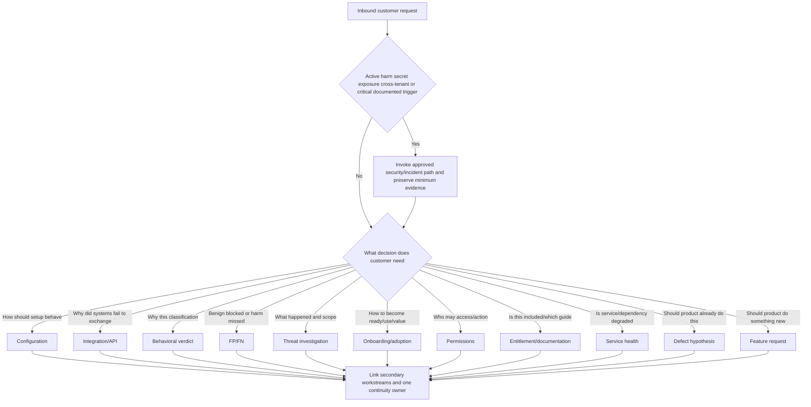
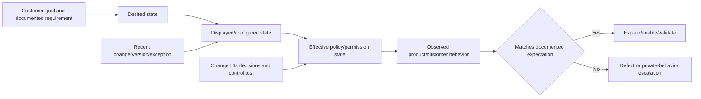
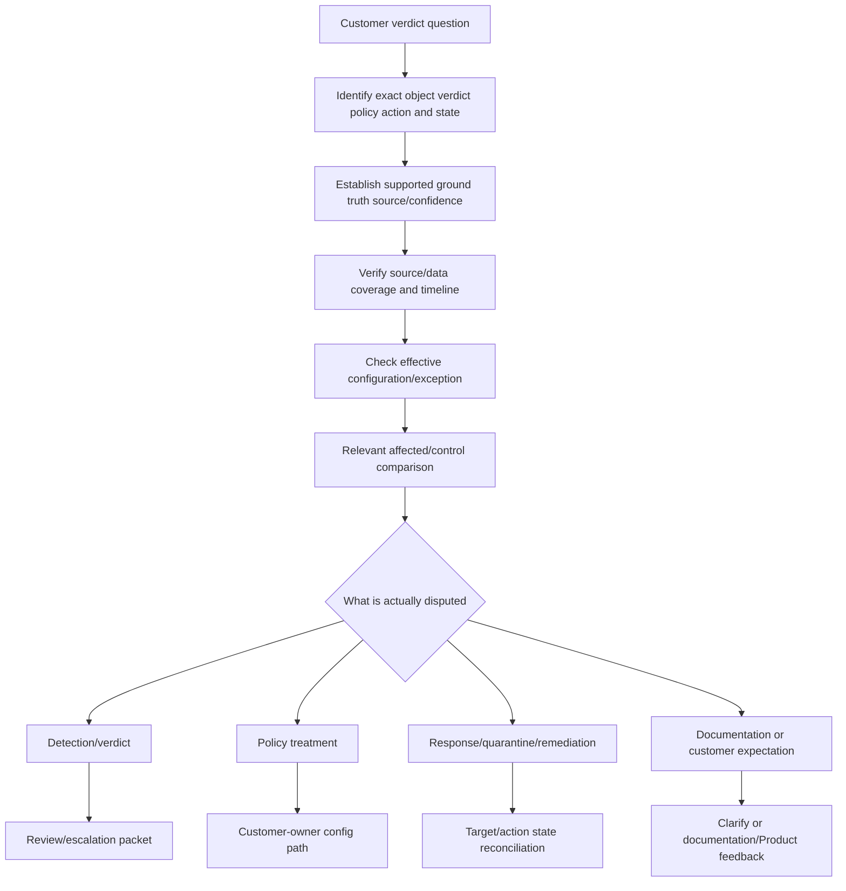
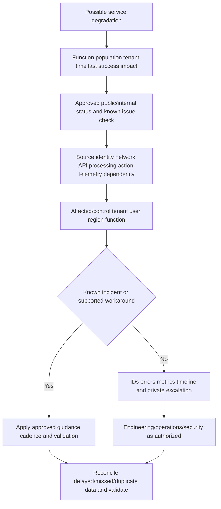
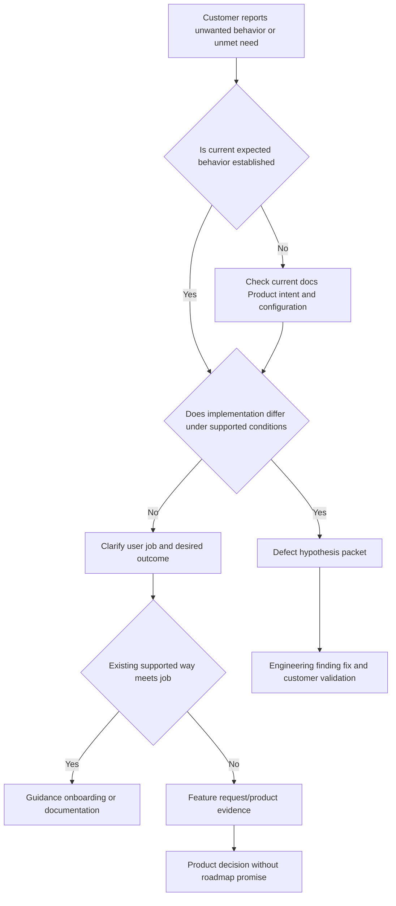
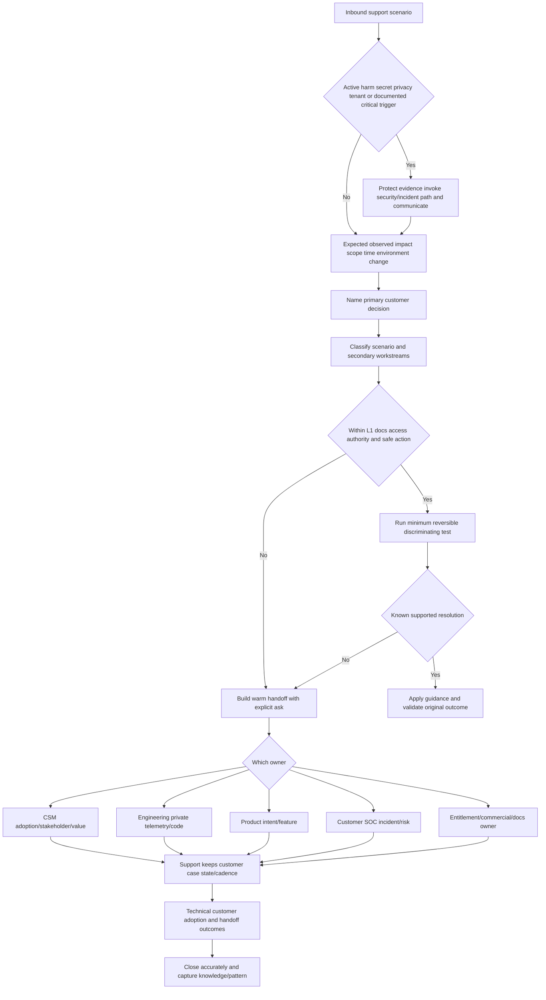
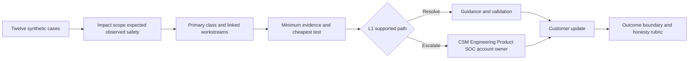

# Part 018 - Product Support Scenarios Onboarding and Boundaries

> **Purpose:** Classify inbound product-support scenarios, identify safe L1 actions and evidence, preserve customer continuity, and route configuration, integration, verdict, threat, onboarding, permission, entitlement, service-health, defect, and feature questions without inventing Abnormal's private process.
>
> **Evidence rule:** The scenario classes are derived from the supplied JD and vendor-neutral enterprise-support practice. Official Abnormal pages provide high-level public product, resource, customer, trust, and support-portal context. Exact case fields, queues, severity, entitlements, documentation access, SLAs, runbooks, internal tools, handoff rules, and product behavior are unknown/private.
>
> **Currency and official-source access date:** August 24, 2026.

## Section Goal

By the end of this Part, you should be able to convert an ambiguous statement such as “Abnormal is broken,” “the AI is wrong,” “the integration stopped,” or “we need this feature” into a precise support scenario. You should define expected and observed outcomes, impact, scope, time, environment, changes, objects, evidence, safety, and the decision the customer needs.

You should be able to classify configuration; integration/API; behavioral verdict; false-positive/false-negative; threat investigation; onboarding/adoption; permissions; entitlement/documentation; service health; defect; and feature-request scenarios. You should understand that a case can contain several classes, but one **primary decision** should control the initial route while secondary workstreams remain linked.

You should know what an L1 engineer can generally do in a neutral model: acknowledge, scope, protect evidence, reproduce or compare safely, check documented prerequisites, isolate boundaries, apply known supported guidance, communicate, validate, capture knowledge, and escalate with an explicit ask. You should know what L1 must not invent or own: private detection logic, undocumented changes, customer incident command, risk acceptance, legal advice, roadmap promises, contractual entitlement, or uncontrolled remediation.

The practical outcome is the **Waypoint L1 Scenario Classifier and Boundary-Tree Lab**. It contains twelve harmless synthetic scenarios, a triage classifier, evidence checklists, customer updates, handoffs to CSM/Engineering/Product/SOC, escalation packets, and a scored decision tree. No product account, customer data, tenant, mail, API, ticket system, or live support process is used.

## JD Mapping

| Supplied JD signal | Capability developed here | Practical proof |
|---|---|---|
| Enterprise L1 case ownership | Owns intake through validated resolution or accepted handoff | L1 lifecycle map |
| Configuration tickets | Tests intended/effective state, prerequisites, scope, and change | Configuration run card |
| API questions | Traces identity, request, response, schema, rate, and correlation | Integration run card |
| Behavioral false positives | Captures ground truth, verdict, policy, action, and impact | Verdict review packet |
| Threat investigations | Preserves evidence and supports customer SOC without commanding response | Threat boundary card |
| Timely customer updates | Uses impact, evidence, action, owner, time, and protection | Update set |
| Recommendations/RCA insight | Separates correction, workaround, cause, contributor, and prevention | Causal language matrix |
| Engineering/Product collaboration | Distinguishes defect from feature and creates actionable handoffs | Bug/feature packets |
| Onboarding with CSMs | Separates technical readiness, adoption, and value | Onboarding readiness map |
| KB/deflection/patterns | Captures verified reusable learning and recurring evidence | Knowledge/pattern rubric |
| Customer trust/ownership | Names unknowns and maintains continuity across boundaries | Scenario scorecard |

## Candidate Honesty Note

Your prior enterprise support and escalation background directly supports L1 ownership, critical-situation communication, customer/partner updates, Engineering/Product collaboration, fix validation, KB/training, mentoring, case quality, and support analytics. SharePoint Online, OneDrive, Sync Client, and Copilot are the named workload boundaries. Networking, REST/JSON, identity, diagnostic tools, analytics, and AI are transferable foundations. You must not invent experience with Abnormal, direct email-security cases, a customer SOC, Google Workspace, Slack, Okta, Splunk, CrowdStrike, Cortex SOAR, Zendesk, Salesforce, Jira, or Zoom.

| Evidence label | Honest use | Boundary |
|---|---|---|
| **Production-transfer example** | Real enterprise case ownership, escalation, communication, validation, knowledge, mentoring, analytics | No invented security/product scenario or result |
| **Working knowledge/upskilling** | Networking, APIs, JSON, identity, tools, AI, SaaS concepts | Do not imply production scale or named-tool use |
| **Local/public lab** | Synthetic classifier, updates, evidence packets, handoffs | No Abnormal/ticketing/customer operation |
| **Learned architecture** | Official public product context and neutral case model | No internal support process claim |
| **No direct experience** | Abnormal/direct email security/named adjacent tools | Say directly |
| **Template only** | Intake, escalation, onboarding, bug, feature, KB forms | Template is not a real case |

## Fact Labels and Process Ceiling

| Label | Use | Example |
|---|---|---|
| **Verified public fact** | Current official Abnormal public statement | Abnormal publicly links a Support Portal and Resource Center and describes product areas/capabilities |
| **Supplied JD fact** | Role/master wording | L1 owns configuration, API, behavioral false-positive, and threat cases and collaborates with CSM/Engineering/Product |
| **Vendor-neutral teaching model** | Classifier, L1 boundary, evidence, escalation, onboarding | An actionable escalation includes expected/actual, repro, IDs, impact, and explicit ask |
| **Inference/question to validate** | Likely operational detail | Which queues, fields, severities, ownership, and evidence apply at Abnormal |
| **Unknown/private** | Internal/contract detail | Entitlements, SLA, runbooks, support tiers, console fields, escalation paths, incident policy, customer configuration |

## Beginner Term Primer

| Term | Plain meaning | Why it matters | Memory hook |
|---|---|---|---|
| **Scenario classification** | Grouping a case by the decision and evidence path it requires | Correct class speeds access to the right owner | Route by decision, not keyword |
| **Intake** | First structured collection of outcome, impact, scope, time, environment, and evidence | Shapes all later work | Make the first useful problem statement |
| **Expected behavior** | What should happen under current documented conditions | A defect requires a credible expectation | What should occur? |
| **Observed behavior** | What actually happened, with source and time | Avoids vague “broken” language | What did evidence show? |
| **Impact** | Customer/business/security consequence | Drives urgency and communication | Why it matters now |
| **Scope** | Affected identities, objects, systems, tenants, locations, and time | Prevents overgeneralization | How far does it reach? |
| **Reproduction** | Repeatable steps/conditions producing the behavior | Helps distinguish state, defect, and coincidence | Can we make it happen safely again? |
| **Control sample** | Similar case that works under relevant comparable conditions | Separates hypotheses | Compare affected and working |
| **Configuration issue** | Intended/effective setting, prerequisite, policy, or change is wrong or unclear | Often resolvable without code change | State and policy path |
| **Integration/API issue** | Software-to-software identity, request, contract, transport, schema, or processing problem | Needs IDs and boundary evidence | Trace the contract |
| **Behavioral verdict case** | Customer disputes or asks about a security classification | Requires ground truth and evidence limits | Judgment under review |
| **False positive** | Benign/expected item treated harmful | Creates business/trust cost | Alarm without harm |
| **False negative** | Harmful item not treated harmful | Creates exposure/response cost | Harm without alarm |
| **Threat investigation** | Evidence-based attempt to determine harmful activity, scope, and response need | Customer SOC owns broader incident decisions | What happened and what must be done? |
| **Onboarding** | Coordinated work to make a customer technically and operationally ready | Setup is one part of adoption | Prepare people, process, and technology |
| **Adoption issue** | Intended users/process do not consistently use the capability or realize outcome | A technically healthy product can still fail customer value | Available but not effectively used |
| **Permission issue** | Identity lacks, retains, or exceeds authority for an action/resource | Can be configuration, security, or lifecycle concern | Who may do what? |
| **Entitlement** | Contract/plan/support right to a product, feature, service, or assistance | Support must not guess commercial rights | What is included and authorized? |
| **Documentation question** | Customer needs current authoritative instructions or behavior definition | Documentation may be missing, stale, unclear, or access-controlled | Which source is authoritative? |
| **Service health issue** | Service or dependency is degraded/unavailable | Needs scope, status, workaround, reconciliation, and communication | Is the service path healthy? |
| **Defect/bug** | Implementation differs from intended/documented behavior | Engineering needs reproducible evidence | Product does not do what it should |
| **Feature request** | Desired capability/behavior not currently provided as intended | Product needs user job, impact, pattern, and tradeoff | Product should do something new/different |
| **Limitation** | Known boundary in current design/capability | Not every unmet need is a defect | Works within a boundary |
| **Workaround** | Alternative path restoring function without necessarily removing cause | Needs risk, scope, expiry, and owner | Get work moving temporarily |
| **Known error** | Understood issue with documented cause/path and workaround where available | Avoids repeated reinvestigation | Known condition, known path |
| **Escalation** | Moving a specific need to someone with authority/access/expertise | A good escalation accelerates a decision | Escalate the question, not confusion |
| **Warm handoff** | Context, evidence, owner, acceptance, and cadence transfer together | Prevents restart and ping-pong | Introduce, transfer, confirm |
| **Root cause** | Underlying causal condition whose correction prevents recurrence in defined scope | Strong claim requiring evidence | Why it happened at the causal level |
| **Trigger** | Event that starts or exposes the failure | It may not be root cause | What set it off |
| **Contributing factor** | Condition increasing likelihood/impact without being sole cause | Supports better prevention | What made it easier/worse |

## L1 Ownership Model

```mermaid
flowchart LR
    Intake[Intake acknowledge impact and safety] --> Frame[Expected observed scope time environment change]
    Frame --> Classify[Classify primary decision and linked workstreams]
    Classify --> Evidence[Collect minimum hypothesis-driven evidence]
    Evidence --> Test[Run supported reversible discriminating tests]
    Test --> Decide{Within L1 knowledge authority and runbook}
    Decide -->|Yes| Resolve[Apply supported guidance and validate]
    Decide -->|No| Escalate[Warm escalation with explicit ask]
    Escalate --> Collaborate[CSM Engineering Product Security or customer owner]
    Collaborate --> Update[Maintain customer cadence and case state]
    Update --> Validate[Validate original outcome and side effects]
    Resolve --> Validate
    Validate --> Learn[Closure knowledge trend and success handoff]
```



### L1 owns versus routes

| L1 can generally own in a neutral model | L1 should route or escalate |
|---|---|
| Acknowledge, impact, scope, expected/observed, timeline, changes | Customer incident declaration/containment priorities |
| Safe evidence request, privacy/redaction, case notes | Legal/privacy/compliance interpretation |
| Documented prerequisites and known configuration checks | Risk acceptance or undocumented control bypass |
| Safe reproduction and affected/control comparison | Private telemetry, code, proprietary detection logic |
| Basic API/request/response/ID correlation | Product defect requiring Engineering correction |
| Known supported guidance/workaround with validation | Product intended-behavior ambiguity or roadmap decision |
| Customer updates, dependency tracking, warm handoffs | Contract/entitlement/SLA commitment without authority |
| Technical outcome validation and knowledge candidate | Customer success/renewal ownership or product promise |

The exact Abnormal L1 authority, runbooks, case tools, access, and escalation criteria are **unknown/private**. This is a preparation model.

## 🔍 Plain-English deep-dive: L1 Is the Quality Gate for Ambiguity

L1 is like an air-traffic controller at the first shared decision point: identify the aircraft, route, conditions, priority, and next safe instruction, then involve specialists without losing the picture. The analogy stops because L1 also performs technical diagnostics and does not control every downstream team.

The customer usually reports a symptom, not a classified problem. “Alerts are missing” could be source coverage, query time, parser, permissions, product detection, or case routing. L1 creates the first falsifiable problem statement. A specialist can act because L1 has already separated expected/observed, affected/control, IDs, versions, impact, tests, and explicit question.

L1 quality also protects safety. It stops secrets from entering cases, prevents broad changes used as experiments, and routes active threats to customer SOC/security. Escalation is not failure; unstructured escalation is.

## Scenario Classifier



### Classification table

| Class | Primary decision | Minimum-first evidence | L1 safe action | Escalate/handoff when |
|---|---|---|---|---|
| Configuration | Which intended/effective state should apply? | Tenant/object, setting/policy/version, before/after, owner, expected/actual | Compare docs/effective state/control sample | Documented state and behavior conflict or risk/authority exceeds L1 |
| Integration/API | Which contract/boundary failed? | Client/tenant, method/resource, UTC, request/delivery IDs, status/error, schema/version | Reproduce safely and trace stages | Provider/internal telemetry or contract defect needed |
| Behavioral verdict | Why is classification disputed? | Object/verdict/policy/action IDs, ground truth/context, impact | Separate verdict/policy/action and follow review path | Proprietary evidence or reproducible mismatch needs specialist |
| False positive | Is benign ground truth supported and treatment harmful? | Message/finding, customer authority/context, config, action/state | Resolve immediate supported outcome; review packet | Detection/product change or pattern review |
| False negative | Is harmful ground truth supported and data path complete? | Raw/minimum evidence, route/source, verdict/action, identity, scope | Invoke customer SOC; preserve/trace product path | Active harm or detection/data/product gap |
| Threat investigation | What happened, scope, and response boundary? | Timeline, entities, source IDs, actions, confidence | Product evidence and supported investigation | Customer SOC/incident; vendor Security/Engineering |
| Onboarding/adoption | What readiness/use/value blocker exists? | Goal, stakeholders, prerequisites, roles, milestones, usage/outcome | Validate technical path; coordinate CSM | Success plan/relationship/training or product gap |
| Permission | Which identity/action/resource is allowed/denied? | Identity/tenant, role/group/grant/session, policy decision | Effective-access comparison; least privilege | Customer authority, security risk, undocumented requirement |
| Entitlement/docs | Is capability/support included and which source governs? | Customer/account context through approved systems, product/version, request | Route authoritative commercial/docs owner; share approved docs | Contract/plan/access exception or stale/missing docs |
| Service health | Which function/population/dependency is degraded? | Scope, start/last success, errors, region/dependency if authorized, status IDs | Check approved status/known issue; workaround/cadence | Broad/provider issue, critical impact, no safe workaround |
| Defect | Does implementation differ from intended behavior? | Expected source, repro, affected/control, version, IDs, logs, impact | Create minimal repro and packet | Engineering/private telemetry/code needed |
| Feature request | Which unmet job should product address? | User job, current behavior, impact, frequency, workaround, alternatives | Clarify and route Product evidence | Product decision/roadmap; never promise |

## Configuration Scenarios

Configuration includes tenant selection, roles, integrations, policy, exceptions, notification, source coverage, retention, and feature settings. Do not invent Abnormal menu paths.



| Configuration question | Evidence | Unsafe shortcut |
|---|---|---|
| Wrong tenant/environment | Tenant/object aliases and source | Trying changes in several tenants |
| Role/policy not effective | Direct/group/grant/session and decision evidence | Trusting one screenshot |
| Setting changed | Change actor/time/before/after/approval | Calling temporal correlation root cause |
| Exception ignored | Exception scope/precedence/expiry and control object | Creating broader exception |
| Source population missing | Route/connector/permission/control object | Declaring detection miss |
| Notification unexpected | Trigger/policy/recipient/template/version | Disabling all notifications |
| Finding persists | Effective state and reassessment expectation | Repeating change blindly |

### Configuration L1 packet

1. Customer outcome and impact.
2. Exact tenant/environment/object.
3. Documented or agreed expected behavior/source.
4. Displayed and effective configuration evidence.
5. Recent change, version, exception, and time.
6. Affected versus working control.
7. Tests and results.
8. Risk/authorization/rollback boundary.
9. Explicit internal question.
10. Customer update/checkpoint.

## Integration and API Scenarios

```mermaid
flowchart LR
    Producer[Source/producer] --> Auth[Identity authentication authorization]
    Auth --> Request[Endpoint method resource request]
    Request --> Transport[DNS TCP TLS proxy network]
    Transport --> Service[Service contract and processing]
    Service --> Response[Status error body correlation]
    Response --> Async[Queue webhook retry pagination or cursor]
    Async --> Consumer[Receiver parser storage case or action]
    Consumer --> Validate[Customer-visible outcome]
```



| Stage | Evidence | Common symptom |
|---|---|---|
| Producer/source | Source object ID, event time, eligibility | Object never generated/exported |
| Identity/authentication | Client ID, tenant, issuer, non-secret metadata | `401` |
| Authorization | Scope/role/policy/resource | `403` or partial data |
| Network/TLS | Host, DNS result, connection, certificate/proxy evidence | Timeout/name/TLS error |
| Request contract | Method/path category, headers excluding secrets, schema/version | `400`, `404`, validation |
| Capacity/rate | `429`, retry metadata, attempt schedule | Backlog/delay |
| Server processing | `5xx`, request ID, status | Service/internal failure |
| Async delivery | `202`, delivery/queue IDs, final state | Accepted but not completed |
| Consumer parse/store | Receiver/parse/index/case IDs, schema | Missing downstream object |
| Idempotency/retry | Idempotency/action ID, target state | Duplicate/partial effects |

Never request live tokens, cookies, passwords, private keys, client secrets, or authorization headers. L1 can trace sanitized request/response and IDs; private server telemetry belongs to authorized Engineering.

## Behavioral Verdict, False-Positive, and False-Negative Scenarios



| Case type | Immediate L1 question | Critical boundary |
|---|---|---|
| Disputed benign verdict | Who confirms expected behavior and with which evidence? | Customer statement is evidence, not automatic truth |
| Disputed harmful verdict | What threat/identity/business behavior supports harm? | Support does not declare customer incident alone |
| FP with business interruption | Which system/policy/action caused current state? | Restore only through authorized owner |
| FN with active user action | What customer response is underway and was product path complete? | Customer SOC/identity acts without waiting for vendor review |
| Repeated pattern | Same cause/config/context/version or only same symptom? | Do not overgeneralize anecdotes |
| Product explanation request | What supported rationale is visible and safe to share? | Do not invent proprietary logic |

## 🔍 Plain-English deep-dive: A Customer Label Is an Input to Investigation, Not a Queue Command

When a customer says “false positive,” they may mean “legitimate,” “wanted,” “business-critical,” “not malicious,” “wrongly quarantined,” or “policy should allow it.” Those are different claims. The same applies to “missed threat”: the product may lack source data, an alert may not route, or a response may fail after a correct verdict.

**Analogy:** A patient saying “allergy” helps a clinician act carefully, but the term can mean a confirmed immune response, side effect, or dislike. The analogy stops because support is not medicine and product ground truth has different evidence.

L1 should not correct the customer's language defensively. Translate it into decision questions: What is the message/finding? Which outcome is wrong? Which ground truth is supported? Which policy/action changed state? What immediate business/security impact exists? That translation makes the case actionable and preserves empathy.

## Threat Investigation Scenarios

Threat cases add urgency and shared responsibility. The customer SOC/incident lead owns the customer-environment response; Support owns product evidence and case continuity.

| L1 action | Purpose | Boundary |
|---|---|---|
| Confirm active harm/critical trigger | Invoke correct security path quickly | Do not invent severity/SLA |
| Preserve minimum IDs/timeline | Avoid evidence loss and enable correlation | Do not collect full content/secrets by default |
| Separate observation/inference/unknown | Prevent false certainty | Do not attribute actor |
| Verify product/source path | Determine coverage and product-visible behavior | Do not delay customer containment |
| Provide supported product actions/limits | Help customer decision owner | Do not command release/revoke/isolation |
| Escalate vendor security/Engineering | Inspect private/service evidence | Use approved path and minimize data |
| Maintain updates | Preserve trust and one narrative | Do not promise root cause/fix time |

### Threat handoff

```mermaid
sequenceDiagram
    participant Customer as Customer SOC/admin
    participant L1 as L1 Support
    participant Sec as Vendor Security/specialist
    participant Eng as Engineering/detection
    Customer->>L1: Report threat evidence impact and IDs
    L1->>Customer: Confirm safety path scope and next checkpoint
    L1->>L1: Preserve minimum product/source evidence
    L1->>Sec: Escalate active risk or vendor-security concern
    L1->>Eng: Escalate product behavior with exact question
    Sec-->>L1: Handling direction/customer-safe boundary
    Eng-->>L1: Finding/limitation/validation criteria
    L1-->>Customer: One factual update; customer retains incident decisions
```

## Onboarding and Adoption Scenarios

Onboarding turns a purchased/available capability into a technically and operationally ready workflow. Adoption turns readiness into consistent correct use and outcome.

```mermaid
flowchart LR
    Goal[Customer goals/use cases] --> Stakeholders[Admins SOC identity SaaS owner CSM Support]
    Stakeholders --> Prereq[Technical prerequisites permissions integrations data]
    Prereq --> Configure[Authorized configuration]
    Configure --> Validate[Positive/negative technical validation]
    Validate --> Operate[Owners playbooks evidence escalation training]
    Operate --> Adopt[Consistent intended use]
    Adopt --> Outcome[Measured customer outcome and guardrails]
    Outcome --> Handoff[Steady-state Support/CSM/customer ownership]
```



### Onboarding readiness matrix

| Area | Questions | Evidence | Primary partnership |
|---|---|---|---|
| Goals/use cases | Which risks/workflows and success criteria? | Success plan and baseline | Customer leader + CSM |
| Stakeholders | Who sponsors, configures, operates, decides, validates? | Persona/RACI | CSM + customer owner |
| Technical prerequisites | Tenant, identity, permissions, integrations, compatibility? | Current documented checklist | Support/admin/implementation role |
| Security/privacy | Data, access, consent, retention, trust review? | Approved governance/contract evidence | Customer/vendor security/privacy |
| Configuration | Which policy/population/exceptions and owner? | Change record and effective state | Customer admin + Support |
| Validation | Positive and negative tests and expected evidence? | Test IDs/results | Support + customer operator |
| Operations | Triage, response, updates, escalation, service health? | Runbooks/contact map | SOC/admin + Support |
| Training | Which users/admins/analysts and feedback? | Training/readiness record | CSM/customer enablement |
| Adoption | Which workflows/usage quality and blockers? | Leading indicators and qualitative evidence | CSM + customer owner |
| Value | Which outcomes, baseline, method, guardrails? | Agreed scorecard | Customer leader + CSM |
| Handoff | What moves to steady-state ownership? | Accepted checklist and open risks | CSM + Support + customer |

### Onboarding versus support case

One technical ticket may reveal an onboarding gap: missing prerequisite, unclear ownership, insufficient training, or expectation mismatch. Support resolves the technical case and records the pattern; CSM/customer owner coordinates the broader adoption intervention. Support should not turn every ticket into a success project or use CSM as a technical escalation queue.

## 🔍 Plain-English deep-dive: Onboarding Ends With Operability, Not a Completed Checklist

A new fire alarm is not ready because it is mounted. People need to know who receives alerts, what each signal means, who may silence or escalate it, how tests work, and how failures are handled. The analogy stops because cloud security tools may provide automated value and their configuration changes continuously.

Technical readiness proves that integrations, roles, policies, and evidence work under expected conditions. Operational readiness proves that customer owners can act safely and Support/CSM handoffs are understood. Adoption proves the workflow is used consistently. Value proves an outcome matters and is sustained.

A checklist item “integration connected” is therefore incomplete. Add a positive event, a safe negative test, evidence visibility, permission review, failure/rollback path, named owner, and customer confirmation. Unknown entitlement, private product mechanics, and commercial commitments go to authorized owners.

## Permission Scenarios

| Symptom | Questions | L1 evidence | Boundary |
|---|---|---|---|
| User cannot access | Authentication or authorization? Exact tenant/action/resource? | Sign-in result, role/group, policy, request ID | Customer identity/admin owns assignment |
| User still accesses after removal | Group/app/session/inheritance/propagation? | Effective privilege and old/new session | Security-sensitive if high privilege |
| Integration `403` | Which documented scope/role and resource? | Non-secret grant/policy/request | Never grant broad admin casually |
| Support user lacks feature | Product role, entitlement, environment, documentation? | Approved account/role context | Do not guess entitlement |
| Agent/tool denied | Goal, tool, action, tenant, approval, policy? | Run/policy/tool decision | Denial may be correct safeguard |
| Cross-tenant-looking object | Is data/identifier from another tenant? | Minimum evidence only | Stop and invoke security path |

## Entitlement and Documentation Scenarios

Entitlement can depend on contract, plan, product, add-on, region, customer status, role, feature availability, support policy, or access-controlled documentation. L1 should use approved systems and owners, never public-page assumptions.

| Question | Safe L1 path | Do not do |
|---|---|---|
| “Do we own this product/feature?” | Check approved entitlement/account source or route account/CSM/commercial owner | Infer from UI/public marketing |
| “Is this supported?” | Use current approved product/support documentation | Promise based on memory |
| “Where is the guide?” | Share current authorized public/customer-accessible source | Copy restricted docs into case/public file |
| “Documentation contradicts behavior” | Capture doc title/version/date and expected/actual; escalate | Quietly rewrite expectation |
| “Can you enable it?” | Verify role, entitlement, approved process, prerequisites | Attempt hidden/undocumented toggle |
| “What is our SLA?” | Route to authoritative contract/support-plan source | Quote invented or another customer's target |
| “Why can't I access Support Portal/Security Hub?” | Verify approved identity/entitlement/access owner | Bypass access control or share protected report |

Documentation itself can be a defect: stale steps, missing prerequisite, unclear term, wrong screenshot, inaccessible link, or behavior drift. A documentation packet includes source/title/URL or authorized ID, version/access date, target audience, exact confusing statement, observed behavior, impact, proposed correction, and owner.

## Service Health Scenarios



### Health questions

1. Which exact function is unavailable or degraded?
2. Who/what is affected and not affected?
3. When was last success and first failure?
4. Is impact expanding, intermittent, or stable?
5. Which source/dependency/network/API/action/telemetry layer first fails?
6. Is there an approved status notice or known issue?
7. Which workaround is supported, bounded, and safe?
8. What data/actions may be delayed, missing, duplicated, or stale?
9. Who owns cadence and customer decisions?
10. What proves recovery and reconciliation?

Never invent status, root cause, region, fail-open/closed behavior, restoration estimate, SLA, or incident declaration.

## Defect Versus Feature Request



| Dimension | Defect hypothesis | Feature request |
|---|---|---|
| Core statement | Product differs from intended/documented behavior | Customer needs new/different capability/outcome |
| Required evidence | Expected source, actual result, supported environment, repro, IDs, versions, impact | User job, current path, gap, frequency, impact, workaround, alternatives |
| Owner | Engineering with Product clarification as needed | Product prioritization/strategy |
| L1 duty | Reproduce/isolate, packet, updates, validate fix | Clarify need, avoid solution lock, route evidence, communicate decision |
| Promise boundary | Do not promise cause/fix/ETA | Do not promise priority/design/date |
| Closure | Customer scenario works or documented conclusion accepted | Feedback recorded/decision communicated; technical case handled |

## 🔍 Plain-English deep-dive: A Defect Is a Broken Contract; a Feature Is a New Contract

If an elevator is documented to stop at floor five but consistently skips it under supported conditions, that is a defect hypothesis. If a tenant wants a new stop at floor six, that is a feature request. The analogy stops because software documentation can be ambiguous, configurations vary, and Product intent can evolve.

Do not ask Engineering to decide a vague desire. Establish expected behavior from current authoritative documentation or Product clarification. Do not force a customer need into a defect because defects may seem more urgent. Product needs the underlying job and impact, not only the customer's proposed button.

A limitation can be neither: the product intentionally supports a bounded scope and the customer's environment lies outside it. Explain current behavior accurately, identify supported alternatives, and route a feature need if appropriate. Never frame a limitation as customer fault.

## Escalation and Handoff Standards

### Engineering escalation packet

| Element | Required content |
|---|---|
| Customer outcome/impact | What is blocked or risky and how broadly? |
| Expected/actual | Current authoritative basis and exact observation |
| Environment | Tenant alias, product/integration/version/configuration as authorized |
| Reproduction | Minimal safe steps, frequency, affected/control |
| Evidence | UTC, object/request/action IDs, sanitized logs/errors, source coverage |
| Tests | What was tried, result, hypotheses changed |
| Changes | Recent config/version/dependency change |
| Privacy/safety | Data minimized; secrets/content excluded |
| Explicit ask | Internal decision/telemetry/code behavior needed |
| Customer continuity | Owner, workaround/risks, next update |

### Product evidence brief

| Element | Required content |
|---|---|
| User/persona and job | Who is trying to make what progress? |
| Current behavior/path | How is job attempted now? |
| Gap and impact | Security, effort, trust, scale, frequency |
| Evidence/pattern | Cases/population/time; avoid overgeneralization |
| Workaround/alternatives | Cost, risk, limitations |
| Desired outcome | What success looks like without forcing design |
| Promise boundary | No priority, design, or date commitment |

### CSM handoff

Support supplies technical readiness/status, blockers, risks, owners, validation, and support pattern. CSM supplies goals, stakeholders, milestone, adoption, relationship, and success context. Each accepts their action; Support keeps technical case continuity.

### Customer SOC handoff

Support supplies product evidence, supported actions/limitations, current state, and next product checkpoint. Customer SOC supplies incident/security disposition, containment priorities, and customer-environment action. Support does not close the customer incident.

## Worked Examples

### Worked example 1: Configuration or defect?

**Input:** A finding remains after admin changes a setting.

**L1:** Capture finding/rule version, desired/displayed/effective state, change ID/time, reassessment expectation, affected/control. If enforcement still uses old value, correct customer configuration/propagation path. If effective state matches docs and finding persists beyond documented behavior, create defect packet.

### Worked example 2: API error or permission?

**Input:** Integration returns `403` for one action.

**L1:** Stop network troubleshooting after endpoint/application response; inspect client/tenant/action/resource, non-secret grant, policy decision, request ID, affected/control. Do not request token or grant global admin. Route undocumented requirement to product/integration owner.

### Worked example 3: “False positive” is policy

**Input:** Product verdict is safe; native mail policy holds attachment.

**Classification:** Configuration/policy/quarantine, not behavioral false positive. Customer mail owner controls release/policy. Support explains evidence and avoids unnecessary detection escalation.

### Worked example 4: Active suspected miss

**Input:** User entered credentials after harmful synthetic message; no alert.

**Primary routes:** Threat investigation and potential FN/data gap. Customer SOC/identity responds immediately; Support verifies route/source coverage, object/verdict/action, and escalates detection/data evidence. Do not wait for vendor root cause before containment.

### Worked example 5: Onboarding blocker

**Input:** Integration technically works, but alerts have no customer owner.

**Classification:** Adoption/operational readiness. Support validates routing/evidence and documents technical state; CSM/customer security leader establishes owner, playbook, training, and success criteria. Product defect is not indicated.

### Worked example 6: Entitlement ambiguity

**Input:** Public page names a capability; customer cannot access it.

**L1:** Public marketing does not prove customer entitlement or availability. Verify approved account/product/role source and route CSM/account/commercial owner. Check documentation/version/region only through authoritative sources. Do not promise enablement.

### Worked example 7: Service health versus local issue

**Input:** Several users in one tenant receive timeouts; another tenant is not a valid test because Support must not access unrelated customers.

**L1:** Compare affected/control users/functions within authorized customer scope, status page/known issue, network/API/request IDs, last success, dependency. Escalate provider health with evidence. Avoid cross-tenant exploration.

### Worked example 8: Feature request disguised as bug

**Input:** Customer expects custom notification to a channel not documented as supported.

**L1:** Clarify job, current supported behavior, impact, frequency, workaround, desired outcome. If implementation matches docs, it is feature/documentation/adoption rather than defect. Product receives evidence; Support promises no roadmap.

## Troubleshooting Decision Tree



### Symptom-to-classifier matrix

| Customer wording | Possible classes | Cheapest discriminator | Safe next action |
|---|---|---|---|
| “Feature is missing” | Permission, entitlement, configuration, docs, feature request | Approved account/role/product/docs check | Route exact owner; no public-page assumption |
| “AI got it wrong” | Verdict, ground truth, policy, output mapping, expectation | Object/verdict/policy/action/source comparison | Review packet or controlling-layer correction |
| “API is down” | DNS/TLS/network, auth, permission, rate, service, schema | Exact status/request ID and affected/control | Move to first failed layer |
| “Abnormal blocked mail” | Product/native policy, verdict, quarantine/action | Verdict + policy + state owner | Correct classification and route |
| “No alerts” | Source coverage, query, parser, detection, route, adoption | One known source ID end to end | Repair gap or detection review |
| “Need urgent release” | FP/policy/threat/business decision | Ground truth, state, owner, impact | Customer authorized owner decides |
| “Setup complete but no value” | Onboarding/adoption/success criteria | Technical test versus workflow use/outcome | Support+CSM/customer plan |
| “This is a bug” | Config, docs, limitation, defect, feature | Establish expected source and repro | Defect or Product path based on evidence |

## Common Failure Modes and Safe Corrections

| Failure mode | Why it fails | Safe correction | Escalation trigger |
|---|---|---|---|
| Route by keyword | Same word spans classes | Route by object and requested decision | Ownership remains ambiguous |
| One case forced into one class | Cross-area dependencies hidden | Primary class plus linked workstreams | Several owners/actions |
| L1 follows checklist without hypothesis | Noise and customer effort | Tie each test to competing explanation | Path remains unclear |
| Collect all logs/messages | Privacy/noise | Minimum fields/time/source tied to test | Sensitive evidence necessary |
| Ask for secrets | Creates exposure | Non-secret metadata and IDs | Any credential appears |
| Broad config change as test | Causes risk and loses causation | Reversible narrow affected/control test | High-impact change needed |
| Customer verdict label accepted literally | FP/FN may be policy/data/action | Translate to ground truth and state | Active harm |
| Escalate “please investigate” | Recipient restarts case | Explicit question plus packet | Private access/expertise needed |
| Escalation ends ownership | Customer loses continuity | Track acceptance, cadence, validation | Dependency delays |
| CSM used as technical queue | Adoption/technical roles blur | Support technical; CSM goals/stakeholders | Onboarding risk |
| Engineering used for entitlement | Wrong authority | Route approved commercial/account owner | Contract question |
| Product request promised | Damages trust | Record job/impact; no priority/date | Customer demands commitment |
| Public docs used as entitlement proof | Marketing is not contract | Approved entitlement source | Feature inaccessible |
| Service status invented | Misinforms customer | Approved status/known-issue evidence | Broad degradation |
| Workaround called root cause | Restoration is not causation | State exact effect and unknown cause | RCA requested |
| Fix shipped called resolved | Customer outcome unvalidated | Repeat original scenario and reconcile | Reopen/partial state |
| Ticket silence called success | No evidence of outcome | Administrative closure language and follow-up | High impact |
| KB written before finding stable | Spreads wrong guidance | Review evidence, scope, limitations | Recurring cases |
| Lab presented as production | Violates honesty | Label local/synthetic/template | Interview follow-up |

## Waypoint L1 Scenario Classifier and Boundary-Tree Lab

### Lab purpose

Classify twelve harmless synthetic support scenarios, choose L1 actions, write customer updates, and create CSM/Engineering/Product/SOC handoffs. “Waypoint” means every case has a current state, owner, and next decision rather than an unexplained queue location.

### Honest artifact label

> **LOCAL/SYNTHETIC L1 SUPPORT LAB - Scenario classification, communication, and handoff practice only. No Abnormal product, customer case, ticketing/CRM system, email-security operation, tenant, API, entitlement, SLA, incident command, or production experience is represented.**

### Prerequisites

1. Parts 001-017 and this Part.
2. Private Markdown/spreadsheet workspace and Mermaid preview/paper.
3. Only supplied fictional scenarios/IDs and `.invalid` identities.
4. No product account, Support Portal, Security Hub, customer contact, mail, SaaS, API, ticketing, CRM, or network activity.
5. Three hours and a forty-five-minute timed triage exercise.

### Authorized scope and privacy

| Authorized | Prohibited |
|---|---|
| Paper intake, classification, tests, updates, packets, RACI | Operating any platform or contacting a customer/vendor |
| Synthetic IDs, errors, configs, ground truth | Real support cases, logs, headers, credentials, contracts, metrics |
| Public-source references and neutral process | Copying restricted docs or inventing internal queues/SLAs |
| Candidate production-transfer mapping | Claiming direct Abnormal/email/named-tool use |

### Synthetic environment

Fictional `Waypoint Labs` uses `Waypoint-Mail`, `Waypoint-ID`, `Waypoint-Secure`, `Waypoint-Events`, and `Waypoint-Cases`. Objects use `TENANT-018-A`, `MSG-018-A/B`, `APP-018-A`, `REQ-018-A`, `EVT-018-A`, `FIND-018-A`, `RUN-018-A`, `CASE-018-A` through `CASE-018-L`. No object represents a real product behavior.

### Twelve scenarios

| Case | Scenario and ground truth |
|---|---|
| A | Config: user role displays `reader`; export denied correctly because export role absent |
| B | API: request reaches service and returns `403` due to missing least scope |
| C | Verdict: approved training message classified harmful; review required |
| D | FP wording: safe verdict but native policy holds message; not detection FP |
| E | FN/threat: harmful synthetic message followed uncovered route; customer SOC must act; coverage gap first |
| F | Onboarding: integration works but no analyst owns incoming cases |
| G | Permission: direct role removed but nested group/session retains access |
| H | Entitlement/docs: public page names capability; fictional customer access unknown |
| I | Service health: one function times out for three users; approved status source has no known issue |
| J | Defect: documented supported schema v2 producer emits v3 after fictional update; reproducible |
| K | Feature: customer wants unsupported custom notification channel |
| L | Agent: generated case note invents user click; no tool action occurred |

### Lab scenario router



### Step 1: Build intake records

For all twelve: customer goal, expected/observed, impact, scope, first/last time, environment/tenant alias, changes, reproducibility, objects/IDs, evidence offered, privacy/safety, and next update. Mark unknown rather than invent.

### Step 2: Classify primary and secondary workstreams

Assign one primary class and optional secondary classes. State the requested decision. Example: E primary threat investigation/data coverage, secondary false-negative review. D primary configuration/policy/quarantine, not FP.

### Step 3: Rank hypotheses and tests

For every case list at least three plausible explanations and one cheap safe test that changes routing. Include expected observations and next actions for both result branches.

### Step 4: Build L1 boundary cards

For each case record: L1 can do; L1 must not do; customer owner; vendor specialist; evidence; escalation condition; workaround boundary; validation. Cite no private workflow.

### Step 5: Write first responses

Each response includes impact acknowledgment, current interpretation without certainty, safe evidence request, next action, owner, update time, and protection guidance. Do not use invented severity/SLA.

### Step 6: Produce technical packets

Engineering packets for J and L; detection review for C/E; integration packet for B/J; permission packet for G. Each has expected/actual, versions, IDs, tests, impact, privacy, explicit ask, and customer cadence.

### Step 7: Produce nontechnical handoffs

CSM handoff for F/H; Product brief for K and any recurring pattern; SOC handoff for E; entitlement/account-owner handoff for H. Each keeps Support technical continuity and avoids promises.

### Step 8: Build onboarding plan for F

Define goals, stakeholders, technical readiness, positive/negative validation, case owner, playbook, training, adoption indicators, outcome, guardrails, Support/CSM/customer handoff, and thirty-day review. Do not imply Abnormal onboarding procedure.

### Step 9: Create service-health card for I

Record function/scope/timeline/control, layer tests, approved status check, IDs/errors, workaround, escalation, cadence, reconciliation, and recovery validation. Do not infer region/root cause/ETA.

### Step 10: Build defect-versus-feature analysis

For J and K, record authoritative expectation, actual/repro, user job, impact, current path, workaround, and owner. Explain why J is a defect hypothesis and K is a feature request. Add documentation-correction possibility.

### Step 11: Run timed triage

Randomize the twelve cards. In three minutes each state:

1. safety/impact;
2. primary class and decision;
3. evidence/unknowns;
4. leading hypotheses;
5. cheapest safe test;
6. L1 boundary;
7. owner/handoff;
8. customer checkpoint;
9. validation;
10. honest evidence tier.

### Step 12: Validate, clean, and retain

1. Confirm no system/account/customer interaction occurred.
2. Search for real names, domains, tenant IDs, tokens, logs, case data, private docs, entitlements, SLAs, internal queue/process claims.
3. Confirm all twelve ground-truth conclusions remain intact.
4. Delete scratch cards; retain sanitized package privately.
5. Record score, reviewer, corrections, source date, retention/review date, and limitation.

### Required artifacts

| Artifact | Required content | Honest label |
|---|---|---|
| Intake set | Twelve complete intake records | Local/synthetic lab |
| Classifier | Primary/secondary classes and decisions | Local/synthetic lab |
| Hypothesis/test set | Three hypotheses and branching test per case | Local/synthetic lab |
| Boundary cards | L1/customer/vendor owner/action limits | Template plus local lab |
| First responses | Twelve customer-safe messages | Template only |
| Technical packets | Engineering/detection/integration/permission set | Template only |
| Cross-functional handoffs | CSM/Product/SOC/account-owner packets | Template only |
| Onboarding plan | Technical/operational/adoption/value/hand-off | Vendor-neutral template |
| Health/defect/feature cards | I/J/K complete analysis | Local/synthetic lab |
| Timed triage/validation | Score, corrections, privacy, cleanup | Local/synthetic lab |

### Cleanup and privacy

- Delete temporary synthetic scenario drafts, duplicate checklists, screenshots, and scratch notes after review.
- Retain only fictional case aliases and the minimum study artifact; include no customer, tenant, user, credential, message, ticket, or proprietary product detail.
- Confirm that no onboarding, support action, account access, configuration change, upload, or customer communication occurred.

### Validation rubric

| Dimension | 0 | 2 | 4 |
|---|---|---|---|
| Intake | Symptom copied | Basic facts | Outcome/impact/scope/time/environment/change/evidence/safety/checkpoint complete |
| Classification | Keyword route | Main class | Decision-based primary plus linked secondary workstreams precise |
| Hypothesis/testing | One guess | Several ideas | Three falsifiable hypotheses, cheap branching test, expected observations |
| L1 boundary | Solves/owns everything | Escalation mentioned | Can/must-not/owner/evidence/trigger/workaround/validation complete |
| Customer communication | Generic receipt | Plan present | Impact, evidence, uncertainty, action, owner, time, protection tailored |
| Technical escalation | “Investigate” | IDs/repro | Expected/actual, versions, tests, impact, privacy, explicit ask, cadence |
| Cross-functional handoff | Cold transfer | Roles named | Accepted CSM/Engineering/Product/SOC/account actions with retained continuity |
| Onboarding/adoption | Setup checklist | Readiness/use | Goals, owners, tests, operations, training, adoption, outcome, guardrails, handoff |
| Defect/feature | Everything bug | Difference stated | Contract/repro versus user-job/gap/evidence/promise boundary precise |
| Product/process honesty | Internal flow invented | Disclaimer | No private fields/queues/SLAs/entitlements/runbooks/actions; public facts attributed |
| Candidate honesty | Lab/transfer sounds production | Gap stated | Every case labeled synthetic; experience transfer precise; named gaps explicit |
| Privacy/admin | Real case/system | Synthetic | No accounts/contact/data/secrets/private docs; cleanup/retention complete |

**Passing target:** 42/48 or higher, with 4s in classification, L1 boundary, technical escalation, cross-functional handoff, product/process honesty, candidate honesty, and privacy/admin. Any product/customer interaction, real case/evidence/credential, private documentation, invented SLA/entitlement/process, unsupported product behavior, or production claim is an automatic failure.

## Official Source Anchors (accessed August 24, 2026)

| Official source | URL | Used for | Boundary |
|---|---|---|---|
| Supplied Technical Support Engineer JD represented in the master | No public URL supplied | L1 case types, customer updates, Engineering/Product/CSM collaboration, knowledge/pattern responsibilities | No private workflow, field, severity, target, entitlement, or SLA inferred |
| Abnormal homepage | <https://abnormal.ai/> | Current public mission/platform/customer context and Support Portal link family | Public marketing is not customer entitlement or support process |
| Abnormal Behavioral Security Platform | <https://abnormal.ai/platform/overview> | Current public product/integration positioning and customer context | Does not define L1 case classification or internal ownership |
| Email Security | <https://abnormal.ai/platform/email-security> | Public email use cases and capability context | No support procedure, false-positive process, or action semantics inferred |
| AI Security Mailbox | <https://abnormal.ai/platform/ai-security-mailbox> | Public user-report, triage, response, and analyst-workload context | Exact support/action/approval workflow unknown |
| Security Posture Management | <https://abnormal.ai/platform/security-posture-management> | Public configuration/posture/drift/guidance context | No exact checks/reassessment/remediation workflow inferred |
| AI Governance | <https://abnormal.ai/platform/ai-governance> | Public AI tools/agents/policy/governance context and roadmap disclaimer | Feature availability/entitlement/mechanics unknown |
| Technology Integrations | <https://abnormal.ai/platform/technology-integrations> | Public integration categories/names | Listing is not a setup/support contract |
| Resource Center | <https://abnormal.ai/resources> | Public guides, reports, webinars, tools | Each resource needs individual currency/method review |
| Abnormal Trust Center | <https://abnormal.ai/trust-center> | Public trust/security/privacy/compliance and restricted Security Hub context | Access/contract/support duties remain authorized/private |
| Careers at Abnormal | <https://abnormal.ai/careers> | Public ownership, intellectual honesty, customer obsession, excellence | Does not define exact L1 process or metrics |
| NIST Cybersecurity Framework 2.0 | <https://www.nist.gov/cyberframework> | Governance, outcomes, roles, detect/respond/recover/improve context | Neutral framework, not support runbook |
| NIST SP 800-61 Revision 3 | <https://csrc.nist.gov/pubs/sp/800/61/r3/final> | Incident coordination and communication boundaries | Does not grant Support incident command |
| RFC 9110, HTTP Semantics | <https://www.rfc-editor.org/rfc/rfc9110> | HTTP method/status semantics for API classification | Application contract still governs exact meaning |

### Source discipline

- Named case responsibilities and cross-functional collaboration are **supplied JD facts**.
- Public product, resource, support-portal, trust, and culture statements are **verified public facts** as attributed.
- Scenario classes, L1 lifecycle/boundaries, evidence checklists, onboarding, escalation, defect/feature, and handoffs are **vendor-neutral teaching models**.
- Exact case types, queues, tools, severity, evidence access, handoff, entitlement, and measures are **inference/questions to validate**.
- Internal runbooks, console fields, support tiers, SLAs, contracts, customer configuration, proprietary detection, incident process, roadmap, and customer-specific behavior are **unknown/private**.

## Interview Q&A

### Q1.

**Question:** How do you classify an ambiguous inbound support case?

**Model answer:** I first check safety and active impact, then define the customer outcome, expected and observed behavior, scope, time, environment, changes, objects, evidence, and decision needed. I classify by that decision: configuration, integration, verdict/error, threat, onboarding, permission, entitlement/docs, health, defect, or feature. I assign one primary path and linked workstreams, choose a cheap test that separates hypotheses, and name the action owner and next checkpoint.

### Q2.

**Question:** What should L1 own, and when should L1 escalate?

**Model answer:** L1 owns continuity: intake, impact, scope, minimum safe evidence, documented prerequisites, supported comparisons/tests, known guidance, updates, handoff quality, validation, and knowledge capture. I escalate when required access, expertise, authority, security handling, product intent, code/internal telemetry, contract, or customer risk exceeds L1. I escalate an explicit question with a complete packet and remain customer-facing owner rather than throwing the case over a wall.

### Q3.

**Question:** How do you distinguish configuration, defect, and feature request?

**Model answer:** Configuration asks whether intended/effective customer/product state and prerequisites are correct. A defect hypothesis requires an established current expectation and reproducible implementation difference under supported conditions. A feature request is an unmet user job that current intended behavior does not provide. I capture documentation/version, affected/control, tests, impact, workaround, and Product intent. I do not use a defect label to force priority or promise a feature date.

### Q4.

**Question:** A customer says the API is down. What do you do?

**Model answer:** I ask for the exact operation, endpoint/resource category, client/tenant, UTC, scope, last success, status/error, and request ID. I trace source, authentication, authorization, DNS/TCP/TLS/proxy, request/schema/version, rate, server processing, asynchronous state, consumer parsing, and final outcome. `401`, `403`, `429`, `5xx`, timeout, and `202` point to different paths. I never request live secrets and escalate private telemetry with a precise boundary question.

### Q5.

**Question:** How do you handle a possible false negative with active risk?

**Model answer:** I do not make the customer wait for product review. Their SOC/identity/mail owners handle immediate containment and incident decisions. I preserve minimum message/finding/identity IDs and timeline, establish harmful ground truth, verify whether the item traversed the supported data path, record verdict/policy/action state, and separate data, configuration, query, detection, and response gaps. I escalate with evidence, impact, scope, and an explicit review question while maintaining updates.

### Q6.

**Question:** What is Support's role in onboarding?

**Model answer:** Support helps validate technical prerequisites, integration, roles, configuration, positive/negative tests, evidence, known limitations, and the steady-state support path. The CSM aligns goals, stakeholders, milestones, adoption, training, value, and relationship risk; customer owners authorize configuration and operate response. Onboarding succeeds when the capability is technically and operationally usable with named owners, not when a checklist says connected.

### Q7.

**Question:** How do you handle entitlement or SLA questions?

**Model answer:** I do not infer entitlement from a public page, visible UI, or another customer's experience, and I do not invent an SLA. I use the approved account/contract/support-plan source or route the authorized account, commercial, CSM, or documentation owner. I can continue technical scoping where appropriate, state the dependency and next checkpoint, and avoid copying restricted documents or promising feature enablement.

### Q8.

**Question:** How does your prior background transfer to this L1 role?

**Model answer:** My several years of enterprise support and escalation provide production evidence in complex intake, critical-situation communication, customer/partner trust, Engineering/Product escalation, fix validation, KB/training, mentoring, and support analytics. Those methods directly support L1 classification and ownership. I do not claim Abnormal, direct email security, customer SOC, or named adjacent-tool production experience. My current security/product proof is official-source study and safe synthetic labs such as this classifier.

## 30-Second Memory Hooks

- **Route by requested decision, not symptom keyword.**
- **Safety first; then expected, observed, impact, scope, time, environment, change.**
- **One primary class, linked workstreams, one continuity owner.**
- **L1 is the quality gate for ambiguity.**
- **Collect minimum evidence that separates hypotheses.**
- **Configuration asks which state should/effectively does apply.**
- **Integration traces source, identity, contract, transport, processing, consumer, outcome.**
- **Customer FP/FN label is an input; find ground truth, policy, path, and action.**
- **Active threat: customer SOC acts; Support investigates product path in parallel.**
- **Onboarding means technical plus operational readiness; adoption/value come later.**
- **Public product page is not entitlement or SLA.**
- **Defect is broken current contract; feature is desired new contract.**
- **Escalate an explicit question, not confusion.**
- **Warm handoff: context, evidence, acceptance, checkpoint, continuity.**
- **Fix shipped is activity; customer validation is outcome.**
- **enterprise support method transfers; target product operation remains a gap.**

## Completion Checklist

- [ ] I can define scenario classification, intake, expected/observed, impact, scope, reproduction, control, configuration, integration, verdict, FP/FN, threat, onboarding, adoption, permission, entitlement, documentation, health, defect, feature, limitation, workaround, known error, escalation, trigger, contributor, and root cause.
- [ ] I can explain the neutral L1 lifecycle and distinguish ownership from doing every action.
- [ ] I can name what L1 can generally own and what requires customer/specialist authority while acknowledging actual Abnormal process is unknown.
- [ ] I can classify configuration, integration/API, behavioral verdict, FP/FN, threat, onboarding/adoption, permission, entitlement/docs, service health, defect, and feature cases.
- [ ] I can assign one primary class and preserve linked secondary workstreams.
- [ ] I can produce the ten-element configuration packet without inventing console steps.
- [ ] I can trace an API from source through identity, network, contract, async processing, consumer, and outcome without requesting secrets.
- [ ] I can translate a customer FP/FN statement into ground-truth, path, policy, action, and impact questions.
- [ ] I can preserve customer SOC incident authority and vendor Support product-case continuity.
- [ ] I can distinguish technical readiness, operational readiness, adoption, outcome, value, and steady-state handoff.
- [ ] I can route permission issues using effective access and least privilege.
- [ ] I can route entitlement/SLA/documentation questions only through authoritative approved sources.
- [ ] I can diagnose service health by function/scope/time/layer/status/workaround/reconciliation/recovery without inventing root cause/ETA.
- [ ] I can distinguish defect, feature request, limitation, onboarding issue, and documentation defect.
- [ ] I can create Engineering, Product, CSM, SOC, and account-owner handoffs with accepted actions and retained continuity.
- [ ] I completed all twelve Waypoint lab steps with twelve intakes, scenario classes, three hypotheses/case, branching tests, boundary cards, twelve first responses, technical packets, handoffs, onboarding, health, defect/feature, and timed triage.
- [ ] I preserve the supplied ground truth for all twelve cases, especially policy-not-FP and coverage-gap-before-FN.
- [ ] I scored at least 42/48, with 4s in classification, L1 boundary, technical escalation, cross-functional handoff, product/process honesty, candidate honesty, and privacy/admin.
- [ ] I used no product/customer/ticketing/CRM/mail/SaaS/API/account/contact, real case/evidence/credential, private documentation, entitlement, SLA, or internal process.
- [ ] I made no claim about Abnormal's exact case fields, queues, severity, L1 access, runbooks, entitlements, SLAs, handoffs, incident process, roadmap, or customer behavior.
- [ ] I use your prior support, cloud, networking, API/data, customer, KB/training, mentoring, and AI facts only as transferable background.
- [ ] I can answer all eight interview questions aloud under follow-up pressure without claim drift.
- [ ] I revalidated every official source against August 24, 2026.

[Next: Part 019 - Email Ecosystem Anatomy and Actors](Part-019-email-ecosystem-anatomy-and-actors.md)