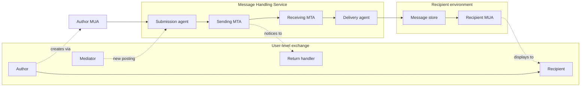
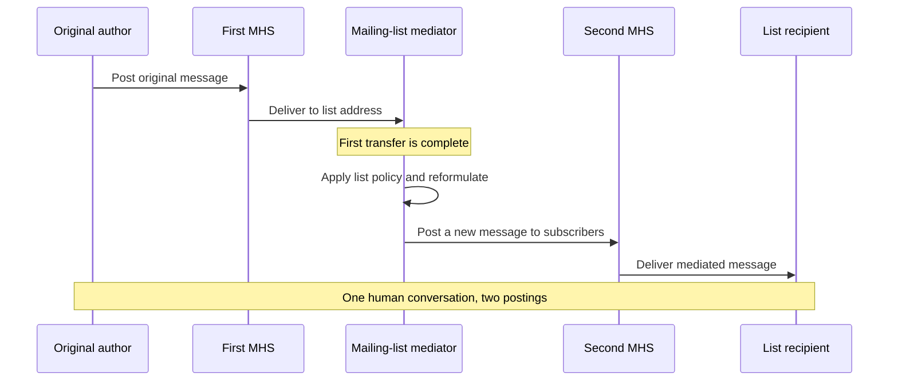
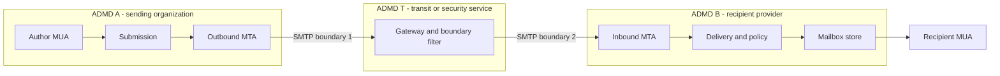
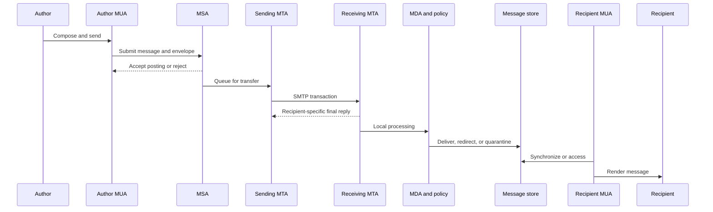
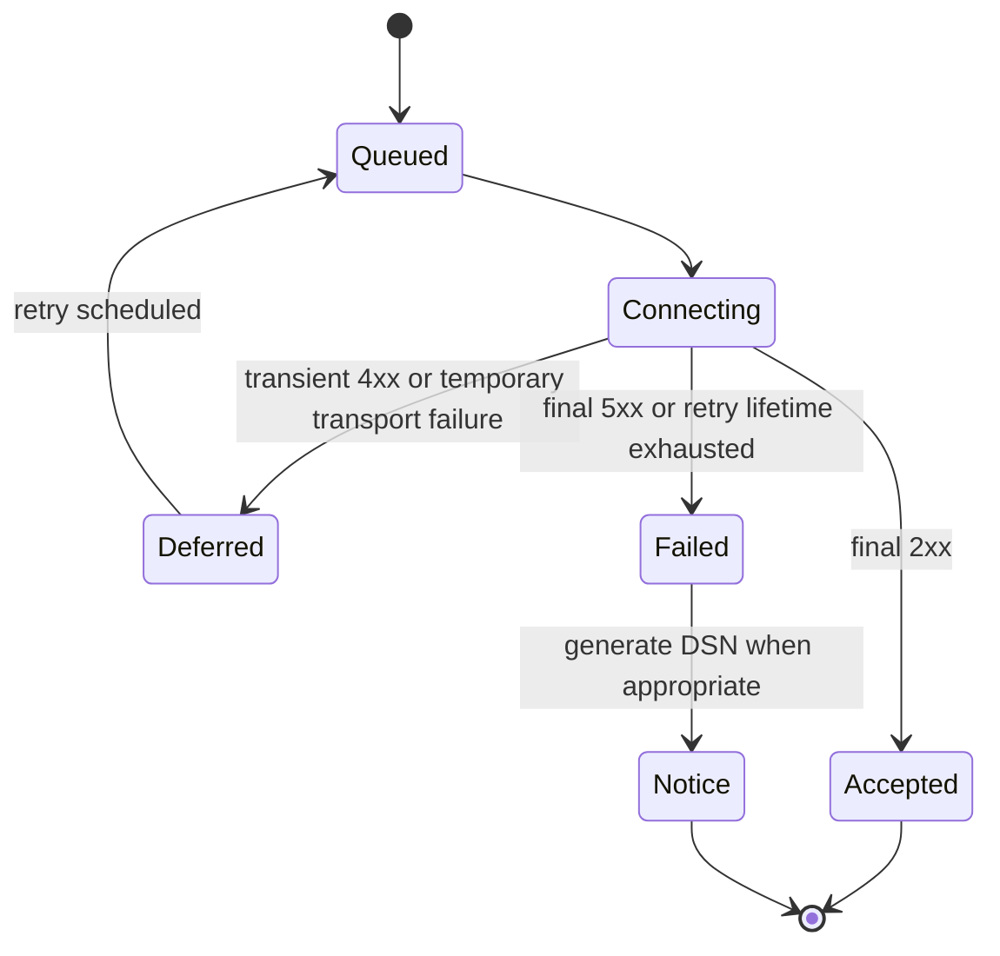
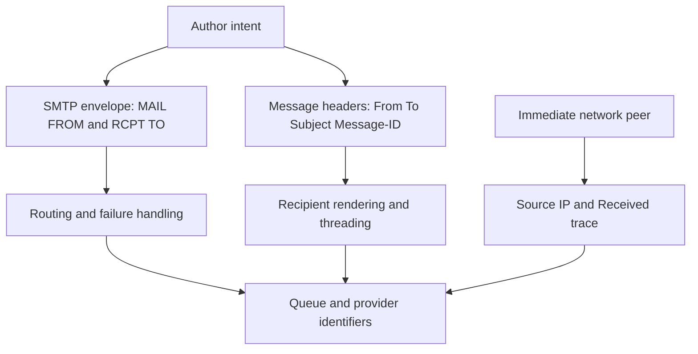
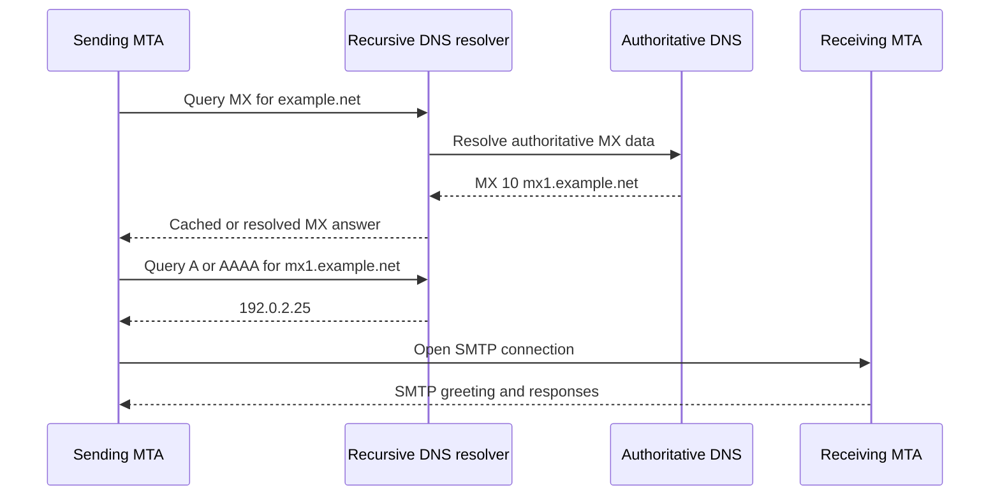
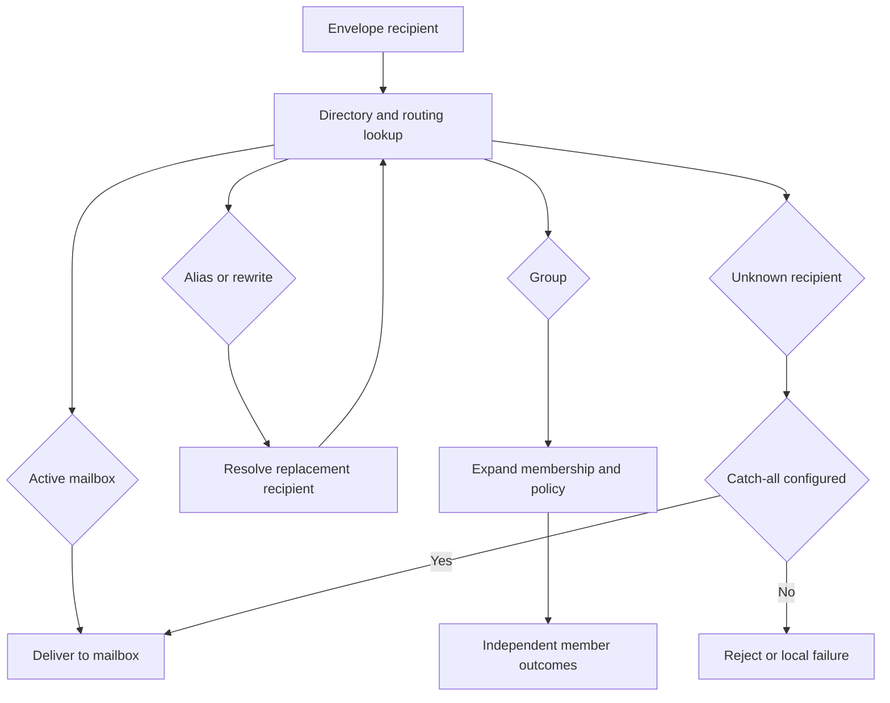
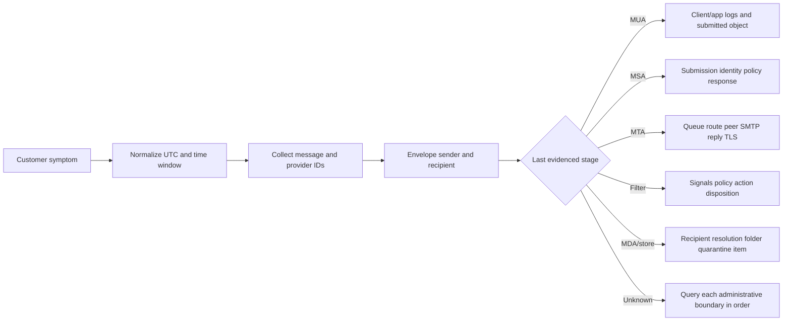
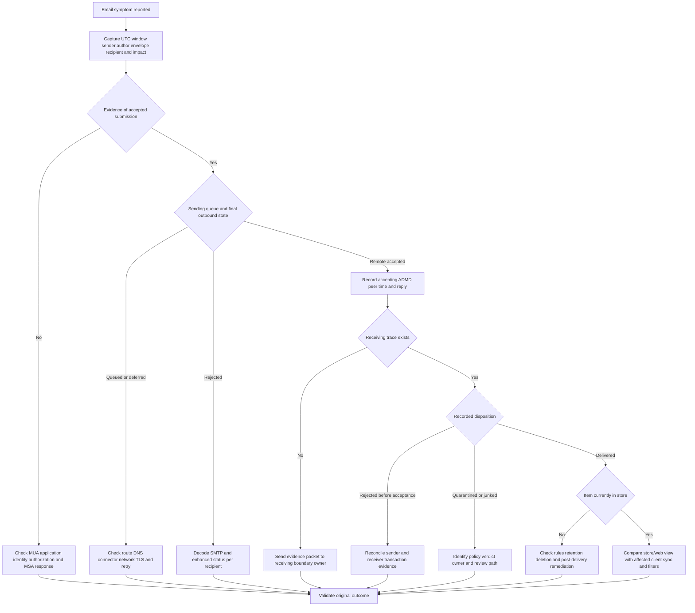

# Part 019 - Email Ecosystem Anatomy and Actors

> **Purpose:** Build a precise, beginner-first map of the people, logical roles, services, administrative domains, trust boundaries, and dependencies that move one email from an author to one or more recipients. Use that map to identify who owned each transition, which evidence can exist there, and where a support engineer should test next.
>
> **Evidence rule:** Internet-mail roles and responsibility boundaries are grounded primarily in RFC 5598, with SMTP, message-format, submission, MIME, delivery-status, and authentication-result details anchored in their respective RFC families. Microsoft 365 and Google Workspace are used only as current provider examples. Abnormal-specific deployment, telemetry, queues, processing order, case fields, and internal support procedures are unknown/private unless stated in supplied material or current public documentation.
>
> **Currency and official-source access date:** August 24, 2026.

## Section Goal

By the end of this Part, Arti should be able to draw a useful email-system map from memory and explain it without treating “the mail server” as one undifferentiated box. She should distinguish the **author** from the **originator**, the **recipient** from the **receiver**, and a **Message User Agent (MUA)** from a **Mail Submission Agent (MSA)**, **Message Transfer Agent (MTA)**, **Mail Delivery Agent (MDA)**, **message store**, gateway, mediator, boundary filter, directory, and Domain Name System (DNS) service.

She should be able to follow a message through creation, posting, submission, routing, relaying, receipt, filtering, delivery, storage, synchronization, and display. At every transition, she should ask five questions:

1. Which logical actor is acting?
2. Which administrative authority controls it?
3. What responsibility is being transferred?
4. Which identifiers and evidence are available at that point?
5. What would success at this boundary prove, and what would it not prove?

The support outcome is a disciplined localization method. Instead of saying “email failed,” Arti should be able to say, for example: “The sending MTA received a final `250` reply from the recipient domain’s boundary MTA, so responsibility crossed that SMTP boundary. Mailbox delivery and inbox placement remain unproven. We need the receiving administrative domain’s trace or quarantine evidence, correlated by time, sender, envelope recipient, and message identifier.”

The practical outcome is the **Post Office Map: Synthetic Email Actor and Evidence Lab**. It produces a topology, responsibility ledger, evidence matrix, and spoken support explanation using only reserved example domains and invented records. It sends no mail, opens no account, scans no infrastructure, and uses no customer or production data.

## JD Mapping

| Supplied role signal | Capability developed in this Part | Practical proof |
|---|---|---|
| Support email-security customers from first principles | Locates a symptom in the end-to-end mail path before interpreting a security verdict | Actor and boundary topology |
| Own configuration and integration cases | Separates a logical role from the product or host implementing it | Role-to-component worksheet |
| Investigate behavioral cases and false positives | Distinguishes message movement, security inspection, policy action, mailbox delivery, and user display | Evidence-by-stage matrix |
| Work with APIs and technical evidence | Identifies stable correlation fields and the authority that can expose them | Correlation ledger |
| Collaborate with customer and internal teams | Routes requests to the domain that owns the missing evidence or decision | Ownership handoff map |
| Explain complex concepts clearly | Uses one consistent post-office analogy while naming its limits | Five-minute spoken walkthrough |
| Build knowledge and improve deflection | Converts recurring “where is the message?” questions into a reusable decision tree | Troubleshooting tree |
| Preserve customer trust | States exactly what an SMTP response, trace entry, quarantine record, or inbox observation proves | Proof-ceiling table |

## Candidate Honesty Note

Arti can use real Microsoft enterprise-support experience to demonstrate structured scoping, cross-team escalation, evidence correlation, customer communication, safe change control, and validation. Familiarity with Microsoft cloud administration, networking, identity, logs, REST/JSON, and troubleshooting is a legitimate transfer advantage.

She must not claim that this lesson proves production operation of Abnormal, an email-security gateway, Exchange transport, Google Workspace Gmail administration, a Security Operations Center (SOC), or any named adjacent security platform. A hand-drawn topology and synthetic evidence workbook demonstrate learned architecture and method, not tenure operating a mail platform.

| Evidence label | What Arti may honestly say | What she must not imply |
|---|---|---|
| **Production-transfer example** | “In Microsoft enterprise support, I localized faults across service and ownership boundaries and built evidence-led escalations.” | That the real case involved email security if it did not |
| **Working knowledge/upskilling** | “I understand networking, DNS, identity, APIs, logs, and distributed-service troubleshooting.” | Unstated production depth in SMTP, Exchange transport, or Gmail routing |
| **Local/public lab** | “I built a synthetic actor map and responsibility ledger using reserved domains.” | That a real provider tenant or customer message was tested |
| **Learned architecture** | “RFC 5598 gives me a vendor-neutral model for email actors and administrative domains.” | That every vendor exposes components exactly as the model draws them |
| **No direct experience** | “I have not operated Abnormal or Google Workspace in production.” | A disguised claim such as “we used” or “my customers” |
| **Template only** | “This handoff and evidence matrix is a reusable preparation template.” | That it is an actual internal runbook or case form |

## Fact Labels, Scope, and Currency

Email architecture has durable standards, but provider implementation details change. This Part labels claims so a standards concept is not accidentally presented as an Abnormal, Microsoft, or Google product guarantee.

| Label | Meaning in this Part | Example |
|---|---|---|
| **Standards fact** | Behavior or terminology anchored in an RFC | RFC 5598 separates MUA, MSA, MTA, MDA, message store, user actors, and administrative domains |
| **Current provider fact** | Behavior stated in current official provider documentation | Google documents an inbound gateway as processing mail before Gmail delivery |
| **Vendor-neutral teaching model** | A useful operational abstraction, not a protocol requirement | A support evidence ledger with one row per responsibility boundary |
| **Inference to validate** | A plausible deployment hypothesis needing tenant-specific evidence | A secure email product may be inline before the mailbox provider |
| **Unknown/private** | Information not established by supplied or public sources | Abnormal’s exact internal processing order, logs, queues, and escalation fields |
| **Synthetic example** | Invented scenario using reserved names and addresses | `sender@example.com`, `mx1.example.net`, and `192.0.2.25` |

**Currency note:** RFC 5598 remains the primary common architecture vocabulary, although it is Informational rather than a protocol standard. Provider documentation can rename controls, alter prerequisites, or change behavior. Revalidate provider-specific claims before using them in a customer case. The source list at the end records the access date.

## Beginner Term Primer

| Term | Plain meaning | Why it matters | 30-second memory hook |
|---|---|---|---|
| **Email message** | A structured object containing header fields and a body | It is the thing moved and later displayed | Object, not conversation |
| **Envelope** | Transfer instructions carried by SMTP, especially sender and recipients | It controls routing and failure handling but is not necessarily visible to the user | Shipping label |
| **Header field** | A named item inside the message, such as `From`, `To`, `Date`, or `Subject` | Headers describe message content and accumulate trace evidence | Document metadata |
| **Body** | The main content and MIME body parts | It can contain text, HTML, inline resources, and attachments | What was packed |
| **Author** | The person or process responsible for message content | The visible `From` normally represents an author identity | Wrote the letter |
| **Originator** | The role that validates and posts a message into the handling service | It bridges the author environment and transfer system | Enters the postal system |
| **Recipient** | The person or process that consumes a delivered message | A recipient is a user-level role, not just a server | Intended reader |
| **Return handler** | The mailbox or process that receives delivery notices and bounces | It may differ from the visible author | Handles failed parcels |
| **Mediator** | A user-level actor that receives and reposts or reformulates a message | Mailing lists and some forwarding patterns create a new posting | Receives, changes, reposts |
| **Message Handling Service (MHS)** | The logical store-and-forward service that transfers mail | It may span many independent providers and systems | The transport network |
| **Message User Agent (MUA)** | Software acting for an author or recipient, such as a mail client | It creates, displays, replies to, and organizes messages | User’s mail application |
| **Mail Submission Agent (MSA)** | Service accepting a message from an author-side client and preparing it for transfer | Submission has different trust and policy expectations from public relay | Authenticated front counter |
| **Message Transfer Agent (MTA)** | Service that routes and relays mail toward a destination | An MTA is both an SMTP server for one hop and client for the next | Sorting and transfer hub |
| **Mail Delivery Agent (MDA)** | Service that completes delivery into a recipient environment | It marks the transfer from the MHS to recipient-controlled storage or handling | Final local delivery |
| **Message store** | Persistent storage from which a recipient accesses mail | Delivery to the store is not the same as display to the user | Mailbox room |
| **Administrative Management Domain (ADMD)** | A scope with one operational authority and policy | Trust and evidence change when mail crosses administrative boundaries | One organization’s fence |
| **Boundary MTA** | An MTA exchanging mail with another ADMD | Internet-facing acceptance commonly occurs here | Border post office |
| **Gateway** | A component translating between different mail systems or materially different semantics | It may change content, addresses, or representation | Translator at a border |
| **Boundary filter** | A component applying safety or policy analysis at an administrative boundary | It may reject, tag, quarantine, redirect, or allow mail | Security screening desk |
| **Directory** | A source of identities, groups, addresses, attributes, and sometimes routing data | Stale or missing directory data can appear as mail-flow failure | Address and role book |
| **DNS** | The distributed Domain Name System used to find mail routes and publish policy data | MX, A/AAAA, TXT, and PTR data influence routing and trust decisions | Internet signposts |
| **MX record** | DNS Mail Exchanger record naming hosts that accept mail for a domain | It points senders toward the receiving boundary | Destination post office |
| **SMTP** | Simple Mail Transfer Protocol, the command/response protocol for sending mail between agents | It exposes hop-level acceptance, temporary failure, and permanent failure | Mail transfer dialogue |
| **ESMTP** | Extended SMTP, SMTP with capabilities advertised after `EHLO` | Features such as STARTTLS and authentication are negotiated as extensions | SMTP plus advertised options |
| **Store and forward** | Persist a message, then attempt transfer to the next hop | Temporary failures can lead to queues and retries rather than immediate loss | Hold safely, retry later |
| **Posting** | Transfer of responsibility from the author side into the MHS | It is the submission-side responsibility boundary | Handed to the system |
| **Relay** | One MTA accepts and transmits the message onward | Each relay is a separate hop with its own evidence | One transfer leg |
| **Delivery** | Transfer of responsibility from the MHS into the recipient environment | In standards architecture, this is earlier than a human opening the message | Reached recipient control |
| **Mailbox** | A conceptual destination that receives mail | It need not map to one file or physical database | Logical delivery address |
| **Quarantine** | Controlled holding location for messages pending policy or review | It is a disposition state, not necessarily SMTP rejection | Held for inspection |
| **Message trace** | Provider evidence recording processing events and outcomes | It can localize a message without proving every internal action | Package tracking history |
| **Correlation identifier** | Value used to join records across stages | One provider’s message ID may differ from another stage’s ID | Tracking number with scope |
| **Trust boundary** | Point where authority, identity assumptions, or evidence ownership changes | Results copied across it may no longer be trustworthy without validation | Recheck at the fence |
| **Connector/route** | Administrative configuration that selects a mail path and often security requirements | A route can bypass MX, require TLS, or create loops | Policy-controlled road |
| **Smart host** | Designated relay to which another mail system sends outbound messages | It centralizes policy, reputation, or onward delivery | Chosen next hub |

## The Core Mental Model: Three Things Exist at Once

Every email case becomes easier when three views are kept separate:

1. **User exchange:** An author intends to communicate with a recipient.
2. **Message handling:** Software submits, transfers, filters, delivers, stores, and exposes the message.
3. **Administrative control:** Different organizations operate those functions under different policies and evidence systems.



This is a **logical architecture**. A single cloud service may implement MSA, MTA, filtering, MDA, store, and web MUA functions. Conversely, one logical role may be distributed across many services, regions, queues, and databases. The diagram tells us what responsibility exists, not how many virtual machines or microservices a provider runs.

## 🔍 Plain-English deep-dive: A Role Is Not Necessarily a Box

Imagine a small restaurant. One employee can greet customers, take orders, serve food, and handle payment. Those are four roles even if one person performs all of them. A large restaurant can split one role, such as cooking, across many people and stations. The role describes responsibility; the staffing plan describes implementation.

Email works the same way. “MTA” means the transfer role that makes routing decisions and moves a message one application-level hop. It does not mean one physical server. A provider may present one hostname while many load balancers, policy engines, queues, and regional workers implement that MTA role. An on-premises appliance might perform boundary MTA, gateway, and filter functions in one product.

The analogy stops because software roles can be repeated and nested, and evidence may be generated asynchronously. A cloud message trace can summarize several internal components without exposing each one. Therefore, a support engineer should use the role model to ask for the right **kind** of evidence, then learn how the specific platform surfaces it.

The practical rule is:

> Name the logical role first, the implementation second, and the evidence source third.

For example: “The receiving boundary MTA role is implemented by the customer’s secure email gateway; its SMTP and quarantine logs are the first evidence source.” That sentence is far more useful than “check the mail server.”

## User Actors: Who Wants the Communication?

RFC 5598 describes user actors as sources and sinks that can generate, inspect, or materially reformulate whole messages. They can be humans, organizations, or automated processes.

| User actor | Primary responsibility | Typical evidence | Common confusion |
|---|---|---|---|
| Author | Creates content and intended recipient list | Draft/sent item, client logs, application event, visible author fields | Equated with SMTP envelope sender |
| Recipient | Consumes the delivered message | Mailbox state, client view, disposition action | Equated with envelope recipient or receiving server |
| Return handler | Processes transfer success/failure notices | Delivery Status Notification (DSN), bounce mailbox, campaign event | Assumed to be the visible author |
| Mediator | Receives and reposts, aggregates, or reformulates | New trace segment, list headers, changed envelope, new signatures | Mistaken for transparent relay |

### Author and originator are related but different

The **author** is accountable for what the message says. The **originator** is the message-handling role that makes the message valid for posting and submits it into the MHS. Usually the author’s mail application and provider cooperate so closely that the distinction is invisible. It matters when an application, delegate, mailing system, workflow, or service sends on behalf of someone else.

A finance application might author an invoice notification under a business identity, while a cloud sending service originates and submits the message. A shared mailbox user might write the content, while the organization’s submission service authenticates a delegated identity and enforces policy. These are not automatically suspicious arrangements; they are different responsibilities that need different evidence.

### Recipient and receiver are related but different

The **recipient** is the intended user or process. The **receiver** is the MHS role performing final receipt and delivery or forwarding. A recipient cannot provide an SMTP transcript from the public boundary unless their provider exposes it. A receiver cannot prove that a person understood or even opened the content merely because delivery completed.

### Return handler is operationally important

Transfer failures need somewhere to go. SMTP’s reverse-path, often called the envelope sender or `MAIL FROM`, identifies where transfer notices are directed. It can be empty for a DSN to prevent bounce loops. It can also be an automated, tagged address that has no visible similarity to the header `From` address.

This explains a frequent support error: asking only for the visible sender and ignoring the return path. The author identity answers “who appears to have written this?” The return handler answers “who receives transfer-level failure information?” They may be intentionally different.

### Mediators create a new responsibility story

A mailing list, forwarding service, workflow, or gateway can receive a message and later create a new posting. The second message may retain the original author’s identity while changing recipients, content, envelope, or authentication context. From the transfer system’s perspective, these are separate postings. From the human perspective, they may feel like one continuous message.



Support implication: forwarding and mailing-list cases need two timelines, not one blended chain. Identify where the first delivery ended and the second posting began.

## Message Handling Actors: Who Moves the Message?

### Message User Agent (MUA)

An MUA acts for the user. An author-side MUA composes, addresses, and submits a message. A recipient-side MUA retrieves or accesses stored mail, renders it, lets the user reply or forward, and may apply client-side rules. Outlook desktop, a browser mail interface, a phone client, a line-of-business application, and an automated notification process can each perform MUA-like functions.

Do not assume the MUA speaks SMTP directly to the Internet. A browser can send an HTTPS request to a provider’s application tier, which then invokes submission internally. The logical function remains author-side message creation and posting even when the visible protocol is HTTPS rather than SMTP.

**Evidence:** client time, account, sent item, local error, request or operation ID, synchronization state, and the exact message as submitted where available. A sent item is useful but not universal proof of successful Internet transfer; applications can save a sent copy before or independently of downstream delivery.

### Mail Submission Agent (MSA)

The MSA accepts a message from an author-side client, applies submission policy, normalizes or adds required fields, and transfers responsibility into the handling service. Modern submission commonly requires authorization and uses a submission-specific service. RFC 6409 defines message submission separately from relay.

An MSA can reject a malformed message, unauthorized sender, prohibited recipient, excessive size, or policy violation before the public mail path begins. It may add `Date` or `Message-ID` fields, select an envelope sender, enforce sender permissions, and route the accepted message to outbound transfer.

**Evidence:** authenticated identity, authorization result, submission timestamp, client/request ID, envelope, policy result, server response, and assigned queue or message identifiers.

### Message Transfer Agent (MTA)

An MTA performs routing and store-and-forward transfer for one or more hops. It acts as an SMTP server when accepting from a previous hop and as an SMTP client when connecting to the next. It can use DNS MX records or an administratively configured route such as a smart host or connector.

An MTA adds trace information, maintains a queue, retries temporary failures, and generates a DSN when it stops trying. A pure relay should not silently rewrite the semantic content, although real products can combine transfer with gateway and filter functions.

**Evidence:** queue ID, peer IP and name, connection time, `EHLO`, TLS state, envelope sender and recipients, SMTP replies, retry schedule, route selection, and a `Received` trace field.

### Mail Delivery Agent (MDA)

The MDA completes delivery into the recipient environment. It knows enough about the destination address to place, redirect, or apply recipient-specific handling. It can cooperate with filtering and message-store systems. Standards architecture calls this transfer of responsibility **delivery**.

**Evidence:** resolved recipient, mailbox or store target, rule or policy action, delivery timestamp, folder or quarantine destination, and delivery error. Provider traces often summarize MDA-like processing without naming an MDA component.

### Message store

The message store persists mail for later access. A cloud mailbox is not one file; it is a logical store with folders, indexes, replication, retention, search, and access controls. The MUA may access it using a provider API, HTTPS, IMAP, synchronization protocol, or local mechanism.

**Evidence:** item identifier, folder, received time, retention state, deletion or movement event, synchronization watermark, and client access event. Store evidence can prove an item existed in a mailbox state; it does not automatically prove a user saw it.

### Actor comparison

| Role | Starts with | Finishes with | Main decision | Strong evidence | Does not prove |
|---|---|---|---|---|---|
| MUA | User intent or stored item | Submission request or user display/action | Create, render, organize, reply | Client/app event and item state | Next-hop transfer or human comprehension |
| MSA | Submitted message and identity | Accepted posting into MHS or rejection | Is submission valid and authorized? | Submission response, identity, policy, assigned ID | Destination acceptance |
| MTA | Queued message and route candidates | Next-hop acceptance, retry, or final failure | Where and when should it transfer? | SMTP transcript, route, queue, reply | Mailbox placement after remote acceptance |
| MDA | Message accepted for local processing | Recipient environment delivery or local failure | Where/how should this recipient receive it? | Delivery event, target, policy/rule action | User display |
| Message store | Delivered item | Persistent state exposed to clients | How is the item stored and accessed? | Item/folder/retention/sync state | Original author authenticity or safe content |

## Administrative Domains and Trust Boundaries

An **Administrative Management Domain (ADMD)** is a scope under one operational authority. It can be an enterprise, cloud mailbox provider, secure email service, sending platform, consumer provider, or another operator. The same company can operate several separately governed domains; several companies can cooperate in one customer-facing path.

The ADMD concept matters because each authority chooses its own routing, filtering, retention, logging, and trust policy. A sender cannot query arbitrary internal recipient logs. A recipient’s provider does not automatically trust authentication results inserted by an untrusted sender. A support engineer needs to know who can retrieve the next missing evidence.



At boundary 1, the sending organization may have proof that the transit service accepted responsibility. At boundary 2, the transit service may have proof that the recipient provider accepted responsibility. Neither proof alone tells us where the provider ultimately placed the message.

### Trust is scoped, not inherited forever

A result is trustworthy only when its producer and path are understood. For example, an `Authentication-Results` field is meaningful inside the trust boundary of the authentication service that produced it. An untrusted sender can type a look-alike field. Receivers therefore need rules about which instances to remove, retain, or trust.

Similarly, a connector can establish that messages arriving from a known certificate or IP belong to an agreed route. That trust does not make every message benign. It changes the evidence and policy context; content and identity abuse can still occur through an authorized source.

| Boundary question | Good support wording | Weak wording |
|---|---|---|
| Who controls this stage? | “The customer’s gateway ADMD owns the inbound SMTP and quarantine evidence.” | “The server should know.” |
| What crossed the boundary? | “The gateway returned final acceptance for this envelope recipient.” | “It delivered.” |
| Which trust was established? | “The connector validated the sending system for this route.” | “The email is trusted.” |
| What remains unknown? | “Mailbox disposition after provider acceptance is not yet evidenced.” | “It vanished.” |
| Who can answer next? | “Request recipient-provider trace correlated to UTC, envelope recipient, sender, and message ID.” | “Escalate to email.” |

## 🔍 Plain-English deep-dive: Acceptance Transfers Responsibility, Not Certainty

Use a parcel handoff analogy. When a courier scans a package at a regional depot, the previous depot now has evidence of handoff. The scan does not prove the package is in the recipient’s hands. It may still be sorted, inspected, redirected, held, returned, or delivered to a reception desk.

In SMTP, a final successful reply after message data means the accepting server has taken responsibility for that transaction according to the protocol. That is important evidence. It narrows the problem beyond the sending queue. It does **not** prove:

- delivery to a mailbox;
- placement in the inbox rather than junk or quarantine;
- survival of a later remediation action;
- synchronization to a particular client;
- display or reading by a person;
- safety, authenticity, or desirability of the message.

The analogy stops because email can branch to multiple envelope recipients, each with a different result. It can also be duplicated, redirected, transformed, or acted on after delivery. A single human-visible message may have several provider identifiers.

This yields a proof ladder:

| Observation | What it supports | What remains open |
|---|---|---|
| MUA reports submission accepted | Author-side service accepted a request | Transfer queue and destination result |
| Sending MTA has queued event | Message entered outbound transfer | Next-hop outcome |
| Remote MTA returns `4xx` | Current attempt temporarily failed | Later retry and final outcome |
| Remote MTA returns final `5xx` | That transaction/recipient was permanently rejected | Whether alternate recipient/path differs |
| Remote MTA returns final `2xx` after data | Remote SMTP system accepted responsibility | Internal filtering, delivery, store, and display |
| Provider trace says delivered | Provider recorded its defined delivery outcome | Folder, later move/remediation, client visibility |
| Quarantine record exists | A policy held the message | Reviewer action and eventual delivery/denial |
| Mailbox item exists | Item reached a mailbox state | User saw or trusted it |
| Read/display event exists | A client/user action was recorded | Human understanding or legitimacy |

## The Normal Message Journey

The simplest useful path is:

1. An author creates content in an MUA.
2. The MUA submits it to an MSA.
3. The MSA validates and posts it into the MHS.
4. A sending MTA selects a route.
5. One or more MTAs relay it across administrative boundaries.
6. A receiving MTA accepts or rejects each recipient transaction.
7. Filtering and policy evaluate the message at one or more stages.
8. An MDA delivers, redirects, or fails the local recipient.
9. A message store persists the item or a quarantine holds it.
10. A recipient MUA synchronizes or accesses and displays it.



### Responsibility transitions

| Transition | From | To | Operational meaning | First evidence to seek |
|---|---|---|---|---|
| Creation | Author intent | MUA message object | Content and addresses are formed | Draft/app event and raw submitted object |
| Posting | Author environment | MHS via MSA | Service assumes handling responsibility | Submission response and assigned ID |
| Relay hop | One MTA | Next MTA | Next system accepts, defers, or rejects | SMTP transcript and queue event |
| Delivery | MHS/MDA side | Recipient environment | Local recipient handling assumes responsibility | Delivery, rule, quarantine, or local failure event |
| Storage/access | Message store | Recipient MUA | Client obtains current item state | Store ID, sync/access event, folder state |
| Display/action | MUA | Recipient | User is shown or acts on the item | Client/display/read/report event if available |

### Store-and-forward and retry

Email is asynchronous. The author and recipient need not be online together. An MTA can persist a message when a next hop returns a temporary failure, then retry according to local policy. This is why “not received after two minutes” is not equivalent to “lost.”



The retry schedule and maximum queue lifetime are implementation or provider policy, not a universal promise from the architecture diagram. Ask the actual sending system for queue status and documented retry behavior.

## Envelope, Message, and Transport Identities

Part 020 will examine raw structure in depth. For architecture, the critical lesson is that several identities coexist and are set by different actors.

| Identity or field | Layer | Usually set/observed by | Primary purpose | Dangerous assumption |
|---|---|---|---|---|
| Visible `From` | Message header | Author/originating application | Represents author to recipient | Same as envelope sender |
| `Sender` | Message header | Originator when distinct | Identifies submitting agent/person in applicable cases | Always displayed by MUA |
| `Reply-To` | Message header | Author/application | Selects reply destination | Validates authorship |
| `To`/`Cc` | Message header | Author/application | Human-visible addressees | Complete envelope recipient list |
| SMTP `MAIL FROM` | Envelope | Originator/submission system | Return path and SPF identity context | Must equal visible `From` |
| SMTP `RCPT TO` | Envelope | Author/expansion/routing process | Actual transfer recipient | Must appear in `To` |
| `Return-Path` | Trace/delivery header | Delivery side from reverse-path | Records final envelope sender | Original visible author |
| `Message-ID` | Message header | Originator/application | Message-version correlation and threading aid | Cryptographic identity or universal provider ID |
| Provider message/queue ID | Implementation | MSA/MTA/provider stage | Internal trace correlation | Globally stable across providers |
| Source IP | Network/SMTP hop | Immediate connection | Identifies connecting interface | Original author device in every topology |



A security or support system may inspect all these layers, but it should not collapse them into one “sender.” Ask which sender identity a UI, rule, authentication result, or log field means.

## DNS: The Shared Signpost System

DNS is not itself an MTA, but email transfer depends heavily on it. A sending MTA commonly queries MX records for the recipient domain. MX targets then need address records. DNS also publishes TXT data used by SPF, DKIM, DMARC, and other mechanisms covered in later Parts. Reverse DNS maps an IP address toward a name through PTR records and can contribute to operational checks.



### DNS dependencies and ownership

| Dependency | Question answered | Owner/evidence source | Failure appearance | Proof ceiling |
|---|---|---|---|---|
| MX | Which host is preferred for domain mail? | Recipient-domain DNS authority and resolver capture | No route, wrong gateway, fallback target | Route publication, not server health |
| A/AAAA | Which IP addresses serve the host? | Host-domain DNS authority | Connection to wrong/unreachable address | Address mapping, not application acceptance |
| PTR | Which name is associated with an IP in reverse DNS? | IP-space operator | Reputation/policy concerns | Operator assertion, not authorship |
| TXT policy | Which public policy/key data is published? | Domain DNS authority | Authentication none/fail/error | Publication at lookup time, not intent of message |
| TTL/cache | How long may an answer be reused? | Authoritative record plus resolver behavior | Old and new routes observed concurrently | Cache permission, not guaranteed global convergence time |
| Delegation | Which nameservers are authoritative? | Parent and child DNS zones | Intermittent or inconsistent answers | Administrative route to data, not data correctness |

DNS troubleshooting must capture **resolver, time, queried name, record type, response code, answer, authority, and cache context**. “DNS looks fine” is not evidence. A public resolver answer now may differ from what a sending MTA’s resolver cached when it attempted delivery.

## Directories, Groups, Aliases, and Recipient Expansion

A directory can map a human or application identity to addresses, aliases, groups, roles, and routing attributes. It may participate before submission, during recipient validation, or during local delivery. Directory synchronization can create timing and ownership gaps between an identity system and a mail system.

### Common address transformations

| Mechanism | What changes | Who chooses it | Evidence needed | Typical trap |
|---|---|---|---|---|
| Alias | Envelope recipient maps to another address | Recipient/admin | Original and expanded recipient, rule, time | Searching only visible `To` |
| Distribution group | One group address expands to members | Group service/admin | Group ID, membership snapshot, moderation, delivery result per member | Assuming all members share one outcome |
| Automatic forwarding | Delivered/accepted mail is sent onward | Recipient/admin policy | Forwarding configuration, first delivery, second posting/relay | Blending original and forwarded path |
| Shared mailbox/delegation | Several identities access or send for one mailbox | Admin/owner policy | Effective permission and actor identity | Treating mailbox address as human actor |
| Catch-all | Unknown local recipients map to a designated mailbox | Domain admin | Rule scope, original envelope recipient | Assuming typo was rejected |
| Address rewrite | Header or envelope identity is transformed | Gateway/mediator policy | Before/after values and responsible rule | Reading final message as original state |



For time-sensitive cases, capture the membership or routing state **as of the message event**, not merely current state. A user added after the send does not prove they were a recipient during expansion.

## Gateways, Mediators, and Boundary Filters

These terms overlap in products but not in responsibility.

### Gateway

A gateway bridges environments with different syntax, semantics, or policy and may make substantive changes. Examples include translating an address scheme, changing message structure for another system, or applying transformations needed for compatibility. In everyday operations, “email gateway” is also used more loosely for a secure boundary service. Always ask what functions the product actually performs.

### Mediator

A mediator is a user-level actor that receives and reposts or reformulates a message. Mailing lists are the clearest example. Because it creates a new posting, it can legitimately change envelope, content, and message-level identity context.

### Boundary filter

A boundary filter applies an administrative domain’s safety or policy controls. It may evaluate connection reputation, authentication, headers, content, URLs, attachments, recipient policy, or data-loss rules. It may reject during SMTP, defer, tag, rewrite, route, quarantine, or permit onward processing.

### Secure email product placement patterns

| Pattern | Simplified path | First-hop evidence owner | Important caveat |
|---|---|---|---|
| MX-fronting gateway | Internet → security service → mailbox provider | Security service | Provider sees gateway as immediate peer unless architecture preserves external-source evidence |
| Provider-native inspection | Internet → mailbox provider/filter → mailbox | Provider | Internal stages may be summarized rather than separately exposed |
| API/post-delivery product | Provider accepts/delivers → product observes or remediates through integration | Provider plus product | SMTP acceptance can precede product action |
| Outbound smart host | Mail system → security/relay service → Internet | Sending system then smart host | SPF/DKIM and source reputation must match final sending path |
| Hybrid/on-premises route | Internet/provider ↔ on-premises gateway/server ↔ cloud mailbox | Each boundary owner | Loops, duplicate inspection, and attribution require a topology |

These are **vendor-neutral patterns**, not statements about Abnormal’s exact architecture. Determine the actual customer deployment from approved documentation, configuration, and evidence.

## 🔍 Plain-English deep-dive: A Filter Can Observe, Decide, and Act at Different Times

Think of airport security. A document check happens before entry, baggage screening happens at another point, and a later intelligence alert can cause a bag already loaded to be removed. Calling all three “security checked it” hides where evidence and authority differ.

An email-security control can likewise operate:

- **during connection**, using peer and reputation evidence;
- **during SMTP envelope processing**, using sender, recipient, and policy context;
- **after message content arrives but before final SMTP acceptance**;
- **after acceptance but before mailbox delivery**;
- **after delivery**, when new intelligence or an API-driven product triggers remediation;
- **at user interaction time**, when a URL or attachment is evaluated again.

The action vocabulary also differs. Rejecting with SMTP `5xx`, accepting and quarantining, accepting and delivering to junk, and delivering then removing are not synonyms. They produce different sender experiences, trace states, recovery options, and proof.

The analogy stops because email systems can evaluate the same message many times and branch by recipient. A message sent to ten people might be rejected for one, quarantined for two, and delivered for seven because recipient policy and licensing differ.

For support, write the event as a four-part statement:

> At **stage**, **actor** observed **evidence** and applied **action** to **scope**.

Example: “After provider acceptance, the recipient-domain policy service classified the message as suspicious and quarantined the copies for two licensed recipients.” Every noun in that sentence can be tested.

## Connectors, Routes, and Smart Hosts

Public MX lookup is only one route-selection method. Administrators can configure a connector or route that sends mail to a designated host, requires Transport Layer Security (TLS), validates a certificate, limits accepted IP ranges, or applies special treatment to partner traffic.

| Routing construct | Purpose | Evidence to collect | Common failure |
|---|---|---|---|
| Public MX route | Discover recipient boundary through DNS | MX/A/AAAA answers, resolver, connection, SMTP reply | Stale or wrong DNS, unreachable target |
| Smart host | Force outbound transfer through a chosen relay | Configured host, scope, queue route, relay response | Relay unavailable or unauthorized |
| Inbound connector/gateway trust | Identify expected upstream systems | IP/certificate criteria, TLS evidence, matched connector | Broad trust or criteria mismatch |
| Outbound connector | Select special destination/security requirements | Rule scope, route, TLS/certificate result | Wrong scope, certificate mismatch, loop |
| Split delivery | Send different recipients to different systems | Recipient routing attributes and per-system traces | Recipient routed to wrong authority |
| Dual delivery | Deliver copies to multiple systems | Branch point and independent outcomes | One success mistaken for all success |
| Centralized transport | Route cloud traffic through an on-premises control point | Full topology and every boundary trace | Hairpin loops, latency, duplicate policy |

A route configuration is a policy decision. It can override what public DNS suggests. Therefore, a DNS lookup alone cannot prove which route a specific MTA selected.

## Evidence Generated by Each Actor

A strong case requests evidence from the actor that could actually know the answer.



### Actor-to-evidence matrix

| Actor/function | Minimum useful fields | Best discriminating question | Escalation target if unavailable |
|---|---|---|---|
| Author MUA/application | UTC, account, app version, submitted raw message, request ID, local result | Did the application successfully hand the intended object to submission? | Application owner/provider |
| MSA | Authenticated identity, authorization, envelope, policy, assigned ID, response | Was posting accepted under the expected identity and policy? | Sending-platform admin |
| Sending MTA | Queue ID, route, peer, attempts, reply, TLS, final state | What did the next hop return for this recipient? | Sending mail admin/provider |
| DNS resolver | Query name/type, time, response, cache/TTL, resolver | Which route data did this sender use at attempt time? | DNS/network owner |
| Gateway/filter | Ingress ID, original peer, verdict/signals, policy, action, egress ID | Did it reject, hold, transform, or hand off the message? | Gateway/security owner |
| Receiving MTA | Peer, envelope, acceptance/rejection, trace ID | Did the recipient ADMD accept responsibility? | Recipient provider/admin |
| Directory/group service | Recipient object, membership/routing state at time, rule | Which concrete recipient targets existed then? | Identity/messaging admin |
| MDA/policy | Resolved target, local rules, disposition, error | Was it delivered, redirected, quarantined, or failed locally? | Mailbox provider/admin |
| Message store | Item ID, folder, received/move/delete state, retention | Did the item exist, and what changed after delivery? | Mailbox/data owner |
| Recipient MUA | Account, sync time, filters/views, local cache, item visibility | Is this a store-state issue or client presentation issue? | Client support owner |

### Correlation fields and limitations

| Correlation field | Strength | Limitation | Safe use |
|---|---|---|---|
| Exact UTC time window | Universal narrowing signal | Clock skew and queue delay | Use a range and record source timezone |
| Envelope recipient | Strong per-copy routing key | Can be rewritten or expanded | Record original and transformed values |
| Envelope sender | Strong transfer/failure key | Can be null or rewritten | Distinguish from visible author |
| RFC `Message-ID` | Often crosses hops | Can be missing, duplicated, or replaced; not security proof | Pair with time and participants |
| Provider/queue ID | Strong inside issuing system | Usually changes at boundaries | Build an ID translation table |
| Network peer IP | Strong for one connection | May be a gateway, not original source | Interpret with topology |
| Subject | Human-friendly hint | Mutable, non-unique, sensitive | Avoid as sole key; redact if needed |
| Header hash/content hash | Strong for exact captured form | Transformations change it; content may be sensitive | Use only with authorization and handling controls |

## Proof Ceilings: What Each Signal Does Not Establish

| Signal | Valid conclusion | Invalid leap |
|---|---|---|
| DNS MX resolves | A route is published at query time | The MTA used it or host is healthy |
| TCP connection succeeds | A transport endpoint accepted a connection | SMTP message was accepted |
| TLS succeeds | This hop negotiated the recorded TLS properties | End-to-end encryption or benign content |
| SPF passes | Connecting source was authorized for the evaluated SPF identity | Visible author is trustworthy |
| DKIM verifies | Signed data verified for a signing domain/key | Message is safe or the human author is genuine |
| DMARC passes | An aligned authenticated domain supports authorized use of the author domain | Message is non-malicious or inbox-worthy |
| SMTP final `2xx` | Receiving SMTP server accepted responsibility | Mailbox/inbox/user receipt |
| Trace says delivered | Provider recorded its defined delivery state | Message was read or not later removed |
| Message exists in inbox | It reached that current folder state | Every recipient received it or sender is safe |
| User reports “not received” | User cannot find/access it under current conditions | No system ever accepted or stored it |

This table prevents a common email-support failure: converting one positive signal into a verdict about the whole system.

## Failure Modes by Stage

| Stage | Common failure modes | Misleading observation | Cheap discriminating test | Escalate when |
|---|---|---|---|---|
| MUA/application | Offline state, wrong account, malformed content, local rule, API error | Sent item exists | Obtain submission response/request ID | Application cannot expose submitted object or request status |
| Submission | Auth failure, send-as denial, size/policy rejection, rate limit | User says “send completed” | Check MSA response and identity | Correct supported config still rejects |
| Route/DNS | Wrong MX, stale cache, bad address record, delegation fault | Public lookup is correct now | Compare attempt-time resolver evidence | Authoritative inconsistency or provider resolver issue |
| Outbound MTA | Queue backlog, connector mismatch, TLS failure, blocked egress | No bounce yet | Check queue state and last attempt | Queue/service degradation or undocumented route choice |
| Remote SMTP | Recipient invalid, policy rejection, throttling, greylisting | One recipient succeeded | Inspect per-recipient replies | Recipient provider needs message-specific trace |
| Gateway/filter | False positive, policy precedence, lost original peer, transformation, quarantine | Authentication differs downstream | Compare ingress/egress IDs and headers | Proprietary verdict or internal processing evidence needed |
| Directory/expansion | Stale group, disabled object, bad routing attribute, moderation | Group address accepted | Capture expansion and membership at event time | Sync or object defect spans systems |
| Delivery/store | Inbox rule, junk, quarantine, retention, duplicate suppression, local error | SMTP acceptance exists | Provider trace plus item/quarantine search | Internal delivery state unavailable/inconsistent |
| Client/display | Sync delay, cached view, focused/category filter, wrong mailbox, local deletion | Provider says delivered | Check web/store view versus client | Store item exists but supported clients cannot expose it |
| Post-delivery | New threat verdict, admin remediation, user rule/action | Message “disappeared” | Audit move/delete/remediation timeline | Action source or recovery path requires security/admin authority |

## Troubleshooting Decision Tree



### First response template

> I understand that `[message or message class]` from `[sender/author]` to `[affected recipient scope]` was expected by `[time and business reason]` but `[observed outcome]`. I am separating submission, transfer, security disposition, mailbox delivery, and client display so we do not treat one stage’s success as end-to-end delivery. Please provide the sanitized message identifier or provider trace ID, envelope recipient, sender/return-path if available, UTC time window, any non-delivery report, and whether another recipient or comparable message worked. Do not send credentials, tokens, full sensitive content, or unrelated mailbox data.

## Worked Example 1: Sender Shows Success, Recipient Cannot Find It

**Synthetic situation:** `alerts@example.com` sent a harmless status message to `analyst@example.net` at 14:02 UTC. The sending application shows “sent.” The analyst cannot find it.

### Step 1: State the symptom without assuming the stage

- Expected: one message available to `analyst@example.net`.
- Observed: recipient cannot locate it in the current client view.
- Unknown: accepted submission, outbound transfer, remote acceptance, provider disposition, store state, and client state.

### Step 2: Establish author-side posting

The application provides submission ID `sub-1042`. The MSA record says accepted at 14:02:08 UTC and maps it to outbound queue ID `q-7781`. This proves posting into the sending MHS, not destination delivery.

### Step 3: Establish outbound boundary result

The outbound MTA record says peer `mx1.example.net` returned `250 2.0.0 queued as rx-5519` after message data at 14:02:13 UTC for the envelope recipient. This supports transfer of responsibility to the recipient ADMD and provides an ID bridge: `q-7781` → `rx-5519`.

### Step 4: Request the evidence owned by the recipient side

The recipient provider trace for `rx-5519` says delivered to junk at 14:02:17 UTC because of a recipient policy. Mailbox evidence shows the item remains there. The root of the reported symptom is not failed Internet transfer; it is recipient-side disposition and discovery.

### Step 5: Resolve and validate

Use the authorized provider review path, explain the applicable policy, and validate the original outcome: the recipient can locate the message and future expected messages follow the intended policy. Do not broadly allowlist the sender as a shortcut; evaluate exact scope, ownership, and risk.

### Evidence ledger

| Time UTC | Actor | Input ID | Output ID | Observation | Proof | Next owner |
|---|---|---|---|---|---|---|
| 14:02:08 | MSA | `sub-1042` | `q-7781` | Posting accepted | Entered sending MHS | Sending MTA |
| 14:02:13 | Outbound MTA | `q-7781` | `rx-5519` | Recipient MTA returned final success | Recipient ADMD accepted responsibility | Recipient provider |
| 14:02:17 | MDA/policy | `rx-5519` | `item-88` | Delivered to junk | Provider disposition and mailbox item | Recipient/admin |
| 14:07:00 | Recipient MUA | `item-88` | Same | Default view hid junk | Client view explained symptom | Validate |

**Caveat:** The synthetic provider IDs are illustrative. Real platforms have different field names and retention.

## Worked Example 2: Gateway Accepted It, Provider Never Saw It

**Synthetic situation:** Public MX for `example.net` points to `secure-gw.example.net`. The sender’s MTA received a final successful reply from that gateway, but the mailbox provider has no trace.

### Competing hypotheses

1. The gateway intentionally rejected after acceptance through a quarantine or policy action.
2. The gateway queued the message but could not connect onward.
3. The gateway routed to the wrong provider or tenant.
4. The mailbox-provider search used the wrong identifiers or time.
5. The sender and recipient are discussing different copies.

### Discriminating evidence

The gateway ingress record must link the sender-side transaction to one of these outcomes: quarantine/deny, queued, egress attempt, alternate route, or handoff. A public MX lookup does not answer this; the gateway owns the next state.

The synthetic gateway record shows:

- ingress ID `gw-in-300`;
- final acceptance to the sender at 09:11:02 UTC;
- egress ID `gw-out-301`;
- repeated TLS certificate-name mismatch to configured smart host;
- message remains deferred.

The provider has no trace because no SMTP handoff occurred. The customer-facing wording is: “The edge gateway accepted responsibility and is retaining the message while onward delivery is deferred by a TLS identity mismatch. We have not found evidence of provider acceptance.”

### Safe next action

The gateway/mail administrator validates the configured hostname against the certificate and approved route. They should not disable certificate validation merely to make the queue move unless an authorized risk owner follows documented policy. After correction, confirm an egress final reply, recipient-provider trace, and original mailbox outcome.

## Worked Example 3: Ten Group Members, Three Different Outcomes

**Synthetic situation:** A message to `ops@example.net` expands to ten members. Seven receive it, two copies are quarantined, and one external member gets a bounce.

### Why one “message status” is misleading

The group is one visible address, but expansion creates independent envelope-recipient outcomes. The group service may moderate or rewrite before expansion. Recipient policies can differ by mailbox, and an external member creates another administrative boundary.

### Reasoning path

1. Confirm the group accepted the original posting.
2. Capture membership and moderation state at event time.
3. Obtain per-member expansion/delivery outcomes.
4. Separate internal provider dispositions from external SMTP transfer.
5. Correlate the bounce to the return handler and affected envelope recipient.
6. Validate only the intended scope; do not report “group delivery succeeded” based on seven successes.

| Branch | Actor path | Outcome | Evidence owner | Next action |
|---|---|---|---|---|
| Members 1–7 | Group → internal MDA/store | Delivered | Internal provider | Validate representative item |
| Members 8–9 | Group → policy/quarantine | Held | Security/mail admin | Review exact policy and authorized release path |
| Member 10 | Group → outbound MTA → external ADMD | Final rejection | Group outbound trace and external reply | Decode rejection; correct address/route or contact external owner |

**Lesson:** email can branch. Scope every conclusion by concrete envelope recipient and administrative domain.

## Support Localization Workflow

Use this workflow before interpreting sophisticated threat or authentication details:

1. **Normalize the report.** Record expected outcome, observed outcome, impact, sender/author, envelope recipient, UTC range, environment, and recent changes.
2. **Draw actual topology.** Include MUA/application, submission, outbound route, gateways, recipient boundary, filtering, directory, delivery, store, and client.
3. **Mark administrative ownership.** Put an ADMD boundary around each authority.
4. **Mark responsibility crossings.** Add the exact acceptance, deferral, rejection, delivery, or remediation event.
5. **Build an ID bridge.** Map message ID, queue IDs, provider IDs, ingress/egress IDs, and item ID.
6. **Find the last evidenced stage.** Do not skip ahead to a favored hypothesis.
7. **Request evidence from the next owner.** State the explicit question and minimum fields.
8. **Run the cheapest safe discriminator.** Compare one affected and one working sample where possible.
9. **Resolve or escalate with proof ceilings.** Separate observation, interpretation, and unknown.
10. **Validate the original customer outcome.** Technical component recovery is not enough if the message still cannot reach the intended safe state.

### Escalation packet

| Field | Example content | Quality check |
|---|---|---|
| Customer outcome | Expected status notification visible by 14:05 UTC | Measurable and user-centered |
| Scope | One sender, one recipient, one message at first | No premature broad claim |
| Topology | App → MSA → outbound MTA → gateway → provider → mailbox | Actual configured path, not generic diagram |
| Last proven boundary | Gateway accepted at 14:02:13 UTC, ID `gw-in-300` | Source and proof ceiling named |
| Missing decision | Did gateway quarantine, defer, reroute, or hand off? | One explicit question |
| Correlation | UTC, envelope pair, `Message-ID`, input/output IDs | Sufficient but minimized |
| Tests | Working recipient used same route; affected recipient differs at policy stage | Discriminating comparison |
| Safety | Content redacted; no credentials/tokens; no broad policy change | Handling boundary explicit |
| Customer update | Current evidence, action, owner, next checkpoint | No invented ETA or cause |

## Common Unsafe Shortcuts

| Shortcut | Why it fails | Better action |
|---|---|---|
| “Sender says sent, so recipient provider lost it” | Sent UI may precede or summarize submission only | Prove submission and every responsibility boundary |
| “`250` means inbox delivery” | SMTP acceptance ends only that transaction | Request receiver disposition/store evidence |
| “The `To` header is the recipient” | Envelope recipients can differ and include Bcc/expansion | Capture `RCPT TO` or provider recipient evidence |
| “The visible `From` is the sender SPF checked” | SPF evaluates an SMTP identity, not automatically header `From` | Name each identity explicitly |
| “Authentication passed, so allow it” | Authorization does not imply benign content | Keep authentication and threat verdict separate |
| “Disable TLS validation to clear the queue” | Restores flow by weakening identity protection | Correct route/certificate or use approved risk process |
| “Allowlist the whole domain” | Creates broad bypass and hides root cause | Use exact evidence and narrow supported correction |
| “Current group membership proves original recipients” | Membership can change after send | Capture event-time expansion evidence |
| “Search by subject only” | Subjects are non-unique, mutable, and sensitive | Pair IDs, UTC, envelope identities, and peer evidence |
| “No bounce means delivered” | Message may remain queued, be silently held, or use another return handler | Check queue/final trace and return-path ownership |
| “One recipient worked, so all worked” | Per-recipient policy and branch outcomes differ | Scope each envelope recipient |
| “A trace screenshot is enough” | It may omit filters, time basis, IDs, and detail | Preserve sanitized export/detail with interpretation |

## Platform Translation Without Overclaiming

### Microsoft 365 / Exchange Online

Arti’s Microsoft background is a useful bridge because Exchange terminology includes mail flow, accepted domains, connectors, transport rules, message trace, quarantine, and hybrid routing. However, she should still map product terms to logical roles. A connector is route/trust configuration, not a new universal actor. Exchange Online Protection can participate in boundary filtering and transport processing, while a cloud mailbox service also supplies delivery, store, and client-access functions.

The exact tenant configuration decides the path. Public MX may point to Microsoft, another gateway, or on-premises infrastructure. Hybrid centralized transport can add boundaries and repeated hops. Part 031 will cover this provider specifically.

### Google Workspace

Google’s current official documentation distinguishes direct Gmail delivery, inbound gateways, outbound gateways, routing, split delivery, dual delivery, and quarantine. These controls map to the same vendor-neutral questions: Which route was selected? Which system accepted responsibility? Which immediate peer did Gmail see? Which policy acted? Which recipient branch was affected?

Google documents that an inbound gateway processes mail before Gmail and that its settings can affect how Gmail determines the external source IP. That is a provider-specific behavior to verify in current documentation, not a universal gateway rule. Part 032 treats Google Workspace as learned architecture and lab comparison, not production experience.

### Abnormal boundary

The supplied role context makes email architecture essential, but this Part does not invent where Abnormal sits in every customer topology or which internal evidence it exposes. In an interview or case, Arti can say:

> “I would first identify the customer’s deployment pattern and responsibility boundaries, then map Abnormal’s documented events and identifiers onto that path. I would not assume an inline gateway model or equate a product verdict with the mailbox provider’s final disposition without evidence.”

That answer demonstrates architectural discipline and candidate honesty.

## 🔍 Plain-English deep-dive: Why “Where Is the Message?” Is Really Four Questions

When a customer asks where a message is, they may mean four different things:

1. **Transfer state:** Which agent currently has responsibility?
2. **Policy state:** What classification or rule was applied?
3. **Storage state:** In which mailbox, quarantine, queue, or deletion state does the item exist?
4. **User state:** Can the intended person find and safely act on it?

Think of a hospital referral. The referral can be transmitted successfully, accepted by the hospital, routed to a department, stored in a patient record, and still not be visible to the clinician’s current work queue. “The hospital received it” and “the clinician can act on it” are different claims.

The analogy stops because email has protocol-level automatic retries, multiple recipients, and potentially adversarial content. Still, it reveals why a single dashboard status rarely answers the customer’s whole question.

A strong support update names all four states when relevant:

> Transfer: recipient provider accepted at 14:02 UTC. Policy: provider classified the copy as spam. Storage: item is in the Junk folder and has not been deleted. User: recipient’s default view excluded Junk; they can now locate it. Prevention: the authorized mail admin is reviewing the narrow policy condition rather than broadly bypassing filtering.

## Safe Lab - Post Office Map: Synthetic Email Actor and Evidence Lab

### Lab objective

Build and explain an end-to-end mail topology for three synthetic scenarios. Correctly distinguish logical role, implementation, administrative owner, responsibility transition, identifiers, evidence, proof ceiling, and next support action.

### Safety and evidence label

- **Evidence label:** Local/public lab.
- Use only `example.com`, `example.net`, and `example.org`, which are reserved for documentation.
- Use only documentation IP ranges such as `192.0.2.0/24`, `198.51.100.0/24`, and `203.0.113.0/24`.
- Do not send email, open provider accounts, query customer domains, scan hosts, or paste real headers.
- Do not include real names, addresses, subjects, tenant identifiers, tokens, cookies, or internal hostnames.
- The lab is an architecture exercise and does not demonstrate production operation of any provider.

### Prerequisites

1. A Markdown editor or paper.
2. This Part and access to RFC 5598.
3. Optional Mermaid preview in VS Code.
4. A folder already authorized for study artifacts. Do not create another repository file for this lab unless separately requested; the worksheet can remain in personal notes.

### Synthetic scenario A: Direct provider route

```text
Author: Priya (synthetic)
Visible From: status@example.com
Envelope sender: bounce+104@example.com
Envelope recipient: analyst@example.net
Path: Web MUA -> Example sending provider -> public MX -> Example recipient provider -> mailbox
Symptom: recipient cannot find the message
Known evidence: submission accepted; remote SMTP final 250; no mailbox evidence yet
```

### Synthetic scenario B: MX-fronting gateway

```text
Author application: reports.example.com
Visible From: reports@example.com
Envelope recipient: finance@example.net
Path: Application -> outbound smart host -> secure-gw.example.net -> mailbox provider -> shared mailbox
Symptom: sender got success; provider has no trace
Known evidence: gateway accepted; onward state unknown
```

### Synthetic scenario C: group and external forwarding

```text
Visible To: ops@example.net
Envelope recipient at first hop: ops@example.net
Path: sender -> group mediator -> eight internal members plus two external members
Symptom: seven internal members received it; outcomes for three members differ
Known evidence: group accepted and expanded; per-member outcomes incomplete
```

### Step 1: Draw the logical actor map

For each scenario, include:

- author and author MUA/application;
- originator/MSA;
- each sending, transit, or receiving MTA role;
- gateway/filter and whether it is behaving as relay, gateway, mediator, or combined component;
- MDA/policy and message store;
- recipient MUA and recipient;
- directory/group service;
- DNS resolver and authoritative DNS where MX is used;
- return handler;
- ADMD boundaries.

**Expected evidence:** A reviewer can point to every arrow and ask which protocol, responsibility, and owner it represents.

### Step 2: Build the role-to-component table

Use one row per deployed component, even when one component has several roles.

| Synthetic component | Logical role(s) | ADMD owner | Input | Output | Evidence |
|---|---|---|---|---|---|
| `submit.example.com` | MSA and outbound MTA | Sending provider | Submitted object | SMTP transfer | Submission and queue IDs |
| `secure-gw.example.net` | Boundary MTA, filter, possible gateway | Recipient organization/service | SMTP transaction | Quarantine or onward SMTP | Ingress/egress IDs and action |
| `mailbox.example.net` | Receiving MTA, MDA, store | Mailbox provider | Onward SMTP | Stored item | Trace and item ID |

Add rows until every component in each scenario is covered.

### Step 3: Create a responsibility ledger

For every arrow, record:

| Time UTC | From actor | To actor | Responsibility event | Reply/state | Input ID | Output ID | Proof ceiling |
|---|---|---|---|---|---|---|---|
| 10:00:01 | MUA | MSA | Submission request | Accepted | `client-1` | `sub-1` | MSA accepted request |
| 10:00:05 | MTA | Gateway | SMTP handoff | Final `250` | `q-1` | `gw-in-1` | Gateway accepted responsibility |

Do not write “delivered” in the proof-ceiling column unless the evidence is specifically a local delivery event and you define what that provider means by delivery.

### Step 4: Mark identity layers

For each scenario, fill in:

- visible author domain;
- header recipients;
- envelope sender/return path;
- envelope recipients at each branch;
- immediate peer IP at each SMTP boundary;
- RFC `Message-ID` if present;
- provider IDs and where each ID changes.

**Expected result:** No row uses the unqualified word “sender.” It says author, envelope sender, authenticated submitter, DKIM signing domain, or immediate SMTP peer as appropriate. Authentication details themselves are covered in Parts 025–028.

### Step 5: Write one discriminating evidence request

For scenario B, write a request to the gateway owner that includes:

- UTC range;
- envelope sender and recipient;
- sender-side peer/result;
- gateway ingress ID if known;
- exact question: quarantine, local deny, queue/defer, route, or successful egress;
- request for egress peer, reply, and output ID if handed off;
- redaction reminder.

**Bad request:** “Please check why email did not arrive.”

**Expected request:** Narrow enough that the owner can answer with one evidence set and explicit outcome.

### Step 6: Run the proof-ceiling challenge

For each observation below, write one supported conclusion and two unsupported conclusions:

1. Public MX resolves.
2. Submission server returns success.
3. Gateway returns final `250`.
4. SPF passes.
5. Provider trace says delivered.
6. Item appears in Inbox.

Score one point only when the conclusion is scoped to the actor and boundary that produced it.

### Step 7: Walk the troubleshooting tree aloud

Give a five-minute explanation of scenario A without reading. It must include:

1. expected versus observed;
2. topology and ADMDs;
3. last proven boundary;
4. evidence and proof ceiling;
5. next owner and question;
6. safe validation of original outcome;
7. candidate honesty statement.

Record only your own harmless audio if desired; do not record customer material or another person without permission.

### Step 8: Add a working control

Create one comparable synthetic message that worked. Change only one dimension at a time, such as recipient, route, gateway policy, or client. Explain why the comparison discriminates between at least two hypotheses.

Example: same sender, route, and time window but different recipient policy. If the gateway handoff is identical and the dispositions diverge only at recipient policy, the comparison points away from sender-side transfer.

### Validation rubric

Score the topology, responsibility ledger, evidence request, and spoken walkthrough together. Any use of live activity or unauthorized data is an automatic fail regardless of the numeric total.

| Dimension | Fail (0 points) | Developing (1 point) | Pass (2 points) |
|---|---|---|---|
| Actor accuracy | Roles collapsed or mislabeled | Mostly correct | Every role and combined implementation explained |
| ADMD boundaries | Missing | Present | Ownership and trust effect explained |
| Responsibility | Uses vague “sent/delivered” | Some transitions named | Every hop has scoped proof ceiling |
| Correlation | Subject only | One useful ID | ID bridge plus UTC/envelope/peer |
| Evidence request | Broad | Partly scoped | Minimum, answerable, redacted, explicit question |
| Safety | Real or sensitive data | Synthetic but incomplete handling note | Reserved data, no traffic, cleanup and limits stated |
| Spoken explanation | Cannot localize | Localizes with prompts | Clear five-minute customer/interviewer explanation |
| Honesty | Implies production experience | Mentions lab | Separates transfer, learned architecture, and gaps |

Target: at least 14 of 16 points before marking the lab complete.

### Expected evidence

The lab should produce the following inspectable artifacts, all grounded in the three synthetic scenarios and suitable for review without access to a live mail system:

1. Three actor/ADMD topology diagrams.
2. Role-to-component table.
3. Responsibility ledger.
4. Identity and identifier map.
5. One gateway evidence request.
6. Proof-ceiling challenge answers.
7. Working-control analysis.
8. Scorecard and short spoken explanation notes.

### Cleanup and privacy

- Delete any accidental real identifiers immediately from the worksheet and editor history where authorized.
- Keep only synthetic artifacts in the study location.
- Remove temporary audio after reviewing it unless it contains only your own harmless practice and you intentionally retain it.
- Redact any accidentally captured secrets, personally identifiable information (PII), customer data, tenant identifiers, or internal hostnames; if reliable redaction is not possible, delete the artifact.
- Before retention or sharing, confirm that every domain and IP address is reserved documentation data and that no live mail, DNS query, account activity, or third-party infrastructure test occurred.
- Do not publish the worksheet as evidence of production platform experience.

### Lab limitations

This lab does not generate real SMTP responses, DNS caches, provider traces, queues, or quarantine actions. It proves conceptual localization and evidence design. Later Parts add safe raw-message, DNS, and authentication analysis. Production competence also requires supervised practice in the actual platform, access model, and runbooks.

## Failure-to-Escalation Triggers

Escalate or invoke the appropriate approved process when any of these conditions applies:

| Trigger | Why L1 should not continue alone | Required handoff content |
|---|---|---|
| Active malicious message or account compromise | Customer security response and containment decisions exceed generic mail-flow troubleshooting | Preserve minimal evidence, affected scope, actions already taken, explicit security ask |
| Cross-tenant or unauthorized data exposure | Privacy/security authority and evidence handling are critical | Stop broad collection; invoke approved incident/privacy path |
| Message accepted but internal state is contradictory or inaccessible | Provider/private telemetry is needed | Boundary proof, IDs, UTC, expected state, contradiction |
| Reproducible standards or documented-behavior mismatch | Possible defect | Minimal repro, control, version, raw sanitized evidence, exact expected source |
| Broad queue growth or many domains affected | Potential service/network incident | Start/last success, scale, route, errors, controls, customer impact |
| Proposed fix weakens TLS, authentication, filtering, or access control | Requires documented support and risk authority | Goal, evidence, safer alternatives, rollback and owner |
| Commercial entitlement, SLA, or roadmap question | Contract/Product authority owns the answer | Customer need and authoritative question, no promise |
| Missing customer/provider access | Another owner must obtain evidence | Exact query fields and why they discriminate |

## Official Source Anchors

All listed sources were accessed on August 24, 2026 and must be revalidated for current provider behavior. All links below were verified as reachable during preparation unless a currency note says otherwise.

### Primary standards and architecture

| Source | Why it anchors this Part | Status/currency note |
|---|---|---|
| [RFC 5598 - Internet Mail Architecture](https://www.rfc-editor.org/rfc/rfc5598) | User actors, MHS actors, MUA/MSA/MTA/MDA/store, ADMDs, identities, mediators, gateways, boundary filters | Informational, July 2009; durable conceptual model |
| [RFC 5321 - Simple Mail Transfer Protocol](https://www.rfc-editor.org/rfc/rfc5321) | SMTP envelope, relay, replies, responsibility, trace, store-and-forward | Core SMTP specification, October 2008 |
| [RFC 5322 - Internet Message Format](https://www.rfc-editor.org/rfc/rfc5322) | Message object, headers, body, author and destination fields | Internet message format, October 2008 |
| [RFC 6409 - Message Submission for Mail](https://www.rfc-editor.org/rfc/rfc6409) | Separates submission from relay and defines submission responsibilities | Standards Track, November 2011; obsoletes RFC 4409 |
| [RFC 2045 - MIME Part One](https://www.rfc-editor.org/rfc/rfc2045) and [RFC 2046 - MIME Part Two](https://www.rfc-editor.org/rfc/rfc2046) | Message body structure, encodings, and media types | MIME foundations; detailed in Part 022 |
| [RFC 3461 - SMTP DSN Extension](https://www.rfc-editor.org/rfc/rfc3461) and [RFC 3464 - DSN Message Format](https://www.rfc-editor.org/rfc/rfc3464) | Transfer-status requests, envelope identifiers, and delivery notices | Detailed in Part 033 |
| [RFC 8601 - Authentication-Results](https://www.rfc-editor.org/rfc/rfc8601) | Trust-scoped recording of authentication results | Results require a defined trust boundary; detailed later |

### Current provider examples

| Source | Current provider fact used | Boundary |
|---|---|---|
| [Microsoft Learn - Manage mail flow with mailboxes in multiple locations](https://learn.microsoft.com/en-us/exchange/mail-flow-best-practices/manage-mail-flow-for-multiple-locations) | Current Microsoft documentation illustrates MX, connector, hybrid, centralized transport, and on-premises route patterns | Provider implementation guidance, not an Internet-wide rule; updated August 3, 2026 in fetched metadata |
| [Microsoft Learn - Exchange Server hybrid deployments](https://learn.microsoft.com/en-us/exchange/exchange-hybrid) | Hybrid can provide secure routing, shared namespace, and centralized inbound/outbound mail flow | Product-specific architecture; detailed in Part 031 |
| [Google Workspace - Email routing and delivery options](https://knowledge.workspace.google.com/admin/gmail/advanced/email-routing-and-delivery-options-for-google-workspace) | Google documents direct, split, dual, gateway, SMTP relay, and compliance-routing choices | Google-specific controls; page updated August 21, 2026 |
| [Google Workspace - Set up an inbound mail gateway](https://knowledge.workspace.google.com/admin/gmail/advanced/set-up-an-inbound-mail-gateway) | Inbound gateway processes mail before Gmail; source-IP determination and DMARC handling have provider-specific behavior | Must not be generalized to other providers; page updated August 21, 2026 |
| [Google Workspace - Add an outbound gateway](https://knowledge.workspace.google.com/admin/gmail/advanced/add-an-outbound-gateway-for-outgoing-email) | Outbound gateway can process mail before external delivery and affects authentication planning | Current configuration can change; page updated August 21, 2026 |

### What these sources do not establish

- They do not publish Abnormal’s private processing architecture, algorithms, logs, queues, support tiers, or case procedure.
- RFC 5598 is a logical architecture and does not require vendors to expose one product or process per role.
- Provider pages describe supported configuration patterns, not the actual topology of a particular tenant.
- A standards-compliant acceptance event does not determine a provider’s later threat verdict or inbox placement.
- The source access date is not a promise that every page remains unchanged after August 24, 2026.

## ⭐ Likely Interview Questions

### Q1. Walk me through what happens when a user sends an email.

**Model answer:** I separate the user, handling, and administrative views. The author creates a structured message in an MUA or application, which submits it to an MSA. The MSA validates identity, authorization, format, and policy, then posts it into the message-handling service. A sending MTA selects a DNS MX or configured connector route and transfers it by SMTP through zero or more MTAs. The recipient boundary can filter before or after acceptance. An MDA then delivers, redirects, quarantines, or fails the local recipient, and a message store exposes the item to the recipient MUA. At every hop I record the owner, envelope, IDs, response, disposition, and proof ceiling. A final SMTP success proves that hop accepted responsibility, not that the user saw the message.

### Q2. What is the difference between an MSA, MTA, and MDA?

**Model answer:** An MSA accepts an author-side submission and enforces posting rules such as authentication and sender authorization. An MTA routes and relays a queued message one application-level hop at a time, acting as an SMTP server to the previous hop and client to the next. An MDA completes delivery into the recipient environment, where recipient-specific routing or policy can apply. One product can implement all three roles, so I name the logical responsibility before the product component.

### Q3. Why is the visible From address not enough to identify the sender?

**Model answer:** “Sender” is overloaded. The header `From` represents the apparent author, while SMTP `MAIL FROM` is the reverse-path identity used for transfer failures and SPF context. The authenticated submitter, DKIM signing domain, immediate peer IP, `Sender` header, and `Reply-To` can all differ legitimately. I name the exact identity and layer rather than making one field carry every meaning.

### Q4. A sender has a `250` response, but the recipient has no message. What do you do?

**Model answer:** I verify where and when the final `250` occurred, for which envelope recipient, and which system returned it. That response supports transfer of responsibility to that SMTP system. I then build an ID bridge and request the accepting administrative domain’s trace: local policy, quarantine, onward queue, delivery, rules, store movement, or post-delivery remediation. I also compare one working sample and check the recipient’s store view versus client view. I do not call it inbox delivery based on the SMTP response.

### Q5. What is an ADMD, and why does it matter in support?

**Model answer:** An Administrative Management Domain is a scope under one operational authority and policy. It matters because routing, trust, filtering, retention, and evidence ownership can change at each boundary. A sender may prove handoff to a gateway but cannot see the gateway’s private queue; a mailbox provider may see only the gateway as its immediate peer. I mark every ADMD on the topology so the next evidence request goes to the owner that can answer it.

### Q6. How do gateways, relays, filters, and mediators differ?

**Model answer:** A relay is the MTA function that routes and transfers without materially reformulating message semantics. A gateway bridges systems or policies and may make substantive transformations. A boundary filter evaluates safety or policy and may reject, defer, tag, route, quarantine, or allow. A mediator receives and reposts a message as a user-level actor; a mailing list is the classic example. Real products combine functions, so I classify the action performed in the specific path instead of relying on the product label.

### Q7. How would you troubleshoot a missing email without access to every system?

**Model answer:** I normalize UTC, sender identities, envelope recipient, impact, and one message identifier; draw the actual route and ADMDs; and find the last evidenced responsibility boundary. I collect the relevant queue/provider IDs and exact response, then send the next owner a narrow request containing the correlation fields, proof so far, and one explicit question. I maintain customer continuity while that owner investigates. Lack of access changes who retrieves evidence, not the logic of localization.

### Q8. How does your background prepare you for this if you have not operated Abnormal?

**Model answer:** My Microsoft enterprise-support background transfers strongly in distributed-service scoping, networking and identity fundamentals, evidence correlation, critical communication, Engineering collaboration, safe changes, validation, and knowledge capture. I have built this email architecture from current standards and provider documentation and practiced it in a synthetic lab. I would be explicit that Abnormal’s exact deployment, telemetry, and internal process are learning areas, then map its documented evidence onto the same actor-and-boundary model during ramp.

## 🧠 30-Second Memory Hooks

- **Author writes; originator posts.**
- **Recipient consumes; receiver delivers.**
- **MUA is for the user; MSA accepts submission; MTA relays; MDA delivers.**
- **Role first, product second, evidence third.**
- **Envelope routes; headers describe; body carries content.**
- **One human message can create several transfer copies.**
- **ADMD boundary means policy, trust, and evidence owner may change.**
- **Final SMTP success transfers responsibility, not certainty.**
- **Delivery is not inbox placement; inbox placement is not reading.**
- **Find the last proven stage, then ask the next owner one answerable question.**
- **Use UTC + envelope pair + scoped IDs; never subject alone.**
- **Authentication, transport, disposition, storage, and user visibility are separate claims.**

## Completion Checklist

### Knowledge

- [ ] I can define author, originator, recipient, return handler, mediator, MHS, MUA, MSA, MTA, MDA, message store, ADMD, gateway, boundary filter, directory, connector, and smart host without notes.
- [ ] I can explain posting, relay, delivery, storage, display, and post-delivery action as different transitions.
- [ ] I can distinguish header author, envelope sender, envelope recipient, authenticated submitter, immediate peer, and provider identifier.
- [ ] I can state what a final SMTP `2xx` proves and at least four things it does not prove.
- [ ] I can explain why one logical role may span many services and one product may perform many roles.

### Lab and artifact

- [ ] I completed all three synthetic actor/ADMD maps.
- [ ] My responsibility ledger has an evidence source and proof ceiling for every boundary.
- [ ] My identifier map records where IDs change.
- [ ] My gateway evidence request is narrow, answerable, and safely redacted.
- [ ] I scored at least 14/16 without using real data or sending traffic.

### Spoken explanation

- [ ] I can walk from author to recipient in five minutes.
- [ ] I can explain a gateway-accepted/provider-not-seen case in two minutes.
- [ ] I can answer all eight interview questions aloud in my own words.
- [ ] I avoid the unqualified terms “sender,” “server,” “sent,” and “delivered” when a more precise term exists.

### Honesty and safety

- [ ] I label Microsoft experience as production transfer, the topology as learned architecture, and the exercise as a local/public lab.
- [ ] I explicitly state that I have not operated Abnormal or Google Workspace in production.
- [ ] I do not imply that RFC roles reveal a provider’s private implementation.
- [ ] I request minimum evidence and exclude credentials, secrets, customer content, and unrelated identifiers.

### Source and currency

- [ ] I can name RFC 5598 as the architecture anchor and distinguish its Informational status from protocol standards.
- [ ] I verified provider-specific claims against current official documentation.
- [ ] I can separate a standards fact, provider fact, teaching model, inference, and unknown/private detail.
- [ ] I recorded the August 24, 2026 access date and will revalidate time-sensitive provider behavior.

[Next: Part 020 - RFC Style Message Structure Envelope and Headers](Part-020-rfc-style-message-structure-envelope-and-headers.md)