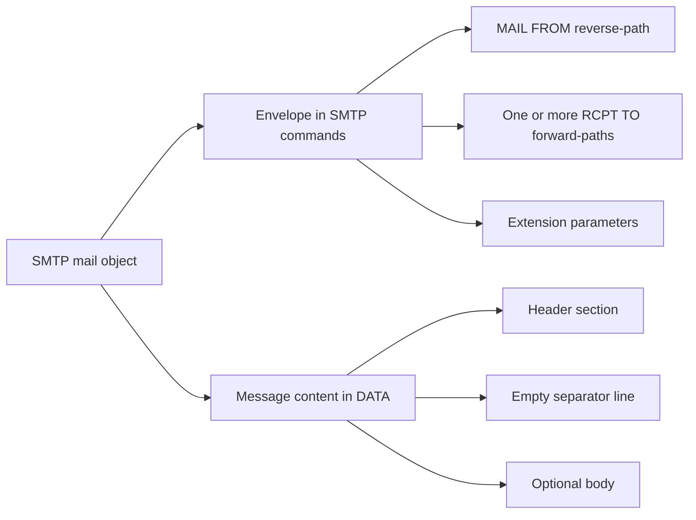
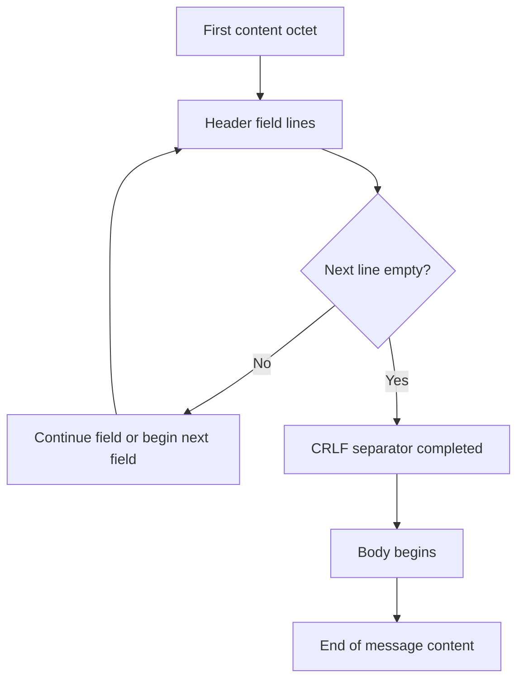
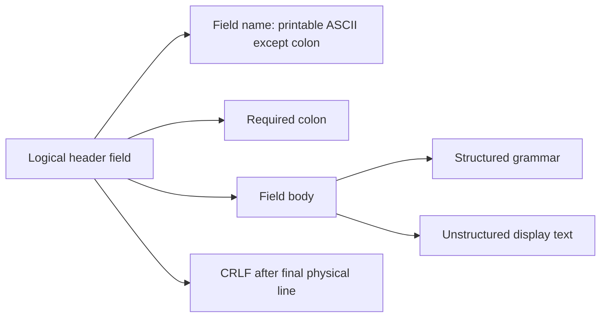
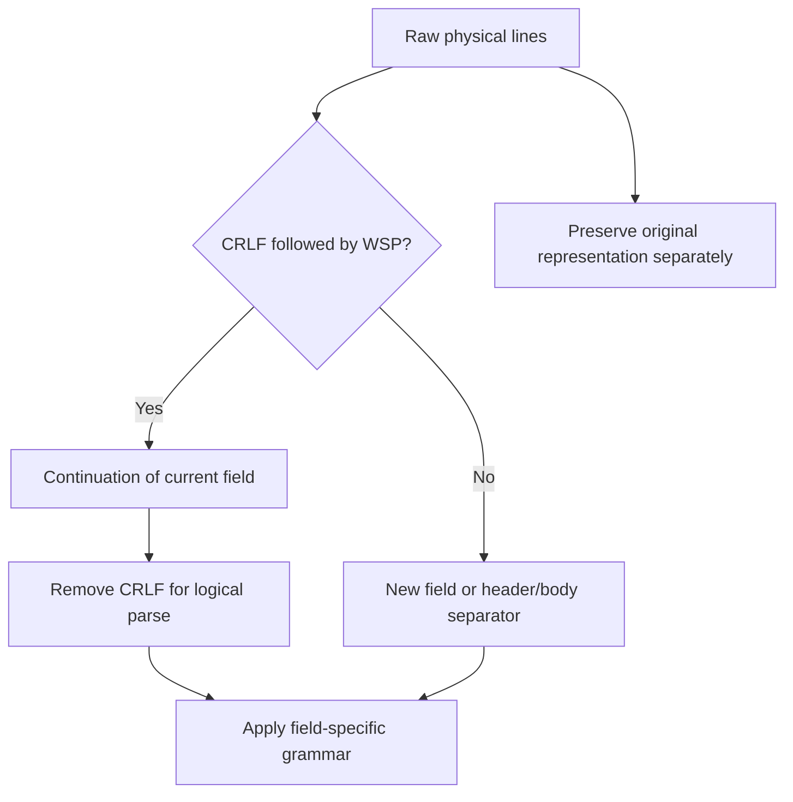
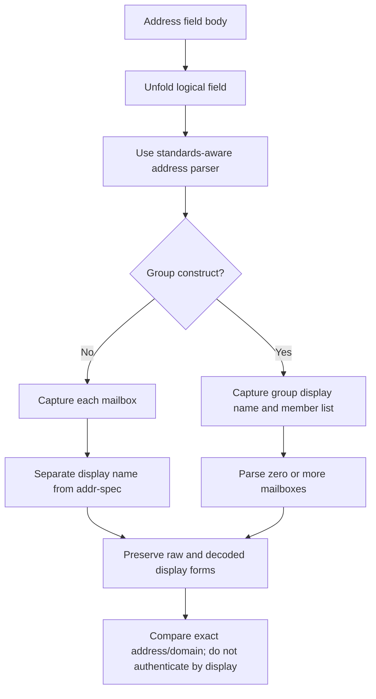
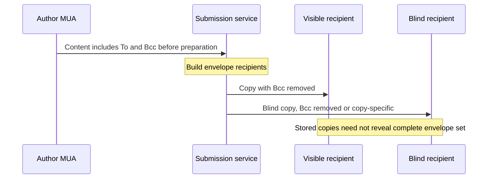
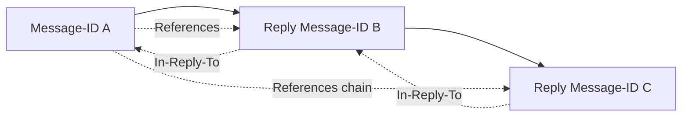
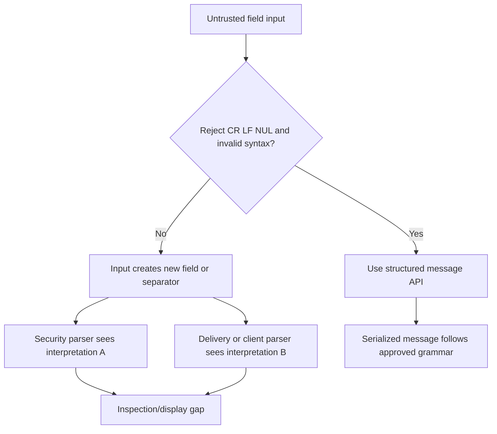
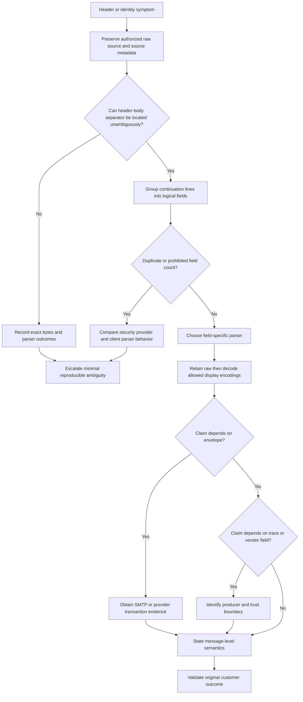

# Part 020 - RFC Style Message Structure Envelope and Headers

> **Purpose:** Teach the exact boundary between the SMTP transport envelope and the Internet Message Format content object, then build a safe, repeatable method for reading raw header fields, unfolding lines, parsing addresses, classifying evidence, and refusing conclusions that the captured artifact cannot support.
>
> **Evidence rule:** SMTP envelope behavior is grounded in RFC 5321 and message-content syntax in RFC 5322 as updated by RFC 6854 and extended by the MIME and internationalized-email families. A stored raw message may preserve trace evidence derived from an earlier envelope, but it is not the live SMTP transaction. Provider-added fields are interpreted only inside a known provider/trust context. Abnormal-specific fields, parsing, display, and processing are unknown/private unless established by supplied or current public material.
>
> **Currency and official-source access date:** August 24, 2026.

## Section Goal

By the end of this Part, you should be able to look at a synthetic SMTP transcript and a synthetic raw message and explain which facts belong to each artifact. You should recognize that an email **mail object** has two conceptual parts during transfer: an SMTP envelope carried through commands and message content carried as data. The content itself has a header section, one empty separator line, and an optional body.

You should be able to:

1. distinguish `MAIL FROM` from header `From`;
2. distinguish `RCPT TO` from header `To`, `Cc`, and `Bcc`;
3. explain why Bcc delivery can leave no Bcc address in a recipient’s copy;
4. parse a field name, colon, field body, and line ending;
5. unfold a continued field without treating each physical line as a new field;
6. distinguish structured from unstructured field bodies;
7. identify display names, mailbox addresses, groups, quoted strings, comments, and message identifiers;
8. classify `Received` and `Return-Path` as trace fields with scoped evidentiary value;
9. recognize MIME fields as descriptions of content, not transport-envelope commands;
10. preserve raw bytes or a lossless export before decoding, normalizing, or rewrapping evidence.

The support outcome is a statement such as: “The stored copy has header `From: Finance Updates <notices@example.com>` and `To: Team <team@example.net>`. Those fields express message-level author and visible destination semantics. The provider trace separately records envelope recipient `alex@example.net`, and `Return-Path` records the reverse-path placed at final delivery. The original `RCPT TO` set cannot be reconstructed completely from `To` and `Cc`.”

The practical outcome is the **Envelope Glass Box: Raw Message and SMTP Evidence Lab**. It uses only invented transcripts and reserved example domains. No email is sent, no live account is created, and no real header is uploaded.

## JD Mapping

| Supplied role signal | Capability developed here | Practical proof |
|---|---|---|
| Troubleshoot email behavior and false positives | Reads exact evidence instead of relying on rendered UI labels | Annotated raw message |
| Support configuration and routing cases | Separates visible fields from envelope routing recipients | Envelope/content comparison |
| Investigate threat reports | Identifies display-name deception, reply-path differences, duplicated fields, and trace limits | Security observation sheet |
| Work with APIs and structured data | Treats headers as a grammar rather than ad hoc text | Parse tree and normalization ledger |
| Escalate actionable evidence | Preserves original representation and records transformations | Evidence-handling manifest |
| Communicate with non-specialists | Explains the letter-versus-shipping-label analogy and its limits | Three-minute spoken explanation |
| Build support knowledge | Produces a deterministic field-classification checklist | Header triage decision tree |
| Maintain candidate honesty | Labels synthetic parsing skill separately from production platform administration | Evidence-label statement |

## Candidate Honesty Note

Your prior support experience supports careful evidence collection, time normalization, structured troubleshooting, privacy-aware handling, and precise customer communication. Your networking, identity, REST/JSON, and diagnostic background makes protocol-versus-object separation a natural transfer skill.

This file does not establish that you have administered Exchange transport, Google Workspace routing, Abnormal parsing, or a production secure-email gateway. The raw messages and SMTP exchanges are synthetic. You can accurately say you have studied the standards and can annotate evidence from first principles; you should not say you have diagnosed a named email-security product in production unless your CV supports that claim.

| Evidence label | Honest statement | Boundary |
|---|---|---|
| **Production-transfer example** | “I have handled complex prior evidence and cross-team cases where exact field meaning and timestamps mattered.” | Do not recast a non-email case as direct mail-flow work |
| **Working knowledge/upskilling** | “I understand protocol transactions, structured text, encodings, and identity layers.” | Do not imply mail-platform ownership |
| **Local/public lab** | “I annotated paired synthetic SMTP and raw-message artifacts.” | No real tenant, message, or provider result |
| **Learned architecture** | “I use RFC 5321 for transport and RFC 5322 for content.” | Standards model is not a vendor’s private parser |
| **No direct experience** | “I have not operated Abnormal or Google Workspace in production.” | Say directly when asked |
| **Template only** | “The annotation and escalation sheets are practice templates.” | They are not vendor runbooks |

## Fact Labels and Source Ceiling

| Label | Meaning | Example |
|---|---|---|
| **Standards fact** | Normative or explanatory behavior in a cited RFC | RFC 5322 content is a header section, an empty line, and optional body |
| **Standards update** | Later RFC changes part of an earlier specification | RFC 6854 permits limited group syntax in `From` and `Sender` |
| **Vendor-neutral teaching model** | Support workflow created for this guide | Four-column raw, parsed, interpreted, confidence annotation |
| **Provider fact** | Named provider behavior verified in current official material | No provider-specific fact is required to understand this Part |
| **Inference to validate** | Plausible explanation needing original transaction or provider evidence | A missing Bcc header may indicate ordinary blind-copy handling |
| **Unknown/private** | Internal implementation not established publicly | Exact Abnormal normalization, parser tolerance, and UI labels |
| **Synthetic example** | Invented data using reserved domains and documentation IPs | `MAIL FROM:<bounce@example.com>` |

## Beginner Term Primer

| Term | Plain meaning | Why it matters | Memory hook |
|---|---|---|---|
| **Mail object** | During SMTP transfer, the envelope plus message content | Prevents collapsing routing data into the stored message | Label plus contents |
| **SMTP envelope** | Originator, recipients, and extension parameters transmitted through SMTP commands | It controls transfer and can differ from visible fields | Shipping label |
| **Reverse-path** | Address in `MAIL FROM`, or null path, used for transport failure handling | It is not necessarily the author | Bounce destination |
| **Forward-path** | Address in each `RCPT TO` command | It identifies one transfer recipient | Actual delivery instruction |
| **Message content** | Header section plus optional body sent in SMTP data | It is the object commonly stored and exported | Letter inside |
| **Header section** | Sequence of header fields at the start of content | It carries message semantics and accumulated trace | Metadata block |
| **Header field** | Field name, colon, field body, and line ending | Each field has its own grammar and meaning | Name: value |
| **Field name** | ASCII label before the colon, such as `Subject` | It chooses the field’s parser/semantics | Which rule applies? |
| **Field body** | Content after the colon and before the logical field ends | Can be structured or unstructured | The governed value |
| **Body** | Content after the first empty separator line | May be plain text or MIME structure | Message payload |
| **CRLF** | Carriage return followed by line feed | Standard Internet-mail line ending | Two-byte line break |
| **Physical line** | One stored line ending at CRLF | A folded field can span several physical lines | What the file shows |
| **Logical field** | One complete header field after continuation lines are unfolded | Parsing physical lines independently creates false fields | What the parser sees |
| **Folding** | Splitting a field body across lines using CRLF followed by whitespace where grammar allows | Supports line limits and readability | Wrap with continuation whitespace |
| **Unfolding** | Removing CRLF when immediately followed by space or tab | Must precede semantic parsing | Join the continued line |
| **Whitespace (WSP)** | Space or horizontal tab | It separates or folds tokens in defined places | Space or tab |
| **Folding whitespace (FWS)** | Whitespace construct that can include a permitted fold | Not every space is a legal folding point | Grammar-approved wrap |
| **Comment** | Parenthesized informational text allowed in some structured locations | Usually semantically ignored but can complicate display | Human note, not identity |
| **Atom** | Run of permitted characters treated as one token | Basic building block in structured fields | Unquoted token |
| **Dot-atom** | Atoms separated by periods under strict rules | Common shape of local parts and domains | Token.token |
| **Quoted string** | Text in double quotes with escaping rules | Allows otherwise special characters in some locations | Quotes change parsing |
| **Quoted pair** | Backslash plus a character interpreted as that character | Escapes delimiters in allowed contexts | Backslash makes literal |
| **Structured field** | Field body governed by token grammar, such as an address or date | Must be parsed, not split casually | Grammar matters |
| **Unstructured field** | Field body treated mainly as display text after unfolding | Subject text is not an address list | Text, not token list |
| **Mailbox** | Optional display name plus an address, or address alone | Separates what is displayed from the routing-style identifier | Name plus addr-spec |
| **Display name** | Human-readable phrase associated with a mailbox | It can be misleading and is not the domain identity | Friendly label only |
| **Addr-spec** | `local-part@domain` address form | The actual address inside a mailbox construct | Left at right |
| **Local-part** | Domain-controlled portion left of `@` | Intermediate systems should not invent its semantics | Local owner decides |
| **Domain** | Right side of an address, interpreted in DNS/mail context | Used for routing and authentication relationships | Administrative side |
| **Group syntax** | Display name, colon, zero or more mailboxes, semicolon | Can represent named recipient sets or a deliberately non-replyable originator in limited use | `Group: ...;` |
| **Trace field** | Transport-added `Received` or delivery-added `Return-Path` information | Provides path clues but needs trust and topology | Evidence added in transit |
| **Optional field** | Field not defined by RFC 5322 but valid under generic syntax | `X-` and vendor fields need their own authoritative definition | Syntax does not define semantics |
| **MIME** | Multipurpose Internet Mail Extensions | Adds typed, encoded, multipart content semantics | Structure inside body |
| **Encoded-word** | RFC 2047 ASCII representation of non-ASCII display text in allowed header locations | Raw and displayed text can look very different | `=?charset?Q/B?...?=` |
| **SMTPUTF8** | SMTP extension supporting internationalized envelope/header scenarios | Raw UTF-8 headers require compatible transport context | Unicode mail path |
| **Obsolete syntax** | Old forms parsers should understand but generators should not create | Real evidence can be legal-to-parse but bad-to-generate | Parse, do not produce |
| **Header injection** | Untrusted CR/LF changes one field into extra fields or message structure | A data-validation and security boundary | Newline can become syntax |
| **Raw source** | Closest available serialized message representation | UI rendering may decode, hide, reorder, or summarize evidence | Preserve before interpreting |

## The Governing Split: Transport Versus Content

RFC 5321 describes SMTP transport. Its mail object contains an envelope and content. The envelope is sent as SMTP protocol units: one reverse-path, one or more forward-paths, and optional extension parameters. The content is sent after the server accepts `DATA` or an extension-defined alternative.

RFC 5322 describes the format of the content. It explicitly does not specify envelope information. The content begins with a header section and may have a body separated by an empty line.



### Side-by-side model

| Question | SMTP envelope | RFC-style message content |
|---|---|---|
| Where is it represented? | SMTP `MAIL`, `RCPT`, and extension parameters | Data transferred after `DATA`, commonly stored/exported |
| Main standard | RFC 5321 | RFC 5322 plus updates/extensions |
| Sender-like value | Reverse-path in `MAIL FROM` | `From`, sometimes `Sender`, `Reply-To` |
| Recipient-like value | Each `RCPT TO` forward-path | `To`, `Cc`, possibly `Bcc` before copy preparation |
| Primary purpose | Transfer, routing, failure handling | Author/destination semantics, display, threading, content description |
| Can it branch per recipient? | Yes | Copies can have different visible fields or trace additions |
| Is it necessarily in a stored raw message? | No | Yes, as the stored content representation |
| Can later trace preserve part of it? | `Return-Path` and some provider fields may record selected facts | Trace fields are part of final stored content |

## 🔍 Plain-English deep-dive: The Shipping Label Is Not the Letterhead

The common analogy is a physical letter. The outside envelope has a delivery address and return address. The letter inside can have a different letterhead, greeting, and signature. A personal assistant could mail a letter written by an executive. A billing service could use a special returns department on the outer envelope. A courier can copy routing stamps onto the package during transit.

That explains why:

- SMTP `MAIL FROM` can differ from header `From`;
- `RCPT TO` can include a Bcc recipient absent from `To` and `Cc`;
- a group address can appear in `To` while member addresses exist only in expanded envelopes;
- `Return-Path` can record the final reverse-path without becoming the author;
- `Received` fields can be added above the author’s original fields.

The analogy stops in several places. Email copies can branch and be modified independently. The transport envelope is not a permanent paper wrapper stored with every copy. Some delivery systems materialize selected envelope facts into trace fields, while others expose them only in provider logs. Authentication and policy systems can evaluate several identities at once. Therefore, do not “open” a raw message and assume the original envelope is hiding somewhere in it.

The precise support rule is:

> Treat envelope evidence as envelope evidence, content fields as content fields, and trace-derived copies as scoped historical assertions.

## A Paired Synthetic Example

The next two artifacts describe one synthetic transfer. They are deliberately separate.

### Artifact A: SMTP transaction evidence

```text
S: 220 mx1.example.net ESMTP ready
C: EHLO relay.example.com
S: 250-mx1.example.net
S: 250 SIZE 52428800
C: MAIL FROM:<bounce+case-204@example.com>
S: 250 2.1.0 Sender accepted
C: RCPT TO:<alex@example.net>
S: 250 2.1.5 Recipient accepted
C: RCPT TO:<audit@example.org>
S: 250 2.1.5 Recipient accepted
C: DATA
S: 354 Start mail input
C: [message content shown below]
C: .
S: 250 2.0.0 Queued as RX-8842
```

### Artifact B: one delivered message copy

```text
Return-Path: <bounce+case-204@example.com>
Received: from relay.example.com (relay.example.com [192.0.2.44])
        by mx1.example.net with ESMTP id RX-8842
        for <alex@example.net>; Mon, 24 Aug 2026 10:15:09 +0000
From: Finance Updates <notices@example.com>
Sender: Automation Service <submitter@example.com>
Reply-To: Help Desk <help@example.com>
To: Operations Team <team@example.net>
Date: Mon, 24 Aug 2026 10:15:02 +0000
Message-ID: <case-204.20260824@example.com>
Subject: Daily status for the operations team
MIME-Version: 1.0
Content-Type: text/plain; charset=utf-8
Content-Transfer-Encoding: 7bit

This is harmless synthetic status text.
```

### Annotation

| Observation | Artifact | Correct interpretation | Incorrect conclusion |
|---|---|---|---|
| `MAIL FROM:<bounce+case-204@example.com>` | SMTP | Reverse-path used for this transaction | Visible author was `bounce+case-204` |
| Two accepted `RCPT TO` commands | SMTP | Two envelope recipients accepted before data | Both recipients got identical stored copies |
| `To: Operations Team <team@example.net>` | Message | Visible destination semantics | `team@example.net` was an SMTP recipient in this transaction |
| `From: Finance Updates <notices@example.com>` | Message | Apparent author field | SMTP authenticated submitter or reverse-path |
| `Sender: ... <submitter@example.com>` | Message | Agent represented as responsible for transmission under message semantics | Immediate SMTP peer or guaranteed account identity |
| `Reply-To: ... <help@example.com>` | Message | Suggested reply destination | Author authentication result |
| `Return-Path` | Delivered copy | Final-delivery trace of reverse-path for this copy | Field that author should insert |
| `Received ... for <alex@example.net>` | Delivered copy | This receiving hop claims a transaction associated with Alex | Complete original recipient set |
| No `audit@example.org` in copy | Delivered copy | This copy does not expose that other envelope recipient | Audit recipient was not accepted |

The `FOR` clause is optional and should not expose multiple recipients. Provider trace remains the stronger place to correlate the audit copy’s disposition.

## Why Visible and Envelope Addresses Differ

Differences are not automatically malicious. They arise from ordinary functions and abuse alike.

| Pattern | Envelope behavior | Message fields | Legitimate purpose | Security/support question |
|---|---|---|---|---|
| Bounce handling | Tagged return mailbox in `MAIL FROM` | Brand/author in `From` | Correlate delivery failures | Is the domain authorized and aligned where required? |
| Bcc | Hidden address in `RCPT TO` | Bcc removed or copy-specific | Blind copy | Was privacy preserved across copies and trace? |
| Mailing list | Return path changed to list handler; recipients expanded | Original author often retained; list fields added | Manage subscriptions and bounces | Where did first delivery end and reposting begin? |
| Alias/forwarding | Recipient rewritten or expanded | `To` may retain original address | Stable public address | Which envelope recipient existed at each hop? |
| Delegated sending | Submitter/authorization differs from author | `From` and possibly `Sender` | Assistant or application sends for author | Was delegation authorized? |
| Notification service | Service controls bounce path | Customer/domain appears in `From` | Third-party sending | Which domains authenticated and aligned? |
| Reply routing | No necessary envelope change | `Reply-To` differs from `From` | Central support mailbox | Is the reply destination expected or deceptive? |
| Display-name abuse | Attacker’s own envelope/domain | Trusted brand/person text in display name | None when deceptive | What actual mailbox/domain is hidden by UI? |

Part 025 through Part 027 will test SPF, DKIM, and DMARC rather than inferring legitimacy from visual similarity.

## Message Anatomy: Header Section, Empty Line, Body

At the serialized-content level, the first empty line is structural. Everything before it belongs to the header section; everything after it is the body of the top-level message.



### Separator mistakes

| Raw form | Interpretation | Risk |
|---|---|---|
| `Subject: Test` then empty line then text | Valid structural split | Normal |
| No empty line after fields | Message may have no body or be malformed depending on bytes/context | Parser differences |
| Empty line inserted inside intended fields | All later “fields” become body text | Hidden/misparsed security data |
| Body line starts `From:` | Still body because separator already occurred | Naive line search may misclassify it |
| MIME body part has its own fields and separator | Nested entity structure | Top-level-only parser misses attachments |

The body can itself contain MIME entities with their own header-like `Content-*` fields and blank separators. Part 022 will parse that recursive tree. This Part focuses on the top-level message and enough MIME awareness to avoid mistaking entity fields for SMTP envelope data.

## Header Field Grammar

A current-style header field consists of:

1. a field name;
2. a colon;
3. a field body;
4. CRLF, possibly with permitted folded continuation lines.



### Field categories

| Category | Examples | Parsing approach | Support use |
|---|---|---|---|
| Origination | `Date`, `From`, `Sender`, `Reply-To` | Date/address grammar | Author and reply semantics |
| Destination | `To`, `Cc`, `Bcc` | Address-list grammar | Visible intended recipients, not full envelope |
| Identification | `Message-ID`, `In-Reply-To`, `References` | Message-identifier grammar | Correlation and threading |
| Informational | `Subject`, `Comments`, `Keywords` | Unstructured or phrase rules | Human topic/context |
| Resent | `Resent-Date`, `Resent-From`, and peers | Blocked resent grammar | User-level reintroduction history |
| Trace | `Return-Path`, `Received` | RFC 5321 plus format grammar | Transfer path and final reverse-path clues |
| MIME | `MIME-Version`, `Content-Type`, `Content-Transfer-Encoding` | MIME grammar | Content type/encoding/tree |
| Authentication/security | `Authentication-Results`, DKIM/ARC fields | Defining RFC and trust boundary | Recorded validation/signature data |
| Provider/optional | `X-*` or registered fields | Provider/registry definition | Product-specific evidence only when authoritative |

### Required versus commonly expected

Under RFC 5322’s base model, origination date and originator address field(s) are required. `Message-ID` is strongly expected but listed with a “should” rather than universal syntactic requirement. Destination and subject fields are not universally required. Later standards and product policies can add constraints.

| Field | Base expectation | Why support should care |
|---|---|---|
| `Date` | Required origination date in normal generated content | It is creator readiness time, not guaranteed transport time |
| `From` | Required originator field in base/current model, updated by RFC 6854 | It expresses author semantics and can have limited group syntax |
| `Sender` | Used when applicable, including multiple author mailboxes | It still is not the SMTP `MAIL FROM` command |
| `To`/`Cc`/`Bcc` | Optional at syntax level | Envelope can carry recipients absent from all three |
| `Message-ID` | Should be present | Useful correlation, not a security credential |
| `Subject` | Optional | Non-unique, mutable, and unsafe as sole search key |

## Folding and Unfolding

Long field bodies may be represented across physical lines. A continuation physical line begins with whitespace. Before syntax and semantics are evaluated, permitted folds are unfolded by removing CRLF when it is immediately followed by space or tab.

### Raw folded field

```text
Received: from relay.example.com (relay.example.com [192.0.2.44])
        by mx1.example.net with ESMTP id RX-8842
        for <alex@example.net>; Mon, 24 Aug 2026 10:15:09 +0000
```

### Logical unfolded view

```text
Received: from relay.example.com (relay.example.com [192.0.2.44]) by mx1.example.net with ESMTP id RX-8842 for <alex@example.net>; Mon, 24 Aug 2026 10:15:09 +0000
```

The unfolding view helps parse clauses. The raw view must still be preserved because exact representation matters for forensic reproducibility and cryptographic canonicalization contexts.



### Folding traps

| Trap | Naive result | Correct handling |
|---|---|---|
| Continuation line treated as new field | Invented unnamed field | Join to prior field before parsing |
| All whitespace normalized before saving | Original representation lost | Preserve raw; normalize only in derived view |
| Newline inserted where grammar does not allow FWS | Malformed or security-relevant field | Validate using field-specific parser |
| Bare LF treated as ordinary valid CRLF | Parser disagreement and injection risk | Record exact bytes and reject/handle under approved parser policy |
| Long decoded Unicode counted as ASCII characters | Wrong line-limit analysis | Distinguish characters from UTF-8 octets |
| Fold inside encoded-word | Broken encoded-word | Encoded-word is self-contained; fold between valid units as allowed |

## 🔍 Plain-English deep-dive: Physical Lines Are Typography; Logical Fields Are Data

Think of a postal address printed over several lines:

```text
Jordan Rivera
123 Learning Street
Sample City
```

The line breaks help presentation, but the complete address is one logical value. Email folding plays a similar role for long header fields. A line that begins with whitespace continues the previous field under the applicable rules; it is not automatically a new fact.

The analogy stops because email folding is grammar-sensitive and raw line endings can affect signatures, security, and interoperability. You cannot freely wrap anywhere as a word processor might. An attacker may also exploit inconsistent newline handling to make one parser see one field and another parser see two.

For support, maintain two columns:

| Representation | Purpose |
|---|---|
| Raw physical representation | Evidence preservation, exact bytes, parser comparison, signature investigation |
| Unfolded logical representation | Human annotation and field-specific parsing |

Never overwrite the first with the second. A screenshot of a UI-decoded field is a third, less authoritative representation and should be labeled as such.

## Structured Versus Unstructured Fields

An unstructured field such as `Subject` is mainly display text after unfolding and applicable encoded-word processing. A structured address field contains tokens and delimiters with defined relationships. Parsing both with `split(',')` or a regular expression is unsafe.

### Comparison

| Field body type | Example | Meaningful syntax | Unsafe shortcut |
|---|---|---|---|
| Unstructured | `Subject: Daily status, East region` | Text plus folding/encoding rules | Treating comma as address separator |
| Address list | `To: "Doe, Alex" <alex@example.net>, Ops: a@example.net, b@example.net;` | Mailboxes, display name, commas, group colon/semicolon | Splitting every comma |
| Date-time | `Date: Mon, 24 Aug 2026 10:15:02 +0000` | Date, time, numeric zone | Parsing as local time without offset |
| Message identifiers | `References: <a@example> <b@example>` | One or more msg-id tokens | Removing angle brackets then using as addresses |
| MIME content type | `Content-Type: text/plain; charset=utf-8` | Type/subtype and parameters | Treating parameter as free text |
| Trace | `Received: ... ; date-time` | Registered clauses and date | Trusting every clause as independently verified |

### Parse in the right order

1. Preserve raw source.
2. Locate the header/body separator using exact line boundaries.
3. Group continuation physical lines into logical fields.
4. Unfold a derived copy.
5. Select parser by field name and defining standard.
6. Decode display encodings only in allowed contexts.
7. Retain both raw and decoded values.
8. Attach semantic meaning and confidence.

## Address Syntax Without Guesswork

A mailbox can be an address alone or a display name plus an angle-enclosed addr-spec.

```text
alex@example.net
Alex Example <alex@example.net>
"Example, Alex" <alex@example.net>
```

The comma inside the quoted display name does not separate mailboxes. The address is `alex@example.net`; the display name is presentation text.

### Address components

| Component | Example | Interpretation | Security note |
|---|---|---|---|
| Display name | `Accounts Payable` | Human-readable phrase | Can impersonate a person/brand |
| Local-part | `alerts+case-204` | Interpreted by address domain | Do not assume plus-tag behavior universally |
| At-sign | `@` | Separates local-part and domain | Display tricks can obscure it |
| Domain | `example.com` | Domain-side identity/routing context | Compare actual characters and organizational control |
| Angle brackets | `<...>` | Delimit addr-spec in name-addr form | Not part of addr-spec value |
| Quotes | `"Doe, Alex"` | Permit special display-name text | Display and semantic value differ |
| Comment | `(night shift)` | Optional human note in allowed grammar | Usually not identity; UI may hide it |

### Group syntax

```text
To: Operations: alex@example.net, sam@example.net;
Cc: Undisclosed recipients:;
```

A group has a display name, colon, optional mailbox list, and semicolon. The empty group can indicate a named but undisclosed set. It still does not reveal the SMTP recipients.

RFC 6854 updates `From` and `Sender` to allow group syntax in limited circumstances, such as a non-replyable automated originator:

```text
From: Nightly Monitor:;
```

Mailbox syntax remains normal and group syntax should be used cautiously. A parser or security rule that assumes every `From` contains one addr-spec must decide how to handle this standards update.

### Address parsing decision



## Originator and Reply Fields

### `From`

`From` expresses the author or authors under message semantics. It is the field most user interfaces emphasize and the Author Domain used by DMARC in the current specification. It is not inherently authenticated by syntax.

### `Sender`

`Sender` identifies the agent responsible for transmission when applicable under message semantics. If there are multiple author mailboxes, a single sender context is required in the base model, subject to the RFC 6854 update. Absence of `Sender` commonly means the transmitter is represented by the author rather than “unknown sender.”

### `Reply-To`

`Reply-To` suggests where replies should go instead of the `From` mailbox. This can be legitimate for ticketing, campaigns, delegated communication, or role mailboxes. It can also redirect a victim to an attacker-controlled address. It does not alter the original envelope retroactively.

| Field | Primary question | Not the same as | Support/security check |
|---|---|---|---|
| `From` | Who is represented as author? | `MAIL FROM`, peer IP, authenticated submitter | Actual addr-spec, display name, alignment/auth results |
| `Sender` | Which agent transmitted for the author in message semantics? | SMTP client host or guaranteed account | Expected delegation and syntax |
| `Reply-To` | Where should a reply be directed? | Author or bounce handler | Difference expected? Domain deceptive? |
| `Return-Path` | Which reverse-path was recorded at final delivery? | Author or reply destination | Correlate to transaction/provider evidence |

## Destination Fields and Bcc

`To` and `Cc` represent visible destination semantics. `Bcc` supports recipients whose addresses should not be exposed to other recipients. Implementations can remove the Bcc field, send copy-specific Bcc fields, or include an empty Bcc field. Therefore:

- absence of Bcc does not prove absence of blind recipients;
- presence of `To: team@example.net` does not prove that address appeared in `RCPT TO` on the inspected hop;
- a recipient not listed in `To`/`Cc` is not automatically evidence of compromise;
- copying all SMTP recipients into headers can leak blind recipients and group membership.



### Recipient evidence hierarchy

| Evidence | Usefulness | Limitation |
|---|---|---|
| Original submission envelope | Strong initial recipient set | Can be expanded or rewritten later |
| SMTP transcript | Strong per-hop accepted/rejected `RCPT TO` set | Usually visible only to participating systems |
| Provider message trace | Strong provider-scoped recipient/disposition data | Field definitions and retention are provider-specific |
| `Received` `FOR` clause | Useful clue for one path/copy | Optional; not complete recipient list |
| `To`/`Cc` | Strong visible message semantics | Not authoritative envelope set |
| Bcc field in stored copy | Copy-specific clue | Often intentionally removed |
| User recollection | Intake context | Not protocol evidence |

## Date and Time Fields

The `Date` field is the time the creator indicated the message was complete and ready to enter delivery, not necessarily the actual transport time. `Received` timestamps are added by receiving hops. `Resent-Date` represents user-level reintroduction. Provider event times come from separate trace systems.

| Time source | Actor | Best use | Caveat |
|---|---|---|---|
| `Date` | Creator/originator side | Origination context | Clock wrong, queued offline, user-controlled |
| `Received` time | Receiving hop that inserted field | Hop ordering and delay estimate | Clock skew, untrusted lower fields, timezone parsing |
| Provider event time | Provider subsystem | Precise provider timeline | Scope/retention/clock source provider-specific |
| File/store time | Export or mailbox system | Evidence-handling or store event | Not message origination |

Always normalize to UTC in a derived timeline while preserving original text and offset. Do not sort lexically by displayed strings. If a timestamp lacks trustworthy zone information or has obsolete syntax, record uncertainty.

## Message Identifiers and Threading Preview

`Message-ID` is intended to identify a particular version of a message. `In-Reply-To` and `References` connect replies and threads. These fields are valuable correlation clues but are not cryptographic authentication or guaranteed globally collision-free in hostile/malformed input.



Part 023 will cover threading, trace order, and timestamps in depth. Here, remember that angle-bracketed message identifiers only resemble addresses syntactically. They are identifiers, not mailboxes.

## Trace Fields: `Received` and `Return-Path`

### `Received`

An SMTP server accepting content for delivery or further processing prepends its own `Received` field. Existing `Received` fields should not be reordered or rewritten by normal relay behavior. Reading from bottom to top often follows older to newer hops, but each field must be interpreted in its trust/topology context.

A `Received` field can include claimed EHLO name, connection-derived IP, receiving host, protocol type, ID, optional recipient path, and timestamp. Not every clause is mandatory, and fields below the first trusted boundary can be forged by the originator.

### `Return-Path`

At final SMTP delivery, the delivery side records the reverse-path in one `Return-Path` field. The originating content should not arrive prepopulated with a trusted `Return-Path`. Forwarding/gateway behavior can remove and rebuild it as responsibility changes.

### Trust model

| Trace segment | Default confidence | Reason |
|---|---|---|
| Field inserted by your known receiving boundary | Higher, within that system’s integrity controls | Direct connection and local logging context |
| Field inserted by trusted internal hop | High if chain and system are controlled | Known administrative path |
| Field from known partner gateway | Conditional | Contract, connector, and preservation behavior matter |
| Field below first trusted ingress | Untrusted claim until corroborated | Sender can construct content before ingress |
| UI summary of trace | Derived | May hide clauses, folding, or raw values |

## 🔍 Plain-English deep-dive: A Received Chain Is a Stack of Witness Statements

Imagine each receiving post office stamping a parcel at the top of a card. The newest stamp appears first. A stamp from your own trusted receiving office is backed by local systems. A stamp already printed on the parcel before your office saw it might be genuine or fabricated.

That is why the first trusted `Received` field is a boundary. Fields above it were added later by systems you may also trust. Fields below it describe purported earlier history and require corroboration.

The analogy stops because `Received` is structured text rather than a tamper-proof ledger. Clock skew can make timestamps appear out of order. Gateways can translate protocols. Providers can redact internal topology. A malicious sender can write plausible fake fields below the trusted ingress.

Use a trust annotation:

| Field position | Producer | Directly observed facts | Claimed facts | Confidence |
|---|---|---|---|---|
| Top | Final provider hop | Local receipt/processing | Prior peer name | Provider-scoped |
| Next | Known secure gateway | Connection IP and handoff | Earlier source history | Conditional on gateway integrity |
| Lower | Before trusted ingress | None to your system | Entire field | Untrusted until corroborated |

Never say “the bottom Received field proves the original source.” Say “the earliest claimed hop is X; the first independently trusted observation is Y.”

## MIME Fields Are Content Metadata

MIME extends the message object with content semantics. At the top level or inside body parts, common fields include:

| Field | Meaning | Not evidence of |
|---|---|---|
| `MIME-Version: 1.0` | Message claims MIME composition | Safe content or delivery |
| `Content-Type` | Media type/subtype and parameters | File’s true behavior without inspection |
| `Content-Transfer-Encoding` | Transformation/domain for body representation | Encryption or confidentiality |
| `Content-ID` | Identifier for a MIME entity | Top-level message identity |
| `Content-Description` | Human description | Verified content classification |
| `Content-Disposition` | Presentation suggestion such as inline/attachment | Safe filename or harmless execution |

Base64 is an encoding, not encryption. `Content-Type: application/pdf` is a sender assertion that must be compared with actual bytes and security inspection in an authorized workflow. Part 022 handles these risks in depth.

## Encoded-Words and Internationalized Headers

RFC 2047 encoded-words allow non-ASCII display text in certain header locations while retaining ASCII representation. The shape is:

```text
=?charset?Q-or-B?encoded-text?=
```

An encoded-word can appear in permitted display-text contexts such as `Subject` or a display-name phrase. It is not a general escape mechanism for an addr-spec, `Received`, or MIME parameter value.

RFC 6532 extends the message format to allow UTF-8 directly in many header field values when used with the internationalized-email framework and compatible transport. Header field names remain ASCII. UTF-8 line maximums are measured in octets for the hard limit, while the display-oriented recommendation remains character-based.

| Raw representation | Parse/display step | Security caution |
|---|---|---|
| ASCII text | Display directly after syntax parse | Confusable punctuation still possible |
| RFC 2047 `Q` encoded-word | Decode declared charset and Q form in allowed context | Underscore can represent space; decoded specials are display text |
| RFC 2047 `B` encoded-word | Base64-decode then interpret charset | Decoded value can visually impersonate |
| Direct UTF-8 header value | Validate SMTPUTF8/message context and UTF-8 | Unicode confusables and normalization matter |
| RFC 2231-style parameter | Reassemble/decode parameter continuation | Do not apply encoded-word rules to parameters |

Preserve raw and decoded forms side by side. A decoded display name that looks like `support@example.com` is still a display name if the actual addr-spec is `attacker@example.org`.

## 🔍 Plain-English deep-dive: Raw, Decoded, and Rendered Are Three Different Witnesses

Imagine a contract written in one language, an official translation, and a short summary shown in a dashboard. The original preserves the exact source. The translation makes it understandable but can introduce interpretation choices. The summary is convenient but omits detail. It would be unsafe to discard the contract because the dashboard looks clear.

Email evidence has the same three layers. **Raw** is the closest available serialized representation, including field order, folding, encoding markers, and line endings. **Decoded** converts permitted encodings into human-readable values while retaining the source alongside them. **Rendered** is what a client or provider UI chooses to display, possibly hiding fields, replacing addresses with contact names, collapsing whitespace, or selecting one value from malformed duplicates.

The analogy stops because a raw export can itself be reconstructed or normalized by a provider; it is not automatically the original bytes submitted by the author. That limitation belongs in the evidence manifest. Still, the preservation order is decisive:

1. preserve the closest authorized raw representation;
2. record its source and any known normalization;
3. derive an unfolded and decoded view without overwriting the raw view;
4. capture the consequential UI rendering separately;
5. compare which representation each system used for its decision.

If a security product and client disagree, the question is not simply “which one is correct?” First ask whether they consumed the same bytes, applied the same grammar, decoded at the same stage, and selected the same field occurrence. That turns a visual inconsistency into a falsifiable parser and evidence problem.

## Obsolete and Malformed Syntax

RFC 5322 distinguishes generation grammar from obsolete forms that conformant parsers need to interpret. “Obsolete” generally means do not generate it, not necessarily “drop every message containing it.” Real systems also encounter input outside even the obsolete grammar.

| Condition | Support treatment | Security treatment |
|---|---|---|
| Valid current syntax | Parse normally | Continue evidence evaluation |
| Valid obsolete syntax | Label legacy form; use robust parser | Compare parser interpretations; avoid regenerating it |
| Invalid but recoverable field | Preserve raw, record parser behavior | Treat ambiguity as signal; avoid silent normalization |
| Duplicate singleton field | Do not arbitrarily choose one without policy | Possible smuggling/evasion; escalate parser disagreement |
| Bare CR/LF | Preserve exact bytes; use approved parser policy | Header injection/splitting risk |
| Field name whitespace before colon | Obsolete/invalid depending form and parser | Differential parsing risk |
| Overlong line | Record octet length and handling | Truncation, rejection, or parser-resource risk |
| NUL/control character | Preserve safely without rendering effects | Terminal/parser security risk |

### Duplicate fields

Some fields can repeat by definition, such as `Received`, while many semantic fields have constrained counts. Multiple `From`, `Subject`, or `Message-ID` fields can cause different components to select different values. Do not “repair” this in evidence. Record every occurrence, order, raw representation, parser result, and which downstream component made the consequential decision.

## Header Injection and Parser Differential Risk

If an application places untrusted input into a field without rejecting or safely encoding CR/LF, the input can terminate the field and create a new one. Different systems may also disagree about bare LF, obsolete folding, or duplicate fields. An attacker can exploit that disagreement so a gateway inspects one interpretation and a client displays another.



### Defensive principles

1. Use structured message-building libraries rather than string concatenation.
2. Reject raw CR, LF, and NUL in single-line input fields.
3. Parse with maintained standards-aware libraries.
4. Preserve raw evidence before any canonicalization.
5. Compare interpretations when components disagree.
6. Bound input lengths and parser resources.
7. Do not render untrusted control sequences directly in terminals or logs.
8. Escalate a reproducible parser differential with minimal synthetic evidence.

## Worked Example 1: Apparent CEO, Actual Mailbox

### Raw synthetic field

```text
From: "Alex Rivera, Chief Executive Officer" <updates@vendor.example>
Reply-To: Executive Desk <response@example.org>
To: Finance Team <finance@example.net>
Subject: Review requested
```

### Step-by-step analysis

1. Unfold fields; none are folded.
2. Parse `From` as one mailbox.
3. Separate display name `Alex Rivera, Chief Executive Officer` from addr-spec `updates@vendor.example`.
4. Parse `Reply-To` as `response@example.org`.
5. Record visible destination semantics, not envelope recipients.
6. Do not call the message malicious or legitimate from these fields alone.
7. Ask whether the display name, author mailbox, reply destination, and business context are expected.
8. Continue to trusted trace and authentication results in later Parts.

| Layer | Observation | Interpretation | Confidence |
|---|---|---|---|
| Display | Executive title | User-facing claim | Unverified |
| Header author | `updates@vendor.example` | Apparent author mailbox | Syntactically parsed |
| Header reply | `response@example.org` | Suggested reply destination | Syntactically parsed |
| Envelope | Not shown | Unknown | No conclusion |
| Authentication | Not shown | Unknown | No conclusion |

**Customer-safe wording:** “The display name references the executive, but the actual header author mailbox is on `vendor.example`, and replies are directed to `example.org`. I am validating whether those differences are expected and will correlate the trusted ingress and authentication evidence before assigning a threat verdict.”

## Worked Example 2: The Missing Recipient

### Scenario

Jordan receives a message, but `jordan@example.net` appears in neither `To` nor `Cc`.

### Bad conclusion

“The message was not addressed to Jordan and must have been misdelivered.”

### Competing explanations

- Jordan was a Bcc envelope recipient.
- A group in `To` expanded to Jordan.
- An alias or forwarding rule changed the envelope recipient.
- A journaling/compliance copy was created.
- A provider rule redirected or duplicated the message.
- There is an actual routing defect.

### Evidence path

1. Preserve raw source.
2. Parse visible destination fields.
3. Identify trusted `Received` `FOR` clue if present, without treating it as complete.
4. Query provider trace for envelope recipient and rule/expansion data.
5. Capture event-time group membership or forwarding state.
6. Determine whether the copy is expected and whether privacy boundaries were preserved.

**Result:** Absence from visible destination fields is a symptom to explain, not proof of misdelivery.

## Worked Example 3: Folded Subject or New Field?

### Form A

```text
Subject: Quarterly status
 update for operations
```

Because the second physical line begins with whitespace, it is a continuation under normal folding rules. The unfolded subject is logically `Quarterly status update for operations` with whitespace semantics applied.

### Form B

```text
Subject: Quarterly status
X-Action: route-to-review
```

`X-Action` begins without continuation whitespace, so it is a new field.

### Form C

```text
Subject: Quarterly status

X-Action: route-to-review
```

The empty line ends the top-level header section. `X-Action: route-to-review` is body text, not a top-level field.

| Form | Logical fields | Body | Risk if misparsed |
|---|---|---|---|
| A | One folded `Subject` | None shown | False extra field |
| B | `Subject` plus `X-Action` | None shown | Missed provider/application field |
| C | One `Subject` | Body starts with `X-Action` | Body text treated as trusted metadata |

## Worked Example 4: Duplicate From Fields

### Synthetic malformed content

```text
From: expected@example.com
From: alternate@example.org
To: analyst@example.net
Date: Mon, 24 Aug 2026 11:00:00 +0000
Message-ID: <duplicate-from@example.com>

Harmless synthetic body.
```

### Analysis

1. Preserve both fields and their order.
2. Do not select the first or last as “the real one” without the consequential parser’s documented behavior.
3. Record how the security system parsed author identity.
4. Record how the recipient client displayed the author.
5. Compare authentication evaluation input.
6. If systems disagree, produce a minimal synthetic reproduction and escalate as a parser differential or standards-conformance issue.

The support objective is not to repair the message manually; it is to explain the decision path and prevent unsafe interpretation gaps.

## Troubleshooting Decision Tree



## Failure Modes and Misleading Signals

| Symptom | Likely hypotheses | Cheap test | Unsafe shortcut | Escalation trigger |
|---|---|---|---|---|
| Recipient absent from `To`/`Cc` | Bcc, group, alias, forward, redirect | Provider envelope trace | Declare misdelivery | Cross-tenant exposure or unexplained routing |
| `From` differs from Return-Path | Bounce handling, third-party sender, abuse | Parse identities then authenticate/alignment later | Call it spoofing immediately | Expected architecture cannot explain it |
| UI sender differs from raw field | Display decoding, contact card, client policy, parser difference | Compare raw, decoded, UI | Trust UI screenshot only | Reproducible security/client mismatch |
| Header line appears duplicated | Legitimate repeatable field or malformed singleton | Classify field and count occurrences | Delete duplicate in evidence | Different components choose different values |
| Subject looks encoded | Valid RFC 2047 or malformed token | Decode only in allowed context while preserving raw | Base64-decode arbitrary field text | Decoder crashes or changes structured syntax |
| Earliest Received names suspicious host | Forged lower trace or real origin | Find first trusted ingress | Trust bottom field automatically | Trusted boundary itself inconsistent |
| Return-Path absent | Export omitted it, non-SMTP context, malformed/finalization difference | Provider raw export and trace | Infer null reverse-path | DSN/routing decision depends on it |
| Body shows field-like lines | Ordinary body text or nested MIME entity | Locate separator and MIME boundaries | Search all `From:` strings globally | Parser disagreement or smuggling |
| Date appears after Received time | Offline queue, clock skew, timezone parse | Normalize offsets and compare trusted events | Sort strings | Material unexplained skew affects incident timeline |
| Raw UTF-8 in field | SMTPUTF8 path or invalid legacy transfer | Check transport/context and UTF-8 validity | Treat every high byte as corruption | Cross-parser or signature impact |

## Evidence Handling and Redaction

Raw messages can contain personal data, confidential body content, internal hostnames, addresses, tenant IDs, authentication results, URLs, and attachments. Collect the minimum necessary artifact through approved channels.

### Evidence manifest

| Field | Record |
|---|---|
| Source | Which mailbox, trace export, application, or synthetic generator produced it |
| Acquisition time | UTC time evidence was captured |
| Message event time | Original range and timezone source |
| Representation | Raw RFC-style export, provider JSON, UI screenshot, decoded view |
| Integrity | Hash if policy permits, otherwise source ID and immutable storage reference |
| Redactions | Exact fields/body portions removed or tokenized |
| Transformations | Unfolding, decoding, newline conversion, viewer rendering |
| Access/retention | Authorized viewers and deletion date |
| Limitations | Missing envelope, omitted body, provider-generated reconstruction, etc. |

### Redaction rule

Keep structure and relationships while replacing sensitive values consistently:

```text
From: Person-A <user-a@example.com>
To: Person-B <user-b@example.net>
Message-ID: <synthetic-id@example.com>
Subject: [REDACTED BUSINESS SUBJECT]
```

Do not redact every domain or identifier differently in every line; correlation would be destroyed. Maintain a private authorized mapping only when required, or use synthetic reproduction instead.

## Safe Lab - Envelope Glass Box: Raw Message and SMTP Evidence Lab

### Objective

Produce a lossless-looking synthetic SMTP transcript, one delivered raw copy, an envelope/content comparison, a field parse tree, and a proof-ceiling report. Demonstrate that visible header fields cannot reconstruct the complete original envelope.

### Safety and evidence label

- **Evidence label:** Local/public lab.
- Use only reserved `example.com`, `example.net`, and `example.org` domains.
- Use only documentation addresses such as `192.0.2.44`.
- Send no email and connect to no SMTP service.
- Use no production headers, accounts, message bodies, tokens, tenant IDs, or customer names.
- Do not paste even sanitized customer evidence into public decoders or AI services.

### Prerequisites

1. Markdown editor with monospace display.
2. This lesson and RFC 5321/RFC 5322 references.
3. Optional standards-aware mail parser in a future authorized lab; none is required now.
4. A note location already approved for personal study artifacts. Do not create another repository file unless separately requested.

### Step 1: Copy the paired synthetic artifacts

Use the SMTP transcript and delivered message from the earlier section. Add a third envelope recipient:

```text
RCPT TO:<blind@example.org>
```

Do not add `blind@example.org` to the delivered raw copy.

**Expected observation:** The SMTP artifact proves an attempted/accepted envelope recipient if paired with the response. The raw copy does not independently expose that recipient.

### Step 2: Build a three-layer inventory

| Raw item | Layer | Set/recorded by | Meaning | Cannot prove |
|---|---|---|---|---|
| `MAIL FROM` | SMTP envelope | SMTP client/originator | Reverse-path for transaction | Author identity |
| `RCPT TO` | SMTP envelope | SMTP client and expansion path | One forward-path | Visible destination intent |
| `From` | Message | Author/originator process | Author semantics | Authenticated submitter |
| `Return-Path` | Delivered trace | Final delivery side | Recorded reverse-path | Original field inserted by author |

Complete at least fifteen rows, including MIME and trace fields.

### Step 3: Mark the structural separator

In the raw message, number each physical line. Mark:

- every top-level header field start;
- each continuation line;
- the first empty line;
- first body line.

Create one variant where `Content-Type` is folded and one where a field-looking line appears after the empty line.

**Pass condition:** You never classify a body line as a top-level field.

### Step 4: Unfold without destroying raw evidence

Create a derived column for each folded logical field. Do not edit the raw column.

| Field | Raw physical representation | Unfolded logical representation | Transformation |
|---|---|---|---|
| `Received` | Three physical lines | One logical field | Removed two CRLF continuations |

**Pass condition:** Every transformation is explicit and reversible conceptually.

### Step 5: Parse all address fields

Add these synthetic fields:

```text
From: "Rivera, Alex" <notices@example.com>
To: Operations: alex@example.net, sam@example.net;
Cc: Undisclosed recipients:;
Reply-To: Help Desk <help@example.org>
```

For each, identify field, group name, display name, addr-spec, local-part, domain, quote/comment syntax, and number of mailboxes. Explain why splitting on comma fails.

### Step 6: Add encoded display text

Use a harmless ASCII-only demonstration of an encoded-word shape, or write `[VALID RFC 2047 ENCODED DISPLAY NAME]` if you are not manually validating the encoding. The goal is not to improvise base64. Record:

- raw token;
- declared charset;
- encoding method;
- decoded display value from a trusted local method if used;
- context where encoded-word appears;
- actual addr-spec separately.

**Pass condition:** Decoded display text never replaces the raw addr-spec in your evidence table.

### Step 7: Create three malformed variants

1. Duplicate `From` fields.
2. A bare LF or simulated `[BARE LF HERE]` marker that would split a field.
3. A field after the header/body separator.

Do not feed malformed data into production or public systems. For each variant, predict:

- strict parser outcome;
- tolerant parser outcome;
- security filter risk;
- client-display risk;
- evidence to include in escalation.

### Step 8: Build the trust boundary for Received

Create three `Received` fields. Label the top two as inserted by known synthetic provider systems and the bottom one as supplied before trusted ingress. Highlight connection-derived versus claimed values.

**Expected conclusion:** The bottom field is a claim until corroborated. The first trusted ingress field is the earliest independently observed boundary in this synthetic case.

### Step 9: Answer the envelope reconstruction challenge

Using only the delivered raw copy, answer:

1. What is the header author mailbox?
2. What is the recorded final reverse-path?
3. Which visible destination fields exist?
4. Which one recipient is suggested by the trusted `FOR` clause?
5. Can the complete original `RCPT TO` set be proven?
6. Can the authenticated submission identity be proven?
7. Can Bcc absence be proven?

Correct answers to the last three are generally “not from this artifact alone,” with the exact caveat stated.

### Step 10: Produce an escalation packet

Scenario: the security product and recipient client display different authors for the duplicate-From variant.

Include:

- exact synthetic raw bytes/line endings represented safely;
- field order and duplicates;
- each system’s parsed/displayed value;
- version/build if known in a real authorized case;
- expected standards behavior/source;
- minimal reproduction;
- explicit question: which parser/selection rule controlled the decision?

### Step 11: Spoken explanation

Explain in three minutes:

1. envelope versus content;
2. header section versus body;
3. folding/unfolding;
4. display name versus addr-spec;
5. trace trust boundary;
6. why raw-message analysis does not prove the full envelope.

### Validation rubric

Score the paired artifacts, annotations, malformed controls, and spoken explanation together. Any use of unauthorized real messages or a live SMTP system is an automatic fail.

| Dimension | Fail (0) | Developing (1) | Pass (2) |
|---|---|---|---|
| Envelope/content split | Blended | Mostly separate | Every fact classified and proof ceiling stated |
| Structure | Misses separator/folds | Finds most | Correct physical/logical/body parse |
| Addresses | Uses string splitting | Parses simple mailbox | Handles quotes, groups, display names, addr-spec |
| Trace trust | Trusts all fields | Notes uncertainty | Identifies first trusted ingress and corroboration |
| Preservation | Edits raw copy | Keeps partial original | Raw, derived, decoded, and UI views separated |
| Malformed cases | Ignored | Listed | Parser differential and escalation fully described |
| Safety | Uses real data | Synthetic but weak handling | Reserved data, no traffic, cleanup and limits |
| Spoken explanation | Goes blank | Uses notes | Clear, precise, under three minutes |

Target: at least 14/16.

### Expected evidence

The lab should produce these inspectable, synthetic artifacts so another reviewer can verify the envelope/content split and every parsing conclusion:

1. Paired SMTP and raw-message evidence.
2. Fifteen-row layer inventory.
3. Physical-line and logical-field map.
4. Address parse tree.
5. Raw/decoded display comparison.
6. Three malformed variants and parser-risk table.
7. Received trust-boundary annotation.
8. Envelope reconstruction answers.
9. Minimal escalation packet and scorecard.

### Cleanup and privacy

- Retain only synthetic material.
- Delete accidental real values from notes and authorized local history where possible.
- Remove or redact any secrets, personally identifiable information (PII), customer data, tenant identifiers, internal hostnames, or authorization material; delete the artifact if safe redaction cannot preserve privacy.
- Confirm before retention or sharing that no live SMTP activity occurred and that every address, domain, and IP is reserved documentation data.
- Do not publish malformed samples as exploit payloads or send them to third parties.
- This lab demonstrates parsing logic and evidence discipline, not operation of a production mail or security platform.
- A text editor may normalize CRLF to LF; label that limitation instead of claiming byte-perfect preservation.

## Official Source Anchors

All listed sources were accessed on August 24, 2026 and must be revalidated for current provider behavior.

| Source | Coverage used here | Status/currency note |
|---|---|---|
| [RFC 5321 - Simple Mail Transfer Protocol](https://www.rfc-editor.org/rfc/rfc5321) | Mail object, envelope, `MAIL FROM`, `RCPT TO`, DATA, trace, Bcc separation, responsibility | Standards Track/Draft Standard, October 2008; updated by RFC 7504 |
| [RFC 5322 - Internet Message Format](https://www.rfc-editor.org/rfc/rfc5322) | Content scope, fields/body, line limits, folding, address/date/message-ID/resent/trace syntax, obsolete forms | Standards Track/Draft Standard, October 2008; updated by RFC 6854 |
| [RFC 6854 - Group Syntax in From and Sender](https://www.rfc-editor.org/rfc/rfc6854) | Limited group syntax in originator and resent originator fields | Standards Track, March 2013 |
| [RFC 6409 - Message Submission for Mail](https://www.rfc-editor.org/rfc/rfc6409) | Submission/relay split, MSA validation and permitted completion/modification | Internet Standard STD 72, November 2011; updated by RFC 8314 |
| [RFC 2045 - MIME Part One](https://www.rfc-editor.org/rfc/rfc2045) | MIME fields, media type, transfer encoding, recursive entity concepts | Standards Track, November 1996; updated by later MIME/EAI documents |
| [RFC 2047 - Non-ASCII Header Text](https://www.rfc-editor.org/rfc/rfc2047) | Encoded-word syntax, contexts, Q/B encodings, display behavior | Standards Track, November 1996; updated by RFC 2231 |
| [RFC 2231 - MIME Parameter and Encoded Word Extensions](https://www.rfc-editor.org/rfc/rfc2231) | Long/non-ASCII MIME parameter continuations and language information | Standards Track, November 1997; do not confuse parameter syntax with encoded-words |
| [RFC 6532 - Internationalized Email Headers](https://www.rfc-editor.org/rfc/rfc6532) | Direct UTF-8 field values, octet line limit, SMTPUTF8 dependency | Standards Track, February 2012 |
| [RFC 5234 - ABNF](https://www.rfc-editor.org/rfc/rfc5234) | Grammar notation referenced by message standards | Internet Standard STD 68 |

### Source boundaries

- RFC 5322 defines content syntax, not a guarantee that every user interface shows every field.
- RFC 5321 trace fields are useful but not cryptographically protected by their syntax.
- Provider optional fields require provider definitions and a known trust boundary.
- Parser tolerance does not make malformed input safe or remove the need to preserve it.
- No source here establishes Abnormal’s exact parsing, field precedence, display, or decision pipeline.

## ⭐ Likely Interview Questions

### Q1. What is the difference between the SMTP envelope and email headers?

**Model answer:** The SMTP envelope is transaction data carried in commands, mainly the `MAIL FROM` reverse-path and one or more `RCPT TO` forward-paths plus extension parameters. Headers are fields inside the RFC-style message content transferred after `DATA`. `From`, `To`, and `Cc` express message-level author and visible destination semantics, not necessarily the envelope. A stored raw message may contain `Return-Path` or `Received` trace derived from transfer, but it does not automatically preserve the complete original envelope.

### Q2. Why can MAIL FROM differ from From?

**Model answer:** They serve different layers. `MAIL FROM` controls the transport reverse-path for failures and is an SPF identity context. Header `From` represents the apparent author to the recipient. Tagged bounce handling, mailing lists, delegated sending, and third-party notification services commonly make them differ. The difference is an observation to authenticate and contextualize, not automatic proof of spoofing.

### Q3. A recipient is not listed in To or Cc. How could they have received the message?

**Model answer:** They could be a Bcc envelope recipient, a member of a group that appeared in `To`, an alias or forwarding target, a rule-generated copy, or a compliance/journal recipient. I would obtain provider or SMTP envelope evidence and event-time expansion/routing data. Visible destination fields cannot prove the complete `RCPT TO` set.

### Q4. How do you parse a folded header field?

**Model answer:** I preserve the raw physical representation first. A continuation physical line begins with space or tab where folding is legal. In a derived view I unfold by removing the CRLF immediately followed by whitespace, then apply the field-specific grammar. I keep raw and unfolded values separate because exact representation matters for reproducibility, parser differences, and signature analysis.

### Q5. What is the difference between a display name and an email address?

**Model answer:** A display name is human-readable phrase text, such as `Finance Team`; the addr-spec is the actual `local-part@domain` inside the mailbox construct. The display name can contain quoted punctuation and can be deceptive. I parse and report the exact addr-spec and domain separately, then evaluate authentication and context rather than trusting the friendly label.

### Q6. Can you trust the Received header chain?

**Model answer:** Not uniformly. A known receiving system’s own top field has provider-scoped evidentiary value. I work downward to the first trusted ingress boundary; fields below it were already present in sender-supplied content and can be forged unless corroborated. I also normalize time zones and account for clock skew. I describe the earliest claimed hop separately from the earliest independently observed hop.

### Q7. How would you handle duplicate From fields?

**Model answer:** I preserve both in order and avoid choosing one manually. I compare how the security system, provider, authentication evaluator, and client parsed or displayed the message. If they differ, I create a minimal synthetic reproduction and escalate with exact bytes, parser outcomes, versions, and expected standards behavior. The issue is a parser differential and possibly a smuggling risk, not a cleanup exercise.

### Q8. What does this skill prove about your experience?

**Model answer:** It proves I can reason from current email standards, preserve raw evidence, separate transport from content, parse structured fields, and communicate proof ceilings. My prior support background transfers in evidence correlation and escalation. The lab is synthetic and I would not present it as production administration of Abnormal, Exchange mail flow, or Google Workspace.

## 🧠 30-Second Memory Hooks

- **Envelope is commands; headers are content.**
- **`MAIL FROM` handles returns; `From` represents the author.**
- **`RCPT TO` delivers; `To` and `Cc` display intent.**
- **Bcc can exist in the envelope and disappear from the copy.**
- **Header section, empty line, body.**
- **Preserve raw, unfold a copy, parse by field grammar.**
- **Physical lines wrap; logical fields carry meaning.**
- **Display name is a label; addr-spec is the address.**
- **`Return-Path` records a reverse-path; it is not authorship.**
- **Trust Received fields from your boundary outward, not blindly from the bottom.**
- **MIME describes content; base64 is not encryption.**
- **Parse obsolete forms, do not generate them.**
- **When parsers disagree, preserve and escalate the differential.**

## Completion Checklist

### Knowledge

- [ ] I can draw the envelope/content/header/body hierarchy.
- [ ] I can explain every difference among `MAIL FROM`, `From`, `Sender`, `Reply-To`, and `Return-Path`.
- [ ] I can explain every difference among `RCPT TO`, `To`, `Cc`, and `Bcc`.
- [ ] I can locate the first empty header/body separator without searching field names in the body.
- [ ] I can unfold a field while preserving the raw representation.
- [ ] I can distinguish structured, unstructured, MIME, trace, and provider fields.
- [ ] I can parse display name, group, mailbox, addr-spec, local-part, and domain.
- [ ] I can explain RFC 2047 encoded-words versus direct UTF-8 header values.

### Lab and artifact

- [ ] I completed the paired transcript/raw-message inventory with at least fifteen rows.
- [ ] I marked physical lines, logical fields, separator, and body.
- [ ] I built the address parse tree and the raw/decoded comparison.
- [ ] I analyzed three malformed variants without sending them anywhere.
- [ ] I annotated the first trusted `Received` boundary.
- [ ] I answered why the complete envelope cannot be reconstructed from the delivered copy.
- [ ] I scored at least 14/16.

### Spoken explanation

- [ ] I can explain envelope versus content in under one minute.
- [ ] I can explain folding and display-name parsing in another minute.
- [ ] I can explain the Received trust boundary in one minute.
- [ ] I can answer all eight questions aloud without pretending syntax equals authenticity.

### Honesty and safety

- [ ] I label the artifacts local/public lab and the standards model learned architecture.
- [ ] I do not imply production experience with Abnormal or Google Workspace.
- [ ] I use only reserved domains and documentation IP ranges.
- [ ] I preserve minimum evidence and do not upload real messages to public tools.
- [ ] I separate raw, unfolded, decoded, and UI-rendered representations.

### Source and currency

- [ ] I use RFC 5321 for transport-envelope claims and RFC 5322 for content-format claims.
- [ ] I remember that RFC 6854 updates originator-field syntax in limited use.
- [ ] I distinguish MIME encoded-words, MIME parameters, and SMTPUTF8.
- [ ] I can state which claims are standards facts, teaching models, inferences, and unknown/private details.
- [ ] I recorded the August 24, 2026 access date and will verify product-specific fields against current official documentation.

[Next: Part 021 - SMTP and ESMTP Conversation](Part-021-smtp-and-esmtp-conversation.md)