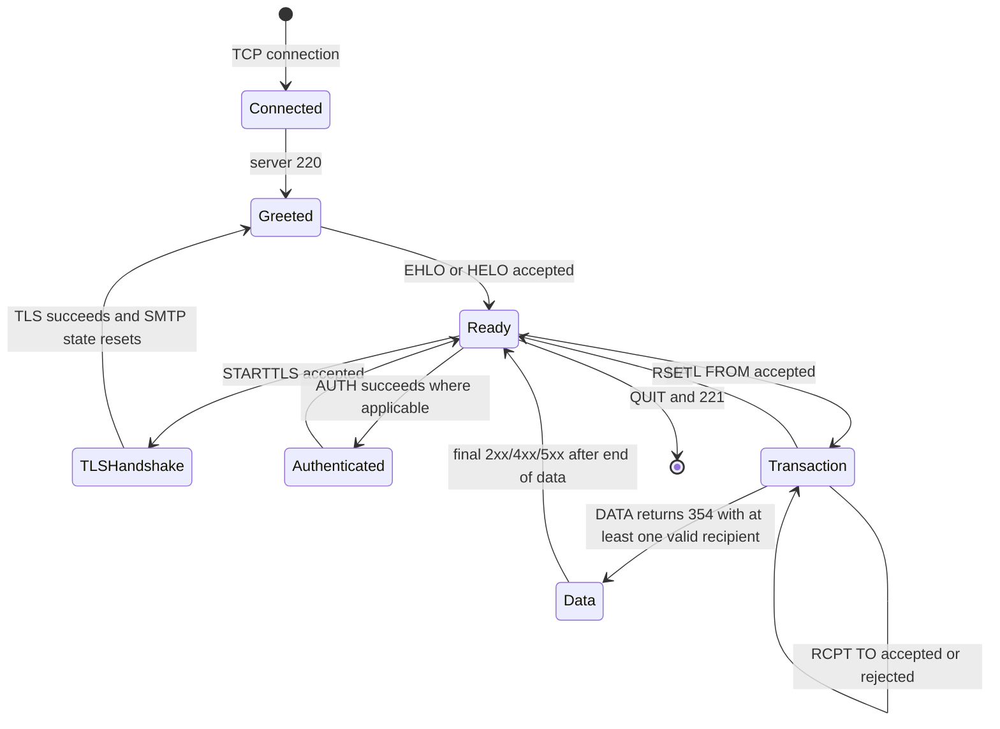
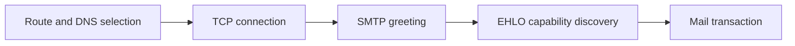
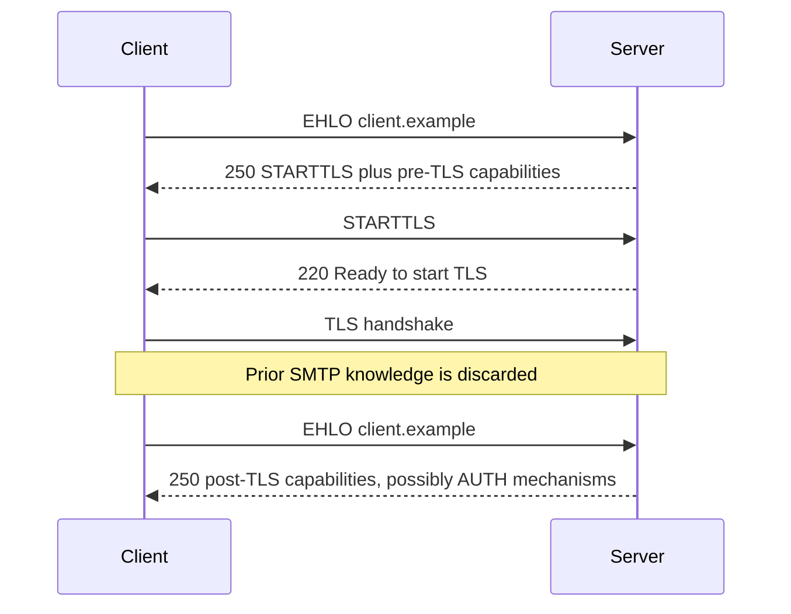
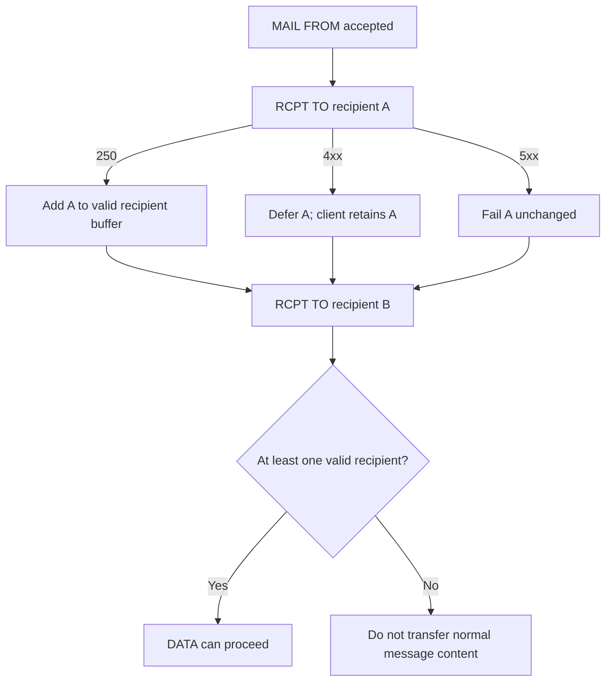
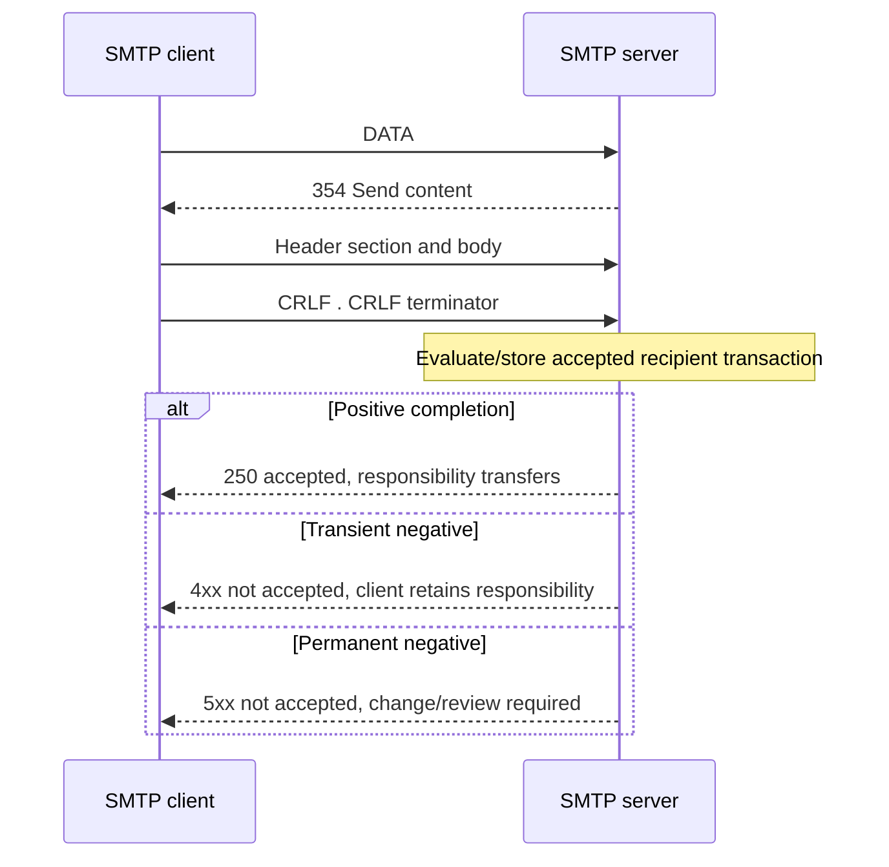
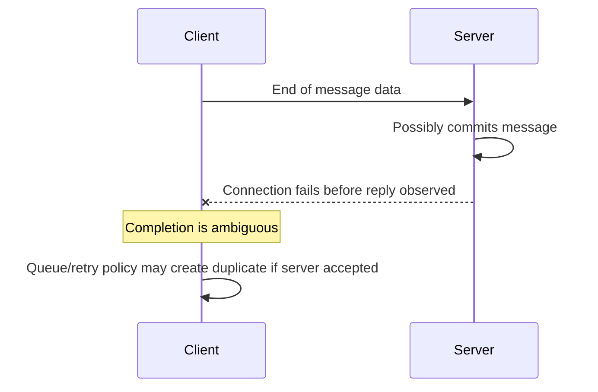
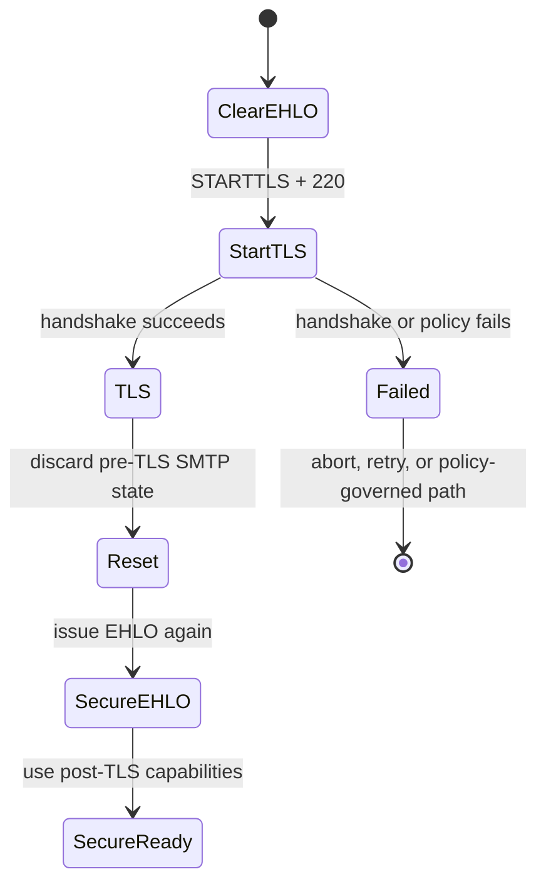
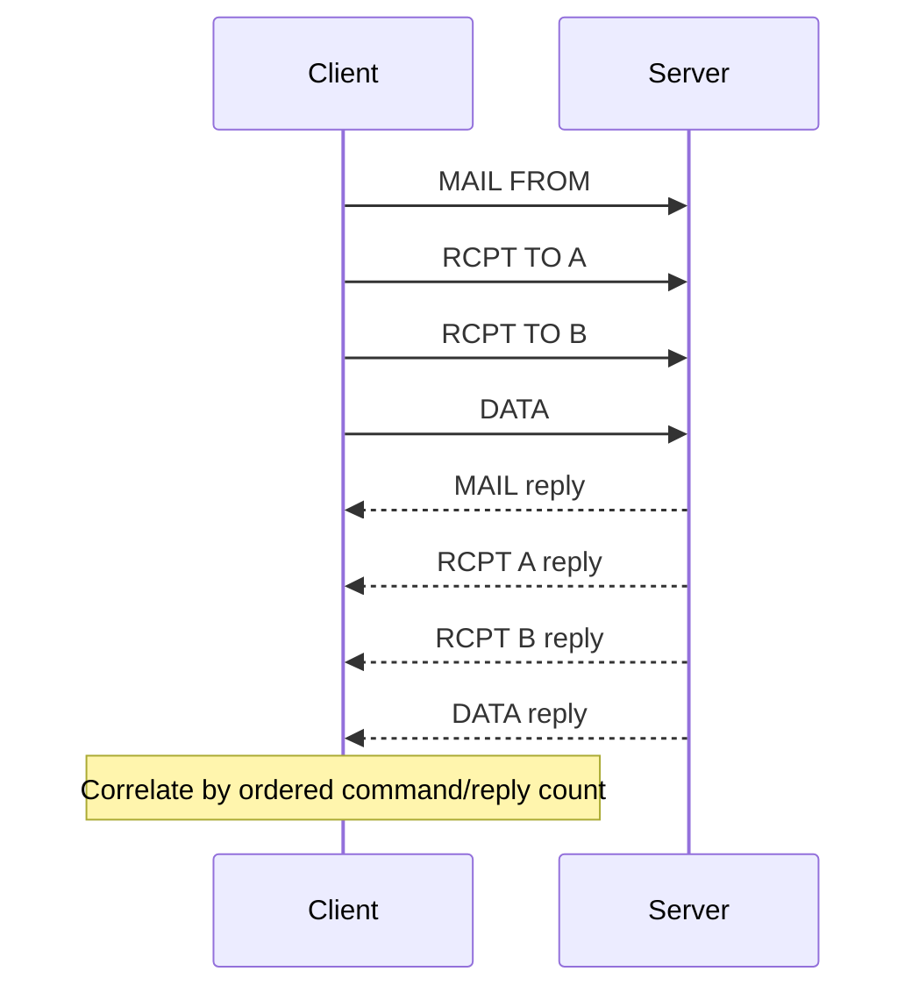
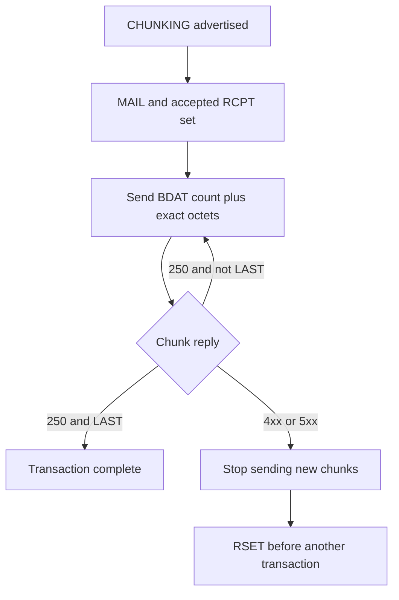
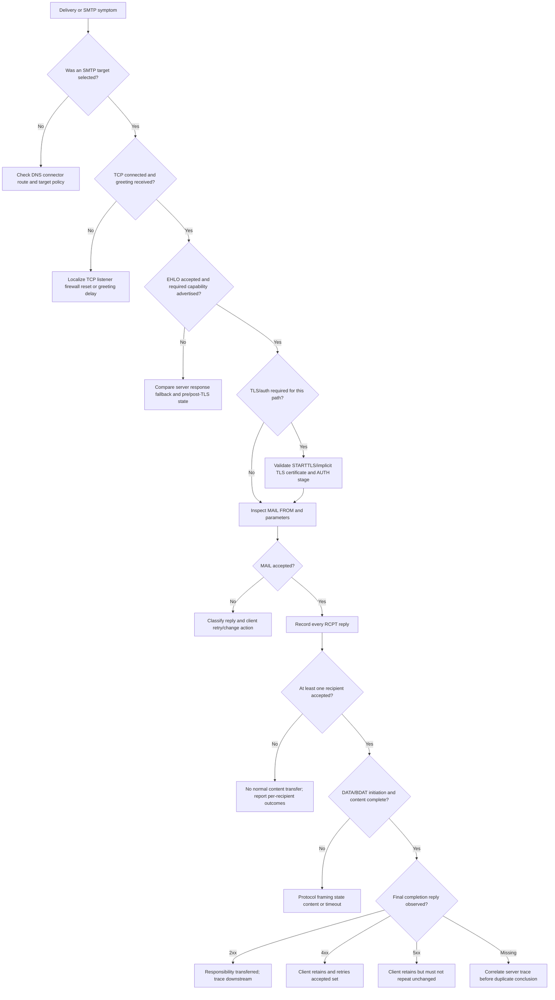

# Part 021 - SMTP and ESMTP Conversation

> **Purpose:** Follow a Simple Mail Transfer Protocol (SMTP) session command by command, understand Extended SMTP (ESMTP) capability negotiation, and turn replies, timing, per-recipient state, Transport Layer Security (TLS), authentication, and final responsibility into precise support evidence.
>
> **Evidence rule:** Base transfer behavior is grounded in RFC 5321 and its updates. Extension behavior is grounded in the RFC that defines each extension. A transcript proves only what the participating client and server exchanged at that hop. It does not prove every later relay, mailbox disposition, user action, or message-security verdict. Provider-specific retries, queue lifetimes, policies, logging, and UI labels must be verified in current official documentation.
>
> **Currency and official-source access date:** August 24, 2026.

## Section Goal

By the end of this Part, you should be able to annotate an SMTP transcript without reading it as a loose list of codes. You should reconstruct the state of the session, explain which command a reply belongs to, preserve independent results for each recipient, and identify the exact point at which responsibility did or did not move to the receiving server.

You should understand the normal flow:

1. a client opens a transport connection;
2. the server sends a greeting;
3. the client identifies itself with `EHLO` and learns extensions;
4. the peers may negotiate STARTTLS and then repeat `EHLO`;
5. a submission client may authenticate with `AUTH` outside a mail transaction;
6. `MAIL FROM` starts one mail transaction and establishes the reverse-path;
7. one or more `RCPT TO` commands propose forward-path recipients;
8. `DATA` or a negotiated alternative transfers message content;
9. the final reply after complete content determines whether responsibility moved;
10. the session can carry another transaction or close with `QUIT`.

The practical outcome is the **Dialogue Ledger: Safe SMTP Transcript Annotation and State Lab**. It uses invented transcripts only. It does not connect to an SMTP service, enumerate recipients, send email, test credentials, or generate external traffic.

## JD Mapping

| Supplied role signal | Capability developed here | Practical proof |
|---|---|---|
| Troubleshoot email delivery and product behavior | Localizes failure to connection, greeting, capability, TLS, authentication, envelope, recipient, content, or post-acceptance stage | State timeline |
| Handle configuration cases | Interprets route, TLS, size, authentication, and extension mismatches | Capability matrix |
| Investigate false positives/negatives | Separates SMTP policy rejection from later security verdict/action | Stage/action ledger |
| Work with networking evidence | Correlates DNS/route, TCP, TLS, SMTP, and provider layers | Layered evidence table |
| Work with APIs/logs | Maps asynchronous queue/provider records back to command/reply evidence | ID and timestamp bridge |
| Collaborate with Engineering | Supplies minimal transcript, state, expected behavior, and explicit protocol question | Escalation packet |
| Communicate customer updates | Describes responsibility and retry ownership without saying vague “sent” or “bounced” | Customer-safe update set |
| Build reusable knowledge | Converts common code patterns into a decision workflow | Transcript rubric |

## Candidate Honesty Note

Your production enterprise support experience transfers in layered troubleshooting, networking fundamentals, identity and authorization reasoning, evidence correlation, customer cadence, escalation, and validation. A protocol transcript is similar to any stateful distributed-system log: order and ownership matter more than isolated strings.

This Part is learned architecture and a local/public lab. It does not establish production operation of Exchange transport, Google Workspace routing, Abnormal, a secure email gateway, or a public MTA. You should explain the method confidently while naming the product-specific evidence and runbooks you would learn during ramp.

| Evidence label | Honest use | Claim boundary |
|---|---|---|
| **Production-transfer example** | Real Microsoft cases involving protocol layers, identity, dependencies, and actionable escalation | Do not rename a non-email case as SMTP experience |
| **Working knowledge/upskilling** | TCP/TLS/DNS, state machines, status codes, retries, logs | Do not imply public-MTA administration |
| **Local/public lab** | Synthetic transcript annotation and decision trees | No packets sent or accounts used |
| **Learned architecture** | RFC-defined SMTP/ESMTP behavior | No vendor-internal queue or parser claim |
| **No direct experience** | Abnormal, direct email security, Google Workspace production | State directly |
| **Template only** | Transcript ledger, customer update, escalation packet | Not an internal vendor runbook |

## Fact Labels and Protocol Ceiling

| Label | Meaning in this Part | Example |
|---|---|---|
| **Standards fact** | Defined SMTP or extension behavior | A post-DATA `2yz` reply transfers responsibility to the server |
| **Standards update** | Later RFC modifies base behavior | RFC 7504 adds `521` and `556` for no-mail-service cases |
| **Vendor-neutral teaching model** | Support annotation method | One state row per command/reply pair |
| **Provider policy** | Implementation or configuration decision | Retry schedule, content policy, logging retention |
| **Inference to validate** | Hypothesis needing more evidence | A `451` after DATA may reflect content scanning resource pressure |
| **Unknown/private** | Non-public product behavior | Exact Abnormal SMTP-facing behavior and internal decision order |
| **Synthetic example** | Invented dialogue with reserved domains | `C: EHLO relay.example.com` |

## Beginner Term Primer

| Term | Plain meaning | Why it matters | Memory hook |
|---|---|---|---|
| **SMTP** | Command/reply protocol used to transfer email | Exposes hop-level state and responsibility | Mail dialogue |
| **ESMTP** | SMTP extension framework initiated with `EHLO` | Negotiates optional capabilities safely | SMTP plus capabilities |
| **Session** | Connection-level dialogue that can contain zero or more transactions | TLS/auth/capabilities can be session state | One phone call |
| **Transaction** | One reverse-path, recipient set, and message-content attempt | Recipient and content outcomes belong to this unit | One parcel handoff |
| **Client** | SMTP process sending commands and message data | Owns delivery until a server accepts responsibility | Command side |
| **Server** | SMTP process returning replies and accepting/rejecting work | Reply meaning is scoped to this hop | Reply side |
| **Greeting** | Initial server reply, normally `220` | No command should be assumed accepted before it | Service is ready |
| **EHLO** | Client identification plus request for ESMTP capabilities | Extension use depends on advertised support | Hello and capability list |
| **HELO** | Older SMTP greeting without ESMTP capability response | Fallback compatibility, fewer negotiated features | Basic hello |
| **Capability** | Extension keyword in successful EHLO response | Defines what this server offers now | Available option |
| **Command** | Client request such as `MAIL`, `RCPT`, or `DATA` | Each command has one reply, unless represented by a multiline reply | Ask |
| **Reply** | Server status code and optional text | First digit drives broad client action | Answer |
| **Multiline reply** | Several physical reply lines forming one reply | Hyphens continue; space finishes | Dash continues, space ends |
| **Reverse-path** | Address or null value in `MAIL FROM` | Receives later delivery-failure notices | Return route |
| **Forward-path** | One recipient address in `RCPT TO` | Each recipient can succeed or fail independently | Delivery target |
| **MAIL FROM** | Command starting a transaction and setting reverse-path | Its `250` does not accept message content | Start envelope |
| **RCPT TO** | Command adding one recipient to the transaction | A success accepts that recipient for this transaction stage | Add recipient |
| **DATA** | Command asking to transfer message content | `354` is intermediate; final reply comes after terminator | Content follows |
| **End-of-data indicator** | A line containing only a period after CRLF framing | Triggers final server processing and reply | Dot ends DATA |
| **Dot-stuffing** | Client adds a leading dot to data lines that already begin with dot | Preserves content without confusing terminator | Escape leading dot |
| **Positive completion** | `2yz` reply | Requested action completed at that command’s scope | Done at this stage |
| **Positive intermediate** | `3yz` reply | More information/data is required | Continue |
| **Transient negative** | `4yz` reply | Current action failed but unchanged retry may later work | Retry ownership remains |
| **Permanent negative** | `5yz` reply | Exact request should not be repeated without change/review | Change before retry |
| **Enhanced status code** | Three dotted numbers such as `5.1.1` | Adds machine-readable class, subject, and detail | Class.subject.detail |
| **Queue** | Stable storage for mail awaiting another attempt | Deferred is not lost | Hold and retry |
| **Responsibility transfer** | Server becomes accountable for delivery/relay or proper failure reporting | Central proof boundary | Who owns it now? |
| **RSET** | Aborts current transaction and clears its buffers | Recovers from transaction problems without necessarily ending session | Reset transaction |
| **QUIT** | Requests orderly session closure | Distinguishes completed transactions from abandoned current state | End call |
| **NOOP** | Requests no action except a reply | Can test/synchronize a session | Keepalive/checkpoint |
| **STARTTLS** | ESMTP command upgrading a clear connection to TLS | Protects one connection and resets SMTP knowledge | Encrypt, reset, EHLO again |
| **TLS** | Transport Layer Security for confidentiality and peer identity checks | Hop security is not end-to-end message security | Protect this link |
| **AUTH** | SMTP authentication extension using SASL mechanisms | Common for authorized submission, not public relay authorship | Authenticate client/session |
| **SASL** | Simple Authentication and Security Layer framework | AUTH mechanisms have different properties | Auth mechanism framework |
| **PIPELINING** | Extension permitting command batches without waiting after each command | Replies must still correlate in order | Batch asks, count answers |
| **SIZE** | Extension advertising/declaring message size | Can reject before costly data transfer | Measure before sending |
| **8BITMIME** | Extension permitting defined 8-bit MIME transport | Not permission for arbitrary binary data | Eight-bit MIME path |
| **CHUNKING** | Extension enabling `BDAT` chunks instead of `DATA` | Changes content framing and response points | Counted chunks |
| **BINARYMIME** | Extension permitting binary MIME with CHUNKING | Requires exact capability and preservation | Binary only by agreement |
| **SMTPUTF8** | Extension enabling internationalized envelope/header scenarios | Must be advertised before use | UTF-8 by negotiation |
| **DSN** | Delivery Status Notification extension/message family | Carries structured delivery outcome | Machine-readable bounce |
| **Ambiguous completion** | Client loses connection after sending data but before seeing final reply | Server may have accepted while client cannot know | Retry can duplicate |
| **Backscatter** | Unwanted failure messages sent to forged/innocent addresses | Rejecting during SMTP can avoid later misdirected bounces | Do not bounce to a forged return |

## SMTP Is a Stateful Dialogue

SMTP is not a stateless request API. The server maintains conceptual buffers for reverse-path, forward-path recipients, and message data. Commands are legal or meaningful only in appropriate states. A `503 Bad sequence of commands` often means the command itself is known but arrived in an invalid state.



This diagram is a teaching simplification. Extensions can add states and alternatives. TLS and SASL security layers can reset knowledge. A failed command often leaves the server in its prior state, but extension-specific errors can require `RSET` or connection closure.

### Session versus transaction state

| State kind | Examples | Lifetime | Evidence question |
|---|---|---|---|
| Connection/session | Peer IP, server greeting, TLS session, EHLO identity | Until connection closes or security reset changes it | Which two endpoints spoke? |
| Advertised capability | `SIZE`, `STARTTLS`, `PIPELINING`, `AUTH` mechanisms | Current EHLO context; may change after TLS | Was this extension actually advertised in this state? |
| Authentication | SASL result and authorization identity | Session/security-layer scoped | Which client/session was authorized? |
| Transaction | Reverse-path, recipients, content | From `MAIL` until final content reply, `RSET`, new `EHLO`, or abort | Which message attempt and recipients? |
| Queue | Stored message and future attempts | Across sessions/restarts per implementation | Who retained responsibility after a transient failure? |

## Baseline ESMTP Conversation

```text
S: 220 mx1.example.net ESMTP ready
C: EHLO relay.example.com
S: 250-mx1.example.net greets relay.example.com
S: 250-SIZE 52428800
S: 250-PIPELINING
S: 250-ENHANCEDSTATUSCODES
S: 250 STARTTLS
C: MAIL FROM:<bounce@example.com> SIZE=430
S: 250 2.1.0 Reverse-path accepted
C: RCPT TO:<alex@example.net>
S: 250 2.1.5 Recipient accepted
C: DATA
S: 354 Start mail input; end with <CRLF>.<CRLF>
C: From: Status Service <status@example.com>
C: To: Alex <alex@example.net>
C: Date: Mon, 24 Aug 2026 12:00:00 +0000
C: Message-ID: <safe-021@example.com>
C: Subject: Harmless synthetic status
C:
C: All systems in this synthetic example are fictional.
C: .
S: 250 2.0.0 Accepted as RX-2101
C: QUIT
S: 221 2.0.0 Closing connection
```

### Line-by-line ledger

| Step | Line | State before | Server/client effect | Proof ceiling |
|---:|---|---|---|---|
| 1 | `220` greeting | Connected | Server says SMTP service ready | Service greeting on this connection |
| 2 | `EHLO` | Greeted | Client identifies itself and requests extensions | Claimed EHLO identity plus source IP elsewhere |
| 3 | `250-*` capability reply | Greeted | Server advertises current capabilities | Offered in this EHLO state, not all future states |
| 4 | `MAIL FROM` | Ready | Starts transaction and proposes reverse-path/size | Envelope start, not content acceptance |
| 5 | `250 2.1.0` | MAIL pending | Reverse-path accepted | This command accepted |
| 6 | `RCPT TO` | Transaction | Proposes one forward-path | Recipient-specific request |
| 7 | `250 2.1.5` | Transaction | Recipient accepted into this transaction | Not mailbox/inbox delivery |
| 8 | `DATA` | Transaction | Requests content transfer | No content sent yet |
| 9 | `354` | DATA pending | Server asks for content | Intermediate, not final acceptance |
| 10 | Header/body lines | Data | Client transmits content | Bytes sent, not accepted yet |
| 11 | Dot terminator | Data | Client ends content | Server can make final decision |
| 12 | `250 2.0.0` | Final processing | Server accepts responsibility | Delivery/relay or proper later failure reporting |
| 13 | `QUIT`/`221` | Ready | Orderly closure | Session ended; prior completed transaction remains complete |

## 🔍 Plain-English deep-dive: A 250 Is Meaningless Without Its Command

Imagine a multi-step hotel check-in. “Yes” at the front door means the hotel is open. “Yes” at identity verification means the ID is acceptable. “Yes” after room allocation means a room is assigned. The same word has different scope at each question.

SMTP uses the same three-digit reply code in several contexts. `250` after `EHLO` means the greeting/capability exchange succeeded. `250` after `MAIL FROM` means the reverse-path and transaction start were accepted. `250` after `RCPT TO` means that recipient was accepted for the current transaction stage. Only a positive completion reply after the complete message data does the receiving server take responsibility for that message transaction.

The analogy stops because SMTP can accept some recipients and reject others in one transaction, and policy can act after content is received. Still, the operational rule is absolute:

> Never quote a reply without the command, recipient scope, timestamp, and session/transaction context it answers.

Bad case note: “Remote server returned 250, so delivery succeeded.”

Better case note: “At 12:00:05 UTC, `mx1.example.net` returned `250 2.0.0 Accepted as RX-2101` after the client sent the end-of-data indicator for accepted envelope recipient `alex@example.net`. This proves remote SMTP responsibility, not mailbox placement.”

## Connection and Greeting

The application conversation begins only after the underlying connection exists. Base Internet relay normally targets TCP port 25. Submission normally uses its designated services and authorization model, discussed later.

### Layers before SMTP



| Failure point | Observation | Meaning | Next evidence |
|---|---|---|---|
| DNS/route | No usable target | No SMTP peer selected | Resolver, MX/route, connector config |
| TCP connect | Timeout/refused/reset | Transport path or listener problem | Source/destination IP, port, firewall, packet evidence |
| Greeting timeout | TCP established, no `220` | Server accepted connection but did not become ready in time | Server load, tarpitting, gateway logs |
| Initial `421` | Service unavailable/closing | Transient service condition | Retry/queue state and provider health |
| Initial `521` | Host never accepts mail | Standard no-service signal in its intended context | Route/domain correctness |
| Initial `554` | Session refused | General permanent/policy refusal context | Exact text, policy, peer, route |

An open TCP port does not prove SMTP readiness. A `220` greeting does not prove a particular message or recipient will be accepted.

## EHLO and Capability Discovery

The client normally sends `EHLO` with a fully qualified domain name or allowed address literal. The server’s successful multiline response identifies itself and lists extensions.

### Multiline rule

```text
S: 250-mx1.example.net
S: 250-SIZE 52428800
S: 250-PIPELINING
S: 250 STARTTLS
```

The hyphen after `250` means more lines belong to this one reply. The final line uses a space after `250`. A parser must not count this as four replies to four commands.

### Capability interpretation

| Capability | What advertisement means | What it does not mean |
|---|---|---|
| `SIZE 52428800` | Server supports SIZE and advertises fixed maximum value | Every recipient can accept that size now |
| `PIPELINING` | Server can accept defined command groups without per-command waits | Client can ignore individual replies |
| `STARTTLS` | Server is currently able to negotiate STARTTLS | TLS will succeed or meet policy |
| `AUTH ...` | Listed SASL mechanisms currently available | Any credential is valid or author identity is proven |
| `8BITMIME` | Defined 8-bit MIME transport is supported | Arbitrary binary bytes are allowed |
| `CHUNKING` | `BDAT` chunks can replace DATA for a transaction | Client may send BDAT to a server that did not advertise it |
| `BINARYMIME` | Binary MIME is supported with CHUNKING | DATA can carry binary MIME |
| `SMTPUTF8` | Internationalized SMTP extension is supported | Every downstream hop or mailbox supports every address |
| `DSN` | DSN SMTP extension parameters are supported | A success notification will always be requested or sent |
| `ENHANCEDSTATUSCODES` | Responses use enhanced status information as defined | Free text is stable enough for automation |

### Capability state can change



Do not merge pre-TLS and post-TLS capability lists. The server may intentionally advertise authentication only after encryption.

## MAIL FROM: Starting the Transaction

`MAIL FROM:<reverse-path>` starts a new transaction and resets the transaction buffers. It may include parameters only for negotiated extensions.

Examples:

```text
MAIL FROM:<bounce@example.com>
MAIL FROM:<bounce@example.com> SIZE=430
MAIL FROM:<> 
MAIL FROM:<sender@example.com> BODY=8BITMIME SMTPUTF8
```

The null reverse-path `<>` is required for several notification patterns to avoid recursive bounce loops. Null does not mean “anonymous attacker” by definition.

| MAIL outcome | State/result | Client action | Support wording |
|---|---|---|---|
| `250` | Transaction started; reverse-path accepted | Continue with recipients | “Reverse-path accepted” |
| `452` due resources/declared size | Temporary inability | Requeue/retry per policy | “MAIL command deferred; client retains responsibility” |
| `550/553` | Permanent address/policy/syntax condition | Do not repeat unchanged | “Transaction not established under this reverse-path” |
| `530` | Authentication/TLS required in applicable context | Establish required security/auth if authorized | “Submission precondition not met” |
| `555` | Parameter not recognized/implemented | Correct extension use | “MAIL parameter unsupported” |

A successful `MAIL FROM` does not validate the header author, accept a recipient, receive content, or guarantee final acceptance.

## RCPT TO: Per-Recipient Decisions

Each `RCPT TO:<forward-path>` adds one proposed recipient. The server can accept or reject recipients independently.



### Mixed-recipient transcript

```text
C: MAIL FROM:<bounce@example.com>
S: 250 2.1.0 Reverse-path accepted
C: RCPT TO:<alex@example.net>
S: 250 2.1.5 Recipient accepted
C: RCPT TO:<full@example.net>
S: 452 4.2.2 Mailbox temporarily full
C: RCPT TO:<missing@example.net>
S: 550 5.1.1 Mailbox does not exist
C: DATA
S: 354 Continue
...
C: .
S: 250 2.0.0 Accepted for alex@example.net
```

### Outcome ledger

| Recipient | RCPT outcome | Included in this content transfer? | Client’s remaining obligation |
|---|---|---|---|
| Alex | `250 2.1.5` | Yes | Ends if final data reply is positive |
| Full | `452 4.2.2` | No | Retry later per policy |
| Missing | `550 5.1.1` | No | Report permanent failure; do not retry unchanged |

One message can therefore have delivered/accepted, deferred, and failed branches. Customer updates must name the recipient scope.

## DATA, Content, and Final Acceptance

`DATA` is a request to begin transmitting message content. A `354` reply is positive intermediate, not completion. The client sends header section and body, dot-stuffing lines that begin with a dot, then sends the end-of-data indicator.



### Reply stage distinctions

| Reply | Stage | Meaning |
|---|---|---|
| `250` after `MAIL` | Envelope reverse-path | Transaction start accepted |
| `250` after `RCPT` | One recipient | Recipient accepted for current transaction |
| `354` after `DATA` | Intermediate | Send content now |
| `250` after final dot | Whole content transaction for accepted recipients | Server accepts responsibility |
| `4xx` after final dot | Whole content transaction not accepted | Client retains/requeues accepted-recipient set |
| `5xx` after final dot | Whole content transaction not accepted | Client should not repeat exact request unchanged |

### Dot-stuffing

If a message data line begins with a period, the client adds another leading period. The server removes one on receipt. A line containing only one period is the terminator and not part of the content.

| Intended content line | Wire representation inside DATA |
|---|---|
| `Normal line` | `Normal line` |
| `.Leading dot` | `..Leading dot` |
| `.` as content | `..` |
| End of data | `.` |

Do not include the duplicated transparency dot when calculating message semantics. The SIZE definition also excludes the terminating dot and duplicated quoting dots from the declared message size.

## 🔍 Plain-English deep-dive: Final Acceptance Is a Handoff Receipt

Think of a warehouse receiving a sealed shipment. The driver can be admitted at the gate, the sender account can be accepted, and each destination label can be approved. The warehouse still has not accepted the shipment until it receives the contents and signs the final handoff.

In SMTP, `MAIL FROM` and `RCPT TO` successes prepare the transaction. `354` opens the content phase. The final `2yz` after complete content is the handoff receipt. At that moment the receiver accepts responsibility for delivering or relaying the message, or for properly reporting a later failure where required.

The analogy stops because malicious mail may be silently discarded under narrow policy choices, and multi-recipient copies can branch. Yet the support boundary remains: if the final reply was `4yz` or `5yz`, the server did not accept responsibility for that transaction. If the final reply was `2yz`, the client should not keep retrying as though no handoff occurred.

This distinction prevents two operational failures:

1. declaring success after a recipient-stage `250` even though content later failed;
2. retrying after a successful final acceptance and creating duplicates.

## Ambiguous Completion and Duplicate Risk

The most difficult case occurs when the client sends the final content terminator but the connection fails before the client receives the final reply. The server may have accepted and committed the message, or it may not have. The client cannot infer the answer from connection loss alone.



### Evidence required

| Evidence | Why it matters |
|---|---|
| Client timestamp and queue ID | Identifies ambiguous attempt |
| Server/provider transaction ID if logged before loss | Correlates possible acceptance |
| Recipient/provider trace | Shows whether copy exists downstream |
| Message-ID/content fingerprint where authorized | Helps distinguish duplicate copies |
| Retry times and new queue IDs | Reconstructs duplication path |
| Final server log state | Strongest answer if accessible |

Customer-safe wording: “The client transmitted the content but did not receive a final SMTP reply, so responsibility transfer is ambiguous from the client transcript. We are correlating the server trace before deciding whether the later retry created a second accepted copy.”

## Reply Codes: Read Class, Command, and Detail

### Basic reply classes

| First digit | Name | Broad meaning | Typical client ownership |
|---:|---|---|---|
| 2 | Positive completion | Requested action completed | Advance state |
| 3 | Positive intermediate | More input is needed | Continue specified exchange |
| 4 | Transient negative completion | Action failed now; unchanged retry may work | Retain/requeue as appropriate |
| 5 | Permanent negative completion | Do not repeat exact request unchanged | Correct, review, or report failure |

The second and third digits add broad and fine categories in the basic SMTP model, but automation should follow the specification and command context. Free-form text is diagnostic, not a stable machine contract.

### Enhanced code structure

Enhanced status codes use `class.subject.detail`:

| Component | Example in `5.1.1` | Meaning |
|---|---:|---|
| Class | 5 | Permanent failure |
| Subject | 1 | Addressing status |
| Detail | 1 | Bad destination mailbox address |

### Subject families

| Subject | Family | Example support scope |
|---:|---|---|
| X.0.Y | Other/undefined | Insufficient detail |
| X.1.Y | Addressing | Syntax, mailbox address, sender/recipient domain |
| X.2.Y | Mailbox | Disabled/full/recipient-specific limits/list expansion |
| X.3.Y | Mail system | Capacity, feature support, system configuration |
| X.4.Y | Network/routing | No answer, bad connection, DNS/directory, loop, timeout |
| X.5.Y | Delivery protocol | Command, syntax, arguments, protocol version |
| X.6.Y | Content/media | Unsupported media, conversion, content issue |
| X.7.Y | Security/policy | Authorization, filtering, cryptographic/security policy |

The basic and enhanced classes must agree when enhanced codes appear in SMTP responses: `550 5.1.1` is coherent; `550 4.1.1` is contradictory evidence and should be recorded exactly rather than silently fixed.

### Diagnostic precedence

1. Identify connection/session and exact peer.
2. Identify command and recipient/transaction scope.
3. Interpret basic reply class.
4. Interpret enhanced class, subject, detail from the current registry/specification.
5. Read free text and provider link as additional diagnostic context.
6. Confirm whether the sending system queued, retried, failed, or accepted responsibility.

## 🔍 Plain-English deep-dive: A Queue Is an Ownership Ledger, Not Proof of Progress

Imagine a courier depot holding a parcel after the destination building says, “We cannot receive it right now; try later.” The parcel is not halfway inside the destination. It remains in the courier’s custody, and the courier owns the next attempt until the destination signs for it or the delivery window expires.

An SMTP queue works similarly. When a sending client receives a transient negative reply before final acceptance, it normally keeps the message or affected recipient branch in stable storage and schedules another attempt. A queue entry therefore proves retained responsibility and pending work under that system’s policy. It does not prove that the receiving server has a copy, that every retry reaches the same peer, or that delivery is steadily moving forward.

The analogy stops because a mail queue may split recipients, choose another MX target, apply backoff, expire according to policy, or produce a Delivery Status Notification. Several systems can also have different queue records for successive hops. That is why “the message is queued” is incomplete support language. A useful statement identifies:

- which system owns the queue;
- which recipient branch remains there;
- which reply and stage caused retention;
- when the last and next attempts occur;
- when the queue will stop retrying under documented policy;
- which IDs correlate attempts across hops.

After a final positive reply, the sending client should remove the accepted branch from its delivery queue because responsibility moved. If an internal product view still says “queued,” determine whether it represents asynchronous post-acceptance processing, stale UI state, a different recipient, or a different hop. Do not reinterpret the protocol handoff to fit a generic label.

Memory hook: **A `4xx` keeps the parcel with the sender; a final `2xx` signs it over.**

## STARTTLS: Upgrade, Reset, Re-EHLO

STARTTLS is advertised in an EHLO response when currently available. The client sends `STARTTLS`, receives an appropriate `220`, and begins a TLS handshake before any further SMTP commands.

After a successful handshake, SMTP protocol state resets to the initial post-greeting state. Both sides discard SMTP knowledge not obtained from the TLS negotiation. The client should issue a new `EHLO`, and the server may advertise a different capability set.



### TLS proof ceilings

| Evidence | Proves | Does not prove |
|---|---|---|
| `STARTTLS` advertised | Server offered upgrade in that clear EHLO state | Handshake success |
| Server `220` to STARTTLS | Ready to start TLS | Certificate valid or privacy achieved |
| TLS handshake success | Negotiated cryptographic session parameters | Correct peer identity unless validation succeeded |
| Certificate validation success | Peer identity met applicable reference/check rules | Message author identity or every later hop security |
| ESMTPS trace | This recorded hop used TLS under the producer’s context | End-to-end encryption |
| TLS on submission | Client-to-MSA link protected to stated level | MTA-to-MTA links or message content after delivery |

### Submission versus relay currency

RFC 7817 updates certificate identity checks for email submission clients and does not apply to MTA-to-MTA SMTP. RFC 8314 recommends TLS-protected submission/access, including implicit TLS for the submissions service, and separately notes that relay needs different mechanisms. Do not apply submission certificate rules blindly to Internet relay cases.

## SMTP AUTH and Submission

Public MTA-to-MTA relay and user/application submission solve different problems. Submission commonly authenticates an authorized client and applies organizational policy. SMTP AUTH defines a SASL exchange and an `AUTH` capability listing mechanisms.

### Important boundaries

| Statement | Accurate? | Why |
|---|---|---|
| “AUTH success proves the visible author wrote the content.” | No | It authenticates/authorizes a session identity under server policy |
| “AUTH success can support submission accountability.” | Yes | MSA can associate submission with authorized identity |
| “AUTH should occur during a mail transaction.” | No | AUTH is not permitted during an open transaction |
| “Mechanisms may change after STARTTLS.” | Yes | Post-TLS EHLO can advertise protected mechanisms |
| “Base64 in AUTH is encryption.” | No | Encoding does not provide confidentiality |
| “A plaintext password mechanism is safe without a protective layer.” | No | Applicable guidance requires protection/configuration controls |

### Safe synthetic sequence

```text
S: 220 submit.example.com ESMTP submission ready
C: EHLO client.example.net
S: 250-submit.example.com
S: 250-STARTTLS
S: 250 AUTH [MECHANISMS OMITTED]
C: STARTTLS
S: 220 Ready to start TLS
[TLS HANDSHAKE SUCCEEDS AND SERVER IDENTITY VALIDATES]
C: EHLO client.example.net
S: 250-submit.example.com
S: 250 AUTH [POST-TLS MECHANISMS OMITTED]
C: AUTH [MECHANISM AND ALL CREDENTIAL DATA REDACTED]
S: 235 2.7.0 Authentication successful
```

Never place real AUTH challenges, responses, tokens, passwords, or session captures into a study artifact or support ticket without explicit authorization and secure handling.

## 🔍 Plain-English deep-dive: TLS Protects a Hallway, Not the Whole Journey

Picture a locked hallway connecting two rooms. People outside that hallway cannot easily observe the conversation inside, and each room may verify the other door’s identity. Once a document leaves the hallway and enters another room or hallway, the first lock no longer protects that later segment.

SMTP TLS is hop scoped. STARTTLS between one client and server can provide confidentiality and peer authentication for that connection, depending on validation and policy. A message can then be relayed across another connection with different security. It can be stored where authorized users or systems access it. It can be forwarded. It can also be malicious despite perfect transport encryption.

The analogy stops because a TLS connection carries both envelope commands and message data and can be attacked through configuration, downgrade, certificate, or endpoint compromise. Still, it blocks three dangerous claims:

- “TLS means the email is safe.”
- “TLS means the visible author is authenticated.”
- “TLS on one Received hop means end-to-end encryption.”

Support wording should name link, peer, policy, version/cipher evidence where relevant, certificate outcome, and what later hops remain unknown.

## PIPELINING: Faster, Not Less Stateful

PIPELINING permits the client to send defined command groups without waiting for each reply. The server still replies in command order, and the client must evaluate every reply.



### Pipelining pitfalls

| Pitfall | Failure | Correct rule |
|---|---|---|
| Use without advertisement | Legacy/broken server may mishandle commands | Pipeline only after capability confirmation |
| Match replies by text | Localized/variable text breaks mapping | Count ordered command/reply units |
| Confuse multiline reply with several replies | State shifts incorrectly | Hyphen continues same reply; space ends it |
| Ignore rejected RCPT in batch | Wrong per-recipient result | Record every reply independently |
| Send message data before `354` | Protocol violation/data confusion | DATA may end group; wait for its response before normal data |
| Put STARTTLS mid-group | Commands may cross security transition | STARTTLS must be last in group |
| Treat batch as atomic | Some commands can succeed while others fail | SMTP remains per-command stateful |

Pipelining reduces network round trips, not semantic checkpoints.

## SIZE, 8BITMIME, CHUNKING, and BINARYMIME

### SIZE

The server can advertise a fixed maximum and the client can declare an estimate on `MAIL FROM`. Early acceptance of the declared size is not a guarantee of final acceptance. Recipient-specific or actual-size conditions can still fail later.

### 8BITMIME

This capability allows defined 8-bit MIME transport. It does not permit arbitrary binary content, and the message must be appropriately labeled/formed.

### CHUNKING and BDAT

CHUNKING allows `BDAT <octet-count> [LAST]` instead of DATA. The count is exact. The server replies to chunks, and `LAST` marks completion. DATA and BDAT cannot be mixed in one transaction.

### BINARYMIME

BINARYMIME relies on CHUNKING and a `BODY=BINARYMIME` transaction parameter. It permits arbitrary octets only under the negotiated rules and requires preservation across onward handling.

| Extension | Changes | Primary troubleshooting evidence |
|---|---|---|
| SIZE | EHLO value and optional MAIL parameter | Advertised max, declared/actual octets, rejection stage |
| 8BITMIME | Permitted content domain and BODY parameter usage | Advertised support, MIME labels, downstream capability |
| CHUNKING | BDAT alternative to DATA | Chunk sizes, replies, LAST, reset after failure |
| BINARYMIME | Binary MIME with CHUNKING | BODY parameter, exact octets, no DATA mixing |

### Chunk failure logic



Wrong octet counts can cause the receiver to consume command bytes as data or data bytes as commands. This is a framing defect, not merely “attachment corruption.”

## Submission Versus Internet Relay

| Dimension | Message submission | Internet MTA relay |
|---|---|---|
| Primary actors | MUA/application to MSA | MTA to MTA |
| Common service | Submission on designated service, often TLS protected | SMTP relay on port 25 via MX/configured route |
| Authentication | Commonly required/expected | Not universally user-authenticated |
| Policy relationship | Close administrative relationship | Independent ADMDs often meet |
| Message completion/modification | MSA can perform constrained completion/policy actions | Relay should preserve content except trace/allowed functions |
| TLS guidance | RFC 8314 submission/access recommendations | Relay TLS uses separate policy mechanisms and operational model |
| Evidence | Authenticated account, client, submission ID | Peer MTA, route, queue, transaction replies |

Confusing the two can lead to bad advice such as enabling SMTP AUTH on a public relay path or applying end-user submission certificate rules to MTA-to-MTA opportunistic relay.

## Failure Modes by Protocol Stage

| Stage | Common failure | Transcript fingerprint | Cheapest discriminator | Owner |
|---|---|---|---|---|
| Route/DNS | Wrong/no target | No session transcript | Attempt-time resolver and connector route | DNS/mail admin |
| TCP | Refused/timeout/reset | No greeting | Network path and listener evidence | Network/host owner |
| Greeting | Slow, `421`, `521`, `554` | Initial reply or timeout | Server health/policy and route correctness | Receiving boundary |
| EHLO | Rejected/fallback | `5xx` to EHLO, HELO succeeds or fails | Exact server behavior/version | Server owner |
| Capability | Required extension absent | No keyword in applicable EHLO | Compare pre/post-TLS and policy | Both endpoints/config owner |
| STARTTLS | `454`, handshake, cert, downgrade | Upgrade offered but failed/removed | TLS trace and required/opportunistic policy | Endpoint/network/security owner |
| AUTH | Invalid/temporary/weak mechanism | `4xx`/`5xx`, often enhanced 4.7/5.7 | Separate credentials, mechanism, TLS, account state | Submission/identity owner |
| MAIL | Reverse-path/policy/size | Failure before recipient | Inspect exact MAIL params and policy | Sending/submission admin |
| RCPT | Address, quota, relay, policy | Per-recipient mixed replies | Record each path/reply | Recipient/routing admin |
| DATA initiation | No valid recipient/state/policy | `5xx` instead of `354` | State ledger and accepted recipient set | Client/server implementation |
| Content | Timeout, size, media, policy | Final `4xx`/`5xx` after transfer | Exact final reply and content metadata | Receiving policy/content owner |
| Final reply lost | Ambiguous acceptance | Connection loss after content | Server/provider trace and dedupe correlation | Both MTA owners |
| Post-acceptance | Queue/delivery later fails | Final `2xx`, later DSN/trace | Receiving queue and DSN | Accepting server/next owner |
| QUIT | Connection ends unexpectedly | Missing `221` | Check whether transaction already completed | Session owner; do not undo completed transaction |

## Troubleshooting Decision Tree



## Worked Example 1: Recipient Accepted, Content Rejected

### Transcript

```text
C: MAIL FROM:<bounce@example.com>
S: 250 2.1.0 Reverse-path accepted
C: RCPT TO:<alex@example.net>
S: 250 2.1.5 Recipient accepted
C: DATA
S: 354 Continue
[synthetic content]
C: .
S: 550 5.7.1 Message rejected by policy
```

### Reasoning

1. The reverse-path command succeeded.
2. Alex’s recipient command succeeded.
3. The server requested content.
4. The final content-stage reply was permanent negative.
5. The server did not accept responsibility for this transaction.
6. The client should not repeat the exact request unchanged.
7. The next question is which documented receiving policy caused the content-stage rejection and whether it is correct.

**Incorrect update:** “The recipient was accepted, then the email disappeared.”

**Correct update:** “The recipient address passed the RCPT stage, but the receiving server rejected the completed message at the post-content policy stage with `550 5.7.1`. No SMTP handoff occurred.”

## Worked Example 2: Temporary Final Failure and Retry Ownership

### Transcript

```text
C: DATA
S: 354 Continue
[synthetic content]
C: .
S: 451 4.3.1 Temporary processing resource condition
```

### Reasoning

- `451` is a transient negative completion.
- The enhanced code points to a mail-system resource class in this synthetic example.
- The receiving server did not accept responsibility.
- The sending client retains the accepted-recipient set and normally queues it for retry.
- “No bounce yet” is expected during the retry window and is not proof of success.
- Provider-specific retry cadence and ultimate give-up time need current sending-system evidence.

### Customer update

> The receiving server temporarily declined the complete message at 12:10 UTC. The sending system retains responsibility and has queued the affected recipient for retry. We are monitoring the next attempt and the queue’s documented expiry; no mailbox delivery is yet evidenced.

## Worked Example 3: STARTTLS Capability Changes

### Transcript

```text
C: EHLO client.example.net
S: 250-submit.example.com
S: 250-STARTTLS
S: 250 SIZE 10000000
C: STARTTLS
S: 220 Ready to start TLS
[TLS succeeds]
C: MAIL FROM:<sender@example.net>
S: 503 5.5.1 Send EHLO first
```

### Diagnosis

The client skipped the required post-TLS `EHLO`. The server correctly treats prior SMTP knowledge as discarded. The repair is not to bypass TLS; it is to reset the client sequence: successful TLS, new EHLO, use the post-TLS capabilities, authenticate if required, then start a transaction.

### Discriminating evidence

- pre-TLS EHLO reply;
- TLS success and identity-validation outcome;
- absence of post-TLS EHLO;
- command/reply order;
- client implementation/version and reproduction.

## Worked Example 4: Ambiguous Final Reply and Duplicates

### Timeline

| Time UTC | Event |
|---|---|
| 13:00:00 | Client sends final dot for queue `Q1` |
| 13:00:05 | TCP resets before client sees reply |
| 13:30:00 | Client retries as queue `Q2` |
| 13:30:06 | Client receives final `250`, remote ID `R2` |
| 13:31:00 | Recipient reports two copies |

### Hypothesis

The server may have accepted the first transaction as remote ID `R1` before the reset. The retry created `R2`. The reset itself did not duplicate data; the ambiguous handoff plus retry did.

### Check

Search the receiving system for the first time window, envelope pair, `Message-ID`, size/hash where authorized, and peer. If `R1` exists with final acceptance, explain the two successful handoffs. If it does not, keep uncertainty rather than inventing acceptance.

### Prevention discussion

SMTP cannot eliminate every duplicate under ambiguous network failure. Systems can use stable identifiers and recipient-side duplicate handling where appropriate, but `Message-ID` is not a universal idempotency guarantee. The operational goal is correct state tracking and evidence, not a promise of exactly-once delivery.

## Worked Example 5: Pipelined Mixed Results

### Commands and replies

```text
C: MAIL FROM:<bounce@example.com>
C: RCPT TO:<good@example.net>
C: RCPT TO:<missing@example.net>
C: DATA
S: 250 2.1.0 Sender accepted
S: 250 2.1.5 Recipient accepted
S: 550 5.1.1 Recipient does not exist
S: 354 Send content
```

The replies correlate by order, not by searching text. The client sends content only for the valid accepted recipient. The failed recipient must not be included in the final success statement.

| Command position | Reply position | State result |
|---:|---:|---|
| 1 MAIL | 1 | Reverse-path accepted |
| 2 RCPT good | 2 | Good recipient buffered |
| 3 RCPT missing | 3 | Missing recipient failed |
| 4 DATA | 4 | Content requested for valid recipient set |

## Customer Communication Patterns

| Situation | Precise update |
|---|---|
| No greeting | “The TCP path opened, but the peer did not issue an SMTP service-ready greeting within the observed window.” |
| TLS failed before transaction | “No mail transaction began because the required TLS negotiation/identity check did not complete.” |
| MAIL rejected | “The receiving service rejected the reverse-path or transaction parameters before any recipient was submitted.” |
| Some recipients rejected | “The server accepted A, deferred B, and permanently rejected C at the recipient stage.” |
| DATA `354` only | “The server invited content; final acceptance remains pending.” |
| Final `4xx` | “The receiver did not accept the complete transaction; the sender retains it for retry.” |
| Final `5xx` | “The receiver permanently rejected the completed transaction; unchanged retry is not appropriate.” |
| Final `2xx` | “The server accepted responsibility at this SMTP boundary; mailbox disposition remains under investigation.” |
| Final reply missing | “The client cannot determine whether handoff completed, so we are correlating the server trace before concluding failure or duplicate delivery.” |

## Escalation Packet

| Field | Required content |
|---|---|
| Topology | Client/server role, ADMDs, route selection, target IP/port |
| Time | UTC connection and command windows, clock source/skew note |
| State | Greeting, EHLO, TLS/auth state, transaction state |
| Transcript | Sanitized exact command/reply order and multiline boundaries |
| Envelope | Reverse-path and each affected forward-path, minimized/redacted |
| Capabilities | Applicable pre/post-TLS EHLO lists |
| TLS | Required/opportunistic policy, handshake and identity-validation result |
| IDs | Local queue/session ID and remote/provider IDs |
| Reply analysis | Basic class, enhanced code, command/stage, text |
| Client action | Queued, retried, failed, reset, or closed |
| Control | Comparable working recipient/path/session |
| Explicit ask | One protocol/configuration/implementation decision needed |

## Safe Lab - Dialogue Ledger: SMTP Transcript Annotation and State Lab

### Objective

Annotate six synthetic SMTP/ESMTP transcripts, reconstruct state after every line, produce per-recipient outcomes, and write customer-safe updates that correctly assign responsibility and retry ownership.

### Safety and evidence label

- **Evidence label:** Local/public lab.
- Use only text supplied in this Part or your own reserved-domain variants.
- Do not connect to port 25, 465, 587, or any SMTP service.
- Do not run `telnet`, OpenSSL, PowerShell mail commands, scripts, scanners, or recipient-verification commands against any host.
- Do not use credentials, AUTH payloads, real domains, customer addresses, or production headers.
- Never send a test message unless a later separately authorized lab explicitly defines a controlled local server.

### Prerequisites

1. Markdown or spreadsheet editor.
2. This Part and RFC 5321.
3. Optional Mermaid preview.
4. A local study location already authorized; do not create another repository file unless requested.

### Transcript A: clean transfer

Use the baseline transcript. Create one ledger row per command or reply.

| Sequence | Direction | Line | State before | State after | Scope | Proof ceiling |
|---:|---|---|---|---|---|---|
| 1 | Server → client | `220 ...` | Connected | Greeted | Session | Service ready on connection |

Complete every line.

### Transcript B: mixed recipients

Use the earlier Alex/full/missing transcript. Create a per-recipient table and calculate which recipient set enters DATA.

**Pass condition:** Final `250` applies only to recipients accepted in that transaction’s content phase.

### Transcript C: final `451`

Replace the final `250` with:

```text
S: 451 4.3.1 Temporary processing failure
```

Document client responsibility, expected queue action, evidence to request, and why a recipient-stage `250` did not override the final failure.

### Transcript D: missing final reply

Replace the final reply with:

```text
[CONNECTION RESET AFTER CLIENT SENT FINAL DOT; NO FINAL SMTP REPLY OBSERVED]
```

Build two branches:

- server committed before reset;
- server did not commit before reset.

List the evidence that discriminates them and the duplicate risk of retry.

### Transcript E: STARTTLS reset error

Use Worked Example 3. Draw the pre-TLS and post-TLS state. Highlight why a pre-TLS `AUTH` list cannot simply be reused and why a new EHLO is required.

### Transcript F: pipelined mixed outcomes

Use Worked Example 5. Number commands and replies. Include one multiline EHLO reply before the command group and demonstrate why it counts as one reply.

### Step 1: Build a command vocabulary

For each of these, write allowed state, successful broad reply, failure examples, and state effect:

- EHLO/HELO;
- STARTTLS;
- AUTH;
- MAIL;
- RCPT;
- DATA;
- BDAT;
- RSET;
- NOOP;
- QUIT.

### Step 2: Build an extension contract table

For SIZE, PIPELINING, STARTTLS, AUTH, 8BITMIME, CHUNKING, BINARYMIME, SMTPUTF8, DSN, and ENHANCEDSTATUSCODES, record:

| Extension | Must be advertised? | Client request/use | State change | Failure if misused |
|---|---|---|---|---|

### Step 3: Decode enhanced status structure

Annotate, without inventing provider meaning:

- `550 5.1.1`;
- `452 4.2.2`;
- `451 4.4.4`;
- `550 5.7.1`;
- `552 5.3.4`;
- `503 5.5.1`.

Record basic class, enhanced class, subject family, detail source, command context, and client action. Verify exact detail meanings against the current IANA registry or defining RFC before production use.

### Step 4: Write proof ceilings

For each statement, write “proves” and “does not prove”:

1. TCP connect succeeded.
2. Server sent `220`.
3. EHLO advertised STARTTLS.
4. TLS handshake completed.
5. AUTH returned `235`.
6. RCPT returned `250`.
7. DATA returned `354`.
8. Final data reply returned `250`.

### Step 5: Create one state-invalid transcript

Use:

```text
C: RCPT TO:<alex@example.net>
S: 503 5.5.1 MAIL command required first
```

Explain why the address may be valid while the command sequence is invalid. Do not convert a protocol-state failure into a mailbox-not-found claim.

### Step 6: Add a working control

Change one dimension only:

- same client and sender, different recipient;
- same peers, TLS required versus opportunistic route;
- same envelope, small versus oversized content;
- same submission account, before versus after post-TLS EHLO.

State which competing hypotheses the control separates.

### Step 7: Customer update set

Write one 80-word update for each transcript. Every update must contain:

- stage;
- observation;
- responsibility owner;
- next action/owner;
- next checkpoint;
- no unsupported root cause or ETA.

### Step 8: Escalation packet

Create one packet for the missing-final-reply scenario using the earlier template. Explicit ask: “Did the receiving server commit transaction Q1 and assign a remote ID before the connection reset?”

### Step 9: Spoken exercise

In five minutes, explain:

1. session versus transaction;
2. EHLO and capabilities;
3. MAIL/RCPT/DATA state;
4. final acceptance;
5. mixed recipients;
6. TLS reset/re-EHLO;
7. ambiguous completion.

### Validation rubric

Score the transcript ledgers, per-recipient outcomes, state analysis, customer updates, and spoken explanation together. Any connection to a live SMTP service or use of real credentials is an automatic fail.

| Dimension | Fail (0) | Developing (1) | Pass (2) |
|---|---|---|---|
| State reconstruction | Commands treated independently | Mostly ordered | Every line maps to valid before/after state |
| Reply scope | Codes interpreted generically | Most commands named | Every reply tied to command/recipient/transaction |
| Recipient branching | One overall status | Some per-recipient notes | Complete accepted/deferred/failed ledger |
| Responsibility | Uses “sent”/“delivered” vaguely | Identifies final reply | Correct owner under 2xx/4xx/5xx/missing cases |
| TLS | Treats as encryption flag | Knows re-EHLO | Separates offer, handshake, identity, policy, hop limit |
| Extensions | Keyword memorization | Some state awareness | Advertisement, request, state, failure contract mapped |
| Safety/honesty | Uses live service or overclaims | Synthetic label | No traffic/secrets and precise experience boundary |
| Communication | Technical dump | Understandable | Stage, proof, owner, action, checkpoint |

Target: at least 14/16.

### Expected evidence

The lab should produce these inspectable artifacts, all derived from the six invented transcripts and suitable for protocol-state review without network access:

1. Six transcript ledgers.
2. Per-recipient outcome table.
3. Pre/post-TLS capability map.
4. Extension contract table.
5. Enhanced-code annotations.
6. Proof-ceiling worksheet.
7. Working-control analysis.
8. Six customer updates.
9. One escalation packet and scorecard.

### Cleanup and privacy

- Keep only invented transcript text.
- Delete accidental credentials or real addresses immediately from authorized local notes/history.
- Redact any personally identifiable information (PII), customer data, tenant IDs, internal hosts, cookies, tokens, or AUTH material; delete an artifact when reliable redaction is not possible.
- Confirm that no live SMTP, DNS, account, or third-party infrastructure activity occurred before retaining or sharing the evidence.
- Do not publish AUTH material even if it appears encoded.
- This lab cannot demonstrate network reachability, TLS interoperability, provider retry behavior, or live SMTP administration.
- Exact extension and status-code behavior must be checked against current RFC/IANA/provider evidence in production.

## Official Source Anchors

All listed sources were accessed on August 24, 2026 and must be revalidated for current provider behavior.

| Source | Coverage used | Status/currency note |
|---|---|---|
| [RFC 5321 - Simple Mail Transfer Protocol](https://www.rfc-editor.org/rfc/rfc5321) | Session/transaction model, commands, replies, DATA, responsibility, queues, trace, transparency | Standards Track/Draft Standard, October 2008; updated by RFC 7504 |
| [RFC 7504 - SMTP 521 and 556 Reply Codes](https://www.rfc-editor.org/rfc/rfc7504) | No-mail-service reply additions | Standards Track, June 2015 |
| [RFC 2034 - Enhanced Error Codes Extension](https://www.rfc-editor.org/rfc/rfc2034) | `ENHANCEDSTATUSCODES` behavior in SMTP replies | Standards Track, October 1996 |
| [RFC 3463 - Enhanced Mail System Status Codes](https://www.rfc-editor.org/rfc/rfc3463) | Class/subject/detail structure and original code families | Standards Track, January 2003; updated by later RFCs |
| [RFC 5248 - SMTP Enhanced Status Code Registry](https://www.rfc-editor.org/rfc/rfc5248) | IANA registry model and later code management | Best Current Practice 138, June 2008 |
| [RFC 3207 - SMTP STARTTLS](https://www.rfc-editor.org/rfc/rfc3207) | STARTTLS advertisement, command, reset, hop-limited security | Standards Track, February 2002; updated by RFC 7817 |
| [RFC 7817 - Email TLS Server Identity Checks](https://www.rfc-editor.org/rfc/rfc7817) | Current submission/access server identity check procedure | Standards Track, March 2016; not MTA-to-MTA relay guidance |
| [RFC 8314 - TLS for Email Submission and Access](https://www.rfc-editor.org/rfc/rfc8314) | Cleartext deprecation, implicit TLS submissions service, submission/access guidance | Standards Track, January 2018; updated by RFC 8997 |
| [RFC 4954 - SMTP AUTH](https://www.rfc-editor.org/rfc/rfc4954) | AUTH/SASL extension, states, codes, security boundaries | Standards Track, July 2007; updated by RFC 5248 |
| [RFC 2920 - SMTP PIPELINING](https://www.rfc-editor.org/rfc/rfc2920) | Ordered batching and reply correlation | Internet Standard STD 60, September 2000 |
| [RFC 1870 - SMTP SIZE](https://www.rfc-editor.org/rfc/rfc1870) | Server maximum, client estimate, early/late rejection | Internet Standard STD 10, November 1995 |
| [RFC 3030 - CHUNKING and BINARYMIME](https://www.rfc-editor.org/rfc/rfc3030) | BDAT framing, LAST, binary transport constraints | Standards Track, December 2000 |
| [RFC 6409 - Message Submission](https://www.rfc-editor.org/rfc/rfc6409) | Submission/relay separation and MSA policy | Internet Standard STD 72; updated by RFC 8314 |

### Source boundaries

- RFC behavior does not reveal a provider’s retry schedule, queue storage, policy rules, or log retention.
- SMTP reply text is not a stable automation contract; codes and current registries take priority.
- STARTTLS and AUTH are not message-author authentication or end-to-end encryption.
- A transcript from one hop cannot prove later delivery or inbox placement.
- No source establishes Abnormal’s exact SMTP exposure, parsing, verdict order, or internal telemetry.

## ⭐ Likely Interview Questions

### Q1. Walk me through a normal ESMTP transaction.

**Model answer:** The client connects and waits for the server greeting, normally `220`. It sends `EHLO`, identifies itself, and records the server’s capabilities. If STARTTLS is used, it negotiates TLS, discards pre-TLS SMTP knowledge, and sends EHLO again. Submission may then authenticate. `MAIL FROM` starts a transaction, each `RCPT TO` gets an independent result, and DATA begins content only after `354`. The final reply after the complete content is decisive: `2xx` transfers responsibility, `4xx` leaves the sender to retry, and `5xx` requires change or review.

### Q2. What does a 250 reply prove?

**Model answer:** It proves only that the command it answers completed successfully. After MAIL it accepts the reverse-path/start. After RCPT it accepts that recipient for the transaction stage. After complete DATA it accepts responsibility for the message for the accepted recipients. I always name the command, recipient scope, time, and peer; I never translate every 250 into mailbox delivery.

### Q3. What is the difference between 4xx and 5xx?

**Model answer:** A 4xx reply is a transient negative completion: the requested action did not occur, but an unchanged retry may later work, so the client usually retains and queues the message or recipient. A 5xx reply is permanent for the exact request: the client should not repeat it unchanged without correction or review. The command stage and enhanced code refine what needs to change.

### Q4. How can one transaction have different recipient outcomes?

**Model answer:** Every RCPT command is evaluated independently. The server can accept one recipient, temporarily defer another, and permanently reject a third. DATA then carries one content copy for the accepted recipient buffer. A final positive reply transfers responsibility only for that accepted set; the client retains the deferred recipient and reports the permanent failure separately.

### Q5. What must happen after STARTTLS succeeds?

**Model answer:** The SMTP protocol resets to the initial state. Both parties discard SMTP knowledge learned before the TLS handshake, and the client should send EHLO again. Post-TLS capabilities may differ, including AUTH mechanisms. The client must also evaluate whether the TLS security and applicable peer-identity validation meet route policy before continuing.

### Q6. Does TLS or SMTP AUTH prove the email is safe or written by the visible author?

**Model answer:** No. TLS protects one connection to the negotiated/validated extent. SMTP AUTH authenticates or authorizes a client session, especially for submission. Neither alone establishes the visible header author’s human identity, benign content, every later hop’s encryption, or inbox placement. Those are separate evidence questions.

### Q7. What do you do if the client loses the connection after sending the final dot but before receiving the reply?

**Model answer:** I label completion ambiguous. The server may have committed the message before the reset, while the client retained it and later retried, potentially creating a duplicate. I correlate server/provider logs using UTC, envelope pair, queue IDs, Message-ID, and a safe fingerprint where authorized before concluding acceptance or loss.

### Q8. How would you explain your SMTP readiness without production Abnormal experience?

**Model answer:** I can reconstruct state, correlate command/reply and recipient scope, interpret retry ownership, and build evidence-led escalations from the standards. My prior support background adds production discipline in networking, identity, customer communication, and cross-team resolution. The transcripts here are synthetic; I would learn Abnormal’s documented deployment, telemetry, and runbooks rather than implying the lab is production experience.

## 🧠 30-Second Memory Hooks

- **Session is the call; transaction is one message attempt.**
- **Wait for 220, EHLO, then use only advertised capabilities.**
- **STARTTLS means encrypt, reset, EHLO again.**
- **MAIL starts; RCPT branches; DATA carries content.**
- **354 means continue, not accepted.**
- **Final post-content 2xx transfers responsibility.**
- **4xx: unchanged retry may work; sender retains it.**
- **5xx: do not repeat unchanged.**
- **Every 250 needs its command and scope.**
- **One transaction can accept, defer, and fail different recipients.**
- **Missing final reply means ambiguous handoff and duplicate risk.**
- **PIPELINING batches commands, not semantics.**
- **TLS protects one hallway; AUTH identifies a session, not content safety.**
- **Codes first, text second, provider policy separately.**

## Completion Checklist

### Knowledge

- [ ] I can draw session and transaction states from connection through QUIT.
- [ ] I can explain `220`, `250`, `354`, `4xx`, and `5xx` in command context.
- [ ] I can distinguish MAIL, RCPT, DATA initiation, and final data acceptance.
- [ ] I can produce an independent recipient-outcome table.
- [ ] I can explain dot-stuffing and the end-of-data indicator.
- [ ] I can explain STARTTLS reset and post-TLS EHLO.
- [ ] I can separate submission AUTH from relay and from visible authorship.
- [ ] I can explain SIZE, PIPELINING, 8BITMIME, CHUNKING, and BINARYMIME at a support level.

### Lab and artifact

- [ ] I annotated all six transcripts line by line.
- [ ] I created pre/post-TLS capability and per-recipient maps.
- [ ] I decoded enhanced code structure using current sources.
- [ ] I wrote proof ceilings for all eight observations.
- [ ] I analyzed an invalid sequence and a working control.
- [ ] I produced six customer updates and one escalation packet.
- [ ] I scored at least 14/16.

### Spoken explanation

- [ ] I can explain a clean transaction in two minutes.
- [ ] I can explain mixed recipients in one minute.
- [ ] I can explain final acceptance and ambiguous completion in one minute.
- [ ] I can explain TLS/AUTH boundaries without claiming end-to-end safety.
- [ ] I can answer Q1–Q8 in my own words.

### Honesty and safety

- [ ] I label transcript work as local/public lab and RFC content as learned architecture.
- [ ] I do not claim production Abnormal, Google Workspace, or public-MTA operation.
- [ ] I made no network connection and used no credentials or real addresses.
- [ ] I never include AUTH payloads or customer message content in study artifacts.
- [ ] I distinguish provider policy from standards behavior.

### Source and currency

- [ ] I use RFC 5321 plus its updates for base SMTP behavior.
- [ ] I look up enhanced details in the current IANA registry/defining RFC.
- [ ] I apply RFC 7817 and RFC 8314 to their stated submission/access scope, not blindly to MTA relay.
- [ ] I verify each extension against its defining RFC before interpreting unusual behavior.
- [ ] I recorded the August 24, 2026 source access date.

[Next: Part 022 - MIME Bodies Attachments and Encodings](Part-022-mime-bodies-attachments-and-encodings.md)