# Part 022 - MIME Bodies Attachments and Encodings

> **Purpose:** Turn an Internet message body into a recursive Multipurpose Internet Mail Extensions (MIME) tree, decode each entity in the correct order, and reason safely about text, HTML, inline resources, attachments, filenames, media types, and malformed or deceptive combinations.
>
> **Evidence rule:** MIME structure and transfer rules come from the MIME RFC family and its updates. A MIME field records a sender/composer declaration or presentation suggestion. It is evidence, but it is not automatically the ground truth about decoded bytes, safety, user rendering, or product action. Provider-specific parsers, sanitizers, limits, verdicts, and UI behavior require current official documentation or authorized product evidence.
>
> **Currency and official-source access date:** August 24, 2026.

## Section Goal

By the end of this Part, you should be able to take a synthetic raw message and produce a MIME tree without treating it as one flat body plus a list of attachments. For every entity, you should identify:

1. the entity’s parent and multipart semantics;
2. its raw `Content-*` fields and parameters;
3. the transfer encoding applied to that entity body;
4. the decoded octet stream;
5. the declared media type and subtype;
6. charset conversion for textual content;
7. disposition, filename, Content-ID, and relationship to other parts;
8. parser warnings, type/name mismatches, and the exact proof ceiling;
9. the renderer or security stage that acted, if evidence is available.

The core habit is an ordered pipeline:

> **Parse structure → decode transfer encoding → inspect decoded bytes → interpret media type/charset → apply multipart/disposition semantics → compare renderer/security outcomes.**

The practical outcome is a **MIME Tree and Attachment-Risk Worksheet** built entirely from harmless text fixtures. It creates no executable file, opens no attachment, sends no message, and uploads no content.

## JD Mapping

| Supplied role signal | Capability developed here | Practical proof |
|---|---|---|
| Troubleshoot email behavior | Locates failure in MIME structure, decoding, charset, relationship, disposition, rendering, or policy | Entity ledger |
| Investigate false positives/negatives | Separates declared metadata from decoded-byte and parser evidence | Attachment mismatch matrix |
| Analyze suspicious email safely | Identifies deceptive naming and content combinations without executing content | Static risk worksheet |
| Support connectors and message ingestion | Explains how malformed boundaries, encodings, or nested entities can cause parser differences | Parser differential packet |
| Work with logs and APIs | Maps product part IDs/hashes back to raw entity path | Part correlation map |
| Collaborate with Engineering | Supplies minimal raw fixture, parser tree, expected/actual output, and ambiguity | Reproduction package |
| Communicate clearly | Explains “attachment missing,” “image blocked,” or “garbled text” by stage | Customer-safe updates |
| Build knowledge | Produces a repeatable MIME triage workflow | MIME decision tree |

## Candidate Honesty Note

Your prior enterprise support experience transfers naturally to recursive data structures, layered parsers, encoding/decoding, evidence preservation, safe reproduction, and escalation. The same discipline used to distinguish wire data, logs, UI state, and policy outcomes applies directly to MIME.

This Part remains learned architecture and a local/public lab. It does not establish production operation of Abnormal, Google Workspace, a secure email gateway, malware analysis tooling, or enterprise mail parsers. You should say that you can reason from standards and build a safe evidence packet, while learning each product’s parser limits, normalization, attachment taxonomy, and security controls during ramp.

| Evidence label | Honest use | Claim boundary |
|---|---|---|
| **Production-transfer example** | Real cases where encoded/structured data, UI representations, or parsers differed | Do not relabel them as MIME security operations |
| **Working knowledge/upskilling** | MIME syntax, transfer encoding, charsets, and static mismatch analysis | Do not claim attachment detonation experience |
| **Local/public lab** | Harmless text-only raw fixtures and manual entity trees | No live email, payload execution, or public upload |
| **Learned architecture** | Standards-defined multipart and entity behavior | No private product parser claim |
| **No direct experience** | Abnormal, direct email-security operations, Google Workspace production | State directly |
| **Template only** | MIME worksheet and escalation packet | Not a vendor runbook or verdict model |

## Fact Labels and Proof Ceiling

| Label | Meaning | Example |
|---|---|---|
| **Standards fact** | Behavior defined by a current/updated RFC | `multipart/alternative` parts represent alternative versions of the same information |
| **Registry fact** | Current IANA registration data | `application/pdf` is a registered media type |
| **Sender declaration** | Value placed in message/entity metadata | `Content-Type: image/png` |
| **Presentation suggestion** | Sender’s desired display/storage behavior | `Content-Disposition: attachment; filename="report.pdf"` |
| **Decoded-byte observation** | Static property of bytes after transfer decoding | Size, hash, recognized format signature in authorized tooling |
| **Renderer observation** | What a named client displayed or offered | An inline image appeared as an attachment in one UI |
| **Security-product observation** | A named control’s verdict/action | A gateway quarantined a part under a rule |
| **Inference to validate** | Plausible cause requiring a check | A missing close boundary caused parser truncation |
| **Unknown/private** | Non-public implementation detail | Exact Abnormal MIME normalization order |
| **Synthetic example** | Invented harmless fixture | A Base64 body that decodes to `Safe lab` |

## Beginner Term Primer

| Term | Plain meaning | Why it matters | Memory hook |
|---|---|---|---|
| **MIME** | Message-body framework for typed, encoded, multipart content | Makes email more than flat ASCII text | Body packaging grammar |
| **Entity** | MIME headers plus body for a message or one body part | Unit to parse and decode | Header plus body node |
| **Body part** | Entity inside a multipart entity | Each part has independent metadata | Child node |
| **Body** | Octets after an entity’s blank separator | Input to boundary parsing or decoding | What the headers describe |
| **MIME-Version** | Top-level declaration of MIME format version | Signals MIME composition intent | Usually 1.0 |
| **Content-Type** | Declared media type/subtype and parameters | Describes intended nature/canonical form | What it says it is |
| **Media type** | Registered type/subtype such as `text/plain` | Guides safe handling and rendering | Type/subtype |
| **Parameter** | Attribute/value modifying a specific field/type | Carries charset, boundary, name, start, etc. | Extra typed detail |
| **Content-Transfer-Encoding (CTE)** | Transformation/domain label for an entity body | Must be undone before inspecting original bytes | Mail-safe wrapper |
| **7bit** | Identity transform; short US-ASCII-safe lines | Default transfer domain | No transform, strict domain |
| **8bit** | Identity transform allowing high-bit octets but line constraints | Requires suitable transport path | Eight-bit lines |
| **binary** | Identity transform for arbitrary octets | Needs binary-capable transport/semantics | Any octets |
| **Base64** | 3 input octets represented by 4 printable characters | Carries arbitrary bytes through text-oriented transport | 3 becomes 4 |
| **Quoted-printable** | Mostly readable encoding using `=HH` and soft breaks | Efficient for mostly ASCII text | Quote unusual octets |
| **Canonical form** | Media type’s transport-independent representation | Encoding must preserve intended bytes/line semantics | Normalize before wrap |
| **Charset** | Mapping between octets and characters | Wrong mapping creates garbled text | Bytes-to-characters map |
| **UTF-8** | Widely used variable-length Unicode encoding | Common charset, not a transfer encoding | Character encoding |
| **Multipart** | Composite entity containing child entities | Requires recursive parsing | Folder of parts |
| **Boundary parameter** | Case-sensitive token naming delimiters for a multipart body | Defines where children begin/end | Structural fence label |
| **Delimiter line** | `--` plus boundary value at line start | Opens a child part | Fence opening |
| **Closing delimiter** | Delimiter with final `--` | Ends the multipart | Fence closed |
| **Preamble** | Text before first delimiter | Generally ignored by MIME processing | Before first child |
| **Epilogue** | Text after closing delimiter | Generally ignored | After all children |
| **multipart/mixed** | Ordered independent parts | Common body plus attachments container | Bundle |
| **multipart/alternative** | Different representations of same information | Viewer selects suitable/preferred one | Choose one version |
| **multipart/related** | Compound object with root and linked resources | Common HTML plus inline images pattern | Root plus resources |
| **message/rfc822** | Encapsulated complete message | Begins a nested message/header universe | Message inside message |
| **Content-Disposition** | Optional presentation suggestion | Inline versus attachment does not define safety/type | How to present |
| **inline** | Suggest display automatically with normal semantics | May still be exposed as a file or blocked | Show with message |
| **attachment** | Suggest separate presentation requiring user action | Does not prove dangerous or benign | Separate item |
| **filename** | Suggested terminal name when saving a part | Untrusted metadata; path and collision risks | Suggested label only |
| **filename*** | Extended RFC 2231 parameter form with charset/language/percent encoding | Handles non-ASCII/long values | Extended name |
| **Content-ID** | Identifier for a MIME entity | Lets one part reference another | Part address |
| **cid URL** | `cid:` reference to a Content-ID | Links HTML/root content to inline resource | Local part link |
| **Content-Location** | Location metadata used by some compound content formats | Another possible resource reference | Location hint |
| **Declared type** | Content-Type supplied in metadata | May be wrong, generic, or deceptive | Claimed identity |
| **Detected type** | Type inferred by static byte inspection/tool | Tool/version-dependent evidence | Observed byte shape |
| **Magic/signature** | Recognizable byte pattern associated with a format | Stronger than extension, not a safety verdict | Bytes announce format |
| **Extension** | Suffix in a filename such as `.pdf` | User-facing hint that can disagree with bytes | Name ending |
| **Hash** | Digest used to identify exact decoded bytes | Useful for correlation, not meaning/safety alone | Byte fingerprint |
| **Parser differential** | Two parsers construct different trees/values from same input | Security and support ambiguity | Same bytes, different meaning |
| **Truncation** | Input ends before expected encoding/boundary completion | Can hide parts or break decode/render | Message ended early |
| **Decompression** | Expanding a compressed container after MIME decoding | Separate stage with resource/safety controls | Unpack after decode |
| **Renderer** | Software that turns a decoded part into user-visible output | Rendering can sanitize, block, or reinterpret | Display engine |

## MIME Is a Recursive Tree

RFC 2045 calls the definitions circular because MIME structure is inherently recursive. A message can contain a multipart entity; a child can itself be multipart; another child can encapsulate a complete message whose body has another multipart tree.

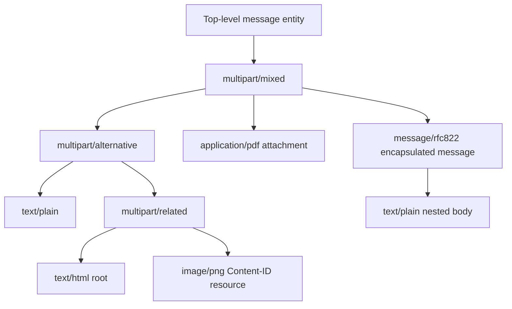

### Entity model

| Entity kind | Header scope | Body interpretation | Recursion |
|---|---|---|---|
| Top-level message | Message headers plus MIME entity fields | Whole message body | Can be composite |
| Multipart entity | Its own `Content-Type` and related fields | Delimiter-framed child entities | Direct recursion |
| Discrete leaf | Its own `Content-*` fields | Transfer-encoded or identity body octets | Stops MIME structure unless format itself contains data |
| `message/rfc822` | Part fields, then encapsulated message headers/body | Complete nested message | Starts new message tree |
| `multipart/related` | Container fields plus root-selection parameters | Compound object and linked resources | Root/resources can recurse |

### A practical entity path

Use stable paths instead of “the second attachment”:

```text
0                         top-level message
0.1                       first child of multipart/mixed
0.1.1                     plain alternative
0.1.2                     related HTML alternative
0.1.2.1                   HTML root
0.1.2.2                   inline image
0.2                       PDF attachment
0.3                       encapsulated message
0.3/message/0.1           nested message body
```

Product APIs may use their own part IDs. Preserve both the neutral tree path and the product identifier in a correlation table.

## 🔍 Plain-English deep-dive: MIME Is a Shipping Crate Tree, Not an Attachment List

Picture a large shipping crate. Inside it is a folder containing two versions of the same brochure. The richer brochure is itself packaged with a photo it references. Beside that folder is a sealed document envelope and another smaller crate containing a complete forwarded shipment manifest.

Calling everything except the visible brochure an “attachment” loses the structure. The photo may be a resource of the HTML brochure, not an independent document. The plain and HTML bodies are alternatives, not duplicate messages. The forwarded message has its own sender, subject, and MIME tree. A policy applied to the outer crate may differ from one applied to an inner item.

The analogy stops because MIME boundaries are byte-level delimiter lines and user agents can choose presentations. Still, it creates the right support habit: first map parent, child, and semantic container; only then label what the user sees.

When a customer says “the attachment disappeared,” ask:

- Which entity path contained the bytes?
- Was it a child of mixed, alternative, related, or an encapsulated message?
- Was it structurally parsed, transfer-decoded, classified, rendered, hidden as redundant, or removed by policy?
- Did another client build the same tree?

Memory hook: **Tree first, labels second.**

## The MIME Header Set

### Top-level and per-entity fields

| Field | Main purpose | Scope/caution |
|---|---|---|
| `MIME-Version` | Declares MIME message body format version | Required at top level for MIME-composed messages; not repeated on every ordinary part |
| `Content-Type` | Declares media type and parameters | Sender declaration, not byte verification |
| `Content-Transfer-Encoding` | Declares body transform/domain | Applies to the entity body only |
| `Content-ID` | Identifies an entity | Often links related resources |
| `Content-Description` | Optional human-readable description | Descriptive metadata, not a verdict |
| `Content-Disposition` | Suggests presentation and filename | Optional; untrusted filename handling required |
| Other `Content-*` | Extension-defined behavior | Verify defining specification |

In a body part, only fields beginning with `Content-` have MIME-defined meaning. Other fields can appear, but gateways may ignore or discard them. In `message/rfc822`, the inner message headers are message headers, not merely arbitrary part fields.

### Defaults are context-sensitive

| Situation | Default/handling concept |
|---|---|
| No valid `Content-Type` in ordinary entity | `text/plain; charset=US-ASCII` under base MIME default guidance |
| Child inside `multipart/digest` with no Content-Type | `message/rfc822` default |
| No `Content-Transfer-Encoding` | `7bit` |
| Unknown multipart subtype | Treat structurally as `multipart/mixed` |
| Unknown discrete/message subtype | Safe fallback generally resembles `application/octet-stream` handling |
| Unknown CTE | Treat content as opaque/application-octet-stream-like rather than guessing decode |

Defaults help interoperability; they do not justify erasing a malformed declaration from evidence. Record the raw field, parser warning, and effective fallback separately.

## Content-Type: Declared Nature and Parameters

The form is broadly:

```text
Content-Type: type/subtype; parameter=value; parameter2="quoted value"
```

Type, subtype, and parameter names are case-insensitive. Parameter value case depends on the parameter definition. Boundary values are case-sensitive. Parameter order is not significant.

### Initial MIME top-level categories

| Category | Kind | General handling idea | Security note |
|---|---|---|---|
| `text` | Discrete | Decode charset and display as text subtype defines | Markup/script-capable subtypes need renderer controls |
| `image` | Discrete | Pass recognized format to image handler | Image decoders are attack surface |
| `audio` | Discrete | Pass recognized format to audio handler | Parser/codec and resource risk |
| `video` | Discrete | Pass recognized format to video handler | Parser/codec and resource risk |
| `application` | Discrete | Data for an application or generic bytes | Often highest execution/active-content concern |
| `multipart` | Composite | Parse child entities by boundary | Structure itself; children carry encodings |
| `message` | Composite/special | Interpret encapsulated message subtype rules | Starts another message context |

IANA’s registry is the current source for registered media types and their defining references. Registration proves that a label is defined, not that a body is valid for it or safe.

## Multipart Boundary Parsing

A multipart `Content-Type` requires a boundary parameter. Delimiter lines begin at a line boundary with two hyphens plus the exact boundary value. The closing delimiter appends two more hyphens.

```text
Content-Type: multipart/mixed; boundary="outer-021-safe"

Preamble ignored by MIME-aware processing.
--outer-021-safe
Content-Type: text/plain; charset=UTF-8

First child.
--outer-021-safe
Content-Type: application/octet-stream
Content-Transfer-Encoding: base64
Content-Disposition: attachment; filename="note.bin"

U2FmZSBsYWI=
--outer-021-safe--
Epilogue ignored by MIME-aware processing.
```

### Boundary anatomy

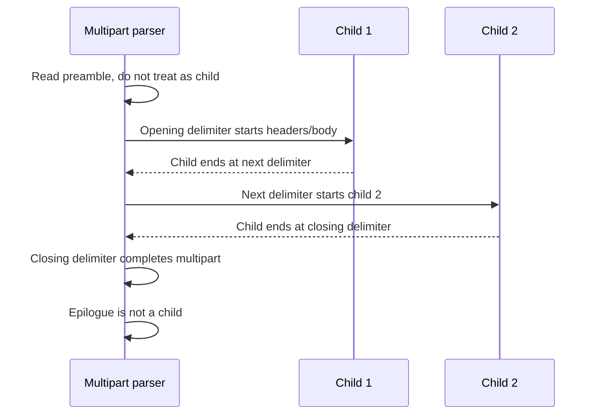

### Boundary facts

| Fact | Support consequence |
|---|---|
| Boundary parameter value omits the leading `--` | Parser adds delimiter prefix conceptually |
| Boundary comparison is case-sensitive | Normalizing case changes structure |
| Delimiter must begin at a line boundary | Same text in the middle of a line is not a delimiter |
| Closing delimiter adds `--` | Missing close can produce truncation/recovery differences |
| Nested multiparts need distinct boundaries | Reuse/prefix collisions can create ambiguity |
| Parent boundary can terminate a malformed inner part | Robust parser must still recognize outer structure |
| Preamble/epilogue are not MIME child content | UI may hide them; preserve in raw evidence |
| Composite CTE is restricted | Base64/QP normally belongs on innermost body, not multipart container |

### Boundary failure fingerprints

| Symptom | Candidate structural cause | Discriminating check |
|---|---|---|
| Last attachment missing | Missing/wrong delimiter or truncation | Compare raw end, declared boundary, parser warnings |
| Message body shows raw MIME | Top-level type missing/malformed or boundary not recognized | Inspect blank line and exact Content-Type syntax |
| Inner attachments swallowed | Inner close missing; parser recovery differs | Compare entity trees from named parsers |
| Extra empty part | Unexpected adjacent delimiters/whitespace interpretation | Preserve line endings and raw delimiter positions |
| Different clients show different parts | Ambiguous/malformed nesting | Minimal fixture and standards-vs-recovery analysis |
| Boundary string appears in decoded attachment | Usually irrelevant to outer parsing | Boundaries are found in encoded entity stream before leaf decode |

## Multipart Semantics

All multipart subtypes share syntax, but subtype changes the relationship among children.

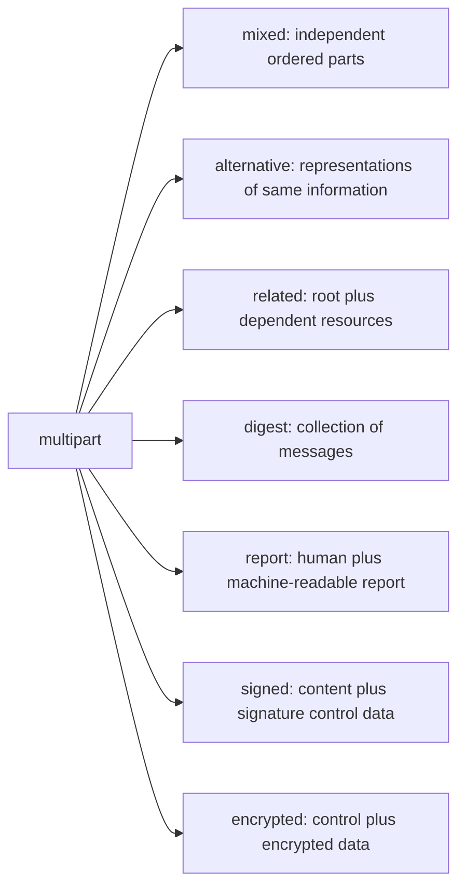

### `multipart/mixed`

Children are independent and bundled in order. A common composition is a body entity followed by one or more file-like parts. Do not assume every child after the first is an attachment; inspect disposition and semantics.

### `multipart/alternative`

Children represent alternative versions of the same information. Order is significant under RFC 2046: increasing faithfulness, with the preferred/richest format generally later. A capable user agent selects a suitable alternative rather than showing all as independent copies.

### `multipart/related`

Children form one compound object. The `type` parameter describes the root media type. The optional `start` parameter points to the root by Content-ID; without it, the first child is root. Related processing can override ordinary disposition presentation of component resources.

### `multipart/digest`

Represents a collection of messages and changes the default child type to `message/rfc822`.

### Other subtypes

`multipart/report`, `multipart/signed`, and `multipart/encrypted` have defining RFCs and specialized semantics. Do not flatten or reinterpret them using only the base mixed rules.

## 🔍 Plain-English deep-dive: Alternative Means Choose One, Not “Duplicate Body”

Imagine a train station announcement provided as printed text, an audio recording, and a large-print card. They communicate the same event through different representations. A passenger chooses the suitable version; the station did not announce three separate events.

`multipart/alternative` works similarly. A plain-text child and an HTML child are normally representations of the same message. A mail client can select HTML, plain text, or allow the user to switch. Security controls may inspect both because discrepancies matter, but a UI should not automatically present both as two independent attachments.

The analogy stops because alternatives can lose information or even disagree. A deceptive message might show a harmless statement in plain text and a different call to action in HTML. A bug can also generate stale alternatives. That means “same information” is the intended semantic relationship, not guaranteed byte or visual equivalence.

Support method:

1. keep both alternatives as evidence;
2. decode and normalize each under its own media type/charset;
3. compare meaningful text, links, and referenced resources with authorized tooling;
4. record which client selected which alternative;
5. separate composer defect, renderer choice, sanitizer result, and security action.

Memory hook: **Alternative is a menu, not a bundle.**

## Transfer Encoding Is Per Entity

`Content-Transfer-Encoding` says how the entity body was transformed for transport and/or what domain the untransformed body uses. It is not the media type and not the charset.

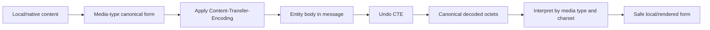

### CTE comparison

| CTE | Transformation | Typical use | Main troubleshooting trap |
|---|---|---|---|
| `7bit` | None | Short US-ASCII-safe lines | High-bit/NUL/long-line data mislabeled as 7bit |
| `8bit` | None | Line-oriented octets with high-bit values | Path lacks 8BITMIME or content altered |
| `binary` | None | Arbitrary octets under capable transport | Treated as ordinary DATA/line text |
| `quoted-printable` | `=HH`, literal safe characters, soft line breaks | Mostly readable text | Soft breaks mistaken for real newline; trailing whitespace |
| `base64` | 3 octets → 4 alphabet characters plus padding | Binary or dense data | Mistaken for encryption or decoded with wrong profile |
| Unknown | Undefined | Private/extension case | Guessing an algorithm instead of preserving opaque bytes |

### Scope rule

If CTE is in a body part’s headers, it applies only to that part’s body. Each sibling may use a different CTE. Multipart delimiters belong to the composite body framing and must remain visible to the multipart parser. Base64-encoding an entire multipart container would obscure structure and violates the normal composite restrictions.

## Base64

Base64 represents each 24 input bits (three octets) as four six-bit alphabet characters. If the final input group has one or two octets, `=` padding completes the final four-character quantum. MIME Base64 wraps encoded output into lines no longer than 76 characters.

### Harmless examples

| Original ASCII octets | Base64 |
|---|---|
| empty | empty |
| `f` | `Zg==` |
| `fo` | `Zm8=` |
| `foo` | `Zm9v` |
| `Safe lab` | `U2FmZSBsYWI=` |

### Size reasoning

Ignoring line breaks, encoded length is approximately:

$$4\left\lceil\frac{n}{3}\right\rceil$$

for $n$ input octets. That is roughly 33% overhead for large inputs, plus MIME line separators and entity headers.

### MIME profile matters

RFC 4648 gives general Base64 rules, but MIME’s profile explicitly permits/handles line wrapping and instructs MIME decoders about non-alphabet characters. Do not take strict behavior from a different Base64 profile and declare every MIME line break invalid. Conversely, liberal decoding can create covert-channel or parser-differential concerns, so record decoder mode and warnings.

## 🔍 Plain-English deep-dive: Base64 Is a Shipping Alphabet, Not a Lock

Imagine replacing every fragile object with a sequence of numbered, transport-safe blocks. The blocks are easy for the delivery system to carry, and anyone with the public block chart can rebuild the object. Nothing secret was added.

Base64 does exactly that for bytes: it maps them into a restricted printable alphabet. It is reversible without a key. The characteristic text may hide meaning from a casual glance, but it provides no computational confidentiality and no integrity guarantee.

The analogy stops because Base64 works at the bit level, uses padding, and MIME permits line breaks. The security lesson remains:

- never publish an AUTH response or token because it “looks encoded”;
- never call an attachment encrypted merely because its body is Base64;
- decode only in an authorized, bounded, non-executing workflow;
- hash and inspect the decoded bytes, not only the encoded text;
- preserve raw and decoded representations because normalization can differ.

A Base64 decode failure can mean truncation, wrong boundary extraction, invalid alphabet/padding, double encoding, or parser policy. It does not by itself prove maliciousness.

Memory hook: **Base64 changes the alphabet, not who can read it.**

## Quoted-Printable

Quoted-printable (QP) is designed for content that is mostly printable US-ASCII. An octet can be represented as `=` followed by two hexadecimal digits. A trailing `=` at the end of an encoded line marks a soft line break that is removed during decoding.

```text
Content-Type: text/plain; charset=UTF-8
Content-Transfer-Encoding: quoted-printable

This is one logical line that is folded for transport=
but continues without a decoded newline.
An equals sign is =3D and a trailing space can be =20
```

### QP rules that matter in support

| Observation | Interpretation |
|---|---|
| `=3D` | Decodes to `=` |
| `=20` at line end | Encoded trailing space |
| `=` immediately before CRLF | Soft break; remove both marker and transport break |
| Ordinary CRLF in text QP | Hard text line break |
| Encoded line >76 characters | Non-conformant; parser may recover differently |
| Lowercase hex | Formally invalid in original MIME rule, often tolerated |
| Dangling `=` at object end | Malformed/truncated input |
| Raw high-bit byte in QP | Malformed under standard encoding |

Decode QP before charset conversion. `=C3=A9` is a pair of octets under UTF-8; it is not two characters until the UTF-8 decoder maps it to one character.

## Charset: Octets to Characters

For textual media, transfer decoding recovers octets. The charset then maps those octets to characters. HTML parsing, plain-text rendering, link extraction, and visual comparison come later.

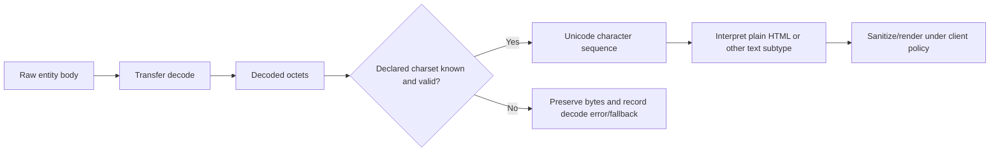

### Encoding layers comparison

| Layer | Example | Converts | Wrong-order symptom |
|---|---|---|---|
| Transfer encoding | Base64, QP | Mail-safe representation → original octets | Garbage text or failed parser |
| Character encoding/charset | UTF-8, ISO-8859-1 | Octets → characters | Mojibake/replacement characters |
| Markup/media parser | HTML, calendar, XML | Characters/octets → structured object | Missing layout/links/events |
| Renderer/sanitizer | Mail client HTML engine | Structured object → view | Blocked images, removed CSS/content |

### Common charset scenarios

| Raw evidence | Candidate cause | Discriminator |
|---|---|---|
| Valid UTF-8 bytes declared ISO-8859-1 | Wrong label | Strict decode under both and sender composer evidence |
| Invalid UTF-8 sequence | Truncation, corruption, wrong label | Byte offsets and transport/raw comparison |
| Correct decoded text but bad display | Renderer/font/bidi issue | Compare Unicode code points and named clients |
| QP text shows literal `=XX` | CTE not decoded or structure missed | Entity headers and parser stage |
| Base64 text appears as alphabet soup | Body treated as 7bit/plain | CTE field scope and parse tree |
| Different alternatives use different charsets | Valid independent representations or composer mismatch | Decode each leaf independently |

Do not overwrite undecodable octets with replacement characters in the evidence copy. Preserve raw bytes, attempted charset, error offset, fallback behavior, and displayed result separately.

## Disposition and Filenames

`Content-Disposition` is optional. `inline` suggests automatic/normal presentation; `attachment` suggests separate presentation requiring user action. `filename` suggests a terminal file name if the part is saved.

```text
Content-Disposition: attachment; filename="quarterly-summary.pdf"
```

RFC 2231 adds extended/continued parameter mechanisms:

```text
Content-Disposition: attachment;
 filename*=UTF-8''caf%C3%A9-summary.pdf
```

or segmented values such as `filename*0*`, `filename*1*`, and so on. Segments start at zero, continue without gaps, and concatenate in numeric order.

### Filename handling rules

| Rule | Why |
|---|---|
| Treat filename as untrusted metadata | Sender controls it |
| Use only terminal component semantics | Ignore supplied directory path |
| Sanitize reserved/control/bidirectional/confusable characters per platform policy | Avoid misleading or unsafe display/storage |
| Avoid overwrite/collision | Sender should not select an existing target |
| Do not execute/open automatically | Disposition/name is not authorization |
| Preserve raw and decoded name values | Needed for parser/UX/security comparison |
| Record which parameter won when duplicates conflict | Parsers may differ |
| Compare extension to declared/detected type | Mismatch is evidence, not verdict alone |

### Raw, decoded, displayed, and stored names

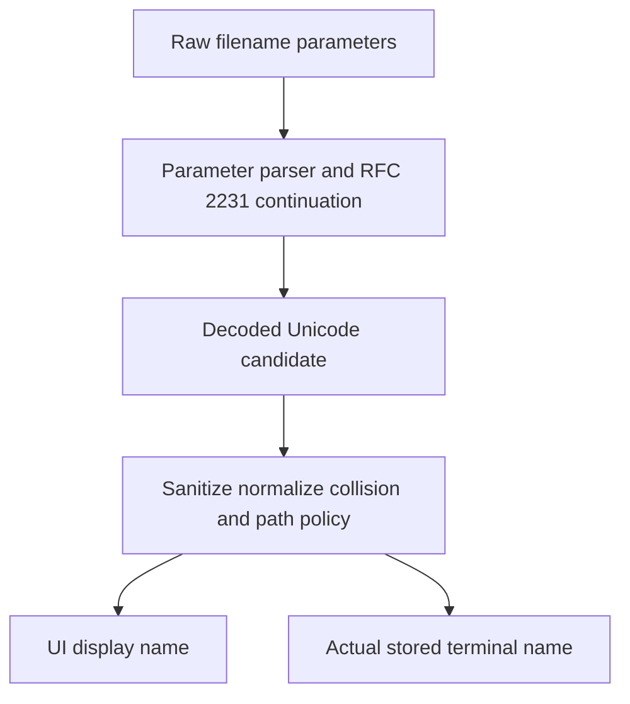

These names can all differ. A support case must say which one is under discussion.

## 🔍 Plain-English deep-dive: An Attachment Has Several Identity Cards

Imagine a traveler carrying a handwritten name tag, a declared occupation, a passport, and a bag whose contents are inspected separately. Those pieces of evidence can agree, disagree, or be forged. No single card answers every question.

A MIME part similarly has several identities:

- a filename and extension suggested by the sender;
- a declared Content-Type;
- a transfer encoding used to package the bytes;
- decoded-byte format evidence from static inspection;
- a Content-Disposition presentation suggestion;
- a renderer or operating-system association;
- a security product verdict and action.

The filename `summary.pdf` does not turn arbitrary bytes into PDF. `Content-Type: application/pdf` does not guarantee valid PDF or safety. A detected PDF signature does not guarantee the whole file is well formed or harmless. A hash identifies exact bytes but says nothing on its own about intent. An “inline” disposition does not make active content safe.

The analogy stops because parsers may accept polyglot or malformed formats differently, and file formats can contain nested/active content. The support rule is to build an evidence matrix and name contradictions rather than collapsing them into “the attachment type.”

Memory hook: **Name, claim, bytes, renderer, verdict: five separate columns.**

## Content-ID, Related Parts, and Inline Resources

A body part may have a globally unique Content-ID in angle-bracket message-ID syntax. A `cid:` URL references the corresponding identifier without the angle brackets, applying URL escaping where needed.

### Synthetic related structure

```text
Content-Type: multipart/related;
 boundary="rel-safe";
 type="text/html";
 start="<root.safe@example.invalid>"

--rel-safe
Content-Type: text/html; charset=UTF-8
Content-ID: <root.safe@example.invalid>

<html><body><p>Safe local fixture.</p>
</body></html>
--rel-safe
Content-Type: image/png
Content-Transfer-Encoding: base64
Content-ID: <image.safe@example.invalid>
Content-Disposition: inline; filename="blue.png"

[BASE64 OMITTED; NO FILE IS CREATED]
--rel-safe--
```

### Related resolution

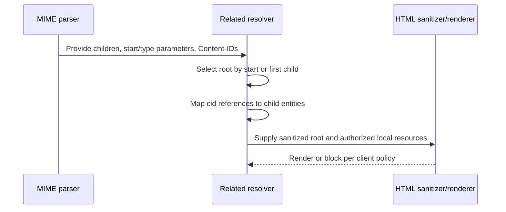

| Symptom | Candidate cause | Evidence |
|---|---|---|
| Red X/broken inline image | Missing/duplicate/mismatched Content-ID, bad Base64, policy block | Root reference, part ID, decode result, client log |
| Image shown as attachment | Client does not process related semantics or relationship malformed | Container subtype/start/type and client behavior |
| Wrong image shown | Duplicate Content-ID or resolver/cache issue | All Content-IDs and exact decoded hashes |
| Remote image loaded instead | HTML uses `https:` rather than `cid:` or sanitizer rewrites | Sanitized/raw HTML comparison under authorization |
| Entire related object suppressed | Root type unsupported or security policy | Container/root media type and action log |

Related resources are not necessarily “attachments” in the user’s sense, even if they have filenames. Product inventories may still count them as file-bearing parts. Define the taxonomy before comparing counts.

## `message/rfc822`: A Message Inside the Message

An encapsulated message begins another set of message headers and MIME body. Its visible `From`, `To`, `Subject`, and trace fields belong to the inner message. Do not merge them with the outer envelope/header context.

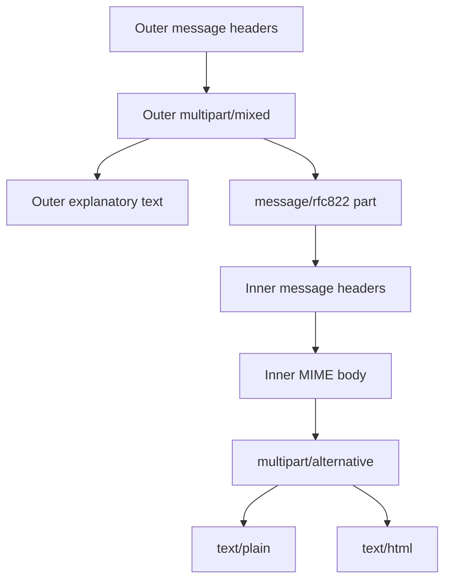

| Question | Outer answer | Inner answer |
|---|---|---|
| Who sent this transport message? | Outer trace/envelope/header evidence | Not answered by inner From |
| What was forwarded/attached? | `message/rfc822` child | Inner message content |
| Which authentication applies? | Authentication-Results and domain context must be scoped carefully | Inner historical fields are data inside current message unless revalidated/contextualized |
| Which attachment count? | Product taxonomy dependent | Recurse into inner tree only if product does |
| Which Message-ID? | Outer identifier | Separate inner identifier |

This is a common source of false correlation: a search for a subject or sender may match an encapsulated message rather than the current message.

## Attachment Identity and Mismatch Matrix

### Evidence dimensions

| Dimension | Example | Trust/meaning |
|---|---|---|
| Entity path | `0.2` | Structural location under a named parser |
| Disposition | attachment | Presentation suggestion |
| Raw filename | `summary.pdf` | Sender-controlled metadata |
| Decoded filename | `summary.pdf` | Parser output before local sanitization |
| Declared media type | `application/pdf` | Sender declaration |
| CTE | Base64 | Transport wrapper |
| Encoded size | 1,400 bytes | Raw entity-body representation |
| Decoded size | 1,024 bytes | Reconstructed octet count |
| Decoded hash | SHA-256 value | Exact-byte correlation |
| Detected format | PDF-like | Tool/version/static observation |
| Renderer | Client X preview | User-facing behavior |
| Security verdict/action | Quarantined under policy Y | Product observation, not universal fact |

### Mismatch examples

| Combination | What can be concluded | What cannot be concluded |
|---|---|---|
| `.pdf` + declared PDF + detected PDF | Three type signals agree | File is benign, valid, or safe to open |
| `.pdf` + declared octet-stream + detected PDF | Generic declaration, bytes look PDF-like | Sender intent or maliciousness |
| `.txt` + declared executable-like type + incompatible byte signature | Strong type/name contradiction | Exact intent without more evidence |
| No filename + inline image + detected PNG | Related visual resource likely | It should always appear in UI |
| Attachment disposition + text/plain | Separate text file presentation | Content is harmless |
| Base64 + unknown decoded signature | Opaque bytes need bounded static handling | Encryption or malware |

### Multiple names and conflicting parameters

Real messages can contain a `name` parameter on Content-Type, `filename` on Content-Disposition, extended values, continuations, duplicates, or malformed mixtures. Standards and implementations do not make every conflict unambiguous. Preserve all raw parameters and record each parser’s selected display name.

Do not design a security decision that trusts whichever value produces the safest-looking extension.

## Encoded, Decoded, Extracted, and Rendered Representations

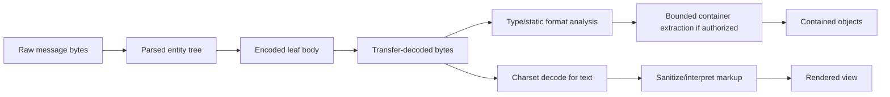

| Representation | Preserve? | Typical operation | Safety boundary |
|---|---|---|---|
| Raw message | Yes, under authorized handling | Parse only | May contain sensitive content/secrets |
| Encoded leaf | Yes | Validate CTE/framing | Do not equate alphabet with safety |
| Decoded octets | Hash/retain per policy | Static identify/scan | Do not execute/open with associated app |
| Extracted archive members | Only authorized, bounded | Enumerate safely | Limits for depth, count, ratio, size, paths |
| Decoded text | Yes where minimized | Charset/semantic comparison | Beware control/bidi/confusable characters |
| Sanitized/rendered view | Capture behavior, not replacement evidence | Compare clients/policies | Rendering can fetch or execute active behaviors if uncontrolled |

Part 022 does not teach live detonation, exploitation, bypass, or unsafe file handling. Production security analysis should use approved isolated tooling and organizational procedures.

## Safe Attachment-Risk Reasoning

MIME analysis contributes structural and metadata evidence to a broader security decision. It does not replace content inspection, reputation, behavioral analysis, user/context signals, or product policy.

### Static risk indicators

| Indicator | Why it matters | Benign alternatives | Next safe check |
|---|---|---|---|
| Filename/type mismatch | Can mislead user or parser | Bad composer/generic MIME | Decoded byte type and sender workflow |
| Multiple conflicting filename values | Parser differential opportunity | Compatibility duplication | Raw parameter inventory across parsers |
| Deep nesting | Parser/resource complexity | Forwarding, signatures, reports | Depth/count limits and semantic tree |
| Oversized encoded part | Storage/processing pressure | Legitimate large document | Declared/encoded/decoded sizes and policy |
| Extreme compression ratio | Resource exhaustion concern | Legitimate highly repetitive data | Approved bounded archive metadata tooling |
| Invalid Base64/QP tolerated by one parser | Differential/obfuscation concern | Transport corruption | Strict/lenient results and exact invalid offsets |
| HTML/plain disagreement | User/client view divergence | Composer bug/stale body | Semantic alternative comparison |
| Duplicate Content-ID | Resource resolution ambiguity | Broken composer | Resolver behavior and hashes |
| Missing closing boundary | Truncation/recovery differences | Incomplete capture/transport error | Full raw source and parser warnings |
| Executable-capable format declaration | Active-content risk | Legitimate business file | Approved policy/static controls; do not open |

Indicator does not equal verdict. A clean-looking MIME tree also does not prove safety.

## Malformed MIME and Parser Differentials

MIME implementations often recover from malformed input to serve users. Recovery is useful but creates ambiguity when products choose different trees.

### Common malformed forms

| Malformation | Possible outcomes |
|---|---|
| Missing boundary parameter | Body shown raw, guessed, or treated as plain text |
| Boundary parameter does not match delimiter | Zero children, raw body, or heuristic recovery |
| Missing closing delimiter | Last child recovered, truncated, or entire multipart rejected |
| Duplicate `Content-Type` | First wins, last wins, error, or combined-invalid |
| Invalid parameter quoting | Value truncated or field rejected |
| RFC 2231 gaps/duplicates | Partial name, fallback name, or no name |
| Base64 invalid character/padding | Strict failure, tolerant decode, different output |
| QP dangling `=` | Literal preservation, truncation warning, or failure |
| Conflicting nested boundaries | Different parent/child assignments |
| Header/body blank line missing | Header consumes body lines or part fails |

### Differential workflow

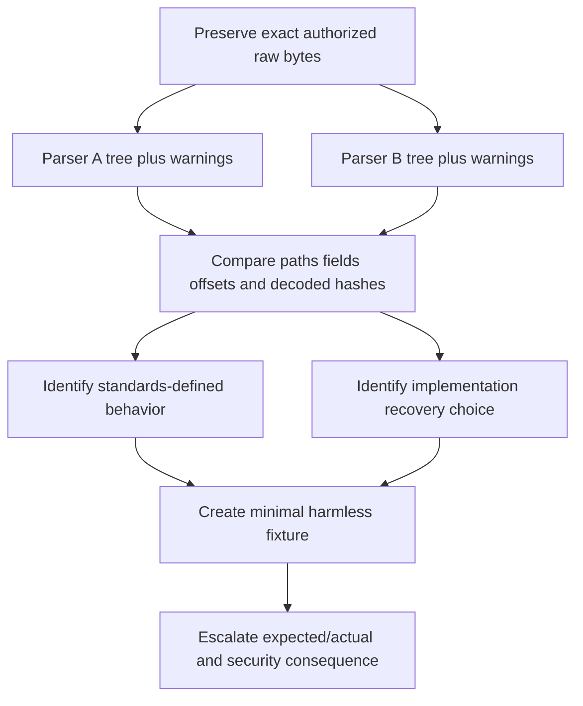

Do not “repair” the only evidence copy. Derive a labeled minimal fixture separately, removing customer content and replacing payload bytes with harmless text while preserving the structural ambiguity.

## Troubleshooting Decision Tree

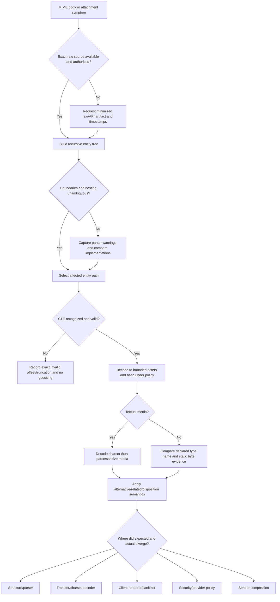

## Worked Example 1: Plain and HTML Alternative

### Synthetic fixture

```text
MIME-Version: 1.0
Content-Type: multipart/alternative; boundary="alt-safe"

--alt-safe
Content-Type: text/plain; charset=UTF-8
Content-Transfer-Encoding: quoted-printable

Status: all synthetic systems are normal.
--alt-safe
Content-Type: text/html; charset=UTF-8
Content-Transfer-Encoding: quoted-printable

<html><body><p>Status: all synthetic systems are normal.</p></body></html>
--alt-safe--
```

### Tree

| Path | Type | CTE | Semantic role |
|---|---|---|---|
| 0 | multipart/alternative | 7bit default | Choose one representation |
| 0.1 | text/plain; UTF-8 | quoted-printable | Plain alternative |
| 0.2 | text/html; UTF-8 | quoted-printable | Rich alternative, later/preferred where supported |

### Conclusion

There are two entities but one intended message-body meaning. A product that reports “two body parts” and a client that displays one are not contradictory. A product that calls the HTML part an “attachment” may use a different taxonomy; request its part classification definition.

## Worked Example 2: Related Inline Image Missing

### Observations

- Container: `multipart/related`.
- `start` points to `<root.safe@example.invalid>`.
- HTML uses `cid:image.safe@example.invalid`.
- Image part’s Content-ID is `<image-safe@example.invalid>` with a hyphen instead of a dot.
- Base64 itself is valid.

### Reasoning

The root reference and image entity identifier do not match. The renderer has no standards-defined target for that `cid:` URL. The image bytes can still be present and may appear as a separate part or attachment. This is a composition/relationship defect, not an SMTP delivery failure.

### Customer-safe update

> The message and image entity were received, but the HTML references a different Content-ID from the image part. The client therefore cannot resolve the inline resource under the MIME relationship. We recommend correcting the sender’s composition template and retesting with a fresh message; no evidence currently indicates transport loss.

## Worked Example 3: Filename and Type Disagree

### Entity ledger

| Field | Value |
|---|---|
| Path | 0.2 |
| Disposition | attachment |
| Filename | `summary.pdf` |
| Declared type | `text/plain` |
| CTE | Base64 |
| Decoded bytes | Harmless ASCII text `Safe lab only` |
| Static type observation | Plain text in this synthetic fixture |

### Conclusion

The `.pdf` suffix conflicts with both declared and observed content. This can be a composer naming error or deceptive metadata; MIME alone does not determine intent. A safe control changes only the filename to `summary.txt` and checks whether product policy/action changes, without creating or opening a file.

## Worked Example 4: Invalid Base64 and Parser Difference

### Synthetic body

```text
Content-Type: application/octet-stream
Content-Transfer-Encoding: base64
Content-Disposition: attachment; filename="safe.bin"

U2FmZSBsYWI=!
```

Parser A ignores the trailing non-alphabet `!` under a MIME-tolerant behavior and decodes `Safe lab`. Parser B reports invalid Base64 and leaves opaque bytes.

### Escalation statement

> The same entity produces different decoded-state outcomes. Raw offset N contains `!` outside the Base64 alphabet after padding. We need the product’s documented MIME decoder profile and expected disposition when malformed Base64 is encountered. The fixture contains only harmless text.

Do not claim either parser is universally correct without considering the MIME profile, exact input, product contract, and security requirements.

## Worked Example 5: Nested Message Scope

An outer message from `forwarder@example.net` contains a `message/rfc822` child whose inner `From` is `author@example.org`. A search result labels the whole item by the inner author.

### Evidence split

| Claim | Correct evidence |
|---|---|
| Current SMTP sender/outer author context | Outer envelope, trace, outer From/authentication |
| Forwarded message visible author | Inner From inside entity path 0.2/message |
| Inner attachment | Recurse under inner MIME tree |
| Product search-label cause | Product indexing documentation/logs |

The correction is not to delete the inner author. It is to scope each field to outer or encapsulated context.

## Worked Example 6: Quoted-Printable Soft Break Looks Like Corruption

Raw QP:

```text
The identifier is SAFE-12345-=
67890 and remains one logical line.
```

After QP decoding, the logical text is:

```text
The identifier is SAFE-12345-67890 and remains one logical line.
```

A raw-text search that includes the transport CRLF fails, while a decoded-text search succeeds. Support should state which representation the product indexes. If the product claims decoded semantic indexing but searches raw encoded lines, the fixture is a useful harmless reproduction.

## Failure Modes and Cheapest Discriminators

| Symptom | Plausible layer | Cheapest discriminating check |
|---|---|---|
| Raw MIME visible to user | Top-level/structure parser | Exact Content-Type and blank separator |
| One part missing | Boundary/truncation/alternative selection/policy | Tree plus parser warnings and action log |
| Garbled text | CTE/charset/renderer | Decode bytes in correct order and compare code points |
| Attachment name wrong | Parameter decoding/sanitization/UI | Raw filename/name/extended values vs displayed value |
| Inline image broken | Related root/CID/decode/policy | Resolve exact Content-ID and image decode result |
| Attachment count differs | Taxonomy/nesting | Compare entity paths and definition of “attachment” |
| Hash differs across systems | Different decoded body, line canonicalization, or extraction | Hash exact representation and entity path at each stage |
| Size differs | Encoded vs decoded vs extracted vs displayed | Name size unit/stage |
| Type differs | Declaration vs detection vs OS association | Build type identity matrix |
| One client displays, another blocks | Renderer/sanitizer/policy | Same raw bytes in named versions with logs |
| Forwarded sender confused | `message/rfc822` scope | Outer and inner header trees |
| Scanner says clean but policy blocks | Verdict/action distinction | Rule/action log and scanner scope |

## Customer Communication Patterns

| Situation | Precise wording |
|---|---|
| Attachment absent from UI | “The raw message contains entity path 0.2; we are determining whether parsing, alternative selection, related-resource handling, or policy suppressed its presentation.” |
| Bad filename | “The sender supplied multiple/conflicting name parameters; the client selected and sanitized one value for display.” |
| Garbled text | “Transfer decoding succeeded, but the declared charset does not map the recovered octets cleanly; we are comparing composer intent and client fallback.” |
| Type mismatch | “The filename, declared Content-Type, and decoded-byte format do not agree. This is a mismatch signal, not by itself a final security verdict.” |
| Broken inline image | “The image bytes are present, but the root’s cid reference does not resolve to the image Content-ID.” |
| Different parser outcomes | “Two components construct different MIME trees from the same malformed boundary sequence; Engineering is reviewing expected recovery behavior.” |
| Base64 present | “The body is transfer-encoded for transport. Base64 is reversible encoding and does not imply encryption.” |
| Final action unknown | “MIME structure explains the part, but the product action requires its policy/verdict telemetry.” |

## Escalation Packet

| Field | Required content |
|---|---|
| Case scope | Message/tenant/account identifiers minimized per policy |
| Time | UTC receipt/ingestion/render windows |
| Source | Exact authorized raw representation and acquisition method |
| Entity path | Neutral path plus product part ID |
| Raw fields | Content-Type, CTE, disposition, ID/location, all parameters |
| Structure | Parent subtype, boundaries, root/alternative semantics |
| Decode | Tool/version/profile, success/warning/error offset |
| Byte evidence | Encoded/decoded sizes and authorized hashes |
| Identity matrix | Name, declared type, detected type, renderer association |
| Expected/actual | Precise parser/tree/render/action difference |
| Control | One-variable harmless fixture |
| Security | No execution; approved static handling only |
| Explicit ask | Parser contract, policy decision, or product defect question |

## Safe Lab - MIME Tree and Attachment-Risk Worksheet

### Objective

Build and compare MIME trees for harmless, synthetic, text-only fixtures. Practice transfer decoding, charset ordering, alternative/related semantics, filename parameter handling, and mismatch communication without writing or opening decoded files.

### Safety and evidence label

- **Evidence label:** Local/public lab.
- Work only in a text editor or approved offline parser that displays strings in memory.
- Do not send the fixtures by email.
- Do not connect to external services or upload samples.
- Do not create executable, macro, script, archive, or exploit content.
- Do not save decoded bytes using a sender-supplied filename.
- Do not open output in a browser, office suite, image viewer, or operating-system-associated application.
- Use only reserved domains such as `example.invalid` and harmless phrases.

### Prerequisites

1. An authorized, non-production local study folder and a plain-text or Markdown editor.
2. This Part plus the linked MIME RFCs for checking structure and decoding rules.
3. Optional approved offline parser configured only to display harmless strings in memory; no public decoder or cloud upload is required.
4. Permission to delete local artifacts and editor history if real data is pasted accidentally.

### Fixture 1: Mixed body and harmless “attachment”

```text
MIME-Version: 1.0
Content-Type: multipart/mixed; boundary="mix-safe"

--mix-safe
Content-Type: text/plain; charset=UTF-8
Content-Transfer-Encoding: quoted-printable

This is the visible body.
--mix-safe
Content-Type: application/octet-stream
Content-Transfer-Encoding: base64
Content-Disposition: attachment; filename="safe-note.bin"

U2FmZSBsYWI=
--mix-safe--
```

Expected decoded string for `0.2`: `Safe lab`.

### Fixture 2: Alternative representations

Use Worked Example 1. Record why there are two leaves but one semantic body selection.

### Fixture 3: Related root and CID mismatch

Use Worked Example 2 with only HTML text and an omitted image body marker. Do not create image bytes.

### Fixture 4: RFC 2231 filename

```text
Content-Type: text/plain; charset=UTF-8
Content-Transfer-Encoding: 7bit
Content-Disposition: attachment;
 filename*=UTF-8''caf%C3%A9-summary.txt

Harmless text only.
```

Expected decoded candidate filename: `café-summary.txt`. Preserve the raw ASCII parameter separately.

### Fixture 5: Invalid Base64

Use Worked Example 4. Compare strict error and MIME-tolerant warning behavior. Do not hide the invalid byte.

### Fixture 6: Encapsulated message

```text
MIME-Version: 1.0
Content-Type: multipart/mixed; boundary="outer-safe"

--outer-safe
Content-Type: text/plain; charset=US-ASCII

Forwarded harmless fixture follows.
--outer-safe
Content-Type: message/rfc822

From: Inner Author <inner@example.invalid>
To: Inner Recipient <recipient@example.invalid>
Date: Mon, 24 Aug 2026 12:00:00 +0000
Message-ID: <inner-safe@example.invalid>
Subject: Inner harmless message
MIME-Version: 1.0
Content-Type: text/plain; charset=UTF-8

Inner body.
--outer-safe--
```

### Step 1: Preserve raw structure

Number every line and record line-ending assumptions. Do not unfold, decode, normalize case, or repair syntax in the raw worksheet.

### Step 2: Build entity trees

For each fixture, complete:

| Path | Parent | Type | CTE | Disposition | Name | Content-ID | Raw body lines |
|---|---|---|---|---|---|---|---|

### Step 3: Parse multipart semantics

Record boundary parameter, each opening delimiter, closing delimiter, preamble/epilogue, and semantic subtype. Explain why alternatives differ from mixed children and why related resources depend on the root.

### Step 4: Transfer-decode leaf bodies

Decode only the tiny known-safe strings in memory. Record:

| Path | Encoded text | Decoder/profile | Decoded string/bytes | Warning/error |
|---|---|---|---|---|

Never use an unknown body from a real message in this exercise.

### Step 5: Apply charset after CTE

For each text leaf, state the recovered octets, declared charset, resulting characters, and any error. Explain why doing charset conversion before QP/Base64 decoding is wrong.

### Step 6: Build the attachment identity matrix

For every file-like or inline resource part, record:

| Path | Raw name values | Decoded candidate | Extension | Declared type | Decoded-byte observation | Disposition | Semantic role |
|---|---|---|---|---|---|---|---|

No cell may say simply “actual type” without naming evidence and tool.

### Step 7: Compare parser behavior

For invalid Base64, define two named modes:

- strict generic Base64 validation;
- MIME-aware tolerant decoding with warning.

Record exact outputs and source rule. Do not use “Parser A is secure, Parser B is broken” without a product contract and threat analysis.

### Step 8: Create one-variable controls

Create text-only derived fixtures changing exactly one element:

- matching versus mismatching Content-ID;
- `multipart/mixed` versus `multipart/alternative`;
- correct versus missing closing boundary;
- `filename=` versus `filename*=`;
- valid versus one invalid Base64 character;
- correct versus incorrect charset label.

Predict the expected tree/decode/render effect before comparing.

### Step 9: Write customer updates

Write six updates, each under 100 words. Include raw observation, effective parser result, user-visible effect, owner/next action, and proof ceiling.

### Step 10: Build one escalation packet

Use the invalid Base64 or missing-boundary control. Include exact harmless fixture, parser versions/modes, tree diff, expected behavior source, impact, and one explicit Engineering question.

### Step 11: Spoken exercise

Explain in five minutes:

1. entity tree;
2. multipart boundaries;
3. mixed versus alternative versus related;
4. CTE versus charset;
5. Base64/QP;
6. filename/type/byte identities;
7. parser differentials and safety.

### Validation rubric

Score the entity trees, decoding ledger, one-variable controls, escalation packet, and spoken explanation together. Executing content, uploading a sample, or using customer material is an automatic fail.

| Dimension | Fail (0) | Developing (1) | Pass (2) |
|---|---|---|---|
| Tree accuracy | Flat list | Basic children | Full recursive paths and parent semantics |
| Boundary reasoning | Guesses separators | Finds most delimiters | Exact opening/closing/nesting/preamble behavior |
| Decode order | Mixes layers | Mostly correct | CTE → bytes → charset/media every time |
| Multipart semantics | Treats all as attachments | Names subtypes | Correct mixed/alternative/related/message behavior |
| Identity matrix | Trusts filename | Compares two signals | Name/type/bytes/renderer/verdict separated |
| Differential analysis | Picks a winner | Records difference | Standards, recovery, impact, minimal fixture |
| Safety/honesty | Opens/sends content or overclaims | Synthetic only | Bounded text-only handling and precise experience labels |
| Communication | Says “MIME issue” | Names layer | Observation, effect, owner, next check, proof ceiling |

Target: at least 14/16.

### Expected evidence

The lab should produce these inspectable, text-only artifacts so a reviewer can reproduce the MIME tree and decoding conclusions without opening any payload:

1. Six entity trees.
2. Boundary and multipart semantic maps.
3. Transfer/charset decode ledger.
4. Attachment identity/risk worksheet.
5. Strict/tolerant parser comparison.
6. Six one-variable controls.
7. Six customer updates.
8. One escalation packet and scorecard.

### Cleanup and privacy

- Retain only harmless synthetic text according to local policy.
- Remove accidental real addresses, tokens, customer content, and decoded payloads immediately from authorized notes/history.
- Redact personally identifiable information (PII), secrets, tenant identifiers, internal hosts, and message content; delete the complete artifact if redaction would destroy safe handling or provenance.
- Verify before retention or sharing that no live email activity, external lookup, public upload, payload execution, or third-party analysis occurred.
- Never upload raw email to a public decoder or analysis service.
- This lab does not test live mail transport, production parsers, archive extraction, malware detection, rendering safety, or Abnormal behavior.
- Static agreement among filename, Content-Type, and byte signature is still not a benign verdict.

## Official Source Anchors

All listed sources were accessed on August 24, 2026 and must be revalidated for current provider behavior.

| Source | Coverage used | Status/currency note |
|---|---|---|
| [RFC 2045 - MIME Part One](https://www.rfc-editor.org/rfc/rfc2045) | Entity fields, Content-Type, CTE, QP, Base64, Content-ID, canonical concepts | Standards Track/Draft Standard, November 1996; updated by RFC 2231 and RFC 6532 among others |
| [RFC 2046 - MIME Part Two](https://www.rfc-editor.org/rfc/rfc2046) | Media types, multipart syntax/semantics, charset, message/rfc822, defaults | Standards Track/Draft Standard, November 1996; updated by later RFCs |
| [RFC 2049 - MIME Part Five](https://www.rfc-editor.org/rfc/rfc2049) | Conformance, safe fallback, canonical encoding model, complex example | Standards Track/Draft Standard, November 1996 |
| [RFC 2183 - Content-Disposition](https://www.rfc-editor.org/rfc/rfc2183) | Inline/attachment, filename suggestion, multipart disposition, filename security | Standards Track, August 1997; updated by RFC 2231 |
| [RFC 2231 - MIME Parameter Extensions](https://www.rfc-editor.org/rfc/rfc2231) | Non-ASCII/language/continuation parameter values | Standards Track, November 1997; obsoletes RFC 2184 |
| [RFC 2387 - multipart/related](https://www.rfc-editor.org/rfc/rfc2387) | Root, type/start/start-info, related/disposition precedence | Standards Track, August 1998 |
| [RFC 2392 - cid and mid URLs](https://www.rfc-editor.org/rfc/rfc2392) | Content-ID references and URL mapping | Standards Track, August 1998 |
| [RFC 4648 - Base-N Encodings](https://www.rfc-editor.org/rfc/rfc4648) | General Base64 alphabet, padding, canonical/security considerations | Standards Track, October 2006; MIME profile remains context-specific |
| [RFC 6838 - Media Type Registration](https://www.rfc-editor.org/rfc/rfc6838) | Current registration framework | Best Current Practice 13, January 2013 |
| [IANA Media Types Registry](https://www.iana.org/assignments/media-types/media-types.xhtml) | Current registered types and references | Registry showed Last Updated August 17, 2026 at access |

### Source boundaries

- MIME fields express structure, declarations, and suggestions; they do not supply a universal security verdict.
- RFCs do not specify Abnormal’s parser, normalization, limits, attachment taxonomy, or actions.
- Rendering and sanitization differ by mail client and version.
- General RFC 4648 Base64 rules must be interpreted through the MIME profile where MIME applies.
- IANA registration does not prove body validity, conformance, safety, or sender intent.

## ⭐ Likely Interview Questions

### Q1. How do you analyze a MIME message from scratch?

**Model answer:** I preserve the exact authorized raw message, parse it recursively into entity paths, and apply each multipart subtype’s semantics. For each leaf I record raw Content fields, undo that entity’s transfer encoding, inspect/hash the recovered octets under approved static controls, then apply charset or media parsing. Finally I compare disposition/name, declared and detected type, renderer behavior, and product verdict without collapsing them into one “actual type.”

### Q2. What is the difference between Content-Type and Content-Transfer-Encoding?

**Model answer:** Content-Type describes the intended media format and parameters, such as `text/plain; charset=UTF-8`. Content-Transfer-Encoding says how that entity body was made transport-safe or what transfer domain it uses, such as Base64 or quoted-printable. I undo CTE first to recover octets, then interpret those octets according to media type and charset.

### Q3. Explain mixed, alternative, and related.

**Model answer:** `multipart/mixed` bundles independent ordered parts. `multipart/alternative` contains representations of the same information, normally ordered from less to more faithful so a client selects one. `multipart/related` is a compound object with a root and dependent resources, often HTML plus Content-ID images. They share boundary syntax but their child relationships and presentation are different.

### Q4. Is Base64 encryption, and why is it used?

**Model answer:** No. Base64 is reversible encoding with no key or confidentiality. It maps arbitrary octets into a portable printable alphabet for text-oriented transport. In MIME it has line and tolerance rules specific to that profile. I still protect encoded credentials or content because anyone can decode them.

### Q5. Can you trust an attachment filename or Content-Type?

**Model answer:** No single signal is authoritative. The filename is untrusted presentation metadata and can include misleading extensions or unsafe path characters. Content-Type is a sender declaration. I compare raw/decoded names, declared type, decoded-byte static observations, size/hash, container structure, renderer association, and product verdict. Agreement improves classification evidence but does not prove safety.

### Q6. Why might two clients display the same MIME message differently?

**Model answer:** They may recover malformed boundaries or encodings differently, choose different alternatives, resolve related Content-IDs differently, support different media types, sanitize HTML differently, or apply different policy. I compare exact raw bytes, parser trees/warnings, selected entity paths, decoder profiles, client versions, and action logs before assigning root cause.

### Q7. How would you troubleshoot a missing inline image?

**Model answer:** I identify the related container and root, extract the raw `cid:` reference, map it exactly to Content-ID, verify uniqueness, validate the image part’s transfer decode and media type, and check client/security policy. I distinguish “bytes missing” from “relationship broken,” “decode failed,” and “renderer blocked.”

### Q8. How do you keep MIME analysis safe and honest?

**Model answer:** I use minimized authorized evidence, preserve raw data, avoid public decoders, and do not open or execute attachments. Labs use harmless strings only. Production byte inspection belongs in approved isolated tooling with resource limits. I label this as standards-based upskilling, not production Abnormal or malware-analysis experience, and I separate RFC facts from provider behavior.

## 🧠 30-Second Memory Hooks

- **MIME is a recursive tree, not a flat attachment list.**
- **Entity = Content headers + body.**
- **Parse boundaries before decoding leaves.**
- **CTE → octets → charset/media → renderer.**
- **Base64 changes alphabet, not secrecy.**
- **QP final `=` means soft break.**
- **Mixed bundles; alternative chooses; related links.**
- **Boundary value is case-sensitive and closing delimiter adds `--`.**
- **Filename is a suggestion, never a trusted path or type.**
- **Name, declared type, bytes, renderer, and verdict are separate columns.**
- **Content-ID belongs to a part; cid links local resources.**
- **message/rfc822 starts an inner message context.**
- **Unknown/malformed means preserve and warn, not guess.**
- **A mismatch is evidence, not a final malicious verdict.**

## Completion Checklist

### Knowledge

- [ ] I can define message, entity, body part, body, and multipart.
- [ ] I can build recursive entity paths including message/rfc822.
- [ ] I can parse opening and closing boundary delimiters.
- [ ] I can explain mixed, alternative, related, and digest semantics.
- [ ] I can distinguish Content-Type, CTE, charset, and disposition.
- [ ] I can explain Base64 and quoted-printable without calling them encryption.
- [ ] I can map cid references to Content-ID.
- [ ] I can build a filename/type/byte/renderer/verdict matrix.

### Lab and artifact

- [ ] I built all six synthetic entity trees.
- [ ] I recorded boundary and multipart semantic maps.
- [ ] I transfer-decoded only the known-safe strings in memory.
- [ ] I applied charset after CTE and recorded errors separately.
- [ ] I completed the attachment-risk worksheet.
- [ ] I compared strict and MIME-aware Base64 behavior.
- [ ] I created six one-variable controls.
- [ ] I wrote six updates and one escalation packet.
- [ ] I scored at least 14/16.

### Spoken explanation

- [ ] I can explain the recursive tree in two minutes.
- [ ] I can explain the decode pipeline in one minute.
- [ ] I can distinguish the three common multipart subtypes in one minute.
- [ ] I can explain attachment identity contradictions without overclaiming.
- [ ] I can answer Q1–Q8 in my own words.

### Honesty and safety

- [ ] I label the work local/public lab and learned architecture.
- [ ] I do not claim production Abnormal, Google Workspace, SEG, or malware-analysis experience.
- [ ] I used only reserved domains and harmless text.
- [ ] I did not send, upload, extract, open, render, or execute any attachment.
- [ ] I did not store decoded bytes under a sender-supplied filename.
- [ ] I distinguish metadata, byte evidence, renderer behavior, and verdict.

### Source and currency

- [ ] I use RFCs 2045/2046/2049 plus updates rather than a single blog summary.
- [ ] I use RFC 2231, not obsolete RFC 2184, for extended MIME parameters.
- [ ] I use RFC 2387/2392 for related roots and cid references.
- [ ] I check current IANA registration for media types.
- [ ] I record the Base64 profile/decoder mode rather than assuming all contexts match.
- [ ] I recorded the August 24, 2026 source access date.

[Next: Part 023 - Headers Message IDs Threading and Timestamps](Part-023-headers-message-ids-threading-and-timestamps.md)