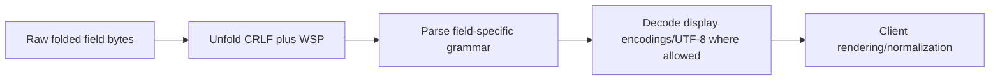
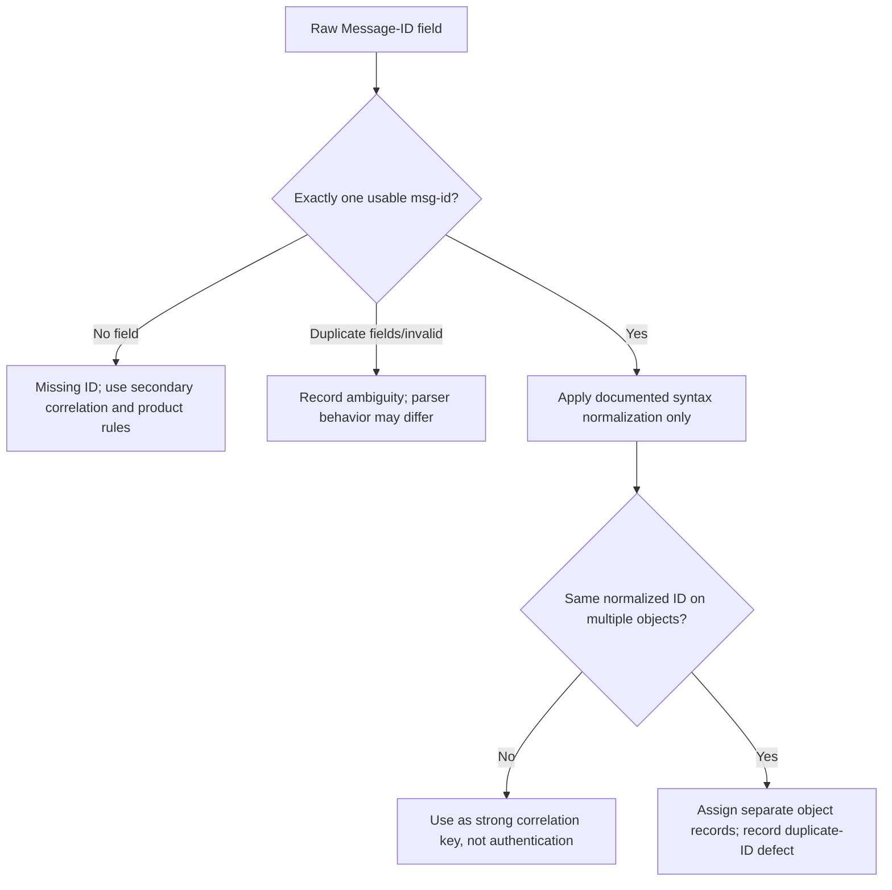
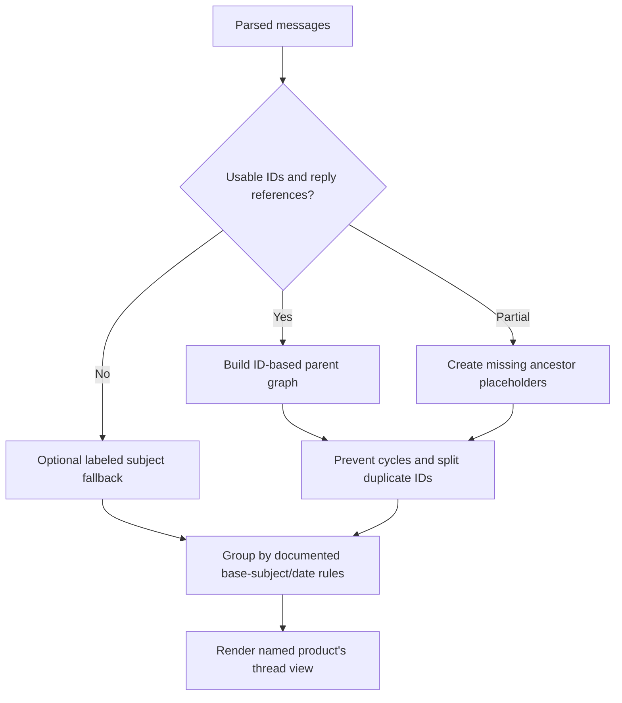
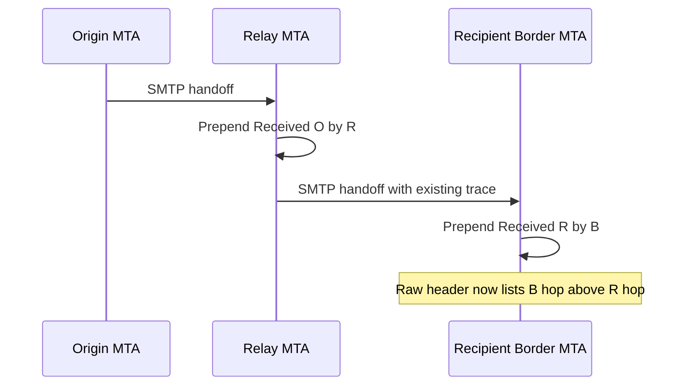
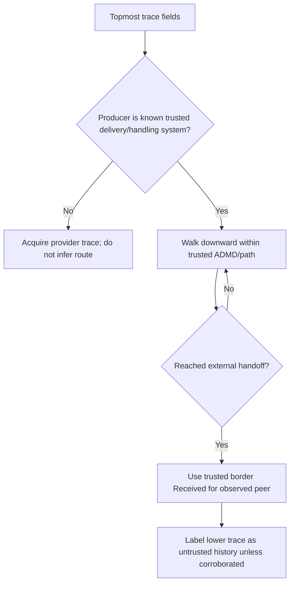
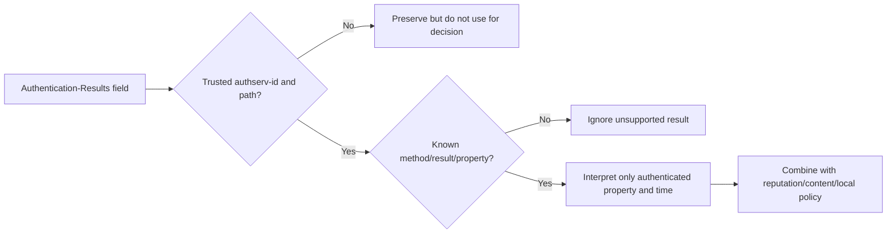
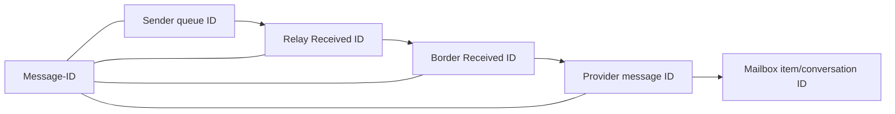
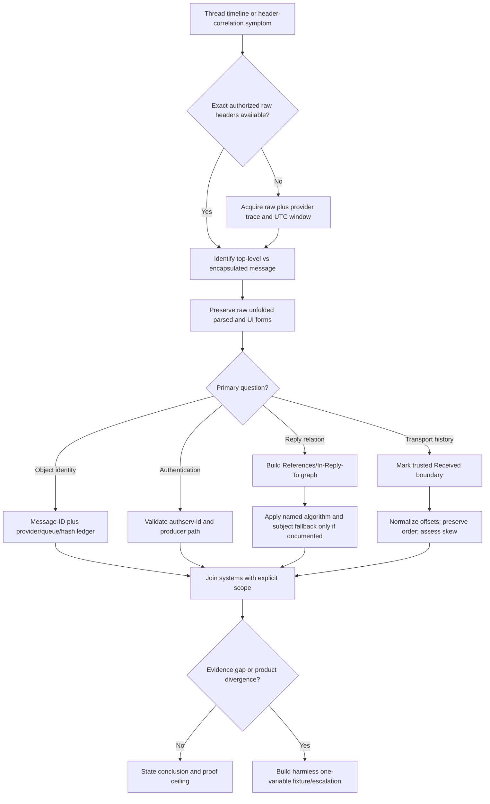

# Part 023 - Headers Message IDs Threading and Timestamps

> **Purpose:** Use identification, reply, trace, authentication-result, and time fields to correlate messages and reconstruct a defensible conversation/transport history without treating any sender-controlled field as authentication or any single clock as perfect truth.
>
> **Evidence rule:** Internet Message Format semantics come from RFC 5322 plus updates; SMTP trace construction comes from RFC 5321; Authentication-Results trust handling comes from RFC 8601. Thread views, provider IDs, ingestion times, parser recovery, and UI labels are implementation behavior and must be verified in the named product/version. A field can be syntactically valid and factually false.
>
> **Currency and official-source access date:** August 24, 2026.

## Section Goal

By the end of this Part, you should be able to answer four different questions with four different evidence sets:

1. **Which message object is this?** Use Message-ID plus provider/queue IDs, entity scope, hashes, envelope, and time.
2. **Which earlier message does it claim to answer?** Use In-Reply-To and References to build a reply graph, then validate missing/duplicate/cycle conditions.
3. **Which systems handled it and when?** Use trusted Received fields and system logs, normalize offsets, and account for queueing and clock skew.
4. **Which authentication assertions can this consumer trust?** Use Authentication-Results only inside a known Administrative Management Domain (ADMD) trust boundary and with an expected `authserv-id`.

The learner should stop saying “the header time” or “the email ID.” Instead, you should name the exact field, producer, representation, trust level, and proof ceiling.

The practical outcome is a **Header Timeline and Thread-Correlation Exercise** using invented messages, reserved domains, documentation IP addresses, and manually provided timestamps. No mail is sent, no DNS is queried, and no customer data is used.

## JD Mapping

| Supplied role signal | Capability developed here | Practical proof |
|---|---|---|
| Troubleshoot delivery and processing | Reconstructs trusted hop order, delay windows, and handoff IDs | Header timeline |
| Investigate security detections | Separates sender fields, trusted trace, and authentication assertions | Header trust matrix |
| Work across email platforms | Correlates neutral RFC identifiers with provider message/trace IDs | Correlation ledger |
| Diagnose “wrong thread” cases | Builds explicit parent graph and explains subject fallback | Thread graph |
| Handle timestamps accurately | Normalizes zones, records clock source, and marks skew/uncertainty | UTC worksheet |
| Collaborate with Engineering | Supplies minimal header fixture and expected/actual graph | Parser/threading escalation |
| Communicate customer status | Uses exact event/source rather than vague “sent at” wording | Customer update set |
| Build reusable knowledge | Creates trust-boundary and timeline workflow | Decision tree |

## Candidate Honesty Note

Your production support experience transfers strongly here. Distributed-system investigations routinely require correlation IDs, multiple clocks, queue delays, trust boundaries, and careful wording about what a log proves. Email headers are another evidence surface with the same engineering discipline.

This Part is standards-based learning and a local/public lab. It does not establish production administration of Exchange Online mail flow, Google Workspace, Abnormal, or IMAP threading servers. You can honestly say you understand the neutral identification/trace model and knows how to build a defensible timeline, while learning vendor-specific IDs, retention, clock sources, and UI algorithms during ramp.

| Evidence label | Honest use | Claim boundary |
|---|---|---|
| **Production-transfer example** | Real Microsoft investigations with correlation IDs and multi-system clocks | Do not call them email-threading cases unless they were |
| **Working knowledge/upskilling** | Message IDs, reply graphs, Received trust, time normalization | Do not imply direct SEG/Abnormal operations |
| **Local/public lab** | Synthetic headers and manual graphs | No live mail, DNS, accounts, or customer evidence |
| **Learned architecture** | RFC-defined field semantics | No private product algorithm claim |
| **No direct experience** | Abnormal and Google Workspace production | State directly |
| **Template only** | Timeline, trust matrix, escalation packet | Not a vendor-specific runbook |

## Fact Labels and Evidence Classes

| Label | Meaning | Example |
|---|---|---|
| **Standards syntax** | Field grammar and multiplicity | Message-ID contains one `msg-id` in angle-bracket syntax |
| **Standards semantics** | Intended meaning | Date is origination readiness time, not actual transport time |
| **Producer assertion** | Value written by sender/composer or untrusted handler | Message-ID, Date, Subject, lower Received fields |
| **Trusted local observation** | Value generated by a known system in the consuming ADMD | Border MTA’s observed peer IP in its Received field |
| **Authentication assertion** | Method result reported by a producer | `dkim=pass` in Authentication-Results |
| **Provider observation** | Named product log/API value | Ingestion time or internal message ID |
| **Derived value** | Analyst computation preserving source | UTC-normalized time and apparent hop delta |
| **Inference to validate** | Hypothesis requiring another check | Clock skew explains negative apparent latency |
| **Unknown/private** | Non-public behavior | Exact Abnormal threading/correlation algorithm |
| **Synthetic example** | Invented safe evidence | `<m2@example.invalid>` |

## Beginner Term Primer

| Term | Plain meaning | Why it matters | Memory hook |
|---|---|---|---|
| **Header section** | Fields before the first blank line | Carries message metadata and trace | Metadata block |
| **Header field** | Name, colon, field body | Each field has its own grammar/producer | One metadata record |
| **Structured field** | Field body with formal tokens | Must parse, not split casually | Grammar matters |
| **Unstructured field** | Mostly display text after unfolding/decoding | Subject is text, not an identifier | Human label |
| **Raw representation** | Exact folded field lines/octets | Needed for signatures and parser disputes | Preserve first |
| **Unfolded representation** | CRLF followed by whitespace removed | Used before semantic parsing | Join continuation |
| **Decoded representation** | Encoded-words/UTF-8 interpreted where valid | What a user/parser may compare | Human characters |
| **UI representation** | Client-rendered label/time/thread | Product behavior, not raw truth | What user sees |
| **Message-ID** | Globally unique intended identifier for one message version | Main reply/correlation key | Object label |
| **msg-id** | Identifier syntax inside angle brackets | Machine-readable token | Left@right in brackets |
| **In-Reply-To** | ID(s) of direct parent message(s) | Claims immediate reply relationship | Parent pointer |
| **References** | Ordered ancestry identifiers | Supports thread reconstruction | Ancestor chain |
| **Subject** | Human-readable topic text | Useful fallback, weak identity | Topic, not key |
| **Base subject** | Subject after defined reply/forward artifacts are removed | Used by one IMAP sort/thread model | Normalized topic |
| **Thread** | UI/algorithm grouping of related messages | Can differ across clients | Conversation view |
| **Reply graph** | Nodes are messages; edges are reply relationships | More precise than a flat thread list | Parent-child map |
| **Duplicate Message-ID** | Two stored messages claim same identifier | Breaks uniqueness and algorithms | One ID, multiple objects |
| **Dummy/missing ancestor** | Referenced ID with no stored message | Preserves graph continuity | Placeholder parent |
| **Cycle** | Reply links eventually point back to same node | Invalid/hostile/malformed graph | No family loops |
| **Date** | Creator-indicated time message became ready | Sender clock and offset can be wrong | Composition time claim |
| **Resent-Date** | Resender-indicated dispatch time for resending event | Informational; separate from original Date | Reintroduction time claim |
| **Received** | Trace field prepended by a receiving SMTP system | Records one hop’s sender/receiver/time observation | Hop receipt |
| **Trace field** | Field added during handling, normally prepended | Order and trust boundary matter | Handler evidence |
| **Return-Path** | Final-delivery copy of SMTP reverse-path | Error-report destination, not visible author | Bounce route |
| **Authentication-Results** | Structured report of authentication checks | Trust producer/authserv-id before result | Who tested what? |
| **authserv-id** | Identifier of authentication service/ADMD | Consumer decides whether result is trusted | Result producer ID |
| **ADMD** | Administrative Management Domain | Defines operational trust boundary | Who governs the system? |
| **UTC offset** | Local time minus UTC | Enables instant normalization | UTC = local - offset |
| **+0000** | Explicit UTC offset | Local reference is UTC | Known UTC |
| **-0000** | UTC instant but local zone information unknown | Do not infer sender locality | Unknown local zone |
| **Clock skew** | Difference between a clock and actual/reference time | Can make hops look reversed | Clocks disagree |
| **Queue delay** | Time held between receiving and next transfer | Real delay, not necessarily network latency | Waiting, not wire time |
| **Ingestion time** | Provider/product observed arrival/process time | Strong within named system if clock/log trusted | Product saw it then |
| **INTERNALDATE** | IMAP server’s internal date for a message | Not the same as sender Date | Mailbox storage date |
| **Correlation ID** | Identifier linking records in one system/path | Scope may be local, not global | Log join key |
| **Documentation IP** | Reserved non-production address such as 192.0.2.0/24 | Safe examples | Never a live target |
| **Proof ceiling** | Strongest conclusion evidence supports | Prevents overclaiming | What can this prove? |

## Four Header Representations

Header analysis should preserve transformations rather than replacing one form with another.



| Representation | Example use | Do not use it for |
|---|---|---|
| Raw | DKIM input, forensic offsets, duplicate-field order | Simple display comparison without parsing |
| Unfolded | Structured token parsing | Assuming comments/quotes are semantic text |
| Parsed/canonical candidate | msg-id comparison, date components | Replacing raw evidence |
| Decoded Unicode | Subject/display comparison | Byte-exact signature evidence |
| UI | Reproducing customer-visible behavior | Proving raw value or product algorithm |

An analyst should store these as columns. “The header says” is too vague.

## Message-ID: Identity, Not Authentication

Every message should have one Message-ID. It contains a single globally unique intended identifier for one version of one message. The angle brackets delimit the syntax; semantically the identifier is inside them.

```text
Message-ID: <m1.20260824@example.invalid>
```

### What Message-ID proves

| Claim | Verdict |
|---|---|
| “These logs mention the same identifier string.” | Supported if parsing/normalization agree |
| “This is the same exact byte-for-byte message.” | Not guaranteed; trace additions and transformations can occur |
| “The domain on the right authenticated the sender.” | Not supported |
| “The timestamp-like left side is accurate time.” | Not supported |
| “No other message can ever reuse it.” | Intended uniqueness, but bad/hostile generators can duplicate |
| “A revised semantic message should normally receive a new ID.” | Supported by RFC semantics |

### Identifier comparison

For current RFC 5322 generation, internal comments/folding are not allowed within the identifier. Obsolete forms may need interpretation. The IMAP REFERENCES algorithm in RFC 5256 normalizes syntactically equivalent quoted obsolete forms and then compares Message IDs case-sensitively.

Do not lowercase the entire Message-ID as a casual normalization. Preserve raw form and document any algorithm-specific canonicalization.



## 🔍 Plain-English deep-dive: Message-ID Is a Luggage Tag, Not a Passport

Imagine an airline luggage tag. It is excellent for joining scanner events that mention the same tag. It does not prove who packed the bag, whether the printed airport is truthful, or whether someone mistakenly printed the same tag twice.

Message-ID works the same way. It is designed as a globally unique machine identifier and is excellent for correlation and reply links. But the composer can choose it. The right-hand domain is normally selected to help uniqueness; it is not an authentication result. A timestamp-looking left-hand token is merely text unless corroborated.

The analogy stops because a message can acquire new Received fields while retaining its Message-ID, and semantic revisions should use a new ID. Still, it blocks a common support/security mistake: “The Message-ID ends in trusted-company.example, so the message came from that company.”

Use Message-ID with other keys:

- local queue/provider ID;
- envelope pair;
- trusted Received hop;
- UTC window;
- body/attachment hashes where authorized;
- authentication identities/results;
- mailbox/store object ID.

Memory hook: **Great join key, weak identity proof.**

## In-Reply-To and References

A reply normally places its direct parent’s Message-ID in In-Reply-To. References normally copies the parent’s References chain and appends the parent’s Message-ID.

### Three-message example

```text
Message A
Message-ID: <a@example.invalid>

Message B
Message-ID: <b@example.invalid>
In-Reply-To: <a@example.invalid>
References: <a@example.invalid>

Message C
Message-ID: <c@example.invalid>
In-Reply-To: <b@example.invalid>
References: <a@example.invalid> <b@example.invalid>
```

```mermaid
graph LR
    A[<a@example.invalid>] --> B[<b@example.invalid>]
    B --> C[<c@example.invalid>]
```

### Construction and interpretation

| Field | Intended content | Typical graph use | Caveat |
|---|---|---|---|
| Message-ID | Current node ID | Identify node | Can be missing/invalid/duplicate |
| In-Reply-To | Direct parent ID(s) | Immediate edge | Multiple parents legal in format but hard for thread UIs |
| References | Ancestors, normally ending with parent | Reconstruct ancestry | Can be truncated, forged, malformed |
| Subject | Human topic | Fallback grouping | Same subject can be unrelated |
| Date | Creator’s readiness time | Sibling/display ordering | Sender-controlled clock |

### Parent selection model

1. Parse valid IDs from References if present.
2. For a simple reply, the last usable References ID is usually the claimed parent.
3. If References is absent/unusable, an algorithm may use a usable In-Reply-To ID.
4. Create placeholders for referenced IDs not in the current mailbox/data set.
5. Reject graph edges that create cycles.
6. Treat duplicate current Message-IDs as separate stored objects, according to the named algorithm/product rule.
7. Use subject only as an explicitly labeled fallback/merge heuristic.

This is a teaching model aligned with common References-based logic, not a claim that every mail client uses the same implementation.

## Threading Is an Algorithm, Not a Header Fact

RFC 5322 defines the identification fields and reply construction. It does not mandate a universal mailbox UI thread algorithm. RFC 5256 defines specific IMAP SORT/THREAD extensions, including ORDEREDSUBJECT and REFERENCES. A local client may implement a variant or a different algorithm.

### Algorithm comparison

| Approach | Primary evidence | Strength | Failure mode |
|---|---|---|---|
| Exact parent graph | References/In-Reply-To/Message-ID | Preserves explicit reply structure | Missing/bad IDs fragment graph |
| RFC 5256 REFERENCES | IDs plus subject merge rules | Handles missing nodes and common mail behavior | False References can merge threads |
| ORDEREDSUBJECT | Base subject plus sent date | Works without IDs | Unrelated same-subject mail grouped |
| Provider conversation ID | Private/server-generated metadata | Consistent inside product if preserved | Not portable or visible in raw IMF |
| Client heuristic | IDs, subject, participants, time | User-friendly | Version/client divergence |

### Subject normalization is lossy

Removing `Re:`, forwarding wrappers, list tags, whitespace, and encoded-word differences can create a base subject. It can also remove meaningful text or fail on localized conventions. Subject comparison is evidence of topic similarity, not direct ancestry.



## 🔍 Plain-English deep-dive: A Thread Is a Family Tree Drawn by a Particular Librarian

Imagine letters in an archive. Some say “this replies to letter B”; some list the chain A, B; some only repeat the same title. One librarian draws parent-child links from explicit references. Another groups by title and date. Both can produce useful but different shelves.

Email threading is like that. The identification fields provide relationship claims, but the final thread view is an algorithm. Missing ancestors, duplicate IDs, multiple parents, subject changes, mailing-list rewrites, and mailbox subsets can alter the displayed tree.

The analogy stops because headers can be forged and products can carry private conversation IDs. The support lesson remains: ask for the expected algorithm and compare its inputs and output. Do not say “the header thread is wrong”; headers do not contain a finished thread.

For a wrong-thread ticket, capture:

- raw Message-ID, In-Reply-To, References, Subject, Date;
- parsed/canonical forms and warnings;
- mailbox subset and missing messages;
- product/client version and account;
- private conversation/thread ID if exposed;
- expected and actual parent edges;
- a one-variable synthetic fixture.

Memory hook: **Fields claim relationships; software draws the tree.**

## Received: One Hop per Receiving System

When an SMTP server accepts a message for delivery or further processing, it prepends a Received field. Existing Received fields must not be reordered, changed, or deleted by normal Internet mail programs. Therefore the topmost Received field is normally the most recently added.

### Simplified syntax and clauses

```text
Received: from sender.example.invalid (sender.example.invalid [192.0.2.10])
        by border.example.invalid with ESMTPS id B123
        for <recipient@example.invalid>;
        Mon, 24 Aug 2026 15:05:00 +0000
```

| Clause | Meaning/evidence | Caution |
|---|---|---|
| `from` | Claimed EHLO/name plus observed connection information where generated correctly | Claimed name and observed IP are different evidence |
| `by` | Receiving system that generated this field | Trust only if field producer is trusted/established |
| `via` | Link/environment type | Optional/registered semantics |
| `with` | Protocol/transmission type | Shows claimed handling mode for this hop |
| `id` | Receiver’s local transaction/queue identifier | Scope is that system; syntax varies |
| `for` | One recipient path if included | Optional and sensitive; not full envelope recipient set |
| date-time | Receiver’s local timestamp with offset | Clock can be skewed; normalize but preserve raw |

### Header order versus travel order



Raw top-to-bottom is newest-to-older trace insertion. A chronological reconstruction often reads the trustworthy segment from older to newer, but trust analysis comes first.

## Received Trust Boundary

An attacker can place fake Received fields in message content before sending. The recipient border’s own Received field is valuable because the trusted receiver writes it from the actual connection and the client’s claims. Fields below that first trusted boundary are not automatically trustworthy.

### Practical boundary workflow

1. Identify the system that delivered the exact raw message to the mailbox/product.
2. Mark its top trace fields as trusted only if source/acquisition and ADMD configuration establish that trust.
3. Traverse downward through systems known to be inside the same trusted path.
4. At the border hop, distinguish the peer IP observed by the receiver from names supplied by that peer.
5. Treat older fields below the untrusted handoff as historical assertions unless corroborated.
6. Never delete them from the worksheet; label trust instead.



### Trace proof ceilings

| Evidence | Proves | Does not prove |
|---|---|---|
| Trusted border Received observed IP | That border accepted a connection from that peer IP for this message handling event | Original human/device author |
| `from` EHLO name | What client presented, if recorded | DNS ownership or authenticity |
| `with ESMTPS` | TLS was used for that recorded hop under producer semantics | End-to-end encryption or safe content |
| Local `id` | Join key in receiver system | Global uniqueness |
| `for` path | One recorded recipient context | All envelope recipients |
| Lower untrusted Received | A string existed in received content | That the claimed hop occurred |

## 🔍 Plain-English deep-dive: Read the Route from a Known Checkpoint, Not from the Oldest Story

Imagine a secure office receiving a package. Its front-desk camera proves which courier actually arrived. Inside the box is a handwritten route card claiming that the package previously visited three prestigious offices. The card may be accurate, mistaken, or fabricated. Starting with the oldest handwritten line and treating it as fact would give the least controlled evidence the greatest authority.

Received analysis has the same problem. A sender can place Received-looking text into a message before handing it to the recipient organization. The recipient border’s own trace field is different: a trusted system creates it from a real connection, recording both what the peer claimed and what the receiver observed. That field is the checkpoint from which trust analysis begins.

The analogy stops because legitimate intermediate MTAs also prepend Received fields, and a recipient may explicitly trust an upstream service operated by another organization. Trust is administrative and path-specific, not simply “inside the building.” The disciplined workflow is:

1. establish how the exact raw message was acquired;
2. identify the current recipient ADMD’s delivery and border systems;
3. walk through known trusted handlers without changing header order;
4. use the trusted border field to anchor the external peer connection;
5. label older claims below that handoff as untrusted unless another source corroborates them;
6. normalize timestamps only after this trust map exists.

This also clarifies the familiar advice to “read Received bottom-up.” Bottom-up is a useful way to visualize chronological insertion within a trustworthy trace segment. It is not a permission to believe the physically lowest field. An old-looking timestamp and an internal-looking hostname do not create provenance.

Memory hook: **Anchor at the trusted border; history below it must earn corroboration.**

## Return-Path

At final delivery, the delivery SMTP system inserts a Return-Path field that preserves the SMTP reverse-path used for error reporting. It can differ from visible From and commonly points to a mailing-list or bounce handler. A null reverse-path becomes an empty path.

```text
Return-Path: <bounce-handler@example.invalid>
From: Human-Readable Author <author@example.invalid>
```

| Question | Return-Path answers? |
|---|---|
| Where should delivery failures be directed for this delivered copy? | Yes, under final delivery semantics |
| Who is the visible author? | No; see From |
| Which domain SPF evaluated? | Often related to SMTP MAIL FROM, but use trusted Authentication-Results/log evidence |
| Was the message authenticated? | No |
| Did every relay preserve the same reverse-path? | Not necessarily; lists/gateways can rewrite |
| Was this field present at original composition? | It should not be supplied by originator; final delivery may replace it |

Exactly one Return-Path should normally exist in a delivered message. Duplicate/conflicting fields require raw preservation and delivery-system investigation.

## Authentication-Results

RFC 8601’s Authentication-Results is a structured report: `authserv-id`, then one or more `method=result` statements and supporting properties. Its mere presence does not make it trustworthy.

```text
Authentication-Results: inbound.example.invalid;
    spf=pass smtp.mailfrom=sender.example;
    dkim=pass header.d=sender.example
```

### Trust checklist

| Check | Why |
|---|---|
| Is the raw message acquired from the receiving ADMD/provider? | Establishes evidence context |
| Is `authserv-id` expected and configured as trusted? | Foreign sender can write lookalike fields |
| Did border processing remove forged instances claiming local identity? | RFC 8601 mitigation |
| Is field position consistent with trusted trace producers? | Useful but not infallible due to reordering |
| Are method/result/property names understood/current? | Unknown values must not drive decisions |
| Is this top-level current message, not inside message/rfc822? | Encapsulated historical results normally lack current value |
| Does result authenticate the claimed property? | SPF does not authenticate arbitrary header/local-part/content |



A trusted `dkim=pass` is not “message is safe.” A malicious or compromised sender can authenticate its own domain. Detailed SPF, DKIM, and DMARC semantics come in Parts 025–027.

## Date and Time Fields

### Date is origination time

RFC 5322 Date indicates when the creator considered the message complete and ready to enter delivery. A laptop can compose/queue offline and transmit later. The sender clock can be wrong. Therefore Date is neither first SMTP acceptance time nor final delivery time.

### Zone arithmetic

Email numeric offset expresses local time minus UTC. Therefore:

$$T_{UTC}=T_{local}-offset$$

Examples:

| Raw email time | Offset interpretation | UTC instant |
|---|---|---|
| `Mon, 24 Aug 2026 09:00:00 -0600` | Local is 6 hours behind UTC | `2026-08-24 15:00:00Z` |
| `Mon, 24 Aug 2026 18:30:00 +0330` | Local is 3h30 ahead of UTC | `2026-08-24 15:00:00Z` |
| `Mon, 24 Aug 2026 15:00:00 +0000` | Explicit UTC | `2026-08-24 15:00:00Z` |
| `Mon, 24 Aug 2026 15:00:00 -0000` | UTC instant, local zone unknown | `2026-08-24 15:00:00Z`, no locality inference |

Keep raw RFC 5322 syntax and add a derived ISO/RFC3339-like UTC column for analysis. Do not rewrite the evidence field into RFC 3339 and call it original syntax. RFC 3339 is useful for normalized analyst/log output, not the defining grammar of email Date.

### Time-source matrix

| Time | Producer/event | Typical trust | Main caveat |
|---|---|---|---|
| Date | Message creator | Sender assertion | Wrong clock, offline queue, deliberate value |
| Resent-Date | Resender | Resending assertion | Not actual transport time |
| Received timestamp | Receiving hop | Strong for trusted producer | Clock skew and processing timing |
| Queue log enqueue/dequeue | Named MTA | Strong inside system | Retention/time sync and ID mapping |
| Provider ingestion | Named provider | Strong for that observation | Definition/version may differ |
| Mailbox INTERNALDATE | IMAP/store | Server metadata | Not sender Date; import/copy can affect |
| UI “received” time | Client | Derived/display behavior | May choose Date, server time, or conversation time |
| DKIM signature timestamp | Signer tag | Signed assertion if signature verifies/covers context | Signer clock and optional field |

## 🔍 Plain-English deep-dive: A Timeline Is a Row of Witnesses with Different Watches

Imagine several desk clerks stamping a parcel as it passes. The sender writes when packing finished. Each clerk’s stamp records when that clerk saw it, but one wall clock is four minutes fast. A warehouse log records two hours of waiting. The final app displays only “today at 10:00,” converted to the viewer’s zone.

Email timelines are the same. Date, Received, queue logs, ingestion time, and UI time describe different events. UTC normalization makes offsets comparable; it does not repair clock skew or convert an assertion into an observation.

The analogy stops because some header fields can be forged and clocks can change during processing. The analyst therefore stores:

- raw timestamp and syntax;
- normalized UTC instant;
- event definition;
- producing system;
- trust level;
- known synchronization/skew evidence;
- precision;
- correlation ID;
- derived delta and confidence.

A negative apparent hop delay is not proof of time travel or forged mail. It is a signal to check clock skew, field trust, parsing, and route ordering.

Memory hook: **Normalize zones; interrogate clocks; name events.**

## Building a Trustworthy Timeline

### Synthetic trace

```text
Received: from relay.example.invalid (relay.example.invalid [198.51.100.20])
        by border.example.invalid with ESMTPS id B-900;
        Mon, 24 Aug 2026 15:06:00 +0000
Received: from submit.example.invalid (submit.example.invalid [192.0.2.10])
        by relay.example.invalid with ESMTPSA id R-800;
        Mon, 24 Aug 2026 09:04:30 -0600
Date: Mon, 24 Aug 2026 18:33:00 +0330
Message-ID: <timeline-safe@example.invalid>
```

### Normalized worksheet

| Event | Raw time | UTC | Producer | Trust | Notes |
|---|---|---|---|---|---|
| Creator ready | 18:33 +0330 | 15:03:00Z | Composer | Assertion | May precede submission |
| Relay received | 09:04:30 -0600 | 15:04:30Z | relay.example.invalid | Trusted only if chain establishes it | Authenticated submission indicated by transmission type, not author proof alone |
| Border received | 15:06 +0000 | 15:06:00Z | border.example.invalid | Trusted local border | Observed relay peer 198.51.100.20 |

Apparent intervals: 90 seconds creator→relay, 90 seconds relay→border. These are differences between clock readings/events, not pure network latency.

```mermaid
timeline
    title Synthetic UTC-normalized message observations
    15:03:00 : Creator Date assertion
    15:04:30 : Relay Received observation
    15:06:00 : Border Received observation
```

### Clock-skew handling

If hop A’s trusted Received normalizes to 15:05 and downstream hop B’s normalizes to 15:04, do not reorder fields by timestamp. Trace insertion/order and topology evidence may be stronger. Record apparent delta −60 seconds and investigate synchronization. If known skew intervals exist, reason with ranges rather than invented corrected points.

## Correlating Across Systems

Message-ID is portable but imperfect. Provider IDs are strong within one product but can change across hops/copies. Build a composite key ledger.

| Key | Scope | Strength | Failure mode |
|---|---|---|---|
| Message-ID | Intended global message identity | Strong common join | Missing/duplicate/rewrite/new version |
| SMTP/Received `id` | One receiving MTA | Strong local join | Not globally unique or exposed |
| Sending queue ID | One sending MTA | Strong attempt/message join | New ID after transfer/retry/copy |
| Provider message ID | Provider tenant/service | Strong if documented | Migration/copy/version transformations |
| InternetMessageId/API field | Product mapping of Message-ID | Useful bridge | Parser normalization or missing value |
| Envelope sender/recipient | Transaction context | Good filter | Many messages share pair |
| UTC window | Cross-system narrowing | Essential | Clock skew and retention |
| Size/hash | Exact representation/part | Strong byte correlation | Trace additions/canonicalization/transformations |
| Subject | Human hint | Weak | Reuse, localization, attacker control |



Document where the bridge is observed rather than assuming every ID refers to the same object granularity.

## Resent Fields and Forwarded Messages

Resent fields describe a user reintroducing an existing message into transport while preserving original fields. Each resending event prepends a block. Most recent resent block appears first. Resent fields are informational and are not used for normal reply processing.

Forwarding a message as a new message or `message/rfc822` attachment is different. Transport forwarding by an MTA is different again.

| Operation | Original fields | New identity/trace | Reply behavior |
|---|---|---|---|
| Resend | Original Date/From/Message-ID preserved; Resent-* prepended | Resent-Message-ID should identify resend event | Normal replies use original fields, not Resent-* |
| Forward as attachment | Original message encapsulated inside new outer message | New outer Message-ID; inner ID preserved in attachment | Reply to outer sender unless user targets inner content |
| Inline forward | Original content copied into new body | New Message-ID | No machine parent relation guaranteed |
| SMTP relay | Message-ID retained; Received prepended | Local trace IDs | Not a user-level forward |

This distinction matters when a product indexes inner headers or groups resent copies.

## Failure Modes and Cheapest Discriminators

| Symptom | Plausible cause | Cheapest discriminator |
|---|---|---|
| Reply appears as new thread | Missing/invalid/rewritten parent IDs | Compare raw In-Reply-To/References and product parsed values |
| Unrelated mail merged | Duplicate Message-ID, false References, subject fallback | Inspect explicit parent edges and algorithm |
| Thread differs by client | Different algorithm/mailbox subset/private conversation metadata | Same raw set in named clients/versions |
| Message appears before its parent | Date clock/offset, sort criterion, import/INTERNALDATE | Identify field used by UI and normalize |
| Negative hop latency | Clock skew, forged lower trace, parse error | Trust boundary and clock source evidence |
| “Sent time” differs from trace | Date is creator readiness, offline queue | First trusted Received/submission log |
| Return-Path differs from From | Normal envelope/header separation/list rewrite | Trusted envelope/Auth-Results and delivery semantics |
| Auth pass shown on suspicious mail | Authenticated attacker/lookalike or untrusted forged field | authserv-id/trust path and exact authenticated domain |
| Duplicate Return-Path | Bad originator/delivery/gateway behavior | Raw top trace and delivery MTA logs |
| Same Message-ID, different body | Bad generator/reuse or modification under same intended identity | Authorized hashes and trace/version context |
| Missing Message-ID added later | Submission completion behavior | Trace/comment/provider generation evidence |
| Inner Authentication-Results trusted | Encapsulated historical field consumed incorrectly | MIME entity scope and current top-level results |

## Troubleshooting Decision Tree



## Worked Example 1: Same Subject, Separate Conversations

Four messages share Subject `Quarterly status`. A and B have no relation fields. C replies to A; D replies to B.

| Message | Message-ID | In-Reply-To | References |
|---|---|---|---|
| A | `<a@example.invalid>` | none | none |
| B | `<b@example.invalid>` | none | none |
| C | `<c@example.invalid>` | `<a@example.invalid>` | `<a@example.invalid>` |
| D | `<d@example.invalid>` | `<b@example.invalid>` | `<b@example.invalid>` |

An ID-based graph has two threads: A→C and B→D. Subject-only grouping may produce one. Neither view should be described without naming the algorithm.

## Worked Example 2: Missing Parent

Mailbox contains B and C but not A:

```text
B References: <a@example.invalid>
C References: <a@example.invalid> <b@example.invalid>
```

The graph can retain a placeholder A, with B child and C grandchild. A UI may promote B to root because A is absent. The raw relationship evidence is not lost merely because the parent object is missing.

## Worked Example 3: Duplicate Message-ID

Two stored messages claim `<dup@example.invalid>` but have different trusted provider IDs and body hashes. A third message references `<dup@example.invalid>`.

### Conclusion

The generator violated intended uniqueness or the data set contains altered/copy objects retaining an ID. The reference is ambiguous at the abstract header level. A named threading algorithm may choose the first/lowest-sequence object and assign a synthetic ID to later duplicates. Support must not merge the two objects in the evidence ledger.

## Worked Example 4: Forged Lower Received

```text
Received: from attacker-claimed.example.invalid ([203.0.113.9])
        by border.example.invalid with ESMTP id T1;
        Mon, 24 Aug 2026 15:00:00 +0000
Received: from ceo-laptop.trusted.example by internal.example;
        Mon, 24 Aug 2026 14:59:00 +0000
```

The top field is produced by the trusted border and records the observed peer 203.0.113.9 plus claimed name. The lower field arrived from outside and is not trusted merely because it names internal systems. The defensible conclusion begins at the border connection; it does not accept the lower origin story.

## Worked Example 5: Date After Received

```text
Received: ... by border.example.invalid; Mon, 24 Aug 2026 15:00:00 +0000
Date: Mon, 24 Aug 2026 18:05:00 +0300
```

Date normalizes to 15:05Z, five minutes after trusted receipt. Possibilities include sender clock skew, deliberate Date, parsing issue, or border clock skew. Do not reorder header fields or conclude forgery from this fact alone. Provider logs/time synchronization can discriminate.

## Worked Example 6: Authentication-Results in Forwarded Attachment

An outer message contains `message/rfc822`; the inner header says:

```text
Authentication-Results: old.example; dkim=pass header.d=example.org
```

That result describes an earlier processing context and normally has no contemporary value for the outer delivery. Current top-level trusted Authentication-Results must be used for current handling. Preserve the inner field as historical content, not a current pass badge.

## Customer Communication Patterns

| Situation | Precise wording |
|---|---|
| Wrong thread | “The raw reply identifiers point to message A, while Client X grouped by a subject/private conversation heuristic; we are comparing the documented algorithm.” |
| Missing parent | “The reply preserves the absent ancestor ID, but that parent is not present in this mailbox/data set.” |
| Duplicate ID | “Two distinct stored objects claim the same Message-ID, so identifier-only correlation is ambiguous.” |
| Sender time differs | “Date records the creator’s claimed ready time; the first trusted receiving observation occurred later at…” |
| Negative latency | “The trace order is intact, but normalized clocks differ by 63 seconds; we are validating synchronization before assigning delay.” |
| Suspicious lower trace | “The recipient border observed peer IP X; older Received text below that boundary is untrusted unless corroborated.” |
| Return-Path differs | “Return-Path records the delivery error route and can legitimately differ from the visible From author.” |
| Authentication pass | “The trusted receiver reports a pass for domain/property X; this does not by itself establish benign content or human identity.” |

## Escalation Packet

| Field | Required content |
|---|---|
| Source | Exact authorized raw headers and acquisition method |
| Scope | Top-level or MIME entity path for encapsulated message |
| Representations | Raw, unfolded, parsed, decoded, UI values |
| IDs | Message-ID, parent/reference IDs, provider/queue/conversation IDs |
| Thread graph | Expected/actual edges, placeholders, duplicates, cycles |
| Algorithm | Named client/server/version and documented/fallback rules |
| Trace trust | Trusted ADMD systems, border anchor, untrusted lower fields |
| Times | Raw, UTC normalized, producer/event, precision, clock evidence |
| Authentication | Trusted authserv-id, methods/results/properties, field scope |
| Control | One-variable harmless message/header fixture |
| Impact | Delivery, grouping, search, display, policy, or reporting consequence |
| Explicit ask | Exact parser/thread/time/trust decision needed |

## Safe Lab - Header Timeline and Thread-Correlation Exercise

### Objective

Build a reply graph and transport timeline from six invented messages. Practice raw/parsed representation, duplicate/missing identifiers, Received trust boundaries, UTC normalization, Return-Path scope, and Authentication-Results trust.

### Safety and evidence label

- **Evidence label:** Local/public lab.
- Use only the fixtures below and reserved domains/IP ranges.
- Do not send email, create accounts, query DNS, call provider APIs, or upload headers.
- Do not use real Message-IDs, customer addresses, tokens, queue IDs, or authentication results.
- Do not infer a real organization’s routing from these examples.

### Prerequisites

1. An authorized, non-production local study folder and a Markdown or spreadsheet editor.
2. This Part and the linked RFCs for message IDs, trace fields, authentication results, and time notation.
3. Optional Mermaid preview for the synthetic reply graph; no provider account, DNS query, API, or mail client is required.
4. A plan to remove editor history or local notes immediately if real header data is pasted accidentally.

### Message set

| Object | Message-ID | Parent/reference | Subject | Date |
|---|---|---|---|---|
| A | `<a@example.invalid>` | none | Project status | `09:00 -0600` |
| B | `<b@example.invalid>` | IRT A; Ref A | Re: Project status | `18:05 +0300` |
| C | `<c@example.invalid>` | IRT B; Ref A B | Re: Project status | `15:10 +0000` |
| D | `<d@example.invalid>` | none | Project status | `15:02 +0000` |
| E | `<dup@example.invalid>` | IRT D; Ref D | Re: Project status | `15:06 +0000` |
| F | `<dup@example.invalid>` | none | Independent note | `15:07 +0000` |

All dates are Monday, August 24, 2026. Add unique local provider IDs `P-A` through `P-F` so E and F remain distinct objects.

### Synthetic trace for B

```text
Return-Path: <bounce@example.invalid>
Authentication-Results: inbound.example.invalid;
    spf=pass smtp.mailfrom=example.invalid;
    dkim=pass header.d=example.invalid
Received: from relay.example.invalid (relay.example.invalid [198.51.100.20])
        by border.example.invalid with ESMTPS id B-200;
        Mon, 24 Aug 2026 15:06:30 +0000
Received: from submit.example.invalid (submit.example.invalid [192.0.2.10])
        by relay.example.invalid with ESMTPSA id R-100;
        Mon, 24 Aug 2026 09:05:30 -0600
Date: Mon, 24 Aug 2026 18:05:00 +0300
Message-ID: <b@example.invalid>
In-Reply-To: <a@example.invalid>
References: <a@example.invalid>
Subject: Re: Project status
```

Assume only `border.example.invalid`, `relay.example.invalid`, and `inbound.example.invalid` are trusted for this lab, and only because the fixture says so.

### Step 1: Preserve representations

Create columns for raw folded field, unfolded field, parsed tokens, decoded display value, and hypothetical UI value. Do not overwrite raw input.

### Step 2: Build node ledger

| Object | Provider ID | Raw Message-ID | Parsed ID | Duplicate/missing warning | Subject base candidate |
|---|---|---|---|---|---|

### Step 3: Build reply graph

Use explicit References/In-Reply-To first. Add placeholders if needed. Detect E/F duplicate ID and keep separate object nodes. State what an identifier-only reference to `<dup@example.invalid>` would mean.

### Step 4: Compare thread algorithms

Produce:

1. strict explicit-parent graph;
2. subject-only grouping;
3. RFC 5256-style teaching approximation using References then subject merge.

Explain all differences. Do not claim to implement the complete RFC algorithm unless every step is actually followed.

### Step 5: Mark Received trust

For B, label field producer, claimed sender name, observed peer IP, receiver, protocol, ID, raw time, and trust. Then add this fake lower field:

```text
Received: from executive-laptop.internal.example by submit.example.invalid;
        Mon, 24 Aug 2026 15:04:00 +0000
```

Place it below the external border anchor and explain why it remains untrusted historical text in this fixture.

### Step 6: Normalize time

Use:

$$T_{UTC}=T_{local}-offset$$

Create:

| Event | Raw | UTC | Producer | Assertion/observation | Confidence/skew note |
|---|---|---|---|---|---|

For B, Date = 15:05Z, relay Received = 15:05:30Z, border Received = 15:06:30Z.

### Step 7: Create a skew control

Change the relay timestamp to `09:07:30 -0600`, making it appear one minute after border receipt. Keep header order fixed. Record apparent negative downstream delta and the evidence needed to choose clock skew versus untrusted trace.

### Step 8: Interpret Return-Path

Write one paragraph explaining why `bounce@example.invalid` can differ from From and which event produced the delivered Return-Path.

### Step 9: Interpret Authentication-Results

Record `authserv-id`, methods, results, properties, and trust assumption. Then copy the same field into an inner `message/rfc822` fixture and explain why it should not drive current delivery trust.

### Step 10: Correlation ledger

Join synthetic sender queue `Q-B`, relay ID `R-100`, border ID `B-200`, provider ID `P-B`, and Message-ID `<b@example.invalid>`. State each ID’s scope.

### Step 11: Customer updates

Write six updates under 100 words: wrong thread, missing parent, duplicate ID, clock skew, untrusted Received, and inner Authentication-Results.

### Step 12: Escalation packet

Choose duplicate ID or algorithm divergence. Include exact fixture, graph diff, product/version placeholder, expected rule, user impact, and one explicit question.

### Step 13: Spoken exercise

In five minutes explain Message-ID proof ceiling, reply graph, subject fallback, Received trust, UTC/skew, Return-Path, and Authentication-Results trust.

### Validation rubric

Score the node ledger, reply graphs, trust map, normalized timeline, correlation ledger, and spoken explanation together. Any use of customer headers or live provider activity is an automatic fail.

| Dimension | Fail (0) | Developing (1) | Pass (2) |
|---|---|---|---|
| ID correlation | Treats ID as authentication | Uses ID correctly | Composite scope-aware ledger |
| Reply graph | Groups by subject | Uses some references | Handles missing/duplicates/cycles explicitly |
| Algorithm clarity | Says “email threading” | Names broad heuristic | Names exact algorithm/version and differences |
| Trace trust | Trusts all Received | Identifies top hop | Establishes ADMD/border and labels lower assertions |
| Time | Compares local strings | Normalizes offsets | Adds event source, skew, uncertainty, raw preservation |
| Authentication-Results | Trusts `pass` blindly | Checks method | Validates authserv-id/path/scope/property and limits |
| Safety/honesty | Uses live/real evidence or overclaims | Synthetic only | No traffic/data and precise experience boundaries |
| Communication | Says “header issue” | Names field | Observation, producer, trust, conclusion, proof ceiling |

Target: at least 14/16.

### Expected evidence

The lab should produce these inspectable artifacts, each tied to the six invented messages and synthetic trace so another reviewer can reproduce the correlation decisions:

1. Six-message node ledger.
2. Three comparative thread graphs.
3. Received trust-boundary map.
4. UTC timeline and skew control.
5. Return-Path and Authentication-Results notes.
6. Cross-system correlation ledger.
7. Six customer updates.
8. One escalation packet and scorecard.

### Cleanup and privacy

- Retain only synthetic headers under local policy.
- Remove accidental real identifiers, IPs, addresses, tokens, or customer data immediately from authorized notes/history.
- Redact personally identifiable information (PII), secrets, tenant IDs, internal hostnames, message content, and authentication material; delete an artifact if reliable redaction is not possible.
- Confirm before retention or sharing that no live mail, DNS, API, account, or third-party analyzer activity occurred.
- Do not paste real headers into public analyzers.
- This lab does not validate provider clocks, production threading, authentication protocols, or Abnormal behavior.
- A consistent thread/timeline is not proof of benign content or human authorship.

## Official Source Anchors

All listed sources were accessed on August 24, 2026 and must be revalidated for current provider behavior.

| Source | Coverage used | Status/currency note |
|---|---|---|
| [RFC 5322 - Internet Message Format](https://www.rfc-editor.org/rfc/rfc5322) | Date, Message-ID, In-Reply-To, References, Subject, resent and trace field syntax/semantics | Standards Track/Draft Standard, October 2008; updated by RFC 6854 |
| [RFC 6854 - Group Syntax Update](https://www.rfc-editor.org/rfc/rfc6854) | Limited group syntax update to originator/resent fields | Standards Track, March 2013 |
| [RFC 5321 - SMTP](https://www.rfc-editor.org/rfc/rfc5321) | Received/Return-Path construction, prepending/order, trace clauses, final delivery | Standards Track/Draft Standard, October 2008; updated by RFC 7504 |
| [RFC 8601 - Authentication-Results](https://www.rfc-editor.org/rfc/rfc8601) | Current field format, authserv-id, trust boundary, forged-field removal, encapsulated scope | Standards Track, May 2019; obsoletes RFC 7601 |
| [RFC 5256 - IMAP SORT and THREAD](https://www.rfc-editor.org/rfc/rfc5256) | Specific ORDEREDSUBJECT/REFERENCES algorithms and sent-date normalization | Standards Track, June 2008; updated by RFC 5957 |
| [RFC 6532 - Internationalized Email Headers](https://www.rfc-editor.org/rfc/rfc6532) | UTF-8 header/message-ID extensions and normalization cautions | Standards Track, February 2012; obsoletes RFC 5335 |
| [RFC 3339 - Internet Timestamps](https://www.rfc-editor.org/rfc/rfc3339) | Analyst/log UTC representation concepts and unknown-offset distinction | Standards Track, July 2002; updated by RFC 9557; not email Date grammar |
| [RFC 5598 - Internet Mail Architecture](https://www.rfc-editor.org/rfc/rfc5598) | ADMD/agent architecture context | Informational, July 2009 |

### Source boundaries

- RFC 5322 defines fields, not a universal UI threading algorithm.
- RFC 5256 defines named IMAP extensions; a client/provider may use different logic.
- UTC normalization does not correct clock skew or make sender Date trustworthy.
- Authentication-Results has no inherent integrity; producer/path trust is mandatory.
- RFCs do not define Abnormal’s correlation IDs, thread model, storage time, or UI.

## ⭐ Likely Interview Questions

### Q1. What does Message-ID prove?

**Model answer:** It is intended as a globally unique identifier for one version of one message and is a strong correlation/reply key. It does not authenticate the author, sending domain, body, or timestamp-looking token. I preserve raw and parsed forms, check duplicates/missing values, and join it with provider IDs, envelope, trusted trace, time, and hashes where authorized.

### Q2. How are In-Reply-To and References used?

**Model answer:** In-Reply-To normally names the direct parent. References normally copies the parent’s ancestry and appends the parent ID. I build a parent graph from valid IDs, create placeholders for missing ancestors, reject cycles, and handle duplicate IDs as separate objects. The final UI thread still depends on a named algorithm.

### Q3. Why can two clients show different threads?

**Model answer:** Threading is implementation behavior. One can use explicit References, another can merge by normalized subject, and a provider may use private conversation metadata. Mailbox subsets, missing ancestors, duplicate IDs, subject changes, and malformed fields also matter. I compare exact inputs, algorithm/version, and expected versus actual edges.

### Q4. How do you read a Received chain safely?

**Model answer:** Receiving systems prepend fields, so the top is normally newest. I first establish the recipient ADMD’s trusted systems and border field. The trusted border’s observed peer IP is strong hop evidence; lower fields below the external handoff are assertions unless corroborated. I preserve order, normalize times, and never trust every line merely because it is syntactically Received.

### Q5. What is the difference between Date and Received time?

**Model answer:** Date is the creator’s claimed time when the message became ready, possibly before offline queueing. Received time is a receiving system’s observation of one hop. Both clocks can be wrong, but a trusted MTA observation is stronger for that event. I normalize offsets to UTC while preserving raw values and checking skew.

### Q6. What does Return-Path mean?

**Model answer:** At final delivery it records the SMTP reverse-path used for delivery errors. It can be a bounce/list address or empty for notifications and can legitimately differ from visible From. It is not an author-authentication field. Delivery/gateway handling should leave one unambiguous Return-Path in the delivered message.

### Q7. When do you trust Authentication-Results?

**Model answer:** Only when the consumer knows the producing ADMD/path, expects the authserv-id, and the border removes forged local-looking instances. I interpret only known method/result/property combinations and their exact scope. I normally ignore historical instances inside message/rfc822 attachments. Even a trusted pass does not mean safe content.

### Q8. How do you handle a negative apparent hop delay?

**Model answer:** I do not reorder trace fields by clock value. I verify offsets/parsing, trust boundary, topology, and system time synchronization. Then I record the negative apparent delta and use provider logs or known skew ranges. UTC conversion fixes zone comparison, not inaccurate clocks.

## 🧠 30-Second Memory Hooks

- **Message-ID is a join key, not a passport.**
- **In-Reply-To points to parent; References carries ancestry.**
- **Subject is topic evidence, not parent proof.**
- **Headers supply links; software draws threads.**
- **Top Received is newest; trust before reading chronologically.**
- **The trusted border records the external peer; lower trace may be fiction.**
- **Date is creator-ready time, not SMTP acceptance.**
- **UTC = local time minus offset.**
- **+0000 is known UTC; -0000 hides local-zone knowledge.**
- **Normalize zones, then investigate clocks.**
- **Return-Path is the bounce route, not visible author.**
- **Authentication-Results requires trusted authserv-id and path.**
- **A pass authenticates a defined property, not benign intent.**
- **Every ID and timestamp needs producer, event, scope, and proof ceiling.**

## Completion Checklist

### Knowledge

- [ ] I can distinguish raw, unfolded, parsed, decoded, and UI header forms.
- [ ] I can explain Message-ID uniqueness intent and authentication limits.
- [ ] I can build a References/In-Reply-To parent graph.
- [ ] I can handle missing ancestors, duplicate IDs, and cycles.
- [ ] I can name a threading algorithm rather than assume one universal view.
- [ ] I can establish a Received trust boundary and observed peer anchor.
- [ ] I can explain Date, Resent-Date, Received, Return-Path, and Authentication-Results scope.
- [ ] I can normalize numeric offsets and keep clock-skew uncertainty.

### Lab and artifact

- [ ] I built the six-message node ledger.
- [ ] I produced three comparative thread graphs.
- [ ] I marked trusted/untrusted trace fields.
- [ ] I produced a UTC timeline and skew control.
- [ ] I created Return-Path and Authentication-Results notes.
- [ ] I completed the cross-system correlation ledger.
- [ ] I wrote six updates and one escalation packet.
- [ ] I scored at least 14/16.

### Spoken explanation

- [ ] I can explain identification versus authentication in one minute.
- [ ] I can explain reply graph versus UI thread in two minutes.
- [ ] I can explain Received trust and order in two minutes.
- [ ] I can explain UTC normalization versus clock correction in one minute.
- [ ] I can answer Q1–Q8 in my own words.

### Honesty and safety

- [ ] I label this as learned architecture/local lab, not production Abnormal experience.
- [ ] I used only reserved domains and documentation IPs.
- [ ] I sent no mail, made no query/API call, and used no real evidence.
- [ ] I do not trust sender-controlled Message-ID, Date, Subject, or lower Received as authentication.
- [ ] I do not expose customer identifiers or paste headers into public tools.

### Source and currency

- [ ] I use RFC 5322 plus RFC 6854 for current field semantics.
- [ ] I use RFC 5321 for Received and Return-Path transport behavior.
- [ ] I use RFC 8601, not obsolete RFC 7601, for Authentication-Results.
- [ ] I label RFC 5256 as a specific IMAP threading model, not universal behavior.
- [ ] I use RFC3339-like UTC only as derived analyst/log format, not email Date grammar.
- [ ] I recorded the August 24, 2026 source access date.

[Next: Part 024 - Email DNS MX TXT CNAME and PTR](Part-024-email-dns-mx-txt-cname-and-ptr.md)