# Part 024 - Email DNS MX TXT CNAME and PTR

## Purpose, Evidence, and Currency

Email depends on the Domain Name System (DNS) before an SMTP connection can even begin. A sender can have a perfectly formed message, valid recipients, and healthy SMTP software yet still queue or reject mail because it cannot discover a usable destination. A receiving system can also accept a TCP connection while assigning lower confidence to it because the connecting address has missing or inconsistent reverse DNS. Support engineers therefore need to treat DNS as a typed, time-sensitive dependency graph rather than as one generic question called "Does DNS work?"

This part builds a repeatable method for answering five support questions:

1. What exact DNS question did the mail component ask?
2. Which system answered, and was the answer cached or authoritative?
3. What record type and application rule turn that answer into the next dependency?
4. Was the response positive, negative, temporary, malformed, or merely unusable by SMTP?
5. What can the evidence prove, and what remains private provider behavior or an unsupported inference?

The protocol facts in this lesson are grounded primarily in RFC 9499, RFC 1034, RFC 1035, RFC 2181, RFC 2308, RFC 5321, RFC 7505, and RFC 8601. These are stable standards references, but provider routing, reputation scoring, retry schedules, resolver policy, and control-plane propagation behavior can change. Re-check current provider documentation and live evidence when handling a real case.

> **Currency note:** Standards facts are labeled separately from provider policy and observations. A DNS answer collected today is evidence of what one vantage point observed at one time; it is not automatically a historical fact or a universal answer from every resolver.

## Section Goal

By the end of this part, you should be able to:

- Explain DNS names, resource records, RRsets, zones, delegation, resolvers, authoritative servers, and caches from zero knowledge.
- Trace recipient-domain resolution through MX preference and then direct A and AAAA lookups.
- Explain when SMTP uses implicit MX behavior and when a null MX explicitly says that a domain accepts no mail.
- Distinguish TXT record transport from the application-specific policies stored inside TXT strings.
- Explain CNAME alias processing and why an MX or NS target must not be an alias.
- Convert IPv4 and IPv6 addresses into reverse-DNS questions and interpret PTR answers without overclaiming identity.
- Distinguish NXDOMAIN, NODATA, SERVFAIL, REFUSED, timeout, and an unusable positive answer.
- Reason about TTL, positive caching, negative caching, stale observations, and split DNS.
- Build a safe, timestamped public-domain DNS evidence worksheet without scanning, sending mail, or touching private customer systems.
- State a bounded support conclusion that separates verified facts, observations, inferences, and private unknowns.

## JD Mapping

This material maps directly to a Technical Support Engineer role that troubleshoots email delivery, integrations, and security outcomes.

| Role responsibility | DNS capability from this part | Example support output |
|---|---|---|
| Troubleshoot message-delivery failures | Trace recipient domain to MX and then to A or AAAA | "The authoritative MX RRset is present, but both exchange names return NODATA for A and AAAA, so SMTP has no connectable destination." |
| Interpret email-security evidence | Separate TXT transport from SPF, DKIM, and DMARC application semantics | "TXT retrieval succeeded; the next question is whether the SPF evaluator selected and parsed the applicable policy." |
| Correlate logs across systems | Record query name, type, resolver, timestamp, RCODE, answer, and TTL | A worksheet that distinguishes a cached NXDOMAIN from a current authoritative positive answer |
| Communicate with customers safely | Explain proof limits and private provider behavior | "The PTR and forward mapping are consistent, but that does not prove sender identity or guarantee acceptance." |
| Escalate with actionable evidence | Identify the failing dependency and administrative owner | "The parent delegates to two servers; one is authoritative and current, while the other times out from two approved vantage points." |
| Investigate reputation symptoms | Interpret reverse DNS as one signal among many | "The connection lacks PTR data; the receiver's exact weighting remains provider policy." |
| Avoid premature root-cause claims | Compare recursive and authoritative answers with cache age | "The authoritative correction is live, while one recursive resolver is still within the prior negative-cache lifetime." |
| Build reusable runbooks | Apply a typed decision tree instead of generic lookup checks | A sequence that tests MX, each exchange address, alias constraints, delegation, and cache state |

## Candidate Honesty Note

You do not need to claim that you have operated authoritative DNS, administered a production mail exchanger, or tuned a provider's reputation model if you have not. A strong and honest interview answer is:

> "I would begin with the exact name and record type the mail component needed, preserve the resolver and timestamp, compare recursive and authoritative evidence, and follow each returned dependency. I can explain the standards behavior and form testable hypotheses, while treating private provider scoring and internal architecture as unknown until the owning team confirms them."

That answer demonstrates disciplined troubleshooting. It does not manufacture experience. Your existing support strengths still transfer: scope the symptom, preserve raw evidence, compare healthy and failing paths, identify ownership boundaries, and communicate what is known versus inferred.

## Evidence Labels Used in This Part

| Label | Meaning | Appropriate wording |
|---|---|---|
| **[Standard]** | Behavior defined by an RFC or formal protocol specification | "RFC 5321 requires MX preference ordering, with lower values preferred." |
| **[Provider policy]** | Documented behavior chosen by a service operator | "This provider documents a requirement for forward-confirmed reverse DNS." |
| **[Learned architecture]** | Product behavior confirmed through approved internal material or an owning team | "The inbound tier uses the recursive resolver cluster identified in the runbook." |
| **[Observation]** | What a named tool or log showed from a named vantage point and time | "At 14:05 UTC, resolver R returned MX preference 10 with 214 seconds remaining." |
| **[Inference]** | A reasoned explanation that still needs a discriminating check | "The difference is consistent with a still-valid negative cache entry." |
| **[Private unknown]** | Internal implementation or policy not established by available evidence | "The recipient provider's exact reputation weight for missing PTR is unknown." |

Use these labels mentally even when a customer-facing reply omits the brackets. They prevent a common support failure: turning a plausible explanation into an unsupported fact.

## Beginner Primer: DNS as a Distributed, Typed Database

DNS stands for **Domain Name System**. It is a distributed database and a query-response protocol. "Distributed" means no single server contains the authoritative source for every name. Administration is divided into zones, and resolvers follow referrals until they find servers responsible for the requested data.

An everyday analogy is a large organization with a central directory that delegates departments. The central desk does not know every employee's extension. It knows which departmental desk is responsible. That desk may delegate again. A caller can ask a concierge to walk the chain and return the final answer. The concierge also remembers answers temporarily so repeated calls are faster.

That analogy has important limits. DNS does not answer an untyped question such as "Tell me everything about this domain." A normal query contains:

- **QNAME**, the name being queried, such as `example.com.`
- **QTYPE**, the requested record type, such as MX, TXT, A, AAAA, or PTR.
- **QCLASS**, almost always IN for Internet use.

The same name can have an MX RRset and a TXT RRset while having no AAAA RRset. Therefore, "the domain resolves" is incomplete. A useful statement names the type: "The MX query returned two records" or "The name exists, but the AAAA query returned NODATA."

| Term | Plain meaning | Why it matters to email | Memory hook |
|---|---|---|---|
| Domain name | An ordered sequence of labels, commonly displayed with dots | Mail domains and exchange hosts are names, not addresses | **Name is a question key** |
| Resource record (RR) | One typed item attached to an owner name | MX, TXT, CNAME, PTR, A, and AAAA have different data and rules | **Record = typed fact** |
| RRset | All records with the same owner, class, and type | Multiple MX or address records must be interpreted as a set | **Same name + same type = one set** |
| Resolver | Software that obtains DNS answers | Mail software usually asks a resolver rather than walking the tree itself | **Resolver does the legwork** |
| Recursive resolver | A resolver-facing server that returns cached data or pursues other servers | Its answer may be aged, filtered, split, or validated | **Recursive returns the result** |
| Authoritative server | A server configured with local knowledge of a zone | It is the source to compare against a suspicious cache answer | **Authority owns the zone view** |
| Zone | An administratively served portion of the namespace | The zone boundary identifies who can publish the needed RRset | **Zone = management boundary** |
| Delegation | Parent-zone NS records that create and point to a child zone | Broken delegation can prevent every mail-related lookup below it | **Parent points to child authority** |
| TTL | Maximum time cached data may be reused before consulting a source again | Old MX or negative answers can persist while the authoritative answer has changed | **TTL ages evidence** |
| RCODE | DNS response code such as NOERROR, NXDOMAIN, or SERVFAIL | It separates absence from temporary failure | **RCODE classifies the response** |

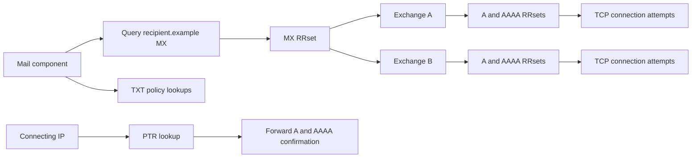

The diagram shows several independent paths. A recipient-domain MX success does not prove that the exchange names have addresses. A TXT success does not prove that an SPF or DMARC policy is valid. A PTR success does not prove that the returned hostname maps back to the connecting address.

## 🔍 Plain-English deep-dive: DNS Is a Typed Evidence Graph, Not a Phone Book

A phone book analogy encourages one oversimplified operation: give a name, get a number. Email DNS is closer to a set of typed index cards connected by arrows.

Suppose the recipient is `user@recipient.example`. SMTP first needs routing data for `recipient.example`, so the relevant card type is MX. An MX record does not contain an IP address. It contains a preference and another domain name. Each exchange name creates new questions for A and AAAA records. Those answers create possible TCP destinations. In parallel, a receiving service may look up TXT policy records under other owner names, while reverse-DNS evaluation begins with an IP address transformed into an `in-addr.arpa` or `ip6.arpa` name and asks for PTR.

The graph is **typed** because each edge has an application rule:

- Recipient domain --MX--> exchange hostname.
- Exchange hostname --A/AAAA--> network address.
- Alias owner --CNAME--> canonical name.
- Reversed address --PTR--> claimed hostname.
- Policy owner --TXT--> one or more character strings interpreted by a separate specification.

The graph is **time-sensitive** because each cached RRset has a remaining TTL. Two resolvers can truthfully report different answers during a change because they cached different authoritative versions at different times. The graph is also **vantage-sensitive** because split DNS, policy resolvers, anycast instances, forwarding chains, and network reachability can differ.

This gives support engineers a precise template. Do not write "DNS failed." Write the broken edge and its evidence:

> **[Observation]** At 2026-03-20 14:05 UTC, recursive resolver `R1` returned NOERROR/NODATA for `mx1.recipient.example` type AAAA and returned one A address. The SMTP host is IPv4-capable, so the missing AAAA RRset is not by itself blocking delivery.

Or:

> **[Observation]** The authoritative MX RRset names `mx1.recipient.example`, but direct authoritative A and AAAA queries for that exchange return NODATA. **[Standard]** SMTP requires the exchange name to yield at least one address record. **[Inference]** The unusable MX target is sufficient to explain why no TCP attempt appears in the sender log.

That is far more actionable than a green or red "DNS" status.

## DNS Message Evidence: Question, Answer, Authority, and Additional Data

A DNS response has a header and four principal sections: Question, Answer, Authority, and Additional. Tools often simplify this, but support work improves when you know what was actually returned.

| Evidence element | What it tells you | Common support mistake |
|---|---|---|
| QNAME/QTYPE/QCLASS | The exact question being answered | Testing A when the application needed MX |
| RCODE | Broad outcome such as NOERROR, NXDOMAIN, SERVFAIL, or REFUSED | Treating every empty answer as NXDOMAIN |
| Answer section | RRsets that answer the question, possibly including CNAME processing | Assuming every item in it is authoritative merely because AA is set |
| Authority section | Referral NS records or SOA evidence for a negative answer | Calling every empty-answer response NODATA without distinguishing a referral |
| Additional section | Helpful records, often exchange or nameserver addresses | Treating glue or additional data as equal to a direct authoritative answer |
| AA flag | The responder claims authority for the original queried name | Treating AA as DNSSEC authenticity or universal authority for every returned name |
| RD/RA flags | Recursion was requested and is available | Assuming an authoritative-only server will recurse |
| TTL | Maximum remaining cache lifetime for an RRset | Treating TTL as record age or a guaranteed global propagation deadline |

The **Answer** section may include a CNAME and data for the final target. The **Authority** section can instead contain NS records that tell an iterative resolver where to ask next. A negative authoritative response normally carries the zone's SOA record so a resolver can cache the negative result. The **Additional** section may contain addresses anticipated to be useful, but it has lower evidentiary rank than directly queried authoritative data.

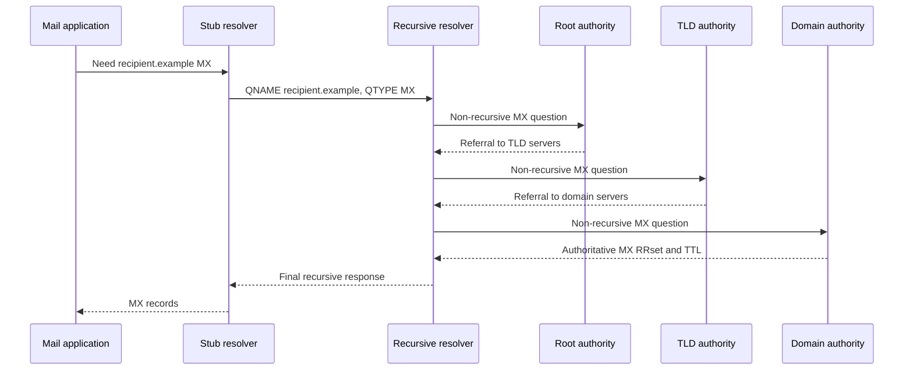

In practice, a warm recursive cache may answer immediately and skip all outward queries. That is why an application trace and an authoritative query can differ without either being fabricated.

## Record Types and Their Email Jobs

| RR type | Direction or payload | Email job | Does it prove identity? | Key constraint |
|---|---|---|---|---|
| MX | Domain to preference plus exchange name | Select candidate receiving SMTP hosts | No | Lower preference first; target must not be a CNAME alias |
| TXT | Owner name to one or more character strings | Carries application-defined text such as email policies | No | DNS transports strings; the consuming specification defines meaning |
| CNAME | Alias owner to canonical name | Redirects a query at an alias to another name | No | Alias owner normally cannot also hold unrelated data |
| PTR | Reverse-tree name to another domain name | Maps an address-derived owner name to hostname claims | No | PTR is simple data; forward confirmation is a separate check |
| A | Name to IPv4 address | Supplies IPv4 destinations for exchange or nameserver hosts | No | One name may have multiple addresses |
| AAAA | Name to IPv6 address | Supplies IPv6 destinations for exchange or nameserver hosts | No | IPv6 usability also depends on sender capability and reachability |
| NS | Zone or delegation point to authoritative server name | Identifies where authoritative data can be queried | No | NS target must not be an alias; glue may be needed |
| SOA | Zone apex to administrative and timing data | Identifies zone metadata and negative-cache timing inputs | No | SOA.MINIMUM now participates in negative TTL calculation |

The lesson title emphasizes MX, TXT, CNAME, and PTR, but A, AAAA, NS, and SOA are necessary supporting types. Email troubleshooting fails when only the first visible record is checked.

## Zones, Delegation, Authority, and Glue

A domain is a region of the namespace. A **zone** is the portion served as one administrative unit. A parent creates a child-zone delegation by publishing an NS RRset at a **zone cut**. The child publishes its own apex SOA and NS data. A resolver follows the parent's referral to the child servers.

If a delegated nameserver's own name is beneath the child zone, the resolver would face a circular dependency: it needs the child server to learn the address required to contact the child server. The parent can include **glue**, address data used to reach that nameserver. Glue is routing assistance, not ordinary authoritative child data.

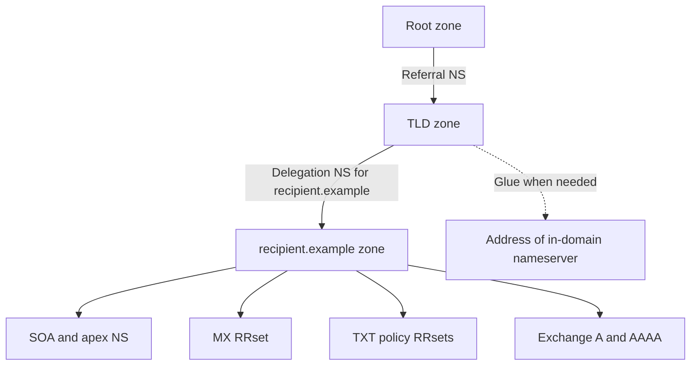

| Delegation observation | What it supports | What it does not prove | Next check |
|---|---|---|---|
| Parent returns child NS referral | Parent has a route toward child authority | Listed servers are reachable or correctly configured | Query every listed server for SOA and the target RRset |
| Child server sets AA for target | That server claims authority and can answer locally | Other delegated servers hold the same version | Compare SOA serial and answers across servers |
| Parent includes glue | Resolver has a bootstrap address | Glue equals current authoritative address data | Query address records at their authoritative zone |
| One server times out | That address did not respond from this vantage point | The whole zone is unavailable globally | Test approved alternate vantage points and other server addresses |
| Parent and child NS differ | Delegation data is inconsistent | Which side is intended | Escalate to zone owner/registrar with both RRsets |
| Server answers without AA | It returned cache, referral, or non-authoritative behavior | It is properly serving the delegated zone | Query with recursion disabled and inspect authority |

The phrase **lame delegation** is historically used for several different flaws. Current DNS terminology recommends naming the concrete defect: "delegated server timed out," "server returned REFUSED," or "server answered without authority for the delegated zone." Specific language makes ownership and remediation clearer.

### Authority Is Not the Same as Authenticity

The AA flag means the server claims the answer comes from a zone for which it is authoritative. It is not a cryptographic proof. DNSSEC validation, when deployed, establishes a different property through signed RRsets and a chain from a trust anchor. A lesson focused on MX, TXT, CNAME, and PTR should still preserve this distinction:

- **Authoritative:** the server is configured as a source for the zone.
- **Validated secure:** a validating resolver built and checked an applicable DNSSEC chain.
- **Insecure:** no applicable signed chain protects the data.
- **Bogus:** a chain was expected, but validation failed.
- **Indeterminate:** the resolver could not determine the state.

A support engineer should not translate "AA=1" into "the answer is secure."

## MX Records: Discovering Candidate SMTP Hosts

MX means **Mail eXchanger**. An MX record's data contains a 16-bit preference number and an exchange domain name. Lower numbers are more preferred. The records at one owner form an RRset, so a mail client evaluates the set rather than treating the first printed line as the answer.

Example synthetic zone data:

```text
recipient.example.  300  IN  MX  10 mx-a.recipient.example.
recipient.example.  300  IN  MX  10 mx-b.recipient.example.
recipient.example.  300  IN  MX  20 mx-backup.example.net.
```

The sender first considers the two preference-10 hosts. If there is no clear operational reason to favor one, RFC 5321 requires randomization among equal-preference destinations to spread load. Preference 20 is less preferred, but it is not "disabled." It is an alternate candidate when the more preferred choices cannot accept the transfer.

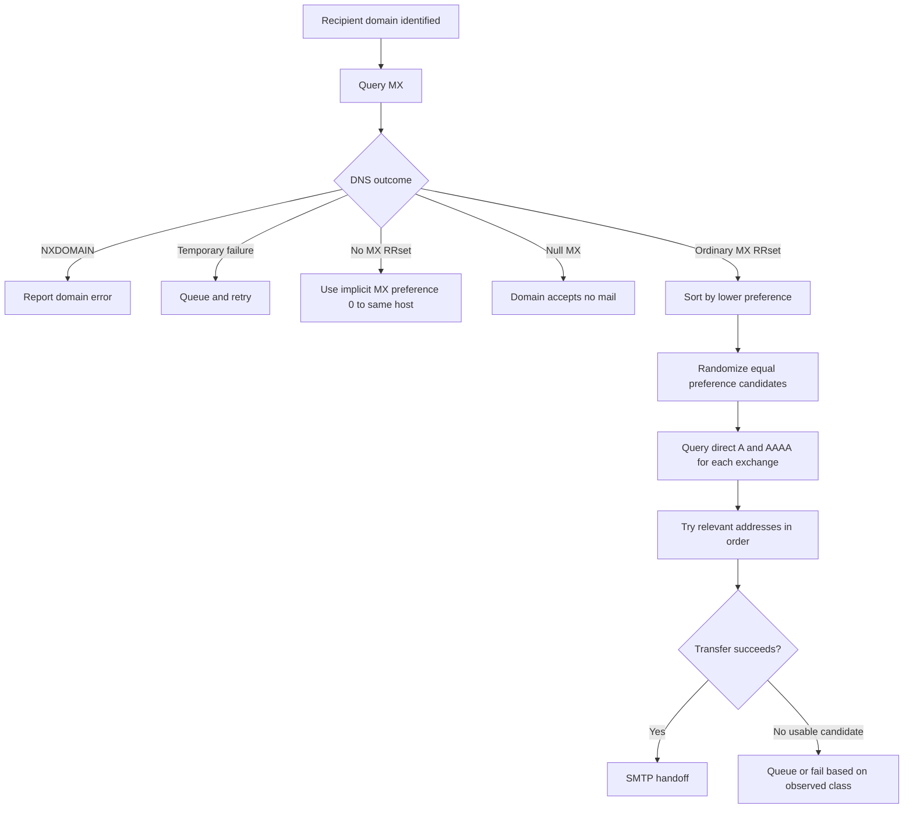

| MX/DNS outcome | SMTP interpretation | Typical handling boundary |
|---|---|---|
| Ordinary MX RRset | Use only the named exchange hosts and their addresses | Continue to direct A/AAAA lookup and connection attempts |
| Multiple preferences | Try lower preference values before higher ones | Higher number is an alternate, not a worse-quality verdict |
| Equal preferences | Randomize absent another clear reachability reason | Do not assume answer order is priority |
| NOERROR with no MX RRset | Apply implicit MX preference 0 pointing to the original domain | Query A/AAAA for that same domain |
| Single MX `0 .` | Null MX: domain explicitly accepts no mail | Permanent no-service outcome; do not fall back to A/AAAA |
| NXDOMAIN for recipient domain | Domain does not exist | Permanent domain error under RFC 5321 behavior |
| SERVFAIL or timeout | Resolution was not completed | Temporary failure; queue and retry rather than claiming nonexistence |
| MX target has no A or AAAA | Positive MX data is unusable for connection | Treat candidate as unusable; evaluate remaining candidates |
| MX target resolves through CNAME | Configuration lies outside SMTP's required form | Record exact chain and escalate; do not call it a valid direct target |

## 🔍 Plain-English deep-dive: Lower MX Numbers Mean Earlier Attempts, Not Faster Servers

Think of MX preference as an ordered list of reception desks. Desk 10 should be tried before desk 20. That number does not advertise latency, capacity, security quality, geographic distance, or reputation. It is an administrator-supplied routing preference.

Three mistakes follow from calling it "priority" without explaining the direction:

1. People assume 100 is more important than 10 because larger scores often mean higher rank.
2. People assume a preference-20 server is a disaster-recovery host that should never receive ordinary traffic. The standard only says it is less preferred; operational roles are private architecture.
3. People assume two preference-10 records will be attempted in the printed DNS order. RRset order is not a reliable priority. RFC 5321 directs senders to randomize equal-preference destinations when no clear reason favors one.

Preference also interacts with retry and self-detection. A relay that is itself named in the MX RRset must discard its own preference level and less-preferred records before choosing where to relay without address rewriting. This prevents obvious routing loops. That rule is separate from generic "try every MX" behavior.

When writing a case note, say:

> **[Standard]** Preferences 10 and 20 mean the preference-10 exchange is considered first. **[Observation]** The sender attempted both preference-10 addresses, then connected to preference 20. **[Inference]** The route is consistent with standards-based failover. The reason the first candidates failed is established separately by the connection logs.

Do not say "DNS failed over because the first MX was slow" unless the logs actually show timeout or latency and the mail software's selection behavior is known.

### Implicit MX

RFC 5321 defines compatibility behavior when a domain exists but returns an empty MX list: treat it as though it had an MX with preference 0 pointing to the same host. Then look up that host's A and AAAA records. This is often described as "fallback to A/AAAA," but the precise mental model is an **implicit MX**.

This fallback applies only when no MX records are present. If ordinary MX records exist but are unusable, the sender must not ignore them and use the recipient domain's address records instead. That would bypass the domain administrator's explicit mail routing.

### Null MX

RFC 7505 defines a **null MX** as one MX record with preference 0 and the root name `.` as its exchange:

```text
nomail.example.  300  IN  MX  0 .
```

The root name is not a valid host destination. This record explicitly says the domain accepts no mail. A domain publishing null MX must not publish other MX records. Null MX exists to avoid wasteful A/AAAA fallback and repeated SMTP connection attempts to a web address that never intended to receive email.

Null MX does not mean the same thing as an empty SMTP envelope reverse-path (`MAIL FROM:<>`). The former is DNS service declaration for a domain; the latter is an SMTP mechanism used for notifications to avoid error loops.

## CNAME: Alias Processing and Mail-Specific Constraints

CNAME is commonly expanded as **Canonical Name**. More precisely, the owner of a CNAME record is an alias, and its RDATA names the canonical target. When a resolver asks for another type at an alias, DNS processing returns the CNAME and restarts at the target. A direct query for type CNAME asks for the alias record itself.

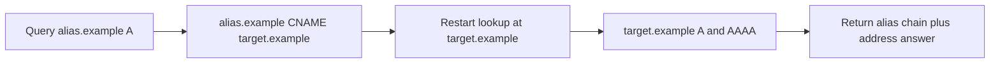

| CNAME situation | DNS-level meaning | Email consequence |
|---|---|---|
| Recipient domain itself is an alias | Resolver follows CNAME while locating MX under RFC 5321 processing | The resulting canonical name is processed as the original mail domain for target location |
| Web hostname is an alias | Ordinary alias processing can lead to A/AAAA | Not automatically a mail problem |
| MX exchange value names an alias | MX target is not in required direct-address form | Additional address processing may omit usable data; SMTP configuration is nonconforming |
| NS value names an alias | Delegated nameserver target violates the direct-name requirement | Resolution can become inefficient or fail in difficult dependency cases |
| Alias owner also has unrelated records | CNAME coexists with prohibited data at one owner | Conflicting semantics; authoritative zone configuration must be corrected |
| Long CNAME chain | Multiple dependent lookups | More latency and failure points; loops must be detected |
| CNAME target does not exist | Alias exists, final target is NXDOMAIN | Preserve both facts rather than saying the original alias never existed |

The MX exchange value must resolve directly to at least one address RR. RFC 2181 says the target must not be an alias, and RFC 5321 says a response that yields a CNAME when the exchange target is queried lies outside the standard's required form. The same constraint applies to NS target names.

This is an important support nuance: many resolvers are robust and may follow the alias anyway. A successful test from one tool does not make the configuration standards-conforming, and another mail implementation may fail or omit additional data. State both observations:

> **[Observation]** The recursive tool followed `mx.recipient.example CNAME host.vendor.example` and returned an A address. **[Standard]** An MX exchange name must not be an alias. **[Inference]** The configuration is an interoperability risk even though this resolver completed the chain.

## TXT: A Container Whose Meaning Comes from Another Specification

TXT records hold one or more character strings. DNS defines how those strings are transported. It does not assign a universal email-policy meaning to arbitrary TXT content. SPF, DKIM, and DMARC define their own owner names, tags, selection logic, lookup limits, and result semantics.

| Layer | Question | Example evidence | Proof limit |
|---|---|---|---|
| DNS transport | Did a TXT RRset return for the exact owner name? | `NOERROR`, two character strings, TTL 300 | Does not prove a valid policy |
| String reconstruction | Did the client combine character strings within one TXT RR correctly? | One logical record assembled from quoted chunks | Does not combine separate TXT RRs into one policy |
| Policy discovery | Did the application query the right owner name? | SPF at a domain; DKIM at selector-specific owner; DMARC at `_dmarc` owner | Different mechanisms use different names |
| Policy selection | Did the mechanism find the applicable policy among returned records? | One SPF-version record selected | Multiple applicable records can be an error, depending on specification |
| Syntax parsing | Are tags, mechanisms, separators, and values legal? | Parser result and reason | A DNS success can still yield syntax failure |
| Evaluation | What result follows for this message and context? | pass, fail, none, temperror, or permerror | Requires message/session inputs beyond DNS alone |
| Receiver action | What did the provider do with the result? | SMTP reply or trusted internal log | Usually provider policy, not dictated by TXT transport |

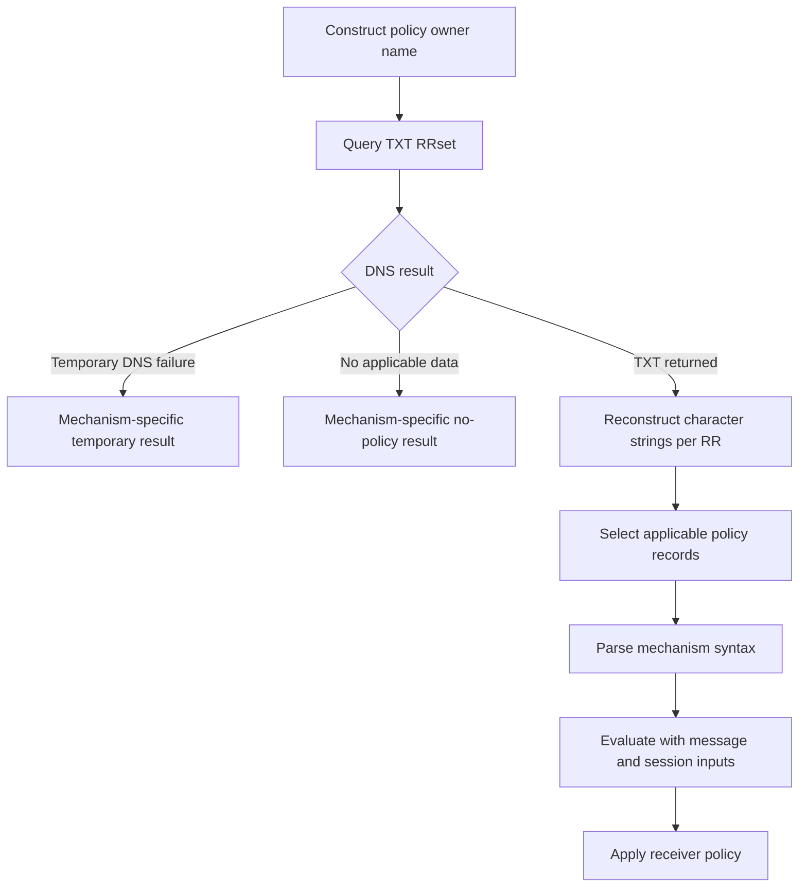

### One TXT RR Can Contain Multiple Character Strings

TXT RDATA contains one or more length-prefixed character strings. Zone-file tools often display these as adjacent quoted strings. An application can concatenate the strings belonging to one TXT RR according to its protocol's rules. This is different from concatenating separate TXT records in the RRset.

Synthetic display:

```text
policy.example. 300 IN TXT "first logical segment " "second logical segment"
policy.example. 300 IN TXT "a separate TXT record"
```

There are two TXT records above. The first has two strings. A screenshot that removes boundaries can hide this distinction, so preserve raw structured output when debugging parser behavior.

### TXT Is Not Inherently SPF

A query for TXT may return verification tokens, service metadata, and multiple application policies at the same owner. Do not label the entire RRset "the SPF record." Identify the record whose content matches the SPF version grammar, then apply SPF's rules. Part 025 covers those application semantics in depth.

## PTR and Reverse DNS

Ordinary forward DNS begins with a name and requests addresses. Reverse DNS begins with an IP address, transforms it into a name under a special reverse namespace, and asks for PTR records.

For IPv4 address `192.0.2.25`, reverse the octets and append `in-addr.arpa`:

```text
25.2.0.192.in-addr.arpa. PTR ?
```

IPv6 reverse DNS uses `ip6.arpa` and reverses individual hexadecimal nibbles. Tools normally perform the transformation, so support engineers rarely need to type the full IPv6 owner manually, but they should know that the reverse tree is administratively distinct from the forward-name zone.

PTR RDATA points to a domain name. It is simple data, not CNAME-style alias processing and not an authentication token. RFC 2181 allows multiple PTR records in an RRset, although applications may impose limits for operational safety.

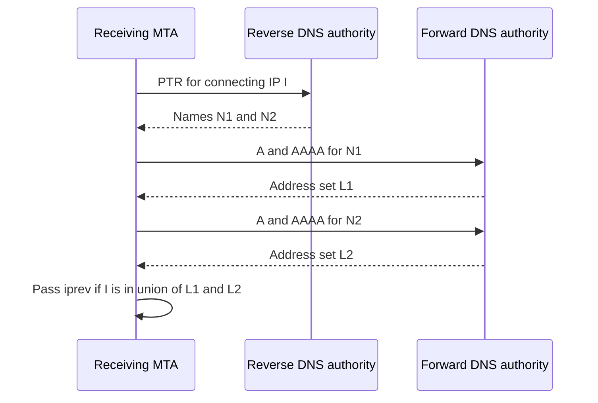

| Reverse-DNS observation | Careful interpretation | Unsafe overclaim |
|---|---|---|
| No PTR data | Address has no published reverse name from this observation | "The sender is malicious" |
| PTR returns one name | Address-space DNS points to that name | "That organization owns the sender" |
| PTR name maps back to IP | Forward and reverse mappings agree for an iprev-style test | "The message is authenticated" |
| PTR returns several names | Multiple reverse claims exist | "The first printed name is canonical" |
| PTR query SERVFAILs | Evaluation could not complete due to a likely temporary DNS problem | "No PTR exists" |
| PTR exists but forward name is NXDOMAIN/NODATA | Reverse claim is not forward-confirmed | "DNS as a whole is down" |
| PTR and EHLO differ | Two identity signals differ | "SMTP must reject"; exact action is provider policy |

## 🔍 Plain-English deep-dive: PTR Is a Claim from Address-Space Control, Not Proof of Sender Identity

Imagine a building directory controlled by the property manager. A suite can be labeled "Example Shipping." That label tells visitors what the building directory claims. It does not prove who composed every package leaving the suite, whether the tenant's account was compromised, or whether the package contents are safe.

PTR is similar. Control of reverse DNS usually follows control or delegation of address space, often through a network provider. A PTR answer can be operationally useful: it gives a stable-looking name for logs, supports diagnostics, and participates in receiver heuristics. But it is not message authentication.

An **iprev** or forward-confirmed reverse-DNS test adds a consistency check:

1. Let the connecting peer IP be $I$.
2. Query PTR for $I$ and obtain a bounded set of names $N$.
3. Query A and AAAA for each evaluated name.
4. Form the union of returned addresses, $L$.
5. The consistency test passes if $I \in L$.

That proves a narrow property: the reverse and forward mappings agree at the evaluation time and vantage point. It does not prove:

- The human author's identity.
- Authorization to use the RFC 5322 From domain.
- Authorization to use the SMTP envelope domain.
- Message integrity.
- Safety of links or attachments.
- A positive reputation.
- Guaranteed acceptance by a recipient.

RFC 8601 includes iprev because the method remains common, while explicitly warning that its authentication value is limited and implementation details vary. The correct support statement is therefore bounded:

> **[Observation]** PTR for the connecting address returned `mail.sender.example`, and that name's A RRset included the same address. **[Inference]** The connection would pass the documented iprev consistency algorithm. **[Private unknown]** The receiver's reputation weight and final handling policy are not established by this DNS evidence.

## TTL and Cache Behavior

TTL means **Time to Live**. For a resource record, it specifies the maximum interval in seconds that the data may be cached before the source should be consulted again. All ordinary records in one RRset must have the same TTL. A recursive resolver returns a decreasing remaining TTL for cached data.

TTL does not state when the record was created. It does not force every resolver to cache the answer. It does not mean every resolver first fetched the RRset simultaneously. A cache can evict data early, clamp very large TTLs, serve stale data under defined resolver behavior, or implement policy that changes answers.

```mermaid
timeline
    title Two resolvers observe one MX change
    10:00 : R1 caches old MX with TTL 3600
    10:25 : R2 first queries and caches old MX with TTL 3600
    10:30 : Authority publishes new MX
    11:00 : R1 old entry expires and refreshes to new MX
    11:25 : R2 old entry expires and refreshes to new MX
```

| Cache concept | Precise meaning | Troubleshooting consequence |
|---|---|---|
| Authoritative TTL | Maximum reuse interval advertised with an RRset | Helps bound how long a resolver that fetched that version may reuse it |
| Remaining TTL | Cache's reported time until ordinary expiry | Can estimate that cache entry's next normal refresh, not global completion |
| Cache miss | Resolver has no usable stored answer | It must pursue resolution or forward the request |
| Positive cache | Stored existing RRset | Old MX, A, AAAA, TXT, or PTR can remain visible until expiry |
| Negative cache | Stored proof that a name or RRset does not exist | A newly added record may remain hidden behind cached NXDOMAIN or NODATA |
| Resolver cap | Local policy shortens accepted TTL | Observed lifetime may be less than authority advertised |
| Early eviction | Cache removes data before TTL expiry | A resolver may refresh sooner than predicted |
| Serve stale | Resolver temporarily serves expired data under supported policy | An answer can outlive ordinary TTL during upstream failure |
| Split DNS/view | Different answers intentionally depend on query context | Internal and public observations may both be intended |
| Anycast instance | One resolver address reaches distributed service instances | Repeated answers can involve different cache populations |

## 🔍 Plain-English deep-dive: TTL Is a Permission to Reuse Evidence, Not a Propagation Timer

Suppose a restaurant prints a menu and tells nearby hotels, "You may reuse this menu for one hour before asking us again." Hotel A asks at 10:00. Hotel B asks at 10:25. The restaurant changes the menu at 10:30. Hotel A may reuse its old copy until 11:00; Hotel B may reuse its old copy until 11:25. The one-hour instruction did not start a universal countdown at 10:30.

DNS TTL works the same way. The source advertises a maximum reuse interval with the answer. Each cache's interval begins when that cache obtains the RRset. Therefore, "DNS propagation takes one TTL" is an imprecise shortcut. The actual observation window depends on when caches fetched the prior data, whether TTL was lowered early enough before a planned change, negative-cache settings, resolver caps, early eviction, stale-serving policy, split views, and secondary-zone freshness.

For a planned migration, lowering TTL at the same moment as changing the MX does not retroactively shorten copies already cached with the old larger TTL. The lower TTL must itself become visible before the routing change if the operator wants to reduce the old answer's possible cache lifetime.

For an incident, record four times:

1. When the authoritative change was made, if verified by the owner.
2. When the authoritative servers began returning it.
3. When each recursive observation was collected.
4. The remaining TTL and response type at each resolver.

Then write a falsifiable hypothesis:

> **[Inference]** Resolver R1 may still be serving a negative cache entry created before the record was added. This is disconfirmed if R1's response carries no cacheable negative evidence, if its expected lifetime has expired and it still returns the old result, or if a packet/log trace shows R1 currently receiving the old answer from an authority.

This makes "wait for propagation" a testable statement rather than a default delay tactic.

## Negative Answers: NXDOMAIN Is Not NODATA

The distinction between name nonexistence and type nonexistence is essential for email.

- **NXDOMAIN:** The effective queried name does not exist.
- **NODATA:** The name exists, but no RRset of the requested type exists. NODATA is inferred from a NOERROR response with no relevant answer and appropriate authority structure; it is not a dedicated RCODE.
- **SERVFAIL:** The server could not process or complete the query due to a failure. It does not say the name or type is absent.
- **REFUSED:** The server declined the operation for policy reasons.
- **Timeout/no response:** No DNS response was observed from that server and vantage point within the tool's interval.

Authoritative NXDOMAIN and NODATA responses include the zone's SOA in the authority section so they can be negatively cached. Under RFC 2308, the negative TTL derives from the smaller of the SOA RR's TTL and SOA.MINIMUM. Cached negative answers age just like positive data.

| Result | Name exists? | Requested RRset exists? | Typical email implication | Retry classification |
|---|---|---|---|---|
| Positive answer | Yes | Yes | Continue following typed dependencies | Continue now |
| NOERROR/NODATA for MX | Yes | No MX | SMTP may apply implicit MX unless null MX or another condition applies | Continue with same-name A/AAAA |
| NOERROR/NODATA for exchange A and AAAA | Yes | No address RRset of tested types | Exchange is unusable for those transports | Try remaining candidates; final handling depends on all outcomes |
| NXDOMAIN for recipient domain | No | No | Domain-addressing failure | Permanent under ordinary SMTP resolution rules |
| NXDOMAIN after CNAME | Alias may exist; final target does not | No at final name | Preserve alias-versus-target distinction | Application-specific error path |
| SERVFAIL | Unknown | Unknown | Resolution incomplete | Temporary; queue and retry |
| REFUSED | Unknown from this server | Unknown | This server will not answer that operation | Try appropriate configured source or correct policy/access |
| Timeout | Unknown | Unknown | No reply from that endpoint/vantage | Try alternate server/address and preserve network evidence |

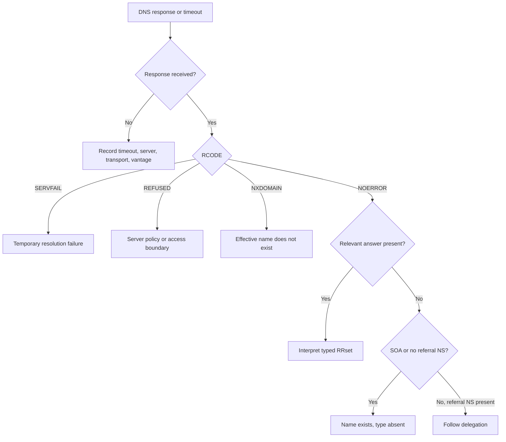

### Why Misclassification Hurts Mail

SMTP distinguishes temporary and permanent failures. If a temporary DNS failure is mislabeled NXDOMAIN, a message may be rejected instead of queued. If NXDOMAIN is mislabeled timeout, a sender may retry uselessly. If NODATA for MX is mislabeled NXDOMAIN, an investigator may miss implicit MX behavior. The support engineer's first responsibility is to preserve the response class before discussing provider handling.

## From DNS to Mail Delivery and Reputation

DNS affects at least three email planes:

1. **Routing:** MX, A, AAAA, CNAME processing, delegation, and caches determine candidate SMTP destinations.
2. **Policy discovery:** TXT carries data used by SPF, DKIM, DMARC, and other mechanisms.
3. **Connection identity and reputation:** PTR and forward lookups provide naming and consistency signals that receivers may include in private policy.

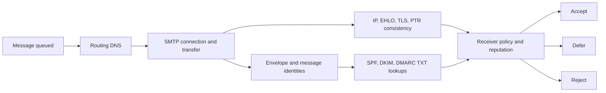

Standards define many inputs and result semantics. They do not define one universal reputation score or require every receiver to make the same accept/defer/reject choice. Large providers combine private signals, historical behavior, content, authentication, complaint rates, volume patterns, account state, and other data. DNS evidence can establish that a signal is present or absent; it usually cannot establish its exact weight.

| Symptom | DNS could be causal when | DNS alone is insufficient when | Strong next evidence |
|---|---|---|---|
| No TCP attempt | MX lookup fails temporarily or yields no usable destination | Sender queue scheduler has not attempted delivery | Sender DNS and queue logs with timestamps |
| Connection goes to old host | Resolver still has prior MX/A data | Sender pins routes in a private cache beyond DNS | Remaining TTL plus application-specific route cache evidence |
| Only some senders fail | Resolver views, address-family reachability, or cache populations differ | Receiver applies sender-specific policy | Compare named vantage points and SMTP replies |
| Reputation warning cites rDNS | PTR missing or forward confirmation fails | Provider weights many private signals | Raw PTR/A/AAAA evidence and provider documentation |
| SPF/DKIM/DMARC result changes | TXT answer, selector, or cache state differs | Message identity or canonicalization differs | Exact owner-name TXT data plus authentication inputs |
| Mail to web-only domain queues | No MX causes implicit same-host delivery attempts | SMTP listener/firewall behavior is the actual delay | MX NODATA, A/AAAA results, then connection evidence |
| Immediate no-mail failure | Valid null MX is published | Sender misparsed or cached malformed data | Authoritative null MX and sender resolution trace |

## Worked Example 1: A Positive MX Answer with an Unusable Target

### Synthetic ticket

"Mail to `recipient.example` remains queued. Public MX checkers say DNS is healthy. The sending service shows no TCP connection attempt."

### Evidence

```text
QNAME recipient.example. QTYPE MX
RCODE NOERROR, AA=1
recipient.example. 300 IN MX 10 mx1.recipient.example.

QNAME mx1.recipient.example. QTYPE A
RCODE NOERROR, AA=1, ANSWER empty, SOA present

QNAME mx1.recipient.example. QTYPE AAAA
RCODE NOERROR, AA=1, ANSWER empty, SOA present
```

### Analysis

1. **[Observation]** The recipient-domain MX query succeeds.
2. **[Observation]** The exchange owner name exists, but both relevant address types return NODATA.
3. **[Standard]** An MX exchange name must return at least one address record usable by the SMTP client.
4. **[Inference]** The dependency graph stops before TCP, which explains the absence of connection logs.
5. **[Private unknown]** Whether the zone owner intended to remove mail service or accidentally omitted addresses is not proven.

### Support response

"The MX record itself is present, but its only exchange hostname has no IPv4 or IPv6 address records on the authoritative servers. SMTP therefore has no destination address to connect to. Please have the DNS owner publish the intended direct A/AAAA data for the exchange or replace the MX with the intended mail host. If the domain intentionally accepts no mail, a standards-defined null MX is the explicit declaration."

## Worked Example 2: Old Negative Cache After an MX Was Added

### Synthetic timeline

| Time UTC | Source | Observation |
|---|---|---|
| 09:00 | Resolver R1 | MX NODATA cached; negative TTL 3600 |
| 09:15 | DNS change record | Zone owner adds two MX records |
| 09:17 | Authoritative server A | New MX RRset, TTL 300 |
| 09:18 | Authoritative server B | New MX RRset, TTL 300 |
| 09:25 | Resolver R2 | New MX RRset |
| 09:30 | Resolver R1 | Still returns cached NODATA with 1800 seconds remaining |
| 10:01 | Resolver R1 | Returns new MX RRset after negative entry expires |

### Analysis

The authoritative change is live by 09:18. R2 did not have the prior negative result, so it fetched the new data. R1 is not waiting on the new MX TTL; it is honoring an earlier negative cache entry. The issue is not accurately described as "the MX has not propagated to DNS." The authoritative data is already published, while one recursive cache still has permission to reuse a prior negative answer.

### Discriminating check

Ask R1 again after its observed negative TTL expires. If it still returns NODATA, compare the fresh response's SOA/authority and inspect whether R1 uses a forwarder, split view, policy rewrite, stale-answer feature, or a different authoritative path.

## Worked Example 3: PTR Exists but Is Not Forward-Confirmed

### Synthetic evidence

```text
Connecting IP: 192.0.2.25
PTR 25.2.0.192.in-addr.arpa. -> outbound.sender.example.
A outbound.sender.example. -> 192.0.2.80
AAAA outbound.sender.example. -> NODATA
```

### Analysis

- **[Observation]** Reverse DNS publishes a hostname.
- **[Observation]** The hostname's only address does not match the connecting IP.
- **[Standard]** The iprev-style consistency test fails because the connecting IP is not in the union of forward addresses.
- **[Inference]** A receiver that uses this test can record `iprev=fail`.
- **[Private unknown]** Whether that receiver rejects, defers, scores, or ignores the failure is private policy unless documented by the SMTP reply or provider guidance.

### Safe wording

"The PTR is present, but forward confirmation fails: the returned name maps to a different IPv4 address. Correct either the reverse record or the forward address so the selected hostname maps back to the actual connecting address. This correction improves consistency but does not guarantee delivery or reputation."

## Worked Example 4: MX Target Is a CNAME

### Synthetic evidence

```text
recipient.example. 300 IN MX 10 mx.recipient.example.
mx.recipient.example. 300 IN CNAME host.mailvendor.example.
host.mailvendor.example. 300 IN A 192.0.2.44
```

### Analysis

A general resolver may follow the CNAME and return `192.0.2.44`. However, the MX exchange value is required to identify a name with direct address records, not an alias. Additional-section processing may not include the alias chain, and SMTP implementations are not required to treat the configuration as valid.

### Remediation pattern

The DNS owner should place the canonical host name directly in the MX record if the provider supports that name as the intended exchange target:

```text
recipient.example. 300 IN MX 10 host.mailvendor.example.
```

Do not blindly replace it without provider confirmation. The target name, tenant association, TLS naming, and routing contract are provider-owned configuration.

## Failure Modes and Misleading Shortcuts

| Failure mode | Misleading shortcut | Better interpretation | Cheapest discriminating check |
|---|---|---|---|
| Wrong QTYPE tested | "The domain resolves" | A success says nothing about MX or TXT | Query the exact name/type from the application path |
| Cached versus authoritative mismatch | "DNS is inconsistent" | Different cache acquisition times may explain it | Query each authority directly with recursion disabled |
| NODATA called NXDOMAIN | "The domain does not exist" | Name exists, requested type is absent | Inspect RCODE, answer, authority SOA, and referral NS |
| SERVFAIL called no record | "They deleted the MX" | Resolution failed before existence was established | Query authorities and check DNSSEC/delegation health |
| MX target CNAME overlooked | "A lookup eventually returns an IP" | General resolution success hides an SMTP constraint | Query MX target directly for CNAME, A, and AAAA |
| Additional data trusted as final | "The referral proved the host address" | Glue/additional data has a lower evidence rank | Query the target's authoritative source directly |
| TTL treated as propagation countdown | "Wait exactly 300 seconds" | Cache timers start when each cache fetches data | Capture remaining TTLs and change timeline |
| PTR treated as authentication | "Reverse DNS proves the sender" | PTR is an address-space claim; iprev proves only consistency | Forward-resolve every bounded PTR name and compare IP |
| TXT transport conflated with policy validity | "TXT exists, so SPF is valid" | Policy selection and parsing are separate layers | Use mechanism-specific parser inputs and result reason |
| One public resolver treated as universal | "Everyone sees the new answer" | Vantage, cache, policy, and split DNS may differ | Compare named resolvers and authorities with timestamps |
| No MX treated as no mail | "The domain cannot receive email" | SMTP may use implicit MX to the same host | Query A and AAAA for the recipient domain |
| Null MX treated as missing MX | "Fallback to the web server" | Null MX explicitly disables mail receipt | Verify the single `MX 0 .` RRset authoritatively |

## A Practical Troubleshooting Tree

Use this order when a message has not reached SMTP or when logs cite DNS. It keeps the first test close to the component that made the decision.

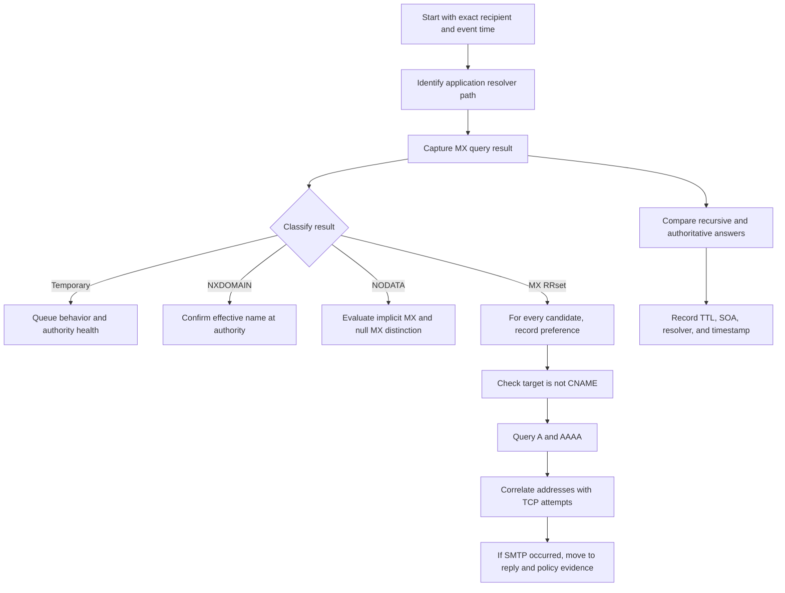

### Step 1: Anchor the Event

Collect the recipient domain exactly as processed, the message or queue identifier, sender host, UTC event time, and observed error. Preserve whether the error came from a DNS library, MTA log, provider UI, bounce, or customer paraphrase.

### Step 2: Identify the Resolver Path

Determine which resolver the mail process actually used. A laptop's public DNS test is a comparison vantage, not proof of what a server-side MTA observed. Check for local caching, systemd-resolved or Windows DNS Client behavior, container DNS, cluster-local forwarders, provider-managed resolvers, and application route caches where approved evidence exists.

### Step 3: Classify MX Resolution

Record QNAME, QTYPE, RCODE, answers, authority, TTL, resolver address, and time. Distinguish ordinary MX, no MX with implicit behavior, null MX, NXDOMAIN, SERVFAIL, REFUSED, and timeout.

### Step 4: Follow Every MX Dependency

Sort by preference. For each target, query CNAME explicitly and query A and AAAA. Note the sender's address-family capabilities. Preserve all addresses rather than testing only the first printed one.

### Step 5: Compare Authorities

Discover the delegated NS RRset, then query each authoritative server directly with recursion disabled. Compare SOA serials, AA flags, MX RRsets, and exchange address RRsets. One stale or unreachable authoritative server can create intermittent behavior.

### Step 6: Account for Cache Time

Compare recursive remaining TTL with authoritative TTL and the verified change timeline. For negative answers, capture the SOA and calculate or record the negative cache lifetime. Do not flush customer or production caches without authorization; observation is usually sufficient for diagnosis.

### Step 7: Correlate with TCP and SMTP

If DNS produced usable addresses, look for connection attempts to those exact addresses. A successful DNS chain does not prove route, firewall, TLS, or SMTP success. Once an SMTP reply exists, DNS routing may no longer be the controlling failure.

### Step 8: State the Ownership Boundary

- Parent delegation issue: registrar/parent-zone or DNS operator.
- Child authoritative data issue: zone owner/DNS operator.
- Recursive cache/policy issue: resolver operator.
- Exchange address/reachability issue: mail-hosting/network owner.
- TXT application issue: email-authentication configuration owner.
- PTR issue: address-space/network provider or delegated reverse-zone owner.
- Private acceptance/reputation action: receiving provider.

## Safe Lab: Public-Domain DNS Evidence Worksheet

### Safety Boundary

This lab uses ordinary read-only DNS queries for publicly published records. It does not send email, connect to SMTP, scan address ranges, request zone transfers, create accounts, upload data, modify DNS, enumerate customer infrastructure, or use private domains. Use the reserved example names and the explicitly approved public names in the exercise. If organizational policy disallows public resolver queries, use only the approved resolver named by your instructor.

Reserved names and documentation addresses are used for synthetic analysis:

- `example.com`, `example.net`, and `example.org` are reserved for documentation.
- `.invalid` is reserved to represent names that should not exist.
- `192.0.2.0/24`, `198.51.100.0/24`, and `203.0.113.0/24` are documentation IPv4 ranges.

Live records can change. Treat every live answer as an observation with a timestamp, not as permanent lesson truth.

### Prerequisites

1. Explicit authorization to run ordinary, read-only DNS queries from a non-production study device and network; otherwise use only supplied synthetic output.
2. PowerShell `Resolve-DnsName`, `nslookup`, or another locally approved DNS client, plus a Markdown or spreadsheet worksheet.
3. An approved resolver and only the reserved names or explicitly approved public names listed in the lab; never query private/customer domains or request zone transfers.
4. A UTC clock and an authorized local folder for minimized, non-customer evidence.

### Lab Goal

Produce one worksheet that can answer: "What did each approved vantage point report for each typed dependency, and what can that observation prove?"

### Windows Commands

Use PowerShell's structured DNS cmdlet where available:

```powershell
Resolve-DnsName -Name example.com -Type MX -DnsOnly
Resolve-DnsName -Name example.com -Type TXT -DnsOnly
Resolve-DnsName -Name example.com -Type A -DnsOnly
Resolve-DnsName -Name example.com -Type AAAA -DnsOnly
Resolve-DnsName -Name 192.0.2.25 -Type PTR -DnsOnly
```

To query an explicitly approved resolver:

```powershell
Resolve-DnsName -Name example.com -Type MX -Server 1.1.1.1 -DnsOnly
```

The public resolver address above is an example, not a requirement. Follow local policy. For an authoritative comparison, first obtain NS data, choose a returned authoritative server, resolve its address through your approved resolver, and query it by name or address using approved tooling. Do not request AXFR.

`nslookup` is available on many Windows systems but its text output is less structured:

```text
nslookup -type=MX example.com
nslookup -type=TXT example.com
nslookup -type=PTR 192.0.2.25
```

### Procedure

```mermaid
flowchart LR
    Scope[Choose approved names and resolver] --> Time[Record UTC time]
    Time --> Query[Run one typed query]
    Query --> Raw[Preserve raw output]
    Raw --> Classify[Classify RCODE and section meaning]
    Classify --> Follow[Follow only returned typed dependencies]
    Follow --> Compare[Compare approved resolver and authority]
    Compare --> Bound[Write proof limit and next check]
```

1. Record current UTC time, operating system, tool version if available, resolver, and network vantage.
2. Query MX for `example.com`. Record every returned MX record, preference, exchange name, and TTL. If a null MX is observed, classify it and stop the routing branch; do not invent A/AAAA fallback.
3. Query A and AAAA for `example.com`. Explain whether these answers are relevant under the observed MX state.
4. Query TXT for `example.com`. Preserve boundaries between separate records and between displayed string chunks. Do not declare any record valid SPF merely because it starts with recognizable text; reserve detailed policy evaluation for Part 025.
5. Query NS and SOA for `example.com`. Identify authoritative server names and zone metadata.
6. Query `does-not-exist.example.invalid` type MX. Classify the result without assuming every tool displays all authority details.
7. Query PTR for documentation address `192.0.2.25`. Classify NXDOMAIN, NODATA, SERVFAIL, or another result exactly as observed. Do not expect a PTR to exist.
8. Repeat selected queries through a second approved resolver. Differences are investigation inputs, not automatic proof that one resolver is broken.
9. If permitted, query an authoritative server directly for one positive and one negative question. Compare AA, TTL, SOA, and answer data with the recursive observations.
10. Write one bounded conclusion and one check that could disconfirm it.

### Evidence Worksheet Template

| UTC time | Vantage/tool | DNS server | QNAME | QTYPE | RCODE/timeout | AA | Answer summary | Authority/SOA | TTL remaining | Label and interpretation | Next check |
|---|---|---|---|---|---|---|---|---|---:|---|---|
| 2026-03-20 14:05 | Synthetic Windows host / Resolve-DnsName | Approved resolver R1 | example.com. | MX | Record actual result | Record | Preserve exact set | Preserve if shown | Record | **[Observation]** only | Follow target or classify null/implicit behavior |
| 2026-03-20 14:06 | Synthetic Windows host / Resolve-DnsName | Approved resolver R1 | example.com. | TXT | Record actual result | Record | Preserve record boundaries | Preserve if shown | Record | DNS transport only | Apply mechanism-specific parser later |
| 2026-03-20 14:07 | Synthetic Windows host / Resolve-DnsName | Approved resolver R1 | does-not-exist.example.invalid. | MX | Record actual result | Record | Preserve | Preserve SOA if shown | Record | Distinguish NXDOMAIN/NODATA/failure | Compare authoritative or known reserved behavior |

### Lab Questions

1. Did every query include an explicit type?
2. Which answers came from a recursive cache and which came directly from authority?
3. Did any empty answer use NOERROR rather than NXDOMAIN?
4. Did any MX answer create another name dependency?
5. Was any exchange target an alias?
6. Did the TXT output distinguish strings within one RR from multiple RRs?
7. Did any negative answer include SOA data and a cacheable lifetime?
8. Could another resolver legitimately retain an older version based on when it fetched data?
9. Which conclusion is a standard fact, which is an observation, and which is an inference?
10. What single check would most cheaply falsify the leading hypothesis?

### Expected evidence

The outcome is not a particular DNS value. The outcome is a complete, inspectable evidence row for each query and a defensible conclusion. Live public data may change, and a correct worksheet must remain correct even when the answer values differ. Preserve the timestamped command/output transcript, resolver and vantage metadata, MX dependency map, NXDOMAIN/NODATA/SERVFAIL classifications, authoritative-versus-recursive comparison, TTL notes, proof limits, and one disconfirming check.

### Cleanup and privacy

- Delete raw outputs and worksheets that accidentally contain customer domains, private hostnames, search suffixes, VPN details, or internal resolver addresses unless an authorized process requires and protects them.
- Redact personally identifiable information (PII), customer data, tenant identifiers, secrets, and internal infrastructure before retaining or sharing any artifact; delete the artifact if reliable redaction is not possible.
- Keep only the minimum timestamped rows needed to support the conclusion, following local retention policy.
- Confirm that the activity remained read-only and authorized: no SMTP connection, zone transfer, DNS modification, account activity, broad enumeration, scan, or query of an unapproved name occurred.

### Validation rubric

| Dimension | Fail | Developing | Pass |
|---|---|---|---|
| Scope and safety | Queries private/customer names, scans, or changes DNS | Uses public data but omits authorization/vantage | Uses only authorized read-only names/resolvers and records scope |
| Typed evidence | Records only a screenshot or value | Captures some QNAME/QTYPE/RCODE fields | Preserves UTC, vantage, resolver, QNAME, QTYPE, RCODE, sections, and TTL |
| DNS classification | Collapses NXDOMAIN, NODATA, timeout, and SERVFAIL | Distinguishes most outcomes | Correctly classifies each result and preserves authority/SOA evidence |
| Dependency reasoning | Stops at MX or assumes A proves mail flow | Follows some targets | Maps MX, direct A/AAAA, delegation, aliases, and PTR ownership with proof limits |
| Comparison and falsification | Declares one resolver broken from a difference | Notes cache/authority possibilities | Compares approved vantage points and states one cheap disconfirming check |
| Communication and honesty | Claims live values are permanent or proves delivery | Gives a bounded result with gaps | Separates standard, observation, inference, provider behavior, and lab boundary |

## Troubleshooting Deliverable: A Bounded DNS Case Summary

A high-quality escalation can fit into this structure:

| Field | Required content | Example |
|---|---|---|
| Symptom | What failed and where it was observed | Sender queue has no TCP attempt for one recipient domain |
| Event scope | Domain, message ID, host, UTC interval | `recipient.example`, queue ID Q123, 14:00-14:10 UTC |
| Application path | Resolver actually used by the failing component | MTA host -> local forwarder R1 |
| Typed evidence | QNAME, QTYPE, RCODE, answer, TTL | MX NODATA from R1 with 620 seconds remaining |
| Authority comparison | Direct answers from each delegated server | Both authorities return new MX RRset, SOA serial 2026032002 |
| Leading hypothesis | Narrow causal explanation | R1 is reusing a pre-change negative cache entry |
| Disconfirming check | Cheap test with expected alternative | Query R1 after observed expiry; fresh NODATA would falsify simple cache aging |
| Proof limit | What remains unknown | Why the original MX was absent is not established |
| Owner/action | Team that can remediate or confirm | Resolver owner checks forwarder/stale policy if mismatch persists |

### Example Case Summary

> **Symptom:** Messages to `recipient.example` queued without a TCP attempt from MTA `send-02` between 14:00 and 14:10 UTC.
>
> **[Observation]:** The MTA's configured resolver R1 returned NOERROR/NODATA for `recipient.example MX` at 14:05 with 620 seconds remaining on the cached negative SOA evidence. Both delegated authoritative servers returned the same two-record MX RRset and SOA serial at 14:06. Resolver R2 returned that new RRset at 14:07.
>
> **[Standard]:** Negative MX absence can be cached; the authoritative presence does not retroactively invalidate R1's still-live cache entry.
>
> **[Inference]:** The queue symptom is consistent with R1 reusing a negative answer obtained before the change. This is falsified if R1 still returns the same negative result after its observed lifetime expires and a new query is confirmed.
>
> **[Private unknown]:** The resolver's stale-serving and forwarder policy have not yet been confirmed.
>
> **Next action:** Re-query R1 after expiry. If the negative result persists, the resolver owner should inspect forwarding, split-view, and stale-answer evidence using the attached query tuple and timestamps.

## Official Source Anchors

All listed sources were accessed on August 24, 2026 and must be revalidated for current provider behavior.

Use primary standards before relying on generic DNS-checker explanations.

| Source | What it establishes for this lesson |
|---|---|
| [RFC 9499 - DNS Terminology](https://www.rfc-editor.org/rfc/rfc9499) | Current definitions for resolver, authoritative server, zone, delegation, referral, RRset, TTL, NXDOMAIN, NODATA, reverse DNS, and split DNS |
| [RFC 1034 - DNS Concepts and Facilities](https://www.rfc-editor.org/rfc/rfc1034) | Distributed namespace, zones, referrals, caching, CNAME processing, glue, and resolver algorithms |
| [RFC 1035 - DNS Implementation and Specification](https://www.rfc-editor.org/rfc/rfc1035) | RR formats for MX, TXT, PTR, CNAME, A, SOA, DNS message sections, and reverse IPv4 namespace |
| [RFC 2181 - DNS Clarifications](https://www.rfc-editor.org/rfc/rfc2181) | RRset TTL consistency, data ranking, CNAME coexistence rule, and prohibition on MX/NS targets being aliases |
| [RFC 2308 - Negative Caching](https://www.rfc-editor.org/rfc/rfc2308) | NXDOMAIN versus NODATA, SOA-based negative caching, and negative TTL calculation |
| [RFC 5321 - SMTP](https://www.rfc-editor.org/rfc/rfc5321) | MX lookup, implicit MX, preference ordering, equal-preference randomization, direct address requirement, and temporary-versus-permanent handling |
| [RFC 7505 - Null MX](https://www.rfc-editor.org/rfc/rfc7505) | `MX 0 .` declaration that a domain accepts no mail and must not publish other MX records |
| [RFC 8601 - Authentication-Results](https://www.rfc-editor.org/rfc/rfc8601) | iprev forward/reverse consistency algorithm, result boundaries, and warning that reverse mapping is limited as authentication |

### Evidence Currency Rules

1. Cite the RFC for protocol behavior.
2. Cite current provider documentation for provider-specific acceptance or setup requirements.
3. Record a timestamp and vantage for live DNS data.
4. Preserve raw response structure, not only a screenshot summary.
5. Label private product behavior as learned architecture only when an approved source confirms it.
6. Treat historical DNS questions as unanswered unless timestamped logs, approved passive DNS, or change records establish the past state.

## Likely Interview Questions

### Q1. A customer says, "DNS works because the domain has an A record." How do you respond?

**Model answer:** I would ask which DNS dependency the application needed. Email routing normally begins with an MX query for the recipient domain, not an A query. If no MX RRset exists, SMTP can use implicit MX behavior and then query A or AAAA for the same domain, but if MX records do exist, the sender must use their exchange names. I would capture the exact QNAME, QTYPE, resolver, RCODE, answer, TTL, and time, then follow each MX target to direct A and AAAA data. An A-record success alone does not prove that the mail route is usable.

### Q2. How do MX preference values work?

**Model answer:** Lower numeric values are more preferred and are considered before higher values. Equal-preference targets should be randomized when there is no clear reachability reason to favor one, so DNS display order is not priority. The number does not measure speed, health, security, or reputation. For each candidate I still need direct A or AAAA records and connection evidence. If a relay finds itself in the MX list, it removes its own preference level and less-preferred records before selecting the next relay target to avoid loops.

### Q3. What is the difference between no MX record and null MX?

**Model answer:** If a domain exists but has no MX RRset, RFC 5321 defines an implicit MX with preference 0 pointing to the domain itself, so the sender looks for its A and AAAA records. A null MX is an explicit single record `MX 0 .` defined by RFC 7505; it says the domain accepts no mail and prevents address fallback and wasteful retries. A domain with null MX must not publish other MX records. Null MX is unrelated to SMTP's null reverse-path used for delivery notifications.

### Q4. Why should an MX target not be a CNAME?

**Model answer:** RFC 2181 and RFC 5321 require the exchange name to identify a host with direct address records. MX additional-section processing anticipates A or AAAA data for that target and does not require following a CNAME chain. Some resolvers may robustly follow the alias, but that does not make the configuration conforming or interoperable. I would preserve the MX, CNAME, and final address evidence, explain that a successful generic lookup can hide the violation, and have the DNS or provider owner publish the intended canonical exchange name directly in MX.

### Q5. Explain NXDOMAIN, NODATA, and SERVFAIL in an email case.

**Model answer:** NXDOMAIN means the effective queried name does not exist. NODATA is inferred when the name exists but the requested RRset does not, typically NOERROR with no relevant answer and SOA evidence rather than a referral. SERVFAIL means the server could not complete the query; it does not establish absence. SMTP handling cares because a recipient-domain NXDOMAIN is ordinarily permanent, while a temporary DNS failure must be queued and retried. MX NODATA can trigger implicit MX behavior, so misclassifying it as NXDOMAIN changes the entire diagnosis.

### Q6. What does TTL tell you during a DNS change?

**Model answer:** TTL is the maximum time a cache may reuse an RRset before consulting a source again. It is not record age and not a universal propagation timer. Each cache's timer begins when that cache fetched its version, so two resolvers can retain an old answer until different times. I record authoritative answers, recursive remaining TTLs, negative SOA evidence, resolver identity, and a UTC change timeline. My cache-aging hypothesis is falsifiable: after the observed lifetime expires, a confirmed fresh query should obtain current authority data unless forwarding, split view, stale serving, or another issue controls the result.

### Q7. What does a matching PTR and forward lookup prove?

**Model answer:** It proves a narrow consistency property. Starting from connecting IP $I$, a PTR lookup returns a bounded set of names, and forward A/AAAA queries for those names return an address union $L$. An iprev-style test passes if $I \in L$. That does not authenticate the human author, authorize the From domain, validate message integrity, prove good reputation, or guarantee delivery. I would report the consistency result as an observation and treat the receiver's weight or action as provider policy or a private unknown.

### Q8. How would you investigate two resolvers returning different MX answers?

**Model answer:** I would first preserve both observations with UTC time, resolver address, QNAME, QTYPE, RCODE, answer, and remaining TTL. Then I would discover the delegated authoritative servers and query each directly with recursion disabled, comparing AA flags, SOA serials, MX RRsets, and exchange address data. If authorities agree on the new value and one resolver has a still-live old TTL or negative SOA, cache age is a testable explanation. If the difference persists after expiry, I would check forwarding, split DNS, resolver policy, stale serving, DNSSEC status, and whether the application actually uses the resolver being tested.

## 🧠 30-Second Memory Hooks

- **DNS question = name + type + class.** "The domain resolves" is never enough.
- **MX points to names, not IPs.** Follow every exchange to direct A and AAAA.
- **Lower MX first.** Equal values are peers, not a fixed printed order.
- **No MX means implicit MX.** Null MX `0 .` means no mail.
- **CNAME redirects a name.** MX and NS targets must not be aliases.
- **TXT carries strings.** Another specification gives those strings policy meaning.
- **PTR is reverse data.** Forward confirmation proves consistency, not identity.
- **NXDOMAIN means no name.** NODATA means name, no requested type. SERVFAIL means unknown due to failure.
- **TTL ages a cache copy.** It is permission to reuse, not a global stopwatch.
- **Authority is ownership, not cryptographic authenticity.** Keep AA and DNSSEC separate.
- **Follow the graph until TCP.** Every typed edge can fail independently.
- **Timestamp every observation.** DNS evidence without vantage and time is incomplete.

## Completion Checklist

- [ ] I can define QNAME, QTYPE, RR, RRset, resolver, authority, zone, delegation, glue, SOA, and TTL in plain English.
- [ ] I can draw the recipient-domain MX to exchange-name A/AAAA dependency graph.
- [ ] I can explain lower MX preference and equal-preference randomization without calling the number a health score.
- [ ] I can distinguish ordinary MX, implicit MX, and null MX.
- [ ] I can explain why MX and NS target names must not be CNAME aliases.
- [ ] I can distinguish one TXT RR with multiple strings from multiple TXT records.
- [ ] I can explain why TXT retrieval and policy evaluation are separate layers.
- [ ] I can construct or recognize IPv4 reverse-DNS owner names and describe IPv6 `ip6.arpa` at a high level.
- [ ] I can state exactly what PTR and iprev do and do not prove.
- [ ] I can distinguish NXDOMAIN, NODATA, SERVFAIL, REFUSED, and timeout.
- [ ] I can explain positive and negative caching and why TTL is not a universal propagation timer.
- [ ] I can compare recursive and authoritative evidence without treating Additional data as equally strong.
- [ ] I can run the safe public-domain worksheet without sending mail, scanning, or modifying systems.
- [ ] I can write a case summary with standard facts, observations, inferences, private unknowns, and a disconfirming check.
- [ ] I can identify the likely administrative owner for delegation, zone data, resolver, PTR, exchange, and provider-policy issues.

[Next: Part 025 - SPF Sender Authorization](Part-025-spf-sender-authorization.md)