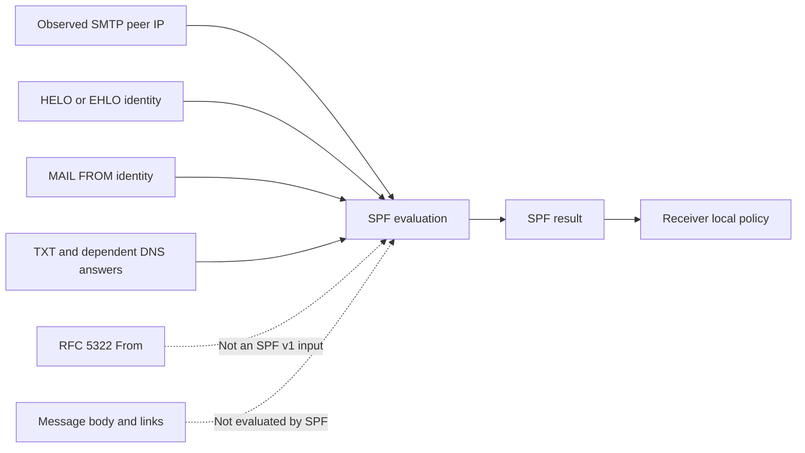
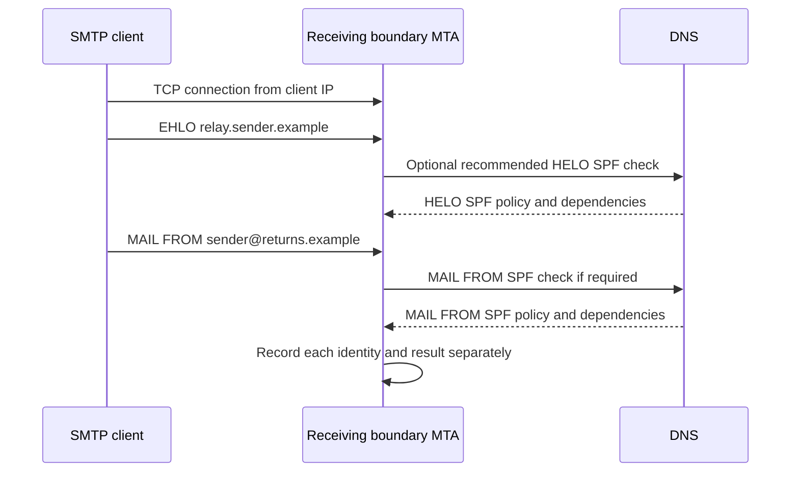
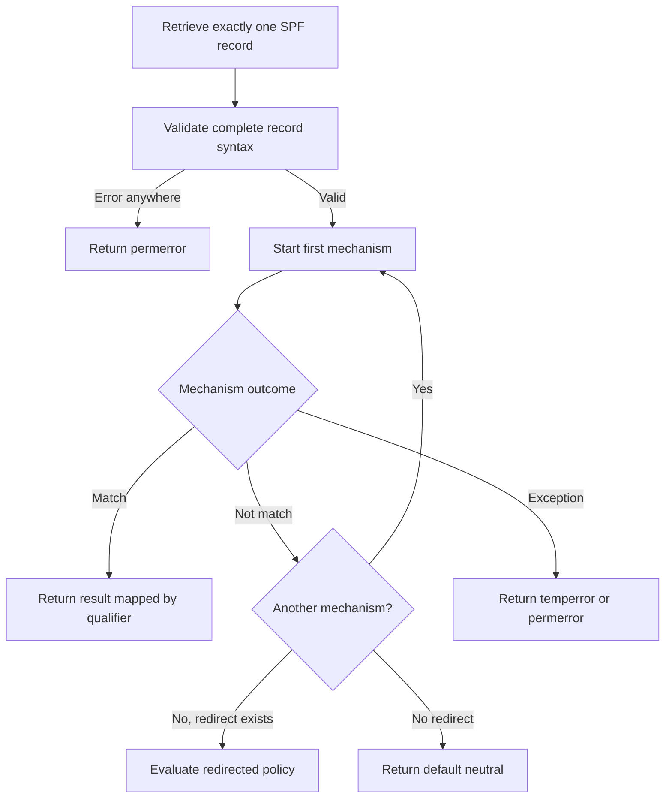
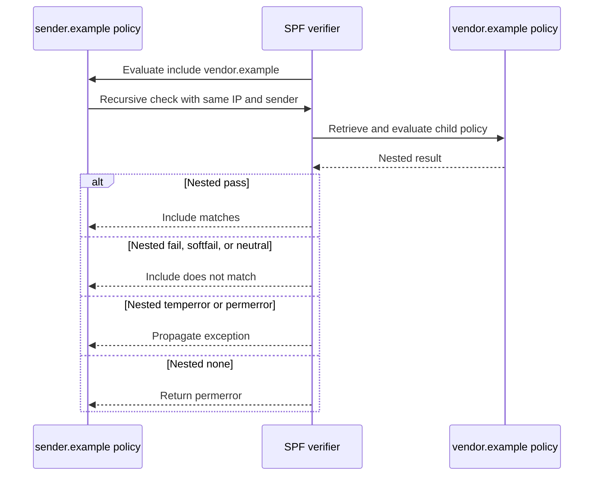
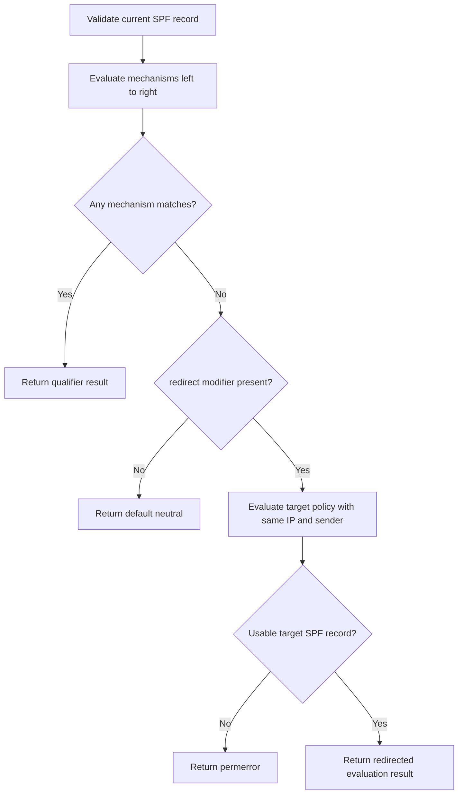
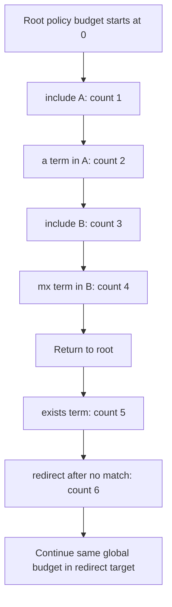
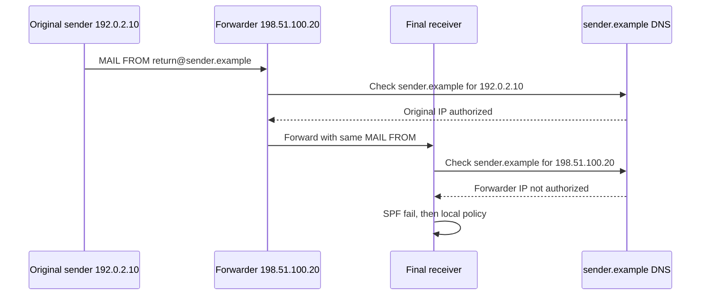
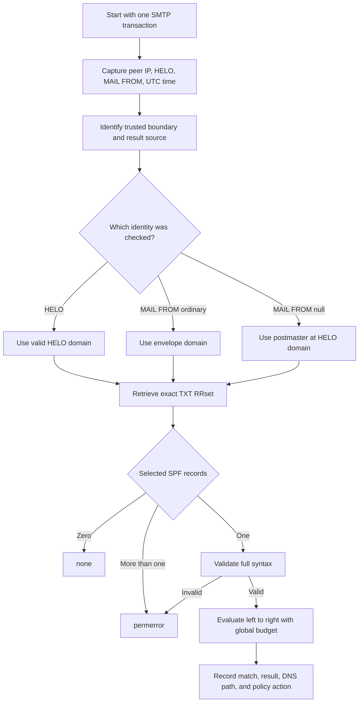

# Part 025 - SPF Sender Authorization

## Purpose, Evidence, and Currency

Sender Policy Framework (SPF) is a DNS-based authorization protocol for email. A domain publishes which sending hosts may use that domain in an SMTP `MAIL FROM` or HELO/EHLO identity, and a receiving system evaluates the connecting client IP against that policy. The idea sounds like a simple IP allowlist, but real SPF troubleshooting involves identity selection, ordered control flow, nested DNS evaluation, strict processing limits, temporary and permanent errors, forwarding, result recording, and receiver policy.

This part teaches SPF as an executable decision process rather than as a string to glance at. A support engineer should be able to reconstruct why a verifier returned `pass`, `fail`, `softfail`, `neutral`, `none`, `temperror`, or `permerror`; identify the exact SMTP identity checked; show which mechanism matched or raised an exception; account for the DNS budget; and state what the result does and does not prove.

The protocol facts are grounded primarily in RFC 7208, as updated by RFC 7372 for enhanced status codes, with identity and result-recording context from RFC 5321, RFC 5598, and RFC 8601. Provider-specific handling, reputation scoring, DNS resolver policy, and product architecture can change. Re-check current provider documentation and approved internal sources for a live case.

> **Currency note:** SPF version 1 is published in DNS TXT records. The experimental DNS SPF RR type 99 is no longer used by SPF version 1. A live TXT answer is a timestamped observation, while the evaluation semantics in RFC 7208 are standards facts.

## Section Goal

By the end of this part, you should be able to:

- Explain SPF from zero knowledge as domain authorization for a connecting SMTP host and a selected SMTP identity.
- Distinguish RFC 5321 MAIL FROM, HELO/EHLO, RFC 5322 From, Return-Path, SMTP AUTH identity, and recipient address.
- Select the correct SPF domain for ordinary mail and null reverse-path notifications.
- Parse one SPF record into version, ordered directives, qualifiers, mechanisms, and modifiers.
- Evaluate `all`, `include`, `a`, `mx`, `ptr`, `ip4`, `ip6`, and `exists` correctly.
- Explain why `ptr` and the `%{p}` macro should not be published even though verifiers must support them.
- Distinguish `include` from `redirect`, including each nested result's effect.
- Track the ten DNS-causing-term limit as one global budget across recursive evaluations.
- Recognize the separate MX/PTR fan-out limits and the recommended two-void-lookup limit.
- Distinguish a mechanism not-match from `none`, `neutral`, `fail`, `temperror`, and `permerror`.
- Explain why simple forwarding often breaks SPF and why SPF pass does not authenticate the visible From header.
- Read trusted `Authentication-Results` or `Received-SPF` evidence without trusting an arbitrary forged header.
- Produce a safe SPF evaluation trace using only synthetic records and documentation address ranges.

## JD Mapping

| Role responsibility | SPF capability from this part | Example support output |
|---|---|---|
| Troubleshoot email authentication failures | Reconstruct `check_host` inputs and ordered mechanism evaluation | "The receiver evaluated the MAIL FROM domain against client IP `192.0.2.44`; the first matching directive was `-ip4:192.0.2.0/24`, so the SPF result is fail." |
| Correlate SMTP and DNS evidence | Tie peer IP, HELO, envelope sender, TXT RRset, and result header together | A trace that names every input rather than testing only a visible From address |
| Separate protocol from policy | Distinguish SPF result from accept, reject, defer, quarantine, or reputation action | "SPF returned softfail; the recipient provider's inbox action is local policy." |
| Investigate intermittent failures | Account for DNS errors, caches, recursion, and lookup limits | "The include target returned SERVFAIL during evaluation, which propagates as temperror rather than not-match." |
| Diagnose third-party sending | Model include/redirect dependencies and administrative ownership | "The customer domain delegates authorization to a provider with include; the provider record currently exceeds the global DNS-term budget." |
| Explain forwarding behavior | Show that the receiving verifier sees the forwarder's IP | "The unchanged original MAIL FROM domain does not authorize the forwarding host, so direct delivery passes while forwarding fails." |
| Escalate safely | Preserve raw policy, query path, result mapping, and proof limits | A standards-grounded evaluation worksheet with a falsifiable next check |
| Avoid unsupported security claims | State that SPF authorizes an SMTP route/identity pair, not message authorship or content | "SPF pass does not prove the human sender or validate the visible From header." |

## Candidate Honesty Note

Do not claim that you have designed production SPF policy, operated a high-volume receiving MTA, or administered a provider's outbound fleet unless that is true. A credible answer can emphasize method:

> "I would preserve the receiver-observed client IP, HELO, and envelope MAIL FROM, identify which identity was checked, retrieve the exact TXT RRset from the relevant time and resolver path, and trace mechanisms left to right while tracking recursive DNS limits. I would separate the SPF result from the receiver's private disposition policy and state any architecture assumptions as hypotheses."

This is strong support engineering. It uses observable inputs, standards semantics, and proof boundaries. Your troubleshooting background transfers naturally: reproduce the decision, isolate the first divergent branch, and identify the team that owns the failing dependency.

## Evidence Labels Used in This Part

| Label | Meaning | SPF example |
|---|---|---|
| **[Standard]** | Behavior defined by an RFC | "Only a nested SPF pass makes an unqualified include mechanism match." |
| **[Provider policy]** | Documented receiver or sender service behavior | "The provider documents that it temporarily rejects SPF temperror." |
| **[Learned architecture]** | Behavior confirmed through approved internal material or an owning team | "The product's outbound boundary uses the addresses in the approved fleet inventory." |
| **[Observation]** | What a named tool, header, or log showed at a time and vantage | "At 14:05 UTC, resolver R returned one `v=spf1` TXT record with 180 seconds remaining." |
| **[Inference]** | A testable explanation not yet proven | "The direct-versus-forwarded difference is consistent with the forwarder's IP replacing the original peer IP." |
| **[Private unknown]** | Internal behavior not established by available evidence | "The recipient's exact weighting of SPF softfail is unknown." |

## Beginner Primer: SPF Answers One Narrow Authorization Question

SPF stands for **Sender Policy Framework**. A domain owner publishes a policy in DNS. A receiver uses that policy to ask a narrow question:

> Is this connecting SMTP client IP authorized to use this domain in the selected MAIL FROM or HELO identity?

That question has three essential inputs in RFC 7208's model `check_host()` function:

- `<ip>`: the IP address of the SMTP client connected to the receiver.
- `<domain>`: the DNS domain whose SPF policy is being evaluated.
- `<sender>`: the full MAIL FROM or HELO identity used for macro processing and context.

A basic analogy is a loading dock with a vendor list. A truck arrives from a gate-observed license plate and says it is shipping under Vendor A's account. The dock looks up Vendor A's authorized carriers. A match says Vendor A authorized that route/account use. It does not prove who packed every box, whether the contents are safe, or whether the person named on the packing slip wrote it.

| Term | Plain meaning | Why it matters | Memory hook |
|---|---|---|---|
| SPF publisher | Domain owner that places SPF policy in DNS | Defines the claimed authorization set | **Publisher writes the route policy** |
| SPF verifier | Receiver component that evaluates a transaction | Chooses inputs and executes the rules | **Verifier runs the policy** |
| Client IP | Address of the SMTP peer observed by the receiver | Compared with addresses designated by mechanisms | **Use the last hop you actually received** |
| MAIL FROM | SMTP envelope reverse-path identity | Usually supplies the checked SPF domain | **Envelope return identity** |
| HELO identity | Domain from SMTP HELO or EHLO | Can be checked separately and is used for null reverse-path handling | **Session host identity** |
| Directive | Optional qualifier plus a mechanism | Produces a result when its mechanism matches | **Match plus sign gives result** |
| Mechanism | An ordered test such as `ip4`, `include`, or `all` | Determines match, not-match, or exception | **Mechanisms are tests** |
| Modifier | A name/value instruction such as `redirect=` or `exp=` | Adds behavior but is not an ordered match test | **Modifiers tune the evaluation** |
| Qualifier | `+`, `-`, `~`, or `?` before a mechanism | Maps a match to pass, fail, softfail, or neutral | **The sign names the result** |
| DNS budget | Limit on DNS-causing terms across evaluation | Prevents unbounded or amplified DNS work | **Recursive work shares one meter** |



SPF is often called email authentication, but RFC 8601 makes the useful distinction that SPF is an **authorization** mechanism. It establishes whether the publishing domain authorized an SMTP route for an identity. It does not authenticate every other identity or the message content.

## 🔍 Plain-English deep-dive: SPF Authorizes a Route for an SMTP Identity, Not the Visible Author

An email has several identity-like values at different layers. The one a user sees most prominently is usually the RFC 5322 `From:` header. SPF version 1 does not evaluate that header. It evaluates the domain in the SMTP `MAIL FROM` identity and can separately evaluate the HELO/EHLO domain.

Consider this synthetic transaction:

```text
Peer IP: 192.0.2.44
EHLO relay.vendor.example
MAIL FROM:<bounce@returns.vendor.example>
From: "Accounts Team" <billing@brand.example>
RCPT TO:<user@recipient.example>
```

An SPF pass for `returns.vendor.example` means `192.0.2.44` is authorized by that domain's SPF policy to use the MAIL FROM identity. It does not say:

- `brand.example` authorized the visible From address.
- The display name "Accounts Team" is truthful.
- The local-part `bounce` identifies a particular user.
- The message was not modified.
- The content is safe or wanted.
- The receiver must place it in the inbox.

This layered identity model explains a common ticket: "SPF passed for a spoofed From address." That is not necessarily an SPF malfunction. The message can use an attacker-controlled, SPF-passing envelope domain while displaying a different From domain. A separate policy such as DMARC can compare an authenticated domain with the visible From domain; that alignment topic is handled later in the guide.

The support engineer should name both the checked identity and the visible identity:

> **[Observation]** The trusted receiver header reports `spf=pass smtp.mailfrom=returns.vendor.example`. The RFC 5322 From domain is `brand.example`. **[Standard]** SPF pass authorizes the MAIL FROM domain's use by the peer IP; it does not authenticate the From header. **[Private unknown]** The receiver's combined anti-abuse decision is not established by SPF alone.

This wording is precise without diminishing SPF's value. SPF creates domain accountability for a selected transport identity. It is simply not a universal authorship proof.

## Identity Selection: HELO, MAIL FROM, and Null Reverse-Path

SPF verifiers are recommended to check HELO before MAIL FROM when both will be checked. HELO policy often describes one host and can provide a conclusive result with less DNS work. If HELO was not checked or did not reach a definitive policy result, the verifier must check MAIL FROM when it elects to perform SPF.

| Identity or field | Set or observed where | SPF v1 role | Common mistake |
|---|---|---|---|
| Client IP | Network peer at receiving boundary | Required `<ip>` input | Using the oldest Received IP rather than the actual boundary peer |
| HELO/EHLO domain | SMTP session command | Separately checkable sender identity | Treating HELO and PTR as the same value |
| MAIL FROM | SMTP transaction command | Usual domain for SPF evaluation | Calling it the visible sender |
| Null MAIL FROM `<>` | SMTP notifications such as DSNs | MAIL FROM identity becomes `postmaster@` plus HELO identity | Returning `none` without applying the defined substitution |
| RFC 5322 From | Message header content | Not directly checked by SPF v1 | Looking up SPF for the visible From and calling that the transaction result |
| Return-Path | Final-delivery header derived from MAIL FROM | Can preserve envelope evidence after delivery | Assuming any pre-existing Return-Path was trustworthy before final delivery |
| SMTP AUTH identity | Submission authentication exchange | Separate from SPF | Treating authenticated submission as an SPF mechanism |
| RCPT TO | SMTP recipient envelope | Not the sender domain checked by SPF | Looking up the recipient's SPF record |



### Null Reverse-Path

SMTP uses `MAIL FROM:<>` for delivery-status notifications and other messages where another notification must not be generated on failure. There is no explicit mailbox domain to check. RFC 7208 defines the MAIL FROM identity in this case as:

```text
postmaster@<HELO-domain>
```

The HELO identity may also have been checked separately. This is why individual outbound hostnames benefit from valid SPF policy. A null reverse-path does not mean "skip SPF" and does not mean null MX.

### Boundary Location

The best evaluation point is the receiving SMTP transaction boundary because the receiver has the reliable peer IP, HELO, and MAIL FROM at that moment. Reconstructing SPF later from headers is risky: headers can be forged, the correct peer IP may be ambiguous, and DNS policy may have changed since transit.

## Publishing and Selecting an SPF Record

SPF version 1 policy is published as DNS TXT data at the owner name being authorized. The record begins exactly with `v=spf1`, followed by space-separated terms.

```text
sender.example. 300 IN TXT "v=spf1 ip4:192.0.2.0/24 include:mailvendor.example -all"
```

Other TXT records at the same owner may serve unrelated applications. The SPF verifier retrieves the TXT RRset and selects records whose first version section is exactly `v=spf1`, terminated by a space or the end of the record. `v=spf10` is not SPF version 1 and is discarded.

| TXT/SPF publication state | SPF selection result | Explanation |
|---|---|---|
| No TXT data or no selected `v=spf1` record | `none` | No SPF policy was retrieved for the identity |
| Exactly one selected SPF record | Continue | Validate syntax, then evaluate it |
| More than one selected SPF record | `permerror` | A domain must not publish multiple applicable SPF records |
| One TXT RR with several character strings | Concatenate strings with no added spaces | String chunks are one logical TXT record |
| Several unrelated TXT records plus one SPF record | Select the one SPF record | Other TXT applications do not become SPF terms |
| DNS timeout/SERVFAIL on initial TXT lookup | `temperror` | Policy retrieval failed transiently |
| Domain NXDOMAIN or malformed/non-multilabel identity | `none` in the SPF model | Receiver may still have separate domain-validity policy |
| DNS SPF RR type 99 only | `none` for compliant SPF v1 TXT lookup | SPF version 1 must use TXT, not type 99 |

### Multiple Strings Are Not Multiple SPF Records

The following is one TXT record split for presentation/storage limits:

```text
sender.example. IN TXT "v=spf1 ip4:192.0.2.0/24 " "include:mailvendor.example -all"
```

It becomes:

```text
v=spf1 ip4:192.0.2.0/24 include:mailvendor.example -all
```

No space is inserted automatically between strings, so the publisher must put needed whitespace inside a chunk. By contrast, two separate TXT records that both begin `v=spf1` cause `permerror`; a verifier must not concatenate them into one policy.

## Record Grammar: Directives, Mechanisms, Qualifiers, and Modifiers

An SPF record is parsed before mechanism evaluation. A syntax error anywhere in the record produces `permerror` immediately, even if an earlier mechanism would appear to match. This blocks a dangerous shortcut: reading left to right and stopping before validating the remainder.

| Construct | Form | Function | Example |
|---|---|---|---|
| Version | `v=spf1` | Selects SPF version 1 | `v=spf1` |
| Directive | `[qualifier]mechanism` | Ordered match test | `-ip4:192.0.2.0/24` |
| Implicit qualifier | No sign | Defaults to `+` pass on match | `mx` equals `+mx` |
| Mechanism | Test name and optional argument/CIDR | Matches, does not match, or raises exception | `include:vendor.example` |
| Modifier | `name=value` | Adds behavior, not a mechanism match | `redirect=_spf.example` |
| Unknown modifier | Unrecognized `name=value` | Must be ignored | `future=value` |
| Unknown mechanism | Unrecognized mechanism syntax | Syntax error | `madeup:example` |
| Explicit terminator | Usually qualified `all` | Always matches and returns its qualifier result | `-all` |

| Qualifier | Result when its mechanism matches | Plain meaning | Typical form |
|---|---|---|---|
| `+` | `pass` | Client is authorized by this directive | `+ip4:192.0.2.44` or omitted `+` |
| `-` | `fail` | Client is explicitly unauthorized by this directive | `-all` |
| `~` | `softfail` | Publisher weakly says probably unauthorized | `~all` |
| `?` | `neutral` | Publisher makes no positive or negative assertion | `?all` |



Modifiers may appear syntactically among terms, but `redirect` and `exp` should appear near the end for clarity. Each may appear at most once. Unknown modifiers are ignored to allow extension; unknown mechanisms cannot be ignored because they would change ordered authorization semantics.

## Mechanisms: Ordered Tests

Each mechanism is evaluated left to right. It can match, not match, or return an exception. On match, evaluation stops and the qualifier determines the result. On not-match, continue. On exception, stop with the exception result.

| Mechanism | What it tests | DNS-causing term? | Important boundary |
|---|---|---:|---|
| `all` | Always matches | No | Terms after it are unreachable and ignored |
| `include:domain` | Nested policy returns pass | Yes | It does not paste another record's text |
| `a[:domain][/cidr]` | Client IP matches A/AAAA for target | Yes | Query address family appropriate to client IP |
| `mx[:domain][/cidr]` | Client IP matches an address of a listed MX host | Yes | SPF does not apply SMTP implicit MX fallback |
| `ptr[:domain]` | Validated reverse name falls within target domain | Yes | Publisher should not use it; verifier must support it |
| `ip4:network` | IPv4 client IP falls in CIDR network | No | Omitted prefix means `/32` |
| `ip6:network` | IPv6 client IP falls in CIDR network | No | Omitted prefix means `/128` |
| `exists:domain-spec` | Expanded name returns any A record | Yes | It queries A even for an IPv6 SMTP client |

### `all`

`all` always matches. It normally appears last to make the default explicit:

```text
v=spf1 ip4:192.0.2.0/24 -all
```

Any client inside the network passes at the first directive. Every other client reaches `-all` and fails. Mechanisms after `all` are never tested. A `redirect` modifier is ignored if an `all` mechanism appears anywhere in the record.

### `ip4` and `ip6`

These mechanisms compare the client IP directly against a literal network and do not cause DNS queries during SPF evaluation:

```text
v=spf1 ip4:192.0.2.0/24 ip6:2001:db8:1234::/48 -all
```

They are predictable and inexpensive but require policy maintenance when sending ranges change. Do not omit address octets instead of CIDR; `192.0.2.0/24` is valid, while `192.0.2` is not a substitute.

### `a`

The `a` mechanism queries the target name for the address family of the connecting IP. With an IPv4 client, it compares returned A records; with IPv6, returned AAAA records. If the domain-spec is omitted, the current SPF `<domain>` is the target.

```text
v=spf1 a:outbound.sender.example -all
```

The mechanism matches if any relevant returned address equals the client IP, or matches under the optional CIDR prefix.

### `mx`

The `mx` mechanism queries MX for its target, then relevant addresses for each exchange host, and compares those with the client IP. This is an authorization test, not a mail-routing attempt. A crucial difference from SMTP routing is that SPF **must not** invent an implicit MX when the target has no MX record.

```text
v=spf1 mx:sender.example -all
```

This can be appropriate when outbound senders are exactly the inbound MX hosts, but that architecture should be verified rather than assumed.

### `ptr` (Do Not Publish)

The `ptr` mechanism performs reverse mapping, forward-validates returned names, and checks whether a validated name is equal to or beneath the target domain. RFC 7208 says publishers should not use it because it is slow, DNS-error-sensitive, burdens reverse infrastructure, and has more reliable alternatives. Verifiers still must implement it for compatibility.

### `exists`

`exists` macro-expands a domain-spec and performs an A query. If any A record is returned, it matches; the address value does not need to equal the SMTP client IP. The queried name itself normally encodes the relevant decision inputs through macros or a specialized DNS service.

```text
v=spf1 exists:%{ir}._spf.sender.example -all
```

This is expressive but creates privacy, caching, complexity, and DNS-load concerns. It is not merely another way to write `a`.

## Include: Nested Authorization Without Text Pasting

`include:domain` recursively evaluates SPF with the same client IP and sender but a new current policy domain. The word "include" is misleading because the referenced terms are not pasted into the parent. Only the nested result controls whether the include mechanism matches, does not match, or raises an exception.

## 🔍 Plain-English deep-dive: Include Is a Question That Matches Only on Pass

Treat include as asking another domain one yes/no/error question:

> "For this same client IP and sender, does your SPF evaluation return pass?"

If the answer is pass, the include mechanism matches, and the include's own qualifier determines the parent result. If the nested result is fail, softfail, or neutral, the include mechanism simply does not match, so the parent continues. A nested temperror or permerror propagates as an exception. A nested `none` becomes permerror because the publisher referenced a domain that supplied no usable SPF policy.

| Nested `check_host` result | Effect on include mechanism | Parent action |
|---|---|---|
| `pass` | Match | Return include directive's qualifier result |
| `fail` | Not-match | Continue to next parent mechanism |
| `softfail` | Not-match | Continue |
| `neutral` | Not-match | Continue |
| `temperror` | Exception `temperror` | Stop entire evaluation |
| `permerror` | Exception `permerror` | Stop entire evaluation |
| `none` | Exception `permerror` | Stop; referenced include lacks usable policy |

Consider:

```text
sender.example: v=spf1 include:vendor.example -all
vendor.example: v=spf1 ip4:192.0.2.0/24 -all
client IP: 198.51.100.44
```

The vendor policy reaches `-all`, so its result is fail. That fail does not become the parent result directly. It means the include did not match. The parent then reaches its own `-all`, which produces the final fail. The two paths happen to end with the same final word, but their semantics matter when the parent has later mechanisms.

Now change the parent:

```text
sender.example: v=spf1 include:vendor.example ip4:198.51.100.44 -all
```

The nested vendor fail becomes include not-match. The parent's next `ip4` matches, so the final result is pass. Text-pasting intuition would get this wrong.



Use include when one administrative domain authorizes an externally managed sending service. The original publisher still controls its final policy through the parent mechanisms, usually including a final `-all` or another explicit result.

## Redirect: Replace Policy After No Mechanism Matches

`redirect=domain` is a modifier, not a mechanism. It is evaluated only after every mechanism in the current record fails to match. The verifier then evaluates the target policy with the same IP and sender but the redirected domain as the current policy domain. That nested evaluation's result becomes the current result, except missing or malformed target policy becomes `permerror` rather than `none`.



| Difference | `include:vendor.example` | `redirect=_spf.sender.example` |
|---|---|---|
| Type | Mechanism | Modifier |
| When evaluated | In ordered mechanism position | Only after no mechanism matched |
| Success condition | Nested pass makes include match | Entire nested result becomes current result |
| Nested fail | Include not-match; parent continues | Final/current result is fail |
| Nested none | `permerror` | `permerror` |
| Original policy after nested result | Parent controls later mechanisms and final default | Target effectively supplies shared policy |
| Best ownership fit | Crossing administrative boundaries | Consolidating policy within one ADMD |
| Effect of `all` in parent | Include before it can still run | Any parent `all` causes redirect to be ignored |

Redirect is appropriate for sibling domains under common control that share one complete policy. Include is usually better for third-party service authorization because the original domain retains control of its final policy and because sender-sensitive macros in an unrelated redirect target may not behave as intended.

## Modifiers, Explanations, and Macros

RFC 7208 defines `redirect=` and `exp=` modifiers. `exp` is consulted only when a mechanism match produces fail. It points to a TXT record containing an explanation template. Errors retrieving or parsing the explanation do not change the SPF result; the verifier proceeds as if no `exp` were present.

| Modifier/property | Purpose | DNS budget treatment | Safety boundary |
|---|---|---|---|
| `redirect=` | Share a complete policy after no mechanism matches | Counts as a DNS-causing term | Missing target policy is permerror |
| `exp=` | Supply publisher-originated explanation text after fail | Not part of ten-term limit during ordinary evaluation | Text/URLs are untrusted third-party content |
| Unknown modifier | Future extensibility | Depends on future definition, but current verifier ignores it | Must not reinterpret unknown data |
| `%{i}` | Client IP macro | Can become part of queried name | May expose per-connection detail in DNS |
| `%{d}` | Current policy domain | Changes through include/redirect recursion | Do not confuse with original sender domain in every frame |
| `%{s}` | Full sender identity | Remains original through recursion | Can reduce cacheability and expose local-part |
| `%{h}` | HELO/EHLO value | Remains session input | Sender-provided and potentially hostile |
| `%{p}` | Validated domain name of IP | Requires expensive reverse work | Should not be published |

Macros can transform values, reverse parts, select a number of components, and change delimiters. They make per-user or per-IP decisions possible, but they also reduce cache effectiveness and can expose sender information through DNS queries. Macro-expanded names can be malformed or exceed label limits; publishers should prefer simpler policies unless dynamic behavior is genuinely necessary.

An SPF trace should record the **expanded target name**, not only the source macro text. That makes DNS behavior reproducible.

## DNS Processing Limits

SPF deliberately limits DNS-causing work to reduce denial-of-service and amplification risk. The central limit is not "ten DNS packets" or "ten includes." It is a limit of ten evaluated DNS-causing terms across the whole SPF evaluation, including recursive include and redirect paths.

The terms subject to this global limit are:

- `include`
- `a`
- `mx`
- `ptr`
- `exists`
- `redirect`

The following do not consume that term budget during SPF evaluation:

- `all`
- `ip4`
- `ip6`
- `exp` during ordinary evaluation

## 🔍 Plain-English deep-dive: Ten DNS-Causing Terms Are a Global Budget, Not Ten TXT Records

Imagine a support workflow with ten approved external-dependency steps. Opening a sub-workflow does not give it a fresh allowance; child work consumes the same ticket budget. SPF works similarly.

Suppose the root policy contains three includes. The first included policy evaluates two `a` mechanisms and another include. The second included policy evaluates an `mx`. The counter does not reset at each domain. Every evaluated `include`, `a`, nested `include`, and `mx` term contributes to the same global total. When an evaluation exceeds ten, the result must be `permerror`.

This is different from counting raw DNS queries. One `mx` term can produce an MX query and several A or AAAA queries, while one `include` causes a nested TXT query and whatever terms that policy evaluates. The standard counts the specified terms globally, then adds fan-out controls for MX and PTR processing.



Additional limits matter:

- An `mx` evaluation must constrain address lookups associated with the returned MX hosts; exceeding the specified fan-out produces `permerror`.
- PTR processing and the `%{p}` macro evaluate no more than the first ten relevant names/addresses under their defined rules.
- Implementations should limit **void lookups** to two by default. A void lookup is a DNS query that returns NXDOMAIN or NOERROR with zero answers. Exceeding the limit produces `permerror`.
- Verifiers should impose an elapsed evaluation time limit that allows at least 20 seconds; exceeding it should produce `temperror`.

| Limit | Scope | Result when exceeded | Why it exists |
|---|---|---|---|
| 10 DNS-causing terms | Entire evaluation including recursion | `permerror` | Bounds publisher-controlled DNS amplification |
| MX address fan-out | Each `mx` processing path under RFC rules | `permerror` when exceeded | Prevents large MX sets from exploding address queries |
| PTR validated-name work | `ptr` and `%{p}` processing | Extra records ignored or mechanism behavior per rule | Reverse data is controlled by connecting IP owner |
| Recommended 2 void lookups | Entire evaluation in common implementation policy | `permerror` | Limits waste on nonexistent names |
| Elapsed time | Whole check | `temperror` | Prevents SMTP sessions from waiting indefinitely |

Do not "fix" an over-budget record merely by flattening it into a giant static address list without analyzing ownership, update process, IPv6 coverage, provider change frequency, and record-size constraints. The diagnosis is protocol-level; the remediation is an architecture and operations decision.

## Results: Protocol Meaning Versus Receiver Handling

| SPF result | Protocol meaning | Common causal class | Receiver handling boundary |
|---|---|---|---|
| `none` | No usable identity/policy was found | No selected SPF record, malformed/nonexistent domain in initial processing | Separate domain-validity policy may still act |
| `neutral` | Publisher explicitly makes no assertion, or no mechanism matched with no redirect | `?` qualifier or implicit default | Must be treated like none by SPF guidance |
| `pass` | Client is authorized for checked identity | Matching `+` directive, including default qualifier | Does not guarantee safe content or inbox placement |
| `fail` | Client explicitly not authorized | Matching `-` directive | Receiver may reject or use as one input |
| `softfail` | Publisher weakly says probably unauthorized | Matching `~` directive | Should not reject solely on softfail under RFC guidance |
| `temperror` | Transient error prevented a final result | DNS SERVFAIL, timeout, elapsed check limit | Receiver may accept or temporarily defer |
| `permerror` | Published policy could not be interpreted/evaluated within rules | Syntax error, multiple SPF records, missing include target, lookup-limit excess | Requires publisher/operator correction; disposition remains local policy |

RFC 7208 does not impose one universal message disposition for each result. A provider can combine SPF with other authentication, reputation, content, account, or abuse signals. `pass` can accompany malicious mail from a domain that authorized its own infrastructure. `fail` can affect legitimate mail after forwarding. A support ticket must separate the deterministic SPF result from the provider's action.

RFC 7372 updates enhanced status guidance:

| Situation | Basic SMTP code when used | Enhanced status code | Meaning |
|---|---:|---|---|
| SPF fail violates local policy | 550 | 5.7.23 | SPF validation failed |
| SPF evaluation error is temporarily deferred | 451 | 4.7.24 | SPF validation error |
| SPF evaluation error is permanently rejected | 550 | 5.7.24 | SPF validation error |
| Multiple authentication methods fail | 550 | 5.7.26 | Combined authentication failure, if receiver chooses to disclose it |

An SMTP response exposes only one enhanced code even when multiple reasons exist. The code may not reveal every internal decision input.

## Forwarding and Mediators

SPF evaluates the IP of the SMTP client directly connected to the receiver. Simple alias forwarding often keeps the original MAIL FROM identity but creates a new SMTP hop. The final receiver sees the forwarder's IP, not the original sender's IP. If the original envelope domain does not authorize that forwarder, SPF can fail.

## 🔍 Plain-English deep-dive: Forwarding Changes the Observed IP Without Changing the Original Story

Imagine a package from Vendor A carried by an authorized Vendor A truck to a forwarding warehouse. The warehouse sends the same package onward using its own truck while leaving Vendor A's return label unchanged. The final dock checks Vendor A's authorized truck list and sees the warehouse's truck. The check fails even though the first leg was legitimate.

That is the classic SPF forwarding problem:

1. Original sender IP `192.0.2.10` uses `MAIL FROM:<return@sender.example>`.
2. `sender.example` authorizes `192.0.2.10`, so the first receiver gets SPF pass.
3. The mailbox forwards the message to another domain without rewriting MAIL FROM.
4. Final receiver sees forwarder IP `198.51.100.20` with the same `sender.example` MAIL FROM.
5. `sender.example` does not authorize `198.51.100.20`, so the final SPF check fails.



This does not prove the forwarder is malicious or that the sender published the wrong original outbound list. It proves that the final observed route is not authorized for the retained identity.

Mediators can rewrite MAIL FROM into their own domain and take responsibility for returns, but that requires correct bounce handling and architecture. Receivers can apply trusted-forwarder policy, and other mechanisms can preserve useful authentication signals. Those are operational choices, not something a support engineer should prescribe blindly from one header.

| Message path | Peer IP at verifier | MAIL FROM behavior | Expected SPF risk |
|---|---|---|---|
| Direct sender to receiver | Original boundary sender | Original domain | Passes if policy includes that sender |
| Internal relay before outbound boundary | Public receiver sees outbound boundary IP | Original domain | Publisher must authorize the actual Internet-facing boundary |
| Simple mailbox alias forwarding | Final receiver sees forwarder IP | Often unchanged | Common false-negative SPF fail |
| Mailing list repost | Final receiver sees list infrastructure | Usually rewritten to list-controlled return domain | List can publish authorization for its own identity |
| Gateway or mediator | Final receiver sees gateway IP | May be rewritten | Evaluate the new transaction's actual identity and ownership |
| Header-only "forward" by a user | New message submission | New sender's envelope | Original attached content does not control SPF |

## Trusted Result Evidence

SPF results commonly appear in `Authentication-Results` and `Received-SPF`. These are message headers and can be forged before a message enters the receiver's trust boundary. Interpret a result only when the adding authentication service and header-placement/trust rules are established.

Synthetic trusted result:

```text
Authentication-Results: mx.recipient.example;
  spf=pass smtp.mailfrom=sender.example
```

This says the trusted authentication service reported SPF pass for the MAIL FROM property. It does not reconstruct every DNS query. A more detailed `Received-SPF` field can preserve client IP, HELO, envelope-from, receiver, and matching mechanism.

| Evidence source | Strength when trusted | Missing information to seek |
|---|---|---|
| Boundary MTA SPF debug log | Often best for reconstruction | DNS response details if not logged |
| Trusted Received-SPF | Can include client IP, identity, HELO, mechanism, and problem | Exact recursive query chronology may still be absent |
| Trusted Authentication-Results | Clear method/result/property statement | Usually less reconstructive detail |
| Received header | Corroborates observed peer and HELO at a hop | Does not itself prove SPF was evaluated correctly |
| Live DNS query | Shows current policy from one vantage | May differ from transit-time cached policy |
| Customer screenshot/tool | Useful lead | Tool inputs, resolver, time, identity selection, and trust provenance |
| Untrusted arbitrary header | Attacker-controlled assertion | Do not use for security conclusion |

### Result Property Matters

RFC 8601 records SPF against `smtp.mailfrom` or `smtp.helo`. If the header only says `spf=pass` and hides the property, you cannot safely assume which identity passed. When both identities were checked, they can have different results. Preserve each separately rather than averaging them into "SPF passed."

## Worked Example 1: First Match Wins

### Synthetic inputs

```text
Client IP: 192.0.2.44
MAIL FROM: alerts@sender.example
HELO: relay.sender.example
sender.example TXT: "v=spf1 ip4:198.51.100.0/24 -ip4:192.0.2.0/24 +all"
```

### Trace

| Step | Term | Outcome | Counter | Action |
|---:|---|---|---:|---|
| 1 | `ip4:198.51.100.0/24` | Not-match | 0 | Continue |
| 2 | `-ip4:192.0.2.0/24` | Match | 0 | Stop and return fail |
| 3 | `+all` | Not evaluated | 0 | Unreachable after match |

Even though `+all` would authorize every IP, it is never reached. Ordered evaluation makes earlier mechanisms decisive. The record is unusual and risky to read casually, but its result is deterministic.

## Worked Example 2: Include Fail Is Parent Not-Match

### Synthetic policies

```text
sender.example: "v=spf1 include:vendor.example ip4:198.51.100.44 -all"
vendor.example: "v=spf1 ip4:192.0.2.0/24 -all"
Client IP: 198.51.100.44
```

### Trace

| Frame | Term | Nested/direct outcome | Parent meaning | DNS-term counter |
|---|---|---|---|---:|
| sender.example | `include:vendor.example` | Enter child | Pending | 1 |
| vendor.example | `ip4:192.0.2.0/24` | Not-match | Continue child | 1 |
| vendor.example | `-all` | Child fail | Include not-match | 1 |
| sender.example | `ip4:198.51.100.44` | Match | Parent pass | 1 |

Final result: pass. If a tool reports fail by copying the child `-all` into the parent, its include semantics are wrong.

## Worked Example 3: Missing Include Policy Is Permerror

```text
sender.example: "v=spf1 include:missing-policy.example -all"
missing-policy.example TXT: no selected v=spf1 record
```

The nested result is `none`, which include maps to `permerror`, not not-match. The parent does not continue to `-all`. This distinction tells the publisher that its policy references an invalid dependency rather than definitively declaring the client unauthorized.

## Worked Example 4: Redirect Supplies the Final Policy

```text
department.example: "v=spf1 redirect=_spf.corp.example"
_spf.corp.example: "v=spf1 ip4:192.0.2.0/24 ~all"
Client IP: 198.51.100.44
```

No mechanisms appear in the first record, so redirect runs. The target's `ip4` does not match; `~all` matches and produces softfail. Final result: softfail. If the target had no SPF record, final result would be permerror.

## Worked Example 5: Lookup Budget Exceeded

### Synthetic path

The parent includes two provider policies. Provider A chains through five DNS-causing terms before not-matching. Provider B then chains through another five and reaches an eleventh `a` term.

| Evaluated DNS-causing term | Running count |
|---|---:|
| Parent `include:a.example` | 1 |
| A `a:one.example` | 2 |
| A `include:a2.example` | 3 |
| A2 `mx:a2.example` | 4 |
| A2 `exists:x.example` | 5 |
| Parent `include:b.example` | 6 |
| B `a:two.example` | 7 |
| B `include:b2.example` | 8 |
| B2 `mx:b2.example` | 9 |
| B2 `exists:y.example` | 10 |
| B2 `a:eleven.example` | 11 -> permerror |

The final `-all` is never reached because limit excess is an exception. The support conclusion should identify the full dependency owners, not merely tell the root domain to "add fewer includes" without understanding provider records.

## Worked Example 6: Temperror Versus Permerror

| Event | Correct result | Why |
|---|---|---|
| TXT query times out | `temperror` | A later retry may succeed without policy change |
| Include target TXT returns SERVFAIL | `temperror` | Nested transient exception propagates |
| Two selected SPF records | `permerror` | Publisher must correct ambiguous policy |
| Unknown mechanism | `permerror` | Whole-record syntax is invalid |
| More than ten DNS-causing terms evaluated | `permerror` | Policy violates processing bound |
| `exp` TXT query fails after `-all` match | Still `fail` with default/empty explanation | Explanation failure does not replace result |
| Initial domain has no SPF record | `none` | No authorization assertion is available |

## Failure Modes and Misleading Shortcuts

| Failure mode | Misleading shortcut | Better interpretation | Cheapest discriminating check |
|---|---|---|---|
| Visible From checked instead of MAIL FROM | "SPF says the brand passed" | SPF result belongs to recorded smtp identity | Inspect trusted `smtp.mailfrom` or `smtp.helo` property |
| Oldest Received IP used | "Original sender was authorized" | SPF boundary uses immediate SMTP peer | Identify the trusted receiving boundary and connection IP |
| Include treated as text paste | "Child -all ended the parent" | Only child pass makes include match | Apply nested-result table and continue parent after child fail |
| Redirect treated like include | "Redirect pass is just one mechanism" | Redirect replaces result after no current match | Check whether any parent mechanism matched or any `all` exists |
| DNS queries counted instead of terms | "We made ten packets, so permerror" | Global limit counts specified DNS-causing terms | Produce term-by-term counter plus fan-out notes |
| Counter reset in include | "Each provider gets ten" | Recursion shares one global budget | Trace all frames on one counter |
| No MX in SPF `mx` gets SMTP fallback | "Use domain A record" | SPF mx mechanism forbids implicit MX | Verify actual MX RRset; NODATA means no mx match |
| Syntax checked lazily | "First ip4 matched, so pass" | Any syntax error anywhere produces permerror before evaluation | Parse the entire record first |
| SERVFAIL treated as not-match | "Continue to -all" | Transient DNS exception normally yields temperror | Preserve RCODE/timeout at the exact dependent query |
| Missing include target treated as not-match | "Then parent -all fails" | Nested none maps to permerror | Query exact include target TXT and apply mapping |
| SPF pass called inbox guarantee | "Authentication is good" | Route/identity authorization is one signal | Separate result from provider disposition logs |
| Forwarding blamed on bad sender SPF | "Add every forwarder to sender policy" | Forwarder changed observed IP outside sender control | Compare direct and forwarded hops and MAIL FROM rewriting |
| Several SPF TXT records concatenated | "The long policy is split" | Separate applicable records cause permerror | Preserve RR boundaries, not just displayed strings |
| Softfail described as fail | "~all means reject" | Softfail is a weaker publisher statement | Record exact result and receiver policy separately |
| Arbitrary Authentication-Results trusted | "Header says pass" | Header can be forged outside trust boundary | Establish trusted authserv-id and insertion boundary |

## Troubleshooting Decision Tree



### Step 1: Anchor the Transaction

Capture the receiver-observed peer IP, HELO/EHLO, exact `MAIL FROM`, recipient, UTC time, message or connection ID, SMTP reply, and trusted result headers/logs. SPF is transaction-contextual; a bare domain and IP from memory are not enough.

### Step 2: Establish the Boundary

Identify the MTA that received the connection from the external ADMD. Internal relays can obscure the original peer. Do not recalculate from arbitrary Received fields unless the trust chain is understood.

### Step 3: Select Identity

Determine whether the reported result is for HELO or MAIL FROM. For null reverse-path, form the specified postmaster identity from HELO. Do not substitute RFC 5322 From.

### Step 4: Reconstruct Transit-Time DNS

Prefer the receiver's logged/cached evidence from the event. A current public query is a comparison, because policy or cache contents may have changed. Record exact TXT RR boundaries and TTLs.

### Step 5: Select and Parse

Discard unrelated TXT records. Zero applicable records means none; more than one means permerror. Concatenate strings inside one TXT RR without inserting spaces. Validate the whole selected record before evaluating mechanisms.

### Step 6: Evaluate with One Counter

Trace left to right. Record target-name expansion, DNS query outcome, match/not-match/exception, qualifier, nested result mapping, and global DNS-term count. Include per-MX/PTR fan-out and void lookup counts where relevant.

### Step 7: Separate Result from Disposition

State the SPF result first. Then state the observed SMTP or filtering action. Label undocumented provider behavior as private unknown or inference.

### Step 8: Assign Ownership

- Wrong root policy: identity domain's DNS/email owner.
- Broken include target: referenced service/provider owner, with root publisher responsible for dependency choice.
- Over-budget chain: all participating policy owners may need coordination.
- Wrong observed IP/internal boundary: receiving architecture owner.
- Forwarding break: mediator/forwarding architecture and receiver policy owners.
- Header trust problem: receiving ADMD mail-security owner.

## Safe Lab: SPF Evaluation Trace Using Synthetic Records

### Safety Boundary

This lab is fully synthetic. Do not send mail, connect to SMTP servers, query customer domains, publish DNS, create accounts, upload records, or use live provider checkers. Use only the supplied fictional policies, reserved example names, and documentation IP ranges. The goal is deterministic reasoning, not testing an external system.

### Prerequisites

1. An authorized, non-production local study folder and a Markdown or spreadsheet editor.
2. This Part and RFC 7208 for checking identity selection, mechanism order, nested-result mapping, and lookup limits.
3. The supplied synthetic SMTP inputs and DNS dataset only; no DNS client, provider account, live checker, or outbound mail capability is required.
4. A worksheet that can preserve separate HELO and MAIL FROM frames, the global DNS-term counter, and proof boundaries.

### Scenario

The receiver observes:

```text
Client IP: 192.0.2.77
HELO: relay.sender.example
MAIL FROM: alerts@sender.example
RFC 5322 From: notices@brand.example
```

Synthetic DNS dataset:

```text
relay.sender.example TXT "v=spf1 ip4:192.0.2.64/26 -all"
sender.example TXT "v=spf1 include:vendor.example a:legacy.sender.example redirect=_spf.sender.example"
vendor.example TXT "v=spf1 ip4:198.51.100.0/24 ~all"
legacy.sender.example A 203.0.113.8
_spf.sender.example TXT "v=spf1 ip4:192.0.2.0/24 -all"
```

### Lab Flow

```mermaid
flowchart LR
    Inputs[Copy transaction inputs] --> Helo[Trace HELO policy]
    Helo --> Mail[Trace MAIL FROM policy separately]
    Mail --> Terms[Number terms and modifiers]
    Terms --> Counter[Maintain one DNS-term counter]
    Counter --> Nested[Record nested include result mapping]
    Nested --> Redirect[Apply redirect only after no mechanism match]
    Redirect --> Results[Write protocol results]
    Results --> Limits[State proof limits and hypothetical receiver policy]
```



### Worksheet Template

| Frame | Current domain | Sender | Client IP | Term | Expanded target | DNS result | Match/not-match/exception | Qualifier/result | DNS-term count | Next action |
|---|---|---|---|---|---|---|---|---|---:|---|
| HELO | relay.sender.example | relay.sender.example | 192.0.2.77 | `ip4:192.0.2.64/26` | N/A | N/A | Match | pass | 0 | Stop HELO trace |
| MAIL FROM | sender.example | alerts@sender.example | 192.0.2.77 | `include:vendor.example` | vendor.example | TXT policy supplied | Enter child | Pending | 1 | Evaluate child |

### Task A: HELO Trace

1. Confirm `192.0.2.77` lies within `192.0.2.64/26`.
2. The `ip4` mechanism matches and has implicit `+`.
3. HELO result is pass.
4. Record that this result concerns `smtp.helo=relay.sender.example`, not MAIL FROM or From.

### Task B: MAIL FROM Trace

1. The current policy domain is `sender.example`; sender remains `alerts@sender.example`.
2. `include:vendor.example` consumes global DNS term 1.
3. In the vendor frame, `ip4:198.51.100.0/24` does not match and consumes no DNS term.
4. Vendor `~all` matches, producing nested softfail.
5. Nested softfail means the include does not match; return to parent.
6. `a:legacy.sender.example` consumes global DNS term 2. Its A address `203.0.113.8` does not match `192.0.2.77`.
7. No parent mechanism matches. The `redirect` modifier consumes global DNS term 3.
8. Redirect target `_spf.sender.example` contains `ip4:192.0.2.0/24`, which matches.
9. MAIL FROM result is pass.

### Task C: Proof Boundary

Write four statements:

1. **[Standard]** The HELO SPF result is pass for the observed client IP.
2. **[Standard]** The MAIL FROM SPF result is pass through redirect after include and `a` not-match.
3. **[Observation in scenario]** The visible From domain is `brand.example`, which SPF did not evaluate.
4. **[Private unknown]** The hypothetical receiver's inbox/rejection decision and any domain-alignment policy are not specified.

### Variations

| Variation | Expected changed branch | Expected result |
|---|---|---|
| Client IP becomes `203.0.113.8` | Parent `a:legacy.sender.example` matches | MAIL FROM pass before redirect |
| Vendor TXT lookup returns SERVFAIL | Include raises transient exception | MAIL FROM temperror; do not continue |
| Vendor publishes no SPF record | Nested none | MAIL FROM permerror |
| Root adds `-all` before redirect | `-all` always matches; redirect ignored | MAIL FROM fail for original IP after earlier not-matches |
| Root publishes a second `v=spf1` TXT RR | Record selection finds more than one | MAIL FROM permerror before term evaluation |
| Original MAIL FROM is `<>` | Checked MAIL FROM identity changes | Use `postmaster@relay.sender.example` policy context |
| Message is simply forwarded from IP `198.51.100.90` with MAIL FROM unchanged | Final peer IP changes | Re-evaluate; vendor include may now pass depending on ordered path |

### Lab Completion Standard

A complete trace contains every input, current policy frame, term, target name, DNS result, nested mapping, qualifier, counter value, final result, and proof limit. Merely writing "SPF pass" is incomplete.

### Expected evidence

The inspectable output is a completed HELO trace and MAIL FROM trace, the global DNS-term counter, nested `include` and `redirect` mappings, seven variation outcomes, four proof-boundary statements, and a bounded conclusion. A reviewer must be able to reproduce the final result from the supplied synthetic records without making any live query.

### Cleanup and privacy

- Retain only the supplied fictional policies, reserved names, documentation IP addresses, and your derived trace.
- Delete or redact any accidentally pasted real sender local-parts, domains, IP addresses, customer data, personally identifiable information (PII), tenant identifiers, secrets, tokens, or internal hostnames; delete the artifact when reliable redaction is not possible.
- Do not paste a trace into public SPF checkers, upload customer headers, or retain screenshots that disclose a live mail route.
- Confirm that no live DNS, SMTP, provider-account, publication, allowlist, or customer-environment activity occurred.

### Validation rubric

| Dimension | Fail | Developing | Pass |
|---|---|---|---|
| Identity selection | Evaluates visible From or wrong peer | Names HELO/MAIL FROM but mixes them | Separately evaluates exact HELO and MAIL FROM identities for the observed IP |
| Ordered evaluation | Jumps to a preferred term | Follows most terms | Processes mechanisms left to right and stops only on match or exception |
| Nested semantics | Treats `include` as pasted text or redirect as include | Gets one nested mapping right | Correctly maps nested results and applies redirect only after no mechanism match |
| Lookup accounting | Resets or ignores the counter | Counts direct terms only | Maintains one global DNS-term counter across recursion and classifies limit errors |
| Result and proof limit | Equates pass with From authorship or delivery | States result with partial caveat | Separates HELO, MAIL FROM, visible From, DMARC alignment, and disposition |
| Safety and honesty | Uses a live checker/domain or overclaims experience | Synthetic trace with incomplete handling note | Fully synthetic, minimized, reproducible, and clearly labeled as lab evidence |

## Case Summary Template

| Field | Required content | Example |
|---|---|---|
| Symptom | Observable mail outcome | Recipient rejected transaction with 550 5.7.23 |
| Boundary | Receiver that saw external peer | `mx1.recipient.example` |
| Inputs | Peer IP, HELO, MAIL FROM, time | `192.0.2.77`, `relay.sender.example`, `alerts@sender.example`, 14:05 UTC |
| Checked identity | MAIL FROM or HELO | `smtp.mailfrom=sender.example` |
| Policy evidence | Exact selected TXT RR and resolver/source | One transit-time `v=spf1` record from resolver R1 |
| Evaluation trace | First match or exception and counter | Include child not-match, then `-all` match -> fail, count 1 |
| Result | Protocol output | SPF fail |
| Disposition | Observed receiver action | Permanent SMTP rejection, enhanced code 5.7.23 |
| Proof limit | What SPF does not establish | Visible From authorship and content safety not evaluated |
| Next owner | Team/domain that controls correction | Sender domain email/DNS owner confirms missing outbound IP |

### Example Bounded Conclusion

> **[Observation]** At the recipient boundary, client IP `192.0.2.77` used `MAIL FROM:<alerts@sender.example>`. A trusted result header reports `spf=fail smtp.mailfrom=sender.example`, and the SMTP reply was `550 5.7.23`. The transit-time policy trace evaluated one include; its nested policy returned softfail, so include did not match, and the parent `-all` matched.
>
> **[Standard]** A matching `-all` produces SPF fail, an explicit statement that this client is not authorized for the checked identity. RFC 7372 defines 5.7.23 for an SPF fail that violates local policy.
>
> **[Inference]** The missing authorization for the observed outbound boundary IP is sufficient to explain the SPF result. This is disconfirmed if the receiver used a different peer IP/identity or a different cached policy than the attached trace.
>
> **[Private unknown]** Other recipient policy signals and the reason this outbound path was omitted are not established.

## Official Source Anchors

All listed sources were accessed on August 24, 2026 and must be revalidated for current provider behavior.

| Source | What it establishes for this lesson |
|---|---|
| [RFC 7208 - Sender Policy Framework](https://www.rfc-editor.org/rfc/rfc7208) | SPF identities, TXT publication, record selection, check_host inputs, ordered mechanisms, include/redirect semantics, DNS limits, results, forwarding, and security boundaries |
| [RFC 7372 - Email Authentication Status Codes](https://www.rfc-editor.org/rfc/rfc7372) | Updated enhanced SMTP status codes for SPF fail and SPF evaluation errors |
| [RFC 5321 - Simple Mail Transfer Protocol](https://www.rfc-editor.org/rfc/rfc5321) | HELO/EHLO, MAIL FROM reverse-path, null reverse-path, SMTP boundaries, replies, and forwarding behavior |
| [RFC 5598 - Internet Mail Architecture](https://www.rfc-editor.org/rfc/rfc5598) | Distinct layered identities, ADMD boundaries, mediators, relays, and RFC 5321 versus RFC 5322 terminology |
| [RFC 8601 - Authentication-Results](https://www.rfc-editor.org/rfc/rfc8601) | Trusted result conveyance, `smtp.mailfrom`/`smtp.helo` properties, result names, and header trust boundaries |

### Evidence Currency Rules

1. Use transit-time receiver evidence when reconstructing a historical result.
2. Label a current DNS query as current observation, not proof of the past policy.
3. Preserve separate TXT RR boundaries and character-string chunks.
4. Preserve the trusted authserv-id and the identity property in result headers.
5. Cite provider documentation only for provider-specific handling, not protocol semantics.
6. Treat internal outbound fleet membership as learned architecture only when an approved owner/source confirms it.
7. Do not expose real sender local-parts, customer domains, or IPs in public labs or interview artifacts.

## Likely Interview Questions

### Q1. What exactly does SPF pass prove?

**Model answer:** It proves that the SPF policy for the checked MAIL FROM or HELO domain authorizes the receiver-observed SMTP client IP to use that identity. I would name the property, such as `smtp.mailfrom=sender.example`, because SPF version 1 does not directly authenticate the visible RFC 5322 From header. It also does not prove the human author, local-part ownership, content integrity, safety, reputation, or inbox placement. The receiver can use pass as one input to local policy.

### Q2. Which identity should an SPF verifier check?

**Model answer:** HELO can be checked separately and is recommended first when both checks are performed. If HELO was not checked or did not reach a definitive policy result, the verifier must check the MAIL FROM identity when performing SPF. For an ordinary reverse-path, the checked domain is the MAIL FROM domain. For `MAIL FROM:<>`, SPF defines the MAIL FROM identity as `postmaster@` plus the HELO domain. The visible From and RCPT TO domains are not substituted for these inputs.

### Q3. How does include work?

**Model answer:** Include recursively evaluates the target domain's SPF policy with the same client IP and sender. Only nested pass makes the include mechanism match. Nested fail, softfail, or neutral means include not-match, so the parent continues. Nested temperror or permerror propagates, and nested none becomes permerror. If include matches, its own qualifier determines the parent result. It does not paste the child policy text into the parent.

### Q4. What is the difference between include and redirect?

**Model answer:** Include is an ordered mechanism typically used to authorize an external service. It matches only when the nested policy passes, then the parent retains control over later terms and its final policy. Redirect is a modifier evaluated only after no current mechanism matches; the redirected evaluation's result becomes the current result, and a missing target policy is permerror. Redirect is usually suited to sharing complete policy within one administrative domain. Any `all` in the parent causes redirect to be ignored.

### Q5. Explain SPF's DNS lookup limit.

**Model answer:** SPF has one global limit of ten evaluated DNS-causing terms across the entire evaluation, including recursion. The counted terms are include, a, mx, ptr, exists, and redirect. The counter does not reset in child policies. All, ip4, ip6, and ordinary exp handling do not consume that term limit. Separate fan-out limits apply to MX/PTR processing, implementations should usually limit void lookups to two, and elapsed-time exhaustion should produce temperror. Exceeding the ten-term or void limit produces permerror.

### Q6. Why can forwarding break SPF?

**Model answer:** The final receiver evaluates the IP of the forwarder because that is its immediate SMTP peer. Simple forwarding often preserves the original MAIL FROM domain. That domain authorized the original sender's IP, not every possible forwarder, so the new route can fail SPF. I would compare direct and forwarded paths, peer IPs, and envelope rewriting. The failure does not by itself prove sender misconfiguration or malicious forwarding; it is a route/identity mismatch at the final hop.

### Q7. How do temperror and permerror differ?

**Model answer:** Temperror means a transient condition, usually DNS timeout or SERVFAIL, prevented a final evaluation; a later retry may succeed without policy changes. Permerror means the published policy cannot be correctly interpreted or evaluated within protocol rules, such as duplicate SPF records, syntax errors, a missing include policy, or lookup-limit excess. Receiver disposition remains local policy, but the remediation owner differs: transient DNS/service health versus publisher/configuration correction.

### Q8. How would you investigate a reported SPF failure?

**Model answer:** I would anchor one transaction and preserve the trusted boundary's peer IP, HELO, MAIL FROM, timestamp, result property, and SMTP reply. I would retrieve the exact transit-time policy if available, otherwise label current DNS as comparison evidence. Then I would select one SPF record, validate the whole syntax, evaluate terms left to right, expand targets, preserve DNS outcomes, map nested include/redirect results, and maintain one global lookup counter. Finally, I would separate the deterministic SPF result from receiver policy and identify the owning policy or forwarding component.

## 🧠 30-Second Memory Hooks

- **SPF asks IP + identity + policy.** Leave one out and the result is not reproducible.
- **MAIL FROM is not From.** Envelope route authorization is not visible authorship.
- **Null reverse-path borrows HELO.** Think `postmaster@helo-domain`.
- **One owner, one SPF record.** Multiple selected records mean permerror.
- **Validate everything first.** A late syntax error defeats an early apparent match.
- **Left to right, first match wins.** Qualifier maps match to result.
- **No sign means plus.** Unqualified mechanisms return pass when they match.
- **Include asks, "Did child pass?"** Child fail is parent not-match.
- **Redirect replaces after no match.** It is not a mechanism.
- **One global DNS meter.** Includes do not receive fresh lookup budgets.
- **SPF mx has no implicit MX.** SMTP routing and SPF mechanism rules differ.
- **PTR must be supported but should not be published.** Compatibility is not recommendation.
- **Forwarding swaps the peer IP.** The original envelope domain may stay unchanged.
- **Pass is not safe. Fail is not disposition.** Result and local policy are different layers.
- **Trust the boundary, not arbitrary headers.** Authentication-Results can be forged outside it.

## Completion Checklist

- [ ] I can define SPF as authorization of an SMTP client IP for a MAIL FROM or HELO domain.
- [ ] I can distinguish client IP, HELO, MAIL FROM, RFC 5322 From, Return-Path, AUTH identity, and RCPT TO.
- [ ] I can select the correct identity for ordinary and null reverse-path transactions.
- [ ] I can explain why SPF is published in TXT and why DNS RR type 99 is not used.
- [ ] I can distinguish multiple TXT strings in one RR from multiple SPF records.
- [ ] I can parse version, directives, mechanisms, qualifiers, and modifiers.
- [ ] I remember that the complete record is syntax-validated before ordered evaluation.
- [ ] I can evaluate all, ip4, ip6, a, mx, ptr, exists, and their CIDR behavior.
- [ ] I can explain why SPF's mx mechanism does not use SMTP implicit MX fallback.
- [ ] I can apply the include nested-result table without text-pasting intuition.
- [ ] I can distinguish include from redirect and explain why parent all disables redirect.
- [ ] I can track one global ten-term DNS budget through nested policies.
- [ ] I can account for void lookups, MX/PTR fan-out, and elapsed-time limits.
- [ ] I can distinguish none, neutral, pass, fail, softfail, temperror, and permerror.
- [ ] I can explain forwarding failure without blaming the wrong domain or over-authorizing forwarders.
- [ ] I can read `smtp.mailfrom` and `smtp.helo` in a trusted result header.
- [ ] I can state what SPF pass does not prove.
- [ ] I can complete the synthetic evaluation trace with every frame, target, result, and counter.
- [ ] I can write a bounded escalation with observations, standards facts, an inference, a disconfirming check, and the correct owner.

[Next: Part 026 - DKIM Message Signing](Part-026-dkim-message-signing.md)