# Part 026 - DKIM Message Signing

## Purpose, Evidence, and Currency

DomainKeys Identified Mail (DKIM) lets a domain associate itself with selected parts of an email through a digital signature. The signer canonicalizes the body and chosen header fields, computes hashes, signs the header-side hash with a private key, and places the signature parameters in a `DKIM-Signature` header. A verifier uses the signature's domain and selector to retrieve a public key from DNS, reconstructs the signed inputs, and checks both body-hash and signature integrity.

That description is compact, but a support incident can fail at several distinct boundaries: the signature header can be malformed; the selector query can fail or return a revoked/incompatible key; the reconstructed body can disagree with `bh=`; the selected header instances can disagree with `b=`; or the signature can verify but fail a receiver's separate acceptability policy. This part teaches those boundaries as a staged verifier model so that "DKIM failed" becomes a testable diagnosis rather than a generic label.

The core protocol facts come from RFC 6376. Current cryptographic requirements come from RFC 8301 and RFC 8463. Result communication and trust boundaries come from RFC 8601 and RFC 7372, while operational context comes from RFC 5863. Provider-specific signing placement, key custody, retry policy, reputation, and disposition can change and must be verified from current approved sources.

> **Currency note:** RFC 8301 updates the older algorithm text in RFC 6376: `rsa-sha1` must not be used, RSA signers must use at least 1024-bit keys and should use at least 2048 bits, and verifiers must not consider RSA keys below 1024 bits valid. RFC 8463 adds `ed25519-sha256`; signers should implement it and verifiers must implement it. Deployment support still needs current provider confirmation.

## Section Goal

By the end of this part, you should be able to:

- Explain public/private keys, hashes, digital signatures, and canonicalization from zero knowledge.
- Distinguish the signing domain identifier (`d=`), selector (`s=`), optional agent/user identifier (`i=`), visible From domain, and SMTP identities.
- Derive the exact DNS key owner name from `s=` and `d=`.
- Annotate every important `DKIM-Signature` tag and state its proof boundary.
- Explain `simple` and `relaxed` canonicalization independently for headers and body.
- Reconstruct which repeated header instances are selected by `h=` and why selection proceeds bottom-up.
- Distinguish the body hash `bh=` from the signature data `b=`.
- Explain why MIME transfer encoding is signed as transmitted, before MIME decoding and after message normalization.
- Classify missing, malformed, revoked, incompatible, weak, stale, or temporarily unavailable keys.
- Distinguish body-hash mismatch, header-signature mismatch, syntax failure, temporary key lookup failure, and receiver policy rejection.
- Explain safe key rotation with overlapping public-key availability and new selectors.
- Predict which ordinary mutations survive relaxed canonicalization and which break verification.
- Explain how forwarders and mailing lists can preserve or break signatures.
- State exactly what a passing DKIM signature proves and does not prove.
- Produce a safe DKIM field annotation and verification plan using only synthetic data.

## JD Mapping

| Role responsibility | DKIM capability from this part | Example support output |
|---|---|---|
| Diagnose authentication failures | Separate syntax, key, body, header, and policy gates | "The selector resolves and the header signature is structurally valid, but the canonicalized body hash differs from `bh=`, so the message changed after signing." |
| Correlate DNS and message evidence | Build `s._domainkey.d` and inspect key tags | "The message requests `march._domainkey.sender.example`; DNS returns a revoked key with empty `p=`." |
| Analyze transformations | Compare signed scope with intermediary changes | "The list rewrote a signed Subject field and appended a footer; both mutations are outside relaxed whitespace tolerance." |
| Interpret security signals | Explain SDID, AUID, signed fields, and proof limits | "`d=provider.example` passed, which identifies the responsible signer; it does not authenticate the human author." |
| Handle intermittent incidents | Account for DNS TTL, selector rollout, and delayed verification | "Some receivers cached NXDOMAIN before the new selector appeared, while others fetched the new key." |
| Support third-party senders | Distinguish delegated client signing from provider-domain signing | "The provider signs with its own domain; whether that aligns with the visible From is a separate DMARC question." |
| Build actionable escalations | Preserve exact tags, mutation scope, key answer, and result reason | A four-gate verification worksheet with one falsifying check per hypothesis |
| Communicate honestly | Separate protocol verification from receiver disposition and reputation | "The signature verifies; inbox placement remains private provider policy." |

## Candidate Honesty Note

You do not need to claim that you have implemented cryptography, operated a hardware security module, or rotated production DKIM keys if you have not. A strong support answer is:

> "I would validate the signature structure, derive the selector query from `s=` and `d=`, preserve the transit-time key response, reproduce the declared canonicalization, compare the body hash, then verify the selected headers and signature. I would report the passing signing domain separately from alignment, reputation, and delivery policy."

This answer demonstrates rigorous troubleshooting while keeping experience claims accurate. In an interview, it is better to explain the evidence gates and ownership boundaries clearly than to imply private-key access you never had.

## Evidence Labels Used in This Part

| Label | Meaning | DKIM example |
|---|---|---|
| **[Standard]** | Behavior defined by a protocol RFC | "The From header field must be included in `h=`." |
| **[Provider policy]** | Documented service choice | "This provider requires 2048-bit RSA keys for hosted signing." |
| **[Learned architecture]** | Approved internal or owning-team fact | "The outbound boundary signs after footer insertion." |
| **[Observation]** | Timestamped tool, DNS, log, or message evidence | "At 14:05 UTC, the selector TXT answer contained `k=rsa` and a nonempty `p=`." |
| **[Inference]** | Testable explanation | "The body-hash mismatch is consistent with the gateway disclaimer added after signing." |
| **[Private unknown]** | Internal behavior not established | "The receiver's exact weight for an unaligned passing signature is unknown." |

## Beginner Primer: Hashes, Keys, and Signatures

A **hash function** converts input bytes into a fixed-size digest. A tiny change in input normally produces a very different digest. A hash is not encryption: it does not hide the message and is not intended to be reversed. DKIM uses a body hash so a verifier can tell whether the canonicalized signed body is the one the signer hashed.

A **key pair** has a private key and a public key. The private key is secret and is used by the signer. The public key is published so verifiers can check signatures. A digital signature binds the private-key operation to a digest of selected data. Anyone with the public key can verify, but they should not be able to create a valid new signature without the private key.

An analogy is a tamper-evident shipping manifest with a company seal. The manifest lists which package labels and contents were covered. The company applies a seal only it should be able to create. A receiver checks the seal using public reference data. A valid seal means the covered manifest and package representation match what was sealed. It does not prove every factual statement on the manifest, that the company is reputable, or that uncovered labels were not changed.

| Term | Plain meaning | DKIM role | Memory hook |
|---|---|---|---|
| Hash | Fixed-size digest of bytes | Detects changes to canonicalized input | **Digest fingerprints bytes** |
| Private key | Secret signing material | Creates signature data | **Private creates** |
| Public key | Published verification material | Checks signature data | **Public checks** |
| Digital signature | Private-key result over selected hashed data | Associates signed scope with a signing domain/key | **Seal over selected scope** |
| Canonicalization | Deterministic normalization before hashing | Lets harmless formatting variations map to the same bytes | **Normalize, then compare** |
| Signer | Agent with private-key access | Adds `DKIM-Signature` before message leaves its domain | **Signer claims responsibility** |
| Verifier | Receiving component | Retrieves key and checks signature | **Verifier rebuilds the proof** |
| Assessor | Consumer of verified identity | Combines signer identity with reputation/policy | **Pass feeds judgment** |

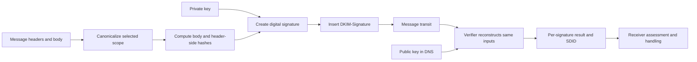

DKIM does not encrypt message content. Every ordinary intermediary and recipient can still read it. It also is not a certificate-authority system: the verifier retrieves the key from the signing domain's DNS namespace.

## 🔍 Plain-English deep-dive: A Passing Signature Is a Verified Domain Claim, Not a Truth Certificate

DKIM's mandatory identity output is the **Signing Domain Identifier** (SDID), found in `d=`. The signer says, in effect, "This domain claims some responsibility for the signed message scope." The cryptographic and DNS process lets the verifier establish that the signature corresponds to a public key published under that domain and selector.

That is valuable because the receiver gets a stable, validated identifier to associate with history and reputation. But a pass does not prove:

- The person shown in the From display name wrote the message.
- The local-part of the From address belongs to the submitter.
- The `d=` domain equals or aligns with the visible From domain.
- Every header field was signed.
- Every repeated instance of a named field was signed.
- Body bytes beyond an `l=` limit were signed.
- The message content is factually true, safe, wanted, or non-malicious.
- The private key was never compromised.
- The signing domain has good reputation.
- The receiver must accept or inbox the message.

Even if `d=brand.example` and the From domain is also `brand.example`, basic DKIM verifies the signing-domain claim and integrity of selected fields; a higher-level assessor assigns identity meaning and policy. Domain alignment is explicitly handled by later mechanisms such as DMARC.

Use bounded wording:

> **[Observation]** A trusted receiver reports `dkim=pass header.d=sender.example header.s=march`. **[Standard]** The signature verifies for the selected message scope and identifies `sender.example` as the SDID. **[Private unknown]** The receiver's reputation assessment and final disposition are not established by DKIM pass alone.

## DKIM Identifiers: `d=`, `s=`, and `i=`

| Tag | Name | Role | What not to infer |
|---|---|---|---|
| `d=` | Signing Domain Identifier (SDID) | Mandatory responsible domain and DNS-key namespace | It need not match From without higher-level policy |
| `s=` | Selector | Chooses one key namespace within `d=` | It is not a stable reputation identity and should not be reused for a new key |
| `i=` | Agent or User Identifier (AUID) | Optional signer-defined finer-grained identifier | It can look like a mailbox without being one |
| From domain | Visible author-domain string | Must be in a header selected by `h=` | DKIM does not itself require equality with `d=` |
| SMTP MAIL FROM | Envelope return identity | Separate transport identity | Not automatically the DKIM signer |
| HELO/EHLO | SMTP client identity | Separate session identity | Not used to find the DKIM key |

The domain portion of `i=` must be equal to or a subdomain of `d=`. If `i=` is absent, the verifier behaves as though it were `@d`. The local-part is optional and signer-defined. A key record can set the `t=s` flag to require the `i=` domain to equal `d=` exactly rather than allowing a subdomain.

Selectors let a domain publish multiple keys at once. They support key rotation, distinct systems, third-party delegation, and algorithm transition. The selector is operational routing for key lookup; the signing domain remains the primary identity output.

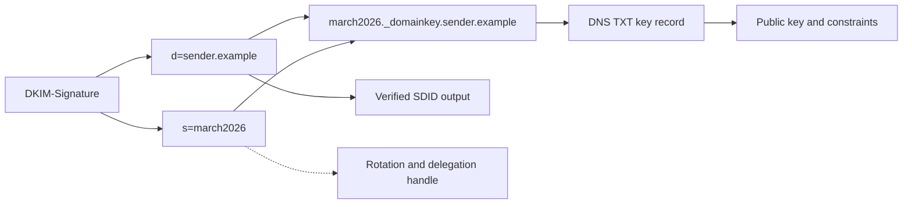

## Signature Header Anatomy

Synthetic signature for annotation:

```text
DKIM-Signature: v=1; a=rsa-sha256; c=relaxed/relaxed;
 d=sender.example; s=march2026; q=dns/txt;
 t=1774000000; x=1774604800;
 h=from:to:subject:date:message-id:mime-version:content-type;
 bh=BASE64_BODY_HASH;
 b=BASE64_SIGNATURE_DATA;
```

Required tags in the base verification model are `v`, `a`, `b`, `bh`, `d`, `h`, and `s`. Missing required tags make the signature unusable. Unknown tags are included in the signed DKIM-Signature input but otherwise ignored, which permits extension without silently removing signed bytes.

| Tag | Required? | Meaning | Support question |
|---|---:|---|---|
| `v=` | Yes | DKIM signature version; current value `1` | Is the version supported and correctly placed? |
| `a=` | Yes | Signing and hash algorithm | Is it `rsa-sha256` or `ed25519-sha256`, not historic `rsa-sha1`? |
| `b=` | Yes | Base64 signature data | Does it verify over canonicalized selected headers and signature header with empty `b=` value? |
| `bh=` | Yes | Base64 hash of canonicalized signed body scope | Does recomputed body digest match? |
| `c=` | No | Header/body canonicalization; default `simple/simple` | Were both sides reconstructed with the declared pair? |
| `d=` | Yes | SDID and key-domain input | Is it a valid signing DNS domain? |
| `h=` | Yes | Ordered colon-separated signed header field names | Which exact instances were selected? Is From included? |
| `i=` | No | AUID; default `@d` | Is its domain equal to or below `d=`, and does key `t=s` constrain it? |
| `l=` | No | Number of canonicalized body octets hashed | Are bytes beyond the limit present and therefore unsigned? |
| `q=` | No | Key query method; default/current `dns/txt` | Is the recognized method supported? |
| `s=` | Yes | Selector | What exact `_domainkey` owner name follows? |
| `t=` | Recommended | Signature creation timestamp | Is it implausibly future-dated? |
| `x=` | Recommended | Absolute signature expiration time | Is it after `t=` and past receiver verification time? |
| `z=` | No | Diagnostic copies of selected headers | Use for diagnostics only; it is not the live signed header set |

The current signature's `b=` value is treated as empty during the header-side hash calculation. The rest of the DKIM-Signature field, including understood and unknown tags, participates in the calculation. Other pre-existing DKIM-Signature fields can be selected through `h=`, but doing so is operationally fragile because intermediaries may reorder them.

## Key Discovery and Key Record Validation

For the common query method, build the key owner name as:

```text
<selector>._domainkey.<signing-domain>
```

Thus `s=march2026` and `d=sender.example` produce:

```text
march2026._domainkey.sender.example TXT
```

TXT character strings inside one record are concatenated without inserted whitespace. Multiple records at one selector produce undefined base-RFC behavior and should be escalated as an invalid/ambiguous publication rather than merged.

Synthetic RSA key record:

```text
v=DKIM1; k=rsa; h=sha256; p=BASE64_PUBLIC_KEY; s=email; t=s
```

| Key tag | Default | Meaning | Failure or caution |
|---|---|---|---|
| `v=` | `DKIM1` | Key-record version; if present must be first | Other version is discarded |
| `h=` | All supported hashes | Hash algorithms permitted with this key | Signature hash must be allowed |
| `k=` | `rsa` | Key type, including `rsa` or `ed25519` | Must be compatible with `a=` |
| `n=` | Empty | Human notes | Not a machine trust statement; use sparingly |
| `p=` | Required | Base64 public-key material | Empty `p=` means revoked key |
| `s=` | `*` | Service types, commonly `email` or all | Key must permit email service |
| `t=y` | No flags | Testing flag | Failed test signature must not be treated worse than unsigned mail |
| `t=s` | No flags | AUID domain must exactly equal SDID | Disallows AUID subdomain relationship |

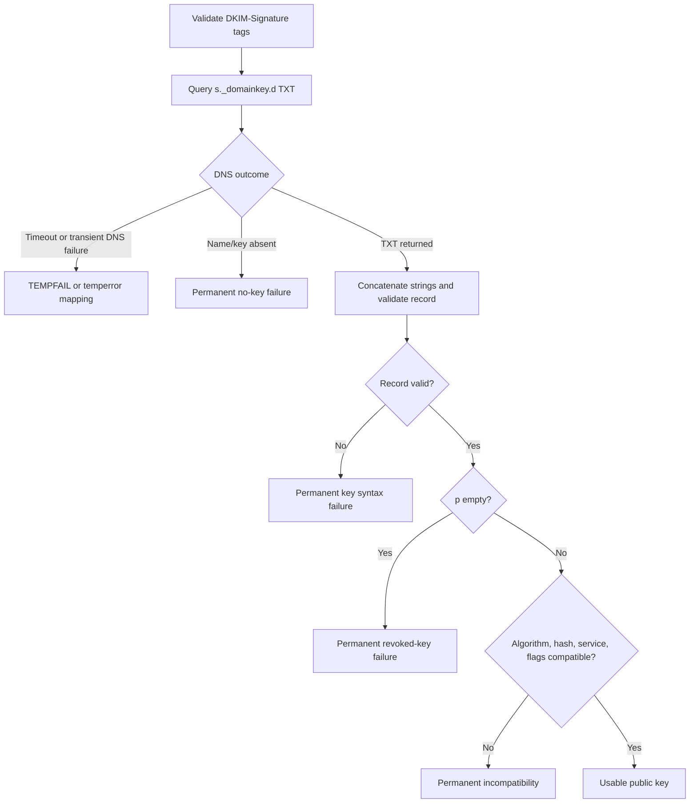

### Temporary Versus Permanent Key Failure

No DNS response or transient server failure can support a later verification attempt and is temporary in nature. A confirmed nonexistent selector, malformed key record, empty `p=`, disallowed hash, incompatible key type, or insufficient RSA key is permanent for that signature as observed. Keep the DNS response class; "key lookup failed" is not specific enough.

## Cryptographic Algorithms and Current Requirements

| Algorithm/key state | Current standards status | Support interpretation |
|---|---|---|
| `rsa-sha256`, RSA 2048+ | Recommended operational baseline under updates | Signers should use at least 2048-bit RSA; verifier support required |
| `rsa-sha256`, RSA 1024-2047 | Allowed minimum range | Valid if at least 1024 bits, but below recommended signer size |
| RSA below 1024 bits | Invalid under RFC 8301 | Permanent evaluation failure |
| `rsa-sha1` | Historic; must not be signed or verified | Permanent failure, not a modern fallback |
| `ed25519-sha256` | Added by RFC 8463 | Verifiers must implement; signers should implement |
| Unknown algorithm | Unsupported extension | Signature ignored/unsupported per verifier behavior, not guessed |
| Dual RSA/Ed25519 signatures | Transition strategy | Independent signatures require different selectors/key records |

Ed25519 public keys are much shorter than comparable RSA public keys and fit easily in one TXT character string. During algorithm transition, a signer can add independent signatures using different `a=` and `s=` values. One selector cannot carry two distinct key-type records as one reliable key choice.

Do not advise generating private keys in a support artifact or ask a customer to expose one. The support-safe evidence is public selector data, signature tags, key metadata, signing logs, and owner-confirmed rotation state. Private-key custody belongs to the signing/security owner.

## Canonicalization: Creating Stable Bytes

Canonicalization converts the message representation into deterministic bytes for hashing. It does not change the transmitted message. Header and body algorithms are selected independently by `c=header/body`. If `c=` is absent, both default to `simple`. If only one name appears, it applies to headers while body remains simple.

| `c=` value | Header algorithm | Body algorithm |
|---|---|---|
| Omitted | simple | simple |
| `simple/simple` | simple | simple |
| `relaxed/relaxed` | relaxed | relaxed |
| `relaxed/simple` | relaxed | simple |
| `relaxed` | relaxed | simple |

## 🔍 Plain-English deep-dive: Canonicalization Is a Shared Measuring Jig, Not Message Repair

Suppose two technicians measure the same irregular part. If each places it differently, their measurements disagree even when the part is unchanged. A measuring jig places the part in a repeatable orientation. DKIM canonicalization is that jig: signer and verifier apply the same declared rules before hashing.

Canonicalization is not a general "ignore changes" switch. Relaxed header canonicalization tolerates certain folding and whitespace differences but does not ignore changed words. Relaxed body canonicalization reduces line-internal whitespace sequences, removes trailing line whitespace, and ignores empty lines at the end; it does not ignore an added footer or changed MIME boundary. Simple canonicalization is stricter but still has defined trailing-empty-line behavior for bodies.

This leads to a powerful mutation test. Given the original and received messages, ask whether their canonicalized forms are equal:

$$
C_h(H_{signed}) = C_h(H_{received})
$$

and

$$
C_b(B_{signed}) = C_b(B_{received})
$$

If a mutation changes visible raw bytes but both canonical forms remain equal, it should survive that canonicalization. If canonical forms differ inside signed scope, verification should fail. This is falsifiable with a DKIM library or known-good verifier.

Do not "fix" the received message to make it verify. Preserve the raw source, identify the exact transformation, and place signing after legitimate transformations where possible.

### Simple Header Canonicalization

Simple header canonicalization makes no changes. Header field name casing, folding, spaces, tabs, and values must match exactly as signed. A gateway that only rewraps a long Subject can break a simple-header signature.

### Relaxed Header Canonicalization

Relaxed header canonicalization performs these conceptual operations in order:

1. Lowercase the field name, not its value.
2. Unfold continuation lines.
3. Compress sequences of spaces/tabs to one space.
4. Remove trailing whitespace in the unfolded value.
5. Remove whitespace around the colon while retaining the colon.

Example:

```text
SUBJect :  Quarterly
	 Report  
```

Canonical relaxed form:

```text
subject:Quarterly Report
```

Changing `Quarterly` to `Urgent` still changes canonicalized content and breaks a signature that selected Subject.

### Simple Body Canonicalization

Simple body canonicalization removes empty lines at the end and represents the ending as one CRLF. It makes no other body whitespace changes. A missing/empty body becomes one CRLF in simple body canonicalization.

### Relaxed Body Canonicalization

Relaxed body canonicalization:

1. Removes spaces/tabs at the end of each line.
2. Compresses each in-line sequence of spaces/tabs to one space.
3. Ignores empty lines at the end.

A fully empty body canonicalizes to zero bytes under relaxed body rules, a subtle difference from simple's CRLF representation.

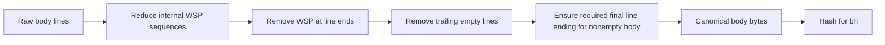

## Mutation Matrix

| Mutation after signing | Simple header | Relaxed header | Simple body | Relaxed body | Scope caveat |
|---|---|---|---|---|---|
| Change header field-name case | Breaks if selected | Survives | N/A | N/A | Only selected instance matters |
| Re-fold selected header without changing words | Usually breaks | Usually survives valid folding/WSP changes | N/A | N/A | Invalid folding can still fail parsing |
| Add extra spaces in selected header | Breaks | Survives if only compressible WSP | N/A | N/A | Spaces inside encoded data may not be semantically harmless |
| Change one Subject word | Breaks | Breaks | N/A | N/A | If Subject is not selected, DKIM does not cover it |
| Add unsigned header type | Signature may survive | Signature may survive | N/A | N/A | Oversigning can intentionally detect named additions |
| Add Received above message | Usually survives if not selected | Usually survives if not selected | N/A | N/A | Trace fields commonly excluded |
| Add spaces within a body line | N/A | N/A | Breaks | Can survive if only WSP sequence changed |
| Add spaces at body line end | N/A | N/A | Breaks | Survives |
| Add trailing empty body lines | N/A | N/A | Survives | Survives |
| Append list footer | N/A | N/A | Breaks | Breaks | May lie beyond `l=` and remain unsigned |
| Re-encode MIME quoted-printable/base64 | N/A | N/A | Breaks | Breaks | DKIM hashes encoded transmitted form, not decoded content |
| SMTP dot-stuffing only | N/A | N/A | Does not affect DKIM input | Does not affect DKIM input | Transport transparency is outside message bytes hashed |

This matrix is a hypothesis generator. Exact verification still depends on raw network-normal message bytes, selected instances, declared algorithms, body length, and valid parser behavior.

## Header Selection with `h=`

`h=` is an ordered list of field names, not a promise that all headers of those names are protected. The From field must appear. For repeated fields, each occurrence of a name in `h=` selects one physical instance, starting from the bottom of the header block and moving upward.

Synthetic header block:

```text
Received: A
Received: B
Received: C
From: sender@sender.example
Subject: Quarterly report
```

With:

```text
h=received:received:from:subject
```

the selected Received fields are `C` and then `B`. `A` is not signed by that signature.

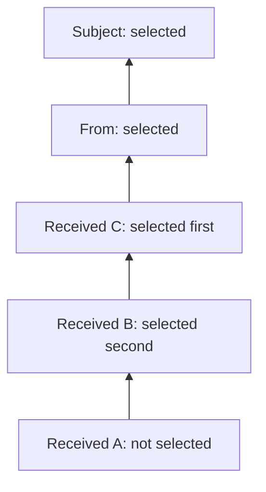

| `h=` behavior | Meaning | Security/support consequence |
|---|---|---|
| Field name appears once | Bottommost matching instance is selected | Earlier duplicate can remain unsigned |
| Field name appears N times | Bottom N instances are selected in order | Reordering repeated signed fields can break verification |
| Name appears more times than present | Missing occurrence contributes null input | Adding another field of that name later can break signature |
| Name absent from `h=` | No instance selected | That header may change without breaking this signature |
| From absent | Signature invalid | DKIM requires From to be selected |
| Current DKIM-Signature in `h=` | Prohibited | It is included through special processing instead |

### Oversigning

Listing a field name more times than it exists is often called oversigning. For one existing From field, `h=from:from:...` can detect insertion of an extra From instance after signing. This does not protect every future unknown header type, but it can defend important known single-instance fields.

### Selected Does Not Mean Semantically Valid

A signer can sign a malformed message or an untrue value. DKIM validates selected bytes and signer identity; the receiver still needs message-format and policy checks. A valid signature over two From fields does not make the message format valid.

## Two Hash Gates: `bh=` and `b=`

DKIM computes two related but distinct values.

1. Canonicalize the body, apply `l=` if present, hash it, and compare the base64 digest with `bh=`.
2. Canonicalize selected header instances in `h=` order, then canonicalize the current DKIM-Signature header with its `b=` value emptied. Verify `b=` with the public key over that header-side input, which includes the body-hash value as a signature-header tag.

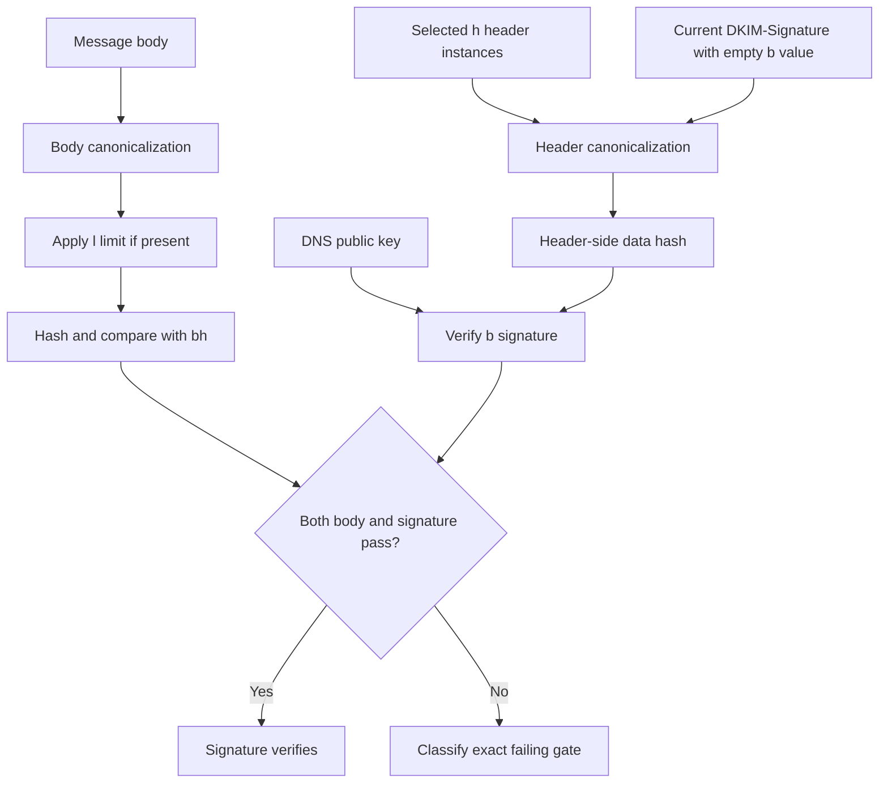

## 🔍 Plain-English deep-dive: `bh=` Checks the Cargo, While `b=` Seals the Manifest

Imagine a shipment with two controls. First, the cargo is weighed and its measured digest is written on the manifest. Second, the company seals the manifest, including the cargo digest and selected labels. At the destination:

- A cargo mismatch means the body representation changed inside signed scope.
- A valid cargo digest but invalid seal means selected headers, signature tags, key pairing, or signature data disagree.
- A valid seal with an `l=` limit means only the declared cargo prefix was measured; later cargo may be outside the seal's scope.

This is why "DKIM signature mismatch" is too broad. A body-hash mismatch points first toward body transformation, wrong body canonicalization, wrong raw source, line-ending normalization, MIME re-encoding, or `l=` handling. A `b=` verification failure after `bh=` passes points toward selected-header transformation, repeated-header selection, signature-header mutation, wrong/rotated public key, or cryptographic mismatch.

A cheap discriminating sequence is:

1. Validate syntax and key first.
2. Recompute `bh=` from preserved raw source.
3. If `bh=` fails, focus on body scope and transformations.
4. If `bh=` passes but `b=` fails, focus on headers, signature tags, key pairing, and instance order.

Do not jump to "key is wrong" when the body hash already proves the received body differs from what the signature declares.

## Body Length `l=` and Unsigned Suffix Risk

`l=` counts canonicalized body octets included from the beginning. If absent, the entire canonicalized body is signed. A value of zero signs none of the body. Bytes after the declared length are not validated by DKIM.

| `l=` state | Signed body scope | Operational/security meaning |
|---|---|---|
| Absent | Entire canonicalized body | Preferred ordinary full-body integrity |
| Equal to canonicalized body length | Entire current body | Explicit but usually unnecessary |
| Less than body length | Prefix only | Suffix is unsigned; assessor may reject or distrust signature |
| `l=0` | No body bytes | Body can be replaced/appended without body-hash failure |
| Greater than actual canonicalized body | Invalid | Signature must not be accepted as valid |

The feature was intended to survive list-added footers, but it permits malicious append attacks and MIME/rendering tricks. A passing signature with unsigned suffix does not mean the displayed body is wholly protected. The lab explicitly calls out this boundary.

## MIME and Encoding Boundary

DKIM signs message bytes as represented in the email message, not decoded MIME objects. If a body is base64 or quoted-printable encoded, the encoded text is canonicalized and hashed before MIME decoding. Attachments are part of the MIME body and therefore part of full body scope.

| Transformation | Before or after signing? | Expected effect |
|---|---|---|
| Convert local line endings to CRLF | Must occur before signing | Prevents representation mismatch |
| Convert 8-bit content to quoted-printable/base64 | Should occur before signing if transit will require it | Post-sign conversion breaks body hash |
| SMTP dot-stuffing/unstuffing | Transport layer, outside message input | Should not change DKIM verification input |
| MIME decode attachment | After transport for interpretation | Not part of DKIM hash process |
| Rewrap quoted-printable encoded body | Changes transmitted body representation | Can break signature even if decoded content looks same |
| Add disclaimer/footer | If after signing, changes body | Breaks full-body signature under either canonicalization |

Sign the message as it is expected to be received, after legitimate outbound transformations. This often makes signing placement the root operational control.

## The Four-Gate Verification Model

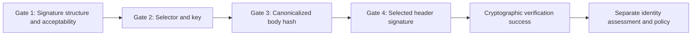

| Gate | Required evidence | Typical failures | Cheapest disconfirming check |
|---|---|---|---|
| 1. Signature | Raw `DKIM-Signature`, parsed tags, clock, algorithm, From in `h=` | Missing/duplicate tags, invalid version, expired/unacceptable signature, historic algorithm | Parse with a standards-aware verifier and inspect exact reason |
| 2. Key | Derived owner, DNS response, key tags, TTL, key size/type | Timeout, NXDOMAIN, revoked `p=`, malformed TXT, algorithm mismatch, weak RSA | Query exact selector from event resolver/authority and compare rollout record |
| 3. Body | Raw network-normal body, `c=` body mode, `l=`, recomputed digest | Footer, encoding conversion, line ending, whitespace beyond relaxed tolerance | Recompute `bh=` and compare before testing headers |
| 4. Headers | Raw ordered headers, `h=`, `c=` header mode, key, `b=` | Signed field rewrite, duplicate selection, reordering, signature-tag mutation, wrong key | Rebuild selected canonical headers bottom-up and verify `b=` |

After all four pass, the verifier produces a successful signing-domain result. The receiver can still call the signature unacceptable under local policy, for example because Subject was unsigned, `l=` leaves a suffix, the key is too weak under stricter policy, the signature is unaligned, or the signer has poor reputation. Keep cryptographic pass and policy acceptability separate.

## Result Vocabulary and Multiple Signatures

RFC 6376's core states are SUCCESS, PERMFAIL, and TEMPFAIL per signature. RFC 8601 commonly records more user-facing method results.

| Result | Practical meaning | Example cause |
|---|---|---|
| `none` | Message had no evaluated DKIM signature | No `DKIM-Signature` present |
| `pass` | Acceptable signature passed verification under reporting ADMD | Body and header checks succeed with usable key |
| `fail` | Acceptable signature was attempted but verification failed | Body or signature mismatch |
| `policy` | Signature exists but local requirements reject its acceptability | Unsigned Subject or disallowed partial body under receiver policy |
| `neutral` | Signature could not be processed under a non-specific permanent condition | Syntax/processing condition mapped by implementation |
| `temperror` | Likely transient condition prevented verification | DNS key lookup SERVFAIL or timeout |
| `permerror` | Unrecoverable signature/key condition | Missing required tag, no key, revoked key, malformed record |

A message can contain independent signatures from different domains, selectors, or algorithms. One can fail while another passes. Verifiers may limit work for denial-of-service safety and can process signatures in any order. Do not infer priority from visual order.

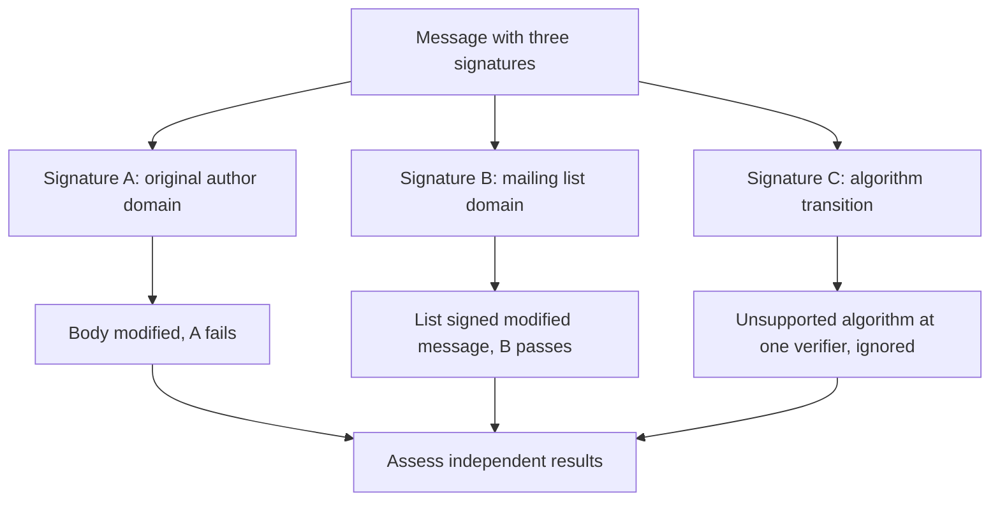

RFC 6376 advises that a bad signature without a good one should generally be treated like unsigned mail, because legitimate transit modifications can break signatures and attackers can add invalid signatures trivially. Receiver mechanisms layered above DKIM can impose different requirements, but those are not basic cryptographic semantics.

RFC 7372 defines optional enhanced rejection codes such as 5.7.20 for no passing signature, 5.7.21 for no acceptable signature, and 5.7.22 for no valid author-matched signature. Their existence does not endorse universal rejection; they describe local policy when an operator chooses it.

## 🔍 Plain-English deep-dive: Authentication-Results Is a Receipt Only Inside Its Trust Boundary

Running DKIM verification at every mail client would duplicate DNS and cryptographic work, and a delayed check might see a key that changed after delivery. Receiving systems therefore often verify near their boundary and record the result in an `Authentication-Results` header for downstream filters and clients. Think of it as a receiving dock's inspection receipt attached to a package.

A printed receipt is useful only when you know which dock produced it and whether outsiders could attach a fake one. An attacker can put this into a message before submission:

```text
Authentication-Results: recipient.example;
 dkim=pass header.d=sender.example header.s=march2026
```

The syntax does not make the claim true. A consumer needs a configured, trustworthy authentication service identifier (`authserv-id`) and a receiving path that removes forged claims purporting to come from inside its administrative boundary. Header position and a known internal handoff can be evidence, but the local trust design remains essential.

For DKIM, useful reported properties include:

| Property | Source | Diagnostic use | Boundary |
|---|---|---|---|
| `header.d` | Signature `d=` | Identifies the reported SDID | Not necessarily the From domain |
| `header.i` | Signature/default `i=` | Records optional AUID | Signer-defined and potentially opaque |
| `header.a` | Signature `a=` | Distinguishes current from historic algorithms | Does not reveal parsed key size |
| `header.s` | Signature `s=` | Correlates selector and rotation | Not a reputation identity |
| `reason=` | Reporting verifier | Narrows failure diagnosis | Vocabulary/detail can be implementation-specific |

A result also contains an assessment layer. Under RFC 8601, `dkim=pass` means the signature passed and was acceptable to the reporting administrative domain; `dkim=policy` can indicate that cryptography was present but local requirements rejected some aspect. Thus an independent verifier might report a basic cryptographic success while a receiver reports policy because Subject was unsigned or `l=` left a suffix. Those reports answer related but different questions.

Use this support sequence:

1. Establish whether the `authserv-id` belongs to the receiver's trusted path.
2. Preserve every reported signature result and `header.d/i/a/s` property.
3. Use `reason=` as an observation, not as a cross-provider universal taxonomy.
4. Correlate the receipt with raw-message and selector evidence when root cause matters.
5. Never convert a trusted `dkim=pass` into "safe message" or "authenticated human."

The memory hook is: **trust the inspector before trusting the inspection receipt**.

## Key Rotation and Selector Lifecycle

Safe rotation uses a new key with a new selector and overlaps public-key availability. Reusing the same selector with different keys makes old-message failures indistinguishable from forgery or wrong-key use.

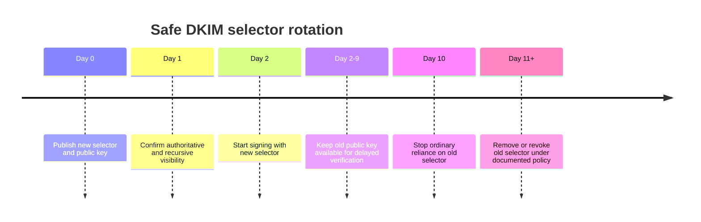

| Rotation step | Evidence | Failure if skipped |
|---|---|---|
| Generate new pair at signing owner | Key inventory/owner confirmation, never private key in ticket | Unclear custody or insecure transfer |
| Publish new selector first | Authoritative TXT and TTL | New signatures can reference nonexistent key |
| Wait for visibility as required | Multiple approved resolver observations | Negative caches may still hide selector |
| Switch signer to new selector | Outbound sample/signing log | Messages continue using old key unexpectedly |
| Retain old public key | Documented validation interval | Delayed messages fail after premature removal |
| Retire private old key | Key-management evidence | Continued unauthorized or accidental signing risk |
| Remove or revoke public record | `NXDOMAIN/NODATA` or empty `p=` by policy | Stale selector remains usable or confusing |

An empty `p=` explicitly revokes the key. Removing the record also prevents verification; base DKIM gives no functional successful-verification distinction. A revocation "gravestone" can help prevent accidental selector reuse, but exact lifecycle is operational policy.

### Compromise Response

If a private key may be compromised, stop signing with it, publish a new selector/key, and revoke/remove the old public key under incident policy. A selector timestamp or `x=` expiration is not a complete anti-replay control. Messages already signed can be replayed while the key validates, and a shared key can make per-user revocation impractical.

## Intermediaries, Forwarding, and Mailing Lists

Simple forwarding that changes only envelope recipients and adds an unsigned Received field often preserves DKIM. A mailing list that rewrites Subject, adds a body footer, changes MIME encoding, or reorders repeated signed fields can break it. Relaxed canonicalization only tolerates its defined representation changes.

| Intermediary action | Likely effect | Precise check |
|---|---|---|
| Add new Received not selected by `h=` | Signature usually survives | Confirm Received is not selected/oversigned |
| Change only SMTP envelope recipient | Signature survives | Envelope is outside DKIM message signature |
| Re-fold a relaxed signed Subject | Can survive | Compare relaxed canonical forms |
| Prefix Subject with list name | Breaks if Subject selected | Word content changed |
| Append footer | Breaks full-body signature | Recompute body hash |
| Append footer beyond `l=` | Signature may pass with unsigned suffix | Compare canonical body length to `l=` |
| Re-encode MIME body | Breaks | Encoded representation changed |
| Add list signature after modification | New signature can pass independently | Evaluate each signature/domain separately |
| Remove broken original signature | Operational choice, not required by core DKIM | Preserve evidence if diagnosing original path |

A modifying intermediary should perform its changes before applying its own signature. It can verify the incoming signature first and record a trusted result, but downstream consumers must understand and trust the result boundary.

## Failure Modes and Misleading Shortcuts

| Failure mode | Misleading shortcut | Better interpretation | Cheapest discriminating check |
|---|---|---|---|
| `d=` assumed to be From | "The author is authenticated" | DKIM identifies signing domain; alignment is separate | Compare `header.d` with From under the later policy, not basic DKIM |
| Selector treated as identity | "march2026 has good reputation" | Selector is a key-management handle | Assess stable SDID; use selector for lookup/rotation diagnostics |
| Current DNS used as transit proof | "Key was absent when received" | Selector may have changed since transit | Use receiver event logs/cache and timestamps |
| TXT strings not concatenated | "Key is truncated" | One TXT RR may contain multiple chunks | Preserve RR boundary and concatenate chunks without spaces |
| Several key RRs merged | "Combine both public keys" | Selector publication is ambiguous/undefined | Escalate duplicate records; use separate selectors |
| Body mismatch blamed on key | "Wrong public key" | `bh=` is independent of public-key verification | Recompute body hash first |
| Relaxed called whitespace-insensitive | "Any formatting change is fine" | Only specified WSP/folding changes normalize away | Compare canonical forms mutation by mutation |
| MIME decoded before hashing | "Attachment bytes are same" | DKIM hashes transmitted encoded message body | Verify raw source before MIME decode |
| All repeated headers assumed signed | "h=received protects every Received" | Each listed name selects one bottom-up instance | Map names to physical instances |
| Unsigned Subject overlooked | "DKIM pass protects what user saw" | Only selected fields are covered | Inspect `h=` and receiver acceptability policy |
| `l=` ignored | "Body passed, so all content is signed" | Suffix beyond canonicalized length is unsigned | Compare `l=` with actual canonical body length |
| RSA-SHA1 accepted from old docs | "Verifier should support legacy" | RFC 8301 prohibits rsa-sha1 verification | Report historic algorithm as permanent failure |
| Key removed immediately after switch | "New messages use new key" | Delayed old messages still need old public key | Retain overlap for documented validation interval |
| One bad signature poisons all | "DKIM failed" | Signatures are independent | Report each `d/s/a` result separately |
| Pass equated with trust | "Signed means safe" | Pass supplies a verified responsible identifier | Apply reputation/content/policy separately |
| Arbitrary Authentication-Results trusted | "Header says pass" | Results headers can be forged | Establish trusted authserv-id and boundary insertion |

## Troubleshooting Decision Tree

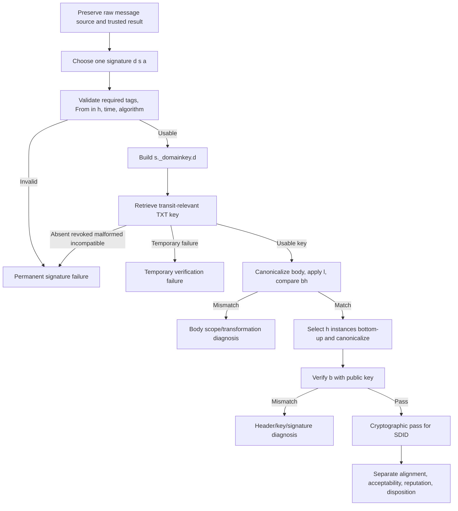

### Step 1: Preserve Raw Source

Use the original `.eml` or equivalent raw message with exact line endings where available. A rendered client view loses folding, duplicate order, whitespace, and encoding details. Preserve message ID, queue ID, receiver, UTC time, and trusted Authentication-Results.

### Step 2: Inventory Every Signature

For each signature, record `d`, `s`, `a`, `c`, `h`, `bh`, `b`, `i`, `l`, `t`, and `x`. Do not collapse multiple signatures into one aggregate status.

### Step 3: Validate Structure

Confirm required tags, supported version/algorithm, From selection, AUID relationship, expiration policy, and receiver-required signed fields. A malformed header does not proceed to speculative cryptography.

### Step 4: Reconstruct Key Evidence

Build the exact selector owner. Preserve resolver, RCODE, RR boundaries, TTL, `v/k/h/p/s/t` tags, and key size. Distinguish timeout from no key, and no key from revoked key.

### Step 5: Check Body Before Header Signature

Canonicalize the raw body under the declared body mode, limit to `l=` if present, hash with the algorithm's hash, and compare `bh=`. A mismatch narrows the investigation to body representation/scope and raw evidence.

### Step 6: Select Header Instances Exactly

Walk `h=` in order, selecting matching fields from the physical bottom upward without reusing an occurrence. Apply header canonicalization. Add the current DKIM-Signature with only its `b=` value emptied.

### Step 7: Verify and Classify

Use the public key and declared algorithm to verify `b=`. Record exact failure reason. Repeat independently for remaining signatures.

### Step 8: Apply Proof Limits

After pass, identify SDID and signed scope. Then separately evaluate alignment, acceptable algorithms/fields, unsigned suffix, signer reputation, and message handling.

## Safe Lab: DKIM Field Annotation and Verification Plan

### Safety Boundary

This lab is analytical and synthetic. Do not generate private keys, submit email, query customer selectors, upload messages to public analyzers, alter DNS, or paste real headers containing personal/customer data. Use the supplied fictional message, placeholder hashes, reserved domains, and documentation addresses. The goal is a verification plan, not live cryptographic execution.

### Prerequisites

1. An authorized, non-production local study folder and a plain-text or Markdown editor.
2. This Part plus RFC 6376 and its current cryptographic updates for checking tags, key constraints, canonicalization, and header selection.
3. Only the supplied synthetic message, placeholder signature values, and synthetic key record; no private key, DNS query, mail submission, or public analyzer is required.
4. A worksheet that preserves raw fields separately from derived canonicalization and verification-plan notes.

### Synthetic Message

```text
DKIM-Signature: v=1; a=rsa-sha256; c=relaxed/relaxed;
 d=sender.example; s=q1-2026; i=@mail.sender.example;
 q=dns/txt; t=1774000000; x=1774604800;
 h=from:from:to:subject:date:message-id:mime-version:content-type;
 bh=BODY_HASH_PLACEHOLDER;
 b=SIGNATURE_PLACEHOLDER;
Received: from outbound.sender.example (192.0.2.44)
 by mx.recipient.example with ESMTP; Fri, 20 Mar 2026 14:05:00 +0000
From: Billing <billing@sender.example>
To: User <user@recipient.example>
Subject: March statement
Date: Fri, 20 Mar 2026 14:04:30 +0000
Message-ID: <synthetic-026@sender.example>
MIME-Version: 1.0
Content-Type: text/plain; charset=utf-8

Your March statement is ready.
```

Synthetic key record:

```text
q1-2026._domainkey.sender.example. 300 IN TXT
 "v=DKIM1; k=rsa; h=sha256; s=email; t=s; p=PUBLIC_KEY_PLACEHOLDER"
```

### Task 1: Annotation Worksheet

| Item | Extracted value | Verification use | Proof boundary / concern |
|---|---|---|---|
| Version | `1` | Signature syntax | Current DKIM version only |
| Algorithm | `rsa-sha256` | Hash/signature and key compatibility | RSA key must be at least 1024 bits; 2048+ recommended |
| Canonicalization | `relaxed/relaxed` | Normalize headers/body | Only defined whitespace/folding changes survive |
| SDID | `sender.example` | Key namespace and successful identity output | Does not independently prove From authorship |
| Selector | `q1-2026` | Build DNS key owner | Rotation handle, not reputation identity |
| AUID | `@mail.sender.example` | Optional signer-defined identity | Subdomain of `d` is normally valid, but key `t=s` forbids it |
| Signed headers | Listed `h=` values | Select physical instances bottom-up | `from:from` oversigns one present From field |
| Body hash | Placeholder | Compare canonicalized body digest | Cannot calculate without real supplied expected digest |
| Signature data | Placeholder | Verify header-side input | Cannot calculate without real signature/private-key output |
| Key flags | `t=s` | Constrain AUID domain | Here AUID domain differs from SDID, so key constraint causes permanent failure |

The deliberate defect is the `t=s` key flag combined with `i=@mail.sender.example`. Because the key requires AUID domain equality with `d=sender.example`, the verifier should fail before body/hash work. This is a cheap disconfirming check for whether the verifier honors key constraints.

### Task 2: Corrected Verification Plan

Assume the signer removes `i=` (defaulting to `@sender.example`) or changes it to `@sender.example`, then plan these gates:

1. Validate signature tags and confirm From appears in `h=`.
2. Build `q1-2026._domainkey.sender.example` and validate the synthetic key record.
3. Confirm key type/hash/service/flags and obtain key size from parsed public key metadata.
4. Canonicalize the body with relaxed rules: reduce internal whitespace, remove line-end whitespace, remove trailing empty lines.
5. Hash the entire canonicalized body because no `l=` appears; compare with `bh=`.
6. Select headers in `h=` order. The first `from` selects the only From header. The second `from` selects a nonexistent instance and contributes null input, thereby detecting a later inserted From.
7. Select To, Subject, Date, Message-ID, MIME-Version, and Content-Type.
8. Relaxed-canonicalize each selected header.
9. Append the current DKIM-Signature canonical form with its `b=` value emptied.
10. Verify `b=` with the DNS public key.
11. If successful, report SDID `sender.example` and exact signed scope; evaluate alignment and handling separately.

### Task 3: Mutation Matrix

| Synthetic mutation after signing | Predicted cryptographic effect | Reason |
|---|---|---|
| Change `Subject: March statement` to `Subject: Urgent statement` | Fail at header signature | Subject is selected and words differ after relaxed canonicalization |
| Re-fold Subject with extra spaces only | Pass if valid folding/WSP-only change | Relaxed header canonicalization normalizes it |
| Add a second From header above existing From | Fail | Oversigned second `from` now selects inserted instance instead of null |
| Add `X-Scanner: clean` | Pass | Header type is not selected or oversigned |
| Add a Received header at top | Pass | Received is not in `h=` |
| Add spaces at end of body line | Pass | Relaxed body removes trailing WSP |
| Append `External disclaimer` | Fail at body hash | New nonempty body content changes canonicalized body |
| Re-encode body as base64 | Fail | Transmitted encoded body bytes differ |

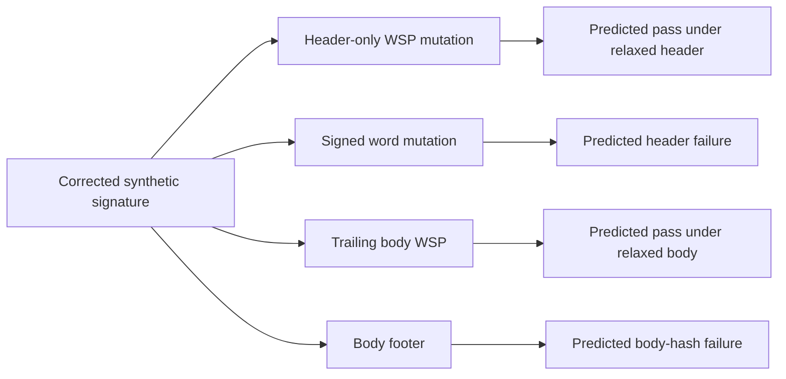

### Task 4: Bounded Conclusion

Write:

> **[Observation in scenario]** The signature requests RSA-SHA256, relaxed/relaxed canonicalization, SDID `sender.example`, selector `q1-2026`, and AUID `@mail.sender.example`. The key record sets `t=s`.
>
> **[Standard]** `t=s` requires the AUID domain to equal the SDID exactly. The supplied AUID domain is a subdomain rather than equal.
>
> **[Conclusion]** This signature has a permanent key-constraint mismatch before body or signature verification. Correcting the AUID would permit, but not guarantee, later gates to pass.
>
> **[Proof limit]** Placeholder `bh`, `b`, and public-key data cannot establish a cryptographic pass; the remaining steps are a verification plan only.

### Completion Standard

A complete lab artifact identifies every tag, derives the DNS name, catches the deliberate AUID/key-flag mismatch, maps `h=` to instances, predicts each mutation, and explicitly refuses to claim a cryptographic pass from placeholders.

### Expected evidence

The lab should produce an inspectable tag-annotation worksheet, derived selector owner, key-constraint finding, corrected gate-by-gate verification plan, exact `h=` instance-selection map, eight-row mutation matrix, bounded conclusion, and explicit placeholder limitation. Another reviewer must be able to locate the first failing gate without any private key or live lookup.

### Cleanup and privacy

- Retain only the fictional raw message, placeholder hashes/signature, synthetic key record, and derived worksheet.
- Remove and securely delete any accidentally pasted private key, token, real selector, customer message, personally identifiable information (PII), tenant identifier, internal hostname, or message content; private keys must never be redacted and retained as support evidence.
- Do not upload messages to public analyzers, query customer DNS, generate keys, send mail, or modify a selector record.
- Confirm before retention or sharing that the exercise involved no live cryptographic assertion, DNS/mail activity, customer data, or claim of a DKIM pass.

### Validation rubric

| Dimension | Fail | Developing | Pass |
|---|---|---|---|
| Tag and identity analysis | Confuses `d=`, `s=`, `i=`, or From | Extracts tags with gaps | Correctly identifies SDID, selector, AUID, algorithms, scope, and proof limits |
| Key gate | Misses `t=s` mismatch or invents key validity | Derives owner but incompletely validates constraints | Derives exact owner and catches the deliberate AUID/key-flag permanent failure |
| Canonicalization and hashing | Claims placeholder verification or mixes layers | Lists broad steps | Separates body hash, header selection, canonicalization, and signature verification gates |
| Header instances | Treats `h=` as a set | Selects common fields | Selects repeated fields bottom-up and explains oversigning/null input |
| Mutation predictions | Guesses pass/fail without rule | Correct on most rows | Correctly predicts all mutations with the controlling signed scope/rule |
| Safety and honesty | Uses real keys/messages or claims production verification | Synthetic plan with weak boundary | No live activity/secrets and explicitly labels the output as a verification plan |

## Case Summary Template

| Field | Required content | Example |
|---|---|---|
| Message/event | ID, receiver, UTC time, raw source origin | Queue ID Q026 at 14:05 UTC, raw `.eml` preserved |
| Signature inventory | One row per `d/s/a/c/h/l/t/x` | `d=sender.example`, `s=march`, RSA-SHA256, relaxed/relaxed |
| Trusted result | Authserv-id, result, reason, properties | `dkim=fail reason="body hash" header.d=sender.example` |
| Selector evidence | Exact owner, resolver, RCODE, TXT/key tags, TTL | Key exists, RSA 2048, SHA-256 allowed |
| Gate reached | Structure, key, body, or header | Gate 3 body mismatch |
| Transformation evidence | Signed versus received mutation | Gateway appended legal disclaimer after signing |
| Hypothesis | Narrow causal explanation | Post-sign footer changed full canonical body |
| Disconfirming check | Cheap test | Sign after footer insertion; if body hash still fails, footer ordering alone is insufficient |
| Proof limit | What pass/fail cannot prove | No claim about author identity or provider disposition |
| Owner | Component that can remediate | Outbound signing/gateway pipeline owner |

### Example Bounded Escalation

> **[Observation]** The signature is structurally valid, uses `rsa-sha256` with relaxed/relaxed canonicalization, and its selector returned a compatible non-revoked key. The recomputed body hash differs from `bh=`. Header-signature verification was not used to diagnose the first divergence.
>
> **[Observation]** The outbound gateway log shows a disclaimer was appended after the signing timestamp. The signature has no `l=` and therefore covers the entire canonicalized body.
>
> **[Inference]** The post-sign disclaimer is sufficient to explain the body-hash mismatch. This is disconfirmed if a sample signed after disclaimer insertion still produces the mismatch.
>
> **[Private unknown]** The receiving provider's final policy weight is not established; the protocol failure is independent of disposition.
>
> **Owner/action:** Move signing after the authorized body transformation or remove the post-sign mutation, then validate with a synthetic test message and independent trusted receiver result.

## Official Source Anchors

All listed sources were accessed on August 24, 2026 and must be revalidated for current provider behavior.

| Source | What it establishes for this lesson |
|---|---|
| [RFC 6376 - DKIM Signatures](https://www.rfc-editor.org/rfc/rfc6376) | Core identifiers, selectors, signature/key tags, canonicalization, hashing, header selection, signing, verification, multiple signatures, and security boundaries |
| [RFC 8301 - DKIM Crypto Usage Update](https://www.rfc-editor.org/rfc/rfc8301) | Prohibition of RSA-SHA1, RSA key minimum/recommendation, and verifier requirements |
| [RFC 8463 - Ed25519-SHA256 for DKIM](https://www.rfc-editor.org/rfc/rfc8463) | Ed25519-SHA256 algorithm, key syntax, implementation requirements, and dual-signature transition |
| [RFC 8601 - Authentication-Results](https://www.rfc-editor.org/rfc/rfc8601) | DKIM result names, `header.d/i/a/s` properties, policy distinction, and trusted header boundary |
| [RFC 7372 - Email Authentication Status Codes](https://www.rfc-editor.org/rfc/rfc7372) | Optional enhanced SMTP status codes for no passing/acceptable/author-matched signature |
| [RFC 5863 - DKIM Deployment and Operations](https://www.rfc-editor.org/rfc/rfc5863) | Key custody, selector lifecycle, third-party signing, trust assessment, intermediaries, and operational placement |

### Evidence Currency Rules

1. Preserve transit-time raw message and trusted receiver result before using current DNS.
2. Label a current selector query as current observation, not proof of the historical key.
3. Keep TXT record boundaries and string chunks visible.
4. Never request, transmit, or include private keys in support evidence.
5. Use RFC 8301/8463 updates rather than obsolete algorithm text in the base RFC.
6. Treat provider key-size requirements and algorithm support as current provider policy.
7. Treat alignment, reputation, and inboxing as separate from cryptographic verification.

## Likely Interview Questions

### Q1. What does a DKIM pass prove?

**Model answer:** It proves that the verifier reconstructed the declared signed scope, the body hash and header signature verified with a public key published under the `s._domainkey.d` namespace, and the SDID in `d=` is the responsible signing identifier. It establishes integrity of selected canonicalized content from signing to verification. It does not prove human authorship, From alignment, factual truth, safety, reputation, or inbox placement, and it does not protect unsigned headers or body bytes beyond `l=`.

### Q2. How is the DKIM public-key DNS name built?

**Model answer:** Take the selector from `s=`, append `._domainkey.`, then append the signing domain from `d=`. For `s=march2026` and `d=sender.example`, query `march2026._domainkey.sender.example` using the declared/default DNS TXT method. I would preserve RCODE, RR boundaries, TTL, key tags, and key size, and distinguish timeout, missing key, revoked empty `p=`, malformed key, and algorithm incompatibility.

### Q3. Explain `bh=` versus `b=`.

**Model answer:** `bh=` is the base64 digest of the canonicalized body, limited by `l=` if present. `b=` is the digital signature over the header-side input: selected canonicalized header instances plus the current DKIM-Signature header with only its `b=` value emptied. I check `bh=` first to isolate body transformation. If it passes but `b=` fails, I focus on selected headers, instance order, signature tags, key pairing, and cryptography.

### Q4. What is relaxed canonicalization allowed to ignore?

**Model answer:** Relaxed headers lowercase field names, unfold continuation lines, compress spaces/tabs, trim trailing header whitespace, and remove whitespace around the colon. Relaxed body canonicalization compresses in-line spaces/tabs, removes line-end whitespace, and ignores trailing empty lines. It does not ignore changed words, added footers, changed MIME boundaries, or transfer-encoding rewrites. Header and body modes are independent.

### Q5. How does `h=` select repeated headers?

**Model answer:** It is an ordered list. Each occurrence of a field name selects the bottommost remaining matching physical header instance, moving upward for repeated names. Listing a name more times than it exists selects null input for the extra occurrence and can detect a later inserted header of that name. From must be listed. Saying `h=received` does not protect every Received field; it selects one instance.

### Q6. How should DKIM keys be rotated?

**Model answer:** Generate a new pair under the signing owner's secure process, publish it under a new selector, confirm DNS visibility, switch signing to the new selector, and retain the old public key for a reasonable delayed-verification interval. Then retire the old private key and remove or revoke the old public record under policy. Do not reuse one selector for a new key because old-message failures become ambiguous. A compromised key requires accelerated stop/revoke and incident handling.

### Q7. Why do mailing lists break DKIM, and what can survive?

**Model answer:** Envelope-only forwarding and an added unsigned Received field often preserve it. Lists commonly rewrite Subject, add body footers, or re-encode MIME, which changes signed canonicalized bytes and breaks the original signature. Relaxed mode only tolerates defined whitespace/folding changes. A modifying list can verify before modification and apply its own signature after changes; each signature is then evaluated independently.

### Q8. How would you troubleshoot `dkim=fail`?

**Model answer:** Preserve raw source and trusted result, inventory each signature, then use four gates: validate signature structure and policy prerequisites; derive and validate the selector key; canonicalize/hash body and compare `bh=`; select/canonicalize headers bottom-up and verify `b=`. I classify temporary DNS versus permanent key/syntax failures, report every signature independently, and separate cryptographic result from alignment, reputation, and disposition. The first failing gate determines the narrow next check.

## 🧠 30-Second Memory Hooks

- **DKIM gives a domain a seal.** It does not give the message a truth certificate.
- **`d=` is identity output.** `s=` finds a key; `i=` is optional and signer-defined.
- **Key name = `s._domainkey.d`.** Derive it literally.
- **`bh=` checks body scope.** `b=` verifies selected headers and signature tags.
- **Normalize, do not repair.** Canonicalization changes hash input, not the message.
- **Relaxed is specific, not magical.** Words and footers still matter.
- **`h=` is ordered and bottom-up.** One name occurrence selects one field instance.
- **From must be signed.** Other visible fields may still be unsigned.
- **No `l=` means full body.** `l=` can leave a dangerous unsigned suffix.
- **Hash encoded MIME text.** Decode only after DKIM's message-byte work.
- **RSA-SHA1 is history.** Use current RFC 8301 requirements.
- **Rotate with a new selector and overlap.** Never swap keys under one selector casually.
- **One bad signature does not erase a good one.** Evaluate independently.
- **Pass then assess.** Alignment, reputation, and handling are later layers.

## Completion Checklist

- [ ] I can explain hashes, private/public keys, signatures, and canonicalization without assuming cryptography experience.
- [ ] I can distinguish SDID `d=`, selector `s=`, AUID `i=`, visible From, MAIL FROM, and HELO.
- [ ] I can derive the exact selector DNS owner name.
- [ ] I can annotate every major DKIM-Signature tag and required/default behavior.
- [ ] I can parse and validate key-record tags, including revoked empty `p=` and `t=s`.
- [ ] I know current RSA, SHA-1, and Ed25519 requirements.
- [ ] I can explain simple versus relaxed header canonicalization.
- [ ] I can explain simple versus relaxed body canonicalization, including empty body behavior at a high level.
- [ ] I can predict the mutation matrix without calling relaxed mode whitespace-insensitive.
- [ ] I can map repeated `h=` names to physical headers bottom-up.
- [ ] I can explain oversigning and its limits.
- [ ] I can distinguish `bh=` body mismatch from `b=` header-signature mismatch.
- [ ] I can explain why MIME encoded text is signed before decoding.
- [ ] I can identify unsigned body suffix risk from `l=`.
- [ ] I can classify temporary DNS key failure versus permanent no-key/revoked/malformed/incompatible key.
- [ ] I can describe safe selector/key rotation without requesting private key material.
- [ ] I can explain forwarding/list transformations and independent re-signing.
- [ ] I can interpret trusted Authentication-Results properties and distrust arbitrary forged headers.
- [ ] I can state what DKIM pass does not prove.
- [ ] I can complete the synthetic field annotation and verification plan without claiming placeholders verified.

[Next: Part 027 - DMARC Alignment Policy and Reporting](Part-027-dmarc-alignment-policy-and-reporting.md)