# Part 027 - DMARC Alignment Policy and Reporting

## Purpose, Evidence, and Currency

Domain-Based Message Authentication, Reporting, and Conformance (DMARC) connects the domain most users see in the message's From header to domains authenticated by SPF or DKIM. It defines identifier alignment, lets a Domain Owner express handling preferences for messages that fail validation, and provides aggregate and optional failure reporting. DMARC does not replace SPF or DKIM. It consumes their successful authenticated domains and asks a narrower question: **did at least one authenticated domain align with the Author Domain?**

This lesson is grounded in the current standards-track DMARC documents published in 2026: RFC 9989 defines the core protocol, RFC 9990 defines aggregate reporting, and RFC 9991 defines failure reporting. Those documents obsolete the earlier RFC 7489 model. The update matters operationally: Public Suffix List (PSL) policy discovery is replaced by a bounded DNS Tree Walk; `np`, `psd`, and `t` are active tags; and the former `pct`, `rf`, and `ri` tags are historic. A support engineer who uses only older DMARC diagrams can reach the wrong policy domain, alignment result, or rollout recommendation.

The main troubleshooting model is a reproducible decision record:

$$
\text{DMARC pass} = (\text{SPF pass} \land \text{SPF aligned}) \lor (\exists\ \text{DKIM signature}: \text{DKIM pass} \land \text{DKIM aligned})
$$

Policy matters only after DMARC validation does not pass and required DNS work has produced a determinate result. Final disposition remains the Mail Receiver's local decision. Current DMARC explicitly requires more analysis than blindly rejecting solely because a Domain Owner published `p=reject`.

> **Currency note:** Older operational data, vendor UIs, and interview material may still show RFC 7489 behavior, `pct=`, PSL-based Organizational Domains, `ri=`, `rf=`, or legacy aggregate-report XML. Label those artifacts by version. Do not silently mix an old report schema or policy-discovery algorithm with RFC 9989 conclusions.

## Section Goal

By the end of this part, you should be able to:

- Explain DMARC from zero knowledge as validation of authorized Author Domain use.
- Distinguish RFC5322.From, RFC5321.MailFrom, SPF Domain, DKIM Signing Domain, Author Domain, Organizational Domain, Public Suffix Domain (PSD), and DMARC Policy Domain.
- Calculate strict and relaxed SPF alignment.
- Calculate strict and relaxed DKIM alignment across multiple signatures.
- Apply the Boolean OR rule: one passing aligned SPF or DKIM identifier is sufficient for DMARC pass.
- Explain why SPF pass alone and DKIM pass alone can still lead to DMARC fail.
- Find current policy through the RFC 9989 DNS Tree Walk, including its eight-query bound and `psd` handling.
- Select `p`, `sp`, or `np` according to the Author Domain and policy location.
- Interpret current active tags and distinguish historic `pct`, `rf`, and `ri` guidance.
- Explain Monitoring Mode, Enforcement, and the `t=y` testing signal.
- Separate DMARC validation result, Domain Owner Assessment Policy, policy override, and final disposition.
- Parse the conceptual layers of RFC 9990 aggregate reports without confusing raw SPF/DKIM results with DMARC-alignment results.
- Explain external report-destination authorization.
- Contrast aggregate and failure reports, including privacy and security risks.
- Diagnose forwarding and mailing-list failures without labeling legitimate indirect mail as spoofing automatically.
- Produce a safe DMARC decision worksheet and staged rollout plan using synthetic data.

## JD Mapping

| Role responsibility | DMARC capability from this part | Example support output |
|---|---|---|
| Diagnose authentication outcomes | Reproduce the OR-of-aligned-pass decision | "SPF passed for `bounce.vendor.example` but was unaligned; DKIM passed and aligned for `mail.brand.example`, so DMARC passed." |
| Investigate DNS policy | Execute and preserve the current Tree Walk | "No record existed at the Author Domain; the walk found `psd=n` at the departmental boundary, which became the Organizational and Policy Domain." |
| Explain policy | Separate `p`, `sp`, `np`, `t`, and receiver action | "The discovered subdomain preference was quarantine in testing mode; the receiver's actual delivery remains local policy." |
| Support third-party senders | Require aligned customer-controlled SPF or DKIM identity | "The provider's own DKIM signature passes but does not align; an aligned delegated DKIM domain is needed." |
| Analyze reports | Read source/count, alignment verdict, raw auth results, and overrides | "The row shows raw DKIM pass but DMARC-DKIM fail because `d=` belongs to a different Organizational Domain." |
| Troubleshoot forwarding | Explain SPF route change and DKIM mutation | "The forwarder changed the observed IP, breaking SPF, while the list footer broke the original aligned DKIM signature." |
| Plan safe rollout | Inventory, monitor, remediate, test, then enforce | A staged plan with evidence gates and rollback criteria, not a calendar-only promise |
| Communicate proof limits | Avoid equating pass with safe/inbox | "DMARC validates authorized use of the Author Domain; it does not validate content or guarantee disposition." |

## Candidate Honesty Note

If you have not operated a production DMARC reporting pipeline or moved a live domain to enforcement, do not claim that you have. You can say:

> "I would first inventory every authorized sender, make both SPF and DKIM capable of producing aligned identifiers, publish a monitoring record with `rua`, machine-parse aggregate reports, remediate legitimate failing streams, evaluate indirect-flow impact, use current `t=y` testing semantics where appropriate, and move to enforcement only when report evidence and rollback criteria support it."

That answer demonstrates ownership, current protocol knowledge, and caution. It is stronger than claiming that `p=reject` is a one-line DNS security fix.

## Evidence Labels Used in This Part

| Label | Meaning | DMARC example |
|---|---|---|
| **[Standard]** | Current RFC-defined behavior | "Any passing aligned DKIM signature is sufficient for the DKIM branch." |
| **[Provider policy]** | Documented receiver/sender implementation choice | "This receiver sends aggregate reports daily but does not send failure reports." |
| **[Learned architecture]** | Approved system/owner fact | "The billing vendor uses an aligned delegated DKIM subdomain." |
| **[Observation]** | Timestamped DNS, header, log, or report evidence | "At 14:05 UTC, `_dmarc.sales.example` returned one valid record with `psd=n`." |
| **[Inference]** | Testable explanation | "The recent DMARC failures are consistent with a new provider stream signing only with its own domain." |
| **[Private unknown]** | Unestablished receiver decision detail | "The provider's exact local policy weighting for ARC is unknown." |

## Beginner Primer: DMARC Is an Identity Join

Email exposes several domains. The visible From domain can be `brand.example`, the SMTP return-path domain can be `bounces.provider.example`, and a DKIM signature can use `provider.example`. SPF can honestly pass for the route and DKIM can honestly pass for the signature while neither authenticated domain belongs to the visible brand. DMARC adds the **join condition** between an authenticated domain and the Author Domain.

An analogy is an expense report. SPF confirms that a courier used a route authorized by one department. DKIM confirms that one department sealed selected paperwork. DMARC checks whether at least one validated department belongs to the same accountable organization as the name on the expense report. A valid courier or seal from an unrelated organization is real but does not authorize use of the named organization's identity.

| Term | Plain meaning | Why it matters | Memory hook |
|---|---|---|---|
| RFC5322.From | The message From header users commonly see | Source of DMARC Author Domain | **From drives DMARC** |
| Author Domain | Domain extracted from RFC5322.From | Central identity being validated | **The claimed author domain** |
| RFC5321.MailFrom | SMTP envelope return-path identity | Input to SPF and DMARC's SPF branch | **Envelope identity** |
| SPF Domain | SPF-validated MAIL FROM identity | Compared with Author Domain | **Passing route domain** |
| DKIM Signing Domain | Passing signature's `d=` domain | Compared with Author Domain | **Passing seal domain** |
| Authenticated Identifier | SPF Domain or validated DKIM Signing Domain | Candidate for alignment | **Pass first, align second** |
| Organizational Domain | Highest same-authority domain determined by Tree Walk | Used for relaxed alignment and inherited policy | **Administrative family root** |
| DMARC Policy Domain | Domain where applicable DMARC record was discovered | Determines policy/report context | **Record that applies** |
| PSD | Public Suffix Domain allowing independent registrations | Boundary signal in Tree Walk | **Registration boundary domain** |
| Alignment | Relationship between Author Domain and authenticated domain | Converts SPF/DKIM pass into DMARC-useful pass | **Authenticate plus relate** |

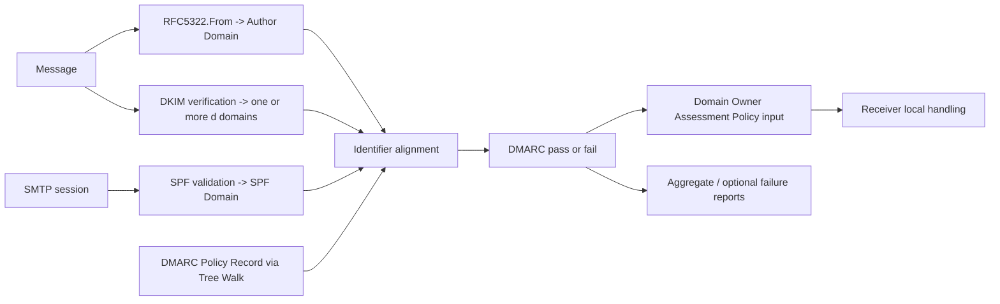

## 🔍 Plain-English deep-dive: Authentication and Alignment Are Two Separate Locks

An SPF record can authorize an IP for `provider.example`. That says nothing by itself about `brand.example`. A DKIM signature from `newsletter-platform.example` can verify perfectly while the From address is `billing@brand.example`. DMARC therefore uses two locks:

1. **Authentication lock:** Did SPF or DKIM produce a pass for its own domain?
2. **Alignment lock:** Is that authenticated domain related to the Author Domain under the requested strict or relaxed mode?

Both locks must open on one branch. Alignment cannot rescue a failed authentication result, and authentication cannot substitute for alignment.

| Authentication | Alignment | Branch usable for DMARC? | Why |
|---|---|---|---|
| Pass | Yes | Yes | Authenticated Identifier validates Author Domain use |
| Pass | No | No | Real authentication belongs to unrelated domain |
| Fail | Domains look related | No | No Authenticated Identifier exists from that check |
| Temporary/error | Unknown | Not determinate | Required evidence did not complete |
| No signature/SPF pass | N/A | No | No candidate authenticated identity |

This prevents a common shortcut: "DKIM passed, therefore DMARC passed." The correct statement is "DKIM passed for `d=X`; now compare X with the Author Domain under `adkim`."

## Identity Sources and Scope

| Identity | Location | Evaluated by | Visible to end user? | DMARC use |
|---|---|---|---:|---|
| Author Domain | RFC5322.From address domain | DMARC | Usually | Central comparison identity |
| SPF Domain | RFC5321.MailFrom domain after SPF validation | SPF, then DMARC | Usually not | SPF Authenticated Identifier on pass |
| Null-path SPF fallback | `postmaster@HELO-domain` construction for SPF | SPF, then DMARC | No | SPF Domain in null reverse-path case |
| DKIM Signing Domain | Passing DKIM `d=` | DKIM, then DMARC | Usually not | One candidate per passing signature |
| DKIM selector | `s=` | DKIM | No | Not alignment identity |
| DKIM AUID | `i=` | DKIM | No | Not DMARC alignment identity |
| Sender header | RFC5322.Sender | Message semantics | Rarely | Not evaluated by DMARC |
| Reply-To | RFC5322.Reply-To | Client behavior | Sometimes | Not evaluated by DMARC |
| Display name | Human-readable From name | User interface | Yes | Out of DMARC scope |

DMARC expects one usable Author Domain. A malformed, absent, or repeated From field makes normal validation impossible. If zero or more than one domain is extracted, current DMARC validation terminates, though a receiver may choose additional processing. Multiple From domains can be an abuse technique, so "DMARC not applicable" must not become "safe."

## Strict and Relaxed Alignment

Strict alignment requires exact domain equality. Relaxed alignment requires equal Organizational Domains. DNS names are compared case-insensitively.

| Author Domain | Authenticated domain | Strict | Relaxed, assuming Organizational Domain `example.com` |
|---|---|---:|---:|
| `example.com` | `example.com` | Yes | Yes |
| `news.example.com` | `mail.example.com` | No | Yes |
| `news.example.com` | `example.com` | No | Yes |
| `example.com` | `bounce.example.com` | No | Yes |
| `example.com` | `example.net` | No | No |
| `brand.example` | `brand-example.example` | No | No |

`adkim` controls DKIM alignment and defaults to relaxed. `aspf` controls SPF alignment and also defaults to relaxed. These modes are unrelated to DKIM's `simple` and `relaxed` canonicalization.

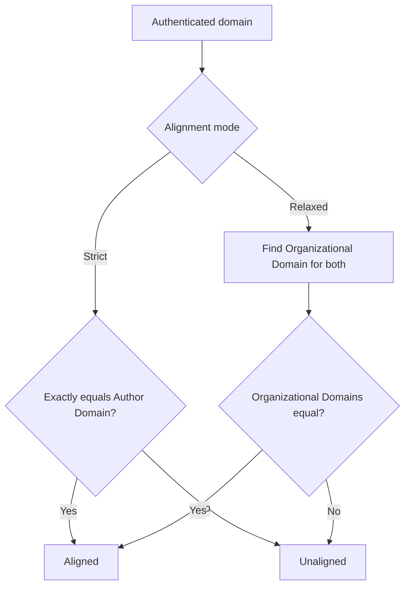

### SPF Alignment

SPF must first return pass for the SPF Domain. DMARC uses the validated MAIL FROM identity, including SPF's defined null-path construction. A passing HELO result for ordinary non-null mail is not an independent DMARC pass path.

| SPF result | SPF Domain | Author Domain | `aspf` | SPF DMARC branch |
|---|---|---|---|---|
| pass | `bounce.example.com` | `example.com` | relaxed | Passes branch if same Organizational Domain |
| pass | `bounce.example.com` | `example.com` | strict | Fails alignment |
| fail | `example.com` | `example.com` | either | Fails; no authenticated identifier |
| pass | `provider.example` | `brand.example` | relaxed | Fails alignment |
| temperror | unknown/incomplete | `example.com` | either | DMARC cannot be conclusively passed/failed from this branch alone |

### DKIM Alignment

Every validated DKIM signature supplies a candidate `d=` domain. One passing aligned signature is enough, even if other signatures fail or are unaligned.

| DKIM signature | DKIM result | `d=` | Author Domain | `adkim` | DKIM DMARC branch |
|---|---|---|---|---|---|
| A | pass | `mail.example.com` | `news.example.com` | relaxed | Pass |
| B | fail | `news.example.com` | `news.example.com` | strict | Fail; alignment cannot rescue crypto failure |
| C | pass | `list.example.net` | `news.example.com` | relaxed | Unaligned |
| D | pass | `news.example.com` | `news.example.com` | strict | Pass |

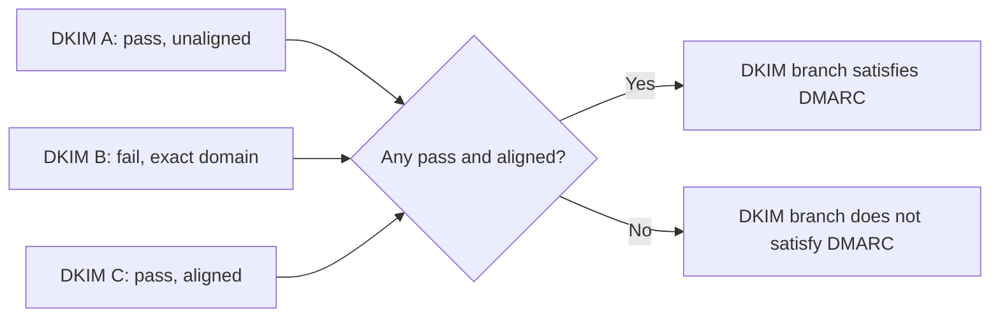

## The OR Rule

DMARC passes if at least one branch succeeds. It does not require both SPF and DKIM to pass or align.

| SPF pass+aligned | Any DKIM pass+aligned | DMARC validation |
|---:|---:|---|
| Yes | Yes | Pass |
| Yes | No | Pass |
| No | Yes | Pass |
| No | No | Fail, if evaluation is otherwise determinate and policy exists |

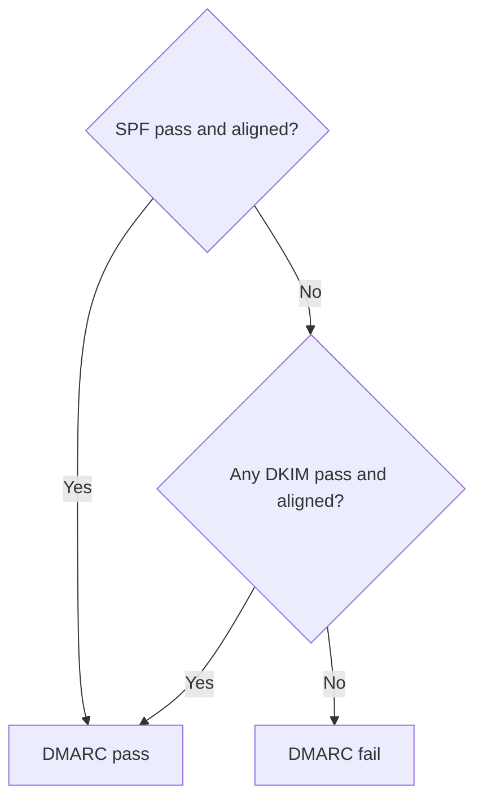

Operationally, using both mechanisms provides resilience. Forwarding often breaks SPF because the final receiver sees the forwarder's IP. DKIM can survive forwarding if signed content remains unchanged. A content-modifying mailing list can break DKIM too, which is why indirect flows remain difficult.

## 🔍 Plain-English deep-dive: Relaxed Alignment Means Same Administrative Family, Not String Suffix Guessing

It is tempting to compare domain strings manually: "both end in `example.com`, so they align." That can be wrong because registration and administrative boundaries vary. `tenant.hosting.example` and `other.hosting.example` might belong to different customers even though they share a suffix. Current DMARC determines Organizational Domains through DNS policy records and `psd` signals using a bounded Tree Walk, not merely by chopping off the leftmost label or relying exclusively on an external PSL.

Think of a building directory. Two offices share a street address, but whether they belong to one company depends on administrative boundaries in the directory, not the visual similarity of the address text. The `psd=n` flag can declare a node to be its own Organizational Domain. The `psd=y` flag marks a Public Suffix Domain, making the child below it the Organizational Domain for a walked name.

Relaxed alignment expands authorization. If control of `evil.example.com` is delegated to an untrusted party while the Organizational Domain is `example.com`, that party can potentially create an SPF or DKIM authenticated identity aligned with `example.com`. Strict alignment avoids this specific expansion but imposes operational constraints. The choice is a security/operations decision, not a universal "strict is always better" rule.

## Current DNS Tree Walk

Policy discovery starts with `_dmarc.<Author Domain>`. If no valid record exists, the receiver walks upward through DNS names to find the applicable Organizational Domain or PSD policy. The algorithm limits the process to eight queries even for names with many labels.

Core generic behavior:

1. Query the starting name for one valid DMARC record.
2. Discard records that do not begin with `v=DMARC1`.
3. If multiple valid candidate records exist at one target, discard them for that target.
4. Stop when a single record contains `psd=n` or `psd=y`.
5. Otherwise remove leftmost labels according to the eight-query bounding rule and continue upward.

For a very deep Author Domain, the first query is always the complete Author Domain. The next query can skip intermediate labels to ensure no more than eight total queries.

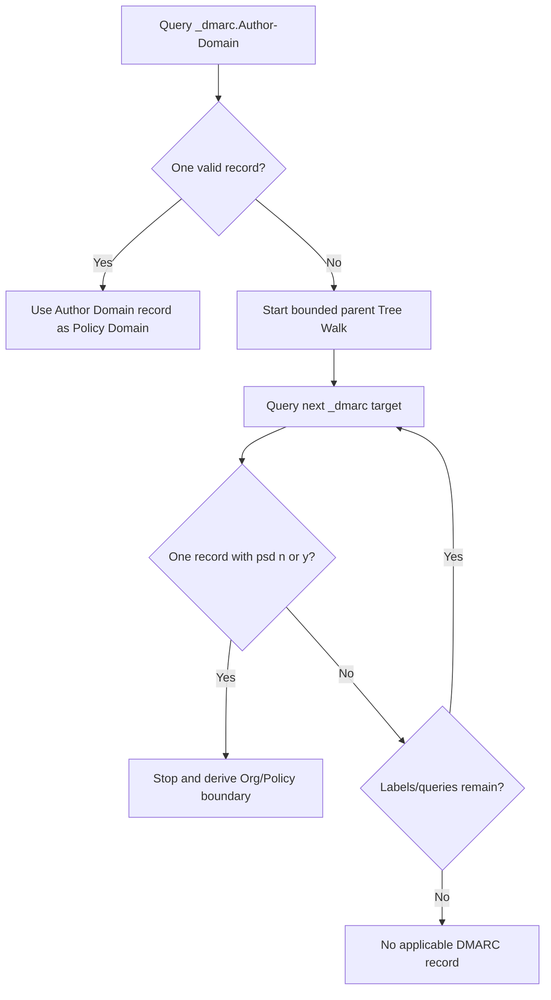

### Policy Discovery Preference

| Priority | Candidate policy location | Meaning |
|---:|---|---|
| 1 | Author Domain | Exact domain-specific policy wins |
| 2 | Organizational Domain | Inherited domain/subdomain policy |
| 3 | PSD | Public-suffix-level policy when current Tree Walk establishes it |

The first valid direct Author Domain record applies even if additional parent records exist. The record's location is the DMARC Policy Domain, but Organizational Domain determination for relaxed alignment can require additional Tree Walk logic.

### Record Selection at a Target

| DNS result | Interpretation |
|---|---|
| One TXT record beginning with valid `v=DMARC1` | Parse as candidate DMARC record |
| TXT records present but none identify current DMARC | No DMARC record at that target |
| Multiple current DMARC records | Invalid/ambiguous at that target; discard them |
| NXDOMAIN/NODATA | No record at that target, subject to DNS semantics and continued walk |
| SERVFAIL/timeout | DNS error; DMARC cannot be treated as ordinary fail |

TXT character strings in one record are concatenated in order without invented separators before parsing.

## DMARC Policy Record Tags

Synthetic current record:

```text
v=DMARC1; p=quarantine; sp=none; np=reject; psd=n;
adkim=r; aspf=s; t=y;
rua=mailto:dmarc-aggregate@reports.example;
ruf=mailto:dmarc-failure@reports.example; fo=0:d
```

| Tag | Status/default | Meaning | Support caution |
|---|---|---|---|
| `v` | Required, first; `DMARC1` | Record version | Case-sensitive value; invalid/misplaced version invalidates record |
| `p` | Recommended; absent valid record behaves as `none` | Policy for record's domain and fallback for subdomains | A preference, not forced disposition |
| `sp` | Optional; falls back to `p` | Policy for existing subdomains when parent/PSD record applies | Ignored on records below Organizational Domain/PSD for inherited use |
| `np` | Optional; falls back through `sp` then `p` | Policy for non-existent subdomains | NXDOMAIN means nonexistent; NODATA does not |
| `adkim` | Optional, default `r` | DKIM strict/relaxed alignment | Not DKIM canonicalization |
| `aspf` | Optional, default `r` | SPF strict/relaxed alignment | Does not change SPF evaluation itself |
| `psd` | Optional, default `u` | `y` PSD, `n` declared Organizational Domain, `u` undetermined | Affects Tree Walk and relaxed alignment boundary |
| `t` | Optional, default `n` | `y` requests testing treatment; `n` requests normal application | Replaces useful old `pct=0/100` intent, not arbitrary percentages |
| `rua` | Optional | Aggregate report URIs | External destinations require authorization |
| `ruf` | Optional | Failure report URIs | Reports are optional and privacy-sensitive |
| `fo` | Optional, default `0` | Failure-report trigger requests | Ignored without `ruf`; reporting remains receiver choice |

### Historic Tags You Will Still See

| Historic tag/syntax | Old purpose | Current treatment | Migration idea |
|---|---|---|---|
| `pct=0..100` | Sample policy application | Historic in RFC 9989 | Use monitoring/evidence stages and `t=y` testing semantics; do not promise percentages |
| `rf=afrf` | Select failure-report format | Historic | Current failure format is defined by RFC 9991 and related AFRF standards |
| `ri=<seconds>` | Request aggregate interval | Historic | Current aggregate reporting is commonly daily; receivers control cadence |
| URI `!10m` size suffix | Request max report size | Obsolete syntax; reporters should ignore size suffix | Engineer receiver limits operationally, not through policy tag |

The master curriculum mentions percentages because they remain common in deployed legacy records and interview questions. The current answer must explicitly say `pct` is historic and that RFC 9989 introduced `t` for testing behavior analogous to the useful `pct=0` versus `pct=100` distinction.

## Policy Selection: `p`, `sp`, and `np`

If the applicable record is at the Author Domain, use `p`. If the record is inherited from the Organizational Domain or PSD for a subdomain Author Domain, first determine whether that Author Domain exists.

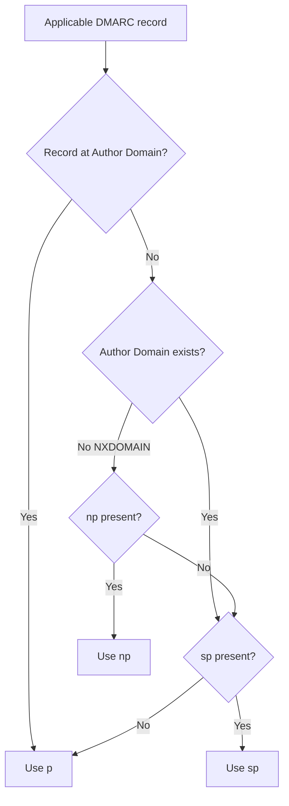

| Scenario | Applicable policy |
|---|---|
| Record published directly for Author Domain | `p` from that record |
| Existing subdomain inherits Organizational Domain record | `sp`, else `p` |
| Non-existent subdomain inherits Organizational Domain record | `np`, else `sp`, else `p` |
| `sp` on a subdomain's own direct record | Direct domain uses `p`; `sp` does not create arbitrary deeper inheritance below an Organizational Domain boundary as a substitute for discovery |

DMARC defines domain existence through DNS name existence. NXDOMAIN means the name and names beneath it do not exist. NODATA means the queried record type is absent, but the name exists. Do not decide existence by asking only whether MX or A records exist.

## Monitoring, Testing, and Enforcement

| State | Typical record | Domain Owner intent | Operational gate |
|---|---|---|---|
| Monitoring Mode | `p=none; rua=...` | Collect evidence without changing handling due to DMARC policy | Reports arrive and all legitimate streams are identified |
| Testing stronger policy | `p=quarantine; t=y; rua=...` | Signal intended policy while requesting testing treatment | Compare outcomes and intermediary effects |
| Quarantine enforcement | `p=quarantine; t=n/omitted` | Consider failures suspicious | Legitimate failure rate and support impact are acceptable |
| Reject enforcement | `p=reject; t=n/omitted` | Consider failures invalid | Both aligned SPF/DKIM configured, indirect-flow risks accepted, ongoing reports healthy |

With `t=y`, the Domain Owner requests that the validating actor not apply the stated policy and expects treatment one level below it: quarantine trends toward none, reject trends toward quarantine. Receivers still use local policy, and `t` does not suppress reports. A `p=none` policy is unaffected because it already expresses no handling preference.

## 🔍 Plain-English deep-dive: A DMARC Policy Is Advice with Evidence, Not a Remote Delete Command

`p=reject` is frequently described as "tell every receiver to reject." Current DMARC is more careful. The record expresses the Domain Owner's assessment policy. The receiver owns the mailbox and final handling. It can accept a failing message, quarantine a passing message, or reject for unrelated anti-abuse reasons.

Current RFC 9989 goes further: receivers must not reject solely because `p=reject` exists. They must combine the policy with other knowledge and analysis; without other analysis, failing mail is treated as quarantine rather than reject. This explicitly acknowledges legitimate indirect flows and the danger of operational damage to mailing lists.

Therefore keep four layers separate:

| Layer | Question | Example |
|---|---|---|
| Authentication | Did SPF/DKIM pass for their own domains? | DKIM pass for `provider.example` |
| DMARC validation | Did any passing identifier align? | Fail because provider domain is unaligned |
| Domain Owner Assessment Policy | What handling preference was published for failures? | `sp=quarantine`, `t=y` |
| Receiver disposition | What did the receiver actually do? | Delivered with local override, spam folder, 4xx, or 5xx |

A support statement should say "DMARC failed; the applicable Domain Owner preference was reject; the receiver delivered under a trusted-forwarder override." Saying "DMARC reject failed" collapses result and action into an ambiguous phrase.

## Result Vocabulary and Authentication-Results

| `dmarc=` result | Meaning |
|---|---|
| `pass` | Applicable policy exists and at least one Authenticated Identifier aligns |
| `fail` | Applicable policy exists but no aligned Authenticated Identifier exists |
| `none` | No applicable DMARC Policy Record exists |
| `temperror` | Likely transient error prevents a final result |
| `permerror` | Unrecoverable evaluation error, such as malformed policy |

Current Authentication-Results can include `header.from` and `policy.dmarc`. Trust those claims only when the `authserv-id` and message path belong to the receiver's established trust boundary.

```text
Authentication-Results: mx.recipient.example;
 spf=pass smtp.mailfrom=bounce.provider.example;
 dkim=pass header.d=mail.brand.example header.s=q1;
 dmarc=pass header.from=brand.example policy.dmarc=quarantine
```

In this synthetic result, SPF pass may be unaligned while DKIM provides the aligned pass. `policy.dmarc=quarantine` records policy context; it does not mean a passing message was quarantined.

## Aggregate Reporting: What the XML Actually Says

RFC 9990 aggregate reports group observations over a period. They are machine-readable XML, commonly GZIP-compressed and delivered through email when `rua` is present. A separate report is generated per DMARC Policy Domain, and a report contains one policy configuration.

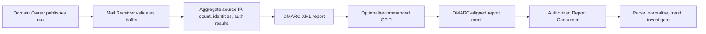

### Report Layers

| XML area | Main content | Question answered |
|---|---|---|
| `report_metadata` | Reporting organization, contact, report ID, UTC range, errors, generator | Who reported, for when, and is it duplicate? |
| `policy_published` | Policy Domain, discovery method, `p/sp/np`, alignment modes, `fo`, testing | What policy configuration did receiver observe? |
| `record/row` | Source IP, count, policy evaluated | How many matching messages came from this source and what disposition occurred? |
| `identifiers` | Header From, envelope From, optional envelope To | What domains were present in message/SMTP identities? |
| `auth_results` | Raw DKIM domains/selectors/results and SPF domain/result | What did underlying authentication return independent of DMARC alignment? |
| `reason` | Override type/comment | Why did actual disposition differ from policy? |

### Raw Authentication Versus DMARC Alignment

The `auth_results` section contains SPF and DKIM results uninterpreted with respect to DMARC. The `policy_evaluated` `spf` and `dkim` elements are DMARC alignment outcomes. This distinction explains rows that look contradictory.

| Raw `auth_results` | `policy_evaluated` | Interpretation |
|---|---|---|
| DKIM pass for aligned `d=` | DKIM pass | Valid signature aligns |
| DKIM pass for unrelated `d=` | DKIM fail | Cryptography passed, alignment did not |
| SPF pass for aligned MAIL FROM | SPF pass | Authorized route domain aligns |
| SPF pass for provider MAIL FROM | SPF fail | SPF passed but provider identity is unaligned |
| DKIM fail plus SPF aligned pass | DKIM fail, SPF pass, disposition pass | DMARC passes through SPF branch |

### Policy Override Reasons

Current predefined aggregate-report override types include `local_policy`, `mailing_list`, `other`, `policy_test_mode`, and `trusted_forwarder`.

| Override | Meaning | Support use |
|---|---|---|
| `local_policy` | Receiver exempted message | Do not assume domain configuration caused delivery |
| `mailing_list` | Receiver identified list flow | Correlate list transformations and original auth |
| `trusted_forwarder` | Receiver had external evidence for forwarder | Final disposition used trust beyond DMARC |
| `policy_test_mode` | `t=y` affected application | Expected during testing-stage rollout |
| `other` | Another exception | Read bounded comment; provider-specific detail may remain unknown |

Aggregate reports do not include message bodies or individual addresses under the current schema. They still expose source IP/domain traffic patterns and therefore require access controls. They are not delivery logs and do not disclose inbox placement. Counts can differ by receiver coverage, aggregation tuple, time range, and reporting behavior.

## External Report Destination Authorization

If the report destination belongs to a different Organizational Domain than the policy, the destination must authorize reports. Without authorization, an attacker could direct report floods at a victim.

For a policy at `example.com` with:

```text
rua=mailto:aggregate@reports.example.net
```

the receiver checks a TXT record at:

```text
example.com._report._dmarc.reports.example.net
```

with a valid record beginning:

```text
v=DMARC1;
```

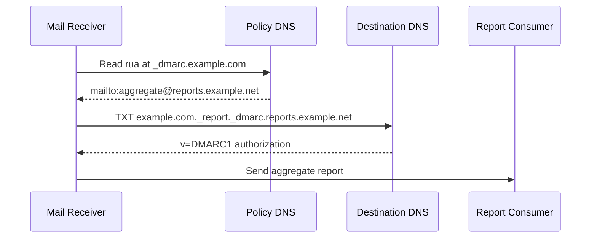

| Authorization outcome | Receiver behavior |
|---|---|
| Valid authorization | Destination can receive report |
| No valid authorization | Ignore external URI |
| Authorization has same-host override URI | May replace destination under current procedure |
| Override points to another host | Do not send to original or unsafe override |
| Query name exceeds DNS limits | Cannot establish authorization |
| Temporary DNS error | Receiver may defer/retry according to policy |

## Failure Reports

RFC 9991 failure reports describe individual failures or groups of similar failures, often near event time. `ruf` requests destinations and `fo` requests trigger modes. Receivers may decline to send them, and many do because reports can expose message headers, content, PII, non-public information, mailing-list membership, or forwarding destinations.

| Report type | Scope | Common value | Major risk |
|---|---|---|---|
| Aggregate (`rua`) | Counts grouped by source/result over a period | Inventory and trend authorized/unauthorized streams | Traffic metadata, parser/decompression attacks |
| Failure (`ruf`, `fo`) | Message-specific failure details | Diagnose intermittent auth breakage or abuse | PII/content leakage, malicious payload redistribution, report floods |

Current `fo` values:

| `fo` value | Requested trigger |
|---|---|
| `0` default | Report when all underlying mechanisms fail to produce aligned pass |
| `1` | Report when any underlying mechanism fails to produce aligned pass |
| `d` | DKIM failure report for signature evaluation failure, regardless of alignment |
| `s` | SPF failure report for SPF failure, regardless of alignment |

`0` and `1` are mutually exclusive; `d` and `s` can be combined with one of them. `fo` is ignored without `ruf`. Report generation remains receiver policy, and outgoing failure reports must be rate-limited. External `ruf` destinations use the same authorization procedure with `ruf` substituted for `rua`.

Safe handling includes redaction/minimization, secure transport, isolated report streams, sandboxed inspection, network segmentation, removal of dangerous attachments, and access limited to trained authorized personnel. A support team should not ask a customer to paste an unredacted forensic report into a broad ticket.

## 🔍 Plain-English deep-dive: Aggregate Reports Are Grouped Telemetry, Not a List of Delivered Messages

An aggregate row might say that source `192.0.2.40` sent 12,000 messages with raw SPF pass, raw DKIM pass, DMARC-SPF fail, DMARC-DKIM pass, and disposition pass. It does not enumerate those messages, identify recipients, prove that all 12,000 were legitimate, or say they reached inboxes.

Think of a highway traffic counter. It can say how many vehicles crossed a sensor and classify some properties. It cannot tell you every driver's purpose or where each vehicle parked. Likewise, aggregate reports reveal patterns requiring owner knowledge:

- Is the source one of our providers?
- Should its MAIL FROM align?
- Does its DKIM domain belong to us?
- Is the volume expected for this period?
- Did a deployment change create a new failure cluster?
- Is the source abusive spoofing rather than forgotten legitimate mail?

Do not authorize a source merely because its volume is high. Do not label a source malicious merely because it is unknown. Correlate contracts, architecture, campaign systems, DNS ownership, provider evidence, and time windows.

## Indirect Mail Flows

Forwarders and mailing lists expose the different failure modes of SPF and DKIM.

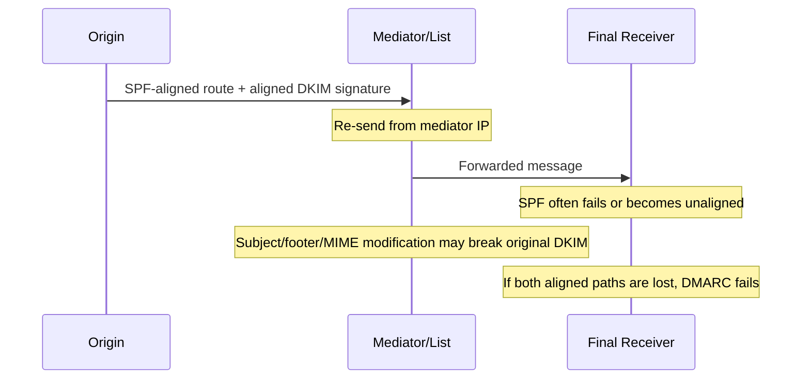

| Indirect action | SPF consequence | DKIM consequence | DMARC consequence |
|---|---|---|---|
| Simple forward, original MAIL FROM retained | Final IP usually unauthorized | Can survive unchanged content | DKIM can preserve pass |
| Forwarder rewrites MAIL FROM to itself | SPF may pass for forwarder but unaligned | Can survive | DMARC needs original aligned DKIM |
| Mailing list prefixes Subject | SPF unaligned/failed | Breaks signature if Subject signed | Both paths may fail |
| Mailing list appends footer | SPF unaligned/failed | Breaks full-body signature | Both paths may fail |
| List rewrites From and signs aligned to list From | New SPF/DKIM can align with rewritten Author Domain | Original author identity semantics change | DMARC can pass for list-controlled From |
| Receiver trusted-forwarder override | DMARC validation still fails | N/A | Receiver can deliver under local analysis and report override |

Current RFC 9989 says domains at `p=reject` must not rely solely on SPF and must apply valid DKIM signatures. It also warns general-purpose user domains about `p=reject` interoperability and tells receivers not to reject solely on that policy. Part 028 covers ARC, a mechanism intended to carry authentication history through intermediaries, but ARC is not a universal override or proof of original content truth.

## Failure Modes and Misleading Shortcuts

| Failure mode | Misleading shortcut | Correct model | Cheap discriminating check |
|---|---|---|---|
| SPF pass, unaligned | "SPF is green, DMARC should pass" | Compare SPF Domain to Author Domain | Record MAIL FROM and `aspf` outcome |
| DKIM pass, unaligned | "Signature passed" | Compare passing `d=` to Author Domain | Evaluate every passing signature's alignment |
| DKIM fail, exact `d=` | "Domains match" | Authentication must pass before alignment matters | Preserve DKIM failure reason |
| Both mechanisms required | "SPF and DKIM must both pass" | One aligned pass is sufficient | Apply OR truth table |
| DKIM first signature only | "Top signature decides" | Any passing aligned signature can satisfy DMARC | Inventory all signatures |
| Canonicalization confused with alignment | "relaxed DKIM means subdomains align" | `c=` differs from `adkim=` | Separate signature and policy tags |
| String suffix used for Organizational Domain | "Same ending means aligned" | Use current Tree Walk/`psd` logic | Preserve Tree Walk targets and records |
| PSL-only policy discovery | "Check organizational domain from PSL" | RFC 9989 uses bounded DNS Tree Walk | Compare receiver discovery method in reports |
| `pct=25` taught as current | "Ramp to 25 percent" | `pct` is historic; current testing uses `t` | Inspect tag registry/version |
| `p` assumed mandatory | "No p means invalid" | Current valid record without `p` behaves as `p=none` | Parse under RFC 9989, not RFC 7489 |
| NODATA treated as nonexistent | "No MX, so use np" | Only NXDOMAIN establishes nonexistence for this purpose | Preserve RCODE and answer type |
| `sp` applied to parent itself | "sp overrides p everywhere" | `sp` is for existing subdomains | Identify policy and Author Domain relation |
| `np` ignored | "p covers fake subdomains" | `np` can state distinct preference | Check Author Domain existence and fallback chain |
| `psd` treated as policy | "psd=reject" | `psd` is a boundary flag y/n/u | Parse separate `p/sp/np` |
| `t=y` suppresses reports | "Testing means no reporting" | It affects policy application request, not reports | Check aggregate report override |
| Policy equated to disposition | "p=reject means receiver rejected" | Receiver local decision is separate | Read SMTP result/report disposition |
| DMARC pass equated to safe | "Authenticated means benign" | Pass validates authorized Author Domain use only | Keep content/reputation controls separate |
| Report row treated per-message | "Count 100 means 100 inboxes" | Row is grouped receiver observation | Read period, tuple, disposition, and coverage |
| Raw DKIM pass confused with DMARC-DKIM pass | "Report contradicts itself" | Raw result can be unaligned | Compare `auth_results` and `policy_evaluated` |
| Missing reports interpreted as no traffic | "No XML means no mail" | Receiver may not report or delivery can fail | Monitor report coverage/gaps separately |
| Failure reports expected universally | "ruf is configured, so reports arrive" | Sending is optional and often disabled | Confirm provider policy; rely on aggregate data |
| External reporting URI accepted automatically | "rua points there, so it works" | Destination authorization required | Query `<policy>._report._dmarc.<destination>` |
| Current DNS used for historical event | "Policy is reject now, so it was then" | DNS and caches change | Use event-time result/report and TTL evidence |

## Troubleshooting Decision Tree

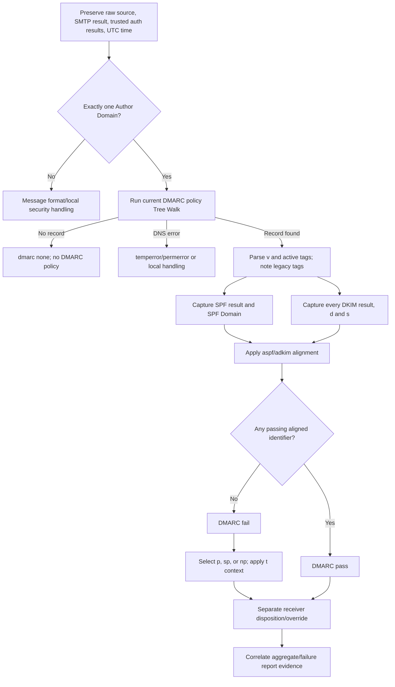

### Evidence Collection Order

1. Preserve event time, receiver, raw message, SMTP reply, and trusted Authentication-Results.
2. Extract one Author Domain from RFC5322.From.
3. Reconstruct event-relevant DMARC Policy Domain discovery with current Tree Walk semantics, while noting if the receiver reported legacy PSL discovery.
4. Parse the applicable record and defaults.
5. Capture SPF result and exact SPF Domain.
6. Capture each DKIM result, `d=`, and selector.
7. Compute strict/relaxed alignment per branch.
8. Apply the OR rule.
9. If DMARC fails, select `p/sp/np` and testing context.
10. Separate the receiver's actual disposition and override from the published preference.
11. Correlate report coverage and nearby changes.

## Safe Lab: DMARC Decision Worksheet and Staged Rollout Plan

### Safety Boundary

Use only synthetic domains, documentation IP addresses, and supplied data. Do not change DNS, send live email, create report mailboxes, upload reports, or inspect customer XML. The lab produces a paper decision and rollout plan, not production action.

### Prerequisites

1. An authorized, non-production local study folder and a Markdown or spreadsheet editor.
2. This Part plus current RFCs 9989, 9990, and 9991 for policy discovery, alignment, reporting, privacy, and rollout checks.
3. Only the supplied synthetic message, DNS observations, and external-report authorization record; no DNS, mailbox, provider, or reporting access is required.
4. A worksheet that keeps Author Domain, policy discovery, SPF branch, every DKIM branch, receiver disposition, and report evidence separate.

### Synthetic Environment

Message evidence:

```text
RFC5322.From: Billing <billing@alerts.sales.example>
RFC5321.MailFrom: bounce@bounce.vendor.example
SPF: pass for bounce.vendor.example
DKIM A: pass, d=mail.sales.example, s=q1
DKIM B: pass, d=vendor.example, s=outbound
```

DNS observations:

```text
_dmarc.alerts.sales.example -> no DMARC record
_dmarc.sales.example ->
  v=DMARC1; p=reject; sp=quarantine; np=reject; psd=n;
  adkim=r; aspf=s; t=y;
  rua=mailto:aggregate@reports.example.net
_dmarc.example -> no DMARC record
```

External destination authorization:

```text
sales.example._report._dmarc.reports.example.net -> v=DMARC1;
```

Assume `alerts.sales.example` exists in DNS.

### Task 1: Decision Worksheet

| Step | Observation | Rule | Result |
|---|---|---|---|
| Author Domain | `alerts.sales.example` | Extract domain from single RFC5322.From | Usable Author Domain |
| Policy discovery | No direct record; `sales.example` has `psd=n` | Stop Tree Walk; declared Organizational Domain | Policy/Org Domain `sales.example` |
| Policy selection | Existing subdomain and inherited record | Use `sp`, else `p` | Preference `quarantine` |
| Testing | `t=y` | Request testing treatment, reports unaffected | Expected one level below stated policy |
| SPF authentication | pass for `bounce.vendor.example` | Candidate exists | Continue to strict SPF alignment |
| SPF alignment | `bounce.vendor.example` != `alerts.sales.example` | `aspf=s` exact match required | SPF branch fails alignment |
| DKIM A authentication | pass for `mail.sales.example` | Candidate exists | Continue to relaxed DKIM alignment |
| DKIM A alignment | Org Domain `sales.example` equals Author Org Domain | `adkim=r` | DKIM A branch passes |
| DKIM B | pass for `vendor.example` | Different Organizational Domain | Unaligned |
| DMARC result | At least one passing aligned DKIM identity | OR rule | DMARC pass |
| Policy application | DMARC passed | Failure policy not triggered | No DMARC failure action |
| Reporting URI | External `reports.example.net` authorized | RFC 9990 external authorization | Eligible for aggregate reports |

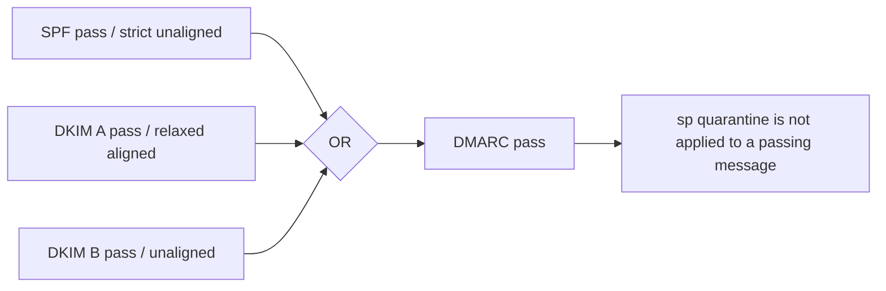

### Task 2: Mutation Tests

| Changed input | New result | Why |
|---|---|---|
| Change `adkim=r` to `adkim=s` | DMARC fail | `mail.sales.example` is not exactly `alerts.sales.example`; no other branch aligns |
| Change DKIM A `d=` to `alerts.sales.example` | DMARC pass under strict or relaxed | Exact passing aligned identity |
| Change SPF MAIL FROM to `alerts.sales.example` while SPF remains pass | DMARC pass through SPF | Exact SPF alignment under `aspf=s` |
| Make DKIM A fail cryptographically | DMARC fail | DKIM B is unaligned and SPF is unaligned |
| Make Author Domain NXDOMAIN and remove `np` | Fall back `sp=quarantine`, then `p` if no `sp` | Current non-existent-domain fallback chain |
| Remove `t=y` while DMARC fails | Published quarantine preference no longer in testing | Receiver still owns final disposition |
| Remove external authorization record | Aggregate URI ignored by conforming reporter | External destination is not authorized |

### Task 3: Staged Rollout Plan

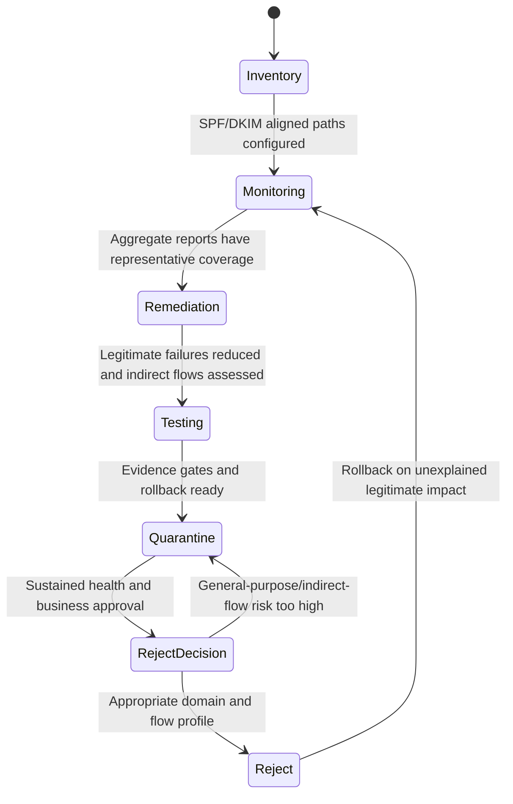

| Stage | Action | Entry evidence | Exit/rollback gate |
|---|---|---|---|
| Inventory | List platforms, vendors, bounce domains, DKIM domains, subdomains, forwarding/list flows | Owners and traffic map | No unknown authorized stream lacks owner |
| Align | Configure customer-controlled aligned SPF MAIL FROM and DKIM `d=`; prefer both | Synthetic tests and receiver auth results | Each legitimate stream has at least one durable aligned pass |
| Monitor | Publish `p=none; rua=...` on Author/Org domains | Parser, secure mailbox, external authorization ready | Representative reporting periods show stable coverage |
| Remediate | Fix unknown legitimate sources and expired configurations | Source-to-owner evidence | Unexplained legitimate DMARC-fail volume below agreed threshold |
| Test | Publish intended stronger policy with `t=y` where suitable | Rollback record, TTL plan, support owners | Override/disposition observations acceptable |
| Quarantine | Apply `p=quarantine` on suitable scoped domain | Business/security approval | No material legitimate loss; report health sustained |
| Reject decision | Assess general-purpose users, lists, forwarders, support load | At least month-scale monitoring and quarantine comparison for list-capable domains per current guidance | Proceed only if interoperability risk accepted |
| Ongoing | Review reports, DNS delegation, vendors, new streams, tree boundaries | Alerting and ownership | Roll back on unexpected legitimate failures or reporting blind spot |

Do not use a percentage rollout as the current standards model. Scope by domain/subdomain, use monitoring and `t=y` testing, compare sustained report evidence, and move policy in controlled stages.

### Task 4: Bounded Conclusion

> **[Observation in scenario]** The Author Domain is `alerts.sales.example`. The current Tree Walk finds `psd=n` at `sales.example`, making it the Organizational and Policy Domain. The record requests relaxed DKIM and strict SPF alignment.
>
> **[Observation in scenario]** SPF passes for an unaligned vendor domain. DKIM A passes for `mail.sales.example`, which shares Organizational Domain `sales.example`; DKIM B passes but is unaligned.
>
> **[Standard]** One passing aligned DKIM identifier is sufficient.
>
> **[Conclusion]** DMARC passes, so the inherited `sp=quarantine` failure preference and `t=y` testing context do not cause a DMARC failure action.
>
> **[Proof limit]** The pass validates authorized use of the Author Domain; it does not establish message safety, reputation, or inbox placement.

### Expected evidence

The lab should produce an inspectable DMARC decision worksheet, Tree Walk and policy-domain record, separate SPF/DKIM alignment branches, seven mutation outcomes, staged rollout plan with entry/exit/rollback gates, external-report authorization finding, and bounded conclusion. A reviewer must be able to reproduce the OR decision and selected policy context from the supplied synthetic data.

### Cleanup and privacy

- Retain only the synthetic domains, message/authentication observations, rollout worksheet, and report-authorization example.
- Delete or redact any accidentally pasted aggregate/failure report, mailbox address, source IP, sender/recipient identity, message sample, customer data, personally identifiable information (PII), tenant ID, token, or internal hostname; delete the artifact if safe redaction is not possible.
- Do not upload XML, create report destinations, send mail, change DNS/policy, or use a live tenant during this exercise.
- Confirm before retention or sharing that no live DMARC policy, report stream, customer message, provider action, or destructive enforcement test was involved.

### Validation rubric

| Dimension | Fail | Developing | Pass |
|---|---|---|---|
| Author/policy discovery | Uses visible strings or legacy assumptions without label | Finds likely policy domain | Extracts one Author Domain and records every current Tree Walk decision and version caveat |
| Alignment branches | Treats auth pass as aligned or requires both mechanisms | Evaluates SPF and one DKIM branch | Computes exact/organizational alignment for SPF and every passing DKIM identity |
| DMARC and disposition | Equates policy with receiver action | States pass/fail but blurs handling | Applies the OR rule and separates result, selected preference, testing, override, and disposition |
| Reporting | Treats reports as inbox proof or exposes content | Identifies aggregate reporting | Validates destination authorization and handles aggregate/failure report privacy and proof limits |
| Rollout plan | Recommends immediate reject | Lists broad stages | Uses inventory, monitoring, remediation, testing, rollback, approval, and ongoing evidence gates |
| Safety and honesty | Changes live policy or claims tenant operation | Paper plan with incomplete boundary | Synthetic-only, non-production, privacy-safe, and explicitly not production administration |

## Case Summary Template

| Field | Required content | Example |
|---|---|---|
| Event | Receiver, UTC, queue/message ID | 2026-06-14 14:05 UTC at `mx.recipient.example` |
| Author Domain | Exact RFC5322.From domain | `alerts.sales.example` |
| Policy discovery | Every queried target, RCODE, record, discovery method | Tree Walk found `sales.example`, `psd=n` |
| Applicable tags/defaults | `p/sp/np/adkim/aspf/psd/t/rua/ruf/fo` plus historic tags observed | `sp=quarantine`, `adkim=r`, `aspf=s`, `t=y` |
| SPF branch | Result, SPF Domain, alignment mode/outcome | pass, `bounce.vendor.example`, strict unaligned |
| DKIM branches | Every result, `d`, `s`, alignment outcome | pass `mail.sales.example`, relaxed aligned |
| DMARC result | Boolean reasoning | pass through DKIM A |
| Policy context | Preference selected and why | `sp` because existing subdomain inherited record |
| Receiver action | SMTP/disposition/override | Delivered under normal local processing |
| Report evidence | Period, source/count, raw auth, evaluated policy, override | RFC 9990 row from receiver |
| Hypothesis | Narrow causal explanation | Vendor's new stream signs only with unaligned provider domain |
| Disconfirming check | One cheap falsifier | Verify a sample has passing customer-aligned DKIM |
| Proof limit | Unknown/unsupported claims | Inbox algorithm and full receiver reputation policy unknown |

### Example Escalation

> **[Observation]** The trusted receiver reports SPF pass for `bounce.vendor.example`, DKIM pass for `vendor.example`, and `dmarc=fail header.from=brand.example`. Both authenticated domains are outside the Author Domain's Organizational Domain.
>
> **[Observation]** Aggregate rows for the vendor source changed from aligned DKIM pass to unaligned DKIM pass immediately after selector `customer-2026` disappeared from outbound samples.
>
> **[Inference]** The vendor deployment stopped adding the customer-aligned signature while retaining its provider signature. This is disconfirmed by a failing raw sample containing a cryptographically passing aligned `d=brand.example` signature.
>
> **Owner/action:** Restore customer-aligned DKIM signing, validate on a synthetic message at an approved receiver, and monitor aggregate rows across representative reporting periods before changing policy.
>
> **[Private unknown]** Receiver inbox placement logic is not established by DMARC reports.

## Official Source Anchors

All listed sources were accessed on August 24, 2026 and must be revalidated for current provider behavior.

| Source | What it establishes |
|---|---|
| [RFC 9989 - DMARC](https://www.rfc-editor.org/rfc/rfc9989) | Current core protocol, alignment, DNS Tree Walk, tags, policy semantics, receiver/domain-owner actions, rollout, proof limits, and changes from RFC 7489 |
| [RFC 9990 - DMARC Aggregate Reporting](https://www.rfc-editor.org/rfc/rfc9990) | Current XML schema, report layers, external destination authorization, delivery, extensions, privacy, and report security |
| [RFC 9991 - DMARC Failure Reporting](https://www.rfc-editor.org/rfc/rfc9991) | Current message-specific report triggers/format, optionality, authorization, redaction, privacy, rate limits, and security |
| [RFC 7208 - SPF](https://www.rfc-editor.org/rfc/rfc7208) | SPF identities/results consumed by DMARC |
| [RFC 6376 - DKIM](https://www.rfc-editor.org/rfc/rfc6376) | DKIM `d=` authenticated identity and signature behavior consumed by DMARC |
| [RFC 7960 - DMARC and Indirect Flows](https://www.rfc-editor.org/rfc/rfc7960) | Forwarding, mailing-list, mediator, and mitigation interoperability analysis |
| [RFC 8601 - Authentication-Results](https://www.rfc-editor.org/rfc/rfc8601) | Trust boundary and machine-readable authentication result framework |
| [RFC 7489 - Historic DMARC](https://www.rfc-editor.org/rfc/rfc7489) | Obsolete behavior encountered in legacy deployments; use only for versioned comparison |

### Evidence Currency Rules

1. Prefer RFC 9989/9990/9991 for current conclusions.
2. Record whether a receiver/report used `treewalk` or legacy `psl` discovery.
3. Treat `pct`, `rf`, `ri`, and URI size suffixes as legacy evidence, not current rollout controls.
4. Preserve event-time Authentication-Results/reports because DNS policy can change.
5. Preserve RCODE and target for every Tree Walk query.
6. Do not infer inbox placement from aggregate disposition.
7. Do not paste unredacted failure reports into broadly accessible systems.
8. Verify current provider support for the 2026 schema and tags before relying on implementation behavior.

## Likely Interview Questions

### Q1. What is DMARC alignment?

**Model answer:** It is the required relationship between the RFC5322.From Author Domain and a domain that actually passed SPF or DKIM. Strict alignment requires exact domain equality. Relaxed alignment requires the same Organizational Domain, determined under current RFC 9989 Tree Walk rules. Authentication must pass first; a related-looking domain from a failed check is not aligned authenticated evidence.

### Q2. Does DMARC require both SPF and DKIM to pass?

**Model answer:** No. It passes when SPF passes and aligns, or when any DKIM signature passes and aligns. One branch is enough. Operationally, domains should deploy both for resilience, and a domain at `p=reject` must not rely solely on SPF because forwarding commonly breaks SPF.

### Q3. How does current DMARC policy discovery work?

**Model answer:** Query `_dmarc.<Author Domain>` first. If no valid direct record exists, perform the RFC 9989 bounded DNS Tree Walk upward to discover an Organizational Domain or PSD policy. The walk processes `psd=n/y` boundaries and is limited to eight queries even for deep names. This replaces RFC 7489's PSL-based discovery, so I preserve the discovery method and every DNS target.

### Q4. Explain `p`, `sp`, `np`, and `t`.

**Model answer:** `p` is the policy for the record's own domain and fallback. `sp` applies to existing subdomains when a parent/PSD record is inherited. `np` applies to non-existent subdomains, falling back to `sp` then `p`. `t=y` requests testing treatment and does not suppress reporting. Current DMARC treats `pct` as historic; `t` replaces the useful old testing distinction rather than arbitrary percentage sampling.

### Q5. What is the difference between DMARC result and disposition?

**Model answer:** The result says whether an applicable policy exists and any passing SPF/DKIM authenticated domain aligns. The Domain Owner record supplies a handling preference for failures. The receiver then makes a local disposition using that preference plus other analysis. Current RFC 9989 says receivers must not reject solely because of `p=reject`. A message can fail DMARC and be delivered under an override, or pass and still be blocked for abuse.

### Q6. How do you read an aggregate report row?

**Model answer:** Start with period/report ID and Policy Domain, then source IP and count, `policy_evaluated` DMARC-alignment outcomes and disposition, identifiers such as header/envelope From, and raw SPF/DKIM `auth_results`. Raw DKIM pass can coexist with DMARC-DKIM fail if `d=` is unaligned. Read override reasons when disposition differs from policy. The row is aggregated telemetry, not proof of inbox delivery or legitimacy.

### Q7. Why does forwarding break DMARC?

**Model answer:** The final receiver sees the forwarder's IP, so original SPF often fails; if the forwarder rewrites MAIL FROM, SPF may pass for an unaligned domain. DKIM can preserve DMARC if the aligned original signature survives, but list Subject/footer/MIME changes can break it. Then both aligned paths are lost. Receivers can use local trusted-forwarder/list analysis, and ARC can carry authentication history, but neither means blindly overriding failures.

### Q8. How would you roll out DMARC safely today?

**Model answer:** Inventory all senders and indirect paths, configure both SPF and DKIM to produce aligned identities, publish monitoring `p=none` with an authorized `rua`, machine-parse reports over representative periods, remediate legitimate failures, then test stronger policy using current `t=y` semantics where appropriate. Move to quarantine and only then consider reject with business, list/forwarding, support, rollback, and ongoing report evidence. I would not use historic `pct` as the current rollout model.

## 🧠 30-Second Memory Hooks

- **From drives DMARC.** The Author Domain comes from RFC5322.From.
- **Pass first, align second.** Related domains from failed checks do not count.
- **SPF or DKIM.** One passing aligned branch is enough.
- **Any aligned DKIM wins.** Evaluate every passing signature.
- **Strict equals exact.** Relaxed equals same Organizational Domain.
- **Walk DNS, not just a PSL.** Current DMARC uses an eight-query-bounded Tree Walk.
- **`psd=n` sets a family root.** `psd=y` marks a public suffix boundary.
- **`p` self, `sp` existing child, `np` nonexistent child.**
- **NXDOMAIN is nonexistent.** NODATA is still an existing name.
- **`t=y` is testing.** `pct` is historic.
- **Result is not disposition.** Receiver local policy always matters.
- **Pass is authorized domain use.** It is not safe-content proof.
- **Aggregate reports group.** They are not per-message delivery logs.
- **Raw auth differs from aligned auth.** Read both report layers.
- **Failure reports can leak content.** Minimize, isolate, and rate-limit.
- **External reports require consent.** Check `_report._dmarc` authorization.
- **Forwarding hurts SPF; modification hurts DKIM.** Preserve at least one aligned path.

## Completion Checklist

- [ ] I can identify the Author Domain and distinguish it from MAIL FROM and DKIM `d=`.
- [ ] I can explain strict and relaxed alignment without confusing canonicalization.
- [ ] I can compute the SPF branch from a passing SPF Domain.
- [ ] I can evaluate all DKIM signatures and find any passing aligned `d=`.
- [ ] I can apply the OR truth table.
- [ ] I can run or explain the RFC 9989 DNS Tree Walk and its eight-query bound.
- [ ] I can explain `psd=y`, `psd=n`, and `psd=u`.
- [ ] I can select `p`, `sp`, or `np` correctly.
- [ ] I can distinguish NXDOMAIN from NODATA for `np`.
- [ ] I know `pct`, `rf`, and `ri` are historic and `t` is current.
- [ ] I can explain Monitoring Mode, testing, quarantine, and enforcement.
- [ ] I keep validation result, policy preference, override, and disposition separate.
- [ ] I can read RFC 9990 report metadata, policy, row, identifiers, and raw auth results.
- [ ] I can explain raw DKIM/SPF results versus DMARC-alignment results.
- [ ] I can interpret policy override reasons.
- [ ] I can derive the external report authorization owner name.
- [ ] I can contrast aggregate and failure report value and risk.
- [ ] I can explain why failure reports are often absent.
- [ ] I can diagnose forwarding/list failures without declaring all failures abusive.
- [ ] I can state DMARC proof limits and current receiver rejection guidance.
- [ ] I can complete the synthetic worksheet and staged rollout without changing live DNS.

[Next: Part 028 - ARC Forwarding and Authentication Preservation](Part-028-arc-forwarding-and-authentication-preservation.md)