# Part 028 - ARC Forwarding and Authentication Preservation

## Purpose, Evidence, and Currency

Authenticated Received Chain (ARC) is an email protocol for carrying a verifiable history of authentication assessments through intermediaries. A forwarder, mailing list, security gateway, or hosted filtering service can change the route or content of a legitimate message. Those changes can make the final receiver observe SPF, DKIM, and DMARC failures even though an earlier handler saw the message authenticate successfully. ARC lets participating handlers record what they observed, sign the message state they are forwarding, and cryptographically bind their assertion to earlier ARC assertions.

ARC does **not** make a failed SPF, DKIM, or DMARC result turn into a pass. It does **not** prove that a message is benign. It does **not** define a universal list of trusted intermediaries. Its narrower contribution is authenticated history: the final receiver can verify which sealing domains attached the ARC sets, whether the ordered chain remains intact, and what those domains claimed to observe at their respective points in the path. The receiver then decides whether any sealer is trustworthy enough for that history to influence local handling.

This lesson is grounded primarily in RFC 8617, which defines ARC as an Experimental protocol. RFC 8601 defines `Authentication-Results` and its trust-boundary rules. RFC 7960 documents why indirect email flows break DMARC's underlying mechanisms. The current DMARC core specification, RFC 9989, still references ARC but states that, as of its publication, no proposed technical mitigation for unchanged-From mailing-list flows had become widely used. That status matters: ARC can be operationally valuable where participants support it, but support engineers must not present it as universal or as a guaranteed bypass for DMARC policy.

The central diagnostic model in this part has three independent layers:

$$
\text{Useful ARC evidence} = \text{chain valid} \land \text{relevant history} \land \text{trusted sealer under local policy}
$$

A valid chain without a trusted sealer is intact testimony from a party the receiver may not believe. A trusted sealer with an invalid chain cannot provide intact ARC history. Even when both are present, the message still requires ordinary anti-abuse, content, reputation, and policy checks.

> **Currency note:** RFC 8617 uses the then-current RFC 7489 DMARC terminology in examples. RFC 9989 now defines the core DMARC protocol and obsoletes RFC 7489. The ARC wire format and validation algorithm remain defined by RFC 8617, while current claims about DMARC policy, Organizational Domain discovery, reporting, and receiver discretion should be checked against RFCs 9989, 9990, and 9991.

## Section Goal

By the end of this part, you should be able to:

- Explain from zero knowledge why forwarding and message modification can break SPF, DKIM, and DMARC.
- Define an intermediary, Administrative Management Domain (ADMD), ARC Sealer, ARC Validator, ARC Set, and ARC Chain.
- Identify the three headers in every ARC Set: ARC-Authentication-Results (AAR), ARC-Message-Signature (AMS), and ARC-Seal (AS).
- Explain the distinct job of each ARC header instead of treating them as three copies of DKIM.
- Group headers by the `i=` instance value and verify a continuous sequence from 1 through $N$.
- Interpret `cv=none`, `cv=pass`, and `cv=fail` in the correct context.
- Apply the RFC 8617 structural checks before attempting cryptographic or trust conclusions.
- Distinguish the latest AMS requirement, optional prior-AMS checks, `oldest-pass`, and mandatory ARC-Seal validation.
- Explain why a prior AMS can fail while the overall ARC Chain still passes validation.
- Separate cryptographic chain validity from the truth, competence, reputation, and trustworthiness of a sealer.
- Explain why an AAR assertion can be syntactically or factually wrong without automatically making the ARC signatures invalid.
- Apply RFC 8601 trust-boundary rules to ordinary `Authentication-Results` headers.
- Distinguish what ARC preserves from what it does not prove or restore.
- Diagnose missing sets, duplicate fields, instance gaps, invalid `cv` values, broken signatures, message mutation, DNS key failures, and forged authentication claims.
- Read a synthetic forwarding case without treating a final DMARC fail as proof of spoofing.
- Produce a support-ready ARC worksheet that labels standards, observations, inferences, private unknowns, and safe next actions.

## JD Mapping

| Role responsibility | ARC capability from this part | Example support output |
|---|---|---|
| Diagnose complex email authentication | Reconstruct authentication before and after intermediary handling | "The origin passed aligned DKIM at the list, but the list footer invalidated that signature before final delivery." |
| Read raw headers safely | Group AAR, AMS, and AS by `i=` and preserve order | An instance table showing complete sets 1 and 2, sealing domains, selectors, and validation state |
| Separate facts from conclusions | Keep current auth, ARC validity, and sealer trust independent | "ARC passes cryptographic validation; whether `lists.example` is trusted is a separate receiver-policy question." |
| Troubleshoot forwarding | Explain route-based SPF failure and content-based DKIM failure | "The forwarder became the connecting IP, and the mailing list changed the signed Subject and body." |
| Investigate false positives | Use trusted historical authentication as one local-policy signal | A bounded recommendation to review the trusted intermediary path, not a global allowlist |
| Communicate with customers | Translate signatures and chain state into plain language | "ARC is a signed handoff record, not a safety certificate." |
| Escalate with evidence | Capture raw headers, DNS responses, timestamps, and policy unknowns | A reproducible chain worksheet with no customer secrets or invented receiver internals |
| Protect system integrity | Avoid broad bypasses based on `arc=pass` alone | A narrow exception proposal requiring chain validity, known sealer identity, and other anti-abuse checks |

## Candidate Honesty Note

If you have analyzed sample headers but have not configured ARC sealing or production trust policy, say so directly:

> "I have practiced reconstructing ARC sets and separating structural validation, cryptographic validation, and sealer trust. In production I would preserve the original message, use the organization's approved verifier, confirm key retrieval and timestamps, and consult documented local trust policy before claiming ARC changed disposition. I would not describe `arc=pass` as proof that the message is safe."

That answer demonstrates careful troubleshooting. Claiming that ARC "fixes DMARC" or that every `cv=pass` message should be delivered would reveal a more serious gap than limited hands-on administration.

## Evidence Labels Used in This Part

| Label | Meaning | ARC example |
|---|---|---|
| **[Standard]** | Behavior defined by an applicable RFC | "A valid set has one AAR, one AMS, and one AS sharing an instance value." |
| **[Provider policy]** | Documented implementation or receiver choice | "This receiver considers ARC only from sealers in its maintained trust model." |
| **[Learned architecture]** | Approved fact about the customer's mail path | "Inbound mail passes through the contracted security gateway before the tenant MX." |
| **[Observation]** | Timestamped header, DNS, log, trace, or tool result | "The message contains complete ARC sets for `i=1` and `i=2`; the verifier reports `arc=pass`." |
| **[Inference]** | Testable explanation derived from observations | "The body footer likely explains why the origin DKIM signature fails at the final receiver." |
| **[Private unknown]** | Unestablished internal behavior | "The final provider's precise ARC sealer-reputation threshold is unknown." |

These labels prevent a common support failure: turning one valid signature into an invented description of a provider's hidden disposition logic.

## Beginner Primer: ARC Is a Signed Handoff Journal

Imagine a sealed package that passes through several mailrooms. The first mailroom checks the sender's badge and records, "badge valid when received." It then scans the package, adds a routing label, and signs both its observation and the package state it forwards. The second mailroom can verify that handoff, perform its own checks, add another label, and sign the growing journal. The final mailroom may no longer be able to validate the original badge directly because the route and package changed. It can still verify the handoff journal and decide whether it trusts the earlier mailrooms.

ARC uses the same broad idea, but its "journal" is a sequence of signed email headers. Each participating intermediary adds one **ARC Set**. The full ordered sequence is the **ARC Chain**.

| Term | Plain meaning | Why it matters | Memory hook |
|---|---|---|---|
| ARC | Authenticated Received Chain | Carries signed authentication history across participating handlers | **Signed handoff history** |
| Intermediary | A handler between origin and final receiver | Can reroute or modify a message | **Middle handler** |
| ADMD | Administrative Management Domain | Organization or authority operating mail handling | **One policy boundary** |
| Sealer | Handler that adds a complete ARC Set | Takes responsibility for its assertion and forwarded state | **Adds one journal entry** |
| Validator | Handler that evaluates the ARC Chain | Determines structural and cryptographic chain status | **Checks the journal** |
| ARC Set | One AAR, one AMS, and one AS with the same `i=` | Atomic contribution by one sealer | **Three headers, one instance** |
| ARC Chain | Ordered ARC Sets from `i=1` through `i=N` | Shows participating handling history | **All journal entries** |
| AAR | ARC-Authentication-Results | Records what the sealer says it observed on arrival | **The observation** |
| AMS | ARC-Message-Signature | Signs the message state leaving the sealer | **The package seal** |
| AS | ARC-Seal | Binds the ARC assertions and their order into the chain | **The journal binding** |
| `i=` | Instance number | Groups three headers and establishes order | **Entry number** |
| `cv=` | Chain Validation Status | Says what the sealer found about the prior chain | **Prior-chain check** |

```mermaid
flowchart LR
    O[Origin sends message] --> I1[Intermediary 1 authenticates]
    I1 --> AAR1[AAR i=1 records results]
    AAR1 --> AMS1[AMS i=1 signs outgoing message]
    AMS1 --> AS1[AS i=1 starts chain]
    AS1 --> I2[Intermediary 2 validates and processes]
    I2 --> AAR2[AAR i=2 records new results]
    AAR2 --> AMS2[AMS i=2 signs new outgoing state]
    AMS2 --> AS2[AS i=2 extends chain]
    AS2 --> R[Final receiver validates chain and applies local trust]
```

ARC is useful because the authentication assessment at an earlier hop often cannot be recreated later. SPF depends on the connecting IP at a specific SMTP hop. A later receiver sees the intermediary's IP, not the origin's. DKIM depends on the exact canonicalized signed content. Once a list or gateway changes covered content, the final receiver cannot reconstruct the exact bytes the earlier verifier saw. ARC carries signed **testimony** about that earlier assessment.

The word testimony is deliberate. RFC 8617 explains that an earlier first-hand assessment is more like testimony from a verifiable party than independently reproducible hard evidence. The final receiver can verify who sealed the assertion and whether it was altered. It must still decide whether that party is competent and trustworthy.

## 🔍 Plain-English deep-dive: A Valid ARC Chain Is Not a Safety Certificate

Cryptography can answer, "Did the holder of the key for this sealing domain sign these protected values?" It cannot answer, "Was the sealer honest, uncompromised, careful, or correct?" A malicious domain can publish its own ARC key and seal its own false claim. A legitimate service can be compromised. A trusted service can make an authentication mistake. A perfectly authenticated message can contain fraud or malware.

Use three questions, always in this order:

1. **Validity:** Is the chain structurally and cryptographically intact?
2. **Identity and trust:** Which domains sealed it, and does local policy trust them for this path?
3. **Disposition:** Given all other authentication, reputation, content, user, and threat signals, what handling is appropriate?

| Statement | Safe conclusion? | Reason |
|---|---:|---|
| "ARC validation passed." | Yes, if produced by an approved verifier | Describes chain integrity only |
| "AAR at `i=1` claims DMARC passed." | Yes | Describes the signed assertion, not its truth |
| "The sealer is trusted by this receiver." | Only with policy evidence | Trust is local and not encoded by ARC |
| "The message is safe because ARC passed." | No | ARC does not analyze intent or content |
| "DMARC now passes because ARC passed." | No | ARC does not rewrite the DMARC mechanism result |
| "A trusted ARC history may justify a local override." | Yes | This preserves the distinction between result and handling |

## Why Indirect Mail Breaks Authentication

An **indirect mail flow** is any path where a message does not travel directly from the author's administrative domain to the final recipient's domain. Common examples include personal forwarding, alumni aliases, mailing lists, hosted security gateways, secondary MX services, multi-tier mail processing, journaling systems, and protocol gateways.

### SPF Breaks When the Route Changes

Sender Policy Framework (SPF) evaluates whether the IP connecting to a receiver is authorized for an SMTP identity, usually the MAIL FROM domain. A forwarder retransmits the message from its own infrastructure. The final receiver therefore evaluates the forwarder's IP.

If the forwarder preserves the original MAIL FROM, the origin domain usually has not authorized the forwarder's IP, so SPF fails. If the forwarder rewrites MAIL FROM to a domain it controls, SPF may pass, but that new domain usually does not align with the original visible From domain for DMARC. Sender Rewriting Scheme (SRS) can improve SPF handling and bounce routing, but it does not automatically create DMARC alignment with the unchanged Author Domain.

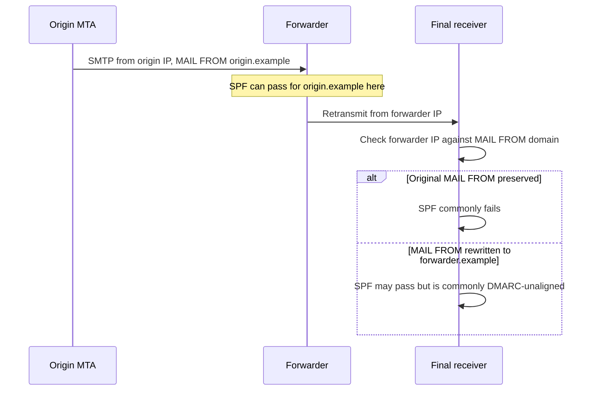

### DKIM Breaks When Signed Content Changes

DomainKeys Identified Mail (DKIM) signs a canonicalized body and selected headers. Intermediaries commonly make legitimate changes that exceed DKIM canonicalization tolerance:

- Prefixing the Subject with a list tag.
- Adding unsubscribe or legal text to the body.
- Rewriting links for click-time protection.
- Removing an attachment or unsafe MIME part.
- Converting HTML to text or re-encoding MIME content.
- Normalizing a malformed date or other signed header.
- Adding moderator comments.
- Replacing content after malware scanning.

Any changed body content normally changes the body hash. A changed covered header can break the header signature even when the body hash still matches. DKIM relaxed canonicalization tolerates limited whitespace and folding changes; it does not make semantic content rewrites safe.

### DMARC Fails When Both Aligned Paths Are Lost

DMARC passes when at least one SPF- or DKIM-authenticated identifier aligns with the Author Domain. Forwarding commonly removes the aligned SPF path. Message modification can remove the aligned DKIM path. The combination produces DMARC fail even for wanted mail.

$$
\begin{aligned}
\text{At intermediary arrival: } & \text{aligned SPF pass} \lor \text{aligned DKIM pass} \\ 
\text{At final arrival: } & \text{SPF route changed} \land \text{DKIM content changed} \\ 
\Rightarrow & \text{DMARC fail, possibly for legitimate indirect mail}
\end{aligned}
$$

| Intermediary action | SPF effect at final receiver | Origin DKIM effect | Likely DMARC risk |
|---|---|---|---|
| Transparent forwarding, original MAIL FROM | Usually fails for origin domain | Often survives | Low if aligned DKIM survives |
| Forwarding with rewritten MAIL FROM | May pass for intermediary | Often survives | Low if origin DKIM survives; SPF commonly unaligned |
| Mailing-list Subject prefix | Route changes | Fails if Subject was signed | High if no other aligned DKIM survives |
| Body footer | Route changes | Body hash usually fails | High |
| URL rewriting | Route changes | Body hash usually fails | High |
| Secondary MX forwarding without mutation | Primary sees secondary IP | Usually survives | Manageable with trusted internal architecture |
| Security gateway removes attachment | Route changes | Body hash fails | High unless receiver uses trustworthy prior evidence |
| No route or content change | No special impact | No special impact | ARC may add history but is not needed to preserve auth |

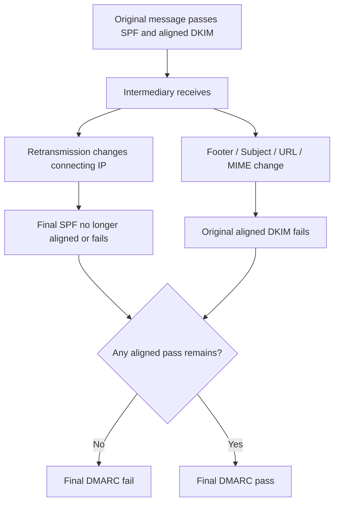

## What ARC Preserves and What It Does Not

ARC preserves a signed sequence of assertions and message states. It is best understood by defining its boundaries precisely.

| ARC can preserve or establish | ARC does not establish |
|---|---|
| Which domain signed each ARC Set | That the domain is honest or reputable |
| What authentication results a sealer asserted | That the assertion was computed correctly |
| Order of complete sets through participating handlers | A complete record of non-participating handlers |
| Integrity of ARC assertions under the ARC-Seals | The original message bytes before every modification |
| Integrity of message state covered by the latest required AMS | That all semantically important headers were signed |
| Evidence that a prior chain existed when a later set was sealed | That no unrecorded action occurred outside signed scope |
| A basis for local policy to consider indirect flow | A universal delivery mandate or DMARC pass |
| Responsibility linked to ARC signing domains | Identity of the human author |
| Cryptographic evidence useful in debugging | Proof that content is safe, wanted, or non-abusive |

ARC also does not "repair" an invalid origin DKIM signature. The final verifier should still report the current DKIM result accurately. ARC preserves evidence that an earlier participating handler claimed a different result before later handling.

## The Three Headers in an ARC Set

Every ARC Set contains exactly one AAR, one AMS, and one AS for its instance and signing algorithm. All three share the same `i=` value. Their different scopes are the heart of ARC.

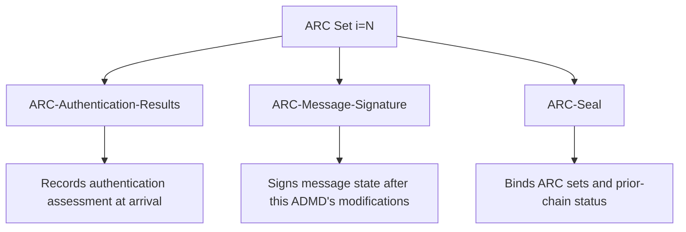

| Header | Main question answered | Rough analogy | Body covered? | ARC headers covered? |
|---|---|---|---:|---:|
| AAR | "What did this handler claim it observed?" | Inspection note | No signature of its own | Protected through AS |
| AMS | "What message state did this handler send onward?" | Package seal | Yes, by body hash | Must not include ARC fields in AMS `h=` |
| AS | "Was this set bound into the ordered chain?" | Signed journal binding | No | Yes, prescribed ARC set sequence |

### ARC-Authentication-Results: The Observation

`ARC-Authentication-Results` has syntax derived from `Authentication-Results`, with an added ARC instance tag. It records the message authentication assessment as processed by the participating ADMD at message arrival. It can include SPF, DKIM, DMARC, ARC, and other registered results available to that handler.

Synthetic example:

```text
ARC-Authentication-Results: i=1; lists.example;
    spf=pass smtp.mailfrom=sender.example;
    dkim=pass header.d=sender.example header.s=mail2026;
    dmarc=pass header.from=sender.example
```

Read it as: "The ARC participant identifying its authentication service as `lists.example` says that, when it received the message, SPF, DKIM, and DMARC had these results." The AAR is not an independent rerun at the final receiver. It is transported history.

A participating ADMD may have several internal `Authentication-Results` fields, but one AAR in its ARC Set carries the combined authentication-results payload for that ADMD. Ordinary downstream removal of `Authentication-Results` is one reason ARC defines a protected form.

Crucial nuance: RFC 8617 says the accuracy or syntax of the authentication-results payload does not itself determine ARC Chain validity. The signatures can validly protect a false or malformed statement. Chain validation answers integrity questions, not truth questions.

| AAR observation | What may safely be said | What may not be assumed |
|---|---|---|
| `dkim=pass header.d=sender.example` | The sealer asserted a passing signature for that domain | The final receiver independently verified that original signature |
| `dmarc=pass` | The sealer asserted DMARC pass at its arrival point | Current DMARC also passes after modification |
| `arc=pass` | The sealer asserted the prior ARC Chain validated | The current newly extended chain automatically validates |
| Unknown method token | Payload contains an unknown assertion | The entire cryptographic chain necessarily fails |
| Implausible or false-looking value | Assertion needs skepticism and corroboration | AS signature must be invalid |

### ARC-Message-Signature: The Outgoing Message State

`ARC-Message-Signature` is a DKIM-Signature derivative. It identifies the custodian and protects selected message headers plus a body hash. An ARC participant adds the AMS as the message exits its ADMD, after the ADMD has completed modifications. This ordering lets the next participant detect unexpected changes after that handoff.

Synthetic shape:

```text
ARC-Message-Signature: i=1; a=rsa-sha256; c=relaxed/relaxed;
    d=lists.example; s=arc2026;
    h=from:to:subject:date:message-id:dkim-signature;
    bh=<synthetic-body-hash>;
    b=<synthetic-signature>
```

The AMS differs from DKIM-Signature in several ARC-specific ways. Its `i=` is the ARC instance, not DKIM's Agent or User Identifier. No ARC AMS version tag is defined. ARC does not require a specific relationship between the AMS signing domain and the visible From domain. That is expected: the intermediary signs as itself, not as the original author.

AMS scope guidance matters:

- The sealer should complete message modifications before signing.
- It must not include `Authentication-Results` in the AMS signed-header list because downstream ADMDs commonly remove those fields under RFC 8601.
- It must not include AAR, AMS, or AS fields in the AMS `h=` list. ARC headers are protected through the ARC-Seal mechanism.
- It should include existing `DKIM-Signature` fields to help preserve evidence about message integrity.
- As with DKIM, only listed headers and the body scope are protected. Unsigned fields remain outside the AMS guarantee.

## 🔍 Plain-English deep-dive: AMS and ARC-Seal Protect Different Things

Think of AMS as a photograph and ARC-Seal as the numbered evidence-bag log. AMS says, "This is the message state I handed onward." ARC-Seal says, "This is my complete ARC entry, attached after the earlier numbered entries I validated or received."

If the body changes after the latest sealer, the latest AMS should fail. If someone removes or rearranges a prior ARC assertion while leaving the current message body alone, an ARC-Seal should fail. One signature cannot cleanly replace the other because they protect different surfaces.

| Mutation after sealing | Latest AMS | One or more AS checks | Diagnostic meaning |
|---|---|---|---|
| Change covered body content | Expected to fail | May also fail depending on altered ARC data? AS has no body hash, so body alone does not directly alter AS input | Message changed after latest handoff |
| Change a covered ordinary header | Expected to fail | AS input may remain unchanged | Covered message header changed |
| Change an AAR field | AMS does not sign ARC fields | Expected to fail | Authentication assertion was altered |
| Remove an earlier AS | AMS does not sign ARC fields | Expected to fail or structure fails first | Chain history was removed |
| Change `i=` or `cv=` in an AS | AMS does not sign ARC fields | Expected to fail or structure fails | Chain metadata was altered |
| Add an unsigned ordinary header | May still pass | May still pass | Passing signatures do not prove every field was protected |

### ARC-Seal: The Chain Binding

`ARC-Seal` is also derived from DKIM, but it does not sign the message body and has no `bh=` tag. It uses relaxed header canonicalization and protects a prescribed sequence of ARC fields. It contains the sealer's signing domain `d=`, selector `s=`, algorithm `a=`, signature `b=`, instance `i=`, and Chain Validation Status `cv=`.

Synthetic shape:

```text
ARC-Seal: i=2; a=rsa-sha256; d=gateway.example; s=arc2026;
    cv=pass; b=<synthetic-signature>
```

For a normally valid chain, the ARC-Seal at instance $N$ is calculated over ARC Set fields in increasing instance order, starting at 1 and including the new set. Within each set, fields are supplied in this order: AAR, AMS, AS. This creates the chain property. Altering a prior protected ARC field invalidates a later seal that bound it.

An AS does not use a DKIM-style `h=` tag. If an AS contains `h=`, RFC 8617 requires chain validation failure. The signing scope is defined by ARC rather than selected by that tag.

| AS tag | Meaning | Support check |
|---|---|---|
| `i=` | ARC instance number | Is it in 1-50 and part of a continuous sequence? |
| `cv=` | Sealer's status for the chain it received | Is `i=1` `none`; are later valid sets `pass`? |
| `d=` | ARC sealing domain | Which organization or service controls this identity? |
| `s=` | DNS selector | Does the corresponding public-key record resolve at validation time? |
| `a=` | Signing algorithm | Is it supported and acceptable under implementation policy? |
| `t=` | Optional signature timestamp | Is it plausible, and what does it contribute to investigation? |
| `b=` | Cryptographic signature | Does approved verification succeed over prescribed ARC fields? |

## Instance Numbers and Complete Sets

The `i=` tag groups ARC headers and establishes order. Values begin at 1 and increase by exactly one for each new set. RFC 8617 permits values from 1 through 50. A valid chain has one complete set at every value from 1 through the highest discovered value $N$.

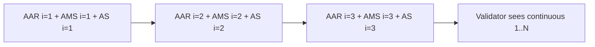

| Header inventory | Structural result | Reason |
|---|---|---|
| Complete sets 1, 2, 3 | Continue validation | Continuous and complete so far |
| Complete sets 1 and 3 | Fail | Missing instance 2 |
| Two AAR fields at `i=2` | Fail | Duplicate member of one set |
| AAR and AS at `i=1`, no AMS | Fail | Incomplete set |
| `i=0` | Fail | Outside allowed range |
| 51 ARC sets | Fail | Exceeds the protocol maximum |
| No ARC fields | `none` | There is no chain to validate |
| Mixed fields that cannot be grouped uniquely | Fail | No deterministic valid set structure |

Header display order can be visually confusing because mail handlers prepend fields, and interfaces may fold or reorder what a human sees. Do not infer sets merely from adjacency. Parse each field's `i=` and type, group by instance, then apply the ordering rules.

## Chain Validation Status: `none`, `pass`, and `fail`

`cv=` communicates the status of the ARC Chain presented to a sealer. It does not summarize SPF, DKIM, DMARC, malware scanning, or final disposition.

| Value | Meaning in ARC | Correct placement in a normally valid chain | Common misread |
|---|---|---|---|
| `none` | No prior ARC Chain existed on arrival | ARC-Seal at `i=1` | "Authentication was not performed" |
| `pass` | Prior ARC Chain validation succeeded | ARC-Seals at `i>1` | "The message is safe" |
| `fail` | Prior ARC Chain validation failed | New set may record failure, but the chain is invalid and cannot be continued as valid | "Only one earlier SPF or DKIM check failed" |

The first sealer must use `cv=none` because there is no prior chain to validate. A later sealer extending a valid chain uses `cv=pass`. If a sealer detects an invalid prior chain and chooses to attach a set with `cv=fail`, it signs only its newly created set under the special failure rule because no deterministic valid prior chain exists to bind. Once broken, the original chain cannot be re-established or continued as valid.

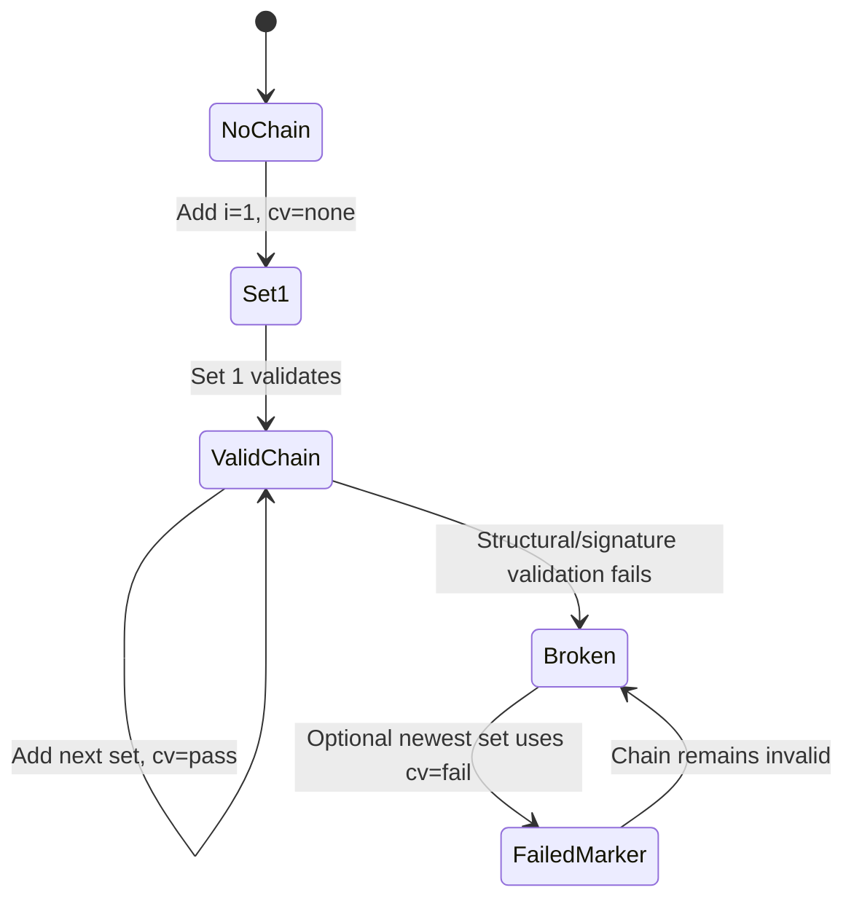

## RFC 8617 Validation Algorithm

Use a layered algorithm. Stop at the first decisive failure, but record enough evidence to identify the failing layer.

### Stage 1: Collect and Bound

Collect all ARC Sets. If there are no ARC fields, the Chain Validation Status is `none`. That is absence, not failure. If more than 50 sets exist, status is `fail`. Let $N$ be the highest discovered instance.

### Stage 2: Check the Highest `cv=`

If the ARC-Seal at the highest instance reports `cv=fail`, validation returns `fail`. The newest sealer is explicitly saying it received an invalid chain.

### Stage 3: Validate Structure

Before DNS or cryptography, confirm:

1. Every instance has exactly one AAR, one AMS, and one AS.
2. Instances form a continuous sequence $1,2,\ldots,N$ with no gap or repetition.
3. No ARC-Seal in the candidate valid chain has `cv=fail`.
4. `AS[1]` has `cv=none`.
5. Every `AS[i]` for $i>1$ has `cv=pass`.

Any failure produces `fail`.

### Stage 4: Validate the Latest AMS

The AMS with the greatest instance value must validate. It protects the message state leaving the most recent ARC sealer. If it fails, chain status is `fail`.

### Stage 5: Optionally Check Earlier AMS Fields

The validator may evaluate earlier AMS fields from $N-1$ down to 1 to calculate `oldest-pass`. A failure of an older AMS does **not** by itself invalidate the ARC Chain. This is intentional: an intermediary may legitimately modify the message after an older AMS was created, then sign the new state with its own AMS and bind the history with a new ARC-Seal.

If all AMS fields pass, `oldest-pass=0`. If AMS instance $M$ is the first failure encountered while walking backward, `oldest-pass=M+1`, the oldest instance in the newest consecutive run of passing AMS fields.

### Stage 6: Validate Every ARC-Seal

Validate each AS from $N$ down through 1 using its DNS key and prescribed ARC signing input. If any AS fails, chain status is `fail`.

### Stage 7: Return `pass`

Only after the required checks succeed does the Chain Validation Status become `pass`. The receiver should record this in its trusted `Authentication-Results` context, potentially with properties such as the remote SMTP IP and `header.oldest-pass` when available.

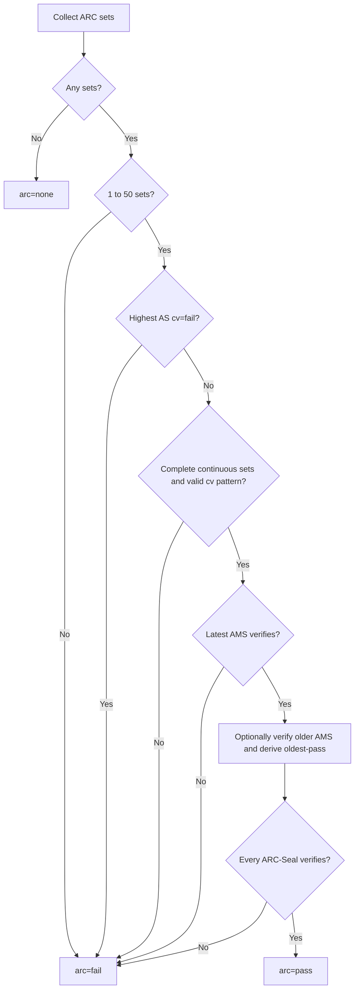

| Validation layer | Input | Failure example | Output consequence |
|---|---|---|---|
| Presence/bounds | ARC field inventory | 51 sets | `fail`; no expensive full walk needed |
| Structure | Type and `i=` grouping | Missing AAR at `i=2` | `fail` |
| `cv` consistency | Every AS | `i=1; cv=pass` | `fail` |
| Latest message integrity | AMS at $N$ | Body changed after latest sealer | `fail` |
| Historical message integrity | Earlier AMS | Footer added after `i=1` | May affect `oldest-pass`, not chain status by itself |
| Chain binding | Every AS | Prior AAR altered | `fail` |
| Trust assessment | Sealer identities plus local policy | Unknown or abusive sealer | Chain may pass; evidence may receive no favorable weight |
| Final handling | All mail signals | Malware or phishing content | Reject/quarantine possible despite ARC pass |

## 🔍 Plain-English deep-dive: Why an Older AMS May Fail While ARC Still Passes

Suppose a discussion list receives an original message and creates ARC Set 1. A hosted gateway later adds a safety banner. That banner changes the body, so AMS 1 no longer matches the current message. The gateway creates AMS 2 over the new body and an ARC-Seal that binds both sets. At the final receiver:

- AMS 2 must pass because it represents the latest sealer's outgoing message state.
- AMS 1 may fail because the message legitimately changed after instance 1.
- AS 1 and AS 2 must still validate, showing that the historical assertions and ordered chain were not silently rewritten.
- Optional `oldest-pass` can indicate that the consecutive currently valid AMS run starts at instance 2.

This is not a loophole that permits arbitrary post-sealing changes. A change **after the latest** AMS causes required validation failure. The exception for older AMS fields reflects explicitly recorded intermediary handling.

```mermaid
sequenceDiagram
    participant L as List sealer i=1
    participant G as Gateway sealer i=2
    participant R as Receiver
    L->>G: Message + ARC Set 1, AMS1 valid at handoff
    G->>G: Add safety banner
    Note over G: AMS1 no longer matches current body
    G->>G: Validate prior chain and add Set 2
    G->>R: Modified message + Sets 1 and 2
    R->>R: Latest AMS2 passes
    R->>R: Optional AMS1 check fails
    R->>R: AS2 and AS1 pass
    R->>R: Chain can pass; oldest-pass indicates newer valid run
```

## Sealing Workflow

An ARC-capable handler commonly acts as a Validator on receipt and a Sealer before retransmission.

1. Receive the message and perform normal SPF, DKIM, DMARC, ARC, and other applicable checks at the correct boundary.
2. Establish the result of validating any existing ARC Chain.
3. Apply planned message modifications, including any intermediary DKIM signature, before ARC sealing.
4. Choose the next instance: 1 if no chain exists, otherwise highest instance plus one.
5. Add one AAR containing the ADMD's combined assessment.
6. Add one AMS over the outgoing message state.
7. Add one AS using `cv=none`, `pass`, or the failure procedure as applicable.
8. Transmit the message onward.

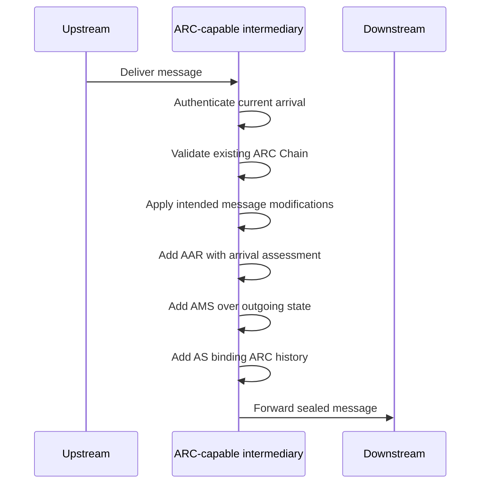

Sealing broadly can be safe in the protocol sense: correctly adding a set does not invalidate a valid existing chain. It does not mean every participant should automatically receive favorable treatment. A sealer assumes visible responsibility and creates DNS, header-size, key-management, monitoring, and abuse-handling obligations.

## Validation, Trust, and Disposition Are Separate Decisions

This separation is the most important operational habit in the lesson.

### Decision 1: Did ARC Validate?

This is a protocol question. Use a standards-conforming parser, DNS key retrieval, canonicalization, and signature verification. The result is `none`, `pass`, or `fail`.

### Decision 2: Is the Sealer Trusted for This Use?

This is a local policy and reputation question. Possible evidence includes:

- A documented contractual gateway relationship.
- Observed history of correct authentication assertions.
- Stable sealing domains and selectors.
- Known mailing-list or forwarding behavior.
- Abuse rates, compromise history, and response quality.
- Scope: trusted for a specific customer route is not the same as trusted globally.
- Whether the sealer authenticated mail before making destructive changes.
- Whether chain evidence is consistent with Received fields, logs, and known architecture.

ARC itself provides no trust list and no transitive trust rule. Trusting sealer A does not automatically mean trusting every earlier sealer A chose to include. A receiver can define its own bounded interpretation, but that interpretation must not be presented as a protocol guarantee.

### Decision 3: How Should the Message Be Handled?

Final disposition remains local. Even a valid chain from a trusted sealer is one input beside current authentication, content analysis, sender and sealer reputation, malware findings, recipient expectations, rate signals, and policy. Conversely, current DMARC fail is not by itself proof that wanted indirect mail should be rejected.

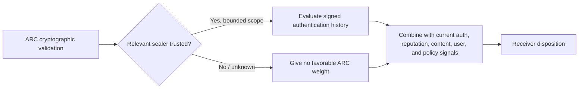

| ARC status | Sealer trust | Historical claim | Safe operational posture |
|---|---|---|---|
| none | N/A | None | Evaluate ordinary evidence; do not penalize merely for no ARC |
| fail | Any | Unusable as a valid ARC Chain | Treat as no valid ARC Chain; investigate breakage if relevant |
| pass | Unknown | Intact claim | Do not grant favorable override solely from validity |
| pass | Known but out of scope | Intact claim | Keep trust bounded; do not generalize |
| pass | Trusted for path | Earlier aligned authentication | May inform local handling; retain other safety checks |
| pass | Trusted for path | Earlier authentication also failed | ARC does not create a reason to override that failure |
| pass | Trusted for path | Claim conflicts with logs | Investigate compromise, bug, or path mismatch |

## Authentication-Results Trust Boundaries

Ordinary `Authentication-Results` is a machine-readable receipt produced inside an ADMD. The header has no inherent integrity protection. A sender can write a fake line such as `Authentication-Results: receiver.example; dkim=pass` unless the receiving boundary removes forged claims.

RFC 8601 therefore requires a conforming boundary to remove a field that claims its own trusted authentication service identifier but did not arrive directly from a trusted internal source. A simple policy may remove all external `Authentication-Results`; a more deliberate policy may preserve specific trusted external services. Consumers must recognize the expected `authserv-id` and trust path.

ARC is designed to transport authentication assertions across administrative boundaries with signatures. That improves integrity and attribution, but it still does not remove the need to trust the signer.

| Field | Integrity model | Intended trust scope | Safe consumption rule |
|---|---|---|---|
| `Authentication-Results` | Usually no self-contained signature | Inside configured trust boundary | Accept only from expected producer/path; scrub forged local claims |
| AAR alone | No independent signature | Part of a complete ARC Set | Do not detach from AS validation and sealer identity |
| Complete valid ARC Chain | DKIM-derived signatures protect ARC history and latest message state | Across participating ADMDs | Validate, identify sealers, then apply local trust |
| Header copied into a ticket | No longer live protocol evidence by itself | Human support context | Preserve raw source and provenance; label copied text |

## 🔍 Plain-English deep-dive: `Authentication-Results` Is a Receipt, Not a Banknote

A receipt is useful when you know which register printed it and how it reached you. Anyone with a text editor can type words that look like a receipt. An ordinary `Authentication-Results` header is similar: its value comes from the trusted internal route, not from magical words such as `spf=pass`.

ARC puts the receipt into a signed, numbered handoff record. That lets a downstream system detect alteration and identify a signing domain. The downstream system still asks whether that domain is a merchant it trusts. Signature validity upgrades **provenance**, not **truth**.

## Reading ARC in Raw Headers

Use a repeatable method instead of reading top to bottom and guessing.

### Step 1: Preserve the Original Source

Collect the full raw message or approved message trace. Screenshots often hide folding, truncate `b=` values, normalize whitespace, or omit Received and authentication fields. Work only with authorized data, follow retention rules, and redact personal content from tickets where possible.

### Step 2: Record Current Receiver Results

Find the receiver's trusted `Authentication-Results` field and capture current SPF, DKIM, DMARC, and ARC results. Confirm the `authserv-id` belongs to the expected trust boundary. Do not treat an arbitrary external line as the receiver's verdict.

### Step 3: Inventory and Group ARC Fields

Create one row per instance. Record whether AAR, AMS, and AS are each present exactly once. Extract sealing domain, selector, algorithm, `cv`, and AAR claims. Do not paste or expose private keys; public DNS key material is not a secret, but ticket collection should still be minimal.

### Step 4: Check Structure Before Signatures

Look for count, range, gaps, duplicates, invalid `cv` patterns, prohibited tags, and malformed fields. Structural failure is often cheaper and clearer than starting with DNS.

### Step 5: Use an Approved Verifier

Manually reading `b=` cannot establish signature validity. Record the verifier name/version when operationally relevant, DNS resolver context, timestamp, and per-signature output. Distinguish DNS not found, timeout, unsupported algorithm, malformed key, body-hash mismatch, and signature mismatch.

### Step 6: Evaluate Trust and Path Consistency

Compare sealing domains with known architecture, Received hops, timestamps, and provider documentation. A mismatch can indicate forwarded mail, incomplete traces, configuration drift, or abuse. Do not assume the left-most or visually nearest domain is trusted.

### Step 7: State the Smallest Defensible Conclusion

Prefer: "The chain validates and Set 1 from the documented list service asserts aligned DKIM passed before modification." Avoid: "ARC proves the sender is legitimate."

## Common Failure Modes

| Failure mode | Observable evidence | ARC layer | Likely next check |
|---|---|---|---|
| No ARC participation | No ARC fields; `arc=none` | Presence | Determine whether indirect flow can be diagnosed from DKIM, Received, logs, and known path |
| Missing set member | AAR or AMS or AS absent for one `i=` | Structure | Identify stripping, truncation, malformed generation, or header limits |
| Instance gap | Sets 1 and 3, no 2 | Structure | Check intermediary/header transformation and original source completeness |
| Duplicate member | Two AMS fields with same `i=` and algorithm | Structure | Check duplicate insertion, replayed headers, or parser display issue |
| Invalid first status | `i=1; cv=pass` | Structure/semantics | Sealer implementation or forged/mutated ARC field |
| Invalid later status | `i=2; cv=none` | Structure/semantics | Sealer failed to acknowledge prior chain |
| Explicit failed chain | Highest AS has `cv=fail` | Chain status | Find the earlier break; do not treat new set as repaired history |
| Latest AMS body hash mismatch | Verifier reports body hash failure at $N$ | Message integrity | Mutation occurred after latest sealer or message source was altered in collection |
| Latest AMS header signature mismatch | Body hash may pass; signature fails | Message integrity | Check covered headers, duplicates, reordering, and canonicalization |
| Older AMS fails, seals pass | `oldest-pass` greater than 0 | Historical message state | Look for expected modifications between instances; chain may still pass |
| AS signature failure | One seal does not verify | Chain binding | Check altered/missing ARC fields, key record, canonicalization, and DNS |
| Key not found | Selector lookup returns no usable key | Cryptographic dependency | Confirm exact `s._domainkey.d`, timestamp, TTL, rotation, and authoritative DNS |
| DNS transient failure | Timeout/SERVFAIL | Cryptographic dependency | Record transient state; RFC 8617 treats ARC validation errors as permanent for this chain evaluation |
| Unsupported algorithm | Verifier rejects `a=` | Capability/policy | Compare protocol allowance, software support, and security policy |
| Oversized chain/header block | Many sets or MTA header-size error | Resource/interop | Check 50-set bound, loops, platform limits, and safe rejection evidence |
| Forged ordinary auth result | External line claims receiver `authserv-id` | Trust boundary | Confirm border scrubbing and trusted-hop configuration |
| Valid chain from attacker domain | Signatures pass for unknown sealer | Trust | Give no automatic favorable weight; continue anti-abuse analysis |
| Replay of intact message and chain | Identical signed content sent broadly | Abuse/replay | Correlate recipient scope, volume, timestamps, reputation, and content |

### Structural Failure versus Signature Failure

These categories should not be blurred. A missing `i=2` set is a deterministic structural failure. A complete set with a bad signature is a cryptographic failure. Both yield `arc=fail`, but remediation ownership differs.

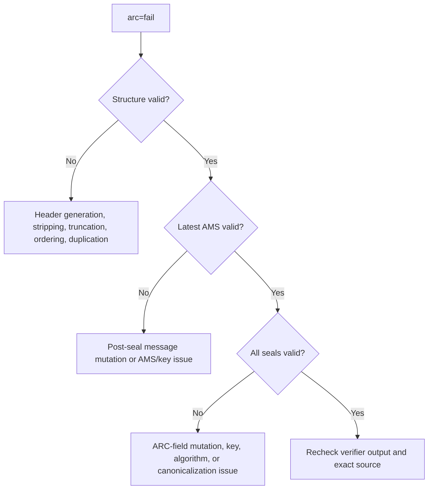

### DNS and Key Rotation

AMS and AS signatures refer to selectors under their signing domains, using DKIM-style DNS key discovery. A later lookup can fail if a selector is removed too quickly after rotation. That does not prove the message was forged; it means the verifier lacks the key needed to establish the signature now. Preserve the exact query name, DNS response, resolver, and time.

ARC chains can require up to roughly $2N$ DNS key queries because each set may have an AMS and AS key lookup. Caching helps, but long chains increase latency and resource use. Implementations need bounds, robust parsing, and resistance to attacker-constructed chains that induce DNS work.

### Header-Size and Loop Risks

Each intermediary adds three potentially long headers. A looping message can grow rapidly. RFC 8617 caps sets at 50, but practical MTA header limits may be lower. A delivery failure caused by header size is not the same as a cryptographic invalidity. Record the exact SMTP status and platform limit before assigning root cause.

### Replay and Abuse

ARC inherits replay concerns from DKIM. An attacker may resend an intact message and valid chain without changing signed content. Signatures can remain valid while the delivery context, recipient population, volume, or intent becomes abusive. Rate, reputation, recipient, content, and campaign signals remain necessary.

## Misleading Shortcuts to Avoid

| Shortcut | Why it fails | Better statement |
|---|---|---|
| "ARC fixes SPF." | SPF still evaluates the current SMTP hop | "ARC can carry an earlier SPF assessment as signed history." |
| "ARC fixes DKIM." | Broken origin DKIM remains broken at the final receiver | "ARC may show where origin DKIM was still valid before modification." |
| "ARC makes DMARC pass." | DMARC result remains based on current aligned SPF/DKIM | "Trusted ARC evidence may influence local handling of DMARC-failing indirect mail." |
| "`cv=pass` means ARC passed here." | It is the sealer's assertion about the prior chain | "Validate the complete current chain independently." |
| "All AMS signatures must pass." | Only latest AMS is required for chain validity; older checks are optional history | "Older AMS failures can identify modification boundaries." |
| "AAR is true because AS verifies." | Signature proves provenance/integrity, not accuracy | "The identified sealer made an intact assertion." |
| "Known brand in `d=` is enough." | Domain lookalikes, delegated infrastructure, and scope matter | "Confirm exact signing domain, DNS control, and local trust evidence." |
| "No ARC means suspicious." | ARC is optional and not universally deployed | "No ARC means no ARC history is available." |
| "ARC fail means reject." | RFC says failed ARC is treated like no ARC Chain for this purpose | "Use ordinary handling evidence and investigate breakage separately." |
| "One global ARC allowlist solves false positives." | Trust is contextual and attackers target broad bypasses | "Use narrow, monitored, path-specific policy with other controls." |

## Troubleshooting Decision Tree

Use this workflow for a report such as "forwarded messages fail DMARC" or "ARC pass did not prevent quarantine."

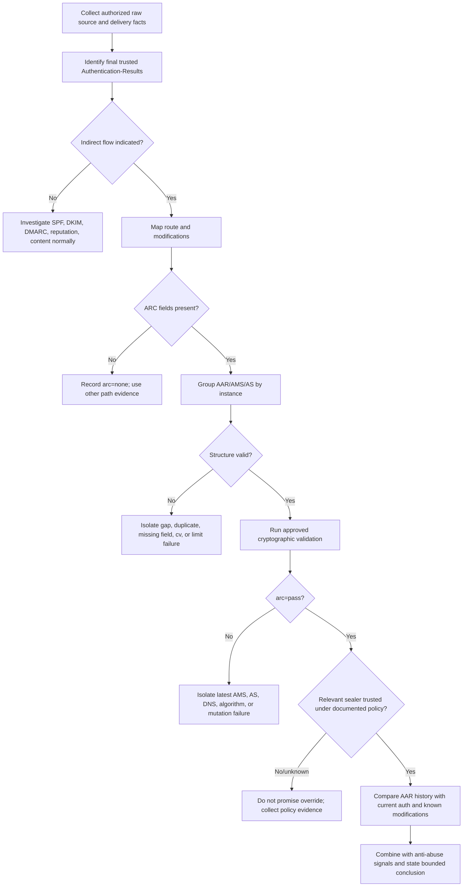

### Question Set for Triage

| Question | Why ask it | Evidence to request |
|---|---|---|
| What exact symptom occurred? | Delivery, spam placement, warning, and authentication result are different | SMTP response, mailbox location, UI warning, timestamp |
| Which receiver produced the result? | Trust and disposition are receiver-specific | Trusted `authserv-id`, tenant/provider, recipient domain |
| Was the message forwarded or reposted? | Establishes indirect-flow hypothesis | Received chain, alias/list/gateway configuration |
| What changed between hops? | Explains DKIM breakage and AMS boundaries | Subject/body diff, gateway action logs, list configuration |
| Does the final receiver report `arc=none`, `pass`, or `fail`? | Routes analysis | Trusted `Authentication-Results` line |
| Are ARC sets complete and continuous? | Cheap discriminating check | Parsed instance inventory |
| Which exact signature failed? | Avoids "DKIM-like signature failed" ambiguity | Per-AMS and per-AS verifier output |
| Which sealers are expected? | Connects protocol identity to architecture | Approved mail-flow diagram and provider documentation |
| Is the sealer trusted for this path? | ARC validity alone does not grant override | Documented local policy or escalation owner |
| Are non-authentication signals negative? | Prevents unsafe bypass | Malware, URL, content, reputation, rate, recipient signals |

### Evidence Quality Ladder

1. **Strong:** Original source, trusted receiver result, per-signature verifier output, timestamped DNS, documented architecture, and policy owner confirmation.
2. **Useful:** Raw headers plus consistent route and ARC structure, but no receiver policy evidence.
3. **Weak:** Screenshot of selected headers or a copied `arc=pass` line without `authserv-id` and provenance.
4. **Unsafe:** A statement that a message is legitimate because the sender said so or because a domain name looks familiar.

## Safe Lab: Forwarding Failure and ARC-Chain Analysis

### Lab Objective

Reconstruct a synthetic two-intermediary path, distinguish current authentication from ARC history, identify four different failure classes, and write a bounded support conclusion. This lab does not send email, query live DNS, touch a production tenant, or use real customer data.

### Safety Rules

- Use only reserved domains such as `.example` and documentation IP ranges such as `192.0.2.0/24` and `2001:db8::/32`.
- Do not paste customer messages, personal addresses, credentials, tokens, private keys, or proprietary headers into public tools.
- Do not claim that placeholder `b=` and `bh=` values are cryptographically valid.
- Treat the supplied verifier outcomes as synthetic observations for reasoning practice.
- Make no live DNS, policy, allowlist, mail-flow, or security-control change.
- Keep final recommendations reversible and scoped to evidence collection or documented policy review.

### Prerequisites

1. An authorized, non-production local study folder and a Markdown or spreadsheet editor.
2. This Part plus RFC 8617 and RFC 8601 for checking ARC set structure, validation, result transport, and trust boundaries.
3. Only the supplied abbreviated ARC fields and synthetic verifier outcomes; no DNS query, mail submission, provider tenant, private key, or public analyzer is required.
4. A worksheet that keeps final authentication, each historical AAR claim, cryptographic chain status, sealer trust, and disposition separate.

### Scenario

`sender.example` sends a message to `team@lists.example`. At list arrival, SPF passes for `sender.example`, the origin DKIM signature with `d=sender.example` passes, and DMARC passes. The list adds `[Team]` to the Subject and an unsubscribe footer, then creates ARC Set 1. The message travels through `gateway.example`, which validates the chain, rewrites a URL for safety, and creates ARC Set 2. The final receiver at `receiver.example` observes:

- SPF pass for `gateway.example`, unaligned with `sender.example`.
- Origin DKIM fail because content changed.
- List DKIM pass for `lists.example`, unaligned with `sender.example`.
- DMARC fail for `sender.example`.
- ARC pass for the two-set chain.
- Optional prior-AMS analysis: AMS 2 passes; AMS 1 fails after the gateway URL rewrite; `oldest-pass=2`.

The synthetic ARC fields are abbreviated. Placeholder signatures are intentionally non-verifiable:

```text
Authentication-Results: receiver.example;
    spf=pass smtp.mailfrom=gateway.example;
    dkim=fail header.d=sender.example header.s=mail2026;
    dkim=pass header.d=lists.example header.s=list2026;
    dmarc=fail header.from=sender.example;
    arc=pass header.oldest-pass=2

ARC-Seal: i=2; a=rsa-sha256; d=gateway.example; s=arc2026;
    cv=pass; b=<set-2-placeholder>
ARC-Message-Signature: i=2; a=rsa-sha256; c=relaxed/relaxed;
    d=gateway.example; s=arc2026;
    h=from:to:subject:date:message-id:dkim-signature;
    bh=<set-2-body-placeholder>; b=<set-2-ams-placeholder>
ARC-Authentication-Results: i=2; gateway.example;
    spf=pass smtp.mailfrom=lists.example;
    dkim=fail header.d=sender.example;
    dmarc=fail header.from=sender.example;
    arc=pass

ARC-Seal: i=1; a=rsa-sha256; d=lists.example; s=arc2026;
    cv=none; b=<set-1-placeholder>
ARC-Message-Signature: i=1; a=rsa-sha256; c=relaxed/relaxed;
    d=lists.example; s=arc2026;
    h=from:to:subject:date:message-id:dkim-signature;
    bh=<set-1-body-placeholder>; b=<set-1-ams-placeholder>
ARC-Authentication-Results: i=1; lists.example;
    spf=pass smtp.mailfrom=sender.example;
    dkim=pass header.d=sender.example header.s=mail2026;
    dmarc=pass header.from=sender.example

From: Alex <alex@sender.example>
To: team@lists.example
Subject: [Team] Synthetic maintenance window
Date: Tue, 12 May 2026 10:00:00 +0000
Message-ID: <synthetic-028@sender.example>
```

### Exercise 1: Build the Instance Inventory

Do not begin with trust or delivery. Group fields by `i=`.

| Instance | AAR present once? | AMS present once? | AS present once? | AAR authserv-id | AMS `d=` / `s=` | AS `d=` / `s=` | `cv=` |
|---:|---:|---:|---:|---|---|---|---|
| 1 | Yes | Yes | Yes | `lists.example` | `lists.example` / `arc2026` | `lists.example` / `arc2026` | `none` |
| 2 | Yes | Yes | Yes | `gateway.example` | `gateway.example` / `arc2026` | `gateway.example` / `arc2026` | `pass` |

Expected structural conclusion: two complete sets form a continuous sequence 1..2; the `cv` pattern is structurally consistent with a candidate valid chain. This does not prove either signature.

### Exercise 2: Separate Current Results from Historical Claims

| Layer | SPF | DKIM | DMARC | ARC |
|---|---|---|---|---|
| Final receiver observation | Pass for `gateway.example`, unaligned | Origin fail; list pass but unaligned | Fail for `sender.example` | Pass; `oldest-pass=2` |
| Set 2 AAR claim at gateway arrival | Pass for list route | Origin fail | Fail | Prior chain pass |
| Set 1 AAR claim at list arrival | Pass for `sender.example` | Pass for `sender.example` | Pass | No prior chain |

Expected conclusion: the message's current DMARC result is fail. The valid ARC history, if the relevant sealers are trusted, provides evidence that the list observed aligned origin authentication before list and gateway modifications. Do not overwrite the final DMARC result with pass.

### Exercise 3: Explain `oldest-pass=2`

The final receiver requires AMS 2 to pass. Its optional backward check finds AMS 1 no longer matches because the gateway rewrote a URL after Set 1 was created. Therefore, the oldest instance in the newest consecutive run of passing AMS fields is 2. The ARC-Seals can still bind the history, so this older AMS failure does not by itself make chain validation fail.

### Exercise 4: Apply the Trust Gate

Evaluate three hypothetical policies without changing the chain result:

| Local trust evidence | ARC validity | Favorable use of Set 1 history? | Reason |
|---|---|---:|---|
| `gateway.example` is the receiver's contracted inbound gateway; `lists.example` is a documented list route | pass | Possibly, subject to bounded policy and other signals | Identity, path, and purpose match approved architecture |
| `gateway.example` is known, but there is no evidence about `lists.example` | pass | Limited or none for the original claim | Trust in the latest sealer does not automatically prove all earlier parties are trusted |
| Both domains are unknown lookalikes | pass | No favorable weight solely from ARC | Cryptographic validity is not reputation |

### Exercise 5: Mutate One Variable at a Time

These are paper mutations. Do not alter real messages.

#### Mutation A: Instance Gap

Change every Set 2 `i=2` to `i=3`, leaving no instance 2.

Expected result: structural `arc=fail` before signature analysis because instances are not continuous from 1 through $N$.

#### Mutation B: Wrong First `cv`

Change `ARC-Seal: i=1; ... cv=none` to `cv=pass`.

Expected result: structural `arc=fail`. Instance 1 must describe no prior chain with `cv=none`.

#### Mutation C: Alter Latest Protected Body

Append a line after gateway sealing without creating a new ARC Set.

Expected result: latest AMS body-hash/signature validation fails, so the chain fails. This differs from the permitted historical situation where the gateway changed the body **before** creating AMS 2.

#### Mutation D: Alter Set 1 AAR

Change Set 1's signed assertion from `dmarc=pass` to `dmarc=fail` after Set 2 is sealed.

Expected result: one or more ARC-Seal checks fail because the chain binding protected that AAR. AMS does not sign ARC headers, so the failure belongs to the AS/chain-binding layer.

#### Mutation E: Unknown Sealer

Keep every synthetic validation result passing but replace `gateway.example` with `unknown-relay.example` and assume no trust evidence.

Expected result: cryptographic status can remain `arc=pass`, while favorable policy weight becomes unknown or none. This mutation proves validity and trust are independent.

### Exercise 6: Write the Support Conclusion

A strong answer:

> **[Observation]** The final trusted authentication result reports SPF pass for an unaligned gateway identity, failed origin DKIM, unaligned list DKIM pass, DMARC fail for `sender.example`, and ARC pass with `oldest-pass=2`. The message has two complete, continuous ARC sets with the expected `cv=none` then `cv=pass` pattern. **[Observation]** Set 1 from `lists.example` asserts that aligned SPF, DKIM, and DMARC passed before list handling. **[Inference]** The list Subject/footer changes and later gateway URL rewrite explain the progression from origin authentication pass to final DKIM and DMARC failure; the AMS history is consistent with modification between instances 1 and 2. **[Private unknown]** The receiver's trust weighting for these sealers has not been established. **Next action:** confirm that the exact sealing domains and path are covered by documented local trust policy, then evaluate the message with ordinary reputation and content controls. Do not report DMARC as pass and do not create a broad ARC bypass.

A weak answer:

> "ARC passed, so the message is legitimate and DMARC should be ignored."

The weak answer discards current DMARC truth, sealer trust, scope, and all non-authentication security signals.

### Lab Completion Worksheet

| Check | Recorded answer |
|---|---|
| Final trusted `authserv-id` | `receiver.example` |
| Final SPF/identity/alignment | Pass for `gateway.example`; unaligned with `sender.example` |
| Final origin DKIM | Fail after modification |
| Final other DKIM | Pass for `lists.example`; unaligned |
| Final DMARC | Fail |
| ARC set count | 2 |
| Structural result | Candidate valid: complete 1..2, correct `cv` pattern |
| Required latest AMS | Synthetic pass |
| Older AMS finding | Instance 1 synthetic fail after later modification |
| `oldest-pass` | 2 |
| All ARC-Seals | Synthetic pass |
| ARC Chain result | Pass |
| Trusted sealer status | Must be established from local policy; not encoded in sample |
| Safe conclusion | Intact history may inform local policy; it does not create DMARC pass or prove safety |

### Expected evidence

The lab should produce an inspectable two-instance ARC inventory, current-versus-historical authentication table, `oldest-pass` explanation, three-case trust-gate analysis, five mutation outcomes, completed lab worksheet, route/modification timeline, and bounded support conclusion. Every conclusion must point to supplied synthetic fields or an explicitly labeled synthetic verifier result.

### Cleanup and privacy

- Retain only the abbreviated synthetic ARC/header fixture and derived worksheets.
- Delete or redact any accidentally pasted customer message, personal address, message content, route/IP data, selector, token, private key, tenant ID, or other personally identifiable information (PII); delete the artifact if reliable redaction is not possible.
- Never place real headers in public analyzers or create a broad allowlist, trust policy, DNS record, or mail-flow change from this exercise.
- Confirm before retention or sharing that no live DNS, tenant, mail, policy, security-control, or customer activity occurred and that placeholder signatures are not represented as valid.

### Validation rubric

| Dimension | Fail | Developing | Pass |
|---|---|---|---|
| ARC inventory | Mixes sets or omits field counts | Groups most fields by instance | Confirms continuous 1..N sets, one AAR/AMS/AS each, and correct `cv` pattern |
| Current versus history | Rewrites final DMARC from AAR history | Notes both result layers | Separately records final receiver results and each attributed historical claim |
| Validation reasoning | Treats placeholders as cryptographic proof | Uses supplied results with gaps | Explains latest AMS, older AMS/`oldest-pass`, every seal, and mutation-specific failures |
| Trust gate | Equates `arc=pass` with legitimate/safe | Mentions reputation | Requires documented sealer identity, path, purpose, and independent security signals |
| Support conclusion | Recommends global bypass | Gives a cautious but vague next step | States observation, inference, private unknown, owner, and smallest reversible action |
| Safety and honesty | Uses real headers/live policy or overclaims | Synthetic worksheet with incomplete handling | No live activity/secrets, bounded placeholders, and explicit learned/lab scope |

## Support Runbook

### Intake

1. Record the sender, recipient domain, UTC timestamp, message identifier, and exact reported symptom using approved data-handling practices.
2. Ask for the original raw source or approved trace, not only a screenshot.
3. Identify any known forwarding address, list, gateway, or rerouting rule.
4. Confirm whether the request concerns authentication diagnosis, disposition, or both.

### Technical Analysis

1. Locate the final receiver's trusted `Authentication-Results` using its expected `authserv-id` and path.
2. Record current SPF, every relevant DKIM result, DMARC, ARC, and policy/disposition evidence separately.
3. Map Received hops cautiously; timestamps and hostnames are evidence but can be incomplete or malformed.
4. Inventory ARC fields by type and `i=`.
5. Check 1..$N$ continuity, exactly one field of each type per set, the 50-set maximum, and `cv` consistency.
6. Run the approved validator and capture latest AMS, optional older AMS/`oldest-pass`, every AS, DNS, algorithm, and parser outcomes.
7. Compare each AAR claim with message state and known modifications at that point.
8. Identify the exact sealing domains and selectors; do not normalize lookalike domains by eye.
9. Establish sealer trust only from documented provider policy, learned architecture, or the owning policy team.
10. Combine ARC with content, reputation, rate, malware, and recipient context before proposing handling.

### Remediation Routing

| Finding | Likely owner | Safe action |
|---|---|---|
| Missing/duplicate ARC fields produced by intermediary | Intermediary mail engineering | Provide sanitized instance inventory and timestamps |
| Latest AMS fails after a downstream mutation | Downstream handler owner | Identify modification after sealing; change ordering or add a new valid set if product design supports it |
| Old selector removed prematurely | Sealer DNS/key owner | Review retention and rotation process; avoid inventing a key or republishing without ownership approval |
| AS fails due to altered ARC header | Handler that changed/stripped headers | Preserve ARC fields and investigate parser/header limits |
| Valid chain, unknown sealer trust | Receiver policy/reputation owner | Request policy assessment; do not self-authorize a bypass |
| Valid trusted history, false positive persists | Detection/policy owner | Supply bounded evidence and other signals for rule review |
| Malicious content with ARC pass | Abuse/security owner | Continue normal enforcement; ARC pass is not exculpatory |
| No ARC on indirect flow | Intermediary capability owner or no action | Use other evidence; do not require ARC unless architecture and policy call for it |

### Customer Communication Pattern

Use four short blocks:

1. **Observed:** Current receiver results and exact ARC validation.
2. **Historical:** What specific AAR set claims, attributed to its sealer.
3. **Interpretation:** Which route/content changes explain the difference.
4. **Boundary and next step:** Trust/policy unknowns and the owner who can resolve them.

Avoid promising inbox placement. Authentication is only one part of disposition, and ARC's practical influence varies by receiver.

## Case Summary Template

### Symptom

- Sender/Author Domain:
- Recipient domain/provider:
- UTC occurrence window:
- Message-ID or approved trace identifier:
- User-visible outcome:
- SMTP outcome, if any:

### Current Authentication at Final Receiver

| Mechanism | Result | Identity | Alignment/scope | Evidence source |
|---|---|---|---|---|
| SPF |  |  |  |  |
| DKIM signature 1 |  |  |  |  |
| DKIM signature 2 |  |  |  |  |
| DMARC |  | Author Domain: |  |  |
| ARC |  | Highest instance: | `oldest-pass`: |  |

### ARC Inventory

| `i=` | AAR count | AMS count | AS count | AAR `authserv-id` | AMS `d=` / `s=` | AS `d=` / `s=` | `cv=` |
|---:|---:|---:|---:|---|---|---|---|
| 1 |  |  |  |  |  |  |  |
| 2 |  |  |  |  |  |  |  |

### Validation

- Structure:
- Latest AMS:
- Earlier AMS/`oldest-pass`:
- ARC-Seals:
- DNS key observations and timestamps:
- Approved verifier/version:
- Final Chain Validation Status:

### Path and Modification Timeline

| Hop | Handler | Authentication observed | Modification | ARC action |
|---:|---|---|---|---|
| 1 |  |  |  |  |
| 2 |  |  |  |  |
| Final |  |  |  | Validate |

### Trust and Policy

- Documented trusted sealer(s):
- Trust scope:
- Provider-policy source:
- Unknown private disposition behavior:
- Other anti-abuse signals:

### Conclusion

- **[Observation]:**
- **[Inference]:**
- **[Private unknown]:**
- Smallest safe next action:
- Owner and rollback/monitoring requirement:

## Security, Privacy, and Operational Limits

ARC headers can reveal domains, IP addresses within authentication payloads, handling paths, and operational architecture. Treat raw messages as potentially sensitive. Minimize ticket copies, redact unnecessary personal content, follow retention policy, and use approved tooling.

ARC validation can also amplify DNS and CPU work. An $N$-set chain may require up to approximately $2N$ key lookups in addition to signature calculations. Cache safely, enforce the 50-set limit, bound parser resources, and reject or degrade malformed inputs without unsafe recursion.

Do not create blanket allowlists that say "if ARC passes, bypass phishing controls." Such a rule converts any trusted or compromised sealer into a broad security dependency and may amplify replay. Safer policy is narrow, monitored, attributable, and combined with independent controls.

| Risk | Why ARC does not remove it | Mitigation direction |
|---|---|---|
| Malicious sealer | Domain can sign false claims | Reputation and explicit local trust |
| Compromised trusted sealer | Valid keys can sign abuse | Monitoring, incident response, scope limits, key rotation |
| Replay | Intact signed message can be resent | Rate, recipient, campaign, content, and reputation signals |
| Header/DNS resource exhaustion | Long chains trigger parsing and lookups | Set bounds, caching, timeouts, robust parsers |
| Privacy leakage | AAR and trace data expose path details | Data minimization, access control, retention rules |
| False override | `arc=pass` mistaken for safe | Three-layer validity/trust/disposition policy |
| Stale key removal | Historical signatures become unverifiable | Rotation overlap and evidence-preserving operations |
| Partial deployment | Non-ARC intermediary modifies message | Do not assume complete custody; use all available evidence |

## Official Source Anchors

All listed sources were accessed on August 24, 2026 and must be revalidated for current provider behavior.

| Source | Status and use in this lesson | Key establishment |
|---|---|---|
| [RFC 8617](https://www.rfc-editor.org/rfc/rfc8617) | Experimental ARC protocol | ARC Set fields, `i=`, `cv=`, sealing, validation, `oldest-pass`, trust and replay limits |
| [RFC 8601](https://www.rfc-editor.org/rfc/rfc8601) | Standards Track | `Authentication-Results`, `authserv-id`, trust boundaries, forged-field removal, result transport |
| [RFC 7960](https://www.rfc-editor.org/rfc/rfc7960) | Informational interoperability analysis | Forwarding SPF breakage, intermediary modification, mailing lists, gateways, and indirect-flow mitigations |
| [RFC 9989](https://www.rfc-editor.org/rfc/rfc9989) | Current Standards Track DMARC core | Receiver discretion, indirect-flow concerns, ARC adoption caveat, and current DMARC terminology |
| [RFC 6376](https://www.rfc-editor.org/rfc/rfc6376) | Internet Standard DKIM | Underlying signature, canonicalization, DNS key, signing-scope, and replay concepts inherited by ARC |

Use current RFCs as protocol truth, but pair them with the relevant provider's public documentation for implementation behavior. If observed production behavior differs, record the observation and escalate the discrepancy rather than silently rewriting the standard.

## Likely Interview Questions

### Q1. What problem does ARC solve?

**Model answer:** ARC carries a cryptographically verifiable history of authentication assessments through participating intermediaries. Forwarders and mailing lists can change the SMTP route, breaking SPF, and can modify signed content, breaking DKIM. The final receiver may therefore see DMARC fail even though an earlier handler saw aligned authentication pass. ARC lets each sealer add an AAR observation, an AMS over its outgoing message state, and an AS that binds the ordered chain. It provides evidence for local policy; it does not restore the original authentication result or guarantee delivery.

### Q2. What are the three fields in an ARC Set, and how do their jobs differ?

**Model answer:** AAR records the sealer's authentication assessment at arrival. AMS is a DKIM-derived signature over the message state leaving that sealer, including a body hash and selected ordinary headers. AS is a header-only signature that binds ARC sets in order and carries `cv`, the status the sealer assigned to the prior chain. All three share the same instance `i=`. I remember them as observation, message state, and chain binding.

### Q3. What do `cv=none`, `cv=pass`, and `cv=fail` mean?

**Model answer:** They describe prior ARC Chain validation, not SPF, DMARC, content safety, or disposition. `none` belongs on instance 1 because no prior chain existed. `pass` belongs on later sets that extended a valid prior chain. `fail` means the sealer found the prior chain invalid; a failure marker does not repair or restart the chain. The final receiver still validates the current complete chain independently.

### Q4. Can an ARC Chain pass if an older AMS fails?

**Model answer:** Yes. The latest AMS must validate. Earlier AMS checks are optional and can be used to derive `oldest-pass`. An older AMS may fail because a later participating intermediary legitimately modified the message before creating its own AMS and ARC-Seal. Every ARC-Seal must still validate, preserving the assertions and their order. A change after the latest sealer would break the required latest AMS and make the chain fail.

### Q5. Does `arc=pass` mean the message is trustworthy?

**Model answer:** No. It means the chain passed structural and cryptographic validation. ARC authenticates signing domains and protects assertions; it does not certify that sealers are honest, competent, uncompromised, or reputable, and it does not inspect malicious intent. The receiver separately evaluates sealer trust and combines any useful history with current authentication, content, reputation, rate, recipient, and policy signals.

### Q6. How would you troubleshoot an ARC validation failure?

**Model answer:** I would preserve the raw source and identify the final trusted `Authentication-Results`. Then I would group AAR, AMS, and AS by `i=`, checking the 1..$N$ sequence, exactly one of each field, the 50-set limit, and the `cv=none` then `pass` pattern. If structure passes, I would use an approved verifier to isolate latest AMS, every AS, DNS key, algorithm, canonicalization, and body-hash outcomes. I would distinguish post-seal message mutation from ARC-header mutation and key retrieval failure. Trust analysis comes only after protocol validation.

### Q7. How is ARC related to DMARC policy override?

**Model answer:** The final DMARC mechanism result still reflects current aligned SPF or DKIM. A receiver may use valid ARC history from trusted sealers as local knowledge when deciding disposition for indirect mail, but that is a local override or handling choice, not a DMARC pass. Current DMARC also emphasizes receiver discretion and indirect-flow analysis. I would report the actual DMARC fail, the actual ARC result, the trusted historical assertion, and the local handling reason separately.

### Q8. What is the most dangerous ARC implementation shortcut?

**Model answer:** Treating `arc=pass` as a global allow signal. That confuses cryptographic validity with sealer trust and message safety, creating a bypass for malicious, compromised, mistaken, or replayed signed mail. A safer design keeps validation, trust, and disposition separate; scopes trust to known paths and purposes; monitors abuse; preserves other controls; and treats failed ARC like no usable ARC Chain rather than making unsupported conclusions.

## 🧠 30-Second Memory Hooks

- **ARC is history, not repair:** it carries earlier assessments; it does not turn current DMARC into pass.
- **One set, three fields:** AAR observation, AMS message state, AS chain binding.
- **Same `i=`, complete trio:** exactly one AAR, AMS, and AS per instance.
- **Count from one:** instances must be continuous 1..$N$, with at most 50 sets.
- **First is none:** `i=1` uses `cv=none`; later valid extensions use `cv=pass`.
- **Latest AMS matters:** it must pass; older AMS failures can mark modification history.
- **Every seal matters:** one failed AS breaks chain validation.
- **A signed claim can be wrong:** integrity and provenance are not truth.
- **Validity, trust, disposition:** answer those as three separate questions.
- **No ARC is not bad ARC:** `none` means no chain was available.
- **Failed ARC gives no valid history:** continue with ordinary evidence.
- **Trust is local and bounded:** ARC defines no universal trusted-sealer list.

## Completion Checklist

- [ ] I can explain forwarding SPF failure without saying the message content changed.
- [ ] I can explain DKIM failure from intermediary content mutation without saying SPF caused it.
- [ ] I can state the current DMARC result separately from ARC history and receiver disposition.
- [ ] I can name AAR, AMS, and AS and explain each in one sentence.
- [ ] I can group ARC headers by `i=` and identify a missing or duplicate field.
- [ ] I can validate the `cv=none` then `cv=pass` pattern.
- [ ] I know that the latest AMS is required while older AMS checks are optional history.
- [ ] I know that every ARC-Seal must validate for chain pass.
- [ ] I can explain `oldest-pass=0` and a nonzero `oldest-pass`.
- [ ] I can explain why an AAR claim may be intact but inaccurate.
- [ ] I can apply the `Authentication-Results` trust-boundary rule.
- [ ] I never equate `arc=pass` with safe, legitimate, inbox, or DMARC pass.
- [ ] I can write an observation/inference/unknown support conclusion.
- [ ] I can propose a narrow policy review without creating a broad authentication bypass.
- [ ] I use only synthetic or authorized data and approved validation tools.

[Next: Part 029 - BIMI Reputation and Blocklists](Part-029-bimi-reputation-and-blocklists.md)