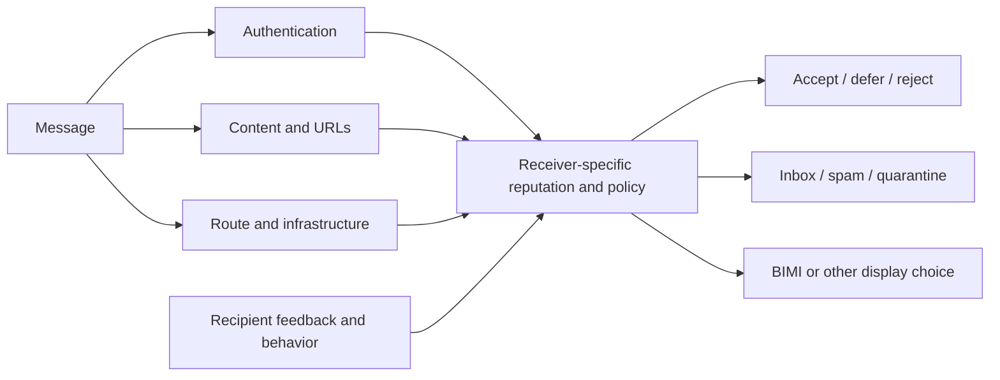
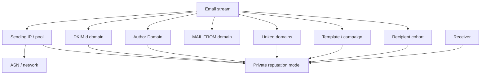
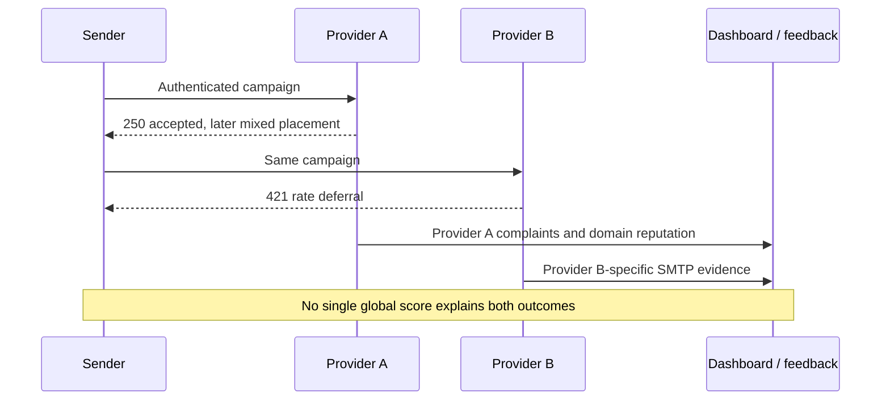
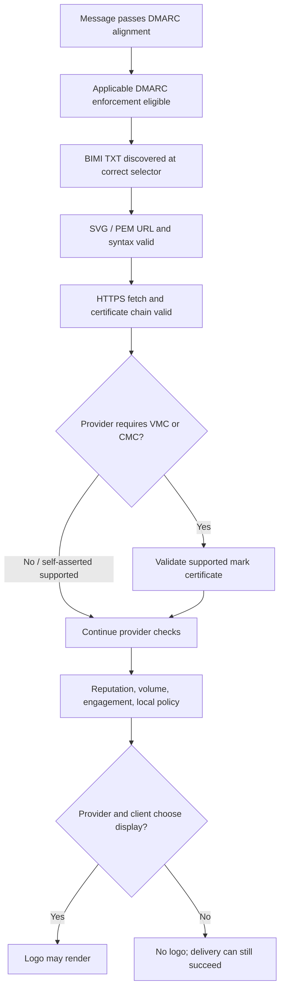
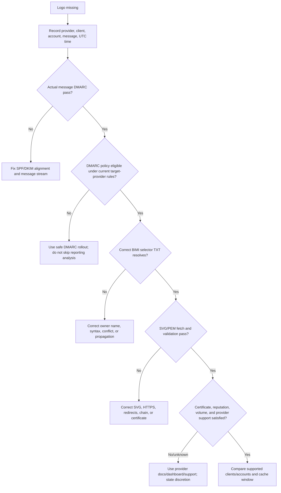
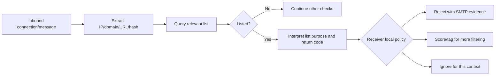
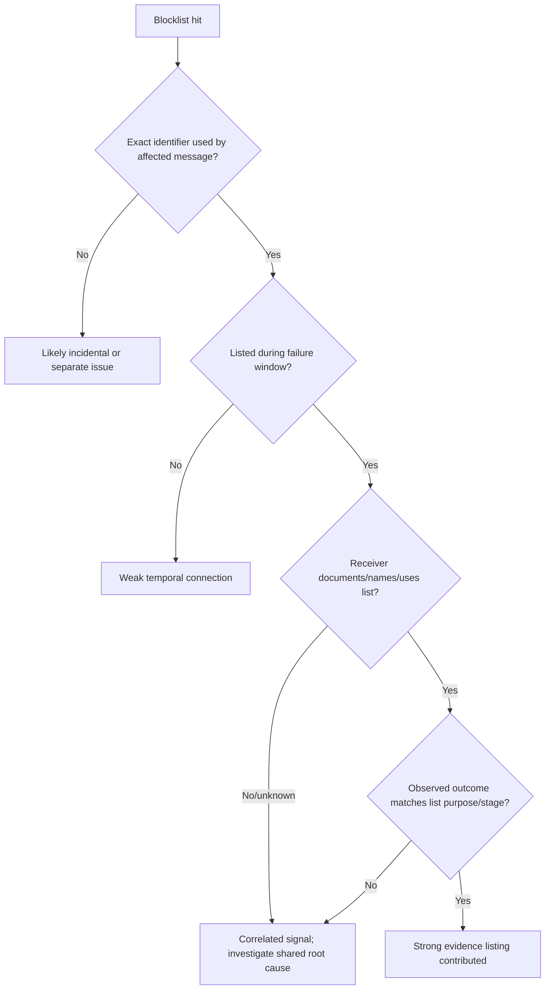
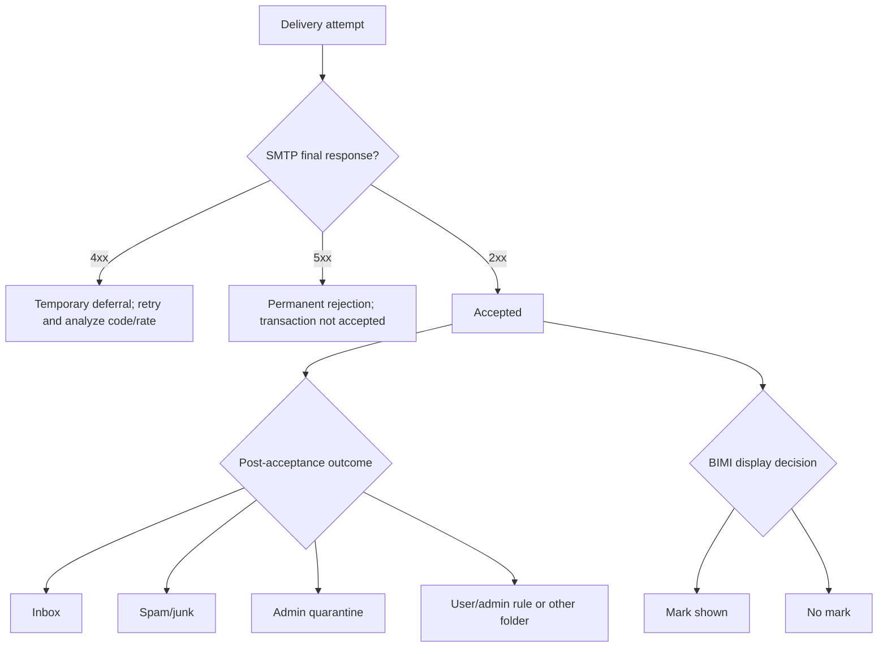
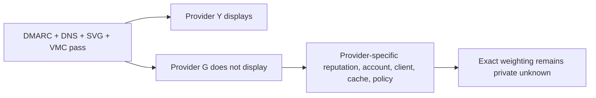

# Part 029 - BIMI Reputation and Blocklists

## Purpose, Evidence, and Currency

Email authentication answers questions about authorized infrastructure and domain use. Reputation asks how a receiver evaluates the history and risk associated with an IP address, domain, URL, signing identity, network, campaign, or traffic stream. Blocklists publish specific reputation or policy data that a receiver may use. Brand Indicators for Message Identification (BIMI) lets eligible senders publish a brand-logo assertion that participating mailbox providers may display after authentication and provider-specific checks.

These mechanisms interact, but they are not interchangeable. A message can pass SPF, DKIM, and DMARC while having poor reputation. An IP can appear on one blocklist while a receiver ignores that list. A sender can meet BIMI's published DNS and asset prerequisites but see no logo because the mailbox provider does not support BIMI, requires a certificate, has insufficient reputation evidence, applies account-specific display behavior, or chooses not to display the mark. BIMI is not an inbox-placement switch, and a displayed logo is not proof that message content is safe.

This lesson uses a strict evidence rule:

$$
\text{Causation claim} = \text{matching identifier} \land \text{matching time} \land \text{receiver relevance} \land \text{matching observed outcome}
$$

A blocklist listing discovered after a complaint is a correlation until the SMTP response, receiver documentation, trace, or controlled comparison connects that list to the failure. Likewise, "domain reputation is bad" is too vague unless the responder identifies the receiver, authenticated identity, traffic stream, measurement window, and observable evidence.

The BIMI Group implementation guide and sender FAQ are the cross-provider starting points for BIMI. Provider behavior must then be checked against current provider documentation. Google currently documents VMC or CMC certification for Gmail BIMI and provider-specific SVG and hosting requirements. Yahoo documents DMARC enforcement plus sufficient bulk volume, reputation, and engagement for its display behavior. Each provider retains discretion.

> **Current-DMARC compatibility note:** Some BIMI and provider pages still say that BIMI requires legacy `pct=100`. RFC 9989, the current Standards Track DMARC core, makes `pct` historic and replaces its surviving test-mode role with `t`. Do not add or interpret `pct` as an active RFC 9989 rollout control. Record the provider page and date, verify the provider's current eligibility behavior, and keep provider compatibility language separate from protocol truth.

## Section Goal

By the end of this part, you should be able to:

- Explain reputation from zero knowledge as a receiver-specific, time-varying risk assessment.
- Distinguish authentication, reputation, policy, blocklist status, acceptance, folder placement, and logo display.
- Identify common reputation subjects: IP, domain, DKIM signing domain, RFC5322.From domain, URL, ASN, shared pool, campaign, and recipient stream.
- Explain why there is no single global sender-reputation score.
- Describe positive and negative evidence such as wanted-mail behavior, complaints, invalid recipients, volume changes, authentication consistency, and infrastructure hygiene.
- Compare provider dashboards, complaint feedback loops, aggregate authentication reports, SMTP responses, and internal metrics without mixing their denominators.
- Explain the high-level BIMI path from DMARC-enforced mail through DNS assertion, SVG asset, optional or provider-required VMC/CMC, and receiver display choice.
- Parse a BIMI record's `v=`, `l=`, and `a=` tags and identify selector location.
- Distinguish a Verified Mark Certificate (VMC), Common Mark Certificate (CMC), self-asserted logo, and provider support.
- Diagnose DNS, DMARC, alignment, asset, HTTPS, certificate, cache, volume, reputation, and client-display causes of missing BIMI.
- Distinguish IP, domain, exploit, policy, and content/URL blocklists.
- Explain why a listing can be accurate without being the cause of a specific delivery outcome.
- Build a safe delisting plan that fixes root cause before requesting removal.
- Avoid repeated test sending, deceptive warm-up, purchased lists, broad allowlist requests, or premature delisting claims.
- Produce a reputation-evidence timeline and safe-response checklist using synthetic data.

## JD Mapping

| Role responsibility | Capability from this part | Example support output |
|---|---|---|
| Diagnose delivery issues | Separate SMTP acceptance, filtering, and display outcomes | "The receiver accepted the message; the evidence concerns spam placement, not an SMTP block." |
| Investigate reputation | Scope the exact identity, provider, stream, and time window | "The shared IP pool degraded at Provider A while the customer's DKIM domain stayed stable at Provider B." |
| Read provider telemetry | Compare complaint, authentication, and reputation data with correct denominators | A worksheet that does not compare inbox-only complaint rate directly to all-sent internal rate |
| Troubleshoot BIMI | Validate prerequisites in dependency order | DMARC pass -> policy eligibility -> TXT -> HTTPS asset/certificate -> provider/client eligibility |
| Handle blocklist reports | Identify list purpose and matching identifier before remediation | "The listed object is the URL domain, not the connecting IP cited in the SMTP log." |
| Communicate uncertainty | Label correlation and private receiver logic honestly | "The listing overlaps the failures, but the provider does not document using this list." |
| Coordinate remediation | Route root causes to the right owner | List hygiene, security incident, DNS, ESP pool, web compromise, certificate, or provider support owner |
| Prevent unsafe changes | Reject bypass-oriented advice | No IP rotation, domain hopping, list purchasing, or repeated delivery probes as a substitute for remediation |

## Candidate Honesty Note

If you have not managed production sender reputation, a commercial BIMI certificate, or a real delisting case, say:

> "I would scope the exact receiver, authenticated domain, IP or pool, content type, and time window; preserve SMTP and dashboard evidence; verify authentication and infrastructure; compare complaints and list quality using defined denominators; identify any relevant listing and its stated purpose; and fix the underlying cause before requesting removal. For BIMI I would validate DMARC eligibility, selector DNS, SVG or certificate hosting, and provider-specific display criteria without promising that the logo will appear."

This demonstrates sound support judgment. It is stronger than claiming a private reputation score can be read from one public checker.

## Evidence Labels Used in This Part

| Label | Meaning | Example |
|---|---|---|
| **[Standard/specification]** | Current protocol or BIMI technical requirement | "The assertion record is a TXT record under a BIMI selector." |
| **[Provider policy]** | Public receiver-specific requirement or behavior | "This provider requires a VMC or CMC for its BIMI implementation." |
| **[Blocklist statement]** | The list operator's purpose, data, or removal instruction | "This list identifies IP space that should not normally send direct-to-MX mail." |
| **[Learned architecture]** | Approved fact about the sender's system | "Marketing and password-reset streams share one ESP IP pool." |
| **[Observation]** | Timestamped DNS, SMTP, dashboard, trace, or list result | "At 10:15 UTC, the provider returned 421 deferrals for 70% of this stream." |
| **[Inference]** | Testable explanation | "The abrupt complaint rise is consistent with an unreviewed audience import." |
| **[Private unknown]** | Receiver logic unavailable to support | "The exact weight assigned to this URL domain is unknown." |

## Beginner Primer: Reputation Is a Receiver's Evolving Memory

Imagine two venues checking guests. Both verify the same government ID, but each has its own history and rules. One remembers that a tour company usually brings respectful guests. Another remembers repeated complaints from that company's groups. A third has never seen the company. The ID can be valid at all three venues while the admission decision differs.

Email works similarly. SPF, DKIM, and DMARC can authenticate domain use. Each receiver then combines its own observations and policies. Reputation is not a certificate stored in DNS. It is an assessment derived from signals over time and usually maintained privately by each receiver or data provider.

| Concept | Plain meaning | Why it matters | Memory hook |
|---|---|---|---|
| Authentication | Validates a route, signature, or aligned domain use | Establishes attributable identity | **Who is accountable?** |
| Reputation | Historical risk or quality assessment | Influences filtering and rate decisions | **What has this identity done?** |
| Policy | Rule or preference applied by an operator | Converts signals into handling | **What does this receiver do?** |
| Blocklist | Published set of identifiers for a stated purpose | May supply one filtering signal | **A list with a scope** |
| Acceptance | SMTP receiver returned success | Message crossed the SMTP boundary | **Accepted is not inbox** |
| Deferral | Temporary SMTP failure, usually 4xx | Sender should retry according to SMTP | **Not final yet** |
| Rejection | Permanent SMTP failure, usually 5xx | Transaction was not accepted | **Stopped at SMTP** |
| Folder placement | Inbox, spam, quarantine, or other location | Occurs after or alongside acceptance | **Where accepted mail went** |
| BIMI | Brand Indicators for Message Identification | Offers a logo assertion for eligible mail | **Authenticated brand display** |
| VMC | Verified Mark Certificate | Binds a verified trademarked mark to an entity | **Trademark-backed mark** |
| CMC | Common Mark Certificate | Certificate path for qualifying non-trademark mark use | **Qualified common mark** |



## 🔍 Plain-English deep-dive: Correlation Is Not Causation

Suppose delivery worsens on Tuesday and an engineer finds an IP listed on Wednesday. Four possibilities exist:

1. The receiver used that list and the listing caused the outcome.
2. The receiver and list independently observed the same abusive behavior.
3. The listing concerns a different identity or traffic category.
4. The timing is coincidental; another change caused the outcome.

Only the first is direct causation by the list. The second still points to a real root cause, but delisting alone will not necessarily repair receiver reputation. The third and fourth make the listing a distraction.

Ask four discriminating questions:

| Question | Evidence that strengthens causation | Evidence that weakens causation |
|---|---|---|
| Does the identifier match? | SMTP connecting IP equals listed IP | Listing is for an unrelated URL or old IP |
| Does time match? | Listing began before the failure window | Listing appeared after recovery or long predates healthy delivery |
| Does the receiver use it? | SMTP text names the list or provider documents it | Provider denies or never references that list |
| Does outcome match list purpose? | Direct rejection aligns with list's recommended use | Spam-folder placement blamed on a connection-stage policy list |

The safest wording is proportional: "The connecting IP was listed during the rejection window, and the SMTP response named that list" is strong. "A public checker is red, so reputation caused spam placement everywhere" is not.

## Reputation Subjects: Name the Exact Identity

"Sender reputation" is an umbrella term. Receivers can model many linked subjects.

| Subject | Example | Typical evidence | Common ownership |
|---|---|---|---|
| Sending IP | `192.0.2.44` | SMTP history, PTR, volume, complaints, list status | MTA/ESP/network owner |
| Shared IP pool | ESP pool containing many customer streams | Pool reputation, neighbor behavior, throttling | ESP |
| Dedicated IP | One customer's assigned egress | Customer volume and hygiene | Customer plus ESP |
| RFC5322.From domain | `news.sender.example` | DMARC-aligned history, complaints, user recognition | Brand/domain owner |
| DKIM signing domain | `d=mail.sender.example` | Provider dashboard/CFL identity, stable signing history | Domain/ESP owner |
| MAIL FROM domain | `bounce.sender.example` | SPF, bounces, stream identity | Mail platform owner |
| URL domain | `links.sender.example` | Content scanning, redirects, compromise evidence | Web/security/marketing owner |
| ASN | Network operator number | Cross-IP abuse and routing history | Network provider |
| Campaign/template | A specific content and audience combination | Complaint, click, conversion, spam classification | Marketing/product owner |
| Recipient stream | Provider, region, or customer segment | Provider-specific SMTP and placement metrics | Deliverability owner |

An IP and a DKIM domain can move independently. A shared pool can suffer because another tenant sends abuse. A dedicated IP can lack enough steady traffic to establish positive history. A domain can retain poor history after moving to a clean IP. URL reputation can cause filtering even when both IP and authentication are healthy.



## Reputation Signals and Their Limits

No public list is exhaustive, and receiver weighting is private. Still, official sender guidance consistently emphasizes wanted mail, low complaints, authentication, valid DNS, RFC compliance, easy unsubscribe for applicable mail, stable volume, and prompt handling of invalid recipients.

### Recipient Feedback

Spam complaints are direct negative feedback. Their rate depends on a denominator. Yahoo states that its displayed complaint rate uses messages delivered to the inbox as the denominator. A sender's internal rate may divide by messages sent, accepted, or delivered. Those rates are not interchangeable.

$$
\text{Complaint rate} = \frac{\text{complaints in defined scope}}{\text{messages in the provider-defined denominator}}
$$

| Metric label | Possible denominator | Interpretation risk |
|---|---|---|
| Complaints / sent | All attempted messages | Includes rejects and deferrals that users never saw |
| Complaints / accepted | SMTP accepted messages | Still includes spam-folder mail users may not encounter |
| Complaints / delivered | Provider-defined delivered set | Definition varies |
| Complaints / inbox | Messages delivered to inbox | Can look higher because denominator excludes spam placement |
| Complaints / unique recipient | Recipients rather than messages | Hides repeat-message exposure unless defined carefully |

Google's published sender guidance says to keep its Postmaster Tools spam rate below 0.10% and avoid reaching 0.30% or higher. Yahoo publishes a below-0.3% sender requirement. These are provider statements, not universal constants. Do not promise that staying one basis point under a threshold guarantees inbox placement.

### Consent and List Quality

Wanted mail starts with informed opt-in and accurate expectations. Purchased or scraped addresses, prechecked consent boxes, stale lists, and unreviewed imports produce complaints, invalid recipients, and low value. A technically perfect MTA cannot repair an audience that did not request the mail.

### Volume and Cadence

Abrupt spikes can resemble compromise or abusive acquisition. New domains and IPs have little history. Gradual, consistent traffic to genuinely engaged recipients creates observable behavior, but "warming" must not become artificial engagement, deceptive sending, or evasion. Reduce volume when deferrals and complaints rise; fix the audience or system before resuming.

### Infrastructure and Authentication

Valid forward and reverse DNS, stable HELO identity, TLS, RFC-compliant formatting, SPF, DKIM, and DMARC help a receiver attribute traffic and reduce ambiguity. They are prerequisites, not inbox guarantees. Authentication can also make negative behavior more consistently attributable to a domain.

### Engagement and Measurement Caution

Providers may use user behavior, but senders rarely see the receiver's complete model. Open rates from marketing platforms are affected by image loading, privacy features, proxying, and client behavior. Google explicitly says it does not track open rates in Postmaster Tools and cannot verify third-party open-rate accuracy. Use provider-defined complaints and delivery evidence before treating opens as root-cause proof.

| Signal | Usually favorable direction | Limitation |
|---|---|---|
| Low provider-defined complaint rate | Lower unwanted-mail evidence | Threshold and denominator are provider-specific |
| Confirmed opt-in | Better audience intent | Consent can become stale or frequency can exceed expectation |
| Prompt unsubscribe | Reduces future complaints | Does not erase past reputation immediately |
| Stable authenticated identity | Builds attributable history | Also attributes abuse consistently |
| Valid PTR and forward-confirmation | Shows managed infrastructure | Does not establish wanted content |
| Consistent volume | Easier anomaly modeling | Consistent spam is still spam |
| Low invalid-recipient rate | Better list hygiene | Exact receiver thresholds are private |
| Positive engagement | May support relevance | Measurement is incomplete and privacy-sensitive |
| Clean content and URLs | Reduces threat signals | Content alone cannot override bad audience practices |
| Time after remediation | Allows new observations | Recovery duration is not guaranteed |

## Reputation Is Provider-Specific and Time-Varying

One receiver can accept a stream while another defers it. The same provider can treat transactional and promotional streams differently. A recipient can override provider filtering with personal rules. Reputation can recover after remediation, but there is no universal reset timer.



### Shared versus Dedicated IP Tradeoffs

| Property | Shared IP | Dedicated IP |
|---|---|---|
| Volume aggregation | Many senders establish volume | One sender must sustain appropriate volume |
| Neighbor risk | Other tenants can affect pool | Sender owns most behavioral risk |
| Operational management | ESP usually manages | More customer/ESP planning required |
| Reputation isolation | Limited | Better, but domain/URL reputation still matters |
| Best fit | Often low/variable volume with strong provider controls | Sufficient stable volume and mature operations |
| Common mistake | Blaming pool for customer complaint spike | Assuming a new dedicated IP is automatically "clean and trusted" |

Changing IPs to escape reputation is not remediation. It discards history, may trigger new-sender scrutiny, and can resemble snowshoe behavior if repeated across addresses. Fix compromised systems, consent, list hygiene, content, segmentation, and rate problems first.

## 🔍 Plain-English deep-dive: A Shared IP Is a Neighborhood, Not an Alibi

A shared IP is like an apartment building with one street address. A neighbor's conduct can affect how visitors view the building, but a complaint about your own apartment still belongs in your investigation. "We use a shared IP" is therefore a plausible dependency, not proof that another tenant caused the problem.

Separate two hypotheses. The **pool hypothesis** predicts similar degradation across multiple unrelated senders or domains using the same egress pool. The **stream hypothesis** predicts degradation concentrated in one customer's audience, content, authenticated domain, or campaign even when the pool carries other healthy traffic. Ask the ESP for provider-scoped pool evidence, compare affected and unaffected authenticated streams, and preserve timing. Do not demand another IP before identifying which prediction the data supports.

| Observation | Pool hypothesis | Stream hypothesis |
|---|---:|---:|
| Several unrelated tenants degrade at the same provider and time | Stronger | Weaker |
| Only one DKIM domain has complaint and invalid-recipient spikes | Weaker | Stronger |
| SMTP response explicitly cites shared egress IP reputation | Stronger | Still possible as contributing behavior |
| Same customer degrades across multiple IP pools | Weaker | Stronger |
| Moving one controlled, wanted stream changes outcome while identities and audience stay stable | Stronger, if approved comparison is clean | Requires careful control of all changed variables |

The answer can be mixed: one sender's poor campaign can damage a pool, and the degraded pool can then affect neighbors. State the direction supported by timestamps and scope instead of assigning blame from infrastructure type alone.

## Evidence Sources and Correct Use

| Source | What it can show | What it cannot prove alone |
|---|---|---|
| SMTP response log | Receiver acceptance, deferral, rejection, enhanced status, timing | Inbox placement after acceptance |
| Provider postmaster dashboard | Provider-scoped reputation, complaints, authentication, delivery aggregates | Other providers' decisions or message-level causation |
| Complaint feedback loop | Complaints tied to enrolled identity and available reports | All complaints or silent negative behavior |
| DMARC aggregate reports | Authentication/alignment observations by reporting receivers | Inbox placement or content reputation |
| Seed/test mailbox | One controlled recipient outcome | Population-wide placement |
| Blocklist lookup | Identifier listed at lookup time and list category | Receiver usage and direct causation |
| Internal send logs | Attempts, streams, recipients, templates, rates | Receiver-side private filtering |
| Web/security telemetry | Compromised URLs, redirects, malware | Complete receiver reputation model |
| Customer report | Real impact and context | Precise technical cause without corroboration |

Preserve time zones, denominators, sampling, identity scope, and whether a chart represents counts or rates. A graph without those definitions can create false precision.

## BIMI Architecture

BIMI stands for Brand Indicators for Message Identification. A domain publishes a DNS assertion pointing to a compliant logo and, where used, evidence such as a VMC or CMC. A participating mailbox provider evaluates message authentication, DMARC policy eligibility, the BIMI assertion, asset or certificate, sender reputation, and its own display policy. A supported client may then display the mark.

```mermaid
sequenceDiagram
    participant S as Sender domain
    participant DNS as DNS
    participant WEB as HTTPS asset host
    participant R as Participating receiver
    participant C as Mail client
    S->>R: DMARC-aligned authenticated message
    R->>DNS: Query selector._bimi.author-domain TXT
    DNS-->>R: v=BIMI1; l=...; a=...
    R->>WEB: Fetch SVG and/or PEM certificate
    WEB-->>R: Asset with valid HTTPS response
    R->>R: Validate DMARC, BIMI, certificate, reputation, local policy
    alt Eligible and display chosen
        R->>C: Message plus approved brand indicator
        C->>C: Render according to client behavior
    else Not eligible or display suppressed
        R->>C: Deliver without BIMI mark
    end
```

BIMI does not send the image as an email attachment. It does not replace SPF, DKIM, or DMARC. It does not force clients to display an image. It does not guarantee inbox placement. The receiver remains responsible for preventing a brand indicator from becoming an abuse amplifier.

## BIMI Prerequisites and Dependency Order

Troubleshoot from foundational dependencies upward.

1. The actual message must authenticate and pass DMARC alignment for the Author Domain.
2. The applicable DMARC policy must meet BIMI/provider enforcement criteria, commonly `p=quarantine` or `p=reject` with appropriate subdomain coverage.
3. A syntactically valid BIMI TXT assertion must be discoverable under the selected BIMI selector.
4. The logo must satisfy the required SVG Tiny Portable/Secure profile and provider additions.
5. HTTPS hosting must return the expected asset reliably with a valid certificate chain and acceptable content.
6. A VMC or CMC must be available when required by the provider; self-asserted BIMI has limited support.
7. Provider-specific volume, reputation, engagement, account, and client criteria must be satisfied.
8. Caches and propagation must have converged.



| Dependency | Failure symptom | Evidence |
|---|---|---|
| Message DMARC | Logo absent for failing stream | Trusted message headers and alignment decision |
| DMARC policy | Self-test says policy ineligible | Current DMARC record and policy discovery |
| Selector DNS | NXDOMAIN/NODATA/wrong TXT | Authoritative and recursive DNS with timestamp |
| Assertion syntax | Parser rejects record | Exact concatenated TXT value |
| Asset URL | HTTP error, redirect issue, wrong content | Approved fetch log, status, TLS, content type |
| SVG profile | Validator rejects image | SVG metadata and BIMI/provider validator output |
| Mark certificate | Chain, expiry, domain, logo, or issuer mismatch | PEM chain and provider requirements |
| Reputation/volume | Technical checks pass; provider suppresses display | Provider-specific public criteria and dashboard evidence |
| Cache/client | Web displays but app does not, or delayed update | Client/version/account comparison and propagation window |

## BIMI DNS Assertion

The common selector is `default`, producing a record location such as:

```text
default._bimi.sender.example. IN TXT "v=BIMI1; l=https://assets.sender.example/logo.svg; a=https://assets.sender.example/mark.pem"
```

The exact assertion used can vary by selector. Selector support lets an operator publish different assertions for different streams or brands when the sending ecosystem communicates or selects the intended selector according to the applicable implementation.

| Element | Meaning | Common check |
|---|---|---|
| `default` | Common BIMI selector | Did the receiver query the selector the sender intended? |
| `_bimi` | Scoped DNS label | Was the record published under BIMI namespace? |
| Author Domain | Domain associated with the DMARC-passing message | Did support look at the actual RFC5322.From domain and policy inheritance? |
| TXT | DNS resource-record type | Are there conflicting or malformed records? |
| `v=BIMI1` | BIMI version marker | Is it present and correctly placed? |
| `l=` | Location of logo asset | Is the URL HTTPS and fetchable with a compliant SVG? |
| `a=` | Authority-evidence location, commonly PEM for VMC/CMC | Is provider-required certificate present and valid? |

Some provider examples use an empty `l=` when the mark certificate PEM embeds the logo and `a=` points to that PEM. Other implementations use an explicit SVG URL. Follow the current BIMI and target-provider documentation rather than mechanically copying one example.

### DNS Troubleshooting Rules

- Query the exact fully qualified selector name.
- Reassemble multi-string TXT data in order before parsing.
- Distinguish NXDOMAIN, NODATA, SERVFAIL, timeout, stale cache, and malformed content.
- Check authoritative data and a representative recursive resolver.
- Record TTL and UTC timestamps.
- Avoid publishing multiple conflicting BIMI assertions at one owner name.
- Confirm CNAME behavior against current specification/provider support before use.
- Do not assume a visible website logo has any relationship to BIMI DNS.

## SVG, HTTPS, VMC, and CMC

### SVG Tiny Portable/Secure

BIMI uses a constrained SVG profile to reduce active-content and remote-resource risks. Current provider guidance commonly refers to SVG Tiny Portable/Secure (SVG Tiny PS), `baseProfile="tiny-ps"`, and version `1.2`. Scripts, animations, interactive content, and external references are not suitable. Providers may add dimensions, size, background, or accessibility recommendations.

### HTTPS Hosting

Logo and PEM resources must be reliably available over HTTPS under the provider's requirements. Validate the TLS chain, hostname, status code, redirects, content, and availability from an appropriate network. A successful browser render on one workstation does not prove a mailbox provider can fetch or accept the file.

### VMC and CMC

A VMC is issued through an approved mark-verification process for a qualifying registered trademark. A CMC provides a certificate route for qualifying commonly used marks that do not meet the VMC trademark path. Exact eligibility, issuer, logo, and jurisdiction requirements belong to the issuing authority and provider documentation. Support should not provide legal advice or promise certificate issuance.

| Item | Self-asserted logo | VMC | CMC |
|---|---|---|---|
| Third-party mark certificate | No | Yes | Yes |
| Typical mark basis | Domain publishes its own asset | Qualifying registered trademark | Qualifying established/common mark |
| Provider support | Limited and provider-specific | Broad among certificate-requiring implementations | Provider-specific and evolving |
| Trust contribution | DNS control plus authentication | CA/mark-verification evidence | CA/common-mark verification evidence |
| Inbox guarantee | None | None | None |
| Display guarantee | None | None | None |

## 🔍 Plain-English deep-dive: BIMI Eligibility Is Not BIMI Display

Passing every published technical check makes a message **eligible for consideration**. Display remains a provider and client decision. Compare it to an airport lounge: a valid membership card is necessary, but the lounge can still be closed, the specific terminal may not support it, the account may not qualify, or a security rule may override admission.

Use this vocabulary:

- **Configured:** DNS and assets exist.
- **Technically valid:** Parsers and certificate checks succeed.
- **Message eligible:** The actual message passes DMARC and applicable requirements.
- **Provider eligible:** Reputation, volume, certificate, and provider criteria appear satisfied.
- **Displayed:** A specific provider/client/account rendered the logo for a specific message.

| Evidence | Strongest safe conclusion |
|---|---|
| BIMI TXT resolves | A record is discoverable at that resolver/time |
| SVG validator passes | The tested asset meets that validator's checks |
| VMC/CMC chain validates | Certificate evidence passed the tested validation path |
| Test message passes DMARC | Authentication prerequisite passed for that message |
| Provider web UI shows logo | Display occurred in that account/client/time |
| Mobile app shows no logo | That client/account did not display it; it does not isolate root cause |

Never tell a customer, "Your DNS is valid, therefore the logo must display." Move upward through the dependency chain and label provider discretion.

## BIMI Troubleshooting Workflow



### Missing-Logo Matrix

| Observation | Likely layer | Cheap discriminating check |
|---|---|---|
| Logo absent at all providers | Foundation or asset | Verify actual DMARC pass, assertion, and asset fetch |
| Logo appears at Yahoo but not Gmail | Provider certificate/policy/client | Check Gmail VMC/CMC and provider-specific requirements |
| Logo appears in webmail but not mobile app | Client support/cache | Compare documented client support and app version |
| Only one sending subdomain lacks logo | DNS/policy/domain scope | Query that Author Domain's selector and DMARC policy |
| Logo disappeared after certificate renewal | PEM chain/cache/expiry | Validate new full chain, URL response, and dates |
| Logo disappeared after SVG change | Asset compliance/cache | Validate exact fetched SVG and certificate-logo relationship |
| Some messages show logo, others do not | Per-message DMARC/stream/provider decision | Compare trusted headers, From domain, and campaign identities |
| All technical checks pass, low-volume sender | Provider eligibility | Check published bulk/volume and reputation criteria |

## Blocklists: Published Data with a Defined Purpose

A blocklist is a maintained set of identifiers associated with a stated risk, behavior, or policy category. Many email blocklists are queried through DNS and called DNS-based blocklists (DNSBLs). Others use web APIs, feeds, or internal data. The operator decides what is listed, why, how users should apply the data, and how removal works.



"Listed" is incomplete without four fields: **which list, which exact identifier, which category/return code, and when**.

## Blocklist Types and Correct Stage

| Type | Listed subject | Intended concern | Typical stage | Misuse to avoid |
|---|---|---|---|---|
| Spam-source IP list | Sending IP/range | Observed unsolicited or abusive mail | SMTP connection/scoring | Applying domain conclusions to unrelated customers |
| Exploit/compromise IP list | Infected or abused hosts | Botnet, malware, open proxy behavior | Connection/scoring | Treating it as a marketing-content verdict |
| Policy IP list | Address space not expected to send direct-to-MX | Dynamic/residential/other policy category | Connection policy | Calling every entry a malicious actor |
| Domain blocklist | Domain in From, DKIM, URLs, or other context | Spam, phishing, malware, abuse infrastructure | Header/content filtering | Failing to identify where the domain appeared |
| URI/URL list | Link or redirect domain/IP | Harmful or unwanted linked content | Content scanning | Blaming SMTP source IP without URL evidence |
| Hash/fingerprint list | Content or artifact hash | Known campaign/malware/content | Content scanning | Assuming identity reputation caused match |
| Internal receiver list | Provider-defined identity | Private abuse/policy history | Any provider stage | Expecting public delisting process |
| Allowlist/reputation list | Known positive identity | Reduced friction or scoring input | Local policy | Promising guaranteed inbox delivery |

A policy list may correctly include an IP that is not currently compromised. Its statement can be: "This type of address should not send mail directly to recipient MX servers." The remediation may be to use an authorized smarthost, not to prove the IP has never sent spam.

## Reading a DNSBL Result Conceptually

For an IPv4 source, a DNSBL query commonly reverses the octets and appends the list zone. A positive response may contain a loopback-range address whose final octet encodes a category. TXT data may provide human-readable context. Exact meanings belong to that list's documentation.

Synthetic example only:

```text
Source IP: 192.0.2.44
Conceptual query: 44.2.0.192.list.example
Synthetic answer: 127.0.0.4
Meaning: look up code 4 in list.example documentation
```

Do not automate high-volume queries against a public service without respecting access terms, fair-use rules, resolver restrictions, and licensing. Do not paste customer identifiers into random public checkers when approved tools or direct authoritative checks exist.

## Listing Evidence and Causation



### Strong Causation Examples

- SMTP response explicitly says the connecting IP is rejected due to `list.example` and includes a documented lookup/removal URL.
- Receiver configuration owned by the investigating organization shows that list is queried at connection time and the matching rule rejected the transaction.
- Controlled before/after evidence shows only the listed IP path fails at that receiver with the documented list response, while comparable clean paths succeed, without other material differences.

### Weaker Correlation Examples

- A third-party multi-list checker shows one hit, but the receiver accepted the message and placed it in spam.
- The listed domain appears only in an old tracking URL not present in affected messages.
- A shared ESP IP is listed, but affected logs show a different egress IP.
- The listing began after the reported failure period.
- Many providers show degradation, but each has different SMTP or placement behavior and none names the list.

## 🔍 Plain-English deep-dive: Delisting Is Not Root-Cause Remediation

Removing a dashboard warning without fixing the behavior is like wiping a smoke alarm while the kitchen still burns. Even if one list removes the entry, receivers can continue seeing complaints, traps, compromise, invalid recipients, or harmful URLs. Relisting can occur quickly.

Use this order:

1. Identify exact listed object and category.
2. Stop active abuse or misconfiguration.
3. Preserve evidence and determine scope.
4. Fix compromised credentials, host, web content, list source, consent, or routing.
5. Validate that the unwanted behavior stopped.
6. Follow the list operator's official removal process truthfully.
7. Monitor for recurrence and receiver recovery.

Never rotate to a new IP or domain merely to outrun a listing. That can spread harm, lose useful history, violate provider terms, and resemble deliberate evasion.

## Safe Delisting Workflow

| Stage | Required evidence | Safe action | Exit criterion |
|---|---|---|---|
| Confirm | Exact list, object, category, timestamp | Use authoritative list documentation/approved lookup | Listing and scope reproduced |
| Contain | Current traffic and security evidence | Pause affected stream, revoke compromise, isolate host as appropriate | Harm no longer continuing |
| Diagnose | Logs, audience source, URLs, auth, volume, neighbor/pool data | Find root cause and owner | Defensible root-cause hypothesis |
| Remediate | Change record and validation | Fix consent/list, server, credentials, web compromise, DNS, or routing | Tests and monitoring show correction |
| Request removal | List-specific form and honest explanation | Submit once with required facts | Request acknowledged or automatic criteria met |
| Recover | SMTP, complaint, dashboard, relisting telemetry | Resume cautiously with wanted mail | Stable low-error operation over suitable window |

### Root-Cause Categories

| Category | Examples | Owner |
|---|---|---|
| Compromise | Stolen ESP API key, open relay, infected host, malicious web redirect | Security/incident response |
| Audience | Purchased list, consent gap, old addresses, role accounts | Marketing/data governance |
| Operations | Sudden spike, retry storm, mixed traffic, invalid recipient handling | Mail platform/deliverability |
| Shared infrastructure | Another tenant harms pool | ESP/provider management |
| DNS/routing | Residential IP sends direct, invalid PTR, wrong smarthost | Network/mail engineering |
| Content/URL | Compromised landing page, abusive redirector, unsafe attachment | Web/security/content owner |
| False or stale classification | Evidence contradicts current listing | List operator through official review |

## SMTP Outcomes and Placement

Always classify the symptom before investigating reputation.



| Symptom | Primary evidence | Do not call it |
|---|---|---|
| 421/4xx | SMTP response and retry behavior | Permanent block before retries finish |
| 550/5xx | Exact SMTP enhanced status/text | Spam-folder placement |
| 250 then spam | Message trace and mailbox evidence | SMTP rejection |
| 250 then missing | Trace, rules, quarantine, forwarding, recipient search | Automatically a reputation block |
| Inbox without BIMI | Authentication plus BIMI/provider/client checks | Deliverability failure |
| BIMI shown in spam | Actual provider behavior | Proof of safe content or inbox status |

## Safe Reputation Investigation Workflow

### 1. Define the Slice

Record receiver, recipient class, Author Domain, DKIM `d=`, MAIL FROM, sending IP/pool, campaign type, message IDs, UTC window, and symptom. Separate transactional, user-generated, and marketing traffic.

### 2. Verify Technical Baseline

Check message-format compliance, SPF, DKIM, DMARC alignment, PTR/forward DNS, TLS, HELO, queue/retry behavior, and unsubscribe headers where applicable. A baseline defect can coexist with reputation problems.

### 3. Build a Timeline

Plot volume, recipients, complaints, invalid recipients, deferrals, rejects, stream/config changes, IP changes, domain changes, security events, URL changes, and blocklist observations.

### 4. Compare Providers and Cohorts

Provider-specific divergence often narrows the cause. Compare the same stream and period while controlling for IP, domain, content, and recipient quality. Do not use unsolicited probes or repeated test blasts.

### 5. Test the Most Discriminating Hypothesis

Examples:

- If only one shared pool fails, compare an approved equivalent pool without changing customer identity or audience.
- If one template fails, compare content and linked domains with another legitimate template in the same authenticated stream.
- If complaints rose after an import, isolate imported recipients and verify consent records.
- If BIMI disappeared after renewal, validate the exact PEM chain and fetched asset before blaming reputation.

### 6. Remediate Root Cause and Observe

Stop harmful traffic, honor unsubscribes, remove invalid or unconsented recipients, fix compromise, stabilize volume, segment streams, correct infrastructure, and follow official list/provider processes. Recovery is evidence-based and may take time.

## Failure Modes and Misleading Shortcuts

| Shortcut | Why it is unsafe or wrong | Better approach |
|---|---|---|
| "SPF/DKIM pass means good reputation" | Authentication establishes attribution, not quality | Evaluate receiver-scoped history and behavior |
| "One checker says clean" | Coverage, freshness, and receiver usage differ | Check exact relevant sources and actual SMTP evidence |
| "One list hit caused everything" | Identifier, time, list purpose, and provider use may not match | Apply the causation test |
| "Change IPs immediately" | Evades symptoms, loses history, can spread abuse | Contain and remediate root cause |
| "Request a whitelist" | Major providers may not offer one or guarantee inbox | Follow sender requirements and use official support with evidence |
| "Warm by sending more" | More unwanted mail worsens reputation | Send expected wanted mail at controlled volume |
| "Open rate proves inbox placement" | Third-party opens are noisy and incomplete | Use SMTP, provider dashboards, complaints, and controlled mailbox evidence |
| "BIMI improves deliverability" | BIMI display is downstream of authentication/reputation checks | Treat BIMI as brand display, not filtering bypass |
| "Valid VMC guarantees logo" | Provider/client discretion and message eligibility remain | Validate entire dependency chain |
| "No logo means bad reputation" | DNS, DMARC, asset, certificate, cache, provider, or client can fail | Isolate layers in order |
| "`pct=100` is current DMARC" | RFC 9989 makes `pct` historic | Label legacy provider docs and use current DMARC semantics |
| "Delisted means recovered" | Receiver memory and underlying signals persist | Monitor behavior and provider-specific recovery |

## Safe Lab: Reputation Evidence and Safe-Response Checklist

### Objective

Analyze a synthetic delivery and BIMI case, rank competing hypotheses, test blocklist causation, and produce a safe remediation response. No live sending, production DNS changes, public uploads, or real customer identifiers are used.

### Safety Rules

- Use only `.example` domains and documentation IPs.
- Treat all dashboard values and responses as synthetic.
- Do not query public blocklists with customer identifiers for this exercise.
- Do not recommend IP/domain rotation, purchased lists, fake engagement, or repeated test campaigns.
- Do not publish DMARC enforcement or BIMI records without a real inventory and approved change process.
- Never upload a customer logo, certificate, message, or header to an unapproved validator.

### Prerequisites

1. An authorized, non-production local study folder and a Markdown or spreadsheet editor.
2. This Part and the linked official BIMI, sender-guideline, blocklist, and DMARC sources for checking provider-specific requirements and proof limits.
3. Only the supplied synthetic timeline, dashboard values, blocklist result, and BIMI observations; no live sender, DNS change, blocklist query, certificate/logo upload, or campaign is required.
4. A worksheet that keeps each reputation identity, SMTP outcome, metric denominator, blocklist causation gate, and BIMI display observation separate.

### Scenario

`offers.sender.example` sends marketing mail through an ESP. The visible From domain and DKIM signing domain align. The stream uses shared IP `192.0.2.44`. A BIMI record and VMC were deployed three weeks ago. The logo appears in Provider Y webmail but not Provider G. During the current week, Provider G begins deferring part of the campaign. A public multi-list checker also reports that `192.0.2.44` is on `policy-list.example`.

Synthetic evidence:

| Time UTC | Evidence |
|---|---|
| Day 1 | Audience import adds 180,000 addresses from a partner spreadsheet; consent mapping is not attached |
| Day 2 | Daily volume rises from 40,000 to 210,000 |
| Day 3 | Internal invalid-recipient rate rises from 0.8% to 8.6% |
| Day 3 | Provider G spam rate rises from 0.07% to 0.34% |
| Day 4 | Provider G returns intermittent `421 4.7.x` rate/quality deferrals |
| Day 4 | Provider Y continues accepting; complaint rate rises from 0.05% to 0.22% |
| Day 4 | `policy-list.example` reports `192.0.2.44` in a category for consumer access IP space |
| Day 5 | Authoritative PTR shows `mailpool.esp.example`; forward lookup returns `192.0.2.44` |
| Day 5 | SPF, DKIM, and DMARC pass for sampled messages |
| Day 5 | Provider G BIMI test: VMC and SVG pass; actual message DMARC passes; no display in tested account |

### Exercise 1: Define the Identities and Outcomes

| Item | Synthetic value | Classification |
|---|---|---|
| Author Domain | `offers.sender.example` | Domain identity |
| DKIM signing domain | `offers.sender.example` | Authenticated/reputation identity |
| MAIL FROM domain | `bounce.sender.example` | SPF/bounce identity |
| Sending IP | `192.0.2.44` | Shared ESP egress |
| Provider G outcome | Intermittent 4xx deferral | SMTP temporary outcome |
| Provider Y outcome | Accepted, complaints increased | SMTP success plus negative feedback |
| BIMI at Provider Y | Displayed in tested web client | Provider/client display observation |
| BIMI at Provider G | Not displayed | Display symptom, not rejection |

### Exercise 2: Rank Hypotheses

| Hypothesis | Supporting evidence | Contradicting/missing evidence | Rank |
|---|---|---|---:|
| Unconsented/poor-quality import caused complaint, invalid-recipient, and provider degradation | Timing, volume, complaint and invalid-recipient jumps align | Need consent/source audit and cohort breakdown | 1 |
| Sudden volume spike triggered temporary throttling | Volume increased over 5x immediately before 4xx | Does not alone explain complaints | 2 |
| Shared-pool neighbor caused Provider G issue | Shared IP creates neighbor possibility | Sender-specific complaint and import changes already explain degradation; no pool comparison | 3 |
| Public policy listing directly caused Provider G deferrals | IP matches and time overlaps | Synthetic SMTP text does not name list; category conflicts with managed ESP PTR; provider usage unknown | 4 |
| Authentication failure caused issue | Authentication sampled | Samples pass; no auth error in response | Low |
| Missing Provider G logo proves bad reputation | Provider can suppress display | VMC/SVG/auth pass, but display logic private; cannot use absence as a score | Unproven |

Expected conclusion: the audience import and volume change are the most discriminating root-cause leads. The listing deserves validation with its operator because the category appears inconsistent with architecture, but it is not proven to cause Provider G deferrals.

### Exercise 3: Apply the Blocklist Causation Test

| Causation gate | Result | Reason |
|---|---|---|
| Exact identifier | Pass | The listed IP is the observed egress IP |
| Matching time | Pass | Listing overlaps the failure window |
| Receiver relevance | Unknown | Provider G does not name the synthetic list in the response or supplied policy |
| Matching outcome/purpose | Weak | Policy category concerns consumer access ranges; observed system appears to be an ESP MTA and response is generic deferral |

Verdict: **correlated, not established as causal**. Investigate the list classification and shared pool with the ESP, but remediate the audience and sending spike regardless.

### Exercise 4: Diagnose BIMI Separately

The provider-specific split proves the shared BIMI configuration can work somewhere. It does not prove Provider G must display it. Provider G technical tests pass in the scenario. The remaining branches include provider-specific reputation/volume/account/client discretion and cache behavior. Do not use the missing logo as evidence that the 4xx deferrals were caused by BIMI.



### Exercise 5: Safe Immediate Actions

1. Pause or sharply reduce the newly imported cohort, not all critical transactional mail.
2. Audit consent provenance, expected frequency, acquisition date, and partner contract.
3. Suppress invalid recipients and honor all complaints/unsubscribes immediately.
4. Return volume to the previously stable wanted-mail baseline.
5. Ask the ESP for pool-level deferral, complaint, neighbor, and listing evidence.
6. Verify the authoritative list category and follow its official correction process if the IP classification is wrong.
7. Monitor Provider G SMTP responses and provider-defined spam rate over time.
8. Keep BIMI troubleshooting separate; compare supported Provider G clients/accounts and use official support only after prerequisites remain valid.
9. Do not rotate IPs, create a new subdomain, or resend to the same cohort to test recovery.

### Exercise 6: Write the Customer Response

> **[Observation]** The affected Provider G stream is temporarily deferred, not permanently rejected. SPF, DKIM, and DMARC pass in the supplied samples. The degradation began after volume increased from 40,000 to 210,000 messages per day through a new audience import; invalid recipients rose to 8.6%, Provider G's synthetic spam rate reached 0.34%, and Provider Y complaints also rose. **[Observation]** The egress IP is listed by `policy-list.example`, but the supplied SMTP response does not name that list and the category appears inconsistent with the managed ESP route. **[Inference]** Audience quality plus the abrupt volume change best explain the cross-provider negative signals; the listing may be another symptom or a classification issue, but direct causation is not established. **[Private unknown]** Provider G's precise reputation and BIMI-display weighting is unavailable. **Safe next actions:** stop the imported cohort, verify consent, suppress invalid/complaining recipients, restore stable volume, and ask the ESP to validate pool and listing status. Continue monitoring before increasing traffic. The missing Provider G logo should be handled as a separate provider/client BIMI case because the VMC, SVG, DNS, and sampled DMARC checks pass.

### Safe-Response Checklist

| Check | Complete when |
|---|---|
| Symptom classified | Deferral, rejection, placement, and BIMI display are separate |
| Exact identities captured | IP/pool, DKIM, From, MAIL FROM, URLs, provider, stream |
| Timeline built | Changes precede or follow outcomes clearly |
| Denominators defined | Complaint/invalid rates identify exact denominator |
| Authentication verified | Actual affected messages checked, not DNS alone |
| Blocklist scope verified | Exact list, category, identifier, time, and usage considered |
| Root cause contained | Harmful cohort/compromise/misconfiguration stopped |
| No evasion proposed | No IP/domain hopping or artificial traffic |
| BIMI isolated | Technical eligibility and provider display kept separate |
| Recovery monitored | SMTP, complaints, listings, dashboards, and recurrence tracked |

### Expected evidence

The lab should produce an inspectable identity/outcome map, ranked hypothesis table, four-gate blocklist causation assessment, separate BIMI dependency analysis, timeline with metric denominators, safe immediate-action plan, customer response, and completed safe-response checklist. A reviewer must be able to see why the audience/volume change outranks the unproven list and BIMI hypotheses.

### Cleanup and privacy

- Retain only the supplied `.example` identities, documentation IP, synthetic metrics, and derived worksheets.
- Delete or redact any accidentally pasted customer sender/recipient data, real IP/domain/listing, complaint record, logo, certificate, message/header, tenant ID, token, or personally identifiable information (PII); delete the artifact if reliable redaction is not possible.
- Do not upload a logo/certificate/message, query a blocklist with customer identifiers, contact a provider/list operator, send a campaign, or change DNS/authentication/BIMI records from this exercise.
- Confirm before retention or sharing that no live sending, reputation manipulation, public validation, provider-account, DNS, or customer-environment activity occurred.

### Validation rubric

| Dimension | Fail | Developing | Pass |
|---|---|---|---|
| Identity and outcome scope | Uses one global reputation score or combines symptoms | Names some IP/domain/provider outcomes | Separates IP/pool, HELO/PTR, MAIL FROM, DKIM, From, URLs, provider, stream, SMTP, placement, and BIMI |
| Metrics and timeline | Omits denominators or chronology | Captures changes and rates with gaps | Defines denominators and orders audience, volume, complaint, invalid, SMTP, listing, and display evidence |
| Hypothesis ranking | Blames authentication/list/BIMI from correlation | Lists alternatives | Ranks competing causes with supporting, contradicting, missing, and disconfirming evidence |
| Blocklist causation | Treats any checker hit as cause | Checks identifier/time | Applies exact identifier, time, receiver relevance, and outcome/purpose gates |
| Remediation and BIMI | Recommends evasion, resend, or guaranteed display | Suggests cautious recovery | Contains harmful cohort, restores wanted baseline, uses official process, and isolates provider-controlled BIMI display |
| Safety and honesty | Uses live/customer data or claims private provider logic | Synthetic analysis with incomplete boundary | No live activity, no manipulation, and explicit provider-private/learned limitations |

## Support Runbook

### Intake

- What exact receiver and recipient type are affected?
- Is the symptom 4xx, 5xx, spam placement, missing mail, warning, or missing BIMI logo?
- What are the UTC start/end times and representative message IDs?
- Which IP/pool, DKIM domain, From domain, MAIL FROM, campaign, and URL domains were used?
- What changed before the issue: audience, volume, template, URL, provider, IP, DNS, certificate, or routing?

### Evidence Collection

- Preserve SMTP responses with enhanced codes and remote host.
- Retrieve trusted message headers for authentication and route.
- Export provider dashboards with metric definitions and time zone.
- Record complaint and invalid-recipient denominators.
- Query relevant DNS through approved tools with timestamps and TTL.
- Check blocklists only through approved/authoritative methods and record category.
- For BIMI, preserve selector record, fetched asset/PEM metadata, validation output, provider/client/account, and cache window.

### Decision

1. State the observed outcome.
2. Identify exact reputation subjects.
3. Separate technical baseline defects from behavior/reputation evidence.
4. Rank time-correlated changes.
5. Apply the four-gate list causation test.
6. Contain active harm.
7. Route remediation to owner.
8. State provider-private unknowns.
9. Define monitoring and cautious recovery criteria.

### Escalation Package

| Field | Content |
|---|---|
| Scope | Provider, domain, IP/pool, stream, recipients, UTC window |
| Impact | Attempted, deferred, rejected, accepted, complaint, placement counts |
| Authentication | SPF, DKIM, DMARC identities and results |
| Infrastructure | PTR/A/AAAA, HELO, TLS, recent changes |
| Behavior | Volume, cadence, consent source, invalids, unsubscribes, complaints |
| Blocklist | Operator, exact list/category/object, first/last observation, receiver evidence |
| BIMI | Selector, record, DMARC policy/pass, SVG/PEM/VMC/CMC, provider/client observations |
| Hypothesis | Ranked and falsifiable, with contradicting evidence |
| Actions | Containment/remediation already completed |
| Request | Specific review, not a demand for guaranteed inbox or logo display |

## Case Summary Template

### Symptom and Scope

- Receiver/provider:
- Recipient class:
- UTC window:
- Outcome: accept / defer / reject / placement / BIMI display
- Message IDs:
- Business impact:

### Identity Map

| Identity | Value | Dedicated/shared | Owner |
|---|---|---|---|
| Sending IP/pool |  |  |  |
| HELO/PTR |  |  |  |
| MAIL FROM |  |  |  |
| DKIM `d=` / `s=` |  |  |  |
| RFC5322.From |  |  |  |
| URL domains |  |  |  |

### Evidence Timeline

| UTC time/window | Volume | Complaints/denominator | Invalids/denominator | SMTP outcome | Change/event |
|---|---:|---|---|---|---|
|  |  |  |  |  |  |

### Blocklist Assessment

- Operator/list/category:
- Exact object:
- Authoritative lookup time:
- List purpose:
- Receiver use evidence:
- Matching outcome:
- Causation verdict:

### BIMI Assessment

- Actual message DMARC pass:
- Applicable DMARC policy and current-RFC interpretation:
- Selector/FQDN:
- Concatenated TXT:
- SVG/PEM HTTPS result:
- VMC/CMC and chain result:
- Provider/client/account:
- Display observation and time:
- Provider-private unknown:

### Conclusion

- **[Observation]:**
- **[Inference]:**
- **[Private unknown]:**
- Containment:
- Root-cause remediation:
- Official removal/support request:
- Monitoring and recovery gate:

## Official Source Anchors

All listed sources were accessed on August 24, 2026 and must be revalidated for current provider behavior.

| Source | What it establishes for this lesson |
|---|---|
| [BIMI Group Implementation Guide](https://bimigroup.org/implementation-guide/) | Cross-provider setup path, DMARC enforcement framing, SVG Tiny PS, certificates, DNS assertion, and provider discretion |
| [BIMI Group Sender FAQ](https://bimigroup.org/faqs-for-senders-esps/) | Sender questions, selectors, assets, certificates, support variation, and no universal display promise |
| [Google BIMI setup](https://knowledge.workspace.google.com/admin/security/set-up-bimi) | Gmail-specific VMC/CMC, DMARC, SVG, HTTPS, PEM, and DNS requirements |
| [Google Email Sender Guidelines](https://support.google.com/a/answer/81126) | Authentication, PTR, TLS, complaint-rate guidance, subscriptions, one-click unsubscribe, volume, Postmaster Tools, and no delivery guarantee |
| [Yahoo Sender Requirements](https://senders.yahooinc.com/best-practices/) | Provider-specific authentication, complaint, DNS, unsubscribe, segmentation, security, and sending guidance |
| [Yahoo Sender FAQ](https://senders.yahooinc.com/faqs/) | Complaint denominator, reputation subjects, no whitelisting guarantee, BIMI display conditions, and provider-specific support |
| [Spamhaus blocklist overview](https://www.spamhaus.org/blocklists/) | Distinct IP/domain/exploit/policy list purposes and receiver choice to reject or score |
| [RFC 9989](https://www.rfc-editor.org/rfc/rfc9989) | Current DMARC core, current policy semantics, historic `pct`, and receiver discretion |

Provider pages change. Record retrieval dates in real cases and prefer the target provider's current English-language requirements when translations or old help pages conflict. A provider requirement is still not a universal protocol rule.

## Likely Interview Questions

### Q1. What is sender reputation, and how is it different from authentication?

**Model answer:** Authentication validates accountable technical identities, such as an SPF-authorized route, a DKIM signing domain, or aligned Author Domain use under DMARC. Reputation is a receiver-specific, time-varying assessment of how an IP, domain, URL, stream, or related identity has behaved. Authenticated mail can have poor reputation, and unauthenticated mail can still be accepted under local policy. I would identify the exact receiver and reputation subject instead of claiming there is one global score.

### Q2. How do you prove that a blocklist caused a delivery failure?

**Model answer:** I require an exact identifier match, temporal overlap, evidence that the receiver uses or names the list, and an outcome matching the list's purpose and filtering stage. An SMTP rejection naming the list is strong evidence. A hit on a public checker after a message was accepted into spam is only correlation. Even when causation is strong, I still fix the underlying abuse or configuration before requesting removal.

### Q3. What is BIMI, and does it improve deliverability?

**Model answer:** BIMI is a brand-indicator assertion published in DNS for authenticated, DMARC-eligible mail. It can point to a constrained SVG logo and authority evidence such as a VMC or CMC. Participating providers validate prerequisites, reputation, and their own policy before a client may display the mark. It is not an authentication replacement or inbox-placement control. Missing or displayed BIMI does not prove delivery quality or content safety.

### Q4. What would you check when a BIMI logo is missing?

**Model answer:** I scope the exact provider, client, account, message, From domain, and time. Then I verify the actual message passes DMARC, the applicable policy meets current provider criteria, the exact selector TXT resolves and parses, SVG or PEM fetches over valid HTTPS, the asset profile and VMC/CMC chain pass provider requirements, and caches have converged. If those pass, volume, reputation, provider support, and client display remain. I do not promise display because it is provider-controlled.

### Q5. What signals commonly damage reputation?

**Model answer:** Unwanted or unconsented mail, high provider-defined complaints, invalid recipients, ignored unsubscribes, sudden volume changes, compromise, mixed high-risk and critical streams, harmful URLs, poor infrastructure hygiene, and noncompliant or deceptive messages are common signals. Weighting is private and provider-specific. I build a timeline and define metric denominators before selecting root cause.

### Q6. How would you handle a real blocklist listing?

**Model answer:** I confirm the authoritative list, exact object, category, and time; identify whether it is an abuse, exploit, policy, or domain/content listing; stop active harmful traffic; investigate compromise, consent, audience, routing, shared-pool, and URL causes; remediate and validate that behavior stopped; then follow the operator's official removal process honestly. I monitor for relisting and receiver recovery. I do not rotate infrastructure to evade the list.

### Q7. Why can complaint rates disagree between a provider dashboard and an internal report?

**Model answer:** The numerator scope and especially denominator can differ. A provider may divide complaints by inbox-delivered messages, while the sender divides by sent or SMTP-accepted messages. Time zones, aggregation identity, sampling, and message versus recipient counts can also differ. I document each formula before comparing rates. For example, Yahoo says its displayed complaint rate uses inbox-delivered mail as the denominator.

### Q8. What is the safest way to recover from a reputation incident?

**Model answer:** Contain the affected stream or compromise, preserve evidence, return to a known wanted-mail baseline, remove invalid and unconsented recipients, honor complaints and unsubscribes, correct authentication and infrastructure, stabilize volume, remediate harmful content or URLs, and use official provider/list processes. Then monitor SMTP outcomes, provider-defined complaints, dashboards, and recurrence before cautiously increasing traffic. Recovery has no guaranteed timer or inbox promise.

## 🧠 30-Second Memory Hooks

- **Authentication names responsibility; reputation remembers behavior.**
- **No global score:** always name provider, identity, stream, and time.
- **Accept is not inbox; inbox is not BIMI.**
- **Four causation gates:** identifier, time, receiver use, matching outcome.
- **A list has a purpose:** IP, policy, exploit, domain, or content are different.
- **Fix before delist:** removal is not remediation.
- **Never outrun reputation:** IP/domain rotation is not a repair plan.
- **BIMI is eligible display, not guaranteed display.**
- **BIMI dependency order:** DMARC -> policy -> DNS -> asset/cert -> provider/client.
- **VMC means trademark-backed; CMC means qualifying common mark.**
- **Define the denominator before comparing complaints.**
- **`pct` is historic in current DMARC:** label older BIMI/provider wording.

## Completion Checklist

- [ ] I can separate authentication, reputation, policy, SMTP outcome, placement, and BIMI display.
- [ ] I can name the exact reputation identity rather than saying "sender score."
- [ ] I can explain shared and dedicated IP tradeoffs without promising either is clean.
- [ ] I can define complaint-rate numerator, denominator, time zone, and identity scope.
- [ ] I can explain why public blocklist status is not a universal receiver verdict.
- [ ] I can apply identifier, time, receiver-use, and outcome causation gates.
- [ ] I can distinguish spam-source, exploit, policy, domain, and URL lists.
- [ ] I fix root cause before requesting removal.
- [ ] I never recommend IP/domain rotation, fake engagement, or repeated test blasts.
- [ ] I can parse BIMI `v=`, `l=`, and `a=` at the correct selector.
- [ ] I can explain SVG Tiny PS, HTTPS hosting, VMC, CMC, and self-asserted limits.
- [ ] I check the actual message's DMARC pass, not DNS configuration alone.
- [ ] I can explain provider and client discretion without promising logo display.
- [ ] I keep legacy `pct=100` provider wording separate from current RFC 9989 semantics.
- [ ] I can produce a safe response with observations, inference, private unknowns, containment, remediation, and monitoring.

[Next: Part 030 - Mail Routing Gateways Connectors and Journaling](Part-030-mail-routing-gateways-connectors-and-journaling.md)