# Part 030 - Mail Routing Gateways Connectors and Journaling

## Purpose, Evidence, and Currency

Email delivery is not one end-to-end connection. A message can be submitted to one system, relayed through a secure email gateway, evaluated by a cloud protection layer, handed to a mailbox platform, copied to an archive, forwarded to another domain, and reported through a separate telemetry service. Each handoff has its own route selection, acceptance decision, queue, identity, security conditions, transformations, and evidence.

This part builds a vendor-neutral routing model first. It then maps common terms such as Mail eXchanger (MX), next hop, smart host, connector, transport rule, gateway, split delivery, dual delivery, journaling, and message trace onto that model. Product-specific details vary, but a strong support engineer can still answer five invariant questions:

1. Who accepted responsibility for this recipient at each hop?
2. What exact rule selected the next hop?
3. What security and identity conditions had to match?
4. Did the message terminate, relay, fork, copy, defer, or fail?
5. Which identifier connects evidence across systems?

The core topology condition is simple:

$$
\text{Healthy route} = \text{reachable next hops} \land \text{one terminal owner per delivery branch} \land \text{no unintended cycle}
$$

A mail loop exists when routing decisions return a message to an earlier state without a terminating change. Duplicate delivery is different: it occurs when two accepted branches reach the same user-visible destination or when a sender retries after an ambiguous handoff. A journal copy is different again: it is a compliance report sent to an archive target, usually with the original message attached, and should not be interpreted as normal delivery to the original recipient.

RFC 5321 defines SMTP transfer, relays, gateways, MX routing, responsibility after `250` acceptance, Received trace fields, retries, and loop detection. RFC 3463 defines enhanced status categories including network/routing and `X.4.6` loop detection. STARTTLS, message-authentication, and provider connector documentation add security and product behavior. Provider docs are examples of implementations; the RFC transport model remains the common foundation.

## Section Goal

By the end of this part, you should be able to:

- Explain the SMTP envelope and message content as separate objects.
- Distinguish submission, origin, relay, gateway, delivery, message store, security gateway, and archive roles.
- Explain how destination domain, MX records, smart-host overrides, and connector routes choose a next hop.
- Interpret MX preference correctly: lower numbers are preferred; equal preferences provide alternative targets.
- Distinguish an SMTP relay from a gateway that can transform between environments.
- Model inbound, outbound, centralized, in-and-out, split-delivery, and dual-delivery topologies.
- Describe a connector as scoped routing and/or security instructions, not as a cable.
- Separate connector selection, destination, TLS encryption, certificate identity, source-IP restrictions, and recipient validation.
- Explain why opportunistic TLS is different from required authenticated TLS.
- Understand how transport rules can reject, redirect, add recipients, fork, quarantine, modify, or route messages.
- Read `2xx`, `4xx`, and `5xx` SMTP outcomes and preserve the enhanced status code and command stage.
- Explain responsibility transfer after a final `250` response to DATA.
- Detect routing loops from repeated hops, recipient transformations, queues, and `X.4.6` evidence.
- Distinguish loops from retry duplicates, deliberate dual delivery, list expansion, forwarding, and journal copies.
- Explain envelope journaling, journal reports, journal scope, archive delivery, duplication, and failure monitoring.
- Identify observability gaps caused by queue-ID changes, tenant boundaries, NAT, header rewriting, Bcc, fan-out, privacy redaction, and product retention.
- Produce a mail-flow topology and loop-diagnosis tree using only synthetic evidence.

## JD Mapping

| Role responsibility | Capability from this part | Example support output |
|---|---|---|
| Reconstruct mail flow | Map each SMTP handoff and route selector | "Internet MX points to Gateway A; its tenant route sends accepted recipients to Cloud B; Cloud B is terminal for this mailbox." |
| Diagnose delays | Find the queue owner after a 4xx or connectivity failure | "Gateway A retained responsibility and retried Cloud B after a temporary TLS failure." |
| Diagnose non-delivery | Preserve command stage, status class, and enhanced code | "RCPT was rejected permanently with a recipient-routing status; message content was never transferred for that recipient." |
| Diagnose loops | Detect repeated route state and missing terminal condition | "Gateway A routes the accepted domain to Cloud B, while Cloud B sends all unmatched recipients back to Gateway A." |
| Diagnose duplicates | Separate intentional forks from ambiguous retries | "The two mailbox copies share one original Message-ID but came from two independently accepted dual-delivery branches." |
| Evaluate connectors | Check scope, identity, destination, and restrictions independently | A connector matrix rather than "the connector looks enabled" |
| Support archives | Treat journal reports as sensitive compliance copies | "User delivery succeeded; the independent archive copy is queued and failing." |
| Escalate with evidence | Correlate queue IDs, Message-ID, trace IDs, recipients, and timestamps | A sanitized cross-system handoff table with explicit gaps |

## Candidate Honesty Note

If you have not configured production connectors or journaling, do not claim that you have. A strong answer is:

> "I would draw the actual topology, list every authoritative and conditional route, identify the terminal mailbox owner for each recipient class, and trace one message hop by hop using SMTP responses, queue IDs, Received fields, and product trace IDs. For a loop I would look for a repeated route state, not just many headers. For journaling I would validate the separate journal-report path and archive acceptance without confusing it with user delivery. I would test changes with synthetic recipients and a rollback plan."

That shows system-level reasoning without inventing hands-on access.

## Evidence Labels Used in This Part

| Label | Meaning | Routing example |
|---|---|---|
| **[Standard]** | RFC-defined transport behavior | "A `250` after end-of-DATA transfers responsibility to the receiving SMTP server." |
| **[Provider policy]** | Documented product behavior | "This connector type matches by certificate name before a sender-domain-only path." |
| **[Configured state]** | Exported or approved current configuration | "Recipient domain `legacy.example` routes to smart host `legacy-mx.example`." |
| **[Observation]** | Timestamped SMTP, queue, DNS, trace, or header evidence | "The same Message-ID moved A -> B -> A in 18 seconds." |
| **[Inference]** | Testable explanation | "The accepted-domain fallback and gateway default route form a cycle for unknown recipients." |
| **[Private unknown]** | Internal state not yet established | "The gateway's post-acceptance queue decision is unavailable in the customer trace." |

## Beginner Primer: Mail Routing Is a Chain of Responsibility

Think of a parcel network. A public directory says which depot accepts parcels for a city. That depot can deliver locally or hand the parcel to another depot. A private shipping contract can override the public directory. Each depot scans the parcel, assigns its own tracking number, and either accepts responsibility or refuses the handoff. A compliance department can receive a separate copy of the shipping record without becoming the parcel's destination.

SMTP works in similar stages:

- DNS MX is the public destination lookup.
- A smart host is an explicitly configured next hop.
- A connector is a set of conditions and actions for a trusted or routed handoff.
- An MTA queue holds messages whose next handoff has not completed.
- A `Received` field is a hop trace added by an accepting SMTP server.
- A journal report is a separate compliance copy.

| Term | Plain meaning | Why it matters | Memory hook |
|---|---|---|---|
| MTA | Mail Transfer Agent | Sends or receives SMTP mail | **Mail relay process** |
| MSA | Message Submission Agent | Accepts new mail from a user/app under submission policy | **Entry desk** |
| MDA | Message Delivery Agent | Places accepted mail into final store/mailbox | **Final desk** |
| MX | Mail eXchanger DNS record | Advertises candidate inbound SMTP hosts | **Public depot directory** |
| Next hop | Immediate destination for one transfer | Routing is decided one hop at a time | **Where this MTA sends next** |
| Smart host | Explicit relay used instead of ordinary destination MX | Centralizes route/security policy | **Contracted next depot** |
| Relay | Receives and retransmits within SMTP without prohibited content changes | Adds a transport hop | **SMTP handoff** |
| Gateway | Crosses environments and may transform content/addresses | Can change semantics and authentication | **Translator at a boundary** |
| Connector | Scoped route/security configuration | Matches traffic and enforces a handoff | **If/then route contract** |
| Transport rule | Policy evaluated during processing | Can reject, modify, fork, or reroute | **Message policy logic** |
| Queue | Stored messages awaiting action/retry | Identifies current responsibility | **Pending work shelf** |
| Journal report | Compliance message containing original message and envelope details | Separate archive path | **Sealed compliance copy** |

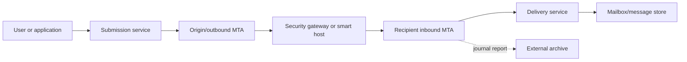

## SMTP Envelope versus Message Content

SMTP transports a mail object with two major parts:

1. **Envelope:** reverse-path from `MAIL FROM` and one or more forward-path recipients from `RCPT TO`.
2. **Content:** header section plus body transferred after `DATA`.

The message's visible `From`, `To`, and `Cc` fields are content. They do not define the authoritative SMTP route or complete recipient list. Bcc recipients deliberately need not appear in visible headers. Rules, aliases, groups, and forwarding can alter envelope recipients without rewriting visible `To`.

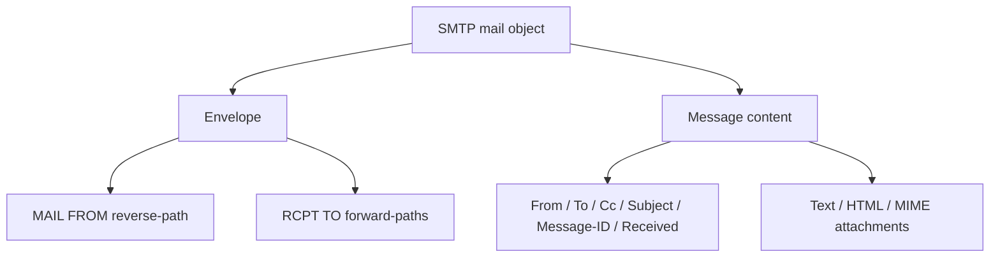

| Question | Use envelope or content? | Reason |
|---|---|---|
| Where should SMTP deliver now? | Envelope RCPT domain plus local route policy | Visible To may be stale, a list address, or absent for Bcc |
| Where should transport errors go? | Envelope reverse-path | Visible From can be a different identity |
| What author does the user see? | RFC5322.From content field | User-facing identity |
| Who were all SMTP recipients? | SMTP trace/log/queue metadata | Headers can omit Bcc or post-expansion recipients |
| Which domain drives MX lookup? | Current envelope recipient domain | Routing is not derived from Subject or From |
| What did a transport rule inspect? | Product-specific envelope/content fields | Rule predicates must be named exactly |

## 🔍 Plain-English deep-dive: The Address on the Letter Is Not the Courier Manifest

The `To:` line is printed inside the letter. The `RCPT TO` command is on the courier's manifest. Usually they resemble each other, but forwarding, Bcc, aliases, groups, and journaling make them diverge. A support engineer who routes from visible `To` can miss the actual recipient branch and can expose blind recipients.

For one message, the content might say `To: team@sender.example` while the envelope expands to three employees, one external archive contact, and a forwarded address. Each branch can receive a different SMTP outcome. Preserve the envelope evidence from traces instead of trying to reconstruct it from message headers.

## SMTP Handoff and Responsibility

The essential transaction is `EHLO`, `MAIL FROM`, one or more `RCPT TO`, `DATA`, content, and final response. A recipient can fail at RCPT before content transfer. A server can also reject after receiving content. The exact command stage identifies who saw what.

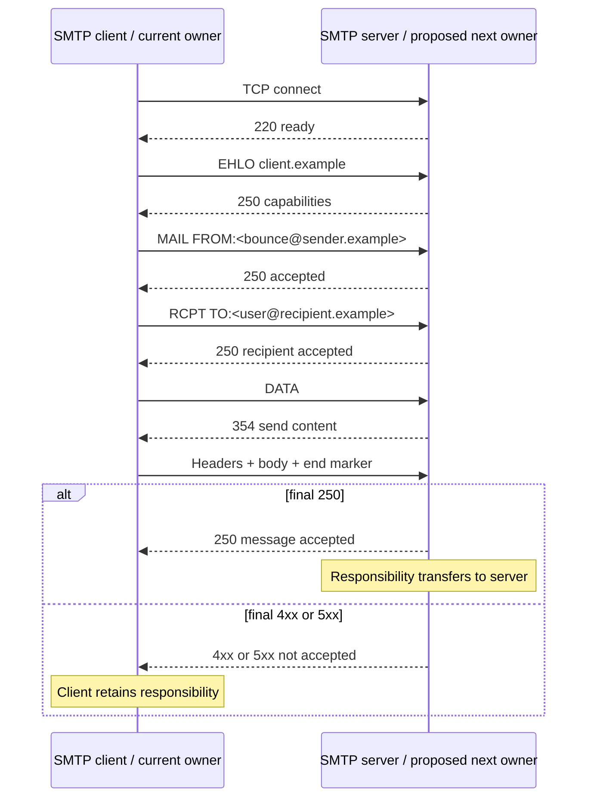

| First digit | Meaning | Client action | Ownership after final DATA reply |
|---:|---|---|---|
| 2 | Positive completion | Continue/mark handoff complete | Receiver accepted responsibility |
| 3 | Positive intermediate | Send required next data/command | Not final; transaction continues |
| 4 | Transient negative completion | Queue and retry with backoff | Client retains responsibility |
| 5 | Permanent negative completion | Do not repeat unchanged request automatically | Client retains responsibility and reports failure |

Enhanced codes use `class.subject.detail`. Subject `X.4.X` covers network and routing; `X.4.4` indicates unable to route and `X.4.6` a detected routing loop. `X.7.X` covers security or policy. Preserve both basic and enhanced codes plus response text; products register newer details over time.

### Ambiguous Handoffs and Duplicates

If the server stored the message but the final `250` was lost because the connection reset or timed out, the client cannot know that acceptance completed. Retrying is necessary for reliability and can create a duplicate. Correlate identical content, Message-ID, close timestamps, and repeated client/server transactions. This is not a routing fork or loop.

## MX Routing

When no explicit route overrides normal delivery, an SMTP client resolves the recipient domain. It looks for MX records. Lower numeric preference is tried before higher preference. Equal preference targets are alternatives and should be distributed appropriately. If no MX exists but the domain resolves appropriately, SMTP defines an implicit MX behavior; an explicit null MX and modern edge cases must be interpreted using current DNS/mail standards and provider behavior.

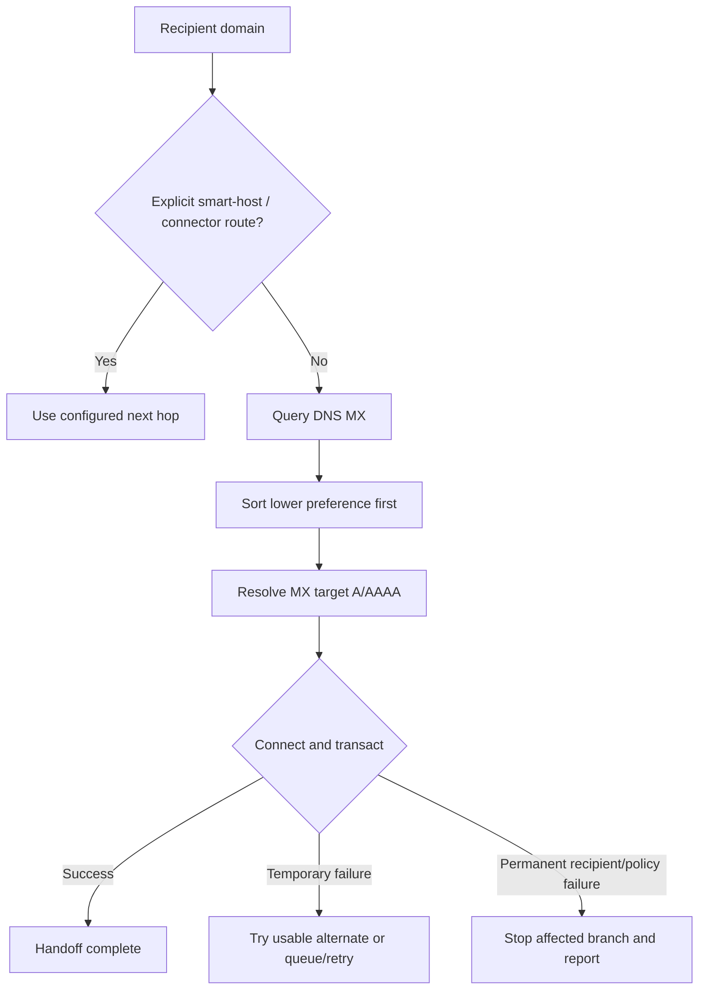

Synthetic DNS:

```text
recipient.example.  MX 10 mx1.recipient.example.
recipient.example.  MX 10 mx2.recipient.example.
recipient.example.  MX 20 backup.recipient.example.
```

`mx1` and `mx2` are equally preferred. `backup` is less preferred, despite its larger number. Backup MX must know how to relay toward the real destination without selecting itself or a worse route indefinitely.

| MX misunderstanding | Correct model |
|---|---|
| "20 has higher priority than 10" | Lower preference number is preferred |
| "Second MX is always failover only" | Equal preferences can share traffic; higher values are less preferred |
| "MX says where outbound mail must originate" | MX advertises inbound candidates, not outbound sender identity |
| "Every internal handoff follows public MX" | Smart hosts/connectors can override public DNS routing |
| "Changing MX moves existing queues instantly" | Cached DNS and already accepted/queued messages can follow prior state |
| "MX alone proves mailbox location" | MX can point to a filtering relay or gateway, not final storage |

## Relays, Gateways, and Secure Email Gateways

RFC 5321 distinguishes a relay from a gateway. A relay receives SMTP and retransmits via SMTP, normally preserving message data except for required trace additions. A gateway crosses transport environments and may need transformations. Industry uses "gateway" more broadly for an email-security service that receives and forwards SMTP while scanning or modifying messages.

| Role | Receives | Sends | May modify? | Key support concern |
|---|---|---|---|---|
| Relay | SMTP | SMTP | Trace additions; otherwise constrained by relay role | Next-hop route and queue |
| Protocol gateway | One environment | Different environment | Often necessary transformations | Information loss and address mapping |
| Secure email gateway | SMTP | SMTP | Scanning, headers, URLs, attachments, banners | Authentication breakage, true source, bypass route |
| Smart host | SMTP from configured clients | SMTP onward | Product-dependent | Central route and dependency |
| Final delivery system | SMTP/transport | Message store | Delivery processing | Recipient resolution and mailbox placement |
| Archive gateway | Journal/report SMTP | Archive ingestion | Envelope/report parsing | Completeness, duplicates, sensitive data |

A secure gateway can hide the original internet source from the downstream platform because every connection appears to come from gateway IPs. Downstream systems need a documented way to recover trustworthy original-source context, such as provider-specific enhanced filtering or trusted trace, without broadly bypassing protection for all traffic from shared gateway IPs.

## Common Topologies

### Direct Inbound and Outbound

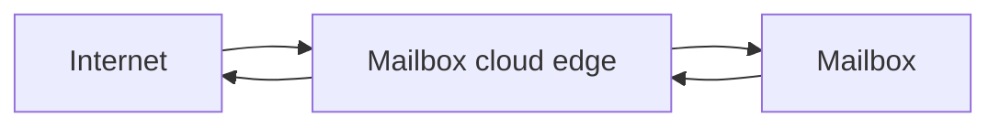

Simple topology reduces handoffs but still has provider-internal stages.

### Third-Party Gateway in Front

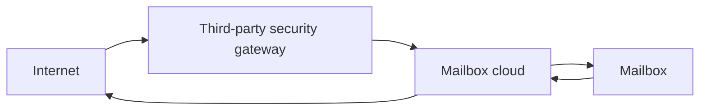

Public MX points to the gateway. The cloud destination should accept internet-domain traffic only through authenticated/restricted gateway paths when architecture requires that control; otherwise attackers may bypass the gateway by sending directly to the cloud host.

### Outbound Smart Host

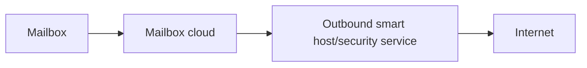

The cloud needs a route for scoped recipients or all internet mail, and the smart host must relay onward without routing the same message back.

### In-and-Out Filtering

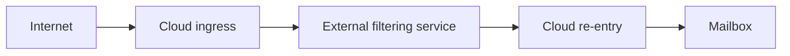

This topology is complex because the same cloud boundary appears twice. Connector identity, loop prevention, re-entry markers, duplicate scanning, and source attribution must be designed explicitly.

## Connectors as Route Contracts

A connector is best modeled as an `if` condition plus route/security behavior.

```text
IF message/source/recipient matches scope
THEN use destination or accept path
AND require specified source, certificate, TLS, or domain conditions
```

| Connector dimension | Question | Failure if wrong |
|---|---|---|
| Direction/endpoints | From which environment to which environment? | Connector never participates or applies backward |
| Scope | Which sender/recipient domains or traffic class match? | Overbroad route or unexpected non-match |
| Destination | DNS delivery or named smart host? | Wrong next hop, loop, or bypass |
| Source identity | IP, certificate, organization, authenticated session? | Spoofed path accepted or legitimate path rejected |
| TLS mode | Opportunistic, required, or validated identity? | Downgrade, deferral, or certificate mismatch |
| Recipient validation | Who knows valid recipients? | Backscatter, relay rejection, catch-all, or loop |
| Priority/precedence | What wins when several connectors match? | Wrong connector selected |
| Failure behavior | Queue, alternate route, reject, or fallback? | Security bypass or prolonged outage |
| Observability | What trace proves the connector matched? | "Enabled" but unproven handling |

Enabling a connector is not validation. Use a synthetic message and trace to prove the selected path, source restriction, certificate identity, TLS result, recipient branch, and downstream acceptance.

## 🔍 Plain-English deep-dive: TLS Encryption Is Not Connector Identity

TLS can encrypt a session without proving the peer is the exact business partner expected by a connector. Opportunistic STARTTLS often protects against passive observation when both sides support it, but it can fall back if not required. Required TLS prevents cleartext fallback. Certificate validation adds a peer identity condition. Source-IP restrictions add a different identity signal.

Think of a private conversation in a taxi. Closed windows provide confidentiality, but they do not prove which taxi company is driving. A checked company badge adds identity. A preapproved license plate adds another restriction. Each control answers a different question.

| Control | Main guarantee | Does not guarantee |
|---|---|---|
| Opportunistic TLS | Encryption when successfully negotiated | No downgrade, correct business partner, valid sender domain |
| Required TLS | Handoff does not proceed without TLS | Expected certificate identity unless separately validated |
| Certificate-name restriction | Peer presents acceptable certificate identity under configured validation | Message author identity or safe content |
| Source-IP restriction | Connection originates from allowed network address | Exclusive control forever, authenticated message content |
| Sender-domain scope | Connector/rule is considered for a domain | That the connection is truly from that domain without stronger condition |

Do not "fix" a TLS failure by silently allowing cleartext or removing identity validation. Determine whether the failure is certificate name, chain, expiration, protocol/cipher support, STARTTLS advertisement, hostname, routing, or clock.

## Transport Rules and Message Forking

Transport rules evaluate product-specific predicates and apply actions. Conditions can inspect sender, recipient, headers, size, attachment, sensitivity, authentication, or connection properties. Actions can reject, redirect, add recipients, Bcc, quarantine, prepend subject, add headers, route through a connector, encrypt, or stop further processing.

| Rule action | Route effect | Duplicate/loop risk |
|---|---|---|
| Reject | Terminates matching branch | Low, but post-acceptance reject can create NDR complexity |
| Redirect recipient | Replaces or changes destination | Can route back to original system |
| Add/Bcc recipient | Forks another recipient branch | Expected additional copy; privacy-sensitive |
| Route via connector | Overrides next hop | Can form cycle with destination default route |
| Add header | Marks processing state | Useful for loop prevention if protected and scoped |
| Modify Subject/body | Changes message | Can break DKIM and create apparent variants |
| Quarantine | Diverts delivery | May delay journaling or user visibility by product design |
| Stop processing | Prevents later rules | Rule order becomes decisive |

When a message has multiple recipients, systems can fork it because different recipients need different routes or policies. One original Message-ID can produce several queue IDs, traces, and journal reports. A fork is not automatically a duplicate defect.

## Accepted, Authoritative, and Relay Domains

Platforms use different names, but the routing questions are common:

- **Authoritative/final:** This system owns recipient validity and final delivery. Unknown recipients should terminate here rather than relay elsewhere.
- **Internal relay/shared namespace:** Some recipients are local; unresolved recipients route to another system.
- **External relay/partner route:** The system accepts for a domain and sends to a designated external owner.

| Domain state | Local recipient found | Local recipient not found | Loop risk |
|---|---|---|---|
| Authoritative | Deliver | Reject as unknown | Low if truly terminal |
| Internal relay | Deliver | Route to other namespace owner | High if other owner routes unknown back |
| Catch-all | Deliver designated catch-all | Accept broadly | Backscatter/abuse and hidden configuration errors |
| Misclassified relay | Maybe deliver | Forward by default | High |

A shared namespace requires a deterministic terminal owner. If Cloud A sends unknown recipients to Legacy B and Legacy B sends unknown recipients to Cloud A, the same unresolved address cycles.

## Split Delivery versus Dual Delivery

**Split delivery** sends each recipient to one owning system. **Dual delivery** intentionally sends a copy to two systems, often during migration or coexistence.

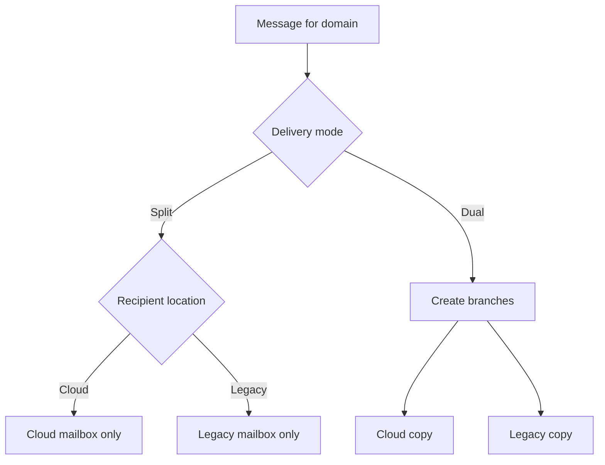

| Property | Split delivery | Dual delivery |
|---|---|---|
| Branches per recipient | One intended branch | Two intended branches |
| Main use | Shared namespace/migration with distinct mailbox ownership | Parallel migration/testing/coexistence |
| Recipient directory need | Accurate location/routing | Copy target must be deliberate |
| Duplicate mailbox risk | Misrouting or forwarding can duplicate | Inherent if both systems surface to same user |
| Reply/read-state consistency | One store simplifies | Stores diverge unless synchronized elsewhere |
| Loop risk | Unknown-recipient fallback cycle | Copy route can accidentally re-enter original branch |

Dual delivery is not journaling. Both dual-delivery branches are normal message deliveries. Journaling generates a compliance report for an archive and captures envelope information.

## Routing Loops

A loop is repeated forwarding caused by route logic, aliases, forwarding, or gateways. RFC 5321 requires provisions to stop trivial loops and notes that counting Received fields is an effective though imperfect mechanism, with a high threshold. Product-specific systems may stop much earlier using hop counts or loop headers.

### Loop State Model

Define a route state as:

$$
S = (\text{system}, \text{recipient}, \text{route class}, \text{processing marker})
$$

A harmful cycle exists when the same state recurs without progress toward a terminal owner.

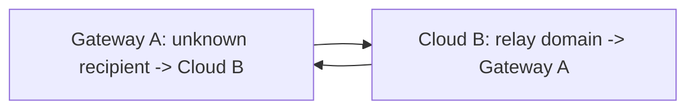

### Loop Evidence

| Evidence | Strength | Caveat |
|---|---|---|
| SMTP/trace explicitly reports `X.4.6` | Strong | Still identify route rules forming cycle |
| Received chain repeats A -> B -> A -> B | Strong | Verify fields are genuine/trusted and same message branch |
| Same Message-ID with rising hop count | Useful | Message-ID can be missing, duplicated, or changed |
| Repeated queue entries on both systems | Strong | Correlate recipient and time |
| Many Received fields | Suggestive | Long legitimate paths and list redistribution exist |
| Duplicate user copies | Weak for loop | Retry, dual delivery, rules, or forwarding may explain |

### Common Loop Patterns

1. Shared-domain unknown recipient bounces between cloud and on-premises systems.
2. Outbound smart host sends all mail back to the platform that selected it.
3. A transport rule routes messages to a service whose return path matches the same rule again.
4. Mailbox forwarding sends to an alias that resolves back to the source mailbox.
5. A journal/archive address is itself in journaling or forwarding scope.
6. A gateway derives envelope recipients incorrectly from visible headers.
7. A migration coexistence route treats both systems as non-terminal for the same recipient.

## 🔍 Plain-English deep-dive: A Loop Needs a Repeated Decision, Not Just Repeated Hosts

The same provider can legitimately appear more than once: ingress, an external service, and re-entry may all use it. A loop requires a repeated routing state. Ask what changed between appearances. If a marker says "already scanned" and re-entry uses a terminal route, the topology can be healthy. If the same recipient and route condition select the same external service again, it cycles.

Compare:

```text
Healthy: Cloud ingress -> Scanner -> Cloud re-entry (marked scanned) -> mailbox
Loop:    Cloud ingress -> Scanner -> Cloud re-entry (rule matches again) -> Scanner -> ...
```

The cheap test is whether the second pass has a condition that guarantees progress. A trustworthy processing marker, different connector scope, rewritten recipient, or terminal directory decision can provide progress. An unprotected sender-supplied header is not a safe loop-prevention marker.

## Loop Diagnosis Tree

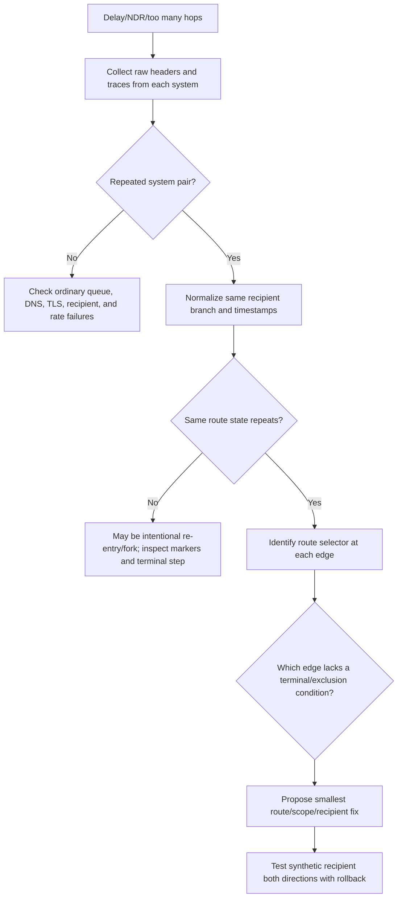

### Safe Loop Remediation

- Stop or narrow one cyclic branch, preserving a valid delivery path.
- Make one system authoritative for the affected recipient/domain, or provide accurate recipient location.
- Add a protected, provider-supported re-entry exclusion where architecture requires an external service.
- Correct connector scope rather than globally disabling protection.
- Drain or resubmit queues only under approved operational procedure; avoid multiplying duplicates.
- Test existing, unknown, external, group, forwarding, and null-reverse-path cases.

## Duplicate Delivery

Duplicates arise from several mechanisms with different ownership.

| Cause | Evidence pattern | Correct response |
|---|---|---|
| Ambiguous final DATA response | Same client retries after timeout/reset; receiver may have accepted first copy | Fix timeout/response path; support idempotent downstream behavior where possible |
| Deliberate dual delivery | Two configured branches at same fork time | Confirm migration design and user expectation |
| Rule adds/Bccs recipient | Trace shows recipient fork/action | Correct rule scope if unintended |
| Alias/group overlap | Same mailbox reachable through multiple expansion paths | Fix membership/expansion design |
| Forwarding back to another visible store | Separate accepted route and forward | Clarify mailbox/forwarding ownership |
| Journal report shown to user | Report envelope/body differs; original attached | Correct archive/report target routing |
| Hybrid journaling at two layers | Cloud and on-premises both journal | Apply supported duplicate-prevention design if appropriate |
| Actual loop before stop | Repeated hops and potentially repeated terminal attempts | Break route cycle first |

Use content hash carefully: gateways may add headers or modify URLs, so exact MIME hashes can differ while the user perceives duplicates. Message-ID is useful but not guaranteed unique. Combine sender, recipient, subject, body fingerprint, timestamps, and route evidence.

## Journaling

Journaling captures messages for compliance or external archival. In envelope journaling, a journaling agent creates a **journal report**. The report body contains envelope and message metadata, and the original message is included unaltered as an attachment according to the product's design. The report is delivered to a journaling destination, often an external archive.

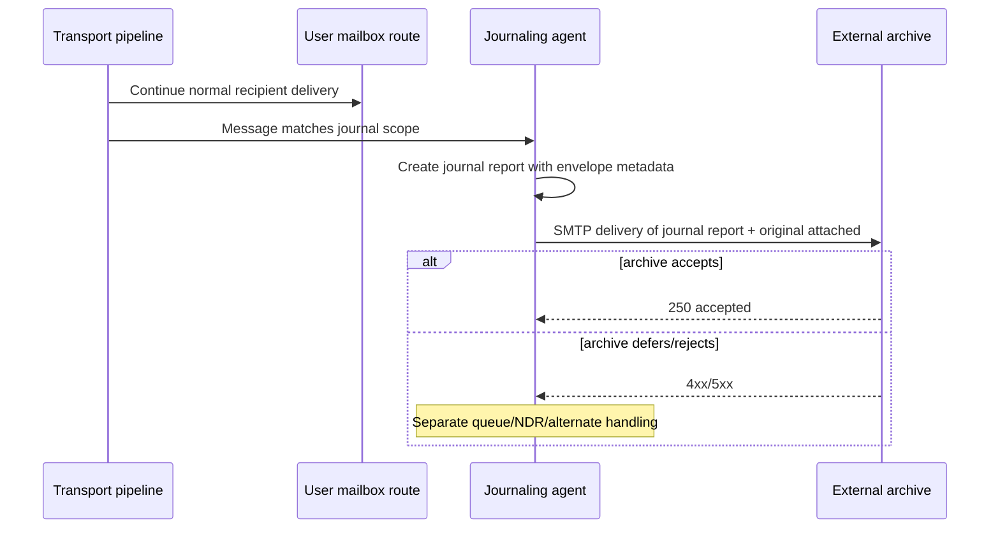

### Journal Components

| Component | Meaning | Common mistake |
|---|---|---|
| Journal scope | Internal, external, all, or product-specific match | Assuming every message must journal |
| Journal recipient | User/group whose sent/received traffic is in scope | Confusing with archive destination |
| Journaling mailbox/destination | Where journal reports are sent | Using an unsupported ordinary cloud mailbox |
| Journal report | New compliance message | Treating it as a duplicate original |
| Original attachment | Captured message | Parsing only report body and losing MIME fidelity |
| Alternate journal destination | Receives failed journal-report NDRs/copies per design | Failing to monitor or secure it |

### Journaling Is Not Retention

Journaling transports a copy out to an archive target. In-place retention preserves managed data inside a service under retention controls. Organizations choose based on legal, regulatory, product, and architecture requirements. Support must not provide legal conclusions; involve compliance and legal owners.

| Journaling | In-place retention |
|---|---|
| Generates and routes separate reports/copies | Applies policy to data in managed service |
| External dependency and SMTP path | Service-native storage/control path |
| Can queue, NDR, duplicate, or fail independently | Different failure and search model |
| Requires archive ingestion and reconciliation | Requires retention policy and service governance |
| Primarily email transport capture | Can cover broader collaboration data in modern suites |

### Journal Failure and Duplication

The user message can deliver while the journal report fails. Therefore, "message delivered" does not prove compliance capture. Monitor archive acceptance, queue age, NDR destination, reconciliation counts, and duplicate handling.

Duplicate reports can be by design when a message forks, matches rules with different destinations, or is journaled in both cloud and on-premises layers. Identify the journal report identity and original message metadata before deleting anything. Compliance data changes require explicit authorization.

## 🔍 Plain-English deep-dive: A Journal Copy Is a Receipt Package, Not a Second Delivery

Imagine a cashier sells an item to a customer and separately seals the transaction receipt plus a copy of the order into an auditor envelope. If the auditor envelope is delayed, the customer can still have the item. If someone accidentally routes auditor envelopes to the customer-service inbox, staff may think orders were duplicated even though they are looking at compliance packages.

Check the outer sender/recipient, content type, report metadata, and attached original. The journal report has its own SMTP transaction and can have a different Message-ID or queue identity. Correlate it to the original rather than counting it as another user delivery.

## Observability and Correlation

Every platform may assign new identifiers:

- Original RFC5322 Message-ID.
- SMTP queue ID in each MTA.
- Provider network message ID.
- Trace/correlation ID.
- Journal report Message-ID.
- Archive ingestion ID.
- API event ID.
- Recipient-specific fork ID.

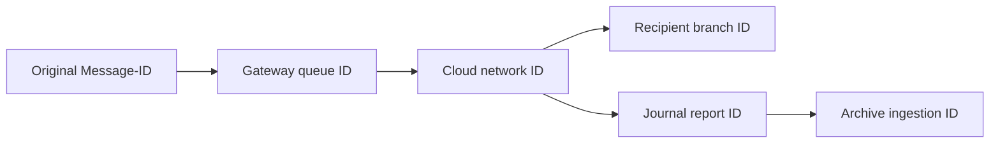

Build a correlation table instead of expecting one universal ID.

| System | Identifier | Recipient branch | Accepted time | Next hop/result |
|---|---|---|---|---|
| Origin |  |  |  |  |
| Gateway |  |  |  |  |
| Cloud |  |  |  |  |
| Mailbox |  |  |  |  |
| Journal agent |  | archive branch |  |  |
| Archive |  | archive branch |  |  |

### Common Observability Gaps

| Gap | Effect | Mitigation |
|---|---|---|
| Queue ID changes per hop | Searches appear disconnected | Correlate Message-ID, time, sender, recipient, and adjacent IDs |
| One trace ends at third party | Downstream status unknown | Request provider trace or SMTP acceptance evidence |
| Shared/NAT IP | Source identity ambiguous | Use certificate, tenant, connector, and trusted trace context |
| Header stripping/rewriting | Lost route/auth clues | Preserve original source from multiple boundaries when authorized |
| Fan-out | One message becomes several events | Track recipient branches separately |
| Bcc privacy | Visible headers omit recipient | Use authorized envelope trace; do not expose recipient list |
| Retention expiry | Historical evidence unavailable | Collect promptly and document gap |
| Clock/time-zone drift | Apparent negative latency or wrong order | Normalize UTC and note source clock quality |
| Post-acceptance product stage | SMTP says success but later action hidden | Query delivery/quarantine/archive stage separately |
| Journal outer/inner IDs | Archive looks like unrelated message | Parse report metadata and attached original |

## Safe Lab: Mail-Flow Topology and Loop-Diagnosis Tree

### Objective

Map a synthetic hybrid topology, identify a routing loop for one recipient class, distinguish a journal copy and an SMTP retry duplicate, and propose a minimal safe repair. No live DNS, mail sending, connector changes, or customer data is used.

### Safety Rules

- Use only `.example` domains and documentation IPs.
- Treat connector, rule, and trace rows as synthetic.
- Do not test open relay, scan public SMTP servers, or enumerate recipients.
- Do not modify production MX, connectors, accepted domains, forwarding, rules, or journaling.
- Do not delete queues or compliance data.
- Make recommendations reversible, owner-approved, and covered by rollback tests.

### Prerequisites

1. An authorized, non-production local study folder and a Markdown or spreadsheet editor.
2. This Part plus the linked SMTP and provider-routing sources for checking responsibility, connectors, loops, and journaling boundaries.
3. Only the supplied synthetic topology, trace, queue IDs, and journal fixture; no DNS query, SMTP probe, relay test, tenant, or configuration access is required.
4. A worksheet that records one recipient branch, UTC handoffs, route selectors, terminal owners, duplicate classification, rollback, and privacy/compliance constraints.

### Scenario Topology

`company.example` uses Gateway G as public MX. Cloud C hosts migrated mailboxes. Legacy L hosts remaining users. Archive A receives journal reports.

Configured routes:

| System | Match | Action |
|---|---|---|
| Public DNS | `company.example` | MX -> `gateway-g.example` |
| Gateway G | Accepted recipient for `company.example` | Smart host -> Cloud C |
| Cloud C | Known cloud recipient | Final cloud mailbox delivery |
| Cloud C | Unknown `company.example` recipient | Connector -> Legacy L |
| Legacy L | Known legacy recipient | Final legacy mailbox delivery |
| Legacy L | Unknown `company.example` recipient | Default smarthost -> Gateway G |
| Cloud C | All internal/external messages | Generate journal report -> Archive A |

The missing terminal rule is for a nonexistent recipient. G accepts it and sends to C. C cannot find it and sends to L. L cannot find it and sends to G. The same recipient cycles.

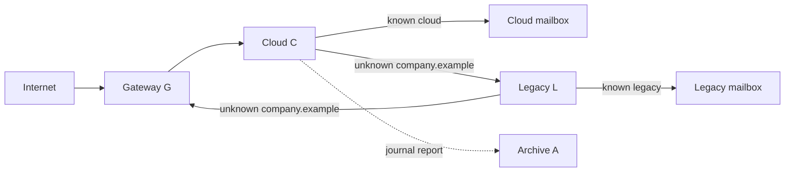

### Synthetic Trace for Nonexistent Recipient

```text
10:00:01 G accepted RCPT missing@company.example; queue G101; next=C
10:00:04 C accepted; network C202; recipient unknown; next=L
10:00:07 L accepted; queue L303; recipient unknown; next=G
10:00:10 G accepted; queue G404; next=C
10:00:13 C accepted; network C505; recipient unknown; next=L
10:00:16 L stops branch: 554 5.4.6 routing loop detected
```

### Exercise 1: Draw the Route State

| Step | System | Recipient | Route condition | Next hop | Terminal progress? |
|---:|---|---|---|---|---:|
| 1 | G | `missing@company.example` | Accepted domain | C | No |
| 2 | C | same | Unknown cloud recipient | L | No |
| 3 | L | same | Unknown local recipient/default route | G | No |
| 4 | G | same | Same accepted-domain condition | C | Repeated state |

Expected conclusion: G's state repeats with the same recipient and route. This is a loop, confirmed by `5.4.6`.

### Exercise 2: Identify the Smallest Repair

Candidate repairs:

| Proposal | Safety assessment |
|---|---|
| Make L reject unknown `company.example` recipients after checking its authoritative legacy directory | Strong if L is agreed terminal fallback and directory is accurate |
| Remove C -> L connector entirely | Breaks delivery to valid legacy recipients |
| Change G to send unknown recipients directly to internet MX | MX points back to G; cycle remains or bypasses intent |
| Add all recipients manually to G without lifecycle process | Fragile and creates stale directory risk |
| Make C authoritative immediately | Breaks valid legacy recipients unless migration is complete |

Best synthetic repair: establish L as terminal authority for the legacy fallback and reject unknown recipients there, or provide synchronized recipient validation at G/C so nonexistent recipients are rejected earlier. The owner must choose based on architecture.

### Exercise 3: Test Recipient Classes

| Test | Expected healthy path |
|---|---|
| Known cloud user | G -> C -> cloud mailbox |
| Known legacy user | G -> C -> L -> legacy mailbox |
| Unknown company recipient | Reject at validated edge/terminal owner; no return to G |
| External recipient from cloud user | C -> configured outbound route -> internet; no inbound re-entry |
| Group with cloud and legacy members | Controlled fork, each branch terminal |
| Null reverse-path notification | Routes without generating another error notification on failure |
| Journal report | C -> A, excluded from recursive journaling as product design requires |

### Exercise 4: Distinguish a Retry Duplicate

Separate synthetic case:

```text
11:00:00 Sender S transmits Message-ID <dup1@sender.example> to G
11:00:04 G stores message and sends final 250, but TCP response is lost
11:15:00 S retries same transaction
11:15:04 G accepts second copy
```

This produces two downstream copies without a repeated route cycle. The defect is an ambiguous final acknowledgment/duplicate-suppression problem. Evidence is two origin-to-G transactions, not G -> C -> L -> G.

### Exercise 5: Distinguish a Journal Report

Synthetic archive item:

```text
Outer recipient: archive@archive-a.example
Outer subject: Journal Report
Outer Message-ID: <jr-C202@cloud-c.example>
Report metadata original Message-ID: <user1@company.example>
Attachment: message/rfc822 original message
```

Expected conclusion: this is a compliance branch, not a second user delivery. If it appears in a user mailbox, investigate archive/contact routing or forwarding.

### Exercise 6: Build the Loop-Diagnosis Tree

1. Confirm whether outcome is delay, NDR, duplicate, or archive gap.
2. Normalize one recipient branch and UTC timeline.
3. Locate repeated system/recipient/route state.
4. Identify each edge's route selector.
5. Find missing terminal authority or exclusion marker.
6. Select the smallest change preserving valid branches.
7. Test all recipient classes and rollback.
8. Monitor queues, loop codes, duplicates, and journal acceptance.

### Exercise 7: Support Conclusion

> **[Observation]** Public MX sends `company.example` to Gateway G. G sends accepted recipients to Cloud C; C sends unresolved recipients to Legacy L; L sends unresolved recipients back to G. For `missing@company.example`, traces show G -> C -> L -> G with unchanged recipient and repeated route state, ending in `554 5.4.6`. **[Inference]** The cloud/legacy fallback design lacks a terminal authority for nonexistent recipients. **[Private unknown]** Directory ownership and the approved rejection boundary must be confirmed by the messaging team. **Safe next action:** establish recipient validation at the earliest reliable edge or make Legacy L terminal for unresolved fallback recipients, then test cloud, legacy, unknown, group, outbound, notification, and journal branches. Do not remove the cloud-to-legacy connector globally because valid legacy delivery depends on it.

### Expected evidence

The lab should produce an inspectable topology, route-state table showing the repeated G state, smallest-repair comparison, seven-class test matrix, retry-duplicate timeline, journal outer/inner identifier annotation, loop-diagnosis tree, and bounded support conclusion. Every route claim should point to a synthetic selector, handoff, or terminal condition.

### Cleanup and privacy

- Retain only the supplied `.example` topology, synthetic queue/message IDs, journal fixture, and derived worksheets.
- Delete or redact any accidentally pasted customer addresses, Bcc/envelope recipients, message content, connector certificates, tenant/host identifiers, queue data, journal records, secrets, or personally identifiable information (PII); delete the artifact if reliable redaction is not possible.
- Do not send mail, probe SMTP, test relay, modify MX/connectors/rules/journaling, delete queues/compliance records, or contact third-party infrastructure.
- Confirm before retention or sharing that no live routing, mail, DNS, tenant, archive, compliance, or customer activity occurred.

### Validation rubric

| Dimension | Fail | Developing | Pass |
|---|---|---|---|
| Topology and route selectors | Draws only products/arrows | Names most hops | Records every route condition, next hop, ADMD owner, recipient branch, and terminal/fallback behavior |
| Loop proof | Calls delay or many hops a loop | Spots repeated systems | Demonstrates repeated system-recipient-route state and relates it to the exact trace/status |
| Smallest repair | Removes a required connector or weakens security | Proposes terminal validation broadly | Preserves valid cloud/legacy branches, defines owner, rollback, and negative tests |
| Duplicate/journal distinction | Counts every copy as a retry/loop | Separates one copy type | Correctly distinguishes fork, ambiguous retry, group/forward, loop, and journal outer/inner branch |
| Evidence and communication | Uses vague sent/delivered claims | Builds partial handoff table | Correlates IDs/UTC/SMTP proof ceilings and states observation, inference, unknown, and owner |
| Safety, privacy, compliance | Uses live relay/config/data or deletes evidence | Synthetic lab with weak cleanup | No live activity, Bcc/content redacted, compliance scope protected, and no production claim |

## Support Runbook

### Intake

- Sender, envelope recipient, visible recipient, UTC time, Message-ID.
- Symptom: delay, deferral, rejection, duplicate, wrong route, bypass, or archive gap.
- All systems expected in path and final mailbox owner.
- Recent MX, connector, rule, accepted-domain, migration, forwarding, TLS, or journal changes.

### Topology Collection

- Public and private DNS/MX where authorized.
- Smart hosts and connector scopes/destinations.
- Accepted/relay/authoritative domain behavior.
- Transport rules that route, redirect, add recipients, or modify.
- Recipient directory/location source.
- Gateway bypass prevention and true-source recovery.
- Journal rule scope, destination, alternate handling, and archive requirements.

### Trace Collection

- Raw Received chain.
- SMTP basic/enhanced code, response text, and command stage.
- Queue and provider trace IDs.
- Envelope sender and recipient branch.
- TLS/certificate/source-IP evidence.
- Rule/connector match evidence.
- Journal report outer and original identifiers.

### Diagnosis

1. Identify current owner from last successful handoff or active queue.
2. Determine why each next hop was selected.
3. Separate temporary from permanent failure.
4. For loops, find repeated route state.
5. For duplicates, classify fork, retry, expansion, forwarding, journaling, or loop.
6. For archive gaps, trace report branch independently.
7. State observability gaps and request the next owner's evidence.

### Change Safety

- Use synthetic controlled recipients.
- Preserve a rollback route.
- Verify no open relay or gateway bypass.
- Test inbound, outbound, cloud, legacy, unknown, group, forwarding, Bcc, notification, and journal paths.
- Monitor queues and NDRs before and after.
- Never weaken TLS or connector identity merely to make a test pass.
- Involve compliance/legal owners for journal scope or data handling.

## Case Summary Template

### Symptom

- UTC window:
- Sender / MAIL FROM:
- Envelope recipient:
- Visible To/Cc:
- Message-ID:
- Outcome and exact SMTP/trace status:

### Topology

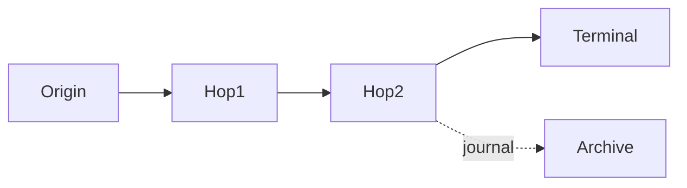

### Route Table

| System | Input scope | Route selector | Next hop | Security condition | Terminal/fallback |
|---|---|---|---|---|---|
|  |  |  |  |  |  |

### Handoff Evidence

| UTC | System | Queue/trace ID | Recipient branch | SMTP result | Next action |
|---|---|---|---|---|---|
|  |  |  |  |  |  |

### Duplicate or Loop Classification

- Repeated route state:
- Deliberate fork:
- Ambiguous final acknowledgment:
- Alias/group/forwarding overlap:
- Journal report relationship:
- Verdict:

### Conclusion

- **[Observation]:**
- **[Configured state]:**
- **[Inference]:**
- **[Private unknown]:**
- Smallest safe change/test:
- Rollback and monitoring:

## Security, Privacy, and Compliance Boundaries

Mail topology changes have large blast radius. An overbroad connector can create open relay, allow spoofed partner traffic, bypass a secure gateway, downgrade TLS, or expose a journal stream. An incorrect transport rule can silently add recipients or leak Bcc data. A journal archive contains sensitive communications and envelope metadata.

| Risk | Unsafe shortcut | Safer posture |
|---|---|---|
| Gateway bypass | Leave cloud host open while MX points to gateway | Restrict path using supported certificate/IP controls and validate fail-closed behavior |
| Open relay | Accept arbitrary source and external recipient | Authenticate/authorize relay narrowly and test only in owned environment |
| TLS downgrade | Disable requirement after certificate failure | Repair identity/chain/route and preserve required TLS |
| Spoofed connector match | Trust sender domain alone | Use supported connection/certificate identity and message authentication |
| Bcc disclosure | Copy all RCPT values into headers/tickets | Use authorized trace and redact recipient data |
| Journal loss | Ignore archive NDR/queue | Monitor, reconcile, and protect alternate failure path |
| Journal overcollection | Expand scope for convenience | Obtain compliance/legal approval and data-minimize |
| Queue duplication | Resubmit blindly | Establish handoff state and follow controlled replay procedure |

## Official Source Anchors

All listed sources were accessed on August 24, 2026 and must be revalidated for current provider behavior.

| Source | What it establishes |
|---|---|
| [RFC 5321](https://www.rfc-editor.org/rfc/rfc5321) | SMTP object, transaction, MX routing, relays/gateways, `250` responsibility, retries, Received trace, null reverse-path, and loop detection |
| [RFC 3463](https://www.rfc-editor.org/rfc/rfc3463) | Enhanced status structure and address/mailbox/system/routing/protocol/content/policy categories, including `X.4.6` |
| [RFC 3207](https://www.rfc-editor.org/rfc/rfc3207) | STARTTLS extension for SMTP |
| [Exchange Online connector guidance](https://learn.microsoft.com/en-us/exchange/mail-flow-best-practices/use-connectors-to-configure-mail-flow/use-connectors-to-configure-mail-flow) | Product example of connector endpoints, partner restrictions, relay scenarios, and open-relay warning |
| [Microsoft third-party mail-flow guidance](https://learn.microsoft.com/en-us/exchange/mail-flow-best-practices/manage-mail-flow-using-third-party-cloud) | Gateway-fronted MX, cloud lockdown, source preservation, filtering risks, and complex in-and-out patterns |
| [Exchange Online journaling](https://learn.microsoft.com/en-us/exchange/security-and-compliance/journaling/journaling) | Envelope journal reports, scopes, external destinations, failure handling, duplication, and modern retention alternative |

Always check the target provider's current connector precedence, limits, certificate matching, enhanced filtering, journal support, and trace retention before giving configuration commands.

## Likely Interview Questions

### Q1. How does an SMTP server choose the next hop?

**Model answer:** It starts from the current envelope recipient domain and local routing policy. A scoped connector or smart-host rule can override ordinary DNS. Otherwise the client resolves MX records, preferring lower numeric values and using equal preferences as alternatives, then resolves target addresses and attempts delivery. I record the exact route selector at every hop because public MX may point only to a gateway, not the final mailbox.

### Q2. What happens after a server returns `250` at the end of DATA?

**Model answer:** The receiving server has accepted responsibility to deliver, relay, retry transient downstream failures, or later generate an appropriate failure notification. The sending client marks that handoff complete. If the final response is lost after the receiver stores the message, the sender may retry and create a duplicate because SMTP does not provide universal end-to-end deduplication.

### Q3. What is a connector?

**Model answer:** A connector is scoped routing and security configuration. It has a direction or endpoints, match conditions, destination behavior, and optional requirements such as source IP, TLS, or certificate identity. It is not proven to work merely because it is enabled. I validate which connector matched a synthetic message, the selected next hop, TLS identity, recipient branch, and failure behavior.

### Q4. How do you diagnose a mail loop?

**Model answer:** I normalize one recipient branch and build a UTC handoff table from traces, queues, and Received fields. Then I look for a repeated route state: same system, recipient, route class, and processing condition without progress. I identify the rule selecting each cyclic edge and the missing terminal authority or re-entry exclusion. `X.4.6` or repeated A -> B -> A evidence is strong, but many Received fields alone are not enough.

### Q5. How is dual delivery different from split delivery and journaling?

**Model answer:** Split delivery chooses one mailbox system per recipient, often in a shared namespace. Dual delivery intentionally sends ordinary copies to two mailbox systems. Journaling creates a separate compliance report, usually carrying envelope metadata and the original message as an attachment, for an archive. Dual delivery can intentionally produce two user-visible stores; a journal report should not be counted as a second normal delivery.

### Q6. What is the difference between opportunistic and required TLS?

**Model answer:** Opportunistic TLS encrypts when negotiation succeeds but may allow cleartext fallback. Required TLS refuses the handoff without encryption. Certificate-name or chain validation adds peer identity, and source-IP restriction is another independent condition. I do not disable TLS requirements to solve delivery; I isolate STARTTLS, protocol, certificate, hostname, route, or clock failure.

### Q7. Why can journaling fail while the user receives the message?

**Model answer:** User delivery and journal-report delivery are separate branches. The journaling agent creates a report and submits it to an archive destination with its own SMTP transaction, queue, and failure handling. The mailbox branch can complete while the archive defers or rejects. Compliance completeness therefore requires archive acceptance monitoring, NDR handling, reconciliation, and secure alternate processing.

### Q8. How do you distinguish a routing duplicate from an SMTP retry duplicate?

**Model answer:** A routing duplicate shows deliberate or accidental parallel branches, such as dual delivery, rule-added recipients, groups, forwarding, or journaling. An SMTP retry duplicate often shows the same client resending after an ambiguous final acknowledgment: the receiver stored the first copy but the client did not receive `250`. I correlate Message-ID, content fingerprint, queue IDs, client/server pairs, and timestamps. A loop additionally repeats route state across hops.

## 🧠 30-Second Memory Hooks

- **Route the envelope, display the headers.**
- **MX is public next-hop discovery; smart host is configured override.**
- **Lower MX number wins.**
- **Connector = scope + route + security + failure behavior.**
- **Final `250` transfers responsibility.**
- **4xx retry; 5xx stop unchanged.**
- **Loop = repeated route state without progress.**
- **Duplicate is not automatically a loop.**
- **Split chooses one; dual chooses two; journal makes a compliance report.**
- **TLS privacy, peer identity, and sender identity are separate.**
- **One message can have many queue IDs.**
- **User delivered does not mean archive captured.**

## Completion Checklist

- [ ] I can separate SMTP envelope recipients from visible To/Cc/Bcc behavior.
- [ ] I can explain origin, relay, gateway, and final delivery roles.
- [ ] I can select MX order correctly and recognize smart-host override.
- [ ] I can state who owns a message after `2xx`, `4xx`, or `5xx` at final DATA.
- [ ] I preserve enhanced code, response text, command stage, host, and UTC time.
- [ ] I can map connector scope, destination, source identity, TLS, and precedence.
- [ ] I do not equate encryption with authenticated partner identity.
- [ ] I can identify a missing terminal owner in a shared namespace.
- [ ] I can distinguish intentional re-entry from a repeated route state.
- [ ] I can classify duplicates as retry, fork, expansion, forwarding, journal, or loop.
- [ ] I can explain split delivery, dual delivery, and journaling separately.
- [ ] I can trace a journal report independently from user delivery.
- [ ] I can build a cross-system correlation table despite changing queue IDs.
- [ ] I protect Bcc, journal data, certificates, and customer traces.
- [ ] I propose minimal reversible route changes with complete branch tests.

[Next: Part 031 - Microsoft 365 Exchange Online Mail Flow](Part-031-microsoft-365-exchange-online-mail-flow.md)