# Part 031 - Microsoft 365 Exchange Online Mail Flow

## Purpose, Evidence, and Currency

Exchange Online is Microsoft's cloud mailbox and transport service. Exchange Online Protection (EOP) provides cloud email hygiene and policy capabilities around mail entering, leaving, or traversing supported Microsoft 365 organizations. Microsoft Defender for Office 365 adds licensed protection, investigation, and remediation capabilities such as Safe Links, Safe Attachments, Threat Explorer, automated investigation, and advanced response workflows. The Exchange admin center (EAC), Microsoft Defender portal, PowerShell, message headers, and SMTP logs expose different slices of the same message journey.

The support challenge is not memorizing portal menus. It is reconstructing one recipient branch across layers that can each change status:

$$
\text{Observed outcome} = \text{routing} + \text{transport policy} + \text{protection verdict} + \text{mailbox action} + \text{post-delivery action}
$$

A message can be accepted by EOP, expanded to several recipients, delivered to one mailbox, quarantined for another, forwarded for a third, and later removed from the first mailbox by Zero-hour Auto Purge (ZAP) or an administrator. A summary row that says `Delivered` is not necessarily the final current location. A quarantine item is not the same as an SMTP rejection. A connector that accepted a session does not prove a mail flow rule did or did not apply.

This lesson builds on the user's Microsoft cloud experience as a strength. Familiar ideas such as tenant boundaries, role-based access control, admin portals, audit evidence, service-side telemetry, and least privilege transfer directly. The lesson adds mail-specific control planes: accepted domains, directory recipients, connectors, mail flow rules, EOP/Defender policies, message trace, quarantine, and remediation.

Product behavior, licensing, portal paths, limits, and retention windows change. Current Microsoft Learn documentation is the source of truth for exact operations. This lesson deliberately separates durable architecture from current operational values. Where a limit is useful, it is labeled as current provider policy and should be rechecked before production use.

## Section Goal

By the end of this part, you should be able to:

- Explain the conceptual Exchange Online path from public MX/EOP through recipient resolution, policy, protection, routing, and mailbox delivery.
- Distinguish Exchange Online, EOP, Defender for Office 365, Microsoft Defender XDR, EAC, and Purview responsibilities at a high level.
- Explain accepted domains and the difference between `Authoritative` and `Internal relay`.
- Explain Directory-Based Edge Blocking (DBEB) and why directory completeness matters.
- Determine when a connector is required and map its endpoints, scope, restrictions, destination, and validation evidence.
- Model a third-party secure email gateway in front of Microsoft 365 without losing original-source visibility or allowing direct bypass.
- Read mail flow rule conditions, exceptions, actions, priority, mode, sender-address location, error action, and stop-processing behavior.
- Apply the rule logic: multiple conditions are AND, multiple values in one condition are commonly OR, and multiple exceptions are OR.
- Distinguish transport rule actions from EOP/Defender verdicts and mailbox Inbox rules.
- Explain EOP spam/phish/malware handling and the licensed feature boundary for Defender for Office 365.
- Distinguish SMTP rejection, message trace failure, spam filtering, quarantine, Junk delivery, mailbox delivery, ZAP, and admin remediation.
- Use Message-ID, Network Message ID/MessageTraceId, sender, recipient, UTC time, and event details to correlate message trace records.
- Interpret common trace events such as Receive, Send, Deliver, Fail, Defer, Expand, Transfer, Resolved, and rule events.
- Explain why a single message can have multiple trace rows and IDs after expansion or bifurcation.
- State current message-trace windows and result limits as provider policy that must be rechecked.
- Build an Exchange Online conceptual flow and a safe lab plan without requiring tenant access.
- Produce an admin-evidence package that respects permissions, privacy, and destructive-action controls.

## JD Mapping

| Role responsibility | Exchange Online capability | Example support output |
|---|---|---|
| Diagnose inbound mail | Join EOP acceptance, recipient resolution, policy, verdict, and delivery | "EOP received the message, DBEB resolved the recipient, and the anti-phish policy quarantined it before mailbox delivery." |
| Diagnose outbound mail | Trace submission, rule/connector, send, and remote response | "The message matched the partner route, but the destination deferred the TLS handoff." |
| Support hybrid/coexistence | Apply accepted-domain and connector logic | "Unknown recipients relay on-premises because the domain is Internal relay; the connector is the next dependency." |
| Investigate false positives | Separate verdict, action, policy scope, and current location | A message trace plus quarantine/Explorer evidence package |
| Investigate delivered threats | Use ZAP/remediation and Action Center history | "Delivery occurred first; later protection intelligence moved the item after delivery." |
| Validate configuration | Inspect rule priority/mode and connector restrictions | A synthetic test matrix with expected trace events |
| Communicate limitations | Label licensing, retention, and private scoring | "The tenant lacks the advanced Explorer feature; message trace and quarantine remain available evidence." |
| Protect customer data | Use least privilege and avoid exporting unnecessary content | Metadata-first investigation and redacted escalation |

## Candidate Honesty Note

If your background includes Microsoft cloud administration but not Exchange Online mail-flow ownership, say:

> "My Microsoft cloud experience gives me a strong base in tenants, identity, RBAC, portals, and audit evidence. For Exchange Online I would apply that foundation to accepted domains, connectors, mail flow rules, message trace, quarantine, and Defender actions. I would start with a read-only topology and one recipient branch, verify the exact policy or rule that acted, and use a synthetic lab plan before proposing a change. I would not claim a protection verdict from a transport status alone."

This leans into real transferable skills without overstating product depth.

## Evidence Labels Used in This Part

| Label | Meaning | Exchange Online example |
|---|---|---|
| **[Provider behavior]** | Current Microsoft-documented operation | "A current V2 trace query can search data from the last 90 days in bounded windows." |
| **[Configured state]** | Exported tenant configuration | "`company.example` is `InternalRelay`, and outbound connector `To-Legacy` targets the on-premises host." |
| **[Observation]** | Message trace, header, quarantine, Action Center, SMTP, or audit result | "The recipient branch has Receive, Transfer, and Quarantined events." |
| **[Inference]** | Testable explanation | "A rule-induced bifurcation explains why one recipient delivered while another quarantined." |
| **[Licensed unknown]** | Feature availability not established | "Threat Explorer access is not confirmed for this tenant." |
| **[Private unknown]** | Service-side scoring or unavailable event detail | "The complete proprietary phish-model weighting is not exposed." |

## Beginner Primer: One Message, Several Microsoft 365 Decisions

Think of Exchange Online as an airport with several checkpoints. The public entrance accepts travelers for the airport's destinations. A directory checkpoint confirms whether a traveler belongs there or should continue to another airport. Customs applies organization rules. Security scanners assign threat verdicts. A gate routes each passenger to the correct plane. After boarding, security can still receive new intelligence and remove a dangerous passenger before departure or at a later controlled point.

The analogy maps as follows:

| Mail component | Airport analogy | Main question |
|---|---|---|
| Public MX / EOP edge | Airport entrance | Did Microsoft receive the SMTP transaction? |
| Accepted domain | Airport's served-destination list | Is this domain handled by the tenant? |
| Directory/DBEB | Passenger manifest | Is the recipient valid at this boundary? |
| Connector | Contracted transfer lane | Which trusted environment or next hop applies? |
| Mail flow rule | Customs rule | Did tenant transport policy take action? |
| EOP/Defender policy | Security screening | What verdict and action applied? |
| Exchange transport | Gate-routing system | Where does this recipient branch go? |
| Mailbox/Junk/quarantine | Destination holding area | Where is the item now? |
| ZAP/admin remediation | New intelligence response | Was the item moved or deleted after delivery? |

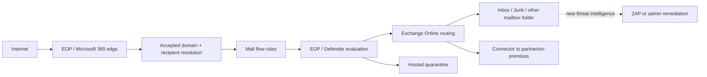

The exact service implementation can contain more stages and parallel decisions. Use the diagram as a troubleshooting model, not a claim about undisclosed internal ordering.

## Microsoft 365 Email Components

| Component | Main role | Evidence surface | Common confusion |
|---|---|---|---|
| Exchange Online | Cloud mailboxes and transport | EAC, message trace, PowerShell, headers | Treated as identical to all Defender security features |
| EOP | Baseline cloud email protection and policy | Defender portal, headers, reports, quarantine | Called "Defender" without license distinction |
| Defender for Office 365 | Advanced prevention, hunting, investigation, remediation | Explorer, incidents, Action Center, policy pages | Assumed present in every tenant |
| Microsoft Defender XDR | Cross-workload incidents/actions and unified controls | Defender portal, incidents, Advanced Hunting | Confused with transport configuration |
| Exchange admin center | Exchange recipient, flow, domain, connector, rule, trace administration | EAC pages and role-scoped actions | Used for features moved to Defender/Purview |
| Microsoft Purview | Compliance, retention, eDiscovery, data governance | Purview portal and audit/compliance tools | Confused with legacy journaling or threat remediation |

Licensing and permissions shape available evidence. A missing button can mean no license, insufficient role, portal change, feature rollout, or wrong object scope. It does not prove the message skipped that service.

## 🔍 Plain-English deep-dive: A Portal Is a Window, Not the System

The same message can appear in EAC message trace, Defender quarantine, Explorer, Action Center, audit records, and raw headers. Each window answers a different question. A portal may hide details due to role, retention, licensing, or report type.

Use the smallest authoritative surface:

- Transport path and recipient events: message trace.
- Current quarantine item and allowed actions: quarantine.
- Threat campaign and advanced hunting: Explorer/Defender features when licensed.
- Destructive or move action history: Action Center and audit evidence.
- Tenant route and policy configuration: EAC/PowerShell configuration export.
- End-user current folder: mailbox evidence, not trace alone.

Never conclude "nothing happened" merely because one portal search returned no row. Check time range, time zone, identifier format, recipient branch, permissions, data delay, report retention, and adjacent evidence.

## Domain Onboarding and Public MX

Adding a custom domain to Microsoft 365 establishes ownership and service configuration. Mail delivery still depends on DNS and recipient objects. The public MX might point directly to the tenant's EOP hostname or to a third-party gateway that relays to Microsoft 365.

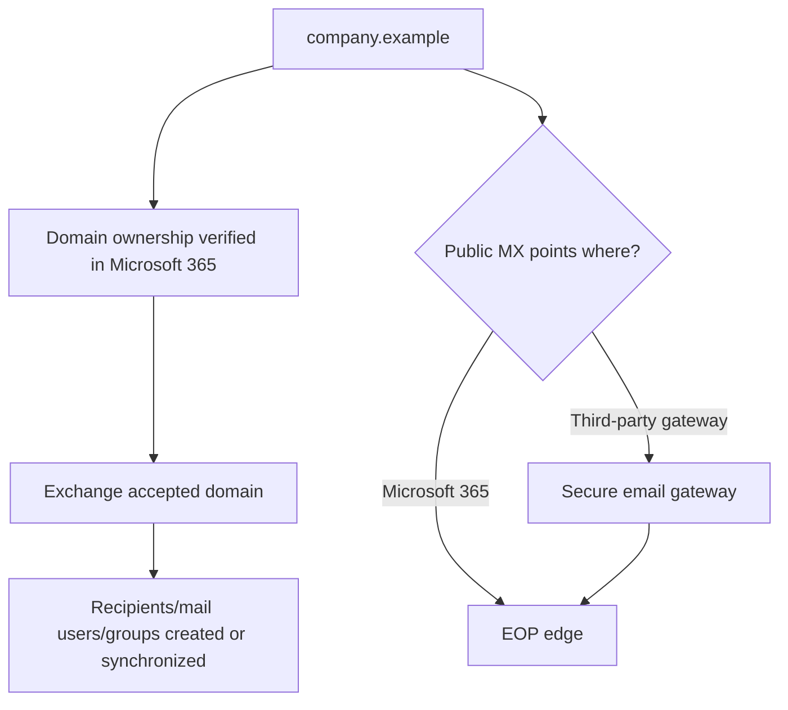

| Layer | Configuration question | Failure example |
|---|---|---|
| Domain ownership | Is the domain verified in the correct tenant? | Domain cannot be fully configured |
| Accepted domain | Is type Authoritative or Internal relay? | Unknown-recipient handling is wrong |
| Recipient directory | Does the object/proxy address exist and synchronize? | DBEB rejection or wrong routing |
| Public MX | Does DNS point to intended ingress? | Mail bypasses service or goes to old gateway |
| Gateway route | Does gateway target the tenant's actual service hostname? | Relaying or TLS failure |
| Inbound restriction | Must mail arrive from gateway cert/IP? | Direct-to-cloud bypass or legitimate rejection |

## Accepted Domains

An accepted domain tells Exchange Online that the tenant handles mail for that domain. Current Exchange Online exposes two domain types: `Authoritative` and `Internal relay`.

### Authoritative

Known recipients are delivered according to tenant objects and routes. Unknown recipients are rejected. Microsoft documentation associates authoritative behavior with Directory-Based Edge Blocking when configured and eligible. Use Authoritative when Exchange Online has the recipient knowledge needed to make the final decision, including mail users for recipients hosted elsewhere when that architecture requires them.

### Internal Relay

Known cloud recipients are delivered in Exchange Online. Recipients not known to Microsoft 365 are relayed to an organization's other mail system through a connector. This is used for shared namespaces or coexistence. If all recipients are cloud-hosted, Internal relay adds unnecessary fallback risk.

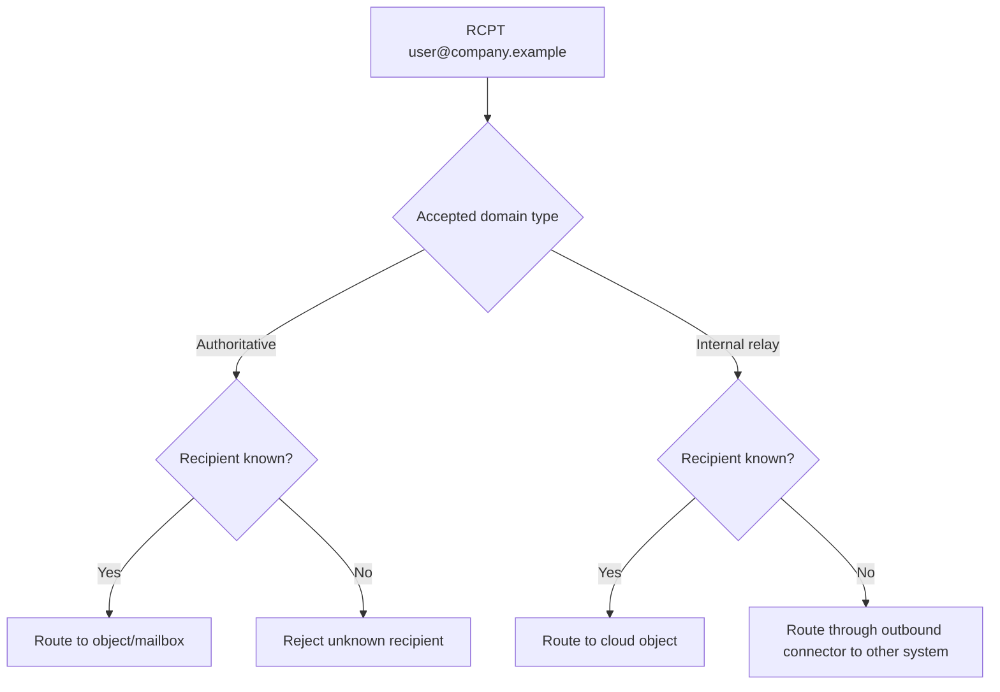

| Domain type | Known recipient | Unknown recipient | Required dependency | Main risk |
|---|---|---|---|---|
| Authoritative | Deliver/route by object | Reject | Complete recipient directory | Valid external-hosted recipients omitted from directory |
| Internal relay | Deliver/route by object | Relay onward | Correct connector and terminal other system | Loop/backscatter if other system returns unknowns |

### Directory-Based Edge Blocking

DBEB rejects messages for invalid recipients at the service perimeter when applicable. This reduces directory-harvest exposure, downstream processing, and backscatter. It relies on recipient data being correct. During migration, missing mail users, proxy addresses, groups, or synchronization can turn valid recipients into edge rejections.

## 🔍 Plain-English deep-dive: Authoritative Means Someone Must Say "No"

In a shared domain, every unknown recipient needs a terminal answer. `Internal relay` means Exchange Online is not that final authority; it asks the other system. The other system must either own the recipient or reject it. If it sends unknown recipients back to Microsoft 365, the design has no adult at the end of the line and can loop.

`Authoritative` moves the final "no such recipient" decision to Exchange Online. That is safe only when its directory contains every recipient or routing object it must recognize. The choice is therefore not cosmetic. It declares who owns recipient truth.

## Conceptual Inbound Flow

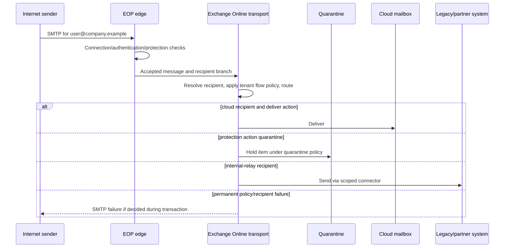

This is a conceptual evidence map. Some protection and policy decisions occur at different internal points. The practical method is to follow provider-exposed events and policy evidence for the message rather than infer hidden stage order.

## Conceptual Outbound Flow

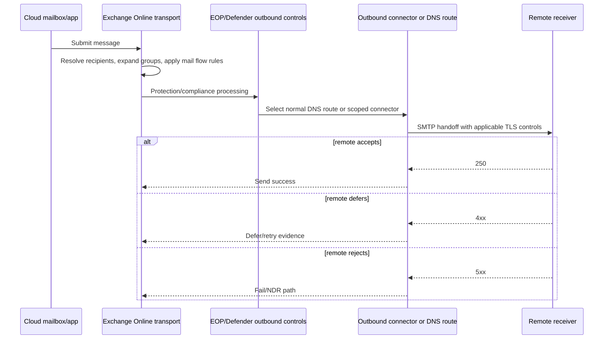

Outbound protection can also restrict compromised accounts, spam, malware, or policy violations. A remote `5xx` is different from a tenant rule rejection and should identify the remote host and response.

## Connectors in Exchange Online

Most straightforward cloud-only internet mail flow does not require custom connectors. Connectors are used for on-premises/hybrid mail, partner restrictions, third-party services, and devices/app relay scenarios.

| Scenario | Connector purpose | Critical checks |
|---|---|---|
| Hybrid/on-premises | Bidirectional cloud/organization route | Hybrid-generated ownership, certificate, domains, coexistence route |
| Third-party gateway inbound | Recognize/restrict accepted gateway path | Source certificate/IP, TLS, bypass prevention, original source |
| Outbound smart host | Route scoped or all outbound mail | Recipient domains, smart host, TLS identity, loop prevention |
| Business partner | Require protected restricted channel | Exact partner source/destination, certificate/IP, TLS |
| Device/application relay | Allow authorized non-mailbox source to relay | Static source/auth method, sender scope, recipient scope, no open relay |

### Connector Evidence Matrix

| Property | Evidence question |
|---|---|
| Name/status | Is this exact connector enabled and current? |
| From/To endpoints | Does direction match the actual handoff? |
| Sender/recipient domain scope | Does the affected message meet the configured scope? |
| Sender IP/certificate | Did the connection present the expected identity? |
| Require TLS | Was STARTTLS negotiated and accepted? |
| TLS sender certificate name | Did the exact certificate identity match? |
| Smart hosts | Which resolved target/IP was attempted? |
| DNS routing flag | Was normal MX used instead of smart host? |
| Validation result | What synthetic probe was tested, and when? |
| Trace connector ID | Does detailed trace identify the connector? |

Microsoft's current connector guidance warns that restrictive IP/certificate partner connectors can take precedence over domain-only allowance patterns. Exact precedence must be checked in current docs. Avoid combining assumptions such as "sender domain matched, so the restricted connector cannot reject."

## Third-Party Gateway before Microsoft 365

When public MX points to a third-party service, Microsoft 365 sees the gateway as the immediate SMTP peer. The architecture needs four deliberate controls:

1. The gateway must route accepted mail to the tenant's correct EOP target.
2. Exchange Online should restrict the intended path to the gateway's supported certificate or source IP conditions where architecture requires no bypass.
3. Microsoft protection needs trustworthy original-source context; current Microsoft guidance recommends Enhanced Filtering for Connectors for applicable designs rather than broad spam bypass.
4. Message modification and ARC trust must be handled according to current provider guidance and risk policy.

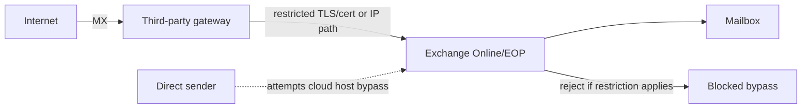

Broadly bypassing filtering for all messages from shared third-party IPs is dangerous because another customer or spoofed path may share them. Use supported original-source recovery and layered protection.

## Mail Flow Rules

Mail flow rules, also called transport rules, act while messages are in transport. They are different from Inbox rules, which act in a mailbox after delivery.

### Rule Components

| Component | Purpose | Logic reminder |
|---|---|---|
| Conditions | Messages that should match | Multiple conditions are AND |
| Values inside one condition | Alternatives for that predicate | Commonly OR |
| Exceptions | Messages excluded from action | Multiple exceptions are OR |
| Actions | What happens on match | Multiple compatible actions all apply |
| Priority | Rule evaluation order | `0` is highest in PowerShell model |
| Mode | Enforce or test behavior | Test evidence is not enforcement |
| SenderAddressLocation | Header, envelope, or both | Identity source changes match result |
| RuleErrorAction | Handling when processing fails | Ignore versus defer/resubmit behavior matters |
| StopRuleProcessing | Prevent later rule evaluation | Can explain missing later actions |

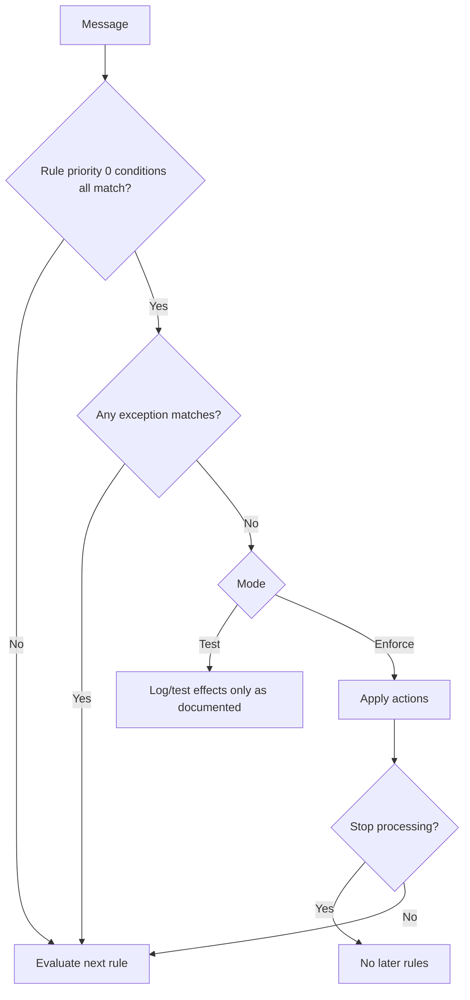

### Rule Safety

A rule without conditions or exceptions applies broadly. A delete, redirect, Bcc, or bypass action can affect the whole organization. Microsoft documentation notes that rule changes can take time to propagate and that rule history is not a built-in rollback store. Export state and define rollback before edits.

| Risky rule | Failure | Safer design |
|---|---|---|
| Bypass all filtering from "internal" senders | Compromised account can send malware | Narrow advanced-delivery or documented scoped control |
| Redirect all external mail for testing | Data disclosure and non-delivery | Synthetic recipient/domain scope with expiration |
| Delete without conditions | Organization-wide loss | Test mode, explicit predicates/exceptions, peer review |
| Header marker trusted from internet | Sender can forge exclusion | Stamp only in trusted path and match trusted connection context |
| Subject/body modification | Breaks DKIM and user expectations | Use only with ownership and authentication impact review |

### Rule Evidence in Trace

Extended message-trace data can expose Transport Rule agent information including rule GUID, UTC match time, action, and mode. Summary trace may not contain every detail. Correlate the rule GUID to current/exported rule state and consider whether configuration changed after the event.

## EOP and Defender Protection

Email protection uses multiple signals: connection, authentication, spoofing, spam/bulk, phishing/impersonation, malware, URLs, attachments, policy, tenant allow/block data, and user/organization context. The exact scoring model is private.

| Protection concept | Potential action/evidence | Do not infer |
|---|---|---|
| Spam/bulk verdict | Junk, quarantine, reject/filter according to policy | Exact model weight from one SCL alone |
| Phish/high-confidence phish | Quarantine or other restricted handling | That user can always release |
| Malware | Quarantine/block; tightly controlled release | That transport failure occurred |
| Safe Attachments | Detonation/dynamic verdict depending license/policy | Availability in unlicensed tenant |
| Safe Links | URL protection/time-of-click behavior depending license/policy | Original link reputation from rewritten URL alone |
| Spoof/impersonation | Anti-phish action and reports | That SPF failure alone caused verdict |
| ZAP | Post-delivery move/removal based on new intelligence | That initial delivery was an error in trace collection |

Headers such as `Authentication-Results`, `X-Forefront-Antispam-Report`, SCL-related fields, and network-message identifiers can support investigation. Interpret only documented fields, preserve trust boundaries, and avoid exposing proprietary or personal content unnecessarily.

## Quarantine

Quarantine holds potentially dangerous or unwanted items outside normal user folders. The detecting feature and assigned quarantine policy determine retention, notifications, release rights, preview/download actions, and whether users can only request release.

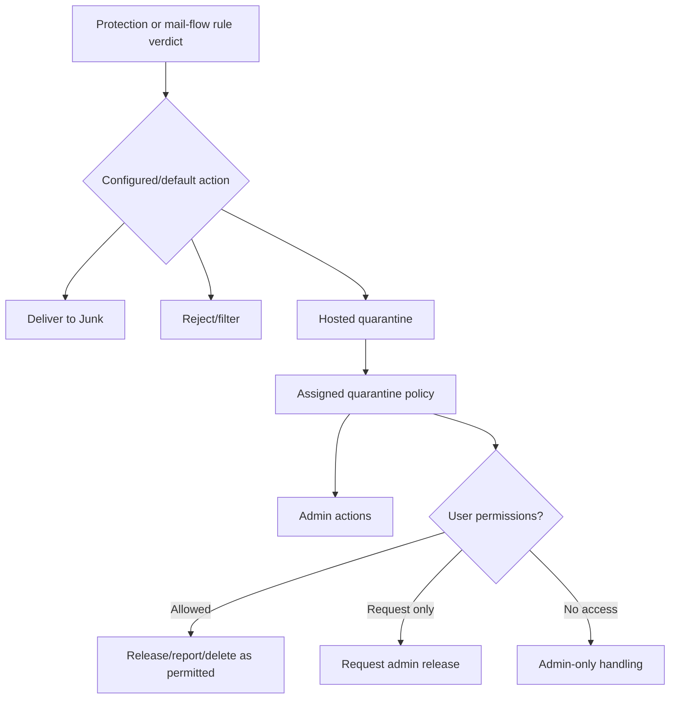

Current Microsoft guidance says malware and high-confidence phishing are tightly restricted and that users cannot directly release certain dangerous categories regardless of custom policy; they may only request release in some cases. Retention varies by reason and policy and must be checked at investigation time. Expired quarantine items can become unrecoverable.

### Quarantine Evidence Checklist

| Field | Why it matters |
|---|---|
| Recipient | Quarantine is recipient/item scoped |
| Received/expiry time | Establishes availability window |
| Quarantine reason/verdict | Routes to policy and release boundary |
| Policy/policy type | Explains action and user capability |
| Sender/Message-ID/Network ID | Correlates trace and headers |
| Release/request history | Distinguishes no action, requested, released, failed |
| Submission result | Shows false-positive/false-negative review separately |
| Audit actor/time | Supports accountability |

## 🔍 Plain-English deep-dive: Quarantined Is Not Rejected

An SMTP rejection means the sending system retained responsibility because Microsoft did not accept that recipient transaction. Quarantine means Microsoft accepted the message into service processing and stored it in a restricted location instead of normal delivery. Both can look like "the user did not receive it," but ownership and evidence are different.

Ask:

- Did the remote sender get a `5xx`?
- Does message trace show Failed, Filtered as spam, or Quarantined?
- Does a quarantine item exist for that recipient?
- Did an admin release it, and did release delivery complete?

Never tell a sender to resend a quarantined phish or malware item. Diagnose verdict and policy first.

## Post-Delivery Protection and Remediation

A message can be delivered, then moved or deleted by ZAP or admin remediation. This creates a timeline rather than a contradiction.

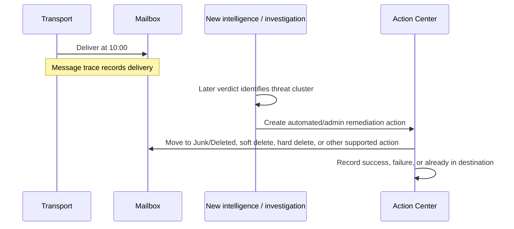

### ZAP

Zero-hour Auto Purge can act after delivery when service intelligence changes. Exact eligible verdicts/actions depend on current product and policy. A user report that a message "vanished" can be explained by ZAP, mailbox rules, admin remediation, user action, retention, or client behavior; collect evidence before selecting one.

### Manual and Automated Remediation

Defender for Office 365 Plan 2 supports advanced hunting and remediation workflows. Actions can include moving to Inbox, Junk, Deleted Items, soft delete, or hard delete under current permissions and item-location constraints. Direct action, two-step approval, automated investigation, and Action Center history provide different controls.

| Remediation status | Meaning at high level | Follow-up |
|---|---|---|
| Queued/In progress | Action not complete | Wait/monitor; do not claim removal |
| Completed | Processing ended, possibly with per-item failures | Review action logs |
| Success | Desired supported action achieved for item | Preserve evidence |
| Failed | Action not achieved | Inspect item/location/system details |
| Already in destination | Item already had intended state | Avoid counting as new action |
| Not actionable | Item/location outside supported cloud action | Route to other owner/tool |

Hard delete and broad remediation are destructive, high-impact actions. Use least privilege, query validation, approvals, exclusions, batch limits, and audit history. Never demonstrate destructive commands in a learning lab.

## Message Trace

Message trace follows messages through the Microsoft 365 organization and reports whether the service received, rejected, deferred, expanded, delivered, quarantined, or otherwise processed recipient branches.

### Search Identifiers

| Identifier/filter | Use | Caveat |
|---|---|---|
| Sender address | Narrow outbound/inbound source | Envelope/report semantics can differ from visible From |
| Recipient address | Follow one branch | Expansion/redirect creates related addresses |
| Message-ID | User-supplied RFC5322 identifier | Include full value; not every sender generates unique IDs |
| MessageTraceId / Network Message ID | Service correlation and bifurcation | Understand current field semantics and instance behavior |
| UTC time window | Bounds search | Portal can display admin-configured time zone; normalize |
| From IP | Source connection | Availability/report type and gateway topology limit meaning |
| To IP | Outbound destination | Inbound may be blank; outbound edge IP may not be reported |
| Connector ID | Route evidence | Available in appropriate detailed report |
| Status | Delivered, Failed, Pending, Expanded, Quarantined, etc. | Summary status is not complete current mailbox state |

Microsoft documents headers such as `X-MS-Exchange-Organization-Network-Message-Id`, `X-MS-Office365-Filtering-Correlation-Id`, and `X-MS-Exchange-CrossTenant-Network-Message-Id` as useful network-message correlation sources in appropriate cases.

### Current V2 Limits to Recheck

Current documentation says `Get-MessageTraceV2` searches up to the last 90 days, returns the last 48 hours with no date parameters, limits one query to 10 days of data, defaults to 1,000 results with a 5,000 maximum, and applies tenant query throttling. It does not use classic pagination; subsequent rounds use received time and starting recipient. These are provider limits, not protocol constants. Recheck them before writing automation.

### Trace Event Vocabulary

| Event/status | Meaning | Diagnostic use |
|---|---|---|
| Receive | Service received an instance | Establish ingress/submission |
| Send | Service sent to next destination | Establish outbound handoff attempt/success context |
| Deliver | Delivered to mailbox | Initial mailbox delivery, not permanent future location |
| Fail | Delivery failed | Inspect reason, stage, and DSN relation |
| Defer | Delivery postponed/retried | Queue owner and next retry matter |
| Expand | Group expanded | Explains related recipient rows |
| Transfer | Recipients moved to bifurcated copy | Explains multiple instances/events |
| Resolved | Directory changed recipient address | Relate original and resolved recipient |
| Quarantined | Held in quarantine | Query quarantine item and policy |
| Filtered as spam | Identified and blocked/rejected rather than quarantined in documented context | Do not call mailbox delivery |
| Getting status | Recent item awaiting status update | Recheck after service delay |

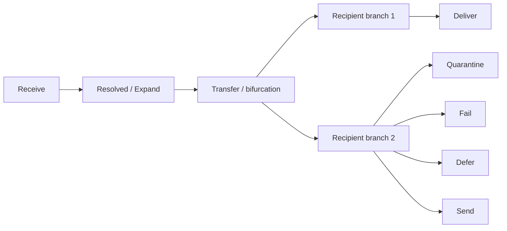

### Message-ID versus Network Message ID

The internet Message-ID identifies the logical message and is intended to stay constant, but external implementations can omit or duplicate it. Microsoft network identifiers correlate service processing and copies under documented semantics. Expansion and bifurcation can produce multiple records. Use "Find related" or V2 detail queries rather than assuming duplicate rows mean duplicate delivery.

## 🔍 Plain-English deep-dive: Delivered Is a Timestamped Event, Not a Lifetime Guarantee

`Deliver` answers: "Did Exchange Online deliver this item to the mailbox at that point?" It does not answer: "Is it in the Inbox now?" Later systems and actors can move it:

- ZAP based on updated threat intelligence.
- Admin remediation.
- Inbox rule or Sweep behavior.
- User delete/move/report.
- Retention or mailbox policy.
- Client synchronization or focused-view presentation.

Support should say, "Message trace records delivery at 10:00; Action Center records a soft-delete remediation at 10:21" rather than treating the two facts as inconsistent.

## Evidence Surfaces and Ownership

| Question | Best starting surface | Next corroboration |
|---|---|---|
| Did Microsoft receive it? | Message trace Receive/status | Sender SMTP response and headers |
| Was recipient valid/resolved? | Trace Resolved/Fail plus recipient object | Accepted domain, proxy address, sync status |
| Which connector routed it? | Detailed trace connector ID/config export | SMTP/TLS evidence at adjacent system |
| Which mail flow rule acted? | Extended trace rule GUID/action/mode | Current/exported rule and audit/change record |
| Why quarantined? | Quarantine reason/policy | Trace, headers, policy scope, submission |
| Was it delivered? | Trace Deliver event | Mailbox/current-location evidence |
| Was it removed later? | Action Center/ZAP/remediation evidence | Audit and mailbox location |
| Was group expanded? | Expand/related trace rows | Group membership at event time if available |
| Did remote receiver reject outbound? | Send/Fail details and NDR | Remote SMTP response |

## Common Failure Patterns

### Valid Recipient Rejected at Edge

Hypotheses: missing object/proxy address, directory synchronization delay/error, wrong tenant/domain, Authoritative domain enabled before recipient onboarding, or address typo. Check accepted-domain type and recipient object before weakening DBEB.

### Unknown Recipient Loops to On-Premises

Internal relay sends unknown recipient through connector; on-premises default route returns it to Microsoft 365. Fix terminal authority or directory route. Do not simply disable the connector if valid on-premises users depend on it.

### Gateway Bypass

Public MX points to third party, but direct delivery to tenant's EOP hostname is accepted without required restrictions. Validate supported Partner connector restriction, enhanced filtering, certificate/IP maintenance, and emergency path design.

### Connector TLS Failure

Trace shows Defer/Fail on outbound connector; adjacent logs show certificate-name, chain, STARTTLS, or protocol mismatch. Preserve required TLS and repair exact identity rather than enabling insecure fallback.

### Rule Did Not Match

Check rule enabled state, propagation window, mode, priority, conditions, exceptions, sender-address location, encrypted-content visibility, system-generated-message exceptions, stop processing, and actual message fields.

### Message "Missing" after Delivery

Trace says Deliver. Check ZAP, Action Center, quarantine transitions, mailbox rules, user actions, Junk, Deleted, recoverable items, forwarding, and current item location. Respect licensing and permissions.

### Duplicate Trace Rows

Check group expansion, redirect, forwarding, Transfer/bifurcation, multiple recipients, DSN relation, mailbox rules, journal/report copies, and actual duplicate mailbox items.

## Troubleshooting Decision Tree

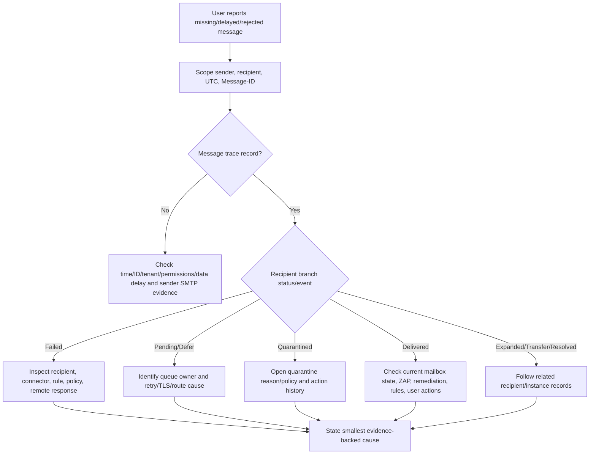

## Safe Lab: Exchange Online Conceptual Flow and Lab Plan

### Lab Objective

Design a read-only, synthetic investigation plan for four Exchange Online cases: cloud delivery, internal relay, quarantine, and post-delivery remediation. The lab uses no tenant, real recipient, live connector, DNS change, or destructive action.

### Safety Rules

- Use only `.example` domains and synthetic GUIDs/IDs.
- Treat all EAC/Defender/PowerShell results as supplied fixtures.
- Do not sign in, send test mail, create recipients, release quarantine, or run remediation.
- Do not copy real message bodies, tokens, certificates, tenant IDs, or personal addresses.
- Plan least-privilege roles and approval gates.
- Every proposed change must include rollback, propagation, and recipient-class tests.

### Prerequisites

1. An authorized, non-production local study folder and a Markdown or spreadsheet editor; this exercise requires no Microsoft 365 tenant access.
2. This Part plus the linked current Microsoft Learn documentation for accepted domains, connectors, rules, trace, quarantine, and remediation behavior.
3. Only the supplied synthetic tenant objects, GUIDs, trace events, and action fixtures; do not sign in, run PowerShell, send mail, release quarantine, or remediate an item.
4. A worksheet that separates configured state, recipient resolution, transport events, policy/protection, current item state, feature/license gaps, and owner approvals.

### Synthetic Tenant

Tenant `northwind.example` has:

| Object/configuration | Synthetic state |
|---|---|
| Accepted domain | `northwind.example` = Internal relay |
| Cloud mailbox | `cloud.user@northwind.example` |
| Mail user representing legacy recipient | `legacy.user@northwind.example` with target on legacy system |
| Unknown address | `missing@northwind.example` |
| Outbound connector | `To-Legacy`, scoped to unresolved/legacy route, required TLS |
| Inbound gateway | `gateway.example` with restricted Partner connector |
| Mail flow rule | `Quarantine-Synthetic-Attachment`, test fixture in Enforce mode |
| Quarantine policy | Admin-controlled for high-risk verdict fixture |
| Defender action | Synthetic ZAP record for one delivered message |

### Conceptual Flow

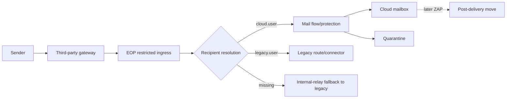

### Case A: Cloud Delivery

Fixture:

| Field | Value |
|---|---|
| Message-ID | `<case-a@sender.example>` |
| Network Message ID | `aaaaaaaaaaaaaaaaaaaaaaaaaaaaaaaa` |
| Recipient | `cloud.user@northwind.example` |
| Events | Receive -> Deliver |
| Status | Delivered |

Conclusion: Exchange Online received and delivered the recipient branch. This does not prove Inbox is current location. Planned next checks: current mailbox state only if user impact requires it; rule/ZAP evidence if item is missing.

### Case B: Internal Relay

Fixture:

| Recipient | Resolution | Trace | Expected conclusion |
|---|---|---|---|
| `legacy.user@northwind.example` | Mail user/legacy route | Receive -> Send via `To-Legacy` | Intended coexistence route |
| `missing@northwind.example` | Unknown | Receive -> Send via `To-Legacy` -> remote `550 5.1.1` | Internal relay delegated final recipient decision to legacy |

Discriminating change on paper: switch the accepted domain to Authoritative **without changing actual tenant**. Expected conceptual result: `missing` is rejected at Microsoft edge/directory boundary, while `legacy.user` works only if its mail user/proxy object remains complete. This demonstrates why domain type and directory data must be evaluated together.

### Case C: Quarantine

Fixture:

```text
Message-ID: <case-c@sender.example>
Trace events: Receive -> Transport rule -> Quarantined
Rule GUID: 11111111-1111-1111-1111-111111111111
Rule mode: Enforce
Quarantine reason: mail flow rule fixture
Current action: no release requested
```

Evidence conclusion: the message was accepted and placed in hosted quarantine by an enforced mail flow rule. It was not delivered to the mailbox and was not rejected back to the sender in this fixture. Safe next action is to validate rule scope and business intent; do not release unknown content as a connectivity test.

### Case D: Delivered then Remediated

Fixture:

```text
Message-ID: <case-d@sender.example>
10:00 Message trace: Deliver
10:18 Defender investigation: threat cluster confirmed
10:21 Action Center: Soft delete submitted by automated/admin workflow
10:24 Item action: Success
```

Conclusion: initial transport delivery and later removal are both true. Current location should reflect soft-delete destination under product behavior. The incident response owner should validate scope and related recipients; transport routing is not the root cause.

### Exercise 1: Build the Evidence Matrix

| Case | Transport status | Recipient resolution | Policy/protection | Current-location evidence | Owner |
|---|---|---|---|---|---|
| A | Delivered | Cloud mailbox | No supplied adverse action | Unknown beyond delivery | Mailbox support if missing |
| B legacy | Sent | Mail user/legacy | Required-TLS connector | Legacy evidence needed | Hybrid messaging |
| B missing | Failed remotely | Unknown/internal relay | Connector then remote 5.1.1 | No item | Directory/routing owner |
| C | Quarantined | Cloud recipient | Enforced transport rule | Quarantine item | Rule/security owner |
| D | Delivered | Cloud mailbox | Later threat remediation | Action Center success | Security operations |

### Exercise 2: Plan Read-Only Queries

For a real authorized lab, plan but do not execute:

1. Record accepted domain and recipient object/proxy state.
2. Export connector names, endpoints, scope, TLS, and destinations.
3. Export mail flow rule GUID, priority, state, mode, conditions, exceptions, actions, sender-address location, and stop-processing flag.
4. Run a narrowly filtered message trace by exact UTC window, sender, recipient, or full Message-ID.
5. Follow detailed events/related records and Network Message ID.
6. Check quarantine by recipient/Message-ID/reason under least privilege.
7. Check Action Center/audit only for delivered-then-moved cases.
8. Record feature/license gaps rather than requesting broad roles automatically.

### Exercise 3: Proposed Test Matrix

| Synthetic test | Expected result | Rollback evidence |
|---|---|---|
| Known cloud recipient | Deliver cloud | Trace Receive/Deliver |
| Known legacy mail user | Send through `To-Legacy` with TLS | Connector ID and legacy acceptance |
| Unknown recipient | Reject at agreed terminal owner | No return loop |
| Gateway bypass attempt from untrusted source | Reject restricted path | SMTP and connector evidence |
| Rule positive fixture | Test/log or quarantine according to approved mode | Rule GUID/action event |
| Rule exception fixture | No action from that rule | Related event/rule evidence |
| Benign cloud message | No quarantine/remediation | Trace and current mailbox state |

### Exercise 4: Write the Support Summary

> **[Configured state]** `northwind.example` is Internal relay, so Exchange Online delivers known cloud objects and routes unresolved recipients toward the legacy system through `To-Legacy`. **[Observation]** `missing@northwind.example` was accepted by Microsoft 365, sent over that connector, and rejected by the legacy terminal with `5.1.1`; this is expected internal-relay ownership, not DBEB failure. **[Observation]** A separate message to the cloud user was accepted and quarantined by enforced rule GUID `1111...`, while another was delivered and later soft-deleted successfully through a recorded Defender action. **[Inference]** The four symptoms belong to recipient routing, transport policy, and post-delivery security respectively and should not share one remediation. **[Private/licensed unknown]** Advanced Explorer availability and the underlying private threat score are not established. **Next action:** confirm directory ownership for unknown recipients, peer-review the quarantine rule scope, and let security operations validate the remediation cluster; preserve the required TLS connector and do not weaken protection to make the cases converge.

### Lab Plan Deliverable

| Phase | Read-only activity | Exit criterion |
|---|---|---|
| Topology | Domain, recipients, connectors, rules | One approved diagram with terminal owners |
| Trace | Four synthetic message fixtures | Recipient event chains correlated |
| Protection | Quarantine/reason/policy fixture | Transport versus verdict distinguished |
| Post-delivery | Action Center fixture | Delivery and later action timeline reconciled |
| Change design | One hypothetical accepted-domain/rule adjustment | Risks, tests, rollback documented |
| Approval | Messaging/security/compliance owners review | No live change in this lesson |

### Expected evidence

The lab should produce an inspectable Exchange Online topology, four-case evidence matrix, read-only query plan, recipient-class test matrix, accepted-domain thought experiment, quarantine and remediation timelines, bounded support summary, and completed lab-plan deliverable. Each conclusion must cite a supplied trace/configuration/action fixture and identify any license or permission gap.

### Cleanup and privacy

- Retain only the synthetic `.example` tenant, invented GUIDs/IDs, supplied events, and derived plan.
- Delete or redact any accidentally pasted real tenant ID, domain, certificate, token, message/body/header, sender/recipient, trace/export, quarantine item, remediation result, or personally identifiable information (PII); delete the artifact if reliable redaction is not possible.
- Do not sign in, execute PowerShell, send mail, create recipients, change accepted domains/connectors/rules, release quarantine, allowlist, purge, remediate, or hard-delete anything.
- Confirm before retention or sharing that the work was entirely synthetic/read-only planning with no live Microsoft 365 or customer activity and no claim of Exchange Online production administration.

### Validation rubric

| Dimension | Fail | Developing | Pass |
|---|---|---|---|
| Topology and recipient resolution | Treats all mail as one EOP path | Identifies cloud/legacy routes | Correctly combines accepted-domain type, recipient object, connector, gateway, and terminal owner |
| Event correlation | Uses portal status alone | Correlates Message-ID/time | Follows recipient events and related IDs through trace, quarantine, Action Center, and current state |
| Case separation | Merges rejection, quarantine, and remediation | Distinguishes most cases | Separates transport, internal relay, rule quarantine, and delivered-then-remediated ownership/proof |
| Query/permission plan | Requests Global Admin or destructive test | Lists read-only queries | Uses narrow metadata-first queries, least privilege, license gaps, and explicit approvals |
| Change safety | Disables TLS/filtering or changes accepted domain broadly | Mentions rollback | Defines recipient-class tests, peer review, propagation, rollback, and monitoring without live change |
| Honesty and privacy | Claims tenant operation or exposes data | Labels lab but retains excessive detail | Synthetic planning only, minimized/redacted evidence, and explicit Microsoft-transfer/learning boundary |

## Support Runbook

### Intake

- Tenant/domain and recipient type.
- Sender, recipient, UTC window, full Message-ID if available.
- Symptom: sender rejection, pending, quarantine, Junk, missing after delivery, duplicate, or wrong route.
- Expected topology: direct EOP, third-party gateway, hybrid, partner, or device relay.
- Recent accepted-domain, recipient sync, connector, rule, policy, or license changes.

### First Pass

1. Classify SMTP outcome versus service status versus current mailbox location.
2. Run the narrowest current message trace available.
3. Follow the recipient branch and related records.
4. Identify accepted-domain behavior and recipient object.
5. Inspect connector/rule only when trace/topology points there.
6. Query quarantine when status/reason supports it.
7. Query Action Center/ZAP/audit when initial delivery conflicts with current state.

### Evidence Package

| Category | Capture |
|---|---|
| Identity | Tenant, accepted domain, object/proxy type, sender/recipient |
| Correlation | Message-ID, Network Message ID/Trace ID, UTC range |
| Route | Connector ID, endpoint, smart host, TLS/source restriction |
| Policy | Rule GUID/priority/mode/action; protection policy/verdict |
| Outcome | Receive/Send/Deliver/Fail/Defer/Quarantine/Transfer timeline |
| Current state | Quarantine item, mailbox location, Action Center status |
| Limits | License, role, retention, report type, data delay |
| Unknowns | Proprietary score or unavailable adjacent-system log |

### Safe Response

- Do not release malware/high-confidence phish just to test routing.
- Do not create broad Tenant Allow entries for a single false positive.
- Do not bypass filtering for all internal/gateway traffic.
- Do not switch Internal relay to Authoritative until recipient objects are complete.
- Do not remove hybrid connectors created by supported tooling without ownership review.
- Do not hard delete or bulk-remediate without validated query, permissions, and approval.
- Export rule state because native history/rollback may be limited.

## Case Summary Template

### Scope

- Tenant:
- Accepted domain/type:
- Recipient object/proxy addresses:
- Sender/recipient:
- UTC window:
- Message-ID:
- Network Message ID/Trace ID:

### Topology

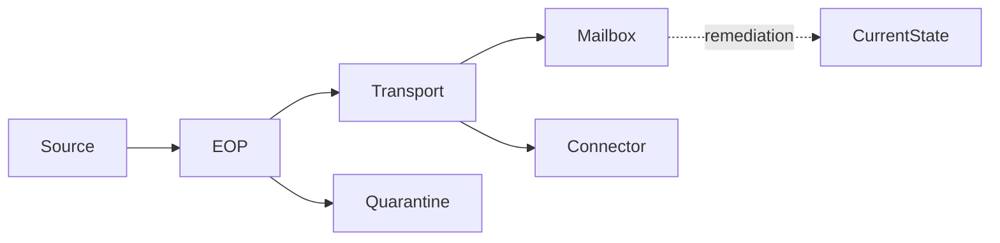

### Configuration

| Object | Identity | Scope/priority | Action/destination | Security condition |
|---|---|---|---|---|
| Accepted domain |  |  |  |  |
| Connector |  |  |  |  |
| Mail flow rule |  |  |  |  |
| Protection policy |  |  |  |  |
| Quarantine policy |  |  |  |  |

### Event Timeline

| UTC | Recipient branch | Event/status | Rule/connector/verdict | Evidence source |
|---|---|---|---|---|
|  |  |  |  |  |

### Current State

- Mailbox folder/location:
- Quarantine item/reason/expiry:
- ZAP/remediation action/status:
- Admin/user/audit action:

### Conclusion

- **[Configured state]:**
- **[Observation]:**
- **[Inference]:**
- **[Licensed/private unknown]:**
- Smallest safe next action:
- Test, approval, rollback, monitoring:

## Security and Administrative Boundaries

Use least privilege. Global Administrator is not the default troubleshooting role. Message trace, quarantine, Explorer, remediation, accepted-domain, connector, and rule administration have different permission needs. Exporting message data can expose personal, legal, or regulated content.

| Action | Risk | Control |
|---|---|---|
| View headers/content | Sensitive data exposure | Metadata first, need-to-know access, redaction |
| Release quarantine | Delivers potentially malicious content | Validate verdict, policy, sender, content, and approvals |
| Add allow entry | Creates future bypass | Narrow scope, expiry, monitoring, official submission first |
| Edit connector | Organization-wide route/security change | Peer review, synthetic tests, rollback, source restrictions |
| Edit accepted domain | Recipient rejection/relay/loop | Directory completeness and coexistence plan |
| Edit rule | Broad delete/redirect/bypass | Export, test mode, explicit conditions/exceptions, propagation plan |
| Remediate/purge | Destructive mailbox action | Validated query, exclusions, two-step approval, Action Center audit |

## Official Source Anchors

All listed sources were accessed on August 24, 2026 and must be revalidated for current provider behavior.

| Source | What it establishes |
|---|---|
| [Accepted domains in Exchange Online](https://learn.microsoft.com/en-us/exchange/mail-flow-best-practices/manage-accepted-domains/manage-accepted-domains) | Authoritative versus Internal relay, DBEB, recipient and connector dependencies |
| [Exchange Online connectors](https://learn.microsoft.com/en-us/exchange/mail-flow-best-practices/use-connectors-to-configure-mail-flow/use-connectors-to-configure-mail-flow) | Connector scenarios, endpoints, partner restrictions, TLS, relay, and open-relay warning |
| [Third-party cloud mail flow](https://learn.microsoft.com/en-us/exchange/mail-flow-best-practices/manage-mail-flow-using-third-party-cloud) | Front-door gateway, cloud lockdown, Enhanced Filtering, bypass risk, and complex routes |
| [Mail flow rules](https://learn.microsoft.com/en-us/exchange/security-and-compliance/mail-flow-rules/mail-flow-rules) | Conditions, exceptions, actions, priority, mode, sender-address location, and rule behavior |
| [Exchange Online message trace](https://learn.microsoft.com/en-us/exchange/monitoring/trace-an-email-message/message-trace-modern-eac) | Current trace searches, statuses/events, reports, IDs, limits, and detailed agent evidence |
| [Get-MessageTraceV2](https://learn.microsoft.com/en-us/powershell/module/exchangepowershell/get-messagetracev2) | Current PowerShell filters, windows, result bounds, subsequent-query method, and throttling |
| [Microsoft 365 quarantine](https://learn.microsoft.com/en-us/defender-office-365/quarantine-about) | Quarantine reasons, policies, user/admin boundaries, retention, and audit |
| [Defender email remediation](https://learn.microsoft.com/en-us/defender-office-365/remediate-malicious-email-delivered-office-365) | ZAP/manual/automated remediation concepts, approvals, Action Center, actions, and status evidence |

## Likely Interview Questions

### Q1. What is the difference between an Authoritative and Internal relay accepted domain?

**Model answer:** For an Authoritative domain, Exchange Online is the terminal recipient authority: it delivers to known recipient objects and rejects unknown recipients, with DBEB available in the documented design. For Internal relay, known cloud recipients deliver locally and unknown recipients route to another organization-owned mail system through a connector. Internal relay requires a terminal other system; otherwise unknown recipients can loop.

### Q2. How would you investigate a message reported as missing in Exchange Online?

**Model answer:** I collect sender, recipient, full Message-ID, UTC time, tenant, and expected path. I run a narrow message trace and follow the recipient branch and related records. Failed or deferred goes to recipient/connector/remote response; quarantined goes to quarantine reason and policy; delivered goes to mailbox state, ZAP, Action Center, Inbox rules, and user actions. I do not treat a Deliver event as proof the item remains in Inbox.

### Q3. What does a connector do in Exchange Online?

**Model answer:** It customizes a handoff between endpoints such as Microsoft 365, on-premises mail, a partner, gateway, or device. I inspect direction, sender/recipient scope, source IP or certificate identity, required TLS, destination smart host or DNS routing, and trace connector ID. Cloud-only internet mail usually needs no custom connector. I validate with a scoped synthetic route and never permit open relay.

### Q4. How are mail flow rule conditions and exceptions combined?

**Model answer:** Multiple conditions are AND, multiple values inside one compatible condition are alternatives, commonly OR, and multiple exceptions are OR: any exception prevents the actions. Rules run by priority, and stop-processing can prevent later rules. Mode, sender-address location, encrypted-content visibility, and propagation also matter. I use rule GUID/action evidence from detailed trace when available.

### Q5. What is the difference between quarantine and SMTP rejection?

**Model answer:** Rejection means the SMTP transaction or recipient branch was not accepted, so the sending side retains responsibility and receives a failure. Quarantine means Microsoft accepted the message into service processing and stored it in a restricted location under a verdict and quarantine policy. I correlate message trace with an actual quarantine item, reason, expiry, permissions, and release history.

### Q6. Why can message trace say Delivered when the user cannot find the message?

**Model answer:** Deliver is a timestamped transport event. Later ZAP, admin remediation, Inbox rules, user moves/deletes, retention, or client presentation can change current location. I build a timeline: trace delivery, Action Center/ZAP/audit actions, and current mailbox state. Delivery and later soft delete can both be correct.

### Q7. Which IDs would you use to correlate Exchange Online evidence?

**Model answer:** I use the full internet Message-ID for logical-message search, the service Network Message ID or MessageTraceId for Microsoft processing and related copies, plus sender, recipient, and narrow UTC range. Group expansion and bifurcation can create multiple rows or instances, so I use related records and detailed events rather than treating them as duplicates.

### Q8. How would you safely remediate a false positive or delivered threat?

**Model answer:** For a false positive, I verify the exact verdict, policy, scope, message identity, and content; use official submission/review; and avoid broad allows. For a delivered threat, I validate the query and affected cluster, use least-privilege and approval controls, choose a supported move/delete action, and monitor Action Center per-item results. I preserve audit evidence and never hard delete as a troubleshooting probe.

## 🧠 30-Second Memory Hooks

- **Accepted domain declares recipient ownership.**
- **Authoritative rejects unknown; Internal relay sends unknown onward.**
- **DBEB is only as good as directory completeness.**
- **Connector = endpoints + scope + identity + TLS + destination.**
- **Rule logic: conditions AND, exceptions OR, priority first.**
- **Trace tells transport; quarantine tells held item; Action Center tells remediation.**
- **Delivered is an event, not permanent location.**
- **Expand/Transfer creates related rows, not automatic duplicates.**
- **Message-ID is logical; Network/Trace ID is service correlation.**
- **EOP baseline is not every Defender Plan 2 feature.**
- **Do not bypass all gateway/internal traffic.**
- **Least privilege before portal convenience.**

## Completion Checklist

- [ ] I can draw the conceptual inbound and outbound Exchange Online paths.
- [ ] I can distinguish Exchange Online, EOP, Defender for Office 365, Defender XDR, EAC, and Purview.
- [ ] I can explain Authoritative, Internal relay, DBEB, and recipient objects together.
- [ ] I can map connectors by endpoints, scope, source identity, TLS, and destination.
- [ ] I can explain a secure third-party gateway path and bypass prevention.
- [ ] I can evaluate mail flow rule conditions, exceptions, actions, priority, mode, and stop processing.
- [ ] I can distinguish transport rule, threat verdict, and Inbox rule behavior.
- [ ] I can separate rejection, failure, quarantine, Junk, delivery, and remediation.
- [ ] I can use Message-ID plus Network/Trace ID and recipient branch.
- [ ] I can interpret Receive, Send, Deliver, Fail, Defer, Expand, Transfer, Resolved, and Quarantined.
- [ ] I treat current trace windows and limits as provider policy to recheck.
- [ ] I know that a delivered item can later be moved by ZAP or remediation.
- [ ] I use least privilege and approvals for release, allow, connector, rule, and purge actions.
- [ ] I can produce a read-only conceptual lab plan with rollback tests.
- [ ] I label licensed and private unknowns instead of inventing evidence.

[Next: Part 032 - Google Workspace Mail Flow Learning Lab](Part-032-google-workspace-mail-flow-learning-lab.md)