# Part 032 - Google Workspace Mail Flow Learning Lab

## Purpose, Evidence, and Currency

Google Workspace Gmail provides hosted mailboxes, spam and malware protection, configurable routing, SMTP relay, gateways, compliance controls, admin quarantine, and investigation evidence. The concepts rhyme with Microsoft 365 but the configuration model, naming, inheritance, account scopes, evidence surfaces, and product boundaries differ. A Microsoft administrator can transfer the **method** of reasoning while learning Google's actual controls from official documentation.

This part is explicitly a learned-architecture lesson. It does not claim that the candidate has administered a production Google Workspace tenant. It uses current public Google Workspace documentation to build a conceptual map and a synthetic lab plan. The goal is to answer likely support questions without projecting Exchange Online terms such as accepted domains, DBEB, transport-rule GUIDs, or Network Message ID onto Gmail where those exact abstractions do not apply.

The core Google routing model in this lesson is:

$$
\text{Result for one message branch} = \text{scope} + \text{message direction} + \text{account type} + \text{filters} + \text{action} + \text{route}
$$

`Default routing` establishes broad delivery behavior. `Routing` settings create specialized behavior or override the default for matched messages. A setting can modify, reject, or quarantine a message; modifying can add recipients, change routes, add headers, alter envelope recipients, and adjust spam or delivery behavior under current documented options. Organizational units, configuration groups, address lists, envelope filters, message direction, and account types determine which messages are affected.

Email Log Search (ELS) is a primary admin troubleshooting surface for sent and received messages. It exposes message metadata and delivery details but not message contents. Admin quarantine is a moderation path configured through Gmail settings and reviewed before onward delivery or denial. Split delivery chooses one mailbox system based on recipient. Dual delivery intentionally produces copies in multiple systems. These outcomes must remain separate during diagnosis.

Google changes portal paths, options, supported editions, and limits. The canonical Workspace Knowledge Center pages cited here are the current source for operations. All exact time windows, retention values, privileges, and propagation estimates are provider behavior to recheck.

## Section Goal

By the end of this part, you should be able to:

- Explain a conceptual Google Workspace inbound and outbound Gmail path.
- Distinguish Gmail, the Google Admin console, Gmail routing settings, Email Log Search, the Moderation Tool/admin quarantine, Google Vault, and edition-dependent investigation capabilities.
- Explain `Default routing` versus `Routing` without treating them as identical rule lists.
- Map organizational units, configuration groups, groups, account types, address lists, envelope filters, and message directions to rule scope.
- Distinguish inbound, outbound, internal inbound, and internal outbound message directions in Google's routing model.
- Explain the `Modify message`, `Reject message`, and `Quarantine message` main actions.
- Explain common modify options such as add headers, preserve original recipient, add recipients, change route, alter envelope recipient, and spam/delivery choices at a high level.
- Distinguish active user, group, inactive/unrecognized, and archived-with-delegate account categories under current routing options.
- Explain how inbound gateways, outbound gateways, mail hosts/routes, and SMTP relay change the path.
- Explain Google split delivery and dual delivery, including primary-server ownership and migration use.
- Explain admin quarantine setup, reviewer access, release, deny/drop/reject consequences, notifications, and current 30-day no-action deletion behavior.
- Use ELS by sender, recipient, IP, date, subject, and Message-ID while respecting search semantics and content limitations.
- Interpret ELS as metadata/status evidence rather than a mailbox-content viewer.
- Compare Google and prior evidence surfaces without asserting false one-to-one equivalence.
- Diagnose active-user delivery, unrecognized-recipient routing, dual-delivery copies, quarantine, spam, and forwarding as separate outcomes.
- Produce an official-doc comparison and synthetic Google-style routing case with no tenant access.

## JD Mapping

| Role responsibility | Google Workspace capability | Example support output |
|---|---|---|
| Learn an unfamiliar customer stack | Transfer routing/evidence method from Microsoft without copying terminology | "Google's inactive/unrecognized account routing plays the coexistence role here; it is not Exchange Internal relay." |
| Diagnose mail routing | Resolve setting scope and action in order | "The inbound rule applied to unrecognized recipients and changed route to the legacy host." |
| Investigate missing mail | Start with ELS metadata and delivery details | "ELS found the Message-ID and shows quarantine, so this is not an SMTP connectivity gap." |
| Diagnose duplicates | Identify dual-delivery or added-recipient branch | "Gmail was primary and also delivered a secondary copy to the legacy server by design." |
| Support moderation | Separate admin quarantine from spam-folder delivery | "The routing setting held the message for reviewer action before delivery." |
| Support coexistence | Distinguish split and dual delivery | One-recipient ownership matrix and primary/secondary path |
| Preserve security | Avoid broad routing bypasses or unsafe releases | Metadata-first review, scoped synthetic plan, least privilege |
| Communicate evidence gaps | Label edition, privilege, content, and third-party-host unknowns | "ELS cannot show message body, and legacy acceptance requires the legacy server log." |

## Candidate Honesty Note

Use the candidate's Microsoft cloud experience as a bridge, not as a credential for Google administration:

> "I have not claimed production Google Workspace administration. I would approach it with the same evidence discipline I use in Microsoft cloud: establish tenant scope and admin privilege, export the relevant routing settings, trace one sender-recipient-message-ID branch, and separate transport status from quarantine and current mailbox state. I have learned Google's specific model: Default routing, Routing, account types, organizational scope, hosts, Email Log Search, and admin quarantine. I would validate a synthetic lab plan before any live change."

## Evidence Labels Used in This Part

| Label | Meaning | Google Workspace example |
|---|---|---|
| **[Provider behavior]** | Current official Google documentation | "ELS searches by Message-ID independently of the selected date range under current documentation." |
| **[Configured state]** | Authorized export/screenshot of actual Admin console state | "Rule `Legacy-Unrecognized` applies to inbound unrecognized accounts and changes route to `legacy-host`." |
| **[Observation]** | ELS, SMTP, header, quarantine, audit, or mailbox evidence | "ELS details show the secondary host accepted the branch." |
| **[Analogy]** | Learning bridge to Microsoft, not product equivalence | "ELS is the closest starting analogy to message trace for this question." |
| **[Inference]** | Testable explanation | "Dual delivery explains two inbox copies better than an SMTP retry." |
| **[Edition/privilege unknown]** | Feature or access not established | "Security investigation access is not confirmed for this Workspace edition." |
| **[Private unknown]** | Google scoring/internal behavior not exposed | "The complete spam model weighting is unavailable." |

## Beginner Primer: Gmail Routing Is Layered Scope plus Action

Imagine a university mailroom. A campus-wide instruction says where normal mail goes. Departments can add more specific instructions. A rule may apply only to enrolled students, clubs, former students, or unknown names. It may apply only to mail arriving from outside, leaving campus, or moving between campus addresses. Once matched, the mailroom can change the destination, add a copy, reject the parcel, or hold it for a reviewer.

That analogy maps to:

- Default routing: campus-wide baseline.
- Routing setting: specialized department or traffic instruction.
- Organizational unit/configuration group: who receives the setting.
- Message direction: where the message comes from and goes.
- Account type: active user, group, inactive/unrecognized, or other supported category.
- Envelope filter/address list: narrower sender or recipient match.
- Action: modify, reject, or quarantine.
- Route/host: non-Gmail mail system used for a branch.

| Term | Plain meaning | Why it matters | Memory hook |
|---|---|---|---|
| Google Admin console | Tenant administration interface | Hosts Gmail settings and reports | **Control plane** |
| Default routing | Broad default delivery behavior | Establishes baseline path | **Default road** |
| Routing | Specialized rule behavior | Overrides/adds scoped actions | **Conditional detour** |
| Host/route | Configured non-Gmail mail server destination | Used by split, dual, gateway, and compliance paths | **Named next hop** |
| Organizational unit (OU) | Hierarchical user/admin scope | Settings can inherit/override | **Department tree** |
| Configuration group | Group-based settings scope | Can override OU behavior under current design | **Cross-tree policy group** |
| Account type | Recipient/sender object category | Rule applies differently to users/groups/unknowns | **Who the address represents** |
| ELS | Email Log Search | Finds message metadata and status | **Transport evidence window** |
| Admin quarantine | Moderated holding area | Reviewer releases or denies before delivery | **Review shelf** |

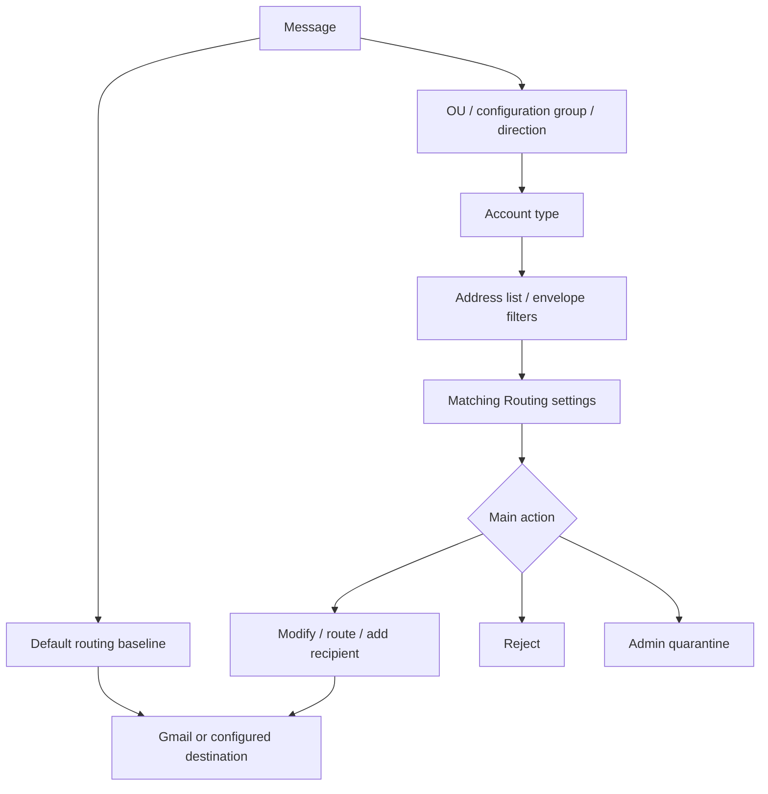

## 🔍 Plain-English deep-dive: Transfer the Troubleshooting Method, Not the Product Nouns

An Exchange `Authoritative` domain and Google routing for active versus unrecognized accounts both influence unknown-recipient behavior, but they are not the same feature. An Exchange connector and a Google host/route both influence next hop, but selection, identity controls, and evidence differ. Exchange message trace and Google ELS both help follow mail, but fields, windows, IDs, and current-location details differ.

Use analogies only to ask good questions:

| Microsoft-familiar question | Google-specific question to ask |
|---|---|
| Which accepted-domain type applies? | Which recipient account type and routing/default-routing behavior apply? |
| Which connector matched? | Which Gmail route/host and routing setting modified the branch? |
| Which transport rule GUID acted? | Which Gmail setting quarantined/rejected/modified the message? |
| What does message trace show? | What do ELS details show for this sender/recipient/Message-ID? |
| Is it in Defender quarantine? | Is it in the configured Google admin quarantine or in spam? |

Do not write a support summary saying "Google's connector" if the actual object is a Gmail route selected by a Routing setting. Precise nouns reveal precise evidence.

## Google Workspace Email Components

| Component | Main role | Evidence/administration | Boundary |
|---|---|---|---|
| Gmail | Hosted mail service and user mailbox | Gmail UI, headers, Admin settings | User mail and service processing |
| Admin console Gmail settings | Routing, compliance, spam, gateways, relay | Apps -> Google Workspace -> Gmail | Tenant configuration |
| Email Log Search | Search sent/received metadata and delivery details | Reporting -> Email Log Search | No message-content view |
| Moderation Tool/admin quarantine | Review quarantined Gmail/Chat items under current product | Quarantine/moderation administration | Release/deny before onward delivery |
| Google Vault | Retention, holds, search/export for supported data | Vault privileges and matters | Compliance/eDiscovery, not transport routing |
| Security investigation tools | Edition-dependent investigation and actions | Security center/investigation surfaces | Availability and capabilities vary |
| Admin audit logs | Configuration/admin changes | Reporting/audit | Change evidence, not message route alone |

## Conceptual Inbound Flow

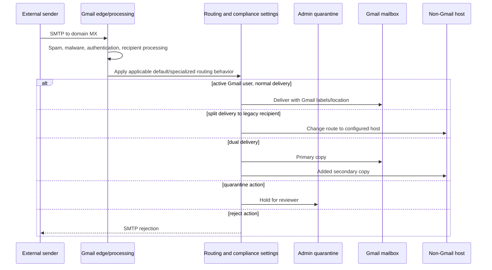

Google's public docs describe the admin controls and outcomes, not every private internal stage. Use ELS and adjacent-server SMTP evidence to reconstruct the exposed path.

## Conceptual Outbound Flow

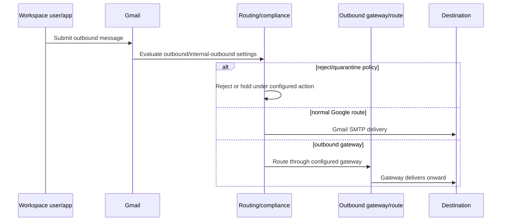

SMTP relay is another path: a non-Gmail server or device can relay through Google's service under configured authorization and policy. It is not the same as a user sending from the Gmail UI.

## Default Routing versus Routing

Google documentation presents two main routing settings:

- **Default routing:** organization-wide default delivery behavior; useful for broad dual delivery or baseline paths.
- **Routing:** specialized delivery rules and overrides; useful for specific users, directions, account types, senders, recipients, or actions.

| Property | Default routing | Routing |
|---|---|---|
| Purpose | Baseline delivery | Specialized/override behavior |
| Typical scope | Broad organization default | OU/configuration group and filters |
| Example | Send most mail to Gmail plus legacy | Copy executive mail to assistant or route unknowns |
| Risk | Broad blast radius | Overlap/conflict with other specific settings |
| Evidence need | Current default plus inherited behavior | Exact rule description, scope, options, and audit time |

Do not assume only one setting can affect a message. Collect both baseline and specialized controls, inherited and overridden scope, compliance settings, gateways, and user forwarding where relevant.

## Scope: Organizational Units and Configuration Groups

Organizational units provide hierarchical scope. Child OUs can override inherited settings. Configuration groups can customize settings across OU boundaries; current Google documentation notes that group settings can override organizational units for supported settings.

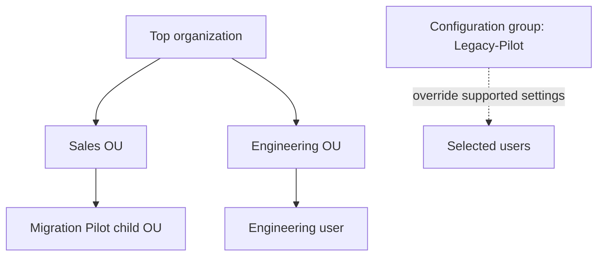

| Scope question | Why it matters |
|---|---|
| Which OU contains the affected user? | Determines inherited/overridden settings |
| Is a configuration group applied? | May supersede expected OU behavior |
| Is the object an active user or group? | Account-type options differ |
| Did the admin save, override, inherit, or unset? | State can differ from parent expectation |
| Has propagation completed? | Current docs say changes can take time |
| Was membership different at event time? | Current state may not equal historical match |

## Message Directions

Current Routing settings can distinguish:

| Direction | Plain meaning | Common use |
|---|---|---|
| Inbound | Incoming from external senders | Spam, gateway, split/dual delivery, quarantine |
| Outbound | Leaving users/organization toward external recipients | Outbound gateway, compliance, DLP-style controls |
| Internal inbound | Internal message viewed from recipient side; organization domain/subdomain in To | Internal recipient policy/copy |
| Internal outbound | Internal message viewed from sender side; organization domain/subdomain in From | Split/dual delivery for internally sent mail |

"Internal" in product routing is based on Google's documented domain interpretation and setting context, not simply source IP. Record the exact selected direction boxes.

## Account Types

Routing options can apply to different account categories.

| Account type | Conceptual meaning | Example route |
|---|---|---|
| Active user account | Provisioned user | Normal Gmail delivery or user-specific rule |
| Group account | Google Group | Group receipt/forwarding behavior |
| Inactive and unrecognized | Address not matching a provisioned active destination under current rules | Split-delivery fallback or catch-all |
| Archived with delegate | Archived account with delegated management where supported | Preserve delegated routing scenario |

Some modify options do not apply to all account types. Quarantine as a main Routing action is documented as available only for Active user account type in the current routing page. Check current docs instead of assuming a rule can quarantine unknown recipients.

## Routing Actions

### Modify Message

Modify is a broad action category. Depending on the current setting, it can:

- Add `X-Gm-Original-To` when recipient changes.
- Add Google spam/phishy headers under documented options.
- Add custom headers for policy or troubleshooting.
- Prepend subject text.
- Change route to a configured host.
- Add more recipients for copies or dual delivery.
- Change envelope recipient or sender under available options.
- Apply spam and delivery options to added recipients.

Each option changes a different layer. Adding a custom header is not the same as changing the SMTP recipient. Adding a recipient intentionally creates a branch. Changing route sends the matched branch to another host.

### Reject Message

Reject prevents delivery and stops other routing/compliance processing for the affected message under current documentation. Gmail supplies an SMTP rejection code such as `550 5.7.1`; admins can add explanatory text but cannot remove the SMTP code requirement.

### Quarantine Message

Quarantine sends matching active-user messages to an admin quarantine for review before delivery or denial. It is not the same as routing to the user's Spam label.

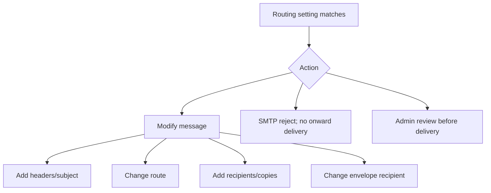

## 🔍 Plain-English deep-dive: Modify Message Can Change Topology

"Modify" sounds cosmetic, but a change-route or add-recipient option alters the delivery graph. A rule that adds `archive@legacy.example` creates another branch. A rule that changes route for unrecognized accounts sends responsibility to another SMTP server. A rule that rewrites the envelope recipient can make a different mailbox authoritative.

For every Modify setting, classify each option:

| Modification | Header/content change | Envelope change | New branch | Next-hop change |
|---|---:|---:|---:|---:|
| Add custom header | Yes | No | No | No |
| Prepend Subject | Yes | No | No | No |
| Change envelope recipient | Maybe adds original-recipient header | Yes | Product/option dependent | Often |
| Add more recipient | Separate copy metadata | Yes | Yes | Can be separate route |
| Change route | No necessary content change | Route metadata | No by itself | Yes |

This classification predicts DKIM impact, duplicates, privacy, loops, and which adjacent server log is needed.

## Address Lists and Envelope Filters

Address lists can bypass or limit application of a setting for defined senders/domains. Envelope filters can target specific envelope senders or recipients using addresses, patterns, or group membership under documented semantics.

| Filter type | Main risk | Safe validation |
|---|---|---|
| Address-list bypass | Broad trusted domain bypasses abuse | Exact list membership, authentication, scope, expiration |
| Address-list only-apply | Legitimate traffic omitted | Positive and negative fixtures |
| Envelope sender | Confused with visible From | Compare Return-Path/envelope evidence |
| Envelope recipient | Confused with visible To | Use ELS recipient details and Bcc awareness |
| Regex/pattern | Overmatch/undermatch | Anchored synthetic cases and official regex guidance |
| Group membership | Nested/current membership surprises | Validate affected users and event-time limitation |

## Hosts, Routes, and Gateways

A host/route is a configured mail server used by Gmail routing. It can represent a legacy server, security gateway, archive, partner, or other SMTP destination. Validate hostname, port, TLS/certificate options, authentication/source expectations, and failure behavior from current configuration.

### Inbound Gateway

An inbound gateway is a server through which incoming mail reaches Gmail. Correct configuration can help Gmail identify the original source and handle high-volume trusted gateway delivery. Overtrusting a shared gateway or failing to restrict expected sources can enable spoofing or source confusion.

### Outbound Gateway

An outbound gateway receives outgoing mail from Gmail, applies processing, and delivers onward. It must not route the message back to the same Google path without an exclusion/terminal design.

### SMTP Relay

SMTP relay lets authorized non-Gmail systems send through Google's service. Authorization, sender restrictions, authentication, TLS, quotas, and error responses are current-provider details. Never test whether an unknown server is an open relay.

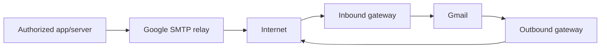

## Split Delivery

Split delivery sends incoming messages to one of two email systems based on recipient. Current Google guidance describes a Gmail-primary design where public MX points to Google, Gmail processes inbound mail, active Gmail users receive in Gmail, and inactive/unrecognized recipients can be routed to a configured non-Gmail server.

Prerequisite in the documented flow: users belong in Gmail **or** the non-Gmail system, not both, because split delivery intends one destination per recipient.

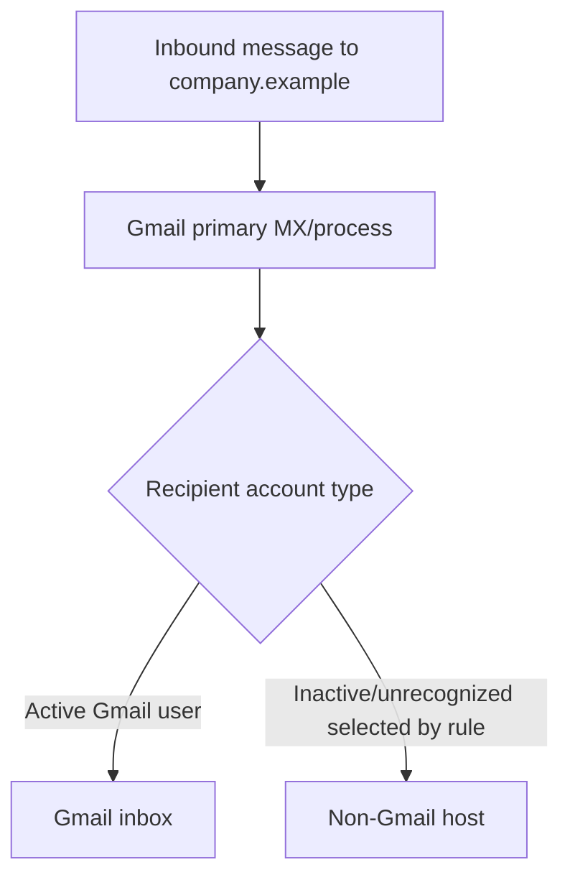

| Split-delivery check | Why it matters |
|---|---|
| MX points to Google in documented design | Gmail is primary decision point |
| Non-Gmail host added | Route exists before rule selects it |
| Account type selection | Active users stay; unrecognized branch changes route |
| Recipient exists in only one system | Prevents ambiguity/duplicates |
| Legacy server terminal behavior | Unknown recipient must not return to Google indefinitely |
| Internal sender directions included when needed | Internal mail reaches legacy users too |

## Dual Delivery

Dual delivery sends incoming mail to two or more inboxes. One primary server receives first, delivers locally, and forwards/copies to a secondary server. Google recommends Gmail as primary in current guidance, while legacy-primary is possible during pilot/migration.

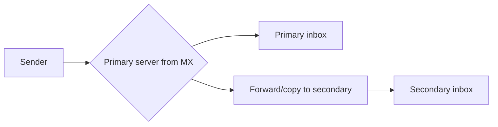

| Property | Split delivery | Dual delivery |
|---|---|---|
| Systems per recipient | One | Two or more |
| Recipient exists | One system | Multiple systems |
| Gmail-primary method | Route selected recipients away | Also deliver/add recipient to legacy route |
| Expected duplicates to user | No | Two mailbox copies by design |
| Typical use | Coexistence by population | Pilot, migration, archive-like parallel copy |
| Completion goal | Maintain separate ownership | Usually end pilot and choose final system |

When Gmail is primary, current guidance uses a Routing setting with `Modify message`, `Also Deliver to`, added recipients, and a changed route to the legacy host. Optional spam/delivery settings can suppress secondary bounces or avoid sending spam to the secondary copy. Those choices affect observability and must be documented.

When legacy is primary, its MX and forwarding configuration control the first handoff. Google recommends server-based forwarding and inbound gateway setup in current guidance. Google cannot diagnose private third-party server internals without their logs.

## Admin Quarantine

Google Workspace admin quarantine is part of the Moderation Tool under current product documentation. Admins create one or more quarantines, assign reviewer groups/privileges, define denial behavior, and create Gmail settings that route messages there.

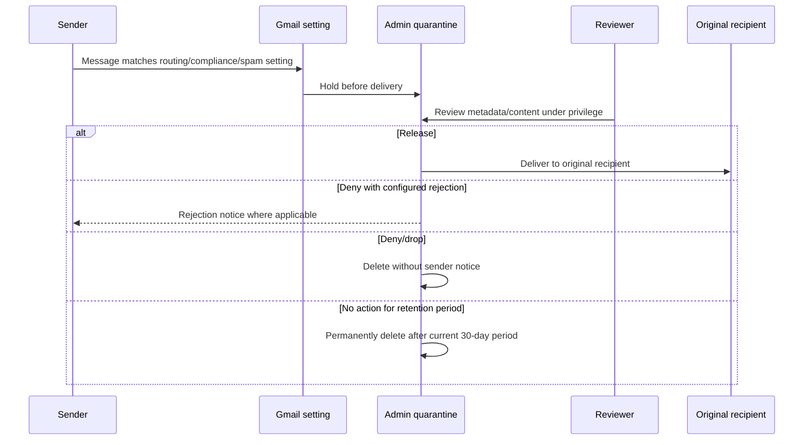

### Quarantine Sources

Current documentation lists Gmail settings such as attachment compliance, content compliance, objectionable content, Routing, and spam as able to send matching messages to quarantine.

### Reviewer and Denial Behavior

Super admins can set up quarantine. Access can be delegated to reviewer groups under supported privileges. Inbound and outbound denial consequences can drop/delete or send a default rejection under configured behavior. Group messages and generated reject messages have special caveats. A denied or expired item is not a mailbox-delivered message.

| Quarantine evidence | Question |
|---|---|
| Quarantine name | Which policy purpose/reviewer scope? |
| Setting name/type | What condition sent the message here? |
| Direction | Inbound, outbound, or internal context? |
| Received/expiry | Is review still possible? |
| Reviewer/action | Released, denied, dropped, or untouched? |
| Denial consequence | Sender notice or silent drop? |
| Original recipient | Where would release deliver? |

## 🔍 Plain-English deep-dive: Spam, Admin Quarantine, and Rejection Are Three Destinations

To a user, all three can look like "not in Inbox." Operationally they differ:

- Spam: Gmail delivered/labelled the message under spam handling.
- Admin quarantine: a configured setting held it for reviewer decision before delivery.
- Rejection: SMTP did not accept onward delivery and returned a failure.

ELS can report message status/location details, the quarantine surface shows reviewer state, and the sending server log shows SMTP rejection. Use the evidence source matching the outcome.

| Outcome | Sender responsibility | Message stored where? | Next action |
|---|---|---|---|
| Spam label | Google accepted | User mailbox spam location | Review spam classification/user setting |
| Admin quarantine | Google accepted into moderation | Admin quarantine | Reviewer/policy decision |
| SMTP rejection | Sender retains/reports failure | Not delivered by rejecting branch | Fix rejection cause; do not search Inbox |
| Quarantine deny/drop | Quarantine action terminates | Removed from quarantine | Audit reviewer/action and notice behavior |
| Quarantine expiry | No reviewer action in current period | Permanently deleted per provider behavior | Prevention/process review; may be unrecoverable |

## Email Log Search

ELS finds metadata and delivery details for messages sent and received by organization users. It can search by sender, recipient, address/domain, IP, date, subject, and Message-ID. It can export results to Sheets or CSV under current options. It cannot display message contents.

### Search Strategy

1. Use full Message-ID when available.
2. Otherwise use narrow date/time plus exact sender and recipient.
3. Use sender/recipient IP only when topology makes it meaningful.
4. For Google Groups, use Message-ID when member delivery details are needed; group-address search has documented limitations.
5. Normalize local time/UTC and data latency.
6. Open message details and recipient-specific delivery information.

### Current Search Semantics to Recheck

Current documentation says custom date ranges can be specified within the past 30 days. For messages older than 30 days, complete recipient and Message-ID are required. A Message-ID search ignores the selected date range and returns matches beyond it. Search results can take from about a minute to an hour depending on volume. These are provider behaviors, not guaranteed constants.

| ELS field | Useful for | Caveat |
|---|---|---|
| Sender | Inbound/outbound identity search | Can include Return-Path semantics; partial searches have rules |
| Recipient | One branch/user/group | Group search does not automatically show all member delivery detail |
| Sender IP | Source/gateway correlation | Outbound results can show Google IPs rather than private sender egress |
| Recipient IP | External delivery host | Multiple routes/targets possible |
| Subject | User-assisted narrowing | Not unique and can contain sensitive text |
| Message-ID | Strong logical correlation | Sender implementations may duplicate IDs; exact format matters |
| Date | Bounds event search | Message-ID can override date behavior in current UI |

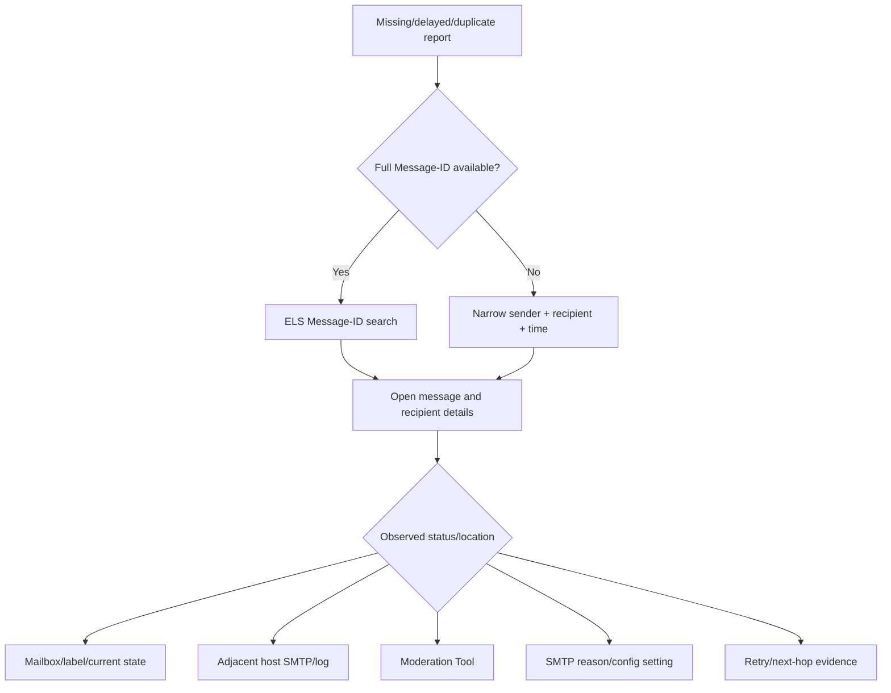

### ELS Does Not Replace Content Tools

ELS's inability to show content is a privacy and product boundary. If content review is legitimately needed, use the approved product and privilege, such as quarantine review, delegated mailbox access, Vault, or security investigation features under organizational policy. Do not ask users to forward sensitive content to bypass access controls.

## 🔍 Plain-English deep-dive: ELS Stops at the Handoff Boundary

When ELS shows that Gmail routed a message to `legacy-mx.example` and the legacy host returned `250`, Google has evidence of a successful SMTP handoff. The legacy server now owns the next claim. ELS cannot prove that the legacy mailbox database stored the item, that a legacy rule did not move it, or that the user's client displayed it.

Think of parcel tracking that ends with "accepted by local courier." That is meaningful proof of custody transfer, but the local courier's delivery scan is still needed for the front door. The same boundary works in reverse: a legacy server log showing successful handoff to Google does not by itself prove Gmail Inbox placement.

| Last strong evidence | Strongest safe conclusion | Evidence needed next |
|---|---|---|
| Gmail route attempted, no final response | Handoff status is unresolved | Gmail retry/error detail and legacy connection logs |
| Legacy host returned 4xx | Legacy temporarily declined; sending side should retry | Legacy reason/queue recovery |
| Legacy host returned 5xx | Legacy permanently declined that transaction | Legacy recipient/policy/configuration evidence |
| Legacy host returned 250 | Legacy accepted SMTP responsibility | Legacy trace, mailbox, spam, quarantine, or rule evidence |
| ELS shows Gmail delivery | Google delivered under its recorded state | Gmail labels/current state, forwarding, or security action if missing |

This keeps support ownership precise and prevents "Google lost it" or "legacy delivered it" claims from outrunning the available telemetry.

## Microsoft-to-Google Comparison

This table is a learning bridge, not a feature-equivalence contract.

| Investigation need | Microsoft starting concept | Google starting concept | Important difference |
|---|---|---|---|
| Baseline domain delivery | Accepted domain/recipient directory | Default routing + Workspace users/domains | Different unknown-recipient model/config objects |
| Specialized route | Connector + mail flow rule | Host/route + Routing setting | Matching and identity controls differ |
| Unknown recipient coexistence | Internal relay + connector | Inactive/unrecognized account route in split delivery | Do not use Exchange domain-type language in Google case |
| Transport evidence | Message trace | Email Log Search | Different IDs, windows, fields, detail semantics |
| Held message | Defender quarantine | Admin quarantine/Moderation Tool | Policy sources and reviewer behavior differ |
| Compliance retention | Purview | Vault | Neither equals routing quarantine |
| Admin change evidence | Audit/admin records | Admin console audit logs | Event schemas and retention differ |
| Post-delivery security | ZAP/Defender remediation | Gmail/security investigation features as edition supports | No assumed one-to-one action set |

## Common Failure Patterns

### Active User Routed to Legacy Unexpectedly

Check OU/configuration group, account-type selections, envelope filters, address lists, direction boxes, change-route option, and other default/compliance settings. Do not assume the user being active prevents a rule explicitly scoped to active accounts.

### Legacy Recipient Rejected Instead of Split-Routed

Check MX-to-Google prerequisite, host existence, inactive/unrecognized account selection, envelope filters, route name, propagation, and whether the recipient accidentally exists as an active user/group/alias.

### Duplicate Copies during Migration

Check whether dual delivery is intentional, whether the same user exists in both systems, whether another forwarding rule adds a third copy, and whether primary/secondary retries caused duplicates. ELS plus legacy logs are both required.

### Quarantined Message Reported as Missing

ELS may show location/status; review the named quarantine, setting, recipient, expiry, and action. Avoid release as a blind test. A setting can quarantine inbound or outbound sensitive messages.

### Routing Loop

Google changes route to legacy; legacy routes unknown or all recipients back to Google. Find repeated state in Received headers and both SMTP logs. Make one system terminal for each recipient and exclude the return branch.

### Rule "Did Not Apply"

Check saved scope, parent inheritance/override, configuration group, direction, account type, address list, envelope filter, active/unrecognized classification, propagation, and whether another setting rejected earlier.

## Troubleshooting Decision Tree

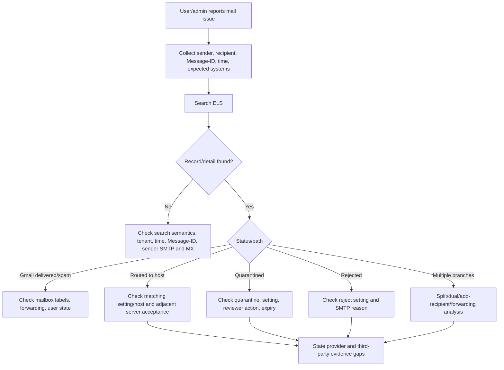

## Safe Lab: Official-Doc Comparison and Synthetic Google-Style Routing Case

### Lab Objective

Use official documentation to design a synthetic Gmail-primary coexistence lab. Analyze active-user delivery, unrecognized-recipient split delivery, dual delivery, admin quarantine, and ELS evidence. No tenant access or live mail is used.

### Safety Rules

- Use `.example` domains and documentation IPs only.
- Do not create a Workspace trial, change MX, add routes, send messages, or access user content.
- Do not test public SMTP relay or recipient enumeration.
- Treat ELS and quarantine rows as supplied fixtures.
- Use metadata, not message bodies.
- All live plans require Gmail Settings privilege review, least privilege, change approval, audit, rollback, and controlled users.

### Prerequisites

1. An authorized, non-production local study folder and a Markdown or spreadsheet editor; no Google Workspace trial or tenant is needed.
2. This Part plus the linked current Google Workspace documentation for routing, Email Log Search (ELS), quarantine, split delivery, and dual delivery.
3. Only the supplied synthetic organization, settings, ELS rows, quarantine rows, and adjacent-host results; do not sign in, send mail, add hosts, or change MX/routing.
4. A worksheet that records account type, organizational unit/configuration group, direction, route/action, Message-ID, Google evidence ceiling, adjacent-system evidence, rollback, and edition/privilege gaps.

### Synthetic Organization

`cymbal.example` is migrating from Legacy L to Google Workspace.

| Object/configuration | Synthetic state |
|---|---|
| Public MX | Google Workspace |
| Active Gmail user | `g.user@cymbal.example` |
| Legacy-only recipient | `l.user@cymbal.example`, not provisioned in Gmail |
| Unknown recipient | `missing@cymbal.example` |
| Added host | `legacy-route` -> `legacy-mx.example` with required TLS fixture |
| Split rule | Inbound + internal outbound; inactive/unrecognized -> change route `legacy-route` |
| Dual pilot group | Configuration group `Dual-Pilot`; also deliver to `legacy-route` |
| Quarantine | `Sensitive-Outbound` with restricted reviewers |
| Content rule fixture | Outbound synthetic sensitive marker -> quarantine |

### Topology

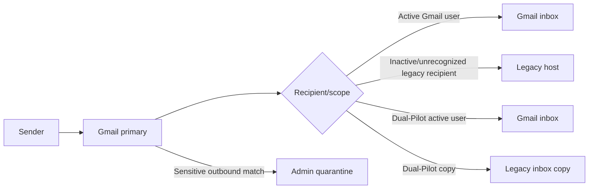

### Case A: Active Gmail User

Fixture:

```text
Message-ID: <g-case-a@sender.example>
Recipient: g.user@cymbal.example
ELS: received by Gmail; delivered to Gmail; no secondary route
```

Expected conclusion: normal active-user branch. If user cannot see it, check ELS labels/location, spam/deletion status, user forwarding/filtering, and current mailbox evidence rather than split-delivery host.

### Case B: Legacy-Only Recipient

Fixture:

```text
Message-ID: <g-case-b@sender.example>
Recipient: l.user@cymbal.example
Account classification: inactive/unrecognized in Gmail
Routing setting: Legacy-Unrecognized
Route: legacy-route
Adjacent host result: 250 accepted by legacy-mx.example
```

Expected conclusion: Gmail processed inbound mail first, the split rule changed the route for the unrecognized recipient, and the legacy server accepted responsibility. ELS cannot prove final legacy mailbox placement beyond the exposed handoff; request legacy evidence if needed.

### Case C: Truly Unknown Recipient

Fixture:

```text
Message-ID: <g-case-c@sender.example>
Recipient: missing@cymbal.example
Gmail classification: inactive/unrecognized
Route: legacy-route
Legacy result: 550 5.1.1 no such user
```

Expected conclusion: under this simple split rule, Gmail routes all inactive/unrecognized recipients to legacy, where terminal recipient validation rejects the unknown address. This is not a Google mailbox rejection. If legacy sent it back to Google instead, a loop would form.

### Case D: Dual-Pilot User

Fixture:

```text
Message-ID: <g-case-d@sender.example>
Recipient: pilot.user@cymbal.example
Scope: Dual-Pilot configuration group
Primary: Gmail delivered
Also Deliver to: legacy-route accepted
```

Expected conclusion: two inbox copies are expected by design. If only one appears, investigate that branch. If three appear, inspect forwarding or overlapping settings. Do not call the expected legacy copy a retry duplicate.

### Case E: Outbound Admin Quarantine

Fixture:

```text
Message-ID: <g-case-e@cymbal.example>
Sender: g.user@cymbal.example
External recipient: partner@recipient.example
Setting: Sensitive-Outbound
Action: quarantine to Sensitive-Outbound
Reviewer action: none
Age: 5 days
```

Expected conclusion: outbound mail is held before onward delivery. The external recipient has not received it. A reviewer can release or deny under privilege and policy; no-action expiry is currently 30 days. Do not send another copy to bypass moderation.

### Exercise 1: Build the Comparison Table

| Case | Google scope/action | Closest Microsoft learning analogy | Why analogy is incomplete |
|---|---|---|---|
| A | Active user normal Gmail | Cloud mailbox delivery | Evidence fields and protection differ |
| B | Unrecognized account change route | Internal relay to legacy | Google uses account/routing settings, not accepted-domain type |
| C | Legacy terminal 5.1.1 | On-prem terminal rejection | Google/legacy evidence boundaries differ |
| D | Also Deliver to legacy | Dual delivery/fork | Configuration objects and spam/bounce options differ |
| E | Admin quarantine via Gmail setting | Transport-rule quarantine | Reviewer, retention, and rule systems differ |

### Exercise 2: ELS Search Plan

For each fixture:

1. Search full Message-ID.
2. Confirm sender and recipient.
3. Open recipient details.
4. Record Gmail delivery, route, rejection, spam/location, or quarantine evidence.
5. Capture adjacent host result when Gmail routed externally.
6. Export only necessary metadata.
7. Record edition/privilege/data gaps.

### Exercise 3: Negative Tests on Paper

| Mutation | Expected failure |
|---|---|
| Remove inactive/unrecognized account selection | Legacy-only recipient may not take intended split route |
| Select active users in split change-route rule | Gmail users may unexpectedly route to legacy |
| Legacy routes unknown recipients back to Google | Routing loop |
| Add dual delivery and user forwarding to same legacy mailbox | Extra duplicate branch |
| Delete quarantine reviewer group access | Only remaining authorized admins can review; workflow gap |
| Set broad reject before specialized route | Rejection can stop other routing/compliance processing |
| Trust a sender-supplied custom loop header | Attacker can bypass or alter route logic |

### Exercise 4: Safe Lab Plan

| Phase | Authorized future activity | Success evidence | Rollback |
|---|---|---|---|
| Read-only inventory | Export domains/users/groups/OUs/config groups/routes/settings | Reviewed topology | No change |
| Host validation | Test owned legacy host/TLS using provider-supported validation | Successful scoped handoff | Disable test host/route |
| Pilot scope | Small dedicated migration OU/config group | Only pilot users affected | Inherit/unset setting |
| Split tests | Active, legacy, unknown, internal sender | One terminal destination each | Disable rule |
| Dual tests | One pilot user with two stores | Exactly two intended copies | Remove also-deliver branch |
| Quarantine tests | Benign synthetic marker, reviewer workflow | Held/released under approval | Disable test setting |
| Evidence | ELS + admin audit + adjacent logs | Complete correlation | Preserve export |

### Exercise 5: Support Summary

> **[Configured state]** Google is the primary MX for `cymbal.example`. A Gmail Routing setting applies to inbound and internal-outbound messages for inactive/unrecognized accounts and changes route to `legacy-route`. A separate `Dual-Pilot` configuration-group setting adds a legacy copy for selected active users. **[Observation]** The active user delivered only to Gmail; the legacy-only recipient was accepted by the legacy host; a truly unknown recipient was rejected by that legacy terminal; the pilot user produced two expected branch deliveries; and the outbound sensitive fixture remains in admin quarantine with no reviewer action. **[Analogy]** The split route serves a coexistence purpose similar to internal relay, but Google implements it through account type and Routing rather than an accepted-domain type. **[Private/edition unknown]** Google spam-model internals and advanced investigation availability are not established. **Safe next action:** keep the pilot scoped, confirm legacy terminal handling, review overlapping forwarding before expanding dual delivery, and exercise quarantine release only with the authorized reviewer and benign fixture.

### Expected evidence

The lab should produce an inspectable Gmail-primary topology, five-case branch conclusions, Google-versus-Microsoft comparison table, ELS search plan, seven negative-test predictions, authorized future lab plan with rollback, routing inventory, adjacent-host evidence boundaries, quarantine state, and bounded support summary. Every Google-specific claim should point to the supplied fixture or an official source.

### Cleanup and privacy

- Retain only the synthetic `.example` organization, settings, Message-IDs, ELS/quarantine fixtures, and derived comparison/plan.
- Delete or redact any accidentally pasted real Workspace domain, user/recipient, organizational unit/group, Message-ID, ELS export, quarantine content, host, token, tenant/account data, or personally identifiable information (PII); delete the artifact if reliable redaction is not possible.
- Do not create a trial, sign in, send mail, change MX/routes/hosts, enable relay, release/deny quarantine, access user content, or query a live customer environment.
- Confirm before retention or sharing that the exercise used no live Google/customer activity, only metadata fixtures, and remains labeled learned architecture rather than production Google Workspace administration.

### Validation rubric

| Dimension | Fail | Developing | Pass |
|---|---|---|---|
| Google model accuracy | Copies Microsoft object names/behavior | Uses some Google controls correctly | Correctly maps Default routing, Routing, account types, OU/groups, hosts, ELS, and quarantine |
| Recipient branch reasoning | Treats split, dual, and forwarding alike | Distinguishes primary cases | Correctly predicts active, legacy-only, unknown, dual-pilot, and quarantine branches/terminal owners |
| Evidence boundaries | Claims ELS proves legacy mailbox/content | Notes adjacent logs | Uses full Message-ID, metadata, route/status, adjacent SMTP proof, and edition/privilege gaps |
| Negative tests and safety | Broadens relay/routing or releases content | Lists rollback only | Tests loops, overlap, scope, rejection order, reviewers, and spoofable markers on paper |
| Comparison and communication | Presents Microsoft analogy as equivalence | Names one difference | Uses analogy for transfer while explicitly naming Google-specific objects and limits |
| Honesty and privacy | Claims production Google operation or uses live data | Labels learning with incomplete cleanup | Synthetic-only, metadata-minimized, no tenant activity, and explicit learned-architecture boundary |

## Support Runbook

### Intake

- Workspace primary/secondary domain and public MX.
- Sender, envelope recipient, UTC window, full Message-ID.
- Expected Gmail, legacy, dual, gateway, or quarantine path.
- User OU, configuration group, active/group/unrecognized classification.
- Recent route, host, routing, compliance, spam, quarantine, forwarding, or MX changes.

### First Pass

1. Search ELS by Message-ID or narrow sender/recipient/time.
2. Identify recipient-specific route/status/location.
3. Inventory Default routing plus specialized Routing and compliance settings.
4. Resolve OU/configuration group, direction, account type, address list, and envelope filters.
5. Identify modify/reject/quarantine action.
6. If route leaves Google, collect adjacent SMTP acceptance and final delivery evidence.
7. If quarantined, inspect named quarantine, setting, reviewer action, and expiry.
8. If duplicate, classify split/dual/add-recipient/forwarding/retry.

### Evidence Package

| Category | Capture |
|---|---|
| Identity | Workspace domain, sender, recipient, account type, OU/group |
| Correlation | Message-ID, UTC time, ELS search/detail |
| Baseline | Default routing, MX, primary server |
| Specialized route | Setting name, directions, filters, account types, action, host |
| External handoff | Host, TLS, SMTP result, legacy ID |
| Quarantine | Name, source setting, reviewer, action, expiry |
| Change evidence | Admin audit, save/override/inherit state, propagation |
| Gaps | ELS content limitation, edition/privilege, third-party log |

### Safe Response Rules

- Never create a catch-all to hide recipient-directory problems without ownership review.
- Never broaden SMTP relay or gateway trust to make one test pass.
- Never release sensitive or suspicious quarantined content as a routing probe.
- Never enable dual delivery organization-wide before overlapping forwarding tests.
- Never copy a Microsoft command or object name into a Google case.
- Use benign synthetic subjects/content and dedicated pilot accounts.
- Account for up-to-24-hour documented propagation even when changes are usually faster.

## Case Summary Template

### Scope

- Workspace domain/MX:
- User/account type:
- OU/configuration group:
- Sender/recipient:
- UTC window:
- Message-ID:
- Expected Gmail/legacy/quarantine path:

### Routing Inventory

| Setting | Default/Routing/compliance | Direction | Account types | Filters | Action | Host/recipient |
|---|---|---|---|---|---|---|
|  |  |  |  |  |  |  |

### ELS and Handoff Timeline

| UTC | Message/recipient | Google status/location | Route/host | Adjacent SMTP result |
|---|---|---|---|---|
|  |  |  |  |  |

### Quarantine

- Quarantine name:
- Source setting:
- Direction:
- Received/expiry:
- Reviewer/action:
- Denial consequence:

### Comparison Boundary

- Useful Microsoft analogy:
- Why it is not exact:
- Google-specific source/document:

### Conclusion

- **[Provider/configured behavior]:**
- **[Observation]:**
- **[Analogy]:**
- **[Inference]:**
- **[Edition/private unknown]:**
- Safe next action/test/rollback:

## Security and Privacy Boundaries

Google routing can redirect or copy sensitive mail, alter recipients, bypass controls, create loops, or expose data to a legacy system. ELS exports contain user communication metadata. Quarantine reviewers can access sensitive content. SMTP relay can become an abuse path if overbroad.

| Action | Risk | Control |
|---|---|---|
| Add recipient/dual delivery | Data copied to another system | Pilot scope, data owner approval, recipient inventory |
| Change route | Bypass or loop | Terminal-owner map, TLS, negative tests |
| Reject | Organization/user mail loss | Narrow filters, benign test, rollback, sender notice review |
| Quarantine/release | Sensitive or malicious content exposure | Restricted reviewer group, least privilege, audit |
| ELS export | Metadata disclosure | Narrow fields/range, secure storage, retention |
| SMTP relay | Spam/open relay | Approved authorization, sender/recipient scope, quotas, monitoring |
| Address-list bypass | Spoof/phish bypass | Authentication-aware design, narrow entries, review/expiry |

## Official Source Anchors

All listed sources were accessed on August 24, 2026 and must be revalidated for current provider behavior.

| Source | What it establishes |
|---|---|
| [Google Workspace email routing options](https://knowledge.workspace.google.com/admin/gmail/advanced/email-routing-and-delivery-options-for-google-workspace) | Default versus specialized routing, inbound/outbound/compliance scenarios, split/dual delivery, gateways, TLS routing |
| [Add Gmail routing settings](https://knowledge.workspace.google.com/admin/gmail/advanced/add-gmail-routing-settings) | Direction, actions, modify options, account types, address lists, envelope filters, OU scope |
| [Email Log Search](https://knowledge.workspace.google.com/admin/support/troubleshooting/find-messages-with-email-log-search) | Search fields, current date/Message-ID semantics, metadata/content boundary, exports, status troubleshooting |
| [Set up email quarantine](https://knowledge.workspace.google.com/admin/gmail/advanced/set-up-email-quarantine) | Quarantine setup, reviewer access, release/deny, notifications, setting sources, current retention/expiry |
| [Google split delivery](https://knowledge.workspace.google.com/admin/gmail/advanced/send-email-to-2-email-systems-with-split-delivery) | Gmail-primary split prerequisites, unrecognized-account routing, host and direction settings |
| [Google dual delivery](https://knowledge.workspace.google.com/admin/gmail/advanced/deliver-email-to-multiple-inboxes-with-dual-delivery) | Primary/secondary behavior, Gmail-primary recommendation, also-deliver route, legacy-primary pilot |

## Likely Interview Questions

### Q1. How would you explain Google Workspace Default routing versus Routing?

**Model answer:** Default routing establishes broad default delivery for the organization. Routing settings create specialized or overriding behavior for matched directions, organizational scope, account types, address lists, and envelope filters. A Routing setting can modify, reject, or quarantine. I inspect both baseline and specialized settings because a message can be affected by more than one control family.

### Q2. How does Google split delivery work in the documented Gmail-primary model?

**Model answer:** Public MX points to Google, so Gmail processes inbound mail first. Active Gmail recipients deliver to Gmail. A Routing setting can select inactive and unrecognized accounts and change route to a configured non-Gmail host. Each user should exist in one system for split delivery. The legacy system must be terminal for its recipients and unknowns so it does not route them back into a loop.

### Q3. What is the difference between split and dual delivery?

**Model answer:** Split delivery chooses one mail system per recipient, typically Gmail or legacy. Dual delivery sends a copy to two or more inbox systems. With Gmail primary, dual delivery can use Also Deliver to and a changed route for the added legacy branch. Two user-visible copies are expected in dual delivery; they are a defect in split delivery unless another rule or retry explains them.

### Q4. What can Email Log Search prove?

**Model answer:** ELS can find messages sent and received by organization users and show metadata and delivery details such as sender, recipient, IP, Message-ID, status, labels/location, spam, and deletion information under current capabilities. It cannot display message contents. For a route to a non-Gmail host, ELS establishes Google's branch evidence, while final legacy mailbox delivery needs the adjacent server's logs.

### Q5. How is Google admin quarantine different from the Spam folder?

**Model answer:** Admin quarantine is a moderation holding area populated by configured Gmail settings such as Routing, compliance, attachment, objectionable-content, or spam settings. Authorized reviewers release or deny messages before onward delivery. Spam is a mailbox label/location after Gmail handling. Rejection is a third outcome where SMTP does not accept delivery. I use ELS plus the quarantine record and reviewer action to distinguish them.

### Q6. What routing scope would you check when a rule affects one user but not another?

**Model answer:** I compare OU inheritance/override, configuration-group membership, message direction, account type, address list behavior, envelope sender/recipient filters, active versus unrecognized classification, and propagation time. I also inventory Default routing and other compliance or gateway settings. Current membership may differ from event-time state, so I preserve audit evidence.

### Q7. How would you use prior experience without making a bad Google assumption?

**Model answer:** I transfer the evidence workflow: define topology, follow one recipient branch, use least privilege, separate transport from quarantine/current state, and test safely. Then I use Google nouns and docs. ELS is a useful analogy to message trace, and unrecognized-account routing serves a coexistence purpose similar to internal relay, but the objects, matching logic, IDs, and limits are not equivalent.

### Q8. How would you safely test a Google Workspace routing change?

**Model answer:** I first export current settings and draw the primary/terminal systems. I use dedicated synthetic users in a pilot OU or configuration group, a benign marker, and an owned non-Gmail host. I test active, legacy, unknown, internal, external, duplicate, rejection, and quarantine cases; correlate ELS, admin audit, and adjacent SMTP logs; allow for propagation; and define inherit/unset or disable rollback. I do not broaden relay or release unsafe content.

## 🧠 30-Second Memory Hooks

- **Default routing is baseline; Routing is specialized.**
- **Scope = OU/group + direction + account type + filters.**
- **Modify can change topology.**
- **Reject stops delivery; quarantine waits for review.**
- **Active user, group, and unrecognized are different branches.**
- **Split chooses one system; dual creates two copies.**
- **Primary server is the MX destination.**
- **ELS shows metadata/status, not message content.**
- **Google route is not an Exchange connector.**
- **Admin quarantine is not the Spam label.**
- **Third-party delivery needs third-party evidence.**
- **Use Microsoft method, Google nouns.**

## Completion Checklist

- [ ] I can draw conceptual inbound and outbound Google Workspace paths.
- [ ] I can distinguish Admin console Gmail settings, ELS, quarantine, Vault, and investigation features.
- [ ] I can explain Default routing versus Routing.
- [ ] I can map OU/configuration group, direction, account type, address lists, and envelope filters.
- [ ] I can distinguish Modify, Reject, and Quarantine actions.
- [ ] I can identify when Modify adds recipients, changes envelope, or changes next hop.
- [ ] I can explain active, group, inactive/unrecognized, and archived/delegate account concepts.
- [ ] I can distinguish host, inbound gateway, outbound gateway, and SMTP relay.
- [ ] I can explain Gmail-primary split delivery and terminal legacy behavior.
- [ ] I can explain Gmail-primary and legacy-primary dual delivery.
- [ ] I can use ELS by Message-ID and name its content limitation.
- [ ] I can distinguish Spam, admin quarantine, and SMTP rejection.
- [ ] I can compare Microsoft and Google only as explicitly labeled analogies.
- [ ] I can plan a least-privilege pilot with propagation and rollback.
- [ ] I do not claim production Google Workspace administration from this learning lab.

[Next: Part 033 - Delivery Quarantine Remediation NDRs and Bounces](Part-033-delivery-quarantine-remediation-ndrs-and-bounces.md)