# Part 033 - Delivery Quarantine Remediation NDRs and Bounces

## Purpose, Evidence, and Currency

"The email bounced," "the message was delivered," and "the user did not receive it" are not equivalent statements. Email has multiple responsibility and recipient states: submission, SMTP acceptance, queueing, relay, mailbox delivery, spam placement, admin quarantine, user quarantine, forwarding, expansion, post-delivery remediation, deletion, and read or non-read. A message can move through several states, and each recipient branch can differ.

This part unifies the transport, Microsoft 365, and Google Workspace lessons into one delivery-state model. It explains synchronous SMTP failures, temporary retries, Delivery Status Notifications (DSNs), nondelivery reports (NDRs), colloquial bounces, provider quarantine, post-delivery remediation, and recovery. The goal is not to memorize every vendor error. It is to locate who held responsibility, what action occurred for each recipient, whether retries continue, and what evidence establishes the current state.

The central invariant is:

$$
\text{Current state} = \text{last proven state transition for one recipient branch}
$$

A final `250` after SMTP DATA transfers responsibility to the receiving server. A `4xx` means the attempted handoff did not complete and the current SMTP client normally queues and retries. A `5xx` means the attempted handoff did not complete and the exact unchanged request should not be retried automatically. If a server accepts a message and later cannot deliver it, it can generate a DSN to the original envelope reverse-path. A DSN itself uses a null reverse-path so a failed DSN does not generate another DSN and form a bounce loop.

Quarantine is usually a post-acceptance restricted holding state, not an SMTP failure. Release changes the held branch toward delivery; deny/drop terminates it under provider policy. Post-delivery remediation can move or delete a message after a trace recorded mailbox delivery. None of these states proves that the user read the message.

RFC 5321 defines SMTP acceptance and responsibility. RFC 3463 defines enhanced status codes. RFC 3461 defines the SMTP DSN extension and request parameters. RFC 3464 defines the structured DSN format. Provider documentation defines current NDR presentation, quarantine behavior, action rights, retention, and remediation. Exact provider codes and retention values change and must be rechecked.

## Section Goal

By the end of this part, you should be able to:

- Draw a delivery-state timeline from submission through current recipient state.
- Distinguish SMTP reply, DSN, NDR, bounce, Message Disposition Notification (MDN), and provider trace status.
- Explain who owns responsibility after final `2xx`, `4xx`, and `5xx` replies.
- Preserve the SMTP command stage: connection, EHLO, MAIL FROM, RCPT TO, DATA initiation, or end-of-DATA.
- Interpret enhanced status code structure `class.subject.detail`.
- Distinguish address, mailbox, mail system, network/routing, protocol, content/media, and security/policy subjects.
- Explain why `4.x.x` can appear in a terminal `Action: failed` DSN after retries are abandoned.
- Interpret DSN `Action` values: `failed`, `delayed`, `delivered`, `relayed`, and `expanded`.
- Annotate per-message and per-recipient DSN fields.
- Identify Reporting-MTA versus Remote-MTA and the actual rejecting system.
- Distinguish Original-Recipient from Final-Recipient after forwarding or rewriting.
- Explain `Diagnostic-Code` as transport-specific detail and `Status` as transport-independent classification.
- Explain DSN MIME structure: human-readable part, `message/delivery-status`, and optional original message/headers.
- Explain the SMTP DSN extension parameters `NOTIFY`, `ORCPT`, `RET`, and `ENVID` at a high level.
- Distinguish synchronous rejection from a later out-of-band NDR and explain backscatter risk.
- Explain null reverse-path behavior and why systems do not bounce a bounce.
- Handle multi-recipient partial success without declaring the entire message delivered or failed.
- Distinguish quarantine, spam/Junk, rejection, delivery, release, deny, expiry, and remediation.
- Explain how ZAP or admin remediation can change state after delivery.
- Produce a delivery-state decision tree and annotated synthetic NDR safely.

## JD Mapping

| Role responsibility | Capability from this part | Example support output |
|---|---|---|
| Triage "not delivered" | Classify exact state and owner | "The remote host returned 451 at RCPT, so our MTA still owns the queued branch and will retry." |
| Read bounce reports | Parse machine fields before prose | "Action is failed, Status is 5.1.1, and the Remote-MTA rejected the final recipient." |
| Diagnose delays | Separate temporary condition from terminal abandonment | "The earlier DSN was delayed; the later failed DSN shows retries ended." |
| Diagnose false positives | Separate quarantine from SMTP rejection | "The provider accepted and quarantined the message; the sender should not resend." |
| Investigate missing-after-delivery | Add post-delivery actions to timeline | "Mailbox delivery occurred at 10:00; remediation soft-deleted the item at 10:21." |
| Handle multiple recipients | Track each envelope branch | "Two recipients delivered, one delayed, and one failed; there is no single message-wide result." |
| Explain ownership | Identify generating, reporting, remote, and fixing parties | "Microsoft generated the NDR, but the partner host issued the rejection." |
| Protect privacy/security | Treat DSNs and quarantine as sensitive/untrusted input | Redacted NDR annotation with no automatic action from an unverified report |

## Candidate Honesty Note

If you have not operated mail queues or provider remediation in production, say:

> "I would preserve the full NDR or SMTP response, identify the affected recipient branch, command stage, Reporting-MTA and Remote-MTA, then read Action, Status, and Diagnostic-Code. I would place that event on a responsibility timeline with provider trace, quarantine, and any post-delivery action. I would not resend a quarantined message, treat a delay notice as final failure, or assume a Delivered event means the item remains in Inbox."

## Evidence Labels Used in This Part

| Label | Meaning | Delivery example |
|---|---|---|
| **[Standard]** | RFC-defined semantics | "A final `250` after DATA transfers responsibility to the server." |
| **[Provider behavior]** | Current service-specific state/action | "This quarantine reason permits only admin release under current policy." |
| **[Observation]** | SMTP, DSN, trace, quarantine, mailbox, or action record | "Action Center records soft-delete success at 10:21 UTC." |
| **[Inference]** | Testable explanation | "The user cannot find the message because remediation followed initial delivery." |
| **[Private unknown]** | Undisclosed scoring or missing adjacent-system data | "The exact proprietary phish score is unavailable." |
| **[Untrusted claim]** | User-supplied or potentially forged report not corroborated | "An email claims delivery failed, but no matching sent message or trace exists." |

## Beginner Primer: Delivery Is a State Machine, Not a Checkbox

Imagine a tracked package. "The courier accepted it" is not "the recipient opened it." The package can be queued at a depot, transferred, refused by the next carrier, held by customs, delivered to a building, moved to a secure room, returned, or destroyed under policy. Each scan has a time, actor, and scope.

Email has similar scans:

| Email state | Package analogy | Responsible evidence |
|---|---|---|
| Submitted | Sender gave parcel to first courier | Submission/app log |
| SMTP 4xx | Next depot temporarily refused | Sending queue and reply |
| SMTP 5xx | Next depot permanently refused this attempt | Reply/NDR and sender state |
| SMTP 250 after DATA | Next depot accepted responsibility | Both adjacent SMTP logs |
| Relayed | Passed to another environment | Trace and next-hop evidence |
| Delivered | Placed in message store/list exploder | Provider trace/DSN |
| Spam/Junk | Delivered to a lower-trust mailbox location | Provider/mailbox evidence |
| Quarantined | Held at controlled review desk | Quarantine item/policy |
| Remediated | Moved/removed after delivery | Action/audit history |
| Read | Human/client opened or acknowledged | Separate user/client signal, not SMTP |

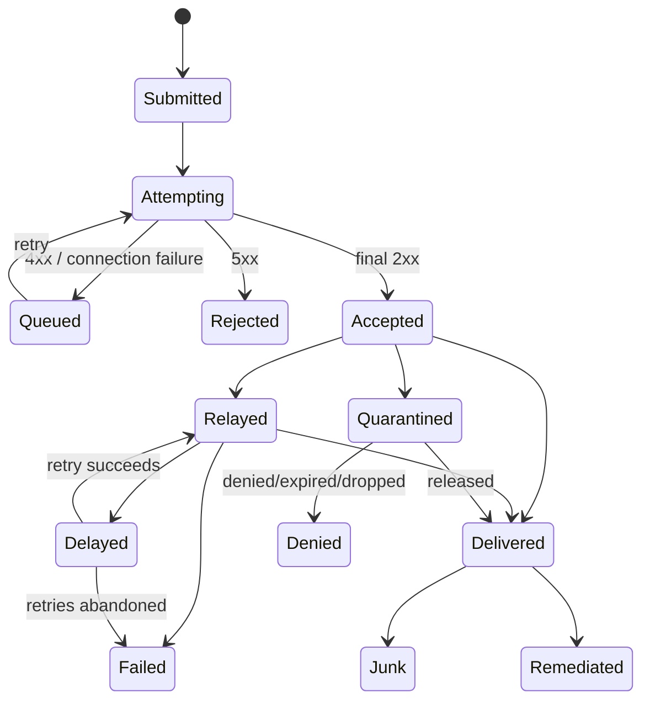

The state machine is per recipient. One SMTP transaction can accept some RCPT commands and reject others. One message can expand into many branches. Never collapse results without preserving recipient scope.

## 🔍 Plain-English deep-dive: "Accepted" Answers Who Owns the Next Problem

At the end of DATA, `250` is a custody handoff. Before that `250`, the sending SMTP client owns delivery. After it, the receiving server owns delivery or a later status report. If the receiving server later discovers a nonexistent downstream recipient, it generates a DSN rather than asking the previous server to replay the original SMTP transaction.

This distinction tells support where to look:

| Last proven event | Current owner | Next evidence |
|---|---|---|
| TCP connection never established | Sending MTA | DNS/network/queue retry |
| Remote returned 4xx | Sending MTA | Queue, retry schedule, remote condition |
| Remote returned 5xx | Sending MTA/user workflow | Permanent response and correction |
| Remote returned final 250 | Receiving MTA/service | Its trace, queue, mailbox, quarantine, or later DSN |
| Provider delivered to mailbox | Provider/mailbox state | Current folder, rules, user/security action |
| Provider quarantined | Provider quarantine workflow | Reason, policy, release/deny/expiry |

"Our server sent it" is weak. "Remote host returned final 250 at 10:00:04 UTC" proves the responsibility boundary.

## Terminology: DSN, NDR, Bounce, and MDN

| Term | Precise use | Common use | Important boundary |
|---|---|---|---|
| DSN | Structured Delivery Status Notification per RFC format | Any delivery report | Can report success, delay, failure, relay, expansion |
| NDR | Nondelivery report, usually a failure DSN/provider report | Exchange failure notice | Subset/use of delivery status reporting |
| Bounce | Colloquial return/failure notification | SMTP rejection or later NDR | Ambiguous; ask which |
| SMTP reply | In-session numeric reply to a command | "Bounce code" | Not a separate email message |
| MDN | Message Disposition Notification | Read receipt | User-agent disposition, not transport delivery |
| Trace status | Provider telemetry event/status | Delivery report | Provider-specific, not necessarily an RFC DSN |

Use "synchronous SMTP rejection" for an in-session `5xx` and "post-acceptance failure DSN" for a later report. This removes most ambiguity.

## SMTP Reply Classes and Responsibility

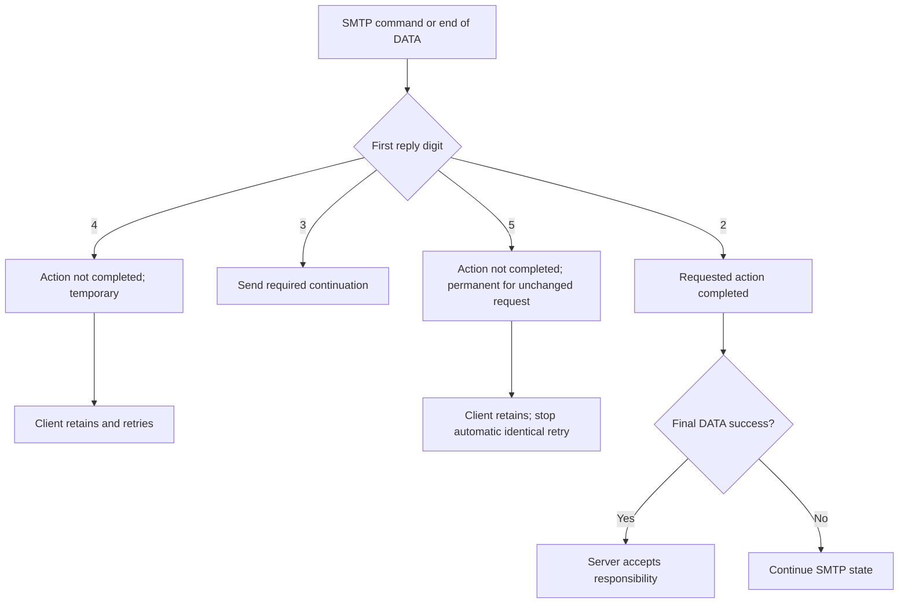

| Class | Meaning | Retry semantics | Typical support wording |
|---:|---|---|---|
| 2xx | Positive completion | No retry of completed action | "Accepted/completed at this stage" |
| 3xx | Positive intermediate | Continue protocol | "Server is ready for more data" |
| 4xx | Transient negative | Retry later, usually automatically | "Deferred; not final yet" |
| 5xx | Permanent negative | Do not repeat unchanged request automatically | "Rejected/failed; correction required" |

A `250` to MAIL FROM or RCPT TO is not the same as final message acceptance. Preserve stage. The strongest handoff is final `250` after the end-of-DATA marker for the accepted recipients.

## Command Stage Matters

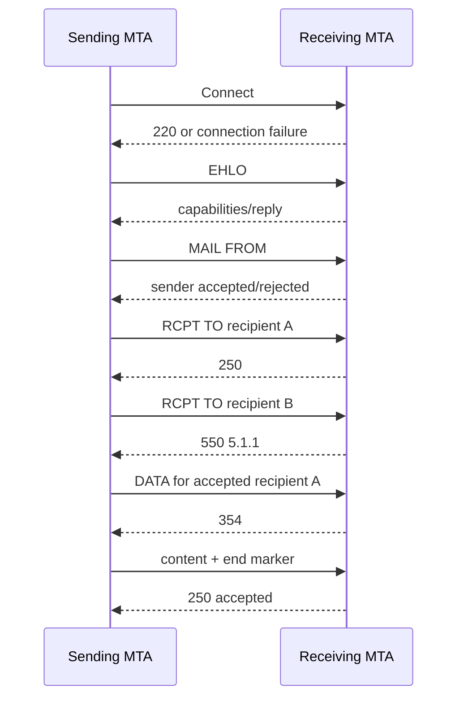

In this example, recipient B fails synchronously at RCPT. Recipient A reaches final acceptance. The sender can report B immediately while A belongs to the receiver.

| Failure stage | What remote system saw | Likely owner/action |
|---|---|---|
| Connect/220 | No message envelope/content | Sender queues/retries or tries alternate |
| EHLO/TLS | Connection identity/capabilities only | Transport/TLS diagnosis |
| MAIL FROM | Envelope sender, no recipient/content | Sender/authorization/policy diagnosis |
| RCPT TO | One envelope recipient, usually no content | Recipient/routing/policy diagnosis |
| DATA command before 354 | Envelope recipients, no content transfer | Protocol/policy/resource diagnosis |
| End-of-DATA before final response | Full content transmitted | Receiver may inspect content; acceptance still unresolved until reply |
| Final 250 | Full accepted transaction | Receiver owns next state |

## Enhanced Status Codes

Enhanced codes follow:

$$
\text{class.subject.detail}
$$

The class is 2, 4, or 5. The subject indicates the broad area. Detail refines it. Unknown details should still be understood at class and subject levels.

| Subject | Category | Examples of investigation |
|---:|---|---|
| X.0.X | Other/undefined | Need diagnostic text/product context |
| X.1.X | Addressing | Bad recipient, sender syntax, moved address |
| X.2.X | Mailbox | Disabled/full/mailbox-specific limit |
| X.3.X | Mail system | System full/not accepting/misconfigured |
| X.4.X | Network/routing | No answer, bad connection, DNS, loop, expiry |
| X.5.X | Delivery protocol | Invalid command, syntax, recipient count, version |
| X.6.X | Content/media | Unsupported media, conversion, message content |
| X.7.X | Security/policy | Authorization, filtering, cryptography, integrity |

### Examples

| Code | Standard-level reading | What still needs confirmation |
|---|---|---|
| `5.1.1` | Permanent bad destination mailbox address | Typo, stale address, directory sync, forwarding, provider-specific use |
| `4.2.2` | Temporary mailbox-full condition | Provider quotas/current mailbox state |
| `5.3.4` | Permanent message-too-big for system | Which hop/limit and actual encoded size |
| `4.4.2` | Temporary bad connection | Timeout/reset/TLS/network stage |
| `5.4.4` | Permanent unable-to-route classification | DNS, connector, domain ownership, policy |
| `5.4.6` | Routing loop detected | Exact cyclic route edges |
| `4.4.7` | Temporary-class delivery time expired context | Why attempts failed and whether Action is now failed |
| `5.7.1` | Permanent delivery not authorized/policy | Group restriction, rule, relay auth, provider detail |

Provider-specific details can use registered extensions and richer text. Do not map every `5.7.1` to one cause.

## 🔍 Plain-English deep-dive: Action and Status Answer Different Questions

In a DSN, `Status: 4.4.2` says the underlying condition was temporary, such as a bad connection. `Action: delayed` says retries continue. Later, the MTA may give up and issue `Action: failed` with the same temporary-class status. The condition remained temporary in nature, but the operational action became terminal because the retry window ended.

| Action | Status class | Meaning |
|---|---:|---|
| delayed | 4.x.x | Not delivered yet; MTA continues attempts |
| failed | 4.x.x | Temporary-type condition persisted; attempts abandoned |
| failed | 5.x.x | Permanent condition; attempts abandoned |
| delivered | 2.x.x | Delivered under DSN definition, not read |
| relayed | 2.x.x | Handed to environment that cannot confirm final delivery |
| expanded | 2.x.x | Expanded to more recipients; later branch reports can follow |

Read `Action` first for retry/finality, then `Status` for category, then `Diagnostic-Code` for the actual transport response.

## Queueing, Retry, and Expiration

After a 4xx or network failure, the sending MTA queues the recipient branch and retries with backoff. RFC 5321 provides baseline retry guidance, but provider schedules and expiration periods vary. A delay DSN may be sent if requested/permitted, but it is not required in every case. Eventually the message delivers or the sender abandons attempts and issues a failure DSN.

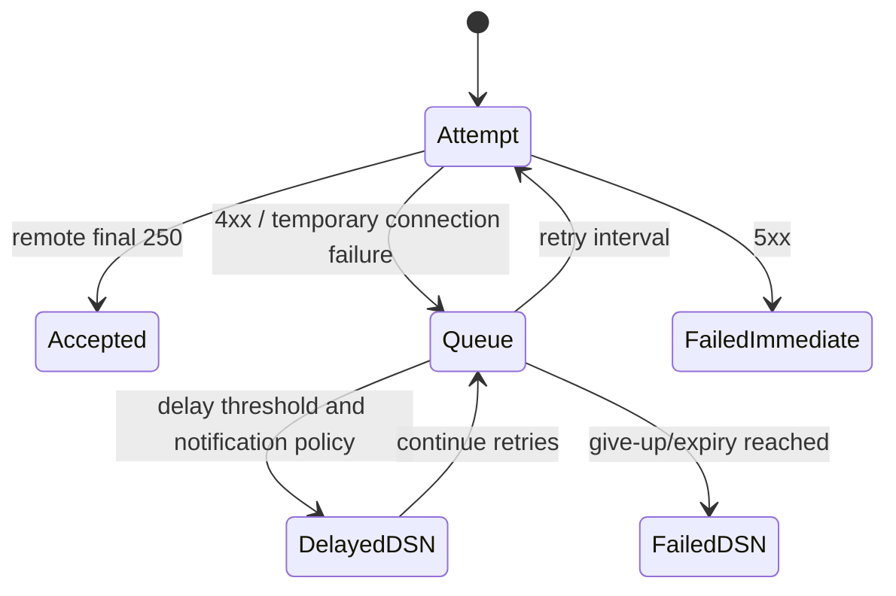

| Observation | Is delivery final? | Should user resend immediately? |
|---|---:|---:|
| 4xx in current queue | No | No; duplicate risk and retry already active |
| `Action: delayed` DSN | No | No; report says attempts continue |
| 5xx at RCPT | Yes for that attempt/recipient | Only after correcting cause |
| `Action: failed` DSN | Yes; attempts abandoned | Correct cause, then deliberate new send |
| Final 250 | Handoff complete, not final user state | No |

Repeated manual resends during an active queue can create duplicates when the original later succeeds.

## DSN Extension Requests

RFC 3461 defines the `DSN` EHLO extension and parameters that let a client request notification behavior.

| Parameter | SMTP command | Purpose |
|---|---|---|
| `NOTIFY` | RCPT TO | Request SUCCESS, FAILURE, DELAY, combinations, or NEVER |
| `ORCPT` | RCPT TO | Preserve original recipient address for correlation |
| `RET` | MAIL FROM | Request FULL message or headers only in failure DSN |
| `ENVID` | MAIL FROM | Carry sender-known envelope transaction identifier |

`NOTIFY=NEVER` must stand alone. The absence of a NOTIFY request generally preserves ordinary failure-notification behavior. Support for the extension is advertised in EHLO. Relays that support it propagate the applicable request data; gateways/non-supporting systems can reduce certainty.

Do not confuse `ENVID` with RFC5322 Message-ID. ENVID identifies an envelope transaction. Message-ID identifies message content/logical message under its conventions.

## DSN Message Structure

A standard DSN is a MIME `multipart/report` with `report-type=delivery-status`.

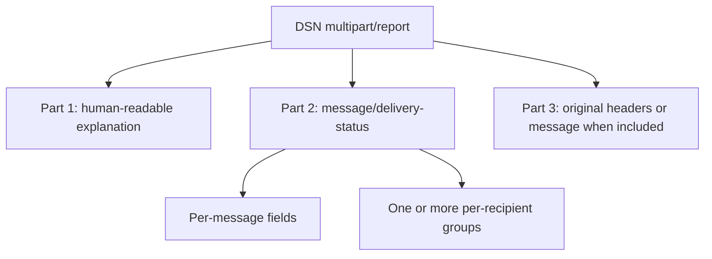

| Part | Audience | Use |
|---|---|---|
| Human-readable | Sender/user | Summary and suggested action |
| `message/delivery-status` | Software/admin | Structured fields and codes |
| Original headers/message | Correlation/debugging | Identify original content and path; privacy-sensitive |

The human prose is useful but can be translated, simplified, provider-generated, or misleading. The machine fields are the reliable annotation foundation.

## Per-Message DSN Fields

| Field | Required? | Meaning |
|---|---:|---|
| Reporting-MTA | Yes | MTA reporting the described attempt/result |
| Original-Envelope-ID | Optional/conditional | ENVID correlation for original transaction |
| DSN-Gateway | Conditional | Gateway that translated a foreign report |
| Received-From-MTA | Optional | MTA from which Reporting-MTA accepted message |
| Arrival-Date | Optional | Arrival at Reporting-MTA |

The Reporting-MTA can generate the DSN because a Remote-MTA refused the handoff. The Reporting-MTA is not automatically the system at fault.

## Per-Recipient DSN Fields

| Field | Required? | Meaning |
|---|---:|---|
| Original-Recipient | Optional/conditional | Sender-specified address preserved by DSN extension |
| Final-Recipient | Yes | Address as known to Reporting-MTA for this group |
| Action | Yes | failed/delayed/delivered/relayed/expanded |
| Status | Yes | Transport-independent enhanced status |
| Remote-MTA | Optional/required in applicable SMTP relay DSN | Next hop that returned status/refused acceptance |
| Diagnostic-Code | Optional/expected when transport diagnostic exists | Exact SMTP/foreign diagnostic detail |
| Last-Attempt-Date | Optional | Last attempted delivery time |
| Final-Log-ID | Optional | Remote/final log correlation |
| Will-Retry-Until | Optional only for delayed | Expected retry abandonment time |

### DSN Actions

| Action | Terminal? | Correct interpretation |
|---|---:|---|
| failed | Yes | Reporting MTA abandoned attempts for recipient |
| delayed | No | Attempts continue; later DSN may follow |
| delivered | Yes for DSN transport state | Placed in mailbox/list exploder; not read |
| relayed | Boundary state | Handed to environment that cannot provide requested final confirmation |
| expanded | No for downstream branches | Alias expanded to multiple recipients; later branch DSNs possible |

## Reporting-MTA, Remote-MTA, and Fix Owner

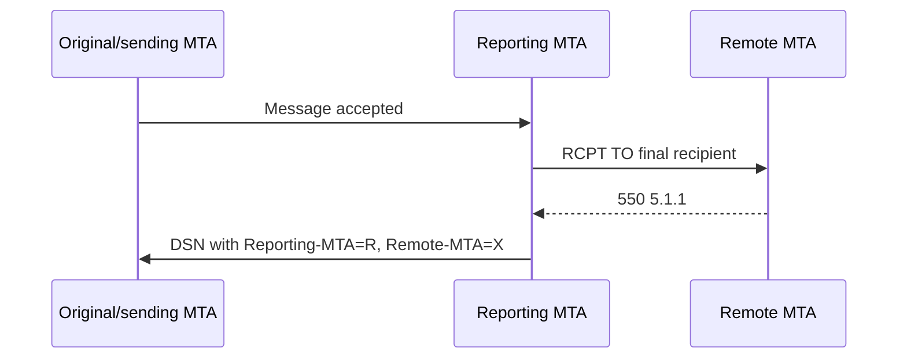

| DSN evidence | Interpretation |
|---|---|
| Reporting-MTA only, no Remote-MTA | Reporting system itself diagnosed condition or no remote hop is recorded |
| Reporting-MTA plus Remote-MTA | Reporting system generated DSN; remote system supplied rejection/diagnostic |
| DSN-Gateway | A gateway translated another system's report; information loss is possible |
| Provider logo/generated notice | Indicates who rendered/generated report, not necessarily who caused failure |

The fix owner follows the failing control: sender typo, sending system, network/DNS, remote recipient system, recipient policy owner, or provider support. Do not assign blame from the DSN's From address or logo.

## Original versus Final Recipient

Forwarding, aliases, gateways, and rewriting can change recipient identity. `Original-Recipient` supports sender-side correlation; `Final-Recipient` tells the reporting environment which address failed.

Synthetic:

```text
Original-Recipient: rfc822; alumni@school.example
Final-Recipient: rfc822; user@newmail.example
Action: failed
Status: 5.2.2
```

This says the sender addressed the alumni alias, which forwarded to a final mailbox that failed. A support response that tells the sender to correct `alumni@school.example` may be wrong; the forwarding owner needs investigation, while confidentiality rules may limit disclosure.

## Multi-Recipient Results

One message can have several RCPT recipients and outcomes. A DSN can contain multiple per-recipient groups, and several DSNs can be generated over time.

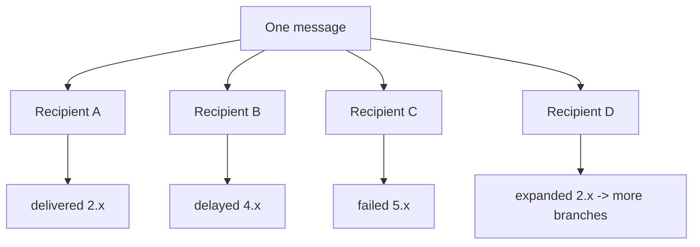

| Recipient | Action/status | Current statement |
|---|---|---|
| A | delivered / 2.0.0 | Delivered under DSN definition |
| B | delayed / 4.4.2 | Not final; retries continue |
| C | failed / 5.1.1 | Final failure for branch |
| D | expanded / 2.0.0 | Original alias expanded; downstream outcomes may follow |

Do not tell the sender "the email delivered" when only one branch did. State recipient scope.

## Synchronous Rejection versus Later NDR

### Synchronous

The rejecting server returns 4xx/5xx during SMTP. The sending server has direct evidence and retains responsibility. It can retry temporary failure or generate an NDR for permanent failure to its submitting user.

### Post-Acceptance

A relay accepted with final 250, then downstream delivery failed. That relay generates a DSN to the original envelope reverse-path. This asynchronous message can arrive minutes or days later.

| Property | Synchronous SMTP failure | Post-acceptance DSN/NDR |
|---|---|---|
| Form | In-session reply | Separate email report |
| Original receiver accepted? | No for failed branch | Yes at an earlier hop |
| Who generates user notice? | Sending/submission system can render response | MTA that later abandons/receives failure |
| Timing | Immediate transaction | Later |
| Backscatter risk | Lower when reject happens before acceptance | Higher if reverse-path was forged and later DSN is sent |

Rejecting clearly abusive mail during SMTP avoids generating later reports to forged senders. If mail is accepted then silently dropped, diagnostic reliability suffers; providers balance abuse and security policy.

## Null Reverse-Path and Bounce Loops

DSNs use:

```text
MAIL FROM:<>
```

If delivery of that DSN fails, the next MTA must not generate another DSN to the null reverse-path. This prevents "bounce about a bounce" loops. Local postmaster logging/alerting can still occur under implementation policy.

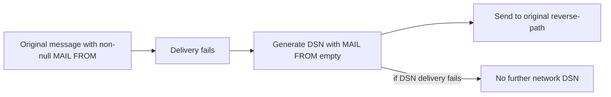

Automated responders should also avoid replying to null reverse-path notifications.

## Quarantine as a Delivery State

Both Microsoft 365 and Google Workspace provide provider-specific quarantine, but policy sources, retention, roles, and actions differ. Shared high-level truths:

- The provider accepted the message into service processing.
- A policy or verdict held it outside normal mailbox delivery.
- An authorized user/admin may have release, request, deny, delete, or reporting actions depending on reason and policy.
- Expiration can make the item unrecoverable.
- Release is a new state transition and may still be subject to further processing.
- Quarantine does not generate an RFC failure DSN merely because the item is held.

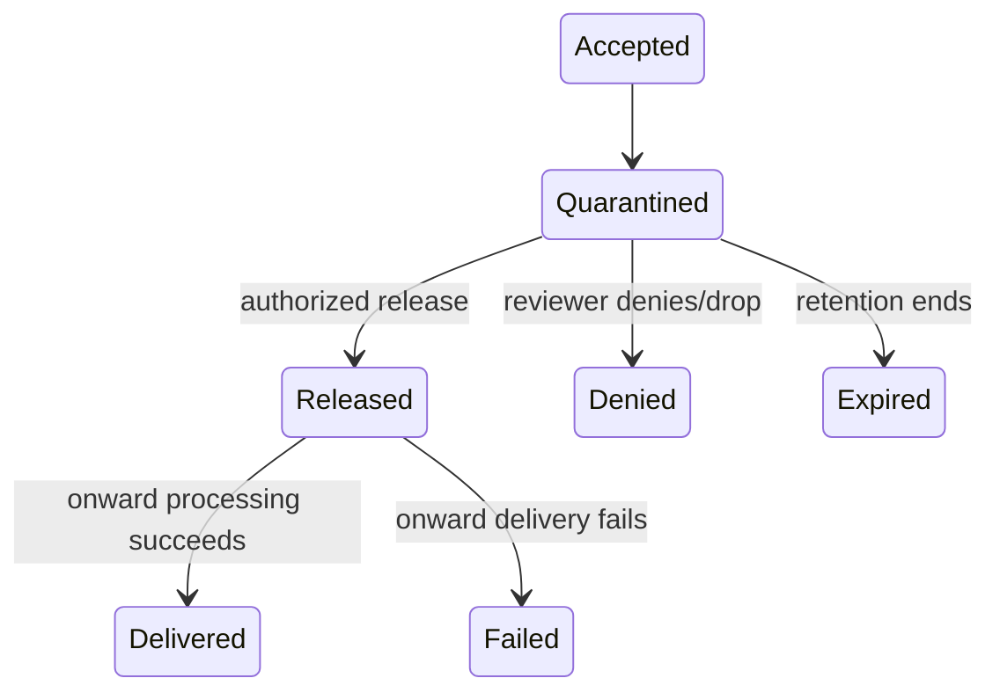

| Quarantine question | Evidence |
|---|---|
| Why held? | Verdict/setting/rule and policy |
| Who can act? | Assigned quarantine policy/reviewer role |
| What action occurred? | Audit/action history |
| Is it recoverable? | Current item and expiry/retention |
| Did release deliver? | Post-release trace/mailbox evidence |
| Was sender notified on deny? | Provider setting and generated notice evidence |

## 🔍 Plain-English deep-dive: Quarantine Is a Pause with a Clock

Quarantine is not a permanent archive and not an automatic rejection. It is a holding state with an owner, reason, permitted actions, and expiration. "Release clicked" is not the same as "recipient received": release must complete onward processing. "No NDR" is expected while held because the provider accepted responsibility.

For urgent mail, do not bypass security by asking the sender to resend repeatedly. Identify the item, reason, content risk, policy, reviewer, and expiry. If the item is safe and authorized for release, preserve the action record and verify delivery. If it is unsafe, deny/delete under policy and communicate using approved channels.

## Post-Delivery Remediation

Providers can act after mailbox delivery based on new threat intelligence or admin investigation. Microsoft examples include ZAP and Action Center remediation. Google capabilities vary by Workspace edition and investigation tooling. User rules/actions can also move mail after delivery.

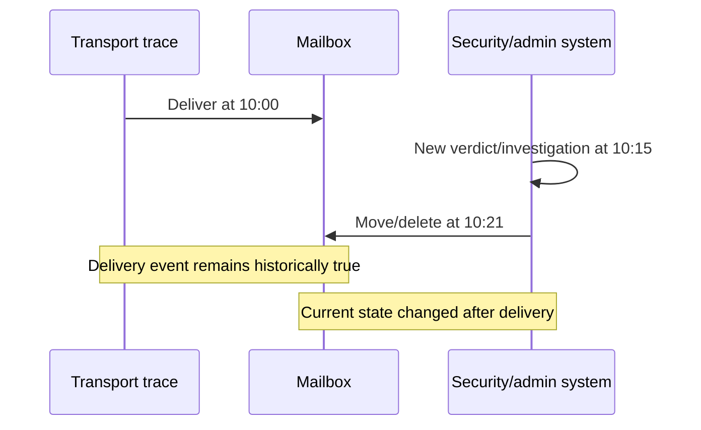

| Timeline | Correct statement |
|---|---|
| Deliver only | Message was delivered; current location needs evidence if disputed |
| Deliver -> Junk move | Delivered, then moved to Junk |
| Deliver -> soft delete | Delivered, then moved to recoverable deletion state under provider semantics |
| Deliver -> hard delete | Delivered, then destructive purge action occurred under provider semantics |
| Quarantine -> release -> deliver | Held first, later delivered |
| Quarantine -> deny | Held, then terminated without user delivery |

Remediation status can be queued, in progress, completed with mixed per-item outcomes, failed, or already in destination. Do not claim recovery or removal until item-level evidence supports it.

## 🔍 Plain-English deep-dive: Delivered Is a Historical Event, Not a Permanent Location

Think of `Delivered` as a timestamped verb: "the service put the item in a message store at time T." It is not a permanent label attached to the message. A later actor can move or remove the item without making the earlier delivery event false. That actor might be the user, an Inbox rule, a delegate, a retention workflow, an administrator, or a security remediation system responding to a newer verdict.

This is why two pieces of evidence that appear contradictory can both be correct:

| Evidence | What it proves | What it does not prove |
|---|---|---|
| Transport trace says Delivered at 10:00 | Mailbox delivery occurred at that time | The item remains in Inbox now |
| Security action says soft delete at 10:21 | A later removal action targeted/completed for the item | The original SMTP handoff failed |
| User says "I never saw it" | The user did not observe it | The provider never delivered it |
| Message is in Junk now | Current or observed folder placement | Whether it first entered Inbox |
| Read receipt/MDN exists | A disposition report was generated under client behavior | Guaranteed human comprehension or identity |

Investigate this as a timeline, not a debate over which source is "right." Start with the last proven transport event. Add mailbox placement, rule processing, forwarding, quarantine transitions, remediation, retention, and user actions in timestamp order. Then state the current result with evidence confidence. For example: "The provider delivered the message at 10:00 UTC. At 10:21 UTC, an automated security action soft-deleted the same item, and the per-item action result completed successfully. The user's current inability to find it is consistent with that later action."

This framing also prevents an unsafe recovery. If the later removal was a true-positive threat response, restoring the item merely to make `Delivered` visible would undo a security control. If it was a false positive, recovery should use the authorized provider workflow, preserve audit history, and verify the new current location. Historical delivery, present location, and safety verdict are three separate facts.

## Recovery and Resend Decisions

| State | Correct recovery behavior |
|---|---|
| 4xx/queued | Let responsible MTA retry; fix transient cause; avoid manual duplicate sends |
| 5xx/rejected | Correct address/policy/auth/routing/content, then new deliberate send |
| delayed DSN | Wait while investigating underlying condition; retries continue |
| failed DSN | Attempts ended; fix cause before resending |
| quarantined safe false positive | Authorized review/release and provider submission; verify delivery |
| quarantined malicious | Deny/delete under policy; investigate campaign/related recipients |
| delivered then remediated false positive | Authorized move/recovery and false-positive process; scope carefully |
| delivered then remediated true threat | Confirm removal, related-message scope, user/identity impact, and incident actions |

Recovery does not mean broad allowlisting. Fix the narrow cause and monitor.

## DSN Security and Privacy

DSNs can be forged like ordinary mail. Automated list processors and support tools should not take destructive action from an unverified DSN alone. Correlate with a message actually sent, envelope ID/Message-ID, recipient, time, and MTA trace.

DSNs can expose original headers, message content, recipient addresses, forwarding addresses, internal hosts, diagnostics, and queue IDs. Redact tickets and avoid public paste tools. The `RET=FULL` behavior can return content in failure reports, subject to implementation limits and policy.

| Risk | Example | Mitigation |
|---|---|---|
| Forged failure | Attacker sends fake NDR to trigger unsubscribe | Correlate sent transaction and repeated evidence |
| Backscatter | DSN sent to forged MAIL FROM victim | Reject abuse synchronously; validate policy; rate/control reports |
| Content leak | Full original message returned in DSN | Data minimization, secure transport/storage, RET/policy design |
| Forwarding disclosure | Final recipient exposes confidential forwarding address | Provider/gateway confidentiality controls |
| Bounce loop | DSN failure generates another DSN | Null reverse-path and no DSN to null path |
| Ticket exposure | Full NDR includes personal data | Redact to necessary fields |

## Common Misdiagnoses

| Shortcut | Why wrong | Better statement |
|---|---|---|
| "4xx means failed" | Usually temporary and queued | "Deferred; current owner will retry" |
| "5xx means receiver never saw anything" | Stage may be end-of-DATA after full content | State command stage and acceptance result |
| "NDR From domain caused failure" | Generating server may differ from rejecting Remote-MTA | Parse Reporting/Remote/Diagnostic fields |
| "Delivered means read" | DSN delivery is mailbox/list availability, not user read | Separate delivery from MDN/read evidence |
| "No bounce means inbox" | Quarantine, spam, silent policy, forwarding, or lost reverse-path exist | Use receiver trace/current-state evidence |
| "Quarantine is rejection" | Provider accepted and held | Query quarantine reason/action |
| "Release means delivered" | Onward processing can fail | Verify post-release trace |
| "One recipient failed, whole message failed" | Results are per recipient | Annotate each branch |
| "Status 4.x always means retries continue" | Action may be failed after expiration | Read Action and retry fields |
| "Failure DSN proves recipient never got a copy" | Retry races/duplicates can yield delivery plus failure report | Correlate all attempts and mailbox evidence |

## Delivery-State Decision Tree

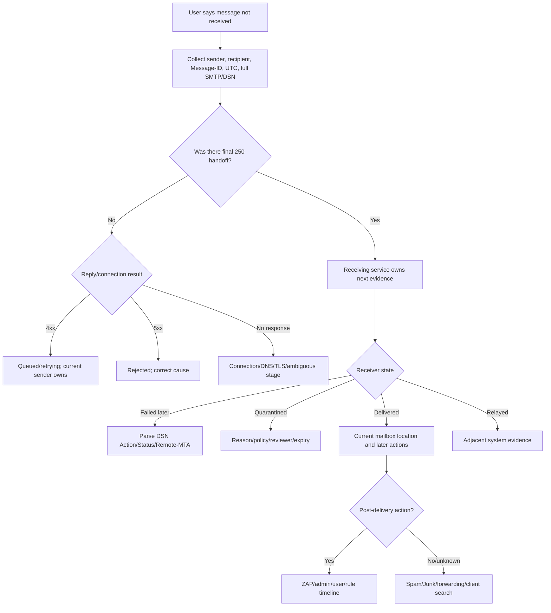

## Safe Lab: Delivery-State Decision Tree and NDR Annotation

### Objective

Annotate five synthetic cases: synchronous permanent rejection, temporary deferral, delayed-then-failed DSN, provider quarantine, and delivered-then-remediated mail. Produce precise recipient-state conclusions without sending mail or touching a tenant.

### Safety Rules

- Use `.example` domains, documentation IPs, and synthetic IDs.
- Do not send probes, enumerate recipients, release quarantine, or run remediation.
- Do not upload NDRs/messages to public analyzers.
- Treat reports as untrusted until correlated.
- Redact original message content and personal addresses in real tickets.
- Never resend while an active queue or quarantine state is unresolved.

### Prerequisites

1. An authorized, non-production local study folder and a Markdown or spreadsheet editor.
2. This Part plus the linked SMTP/DSN standards and current provider quarantine guidance for checking responsibility, Action, Status, and state transitions.
3. Only the supplied synthetic SMTP transcripts, DSNs, trace/quarantine rows, and remediation events; do not send probes, access a tenant, release an item, or run remediation.
4. A worksheet that keeps recipient branches, command stages, Reporting/Remote MTA roles, retry state, quarantine state, current item state, owner, and privacy redactions separate.

### Case 1: Synchronous Permanent RCPT Rejection

Synthetic SMTP:

```text
S: 220 mx.recipient.example ESMTP
C: EHLO sender.example
S: 250-mx.recipient.example
S: 250 DSN
C: MAIL FROM:<bounce@sender.example>
S: 250 2.1.0 sender accepted
C: RCPT TO:<missing@recipient.example>
S: 550 5.1.1 recipient does not exist
```

Annotation:

| Field | Value | Meaning |
|---|---|---|
| Stage | RCPT TO | Message content was not needed for this recipient decision |
| Basic reply | 550 | Permanent negative completion |
| Enhanced status | 5.1.1 | Permanent bad destination mailbox address category |
| Responsibility | Sending MTA | Remote did not accept recipient |
| Next action | Correct recipient before new send | Do not repeat unchanged address |

The sending MTA can generate an NDR to its local submitter. The remote host is the rejecting system.

### Case 2: Temporary Deferral then Success

```text
10:00 RCPT TO:<user@recipient.example>
10:00 remote: 451 4.4.2 temporary connection/backend issue
10:00 sender queues recipient branch
10:30 retry remote: 250 RCPT accepted
10:31 end-of-DATA remote: 250 message accepted
```

Expected conclusion: initial 4xx was not final. The sender retained responsibility and retried. Final 250 transferred responsibility. A manual resend at 10:10 could have produced a duplicate.

### Case 3: Delayed DSN then Failed DSN

First DSN fixture:

```text
Reporting-MTA: dns; outbound.sender.example
Final-Recipient: rfc822; user@offline.example
Action: delayed
Status: 4.4.1
Remote-MTA: dns; mx.offline.example
Diagnostic-Code: smtp; connection timed out
Last-Attempt-Date: Tue, 12 May 2026 10:00:00 +0000
Will-Retry-Until: Fri, 15 May 2026 10:00:00 +0000
```

Second DSN fixture after give-up:

```text
Reporting-MTA: dns; outbound.sender.example
Final-Recipient: rfc822; user@offline.example
Action: failed
Status: 4.4.1
Remote-MTA: dns; mx.offline.example
Diagnostic-Code: smtp; connection timed out
Last-Attempt-Date: Fri, 15 May 2026 10:01:00 +0000
```

| DSN | Action | Status | Retry state |
|---|---|---|---|
| First | delayed | Temporary network category | Continues until stated/implementation limit |
| Second | failed | Same temporary underlying category | Ended; attempts abandoned |

This is the critical Action-versus-Status lesson.

### Case 4: Provider Quarantine

```text
09:00 Sending host receives final 250 from provider edge
09:01 Provider trace: Quarantined, high-risk policy fixture
09:01 Quarantine item created for user@recipient.example
09:30 No reviewer action yet
```

Expected conclusion: provider accepted responsibility and held the item. There is no SMTP rejection and no reason for sender resubmission. Next evidence is quarantine reason, policy, authorized reviewer, and expiry.

### Case 5: Delivered then Remediated

```text
10:00 Provider trace: Delivered to mailbox
10:15 New threat intelligence: malicious campaign
10:20 Remediation action: soft delete
10:24 Per-item result: success
```

Expected conclusion: delivery and later removal are both true. Current state is remediated/soft-deleted under provider semantics. The sender's successful handoff and historical delivery are not disproved.

### Exercise 1: Build the State Table

| Case | Last transport handoff | Recipient action/state | Current owner | Safe next action |
|---:|---|---|---|---|
| 1 | No final acceptance for recipient | Permanent reject 5.1.1 | Sender | Correct address |
| 2 | Final 250 after retry | Accepted by remote | Remote | Trace remote if user issue remains |
| 3 | No successful final handoff | Failed after retry period | Sender/user workflow | Fix remote availability before new send |
| 4 | Provider final 250 | Quarantined | Provider reviewer workflow | Review reason/policy, no resend |
| 5 | Delivered | Later soft-delete success | Security/mailbox workflow | Incident/false-positive recovery as appropriate |

### Exercise 2: Annotate a Multi-Recipient DSN

```text
Content-Type: multipart/report; report-type=delivery-status

Reporting-MTA: dns; outbound.sender.example
Original-Envelope-ID: SYNTH-033-001

Original-Recipient: rfc822; good@recipient.example
Final-Recipient: rfc822; good@recipient.example
Action: delivered
Status: 2.0.0

Original-Recipient: rfc822; full@recipient.example
Final-Recipient: rfc822; full@recipient.example
Action: delayed
Status: 4.2.2
Will-Retry-Until: Wed, 13 May 2026 10:00:00 +0000

Original-Recipient: rfc822; old@recipient.example
Final-Recipient: rfc822; old@recipient.example
Action: failed
Status: 5.1.1
Remote-MTA: dns; mx.recipient.example
Diagnostic-Code: smtp; 550 5.1.1 no such recipient
```

Annotation:

| Recipient | Final? | Meaning | Response |
|---|---:|---|---|
| good | Yes | Delivered, not read | No resend |
| full | No | Delayed for mailbox-full category; retries continue | Wait/recipient capacity investigation |
| old | Yes | Permanent bad address; remote rejected | Correct/remove address before new send |

### Exercise 3: Identify Fix Owner

| Evidence | Generating/reporting system | Rejecting/condition system | Likely owner |
|---|---|---|---|
| Reporting-MTA sender, Remote-MTA recipient, 5.1.1 | Sender generated DSN | Recipient host rejected | Recipient/address owner |
| Reporting-MTA sender, no Remote-MTA, DNS failure | Sender generated/diagnosed | DNS/routing dependency | Sender/network/DNS owner depending domain control |
| Provider trace quarantine | Provider accepted/held | Provider/tenant policy | Security/policy owner |
| Deliver then Action Center delete | Provider delivered; security action later | Security workflow | Security operations |

### Exercise 4: Decision Tree Walkthrough

For each case ask:

1. What recipient branch?
2. Was there final 250?
3. Who owned the branch next?
4. Is evidence in-session or a later report?
5. What is DSN Action?
6. What is enhanced Status category?
7. Which MTA produced Diagnostic-Code?
8. Are retries active?
9. Is current state quarantine/mailbox/remediation?
10. What smallest safe action follows?

### Exercise 5: Support Summary

> **[Observation]** The five samples represent different states. Case 1 was synchronously rejected at RCPT with `550 5.1.1`, so the remote system never accepted that recipient. Case 2 was temporarily deferred, retried, and accepted with final `250`. Case 3 first reported `Action: delayed` and later `Action: failed` with the same `4.4.1` condition, showing that retries ended after a persistent temporary problem. Case 4 was accepted and quarantined, so reviewer policy, not sender resend, controls the next transition. Case 5 was delivered and later soft-deleted successfully by remediation. **[Inference]** Treating all five as "bounces" would assign the wrong owner and could create duplicate mail or bypass security. **[Private unknown]** Provider-private verdict weighting is not needed to classify the state. **Next action:** follow each branch-specific correction, queue, reviewer, or security workflow and preserve its audit evidence.

### Expected evidence

The lab should produce an inspectable five-case state table, command/reply annotations, temporary-to-success timeline, delayed-versus-failed DSN comparison, multi-recipient DSN annotation, Reporting-MTA/Remote-MTA owner map, quarantine and remediation timelines, decision-tree answers, and bounded support summary. Each recipient branch must have a clear last handoff, current state, owner, and safe next action.

### Cleanup and privacy

- Retain only the supplied `.example` identities, synthetic IDs, DSN/trace fixtures, and derived annotations.
- Delete or redact any accidentally pasted real NDR/DSN, returned message content, sender/recipient, Message-ID, ENVID, queue/tenant ID, quarantine/remediation record, token, internal host, customer data, or personally identifiable information (PII); delete the artifact if reliable redaction is not possible.
- Do not upload reports/messages, send or resend probes, enumerate recipients, release quarantine, allowlist, purge, remediate, hard-delete, or access a live provider/customer tenant.
- Confirm before retention or sharing that no live queue, mail, account, quarantine, remediation, or customer activity occurred and that potentially forged reports remain labeled untrusted until correlated.

### Validation rubric

| Dimension | Fail | Developing | Pass |
|---|---|---|---|
| SMTP responsibility | Treats any code or NDR as delivery | Names 4xx/5xx broadly | Ties reply to command/recipient/final DATA and identifies owner after each handoff |
| DSN annotation | Reads only human text/status code | Extracts some machine fields | Separates Reporting/Remote MTA, Action, Status, Diagnostic-Code, recipients, and retry times |
| State classification | Calls rejection, deferral, quarantine, and removal bounces | Distinguishes most cases | Correctly classifies all five cases and historical versus current state |
| Recipient branching | Applies one outcome to all recipients | Tracks some branches | Gives each recipient independent finality, retry state, owner, and next action |
| Recovery and communication | Resends/releases/deletes as a probe | Suggests cautious owner action | Uses smallest branch-specific correction/reviewer/security workflow and preserves audit evidence |
| Safety, privacy, honesty | Uses live mail/tenant or exposes returned content | Synthetic lab with weak cleanup | No live/destructive activity, minimized/redacted evidence, untrusted-report caveat, and lab-only claim |

## Support Runbook

### Intake

- Full NDR/DSN source or exact SMTP response.
- Sender, envelope reverse-path if known, recipient branch, UTC time.
- Full Message-ID and provider trace/queue IDs.
- Whether sender saw immediate error or later report.
- Whether recipient reports spam, quarantine, missing after delivery, or duplicate.

### Annotation Order

1. Recipient branch.
2. SMTP command stage.
3. Last successful responsibility handoff.
4. Reporting-MTA and Remote-MTA.
5. DSN Action.
6. Enhanced Status.
7. Diagnostic-Code and reply text.
8. Last attempt and retry-until.
9. Quarantine/mailbox/current action.
10. Fix owner and safe recovery.

### Do Not

- Do not ask for resend during active 4xx queueing.
- Do not release malicious quarantine items as a delivery test.
- Do not assume NDR generator caused remote rejection.
- Do not unsubscribe/delete recipients based on one unverified DSN.
- Do not expose returned message content in public tickets.
- Do not hard-delete or broadly allowlist to solve one case.
- Do not equate delivery with read.

### Escalation Package

| Field | Capture |
|---|---|
| Correlation | Message-ID, ENVID if present, queue/provider IDs |
| Recipient | Original and Final Recipient, branch scope |
| Responsibility | Last final 250 or active queue owner |
| Failure | Command stage, basic/enhanced reply, Diagnostic-Code |
| MTA roles | Reporting, Remote, Received-From, DSN-Gateway |
| Timing | Arrival, last attempt, retry-until, DSN/remediation times |
| Provider state | Quarantine reason/action/expiry or mailbox/remediation state |
| Privacy | Redactions and secure evidence location |

## Case Summary Template

### Original Transaction

- Sender/RFC5322.From:
- MAIL FROM/reverse-path:
- Original recipient:
- Final/resolved recipient:
- Message-ID:
- ENVID/queue/provider IDs:
- UTC send/accept time:

### SMTP Handoff

| Hop | Command stage | Basic reply | Enhanced status | Final 250? | Responsibility after event |
|---|---|---|---|---:|---|
|  |  |  |  |  |  |

### DSN Annotation

| Field | Value | Interpretation |
|---|---|---|
| Reporting-MTA |  |  |
| Remote-MTA |  |  |
| Original-Envelope-ID |  |  |
| Original-Recipient |  |  |
| Final-Recipient |  |  |
| Action |  |  |
| Status |  |  |
| Diagnostic-Code |  |  |
| Last-Attempt-Date |  |  |
| Will-Retry-Until |  |  |

### Provider State

- Rejected / pending / spam / Junk / quarantine / delivered:
- Quarantine reason/policy/action/expiry:
- Post-delivery action/status:
- Current mailbox/item location:

### Conclusion

- **[Observation]:**
- **[Inference]:**
- **[Untrusted/private unknown]:**
- Retry active or terminal:
- Fix owner:
- Safe next action and verification:

## Official Source Anchors

All listed sources were accessed on August 24, 2026 and must be revalidated for current provider behavior.

| Source | What it establishes |
|---|---|
| [RFC 5321](https://www.rfc-editor.org/rfc/rfc5321) | SMTP reply classes, final acceptance responsibility, retries, null reverse-path notifications, and no bounce-to-bounce behavior |
| [RFC 3463](https://www.rfc-editor.org/rfc/rfc3463) | Enhanced status class/subject/detail categories and core meanings |
| [RFC 3461](https://www.rfc-editor.org/rfc/rfc3461) | DSN SMTP extension, NOTIFY/ORCPT/RET/ENVID, propagation, delay/failure behavior, DSN envelope |
| [RFC 3464](https://www.rfc-editor.org/rfc/rfc3464) | DSN MIME structure, per-message/per-recipient fields, Action semantics, privacy and forgery risks |
| [Exchange Online NDR guidance](https://learn.microsoft.com/en-us/exchange/mail-flow-best-practices/non-delivery-reports-in-exchange-online/non-delivery-reports-in-exchange-online) | Current Microsoft NDR presentation, generating versus rejecting server, codes, and admin diagnostics |
| [Google SMTP error guidance](https://knowledge.workspace.google.com/admin/support/troubleshooting/about-smtp-error-messages) | Current Google explanation of basic/enhanced codes and provider troubleshooting framing |
| [Microsoft 365 quarantine](https://learn.microsoft.com/en-us/defender-office-365/quarantine-about) | Current quarantine reasons, policies, permissions, retention, release/report boundaries |
| [Google Workspace quarantine](https://knowledge.workspace.google.com/admin/gmail/advanced/set-up-email-quarantine) | Current admin quarantine, reviewer, release/deny/drop, notification, and expiry behavior |

## Likely Interview Questions

### Q1. What does a final `250` after DATA mean?

**Model answer:** It means the receiving SMTP server accepted responsibility for the accepted recipient branches. It must deliver or relay, retry later downstream transient failures, or generate an appropriate later failure notification. It does not mean Inbox placement or user read. If the final reply is lost after storage, the sender can retry and create a duplicate.

### Q2. What is the difference between a `4xx` and `5xx` SMTP reply?

**Model answer:** A `4xx` is a transient negative completion: the action did not occur, the SMTP client retains responsibility, queues, and retries. A `5xx` is permanent for the unchanged request: the action did not occur and should not be automatically repeated without correction. I also preserve command stage and enhanced code because `550` at RCPT differs from a content rejection after DATA.

### Q3. How do you read a DSN?

**Model answer:** I identify the recipient group, Reporting-MTA and Remote-MTA, then read Action for finality, Status for transport-independent category, and Diagnostic-Code for the exact transport response. I compare Original-Recipient with Final-Recipient, and use Last-Attempt-Date or Will-Retry-Until for timing. I correlate Message-ID or Original-Envelope-ID with the sent transaction and treat the DSN as potentially forgeable.

### Q4. Why can `Action: failed` have a `4.x.x` status?

**Model answer:** Status describes the underlying condition, while Action describes what the reporting MTA did. A temporary-type condition such as repeated connection timeout can persist until the queue expires. An earlier DSN can say delayed/4.x while retries continue; the final DSN can say failed/4.x when the MTA abandons attempts.

### Q5. What is the difference between quarantine and rejection?

**Model answer:** Rejection means an SMTP branch was not accepted and the sender retains or reports responsibility. Quarantine usually means the provider accepted the message and placed it in a controlled holding area under a verdict or policy. Release, deny, drop, or expiry changes that state. The absence of an NDR during quarantine is expected, and the sender should not resend as a test.

### Q6. Can a DSN say failed even if the recipient got a copy?

**Model answer:** Yes. DSNs can be forged, and SMTP ambiguity can create duplicate attempts when a final acceptance reply is lost. One attempt might deliver while another fails and produces a DSN. Multi-branch forwarding can also produce mixed outcomes. A failure DSN is valuable evidence, not non-repudiation proof; correlate all attempts and receiver state.

### Q7. Why do DSNs use a null reverse-path?

**Model answer:** A DSN is already an error/status report. It uses `MAIL FROM:<>` so that if the DSN itself cannot be delivered, another DSN is not generated to it. This prevents bounce loops. Systems can log or alert a local postmaster, but they must not create an endless network report chain.

### Q8. How do you investigate "trace says delivered, but the user cannot find it"?

**Model answer:** I treat Delivered as a historical mailbox-delivery event, then check current state: spam/Junk labels, admin quarantine transitions, ZAP or security remediation, Inbox rules, forwarding, user moves/deletes, retention, and client sync. I build a timestamped timeline and verify item-level action status. I never assume delivery means read or permanent Inbox location.

## 🧠 30-Second Memory Hooks

- **Delivery is a state machine per recipient.**
- **Final DATA `250` transfers responsibility.**
- **4xx queues; 5xx corrects.**
- **Stage matters: RCPT is not end-of-DATA.**
- **Action says what happened; Status says why category.**
- **Delayed retries; failed stops.**
- **Reporting-MTA writes the report; Remote-MTA may reject.**
- **Original recipient correlates; final recipient diagnoses.**
- **DSN has human, machine, and returned-message parts.**
- **Null reverse-path prevents bounce loops.**
- **Quarantine is accepted and held, with a clock.**
- **Delivered is not read and not permanent location.**

## Completion Checklist

- [ ] I can place any report on a per-recipient delivery timeline.
- [ ] I can distinguish SMTP reply, DSN, NDR, bounce, MDN, and trace status.
- [ ] I know who owns the message after final 2xx, 4xx, and 5xx.
- [ ] I always record SMTP command stage.
- [ ] I can decode enhanced class and subject categories.
- [ ] I can read Action before deciding whether retries continue.
- [ ] I can explain failed/4.x after queue expiration.
- [ ] I can annotate Reporting-MTA, Remote-MTA, recipients, Status, and Diagnostic-Code.
- [ ] I can distinguish Message-ID from ENVID.
- [ ] I understand NOTIFY, ORCPT, RET, and ENVID at a high level.
- [ ] I can explain the three MIME parts of a DSN.
- [ ] I track multi-recipient outcomes separately.
- [ ] I can distinguish quarantine, spam/Junk, rejection, delivery, and remediation.
- [ ] I know release does not prove onward delivery.
- [ ] I treat DSNs as sensitive and potentially forged.

[Next: Part 034 - Email Threat Taxonomy and Investigation Mindset](Part-034-email-threat-taxonomy-and-investigation-mindset.md)