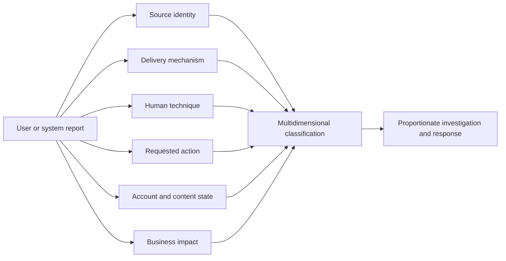
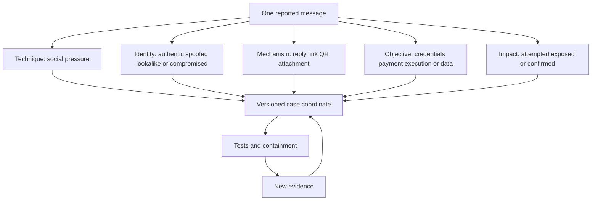
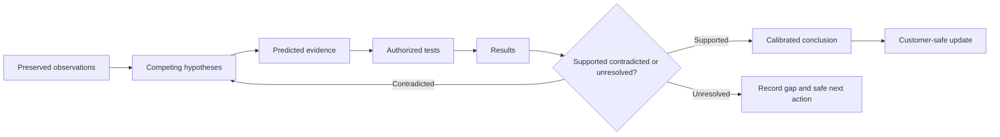
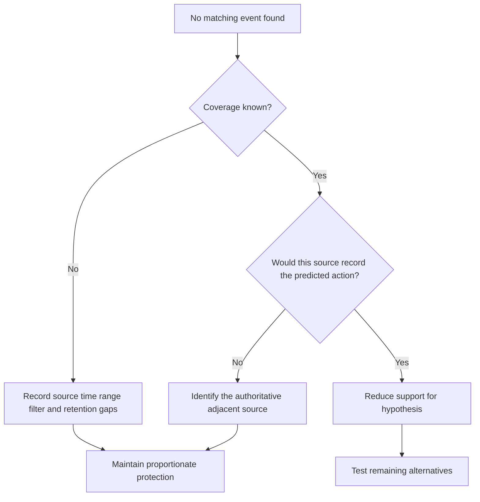
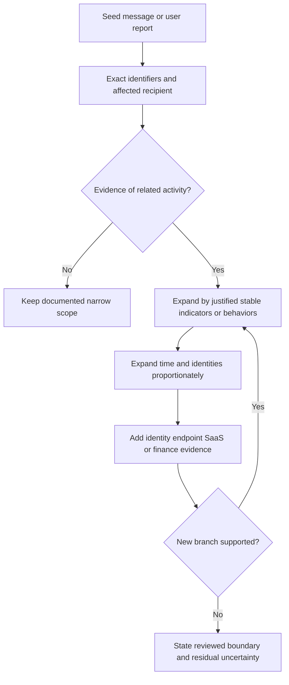
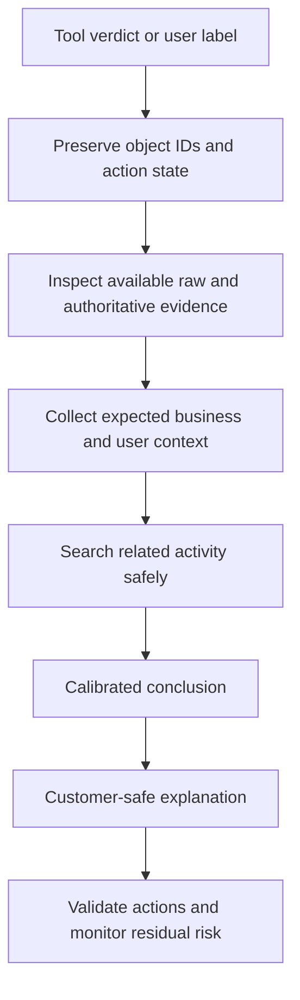
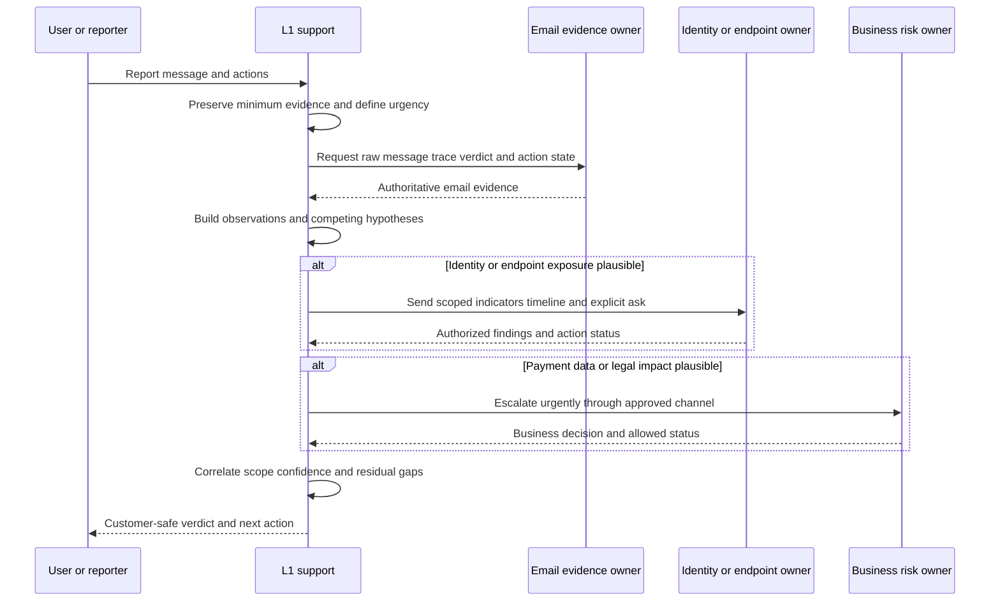
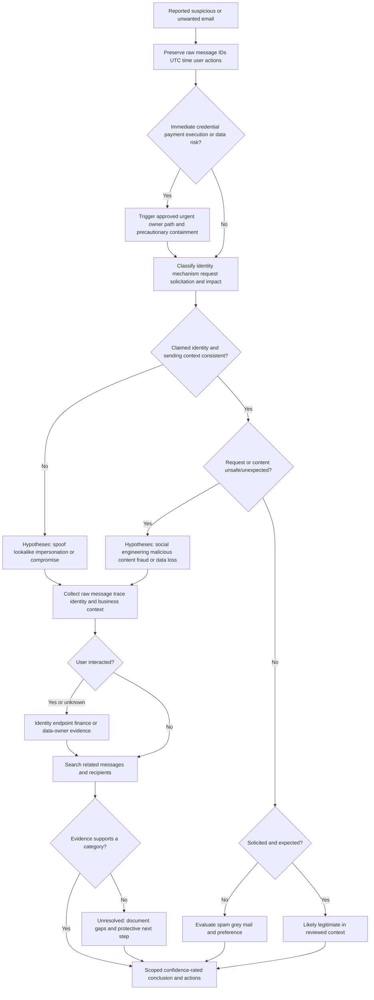

# Part 034 - Email Threat Taxonomy and Investigation Mindset

## Purpose, Evidence, and Currency

Email investigations begin with an uncomfortable fact: the first description is often incomplete. A user may call a message "spam," a finance leader may call it "fraud," and a security tool may call it "suspicious." Those words describe different dimensions. The message could be unwanted but harmless, socially manipulative without malicious code, sent from a compromised real account, designed to steal credentials, carrying a harmful file, attempting an unauthorized payment, or moving sensitive data out of the organization. It can occupy more than one category at once.

This part builds a defensive taxonomy and a disciplined investigation mindset. A **taxonomy** is an organized set of categories. Its purpose is not to force every case into one box. It gives responders a shared vocabulary for deciding what evidence to collect, what harm might occur, who owns the next action, and how strongly the current facts support a conclusion.

The central discipline is to keep three layers separate:

1. An **observation** is something directly present in preserved evidence, such as a header value, a URL string, an audit event, or a user statement.
2. An **inference** is a reasoned interpretation that could still be wrong, such as "the sender likely intended to impersonate the chief executive."
3. A **conclusion** is the best supported case judgment after alternatives and scope have been tested, such as "this was an external display-name impersonation attempt; no interaction or account compromise was found in the reviewed scope."

That distinction protects customers. It prevents a weak signal from becoming a confident accusation, and it prevents uncertainty from becoming inaction. The investigator can contain proportionately while continuing to test hypotheses.

This part uses official, public defensive guidance and vendor-neutral reasoning. Public Abnormal AI information may describe public product positioning, but it does not reveal private detection logic, thresholds, customer data, or case-handling behavior. Provider capabilities and official guidance can change. Source anchors were reviewed on the stated access date, and any production action still requires current documentation, authorization, and local policy.

## Section Goal

By the end of this part, you should be able to:

- Explain why email threat classification is multidimensional rather than a single malicious/not-malicious checkbox.
- Define social engineering, identity abuse, malicious content, fraud, compromise, unwanted mail, and data loss from zero knowledge.
- Distinguish message attributes, attacker objectives, delivery mechanisms, account state, user actions, and business impact.
- Separate observations, inferences, hypotheses, and conclusions in notes and customer communication.
- Build multiple plausible hypotheses before choosing tests.
- Use confidence language that reflects evidence quality and missing data.
- Define scope by identities, messages, recipients, time, infrastructure, user actions, and downstream systems.
- Rank direct telemetry, raw artifacts, corroborated reports, contextual signals, and unsupported claims appropriately.
- Recognize anchoring, confirmation bias, availability bias, base-rate neglect, outcome bias, automation bias, and premature closure.
- Produce customer-safe verdicts that state what happened, what did not become proven, the reviewed scope, and the next action.
- Distinguish a threat indicator from proof of compromise or intent.
- Escalate urgent fraud, identity, endpoint, privacy, legal, or safety concerns without exceeding L1 authority.
- Preserve privacy by collecting the minimum necessary evidence and redacting content appropriately.
- Apply a repeatable defensive investigation workflow to harmless synthetic cases.
- Explain the method honestly without implying direct production use of Abnormal AI or security operations experience that has not occurred.

## JD Mapping

| Role responsibility or signal | Capability built here | Customer-safe support output |
|---|---|---|
| Triage cloud email security cases | Convert a vague report into category, objective, mechanism, state, impact, and scope | "The preserved message shows external identity impersonation and a payment-change request; interaction and account impact remain under review." |
| Investigate behavioral verdict questions | Separate visible evidence from private or unavailable model logic | "I can explain the observed context and validation path without claiming an undisclosed scoring rule." |
| Communicate with technical and nontechnical customers | Translate evidence strength into calibrated language | "We assess this as likely malicious, with high confidence about impersonation and low confidence about account compromise because sign-in data is not yet available." |
| Own L1 intake and escalation | Gather minimum evidence, test alternatives, and send a decision-ready packet | Timeline, affected entities, observations, hypotheses, actions, gaps, owner, and explicit escalation ask |
| Protect customer trust | Avoid accusations, absolutes, and unsupported product claims | "The evidence is consistent with" rather than "the vendor definitely caused" |
| Work across Cloud Email Security, AI Security Agents, and SaaS Security | Recognize that an email may lead to identity, SaaS, endpoint, finance, or data-loss workstreams | Parallel owner map with one incident coordinator |
| Create knowledge and improve support quality | Use reusable taxonomies, evidence labels, and review rubrics | Searchable case tags and a repeatable hypothesis ledger |
| Bring enterprise-support experience forward | Reuse structured scoping, customer updates, escalation discipline, and fix validation | CV-grounded transfer without claiming Exchange security operations ownership |

## Candidate Honesty Note

You can credibly say:

> "My production strength is several years of enterprise support: scoping ambiguous symptoms, preserving evidence, coordinating escalations, communicating under pressure, and validating outcomes. I have not operated Abnormal AI or a dedicated email-security program in production. My threat-investigation knowledge is learned architecture plus safe synthetic practice. I would use the same evidence-first support discipline, follow the customer's incident authority model, and escalate security, identity, endpoint, finance, privacy, or legal actions to the authorized owner."

Use the four evidence tiers consistently:

| Experience tier | Honest claim | Example for this part |
|---|---|---|
| **Production transfer** | A method genuinely used in prior enterprise support | "I have built timelines, narrowed scope, coordinated Engineering, and validated fixes in enterprise support cases." |
| **Local/synthetic lab** | A repeatable exercise using harmless invented evidence | "I classified four synthetic messages and produced a hypothesis ledger without sending or opening anything." |
| **Learned architecture** | A concept learned from official public sources | "My understanding from NIST, MITRE ATT&CK, FBI/IC3, and provider documentation is..." |
| **No direct experience** | A named platform or authority not used in production | "I have not made production quarantine, identity-revocation, legal, or financial-recovery decisions." |

The honesty boundary matters because a polished lab is evidence of learning, not evidence of handling a live incident. An L1 support engineer can recommend and coordinate, but must not imply authority to declare crimes, attribute an actor, access unrelated user content, freeze funds, discipline an employee, or modify a tenant without approval.

## Evidence Labels Used in This Part

| Label | Meaning | Example |
|---|---|---|
| **[Observation]** | Directly present in a preserved artifact or authoritative telemetry | "The RFC5322 From display name is `Executive Office`, while the address ends in `example.invalid`." |
| **[User report]** | A person's account of what they saw or did | "The recipient reports that they did not reply or scan the QR image." |
| **[Inference]** | A testable interpretation of observations | "The sender appears to be exploiting executive authority." |
| **[Hypothesis]** | A proposed explanation with predicted evidence | "If an internal account was compromised, audit logs should show corresponding account activity or message submission." |
| **[Conclusion]** | The supported judgment after tests and scope review | "External impersonation is supported; internal account compromise was not found in the reviewed evidence." |
| **[Unknown]** | Information not collected, unavailable, or outside scope | "Endpoint execution status is unknown because EDR evidence was not provided." |
| **[Private unknown]** | Vendor-internal logic or telemetry not publicly documented | "The exact model feature weight is not available." |
| **[Sourced fact]** | A statement anchored to an identified standard or official source | "MITRE ATT&CK lists phishing as technique T1566." |

## Beginner Primer: One Email Can Have Several Truths

Imagine an airport inspection. A traveler's identity, luggage contents, declared purpose, route, behavior, and customs impact are separate questions. A passport mismatch does not prove contraband. A prohibited item does not prove the traveler stole an identity. The inspector combines dimensions, records evidence, and sends each issue to the right authority.

Email works the same way. The useful questions are:

| Dimension | Beginner question | Possible values | Why it matters |
|---|---|---|---|
| Source identity | Who or what sent it? | Legitimate sender, spoofed identity, lookalike, compromised real account, unknown | Determines authentication and identity investigation |
| Delivery mechanism | How did it reach the user? | Email body, link, QR image, attachment, calendar invite, shared document notice | Determines content and follow-up evidence |
| Human technique | How does it influence the recipient? | Urgency, authority, fear, curiosity, reward, sympathy, routine business context | Explains social-engineering pressure |
| Objective | What action is requested? | Reply, disclose information, sign in, approve MFA, pay, change payroll, open file, share data | Connects message to likely harm |
| Account state | Is a real identity under attacker control? | No evidence, suspected, confirmed, recovered | Changes containment scope dramatically |
| Content state | Is there harmful content? | None observed, suspicious link, credential site, malicious attachment, unknown | Routes URL/file analysis and endpoint response |
| Business impact | What could or did happen? | No action, exposure, credential loss, payment loss, malware, data loss, reputation harm | Drives urgency and incident ownership |
| Solicitation | Was the mail requested? | Transactional, subscribed, wanted, unwanted, deceptive | Separates grey mail from threats |

The airport analogy stops being accurate because email evidence can be forged, copied, delayed, or modified by gateways, and one message can create many digital branches. There may be no single physical object to inspect. That makes provenance, timestamps, and correlated telemetry especially important.

## Core Threat Taxonomy

The categories below overlap deliberately. Classification should preserve each applicable category rather than choose one prematurely.

| Category | Plain meaning | Typical evidence question | Common overlap |
|---|---|---|---|
| Social engineering | Manipulating a person into taking an unsafe action | What pressure, pretext, or trust cue was used? | Phishing, fraud, credential theft |
| Identity abuse | Misusing a name, address, account, domain, role, or relationship to gain trust | Is the claimed identity authentic, authorized, and in control? | Impersonation, compromise, vendor fraud |
| Malicious content | Content intended to cause technical harm or enable theft | Does a link, QR code, or file lead to unsafe behavior? | Credential phishing, malware, ransomware |
| Fraud | Deception intended to obtain money, goods, services, or valuable access | What business process or payment is being manipulated? | BEC, invoice diversion, payroll change |
| Compromise | Unauthorized control or use of an account, endpoint, application, token, or system | What authoritative telemetry shows misuse? | Account takeover, vendor compromise, malware |
| Unwanted mail | Mail the recipient does not want, which may still be legitimate | Was it solicited, subscribed, deceptive, or merely excessive? | Spam, bulk mail, grey mail |
| Data loss | Sensitive data leaving authorized control, accidentally or deliberately | What data moved, by whom, through which channel, under what authorization? | Insider risk, compromised account, fraud |

### Social Engineering

**Social engineering** means influencing a human rather than relying only on a technical exploit. A **pretext** is the invented or abused situation that makes the request seem reasonable, such as a routine document review or an urgent executive task. The message may use authority, urgency, fear, scarcity, curiosity, helpfulness, or emotional concern.

The presence of urgency is an indicator, not proof. Real business messages can be urgent. The stronger question is whether urgency combines with identity inconsistency, unusual process, secrecy, unusual destination, or a request that bypasses normal controls.

**Memory hook:** Social engineering attacks judgment before technology.

### Identity Abuse

Identity abuse includes display-name impersonation, direct domain spoofing, lookalike domains, reply-to diversion, and abuse of a genuinely compromised account. Authentication results help distinguish some paths, but an authenticated message from a maliciously registered domain or a compromised trusted account can still be dangerous.

**Memory hook:** Authenticated mail can authenticate the wrong or stolen identity.

### Malicious Content

Malicious content includes links that lead toward credential theft or harmful downloads, QR codes that hide destinations from casual inspection, and attachments that contain or retrieve harmful payloads. An investigator should never visit dangerous content or execute suspicious files as a support test. Preserve inert strings and metadata; use approved security tooling and authorized specialists.

**Memory hook:** Describe the chain without becoming part of it.

### Fraud

Fraud is a business-impact category. Business email compromise, invoice diversion, payroll redirection, gift-card requests, and vendor payment changes may contain no malware. Their mechanism is trust plus process manipulation. The safe control is independent verification using a previously known channel, not contact information supplied in the suspicious message.

**Memory hook:** Payment change plus pressure requires independent verification.

### Compromise

Compromise means unauthorized control or use, not merely a suspicious message. Evidence can include sign-in records, token or application activity, mailbox changes, endpoint detections, or confirmed unauthorized actions. Absence of evidence in one source is not proof of absence, especially when logging coverage is incomplete.

**Memory hook:** Suspicion asks; telemetry proves or narrows.

### Unwanted Mail

Unwanted mail includes unsolicited advertising and messages a user once requested but no longer values. It can be annoying or policy-relevant without being malicious. A safe unsubscribe path is appropriate only when the sender is known legitimate; clicking an unsubscribe link in a suspicious message can confirm an active address or lead to unsafe content.

**Memory hook:** Unwanted is a preference; malicious is a threat judgment.

### Data Loss

Data loss is not automatically malicious. An employee may send approved data to an authorized partner, accidentally attach the wrong file, or act under account compromise. Classification must consider data sensitivity, destination, authorization, business purpose, volume, timing, and user/account state. Human Resources, Legal, Privacy, and risk owners may control decisions beyond technical evidence collection.

**Memory hook:** Data movement needs context before motive.

## 🔍 Plain-English deep-dive: Classification Is a Coordinate, Not a Sticker

Calling an email "phishing" is like saying a vehicle is "dangerous." It may be directionally useful, but it does not tell a mechanic whether the risk comes from the driver, brakes, cargo, road, or destination. A coordinate gives several values at once.

Consider this harmless synthetic description:

> A message using the display name "Finance Leader" comes from `notices@example.invalid`, asks a recipient to review a payment destination, contains no attachment, and gives a defanged link `hxxps://review.example.invalid/case/17`. No user interaction or sign-in telemetry is available.

A careful coordinate is:

| Axis | Current classification | Confidence | Basis |
|---|---|---:|---|
| Social technique | Authority plus urgency | Medium | Wording and claimed role |
| Identity | Possible display-name impersonation | Medium | Display name does not establish identity; trusted-role context not yet verified |
| Mechanism | Link-based request | High | Link is directly observed as inert text |
| Objective | Possible payment-process manipulation | Medium | Requested review concerns payment destination |
| Malicious content | Unknown | Low | Destination was not visited or detonated |
| Compromise | Not established | Low | No identity, endpoint, or audit telemetry |
| User impact | Unknown | Low | No interaction report yet |

This representation enables action without overclaiming. The message can be held and the user contacted while identity, recipient interaction, and related-message scope are checked. "No compromise" would be unsafe because compromise was not tested. "Confirmed malware" would be fabricated because the content was never analyzed.

The coordinate analogy stops being accurate because classifications evolve over time. New evidence can change a value, scope, or confidence. Preserve versioned judgments rather than silently rewriting the original note.

## Observation, Inference, Hypothesis, and Conclusion

These terms are related but not interchangeable.

| Reasoning layer | Definition | Good example | Unsafe example |
|---|---|---|---|
| Observation | Directly recorded fact with provenance | "Header source contains `Reply-To: review@example.invalid`." | "The attacker changed Reply-To." |
| Inference | Interpretation that explains one or more observations | "The differing Reply-To may divert responses." | "The sender is definitely criminal." |
| Hypothesis | Testable proposed explanation with predictions | "If this is external impersonation, provider trace should show an external source and no internal submission event." | "It looks bad, so block everything." |
| Conclusion | Best supported judgment after testing alternatives | "The preserved sample supports external impersonation; internal compromise was not found in the queried period." | "Safe" based only on SPF pass |

An observation should carry **provenance**, meaning where it came from and how it was preserved. "The screenshot shows" and "the raw message shows" are different. Screenshots are useful for user experience but can omit hidden fields. Raw messages expose structure but may not prove account state. Provider audit records can show events but depend on retention, query scope, and logging quality.

Use a reasoning chain:

$$
\text{Observation} \rightarrow \text{Hypothesis} \rightarrow \text{Prediction} \rightarrow \text{Test} \rightarrow \text{Result} \rightarrow \text{Revised judgment}
$$

## Building Competing Hypotheses

A **hypothesis** should be falsifiable, which means evidence could show it is wrong. "Something suspicious happened" is not useful. "The message originated from a compromised internal mailbox" predicts internal message-submission evidence, mailbox activity, and possibly sign-in or token events.

Start with at least two plausible alternatives when impact is meaningful:

| Symptom | Hypothesis A | Hypothesis B | Hypothesis C | Discriminating evidence |
|---|---|---|---|---|
| Executive display name, external address | External display-name impersonation | Authorized external assistant/service | Forwarded or transformed legitimate mail | Raw headers, trace direction, known workflow, executive-office confirmation through known channel |
| Real vendor domain and odd payment request | Vendor account compromise | Legitimate process change | Forwarded malicious content | Vendor confirmation through known channel, thread history, sign-in/mailbox evidence held by vendor, finance process records |
| Authentication passes, link seems unrelated | Authenticated malicious domain | Compromised legitimate account | Legitimate redirect/tracking service | Domain ownership/context, redirect evidence from approved tools, account audit, campaign scope |
| User reports "I clicked" | Link opened only | Credentials entered | File downloaded or session stolen | Browser/secure-web telemetry, identity logs, endpoint evidence, precise user interview |
| Sensitive attachment sent externally | Authorized business transfer | Accidental mis-send | Insider action or compromised account | Data classification, approved destination, business owner, sign-in/session context, DLP/audit evidence |

Do not multiply hypotheses endlessly. Select alternatives that lead to different actions or evidence. Rank tests by safety, information value, reversibility, urgency, and authorization.

### Hypothesis Ledger Template

| ID | Hypothesis | Supporting observations | Contradicting observations | Predicted evidence | Safe test/owner | State | Confidence |
|---|---|---|---|---|---|---|---|
| H1 |  |  |  |  |  | Open / supported / contradicted / unresolved | Low / medium / high |

The ledger prevents memory from quietly favoring the first idea. It also gives Engineering, SOC, identity, and customer teams a compact handoff.

## Confidence: Strength of Support, Not Personal Certainty

Confidence describes how strongly the available evidence supports a statement. It is not how strongly the investigator feels. Use a documented local scale; do not invent numeric precision where the organization has none.

| Confidence | Practical meaning | Appropriate wording | Required caution |
|---|---|---|---|
| Low | Evidence is limited, indirect, conflicting, or scope is narrow | "Possible," "consistent with," "not yet established" | State the missing evidence and protective action |
| Medium | Multiple observations support the interpretation, but meaningful alternatives remain | "Likely," "supported by," "we assess" | Name the strongest alternative and next test |
| High | Direct, corroborated evidence supports the judgment and alternatives were reasonably tested | "Confirmed within the reviewed scope" | Keep scope and time boundary explicit |

Confidence can differ by claim. You may have high confidence that a display name mismatches the sender address, medium confidence that impersonation was intended, and low confidence about account compromise. Avoid one case-wide confidence value when claims differ.

### Confidence Inputs

| Input | Raises confidence when | Lowers confidence when |
|---|---|---|
| Artifact quality | Raw, complete, integrity-preserved, timestamped | Screenshot-only, truncated, transformed, copied manually |
| Source authority | Provider/identity/endpoint system of record | Unverified forwarded text or recollection |
| Corroboration | Independent sources agree | Sources derive from the same original event or conflict |
| Coverage | Relevant users, period, message variants, and systems reviewed | Retention gaps, missing logs, narrow query, time skew |
| Specificity | Evidence directly tests the claim | Generic reputation or visual suspicion only |
| Alternative testing | Plausible alternatives contradicted | First explanation accepted without tests |

## 🔍 Plain-English deep-dive: "Not Found" Is Not the Same as "Did Not Happen"

Imagine searching one room for a missing key. Not finding it proves only that the key was not found in the searched room using that search method at that time. It does not prove the key never existed or is not elsewhere.

Security searches have the same boundary. "No suspicious sign-in found" could mean:

- the account was not compromised;
- the attacker reused an existing session that the queried event view does not expose;
- the time range was wrong;
- the account identifier changed or was mistyped;
- logging or retention was incomplete;
- the relevant evidence belongs to another identity provider, application, endpoint, or vendor;
- the query filtered out the event.

A customer-safe statement is:

> "No matching risky or unfamiliar sign-in was found for `user-a@example.invalid` between 09:00 and 13:00 UTC in the supplied identity export. This reduces support for a new-sign-in hypothesis but does not by itself exclude token misuse, activity outside the interval, or telemetry not included in the export."

The room analogy stops being accurate because digital evidence may expire, be normalized, or be visible only to another owner. Document query, source, time zone, identifiers, filters, retention, and gaps.

## Scope: The Boundary of the Claim and the Work

**Scope** defines what is included. Without scope, "we found nothing else" is meaningless. Scope is both investigative and communicative.

| Scope axis | Questions | Example boundary |
|---|---|---|
| Identity | Which sender, recipient, mailbox, account, application, vendor, or role? | `user-a@example.invalid` plus two finance recipients |
| Message | Which Message-ID, subject variants, sender addresses, URLs, attachment hashes, or template traits? | One exact Message-ID and messages sharing an inert URL host string |
| Time | Which start/end, time zone, and clock assumptions? | 2026-08-24 09:00 through 13:00 UTC |
| Infrastructure | Which email, identity, endpoint, SaaS, DNS, proxy, or finance systems? | Message trace and supplied identity export only; EDR unavailable |
| User action | Opened, replied, clicked, scanned, entered credentials, approved MFA, paid, downloaded, forwarded? | User reports opening but no credential entry; telemetry pending |
| Data | Which information types, records, sensitivity, destination, and authorization? | Synthetic invoice metadata only; no real customer content retained |
| Campaign | One recipient, group, tenant, vendor relationship, lookalike domain, or cross-customer pattern? | Internal tenant search only; no external scanning |
| Response | Which actions are authorized, pending, completed, failed, or out of scope? | Quarantine recommendation only; SOC owns action |

Start narrow enough to protect privacy and move quickly, then expand when evidence justifies it. Scope expansion should be hypothesis-driven, not curiosity-driven. Searching every mailbox because one user reported spam creates privacy risk and noise.

## Evidence Hierarchy and Provenance

An evidence hierarchy is not absolute. The best evidence is the most authoritative source for the specific question, preserved with provenance and interpreted within coverage.

| Evidence type | Strong for | Weakness or caveat | Handling |
|---|---|---|---|
| Raw message source | Headers, MIME structure, visible/inert content strings | Can be forwarded/transformed; does not prove user action | Preserve original export and hash if policy requires |
| Provider message trace/detection record | Service processing, recipients, verdict/action timeline | Provider-specific semantics and retention | Record query, IDs, UTC range, tenant context |
| Authentication results | SPF/DKIM/DMARC outcomes and alignment at evaluator | Pass does not prove benign intent or uncompromised sender | Correlate with identity and content context |
| Identity audit/sign-in/token/app logs | Account and application activity | Coverage, retention, token visibility, and time normalization vary | Use authorized exports; minimize personal data |
| Endpoint/EDR telemetry | Download, process, file, network, execution behavior | Another team may own it; absence depends on sensor coverage | Handoff indicators safely; do not execute samples |
| Secure web/DNS/proxy telemetry | Requested destinations and redirects | Shared infrastructure and scanning can create events | Distinguish user traffic from automated inspection |
| Finance/business record | Payment process, approval, beneficiary change, loss | Security team may not own financial truth | Engage authorized finance/fraud owner urgently |
| User interview/report | Intent, visible prompt, actions, business context | Recall can be incomplete under stress | Ask neutral, specific questions without blame |
| Screenshot | Visual presentation | Hides headers, links, encoding, and provenance | Use as supplementary evidence only |
| Reputation result | Prior observations about domain/IP/file | New or shared infrastructure can mislead | Treat as contextual, timestamped signal |

### Provenance Checklist

For every key artifact, record:

- source system or person;
- collector and authorization;
- collection time in Coordinated Universal Time (UTC);
- event time and original time zone;
- query/filter and identifiers;
- original versus derived status;
- integrity mechanism when required by policy;
- transformations, redactions, and storage location;
- retention and access restrictions;
- limitations.

**Memory hook:** Evidence without origin and coverage is a clue, not a foundation.

## Indicators, Behaviors, and Proof

An **indicator** is an observable item that may help identify related activity, such as an address, domain, URL, file hash, Message-ID, phrase, or application identifier. A **behavior** is an action or pattern, such as requesting an unusual payment change, creating a forwarding rule, or registering an application with broad access. Neither automatically proves maliciousness.

| Signal | Useful for | Why it is not proof alone |
|---|---|---|
| New domain | Context and campaign search | Legitimate organizations launch domains; age data can be incomplete |
| SPF/DKIM/DMARC failure | Authentication-path investigation | Forwarding/configuration can affect results; failure does not establish intent |
| Authentication pass | Confirms a limited identity relationship | Malicious/compromised senders can authenticate |
| Urgent language | Social-pressure analysis | Legitimate emergencies exist |
| File hash match | Exact known-file correlation | Packaging or modification changes hashes; context still matters |
| URL reputation | Prior observed history | New destinations lack history; shared services host mixed content |
| Mailbox rule creation | Account-behavior investigation | Users create legitimate rules; actor and context matter |
| Unusual payment destination | Fraud-control trigger | Business relationships can change legitimately |

Prefer behavior plus identity plus impact context over one brittle indicator. Search exact indicators for immediate scope, then use stable behaviors to find variants, within authorized systems.

## Cognitive Biases That Distort Investigations

**Cognitive bias** is a predictable thinking shortcut that can distort judgment. Expertise does not remove bias; process makes it visible.

| Bias | Email-investigation example | Countermeasure |
|---|---|---|
| Anchoring | The ticket says "spam," so the investigator ignores a payment request | Reframe the raw symptom and classify all dimensions |
| Confirmation bias | Only collecting facts that support phishing | Require contradicting evidence and at least one alternative hypothesis |
| Premature closure | Stopping after finding DMARC fail | Continue through sender identity, content, user action, scope, and impact |
| Automation bias | Treating a tool verdict as infallible | Compare tool output with raw evidence, coverage, and customer context |
| Base-rate neglect | Treating every executive message as attack because one signal is rare | Compare with expected business behavior and known workflows |
| Availability bias | Assuming the case matches a recent famous breach | Use case-specific evidence rather than memorable headlines |
| Outcome bias | Calling the original decision negligent because harm later occurred | Judge decisions using evidence available at the time |
| Authority bias | Accepting an executive's classification without technical validation | Respect urgency while independently preserving and testing evidence |
| Search satisfaction | Stopping after finding one suspicious URL | Check identity, related recipients, interaction, account, endpoint, and data impact |
| Attribution bias | Blaming the user for clicking | Use neutral questions; investigate control, design, and process conditions |

### Bias Pause

Before a verdict, ask:

1. What did I observe directly?
2. Which statement is inference?
3. What evidence would prove my leading hypothesis wrong?
4. What meaningful alternative remains?
5. Did a product verdict, ticket label, senior person's view, or recent incident anchor me?
6. Is my search broad enough for harm but narrow enough for privacy?
7. Does my wording reveal uncertainty and scope?

## 🔍 Plain-English deep-dive: A Tool Verdict Is a Witness, Not the Judge

A smoke detector is valuable because it notices a condition quickly. It can sound for a fire, cooking smoke, steam, or a failing sensor. A person should not ignore it, but the alarm itself does not establish the fire's cause, room, size, or damage.

A security verdict is similar. It can prioritize investigation and trigger authorized protection. The investigator still asks:

- What object and recipient did the verdict cover?
- What evidence is visible and what logic is private?
- Was the message transformed after evaluation?
- Did the user interact before or after action?
- Are there related messages or account events?
- Is the expected legitimate business behavior known?
- Did the response action complete for every target?

The analogy stops being accurate because automated systems may combine many signals and can take action, not merely sound an alarm. Also, private detection logic may be intentionally undisclosed. Support should explain observable evidence and validation steps without inventing feature weights or promising perfect detection.

## Customer-Safe Verdicts

A verdict should help the customer decide, not display investigator confidence theater. Use five parts:

1. **Classification:** What is the supported category or categories?
2. **Evidence:** Which observations matter most?
3. **Scope:** Which entities, time, and systems were reviewed?
4. **Impact and uncertainty:** What user action or compromise is confirmed, absent in the reviewed evidence, or unknown?
5. **Action:** What has happened, what is recommended, who owns it, and how will completion be validated?

### Verdict Language Matrix

| Evidence state | Customer-safe wording | Avoid |
|---|---|---|
| Direct and corroborated | "Confirmed within the reviewed scope" | "Absolutely everywhere" |
| Strong but incomplete | "We assess this as likely..." | "Definitely" |
| Plausible with limited evidence | "This is consistent with...; we are testing..." | "It is" |
| Not supported in reviewed scope | "We found no matching evidence in..." | "It never happened" |
| Data unavailable | "We cannot determine X from the supplied evidence" | Guessing or hiding the gap |
| Product-internal logic unavailable | "The exact internal weighting is not public; the observable validation is..." | Fabricated scoring explanations |

### Customer-Safe Verdict Template

> **Assessment:** We assess the message as [classification] with [confidence] confidence.  
> **Key observations:** [two or three direct observations with evidence source].  
> **Scope reviewed:** [identities, messages, UTC period, systems].  
> **Impact:** [confirmed action/impact]; [not found in named evidence]; [remaining unknown].  
> **Action:** [completed or recommended containment], owned by [authorized owner], with [validation].  
> **Next update:** [specific pending evidence or time].

Avoid naming a suspected attacker, criminal intent, employee misconduct, negligence, or legal breach unless an authorized function has established it. Technical support describes evidence and risk. Legal, Human Resources, Privacy, compliance, law enforcement, and financial institutions determine matters within their authority.

## Investigation Workflow: From Report to Defensible Decision

### Phase 1: Stabilize and Preserve

- Determine immediate safety: active payment, credential entry, MFA approval, file execution, sensitive-data transfer, or ongoing campaign.
- Tell the user not to reply, forward broadly, visit links, scan QR codes, open files, pay, or use contact details from the message.
- Preserve message identifiers, raw source through approved means, recipient, UTC time, and the user's actions.
- Apply only authorized, proportionate containment. If L1 lacks authority, page the owner instead of improvising.

### Phase 2: State the Symptom Without the Ticket's Conclusion

Bad restatement: "Customer has phishing."

Better restatement:

> "Recipient `user-a@example.invalid` reports a message displayed as `Finance Leader` at 10:14 UTC, requesting a payment-destination review through an inert link string. Interaction is not yet known."

This sentence is testable and does not bury assumptions.

### Phase 3: Classify the Dimensions

Record social technique, identity presentation, mechanism, requested action, account/content state, solicitation, business impact, and current response state. Mark unknowns rather than filling them with assumptions.

### Phase 4: Build and Rank Hypotheses

Choose alternatives with different evidence or actions. For example: external impersonation, compromised internal account, authorized workflow, or transformed/forwarded message. Predict the evidence each would produce.

### Phase 5: Collect Minimum Authoritative Evidence

Use raw message and trace for message path; identity logs for account activity; endpoint telemetry for execution; finance systems for payment truth; DLP/audit sources for data movement. Do not use one source to answer a question it cannot observe.

### Phase 6: Correlate Timeline and Scope

Normalize timestamps to UTC while preserving originals. Track detection, delivery, user action, identity events, response actions, and validation. Expand scope only on justified identifiers or behaviors.

### Phase 7: Decide and Act

State confidence per claim. Recommend containment proportional to potential harm and evidence, with approval and owner. Security actions may be appropriate before final certainty if delay is riskier, but the notes must distinguish precaution from proof.

### Phase 8: Validate and Communicate

Verify that quarantine, removal, session revocation, endpoint isolation, financial notification, or other actions actually completed for the intended scope. State partial failures and residual risk. Provide an update even when one evidence stream remains pending.

## Troubleshooting Decision Tree

### Symptom-to-Test Table

| Symptom | Initial hypotheses | Cheapest safe discriminating test | Observation meaning | Next action |
|---|---|---|---|---|
| Display name resembles executive | External impersonation, authorized delegate, compromised executive | Compare raw sender fields, trace direction, and known delegate workflow | External source plus no authorized context supports impersonation | Scope recipients; warn user; follow containment policy |
| Legitimate internal address sent unusual request | Compromise, legitimate unusual task, forwarding artifact | Preserve trace and request identity audit from owner | Internal submission plus unauthorized activity raises compromise concern | Identity incident path; do not rely on password reset alone |
| User calls newsletter phishing | Malicious lure, unwanted subscription, legitimate bulk mail | Check consent/business context and sender authenticity without clicking | Known subscription and no deception supports grey-mail path | Preference/sender policy guidance, not incident declaration |
| Link has unfamiliar domain | Tracking/redirect, malicious destination, legitimate SaaS | Parse inert URL and use approved read-only analysis owner | Domain difference alone remains contextual | Continue chain analysis in Part 037 scope |
| Sensitive file sent externally | Authorized transfer, mistake, account abuse | Check classification, approved recipient, user/account context | Authorization determines whether movement is expected | Engage DLP/privacy/HR/legal owners as policy requires |

## Worked Example 1: Executive Display Name and Payment Context

### Inputs

- Synthetic raw-message excerpt shows display name `Executive Office`.
- Sender address is `requests@example.invalid`.
- Reply-To is `review@example.invalid`.
- Subject is `Synthetic approval exercise`.
- Body says this is an inert classroom fixture and asks the analyst to classify a fictional payment-review request.
- Recipient reports no reply, click, scan, or payment.
- No live URL, attachment, account, or provider tenant exists.

### Reasoning

1. **[Observation]:** Display name presents an executive-office identity.
2. **[Observation]:** Sender and Reply-To are different reserved-domain addresses.
3. **[Observation]:** The fictional request concerns a payment workflow.
4. **[User report]:** No interaction occurred.
5. **[Inference]:** The pattern simulates authority-based social engineering and possible response diversion.
6. **[Hypothesis H1]:** External display-name impersonation. Predicted evidence would be external submission and no authorized executive workflow.
7. **[Hypothesis H2]:** Authorized external assistant. Predicted evidence would be a known relationship and approved request process.
8. Because this is an explicitly synthetic fixture, neither hypothesis describes a real event. The exercise tests classification, not detection.

### Result

> **[Conclusion, synthetic only]:** The fixture represents social engineering, identity abuse, and payment-fraud risk. It contains no proof of real compromise, malicious destination, user interaction, or loss. In a real case, L1 would preserve evidence, advise no response/payment, scope recipients, and invoke independent finance verification through a known channel.

### Caveats

- Different Reply-To can be legitimate in mailing systems.
- Display-name mismatch is not enough to attribute intent.
- A grammar or spelling judgment is absent because polished language can be malicious and awkward language can be legitimate.
- Finance or law enforcement, not L1, determines loss/recovery actions.

## Worked Example 2: Authenticated Sender, Suspicious Request

### Inputs

- Synthetic authentication summary says SPF, DKIM, and DMARC passed for `partner.example.invalid`.
- The message asks a user to sign in through `hxxps://access.example.invalid/session-review`.
- The fictional partner relationship is listed as real, but the workflow is unfamiliar.
- User interaction is unknown.

### Reasoning

1. **[Observation]:** Authentication passed for the represented reserved domain in the fixture.
2. **[Observation]:** A sign-in action is requested through a different reserved domain.
3. Authentication supports the mail-domain relationship evaluated; it does not establish benign intent, safe content, or uncompromised control.
4. H1 is an authenticated malicious or abused sender. H2 is a legitimate partner using a separate identity service. H3 is a compromised partner account or application.
5. Discriminating evidence includes known workflow documentation, partner confirmation through independently known contact, approved URL-chain analysis, recipient interaction, and identity telemetry.

### Result

> **[Conclusion, synthetic only]:** Credential-phishing risk is plausible but unresolved. Authentication pass does not close the investigation. Avoid the link, determine interaction, verify the workflow independently, and route any credential/session concern to the identity owner.

### Caveats

- No destination was visited.
- No real domain reputation was queried.
- No claim is made about a vendor's private detection behavior.

## Worked Example 3: Unwanted Newsletter or Threat?

### Inputs

- Synthetic message identifies itself as a monthly product bulletin.
- The recipient previously opted into a fictional service at `service.example.invalid` but no longer wants mail.
- Sender and links use the same reserved domain in the fixture.
- No deceptive request, attachment, credential entry, or payment request appears.

### Reasoning

1. The user experience is unwanted.
2. Prior consent and consistent context support solicited bulk mail rather than malicious activity.
3. The classification remains "unwanted/grey mail" in this fixture, not "confirmed phishing."
4. In a real case, safe unsubscribe depends on sender legitimacy. A suspicious message should be reported rather than clicked.

### Result

> **[Conclusion, synthetic only]:** The evidence supports solicited but now unwanted bulk email. Use preference controls or an independently navigated trusted account page. Do not create a broad allow/block exception from one user's preference.

## Worked Example 4: Sensitive Data Movement with Ambiguous Motive

### Inputs

- Synthetic audit rows show `user-a@example.invalid` shared `training-records.csv` with `partner@example.invalid` at 11:00 UTC.
- The file contains only invented labels, not real personal or customer data.
- A fictional project record says the partner is approved, but the approval expired the previous day.
- Identity evidence is not included.

### Reasoning

1. **[Observation]:** Data moved to an external identity in the fixture.
2. **[Observation]:** The recorded approval is expired.
3. The event can represent accidental process failure, legitimate work with stale paperwork, malicious insider behavior, or account compromise.
4. Technical evidence alone should not label the employee malicious.
5. Data owner, Privacy, HR, Legal, and identity/security functions may need to assess authorization, impact, intent, and response.

### Result

> **[Conclusion, synthetic only]:** The transfer is policy-suspicious because authorization is not current, but motive and compromise are unresolved. Preserve minimum metadata, restrict unnecessary content exposure, and escalate to authorized data-risk and identity owners.

## Common Failure Modes and Unsafe Shortcuts

| Failure mode | Why it fails | Safer behavior |
|---|---|---|
| Trusting grammar as the main test | Modern malicious mail can be polished; legitimate mail can be imperfect | Evaluate identity, context, request, mechanism, user action, and telemetry |
| Calling authentication pass "safe" | It does not prove benign intent or account control | Treat authentication as one identity-path observation |
| Calling authentication fail "attack" | Forwarding and configuration can affect outcomes | Correlate path, alignment, identity, content, and context |
| Visiting a suspicious link | Exposes analyst, browser, identity, network, and evidence | Preserve/defang and use approved defensive tooling/owner |
| Executing a file to "see what happens" | Risks endpoint and violates lab boundary | Use harmless samples only; hand off suspicious artifacts to authorized analysis |
| Asking the user to forward broadly | Changes evidence and spreads harmful content | Use approved reporting/export workflow and minimum recipients |
| Treating one Message-ID search as campaign scope | Variants can have different IDs/content | Combine exact identifiers with justified behaviors and time/recipient scope |
| Treating no result as proof of no compromise | Coverage and retention may be incomplete | State source, period, query, gaps, and remaining alternatives |
| Attributing actor or crime | Technical indicators rarely establish legal identity/intent | Describe observed behavior; defer attribution/legal judgment |
| Over-collecting mailbox content | Increases privacy exposure and noise | Collect the minimum necessary fields/content under authorization |
| Broad allowlisting after a false positive | Creates a durable bypass exploitable later | Prefer narrow, reversible tuning with validation and rollback |
| Declaring success after issuing an action | Quarantine/removal/revocation may partially fail | Verify target-by-target completion and residual risk |

### Escalation Triggers

Escalate urgently through approved channels when evidence suggests:

- an active or imminent payment, payroll, gift-card, or beneficiary change;
- credentials entered, MFA approved unexpectedly, session/token concern, or internal account misuse;
- attachment execution, endpoint alert, malware, or ransomware behavior;
- sensitive data transfer, regulated data exposure, or broad mailbox access;
- widespread campaign, privileged identity, executive/vendor compromise, or safety concern;
- response-action failure, telemetry gap, cross-tenant/vendor dependency, or unclear authority;
- potential legal, privacy, HR, regulatory, insurance, law-enforcement, or public-communication obligations.

L1 should provide evidence and urgency, not independently make decisions assigned to those functions.

## Support Runbook and Escalation Packet

### Intake Questions

| Area | Neutral question | Why it matters |
|---|---|---|
| Object | Can you provide the approved raw-message export or message/report ID? | Establishes authoritative message evidence |
| Recipient | Who received it, and were there known related recipients? | Establishes initial scope |
| Time | When was it received and noticed, including time zone? | Supports correlation |
| Action | Did anyone reply, click, scan, sign in, approve MFA, download/open, pay, or share data? | Determines urgent adjacent response |
| Context | Was this sender/request/workflow expected? | Distinguishes normal business from abuse |
| Changes | Were vendor banking, payroll, identity, application, or mail settings changed? | Identifies fraud/identity persistence paths |
| Current state | Is the message delivered, held, removed, or still arriving? | Guides containment and validation |
| Authority | Which SOC, identity, endpoint, finance, privacy, or legal owner is on call? | Prevents unauthorized action |

### Escalation Packet

| Field | Content |
|---|---|
| Executive summary | One sentence: symptom, likely category, impact, and urgency |
| Scope | Identities, recipients, message/indicator set, systems, UTC interval |
| Timeline | Ordered observations and actions, with source per row |
| Evidence | Raw artifact references, trace/audit IDs, hashes if authorized, redactions |
| Hypotheses | Leading and alternative explanations with support/contradictions |
| User actions | Confirmed, denied, unknown, and source of statement |
| Actions | Requested, approved, completed, failed, and validation evidence |
| Gaps | Missing identity/endpoint/finance/data evidence and coverage limits |
| Ask | Exact owner decision or technical investigation needed |
| Communication | Customer update sent, next update time, sensitive-channel restriction |

## Safe Synthetic Lab: The Seven-Lens Evidence Ledger

### Objective

Create a local Markdown or spreadsheet artifact that classifies four harmless synthetic email cases across seven lenses: identity, social technique, mechanism, objective, account/content state, impact, and solicitation. Build observations, competing hypotheses, confidence, scope, a timeline, a customer-safe verdict, and an escalation recommendation without sending mail, visiting links, scanning QR codes, executing files, querying live infrastructure, or changing any account.

The lab name is unique to this Part: **The Seven-Lens Evidence Ledger**.

### Prerequisites

- A local text editor or spreadsheet application.
- An offline working folder approved for study artifacts.
- This Part's four synthetic cases only.
- Reserved identities under `example.invalid`.
- Defanged strings beginning with `hxxps://` only.
- No production tenant, mailbox, browser navigation, scanner, sandbox upload, API key, customer data, or real user information.

### Authorized scope

Authorized:

- Copy the inert synthetic metadata below into a local worksheet.
- Classify text and compare hypotheses.
- Create diagrams, tables, and a redacted support summary.
- Mark all results **local/public lab** and **synthetic only**.

Not authorized:

- Send or forward any message.
- Resolve, browse, request, scan, detonate, decode, or enrich a destination.
- Create a realistic lure, login page, application, token, attachment payload, or QR code.
- Use a live domain, account, vendor, payment instrument, employee, customer, or tenant.
- Upload evidence to a public service or change security/mail/identity settings.

### Synthetic case set

| Case | Inert metadata | Reported context |
|---|---|---|
| A | From display `Executive Office`; address `requests@example.invalid`; Reply-To `review@example.invalid`; no file; no live link | Fictional payment-review request; recipient says no action |
| B | From `bulletin@service.example.invalid`; same-domain preference text; no sensitive request | Recipient remembers opting in but wants fewer messages |
| C | From `partner@partner.example.invalid`; auth fixture says pass; inert `hxxps://access.example.invalid/session-review` | Workflow unfamiliar; interaction unknown |
| D | Outbound audit fixture: `user-a@example.invalid` shared `training-records.csv` with `partner@example.invalid`; approval expired | Identity context unavailable; all rows and data invented |

### Steps

1. Create a document headed `Seven-Lens Evidence Ledger` and label it `local/public lab - synthetic only`.
2. Add a scope block with the four cases, no live systems, no network activity, and the exercise date/time in UTC.
3. For each case, copy only the inert metadata shown above. Do not add realistic lure content.
4. Create an observation table. Each row must identify case, statement, source, evidence label, and limitation.
5. Create a seven-lens classification table: identity, social technique, mechanism, objective, account/content state, impact, and solicitation.
6. For each case, write at least two plausible hypotheses. One can be benign where appropriate.
7. For every hypothesis, add one predicted observation and one cheapest safe discriminating test that a real authorized owner could perform.
8. Do not perform those production tests. Record the owner and mark the result `not performed - synthetic lab`.
9. Assign low, medium, or high confidence separately to key claims. Explain the evidence and missing data.
10. Define scope across identity, message, time, systems, user action, data, and response. Explicitly state what is excluded.
11. Build a synthetic six-event UTC timeline covering report, preservation, classification, owner escalation, hypothetical action, and validation.
12. Run the Bias Pause. Record one possible anchor and one observation that could contradict the leading hypothesis.
13. Write one customer-safe verdict per case using assessment, observations, scope, impact/uncertainty, action/owner, and next evidence.
14. Create one escalation packet for Case C or D. The ask must be explicit and within L1 boundaries.
15. Review the artifact for live indicators, personal data, secrets, accusatory language, implied production experience, or unsupported vendor claims.
16. Save only the sanitized local artifact. Do not create extra files in this guide workspace as part of this exercise unless separately authorized by the user.

### Worksheet templates

| Case | Lens | Classification | Evidence | Confidence | Unknown/alternative |
|---|---|---|---|---|---|
|  | Identity |  |  |  |  |
|  | Social technique |  |  |  |  |
|  | Mechanism |  |  |  |  |
|  | Objective |  |  |  |  |
|  | Account/content state |  |  |  |  |
|  | Impact |  |  |  |  |
|  | Solicitation |  |  |  |  |

| Case | Hypothesis | Prediction | Safe real-world test | Authorized owner | Lab result |
|---|---|---|---|---|---|
|  |  |  |  |  | Not performed - synthetic lab |

| UTC time | Case | Observation/action | Source | Actor/owner | Confidence/validation |
|---|---|---|---|---|---|
|  |  |  |  |  |  |

### Expected evidence

The completed artifact should contain:

- a synthetic-only label and explicit authorized scope;
- at least 28 lens rows, seven for each case;
- observations that do not contain inferred intent;
- at least two hypotheses per case, including meaningful alternatives;
- predicted evidence and safe owner tests, all marked not performed;
- confidence assigned per claim rather than one emotional case score;
- scope across all seven required axes;
- a UTC correlated timeline;
- a documented bias pause;
- four customer-safe verdicts;
- one decision-ready escalation packet;
- no live links, real identities, customer content, secrets, realistic lures, execution, scanning, sending, or account changes.

### Cleanup and privacy

- Retain only the local synthetic worksheet if it is useful for interview practice.
- Confirm every identity ends in `example.invalid` and every URL string is defanged.
- Remove any accidentally pasted real sender, recipient, header, Message-ID, domain, IP address, URL, QR image, file, tenant identifier, token, financial detail, customer content, or personal data.
- If reliable redaction is not possible, delete the affected artifact.
- Do not upload the worksheet to public analysis tools or AI services.
- Record that no message was sent, no destination was visited, no file was opened, no QR code was generated/scanned, no account was queried/changed, and no production security action occurred.

### Artifacts

| Artifact section | What it proves | Honesty label |
|---|---|---|
| Seven-lens classification | Multidimensional threat reasoning | **Local/public lab** |
| Observation and provenance table | Evidence discipline | **Local/public lab** |
| Hypothesis ledger | Alternative testing and confidence calibration | **Local/public lab** |
| Timeline and scope block | Correlation and boundary management | **Local/public lab** |
| Customer-safe verdicts | Clear communication without overclaiming | **Template only** |
| Escalation packet | L1 ownership and cross-functional routing | **Template only** |

### Validation rubric

| Dimension | Fail | Developing | Pass |
|---|---|---|---|
| Taxonomy | Chooses one vague label | Names several categories without dimensions | Classifies all seven lenses and preserves overlaps/unknowns |
| Reasoning | Mixes facts and accusations | Labels some observations/inferences | Separates observations, hypotheses, predictions, tests, results, and conclusions |
| Alternatives | Accepts first explanation | Lists a weak alternative | Uses at least two action-relevant hypotheses per case and contradictory evidence |
| Confidence | Uses certainty based on appearance | Uses low/medium/high without basis | Rates claims separately and ties confidence to quality, coverage, and alternatives |
| Scope | Says "nothing else found" | Names users/time only | Defines identity, message, time, systems, actions, data, campaign, and response boundaries |
| Customer verdict | Says safe/malicious without caveat | Includes evidence but omits gaps | States classification, observations, scope, impact, uncertainty, owner, action, and validation |
| Safety/privacy | Uses live content or systems | Synthetic but weakly documented | Inert reserved data only, no network/execution/change, minimized artifact, explicit cleanup |
| Honesty | Implies production security experience | Calls the work a lab | Distinguishes production transfer, learned architecture, synthetic practice, and authority limits |

## 🔍 Plain-English deep-dive: Containment Can Be Precautionary Without Becoming a Verdict

A building manager who smells smoke can evacuate before confirming the cause. Evacuation is a safety action, not a scientific conclusion that arson occurred. Similarly, a security team may hold a message, pause a transaction, or revoke a session while investigation continues. The action can be justified by potential impact and reversibility even when confidence is not yet high.

Record the distinction:

| Statement type | Example |
|---|---|
| Observation | "A payment destination change was requested." |
| Risk judgment | "Unauthorized payment impact could be high." |
| Precautionary action | "Finance paused processing pending independent verification." |
| Conclusion | "The request was confirmed unauthorized by the vendor through a known channel." |

The evacuation analogy stops being accurate because digital actions can destroy evidence, interrupt business, or affect many users. Use least-disruptive effective containment, approvals, audit logs, rollback plans, and completion validation. Never turn an emergency recommendation into unauthorized production change.

## Official Source Anchors

All sources below were accessed on August 24, 2026. Revalidate current guidance, provider behavior, and organizational policy before production use.

| Official source | What it anchors |
|---|---|
| [NIST SP 800-61 Revision 3 - Incident Response Recommendations and Considerations for Cybersecurity Risk Management](https://csrc.nist.gov/pubs/sp/800/61/r3/final) | Current NIST incident-response framing integrated with risk management |
| [NIST SP 800-86 - Guide to Integrating Forensic Techniques into Incident Response](https://csrc.nist.gov/pubs/sp/800/86/final) | Evidence collection, examination, analysis, reporting, and forensic integration concepts |
| [MITRE ATT&CK - Phishing, T1566](https://attack.mitre.org/techniques/T1566/) | Public adversary-technique taxonomy for spearphishing attachment, link, and service |
| [MITRE ATT&CK - Valid Accounts, T1078](https://attack.mitre.org/techniques/T1078/) | Why genuine credentials/accounts can be abused and authentication alone does not establish legitimacy |
| [FBI - Business Email Compromise](https://www.fbi.gov/how-we-can-help-you/scams-and-safety/common-frauds-and-scams/business-email-compromise) | Public BEC description, common fraud contexts, protection, and reporting guidance |
| [FBI Internet Crime Complaint Center](https://www.ic3.gov/) | Official United States internet-crime reporting portal and public advisories; use according to jurisdiction and organizational authority |
| [Microsoft - User reported settings in Microsoft Defender for Office 365](https://learn.microsoft.com/en-us/defender-office-365/submissions-user-reported-messages-custom-mailbox) | Current Microsoft user-reporting configuration and message-submission context |
| [Google Workspace Help - About the security investigation tool](https://knowledge.workspace.google.com/admin/security/about-the-security-investigation-tool) | Current Google Workspace investigation-tool concepts and authorized admin evidence context |
| [Abnormal AI - Email Security](https://abnormal.ai/products/email-security) | Public, attributable product positioning only; it does not establish private detection logic or this guide's case behavior |

## Likely Interview Questions

### Q1. Why is "phishing" alone an incomplete classification?

**Model answer:** It names a broad social-engineering pattern but does not establish identity path, mechanism, requested action, account state, user interaction, or impact. I classify multiple dimensions: social technique, identity abuse, link/file/reply mechanism, objective such as credentials or payment, compromise evidence, solicitation, data risk, and current response state. That routes the right evidence and owner without forcing one message into one box.

### Q2. What is the difference between an observation, inference, hypothesis, and conclusion?

**Model answer:** An observation is directly present in preserved evidence. An inference interprets observations. A hypothesis is a falsifiable explanation with predicted evidence and a safe test. A conclusion is the best supported judgment after tests, alternatives, and scope are reviewed. I label them because a header mismatch is an observation; impersonation is an inference until context and path support it.

### Q3. How do you communicate confidence without sounding indecisive?

**Model answer:** I assign confidence to specific claims and explain why. For example, "High confidence that sender and Reply-To differ; medium confidence that the pattern is impersonation; account compromise is unknown because identity logs were not supplied." I pair every uncertainty with a protective action, evidence owner, and next test. Precision builds trust better than false certainty.

### Q4. What does "no evidence of compromise" actually mean?

**Model answer:** It must name the reviewed source, identity, time range, query, and coverage. A negative search reduces support only if that source would record the predicted behavior. I would say, "No matching event was found in the supplied sign-in export for this account and UTC interval," then state remaining possibilities such as token misuse, other systems, retention gaps, or activity outside scope.

### Q5. How do you avoid cognitive bias in an email investigation?

**Model answer:** I restate the symptom without the ticket's label, separate observations from interpretations, build at least one meaningful alternative hypothesis, record predicted and contradicting evidence, and pause before closure. I treat user and product verdicts as important inputs rather than infallible conclusions. A hypothesis ledger makes anchoring and confirmation bias visible to reviewers.

### Q6. How would you scope a suspicious-message investigation?

**Model answer:** I start with exact message, recipient, identity, UTC time, and reported actions. I search related activity using justified identifiers or behaviors, then expand proportionately across recipients, sender identities, variants, identity, endpoint, SaaS, finance, or data systems. I document exclusions, retention, query coverage, action state, and residual uncertainty so "nothing else found" has a precise boundary.

### Q7. What makes a verdict customer-safe?

**Model answer:** It states the supported classification and confidence, key direct observations, reviewed scope, confirmed impact, what was not found versus not tested, completed or recommended actions, authorized owners, validation, and next update. It avoids unsupported attribution, legal conclusions, private product logic, and absolutes. It should let the customer act while showing exactly where uncertainty remains.

### Q8. How does your prior experience transfer if you have not operated Abnormal AI in production?

**Model answer:** My prior enterprise-support experience transfers in structured intake, evidence preservation, timeline building, scoping, cross-team escalation, customer communication, and fix validation. My email-threat knowledge is learned architecture and synthetic lab practice, not production Abnormal experience. I would follow current runbooks and authority boundaries, work with the SOC and adjacent owners, and be explicit about what I observed, inferred, and still need to verify.

## 🧠 30-Second Memory Hooks

- **One message can be social engineering, identity abuse, fraud, and compromise at once.**
- **Classification is a coordinate, not a sticker.**
- **Observe first; infer visibly; test hypotheses; conclude within scope.**
- **Confidence belongs to a claim, not a feeling.**
- **Not found in one search is not never happened.**
- **Authentication can pass for a malicious or stolen identity.**
- **Urgency plus control bypass matters more than grammar.**
- **Indicators find; behaviors explain; neither alone proves intent.**
- **A tool verdict is a witness, not the judge.**
- **Scope names identities, messages, time, systems, actions, data, and response.**
- **Containment may be precautionary; record it separately from the verdict.**
- **Customer-safe means evidence, scope, uncertainty, owner, action, and validation.**
- **Technical support informs; authorized security, finance, HR, legal, and privacy owners decide.**
- **A lab proves learning, not production ownership.**

## Completion Checklist

- [ ] I can define social engineering, identity abuse, malicious content, fraud, compromise, unwanted mail, and data loss from zero knowledge.
- [ ] I classify a message across identity, mechanism, technique, objective, state, impact, and solicitation.
- [ ] I keep observation, user report, inference, hypothesis, conclusion, and unknown visibly separate.
- [ ] I can write a falsifiable hypothesis with predicted evidence and a safe owner test.
- [ ] I assign confidence per claim and connect it to evidence quality, coverage, and alternatives.
- [ ] I define scope across identities, messages, time, systems, actions, data, campaign, and response.
- [ ] I know which source is authoritative for email, identity, endpoint, finance, and data questions.
- [ ] I can explain why an indicator, authentication result, reputation result, or tool verdict is not proof alone.
- [ ] I use the Bias Pause before closure.
- [ ] I can produce a customer-safe verdict with evidence, scope, impact, uncertainty, owner, action, and validation.
- [ ] I can identify urgent identity, endpoint, finance, data, privacy, legal, and safety escalation triggers.
- [ ] I never visit suspicious content, execute files, scan QR codes, send probes, or change accounts in a learning exercise.
- [ ] I completed or can describe the Seven-Lens Evidence Ledger using only inert synthetic data.
- [ ] My artifact is labeled local/public lab or template only and contains no real customer or personal data.
- [ ] I can explain the taxonomy and one worked case aloud in under two minutes.
- [ ] I can state your production-transfer strengths and direct-experience gaps without blurring them.
- [ ] I reviewed the official anchors and recorded August 24, 2026 as the access date.
- [ ] I revalidated current provider guidance before proposing any production action.

[Next: Part 035 - Phishing Spear Phishing and Executive Impersonation](Part-035-phishing-spear-phishing-and-executive-impersonation.md)