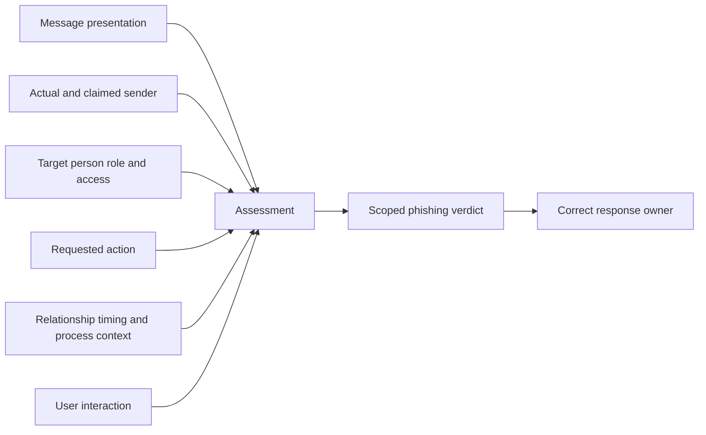
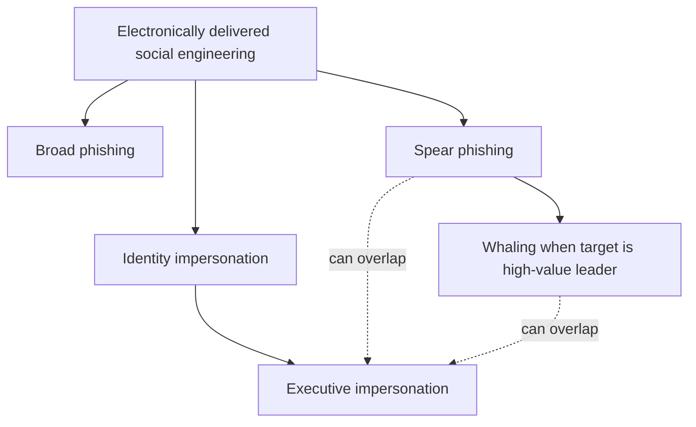
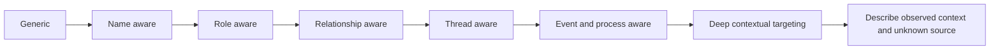
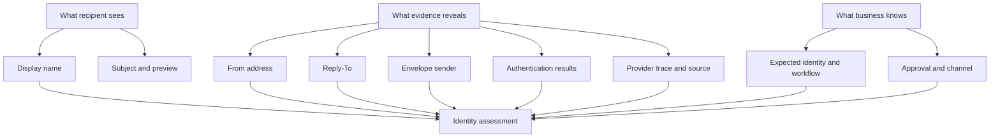
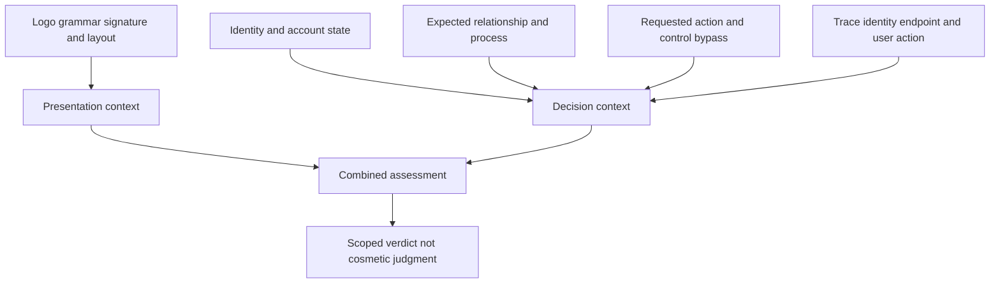
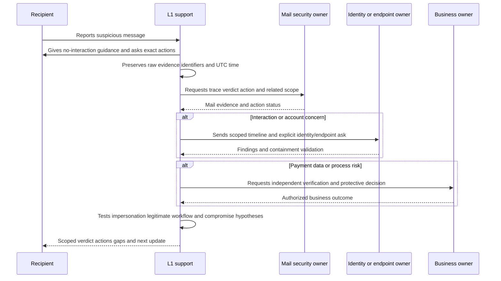
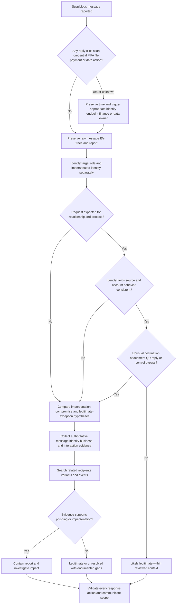
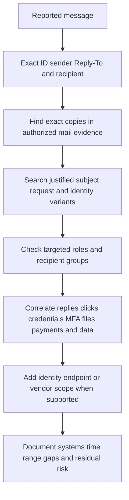
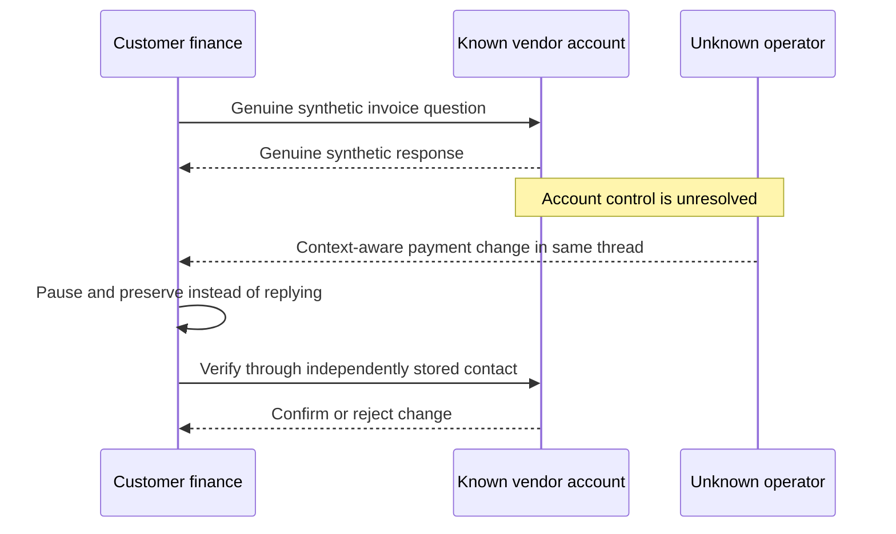

# Part 035 - Phishing Spear Phishing and Executive Impersonation

## Purpose, Evidence, and Currency

**Phishing** is electronically delivered social engineering intended to make a person take an unsafe action. The action may be opening content, visiting a site, entering credentials, disclosing information, approving a request, sending money, installing software, or calling a number. The delivery can be broad or precisely targeted. The message can look poor or polished. It can come from an obviously unrelated address, a lookalike domain, a spoofed identity, a compromised real account, or an otherwise legitimate service abused for delivery.

This part focuses on the human and contextual investigation of phishing, **spear phishing**, and executive impersonation. Spear phishing is targeted phishing aimed at a specific person, organization, role, or industry. **Whaling** is an informal term for spear phishing aimed at senior executives or other high-value people. Executive impersonation reverses the direction: the attacker presents as an executive or trusted leader to influence employees, partners, or vendors. These patterns often overlap, but target and impersonated identity are separate facts.

The central rule is:

$$
\text{Phishing assessment} \neq \text{grammar test}
$$

Spelling and grammar can contribute context, but they are weak signals. Legitimate senders make mistakes. Global organizations communicate across languages. Automated and generative systems can produce fluent text. A strong assessment combines identity, relationship, timing, business process, request, channel, technical evidence, user action, related-message scope, and expected behavior.

This guide is defensive. It does not teach lure construction, delivery, evasion, credential collection, or impersonation techniques for use against people. Every example is visibly synthetic and inert. Do not send messages, visit links, generate scannable QR codes, execute files, create lookalike domains, contact a suspicious sender, or make live tenant changes for practice.

Public sources describe broad threat patterns and documented platform capabilities. They do not reveal private vendor logic or prove how any individual customer case was scored. All official sources below were checked on the stated access date; current provider behavior and local procedures must be revalidated before production use.

## Section Goal

By the end of this part, you should be able to:

- Define phishing, broad phishing, spear phishing, whaling, executive impersonation, pretext, lure, call to action, and social pressure.
- Separate the target of a message from the identity being impersonated.
- Explain why targeting exists on a spectrum rather than as a perfect binary.
- Identify authority, urgency, fear, curiosity, reward, scarcity, helpfulness, secrecy, and emotional concern as influence patterns without treating them as proof.
- Recognize display-name impersonation and explain why a display name is not authenticated identity.
- Use message, identity, relationship, timing, content, request, process, recipient, user-action, and telemetry context together.
- Explain why fluent grammar, poor grammar, logos, signatures, authentication pass, or familiar threads are not decisive alone.
- Build competing hypotheses for suspicious executive or trusted-sender messages.
- Ask neutral, non-blaming user questions that establish exact actions and impact.
- Give immediate guidance for no interaction, reply, link/QR interaction, credential entry, MFA approval, file opening, payment, and data disclosure.
- Scope related recipients and variants using authorized evidence without scanning external infrastructure.
- Produce a customer-safe verdict with confidence, scope, action, owner, and uncertainty.
- Escalate possible account takeover, malware, payment fraud, data loss, privacy, or safety concerns to the correct owner.
- Complete a harmless synthetic classification lab and describe it honestly as learning evidence.

## JD Mapping

| Role responsibility or signal | Capability from this part | Example output |
|---|---|---|
| Triage user-reported email | Convert appearance-based concern into evidence dimensions and interaction state | "The message presents an executive identity, requests a process exception, and reached three finance recipients; no interaction is currently reported." |
| Explain a threat verdict | Point to observable identity, relationship, request, and behavior context | "The strongest evidence is the unexpected executive identity plus the out-of-process request, not grammar." |
| Investigate missed attacks or false positives | Compare expected business behavior with message and telemetry evidence | Hypothesis ledger with authorized-workflow alternative |
| Guide customers safely | Give action-specific, blame-free instructions | "Do not use the message's contact details; finance should verify through its saved vendor record." |
| Escalate across teams | Route identity, endpoint, finance, privacy, or legal consequences | Decision-ready handoff with explicit ask and current containment state |
| Support Microsoft 365 and Google Workspace environments | Use provider evidence concepts without claiming unearned platform operations | Raw message, trace, reporting event, identity evidence, and action-state request |
| Create support knowledge | Standardize questions, verdict language, and failure modes | Reusable phishing triage matrix and user-guidance card |
| Build customer trust | Avoid blame and unsupported accusations | "Thank you for reporting quickly; these messages are designed to create pressure." |

## Candidate Honesty Note

Arti can say:

> "I have handled ambiguous, high-pressure enterprise support cases in Microsoft environments and am practiced in evidence collection, customer updates, escalation, and validation. I have not operated Abnormal AI or a production phishing-response program. I learned these investigation patterns from official public guidance and practiced them with inert synthetic fixtures. In a live case I would follow the customer's runbook, preserve the original evidence, involve authorized SOC and identity owners, and never claim that a lab or grammar-based judgment proves maliciousness."

| Claim tier | Honest formulation | Boundary |
|---|---|---|
| **Production transfer** | "I have scoped customer impact, coordinated critical escalations, and validated outcomes." | Do not rename general support work as production phishing response |
| **Local/synthetic lab** | "I built a targeted-phishing triage matrix from inert metadata." | No real users, messages, links, domains, or tenant actions |
| **Learned architecture** | "MITRE ATT&CK and provider guidance frame phishing, reporting, and evidence sources this way." | Does not prove access to or operation of those tools |
| **No direct experience** | "I have not administered Abnormal, a SOC queue, or live executive-protection controls." | Pair gap with a concrete ramp and verification plan |

## Evidence Labels Used in This Part

| Label | Meaning | Example |
|---|---|---|
| **[Observation]** | Directly present in preserved evidence | "Display name is `Chief Office`; address ends in `example.invalid`." |
| **[User report]** | Recipient's account of what appeared or what they did | "The recipient reports replying but not opening any link." |
| **[Expected behavior]** | Confirmed normal business workflow or relationship | "Finance policy requires two approvers for beneficiary changes." |
| **[Inference]** | Testable interpretation | "The secrecy request may be intended to bypass peer review." |
| **[Hypothesis]** | Explanation with predicted evidence | "If this is an external impersonation, trace should show external submission and no executive mailbox event." |
| **[Conclusion]** | Supported judgment within stated scope | "Likely executive display-name impersonation; no user interaction reported for the reviewed recipients." |
| **[Unknown]** | Missing or unavailable fact | "Whether another recipient interacted is not yet known." |
| **[Private unknown]** | Undisclosed vendor logic | "Exact model weighting is unavailable and will not be invented." |

## Beginner Primer: Message, Messenger, Target, and Requested Action

Imagine someone wearing a courier jacket and asking a receptionist to hand over a restricted package. The jacket, confidence, and urgent story create an impression. The receptionist still checks the courier's identity, work order, destination, and authorization through an independent process.

Phishing investigation asks the same four foundational questions:

| Element | Plain question | Example |
|---|---|---|
| Message | What does the communication say and show? | "Review a fictional document before noon" |
| Messenger | Who actually sent it, and who do they claim to be? | External address displaying an executive name |
| Target | Who is being influenced, and why might that person or role matter? | Payroll administrator with process access |
| Requested action | What does the sender want the recipient to do? | Reply, sign in, approve, pay, open, call, or share |

The courier analogy stops being accurate because digital identity has several layers. The visible display name, RFC5322 From address, envelope sender, Reply-To, sending infrastructure, authenticated domain, account owner, and actual human operator can differ. A legitimate service can also send on another organization's behalf. Preserve the layers rather than asking only, "Does the name look right?"

## Phishing, Spear Phishing, and Whaling

### Broad Phishing

Broad phishing is distributed to many recipients with limited personalization. It can imitate a common service, delivery event, account notice, or generic business process. Broad does not mean harmless or technically simple. A mass campaign can still use convincing branding, compromised infrastructure, and adaptive content.

### Spear Phishing

Spear phishing targets a particular person, company, role, team, industry, or relationship. Personalization can use public facts, stolen conversation history, job roles, current projects, or business timing. A targeted message can be technically plain because relevance supplies credibility.

### Whaling

Whaling is a common label for spear phishing aimed at a senior executive or another high-value target. High value can come from authority, access, sensitive information, public visibility, or influence. A chief executive is not the only valuable target; executive assistants, finance staff, HR, IT help desk, legal staff, developers, procurement, and vendor managers can control critical processes.

### Executive Impersonation

Executive impersonation means the message claims or implies that it comes from a leader. The target can be any employee, vendor, customer, or partner. It may use a display name, spoofed address, lookalike domain, changed Reply-To, compromised account, forwarded thread, or another channel.

| Pattern | Delivery breadth | Personalization | Target | Claimed identity | Key distinction |
|---|---|---|---|---|---|
| Broad phishing | Many | Low to moderate | General population | Common brand/persona | Scale and reusable lure |
| Spear phishing | Narrow | Moderate to high | Specific person/role/org | Any trusted identity | Targeted context |
| Whaling | Narrow | Usually high | Executive/high-value person | Any trusted identity | Target is high-value |
| Executive impersonation | Narrow or broad | Variable | Employee/vendor/partner | Executive/leader | Impersonated identity is a leader |

These labels are not mutually exclusive. A message can be spear phishing and executive impersonation. It is whaling only when the target, not merely the display name, is a high-value executive or equivalent.

## 🔍 Plain-English deep-dive: Targeted Is a Spectrum, Not a Yes/No Switch

Personalization ranges from none to intimate business context. A message addressed to a first name may use data available to every marketer. A message referencing a real vendor and current invoice cycle may reflect deeper research or a compromised conversation. The investigator should describe the observed level rather than infer how the information was obtained.

| Targeting level | Observed context | What it may mean | What it does not prove |
|---|---|---|---|
| Generic | No recipient-specific detail | Broad campaign | No organization was selected |
| Basic | Name, employer, title | Public-directory or purchased-data use | Account compromise |
| Role-aware | Mentions payroll, finance, IT, or procurement task | Role-targeted spear phishing | Insider access |
| Relationship-aware | Names a known vendor or colleague | Public, stolen, or observed relationship context | Which source provided context |
| Thread-aware | Fits an existing conversation | Compromised account/thread or copied content | That every participant is compromised |
| Event-aware | References travel, closing, launch, acquisition, or invoice timing | Timed research or internal visibility | Actor identity or exact collection method |

A useful note is: "The message is role-aware and relationship-aware because it addresses accounts payable and names a known partner. How that context was obtained remains unknown." This is stronger than "highly sophisticated" because it reports evidence instead of admiration.

The spectrum analogy stops being accurate when targeting dimensions differ. A message can be deeply personalized in timing but generic in language. Record each dimension that affects a hypothesis.

## Pretext, Lure, and Call to Action

A **pretext** is the story that explains why the communication exists. A **lure** is the attractive, alarming, or relevant element that gains attention. A **call to action** is the behavior requested from the recipient.

| Component | Example in an inert training scenario | Investigation question |
|---|---|---|
| Pretext | "A fictional policy review is due" | Is this process expected and owned by the claimed sender? |
| Lure | "Review before the meeting" | What makes the recipient care now? |
| Call to action | "Use the portal link" | Does this action bypass a known safe route? |
| Pressure | "Keep this confidential" | Does secrecy suppress verification or approval? |
| Reward/consequence | "Avoid delay" | Is the consequence credible and independently confirmed? |

Separate these components because each suggests a test. The pretext can be checked against business workflow. The call to action can be compared with normal process. The pressure can be assessed for control bypass. The technical mechanism can be analyzed through approved defensive evidence.

## Influence Patterns: Urgency, Authority, and Emotion

Social engineering uses ordinary human decision shortcuts. These cues are not inherently malicious. Their significance comes from combination and context.

| Influence pattern | How it affects judgment | Contextual concern | Safe countermeasure |
|---|---|---|---|
| Authority | People comply with leaders or institutions | Leader asks for unusual exception | Verify identity and process independently |
| Urgency | Reduces time for checking | Artificial deadline plus irreversible action | Pause; contact owner through known channel |
| Fear | Focuses attention on loss/punishment | Threat to account, job, or service | Navigate independently to official service |
| Curiosity | Encourages opening unknown content | Unexpected document/photo/thread | Preserve and use approved analysis path |
| Reward | Encourages risk for benefit | Refund, bonus, prize, opportunity | Verify through established process |
| Scarcity | Creates fear of missing out | "Only minutes left" | Treat deadline as unverified claim |
| Helpfulness | Exploits desire to assist | "Can you quickly handle this for me?" | Follow approval and identity controls |
| Sympathy | Uses distress or relationship | Emergency request from leader/vendor | Confirm through known contact |
| Secrecy | Prevents peer review | "Do not tell finance/IT" | Escalate to process owner |
| Routine | Hides in familiar workflow | Invoice, e-signature, shared document | Validate message against expected system route |

The combination "authority + urgency + secrecy + payment change" is higher concern than any single cue. Still, concern triggers verification; it does not independently prove malicious intent.

## Display-Name Impersonation

Most email clients show a friendly **display name**, such as `Alex Morgan`, more prominently than the underlying address. Display names are presentation fields and can be chosen by senders. They are useful for readability, not proof of identity.

| Identity layer | Example | Question |
|---|---|---|
| Display name | `Executive Office` | Does the visible label match a known person or role? |
| RFC5322 From address | `requests@example.invalid` | What address/domain is presented as author? |
| Reply-To | `review@example.invalid` | Where will a normal reply go? |
| Envelope sender | `bounce@example.invalid` | Which address handles transport returns/SPF context? |
| Authenticated domain | Fixture says `example.invalid` | Which domain relationship did SPF/DKIM/DMARC evaluate? |
| Trace/source | Synthetic external hop | Did the provider treat it as internal or external submission? |
| Account/operator | Unknown | Is a genuine account controlled by its owner? |

Display-name impersonation can be obvious when the address is exposed, but mobile clients and notification previews may hide it. User guidance should teach independent process verification, not just "hover over the name," because interfaces differ and a lookalike or compromised address may still appear plausible.

## 🔍 Plain-English deep-dive: Authentication Answers a Narrow Question

Think of a building badge. A valid badge can show that the presented badge was issued for a particular organization. It does not prove the person using it is acting safely, that the account was not stolen, or that every request is authorized.

Email authentication similarly answers limited domain and message-integrity questions. A Domain-based Message Authentication, Reporting, and Conformance (DMARC) pass means the evaluated message satisfied DMARC through aligned Sender Policy Framework (SPF) or DomainKeys Identified Mail (DKIM). It does not prove:

- the sender's business request is legitimate;
- the account or authorized sending service is uncompromised;
- the domain is the intended trusted organization's domain rather than a lookalike;
- a linked destination is safe;
- a payment or data transfer is approved;
- the human operating the account is the expected person.

| Result | Supported statement | Unsupported leap |
|---|---|---|
| DMARC pass | An aligned authentication path passed at that evaluator | "The message is safe" |
| DMARC fail | Alignment/authentication did not satisfy policy at that evaluator | "The sender is an attacker" |
| Internal trace source | Provider records internal submission/route | "The account owner intentionally sent it" |
| Known display name | Presentation matches expected label | "The identity is verified" |

The badge analogy stops being accurate because domains can delegate sending to services, forwarding can complicate authentication, and email contains multiple identity fields. Use the exact result from preserved headers plus known business and account context.

## Contextual Indicators

An **indicator** becomes useful when tied to a question. Avoid long checklists where every item is treated equally.

### Identity Context

- Is the claimed sender known?
- Is the exact address/domain expected for that relationship?
- Does Reply-To differ, and is that normal for the system?
- Is the message internal, external, forwarded, or service-generated?
- Does provider/identity evidence suggest compromised legitimate control?

### Relationship Context

- Has the sender communicated with this recipient before?
- Is the direction, frequency, and topic expected?
- Does the sender normally contact this role or use an assistant?
- Is the relationship new, dormant, or recently changed?

### Timing Context

- Does the message align with a real meeting, travel event, invoice cycle, payroll deadline, or public announcement?
- Is the time unusual for the sender and recipient?
- Could time zone or travel explain it?
- Did relevant mailbox, sign-in, or vendor events occur nearby?

### Request and Process Context

- Is the requested action normal for the claimed role?
- Does it bypass approvals, segregation of duties, ticketing, procurement, identity, or finance controls?
- Does it introduce new contact details, destinations, payment accounts, or login routes?
- Does it demand secrecy or discourage verification?

### Content and Channel Context

- Is the message a reply, link, QR code, attachment, call-back number, shared-document notice, or calendar event?
- Are visual branding and textual content consistent with the known workflow?
- Is the destination independently known, or supplied only by the message?
- Did the communication move to another channel unexpectedly?

### Recipient and Access Context

- Why this recipient or role?
- What access, approval, information, or influence does the target possess?
- Were multiple people in the same function targeted?
- Was an executive targeted, impersonated, or both?

### Context Matrix

| Context dimension | Expected | Observed | Gap | Weight in current hypothesis |
|---|---|---|---|---|
| Identity | Known executive account/workflow | External display name | Delegation unknown | Strong concern, not proof |
| Relationship | Executive uses assistant for scheduling | Direct request to new finance recipient | Recipient relationship absent | Supports targeted impersonation |
| Timing | Quarterly payment cycle | Arrives during cycle | Public visibility unknown | Moderate contextual support |
| Process | Two approvals through finance system | Email asks for exception | No ticket/reference | Strong control-bypass signal |
| Mechanism | Saved finance portal | Message-supplied link | Destination not analyzed | Exposure unknown |
| User action | No action expected | User reported before acting | Corroborating telemetry pending | Reduces observed impact |

## Why Grammar Is Weak Evidence

Grammar, spelling, tone, and formatting can support a broader context assessment. They must not dominate it.

| Writing observation | Benign explanations | Threat explanations | Proper use |
|---|---|---|---|
| Typo or awkward phrase | Mobile typing, second language, accessibility tool, haste | Low-quality or translated lure | Minor context only |
| Perfect grammar | Professional sender, template, editor | AI-generated or carefully prepared lure | Neither safe nor malicious by itself |
| Unusual tone | Stress, new assistant, cross-cultural style | Impersonation or account takeover | Compare with known workflow and telemetry |
| Generic greeting | Bulk legitimate notification | Broad phishing | Check identity and requested action |
| Detailed personal context | Legitimate relationship | Spear phishing research/thread abuse | Verify context source and account state |
| Familiar signature/logo | Normal brand template | Copied branding | Presentation only; inspect identity/process |

Do not tell users, "Look for bad spelling" as the main defense. Teach them to pause on unusual requests, independently navigate to known systems, verify financial/identity changes through known channels, use reporting controls, and report even polished messages.

## 🔍 Plain-English deep-dive: Context Beats Cosmetics

A forged paper invoice can use perfect letterhead. A genuine handwritten note can look messy. The visual polish does not answer whether the request belongs to an approved purchase, known vendor, valid recipient, and authorized payment destination.

Email cosmetics include logos, signatures, colors, grammar, and familiar layout. Context includes who normally performs the task, where it is performed, which approvals are required, whether the relationship exists, and what changed. A message that looks perfect but asks payroll to bypass the HR system is more concerning than a typo in an expected internal reminder.

Use this priority:

1. Immediate impact and user action.
2. Identity and account state.
3. Expected relationship and business process.
4. Requested action and destination.
5. Technical mechanism and telemetry.
6. Visual and writing cues.

The paper analogy stops being accurate because digital artifacts include technical routing and authentication evidence. Those signals enrich context but still do not replace business authorization.

## User Interaction States and Guidance

Ask what happened without blame. "Did you fall for it?" is vague and judgmental. Ask precise actions in sequence.

| Interaction state | Immediate user guidance | Owner/evidence path |
|---|---|---|
| Viewed only | Do not interact; use approved report function; preserve message | Email/SOC trace and scope |
| Replied | Stop conversation; do not follow new instructions; preserve sent reply | Email/SOC plus disclosed-information assessment |
| Clicked/opened link only | Close page; do not re-enter through message; record time/device | Identity, secure web/browser, SOC; do not assume credentials entered |
| Scanned QR code | Close page; record mobile device, time, and displayed destination if safely visible | Identity/mobile/security owner; do not rescan for evidence |
| Entered username/password | Stop interaction; use independently navigated official recovery path; contact identity/SOC immediately | Identity session/token/sign-in investigation |
| Approved unexpected MFA | Report immediately; do not approve further prompts | Identity/SOC containment and session review |
| Opened/downloaded file | Do not reopen; disconnect/isolate only per approved endpoint runbook | Endpoint/EDR/SOC; preserve file metadata through approved means |
| Installed software/ran command | Stop activity; contact endpoint/SOC urgently | Endpoint incident response; do not self-clean evidence |
| Sent payment/gift card/payroll change | Contact internal finance/fraud process and financial institution urgently through known channels | Finance/legal/law-enforcement authority; preserve transaction details securely |
| Shared sensitive data | Stop further disclosure; notify security/privacy/data owner | Privacy/legal/DLP/identity scope |

### Neutral User Interview

| Ask | Why |
|---|---|
| "What did you see first?" | Reconstructs channel and presentation |
| "Which device and application were you using?" | Routes browser/mobile/endpoint evidence |
| "Did you reply, click, scan, call, download, open, sign in, approve, pay, or share anything?" | Separates distinct impact paths |
| "At approximately what time, with your time zone?" | Enables log correlation |
| "After the action, what page, prompt, download, or confirmation appeared?" | Captures result without asking user to repeat it |
| "Have you used a known official route since then?" | Identifies recovery attempts and possible duplicate actions |
| "Who else may have received or acted on it?" | Establishes campaign scope |

Start with thanks: "Thank you for reporting quickly. These messages are designed to create pressure. I will ask specific questions so we can choose the right protective steps." This encourages accurate reporting and reduces concealment.

## Investigation Workflow

### Step 1: Establish Urgency

Determine whether credentials, MFA, execution, payment, data, privileged identity, or an active campaign are involved. Urgent escalation can run in parallel with evidence preservation.

### Step 2: Preserve Original Evidence

Use approved message reporting/export methods. Preserve message/report IDs, raw source when authorized, recipient, received time, user-action time, and provider action state. A forwarded copy may transform evidence.

### Step 3: State the Symptom Neutrally

> "A finance recipient received a message at 10:14 UTC displaying an executive-office identity and requesting an exception to a payment-review process. The recipient reports viewing only."

### Step 4: Classify Targeting and Identity

Record broad versus role/relationship/thread/event-aware targeting. Record target identity separately from impersonated identity. Identify display, address, Reply-To, authentication, trace direction, and account-state gaps.

### Step 5: Map Pretext, Pressure, and Request

Describe the claimed situation, influence cues, action, destination, and any control bypass. Avoid saying "clever" or "obvious"; name evidence.

### Step 6: Test Alternatives

Common hypotheses include external display-name impersonation, authorized delegate/service, compromised internal account, compromised vendor, legitimate unusual workflow, or forwarded/transformed content.

### Step 7: Scope Related Activity

Search authorized mail evidence using stable identifiers and behaviors. Include recipients, variants, time, sender identities, reply destinations, subject/content traits, and account events. Do not scan public infrastructure or contact the suspected sender.

### Step 8: Respond and Validate

Recommend proportionate containment, identity/endpoint/finance/data actions by authorized owners, then validate completion. Communicate what is confirmed, not found in named evidence, unknown, and pending.

## Troubleshooting Decision Tree

### Symptom-to-Hypothesis Matrix

| Symptom | Leading hypotheses | Safe discriminating check | Interpretation | Next action |
|---|---|---|---|---|
| Executive name with external address | Display-name impersonation; authorized assistant | Trace direction plus independently known workflow | External alone is insufficient; absent workflow increases concern | Scope recipients and report/contain per policy |
| Executive's real internal account | Legitimate request; compromised account | Mail submission, identity, mailbox, and executive confirmation through known channel | Real address does not prove authorized operator | Identity incident path if unauthorized |
| Message matches current invoice cycle | Legitimate vendor; researched spear phishing; vendor compromise | Independent vendor and finance-record verification | Timing supports targeting but not source method | Pause change/payment and engage finance |
| Perfectly written branded notice | Legitimate service; polished phishing | Independently navigate to known service and compare expected event | Grammar/branding do not decide | Use provider reporting and identity evidence |
| Awkward but expected internal note | Legitimate rushed note; compromise; impersonation | Known channel and account telemetry | Writing style is weak context | Avoid accusatory or grammar-only verdict |

## Worked Example 1: Executive Impersonation of a Finance Leader

### Inputs

- Inert display name: `Finance Leadership`.
- Sender: `requests@example.invalid`.
- Reply-To: `review@example.invalid`.
- Target: fictional accounts-payable analyst.
- Pretext: synthetic meeting preparation.
- Requested action: review a fictional beneficiary change outside the normal system.
- Pressure: urgency and confidentiality.
- User report: viewed and reported; no reply, link, payment, or data action.

### Investigation

1. **[Observation]:** A finance-leadership identity is presented.
2. **[Observation]:** Sender and Reply-To differ.
3. **[Observation]:** The fixture asks for a process exception affecting a payment destination.
4. **[Observation]:** Authority, urgency, and secrecy occur together.
5. **[User report]:** No interaction beyond viewing/reporting.
6. H1: external executive impersonation. Predicted real-world evidence: external source, no authorized delegation, related targeting of finance staff.
7. H2: authorized assistant or service. Predicted evidence: documented relationship and standard workflow.
8. H3: training fixture. In this exercise, explicit synthetic markers support H3 as the actual lab truth.

### Conclusion

> **Synthetic classification:** The pattern represents targeted executive impersonation and payment-fraud risk. No real malicious actor, destination, loss, compromise, or recipient impact exists. In production, pause the process, verify through independently known finance/executive channels, scope recipients, and preserve mail/identity evidence.

### Customer Guidance

"Thank you for reporting without acting. Please do not reply or use any contact details in the message. Finance should verify the request through its saved workflow. Security will review related recipients and confirm the message-action status."

## Worked Example 2: Executive as the Target

### Inputs

- Target: fictional chief operating officer.
- Claimed sender: fictional legal-services portal.
- Inert destination: `hxxps://notice.example.invalid/review`.
- Personalization: role and a public fictional event.
- User action: unknown.

### Investigation

This is potential whaling because the target is a senior executive. It is not executive impersonation merely because the target is an executive; that depends on who is claimed as sender. The role/event context supports a spear-phishing hypothesis but does not reveal how it was obtained.

H1 is targeted phishing using public context. H2 is a legitimate legal notice. H3 is an abused real service notification. Safe tests are expected-case verification through independently known legal channels, provider trace/authentication, user interaction, and approved destination analysis. No one visits the inert string.

### Conclusion

> **Synthetic classification:** Possible whaling via a service-notice pretext. Confidence about targeting is medium; maliciousness and interaction are unresolved. Preserve, independently verify the supposed matter, and trigger identity/endpoint evidence if interaction occurred.

## Worked Example 3: Poor Grammar, Legitimate Workflow

### Inputs

- Fictional internal note contains two spelling errors.
- It references an existing synthetic ticket ID.
- It asks the recipient to use the already bookmarked internal portal, not a message link.
- Trace and account fixture are consistent with expected internal workflow.

### Analysis

The writing errors are weak negative context. Existing ticket correlation, expected sender relationship, known route, no message-supplied destination, and consistent account evidence are stronger. This does not make the message universally safe; it supports legitimacy within the fixture.

### Conclusion

> **Synthetic classification:** Likely legitimate operational mail within the reviewed scenario. Grammar errors do not justify a threat verdict. The user can independently open the known portal and verify the ticket rather than act from the message.

## Worked Example 4: Perfect Grammar, Compromised-Account Alternative

### Inputs

- Fictional message comes from a known vendor address and fits an existing thread.
- Grammar, signature, and tone appear normal.
- Request changes payment details.
- A synthetic business record says the vendor never announced a change.

### Analysis

Presentation and account authenticity can coexist with compromise. H1 is vendor-account compromise/thread abuse. H2 is legitimate but unannounced change. H3 is a transformed/forged fixture. The decisive check is independent vendor verification through a known contact plus authorized mail/account evidence held by the vendor and customer. The suspicious thread must not supply the verification channel.

### Conclusion

> **Synthetic classification:** High-risk payment-change request, likely unauthorized in the scenario, with vendor compromise unresolved. Pause processing, preserve the thread, engage finance and vendor security through known channels, and validate recipient interaction.

## Scope and Campaign Reasoning

| Scope axis | Seed | Justified expansion | Stop condition/limitation |
|---|---|---|---|
| Recipient | Reporting user | Same function, named targets, trace recipients | No broad mailbox search without authority |
| Sender | Exact address | Related display identities, Reply-To, sending account | Do not scan or contact external sender |
| Message | Exact ID/source | Subject variants, inert destination, attachment metadata, pretext traits | Avoid relying on mutable text alone |
| Time | Received/action time | Window around campaign and account events | State UTC range and retention |
| Identity | Claimed and actual accounts | Sign-in/session/app/mailbox evidence if interaction or compromise plausible | Identity owner controls access/action |
| Endpoint/mobile | Interaction device | EDR/browser/mobile evidence after link/file/QR action | No self-execution or unapproved collection |
| Business | Requested process | Finance, HR, legal, procurement, vendor records | Business owner establishes authorization |

Campaign scope should combine exact indicators with behavior. Exact sender and URL strings find known copies; request type, impersonated role, target function, and timing can find variants. Every expansion must be authorized and privacy-minimized.

## Role Risk: Why Targets Matter Beyond Job Titles

Attackers do not need to target the most senior person. They need to reach someone who can move the desired process. A target's value can come from formal permission, informal trust, information access, public visibility, or proximity to a powerful person.

| Target role | Potentially valuable capability | Common pretext family | Defensive context to verify |
|---|---|---|---|
| Executive | Authority, confidential strategy, broad access | Legal matter, board document, acquisition, travel | Executive-office workflow, assistant/delegate, known counsel |
| Executive assistant | Calendar, correspondence, trusted proximity, delegated action | Schedule change, document preparation, urgent favor | Delegation scope, calendar event, executive confirmation route |
| Finance/accounts payable | Invoice, beneficiary, payment, tax data | Vendor update, overdue invoice, payment exception | Purchase order, vendor master, dual approval, known contact |
| Payroll/HR | Salary, bank data, identity documents | Direct-deposit change, employee record, benefits | HR self-service system, employee verification, approval trail |
| IT/help desk | Password reset, MFA, device, privileged support | Locked-out executive, new phone, urgent access | Identity proofing, call-back process, privileged approval |
| Legal | Sensitive matters, contracts, privileged material | Complaint, subpoena, deal room, e-signature | Matter/case system, known counsel, secure document route |
| Procurement/vendor manager | Supplier onboarding and master data | New supplier, bank change, contract renewal | Vendor due diligence, contract owner, finance approval |
| Developer/administrator | Source code, secrets, deployment, cloud access | Repository notice, package alert, access request | Known console, change ticket, identity and endpoint evidence |
| Communications | Brand channels and public statements | Urgent announcement, executive statement | Editorial approval, known leadership channel |
| New employee/contractor | Limited relationship knowledge | Welcome task, directory update, equipment, gift card | Onboarding checklist, manager and HR system |

A job title alone does not prove why the person was selected. State the observed relationship between target and requested action. For example: "The message targeted an accounts-payable analyst and requested a beneficiary change, so the recipient's role is directly relevant to the requested outcome." Do not claim the actor researched permissions unless evidence supports that.

### Privilege, Influence, and Process Access

| Value type | Meaning | Example | Investigation implication |
|---|---|---|---|
| Technical privilege | System-enforced permission | Reset password, administer tenant | Identity and privileged-operation logs matter |
| Financial authority | Ability to approve or initiate value movement | Release payment | Finance system and approval evidence matter |
| Information access | Ability to read sensitive content | Legal or HR documents | Data scope and privacy owners matter |
| Relationship influence | Others trust the person's request | Executive or assistant | Downstream recipients may be secondary targets |
| Process knowledge | Understanding of timing and workflow | Vendor manager | Contextual accuracy may indicate targeting but not its source |
| Public visibility | Information available outside the organization | Leadership role, event attendance | Personalization can come from public research |

This distinction helps avoid overreacting to every executive-themed message while missing a payroll clerk or help-desk analyst who can complete the attacker's desired action.

## Conversation and Thread Context

A message that appears inside a real conversation deserves special attention, not automatic trust. The history may be genuine while the newest message is unauthorized. A compromised participant, altered Reply-To, copied history, forwarding, or a legitimate unusual change can all produce a plausible thread.

| Thread observation | Possible explanations | Safe evidence |
|---|---|---|
| Earlier messages are genuine | Current sender is legitimate; account compromised; history copied | Raw source, Message-IDs/references, trace, account/vendor evidence |
| New Reply-To appears | Legitimate ticketing workflow; reply diversion; forwarding change | Header comparison and known service configuration |
| Tone remains consistent | Same legitimate author; copied writing; account takeover | Business verification and identity evidence, not style judgment |
| New attachment/link appears late | Legitimate document update; malicious pivot | Approved content analysis and process confirmation |
| Payment destination changes | Legitimate business change; fraud | Finance/vendor verification through independently known route |
| One participant disappears | Normal direct reply; deliberate exclusion | Recipient/header history and business context |

### Thread Timeline Method

1. Preserve the reported message and, if authorized, the minimum conversation context required.
2. Order messages by reliable timestamps while noting client display order can differ.
3. Compare sender, Reply-To, recipients, Message-ID and References, subject, mechanism, and requested action at each transition.
4. Mark the first proven change, such as new address, new destination, or new business request.
5. Ask which source can establish whether that change was authorized.
6. Do not assume the first suspicious-looking message is the first compromise event.

The diagram describes a defensive hypothesis, not instructions to compromise or hijack a thread. The key lesson is that conversation authenticity and current-author authorization are separate.

## Evidence Weighting for Phishing Cases

There is no universal numeric score in this guide. Weight evidence qualitatively based on directness, authority, specificity, coverage, and corroboration.

| Evidence class | Examples | Typical weight | Caveat |
|---|---|---:|---|
| Direct interaction/impact | Confirmed credential entry, unauthorized MFA, payment, execution | High for that action | User report should be correlated where possible |
| Authoritative account event | Provider submission, sign-in, token/app, mailbox action | High for recorded event | Coverage and actor attribution still matter |
| Independent business verification | Executive/vendor/finance confirms request unauthorized via known route | High for authorization | Does not alone establish technical entry path |
| Raw identity/message structure | Source, From, Reply-To, authentication, route | Medium to high for identity path | Does not establish benign/malicious business intent |
| Relationship/process mismatch | New relationship, bypassed approval, new destination | Medium to high in context | Legitimate exceptions occur |
| Campaign correlation | Same request/identity/indicator across recipients | Medium to high | Automated security scanning can affect telemetry |
| Reputation/domain age | Prior history, new registration | Supporting | New legitimate and compromised established resources exist |
| Writing/visual appearance | Grammar, logo, tone, formatting | Low | Easily copied or generated; subjective |

### Contradictions Are Valuable

An investigation improves when it records evidence that does not fit the leading hypothesis.

| Leading hypothesis | Potential contradiction | What to do |
|---|---|---|
| External executive impersonation | Trace shows authenticated internal submission | Shift toward account misuse, legitimate send, or transformed evidence |
| Compromised executive account | Executive and audit evidence confirm authorized request | Reassess business-process false positive; still validate unusual action |
| Broad phishing | Only one specialized role receives relationship-aware content | Increase targeted/spear-phishing support |
| Whaling | Executive name is impersonated but recipient is a general employee | Classify executive impersonation; do not call whaling solely from display name |
| Credential phishing | No sign-in request and destination is an independently known non-authenticated portal | Reassess objective while preserving other concerns |

Changing a hypothesis is not failure. It is the expected result of evidence-led work.

## Customer Communication Across the Case Lifecycle

### First Response: No Known Interaction

> "Thank you for reporting this message. Please do not reply, use its contact details, open its link or attachment, or scan any code. Use the approved reporting control so the original evidence is preserved. We are checking the sender identity, expected workflow, related recipients, and message action state. Please tell us whether anyone interacted and the approximate time if so."

### First Response: Interaction Reported

> "Thank you for reporting quickly. Do not repeat the action or continue the conversation. We need the device/application, approximate time and time zone, and whether the action involved a reply, link or QR page, credentials, MFA, download/open, software/command, payment, or data. I am engaging the appropriate identity, endpoint, finance, or privacy owner now."

### Progress Update

> "We assess this as likely targeted impersonation based on the external source, unexpected executive identity, and request to bypass the finance workflow. We reviewed three recipients from 09:00 to 12:00 UTC in the supplied mail evidence. One viewed and reported; interaction for two remains pending. The SOC owns message containment, and Finance is verifying the requested change through its stored vendor contact. No account-compromise conclusion has been made because identity evidence is still pending. Next update: 13:00 UTC."

### Resolution: Attempted, No Interaction Found

> "The reviewed evidence supports an attempted executive-impersonation campaign. All five identified messages were contained, and no reply, link/QR, credential, file, payment, or data interaction was found in the named mail, identity, and endpoint sources for the stated interval. This is not a claim about systems outside that scope. Monitoring and user feedback remain active under the SOC's process."

### Resolution: Legitimate but Unusual

> "The message was confirmed as an authorized request by the business owner through the independently known workflow. The sending account and provider trace were consistent with that confirmation, and no unsafe destination was involved. We are treating the report as a false positive within this case scope. Any policy or detection adjustment should be narrow, reviewed, reversible, and validated against malicious lookalikes."

### Communication Quality Checklist

| Check | Good outcome |
|---|---|
| Classification | Broad/targeted/whaling/impersonation labels used precisely |
| Evidence | Direct observations lead; grammar and appearance remain secondary |
| Confidence | Applies to specific claims |
| Scope | Recipients, messages, UTC time, systems, and exclusions stated |
| Interaction | Viewed/replied/clicked/credential/MFA/file/payment/data states separated |
| Action | Requested, authorized, completed, failed, and validated distinguished |
| Owner | SOC, identity, endpoint, finance, privacy, legal, or vendor owner named |
| Tone | Calm, non-blaming, no unsupported attribution |

## Worked Example 5: Help-Desk Identity Pretext

### Inputs

- Target: fictional IT support analyst.
- Claimed sender: fictional senior executive.
- Request: move an account-recovery conversation to a personal number.
- Message contains no live number, URL, QR code, or attachment.
- Pressure: urgency based on fictional travel.
- User action: analyst paused and reported.

### Analysis

The target is valuable because help-desk staff can influence identity recovery. The executive identity and travel pretext combine authority, urgency, and a channel switch. The requested move outside the approved proofing process is the strongest concern. Grammar is irrelevant.

H1 is executive impersonation aimed at identity-process manipulation. H2 is a legitimate executive who does not know the normal process. H3 is a compromised executive account. Discriminating evidence includes the known identity-proofing policy, provider trace, account telemetry, and independent executive-office confirmation. The analyst must not call a number supplied in the request.

### Conclusion

> **Synthetic classification:** Targeted executive impersonation is likely in the fixture, with identity-process risk but no account change or user interaction. Keep the recovery request paused, preserve evidence, and use established privileged identity verification.

## Worked Example 6: Multi-Recipient Variant Campaign

### Inputs

- Six synthetic records share the display identity `Operations Review`.
- Three use `notice-a@example.invalid`; three use `notice-b@example.invalid`.
- Subjects differ slightly.
- Four target operations staff, two target finance staff.
- All contain the same inert process-exception category but no live destination.
- Two users viewed, one replied, three states are unknown.

### Analysis

An exact-address search would find only half the fixture. Display identity, request behavior, target roles, and time connect the variants. This illustrates why scope begins with exact identifiers and then expands through justified behaviors.

The reply does not prove compromise. The response content must be assessed for disclosed information, and the conversation must stop. Unknown recipient states need follow-up. Identity or endpoint escalation depends on whether any later action occurred.

### Conclusion

> **Synthetic classification:** A coordinated role-targeted campaign is supported across six messages. The available fixture supports attempted social engineering and identity impersonation, but no credential, endpoint, payment, or data impact is established. Containment validation and recipient-state completion remain required.

## Operational Metrics Without Blaming Users

Metrics can improve reporting and response, but poorly designed metrics can punish the people who provide evidence.

| Metric | Useful interpretation | Gaming or harm risk | Guardrail |
|---|---|---|---|
| Report rate | Whether users use reporting channels | High rate can reflect attack volume, not poor judgment | Segment by exposure and campaign |
| Time to report | Opportunity to contain | Users may hide uncertainty if ranked publicly | Use for system improvement, not shame |
| Interaction rate | Exposure outcome | Click does not equal compromise; simulations differ from attacks | Separate action types and context |
| Time to triage | Support responsiveness | Fast closure can reward premature conclusions | Pair with quality/reopen/false-negative checks |
| Containment completion | Action effectiveness | Issued action may be counted as success | Require target-level validation |
| User feedback quality | Helpfulness and clarity | Automated replies may optimize speed over care | Review content, empathy, and next steps |

The desired behavior is early reporting, including when a user is unsure or already interacted. A blame-free process increases detection coverage.

## Failure Modes and Unsafe Shortcuts

| Failure mode | Why it fails | Better practice |
|---|---|---|
| "Bad grammar means phishing" | Discriminates poorly and creates false confidence | Put identity, process, request, and telemetry first |
| "Perfect grammar means legitimate" | Polished malicious mail is common | Verify expected workflow and identity independently |
| "Executive name means whaling" | Whaling describes target, not displayed identity | Record target and impersonated identity separately |
| "DMARC passed, so close case" | Malicious/lookalike/compromised senders can authenticate | Correlate domain, account, request, and behavior |
| Hover-only advice | Mobile UI may hide details; plausible domains remain | Teach independent navigation and process verification |
| Replying to verify | Confirms address and trusts attacker-controlled channel | Use independently known contact information |
| Forwarding to colleagues | Spreads content and transforms evidence | Use approved reporting/export workflow |
| Visiting a link or scanning QR | Creates exposure and contaminates evidence | Defang/preserve; use authorized analysis owner |
| Blaming the user | Delays reports and reduces evidence quality | Thank, ask neutral precise questions, act quickly |
| Treating "clicked" as "compromised" | Click, credential entry, token theft, and execution differ | Determine exact action and correlate telemetry |
| Treating no reported click as no impact | Other recipients or automatic actions may exist | Scope recipients and evidence |
| Broad block/allow response | Can disrupt business or create bypass | Use proportionate, reviewable action and validate |

## Safe Synthetic Lab: The Context-First Phishing Triage Gallery

### Objective

Build a single local artifact that classifies six inert message cards as broad phishing, spear phishing, whaling, executive impersonation, likely legitimate, or unresolved. For each card, separate target from impersonated identity, map pretext and pressure, rank contextual evidence, create alternatives, provide user guidance, and write a scoped verdict.

The unique lab name is **The Context-First Phishing Triage Gallery**.

### Prerequisites

- Local Markdown editor or spreadsheet.
- Offline study location.
- Only the inert cards below.
- Reserved `example.invalid` identities.
- Defanged `hxxps://` strings only.
- No live mail, browser navigation, QR generation/scanning, files, provider tenant, external lookup, sending, or account change.

### Authorized scope

Authorized activities:

- Copy and classify the six synthetic cards.
- Build evidence, hypothesis, guidance, scope, and verdict tables.
- Label artifacts **local/public lab - synthetic only**.
- Rehearse customer explanations aloud.

Prohibited activities:

- Creating realistic lure text, branded login content, or impersonation artifacts.
- Sending, forwarding, replying, scanning, clicking, resolving, browsing, or contacting.
- Registering domains, creating accounts/apps/tokens, or changing security settings.
- Using real executive, employee, vendor, customer, tenant, payment, or personal data.

### Synthetic message cards

| Card | Target | Claimed identity | Inert pattern | User state |
|---|---|---|---|---|
| 1 | Many generic users | Generic service | Broad account-notice category; `hxxps://notice.example.invalid` | No interaction |
| 2 | Fictional payroll analyst | Fictional HR leader | Role-aware request to review payroll process; no link/file | Replied "received" |
| 3 | Fictional chief executive | Fictional legal portal | Event-aware review notice; defanged string only | Unknown |
| 4 | Fictional accounts payable team | Fictional finance executive | Display-name identity; out-of-process payment change | Viewed/reported |
| 5 | Fictional engineering user | Known synthetic colleague | Two typos; existing ticket; instructs use of saved portal | No interaction |
| 6 | Fictional finance user | Known synthetic vendor | Thread-aware payment change; perfect grammar | Unknown |

### Steps

1. Create one document titled `Context-First Phishing Triage Gallery` and label it `local/public lab - synthetic only`.
2. Add an authorized-scope statement and record the exercise time in UTC.
3. Copy only the short inert card descriptions. Do not expand them into realistic messages.
4. For every card, record target, claimed identity, actual presented address category, breadth, personalization level, pretext, lure, pressure, call to action, mechanism, process expectation, and user state.
5. Decide whether `broad phishing`, `spear phishing`, `whaling`, `executive impersonation`, `likely legitimate`, and `unresolved` apply. More than one label may apply.
6. Write at least four observations and two hypotheses per card. Include a benign alternative where plausible.
7. Add one predicted observation and one authorized-owner test per hypothesis. Mark every production test `not performed - synthetic lab`.
8. Rank evidence into strong context, supporting context, weak cosmetics, and unknown.
9. Explicitly record grammar/formatting as weak cosmetics for every card.
10. Write neutral user questions based on the stated interaction. Do not ask the user to reproduce an action.
11. Give immediate guidance for each card. Verification must use independently known channels or independently navigated systems.
12. Define related-message and impact scope, including UTC period, recipients, identities, systems, and exclusions.
13. Write one customer-safe verdict per card with confidence and limits.
14. Build one escalation packet for Card 3, 4, or 6, with an explicit identity, finance, endpoint, or vendor-security ask.
15. Review for blame, legal attribution, unsafe link/file/QR actions, live data, overclaiming, or implied production experience.

### Expected evidence

- Six complete classification rows with overlapping labels allowed.
- Target and impersonated identity recorded separately.
- Targeting level and observed personalization stated without guessing the source.
- Pretext, pressure, call to action, requested process exception, and mechanism mapped.
- At least 24 observations and 12 hypotheses.
- Safe predicted tests assigned to authorized owners and marked not performed.
- Grammar and visual polish explicitly kept at low evidentiary weight.
- User guidance for viewed, replied, and unknown-interaction states.
- Six scoped customer-safe verdicts.
- One decision-ready escalation packet.
- No sending, links visited, QR codes, files, live lookups, scanning, execution, accounts, apps, tokens, or tenant changes.

### Cleanup and privacy

- Retain only the synthetic local artifact if needed for study.
- Confirm all addresses/domains use `example.invalid` and all URL text is defanged.
- Remove any real message, sender, recipient, executive, vendor, subject, Message-ID, URL, IP, QR code, attachment, credential, token, tenant, payment, or customer content accidentally pasted.
- Delete the artifact if reliable redaction is impossible.
- Do not upload it to public scanners or AI services.
- Record explicitly that no real communication or security action occurred.

### Artifacts

| Artifact section | Skill shown | Honest label |
|---|---|---|
| Six-card classifier | Phishing taxonomy and overlap reasoning | **Local/public lab** |
| Context ranking | Evidence prioritization over cosmetics | **Local/public lab** |
| User-guidance card | Blame-free action-specific communication | **Template only** |
| Scope/verdict set | Customer-safe investigation reasoning | **Template only** |
| Escalation packet | L1 ownership and authority boundaries | **Template only** |

### Validation rubric

| Dimension | Fail | Developing | Pass |
|---|---|---|---|
| Definitions | Uses labels interchangeably | Defines broad/targeted only | Correctly distinguishes broad, spear, whaling, target, and executive impersonation |
| Context | Decides from grammar/logo | Uses address plus writing | Integrates identity, relationship, process, request, timing, mechanism, telemetry, and user action |
| Reasoning | One accusation per card | Lists alternatives without predictions | Separates observations and uses two testable hypotheses per card |
| User guidance | Blames or asks user to retry | Says "do not click" only | Gives state-specific guidance and independent verification routes |
| Scope | Reviews one screenshot | Names recipient/time | Defines message, identity, recipient, time, systems, impact, and exclusions |
| Verdict | Says safe/phish absolutely | Gives a label and caveat | States classification, evidence, confidence, scope, impact, owner, action, and unknowns |
| Safety/privacy | Creates/sends/tests realistic content | Uses inert data with weak boundary | Reserved/defanged local-only evidence; no network, account, QR, execution, or change |
| Honesty | Implies production platform work | Calls it a lab | Labels production transfer, learned architecture, synthetic evidence, and direct-experience gaps |

## 🔍 Plain-English deep-dive: User Guidance Is Part of Containment

A person who reports a suspicious message is a sensor, not the cause of the incident. If support responds with blame or a vague lecture, the person may delay the next report. Fast, specific, calm guidance reduces harm and preserves evidence.

A useful first response has four pieces:

1. Thank the reporter and acknowledge the pressure design.
2. Stop further interaction without asking them to repeat anything.
3. Ask exact actions and times in neutral language.
4. Explain the next owner and update.

| Poor response | Better response |
|---|---|
| "Why did you click?" | "What appeared after you opened the link, and at approximately what time?" |
| "Change your password and wait" | "Contact the identity team now through the known help route; they will address password, sessions, tokens, MFA, and audit evidence as required." |
| "Forward it to everyone" | "Use the approved Report function or original-message export; do not forward broadly." |
| "It has typos, so it is fake" | "The unusual request and identity/process mismatch are the strongest concerns; writing quality is not decisive." |

The sensor analogy stops being accurate because a user is a person under stress, not a component. Respect privacy, explain why questions matter, and share only the minimum necessary details with authorized responders.

## Official Source Anchors

All sources were accessed on August 24, 2026 and must be revalidated before production use.

| Official/public source | What it anchors |
|---|---|
| [MITRE ATT&CK - Phishing, T1566](https://attack.mitre.org/techniques/T1566/) | Electronically delivered social engineering, targeted spear phishing, broad phishing, links, attachments, services, spoofing, and thread abuse |
| [MITRE ATT&CK - Spearphishing Attachment, T1566.001](https://attack.mitre.org/techniques/T1566/001/) | Public technique framing for targeted malicious attachments and defensive mitigations/detection |
| [MITRE ATT&CK - Spearphishing Link, T1566.002](https://attack.mitre.org/techniques/T1566/002/) | Public technique framing for links used in targeted phishing and defensive detection |
| [NIST SP 800-61 Revision 3](https://csrc.nist.gov/pubs/sp/800/61/r3/final) | Incident response integrated with cybersecurity risk management |
| [NIST SP 800-86](https://csrc.nist.gov/pubs/sp/800/86/final) | Forensic evidence collection, examination, analysis, and reporting concepts |
| [FBI - Business Email Compromise](https://www.fbi.gov/how-we-can-help-you/scams-and-safety/common-frauds-and-scams/business-email-compromise) | Official public description of BEC patterns, protection, and urgent reporting considerations |
| [FBI Internet Crime Complaint Center](https://www.ic3.gov/) | Official US cyber-enabled crime reporting portal; use according to jurisdiction and organizational authority |
| [Microsoft - Anti-phishing policies in Microsoft Defender for Office 365](https://learn.microsoft.com/en-us/defender-office-365/anti-phishing-policies-about) | Current Microsoft impersonation, spoof, mailbox intelligence, and policy concepts |
| [Microsoft - Configure user reported message settings](https://learn.microsoft.com/en-us/defender-office-365/submissions-user-reported-messages-custom-mailbox) | Current reporting workflow, permissions, evidence-preserving submission requirements, and feedback options |
| [Google Workspace Help - Threat types](https://knowledge.workspace.google.com/admin/security/threat-types) | Current Google definitions for broad phishing, spear phishing, whaling, spoofing, malware, and account breaches |
| [Google Workspace Help - Investigate reports of malicious emails](https://knowledge.workspace.google.com/admin/security/investigate-reports-of-malicious-emails) | Current Google administrator investigation concepts for reported mail |
| [Abnormal AI - Email Security](https://abnormal.ai/products/email-security) | Public, attributable positioning about modern phishing, impersonation, vendor compromise, and behavioral context only; not private detection logic |

## Likely Interview Questions

### Q1. What is the difference between phishing, spear phishing, whaling, and executive impersonation?

**Model answer:** Phishing is electronically delivered social engineering. Spear phishing is targeted at a specific person, role, organization, or industry. Whaling is spear phishing aimed at a senior or otherwise high-value target. Executive impersonation describes the claimed identity, not necessarily the target: someone presents as a leader to influence another person. One message can be spear phishing and executive impersonation; it is whaling only when the target is high value.

### Q2. Why should an investigator not rely on grammar?

**Model answer:** Writing quality has low discriminating power. Legitimate global and hurried senders make mistakes, while malicious senders can use templates, editors, or generative systems to produce fluent text. I prioritize identity, account state, relationship, business process, requested action, destination, user interaction, and authoritative telemetry. Grammar is supporting context, never the verdict.

### Q3. How do you investigate executive display-name impersonation?

**Model answer:** I preserve the raw message and trace, then separate display name, From address, Reply-To, envelope sender, authentication domain, route, and account state. I compare the request with the executive's known workflow, delegation, relationship, and approvals through independently known channels. I scope related recipients and variants, determine user actions, and test external impersonation, authorized delegate, transformed mail, and compromised-account alternatives.

### Q4. Does DMARC pass mean a message is safe?

**Model answer:** No. It means an aligned SPF or DKIM path satisfied DMARC at that evaluator. A maliciously registered lookalike domain can authenticate, and a compromised legitimate account or service can send authenticated mail. DMARC is valuable identity-path evidence, but business authorization, content, destination, behavior, account telemetry, and user interaction determine risk.

### Q5. What would you ask a user who says, "I clicked"?

**Model answer:** I thank them and ask neutral specifics: device/application, approximate time and time zone, what appeared, whether they entered credentials, approved MFA, downloaded/opened anything, installed software, called/replied, paid, or shared data. I never ask them to reopen the content. I preserve the message and route the exact impact path to identity, endpoint, finance, or privacy owners.

### Q6. How do you distinguish targeted phishing from a legitimate unusual request?

**Model answer:** I describe observed personalization, then test expected relationship and process rather than guessing how context was obtained. I compare exact identity, route, account behavior, normal channel, approval path, timing, and independently confirmed business context. I keep at least one legitimate alternative until evidence contradicts it, and use proportionate containment while urgent high-impact verification is pending.

### Q7. How do you scope a suspected phishing campaign?

**Model answer:** I start with exact Message-ID, sender/Reply-To, recipients, UTC time, and inert URL/file metadata. I find exact copies, then expand through justified variants such as impersonated role, request type, subject traits, target function, and timing. I correlate replies, link/QR actions, credentials, MFA, files, payments, data, and account events. I state systems, filters, retention, exclusions, and action completion.

### Q8. How would you position your experience honestly for this role?

**Model answer:** My production evidence is Microsoft enterprise support: high-pressure ownership, structured scoping, evidence collection, customer communication, Engineering escalation, and fix validation. Phishing taxonomy and response are learned architecture plus inert synthetic practice, not production Abnormal or SOC operations. I can demonstrate the method and artifact, state the gap directly, and explain how I would follow current runbooks and authorized owners.

## 🧠 30-Second Memory Hooks

- **Phishing is the umbrella; spear phishing is targeted.**
- **Whaling describes the target; executive impersonation describes the claimed sender.**
- **Target and impersonated identity are separate fields.**
- **Pretext explains; lure attracts; call to action asks.**
- **Authority plus urgency plus secrecy often signals control bypass.**
- **Display name is presentation, not identity proof.**
- **Authentication can validate a malicious or stolen identity path.**
- **Context beats cosmetics.**
- **Perfect grammar can be malicious; poor grammar can be legitimate.**
- **Clicked is not the same as entered, approved, downloaded, executed, paid, or disclosed.**
- **Thank, stop interaction, ask exact actions, route the owner.**
- **Verify through independently known channels.**
- **Scope exact copies first, then justified behavioral variants.**
- **Never revisit content to answer a question.**
- **A synthetic lab proves learning, not production response ownership.**

## Completion Checklist

- [ ] I can define broad phishing, spear phishing, whaling, and executive impersonation from zero knowledge.
- [ ] I record target and impersonated identity separately.
- [ ] I can describe targeting as generic, role-aware, relationship-aware, thread-aware, or event-aware without guessing the information source.
- [ ] I can separate pretext, lure, pressure, and call to action.
- [ ] I recognize authority, urgency, emotion, secrecy, and routine as contextual influence patterns, not proof.
- [ ] I can explain every identity layer involved in display-name impersonation.
- [ ] I can explain why authentication pass is not a safety verdict.
- [ ] I prioritize relationship, process, request, identity, user action, and telemetry over grammar and branding.
- [ ] I can ask neutral action-specific user questions without blame.
- [ ] I give different guidance for viewed, replied, clicked/scanned, credential/MFA, file, payment, and data states.
- [ ] I verify identity and process only through independently known channels.
- [ ] I can build competing impersonation, compromise, and legitimate-workflow hypotheses.
- [ ] I can scope exact copies and justified variants without scanning external infrastructure.
- [ ] I can write a customer-safe verdict with confidence, scope, impact, action, owner, and unknowns.
- [ ] I can describe the Context-First Phishing Triage Gallery and its saved synthetic artifact.
- [ ] I used no live messages, links, QR codes, files, accounts, domains, scans, sending, execution, or tenant changes.
- [ ] I label production transfer, learned architecture, synthetic practice, and no-direct-experience boundaries honestly.
- [ ] I reviewed the official sources and recorded August 24, 2026 as the access date.

[Next: Part 036 - BEC Vendor and Payment Fraud](Part-036-bec-vendor-and-payment-fraud.md)