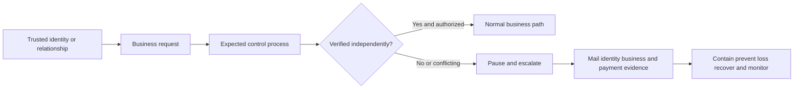
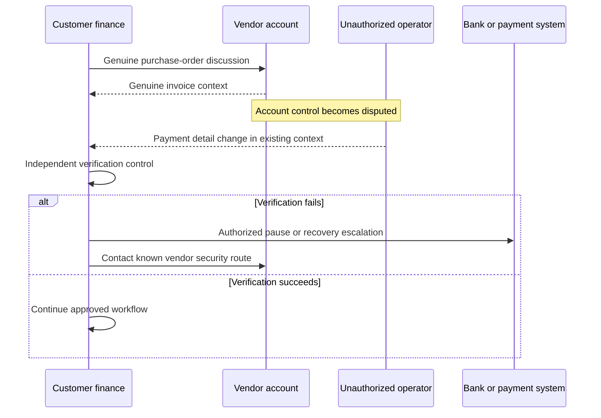
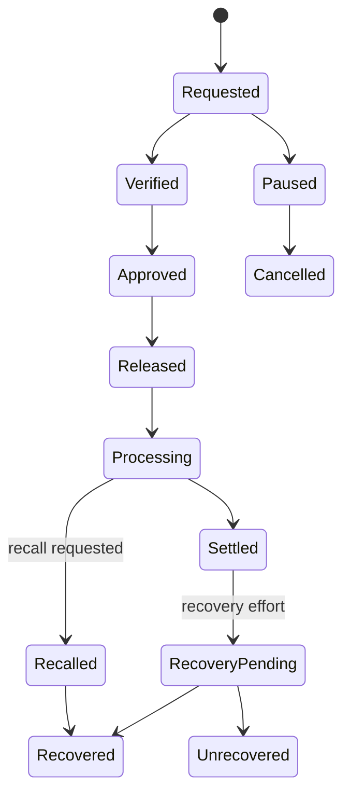
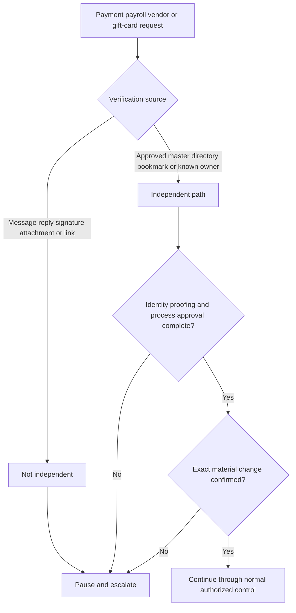
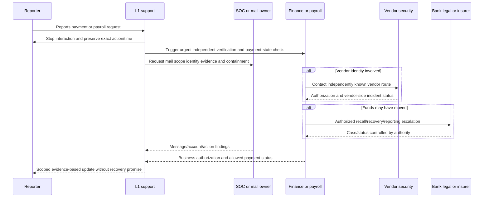
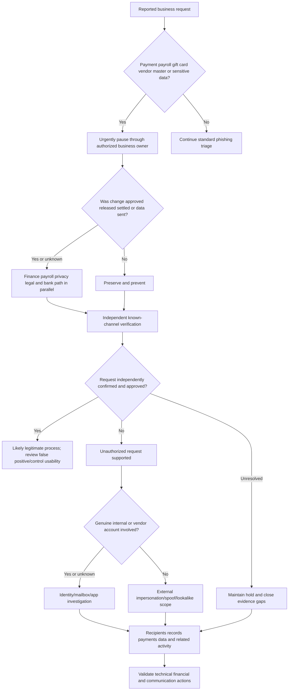
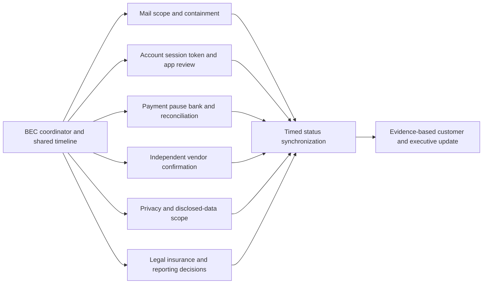
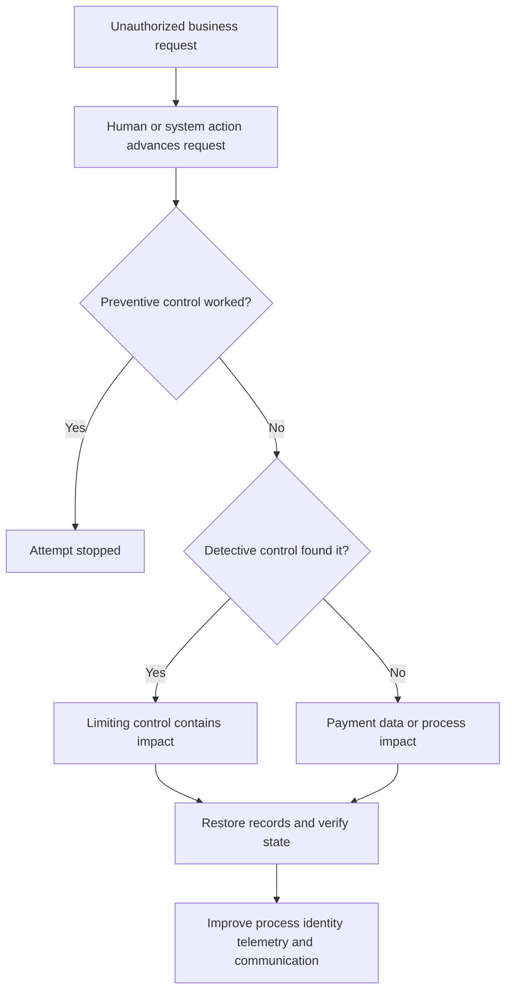

# Part 036 - BEC Vendor and Payment Fraud

## Purpose, Evidence, and Currency

**Business email compromise (BEC)** is a fraud pattern in which trusted business communication is impersonated or abused to make a person transfer money, change payment or payroll details, purchase valuable items, disclose information, or take another unauthorized business action. Despite the name, a confirmed technical compromise is not required in every BEC case. An attacker may use display-name impersonation, a lookalike domain, direct spoofing, a compromised internal mailbox, a compromised vendor mailbox, or a hijacked conversation.

BEC often contains no malicious file and no credential-capture site. Its payload is the business instruction. A perfectly authenticated message from a compromised vendor account can be dangerous. A poorly authenticated message may still be a legitimate but misconfigured invoice. Technical evidence and business-process evidence must be correlated.

This part covers invoice diversion, payroll redirection, gift-card fraud, executive requests, vendor compromise, and thread hijacking. It teaches **out-of-band verification**, meaning verification through a separate trusted path that does not depend on contact details or instructions supplied in the suspicious communication. The trusted path might be an established finance workflow, a number already stored in an approved vendor master, or an independently navigated internal directory. "Reply and ask" is not out of band if the mailbox is compromised.

The most important response boundary is:

$$
\text{Technical support evidence} \neq \text{financial or legal authority}
$$

An L1 support engineer can recognize urgency, preserve evidence, stop unsafe interaction, alert authorized owners, build a timeline, scope related messages, and validate technical actions. L1 should not approve payments, change vendor master data, promise fund recovery, contact banks as the company, file legal reports without authority, accuse a vendor or employee, or give jurisdiction-specific legal advice.

If money may have moved, time matters. The organization's authorized finance/fraud team and financial institution should be engaged immediately through established emergency channels. United States organizations may also use FBI/IC3 reporting according to policy and jurisdiction. A support ticket must never delay that path.

All cases and labs here are fictional, local, and harmless. They use `example.invalid`, invented amounts, inert metadata, and no transactions. Public vendor pages are cited only for attributed public statements; no private Abnormal AI logic or customer behavior is claimed.

## Section Goal

By the end of this part, you should be able to:

- Define BEC, invoice diversion, beneficiary change, payroll redirection, gift-card fraud, vendor compromise, conversation/thread hijacking, and executive fraud.
- Explain why BEC can occur without malware, links, or visible authentication failure.
- Separate impersonation from confirmed account compromise.
- Map a payment lifecycle from request through verification, approval, release, settlement, detection, recall, and reconciliation.
- Recognize control-bypass signals without treating them as proof alone.
- Verify requests out of band through independently known channels.
- Explain why contact details inside the suspicious message, thread, attachment, or linked site are not independent.
- Preserve email, identity, business, payment, user-report, and response evidence with minimal exposure.
- Build competing hypotheses for legitimate change, external impersonation, internal compromise, vendor compromise, and process error.
- Distinguish attempted fraud, exposure, prevented loss, confirmed loss, recovery initiated, recovery pending, and recovered funds.
- Trigger urgent loss-prevention and recovery escalation without promising outcomes.
- Respect finance, treasury, HR, payroll, legal, privacy, insurance, bank, and law-enforcement authority boundaries.
- Scope recipients, messages, vendors, payment records, accounts, and downstream actions safely.
- Produce a customer-safe BEC verdict and cross-functional escalation packet.
- Complete a synthetic case timeline/control review without sending mail, moving money, contacting anyone, or changing an account.

## JD Mapping

| Role responsibility or signal | Capability built here | Example support output |
|---|---|---|
| Triage high-impact email cases | Recognize business-process fraud even without payload | "The message requests a beneficiary change and bypasses the vendor-master workflow; finance verification is urgent." |
| Investigate behavioral verdicts | Combine identity, relationship, timing, content, and process context | Evidence matrix that does not rely on authentication alone |
| Own L1 escalation | Start parallel email, identity, finance, and vendor workstreams | One incident coordinator, explicit owners, deadlines, and asks |
| Communicate under pressure | State risk and uncertainty without promising recovery | "Finance has initiated the bank escalation; recovery status remains unknown." |
| Protect privacy | Minimize invoice, banking, payroll, and employee data | Redacted identifiers and secure evidence location |
| Support integrations and SaaS evidence | Correlate mail, identity, audit, and business-system records conceptually | Timestamped handoff with message, account, and transaction IDs |
| Validate response | Distinguish action requested, initiated, accepted, completed, and reconciled | Target-by-target technical and business validation |
| Transfer enterprise-support strength | Apply critical-situation ownership, stakeholder cadence, and evidence discipline | Honest transfer without claiming finance/SOC operations |

## Candidate Honesty Note

You can say:

> "My production experience is enterprise technical support, including critical-case coordination, timeline building, stakeholder updates, Engineering escalation, and fix validation. I have not owned a production BEC investigation, banking recall, vendor-fraud program, or Abnormal AI administration. I learned the fraud patterns from official sources and practiced a synthetic control-and-timeline exercise. In a live case I would immediately engage the authorized SOC and finance/fraud owners, preserve minimum evidence, and avoid making financial, legal, attribution, or recovery promises outside my role."

| Evidence tier | Honest example | Prohibited inflation |
|---|---|---|
| **Production transfer** | Critical support coordination and customer communication | "I recovered fraudulent funds" without real evidence |
| **Local/synthetic lab** | Fictional invoice-change timeline and control matrix | Presenting the exercise as a live incident |
| **Learned architecture** | Public BEC, mail, identity, payment-control, and response concepts | Claiming private product workflow or bank process |
| **No direct experience** | No production BEC, treasury, bank recall, or law-enforcement authority | Hiding the gap behind broad "security experience" |

## Evidence Labels Used in This Part

| Label | Meaning | BEC example |
|---|---|---|
| **[Observation]** | Directly preserved email, audit, business, or transaction fact | "The vendor-master record shows no approved change ticket." |
| **[User report]** | Person's account of what happened | "The analyst reports calling the number in the invoice." |
| **[Business confirmation]** | Authorized owner verifies process or request | "Treasury confirms the beneficiary was not approved." |
| **[Inference]** | Testable explanation | "The Reply-To change may have redirected verification." |
| **[Hypothesis]** | Proposed cause with predicted evidence | "If the vendor mailbox is compromised, the vendor may find unauthorized mailbox activity." |
| **[Conclusion]** | Supported judgment within scope | "The payment-change request was unauthorized; technical entry path remains unresolved." |
| **[Action state]** | Requested, approved, initiated, accepted, completed, failed, or reconciled action | "Recall requested by treasury; bank outcome pending." |
| **[Unknown]** | Missing or unavailable fact | "Settlement and recovery status are unknown." |

## Beginner Primer: BEC Is a Process Attack

Imagine a person who walks into a warehouse wearing a familiar supplier's uniform and presents a believable change form. The warehouse may use a real form and know the supplier. The decisive question is whether the change was authorized through the organization's control process.

BEC attacks communication and process trust:

| Layer | Question | Example evidence |
|---|---|---|
| Identity | Who sent or controlled the communication? | Raw message, trace, account audit, known vendor identity |
| Relationship | Is this sender-recipient relationship real and expected? | Communication history, contract owner, vendor record |
| Request | What changed or must happen? | Beneficiary, payroll account, gift card, payment timing |
| Process | Which control should validate it? | Dual approval, call-back, change ticket, vendor master |
| Action | What did the recipient do? | Reply, call, edit record, approve, release payment |
| Impact | Did value or data leave authorized control? | Payment/HR/finance record and bank confirmation |
| Recovery | Which authorized owner has initiated what? | Bank case, insurer/legal record, technical containment |

The warehouse analogy stops being accurate because a genuine account can be remotely controlled, messages can be copied or transformed, and financial systems have multiple authorization and settlement stages. Build a correlated timeline instead of relying on appearance.

## BEC Taxonomy

| Pattern | Requested outcome | Common identity path | Primary business owner |
|---|---|---|---|
| Invoice diversion | Pay a false beneficiary or account | Vendor impersonation/lookalike/compromise | Accounts payable, treasury, vendor management |
| Vendor-master change | Alter stored payment/contact details | Vendor account compromise or forged change | Procurement/vendor management plus finance |
| Payroll redirection | Change employee direct-deposit destination | Employee/executive impersonation or compromised account | HR/payroll plus identity/security |
| Gift-card fraud | Purchase cards and disclose codes | Executive/manager impersonation | Finance/procurement/security |
| Executive wire request | Initiate urgent transfer | Display name, spoof, lookalike, compromised leader | Treasury/finance plus executive office |
| Tax/PII request | Release employee/customer records | Executive/HR/legal impersonation | HR/privacy/legal/security |
| Real-estate/closing diversion | Change closing/wire instructions | Compromised party/thread | Legal/finance/transaction parties |
| Acquisition/confidential deal | Transfer funds or sensitive documents secretly | Executive/legal impersonation | Executive, legal, finance, security |

Patterns overlap. A vendor compromise can produce invoice diversion inside a real thread. A payroll request can be identity fraud and data exposure. Classification should state the requested outcome, identity path, account state, process bypass, and impact separately.

## Invoice Diversion

Invoice diversion manipulates where or how an invoice is paid. The invoice itself may be real, altered, recreated, or used only as context. The message may change beneficiary name, bank account, routing details, payment portal, remittance address, or contact information.

| Observation | Concern | Benign alternative | Verification |
|---|---|---|---|
| New beneficiary/account | Funds can be redirected | Vendor legitimately changed bank | Existing vendor-master process and known contact |
| Urgent overdue claim | Pressure reduces checking | Real overdue balance | Accounts-payable ledger and contract owner |
| New payment portal | Credential/payment diversion | Vendor migrated systems | Independently navigate from approved vendor record |
| Different Reply-To | Replies may be diverted | Ticketing/service configuration | Known sender workflow and raw headers |
| Changed invoice attachment | Account details altered | Corrected invoice | Compare approved purchase order and vendor confirmation |
| Familiar thread | Builds trust | Genuine conversation | Verify current request and participant account state |

The control is not "does the invoice look real?" It is "does the independently verified vendor record and approval process authorize this exact change and payment?"

## Payroll Redirection

Payroll fraud asks HR or payroll staff to change direct-deposit details. The message may present as an employee or executive. A legitimate employee can make a real change, so technical suspicion alone must not permanently block payroll access.

| Required question | Evidence owner | Privacy caution |
|---|---|---|
| Was a change requested? | Payroll/HR system | Do not place full bank details in tickets |
| Through which channel? | HR workflow/email trace | Preserve minimum identifiers |
| Was identity proofing completed? | HR/identity policy owner | Avoid sending sensitive challenge answers |
| Did the change take effect? | Payroll system | Restrict access to payroll evidence |
| Was payroll released? | Payroll/finance | State action stage precisely |
| Is account compromise suspected? | Identity/SOC | Keep HR and security evidence appropriately separated |

Do not instruct the employee to email new banking information as remediation. Use the organization's independently navigated HR/payroll process and identity proofing. HR and payroll own employee-facing and payment decisions; security owns relevant compromise response under policy.

## Gift-Card Fraud

Gift-card fraud often uses authority, urgency, secrecy, and a request to reveal card numbers/codes. The item is valuable because the code can transfer value without physical possession.

| Stage | Risk | Safe action |
|---|---|---|
| Request received | Social engineering attempt | Do not purchase; independently verify manager/process |
| Purchase initiated | Financial exposure | Contact authorized procurement/finance immediately |
| Cards purchased, codes not sent | Recoverability may remain | Secure cards/receipts; follow retailer/company procedure |
| Codes disclosed | Value may be redeemed quickly | Urgent finance/fraud, retailer, legal/law-enforcement process |
| Reimbursement requested | Secondary fraud/process issue | Preserve evidence and route to HR/finance |

Technical support must not promise a retailer will reverse value or independently contact a retailer using customer identity. The authorized organization owner handles recovery.

## Vendor Compromise and Thread Hijacking

A **vendor compromise** means an unauthorized actor controls or uses a vendor identity, account, token, application, or system. **Thread hijacking** means the actor inserts a malicious request into an existing conversation or a convincing copy of it.

The diagram is defensive and conceptual. It does not describe how to gain account access. It shows why thread continuity cannot substitute for independent confirmation.

| Thread signal | What it supports | What remains unknown |
|---|---|---|
| Real earlier messages | Relationship/conversation existed | Current operator's authorization |
| Same vendor domain | Domain/account may be genuine | Whether account/session is compromised |
| Authentication passes | Authenticated domain path | Intent, operator, payment authorization |
| Correct tone/format | Context may be copied or account genuine | Account control |
| Reply-To changes | Possible diversion | Legitimate service behavior versus abuse |
| New payment destination | Material process change | Authorization and loss state |

## 🔍 Plain-English deep-dive: A Real Thread Can Carry a False Instruction

Consider a paper folder containing months of legitimate correspondence. If someone gains access to the folder and adds one false page, the earlier genuine pages do not authenticate the new instruction. They only make it believable.

In email, a compromised mailbox can provide real names, amounts, cadence, attachments, and tone. A copied thread can imitate them. Therefore:

1. Preserve the whole minimum relevant timeline.
2. Identify the first changed instruction or identity field.
3. Separate conversation authenticity from current instruction authorization.
4. Verify material changes through an independently known process.
5. Ask the vendor's authorized security contact to investigate its side; do not demand or collect their unrelated private logs.

The paper-folder analogy stops being accurate because email metadata and account telemetry can reveal digital transitions, but those sources may belong to different organizations. Coordinate evidence without assuming control over the vendor's incident.

## Payment Lifecycle and State Precision

"Payment sent" is ambiguous. Financial systems and rails vary, but support communication needs stage precision.

| State | Meaning | Evidence owner | Do not say |
|---|---|---|---|
| Requested | Instruction exists | Email/business system | "Loss occurred" |
| Verified | Identity/process confirmed | Business owner | "Technically safe forever" |
| Approved | Required approver accepted | Finance system | "Bank received it" |
| Released | Organization submitted payment | Treasury/payment system | "Settled" |
| Processing | Rail/bank handling in progress | Bank/treasury | "Recovered" |
| Settled | Funds reached final/credited state under rail evidence | Bank/treasury | "Irrecoverable" without authority |
| Recall requested | Authorized owner asked bank/rail to return/stop | Treasury/bank case | "Recall succeeded" |
| Recovered | Authorized evidence confirms return | Treasury/bank/reconciliation | "Incident closed" before technical/business review |
| Unrecovered | Authorized evidence confirms recovery failed/closed | Treasury/legal/insurer | Speculation or blame |

Each payment rail has its own rules and timing. L1 should capture the organization's status exactly, not generalize from another case.

## 🔍 Plain-English deep-dive: "Recall Requested" Is Not "Money Recovered"

Ordering a package return does not mean the package is back in the warehouse. The carrier may not intercept it, the recipient may already have it, or another process may be required. A bank recall or fraud notification is similarly an initiated action with an outcome still pending.

Use action-state language:

| Unsafe statement | Customer-safe statement |
|---|---|
| "We recovered the payment" | "Treasury reports recovery confirmed and reconciliation pending" |
| "The bank froze it" | "Finance opened bank case X at 10:18 UTC; bank action is not yet confirmed" |
| "No loss" | "The request was paused before release; finance confirms no payment left the approved workflow" |
| "Funds are gone" | "Payment settled; authorized recovery and legal options remain with finance/bank/legal" |

The package analogy stops being accurate because payment rails, jurisdictions, counterparties, and fraud controls vary. Only authorized finance and banking evidence establishes financial state.

## Out-of-Band Verification

Out-of-band verification uses a trusted path independent of the suspicious communication.

| Verification path | Independent? | Reason |
|---|---:|---|
| Reply to suspicious message | No | Same mailbox/thread may be controlled |
| Call number in message/signature/attachment | No | Attacker may supply it |
| Use link/portal in message | No | Destination may be controlled |
| Call number already stored in approved vendor master | Usually, if record integrity is trusted | Predates and is independent of request |
| Open HR/finance system from bookmark/intranet | Yes, if route and account are trusted | Avoids message-supplied destination |
| Contact known relationship owner from internal directory | Usually | Uses established organizational source |
| Ask second approver through independent internal channel | Supports control | Must verify underlying external party too when required |

### Verification Checklist

- Identify the exact change or action.
- Retrieve contact/process information from an independent trusted source.
- Authenticate the person according to policy, not voice familiarity alone.
- Confirm old and new details without exposing full sensitive values unnecessarily.
- Record who verified, when, through which approved channel, and what was confirmed.
- Require dual control or segregation of duties where policy specifies it.
- Treat verification failure, avoidance, or pressure as escalation context, not standalone legal proof.

## Payment-Change Controls

Controls should prevent one message or one person from redirecting value.

| Control | Purpose | Failure mode | Validation evidence |
|---|---|---|---|
| Independent call-back | Confirm vendor/employee through known route | Number copied from suspicious request | Call record/process log using approved master |
| Dual approval | Require two authorized decisions | Both rely on same unverified message | Separate approvals with evidence |
| Segregation of duties | Separate request, edit, approval, release | One identity can complete all stages | Role/permission review and audit trail |
| Cooling-off period | Allow time for high-risk change review | Urgency exception bypass | Timestamped hold and exception approval |
| Vendor-master governance | Protect stored beneficiary/contact data | Informal email edit | Change ticket, owner, old/new metadata, review |
| Positive pay/payee validation | Bank-side or system matching | Coverage/rail limitation | Bank/treasury confirmation |
| Threshold escalation | Extra review for amount/risk | Attack stays below threshold | Risk-based controls beyond amount alone |
| Known portal | Keep changes out of email | Portal account compromised | Identity, MFA, audit, and workflow controls |
| Change notification | Alert old and new contacts | Alert channel also changed | Independent delivery and acknowledgment |
| Reconciliation | Detect mismatches after processing | Delayed review | Ledger/bank comparison and exception record |

An allowlist is not a payment control. A known vendor address can be compromised. Controls should validate the transaction and change, not merely permit the sender.

## Evidence Map

| Evidence family | Questions answered | Owner | Privacy/authority boundary |
|---|---|---|---|
| Raw message and trace | Identity fields, route, recipients, timestamps, provider actions | Mail/SOC | Minimize content and tenant identifiers |
| Authentication results | SPF/DKIM/DMARC path/alignment | Mail/SOC | Pass is not authorization |
| Identity/app/mailbox audit | Account, session, rule, forwarding, OAuth activity | Identity/SOC/vendor | Each organization owns its logs |
| User report | Exact interaction and visible request | Support/SOC | Neutral questions; no blame |
| Vendor master/contract | Approved identity/contact/payment details | Procurement/finance | Restrict financial data |
| Invoice/purchase order | Amount, goods, reference, due state | Finance/procurement | Redact banking/tax/customer data |
| Approval/payment audit | Request, edit, approval, release, settlement | Finance/treasury | L1 may receive status, not full record |
| Bank case/reconciliation | Recall/recovery outcome | Treasury/bank | Authorized owner communicates |
| Legal/insurance/reporting | Obligations and claims | Legal/risk/insurer | Need-to-know and privilege rules |

## Hypothesis Framework

| Hypothesis | Predicted evidence | Contradiction | Owner/test |
|---|---|---|---|
| External vendor impersonation | External/lookalike identity, no vendor-account event | Vendor confirms real authorized send | Mail evidence plus known vendor verification |
| Vendor mailbox compromise | Genuine vendor account/thread plus unauthorized request; vendor may see anomalous activity | Vendor confirms authorization and clean context | Vendor security owns its account evidence |
| Customer internal compromise | Internal submission/account activity or manipulated workflow | No internal source and external impersonation supported | Customer identity/SOC |
| Legitimate payment change | Approved contract/change ticket and independent confirmation | Vendor denies change; no approval | Finance/procurement workflow |
| Internal process error | Wrong record/template without malicious communication | Evidence of deliberate external diversion | Finance/process owner |
| Forwarded/transformed message | Header/thread transformation explains mismatch | Original evidence shows direct path | Mail owner/raw source |

Do not force technical entry-path certainty before taking loss-prevention action. "Unauthorized request confirmed; compromise path unresolved" is a valid conclusion.

## Investigation and Response Workflow

### Phase 1: Stop Further Action

- Do not reply, call message-supplied numbers, use message links, or send more data.
- Pause the business process through the authorized owner.
- If money may have moved, engage finance/treasury and the financial institution immediately through established channels.
- Do not wait for complete technical attribution.

### Phase 2: Preserve Minimum Evidence

Capture raw message/report ID, recipients, sender/Reply-To, Message-ID, UTC times, conversation reference, user actions, requested change, business record ID, and response actions. Redact bank accounts, tax identifiers, payroll data, and personal data in general support tickets.

### Phase 3: Establish Business Truth

Ask finance/payroll/procurement whether the request was expected, independently verified, approved, entered, released, settled, recalled, recovered, or reconciled. Support should not infer those states from email.

### Phase 4: Establish Technical Path

Classify external impersonation, lookalike/spoof, compromised internal account, compromised vendor account, or unresolved path. Check related messages and identity activity through authorized owners.

### Phase 5: Scope Impact

Identify recipients, responders, changed vendor/payroll records, approvals, payments, disclosed data, affected accounts, rules/forwarding/apps, and related variants. Scope both attempted and completed actions.

### Phase 6: Contain and Recover

SOC/mail owners contain messages; identity owners address accounts/sessions/tokens/apps; endpoint owners handle execution; finance/bank owners handle payment stop/recall; HR/payroll handles employee changes; privacy/legal/insurance/law enforcement handle their authorities.

### Phase 7: Validate and Learn

Validate each message action, identity action, vendor-master correction, payment state, notification, monitoring step, and preventive control. A bank case number is not recovery; a password reset is not complete session/token containment; a message-removal request is not completed removal.

## Troubleshooting Decision Tree

### Symptom-to-Test Matrix

| Symptom | Hypotheses | Cheapest safe discriminating check | Next action |
|---|---|---|---|
| New bank account in real thread | Legitimate change; vendor compromise; copied thread | Known vendor-master call-back and change ticket | Pause payment; vendor security/mail evidence |
| Employee asks to change direct deposit | Legitimate request; impersonation; employee compromise | Independently navigated HR proofing workflow | Payroll hold and identity path as needed |
| Executive asks for gift cards | Authorized event; impersonation; compromised account | Known executive-office/procurement confirmation | Do not purchase; scope recipients/account |
| Payment marked "sent" | Released, processing, settled, or colloquial misunderstanding | Treasury/payment-system state | Immediate bank/fraud path if exposure plausible |
| Vendor denies message | Vendor compromise, impersonation, misunderstanding | Preserve denial via known route and compare raw source | Technical scope plus finance containment |

## Worked Example 1: Invoice Diversion Prevented

### Inputs

- Synthetic vendor: `supplier-a@example.invalid`.
- Inert message requests a beneficiary change for invented invoice `INV-SYN-104`.
- Accounts-payable analyst notices the normal portal was not used.
- Analyst does not reply or change the record.
- Approved vendor master lists an independently stored contact.

### Reasoning

**[Observation]:** Material payment details are requested by email. **[Observation]:** No approved change ticket exists. **[User report]:** No action occurred. H1 is external impersonation; H2 is vendor compromise; H3 is legitimate but out-of-process change. Independent verification through the stored contact rejects the change in the fixture.

### Conclusion

> **Synthetic conclusion:** Unauthorized invoice-diversion attempt prevented before vendor-master edit or payment release. The technical identity path remains unresolved. Mail/SOC should scope related messages; vendor security should review its environment; finance should preserve the false request and validate no record changed.

### Control Learning

The analyst succeeded because the process required independent change verification, not because the message contained obvious mistakes.

## Worked Example 2: Payroll Redirection Entered but Not Released

### Inputs

- Inert message displays a fictional employee name from `employee-change@example.invalid`.
- Payroll clerk entered a synthetic destination change into a training table.
- A second approver stopped it before payroll release.
- No real account, bank data, or employee exists.

### Timeline

| UTC | Event | State |
|---|---|---|
| 09:10 | Message received | Request exists |
| 09:22 | Training record edited | Payroll data change entered |
| 09:30 | Second approver challenges missing proofing | Processing paused |
| 09:35 | Independent employee route rejects request | Unauthorized confirmed in fixture |
| 09:42 | Synthetic record restored | Corrective action complete |
| 10:00 | Identity hypothesis remains untested | Technical path unknown |

### Conclusion

> **Synthetic conclusion:** Unauthorized payroll-change attempt reached record-entry stage but was prevented before payroll release. This is not "no impact": an internal record changed temporarily and requires audit validation. HR/payroll owns employee communication and record correction; identity/SOC owns compromise assessment.

## Worked Example 3: Gift-Card Codes Disclosed

### Inputs

- Entirely invented scenario; no cards or codes exist.
- User says fictional codes were sent in a reply.
- Request displayed a manager identity and demanded secrecy.

### Response Reasoning

The action creates potential financial exposure in a real case. L1 thanks the reporter, stops further replies, captures approximate time and approved message evidence, and immediately engages finance/fraud and security. The retailer, bank/payment issuer, legal, insurance, and law-enforcement actions belong to authorized owners. Technical scope checks recipients and account state.

### Customer-Safe Status

> "Gift-card value exposure is reported; redemption and recovery are not established. Finance/fraud owns the retailer and financial recovery path. Security is scoping the message and account. We will not represent recovery until authorized evidence confirms it."

## Worked Example 4: Vendor Thread and Settled Payment

### Inputs

- Synthetic genuine thread history.
- Latest inert message changes beneficiary.
- Training payment table says `settled` at 12:00 UTC.
- Vendor's independently known contact rejects the change at 12:12 UTC.

### Response

1. Finance/treasury immediately opens the fictional bank recovery path.
2. Security preserves message and scopes recipients.
3. Vendor security is contacted through the established relationship.
4. Customer identity/mail evidence and vendor-owned evidence are investigated separately.
5. Legal/insurance/reporting owners assess obligations.
6. Status remains "settled; recovery pending," not "lost forever" or "recovered."

### Conclusion

> **Synthetic conclusion:** Confirmed unauthorized payment diversion with a settled fictional payment. Vendor-account compromise is plausible but not proven by thread authenticity. Financial recovery and legal attribution remain outside L1 authority.

## 🔍 Plain-English deep-dive: Prevented Loss, Confirmed Loss, and Recovery Are Different

An attempted theft can be serious even if a locked door stops it. A door opened briefly without property leaving is different from property leaving. A return request is different from property arriving back.

| Case state | Correct label | Evidence |
|---|---|---|
| Request blocked before record/action | Attempted fraud, prevented | Business workflow plus no downstream action |
| Record changed but payment stopped | Process impact, loss prevented | Audit correction plus no release |
| Payment released/settled | Confirmed financial exposure/loss state per finance | Treasury/bank evidence |
| Recall submitted | Recovery initiated | Bank/treasury case |
| Funds returned and reconciled | Recovery confirmed | Bank and ledger reconciliation |

The locked-door analogy stops being accurate because financial exposure can involve fees, data disclosure, reporting, operational disruption, and residual account compromise even when money returns. Close each workstream separately.

## Authority and Responsibility Boundaries

| Actor | Typical authority | L1 relationship |
|---|---|---|
| SOC/mail security | Message containment, threat scope, security coordination | Provide evidence, ask, and validate status |
| Identity team | Account/session/token/app containment | Escalate exact account/timeline; do not self-administer |
| Finance/treasury | Payment pause, recall, reconciliation, bank contact | Trigger urgently and report only allowed status |
| HR/payroll | Employee identity process, payroll records, communication | Route payroll cases; minimize sensitive data |
| Procurement/vendor management | Vendor master, known contacts, supplier process | Use approved independent verification |
| Vendor security | Vendor-owned account investigation | Coordinate through established route; respect boundary |
| Legal/privacy/compliance | Legal obligations, privilege, notification, regulator | Preserve and follow instruction; no legal advice |
| Insurance/risk | Policy notification and claim process | Provide authorized evidence package |
| Bank/payment provider | Rail-specific stop/recall/recovery | Contacted by authorized finance/customer owner |
| Law enforcement/IC3 | Official reporting/investigation | Organization/legal decides filing and content |

### Do Not Cross These Lines

- Do not call a bank and represent yourself as the customer's authorized finance officer.
- Do not file an IC3, police, regulator, or insurer report without organizational authority.
- Do not promise recovery or quote universal recovery deadlines.
- Do not contact a suspected actor or use their supplied details for verification.
- Do not accuse an employee/vendor or publish attribution.
- Do not expose full account numbers, payroll records, tax data, or privileged communication in ordinary tickets.
- Do not change vendor, payroll, identity, or mail settings as a diagnostic experiment.

## Customer Communication Templates

### Immediate High-Risk Update

> "This request could affect payment/payroll value. Please stop further processing and do not use contact details from the message. Engage the authorized finance or payroll emergency process and financial institution now if value may have moved; technical investigation should not delay that action. Security is preserving and scoping the message. Please provide the allowed payment state only: not entered, entered, approved, released, processing, settled, recall requested, or recovered."

### Vendor Coordination Message

> "Through our established vendor contact route, we are asking you to confirm whether the specific payment-change request at [UTC time/reference] was authorized. Please do not send unrelated mailbox content or secrets. Your security team retains ownership of vendor-side account evidence. We will share the minimum indicators and coordinate findings through the approved incident contacts."

### Recovery-Pending Update

> "Treasury reports the payment as settled and the bank recovery process as initiated under case [redacted reference]. Recovery is not yet confirmed. Mail containment and identity investigation are running in parallel. The reviewed email scope is [recipients/time/systems]; vendor-account status remains owned by the vendor's security team. Next update: [time]."

### Prevented-Loss Resolution

> "The unauthorized request was stopped before payment release. Finance confirms no value left the approved workflow, and the attempted vendor-master change was either not entered or fully reversed and audited. Security validated containment for the identified messages. The technical sender path is [supported/unresolved], and preventive actions are assigned with owners."

## Parallel Workstreams During a High-Risk BEC Case

Serial investigation is too slow when value may be moving. Workstreams can proceed in parallel under one incident coordinator while preserving authority boundaries.

| Workstream | Immediate question | Deliverable | Dependency |
|---|---|---|---|
| Mail/security | Which messages, recipients, verdicts, and actions exist? | Scoped message/action table | Raw IDs, provider access, time range |
| Identity | Did a genuine customer account participate or become exposed? | Account hypothesis and containment status | Account IDs, interaction time, audit coverage |
| Finance/treasury | What exact payment state exists now? | Allowed financial state and bank-case status | Payment reference, authorized officer |
| Vendor | Was the request authorized and is vendor account risk known? | Independent confirmation and coordination owner | Known contact route, vendor authority |
| Data/privacy | What sensitive information was disclosed? | Data-category/scope assessment | Minimum content, policy and jurisdiction |
| Legal/insurance | Which notification, privilege, claim, or report decisions apply? | Controlled decision/status | Authorized counsel/risk owner |
| Communication | Who needs which information and when? | User, customer, executive, vendor updates | Approved facts and disclosure boundaries |

### Synchronization Rules

- Maintain one normalized UTC timeline; do not merge evidence by copying secrets into a broad ticket.
- Assign each claim an owner and source.
- Distinguish request, approved action, initiated action, completed action, and validation.
- Set an update cadence based on impact, not on whether every workstream has a final answer.
- Record conflicting facts rather than smoothing them into a premature narrative.
- Keep financial recovery status controlled by finance/treasury.
- Keep legal/reporting statements controlled by Legal or the designated authority.
- Close each branch explicitly; a technically contained mailbox does not close financial recovery.

## Financial Recovery Escalation Packet

The packet should help authorized finance/legal teams act quickly without exposing unnecessary message content.

| Packet field | Minimum content | Why it matters |
|---|---|---|
| Organization incident reference | Internal case ID | Correlates teams without exposing data |
| Payment state | Entered/approved/released/processing/settled | Determines urgency and owner |
| Payment reference | Redacted or secure-channel identifier | Lets treasury locate the transaction |
| Amount/currency | Only through approved channel | Determines transaction and insurance context |
| Beneficiary delta | Old/new values redacted in support view | Establishes material change |
| Discovery time | UTC plus original time zone | Recovery timeline |
| Bank contact time/case | Authorized finance-owned status | Shows escalation, not success |
| Request evidence | Secure raw-message reference and summary | Preserves fraud context |
| Verification evidence | Known-channel rejection/confirmation | Establishes authorization status |
| Technical status | Message/account containment and gaps | Shows ongoing security risk |
| Data exposure | Categories, not unnecessary content | Routes privacy/legal |
| Explicit ask | Pause, recall, trace, legal decision, insurer notice | Prevents vague handoff |

### Evidence Packaging Boundaries

Do not place full bank-account numbers, card codes, employee banking data, tax IDs, credentials, tokens, privileged legal advice, or full mailbox content into a general ticket. Use the organization's secure evidence path and provide a manifest/reference. Redaction should preserve correlation, such as last four characters only when policy permits.

## Root Cause, Trigger, and Control Failure

A BEC post-incident review should not declare "the user clicked" or "vendor was hacked" as the root cause without evidence. Separate layers:

| Layer | Question | Synthetic example |
|---|---|---|
| Threat event | What unauthorized communication/action occurred? | False beneficiary-change request |
| Entry path | How did it reach the process? | External impersonation or compromised vendor account, unresolved |
| Trigger | What event advanced impact? | Vendor record edited |
| Preventive control | What should have stopped the request? | Independent call-back before edit |
| Detective control | What noticed the issue? | Second approver found missing proofing |
| Limiting control | What reduced blast radius? | Payment release separated from record edit |
| Recovery control | What restored state? | Vendor record rollback and audit |
| Contributing condition | What made the error more likely? | Urgent backlog, unclear procedure, stale contact record |

Blameless analysis asks why the system allowed one persuasive message to reach a material stage. Useful improvements include clearer workflows, protected vendor records, reliable contact data, dual control, alerts, and staff support. Training alone is rarely a complete corrective action.

## Preventive Architecture: People, Process, and Technology

| Layer | Preventive measure | Detective measure | Response measure |
|---|---|---|---|
| People | Role-specific awareness and easy reporting | Neutral user interviews and trend analysis | Blame-free coaching and targeted support |
| Process | Independent verification, dual approval, segregation | Approval exceptions and reconciliation | Pause, rollback, bank/vendor escalation |
| Mail | Authentication, impersonation controls, behavioral/contextual detection | User reports, trace, campaign search | Quarantine/removal and feedback |
| Identity | MFA, least privilege, app controls, session protection | Sign-in, token, mailbox, app audit | Revoke/reset/app action under authority |
| Finance system | Protected vendor master and role separation | Change alerts and payment anomaly review | Hold/recall/reconcile |
| Vendor governance | Known contacts and security clauses | Periodic confirmation and incident channel | Coordinated customer/vendor response |
| Data/privacy | Classification and minimum sharing | DLP/audit and disclosure review | Containment, notification decision, monitoring |

### Control Design Questions

1. Can one email cause a beneficiary or payroll change?
2. Can one person request, enter, approve, and release it?
3. Is verification contact data protected from the same change path?
4. Is the exact changed value confirmed, not merely "did you email us?"
5. Are high-risk exceptions visible and time-limited?
6. Can finance rapidly state whether a payment is entered, released, or settled?
7. Are bank, vendor-security, legal, insurer, and SOC contacts pre-established?
8. Can response actions be validated and rolled back?
9. Does user reporting receive fast, non-blaming feedback?
10. Are false positives handled narrowly without allowlisting trusted accounts broadly?

## Worked Example 5: Legitimate Change, Security False Positive

### Inputs

- Synthetic vendor submits a change through the approved fictional portal.
- A portal notification email is sent from an unfamiliar but documented service address under `service.example.invalid`.
- Mail security flags the message because the relationship is new.
- Vendor-master ticket, dual approvals, and independently stored contact all confirm the change.
- No message link is used; the analyst independently opens the known portal.

### Reasoning

The unusual sender relationship and material topic justified review. However, business authorization, approved portal workflow, dual approval, and independent confirmation support legitimacy. The security verdict is an input, not proof of fraud.

### Conclusion

> **Synthetic conclusion:** Legitimate vendor change confirmed through the approved process. Treat the message verdict as a false positive within this scope. Any tuning should be narrow, reversible, and tested so a future lookalike or compromised vendor is not broadly allowed.

This case matters because aggressive fraud prevention that blocks all unfamiliar notifications can disrupt vendors and teach users to bypass controls. The answer is not a broad sender allowlist; it is precise understanding of the service, identity, recipients, process, and expected behavior.

## Worked Example 6: Data Disclosure Without Payment

### Inputs

- Inert executive-impersonation message requests a fictional payroll summary.
- Recipient replies with invented employee counts but no real personal data.
- No payment change occurs.

### Reasoning

BEC can seek information that enables later fraud. In a real case, disclosed data categories, recipients, downstream use, identity state, and privacy obligations must be assessed. "No money moved" does not mean "no impact."

### Conclusion

> **Synthetic conclusion:** Attempted executive impersonation resulted in a fictional information disclosure but no payment action. Security scopes the messages and account; HR/data owner and Privacy assess the disclosure category; Legal controls notification decisions. The case is not classified as financial loss, but it remains a BEC/data-risk incident pattern.

## Monitoring After Containment

Recovery is not complete when the triggering message is removed. Monitor proportionately for recurrence and unresolved persistence.

| Monitoring surface | Question | Owner | End condition |
|---|---|---|---|
| Mail campaign | Are variants continuing? | SOC/mail | Agreed quiet period plus control review |
| Internal identity | Are suspicious sessions/rules/apps/actions continuing? | Identity/SOC | Containment validated and monitoring window complete |
| Vendor relationship | Are new payment/contact requests appearing? | Vendor management/finance | Vendor/customer incident coordination completed |
| Vendor master | Are unauthorized edits recurring? | Procurement/finance | Corrected record and access/process review |
| Payment/reconciliation | Are related payments or exceptions present? | Treasury | Reconciled authorized status |
| User/data | Are follow-on social engineering or disclosures reported? | SOC/privacy | Scoped monitoring/notification plan complete |
| Detection quality | Were false negatives/positives identified? | Security/product owner | Feedback/tuning validated with rollback |

Do not promise "the attacker is gone" based on one quiet period. State exactly what was monitored, for how long, with which telemetry, and what remained outside visibility.

## Safe Synthetic Lab: The Beneficiary-Change Control Room

### Objective

Build a single local, synthetic incident artifact for a fictional vendor payment-change case. Reconstruct the request-to-recovery timeline, classify BEC pattern and identity hypotheses, map controls, create parallel owner actions, and write customer updates. No message, transaction, account, domain, QR code, file, bank, vendor, or external service is used.

The unique lab name is **The Beneficiary-Change Control Room**.

### Prerequisites

- Local Markdown editor or spreadsheet.
- Offline study folder.
- Only the inert fixtures below.
- Reserved `example.invalid` identities.
- Invented references and last-four placeholders such as `SYN-0042`; never real account numbers.
- No mail tenant, bank portal, payment service, HR system, vendor contact, scanner, browser navigation, API, or production access.

### Authorized scope

Authorized:

- Copy the synthetic event rows and classify them.
- Build a timeline, hypothesis ledger, control matrix, owner map, and communication set.
- Label every artifact **local/public lab - synthetic only** or **template only**.
- Rehearse an escalation verbally.

Not authorized:

- Send/reply/forward a message or contact a vendor, bank, employee, police, IC3, insurer, or regulator.
- Create or move money, gift cards, payroll, bank details, beneficiary records, domains, accounts, applications, or tokens.
- Visit/resolve/scan any destination, generate realistic lures, or use real invoice/payment data.
- Claim that a financial or platform action occurred.

### Synthetic event fixture

| UTC | Event | Source label |
|---|---|---|
| 09:00 | `supplier-a@example.invalid` fictional invoice thread exists | Synthetic business history |
| 09:12 | Inert request changes beneficiary to placeholder `SYN-0042` | Synthetic message |
| 09:20 | Analyst edits fictional vendor table | Synthetic audit |
| 09:31 | Second approver pauses release | Synthetic approval log |
| 09:38 | Independently stored vendor contact rejects change | Synthetic business confirmation |
| 09:42 | SOC begins message scope | Synthetic security event |
| 09:48 | Fictional vendor record restored | Synthetic audit |
| 10:05 | Payment system confirms no release | Synthetic finance confirmation |
| 10:20 | Vendor security hypothesis remains unresolved | Synthetic case note |

### Steps

1. Create one document titled `Beneficiary-Change Control Room` and label it `local/public lab - synthetic only`.
2. Record the authorization statement, exclusions, and exercise time in UTC.
3. Copy the event fixture exactly; do not add realistic payment instructions.
4. Create a normalized timeline with source, actor/owner, event, state change, and confidence.
5. Classify the case across social technique, identity path, BEC pattern, process impact, financial state, and technical uncertainty.
6. Build at least four hypotheses: external impersonation, vendor compromise, legitimate change, and internal process error/transformation.
7. Add supporting, contradicting, and predicted evidence for every hypothesis.
8. Assign safe production tests to mail/SOC, vendor security, finance/procurement, and identity owners. Mark them `not performed - synthetic lab`.
9. Map the payment lifecycle and prove why `no release` is not the same as `no process impact`.
10. Identify which controls prevented loss and which control failed or was delayed.
11. Build a RACI-style owner table for message containment, account investigation, vendor verification, record restoration, payment confirmation, customer update, and lessons learned. RACI means responsible, accountable, consulted, and informed.
12. Write an immediate update, vendor coordination request, prevented-loss resolution, and executive summary.
13. Add one alternate branch where the payment state is `settled; recovery pending`. Do not simulate bank contact or promise an outcome.
14. State legal/financial authority boundaries explicitly.
15. Review every artifact for real data, unsafe actions, unsupported attribution, and implied production experience.

### Expected evidence

- One nine-event UTC timeline with provenance labels.
- One multidimensional BEC classification.
- Four hypotheses with supporting, contradicting, and predicted evidence.
- A payment-state diagram/table from request through no-release, plus a recovery-pending alternate branch.
- A control matrix covering independent verification, dual approval, vendor master, audit, and reconciliation.
- A cross-functional owner table.
- Four customer-safe communications.
- An explicit statement that technical path and vendor account state can remain unresolved even when the request is confirmed unauthorized.
- No live messages, links, domains, vendors, employees, transactions, banking, payroll, gift cards, reports, account changes, scans, execution, or external contact.

### Cleanup and privacy

- Retain only the sanitized synthetic artifact if useful.
- Confirm all identities end in `example.invalid` and all financial values are placeholders.
- Remove any accidentally pasted real invoice, bank/payroll/account number, payment reference, employee/vendor identity, message, URL, IP, token, tenant, customer content, or legal record.
- Delete the artifact if reliable redaction is impossible.
- Do not upload it to a public scanner, AI service, bank, vendor, or reporting portal.
- Record that no communication, financial action, account action, or legal report occurred.

### Artifacts

| Artifact | Skill shown | Honest label |
|---|---|---|
| BEC timeline | Correlation and state precision | **Local/public lab** |
| Hypothesis ledger | Evidence-first fraud reasoning | **Local/public lab** |
| Payment/control matrix | Business-process understanding | **Learned architecture** |
| Owner/RACI map | Cross-functional coordination | **Template only** |
| Communication set | High-pressure customer safety | **Template only** |

### Validation rubric

| Dimension | Fail | Developing | Pass |
|---|---|---|---|
| BEC classification | Calls every case compromised email | Names fraud type only | Separates request, identity path, account state, process impact, financial state, and data risk |
| Verification | Replies/calls message details | Says call vendor | Uses independently stored route, proofing, exact-change confirmation, and audit record |
| Payment state | Says sent/recovered vaguely | Distinguishes sent and settled | Tracks requested, entered, approved, released, settled, recall requested, recovered, and reconciled |
| Hypotheses | Assumes vendor compromise | Lists alternatives | Uses four testable hypotheses with contradictions and separate owners |
| Response | Waits for technical proof | Escalates finance generally | Runs urgent finance/bank path in parallel with mail/identity/vendor evidence |
| Authority | L1 promises recovery/files reports | Mentions boundaries | Assigns finance, bank, legal, insurer, vendor, SOC, identity, HR, and law-enforcement authority precisely |
| Safety/privacy | Uses live financial data | Synthetic with weak minimization | Placeholders only, local/offline, no contact/change/transaction/report, explicit cleanup |
| Honesty | Claims live BEC handling | Calls it practice | Distinguishes production transfer, learned architecture, lab evidence, and no direct authority |

## 🔍 Plain-English deep-dive: Technical Certainty Must Not Delay Loss Prevention

If a fire alarm sounds in a warehouse, staff can stop a fuel transfer before investigators know whether the alarm came from fire, equipment failure, or sabotage. The protective action is justified by potential harm and reversibility.

Similarly, finance can pause a payment or change while security tests external impersonation, vendor compromise, or internal account misuse. The notes should say:

- **Observation:** a material payment change was requested.
- **Risk:** unauthorized release could create high impact.
- **Precaution:** finance paused processing under policy.
- **Investigation:** technical identity path remains open.
- **Conclusion:** authorization is confirmed or rejected through independent evidence.

The fire-alarm analogy stops being accurate because payment holds can disrupt legitimate business and relationships. Use policy, authorization, proportionality, communication, and fast verification. Precaution is not an accusation.

## Official Source Anchors

All sources were accessed on August 24, 2026 and must be revalidated for current guidance, jurisdiction, product behavior, and organizational policy.

| Official/public source | What it anchors |
|---|---|
| [FBI - Business Email Compromise](https://www.fbi.gov/how-we-can-help-you/scams-and-safety/common-frauds-and-scams/business-email-compromise) | Official public BEC patterns, prevention, and urgent response/reporting guidance |
| [FBI Internet Crime Complaint Center](https://www.ic3.gov/) | Official US cyber-enabled crime reporting portal and public alerts; organizational/legal authority still controls filing |
| [MITRE ATT&CK - Phishing, T1566](https://attack.mitre.org/techniques/T1566/) | Electronically delivered social engineering, targeted phishing, spoofing, compromised accounts, and thread abuse |
| [MITRE ATT&CK - Financial Theft, T1657](https://attack.mitre.org/techniques/T1657/) | Public adversary objective/impact framing for stealing financial resources |
| [NIST SP 800-61 Revision 3](https://csrc.nist.gov/pubs/sp/800/61/r3/final) | Risk-integrated incident response and coordination concepts |
| [NIST SP 800-86](https://csrc.nist.gov/pubs/sp/800/86/final) | Evidence collection, examination, analysis, and reporting concepts |
| [Microsoft - Threat hunting in Threat Explorer and Real-time detections](https://learn.microsoft.com/en-us/defender-office-365/threat-explorer-threat-hunting) | Current Microsoft email investigation, related-message hunting, remediation, permissions, and action-tracking concepts |
| [Microsoft - Anti-phishing policies](https://learn.microsoft.com/en-us/defender-office-365/anti-phishing-policies-about) | Current spoofing, impersonation, mailbox intelligence, policy, and authentication limitations |
| [Google Workspace Help - Investigate reports of malicious emails](https://knowledge.workspace.google.com/admin/security/investigate-reports-of-malicious-emails) | Current Google administrator message investigation and action concepts |
| [Federal Trade Commission - What To Do if You Were Scammed](https://consumer.ftc.gov/articles/what-do-if-you-were-scammed) | Public US consumer recovery/reporting guidance by payment type; enterprise owners still follow organizational and legal policy |
| [Abnormal AI - Email Security](https://abnormal.ai/products/email-security) | Public, attributable positioning on BEC, vendor compromise, invoice fraud, lookalikes, and behavioral context only; not private logic |

## Likely Interview Questions

### Q1. Does BEC always mean an email account was technically compromised?

**Model answer:** No. BEC is a fraud pattern that abuses business communication. It can use display-name impersonation, spoofing, a lookalike domain, a compromised internal or vendor account, or a copied/hijacked thread. I state the fraud request and identity path separately. "Unauthorized payment request confirmed; account compromise unresolved" can be an accurate conclusion.

### Q2. How do you verify a vendor payment change safely?

**Model answer:** I stop processing and use an independently known route, such as the approved vendor-master contact or established procurement workflow, not a reply, number, signature, attachment, or portal supplied by the message. The authorized owner authenticates the contact, confirms the exact old/new change, requires approvals, and records who verified what and when.

### Q3. Why can a real authenticated vendor thread still be dangerous?

**Model answer:** Earlier conversation authenticity does not prove the latest instruction is authorized. A vendor account can be compromised or history copied. SPF/DKIM/DMARC can pass for a genuine compromised account. I compare the first material change, raw message/trace, vendor-side confirmation through a known route, account evidence owned by each party, and finance process records.

### Q4. What do you do if a payment may already have been sent?

**Model answer:** I immediately trigger the organization's authorized finance/treasury fraud path and financial-institution contact; technical investigation must not delay it. I preserve message, user, payment, and timeline evidence and engage SOC/identity/vendor owners in parallel. I report exact state such as released, processing, settled, or recall requested and never promise recovery.

### Q5. What is the difference between prevented loss, confirmed loss, and recovery?

**Model answer:** Prevented loss means the unauthorized request did not cause value to leave, though a record/process may still have been affected. Confirmed exposure or loss requires finance/bank evidence that payment released or settled. Recall requested means recovery began, not that it succeeded. Recovered requires authorized confirmation and reconciliation.

### Q6. How would you handle a payroll-change request?

**Model answer:** I pause the change through HR/payroll, preserve the message, and use the independently navigated employee identity-proofing workflow. I determine whether the record changed and whether payroll released, while identity/SOC checks account/session risk if supported. I keep bank and employee data out of ordinary tickets and let HR/payroll own employee communication and payment decisions.

### Q7. What belongs in a BEC escalation packet?

**Model answer:** A concise summary; recipients and UTC scope; raw-message/trace references; requested change; user actions; business verification; vendor/account hypotheses; payment state; actions requested/authorized/completed; bank or legal case status only as allowed; data/privacy handling; gaps; owner; and explicit ask. I separate observation, conclusion, and unresolved entry path.

### Q8. What authority boundaries matter for L1 support?

**Model answer:** L1 can recognize urgency, preserve evidence, coordinate, communicate, and validate technical actions. Finance/treasury owns payments and bank recovery; HR/payroll owns employee changes; vendor security owns its accounts; identity/SOC owns containment; legal/privacy/insurance/law enforcement own reporting and obligations. I never promise recovery, file reports, accuse actors, or change financial records without authority.

## 🧠 30-Second Memory Hooks

- **BEC is a process-fraud pattern; compromise is one possible path.**
- **The business instruction can be the entire payload.**
- **Real thread does not mean current instruction is authorized.**
- **Authentication can pass for a compromised vendor.**
- **Verify the exact change through a pre-existing trusted route.**
- **Reply, signature number, attachment contact, and message link are not out of band.**
- **Payment change plus pressure means pause and verify.**
- **Technical investigation must not delay finance/bank escalation.**
- **Requested, entered, approved, released, settled, recalled, recovered, reconciled.**
- **Recall requested is not recovery confirmed.**
- **Prevented loss can still include process or data impact.**
- **Each organization owns its account evidence.**
- **Finance, HR, legal, bank, insurer, and law enforcement keep their authority.**
- **L1 coordinates and validates; L1 does not promise or adjudicate.**
- **Synthetic controls demonstrate learning, not live fraud handling.**

## Completion Checklist

- [ ] I can define BEC without assuming technical compromise.
- [ ] I can distinguish invoice diversion, vendor-master change, payroll, gift-card, executive, and data-request patterns.
- [ ] I separate impersonation, internal compromise, vendor compromise, and legitimate-change hypotheses.
- [ ] I can explain why an authenticated real thread may still carry an unauthorized instruction.
- [ ] I know what makes verification genuinely out of band.
- [ ] I never use contact information supplied in the suspicious communication for verification.
- [ ] I can map request, entered, approved, released, processing, settled, recall, recovery, and reconciliation states.
- [ ] I can distinguish prevented loss, process impact, confirmed financial exposure, and recovery.
- [ ] I trigger finance/treasury/bank escalation immediately when value may have moved.
- [ ] I do not delay loss prevention for technical attribution certainty.
- [ ] I collect minimum mail, identity, business, payment, and user evidence with provenance.
- [ ] I can scope recipients, variants, vendor/customer accounts, changed records, payments, and data.
- [ ] I respect vendor ownership of vendor-side logs and investigation.
- [ ] I respect finance, HR, legal, privacy, insurance, bank, and law-enforcement authority.
- [ ] I can write a customer-safe BEC verdict without accusation or recovery promise.
- [ ] I can describe the Beneficiary-Change Control Room and its synthetic artifacts.
- [ ] I used no live communications, transactions, banking, payroll, gift cards, accounts, domains, scans, reports, or changes.
- [ ] I label production transfer, learned architecture, synthetic practice, and direct-experience gaps accurately.
- [ ] I reviewed official sources and recorded August 24, 2026 as the access date.

[Next: Part 037 - Credential Phishing Malicious Links and QR Phishing](Part-037-credential-phishing-malicious-links-and-qr-phishing.md)