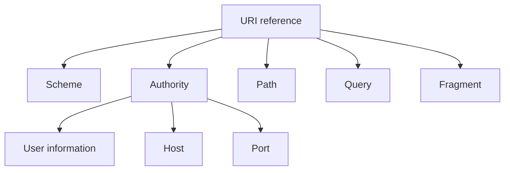
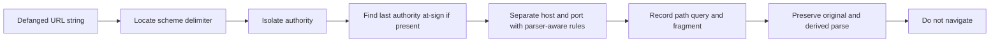
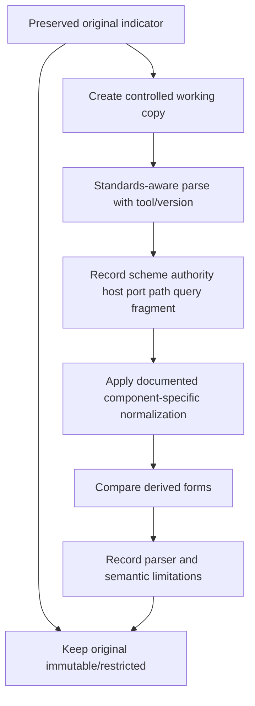
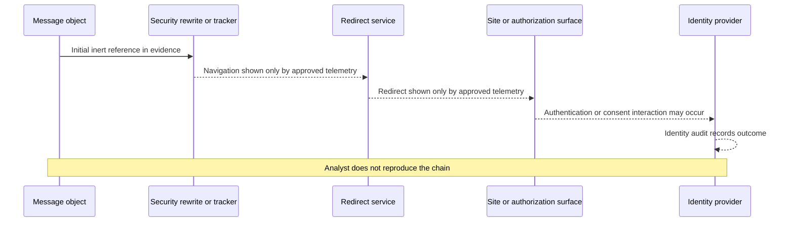
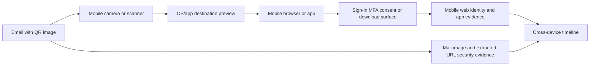
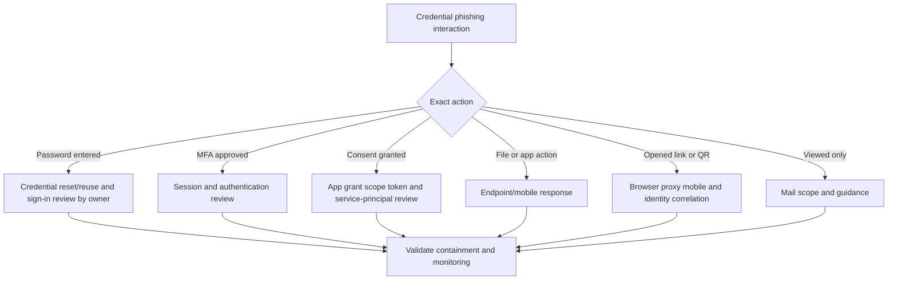
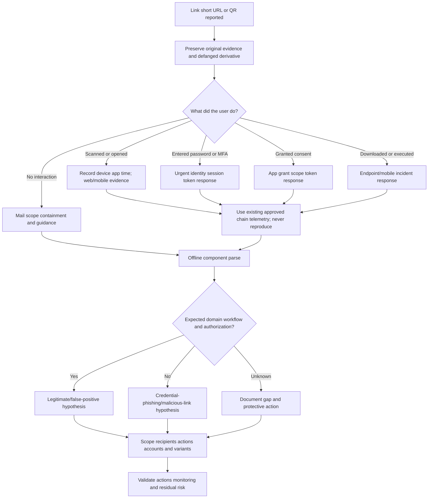

# Part 037 - Credential Phishing Malicious Links and QR Phishing

## Purpose, Evidence, and Currency

**Credential phishing** uses social engineering to make a person disclose authentication information or authorize access. The requested action may involve a username/password form, a session, a multi-factor authentication (MFA) approval, an OAuth consent screen, a device-code flow, or another identity interaction. The message may carry a direct link, a chain of redirects, a shortened link, an image containing a Quick Response (QR) code, or instructions to navigate elsewhere.

A link is not just the blue text shown in a message. A Uniform Resource Identifier (URI) is structured data. A Uniform Resource Locator (URL) is a URI that identifies a resource by access mechanism/location. The displayed words, underlying URL string, normalized representation, network destination, redirect chain, rendered page, and eventual identity action can differ. Each is a separate evidence layer.

This part teaches safe, defensive reasoning. It does not teach credential-page construction, phishing delivery, redirect evasion, QR generation, tracking, or bypass techniques. Never visit suspected content from a support workstation or personal device. Never expand a shortener, scan a QR code, execute script, submit credentials, approve MFA, grant consent, download content, or use a live account as a test. Preserve inert strings, defang them for human-readable notes, and use only authorized security telemetry or specialist tools operated under policy.

**Defanging** means modifying an indicator so ordinary software is less likely to make it clickable or resolvable, for example changing `https` to `hxxps`. Defanging is a communication safety measure, not analysis. It must be reversible only by authorized analysts under controlled procedures; support notes should not invite users to "refang and try."

The central model is:

$$
\text{Lure} \rightarrow \text{delivery object} \rightarrow \text{navigation chain} \rightarrow \text{site or authorization surface} \rightarrow \text{user action} \rightarrow \text{identity/session impact}
$$

A suspicious URL does not prove that credentials were entered. A click does not prove a compromise. A password reset does not necessarily invalidate existing sessions, refresh tokens, app grants, or stolen cookies. Response follows observed action and authoritative identity evidence.

Standards and provider behavior evolve. The official anchors were accessed on the stated date, but living web standards, browser behavior, identity platforms, and security products must be revalidated before production use. Public Abnormal pages are cited only for attributed public positioning, never private logic.

## Section Goal

By the end of this part, you should be able to:

- Define credential phishing, lure, visible link text, underlying URL, redirect, landing page, authorization surface, session, token, shortener, QR phishing, and defanging.
- Draw the complete lure-to-identity-impact chain.
- Parse a URL into scheme, authority, user information, host, port, path, query, and fragment without navigating.
- Identify the registrable-domain concept, subdomains, and why reading left-to-right can mislead.
- Explain percent-encoding, case, default ports, trailing dots, Unicode, Internationalized Domain Names (IDNs), and Punycode at a conceptual level.
- Explain normalization as careful representation comparison, not permission to change semantics.
- Preserve both original and defanged indicators with provenance and access control.
- Recognize link-shortener and redirect uncertainty without expanding them personally.
- Explain QR phishing and the evidence gap created when a code moves the user to a mobile device.
- Distinguish link viewed, navigation attempted, page rendered, credentials entered, MFA approved, consent granted, token/session theft, and later account activity.
- Route identity, session, token, application, browser, mobile, endpoint, and mail evidence to authorized owners.
- Explain why password reset alone may be insufficient after session/token or application exposure.
- Produce a safe response plan without live navigation, scanning, execution, sending, or account changes.
- Complete an inert local URL-structure lab and communicate its limitations honestly.

## JD Mapping

| Role responsibility or signal | Capability built here | Example support output |
|---|---|---|
| Triage malicious-link reports | Separate message, URL structure, chain, user action, and identity impact | "The message contains an inert shortened-link string; expansion and user interaction remain unknown." |
| Explain customer-visible threat evidence | Describe host/domain, redirect evidence, and identity behavior without exposing private logic | Structured URL annotation plus scoped confidence |
| Own L1 investigations | Gather exact action/time/device and route adjacent evidence | Mail, identity, browser/proxy, endpoint/mobile, and app owner matrix |
| Protect analysts and customers | Avoid navigation, QR scanning, credential tests, and public uploads | Defanged ticket evidence and approved-tool handoff |
| Handle false positive/negative reports | Compare expected service workflow and independently known destinations | Legitimate redirect versus malicious-chain hypotheses |
| Communicate clearly | Avoid saying "clicked means hacked" or "password reset fixed it" | State interaction and response stages precisely |
| Support Microsoft/Google ecosystems conceptually | Use official URL-click, email entity, identity, and investigation evidence concepts | Learned architecture, not claimed administration |
| Transfer networking/HTTP strengths | Apply URI parsing, DNS/TLS/HTTP layer reasoning safely | Inert parse and evidence plan without probing |

## Candidate Honesty Note

Arti can say:

> "My networking and HTTP upskilling helps me parse URL structure and reason about redirects, DNS, TLS, and browser boundaries, while my enterprise-support experience helps with scoping, evidence, communication, and escalation. I have not operated Abnormal AI or a production phishing sandbox/identity incident program. My hands-on proof is a local inert parsing lab only. I would never visit a suspicious URL, scan a QR code, submit test credentials, or change a live account; I would preserve the indicator and use the customer's authorized security and identity workflows."

| Evidence tier | Honest claim | Boundary |
|---|---|---|
| **Production transfer** | Evidence collection, critical-case ownership, customer updates, cross-team coordination | Does not become production malicious-link analysis |
| **Local/synthetic lab** | Manual parsing of reserved, defanged strings | No network, browser, resolver, QR reader, account, or scanner |
| **Learned architecture** | RFC/Unicode/provider identity and security concepts | No claim of tenant administration or vendor internals |
| **No direct experience** | No Abnormal, sandbox, mobile forensics, token-response, or SOC operations | State gap and route to authorized specialists |

## Evidence Labels Used in This Part

| Label | Meaning | Example |
|---|---|---|
| **[Original observation]** | Exact preserved indicator in restricted evidence | Original URL string in approved raw-message export |
| **[Defanged derivative]** | Human-safe representation linked to original | `hxxps://signin.example.invalid/review` |
| **[Provider observation]** | Mail, URL-click, identity, or action telemetry | "URL-click event recorded at 10:12 UTC" |
| **[User report]** | Person's account of action and page behavior | "User reports entering username but not password" |
| **[Inference]** | Testable interpretation | "The path resembles a sign-in pretext" |
| **[Hypothesis]** | Explanation with predicted evidence | "If credentials were used, identity logs may show subsequent activity" |
| **[Conclusion]** | Supported judgment within scope | "Credential submission reported; unauthorized sign-in not yet established" |
| **[Unknown]** | Missing link/redirect/action/telemetry fact | "Final destination is unknown and was not visited" |

## Beginner Primer: A Link Is an Address with Compartments

Think of a postal address: delivery method, building, unit, room, and notes. Reading only the first familiar word can send you to the wrong place. A URL has structured components that software parses according to standards and implementation rules.

Use this inert string:

```text
hxxps://analyst@portal.example.invalid:443/account/review?case=SYN-17#summary
```

It is deliberately defanged and uses the reserved `.invalid` top-level domain.

| Component | Inert value | Plain meaning |
|---|---|---|
| Scheme | `hxxps` (defanged representation) | Intended access scheme would be HTTPS in original evidence |
| User information | `analyst` | Optional authority subcomponent before `@`; not the host |
| Host | `portal.example.invalid` | Network-name portion in this fixture |
| Port | `443` | Explicit service port |
| Path | `/account/review` | Hierarchical resource path |
| Query | `case=SYN-17` | Data following `?`, often parameters |
| Fragment | `summary` | Client-side reference following `#`; generally not sent in an HTTP request |

The postal analogy stops being accurate because URL parsers apply encoding, base-URL, scheme, IDN, and browser rules; servers can redirect; JavaScript can navigate; and one host can serve many tenants. Manual parsing creates hypotheses, not a safe destination verdict.

```mermaid
flowchart LR
    Lure[Email or message lure] --> Object[Text link button image QR or attachment]
    Object --> Initial[Initial URL or authorization request]
    Initial --> Redirects[Zero or more redirects]
    Redirects --> Surface[Site download consent or sign-in surface]
    Surface --> Action[View enter approve grant download]
    Action --> Impact[Credential session token app endpoint or no impact]
    Impact --> Evidence[Mail web identity app and endpoint evidence]
```



## URL Structure from Zero Knowledge

RFC 3986 gives the generic syntax:

```text
scheme://authority/path?query#fragment
```

Not every URI contains every component. The authority can contain optional user information, host, and port.



| Component | Delimiter/context | Security investigation question | Caveat |
|---|---|---|---|
| Scheme | Before `:` | Which parser/protocol behavior is intended? | Non-HTTP schemes can invoke apps; do not test |
| Authority | After `//` where applicable | Which host and optional identity/port are parsed? | Familiar text before `@` can be user info |
| User information | Before `@` within authority | Is it visually distracting from actual host? | Legitimate use exists but is uncommon in web links |
| Host | Host portion | Which name/address is the actual authority target? | IDN, literals, trailing dot, parser behavior matter |
| Port | After host colon | Is a non-default service indicated? | Explicit default port may be equivalent in some contexts |
| Path | Hierarchical portion | Does it mimic a brand/process or carry opaque IDs? | Path ownership belongs to host, not words in path |
| Query | After `?` | Does it contain identifiers, destinations, tokens, or tracking data? | Sensitive; redact values while preserving structure |
| Fragment | After `#` | What client-side reference exists? | Usually not sent to server in HTTP request, but client code may use it |

### Parse the Authority, Not the Story

Consider this inert defanged string:

```text
hxxps://trusted-label.example.invalid@access.example.invalid/review
```

The host is `access.example.invalid`; text before `@` is user information. The example teaches structure only. Do not use it to construct or test deceptive URLs.



## Domains, Registrable Domains, and Subdomains

Domain labels are separated by dots. Name hierarchy reads from right to left, while humans often scan left to right.

For the reserved name `login.team.example.invalid`:

| Portion | Conceptual role |
|---|---|
| `invalid` | Reserved top-level domain in the fixture |
| `example.invalid` | Illustrative registrable-domain boundary for this reserved case |
| `team` | Subdomain label |
| `login` | More specific subdomain label |

In the real Domain Name System (DNS), determining a registrable domain is not always "last two labels." Public suffixes can contain multiple labels. Use an approved, current Public Suffix List-aware parser when that distinction matters. Do not invent a universal rule.

| Visual pattern | Correct question | Mistake to avoid |
|---|---|---|
| `brand.example.invalid` | Who controls `example.invalid` in this fixture? | Assuming leftmost `brand` owns the domain |
| `example.invalid.other.invalid` | What is the actual registrable boundary? | Stopping at familiar middle text |
| `login-example.invalid` | Is this one label, not a subdomain of `example.invalid`? | Treating hyphen as dot |
| `example.invalid.` | Does a fully qualified trailing dot normalize equivalently in context? | Dropping it without preserving original |
| Mixed case | Hostnames are generally case-insensitive in DNS | Lowercasing case-sensitive path/query blindly |

**Memory hook:** For host hierarchy, read dots from right to left; for trust, identify the registrable owner using a real parser/data set.

## 🔍 Plain-English deep-dive: Familiar Words Do Not Own the Host

A street named "Bank Headquarters Road" does not mean every building on it belongs to a bank. Words can appear in a subdomain, path, query, or user-information field without changing who controls the host.

| Inert location of familiar word | Example | Trust implication |
|---|---|---|
| Subdomain | `brand.example.invalid` | Controlled under `example.invalid` in fixture |
| Path | `site.example.invalid/brand/login` | Path words do not change host owner |
| Query | `site.example.invalid/?brand=login` | Parameter does not change host |
| User information | `brand@example.invalid` in authority context | Text before `@` is not the host |
| Visible anchor text | `Open Brand Portal` | Can differ from underlying URL |

The street analogy stops being accurate because web applications can delegate tenants and content, and a trusted cloud host can serve untrusted customer content. Host ownership is important context, not a complete safety verdict.

## URL Encoding and Representation

URL strings can represent characters through **percent-encoding**, written as `%` followed by hexadecimal digits. Encoding has legitimate uses. Multiple textual forms can sometimes represent related values, but decoding at the wrong layer or repeatedly can change interpretation.

| Concept | Plain meaning | Defensive rule |
|---|---|---|
| Percent-encoding | Represents a byte/character using `%HH` | Preserve original; decode only in an approved parser/workflow |
| Reserved character | Has structural meaning in URI syntax | Do not decode blindly into a delimiter |
| Unreserved character | Letters, digits, and limited punctuation allowed plainly | Some normalizations may replace equivalent encoding |
| Double encoding | Encoded percent/sequence interpreted at multiple layers | Do not repeatedly decode by hand |
| HTML entity | Markup representation, not URI percent-encoding | Separate extraction from URI parsing |
| Base URL resolution | Relative reference resolved against another URL | Need original document/base context; do not guess |

Manual string replacement is unsafe for canonical decisions. A standards-aware parser can expose components, but parser implementations and web-platform behavior can differ. Preserve the exact original, parser/tool/version, derived result, and limitations.

## Normalization Without Losing Evidence

**Normalization** creates a consistent representation for comparison. It is not permission to overwrite original evidence. Some transformations are safe only for specific components and schemes.

| Potential transformation | Often reasonable in constrained comparison | Danger |
|---|---|---|
| Lowercase scheme/host | Scheme and DNS host comparison | Lowercasing path/query can alter meaning |
| Remove default port | May compare `:443` with HTTPS default | Scheme-specific; preserve original port |
| Dot-segment removal | Standard path processing in applicable hierarchy | Can differ across parser/server layers |
| Percent-encoding normalization | Some unreserved encodings can be equivalent | Reserved characters/decoding layers alter structure |
| IDN conversion | Compare Unicode display and ASCII A-label forms | Display spoofing, library/version, policy |
| Trailing dot handling | DNS name may be fully qualified | Cookies/certificates/apps may behave differently |
| Fragment removal | HTTP server request generally excludes fragment | Client-side application may use it materially |



### Comparison Record

| Field | Value |
|---|---|
| Original evidence reference | Restricted artifact ID, not exposed string if sensitive |
| Defanged display | Ticket-safe derivative |
| Parser/tool and version | Approved tool identity |
| Parsed host | Derived value |
| Registrable-domain method | Approved Public Suffix List version/source |
| Unicode/ASCII forms | Both, if applicable |
| Transformations | Exact ordered list |
| Differences/unknowns | Semantic caveats |

Never treat normalization output as proof that two navigation chains are identical. Redirects, DNS, hosting, page content, and time can differ.

## IDNs, Unicode Confusables, and Punycode

The Domain Name System historically used ASCII. **Internationalized Domain Names (IDNs)** allow user-facing names with non-ASCII characters through standardized conversion. An **A-label** is the ASCII-compatible form and begins with the `xn--` prefix. The encoding mechanism is commonly associated with **Punycode**. A **U-label** is a valid Unicode label representation under IDNA terminology.

Unicode supports many writing systems. Some characters can look similar to others; these are **confusables**. Similar appearance does not mean identical code points, and a non-ASCII name is not inherently malicious. International users rely on legitimate IDNs.

| Observation | Correct interpretation | Unsafe leap |
|---|---|---|
| `xn--` label | ASCII IDN representation | "Automatically malicious" |
| Unicode display | Human-readable internationalized label | "Same as ASCII lookalike" |
| Mixed scripts | Contextual concern under policy | "Attacker confirmed" |
| Visually similar glyphs | Needs code-point/IDNA/confusable analysis | Manual visual comparison is sufficient |
| Browser shows ASCII form | Browser applied display policy | Safety verdict |

Use approved Unicode/IDNA libraries and preserve both forms. Record code points when needed. Do not hand-convert or create realistic lookalikes for practice.

## 🔍 Plain-English deep-dive: Punycode Is an Envelope, Not a Verdict

Imagine an international address transliterated into a format a legacy sorting machine can process. The transliteration is not suspicious; it is a compatibility mechanism. A malicious actor can abuse visual similarity, but legitimate people and organizations also need international names.

The defensible question is not "Does it start with `xn--`?" It is:

- What Unicode and ASCII forms does an approved IDNA library produce?
- Which code points/scripts are present?
- Is the name the independently expected organizational domain?
- Is the business workflow expected?
- What do authoritative mail, identity, and navigation telemetry show?

The envelope analogy stops being accurate because IDNA has validity, mapping, and display-policy rules that vary by standard/version/context. Use current official specifications and tested libraries.

## Redirect Chains

A redirect tells a client to navigate from one location to another. Redirects can come from HTTP status/Location headers, HTML, scripts, tracking systems, authentication systems, or user actions. Legitimate services use them extensively.

| Chain layer | Evidence source | Question |
|---|---|---|
| Visible text | Message render/screenshot | What did the user see? |
| Embedded URL | Raw message/MIME | What was encoded in the object? |
| Security rewrite | Provider evidence | Was the URL wrapped/replaced for protection? |
| Initial request | Secure web/browser/provider telemetry | What destination was requested and by whom? |
| Redirect response | Approved network/browser/sandbox telemetry | Which system directed the next hop? |
| Final rendered page | Approved analysis output/user report | What appeared at the observed time? |
| Identity action | Identity/app audit | What authentication/consent/session event occurred? |



A chain is time-sensitive. Content and redirects can change by time, region, device, identity, cookies, or scanner presence. State when evidence was observed and by which authorized source.

## Shortened URLs

A link shortener maps a compact URL to another destination. Shortening is common in legitimate marketing, mobile, and collaboration workflows. The compact string hides the destination from visual inspection.

| Question | Safe answer source |
|---|---|
| What short URL appeared? | Raw message/inert preserved text |
| Was it rewritten by mail security? | Provider message/URL evidence |
| What destination was observed? | Existing approved security telemetry, not analyst expansion |
| Did the user navigate? | Provider click, proxy/browser/mobile logs plus user report |
| What happened after navigation? | Identity/endpoint/app evidence |

Do not paste a suspected short link into a public expander. That can leak customer indicators, trigger tracking, alter content, notify an actor, or expose the analyst. If authorized tooling has already safely resolved it, preserve the tool, timestamp, chain, and limitations.

## QR Phishing

A QR code encodes data in an image. **QR phishing** uses a QR code to move the recipient toward a suspicious destination or action. It can shift navigation from a managed email client to a mobile device, where the visible URL and security coverage may differ.



| QR question | Why it matters | Safe evidence |
|---|---|---|
| Was a QR image present? | Establishes delivery object | Raw message/MIME/provider image analysis |
| Did security extract a URL? | Shows product-observed indicator | Provider evidence; do not scan manually |
| Did user scan it? | Moves impact path to mobile | Neutral user report and mobile telemetry |
| Which device/app? | Identifies evidence owner | Managed mobile/browser logs |
| Was preview shown or opened? | Separates scan from navigation | User report/OS telemetry where available |
| Were credentials/MFA/consent involved? | Determines identity response | Identity provider/app logs |
| Was a file/app installed? | Determines endpoint/mobile response | Mobile threat defense/endpoint owner |

Do not ask the user to rescan the code or send it through a personal messaging app. Preserve the original message through the approved route. Use provider-extracted evidence or an authorized isolated analysis team.

## Visible Text Versus Underlying Destination

HTML anchor text can differ from the `href` destination. Images and buttons can carry links. Plain text can be copied rather than linked. Security products can rewrite destinations.

| Layer | Example (inert) | What it proves |
|---|---|---|
| Visible text | `Open the known portal` | What user saw, not destination |
| Underlying href | `hxxps://review.example.invalid/` | Encoded target in preserved content |
| Rewritten URL | Defanged provider wrapper | Security-service transformation |
| Observed request | Provider/proxy event | A request occurred under event's attribution/coverage |
| Final page | Approved telemetry/report | Content rendered at a time/context |

"Hover to inspect" can be a useful user habit in some desktop clients, but it is not a complete control. Mobile clients, visual truncation, IDNs, redirects, rewrites, and compromised legitimate hosts can defeat visual judgment. Independent navigation to a known portal is safer.

## Interaction and Impact States

| State | Meaning | Immediate route |
|---|---|---|
| Message viewed | Content displayed | Report/preserve/scope mail |
| QR scanned, preview only | Device decoded data, no confirmed navigation | Record device/time; do not rescan |
| Link/preview opened | Navigation attempted | Browser/proxy/mobile evidence; identity watch |
| Page rendered | Content loaded | Determine page type and exact user actions |
| Username entered | Identifier disclosed | Identity owner; phishing exposure assessment |
| Password entered | Credential disclosed | Urgent identity response; reuse scope per policy |
| MFA approved/code entered | Authentication may have advanced | Urgent identity/session evidence and containment |
| Consent granted | Application may have permissions/tokens | App/service-principal audit and revocation path |
| Session/cookie stolen suspected | Existing authenticated state may be usable | Session/token containment and telemetry |
| File/app downloaded or executed | Endpoint/mobile risk | Endpoint/EDR/mobile response |
| No matching identity event found | One source found no event | State coverage; do not declare no compromise universally |

## 🔍 Plain-English deep-dive: A Click Is an Event, Not a Diagnosis

Opening a door does not tell you whether someone entered, handed over keys, signed a contract, or installed equipment. "Clicked" similarly covers several outcomes.

A customer-safe statement is:

> "The user reports opening the link at approximately 10:12 UTC on a managed mobile device. Credential entry, MFA approval, consent, download, and account activity are not yet established. We are correlating mail URL-click evidence with identity and mobile/browser telemetry."

Avoid:

- "Clicked, therefore compromised."
- "No suspicious sign-in, therefore safe."
- "Password changed, therefore contained."
- "The page was down when checked, therefore harmless."

The door analogy stops being accurate because a page can exploit software, steal a session, or trigger application authorization without a conventional password. Identity, browser, endpoint, and app evidence determines impact.

## Credential, Session, Token, and Consent Follow-Up

### Password Exposure

An authorized identity owner may require password reset, credential-reuse assessment, risk-based sign-in controls, account audit, and monitoring. Support should never collect the password or ask the user to enter it again.

### Session Exposure

A **session** is the server/client state that lets a user remain signed in. It may be represented by cookies or tokens. Changing a password does not universally revoke every active session immediately. Platform behavior and policy matter.

### Token Exposure

An **access token** authorizes resource access for a period. A **refresh token** can obtain new access tokens under applicable rules. Bearer-style tokens must be protected because possession can be sufficient to use them. Do not paste tokens into tickets.

### Consent/Application Exposure

An OAuth consent event can grant an application scopes to act on behalf of a user or organization. Password reset may not remove an application grant or invalidate every token. Application, service-principal, grant, scope, and audit evidence must be reviewed by the identity/SaaS owner. Part 041 goes deeper.

| Exposure | Why password reset may be insufficient | Adjacent action owner |
|---|---|---|
| Active session | Session may remain valid under platform policy | Identity owner revokes/validates sessions |
| Refresh token | Can mint new access under applicable policy | Identity/app owner revokes token/grant |
| Stolen cookie | Replays authenticated browser state | Identity/session controls and telemetry |
| Malicious app consent | Grant persists independently of password | App/service-principal consent owner |
| Mailbox rule/forwarding | Persistence/data diversion remains | Mail/identity administrator |
| Endpoint malware | New credentials/tokens can be stolen again | Endpoint/EDR owner |



## Safe Defanging and Evidence Handling

### Two-Copy Rule

Maintain:

1. The exact original in a restricted approved evidence store.
2. A clearly labeled defanged derivative for tickets/reports.

Do not overwrite the original. Record who created the derivative, when, and which transformations were applied.

| Original element | Example ticket transformation | Caveat |
|---|---|---|
| `https` scheme | `hxxps` | Not a standards-valid scheme; display only |
| Dot in host | `[.]` in some workflows | Can reduce readability and break structured tooling |
| Query secrets | Redact values, preserve parameter names if needed | Store exact original only in restricted evidence |
| User information | Preserve structure in restricted record | May contain sensitive credentials-like data |
| Long URL | Do not truncate the restricted original | Ticket can use artifact ID plus safe summary |

Defanging conventions vary. Follow the receiving team's documented format. A defanged string can still be copied and modified, so pair it with explicit "do not navigate" guidance.

## Evidence Map

| Evidence source | Answers | Limitations |
|---|---|---|
| Raw message/MIME | Visible/underlying links, QR image, headers | Does not prove navigation or final content |
| Mail security URL entity | Extracted/rewritten URL and verdict/action | Provider-specific logic and time |
| URL-click telemetry | Recorded click/navigation event | Automated scanners, attribution, coverage |
| Proxy/DNS/secure-web logs | Requests, resolution, block/allow | DNS does not prove page render; shared devices |
| Browser/managed mobile logs | Navigation/download/application behavior | Retention, privacy, device coverage |
| Identity provider | Authentication, MFA, session, token, consent events | Visibility depends on flow/platform |
| SaaS/app audit | Grants and resource actions | App/tenant boundaries |
| Endpoint/EDR/mobile defense | Download, process, file, network behavior | Sensor coverage and owner expertise |
| User report | What appeared and what user did | Recall under stress; corroborate neutrally |

## Investigation Workflow

```mermaid
sequenceDiagram
    participant U as User
    participant L as L1 support
    participant M as Mail security
    participant W as Web mobile or endpoint owner
    participant I as Identity or app owner
    U->>L: Reports link or QR message
    L->>U: Stop interaction; ask exact action device and time
    L->>L: Preserve message IDs and restricted original indicator
    L->>M: Request extracted URL rewrite click and campaign evidence
    M-->>L: Mail and URL observations
    alt Navigation or download possible
        L->>W: Request browser proxy mobile or endpoint evidence
        W-->>L: Navigation/download observations
    end
    alt Credential MFA session or consent possible
        L->>I: Trigger authorized identity/app investigation
        I-->>L: Sign-in session token grant and action status
    end
    L->>L: Correlate chain action scope confidence and gaps
    L-->>U: Scoped verdict completed actions and next step
```

### Phase 1: Stop and Preserve

- Do not navigate, rescan, expand, copy into a browser, or submit anything.
- Preserve raw message/report IDs and restricted original indicator.
- Record user device, application, action, timestamp, and time zone.
- Provide urgent identity/endpoint/mobile escalation when warranted.

### Phase 2: Parse Offline

Use a controlled copy and approved parser to identify components. Preserve parser/version. Treat unusual structure as a hypothesis, not proof.

### Phase 3: Obtain Existing Chain Evidence

Use provider URL entities, click records, proxy/browser telemetry, and authorized sandbox results already produced by approved systems. L1 does not reproduce the chain.

### Phase 4: Establish Exact User Action

Separate preview, open, render, identifier, password, MFA, consent, file, app, and later account behavior. Ask what happened once; never ask the user to repeat it.

### Phase 5: Scope

Search related messages, extracted URLs, QR detections, recipients, click events, identity/app actions, and downloads within authorized systems. Record automated scanner traffic separately from user traffic.

### Phase 6: Respond and Validate

Mail owners contain messages; web/endpoint/mobile owners address navigation/download; identity owners address credentials/sessions/tokens/apps; privacy/legal owners address data. Verify target-level completion and residual risk.

## Troubleshooting Decision Tree



### Symptom-to-Hypothesis Table

| Symptom | Hypotheses | Cheapest safe test | Next action |
|---|---|---|---|
| Familiar visible text, unrelated host | Deceptive anchor; legitimate tracking | Raw href plus expected workflow/provider evidence | Do not navigate; scope and verify independently |
| Short URL | Legitimate campaign; hidden phishing chain | Existing approved rewrite/click/security telemetry | Never use public expander |
| QR in invoice notice | Legitimate mobile workflow; QR phishing | Provider-extracted URL and business confirmation | Do not scan; ask exact mobile action |
| DMARC passes | Legitimate sender; compromised/authenticated malicious sender | Account/business context and identity evidence | Authentication is not safety verdict |
| User changed password | Credential only exposure; active session/token/app remains | Identity owner's session/token/grant validation | Do not close on reset alone |

## Worked Example 1: Visible Text and Underlying Host

### Inputs

- Visible synthetic text: `Open Example Portal`.
- Underlying inert string: `hxxps://review.example.invalid/account`.
- User viewed but did not open.
- No live system exists.

### Reasoning

The visible text does not establish destination. The host is `review.example.invalid` in the reserved fixture. The path word `account` does not change host ownership. No navigation or credential impact exists in the scenario.

### Conclusion

> **Synthetic conclusion:** Link-based credential pretext is represented, but content, redirect, and maliciousness are not proven by the inert string. Preserve, independently verify the expected portal, scope related recipients, and do not navigate.

## Worked Example 2: Shortened Link with No Click Evidence

### Inputs

- Synthetic message contains `hxxps://short.example.invalid/SYN17`.
- Provider fixture says URL was extracted but no destination resolution is included.
- User reports no interaction.

### Conclusion

> **Synthetic conclusion:** Final destination is unknown. The short URL creates uncertainty, not proof. No click or identity impact is found in the supplied fixture. Do not expand; use approved provider/security evidence if production investigation requires it.

## Worked Example 3: QR Scan and Password Entry

### Inputs

- Synthetic message contains a non-scannable placeholder `[QR IMAGE OMITTED]`.
- User-report fixture says a managed phone showed a sign-in page and the fictional user entered a password at 10:12 UTC.
- No actual credential, image, device, or page exists.

### Response

Identity response is urgent because password disclosure is reported. Mail scope and mobile/browser evidence run in parallel. The identity owner considers credential reset, sign-in/session/token/app review, and monitoring under policy. Support does not ask for the password or recreate the QR flow.

### Conclusion

> **Synthetic conclusion:** Credential disclosure is reported; unauthorized account use is not yet established. QR delivery moves evidence to mobile but does not change the need for authoritative identity correlation.

## Worked Example 4: Consent Instead of Password

### Inputs

- Synthetic user reports seeing a permission screen and selecting `Allow`.
- No application, tenant, URL, token, or live account exists.

### Reasoning

Password reset alone may not revoke an application grant or associated tokens. The identity/app owner must identify the application/service principal, publisher/tenant context, scopes, consenting identity, time, token/grant state, resource actions, and authorized revocation. Part 041 covers this deeply.

### Conclusion

> **Synthetic conclusion:** Possible malicious-consent exposure requires application and token investigation. Do not classify it as password theft unless evidence shows password disclosure.

## Worked Example 5: Legitimate Redirect Service

### Inputs

- Synthetic business record documents an approved notification service under `notify.example.invalid`.
- The service redirects to a known portal under `portal.example.invalid`.
- Provider fixture and independently known workflow agree.
- No credentials are requested until the independently navigated portal.

### Conclusion

> **Synthetic conclusion:** The redirect chain is expected within the fixture. If a security verdict flagged it, investigate false-positive scope carefully. Do not broadly allow every URL from a shared notification host; tune to the validated workflow and test rollback.

## Common Failure Modes and Unsafe Shortcuts

| Failure | Why it fails | Safer practice |
|---|---|---|
| Clicking to inspect | Exposes analyst and changes evidence | Use inert parse and approved telemetry |
| Public short-link expansion | Leaks indicators/triggers tracking | Authorized internal security tooling only |
| Scanning QR with personal phone | Moves risk outside controls | Provider extraction or specialist analysis |
| Refanging in ticket | Creates clickable dangerous content | Restricted original plus labeled defanged derivative |
| Splitting host by last two labels | Public suffixes vary | Approved Public Suffix List-aware parser |
| Lowercasing entire URL | Path/query can be case-sensitive | Component-specific documented normalization |
| Repeated percent-decoding | Can change delimiters/meaning | Approved parser, one documented pipeline |
| Calling `xn--` malicious | IDNs are legitimate | Compare Unicode/ASCII forms and context |
| Calling click compromise | Action and impact stages differ | Correlate identity/browser/endpoint/app evidence |
| Resetting password only | Sessions/tokens/grants/persistence may remain | Identity-owner full containment validation |
| Uploading raw URLs/messages publicly | Privacy and operational exposure | Approved private evidence store/tool |
| Treating current page state as historical truth | Destination can change | Timestamped existing telemetry |

## Customer Communication Templates

### No Interaction

> "Please do not open, copy into a browser, expand, scan, or otherwise interact with the link/QR code. Use the approved reporting method so the original message is preserved. We are reviewing the inert URL structure and existing security telemetry; no user interaction is currently reported."

### Navigation Reported

> "Thank you for reporting quickly. Do not reopen the page. Please provide the device/application, approximate time and time zone, and whether the page only displayed or you entered a username/password, approved MFA, granted consent, downloaded/opened a file, or installed anything. We are correlating mail, web/mobile, identity, and endpoint evidence."

### Credential/Session Response

> "Credential entry is reported, so the identity team is applying the approved response for credentials, active sessions, tokens, MFA, application grants, and account activity. A password reset alone is not being treated as complete containment. We will report each action only after validation."

### Scoped Resolution

> "The reviewed evidence supports credential phishing delivered through [link/QR] to [recipients] during [UTC interval]. [Exact interaction] is confirmed. Identity actions [states] were validated by the authorized owner. No matching [specific event] was found in [named source/scope]; activity outside that coverage remains a residual limitation."

## URL-Click Attribution and Automated Security Traffic

A recorded request to a URL does not always mean a human clicked it. Mail gateways, safe-link services, sandboxes, browser prefetchers, link-preview systems, collaboration clients, and security scanners can request content automatically. Conversely, a human navigation may be absent from one telemetry source because the device, browser, network path, privacy setting, retention window, or logging configuration was outside coverage.

| Request source possibility | Why it may request a URL | Clues | Caveat |
|---|---|---|---|
| Mail security scanner | Pre-delivery or time-of-click inspection | Provider scanner identity, timing near delivery, known user-agent/service fields | Scanner identity may be hidden or shared |
| Sandbox/detonation | Controlled behavior analysis | Analysis job/timestamp, provider chain, no associated user session | Tool behavior can differ from real user device |
| Link preview | Render title/image/snippet | Request immediately after message composition/display | Preview implementations vary |
| Browser prefetch | Performance optimization | Request before explicit page view | Browser and policy dependent |
| Human browser | User navigation | User/device/session correlation and UI report | Shared/NAT IP is not individual proof |
| Mobile app | QR or deep-link navigation | Device/app telemetry and identity context | Personal/unmanaged device may lack coverage |
| Security analyst | Authorized controlled analysis | Case/tool/job provenance | Must not be confused with victim activity |

### Attribution Questions

1. Which system recorded the event?
2. What does that event type mean in current provider documentation?
3. Which identity, device, browser, IP, session, message, and URL entity are associated?
4. Was the event before delivery, immediately after delivery, or near the user's reported action?
5. Does the source distinguish scanner, preview, and user traffic?
6. Is the timestamp normalized to UTC, and what clock skew is possible?
7. Did an identity, consent, token, download, or endpoint event follow?
8. What telemetry was not available?

| Evidence combination | Stronger interpretation | Remaining caution |
|---|---|---|
| URL-click event only | A platform recorded a click/request event | Human attribution and impact may be unresolved |
| User report plus matching device/browser event | Human navigation is better supported | Page content and credential action still separate |
| Navigation plus identity sign-in from same time/device context | Identity interaction is supported | Authorization and account-control outcome require review |
| Scanner event before delivery | Automated analysis likely | Does not exclude later user action |
| No click event plus user report | Telemetry coverage gap or source mismatch | Do not dismiss the user report |
| Click event after message removal | Delayed telemetry, another copy, or other path | Correlate message/user/device and event semantics |

### Correlation Timeline Template

| UTC time | Source | Actor/device attribution | Event | Confidence | Limitation |
|---|---|---|---|---|---|
|  | Mail delivery | Recipient/message ID | Delivered/held/removed |  |  |
|  | URL service | Scanner/user/unknown | Request/click/redirect |  |  |
|  | Browser/mobile | Device/app | Page/navigation event |  |  |
|  | Identity | User/app/session | Sign-in/MFA/consent/token |  |  |
|  | Endpoint | Device/process | Download/open/execute |  |  |

## 🔍 Plain-English deep-dive: Defanged Does Not Mean Analyzed

Putting a warning label over a suspicious package does not reveal what is inside, where it came from, or whether anyone opened it. Defanging a URL similarly reduces accidental activation in ordinary text, but it does not parse, resolve, classify, or make the destination safe.

These statements are different:

| Statement | Meaning |
|---|---|
| "The URL is defanged" | A derivative display string was altered to reduce accidental interaction |
| "The URL was parsed" | Components were derived using a specified method/tool |
| "The URL was normalized" | A documented comparison representation was created |
| "The host was classified" | Some source made a contextual/reputation/detection judgment |
| "A redirect chain was observed" | Authorized telemetry recorded navigation hops at a time/context |
| "The user navigated" | Human action is supported by user/device/platform evidence |
| "Credentials were submitted" | User report and/or identity/page telemetry supports disclosure |
| "The account was compromised" | Authoritative evidence supports unauthorized account control/use |

A ticket can safely say:

> "The restricted original indicator is preserved under artifact `SYN-E01`. The ticket contains a defanged derivative. Offline parsing identifies host `review.example.invalid`; no navigation, DNS, redirect, page, or identity test was performed. Final destination and impact remain unknown."

The warning-label analogy stops being accurate because a defanged string may still be copied and manually changed, and software can sometimes auto-link unexpected patterns. Access control, explicit instructions, and evidence handling remain necessary.

## Parser Disagreement and Canonicalization Risk

Browsers, URL libraries, proxies, security tools, mail clients, and application frameworks may not interpret malformed or unusual input identically. An investigation should not declare "the canonical URL" without naming parser and context.

| Disagreement source | Example concept | Investigation response |
|---|---|---|
| Standards family | Generic URI syntax versus living web URL behavior | State which specification/tool applies |
| Invalid input recovery | Browser repairs malformed text | Preserve raw input and browser/tool result separately |
| IDNA version/mapping | Unicode label validation/display differences | Record library/version and both forms |
| Percent-decoding layer | Proxy/app decodes at different stages | Avoid repeated manual decoding; compare layer evidence |
| Backslash handling | Web parser may treat it contextually | Do not substitute slash/backslash casually |
| Host literal formats | IPv4/IPv6 and implementation quirks | Use approved parser; do not probe |
| Relative reference | Depends on base URL/document | Preserve original message/document context |
| Security rewrite | Wrapper changes visible URL | Record original, wrapper, and provider entity mapping |

### Safe Comparison Method

1. Preserve the exact raw string and extraction context.
2. Record whether it came from text, HTML attribute, QR extraction, header, log, or user copy.
3. Select the approved parser appropriate to the consumer being investigated.
4. Record parser/library/version and errors.
5. Store parsed components as derived evidence.
6. Apply only documented normalization to a new copy.
7. Compare results from actual authorized telemetry when parser behavior matters.
8. State disagreements and avoid deciding by visual preference.

## Scoping a Link or QR Campaign

Exact URL matching is useful but incomplete. Query strings can contain recipient-specific tracking, short links can differ, and redirect destinations can rotate. Behavioral scoping must remain authorized and avoid turning the analyst into a visitor.

| Scope layer | Seed | Justified expansion | Safety boundary |
|---|---|---|---|
| Message | Message-ID/report ID | Similar body fingerprint, sender, subject, QR/link entity | Use provider data, not external scanning |
| URL | Exact preserved string | Normalized host/path structure, provider URL entity | Preserve query secrets and original form |
| Recipient | Reporter | Same campaign/target role/distribution | Privacy-minimize mailbox access |
| Time | Delivery and action time | Campaign and identity window | Record UTC/retention/skew |
| Device | User-reported device | Managed browser/mobile/endpoint events | No collection from personal device without policy |
| Identity/app | User/account | Sign-in, MFA, token, consent, app actions | Identity owner controls access/actions |
| Endpoint | Download/open report | File/process/network evidence | No execution or sample handling by L1 |

Campaign conclusions should state both exact and behavioral criteria. For example: "We reviewed messages with the same body fingerprint and extracted host in the provider's mail data from 09:00–13:00 UTC. We did not scan the domain or search systems outside the tenant."

## Response Validation Matrix

An instruction is not a result. Validate each requested response using the authoritative owner/source.

| Response | Initiated evidence | Completion evidence | Residual question |
|---|---|---|---|
| Message removal | Remediation job created | Per-recipient final action/status | Other copies/forwards? |
| URL block | Policy/block entry created | Enforcement test/telemetry under approved process | Alternate hosts/chains? |
| Password reset | Reset event | New credential active and user recovered | Sessions/tokens/apps? |
| Session revoke | Revoke command/audit | Platform-specific validation and no continued use | Offline/other sessions? |
| Token/app revoke | Grant/token/app action | Audit and failed/ceased unauthorized use | Other grants/service principals? |
| MFA remediation | Method reset/policy action | Authorized methods and sign-in validation | Social engineering/re-enrollment risk? |
| Endpoint isolation | Isolation request | EDR state confirms target isolated | Other devices/downloads? |
| User notification | Notice sent | Delivery/acknowledgment where appropriate | Other affected users? |

Partial failure must be explicit: "Removal completed for 14 of 15 recipients; one target returned not found and requires mailbox-state review." Do not compress partial success into "remediated."

## Worked Example 6: Scanner Request Mistaken for a User Click

### Inputs

- Synthetic provider event records a request at 09:00:03 UTC, three seconds after message receipt.
- Synthetic scanner field identifies pre-delivery analysis.
- User reports viewing the message at 09:20 but not opening the link.
- No browser, identity, or endpoint event exists in the fixture.

### Reasoning

The timing and provider field support automated security traffic. That request does not prove human navigation. The user report is consistent with no click. The absence of identity/endpoint events is scoped only to the fixture.

### Conclusion

> **Synthetic conclusion:** The observed request is attributed to automated analysis, not the recipient. No human link interaction is supported in the supplied scope. The message can still be malicious and should be classified from its complete evidence, but user-impact response should not be triggered from scanner traffic alone.

## Worked Example 7: User Report Without Platform Click Record

### Inputs

- Synthetic user says they opened a QR destination on an unmanaged personal phone.
- Mail provider fixture has no click record.
- Identity fixture records a denied sign-in at the matching time.

### Reasoning

The missing mail click event is expected because navigation moved to an unmanaged mobile path and the QR interaction may not traverse the provider's tracked link. The user report plus identity event supports attempted interaction more strongly than the absent mail event contradicts it.

### Conclusion

> **Synthetic conclusion:** QR-driven navigation and identity interaction are supported by the user report and matching denied sign-in; mail click telemetry lacked coverage. The identity owner must assess credentials, sessions, MFA, tokens, and subsequent activity. Do not ask the user to reproduce the QR scan.

## Safe Synthetic Lab: The Inert Navigation Chain Workbench

### Objective

Create one local artifact that parses and compares eight defanged, reserved URL fixtures; maps visible text, underlying string, redirect uncertainty, QR evidence, user action, and identity response; and produces customer-safe findings without any network or account activity.

The unique lab name is **The Inert Navigation Chain Workbench**.

### Prerequisites

- Local text editor or spreadsheet.
- Offline study folder.
- Only the fixtures supplied below.
- No browser navigation, DNS tool, URL scanner/expander, QR generator/reader, API, sandbox, email, account, token, or production platform.
- All hostnames end in `example.invalid`; all web strings start with `hxxps`.

### Authorized scope

Authorized:

- Copy and manually annotate the inert strings.
- Use a local non-networking parser only if already trusted and configured not to resolve/navigate; otherwise parse manually.
- Create tables/diagrams and rehearse response decisions.
- Label outputs **local/public lab - synthetic only**.

Prohibited:

- Refanging, clicking, browsing, resolving, expanding, requesting, scanning, rendering, submitting, downloading, executing, or uploading.
- Creating QR codes, lures, login pages, redirects, applications, accounts, tokens, or credentials.
- Using real domains, URLs, people, tenants, messages, or customer data.

### Inert fixture set

| ID | Defanged reserved string or object | Teaching purpose |
|---|---|---|
| U1 | `hxxps://portal.example.invalid/account/review?case=SYN1#summary` | Basic components |
| U2 | `hxxps://label@access.example.invalid/review` | User information versus host |
| U3 | `hxxps://brand.example.invalid:443/path` | Subdomain and explicit port |
| U4 | `hxxps://login-example.invalid/path/brand` | Hyphen versus dot; path words |
| U5 | `hxxps://short.example.invalid/SYN5` | Shortener uncertainty; never expand |
| U6 | `hxxps://notify.example.invalid/go?target=REDACTED` | Redirect parameter and redaction |
| U7 | `hxxps://xn--fixture.example.invalid/` | Punycode concept only; no conversion |
| U8 | `[QR IMAGE OMITTED: provider extracted hxxps://qr.example.invalid/SYN8]` | Provider extraction and mobile path |

### Steps

1. Create `Inert Navigation Chain Workbench` and label it `local/public lab - synthetic only`.
2. State authorization, prohibited actions, date, and UTC time.
3. Copy the fixtures exactly; never replace `hxxps` with a live scheme.
4. For U1-U7, annotate scheme representation, authority, user information, host, port, path, query, and fragment.
5. Identify subdomain labels and the illustrative registrable boundary; note that production needs a Public Suffix List-aware parser.
6. Preserve original fixture and make a derived comparison form. List every transformation.
7. For U7, state only that `xn--` signals an A-label concept; do not decode or invent a Unicode lookalike.
8. For U5/U6, write what remains unknown without expansion or request.
9. For U8, map message evidence, provider extraction, mobile preview/open, identity action, and telemetry owners. Do not create/scan an image.
10. Add six synthetic user-action cards: viewed only, QR preview, page opened, password entered, MFA approved, consent granted.
11. For each action card, assign mail, web/mobile, endpoint, identity/session/token/app follow-up and validation.
12. Build at least two hypotheses per U5-U8, including legitimate-service alternatives.
13. Write a customer-safe verdict for U2, U5, U8, and the consent card.
14. Add an evidence manifest with original/derivative labels and no secrets.
15. Complete cleanup/privacy review and record zero network/account activity.

### Expected evidence

- Eight parsed fixture rows with component boundaries.
- Original and derived representations with transformation ledger.
- Correct host identification for the user-information fixture.
- Explicit Public Suffix List caveat.
- IDN/Punycode explanation without decoding or confusable creation.
- Shortener and redirect unknowns left unresolved rather than probed.
- QR cross-device evidence map with no image generation/scanning.
- Six action-specific response cards.
- At least eight hypotheses across U5-U8.
- Four customer-safe verdicts.
- Evidence manifest and zero-activity attestation.

### Cleanup and privacy

- Retain only the inert local artifact if useful.
- Confirm every hostname ends in `example.invalid`, every URL text stays defanged, and no QR image exists.
- Remove any accidentally pasted real URL/domain/IP/message/header/user/account/token/cookie/app/tenant/customer data.
- Delete the artifact if reliable redaction is not possible.
- Do not upload it to a scanner, expander, browser, AI service, or public site.
- Record that no destination was resolved/visited, no code scanned, no message sent, no credential entered, no consent granted, no file handled, and no account changed.

### Artifacts

| Artifact | Skill shown | Honest label |
|---|---|---|
| URL component worksheet | RFC-style structural understanding | **Local/public lab** |
| Transformation ledger | Evidence-preserving normalization | **Local/public lab** |
| Redirect/QR evidence map | Cross-system reasoning | **Learned architecture** |
| Action-response cards | Identity/session/token routing | **Template only** |
| Customer verdicts | Safe communication | **Template only** |

### Validation rubric

| Dimension | Fail | Developing | Pass |
|---|---|---|---|
| URL parsing | Trusts visible text | Finds host broadly | Correctly separates scheme, authority/user info, host/port, path, query, fragment |
| Domain reasoning | Uses last two labels universally | Reads dots right-to-left | Adds Public Suffix List/IDN/trailing-dot/parser caveats |
| Normalization | Overwrites original/decodes blindly | Keeps copy but vague transforms | Immutable original, derivative, ordered component-specific transforms, tool/version, limits |
| Redirect/shortener | Expands or browses | Calls destination unknown | Uses existing authorized telemetry and preserves time/context |
| QR safety | Scans with phone | Avoids scanning but misses mobile evidence | Provider extraction plus mobile/browser/identity evidence map, no code generation |
| Impact | Treats click as compromise | Separates credential entry | Distinguishes view/open/render/password/MFA/consent/token/file and routes owners |
| Response | Password reset ends case | Mentions sessions | Validates credential, session, token, app grant, mailbox, endpoint, and monitoring as applicable |
| Safety/honesty | Uses live content or implies production | Synthetic label only | Reserved/defanged/offline, no network/account activity, explicit experience boundaries |

## Official Source Anchors

All sources were accessed on August 24, 2026 and must be revalidated before production use.

| Official/public source | What it anchors |
|---|---|
| [RFC 3986 - Uniform Resource Identifier Generic Syntax](https://www.rfc-editor.org/rfc/rfc3986) | URI generic components, authority, path, query, fragment, parsing, resolution, and normalization concepts |
| [RFC 5890 - Internationalized Domain Names for Applications Definitions](https://www.rfc-editor.org/rfc/rfc5890) | IDNA terminology including U-labels and A-labels |
| [Unicode Technical Standard #39 - Unicode Security Mechanisms](https://www.unicode.org/reports/tr39/) | Unicode security mechanisms and confusable-detection concepts |
| [Public Suffix List](https://publicsuffix.org/) | Current public-suffix data concept needed for registrable-domain reasoning |
| [MITRE ATT&CK - Spearphishing Link, T1566.002](https://attack.mitre.org/techniques/T1566/002/) | Public targeted-link phishing, consent/device-code link abuse, mitigations, and detection framing |
| [MITRE ATT&CK - Steal Web Session Cookie, T1539](https://attack.mitre.org/techniques/T1539/) | Why session-cookie theft differs from password theft and can enable authenticated access |
| [NIST SP 800-63B - Authentication and Authenticator Management](https://pages.nist.gov/800-63-4/sp800-63b.html) | Current NIST authentication, authenticator, phishing resistance, and session concepts |
| [Microsoft - Threat hunting in Threat Explorer and Real-time detections](https://learn.microsoft.com/en-us/defender-office-365/threat-explorer-threat-hunting) | Current URL-click, QR-source, suspicious-email hunting, response actions, permissions, and evidence concepts |
| [Microsoft - Email entity page](https://learn.microsoft.com/en-us/defender-office-365/mdo-email-entity-page) | Current URL, attachment, authentication, timeline, detection, identity-field, and action evidence |
| [Google Workspace Help - Investigate reports of malicious emails](https://knowledge.workspace.google.com/admin/security/investigate-reports-of-malicious-emails) | Current Google administrator message search and action concepts |
| [Abnormal AI - Email Security](https://abnormal.ai/products/email-security) | Public, attributable statements about link/content context and modern phishing only; no private model logic |

## Likely Interview Questions

### Q1. How do you analyze a suspicious URL safely?

**Model answer:** I preserve the exact original in a restricted evidence store and create a labeled defanged derivative. I parse scheme, authority/user info, host/port, path, query, and fragment offline with an approved parser and record tool/version. I use existing mail, URL-click, proxy/browser, identity, and endpoint telemetry for the chain. I never browse, expand, scan QR, submit credentials, or upload it publicly.

### Q2. What is the most important part of a URL for domain trust?

**Model answer:** I identify the actual parsed host and then the registrable-domain boundary using an approved Public Suffix List-aware method. Familiar words in a subdomain, path, query, user information, or visible text do not establish ownership. Host identity still is not a complete safety verdict because legitimate hosts/services can be compromised or host mixed content.

### Q3. What does `xn--` mean, and is it malicious?

**Model answer:** It indicates an ASCII-compatible IDNA A-label representation associated with internationalized domain names. It is not inherently malicious. I preserve Unicode and ASCII forms using approved IDNA/Unicode libraries, inspect scripts/code points/confusable context where authorized, and compare with the independently expected domain. I do not hand-convert or create lookalikes.

### Q4. How do you handle a shortened URL?

**Model answer:** I preserve and defang it, then treat the final destination as unknown unless existing authorized security telemetry shows a chain. I do not use a public expander or visit it because that can leak customer indicators, trigger tracking, or expose the analyst. I record the tool/source, timestamp, chain, and limitations of any approved result.

### Q5. How is QR phishing different operationally?

**Model answer:** A QR image can move navigation from managed email to a mobile camera, browser, or app, creating cross-device evidence gaps. I never scan or ask the user to rescan. I use provider-extracted URL evidence, ask device/app/time and exact action, and correlate mobile/web, identity, app, mail, and endpoint telemetry. The identity response depends on credentials, MFA, consent, token, or download actions.

### Q6. Does a click prove account compromise?

**Model answer:** No. I separate preview, navigation, page render, username/password entry, MFA approval, consent, download/execution, token/session theft, and later account activity. A click triggers scoped web and identity review, but authoritative evidence and user actions establish impact. Likewise, no suspicious sign-in in one data source is not universal proof of no compromise.

### Q7. Why might password reset be insufficient?

**Model answer:** Existing sessions, refresh/access tokens, stolen cookies, application grants, mailbox rules, or endpoint malware may persist under platform-specific behavior. The identity/app/mail/endpoint owners must validate applicable revocation, grant removal, persistence correction, account activity, and monitoring. I do not close a case solely because a password changed.

### Q8. How do you position this skill honestly?

**Model answer:** My evidence is a local inert URL-structure lab plus learned RFC, Unicode, identity, and provider architecture, supported by transferable networking and enterprise-support habits. I have not operated a production sandbox, Abnormal tenant, or identity incident program. I can explain the safe workflow and escalation clearly while leaving live analysis and containment to authorized specialists.

## 🧠 30-Second Memory Hooks

- **Lure to object to chain to surface to action to identity impact.**
- **Visible text is not the underlying URL.**
- **Parse authority and host before trusting familiar words.**
- **Dots define labels; hyphens do not define subdomains.**
- **Use a Public Suffix List-aware method, not last-two-label guessing.**
- **Preserve original; defang a labeled derivative.**
- **Normalization is component-specific and never overwrites evidence.**
- **Punycode is an IDN compatibility mechanism, not a verdict.**
- **Never expand a short URL or scan a QR code personally.**
- **Existing approved telemetry shows chains; analysts do not reproduce them.**
- **Click is an event, not a diagnosis.**
- **View, open, render, password, MFA, consent, token, and file are separate states.**
- **Password reset may not revoke sessions, tokens, grants, rules, or malware.**
- **No result means no result in that source/scope.**
- **Inert parsing proves learning, not production threat analysis.**

## Completion Checklist

- [ ] I can define credential phishing, redirect, shortener, QR phishing, session, token, consent, and defanging.
- [ ] I can draw the full lure-to-identity-impact chain.
- [ ] I can parse scheme, authority/user info, host/port, path, query, and fragment offline.
- [ ] I can identify the actual host when familiar text appears before `@` or in a path/query.
- [ ] I read domain hierarchy correctly and use a Public Suffix List-aware caveat.
- [ ] I preserve original evidence and a labeled defanged derivative separately.
- [ ] I document every normalization transformation and parser/tool version.
- [ ] I understand percent-encoding and never repeatedly decode by hand.
- [ ] I explain IDN, A-label/U-label, Punycode, and confusables without calling all international names malicious.
- [ ] I never visit, expand, scan, refang, upload, render, or submit to suspicious content.
- [ ] I use existing authorized telemetry for redirect chains.
- [ ] I distinguish QR scan/preview from navigation and later identity action.
- [ ] I distinguish view, click/open, render, username, password, MFA, consent, session/token, and file states.
- [ ] I route identity, app, mobile/browser, endpoint, and mail evidence to authorized owners.
- [ ] I can explain why password reset alone may not complete containment.
- [ ] I can write a customer-safe verdict with evidence, scope, confidence, action, and gaps.
- [ ] I can describe the Inert Navigation Chain Workbench and its zero-network attestation.
- [ ] I label production transfer, synthetic lab, learned architecture, and no-direct-experience boundaries.
- [ ] I reviewed official sources and recorded August 24, 2026 as the access date.

[Next: Part 038 - Malicious Attachments Malware and Ransomware](Part-038-malicious-attachments-malware-and-ransomware.md)