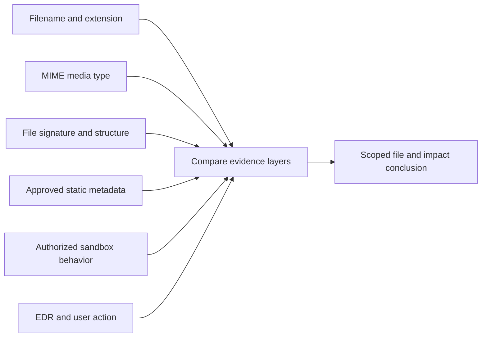
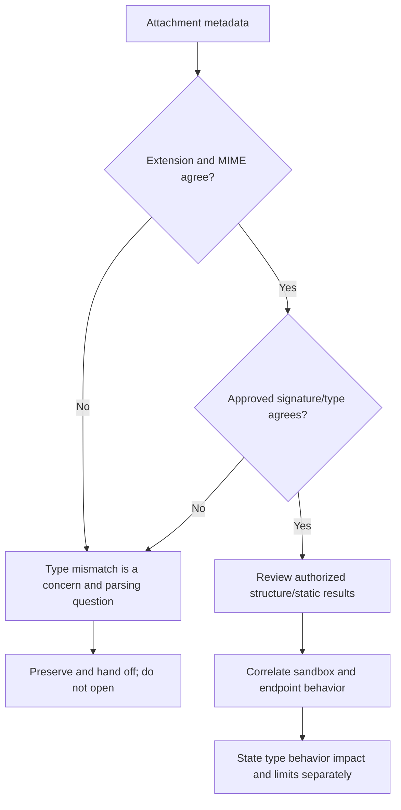
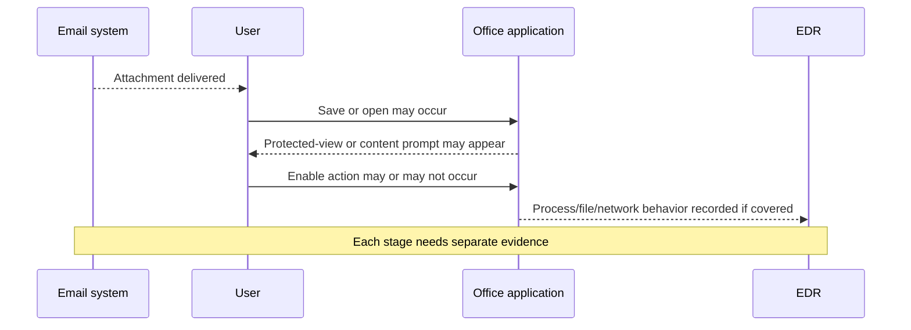
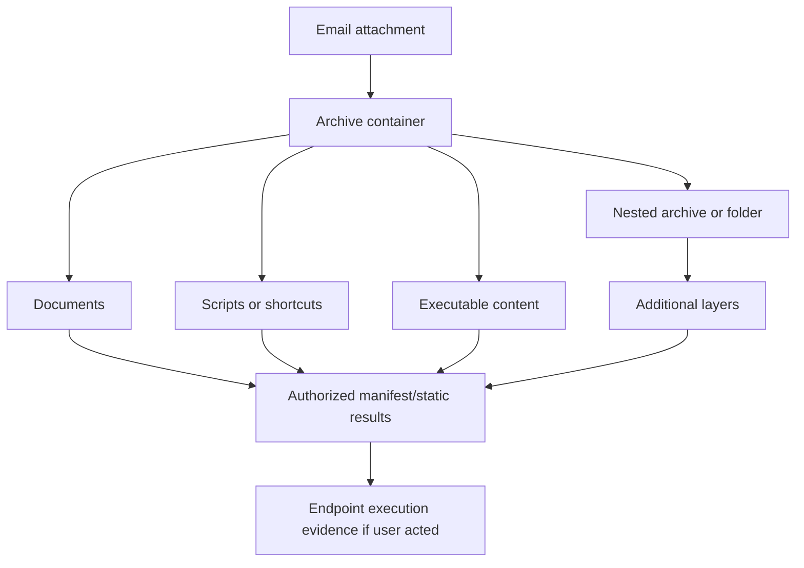
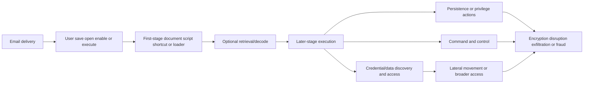
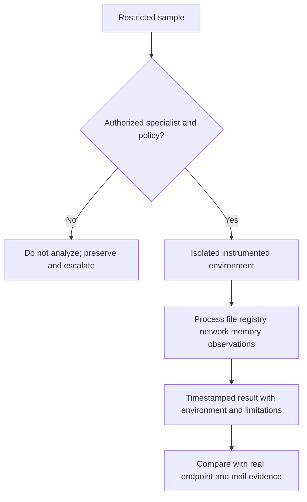
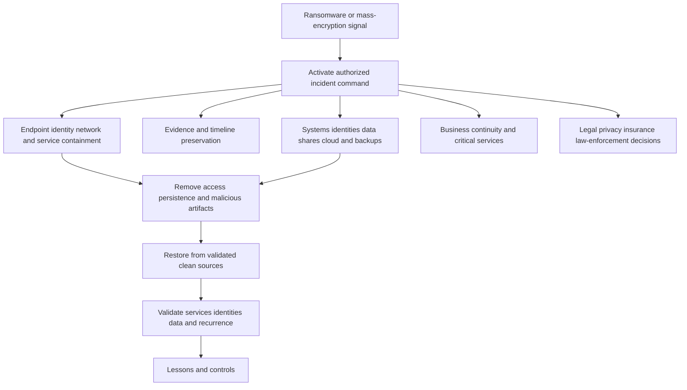
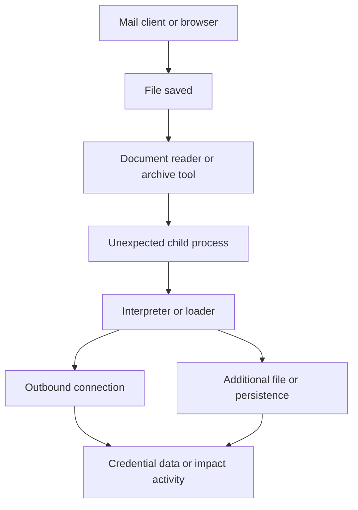
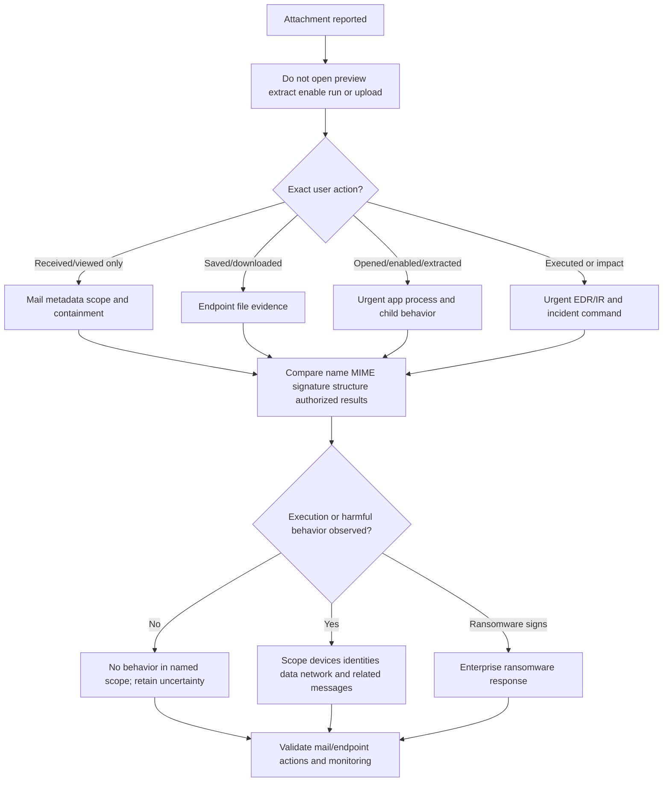

# Part 038 - Malicious Attachments Malware and Ransomware

## Purpose, Evidence, and Currency

An email attachment is a named body part in a message, not a guarantee about what the bytes contain or what an application will do with them. A file named `invoice.pdf` may be a valid PDF, a mislabeled file, a container, a document with active content, or a shortcut that only appears document-like in a graphical interface. File extension, MIME media type, magic bytes/signature, internal structure, application interpretation, and observed runtime behavior are separate evidence layers.

**Malware** is software or content designed to cause unauthorized or harmful behavior. It can steal information, execute commands, establish access, disrupt operations, modify data, or deliver later payloads. **Ransomware** is a malware/impact category that typically denies access to data or systems, often through encryption, and demands payment; some incidents also involve data theft or extortion. A malicious attachment can be an initial delivery mechanism, but an attachment does not need to contain the final payload itself. It may be a downloader, script, shortcut, document, archive, or lure that starts a multi-stage chain.

This part is defensive and non-executing. L1 support must not open a suspicious file, preview it in a vulnerable application, enable editing/content/macros, extract archives, provide passwords, rename it to discover behavior, run scripts, inspect embedded objects with ad hoc tools, upload customer files to public scanners, or detonate it. Preserve the original through the approved evidence path; work from provider/EDR metadata and authorized specialist results.

The central principle is:

$$
\text{Filename} \neq \text{file type} \neq \text{behavior} \neq \text{impact}
$$

Static and dynamic analysis are concepts in this lesson, not student execution instructions. **Static analysis** examines a file without intentionally running it. **Dynamic analysis** observes behavior when an authorized, isolated analysis system runs or opens content. A **sandbox** is a controlled environment intended to limit and observe behavior. None is risk-free; tooling, containment, privacy, licensing, and specialist skill matter.

All fixtures are invented metadata. No real sample, macro, executable, script, shortcut, archive, QR code, link, or malware is provided. Public vendor statements are attributed; no private Abnormal AI detection mechanics are claimed.

## Section Goal

By the end of this part, you should be able to:

- Define attachment, extension, MIME media type, magic bytes/file signature, container, active content, macro, script, executable, shortcut, payload, downloader, sandbox, static analysis, dynamic analysis, malware, and ransomware.
- Explain why extension, MIME type, icon, and user-visible name can disagree with actual content.
- Classify common Office, PDF, archive, script, executable, disk-image, and shortcut risks without opening files.
- Describe payload stages from delivery through user action, execution, persistence, command/control, credential/data access, lateral movement, and impact at a high level.
- Distinguish presence, delivery, download, save, open, macro enablement, script execution, process creation, network activity, and impact.
- Read safe provider/sandbox/EDR metadata without treating one verdict as perfect proof.
- Explain cryptographic hashes, exact-match indicators, fuzzy/behavioral context, filenames, paths, process trees, network indicators, and their caveats.
- Explain ransomware as an incident involving containment, evidence, scope, identity, endpoint, network, backup/recovery, legal, communications, and business continuity.
- Route suspicious files and execution reports to authorized endpoint detection and response (EDR), security operations center (SOC), incident response (IR), malware analysis, identity, legal/privacy, and business owners.
- Give non-blaming user guidance for received, downloaded, opened, enabled, executed, and impact states.
- Preserve file and message evidence without spreading or activating content.
- Produce a safe EDR handoff and customer update from metadata-only synthetic cases.
- Complete a harmless local classification lab with no execution or file handling.

## JD Mapping

| Role responsibility or signal | Capability from this part | Example support output |
|---|---|---|
| Triage attachment tickets | Separate file presentation, type, analysis, user action, endpoint behavior, and impact | "The message carried a ZIP-named object; extraction and execution are not reported; provider metadata requires EDR review." |
| Investigate threat verdicts | Correlate mail, file, sandbox, endpoint, identity, and user evidence | Evidence matrix with verdict limitations |
| Own urgent cases | Trigger endpoint/SOC/IR response without unsafe reproduction | Exact device/user/time/file hash/message ID handoff |
| Communicate with customers | Avoid "opened means infected" and "scan clean means safe" | Scoped confidence and pending evidence |
| Protect privacy and IP | Keep samples and document content out of public services/tickets | Secure artifact reference and redacted metadata |
| Collaborate with Engineering/Product | Submit action/result evidence and reproducible metadata | Non-executing false-positive/negative escalation packet |
| Use Microsoft cloud strength honestly | Transfer audit, case ownership, and endpoint-to-cloud reasoning | No claim of Defender/EDR production ownership |
| Support security products | Understand quarantine, sandbox, EDR, remediation, and response boundaries | Owner/action/validation map |

## Candidate Honesty Note

Arti can say:

> "My production experience is enterprise technical support, not malware reverse engineering or ransomware incident command. I can safely triage the evidence, establish exact user action and endpoint scope, preserve approved artifacts, coordinate SOC/EDR/IR owners, communicate clearly, and validate response status. I learned attachment and analysis concepts from official sources and practiced only with inert metadata. I would never execute, extract, enable, detonate, or upload a suspicious customer file myself."

| Evidence tier | Honest formulation | Boundary |
|---|---|---|
| **Production transfer** | Critical support ownership, evidence, cross-team escalation, customer cadence | Not malware analysis/EDR operations |
| **Local/synthetic lab** | Classification of invented filenames, headers, hashes, and process events | No file/sample exists or runs |
| **Learned architecture** | File, sandbox, EDR, incident, and ransomware concepts | No private vendor logic or tool proficiency claim |
| **No direct experience** | No production detonation, reverse engineering, endpoint isolation, ransomware recovery | Route to authorized specialist and state gap |

## Evidence Labels Used in This Part

| Label | Meaning | Example |
|---|---|---|
| **[Message observation]** | Raw/provider attachment metadata | "MIME declares `application/pdf`; filename is `review.pdf`." |
| **[File observation]** | Specialist/tool-derived type/hash/structure | "Approved metadata says file signature is ZIP container." |
| **[User report]** | Recipient's exact action | "User reports saving but not opening." |
| **[Endpoint observation]** | EDR/process/file/network event | "Document process created a child process at 10:13 UTC." |
| **[Sandbox observation]** | Authorized isolated analysis result | "Sandbox recorded outbound request and child process." |
| **[Inference]** | Testable interpretation | "The attachment may be a first-stage downloader." |
| **[Conclusion]** | Supported judgment within scope | "Malicious execution confirmed on device SYN-LAP-1; broader impact pending." |
| **[Unknown]** | Missing content/action/coverage | "No EDR data was supplied for the personal device." |

## Beginner Primer: A File Has Several Identities

Imagine a shipping box. Its handwritten label, customs declaration, package shape, X-ray, internal contents, and what happens when opened are different observations. A box labeled "books" is not proven safe or dishonest until other evidence is checked.

| File identity layer | Shipping analogy | Evidence |
|---|---|---|
| Filename | Handwritten label | Message/MIME metadata |
| Extension | Product category printed on label | Suffix such as `.pdf` |
| MIME media type | Customs declaration | `Content-Type` header |
| File signature/magic bytes | X-ray/packaging shape | Approved static type identification |
| Internal structure | Contents inventory | Authorized parser/specialist metadata |
| Application behavior | What opening mechanism does | Sandbox/application/EDR evidence |
| Endpoint impact | What happened in warehouse | Process, file, network, identity, data events |

The shipping analogy stops being accurate because simply previewing or parsing a file can exercise vulnerable code, containers can nest, and behavior can depend on environment. L1 works from safe metadata and specialist evidence.



## File Extension Versus Content and Type

An **extension** is the suffix after a filename's final dot under common conventions. Operating systems and applications use extensions for associations and display, but an extension is not cryptographic truth. Some interfaces hide known extensions, and filenames can contain multiple dots or visually confusing characters.

| Evidence | Strong for | Weak for |
|---|---|---|
| Filename | What message presented | Actual bytes/behavior |
| Extension | Expected application/category | Real type or safety |
| MIME type | Sender/gateway declaration and handling | Truth if mislabeled/spoofed |
| Magic bytes/signature | Likely format family | Complete behavior/embedded content |
| Parser result | Internal structure and anomalies | Runtime behavior under all environments |
| Hash | Exact-byte correlation | Similar variants or intent |
| Sandbox | Behavior in one controlled environment | All devices/configurations/conditions |
| EDR | Observed endpoint behavior | Activity outside sensor coverage |

### Double Extensions and Display

An inert filename such as `invoice.pdf.txt` is a text file by common extension rules, but an interface hiding `.txt` might emphasize `invoice.pdf`. A filename using right-to-left or unusual characters may display unexpectedly. Do not create deceptive filenames for practice. Preserve the exact Unicode code points and raw name through approved evidence.

### File Signature Caveat

Many formats begin with recognizable bytes, but signatures can be absent, nested, ambiguous, or intentionally misleading. Polyglot files can satisfy more than one parser. Only authorized tools should inspect bytes. A signature identifies structure, not benignness.



## 🔍 Plain-English deep-dive: A File Type Is Not a Safety Verdict

A genuine PDF can contain a harmful link or exploit; a valid Office document can contain active content; a ZIP can contain either harmless documents or executable material. "It really is a PDF" answers a format question, not a trust question.

| Statement | Question answered |
|---|---|
| "Extension is `.pdf`" | How name is presented |
| "MIME type is PDF" | How sender/gateway declared it |
| "Signature/parser identifies PDF" | Structural format family |
| "No active elements found by tool X" | One tool/version found none in covered features |
| "Sandbox observed no malicious behavior" | No behavior triggered in that environment/run |
| "EDR observed no execution" | No matching event in that endpoint/source/scope |
| "Safe" | Much broader claim rarely supported by one observation |

The package analogy stops being accurate because data can target parser vulnerabilities before a user consciously "opens" it. Follow provider and endpoint handling procedures even for previews.

## Common Attachment Families

The table is for defensive triage, not a list of files to create or run.

| Family | Plain meaning | Potential risk surface | Safe evidence |
|---|---|---|---|
| Office document | Word/Excel/PowerPoint-style content/container | Macros, embedded objects, links, templates, exploits | Provider/static/sandbox/EDR metadata |
| PDF | Portable document format | Links, forms, scripts/features, embedded files, parser exploits | Approved parser/sandbox and reader/EDR events |
| Archive | ZIP/RAR/7z-like container | Hides/nests files; encryption limits scanning; path/name issues | Container manifest from authorized tool |
| Script | PowerShell/VBScript/JavaScript/shell-like instructions | Direct command execution or downloader behavior | EDR/script logging owned by specialist |
| Executable/library | Native program or loadable code | Direct execution/load, persistence, payload | Type/hash/signature/signer/EDR metadata |
| Shortcut/link file | Points to another object/command | Can launch apps, remote resources, arguments | Approved static metadata and process tree |
| Disk image/package | Mountable/installable container | Carries apps/files and bypasses casual inspection | Authorized inventory and endpoint evidence |
| HTML/web archive | Local/web content | Links, scripts, credential prompts, downloads | Provider/browser/sandbox evidence |
| Image/media | Image/audio/video format | Parser exploits, metadata, steganography claims | Specialist type/parser evidence; no casual preview |
| Plain text/CSV | Text/tabular data | Formula injection, social instructions, secrets | Safe text handling policy and application context |

## Office Documents and Macros

A **macro** is an automation program embedded in or associated with a document. Macros can be legitimate. Risk arises when an untrusted document asks the user to enable content or when execution behavior is unauthorized.

| Stage | Evidence | Interpretation |
|---|---|---|
| Document delivered | Mail trace/provider metadata | Exposure exists; no open/execution proof |
| Saved | Browser/mail/endpoint file event | File reached disk; no open proof |
| Opened | Application/EDR event | Document application processed file |
| Protected view | Application state/telemetry | Mitigation context; not universal proof |
| Editing/content enabled | User report/application event | Security boundary may have changed |
| Macro executed | Office/script/EDR event | Active code execution supported |
| Child process/network activity | EDR/network event | Strong behavioral concern depending context |

Do not tell users to enable content "to see if it works." Do not open the document in Office, an online viewer, or a personal device. If user action occurred, capture exact application, time, device, prompts, and subsequent behavior without asking them to repeat it.



## PDF Files

PDF is a rich document format. It can contain links, forms, embedded content, and interactive features; readers vary. A clean static result does not prove every parser is safe, and an unfamiliar link does not prove the PDF itself executes malware.

| Question | Evidence owner |
|---|---|
| Was the object structurally a PDF? | Approved file-analysis tool |
| Was it opened or previewed? | User/application/EDR |
| Did it contain links/embedded objects/features? | Authorized static parser |
| Did reader spawn child processes or network requests? | EDR/network telemetry |
| Was a vulnerability/exploit observed? | EDR/IR/malware specialist |

Do not use a browser or reader as an analysis tool. Rendering is processing.

## Archives and Nested Containers

An **archive** packages one or more files. Password-protected/encrypted archives can prevent gateways from inspecting contents. Password protection is legitimate for privacy, but an unexpected password supplied in the same message can be a concern.



| Archive issue | Risk | Safe response |
|---|---|---|
| Encryption/password | Security inspection may be limited | Preserve; specialist/provider policy; never extract |
| Nested layers | Conceals final content and increases parser work | Authorized manifest/depth limit evidence |
| Misleading names | User may choose wrong object | Preserve exact names/code points/extensions |
| Path traversal names | Extraction could write outside expected folder | Do not extract; specialist tooling |
| Large/compression bomb | Resource exhaustion | Do not process casually; tool limits |
| Mixed content | One benign file does not clear all contents | Per-object manifest/verdict/behavior |

## Scripts, Executables, and Shortcuts

**Scripts** contain instructions for an interpreter. **Executables** contain machine/application code. **Shortcuts** point to another target and can include arguments. All have legitimate uses. Email delivery and user action determine risk.

| Type concept | Key metadata | Behavioral evidence |
|---|---|---|
| Script | Claimed/actual type, encoding, signer/source where applicable | Interpreter process, command line, child process, network/file changes |
| Executable | Architecture, hash, digital signature/signer, version info | Process start, load, persistence, network, resource access |
| Library | Type, exports/imports/signature | Loaded by which process and from which path |
| Shortcut | Target, arguments, working directory, icon | Process launched and downstream chain |
| Installer/package | Package identity/signature/content manifest | Installation events, services, tasks, files, privileges |

L1 should not quote harmful commands in general tickets. Preserve command-line evidence in the restricted EDR case and summarize behavior safely.

## Payload Stages

A **payload** is code/content that performs an intended action. Many campaigns are staged.



This diagram is high-level defensive incident reasoning. It omits implementation detail intentionally.

| Stage | Defender question | Evidence |
|---|---|---|
| Delivery | Which messages/recipients/attachments? | Mail provider/raw message |
| User action | Saved/opened/enabled/executed when and where? | User report/application/EDR |
| First stage | Which process/object started behavior? | Process tree/file events |
| Retrieval/decode | Were more objects created or fetched? | EDR/network/sandbox |
| Persistence | Did behavior survive restart/sign-in? | Services/tasks/startup/account/app evidence |
| Command/control | Did endpoint communicate unexpectedly? | EDR/network/DNS/proxy |
| Credential/data | What accounts/data were accessed? | Identity/EDR/DLP/audit |
| Impact | Encryption, disruption, exfiltration, fraud? | Endpoint/server/business/backup evidence |

## Static Analysis Concepts

Static analysis examines bytes/structure without intentionally executing them. Even static parsing can expose a tool to malformed content, so use approved isolated tooling and specialist ownership.

| Static artifact | Defensive value | Caveat |
|---|---|---|
| Cryptographic hash | Exact-byte correlation | One-bit change yields different hash |
| File type/signature | Format family | Polyglots/nesting/invalid files |
| Size/name/path | Scope and handling | Easily changed |
| Digital signature | Publisher/integrity information | Valid signature does not prove benign; stolen/misissued keys exist |
| Strings/metadata | Context and possible indicators | Can be misleading/encoded; privacy |
| Imports/structure | Capability clues | Does not prove runtime path |
| Macro/object inventory | Active-content presence | Legitimate content and obfuscation exist |
| Archive manifest | Nested names/types/sizes | Encrypted content may remain unavailable |

## Dynamic Analysis and Sandboxes

Dynamic analysis observes behavior in a controlled environment. A **detonation** is an authorized run/open intended for analysis.



| Sandbox limitation | Why it matters |
|---|---|
| Environment-aware behavior | File may not act in analysis environment |
| Time delay/user interaction | Behavior may wait or require a path not triggered |
| Network restrictions | Retrieval/control stage may fail |
| Missing application/version | Exploit/feature may not trigger |
| Geographic/identity context | Content may vary by target |
| Privacy/upload | Sample may contain customer data/IP/secrets |
| False positive | Suspicious generic behavior can be legitimate |
| False negative | No observed behavior is not proof of safety |

L1 consumes authorized reports and records limitations. L1 does not build or run a sandbox.

## 🔍 Plain-English deep-dive: Static Says What It Is; Dynamic Says What It Did There

Reading a machine's blueprint can reveal parts and possible functions. Turning it on in a test room can show what it did under that room's conditions. Neither alone proves what happened in the customer's production environment.

| Evidence | Strong conclusion | Overclaim |
|---|---|---|
| Static macro found | Active code exists | It executed for the user |
| Static URL/string found | String exists | Network request occurred |
| Sandbox child process | Behavior occurred in sandbox run | Every endpoint behaved identically |
| Sandbox no behavior | No behavior observed in that run | File is safe |
| EDR process tree | Behavior occurred on covered endpoint | Initial file was sole cause without correlation |

The blueprint analogy stops being accurate because static parsers can be attacked and malware can alter behavior based on environment. Record tool, version, time, configuration, sample hash, and scope.

## Indicators and Behaviors

An **indicator of compromise (IOC)** is an observable artifact associated with potentially malicious activity. Examples include hashes, paths, domains, URLs, IP addresses, certificates, registry keys, process names, and command-line fragments. Indicators are not all equally durable or specific.

| Indicator/behavior | Strength | Caveat |
|---|---|---|
| SHA-256 hash exact match | High for exact bytes | Variants change hash; source verdict quality matters |
| Filename | Good search seed | Easily changed and reused legitimately |
| File path | Contextual endpoint clue | User/app paths vary |
| Digital signer | Publisher context | Signed malware/compromised cert; unsigned legitimate code |
| Domain/IP | Network correlation | Shared/cloud/reassigned infrastructure |
| Process tree | Behavioral sequence | Legitimate admin/tool behavior can overlap |
| Document spawning script interpreter | Strong concern in context | Automation/admin workflows may exist |
| Mass file modification/encryption | High-impact behavior | Backup/admin/security tools can also touch many files |
| Ransom note/extension change | Impact clue | Copycat/test artifacts and partial activity possible |

Use indicators to scope exact related activity, then behaviors to find variants. Keep source, first/last seen, confidence, and expiry/review date.

## Hashes from Zero Knowledge

A cryptographic hash maps bytes to a fixed-size value. SHA-256 is commonly used for file correlation.

$$
\text{hash} = H(\text{exact bytes})
$$

Changing one byte should produce a substantially different value. A hash is not encryption and cannot normally reconstruct a file. A matching hash means the exact bytes match under the algorithm; it does not independently prove maliciousness. Never compute a hash by downloading or handling a suspicious file outside approved tooling.

## Ransomware Fundamentals

Ransomware response is an enterprise incident, not an attachment-only ticket. Encryption can affect endpoints, servers, shares, backups, cloud data, hypervisors, and identities. Data theft/extortion may occur before or without encryption.

| Ransomware question | Owner/evidence |
|---|---|
| Is encryption/disruption occurring now? | EDR/IR/operations |
| Which systems/identities/shares are affected? | EDR, identity, network, server/cloud logs |
| Is there evidence of data theft? | DLP/network/cloud/audit/IR |
| Are backups isolated and viable? | Backup/recovery owner; do not connect casually |
| What containment is authorized? | Incident commander/IR |
| What legal/regulatory/insurance duties apply? | Legal/privacy/risk/insurer |
| What business services are critical? | Business continuity/leadership |
| What may be communicated publicly? | Legal/communications/executive authority |
| Payment decision? | Executive/legal/risk authority, not L1 |



### Immediate Ransomware Boundaries

- Do not power off, disconnect, isolate, reboot, wipe, decrypt, restore, or contact an actor unless the incident runbook/authorized owner directs it.
- Do not connect backup media or recovery systems to a potentially compromised environment casually.
- Do not delete ransom notes, binaries, logs, or volatile evidence.
- Do not promise a decryptor, recovery time, no exfiltration, or no reinfection.
- Do not negotiate or discuss payment as technical support authority.
- Do not upload samples or notes publicly.

Containment choices are environment- and evidence-sensitive. A trained incident commander balances spread, evidence, safety, and business continuity.

## 🔍 Plain-English deep-dive: Ransomware Recovery Is Not "Restore and Done"

Restoring a building after a break-in is unsafe if the intruder still has keys, hidden access, or control of the alarm. Similarly, restoring files before identity, persistence, network, and root-cause controls are addressed can lead to repeated compromise.

Recovery validation asks:

- Are compromised accounts, sessions, tokens, applications, keys, and remote access addressed?
- Are malicious processes, services, tasks, scripts, tools, and configuration changes removed?
- Are restored systems from trusted, validated sources?
- Are backups intact and protected from the incident?
- Are business applications and data consistent?
- Is monitoring active for recurrence?
- Are legal/privacy/notification decisions complete?

The building analogy stops being accurate because digital persistence can span cloud, SaaS, identity, endpoints, and supply chain. Recovery is a coordinated phase, not one restore command.

## EDR and Incident-Response Handoff

**Endpoint detection and response (EDR)** collects endpoint telemetry and supports investigation/response actions. Capabilities and semantics vary. A strong handoff minimizes delay and avoids contaminating evidence.

| Handoff field | Content |
|---|---|
| User/device | Authorized identifiers and ownership |
| UTC timeline | Delivery, save/open/enable/execute, alert, response |
| Message | Message/network IDs, sender, recipient, received time |
| File | Original restricted artifact reference, filename, size, type, SHA-256 if already computed |
| User action | Exact report; application/prompts |
| Endpoint evidence | Alert ID, process tree, paths, signer, network events, action state |
| Mail scope | Related recipients/messages and current containment |
| Identity/data | Credential/session/data concerns and owner status |
| Actions | Requested/approved/initiated/completed/failed/validated |
| Explicit ask | Isolate? acquire? analyze? scope? advise next action? |
| Safety/privacy | Secure sample location and redactions |

### Process Tree Concept



This is a conceptual detection chain, not a command or execution guide. Process names alone are insufficient; command line, signer, ancestry, user, time, and expected behavior matter.

## User Guidance by Action State

| User state | Guidance | Escalation |
|---|---|---|
| Received/viewed message only | Do not preview/open/download; report via approved control | Mail/SOC scope |
| Downloaded/saved | Do not open/rename/extract; record device/path/time if safely known | EDR/SOC |
| Opened document/PDF | Do not reopen; record app/time/prompts | EDR/SOC; identity if credential prompt |
| Enabled content/macro | Stop; do not interact further; contact SOC/EDR urgently | Endpoint IR plus mail scope |
| Extracted archive | Do not open contents; preserve state | EDR/SOC specialist |
| Ran script/executable/shortcut | Stop; follow incident runbook; do not self-clean | Urgent EDR/IR |
| Ransomware/encryption signs | Invoke emergency process; follow incident commander | IR/business continuity/legal |

Thank the user and avoid blame: "These files are designed to look routine. I need exact actions and times so the endpoint team can choose the safest response. Please do not reopen or delete anything."

## Investigation Workflow

```mermaid
sequenceDiagram
    participant U as User
    participant L as L1 support
    participant M as Mail security
    participant E as EDR or IR
    participant I as Identity/data/business owners
    U->>L: Reports attachment and exact action
    L->>U: Stop interaction; do not reopen/delete/self-clean
    L->>L: Preserve message IDs and restricted artifact reference
    L->>M: Request attachment metadata verdict scope and mail action
    M-->>L: Mail and approved analysis evidence
    alt Saved opened enabled extracted or executed
        L->>E: Send device/user/time/file/process handoff
        E-->>L: Endpoint findings and action status
    end
    alt Identity data or business impact possible
        L->>I: Route scoped evidence and explicit ask
        I-->>L: Adjacent findings and authorized status
    end
    L->>L: Correlate type behavior impact scope and gaps
    L-->>U: Customer-safe verdict and validated next actions
```

### Phase 1: Safety and Urgency

Stop interaction. Determine whether the file was received, downloaded, opened, content-enabled, extracted, or executed; whether prompts, child windows, credentials, network behavior, alerts, or encryption appeared; and which device/time/app were involved.

### Phase 2: Preserve

Use approved message reporting and secure sample/evidence handling. Do not ask users to forward normally or upload files. Record message IDs, attachment metadata, and existing provider/EDR IDs.

### Phase 3: Mail Scope

Identify recipients, delivery/quarantine/remediation, exact hashes if already available, filenames/types, verdicts, campaign/similar-message results, and partial failures.

### Phase 4: Endpoint/Identity Scope

EDR/IR correlates file, process, command-line, network, persistence, and device events. Identity/data owners assess credentials, sessions, tokens, accounts, and data. L1 coordinates; specialists decide technical actions.

### Phase 5: Contain, Eradicate, Recover

Follow authorized runbooks and incident command. Validate every action. Ransomware cases include business continuity, backups, legal/privacy, insurance, communications, and possible law-enforcement decisions.

### Phase 6: Communicate and Improve

State type, behavior, impact, scope, confidence, actions, failures, and unknowns separately. Review delivery, execution, privilege, application-control, backup, identity, and user-reporting controls without blaming the reporter.

## Troubleshooting Decision Tree



### Symptom-to-Test Matrix

| Symptom | Hypotheses | Safe discriminating evidence | Next action |
|---|---|---|---|
| `.pdf` filename, ZIP signature | Mislabeled container; gateway transform; malicious disguise | Approved type/structure metadata | Preserve and specialist/EDR handoff |
| Office file, no macro detected | Benign; unsupported/obfuscated active content; link/exploit path | Tool/version plus sandbox/endpoint evidence | Do not declare safe from one static result |
| User opened, no alert | Benign; no behavior triggered; EDR gap | Application/process/network/user timeline and sensor health | State coverage, monitor/escalate by risk |
| Hash reputation malicious | Exact known malware; bad feed/incorrect association | Trusted source, hash algorithm, exact sample hash | Contain/scope under policy; validate |
| Mass file renames | Ransomware; admin/backup/software behavior | EDR process ancestry, rate, paths, business context | Emergency IR if unauthorized |

## Worked Example 1: Extension and Signature Mismatch

### Inputs

- Synthetic filename: `quarterly-review.pdf`.
- MIME fixture: `application/pdf`.
- Approved metadata fixture: actual format `ZIP container`.
- User viewed message only.

### Conclusion

> **Synthetic conclusion:** Extension/MIME and approved type identification conflict. The object is suspicious and must not be opened or extracted. No endpoint execution or impact exists in the fixture. Mail security should scope related messages; specialist tooling owns structure analysis.

## Worked Example 2: Macro Present, Not Executed

### Inputs

- Synthetic Office metadata says macro stream present.
- User saved but did not open.
- EDR fixture records file creation only.

### Conclusion

> **Synthetic conclusion:** Active macro content is present, but execution is not supported. Treat as a potentially malicious attachment, contain mail/file according to policy, scope recipients, and validate endpoint state. Do not say "infected" or ask user to open it.

## Worked Example 3: Document Child Process

### Inputs

- Synthetic EDR tree: mail client -> document application -> unexpected interpreter.
- Network fixture records an outbound request.
- User reports enabling content.
- No commands, samples, or live destinations are included.

### Conclusion

> **Synthetic conclusion:** Malicious or unauthorized document-driven execution is strongly supported on the covered device. EDR/IR owns containment and deeper analysis; mail security scopes delivery; identity/data owners assess downstream exposure. Filename/type alone no longer controls the verdict.

## Worked Example 4: Sandbox Clean, Endpoint Alert

### Inputs

- Authorized sandbox fixture says no behavior observed.
- EDR fixture says execution and persistence behavior occurred on a user endpoint.

### Reasoning

The sandbox result describes one run/environment. Endpoint telemetry is direct evidence of production behavior. Possible explanations include environment-dependent behavior, missing trigger, analysis limits, or a different sample hash. Verify hashes and timelines before joining records.

### Conclusion

> **Synthetic conclusion:** Endpoint behavior takes priority for the covered device. "Sandbox clean" does not clear the incident. Confirm sample identity, contain, scope, and record sandbox limitations.

## Worked Example 5: Ransomware Signal

### Inputs

- Synthetic EDR alerts show rapid file modifications on `SYN-LAP-4`.
- Several invented filenames receive `.locked-syn` suffix.
- A placeholder ransom-note metadata event exists; no note text is shown.

### Response

Activate incident command; follow authorized isolation/evidence steps; scope identities, devices, shares, servers, cloud, data, and backups; involve business continuity, legal/privacy, insurance, communications, and leadership. L1 does not run decryptors, negotiate, wipe, or restore.

### Conclusion

> **Synthetic conclusion:** Ransomware-like impact is strongly supported on one fixture device; enterprise scope and data theft remain unknown. Treat as a high-severity incident until authorized IR establishes boundaries.

## Failure Modes and Unsafe Shortcuts

| Failure | Why it fails | Safer behavior |
|---|---|---|
| Open to inspect | Activates parser/content and contaminates evidence | Preserve and use specialist results |
| Preview is safe | Preview still processes content | Avoid unapproved preview/rendering |
| Rename extension | Changes presentation, not bytes; may trigger associations | Preserve original and approved type evidence |
| Extract archive | Can expose paths/content and execute vulnerable parser | Authorized isolated tooling only |
| Enable macros/content | Crosses security boundary | Never enable for analysis |
| Public scanner upload | Leaks customer IP/data and sample | Approved private platform only |
| Hash alone proves cause | Exact match needs trusted association and timeline | Correlate source, sample, process, impact |
| Clean sandbox proves safe | One run can miss behavior | Correlate endpoint and limitations |
| No EDR alert proves no execution | Sensor/coverage/logic gaps exist | Verify sensor health and other evidence |
| Reboot/wipe immediately | Can destroy volatile evidence and hinder scope | Incident-command decision |
| Restore immediately | Persistence/identity/access may remain | Eradication and validated recovery plan |
| Blame user | Delays reports and hides evidence | Neutral exact-action questions |

## Customer Communication Templates

### Received, Not Opened

> "Please do not open, preview, download, rename, extract, or upload the attachment. Use the approved reporting control so the original message is preserved. Current evidence shows delivery only; execution and endpoint impact are not established. Mail security is scoping recipients and attachment metadata."

### Opened or Enabled

> "Thank you for reporting quickly. Do not reopen, delete, or attempt cleanup. Please provide the device, application, approximate UTC/local time, and whether you enabled content, extracted files, ran anything, entered credentials, or saw an alert. The endpoint team is reviewing process, file, and network evidence."

### Confirmed Execution

> "Endpoint telemetry confirms unauthorized execution on [scoped device] at [UTC time]. The EDR/IR team owns containment and analysis; mail security is scoping related delivery, and identity/data owners are assessing downstream exposure. Broader impact and root cause remain under investigation."

### Ransomware Update

> "Ransomware-like file-impact behavior is confirmed on [scope]. Incident command is coordinating endpoint, identity, network, backup/recovery, business continuity, legal/privacy, insurance, and communications workstreams. Recovery timing, data theft, and enterprise scope are not yet established. Next update: [time]."

## Digital Signatures and Publisher Evidence

A digital signature can provide integrity and publisher-certificate context. It does not guarantee that software is benign, currently trusted, uncompromised, correctly configured, or appropriate for the recipient. Certificates can expire, be revoked, be stolen, be misused, or identify a publisher whose software has a vulnerability.

| Signature state | Supported statement | Unsupported statement |
|---|---|---|
| Valid signature and trusted chain | File bytes match signed content and chain validated under that tool/policy/time | "Safe to run" |
| Valid signature, unfamiliar publisher | Publisher identity evidence exists | Publisher is malicious or trustworthy |
| Invalid signature | Signature verification failed for a reason | File is necessarily malware |
| Unsigned | No qualifying signature was verified | File is malicious |
| Revoked certificate | Authority reports certificate should no longer be trusted under status evidence | Every file ever signed was malicious |
| Expired certificate | Current validity period ended; timestamp rules may matter | Signature was never valid |

### Signature Evidence Record

| Field | Capture |
|---|---|
| Sample hash | Exact SHA-256 from approved tooling |
| Subject/publisher | Certificate subject shown by tool |
| Issuer/chain | Chain and trust-store context |
| Verification time | UTC and whether signing timestamp was evaluated |
| Result/reason | Valid, invalid, unsigned, revoked, expired, unknown |
| Tool/version/policy | Verifier and trust policy |
| Caveat | Signature does not establish safety or execution |

Do not install a certificate, disable revocation, or change trust settings to make a suspicious signature validate. The endpoint/malware specialist owns interpretation.

## Detection Verdicts: Combining, Not Voting

Mail, static-analysis, sandbox, EDR, reputation, and user-report systems can disagree because they observe different objects, times, environments, and behaviors. Do not count verdicts as votes. Ask what each source actually observed.

| Source | Example result | Actual question answered |
|---|---|---|
| Mail filter | `Malware` | How the service classified message/file at evaluation |
| Static scanner | `Macro present` | Whether covered structure contains macro content |
| Reputation source | `Known malicious hash` | Whether exact hash has that sourced association |
| Sandbox | `No behavior observed` | What occurred in one configured run |
| EDR | `Process execution blocked` | What target endpoint sensor observed and actioned |
| User | `Opened and enabled content` | Reported interaction |
| Business owner | `Expected document` | Workflow legitimacy, not technical safety |

### Conflict Examples

| Conflict | Plausible explanation | Resolution path |
|---|---|---|
| Mail says clean; EDR blocks | Later intelligence, endpoint behavior, transformed/different file | Compare exact hash, message, endpoint process, timestamps |
| Mail says malware; static says no macro | Threat may be link/exploit/other structure; false positive | Inspect provider reason and authorized specialist evidence |
| Sandbox clean; EDR execution | Environment/trigger difference or sample mismatch | Verify hash/environment and prioritize direct endpoint evidence |
| User says not opened; EDR shows process | Preview/automation/another user/event attribution | Correlate application ancestry, user/device/session, exact time |
| Hash reputation malicious; business expects file | Supply-chain compromise, false association, hash mismatch | Preserve, stop execution, validate source and file identity |

Use a conclusion matrix:

| Claim | Best evidence | Confidence | Missing evidence |
|---|---|---:|---|
| File was delivered | Mail trace | High | None in reviewed scope |
| User opened it | User/app/EDR correlation | Medium/high | Exact preview-versus-open semantics |
| Code executed | EDR/process telemetry | High for covered endpoint | Sensor coverage on other devices |
| File caused execution | Hash/path/process ancestry and timing | Medium/high | Alternative parent/source |
| Enterprise compromised | Cross-system incident evidence | Variable | Broader scope and retention |

## Endpoint Response Action States

Endpoint tools expose commands and statuses that differ by vendor. Use vendor/current documentation and preserve exact state. Generic communication should distinguish these stages:

| Stage | Meaning | Validation question |
|---|---|---|
| Recommended | Analyst suggests an action | Who owns approval? |
| Requested | Command/job submitted | Was target correct and request accepted? |
| Approved | Authorized reviewer allowed action | Has execution started? |
| In progress | Tool reports ongoing work | Is device online and reporting? |
| Completed | Tool reports action completion | What exactly completed and on which target? |
| Failed/partial | Some or all action did not complete | Why, which targets, and retry/alternate plan? |
| Reversed | Isolation/quarantine/restoration undone | Was normal operation and monitoring validated? |

### Common Endpoint Actions and Caveats

| Generic action | Intended effect | Caveat/validation |
|---|---|---|
| Isolate device | Restrict network communication | Exceptions/management channels may remain; device status matters |
| Quarantine file | Restrict/move identified object | Other copies/processes/persistence may remain |
| Kill process | Stop one process | Child/persistent/remote activity may continue |
| Collect investigation package | Gather evidence | Privacy, size, completeness, and secure transfer |
| Run scan | Evaluate covered artifacts | No finding is bounded by engine/configuration/time |
| Remove persistence | Delete/disable mechanism | Validate all mechanisms and legitimate impact |
| Release from isolation | Restore connectivity | Requires eradication/recovery/monitoring decision |

L1 should not initiate these actions unless explicitly authorized and trained. L1 can ask the owner for target, action, state, failure, and validation evidence.

## 🔍 Plain-English deep-dive: Quarantining the File Does Not Contain the Incident

Removing a match from one pocket does not prove no copies exist, that it was never used, or that someone did not already hand off its contents. File quarantine similarly addresses a particular object on a particular target. It does not automatically stop a running process, revoke an account, remove persistence, block a network path, correct a mailbox campaign, or restore changed data.

| Quarantine proves | Quarantine does not prove |
|---|---|
| Tool action targeted a named file/object | The file never executed |
| The object reached a tool-specific restricted state if completed | No other copies exist |
| An audit event/status exists | No process remains in memory |
| One containment control acted | Identity, network, data, or ransomware impact is resolved |

A customer-safe update is:

> "EDR reports file quarantine completed for hash [restricted reference] on device `SYN-LAP-1`. Process, persistence, related-file, identity, network, and mail-campaign scope remain under IR review. This action contains one object; it is not yet the incident-closure condition."

The pocket analogy stops being accurate because digital files can be copied instantly and behavior can persist without the original object. Validate across file, process, persistence, account, network, data, mail, and recovery layers.

## Persistence and Identity Scope

**Persistence** means a mechanism that allows unauthorized activity to continue or return after an initial event, sign-in, or restart. This lesson stays high level; specialists inspect exact mechanisms.

| Scope | Defensive question | Evidence owner |
|---|---|---|
| Process | What executed and is it still running? | EDR/IR |
| File | What objects were created/modified/deleted? | EDR/forensics |
| Startup/service/task | Could behavior resume? | EDR/IR/system owner |
| Account | Were credentials, sessions, tokens, keys, or MFA affected? | Identity/SOC |
| Mailbox/app | Were rules, forwarding, delegates, grants, or apps changed? | Mail/identity/SaaS owner |
| Network | Did control/retrieval/lateral activity occur? | Network/SOC/EDR |
| Data | What was discovered, accessed, changed, encrypted, or sent? | Data owner/DLP/IR/privacy |
| Recovery | Are restored systems free of unauthorized access? | IR/operations/backup owner |

An attachment investigation may pivot to account takeover even when the original file is gone. Conversely, a suspicious file with no user action and no endpoint presence may remain a mail-only attempted delivery case. Keep branches evidence-based.

## Scope Expansion from One Attachment

| Seed | Exact scope | Behavioral expansion | Stop/limitation |
|---|---|---|---|
| Message ID | Same message/recipients | Similar-message fingerprint/campaign | Provider/tenant boundaries |
| Hash | Exact same bytes | Same file family/type/behavior | Avoid vague filename-only mass action |
| Filename | Exact presented name | Related names only with context | Common filenames create noise |
| Process tree | Same ancestry/behavior | Similar child/network/persistence patterns | Admin/software baselines matter |
| Network indicator | Exact domain/IP/URL | Related infrastructure from trusted intelligence | Shared/reassigned infrastructure |
| User/device | Reporting endpoint | Same users/devices/identity events | Privacy and retention boundaries |

Scope in waves: exact indicators first for speed, then stable behavior for variants. Document query, source, interval, exclusions, and false-positive controls.

## Worked Example 6: Signed Executable from an Expected Vendor

### Inputs

- Synthetic binary metadata says signature valid for `Example Vendor Ltd.`.
- File arrived unexpectedly by email rather than the approved software channel.
- User did not run it.

### Reasoning

The signature supports publisher/integrity context but does not authorize email delivery or execution. H1 is a legitimate vendor emergency distribution; H2 is abused/stolen signing or compromised supply channel; H3 is false metadata. Independent vendor/change-management verification and approved software inventory are needed. No user action means no endpoint execution in the fixture.

### Conclusion

> **Synthetic conclusion:** Unexpected signed executable remains untrusted pending business and specialist verification. Do not run or broadly allow it. Signature is not a safety verdict.

## Worked Example 7: File Quarantined After Execution

### Inputs

- Synthetic EDR says process start at 10:00 UTC.
- File quarantine completed at 10:04 UTC.
- Child-process and network events are pending.

### Conclusion

> **Synthetic conclusion:** Execution preceded file quarantine, so endpoint incident scope remains open. IR must review process, child activity, persistence, network, identity, data, and related endpoints. The completed quarantine action does not prove eradication.

## Worked Example 8: Partial Message and Endpoint Actions

### Inputs

- Ten synthetic recipients received one file hash.
- Mail removal completed for eight, one failed, one says not found.
- EDR file quarantine completed on two devices; one device is offline.

### Conclusion

> **Synthetic conclusion:** Containment is partial. Report each recipient/device state, preserve retry/alternate owner, contact affected users through approved channels, and keep residual risk explicit. "Remediated" is inaccurate until failures and offline scope are addressed.

## Safe Synthetic Lab: The Zero-Execution Attachment Triage Bench

### Objective

Create a single local artifact that classifies ten invented attachment metadata records, separates file presentation/type/behavior/impact, builds user-action and EDR handoffs, and walks a ransomware decision path. No file or sample is created, opened, decoded, extracted, uploaded, or executed.

The unique lab name is **The Zero-Execution Attachment Triage Bench**.

### Prerequisites

- Local Markdown editor or spreadsheet.
- Offline study folder.
- Only the metadata fixtures below.
- No attachments, files, binaries, scripts, macros, archives, QR codes, links, scanners, sandboxes, VMs, accounts, tenants, or endpoints.
- All hashes are obvious placeholders and not real cryptographic values.

### Authorized scope

Authorized:

- Copy and analyze the invented rows.
- Create type/evidence/action/owner/timeline tables.
- Label artifacts **local/public lab - synthetic metadata only**.
- Rehearse safe user and EDR communication.

Prohibited:

- Creating or renaming sample files to risky extensions.
- Opening, previewing, extracting, decoding, enabling, running, detonating, or uploading content.
- Using real hashes, URLs, commands, malware names, customer data, devices, or platform accounts.
- Isolating, rebooting, wiping, restoring, or changing any real system.

### Synthetic metadata fixtures

| ID | Filename | Declared type | Approved type result | User/endpoint fixture |
|---|---|---|---|---|
| F1 | `report.pdf` | PDF | PDF | Viewed message only |
| F2 | `review.pdf` | PDF | ZIP container | Viewed message only |
| F3 | `budget.docm` | Office | Office with macro stream | Saved, not opened |
| F4 | `notice.pdf` | PDF | PDF with link metadata | Opened; no click reported |
| F5 | `photos.zip` | ZIP | Encrypted archive, contents unknown | Downloaded only |
| F6 | `task.txt` | Text | Text | Expected legitimate fixture |
| F7 | `shortcut.lnk` | Binary | Shortcut metadata | No user action |
| F8 | `installer.bin` | Binary | Executable format | EDR process start fixture |
| F9 | `update.docx` | Office | Office | EDR child-process fixture |
| F10 | `records.zip` | ZIP | Archive | Synthetic mass-file-change alert follows |

### Steps

1. Create `Zero-Execution Attachment Triage Bench` and label it `local/public lab - synthetic metadata only`.
2. Record authorized scope, prohibited actions, date, and UTC time.
3. Copy the fixture rows exactly. Do not create matching files.
4. For each row, record filename/extension, declared type, identified type, mismatch, internal metadata, user action, endpoint behavior, impact, confidence, and unknowns.
5. Classify each as delivery only, saved, opened, active content present, execution observed, or impact observed.
6. Build at least two hypotheses for F2, F5, F8, F9, and F10, including benign alternatives where plausible.
7. Assign safe evidence tests to mail security, malware analysis, EDR/IR, identity, data, and business owners. Mark all production tests `not performed - synthetic lab`.
8. Create one process-tree diagram from F9's abstract events; include no commands.
9. Create an EDR handoff for F8 or F9 with explicit ask and restricted artifact placeholder.
10. Walk F10 through ransomware activation, containment, evidence, scope, business continuity, legal/privacy, backup/recovery, and validation owners.
11. Write four user guidance messages for received, saved, opened/enabled, and ransomware states.
12. Write four customer verdicts separating type, behavior, impact, scope, and unknowns.
13. Add an indicator table with placeholder hash, filename, path, process behavior, source, confidence, and expiry/review.
14. Complete safety/privacy/honesty review and attest zero sample/file activity.

### Expected evidence

- Ten metadata-only classification rows.
- Correct separation of extension, MIME, identified type, structure, behavior, and impact.
- At least ten hypotheses across selected cases.
- Process-tree concept with no commands or executable detail.
- One decision-ready EDR handoff.
- One cross-functional ransomware workstream/validation map.
- Four user guidance messages and four customer-safe verdicts.
- Indicator table with source and limitations.
- Explicit `not performed - synthetic lab` test states.
- Zero files/samples, preview, extraction, execution, detonation, upload, network, endpoint, account, or tenant activity.

### Cleanup and privacy

- Retain only the metadata worksheet if useful.
- Confirm no actual file, encoded content, macro, script, command, URL, real hash, malware sample, ransom note, customer data, or device identifier appears.
- Remove accidentally pasted message/file/customer/identity/endpoint evidence; delete the artifact if reliable redaction is impossible.
- Do not upload the artifact to public scanners or AI services.
- Record that no content was created, opened, previewed, extracted, enabled, executed, detonated, or uploaded and no system action occurred.

### Artifacts

| Artifact | Skill shown | Honest label |
|---|---|---|
| Attachment classification | File-evidence reasoning | **Local/public lab** |
| Hypothesis ledger | Alternative testing | **Local/public lab** |
| EDR handoff | Cross-team escalation | **Template only** |
| Ransomware workstream map | Incident architecture | **Learned architecture** |
| User/customer messages | Safe communication | **Template only** |

### Validation rubric

| Dimension | Fail | Developing | Pass |
|---|---|---|---|
| File identity | Trusts extension/icon | Compares MIME/type | Separates filename, extension, MIME, signature, structure, behavior, and impact |
| User action | "Opened means infected" | Separates download/open | Tracks delivery, save, open, enable, extract, execute, process, network, and impact |
| Analysis | Opens/runs/uploads | Describes static/dynamic | Uses only authorized result concepts with tool/environment/coverage caveats |
| Indicators | Hash equals cause | Lists indicators | Records source, exact-match scope, behavior, time, confidence, expiry, and variants |
| EDR handoff | Sends sample broadly | Provides device/file | Includes UTC timeline, message/file IDs, process evidence, actions, privacy, and explicit ask |
| Ransomware | Restore/reboot immediately | Calls IR | Maps incident command, containment, evidence, scope, identity, data, backups, business, legal, recovery, monitoring |
| Safety/privacy | Handles real sample | Metadata only but weak controls | No sample/file creation or processing, no public upload, explicit zero-activity attestation |
| Honesty | Claims malware/IR experience | Calls it lab | Labels production transfer, synthetic metadata, learned architecture, and direct gaps |

## Official Source Anchors

All sources were accessed on August 24, 2026 and must be revalidated before production use.

| Official/public source | What it anchors |
|---|---|
| [NIST SP 800-83 Revision 1 - Guide to Malware Incident Prevention and Handling for Desktops and Laptops](https://csrc.nist.gov/pubs/sp/800/83/r1/final) | Malware prevention, detection, containment, eradication, recovery, and handling foundations |
| [NIST SP 800-61 Revision 3](https://csrc.nist.gov/pubs/sp/800/61/r3/final) | Risk-integrated incident response coordination and improvement |
| [NIST SP 800-86](https://csrc.nist.gov/pubs/sp/800/86/final) | Forensic collection, examination, analysis, and reporting concepts |
| [MITRE ATT&CK - Spearphishing Attachment, T1566.001](https://attack.mitre.org/techniques/T1566/001/) | Public targeted malicious-attachment technique and defensive mitigations/detection |
| [MITRE ATT&CK - Malicious File, T1204.002](https://attack.mitre.org/techniques/T1204/002/) | User-execution interaction with malicious files and behavioral detection framing |
| [MITRE ATT&CK - Data Encrypted for Impact, T1486](https://attack.mitre.org/techniques/T1486/) | Ransomware/encryption impact and defensive mitigation/detection concepts |
| [Microsoft - Email entity page](https://learn.microsoft.com/en-us/defender-office-365/mdo-email-entity-page) | Current attachment metadata, hashes, detonation, behavior, URLs, timeline, and action evidence |
| [Microsoft - Safe Attachments](https://learn.microsoft.com/en-us/defender-office-365/safe-attachments-about) | Current Microsoft attachment scanning/detonation and policy concepts |
| [Google Workspace Help - Threat types](https://knowledge.workspace.google.com/admin/security/threat-types) | Current Google definitions for malware, ransomware-related data deletion, account breach, and phishing |
| [Google Workspace Help - Investigate and take action on suspicious files](https://knowledge.workspace.google.com/admin/security/investigate-and-take-action-on-suspicious-files) | Current Google administrator file-investigation concepts |
| [FBI Internet Crime Complaint Center](https://www.ic3.gov/) | Official US cyber-enabled crime reporting portal and public alerts; filing remains an authorized legal/organizational decision |
| [Abnormal AI - Email Security](https://abnormal.ai/products/email-security) | Public, attributable email-security positioning only; no private file-analysis or model logic |

## Likely Interview Questions

### Q1. Why is a file extension not enough to identify or clear an attachment?

**Model answer:** The extension is part of the filename and can be wrong, hidden, doubled, or misleading. I compare the message's MIME declaration with approved signature/type and structure results, then correlate authorized sandbox and endpoint behavior. Even a genuine PDF or Office file can contain risky content, so format is not a safety verdict.

### Q2. What is the difference between static and dynamic analysis?

**Model answer:** Static analysis examines bytes, structure, hashes, signatures, strings, macros, and container metadata without intentionally executing the file. Dynamic analysis observes behavior in an authorized isolated environment. Static shows potential structure/capability; dynamic shows what occurred in one environment/run. Both have limitations, and L1 consumes specialist results rather than running samples.

### Q3. How do you investigate a user who says they opened an attachment?

**Model answer:** I thank them, stop further interaction, and ask device, application, exact time/time zone, whether they saved, opened, enabled content/macros, extracted, ran anything, entered credentials, or saw alerts/changes. I preserve mail IDs and secure artifact reference, then route EDR/IR evidence. Opening is not automatically compromise, but it requires endpoint correlation.

### Q4. What does a SHA-256 hash prove?

**Model answer:** It supports exact-byte correlation under that algorithm. A match to a trusted known-malicious record is strong for the same bytes, but the hash alone does not prove execution, cause, or enterprise impact. A modified variant has a different hash. I record source, algorithm, sample identity, timestamps, and behavioral correlation.

### Q5. Why can a clean sandbox result be misleading?

**Model answer:** The file may delay behavior, require user interaction, detect the sandbox, depend on identity/region/network/application version, or fail to retrieve another stage. "No behavior observed" describes that run, not universal safety. I compare sample hash, environment, tool/version, and endpoint telemetry; direct endpoint behavior controls the affected-device conclusion.

### Q6. What belongs in an EDR handoff?

**Model answer:** User/device, normalized UTC timeline, message IDs, secure file reference, filename/size/type/hash if already computed, exact user actions, EDR alert/process tree/path/signer/network evidence, related mail scope, identity/data concerns, actions and states, privacy controls, and an explicit ask. I do not attach the sample to a normal ticket or include harmful commands broadly.

### Q7. How is ransomware response broader than a malicious attachment case?

**Model answer:** Ransomware activates incident command across endpoints, identity, network, servers/cloud, data, shares, backups/recovery, business continuity, legal/privacy, insurance, communications, and leadership. Containment and evidence decisions are authorized and environment-specific. Restore is not complete recovery until access/persistence is removed and systems/data/monitoring are validated.

### Q8. What are your boundaries as L1?

**Model answer:** I can make the case safe, establish exact action and impact, preserve evidence, scope mail, coordinate SOC/EDR/IR and adjacent owners, communicate, and validate statuses. I do not open, preview, extract, execute, detonate, reverse engineer, upload, isolate, wipe, restore, decrypt, negotiate, or promise recovery without the authorized owner/runbook.

## 🧠 30-Second Memory Hooks

- **Filename is presentation; type is structure; behavior is evidence; impact is outcome.**
- **Extension, MIME, signature, structure, sandbox, and EDR are separate layers.**
- **A real PDF can be dangerous; a type result is not a safety verdict.**
- **Delivery, save, open, enable, extract, execute, and impact are different states.**
- **Previewing is processing.**
- **Never open, extract, enable, run, detonate, or publicly upload a sample.**
- **Static says what may be there; dynamic says what happened there.**
- **No sandbox behavior is not universal safety.**
- **A hash matches exact bytes, not intent or execution.**
- **Indicators find exact clues; behaviors find variants.**
- **EDR handoff needs user, device, UTC time, file, process tree, action state, and ask.**
- **Ransomware is an enterprise incident, not one bad attachment.**
- **Restore after containment/eradication validation, not before.**
- **Do not blame the reporter or ask them to reproduce.**
- **Metadata-only practice is learning, not malware analysis experience.**

## Completion Checklist

- [ ] I can define extension, MIME type, signature/magic bytes, container, macro, script, executable, shortcut, payload, malware, ransomware, static, dynamic, and sandbox.
- [ ] I separate filename/extension, declared type, identified type, structure, behavior, and impact.
- [ ] I understand Office, PDF, archive, script, executable, shortcut, disk-image, HTML, media, and text risk surfaces.
- [ ] I track delivery, download/save, open/preview, enable, extract, execute, process/network, and impact states.
- [ ] I never open, preview, rename, extract, enable, execute, detonate, or publicly upload suspicious content.
- [ ] I can explain static and dynamic analysis limitations.
- [ ] I can explain what an exact SHA-256 match proves and does not prove.
- [ ] I record indicator source, time, confidence, scope, and expiry/review.
- [ ] I can read a process tree conceptually without reproducing harmful commands.
- [ ] I can build a complete EDR/IR handoff with an explicit ask.
- [ ] I know when to engage identity, data, legal/privacy, business continuity, backup/recovery, and communications owners.
- [ ] I understand ransomware containment, evidence, scope, eradication, recovery, and monitoring as separate phases.
- [ ] I do not reboot, wipe, restore, decrypt, isolate, or negotiate outside the authorized runbook.
- [ ] I can write user guidance and customer updates without blame or overclaiming.
- [ ] I can describe the Zero-Execution Attachment Triage Bench and its metadata-only artifacts.
- [ ] I attest that no sample/file, network, endpoint, account, scanner, sandbox, or tenant activity occurred.
- [ ] I label production transfer, synthetic metadata, learned architecture, and no-direct-experience boundaries honestly.
- [ ] I reviewed official sources and recorded August 24, 2026 as the access date.

[Next: Part 039 - Account Takeover and Compromised Internal Accounts](Part-039-account-takeover-and-compromised-internal-accounts.md)